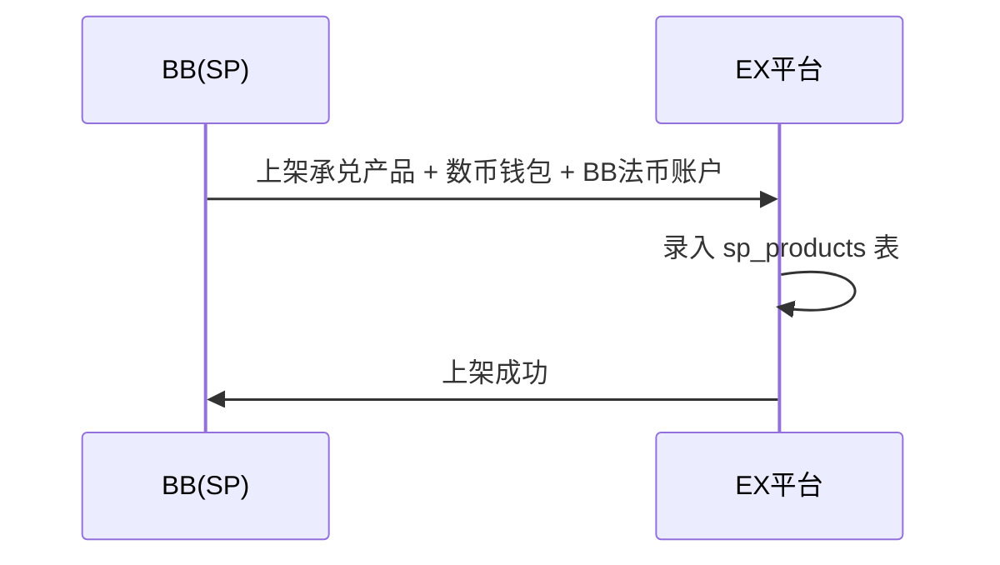
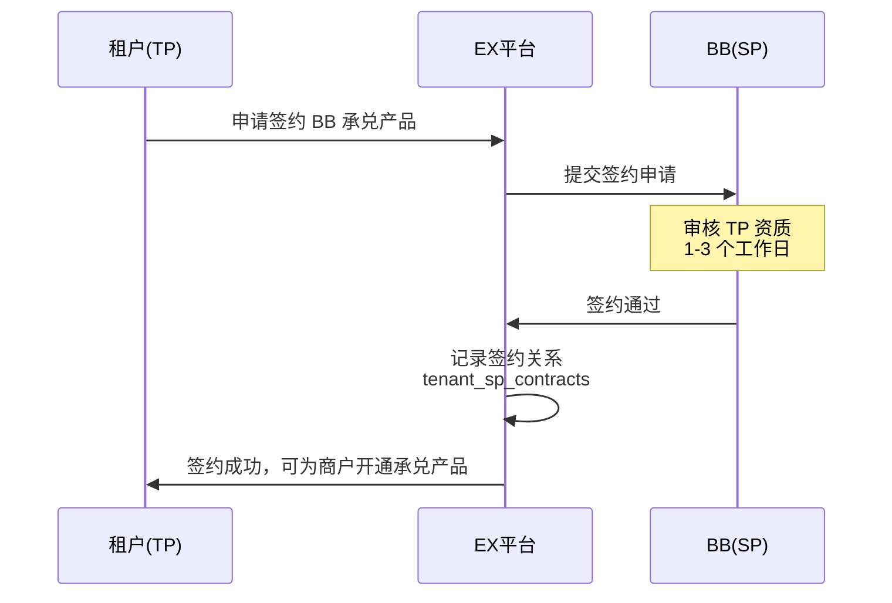
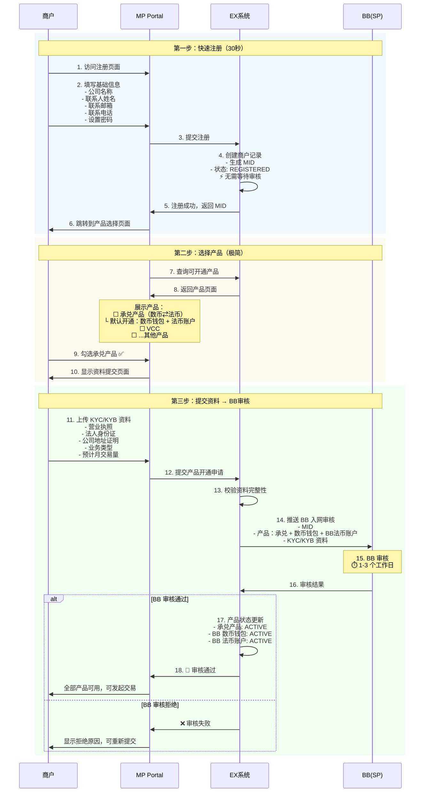
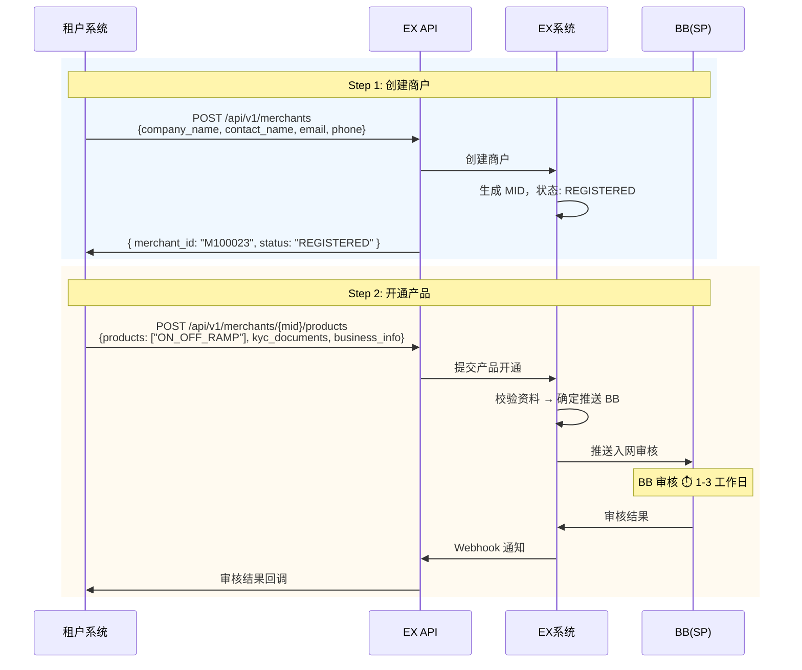
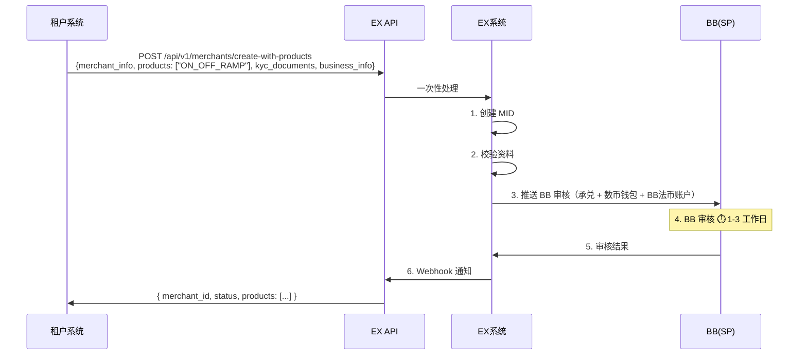
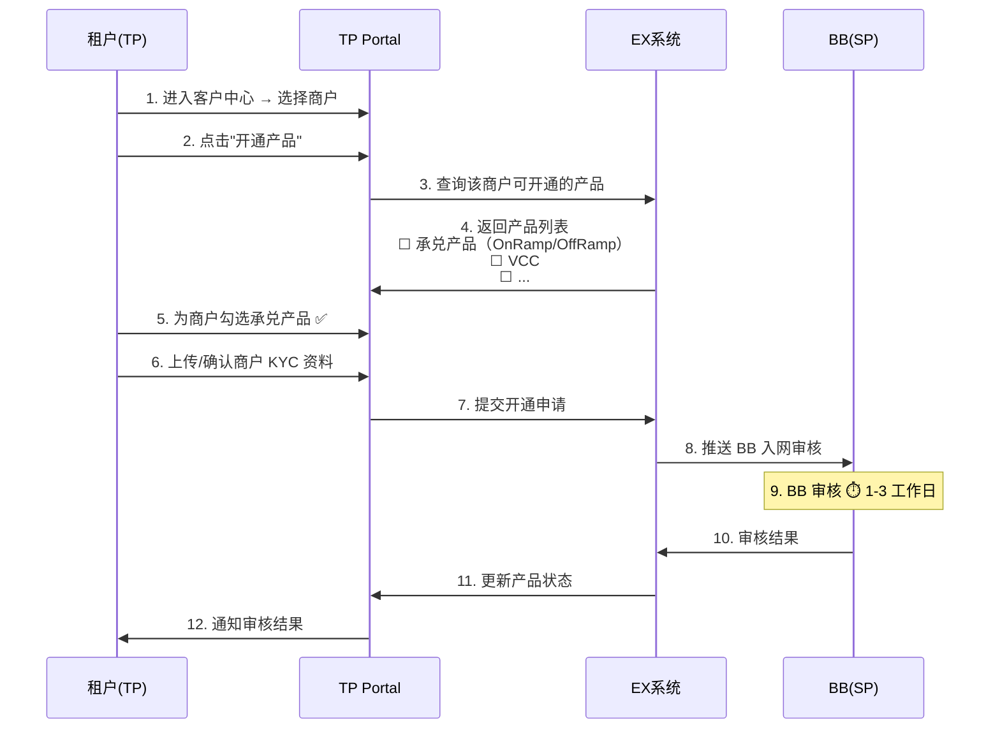
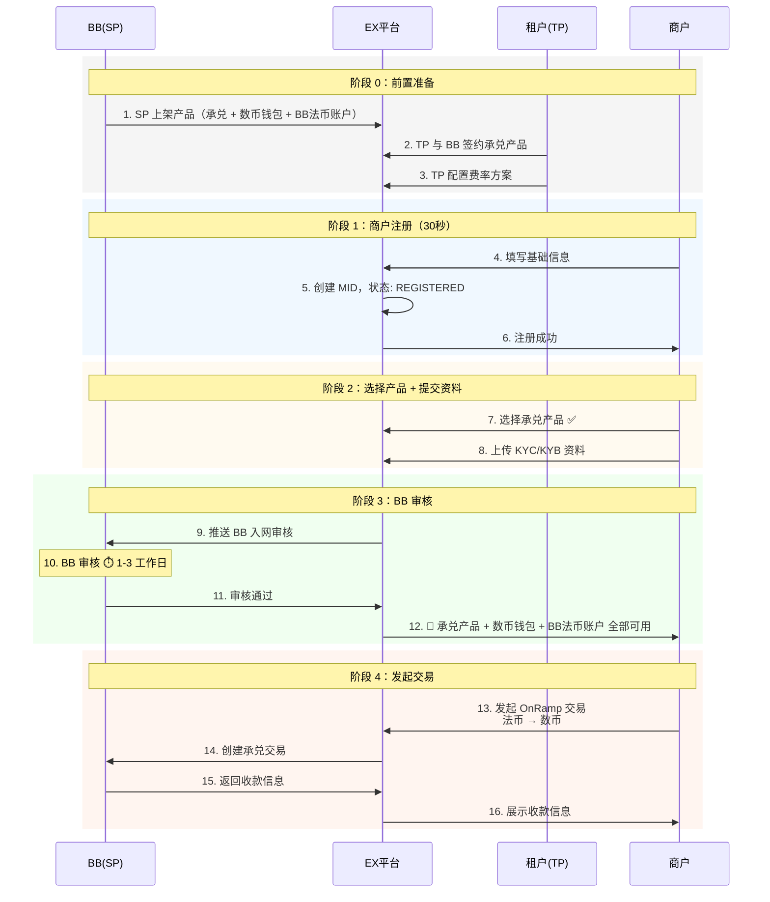
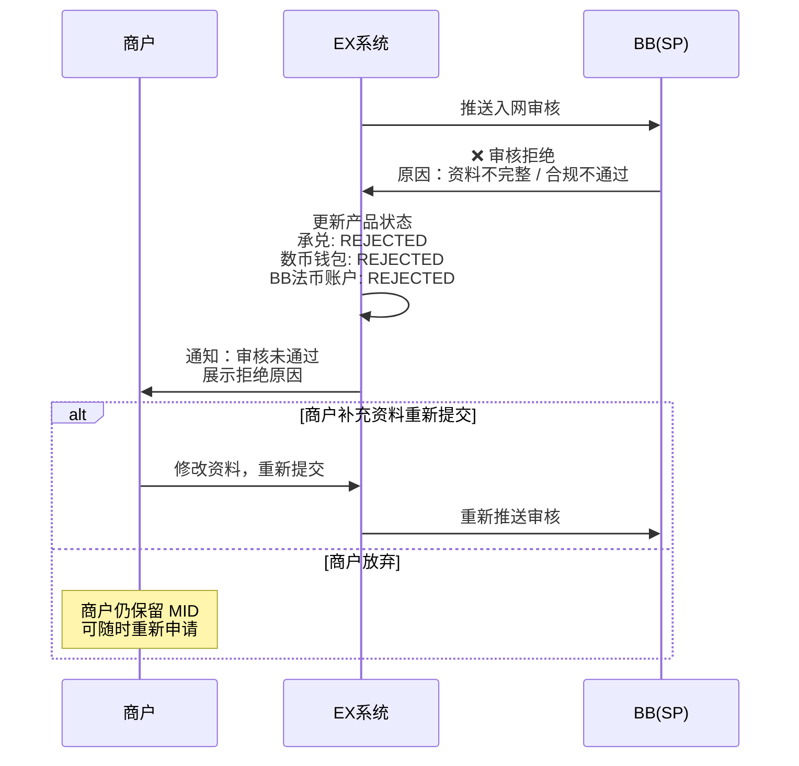
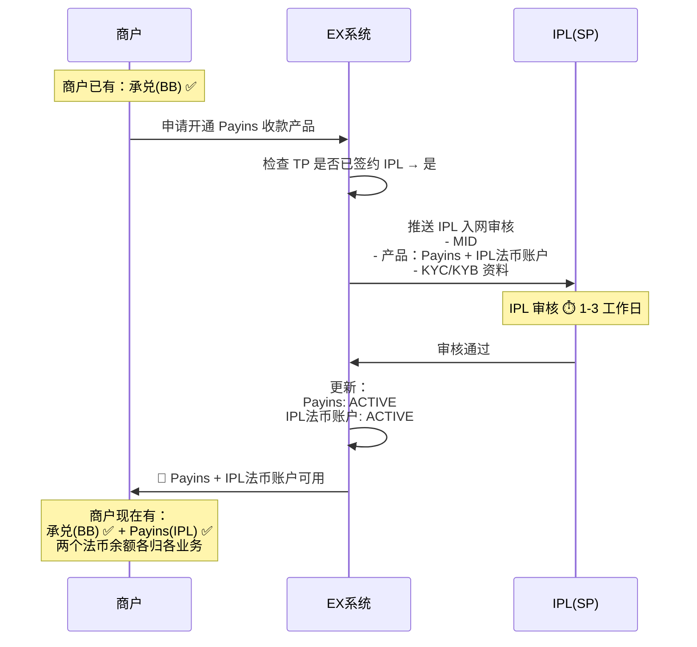

# 商户注册与产品开通流程（v2 — 单 SP 承兑策略）

> **版本说明**：本文档基于 **一期架构决策：承兑业务由 BB 单一承接**（详见 `onramp-complete.md` 3.1 章）重写。
> 与 `productionopening.md`（v1）的核心区别：**承兑业务不再涉及 IPL，产品开通流程大幅简化**。

---

## 核心设计原则

| 原则 | 说明 |
| ---- | ---- |
| **注册即 MID** | 注册立即创建 MID，无需 TP 审核 |
| **产品驱动** | 围绕"开通产品"组织流程，不是单纯入网 |
| **EX 不做合规** | 合规审核由 SP 负责，EX 是科技平台 |
| **商户不感知 SP** | 商户只看到产品名称，不知道底层是 BB |
| **承兑 = BB** | 承兑业务（OnRamp/OffRamp）一期固定由 BB 提供全部能力 |
| **一键开通** | 选择承兑产品 → BB 数币钱包 + BB 法币账户自动默认开通 → 只推送 BB 一家审核 |

---

## 一期产品目录与 SP 映射

### 产品三层分类

| 层级 | 产品 | SP | 开通方式 | 说明 |
| ---- | ---- | --- | -------- | ---- |
| **账户类** | BB 法币账户 | BB | 开通承兑时**默认开通** | 承兑资金入账 |
| **账户类** | BB 数币钱包 | BB | 开通承兑时**默认开通** | 承兑数币持有 |
| **账户类** | IPL 法币账户 | IPL | 独立开通（收付款业务） | 与承兑无关 |
| **收付类** | Payins 收款 | IPL / BB | 按签约 SP 开通 | 非同名收付 |
| **收付类** | Payouts 付款 | IPL / BB | 按签约 SP 开通 | 非同名收付 |
| **业务类** | OnRamp（法币→数币） | BB | **商户选择开通** | 承兑业务 |
| **业务类** | OffRamp（数币→法币） | BB | **商户选择开通** | 承兑业务 |
| **业务类** | VCC | BB | 商户选择开通 | 发卡消费 |

### 承兑产品开通规则（v1 vs v2 对比）

| 项目 | v1（旧） | v2（本文档） |
| ---- | -------- | ------------ |
| 承兑 SP | BB | BB（不变） |
| 承兑法币账户 | BB 或 IPL（商户可选） | **BB（固定，不可选）** |
| IPL 法币账户 | 承兑时可选开通 | **与承兑无关，独立开通** |
| 入网推送 | BB 固定推送 + IPL 看商户是否勾选 | **只推送 BB 一家** |
| 审核 | BB 审核 + IPL 审核（各自独立） | **只有 BB 审核** |
| 商户选择法币账户 | 三种模式（仅 BB / 仅 IPL / 都有） | **无需选择，固定 BB** |
| 交易路由 | 商户自选 BB or IPL 法币账户 | **无需路由，固定 BB** |

### 多 SP 共存规则

商户可以同时使用 BB 和 IPL，但**业务线隔离**：

| 业务线 | SP | 法币账户 | 开通方式 |
| ------ | --- | -------- | -------- |
| 承兑（OnRamp/OffRamp） | BB | BB 法币账户 | 开通承兑自动开通 |
| 法币收付款（Payins/Payouts） | IPL（如有签约） | IPL 法币账户 | 独立开通，与承兑流程解耦 |

- 两个业务线、两个 SP、两个法币账户，**互不交叉**
- 商户端标注业务上下文（"承兑余额" vs "收付款余额"）

---

## 前置条件

商户入网前需完成以下准备：

### 1. SP 产品上架

BB 需在 EX 平台上架以下产品：

| 产品 | 产品代码 | SP | 状态 |
| ---- | -------- | --- | ---- |
| 承兑产品（OnRamp/OffRamp） | `ON_OFF_RAMP` | BB | ACTIVE |
| 数币钱包 | `CRYPTO_WALLET` | BB | ACTIVE |
| BB 法币账户 | `FIAT_ACCOUNT_BB` | BB | ACTIVE |



### 2. TP 与 BB 签约

租户签约流程极简：**只需与 BB 签约承兑产品**，数币钱包和法币账户作为依赖产品自动绑定。



**签约数据示例：**

```json
{
  "tenant_id": 2001,
  "tenant_name": "鲲鹏科技",
  "sp_contracts": [
    {
      "sp_id": 1001,
      "sp_name": "BB",
      "products": ["ON_OFF_RAMP", "CRYPTO_WALLET", "FIAT_ACCOUNT_BB"],
      "contract_status": "ACTIVE",
      "signed_at": "2026-02-26T10:00:00Z"
    }
  ]
}
```

> **与 v1 的区别：** v1 中 TP 签约时需要选择"是否允许商户额外使用 IPL 法币账户"，配置三种法币账户模式（仅 BB / 仅 IPL / 都有）。v2 中承兑签约只涉及 BB，无需选择。
>
> 如果 TP 还需要 IPL 的法币收付款能力，那是**独立的签约流程**，与承兑产品开通无关。

### 3. TP 配置费率

TP 签约完成后，需为商户配置费率方案（标准费率 / 返点等）。

---

## 商户入网流程

### 1. 白牌模式（MP Portal）



> **与 v1 的区别：**
> - v1 第二步：商户需要选择"是否额外使用 IPL 法币账户" → v2 **无此选项**
> - v1 第三步：需要同时推送 BB + IPL 审核，等待双方结果 → v2 **只推送 BB 一家**
> - v1 有"BB 通过但 IPL 未通过"的中间状态 → v2 **不存在**

### 2. API 模式

#### 方式 1：分步调用（推荐）



#### 方式 2：一次性调用（便捷）



### 3. TP 后台为商户开通产品



---

## 入网推送规则

### 承兑产品推送

**极简规则：商户开通承兑 → 只推送 BB。**

```
商户开通承兑产品时：
  1. 承兑产品 + BB 数币钱包 + BB 法币账户 → 打包推送 BB 审核
  2. 没有其他 SP 参与
  3. BB 审核通过 → 全部可用
  4. BB 审核拒绝 → 全部不可用，显示拒绝原因

就这么简单。
```

### 与 v1 推送规则对比

| 规则 | v1 | v2 |
| ---- | --- | --- |
| BB 推送 | 固定推送 | 固定推送（不变） |
| IPL 推送 | 商户勾选了 IPL 法币账户才推送 | **不推送（承兑不涉及 IPL）** |
| 判断条件 | "商户是否选了 IPL 法币账户？" | **无条件判断** |
| 审核结果处理 | BB 和 IPL 独立，需处理交叉状态 | **只有 BB 一个结果** |

### 其他产品推送（非承兑）

如果商户还需要开通 IPL 的法币收付款产品，那是**独立的产品开通流程**：

```
商户开通 Payins/Payouts（IPL）：
  1. 商户选择开通 Payins/Payouts
  2. 推送 IPL 入网审核
  3. IPL 审核通过 → Payins/Payouts 可用 + IPL 法币账户开通
  4. 与承兑产品完全独立
```

---

## 端到端完整流程



---

## 异常流程

### BB 审核拒绝



### 商户已有承兑产品，追加开通 Payins（IPL）



---

## 状态机

### 商户状态

```
REGISTERED → 已注册，未开通任何产品
```

### 商户产品状态

```
             提交申请          审核通过
PENDING ────────────→ REVIEWING ──────────→ ACTIVE
                          │
                          │ 审核拒绝
                          ▼
                       REJECTED ──→ (补充资料) ──→ REVIEWING
```

| 状态 | 说明 |
| ---- | ---- |
| PENDING | 已提交开通申请，待推送 SP |
| REVIEWING | 已推送 SP，等待审核 |
| ACTIVE | SP 审核通过，产品可用 |
| REJECTED | SP 审核拒绝，可重新提交 |

---

## API 接口

### 1. 创建商户

```http
POST /api/v1/merchants

Request:
{
  "company_name": "ABC公司",
  "contact_name": "张三",
  "email": "zhang@abc.com",
  "phone": "+86138xxxx"
}

Response:
{
  "merchant_id": "M100023",
  "status": "REGISTERED",
  "created_at": "2026-02-26T10:00:00Z"
}
```

### 2. 开通产品

```http
POST /api/v1/merchants/{merchant_id}/products

Request:
{
  "products": ["ON_OFF_RAMP"],
  "kyc_documents": {
    "business_license": "https://...",
    "id_card": "https://..."
  },
  "business_info": {
    "business_type": "跨境电商",
    "monthly_volume": 50000,
    "main_countries": ["US", "SG"]
  }
}

Response:
{
  "status": "REVIEWING",
  "products": [
    {
      "product_code": "ON_OFF_RAMP",
      "sp": "BB",
      "status": "REVIEWING",
      "submitted_at": "2026-02-26T10:05:00Z"
    },
    {
      "product_code": "CRYPTO_WALLET",
      "sp": "BB",
      "status": "REVIEWING",
      "note": "随承兑产品默认开通"
    },
    {
      "product_code": "FIAT_ACCOUNT_BB",
      "sp": "BB",
      "status": "REVIEWING",
      "note": "随承兑产品默认开通"
    }
  ]
}
```

### 3. 查询商户产品状态

```http
GET /api/v1/merchants/{merchant_id}/products

Response:
{
  "merchant_id": "M100023",
  "products": [
    {
      "product_code": "ON_OFF_RAMP",
      "product_name": "承兑产品",
      "sp": "BB",
      "status": "ACTIVE",
      "approved_at": "2026-02-26T14:00:00Z"
    },
    {
      "product_code": "CRYPTO_WALLET",
      "product_name": "数币钱包",
      "sp": "BB",
      "status": "ACTIVE"
    },
    {
      "product_code": "FIAT_ACCOUNT_BB",
      "product_name": "BB法币账户",
      "sp": "BB",
      "status": "ACTIVE"
    }
  ]
}
```

### 4. Webhook：审核结果回调

```http
POST {tenant_webhook_url}

{
  "event": "merchant.product.status_changed",
  "merchant_id": "M100023",
  "product_code": "ON_OFF_RAMP",
  "sp": "BB",
  "old_status": "REVIEWING",
  "new_status": "ACTIVE",
  "timestamp": "2026-02-26T14:00:00Z"
}
```

---

## 总结

### v2 简化了什么

| 简化项 | v1 复杂度 | v2 |
| ------ | --------- | --- |
| TP 签约 | 需选择"是否允许商户用 IPL 法币账户"，配置三种模式 | **只签 BB，无选项** |
| 商户选产品 | 需选择"是否额外使用 IPL 法币账户" | **无此选项** |
| 入网推送 | BB 固定推送 + IPL 条件推送 | **只推送 BB** |
| 审核等待 | BB + IPL 双审核，各自独立，有交叉状态 | **只等 BB 一家** |
| 交易路由 | 商户自选 BB or IPL 法币账户 | **固定 BB，无需选择** |
| 状态管理 | BB 产品状态 + IPL 产品状态，需处理一通一不通 | **一个审核结果** |

### 关键流程

```
前置：SP上架 → TP签约BB → TP配费率
入网：商户注册(30秒) → 选承兑产品 → 提交资料 → BB审核 → 全部可用
交易：直接发起，无需选择法币账户/路由
```

### IPL 的位置

IPL 不参与承兑流程。如果商户需要 IPL 的法币收付款能力（Payins/Payouts），那是**独立的产品开通**，走 IPL 自己的签约和审核流程，与承兑产品互不干扰。

---

*最后更新：2026-02-26*
*文档版本：v2.0 — 基于单 SP 承兑策略重写*
