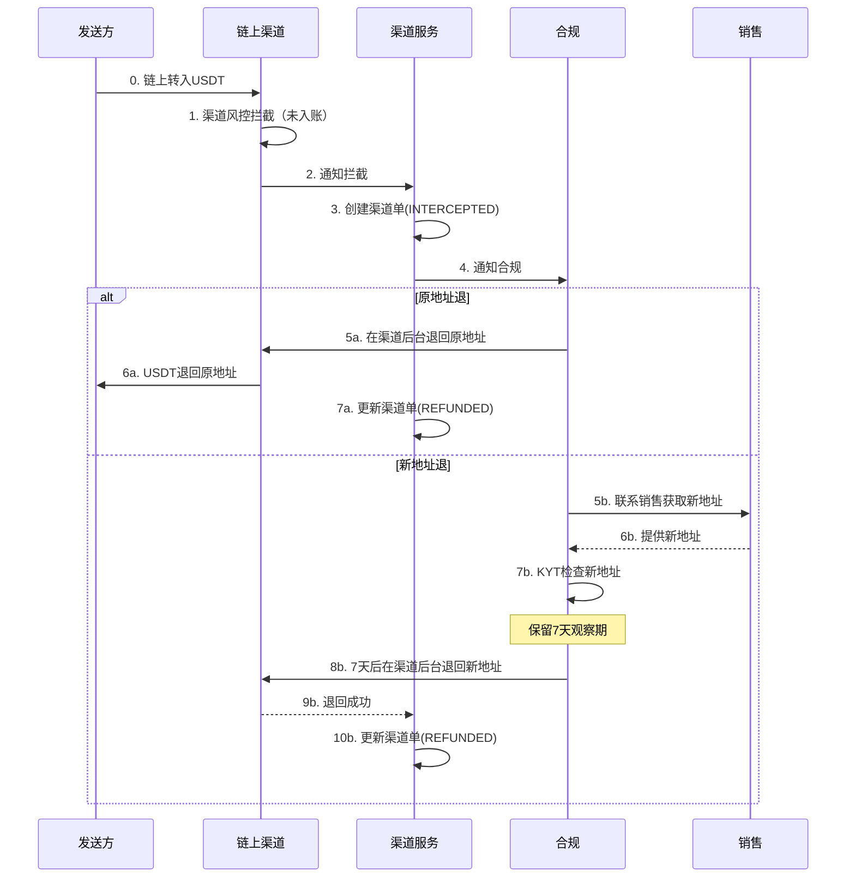
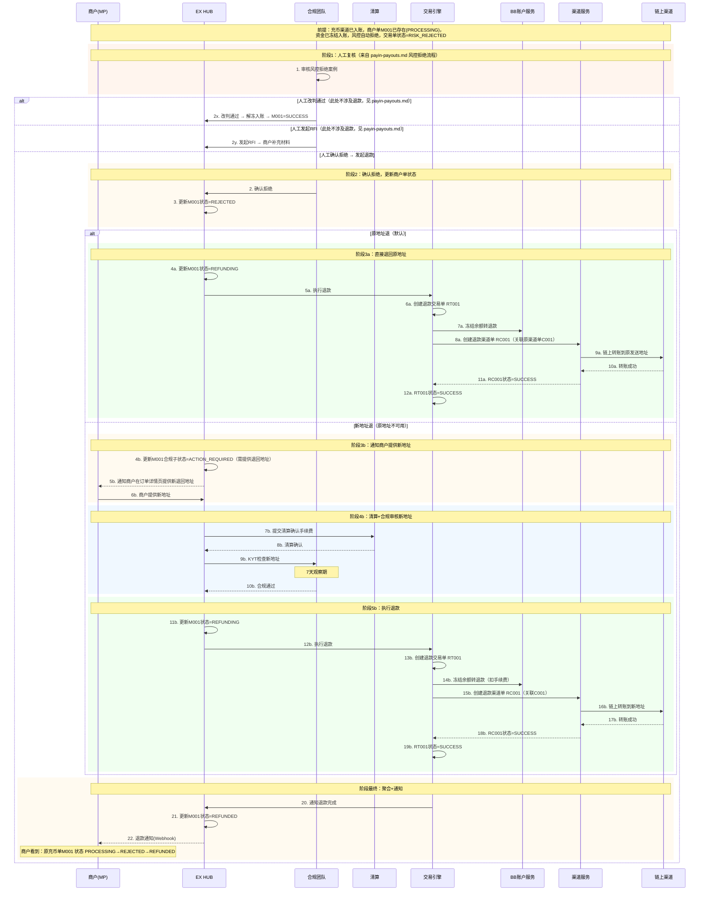
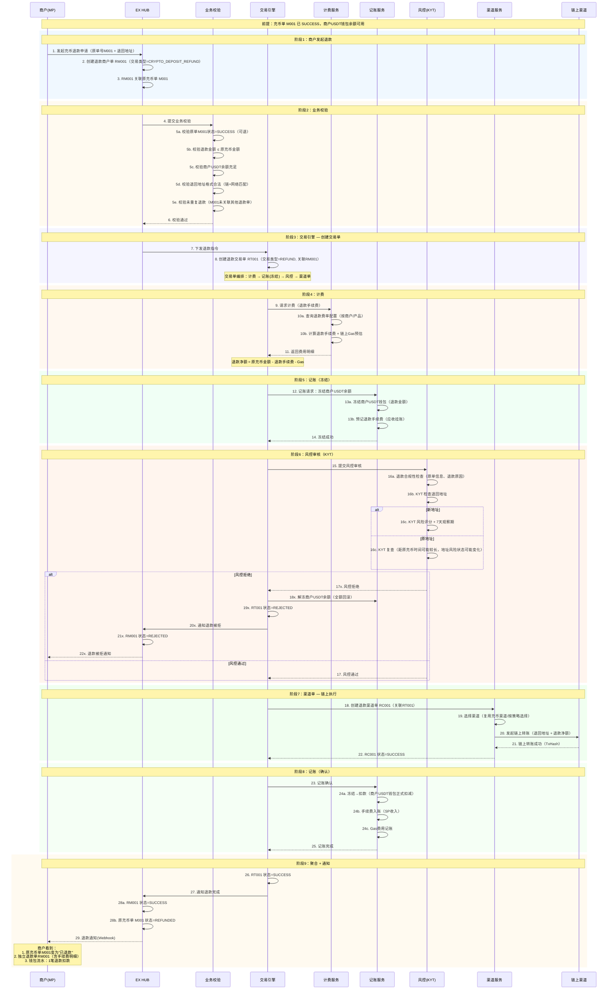
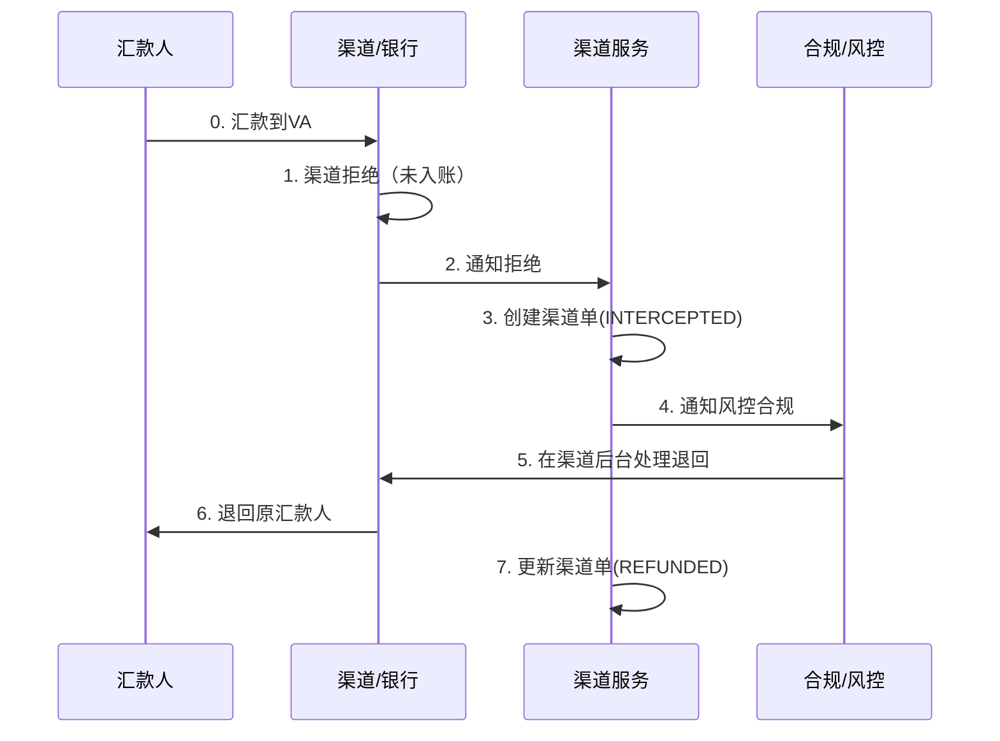
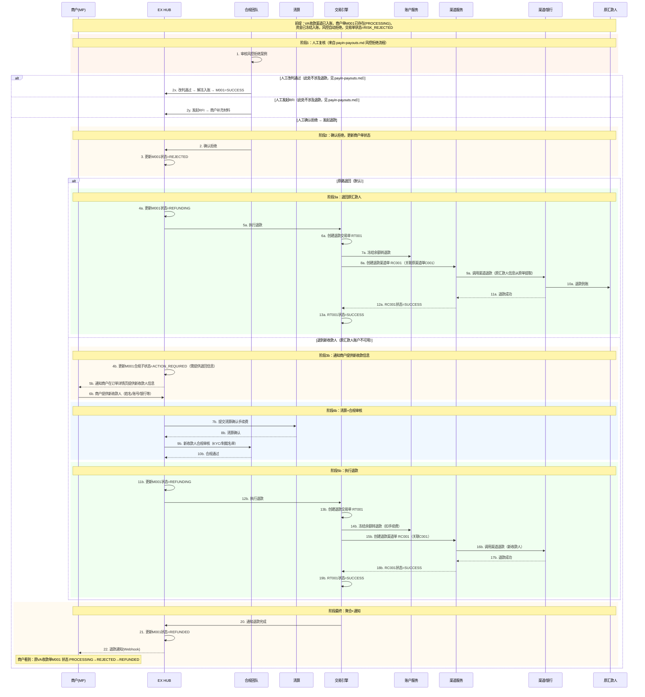
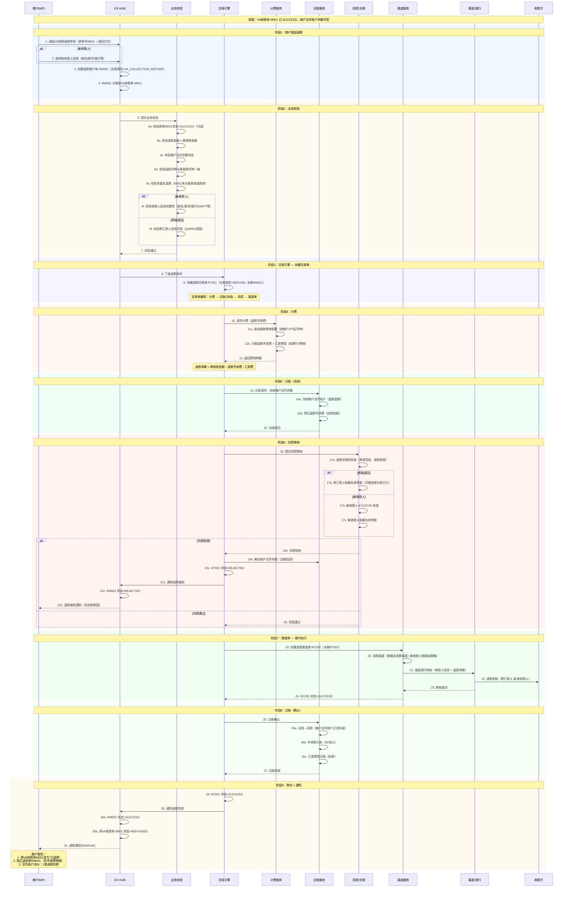
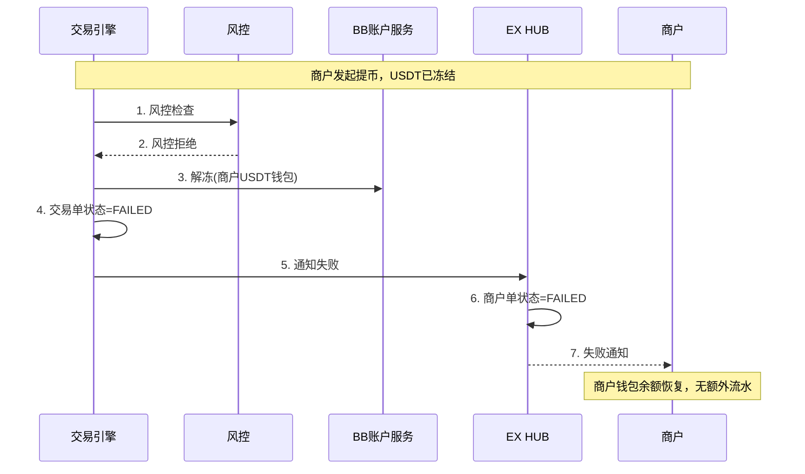
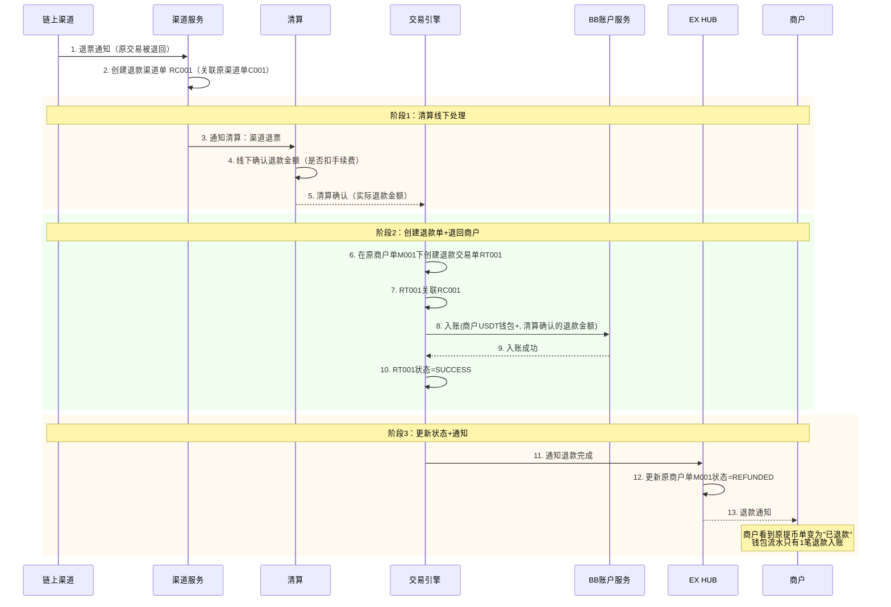
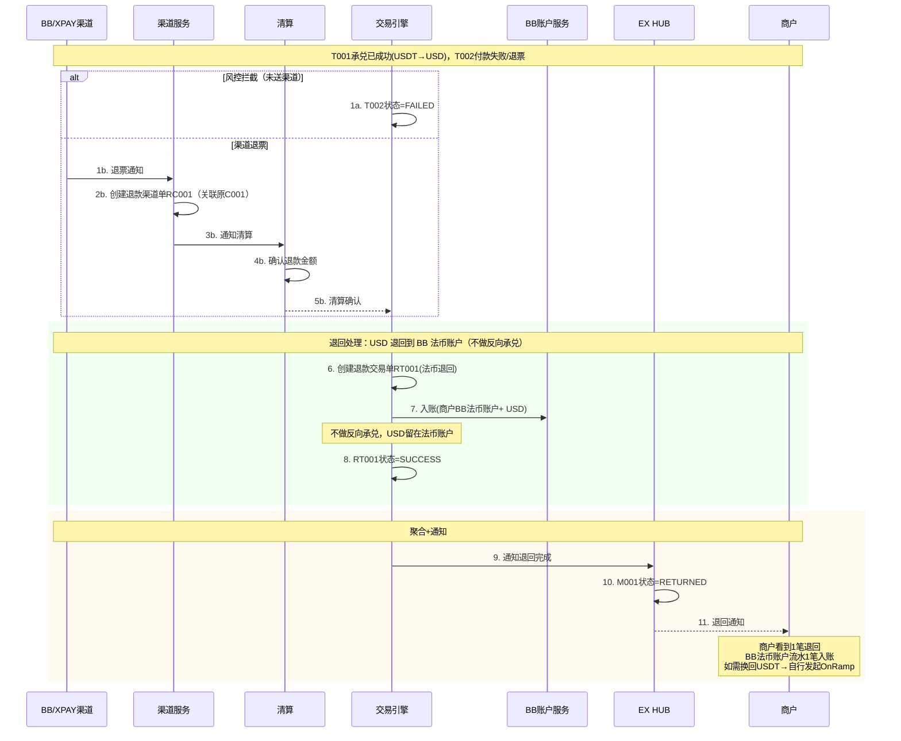
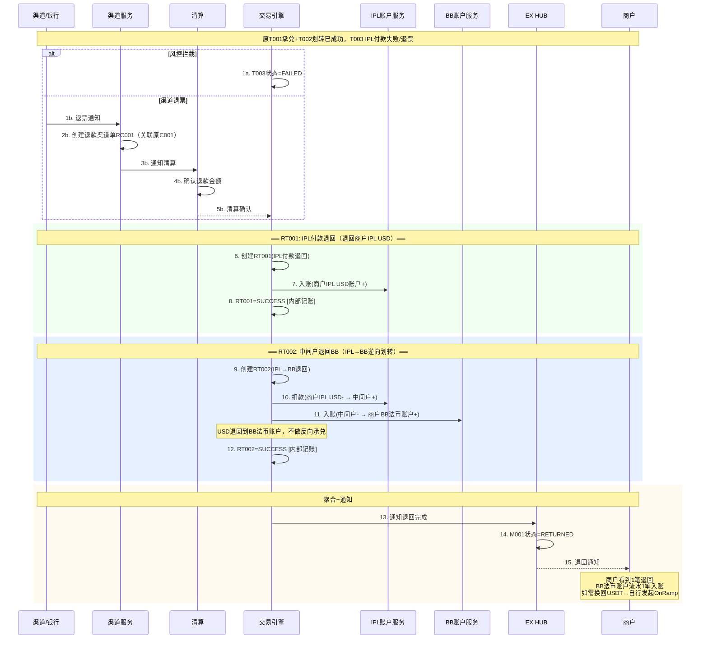

# 退款与退回流程 v4.0

## 文档概述

本文档描述EX平台所有退款和退回场景的详细流程。

**命名规范：**

| 术语 | 英文 | 定义 | 触发时机 |
|------|------|------|----------|
| **退回**（Return） | Return | 付款/划转失败，资金原路退回 | 交易失败后系统自动或清算确认 |
| **退款**（Refund） | Refund | 付款/划转已成功，事后商户主动发起退款 | 交易成功后商户申请 |

**核心设计原则：**

- **商户端一致性**：商户只看到1笔退款/退回商户单 + 1笔账户/钱包流水，内部多笔交易单是内部记账，商户不可见
- **退票 = 新渠道单**：渠道退票时生成一笔新的退款渠道单，关联原渠道单（原渠道单状态已结束）
- **清算先行**：涉及手续费退还的退款，先由清算处理完再执行退款
- **承兑退回不做反向承兑**：承兑后付款失败退回到法币账户（不退回数币钱包），商户如需换回数币自行发起 OnRamp；默认付款手续费不退

**承兑退回规则（方案A：统一退回法币账户）：**

```
承兑退回规则（Off-Ramp退回：原交易 USDT→USD，付款失败需退回）：

规则：统一退回到 BB 法币账户，不做反向承兑。

原因：
  1. 承兑 = 市场交易，一旦执行完成不可逆（业界标准）
  2. 反向承兑存在汇率风险（谁承担差价？）和套利风险
  3. 如做反向承兑退回数币，等于客户被收了两次承兑手续费（原承兑+反向承兑），不合理
  4. 退到法币账户最简单，无汇率争议，无额外手续费

退回后：
  - USD 留在商户 BB 法币账户
  - 商户如需换回 USDT，自行发起 OnRamp（新交易，正常收费）
  - 原承兑手续费不退（承兑服务已提供）
  - 默认付款手续费不退（特殊情况走清算流程）
```

---

## 目录

1. [充币退回](#1-充币退回)
   - 1.1 [渠道拦截未入账](#11-渠道拦截未入账)
   - 1.2 [渠道已入账，风控拦截未给商户入账](#12-渠道已入账风控拦截未给商户入账)
   - 1.3 [商户充币成功后退款](#13-商户充币成功后退款)
2. [VA收款退回](#2-va收款退回)
   - 2.1 [渠道直接拒绝](#21-渠道直接拒绝)
   - 2.2 [渠道已通知，内部风控拦截](#22-渠道已通知内部风控拦截)
   - 2.3 [VA收款成功后退款](#23-va收款成功后退款)
3. [提币失败退回](#3-提币失败退回)
   - 3.1 [内部风控拦截](#31-内部风控拦截)
   - 3.2 [渠道退票](#32-渠道退票)
4. [法币付款失败退回](#4-法币付款失败退回)
   - 4.1 [内部风控拦截](#41-内部风控拦截)
   - 4.2 [渠道退票](#42-渠道退票)
5. [承兑后付款失败退回](#5-承兑后付款失败退回)
   - 5.1 [BB数币钱包直接Off-Ramp退回（场景A1）](#51-bb数币钱包直接off-ramp退回场景a1)
   - 5.2 [BB先承兑到法币账户再出款退回（场景A1）](#52-bb先承兑到法币账户再出款退回场景a1)
   - 5.3 [XPAY渠道（同BB）](#53-xpay渠道同bb)
   - 5.4 [☐ Phase 2：IPL-BB打通模式Off-Ramp退回（场景A2/B2）](#54-phase-2ipl-bb打通模式off-ramp退回场景a2b2)
   - 5.5 [☐ Phase 2：IPL-BB打通模式承兑后出款退回（场景A2/B2）](#55-phase-2ipl-bb打通模式承兑后出款退回场景a2b2)
6. [退款汇总表](#6-退款汇总表)
7. [跨SP划转退回与退款](#7-跨sp划转退回与退款)
   - 7.1 [划转失败退回](#71-划转失败退回)
   - 7.2 [划转成功后退款](#72-划转成功后退款)

---

## 1. 充币退款

### 1.1 渠道拦截未入账

**场景：** 链上充币时，渠道风控拦截，币未入到商户账户。

**处理方式：** 合规收到邮件，直接在渠道后台操作退回。

**两种退回方式：**

| 退回方式           | 流程                         | 要求                      | 时效 |
| ------------------ | ---------------------------- | ------------------------- | ---- |
| **原地址退** | 合规在渠道后台直接退回原地址 | 无额外要求                | 当天 |
| **新地址退** | 销售联系商户提供新地址       | 需KYT检查 + 保留7天观察期 | 7天  |

**单据：** 无商户单/交易单产生（渠道层直接退回，仅有渠道单记录）



---

### 1.2 渠道已入账，风控拦截（v2.1）

> **v2.1 变化：** 按照 payin-payouts.md v2.1，商户单在风控之前已创建（PROCESSING）。
> 风控拦截时商户单已存在，退款在原商户单上流转，不再另建退款商户单。

**场景：** 渠道已入账（产生渠道单），商户单已存在（PROCESSING），资金已冻结入账。内部风控拦截后经人工复核确认拒绝，发起退款。

**处理方式：** 人工复核确认拒绝 → 原商户单状态变为 REJECTED→REFUNDING→REFUNDED → 退回原地址。

**退回方式：**

| 退回方式 | 流程 | 收费 | 时效 |
|---------|------|------|------|
| **原地址退（默认）** | 人工确认拒绝后自动退回原发送地址 | 不收费 | 人工复核周期 + 链上确认 |
| **新地址退（特殊情况）** | 原地址不可用时，人工通知商户在订单详情页提供新地址 | 清算确认手续费 | 人工复核 + KYT检查 + 7天观察期 |

**单据结构：**

```
原充币商户单 M001 ← 商户可见，状态流转：PROCESSING → REJECTED → REFUNDING → REFUNDED
    ├── 原交易单 T001 (BB): 充币 — 状态=RISK_REJECTED → REJECTED
    │       └── 原渠道单 C001: 链上入账 — 状态=SUCCESS（不变）
    │
    └── 退款交易单 RT001 (BB): 退币 — 退回到原地址/新地址
            └── 退款渠道单 RC001: 链上转账退回（新单，关联C001）
```



**说明：**

- **不再另建退款商户单**：退款在原商户单 M001 上流转（REJECTED→REFUNDING→REFUNDED），商户看到的是同一笔单
- **退款交易单挂在原商户单下**：RT001 作为 M001 的退款交易单，关联原交易单 T001
- **默认原地址退**：人工确认拒绝后直接退回原发送地址，无需商户操作
- **新地址退仅限特殊情况**：原地址不可用时（如地址已列入黑名单），通过订单详情页让商户提供新地址
- **与 payin-payouts.md v2.1 衔接**：人工复核环节（阶段1）来自 payin-payouts.md 4.4 充币流程的风控拒绝分支

---

### 1.3 充币成功后退款（商户主动发起）

**交易类型：** `CRYPTO_DEPOSIT_REFUND`（独立交易类型，非普通提币）

**场景：** 链上充币已成功入账到商户数币钱包，事后因合规/客诉/误充等原因，商户主动发起退款。

**前提：** 商户钱包已入账，余额可用。退款需扣减商户余额，涉及额外手续费。

**退款方式：**

| 退款方式 | 退回目标 | 风控要求 | 收费 |
| --- | --- | --- | --- |
| **原地址退** | 原充币发送地址 | KYT 复查原地址 | 退款手续费（可能为0） |
| **新地址退** | 商户指定新链上地址 | KYT 检查新地址 + 7天观察期 | 退款手续费 + 链上Gas |

**单据结构：**

```
退款商户单 RM001 (CRYPTO_DEPOSIT_REFUND) ← 商户可见，关联原充币单 M001
    └── 退款交易单 RT001 (BB): 退款提币
            └── 退款渠道单 RC001: 链上转账退回（新单）

原充币商户单 M001 — 状态 SUCCESS → REFUNDED（不产生新交易单，仅状态变更）
```

**完整业务链路：**



**关键设计说明：**

| 设计点 | 说明 |
| --- | --- |
| **独立交易类型** | `CRYPTO_DEPOSIT_REFUND`，不是普通提币，有独立的计费规则和业务校验 |
| **计费独立** | 退款手续费独立于提币手续费，可单独配置费率（可以为0） |
| **记账两阶段** | 冻结（风控前）→ 确认扣款（渠道成功后），失败则解冻回滚 |
| **风控必过** | 原地址KYT复查 + 新地址KYT检查+7天观察期 |
| **渠道单独立** | RC001 是新渠道单，不修改原充币渠道单 |
| **原单状态联动** | M001 状态由 SUCCESS → REFUNDED，但原交易单T001不变 |

**与 1.2（风控拦截退回）的区别：**

| 对比项 | 1.2 风控拦截退回（v2.1） | 1.3 成功后退款 |
| --- | --- | --- |
| 触发时机 | 风控拦截（商户单已存在PROCESSING） | 充币成功入账后 |
| 发起方 | 人工复核确认拒绝后系统自动发起 | **商户主动发起** |
| 交易类型 | 退款交易单（挂在原商户单下） | **CRYPTO_DEPOSIT_REFUND（独立交易类型）** |
| 计费 | 原地址不收费 / 新地址清算确认 | **独立退款费率，额外收手续费** |
| 记账 | 冻结余额转退款（一步） | **冻结→风控→渠道→确认扣款（两阶段）** |
| 风控 | 新地址需 KYT | **原地址和新地址都需KYT** |
| 商户单 | 原单 M001 状态流转：PROCESSING→REJECTED→REFUNDED | **原单 M001=REFUNDED + 独立退款单 RM001** |

---

## 2. VA收款退款

### 2.1 渠道直接拒绝

**场景：** VA收款时渠道直接拒绝，未入账。

**处理方式：** 通知风控合规，风控直接在渠道处理。

**单据：** 仅渠道单(INTERCEPTED)，无商户单/交易单。



---

### 2.2 渠道已通知，内部风控拦截（v2.1）

> **v2.1 变化：** 按照 payin-payouts.md v2.1，商户单在风控之前已创建（PROCESSING）。
> 风控拦截时商户单已存在，退款在原商户单上流转，不再另建退款商户单。

**场景：** 渠道通知入账（产生渠道单），商户单已存在（PROCESSING），资金已冻结入账。内部风控拦截后经人工复核确认拒绝，发起退款。

**处理方式：** 人工复核确认拒绝 → 原商户单状态变为 REJECTED→REFUNDING→REFUNDED → 退回原汇款人。

**退回方式：**

| 退回方式 | 流程 | 收费 | 时效 |
|---------|------|------|------|
| **原路退回（默认）** | 人工确认拒绝后退回原汇款人原账户 | 不收费 | 人工复核周期 + 渠道处理 |
| **退到新收款人（特殊情况）** | 原汇款人账户不可用时，通知商户在订单详情页提供新收款信息 | 清算确认手续费 | 人工复核 + 合规审核 |

**单据结构：**

```
原VA收款商户单 M001 ← 商户可见，状态流转：PROCESSING → REJECTED → REFUNDING → REFUNDED
    ├── 原交易单 T001: VA收款 — 状态=RISK_REJECTED → REJECTED
    │       └── 原渠道单 C001 — 状态=SUCCESS（不变）
    │
    └── 退款交易单 RT001: 退款付款 — 退回原汇款人/新收款人
            └── 退款渠道单 RC001: 银行转账退回（新单，关联C001）
```



**说明：**

- **不再另建退款商户单**：退款在原商户单 M001 上流转（REJECTED→REFUNDING→REFUNDED），商户看到的是同一笔单
- **退款交易单挂在原商户单下**：RT001 作为 M001 的退款交易单
- **默认原路退回**：人工确认拒绝后退回原汇款人原账户，无需商户操作
- **新收款人退仅限特殊情况**：原汇款人账户不可用时，通过订单详情页让商户提供新收款人信息
- **与 payin-payouts.md v2.1 衔接**：人工复核环节来自 payin-payouts.md 4.2 VA收款流程的风控拒绝分支

---

### 2.3 VA收款成功后退款（商户主动发起）

**交易类型：** `VA_COLLECTION_REFUND`（独立交易类型，非普通付款）

**场景：** VA 收款已成功入账到商户法币账户，事后因合规/客诉/误汇/汇款人要求等原因，商户主动发起退款。

**前提：** 商户法币账户已入账，余额可用。退款需扣减商户余额，涉及额外手续费。

**退款方式：**

| 退款方式 | 退回目标 | 风控要求 | 收费 |
| --- | --- | --- | --- |
| **原路退回** | 原汇款人的原汇款账户 | 合规审核 + 制裁名单筛查 | 退款手续费（可能为0） |
| **新收款人退回** | 商户指定的新收款人 | 合规审核 + 收款人 KYC/KYB 检查 | 退款手续费 + 汇款费 |

**单据结构：**

```
退款商户单 RM001 (VA_COLLECTION_REFUND) ← 商户可见，关联原VA收款单 M001
    └── 退款交易单 RT001: 退款付款
            └── 退款渠道单 RC001: 银行转账退回（新单）

原VA收款商户单 M001 — 状态 SUCCESS → REFUNDED（不产生新交易单，仅状态变更）
```

**完整业务链路：**



**关键设计说明：**

| 设计点 | 说明 |
| --- | --- |
| **独立交易类型** | `VA_COLLECTION_REFUND`，不是普通付款，有独立的计费规则和业务校验 |
| **计费独立** | 退款手续费独立于付款手续费，可单独配置费率（可以为0） |
| **记账两阶段** | 冻结（风控前）→ 确认扣款（渠道成功后），失败则解冻回滚 |
| **风控必过** | 原路退回：原汇款人制裁名单复查；新收款人：KYC/KYB + 制裁名单筛查 |
| **渠道单独立** | RC001 是新渠道单，不修改原VA收款渠道单 |
| **原单状态联动** | M001 状态由 SUCCESS → REFUNDED，但原交易单T001不变 |
| **原路退回优先** | 建议默认原路退回，新收款人退回需额外审批层级 |

**与 2.2（风控拦截退回）的区别：**

| 对比项 | 2.2 风控拦截退回（v2.1） | 2.3 成功后退款 |
| --- | --- | --- |
| 触发时机 | 风控拦截（商户单已存在PROCESSING） | 入账成功后 |
| 发起方 | 人工复核确认拒绝后系统自动发起 | **商户主动发起** |
| 交易类型 | 退款交易单（挂在原商户单下） | **VA_COLLECTION_REFUND（独立交易类型）** |
| 计费 | 原路不收费 / 新收款人清算确认 | **独立退款费率，额外收手续费** |
| 记账 | 冻结余额转退款（一步） | **冻结→风控→渠道→确认扣款（两阶段）** |
| 风控 | 新收款人需合规审核 | **合规审核 + 制裁名单筛查 + 新收款人KYC/KYB** |
| 商户单 | 原单 M001 状态流转：PROCESSING→REJECTED→REFUNDED | **原单 M001=REFUNDED + 独立退款单 RM001** |

---

## 3. 提币失败退款

### 3.1 内部风控拦截

**场景：** 提币时内部风控拦截，未送到渠道。

**处理方式：** 直接退回商户数币钱包（解冻）。

**收费：** 不收费。



---

### 3.2 渠道退票

**场景：** 提币已送到渠道，渠道处理后退回（退票）。

**处理方式：**

1. 渠道发退票通知 → 生成**新的退款渠道单**（关联原渠道单）
2. 通知清算 → 清算线下确认退款金额（可能扣手续费）
3. 清算处理完 → 在原商户单下创建退款交易单 → 退回商户数币钱包

**单据层级：**

```
原商户单 M001 (提币)
    ├── 原交易单 T001 (BB): 提币 — 状态=SUCCESS（已完成）
    │       └── 原渠道单 C001: 链上转账 — 状态=SUCCESS（已完成）
    │
    └── 退款交易单 RT001 (BB): 退票退回 — 退回商户钱包
            └── 退款渠道单 RC001: 退票入账（新单，关联C001）
```



**说明：**

- **退款渠道单是新单**：RC001是新创建的，关联原渠道单C001，原C001状态不变（已SUCCESS）
- **退款交易单挂在原商户单下**：商户看到的是原提币商户单状态变为REFUNDED
- **清算先行**：清算线下确认退款金额后才执行退回
- **商户只看到1笔流水**：钱包流水只有1笔退款入账

---

## 4. 法币付款失败退款

> 参考提币流程，逻辑相同。

### 4.1 内部风控拦截

**场景：** 法币付款时内部风控拦截，未送到渠道。

**处理方式：** 直接退回商户法币账户（解冻）。不收费。

流程与 [3.1 提币风控拦截](#31-内部风控拦截) 相同，区别：退回到法币账户而非数币钱包。

---

### 4.2 渠道退票

**场景：** 付款已送到渠道，渠道退票（银行拒绝/退汇等）。

**处理方式：** 与 [3.2 提币渠道退票](#32-渠道退票) 相同：

1. 渠道退票通知 → 生成**新的退款渠道单**（关联原渠道单）
2. 通知清算 → 清算线下确认退款金额
3. 在原商户单下创建退款交易单 → 退回商户法币账户

**单据层级：**

```
原商户单 M001 (付款)
    ├── 原交易单 T001: 付款 — 状态=SUCCESS
    │       └── 原渠道单 C001 — 状态=SUCCESS
    │
    └── 退款交易单 RT001: 退票退回 — 退回商户法币账户
            └── 退款渠道单 RC001（新单，关联C001）
```

---

## 5. 承兑后付款失败退回

> 商户先做了承兑（数币→法币），然后付款失败，需要退回。
>
> **核心规则：统一退回到法币账户，不做反向承兑。** 承兑是市场交易，一旦执行完成不可逆。如做反向承兑退回数币，客户会被收两次承兑手续费（原承兑+反向承兑），不合理。商户如需换回数币，自行发起 OnRamp。
>
> **本期范围（Phase 1）：** 仅 A1 + B1 场景（纯 BB 内部承兑），5.4/5.5 跨 SP 场景推迟到 Phase 2。

**通用规则：**

| 规则 | 说明 |
| ---- | ---- |
| **退回目标** | 统一退回到 BB 法币账户（不做反向承兑） |
| **原承兑手续费** | 不退（承兑服务已提供） |
| **付款手续费** | 默认不退（特殊情况走清算流程） |
| **商户换回数币** | 自行发起 OnRamp（新交易，正常收费） |
| **不做反向承兑原因** | ①业界标准 ②避免汇率风险 ③避免客户被收两次承兑费 ④避免套利 |

---

### 5.1 BB数币钱包直接Off-Ramp退回（场景A1）

**场景：** 商户从BB数币钱包直接Off-Ramp（offramp-v1.md 场景A1），承兑USDT→USD后通过BB/XPAY付款，**付款失败需退回**。

**退回目标：** 退回到 BB 法币账户（不做反向承兑）。

**说明：** 虽然原始交易是从数币钱包发起的"一步到位"OffRamp（USDT→USD→付款），但承兑步骤已成功完成（USDT已换成USD）。付款失败时，USD 退回到 BB 法币账户即可。商户如需换回 USDT，自行发起 OnRamp。

**单据结构：**

```
原商户单 M001 (Off-Ramp: USDT→USD→付款)
    ├── 原交易单 T001 (BB): 承兑 USDT→USD — SUCCESS
    ├── 原交易单 T002 (BB): 付款 — FAILED/退票
    │       └── 原渠道单 C001 — SUCCESS→退票
    │
    └── 退款交易单 RT001 (BB): 退回法币账户 — USD 退回到商户 BB 法币账户
            └── 退款渠道单 RC001（如退票场景，新单关联C001）

商户可见：原商户单M001状态=RETURNED，法币账户流水1笔退回入账
```



**说明：**

- **商户只看到1笔退回**：M001状态变为RETURNED，BB法币账户流水1笔入账
- **不做反向承兑**：承兑已完成（USDT→USD），付款失败只退付款部分的USD到法币账户
- **原承兑手续费不退**：承兑服务已提供
- **默认付款手续费不退**：如需退回，走清算特殊流程
- **商户换回数币**：自行发起 OnRamp（新交易，正常收费）

---

### 5.2 BB先承兑到法币账户再出款退回（场景A1）

**场景：** 商户先做了BB承兑（offramp-v1.md 场景A1，USDT→USD到BB法币账户），然后从法币账户发起付款，**付款失败需退回**。

**退回目标：** 退回到BB法币账户（不做反向承兑）。

**原因：** 承兑和付款是两个独立的商户单，付款失败只退付款部分，退回法币账户即可。商户如需换回数币，自行发起On-Ramp。

**单据结构：**

```
原付款商户单 M002 (付款: USD→收款人)  ← 与承兑商户单M001无关
    ├── 原交易单 T001: 付款 — FAILED/退票
    │       └── 原渠道单 C001
    │
    └── 退款交易单 RT001: 退回法币账户
            └── 退款渠道单 RC001（如退票，新单关联C001）
```

**处理方式：** 与 [4. 付款失败退款](#4-付款失败退款) 完全相同，退回到BB法币账户。

- **默认付款手续费不退**，特殊情况走清算流程
- 商户如需换回USDT，自行发起On-Ramp

---

### 5.3 XPAY渠道（同BB）

**说明：** XPAY是BB的下发通道之一，与BB自己的通道逻辑完全相同。

- BB有2个下发通道：BB自己 + XPAY
- 退回流程与 5.1 / 5.2 完全一致
- 区别仅在渠道单调用的是XPAY渠道

---

### 5.4 ☐ Phase 2：IPL-BB打通模式Off-Ramp退回（场景A2/B2）

> **本期不实现。** A2/B2 跨 SP 场景推迟到 Phase 2。

**场景：** 商户从BB数币钱包直接Off-Ramp通过IPL付款（offramp-v1.md 场景A2），IPL付款失败，需退回。

**退回目标：** 退回到 BB 法币账户（不做反向承兑）。资金通过中间户逆向流回 BB。

```
原交易资金流（正向）：
BB USDT钱包 → BB承兑法币 → 中间户 → 商户IPL USD → 外部收款人
  (T001承兑)    (T002划转)              (T003付款: 失败)

退回资金流（逆向）：
商户IPL USD → 中间户 → BB法币账户（退回终点，不做反向承兑）
(RT001: IPL退回)  (RT002: IPL→BB退回)
```

**单据结构（商户只看到1笔退回）：**

```
原商户单 M001 (Off-Ramp: BB USDT→IPL USD→付款)
    ├── 原T001 (BB): 承兑 USDT→USD — SUCCESS
    ├── 原T002 (BB→IPL): 跨SP划转 — SUCCESS
    ├── 原T003 (IPL): 付款 — FAILED/退票
    │       └── 原渠道单 C001
    │
    ├── RT001 (IPL): 付款退回 — 退回商户IPL USD账户 [内部记账]
    └── RT002 (IPL→BB): 中间户退回 — 退回到商户BB法币账户 [内部记账]
            └── RC001: 退款渠道单（如退票，新单关联C001）

商户可见：M001状态=RETURNED，BB法币账户流水1笔退回入账
内部记账：RT001+RT002各自独立，商户不可见
```



**说明：**

- **商户只看到1笔退回**：M001状态=RETURNED，BB法币账户流水1笔入账
- **内部2笔退回交易单**：RT001(IPL付款退回) + RT002(IPL→BB中间户退回)，全部内部记账
- **不做反向承兑**：USD退回到BB法币账户即可，商户如需换回USDT自行发起OnRamp
- **原承兑手续费不退**：承兑服务已提供
- **默认付款手续费不退**

---

### 5.5 ☐ Phase 2：IPL-BB打通模式承兑后出款退回（场景A2/B2）

> **本期不实现。** A2/B2 跨 SP 场景推迟到 Phase 2。

**场景：** 商户先做了BB→IPL承兑（offramp-v1.md 场景A2，BB USDT→IPL USD），然后从IPL法币账户发起付款，**付款失败需退回**。

**退回目标：** 退回到IPL法币账户（不做反向承兑）。

**原因：** 承兑和付款是两个独立的商户单，付款失败只退付款部分。商户如需换回数币，自行发起On-Ramp。

**处理方式：** 与 [4. 法币付款失败退回](#4-法币付款失败退回) 相同，退回到IPL法币账户。

```
原付款商户单 M002 (IPL付款: USD→收款人)
    ├── 原交易单 T001 (IPL): 付款 — FAILED/退票
    └── 退回交易单 RT001 (IPL): 退回IPL法币账户
```

- **默认付款手续费不退**
- 商户如需换回USDT，自行发起承兑

---

## 6. 退回/退款汇总表

| #   | 场景 | 类型 | 触发 | 退回目标 | 交易单数 | 收费 | 商户可见 | 本期 |
| --- | ---- | ---- | ---- | -------- | ------- | ---- | ------- | ---- |
| 1.1 | 充币-渠道拦截-原地址 | 退回 | 合规操作 | 原地址 | 无(渠道层) | 不收 | 无单据 | ✅ |
| 1.1 | 充币-渠道拦截-新地址 | 退回 | 合规操作 | 新地址(KYT+7天) | 无(渠道层) | 不收 | 无单据 | ✅ |
| 1.2 | 充币-风控拦截-原地址 | 退回 | 商户选择 | 原地址 | 1笔RT | 不收 | 1笔退回单 | ✅ |
| 1.2 | 充币-风控拦截-新地址 | 退回 | 商户选择 | 新地址(提币流程) | 1笔RT | 清算确认 | 1笔退回单 | ✅ |
| 1.3 | 充币-成功后退款-原地址 | 退款 | 商户发起 | 原地址(KYT复查) | 1笔RT+1笔RC | 独立退款费率 | RM001+原单REFUNDED | ✅ |
| 1.3 | 充币-成功后退款-新地址 | 退款 | 商户发起 | 新地址(KYT+7天) | 1笔RT+1笔RC | 退款费+Gas | RM001+原单REFUNDED | ✅ |
| 2.1 | VA收款-渠道拒绝 | 退回 | 合规操作 | 原汇款人 | 无(渠道层) | 不收 | 无单据 | ✅ |
| 2.2 | VA收款-风控拦截 | 退回 | 销售+清算+合规 | 原路/新人 | 1笔RT | 清算确认 | 1笔退回单 | ✅ |
| 2.3 | VA收款-成功后退款-原路 | 退款 | 商户发起 | 原汇款人(制裁复查) | 1笔RT+1笔RC | 独立退款费率 | RM001+原单REFUNDED | ✅ |
| 2.3 | VA收款-成功后退款-新收款人 | 退款 | 商户发起 | 新收款人(KYC/KYB) | 1笔RT+1笔RC | 退款费+汇款费 | RM001+原单REFUNDED | ✅ |
| 3.1 | 提币-风控拦截 | 退回 | 系统自动 | 商户USDT钱包 | 无(解冻) | 不收 | 失败单 | ✅ |
| 3.2 | 提币-渠道退票 | 退回 | 清算确认 | 商户USDT钱包 | 1笔RT+1笔RC | 清算确认 | 原单退回 | ✅ |
| 4.1 | 付款-风控拦截 | 退回 | 系统自动 | 商户法币账户 | 无(解冻) | 不收 | 失败单 | ✅ |
| 4.2 | 付款-渠道退票 | 退回 | 清算确认 | 商户法币账户 | 1笔RT+1笔RC | 清算确认 | 原单退回 | ✅ |
| 5.1 | 承兑后付款-BB直接OffRamp | 退回 | 系统自动/清算 | BB法币账户（不做反向承兑） | 1笔RT | 原承兑费不退，不收额外费 | 1笔退回 | ✅ |
| 5.2 | 承兑后付款-BB先承兑再出款 | 退回 | 同付款退回 | BB法币账户 | 1笔RT | 清算确认 | 原单退回 | ✅ |
| 5.3 | 承兑后付款-XPAY | 退回 | 同5.1/5.2 | 同上 | 同上 | 同上 | 同上 | ✅ |
| 5.4 | 承兑后付款-IPL-BB直接OffRamp | 退回 | 系统自动/清算 | BB法币账户（不做反向承兑） | 2笔RT(内部) | 原承兑费不退，不收额外费 | 1笔退回 | ☐ P2 |
| 5.5 | 承兑后付款-IPL先承兑再出款 | 退回 | 同付款退回 | IPL法币账户 | 1笔RT | 清算确认 | 原单退回 | ☐ P2 |
| 7.1a | 划转-出款风控拒绝 | 退回 | 系统自动 | Source SP账户(不扣款) | 无 | 不收 | 失败单 | ✅ |
| 7.1b | 划转-入款风控拒绝 | 退回 | 系统自动 | Source SP账户(回滚) | 1笔RT001 | 不收 | 划转失败单 | ✅ |
| 7.1c | 划转-执行异常 | 退回 | 自动重试→回滚 | Source SP账户 | 1笔RT001 | 不收 | 处理中/失败单 | ✅ |
| 7.2a | 划转-商户主动退款 | 退款 | 商户申请 | Source SP账户(反向划转) | 新划转订单 | 收取划转费 | 新划转单 | ✅ |
| 7.2b | 划转-合规退款 | 退款 | 合规审核 | Source SP账户(反向划转) | 新划转订单 | 不收 | 新划转单 | ✅ |
| 7.2c | 划转-入款方清算退款 | 退款 | 清算确认 | Source SP账户(反向划转) | 新划转订单 | 划转费已扣不退 | 新划转单 | ✅ |

### 商户端展示一致性规则

| 规则 | 说明 |
| ---- | ---- |
| **退回/退款商户单** | 商户只看到1笔退回或退款（原商户单状态=RETURNED/REFUNDED 或 独立退款商户单） |
| **账户/钱包流水** | 只生成1笔汇总流水（最终退到商户账户/钱包的金额） |
| **内部交易单** | 多笔退回交易单（如5.4的RT001+RT002+RT003）标记为“内部记账”，不产生商户可见流水 |
| **退回/退款详情** | 商户可在详情中看到：金额、汇率（如有）、退回目标账户 |

---

## 7. 跨SP划转退回与退款

> 跨 SP 划转是独立产品（`FIAT_TRANSFER`），不属于 OnRamp/OffRamp 范畴。
> 本期仅支持 USD↔USD 同币种划转（IPL ↔ BB）。
> 划转失败 = **退回**（Return），划转成功后 = **退款**（Refund）。

### 7.1 划转失败退回

跨 SP 划转是两笔独立交易单（出款 T001 + 入款 T002），失败可能发生在不同阶段：

#### 7.1.1 出款风控拒绝（T001 阶段）

**场景：** 划出方 SP 风控拒绝，T001 未执行。

**处理方式：** 资金不扣，订单直接失败。

```
划转商户单 M001 (IPL USD → BB USD) — 状态 FAILED
    └── T001 (IPL): 出款 — REJECTED（风控拒绝，资金未扣）

商户感知：划转失败通知，余额不变
```

#### 7.1.2 入款风控拒绝（T002 阶段，T001 已成功）

**场景：** 出款 T001 已成功（Source SP 已扣款），但入款方 SP 风控拒绝 T002。

**处理方式：** 通过逆向回滚 T001，创建 RT001 将资金退回 Source SP 账户。

```
划转商户单 M001 (IPL USD → BB USD) — 状态 FAILED
    ├── T001 (IPL): 出款 — SUCCESS
    ├── T002 (BB): 入款 — REJECTED（风控拒绝）
    │
    └── RT001 (IPL): 退回 — 资金退回商户 IPL USD 账户

商户感知：划转失败通知，余额恢复
```

#### 7.1.3 划转执行异常

**场景：** T001 或 T002 执行中遇到系统异常。

**处理方式：**

| 阶段 | 处理 |
| ---- | ---- |
| 自动重试 | 最多3次，间隔5秒/30秒/2分钟 |
| 重试耗尽 | T001 已成功则回滚（创建 RT001）；T001 未成功则直接失败 |
| 超时（30分钟） | 转人工介入 |

```
商户感知：划转处理中 → 划转失败通知，余额恢复
```

---

### 7.2 划转成功后退款

划转成功后的退款 = **新的反向划转订单**，不是原订单的逆向回滚。

#### 7.2.1 商户主动退款

**场景：** 划转成功后，商户申请退款。

**处理方式：** 创建反向划转订单（Target→Source），独立计费、独立风控。

```
原划转商户单 M001 (IPL USD → BB USD) — 状态 SUCCESS → REFUNDED
    ├── T001 (IPL): 出款 — SUCCESS
    ├── T002 (BB): 入款 — SUCCESS
    │
    └── 退款：新划转商户单 M002 (BB USD → IPL USD)
        ├── T003 (BB): 出款 — 独立风控
        └── T004 (IPL): 入款 — 独立风控
```

**费用处理：** 收取划转手续费（新订单独立计费）。

#### 7.2.2 合规要求退款

**场景：** 划转成功后，合规审核不通过（延迟审核场景）。

**处理方式：** 系统冻结 Target 账户资金 → 合规审核 → 执行反向划转。

**费用处理：** 不收手续费。

#### 7.2.3 入款方清算退款

**场景：** 入款 SP 清算异常。

**处理方式：** 清算确认后执行反向划转，创建退款交易单 RT。

**费用处理：** 原划转手续费已扣不退。

---

### 7.3 划转退回/退款通用规则

| 规则 | 说明 |
| ---- | ---- |
| 划转失败退回不收费 | 风控拒绝、执行异常导致的退回均不收费 |
| 划转成功退款 = 新反向划转 | 不是原订单回滚，是独立的新划转订单 |
| 商户主动退款收费 | 反向划转作为新订单独立计费 |
| 合规退款不收费 | 合规要求的反向划转不收手续费 |
| 同名校验强制 | 反向划转同样强制同名校验，不可关闭 |
| 双重风控强制 | 反向划转同样需要双重风控（合规退款可走快通） |

---

*最后更新：2026-02-27*
*文档版本：v4.1 — 承兑退回改为方案A：统一退回法币账户，不做反向承兑（删除smart汇率算法）；原因：①业界标准 ②避免汇率风险 ③避免客户被收两次承兑费 ④避免套利*
