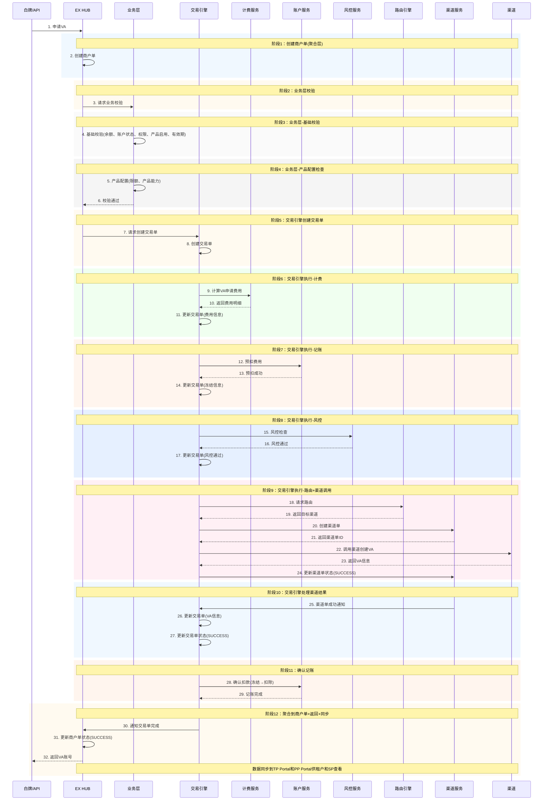
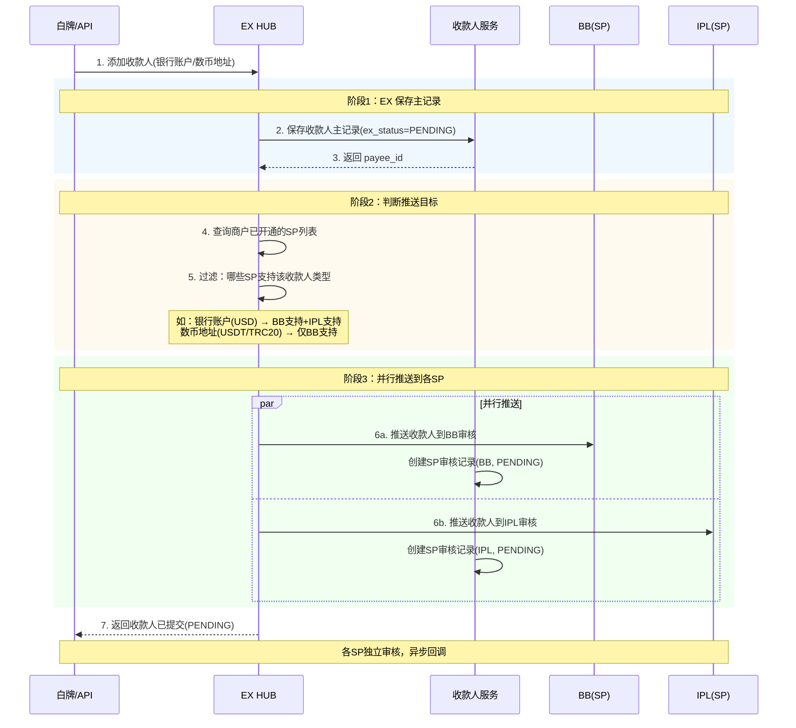
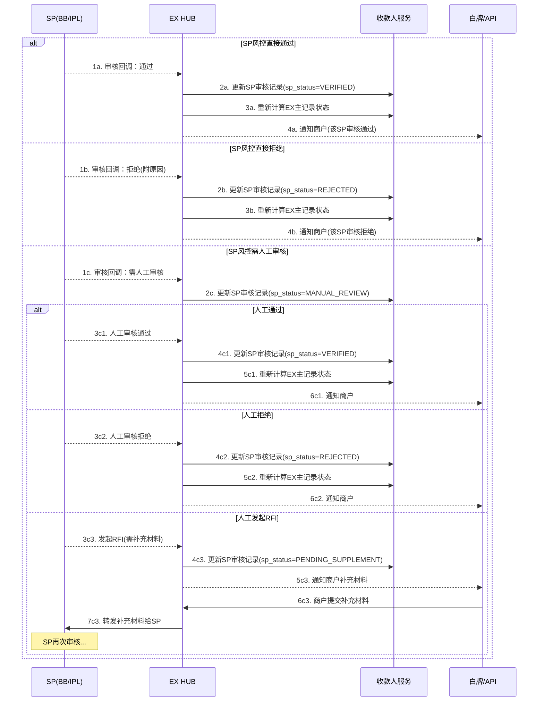
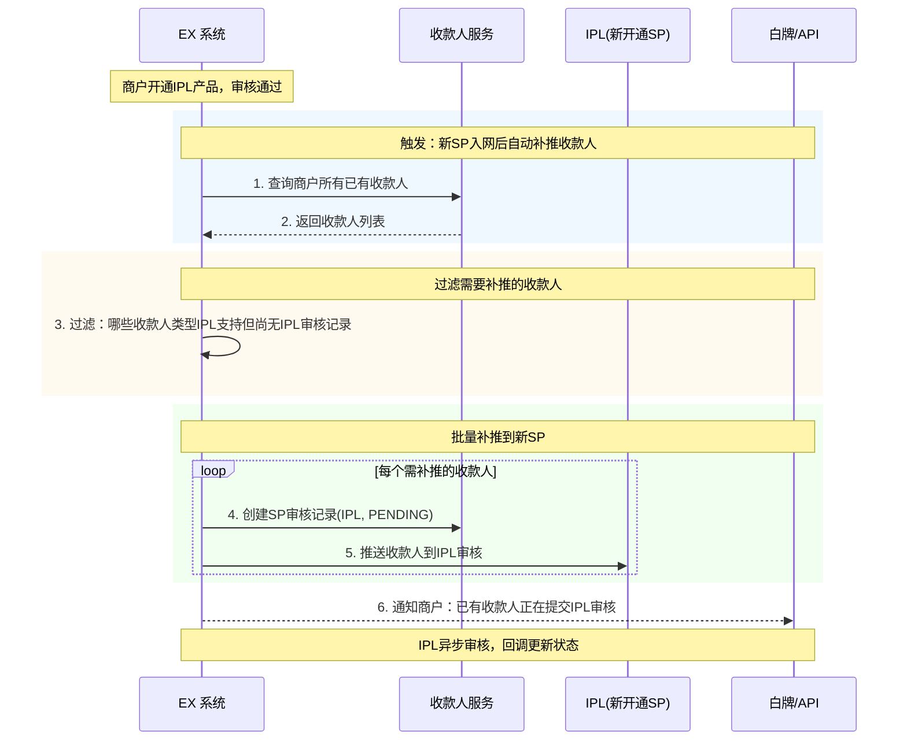
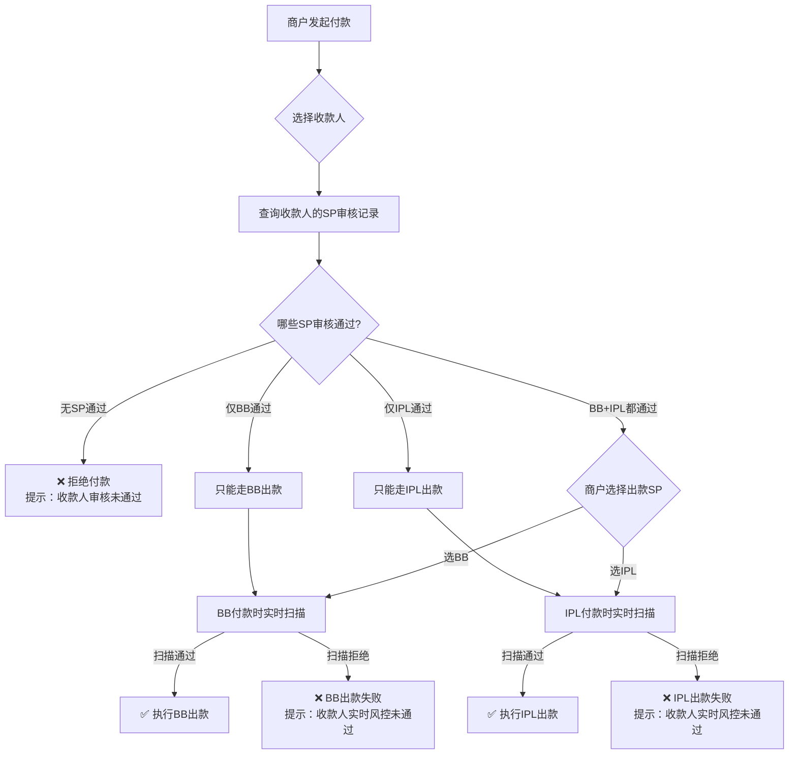
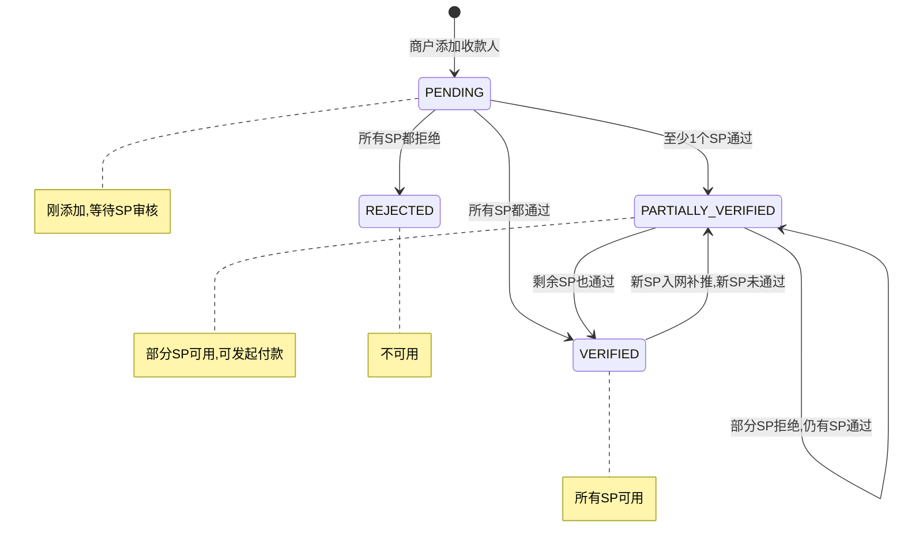
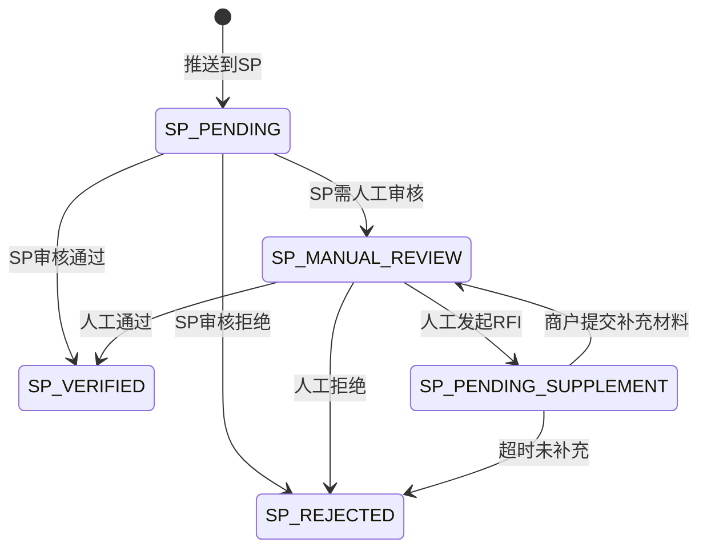

## 各交易类型详细流程

### 4.1 VA申请（商户主动发起）

**单据流转：** 商户单 → 交易单 → 渠道单



**说明：**

- **商户单**：聚合层，汇总交易单结果
- **交易单**：核心执行层，交易引擎驱动执行计费、记账、风控、路由等所有业务逻辑
  - 先记账冻结费用，失败后返回
- **渠道单**：渠道调用层
- 商户通过白牌或API接入EX系统
- 数据通过Portal展示：MP(商户)、TP(租户)、PP(SP)

---

### 4.2 VA 展示排序与重复能力处理

#### 4.2.1 背景

商户同时开通 BB 和 IPL 后，两个 SP 可能都提供 VA 收款能力。需要明确：

1. 商户端展示多个 VA 时的排序规则
2. BB 和 IPL 提供重复 VA 能力时的处理策略

#### 4.2.2 本期规则

**VA 展示排序：**

```
本期规则（业务侧不做自定义排序）：
- BB 的 VA/代收付账户统一排在上面（优先展示）
- IPL 的 VA 账户排在下面
- 同一 SP 内的多个 VA 按创建时间正序排列

排序优先级：BB > IPL（固定，本期不可配置）
```

**重复 VA 能力去重：**

```
当 BB 和 IPL 对同一币种/地区提供了重复的 VA 能力时：
- 本期统一使用 BB 的能力（BB 优先）
- IPL 的重复能力不展示给商户
- 仅 IPL 独有的能力（BB 不具备的币种/地区）才展示 IPL VA

示例：
┌──────────────────────────────────────────────────────┐
│  BB VA 能力          IPL VA 能力        商户端展示     │
├──────────────────────────────────────────────────────┤
│  USD (HK)            USD (HK)          BB USD (HK)   │  ← 重复，用BB
│  HKD (HK)            HKD (HK)          BB HKD (HK)   │  ← 重复，用BB
│  —                   EUR (HK)          IPL EUR (HK)   │  ← IPL独有，展示
│  —                   CNH (HK)          IPL CNH (HK)   │  ← IPL独有，展示
└──────────────────────────────────────────────────────┘
```

**去重判断维度：**

| 维度 | 说明                                |
| ---- | ----------------------------------- |
| 币种 | VA 支持的收款币种（USD/HKD/EUR 等） |
| 地区 | VA 所在地区（HK/SG/UK 等）          |

> 同一币种+同一地区 = 重复能力，本期统一用 BB。

#### 4.2.3 技术实现建议

```
排序字段建议：
- VA 记录增加 sort_order 字段（int），用于控制展示顺序
- 本期默认值：BB 的 VA sort_order = 100，IPL 的 VA sort_order = 200
- 前端按 sort_order 升序排列
- sort_order 值越小越靠前

去重逻辑：
- 查询商户所有可用 VA 时，按 (currency, region) 分组
- 同组内如果 BB 和 IPL 都有，只返回 BB 的
- 同组内如果只有 IPL 有，返回 IPL 的

代码层面建议确认：
✅ sort_order 字段是否已支持（或需新增）
✅ 去重逻辑是否在查询层做（推荐）还是前端做
```

#### 4.2.4 下期规划

```
下期（Phase 2）考虑：
☐ TP 端配置 VA 展示优先级（覆盖默认的 BB 优先）
☐ 商户端选择隐藏/显示特定 VA
☐ 去重策略可配置（不一定 BB 优先，可按 TP 配置）
```

---

### 4.3 收款人（Beneficiary）完整处理逻辑

#### 4.3.1 收款人类型与 SP 产品能力

商户可添加的收款人类型取决于 **SP 在 OffRamp 产品上架时定义的收款人支持能力**，而非商户自行决定。

**SP 上架 OffRamp 产品时需定义的收款人能力：**

| SP 能力字段 | 类型 | 说明 | 示例值 |
| --- | --- | --- | --- |
| 支持的收款人类型 | 多选 | 银行账户 / 数币地址 | BB: 银行账户+数币地址; IPL: 银行账户 |
| 银行账户支持的币种 | 列表 | 可出款的法币币种 | USD, HKD, EUR, GBP, SGD |
| 银行账户支持的支付方式 | 多选 | 出款通道类型 | SWIFT / 本地转账 / SEPA |
| 银行账户支持的地区 | 多选 | 收款人所在国家/地区 | HK, SG, UK, US, AU |
| 数币地址支持的币种 | 列表 | 可出款的数币币种 | USDT, USDC |
| 数币地址支持的网络 | 多选 | 可出款的链 | TRC-20, ERC-20, BEP-20 |
| 是否需要预审核 | 开关 | 添加时是否需要 SP 审核 | 是 / 否 |
| 是否支持付款时扫描 | 开关 | 付款时是否做实时收款人扫描 | 是 / 否 |

**商户可添加的收款人类型 = 商户已开通的所有 SP 的收款人能力并集：**

```
商户可添加的收款人类型 = ∪ (商户已开通的每个SP的收款人支持能力)

示例：
┌──────────────────────────────────────────────────────────────────┐
│  商户开通情况        BB 收款人能力           IPL 收款人能力        │
├──────────────────────────────────────────────────────────────────┤
│  仅 BB              银行账户(USD/HKD)       —                   │
│                     + 数币地址(USDT/USDC)                        │
│                     → 商户可添加：银行账户 + 数币地址              │
├──────────────────────────────────────────────────────────────────┤
│  BB + IPL           银行账户(USD/HKD)       银行账户(USD/EUR/GBP)│
│                     + 数币地址(USDT/USDC)                        │
│                     → 商户可添加：银行账户(USD/HKD/EUR/GBP)       │
│                                   + 数币地址(USDT/USDC)          │
│                     → 银行账户币种取并集                          │
└──────────────────────────────────────────────────────────────────┘
```

> 详细产品能力定义见 `product-attributes.md`。

---

#### 4.3.2 数据模型：EX 主记录 + SP 审核记录

收款人在 EX 层面保存**一份主记录**，每推送一个 SP 则生成**一条 SP 审核记录**。

```
收款人数据模型：

┌─────────────────────────────────────────────────────────────┐
│  EX 收款人主记录 (payee_master)                               │
│  payee_id: P001                                              │
│  merchant_id: M001                                           │
│  type: BANK_ACCOUNT / CRYPTO_ADDRESS                         │
│  details: {银行名/账号/SWIFT/地址/网络...}                     │
│  ex_status: PENDING / PARTIALLY_VERIFIED / VERIFIED / REJECTED│
│  created_at: 2026-02-22T10:00:00Z                            │
│                                                              │
│  ┌─────────────────────────────────────────────────────┐     │
│  │  SP 审核记录 (payee_sp_audit)                        │     │
│  │                                                      │     │
│  │  payee_id: P001, sp_id: BB                           │     │
│  │  sp_status: VERIFIED / REJECTED / PENDING / ...      │     │
│  │  pushed_at: 2026-02-22T10:01:00Z                     │     │
│  │  audited_at: 2026-02-22T11:00:00Z                    │     │
│  │                                                      │     │
│  │  payee_id: P001, sp_id: IPL                          │     │
│  │  sp_status: PENDING                                  │     │
│  │  pushed_at: 2026-02-23T09:00:00Z (后开通IPL时补推)    │     │
│  │  audited_at: null                                    │     │
│  └─────────────────────────────────────────────────────┘     │
└─────────────────────────────────────────────────────────────┘
```

**EX 主记录状态规则：**

| EX 状态 | 条件 | 说明 |
| --- | --- | --- |
| `PENDING` | 所有 SP 审核记录都是 PENDING | 刚添加，等待审核 |
| `PARTIALLY_VERIFIED` | 至少1个 SP 通过，但不是全部 | 部分 SP 可用 |
| `VERIFIED` | 所有已推送的 SP 都通过 | 全部 SP 可用 |
| `REJECTED` | 所有 SP 都拒绝 | 不可用 |

---

#### 4.3.3 收款人添加与推送流程

**核心原则：**
- 添加收款人时，EX 保存主记录，并**推送到商户已开通的所有相关 SP** 做预审核
- 银行账户和数币地址**都需要推送 SP 审核**（数币地址需做链上黑名单检测）
- 同时支持**预审核**（添加时推送）和**付款时扫描**（付款时 SP 再做一次实时检查）

**添加收款人时序图（多 SP 并行推送）：**



**SP 审核回调时序图（单个 SP）：**



**说明：**

- 每个 SP 独立审核、独立回调，互不影响
- EX 主记录状态根据所有 SP 审核记录的状态汇总计算
- 数币地址收款人同样需要推送 SP 审核（SP 做链上黑名单/合规检测）
- 所有状态变更同步到 TP Portal 和 PP Portal

---

#### 4.3.4 多 SP 场景处理规则

**场景1：商户只开了 BB**

```
添加收款人 → 仅推送 BB 审核
BB 通过 → ex_status = VERIFIED
BB 拒绝 → ex_status = REJECTED
付款时 → 只能走 BB 出款
```

**场景2：商户同时开了 BB + IPL**

```
添加收款人 → 同时推送 BB 和 IPL 审核（并行）

可能的状态组合：
┌──────────────────────────────────────────────────────────────┐
│  BB 状态      IPL 状态      EX 主状态           可出款 SP     │
├──────────────────────────────────────────────────────────────┤
│  PENDING      PENDING      PENDING              无           │
│  VERIFIED     PENDING      PARTIALLY_VERIFIED   仅BB         │
│  PENDING      VERIFIED     PARTIALLY_VERIFIED   仅IPL        │
│  VERIFIED     VERIFIED     VERIFIED             BB + IPL     │
│  VERIFIED     REJECTED     PARTIALLY_VERIFIED   仅BB         │
│  REJECTED     VERIFIED     PARTIALLY_VERIFIED   仅IPL        │
│  REJECTED     REJECTED     REJECTED             无           │
└──────────────────────────────────────────────────────────────┘

关键规则：
- 只要有1个SP通过，收款人就可用（通过该SP出款）
- 付款时只能选择已通过审核的SP出款
- 商户端展示时标注哪些SP可用
```

**场景3：先开了 BB，后来又开了 IPL（新 SP 入网补推）**



**补推规则：**

| 条件 | 处理 |
| --- | --- |
| 收款人类型在新 SP 支持范围内 | 自动补推 |
| 收款人类型不在新 SP 支持范围内 | 不推送 |
| 收款人在原 SP 已被拒绝 | 仍然推送新 SP（各 SP 独立判断） |
| 收款人在原 SP 处于 RFI 状态 | 仍然推送新 SP |

---

#### 4.3.5 付款时的 SP 选择与收款人校验

**核心规则：商户发起付款时，可选的出款 SP 受限于收款人在该 SP 的审核状态。**

**付款时 SP 选择流程图：**



**双重校验机制（预审核 + 付款时扫描）：**

| 阶段 | 校验方 | 校验内容 | 说明 |
| --- | --- | --- | --- |
| **添加时预审核** | SP | KYC/黑名单/合规/链上地址检测 | 异步审核，结果持久化 |
| **付款时实时扫描** | SP | 实时黑名单/制裁名单/风险评分 | 同步校验，每次付款都检查 |

> 预审核通过不代表付款时一定通过。SP 的黑名单/制裁名单会实时更新，付款时需再次扫描。
> BB 和 IPL 当前都支持不预审核（直接付款时扫描），但考虑到其他 SP 可能不支持，**建议两种模式都保留**。

---

#### 4.3.6 商户端展示规则

**收款人列表展示：**

| 展示字段 | 说明 |
| --- | --- |
| 收款人名称 | 银行账户名/数币地址 |
| 收款人类型 | 银行账户 / 数币地址 |
| 总体状态 | EX 主记录状态（PENDING/PARTIALLY_VERIFIED/VERIFIED/REJECTED） |
| 可用出款方式 | 根据已通过审核的 SP 能力展示（如：SWIFT via BB, 本地转账 via IPL） |

> 商户端**不展示 SP 名称**（SP 对商户透明），但展示可用的出款方式。
> 如果收款人只在部分 SP 通过，商户端提示"部分出款方式可用"。

**付款页面展示：**

```
商户选择收款人后：
- 系统自动过滤出"该收款人已通过审核的SP"对应的出款方式
- 只展示可用的出款方式供商户选择
- 不可用的出款方式灰显或隐藏

示例：
  收款人: John Smith (USD银行账户)
  ├── ✅ SWIFT转账 (BB已审核通过)     → 可选
  ├── ✅ 本地转账 (IPL已审核通过)     → 可选
  └── ⏳ SEPA转账 (IPL审核中)         → 不可选(灰显)
```

---

#### 4.3.7 状态机



**SP 审核记录状态机：**



---

#### 4.3.8 汇总：各场景处理对照表

| 场景 | 添加时推送 | 付款时校验 | 可用SP | 备注 |
| --- | --- | --- | --- | --- |
| 仅BB，添加银行账户 | → BB | BB预审核 + 付款时扫描 | BB通过后可用 | — |
| 仅BB，添加数币地址 | → BB | BB预审核 + 付款时扫描 | BB通过后可用 | 数币地址也需审核 |
| BB+IPL，添加银行账户(USD) | → BB + IPL | 各自预审核 + 付款时扫描 | 通过的SP可用 | 并行推送 |
| BB+IPL，添加银行账户(EUR) | → 仅IPL（BB不支持EUR） | IPL预审核 + 付款时扫描 | 仅IPL可用 | 按SP能力过滤 |
| BB+IPL，添加数币地址 | → 仅BB（IPL不支持数币出款） | BB预审核 + 付款时扫描 | 仅BB可用 | 按SP能力过滤 |
| 先BB后开IPL | BB已有审核 + IPL自动补推 | 各自独立 | BB已通过可用，IPL等审核 | 补推不影响已有状态 |
| 收款人BB通过IPL拒绝 | — | 付款只能走BB | 仅BB | 商户端提示部分可用 |

---
