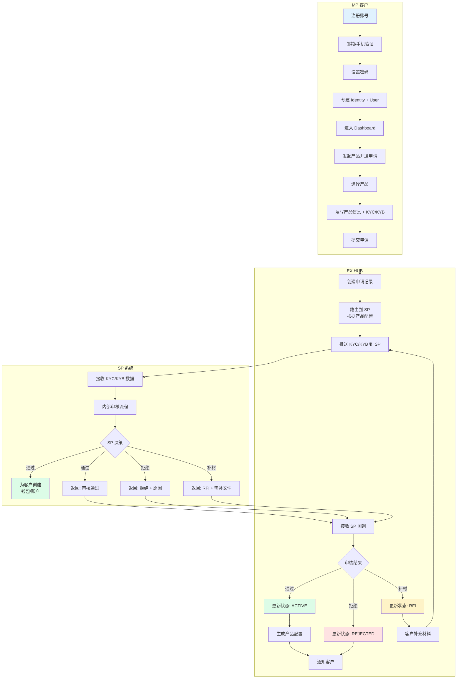
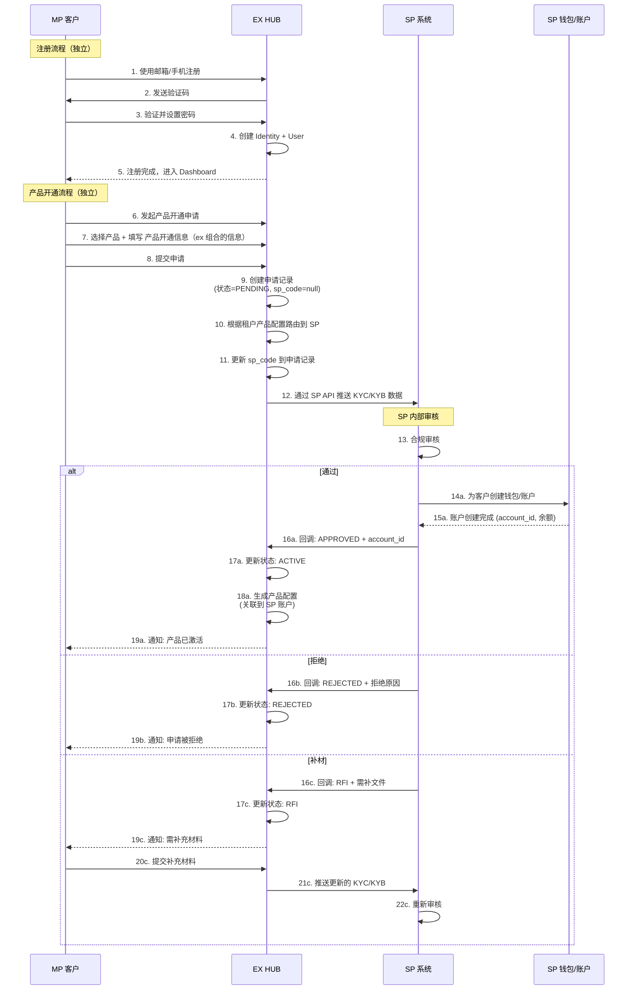
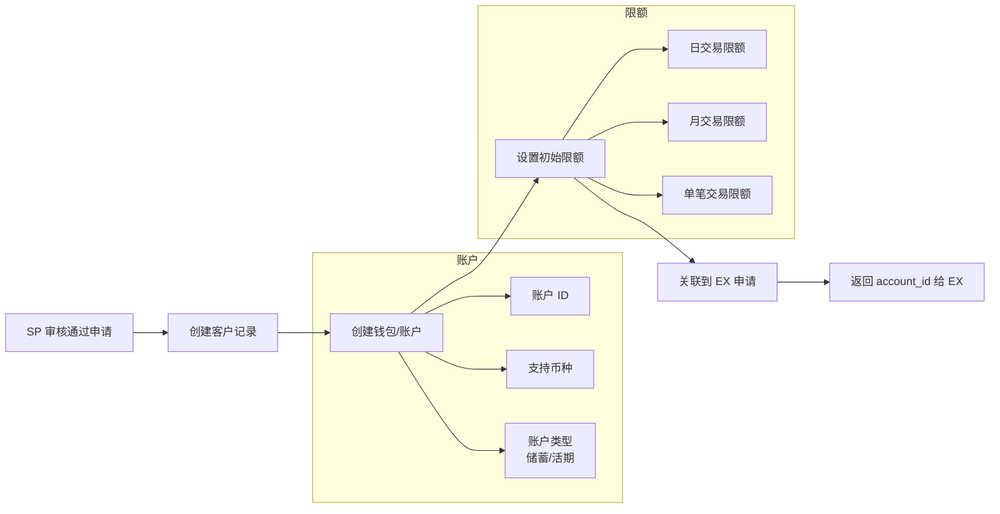
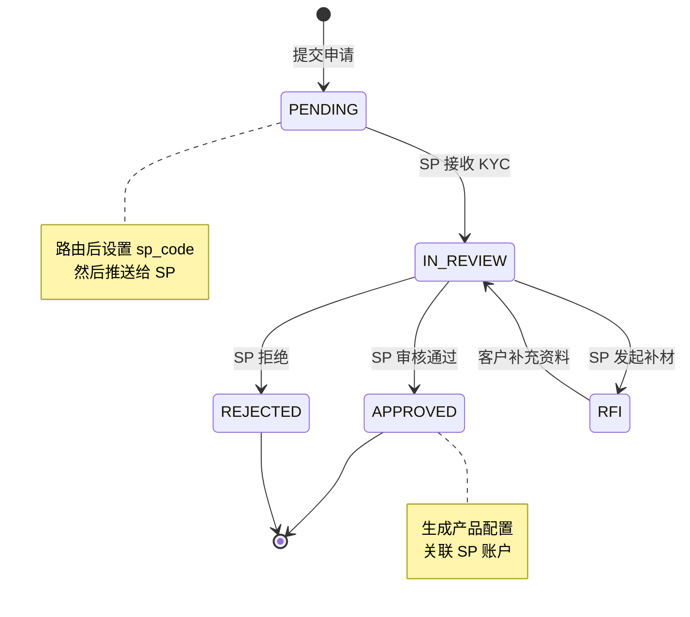
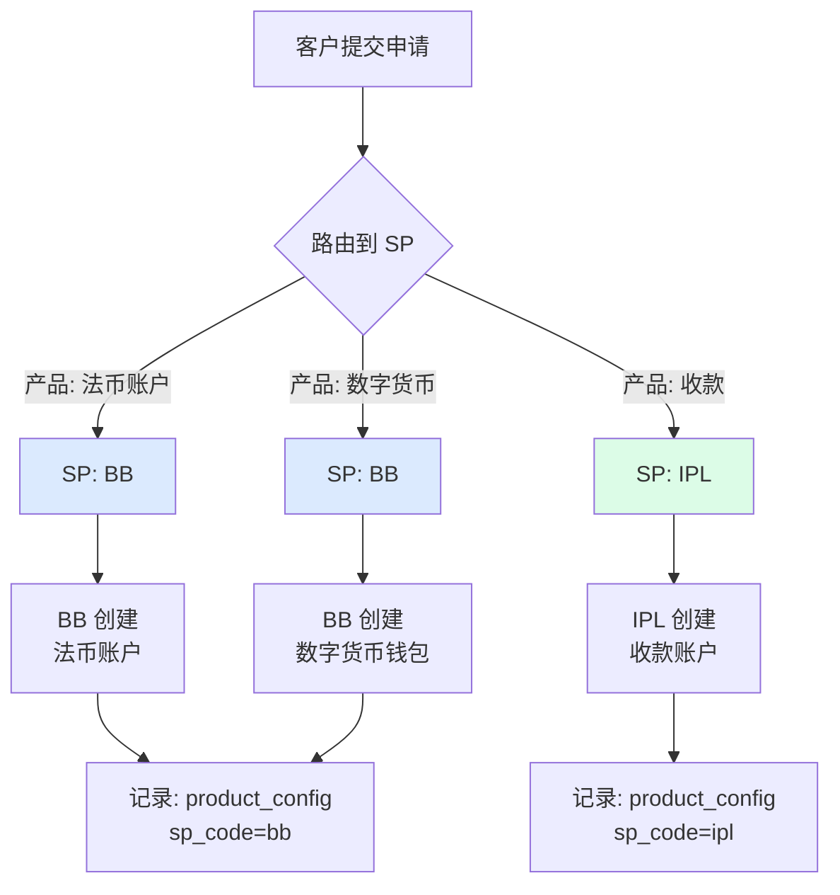

# MP 客户注册与产品开通流程

## 1. 概述

本文档描述从 MP 客户注册到产品激活的端到端流程，包括向 SP 推送 KYC/KYB 数据、SP 审核流程、以及钱包/账户开通等环节。

---

## 2. 核心流程图



---

## 3. 时序图



---

## 4. 详细步骤

### 4.1 注册流程（独立）

| 步骤 | 执行者 | 动作                 | 数据                           |
| ---- | ------ | -------------------- | ------------------------------ |
| 1    | 客户   | 输入邮箱/手机号      | email 或 phone                 |
| 2    | EX HUB | 发送验证码           | 验证码 (6位数字, 5分钟有效)    |
| 3    | 客户   | 验证 + 设置密码      | code, password                 |
| 4    | EX HUB | 创建 Identity + User | identity_id, user_id, 默认角色 |
| 5    | EX HUB | 返回成功             | -                              |

**输出：**客户可以登录并访问 Dashboard（暂无产品）

---

### 4.2 产品开通流程（独立）

#### 阶段 1：申请提交

| 步骤 | 执行者 | 动作                | 数据                                            |
| ---- | ------ | ------------------- | ----------------------------------------------- |
| 6    | 客户   | 发起申请            | 入口位置 (dashboard/settings)                   |
| 7    | 客户   | 选择产品 + 填写信息 | product_code, kyc_data, kyb_data                |
| 8    | 客户   | 提交申请            | -                                               |
| 9    | EX HUB | 创建申请记录        | application_id, mid, product_code, 状态=PENDING |
| 10   | EX HUB | 路由到 SP           | 查找 tenant_product_routing                     |
| 11   | EX HUB | 更新 sp_code        | sp_code (如 "bb", "ipl")                        |

#### 阶段 2：向 SP 推送 KYC/KYB

| 步骤 | 执行者 | 动作           | 数据      |
| ---- | ------ | -------------- | --------- |
| 12   | EX HUB | 推送结构化数据 | 见第 5 节 |

#### 阶段 3：SP 审核与账户创建

| 步骤 | 执行者 | 动作                       | 数据                                      |
| ---- | ------ | -------------------------- | ----------------------------------------- |
| 13   | SP     | 内部合规审核               | -                                         |
| 14a  | SP     | 创建钱包/账户 (如审核通过) | account_id, currencies, 初始限额          |
| 15a  | SP     | 返回回调                   | status=APPROVED, account_id               |
| 16b  | SP     | 返回回调                   | status=REJECTED, reason_code, reason_text |
| 16c  | SP     | 返回回调                   | status=RFI, required_docs[]               |

#### 阶段 4：EX HUB 更新与通知

| 步骤 | 执行者 | 动作         | 数据                                    |
| ---- | ------ | ------------ | --------------------------------------- |
| 17   | EX HUB | 更新申请状态 | status, sp_response                     |
| 18a  | EX HUB | 生成产品配置 | product_config_id, 关联到 sp_account_id |
| 19   | EX HUB | 通知客户     | 通过通知服务                            |

---

## 5. EX HUB -> SP KYC/KYB 推送规范

### 5.1 请求结构

```json
{
  "application_id": "app_20240409_abc123",
  "mid": "mid_12345",
  "tenant_id": "tenant_001",
  "product_code": "FIAT_ACCOUNT",
  "sp_code": "bb",
  "initiated_by": "MERCHANT_SELF",
  "kyc_info": {
    "type": "INDIVIDUAL | CORPORATE",
    "individual": {
      "first_name": "John",
      "last_name": "Doe",
      "date_of_birth": "1990-01-15",
      "nationality": "HK",
      "id_document": {
        "type": "PASSPORT | ID_CARD | DRIVER_LICENSE",
        "number": "A12345678",
        "country": "HK",
        "issue_date": "2020-01-01",
        "expiry_date": "2030-01-01",
        "file_urls": ["https://..."]
      },
      "address": {
        "line1": "123 Queen's Road",
        "city": "Hong Kong",
        "country": "HK",
        "postal_code": "12345"
      }
    },
    "corporate": {
      "company_name": "ABC Trading Ltd",
      "registration_number": "CR123456",
      "country_of_incorporation": "HK",
      "business_type": "LIMITED_COMPANY",
      "registered_address": {...},
      "business_address": {...},
      "ubo_info": [...],
      "directors": [...],
      "documents": {
        "certificate_of_incorporation": "https://...",
        "memorandum_and_articles": "https://...",
        "business_license": "https://..."
      }
    }
  },
  "submitted_at": "2024-04-09T10:30:00Z",
  "callback_url": "https://ex.hub/api/v1/sp-callback/application"
}
```

### 5.2 SP 回调结构

#### 审核通过

```json
{
  "application_id": "app_20240409_abc123",
  "status": "APPROVED",
  "sp_account_id": "bb_acc_789xyz",
  "approved_at": "2024-04-10T14:20:00Z",
  "account_details": {
    "currencies": ["USD", "HKD", "CNY"],
    "initial_limits": {
      "daily_transaction": 100000,
      "monthly_transaction": 1000000
    }
  }
}
```

#### 审核拒绝

```json
{
  "application_id": "app_20240409_abc123",
  "status": "REJECTED",
  "rejected_at": "2024-04-10T14:20:00Z",
  "reason": {
    "code": "KYC_FAILED",
    "message": "ID document expired",
    "details": "Passport expired on 2023-12-31"
  }
}
```

#### RFI 补材请求

```json
{
  "application_id": "app_20240409_abc123",
  "status": "RFI",
  "rfi_at": "2024-04-10T14:20:00Z",
  "required_documents": [
    {
      "type": "PROOF_OF_ADDRESS",
      "description": "Please provide a utility bill or bank statement dated within the last 3 months",
      "deadline": "2024-04-17T14:20:00Z"
    },
    {
      "type": "SOURCE_OF_FUNDS",
      "description": "Please provide evidence of source of funds",
      "deadline": "2024-04-17T14:20:00Z"
    }
  ]
}
```

---

## 6. 数据模型

### 6.1 申请记录

| 字段           | 类型        | 说明                        | 版本 |
| -------------- | ----------- | --------------------------- | ---- |
| application_id | VARCHAR(64) | 主键，唯一申请 ID           | v1.0 |
| mid            | VARCHAR(64) | 外键关联商户                | v1.0 |
| tenant_id      | VARCHAR(64) | 外键关联租户                | v1.0 |
| product_code   | VARCHAR(32) | 外键关联产品                | v1.0 |
| sp_code        | VARCHAR(32) | 外键关联 SP，初始为 null    | v1.0 |
| status         | ENUM        | 状态：待审核/通过/拒绝/补材 | v1.0 |
| kyc_data       | JSONB       | 完整 KYC/KYB 提交内容       | v1.0 |
| sp_account_id  | VARCHAR(64) | SP 为客户开设的账户 ID      | v1.0 |
| sp_response    | JSONB       | SP 回调数据                 | v1.0 |
| initiated_by   | ENUM        | 申请来源：商户自助/租户代理 | v1.1 |
| created_at     | TIMESTAMP   | 创建时间                    | v1.0 |
| updated_at     | TIMESTAMP   | 更新时间                    | v1.0 |

### 6.2 产品配置（审核通过后生成）

| 字段          | 类型        | 说明                 |
| ------------- | ----------- | -------------------- |
| config_id     | VARCHAR(64) | 主键                 |
| mid           | VARCHAR(64) | 外键关联商户         |
| product_code  | VARCHAR(32) | 外键关联产品         |
| sp_code       | VARCHAR(32) | 提供该产品的 SP      |
| sp_account_id | VARCHAR(64) | 关联到 SP 账户       |
| status        | ENUM        | 状态：激活/暂停/关闭 |
| activated_at  | TIMESTAMP   | 激活时间             |

---

## 7. SP 内部：钱包/账户创建

SP 审核通过应用时：



**SP 账户数据结构：**

```json
{
  "sp_account_id": "bb_acc_789xyz",
  "mid": "mid_12345",
  "tenant_id": "tenant_001",
  "ex_application_id": "app_20240409_abc123",
  "account_type": "CURRENT",
  "currencies": [
    {
      "currency": "USD",
      "balance": 0,
      "available_balance": 0
    },
    {
      "currency": "HKD",
      "balance": 0,
      "available_balance": 0
    }
  ],
  "limits": {
    "daily_transaction": 100000,
    "monthly_transaction": 1000000,
    "per_transaction": 50000
  },
  "status": "ACTIVE",
  "created_at": "2024-04-10T14:20:00Z"
}
```

---

## 8. 状态机

### 申请状态



---

## 9. 多 SP 场景 (v2.0)

当一个产品可由多个 SP 提供时：



**路由规则 (v2.0)：**

| 产品         | 默认 SP | 可配置?             |
| ------------ | ------- | ------------------- |
| 法币账户     | BB      | 是 (租户配置)       |
| 数字货币钱包 | BB      | 否 (单一提供商)     |
| 收款         | IPL     | 是 (如租户签约 IPL) |
| 付款         | IPL     | 是 (如租户签约 IPL) |
| OnRamp       | BB      | 否 (单一提供商)     |
| OffRamp      | BB      | 否 (单一提供商)     |

---

## 10. 关键设计决策

| 设计决策                            | 理由                                   |
| ----------------------------------- | -------------------------------------- |
| 注册与产品开通为独立流程            | 客户可先注册，之后再申请产品；降低门槛 |
| SP 在审核通过后才创建账户           | 避免孤儿账户；合规要求                 |
| EX 记录哪个 SP 开通了产品           | 用于路由、对账、多 SP 支持             |
| product_config 中存储 SP account_id | 使 EX 能够将交易路由到正确的 SP        |
| KYC/KYB 数据推送给 SP (非拉取)      | SP 控制审核流程；EX 作为数据聚合器     |
| 基于回调的异步流程                  | SP 审核可能需要小时/天数；异步是必要的 |

---

## 11. 术语表

| 中文       | 英文                    | 粤语 (广东话) |
| ---------- | ----------------------- | ------------- |
| 申请       | Application             | 申请          |
| 服务提供商 | Service Provider        | 服务提供商    |
| KYC        | Know Your Customer      | KYC           |
| KYB        | Know Your Business      | KYB           |
| 钱包       | Wallet                  | 钱包          |
| 账户       | Account                 | 账户          |
| 补材 (RFI) | Request for Information | 补材          |
| 回调       | Callback                | 回调          |
| 路由       | Routing                 | 路由          |
