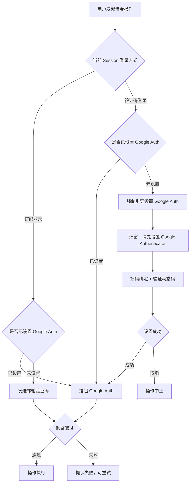
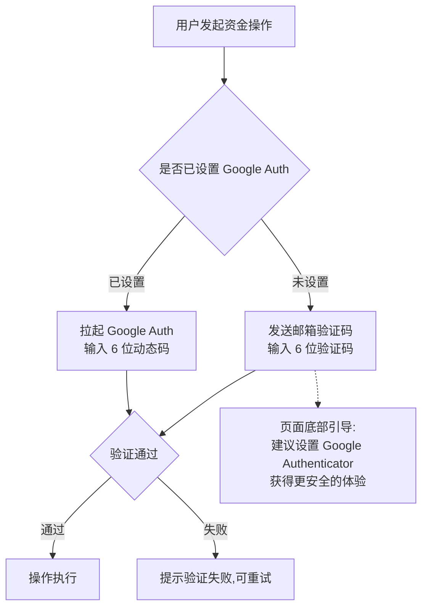
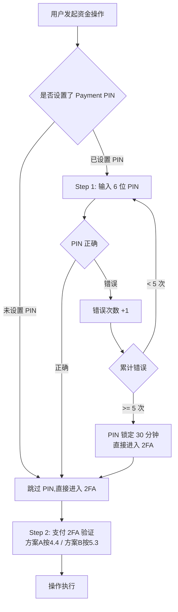
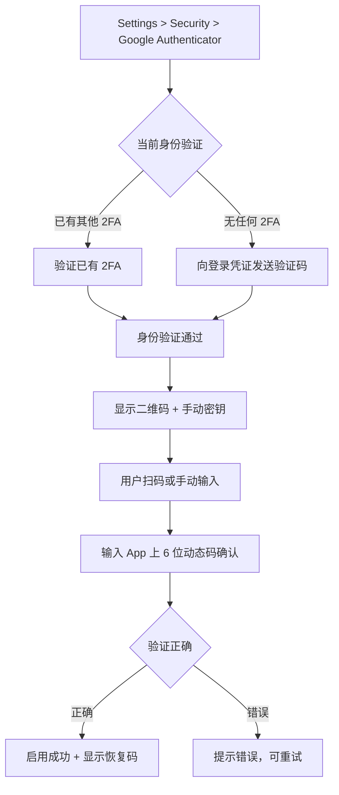
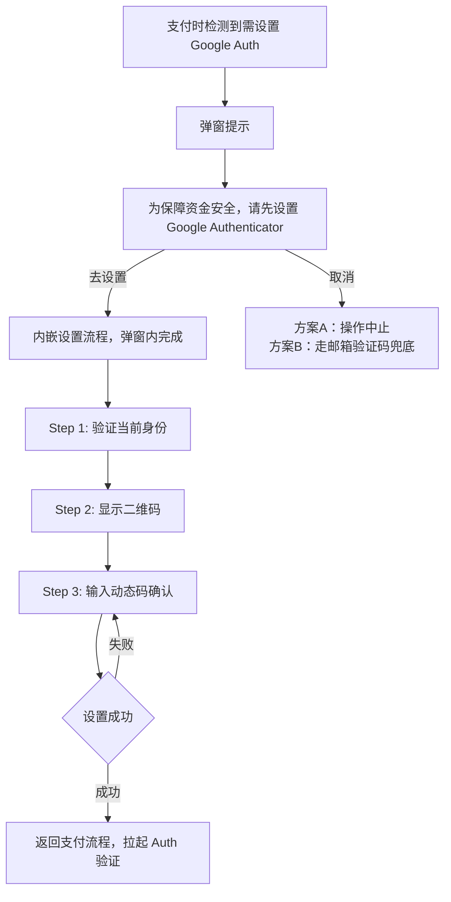

# EX 平台 — 支付场景 2FA 验证方案

> **版本**：v1.1
> **创建日期**：2026-05-17
> **关联文档**：`MP-register.md`（注册登录与用户系统 PRD）
> **适用范围**：MP 商户端所有资金操作场景

---

## 1. 背景与目标

### 1.1 背景

EX 新系统支持两种登录方式：

- **验证码登录**：邮箱/手机号 + 一次性验证码（OTP）
- **密码登录**：邮箱/手机号 + 密码

历史系统已支持支付时进行 2FA 验证，迁移到新系统后需要兼容历史行为，同时根据新系统的登录方式差异，设计合理的支付 2FA 策略。

### 1.2 核心问题

| 问题                 | 分析                                                                                                                  |
| -------------------- | --------------------------------------------------------------------------------------------------------------------- |
| 验证码登录的安全短板 | 验证码登录虽然登录时是强因素，但**整个 Session 生命周期内无持续身份绑定**。Session 被劫持后攻击者可直接操作资金 |
| 密码登录的安全短板   | 密码可能被撞库/钓鱼获取，登录后若无支付 2FA，资金风险高                                                               |
| 历史兼容             | 老系统商户已习惯支付时做 2FA，迁移后不能降级安全体验                                                                  |

### 1.3 设计目标

- 所有资金操作**必须**经过二次验证
- 2FA 方式仅支持：**邮箱验证码** 和 **Google Authenticator**（TOTP）
- 兼容历史系统迁移用户
- B 端客户体验优先，减少不必要的摩擦

---

## 2. 2FA 方式定义

### 2.1 支持的支付 2FA 方式

| 方式                           | 类型         | 安全等级    | 说明                                         |
| ------------------------------ | ------------ | ----------- | -------------------------------------------- |
| **Google Authenticator** | TOTP（离线） | ⭐⭐⭐ 最高 | 基于时间的动态令牌，离线生成，不可远程拦截   |
| **邮箱验证码**           | OTP（在线）  | ⭐⭐ 中     | 系统向绑定邮箱发送 6 位验证码，有效期 5 分钟 |

> **注意**：支付场景**不支持** SMS 短信作为 2FA 方式（仅邮箱和 Google Authenticator）。

### 2.2 与登录 2FA 的区别

| 维度     | 登录 2FA                    | 支付 2FA                           |
| -------- | --------------------------- | ---------------------------------- |
| 触发时机 | 密码登录成功后              | 资金操作确认时                     |
| 目的     | 验证「你就是你」            | 确认操作意图 + 防 Session 劫持     |
| 方式     | Authenticator / SMS / Email | **仅 Authenticator / Email** |
| 是否必须 | 可选（用户可不开启）        | **必须**（所有资金操作均需） |

---

## 3. 方案对比总览

本文档提供两种方案供选择：

| 维度                       | 方案 A（严格模式）                 | 方案 B（简化模式）                          |
| -------------------------- | ---------------------------------- | ------------------------------------------- |
| **核心逻辑**         | 根据登录方式决定支付 2FA 策略      | 不关心登录方式，统一按 Google Auth 状态决定 |
| **是否记录登录方式** | ✅ 需要记录 Session 登录方式       | ❌ 不需要                                   |
| **实现复杂度**       | 较高                               | **低**                                |
| **安全等级**         | ⭐⭐⭐ 最高（强制异构因子）        | ⭐⭐ 中等（存在同渠道风险）                 |
| **用户门槛**         | 验证码登录用户必须设置 Google Auth | 无强制门槛，邮箱兜底                        |
| **适用阶段**         | 长期目标 / 高安全需求              | 快速上线 / 降低用户摩擦                     |

---

## 4. 方案 A：严格模式（根据登录方式区分）

### 4.1 设计原则

```
原则1：支付操作一律需要二次验证，无论登录方式
原则2：验证码登录 + 未设置 Google Auth → 必须先设置 Google Auth 才能支付
原则3：密码登录 → 直接拉起 2FA（邮箱或 Google Auth）
原则4：已设置 Google Auth → 优先使用 Google Auth
原则5：Payment PIN 与 2FA 独立，PIN 是快捷确认，2FA 是安全验证
```

### 4.2 决策矩阵

| 登录方式           | 已设置 Google Auth | 未设置 Google Auth | 验证方式                           |
| ------------------ | ------------------ | ------------------ | ---------------------------------- |
| 密码登录           | ✅                 | —                 | 拉起 Google Auth                   |
| 密码登录           | —                 | ✅                 | 发送邮箱验证码                     |
| 验证码登录（邮箱） | ✅                 | —                 | 拉起 Google Auth                   |
| 验证码登录（邮箱） | —                 | ✅                 | **强制引导设置 Google Auth** |
| 验证码登录（手机） | ✅                 | —                 | 拉起 Google Auth                   |
| 验证码登录（手机） | —                 | ✅                 | **强制引导设置 Google Auth** |

### 4.3 核心逻辑说明

**为什么验证码登录 + 未设置 Google Auth = 必须设置？**

- 验证码登录用的是邮箱/手机 OTP
- 如果支付 2FA 也用邮箱验证码 → **登录因子和支付因子是同一渠道**，安全降级
- 攻击者劫持邮箱后，既能登录又能完成支付 → 无实质安全保护
- 因此：验证码登录场景下，**支付 2FA 必须走 Google Authenticator**（异构因子）

**密码登录为什么可以用邮箱验证码？**

- 密码登录的第一因子 = 密码（你知道的）
- 邮箱验证码 = 第二因子（你拥有的）
- 两者**异构**，组合安全等级足够

### 4.4 支付 2FA 主流程



### 4.5 各场景说明

| 场景 | 登录方式   | Google Auth 状态 | 支付验证行为            | 安全分析                        |
| ---- | ---------- | ---------------- | ----------------------- | ------------------------------- |
| A    | 密码登录   | 已设置           | 拉起 Google Auth        | 密码 + Auth = 异构双因子 ✅     |
| B    | 密码登录   | 未设置           | 邮箱验证码              | 密码 + 邮箱 OTP = 异构双因子 ✅ |
| C    | 验证码登录 | 已设置           | 拉起 Google Auth        | 邮箱 OTP + Auth = 异构双因子 ✅ |
| D    | 验证码登录 | 未设置           | **强制设置 Auth** | 防同渠道风险 ✅                 |

### 4.6 方案 A 优缺点

**优点：**

- 安全等级最高，杜绝同渠道攻击
- 所有路径都能保证异构双因子

**缺点：**

- 需要 Session 记录 `login_method`，增加系统复杂度
- 前后端均需感知登录方式，耦合度高
- 验证码登录用户首次支付有强制设置门槛，可能流失

---

## 5. 方案 B：简化模式（Google Auth 优先，邮箱兜底）

### 5.1 设计原则

```
原则1：支付操作一律需要二次验证
原则2：不关心当前 Session 的登录方式
原则3：已设置 Google Auth → 用 Google Auth
原则4：未设置 Google Auth → 用邮箱验证码兜底
原则5：引导但不强制设置 Google Auth
```

### 5.2 决策矩阵

| Google Auth 状态 | 支付验证方式     | 说明                     |
| ---------------- | ---------------- | ------------------------ |
| **已设置** | 拉起 Google Auth | 最安全路径               |
| **未设置** | 发送邮箱验证码   | 兜底路径 + 引导设置 Auth |

> **极简逻辑**：只看一个变量（`google_auth_enabled`），不需要记录登录方式。

### 5.3 支付 2FA 主流程



### 5.4 ⚠️ 风险分析

#### 风险 1：邮箱单点失控（最核心风险）

| 维度               | 说明                                                                                   |
| ------------------ | -------------------------------------------------------------------------------------- |
| **攻击路径** | 攻击者劫持邮箱 → 邮箱验证码登录 → 发起支付 → 系统发邮箱验证码到同一邮箱 → 完成支付 |
| **根因**     | 登录因子 = 支付因子（同渠道），形同无 2FA                                              |
| **攻击成本** | 仅需控制一个邮箱                                                                       |
| **影响范围** | 所有未设置 Google Auth 且用验证码登录的用户                                            |
| **影响程度** | **高**（资金直接损失）                                                           |

```
攻击链路：
  攻击者劫持用户邮箱
  → 用邮箱验证码登录 EX 系统 ✅
  → 发起转账/提现
  → 系统发邮箱验证码到同一邮箱 ✅
  → 攻击者拿到验证码，完成支付 ✅
  → 资金被盗 💀
```

#### 风险 2：密码泄露 + 邮箱泄露组合攻击

| 维度                    | 说明                                                                           |
| ----------------------- | ------------------------------------------------------------------------------ |
| **攻击路径**      | 撞库/钓鱼获取密码 + 劫持邮箱 → 密码登录 + 邮箱验证码支付                      |
| **与方案 A 对比** | 方案 A 此场景同样存在（密码登录+未设置Auth时也是邮箱兜底），**风险相当** |
| **攻击成本**      | 中（需同时获取两个因子）                                                       |

#### 风险 3：无强制升级机制

| 维度               | 说明                                                     |
| ------------------ | -------------------------------------------------------- |
| **问题**     | 「引导但不强制」→ 大量用户永远不设置 Google Auth        |
| **后果**     | 系统整体安全水位由最弱环节决定                           |
| **客诉风险** | 资金被盗后用户投诉「为什么系统没强制我设置更安全的方式」 |

### 5.5 风险等级评估

| 风险场景                           | 概率 | 影响           | 风险等级     | 是否可接受                     |
| ---------------------------------- | ---- | -------------- | ------------ | ------------------------------ |
| 邮箱被劫持 + 验证码登录 + 邮箱支付 | 中   | 高（资金损失） | **高** | ⚠️ 需缓解措施                |
| 密码泄露 + 邮箱被劫持              | 低   | 高             | 中           | 可接受（两因子同时泄露概率低） |
| 用户长期不设置 Auth                | 高   | 中（潜在风险） | 中           | 可接受（引导机制覆盖）         |

### 5.6 风险缓解措施

| 缓解手段                            | 说明                                                                        | 效果           |
| ----------------------------------- | --------------------------------------------------------------------------- | -------------- |
| **大额强制 Google Auth**      | 单笔 > X USD 时，即使未设置 Auth 也强制引导设置                             | 保护高价值操作 |
| **累计金额触发**              | 当日累计操作 > Y USD 时，后续操作强制 Auth                                  | 防批量小额攻击 |
| **新设备 + 邮箱兜底时加风控** | 新设备登录 + 未设置 Auth + 支付时邮箱验证 → 触发额外风控（如延迟到账 24h） | 给用户反应时间 |
| **定期弹窗提醒**              | 未设置 Auth 用户每次登录后弹窗引导（可关闭，但每周最多显示 N 次）           | 提升设置率     |
| **敏感操作邮件通知**          | 每次支付成功后发送邮件通知（含操作详情 + 非本人操作链接）                   | 事后追溯       |
| **异常行为检测**              | 同一 Session 短时间内多笔支付 → 触发风控拦截                               | 防自动化攻击   |

### 5.7 方案 B 优缺点

**优点：**

- 实现极简，不需要记录 Session 登录方式
- 前后端无耦合，只看 `google_auth_enabled` 一个状态
- 用户无门槛，首次支付不会被阻断
- 开发成本低，可快速上线

**缺点：**

- 存在同渠道风险（邮箱登录 + 邮箱支付）
- 安全水位取决于用户是否主动设置 Google Auth
- 需要额外的风控缓解措施来补偿安全缺口

---

## 6. 方案选择建议

| 阶段                   | 推荐方案               | 原因                                       |
| ---------------------- | ---------------------- | ------------------------------------------ |
| **一期快速上线** | 方案 B + 缓解措施      | 降低开发复杂度，快速交付，通过风控补偿安全 |
| **二期安全升级** | 方案 B + 大额强制 Auth | 提升整体安全水位，对验证码登录用户逐步引导 |
| **长期目标**     | 方案 A                 | 所有用户绑定 Google Auth，消除同渠道风险   |

**渐进式路径：**

```
一期：方案 B（邮箱兜底）+ 大额强制 Auth + 异常行为检测
  ↓
二期：统计未设置 Auth 用户比例，若 > 30% 则加强引导
  ↓
三期：对验证码登录用户强制 Auth（过渡到方案 A）
```

---

## 7. Payment PIN 与 2FA 的关系（两方案通用）



> Payment PIN 是快捷确认层（确认操作意图），2FA 是安全验证层（确认身份）。两层独立，PIN 通过后仍需 2FA。

### 7.1 PIN 与 2FA 二选一（简化体验）

考虑到 B 端客户操作频繁，双层验证（PIN + 2FA）体验过重。推荐：

| 操作风险等级                                   | 已设置 PIN | 未设置 PIN | 验证方式 |
| ---------------------------------------------- | ---------- | ---------- | -------- |
| **低风险**（小额转账、卡充值）           | PIN 即可   | 走 2FA     | 二选一   |
| **高风险**（大额转账、提现、修改收款人） | PIN + 2FA  | 走 2FA     | 必须 2FA |

> 低风险/高风险的阈值由运营配置（如单笔 <= 500 USD 为低风险）。

### 7.2 免验期（Trusted Session）

```
规则：2FA 验证通过后，15 分钟内同一 Session 的后续操作免重复验证
条件：
  - 同一设备 + 同一 IP
  - 未切换 MID
  - 未离开资金操作页面超过 5 分钟
触发重验：
  - 超过 15 分钟
  - 切换 MID
  - 设备/IP 变化
  - 高风险操作（大额）始终需验证
```

---

## 8. Google Authenticator 设置流程（两方案通用）

### 8.1 主动设置（Settings - Security）



### 8.2 支付时被动引导设置



### 8.3 恢复码

- 设置成功时生成 **8 组恢复码**（一次性使用）
- 提示用户安全保存（可下载/截图）
- 手机丢失时可用恢复码代替动态码完成验证
- 每个恢复码仅可使用一次

---

## 9. 适用的资金操作清单（两方案通用）

| 操作                              | 所属模块      | 说明                     |
| --------------------------------- | ------------- | ------------------------ |
| 买入数币（Buy Crypto / OnRamp）   | Exchange      | 法币 → 数币承兑         |
| 卖出数币（Sell Crypto / OffRamp） | Exchange      | 数币 → 法币承兑         |
| 法币换汇（FX）                    | Exchange      | 法币 ↔ 法币             |
| 提现（Withdrawal）                | Assets        | 法币账户 → 外部银行     |
| 提币（Crypto Withdrawal）         | Assets        | 数币钱包 → 外部链上地址 |
| 付款（Payout）                    | Transfers Out | 法币付款给收款人         |
| 卡充值（Card Top-Up）             | Cards         | 向卡账户注入资金         |
| 卡转出（Card Withdraw）           | Cards         | 从卡账户提取资金         |
| 新增/修改收款人（Beneficiary）    | Directory     | 收款人银行信息变更       |
| 新增/修改提币地址                 | Directory     | 链上提币白名单变更       |

---

## 10. 安全规则（两方案通用）

### 10.1 验证码规则（邮箱）

- 6 位数字，有效期 5 分钟
- 同一邮箱 60 秒内只能发送 1 次
- 连续输入错误 5 次 → 冻结该验证方式 30 分钟

### 10.2 Google Auth 规则

- TOTP 标准，30 秒更新一次
- 允许前后各 1 个时间窗口的容差（±30s）
- 连续输入错误 5 次 → 冻结该验证方式 30 分钟，提示使用恢复码

### 10.3 防重放

- 每个 2FA 验证码（邮箱 OTP / TOTP 动态码）仅可使用一次
- 已使用的 TOTP 动态码在当前时间窗口内不可重复提交

---

## 11. 数据模型变更

### 11.1 Identity 表新增字段

| 字段                           | 类型    | 说明                              | 方案 A | 方案 B |
| ------------------------------ | ------- | --------------------------------- | ------ | ------ |
| `google_auth_secret`         | string  | Google Auth TOTP 密钥（加密存储） | ✅     | ✅     |
| `google_auth_enabled`        | boolean | 是否已启用 Google Auth            | ✅     | ✅     |
| `google_auth_recovery_codes` | json    | 恢复码列表（哈希存储）            | ✅     | ✅     |
| `payment_2fa_email_enabled`  | boolean | 是否启用邮箱支付 2FA              | ✅     | ✅     |

### 11.2 Session 表新增字段

| 字段                     | 类型      | 说明                                       | 方案 A           | 方案 B    |
| ------------------------ | --------- | ------------------------------------------ | ---------------- | --------- |
| `login_method`         | enum      | `password` / `otp_email` / `otp_sms` | ✅**必须** | ❌ 不需要 |
| `last_2fa_verified_at` | timestamp | 最后一次支付 2FA 验证通过时间              | ✅               | ✅        |
| `trusted_until`        | timestamp | 免验期截止时间                             | ✅               | ✅        |

> **方案 B 的核心简化**：Session 表不需要 `login_method` 字段，减少系统复杂度。

---

## 12. 历史系统迁移方案（两方案通用）

| 历史系统状态       | 新系统处理                                                                 |
| ------------------ | -------------------------------------------------------------------------- |
| 已绑定 Google Auth | 迁移 TOTP Secret → Identity.`google_auth_secret`，标记 `enabled=true` |
| 已绑定邮箱 2FA     | 迁移至 Identity.`payment_2fa_email_enabled=true`                         |
| 未绑定任何 2FA     | 首次支付时按所选方案规则处理                                               |
| 已设置 Payment PIN | 迁移至 Identity.PIN 字段，逻辑不变                                         |

**迁移原则**：

1. **静默迁移**：用户无感知，登录后自动完成数据映射
2. **不降级**：老系统有 2FA → 新系统必须保留，不允许迁移后丢失
3. **首次触发**：迁移用户首次支付时，系统校验 2FA 状态，按新规则执行

---

*文档版本：v1.1 | 最后更新：2026-05-17*
