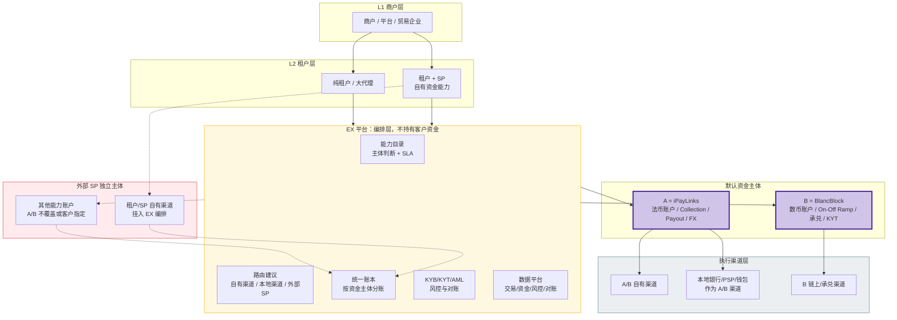

# ABE 定位与多 SP 架构 — 战略推理分析

> **文档类型**：战略定位 + 架构推理（讨论稿）
> **版本**：v0.4（客观推理稿：以资深跨境支付咨询师/架构师视角，结合 ABE 三位一体现状与终极愿景，推导 A / B / E 三者应如何分工与协同）
> **日期**：2026-07-04
> **关联文档**：`ex-three-layer-solution.md`（四层模型）、`brd/ex-multi-sp-architecture-brd-v2.md`（多 SP 推理）、`ex-offramp-v2-reasoning.md`（OffRamp 资金中枢推理）、`下一代跨境支付基础设施BP-architecture.pdf`（老板终极愿景）
> **目的**：从「科技输出 + 资金沉淀 + 数据储备」三个愿景出发，推导 EX 的定位与多 SP On/Off Ramp、法币 Collection/Payout 的可执行架构

---

## 目录

1. [起点：三个愿景事实](#1-起点三个愿景事实)
2. [定位推理：EX 到底是什么](#2-定位推理ex-到底是什么)（含 §2.5 EX 监管边界 RACI；§2.6 EX 能否非持牌直接接渠道做清算网络）
3. [盈利模式推理：通道 → 资金效率 → 数据金融](#3-盈利模式推理通道--资金效率--数据金融)
4. [核心机制：资金主体、执行渠道与多 SP 统一模型](#4-核心机制资金主体执行渠道与多-sp-统一模型)（含 §4.9 为什么要多 SP 而不是 A/B 多接通道）
5. [防绕开机制：四把锁](#5-防绕开机制四把锁)
6. [可执行架构：四个产品的资金与数据流](#6-可执行架构四个产品的资金与数据流)
7. [分期落地](#7-分期落地)
8. [待讨论问题](#8-待讨论问题)
9. [术语表](#9-术语表)

---

## 1. 起点：三个愿景事实

```
事实❶：ABE 三位一体
  · A = iPayLinks（IPL）— 法币收付牌照（VA 收款、POBO 出款）
  · B = BlancBlock（BB）— 数币牌照 + 承兑引擎 + 链上基础设施
  · E = EurewaX（EX）— 科技平台，不持牌、不持有客户资金（≠ 不受监管，边界见 §2.5）
  → 一个集团，三种角色：两个持牌资金方 + 一个科技编排方

事实❷：东南亚的「支付主权」判断
  · 支付是一个国家的底层基础设施，本国一定会牢牢握在自己手里
  · 外来支付公司（含中国基因的 MSO/MPI 竞品）做大必受限制
  · 但「科技输出」不受此限 — 卡组的 Processor、AI 风控、清结算系统
    都是科技输出的成功先例
  → EX 的选择：不做「在越南做越南人生意的外国支付公司」，
    而做「帮越南本地机构服务越南市场的科技输出方」
  ⚠️ 入场姿势修正：前期一定不是纯科技输出。纯科技在越南这样的
    市场很难开始（本地机构不缺「卖系统的外国公司」，缺的是能力）。
    起手 = 「科技 + 跨境支付能力」捆绑输出：带着跨境收付/承兑能力去，
    帮本地机构把跨境业务做起来 —— 能力是敲门砖，系统是留客锁

事实❸：纯通道 / 纯科技都不是好生意
  · 纯科技输出：项目制收入，盈利难，且 AI 正在抹平技术护城河
  · 纯支付通道 / 承兑通道：费率持续压缩，资本市场估值低
  · 修正后的结论：A/B 做通道不是长久之计，但终局也不是简单
    「理财/贷款」。更准确的终局是：
    交易入口 → 账户关系 → 资金效率 → 数据风控 → 金融产品/稳定币清算。
  · EX 要的是「更多数据进来」和「更多可合规运营的余额进入 A/B 账户体系」：
    前面对接租户，后面对接 SP；A/B 作为默认资金主体，外部 SP 作为
    执行渠道或能力补位。资金能不能算 A/B 客资，不按“本地/跨境”判断，
    而按合同主体、开户主体、客户资金保障主体和清算责任判断。

事实❹：老板的终极愿景（BP：下一代跨境支付基础设施）
  · 定位：基于区块链的 AI 跨境支付基础设施 —— 多币种稳定币支付基建
    + 深度融合传统商业生态 + 端到端 AI 风控
  · 行业判断：稳定币年交易量 35 万亿美金 vs 真实商业支付渗透仅
    3,900 亿 → 「渐进式共生」，细分场景单点突破撬动全局
  · ABE 分工（BP 原文）：B = 稳定币支付/发行/托管/实时清算的核心闭环；
    E = 全栈技术基座（跨链编排/钱包身份/Agent Pay/机构赋能开放平台）；
    A = 生态融合（传统银行账户体系 + 庞大跨境客户生态）；
    架构上预留「法币 SPn / 数币 SPn」开放接入位 —— 与多 SP 架构同构
  · 对标 BVNK（Mastercard 已签最高 $1.8B 收购协议、尚待监管审批交割，验证赛道估值锚），差异化四张牌：
    自主可控清算网络、AI 原生（Agent 支付/智能交易大脑）、
    亚太+一带一路主场、主权稳定币定制（发行/托管/清算）
  → 终局不是「更好的通道」，而是「下一代清算网络」本身
```

**三个事实之间存在一个表面矛盾，这是本文要解决的核心问题：**

```
┌─────────────────────────────────────────────────────────────────┐
│  矛盾：「中立科技输出」 vs 「资金沉淀在自家 A/B」                  │
│                                                                 │
│  · 对外讲：我是中立的科技平台，帮本地机构做支付（事实❷）           │
│  · 对内要：资金进我家的 IPL/BB，数据进我家的 EX（事实❸）           │
│  · 如果处理不好 → 本地机构/外部 SP 发现你「假中立」→ 合作破裂      │
│  · 如果不这么做 → 纯科技输出赚不到钱 → 商业模式不成立              │
└─────────────────────────────────────────────────────────────────┘
```

---

## 2. 定位推理：EX 到底是什么

### 2.1 先看别人怎么解这个矛盾

| 案例                                   | 表面身份             | 真实抓手                             | 启示                                       |
| -------------------------------------- | -------------------- | ------------------------------------ | ------------------------------------------ |
| **卡组（Visa/MC）**              | 中立网络/科技标准    | 网络两端必须经过它清算，按交易抽成   | 中立≠不赚钱，关键是**成为必经之路** |
| **Ant International（Alipay+）** | 钱包互联科技输出     | 跨境汇路和 FX 由自己体系承接         | 科技输出获客，**跨境/FX 环节自己吃** |
| **Amazon + AWS**                 | AWS 对外中立         | Amazon 零售是 AWS 第一大客户和试验场 | 自营业务养平台，平台再对外输出             |
| **Stripe**                       | 开发者友好的支付科技 | 沉淀 Treasury/Capital/发卡等资金业务 | 支付是入口，**资金业务是利润**       |

**共同规律**：没有人靠「纯中立科技」赚大钱。成功者都是「**科技做入口，网络做壁垒，资金/数据环节做利润**」。中立是对外叙事，必经之路是内在设计。

### 2.2 EX 的定位：一句话

```
┌─────────────────────────────────────────────────────────────────┐
│                                                                 │
│  EX = 东南亚支付机构的「跨境能力赋能方 + 操作系统 + 清算网络」      │
│                                                                 │
│  · 对本地机构（租户/SP）输出的是：跨境支付能力 + 系统 +           │
│    合规风控 + 多 SP 编排。能力和科技捆绑输出，本地机构继续        │
│    掌握本地客群和本地触达，我们不以外资身份抢它的本地生意。        │
│                                                                 │
│  · 对集团内部，A/B 是默认资金主体和清算账户：                     │
│      A 承接法币账户、Collection/Payout、FX、多币种结算；          │
│      B 承接数币账户、On/Off Ramp、KYT、承兑与稳定币清算。         │
│                                                                 │
│  · 对外部 SP，不再笼统说“资金在 SP”或“资金不在 SP”，而是分两类：  │
│      ① 外部 SP 作为 A/B 的执行渠道：资金服务主体是 A/B，          │
│         客户资金在账务和合同上属于 A/B 客资，外部机构只是执行      │
│         本地入金、出金、银行/wallet 连接或渠道清算；              │
│      ② 外部 SP 作为独立资金主体：A/B 暂不覆盖或客户自带渠道时，   │
│         客户资金留在外部 SP 账户，EX 只做编排、账本、风控和对账。  │
│                                                                 │
│  一句话：A/B 优先是“资金主体优先”，多 SP 是“渠道和能力开放”；     │
│         两者不是矛盾，而是同一套架构的上下两层。                  │
│                                                                 │
└─────────────────────────────────────────────────────────────────┘
```

### 2.3 为什么这个切分天然成立：不是按“本地/跨境”切，而是按“资金主体/渠道”切

切分不应按“本地/跨境”地域划分，而应按“资金主体/执行渠道”划分：

> **本地客户触达、本地支付方式、本地银行/钱包连接可以由本地机构完成；但资金服务主体不一定是本地机构。**
> 如果本地银行/PSP 只是 A 的渠道或代理清算连接，那么这笔钱在产品、账务和客户协议上仍然可以是 A 的客户资金；只有当外部 SP 自己与商户建立资金服务关系并承担客户资金责任时，才算“资金留在外部 SP”。

| 环节                               | 本地机构/外部 SP 的价值                  | ABE 的价值                                                   | 修正后的资金口径                                                                        |
| ---------------------------------- | ---------------------------------------- | ------------------------------------------------------------ | --------------------------------------------------------------------------------------- |
| 本地收单 / 本地钱包 / 本地银行转账 | 有本地触达、银行关系、支付方式、运营能力 | 不以外资身份抢本地 C 端支付；可把本地机构作为 A/B 的执行渠道 | 若 A/B 是签约和客资主体，则资金是 A/B 客资；若外部 SP 是签约和客资主体，则资金在外部 SP |
| 跨境收款 / 多币种结算              | 往往缺境外账户、清算网络、合规能力       | A 承接法币账户、VA、POBO、FX、跨境结算                       | A 优先作为资金主体；外部机构可作为 A 的本地渠道或补位 SP                                |
| U ↔ 法币承兑 / 链上清算           | 本地合规敏感、链上设施不足               | B 承接数币账户、承兑、KYT、稳定币清算                        | B 优先作为数币资金主体；外部 ramp 只在 B 不覆盖时补位，并需要穿透数据回传               |
| 系统 / 风控 / 对账 / 路由          | 本地机构通常缺成熟系统和跨境 know-how    | EX 输出技术、账本、路由、风控和数据平面                      | EX 不成为客资主体，只记录和编排；资金动作由 A/B/SP 授权执行                             |

对「假中立」问题的正确姿势仍然不是否认，而是透明管理。EX 从来不是纯中立科技商，而是带有集团跨境能力的编排平台；但由于 A/B 与外部 SP 会同时存在，必须把利益冲突拆成可审计机制：

```
利益冲突管理四件套（对外可承诺、可审计）：
  ① 主体透明：与租户/SP 的协议中明示 A/B 为集团关联持牌主体；
     若外部 SP 只是 A/B 的渠道，应说明客户资金服务主体仍是 A/B；
     若外部 SP 是独立资金主体，应在产品和合同层显式区分。
  ② 路由规则 SLA 化：A/B 作为默认能力，必须满足价格、成功率、时效、
     限额、合规可用性、对账稳定性等指标；外部 SP 明显更优时，
     允许企业客户选择高级路由或备选路由。
  ③ 数据隔离：单租户数据不外用，跨租户仅脱敏聚合；商户授信必须
     获得商户授权。
  ④ non-circumvention 双向对等：EX 要求 SP 不绕开，也承诺不利用
     SP/租户数据反向抢客。
```

**能力需求的优先级规则**也要改成“先定资金主体，再定执行渠道”：

```
Step 1：A/B 能不能合规成为这笔业务的资金服务主体？
  ├─ 能 → A/B 为默认资金主体；再选择自有渠道或本地渠道执行
  │        （本地渠道不改变 A/B 客资属性）
  └─ 不能 → 外部 SP / 租户自有渠道作为独立资金主体；EX 做编排和账本

Step 2：A/B 作为资金主体时，执行渠道怎么选？
  ├─ A/B 自有渠道满足 SLA → 走自有渠道
  ├─ 本地银行/PSP 作为 A/B 渠道更优 → 走本地渠道，但仍是 A/B 客资
  └─ A/B 不覆盖该能力 → 进入“其他能力 - 外部 SP”显式入口

Step 3：所有模式下，交易、风控、对账和资金状态回流 EX，形成统一账本；
        但 EX 不持有客户资金，也不自行发起资金动作。
```

### 2.4 终局形态：从编排网络到稳定币清算网络（与 BP 对齐）

把本文的定位推理与 BP 终极愿景拼在一起，得到一条三段演进路径：

```
第一段（入场，现在）：能力 + 科技捆绑输出
  · 跨境段走传统轨道：A 的汇路/VA + B 的承兑 + 外部 SP 补位
  · 目标：拿下本地机构入口，跑通四层网络，开始沉淀资金和数据

第二段（中期）：编排网络 + 资管
  · 余额/工具账户模型成型，资金沉淀在 A/B，A2A 飞轮转起来
  · 跨境汇路开始双轨：传统轨道（A）与稳定币轨道（B）并行，
    路由引擎按成本/时效/合规选轨道 —— 稳定币轨道有成本与时效
    优势（BP 指标：<0.1%、3-5 秒），但**只会在合规明确、
    流动性充足、对手方接受、出入金可控的 corridor 中优先
    替代传统汇路**（监管、银行关系、客户接受度、税务会计
    处理都会影响迁移速度，不是自然发生）

第三段（终局，BP）：稳定币清算网络 + AI 原生
  · 跨境段的「轨道本身」迁到稳定币：本地法币 ↔（B 承兑/发行）
    稳定币 ↔ 对端法币；传统汇路退为补充和出入金口
  · 主权稳定币服务 = 「支付主权」判断的终极兑现：不仅不抢本国
    支付主权，还帮主权国家发行/托管/清算自己的稳定币 ——
    科技输出的最高形态，东南亚叙事的天然延长线
  · Agent Pay / 智能交易大脑：数据储备的第三重用途
    （风控→信贷→Agent 自动化结算），与四层方案三期 Agent 呼应
```

**关键推论：BB 「数币中心」的地位被强化，但定性仍是「战略选择」而非「必然」**。多 SP BRD 推导❷把它定性为「商业策略」（防绕开）；叠加 BP 后，它同时是**终局架构的一致性选择**：若稳定币清算网络成立，其发行/托管/承兑/清算闭环就是 B，今天的每一笔 On/Off Ramp 都在为终局网络积累流动性、牵引跨境对手方上网。但终局能否实现取决于 corridor 级的监管与市场条件，对外叙事不应写成「必然」。同时 A 的长期角色也更清晰：从「跨境汇路」渐变为**稳定币网络的法币出入金网络 + 传统商业生态入口**（BP 里 A 的定位正是「生态融合」）。

⚠️ **主权稳定币的叙事纪律**：主权稳定币是央行/财政/银行体系共同参与的高敏感议题，外来商业公司过早对本地监管讲「帮你发主权稳定币」可能触发货币主权与外资控制疑虑、适得其反。应分层表达：**客户层**讲跨境收付与清结算效率；**银行/监管层**讲技术底座、可审计账本、AML/KYT、沙盒能力；**资本市场层**才讲稳定币清算网络与主权稳定币可选项。主权稳定币定位为**远期监管沙盒探索**，不作为二期/三期产品承诺。

### 2.5 EX 的监管边界：「不持有客户资金」≠「不受监管」

本文多处强调 EX「不碰钱」，但需要严谨化：在不少司法辖区，是否「碰钱」不是唯一判断标准。只要 EX 实质参与**支付指令发起、资金传输安排、客户资金余额展示、DPT 转移安排、代运营 SP 账户**，就可能被认定为支付服务 / 外包服务商 / 支付发起服务，需要持牌或纳入持牌主体的外包管理（如新加坡 DPT 服务范围已扩展到"安排传输、按客户指令处理 DPT"等行为）。

```
EX 的三分法（替代「EX 不碰钱」一句话）：
  ① EX 不持有客户资金（资金始终在持牌 SP 体内）
  ② EX 可作为技术服务商：账本记录、风控评分、路由建议、数据处理
  ③ 凡涉及付款指令发起、客户资金调拨、DPT 转移、账户操作的动作，
     必须由持牌主体 A/B/SP 发起或授权执行 —— EX 只做「建议 + 记录」

落地要求：每个展业国家做一张「EX 可做 / 不可做 / 必须由持牌方做」
  的 RACI 表，作为产品设计的前置输入（避免产品误以为 EX 可操作资金）
  → 列入 §8 待办（Q8）
```

### 2.6 根本质疑：EX 能否作为非持牌主体直接接渠道，靠数据做成清算网络？

**质疑**：如果多 SP 的理由是“持牌机构对接麻烦”，那 EX 能不能自己作为非持牌主体去接？只要 EX 积累足够数据，不就可以做清算网络？合规也有样本？

这个质疑混淆了三对概念，逐一拆开：

```
① “接”有两种：技术对接 vs 资金承接
  · 技术对接：EX 现在就是非持牌对接方 —— 编排层对接 N 个 SP/渠道，
    这从来不是障碍，也不需要牌照
  · 资金承接：与商户签资金服务协议、持有客资、承担退款/冻结/
    客资保障责任 —— 这必须持牌，EX 无法用“接得多”替代“有资格”
  → 多 SP 的理由从来不是“对接麻烦”，而是“资金主体资格”（见 §4.9）

② 数据 ≠ 清算资格
  清算网络 = 大脑 + 资产负债表，缺一不可：
  · 大脑（数据能做）：净额计算、路由、风控、对账、清算指令生成
  · 资产负债表（数据做不了）：结算资产是谁的负债？参与方之间的
    债权债务由谁承担？结算最终性（finality）谁背书？资本金和
    流动性谁出？监管认可谁拿？
  → 净额轧差算得再准，“结算”那一下仍必须落在某个持牌主体的
    账户体系或受监管稳定币上

③ 合规样本 ≠ 合规资格
  · 数据可以训练出 KYT/风控模型、形成合规能力样本 —— 这是真的
  · 但监管认定看的是“谁承担责任”，不是“谁有样本”
  · 且 §2.5 已述：非持牌的 EX 若深度介入支付指令与资金传输安排，
    不但不能“绕开牌照”，反而增加被认定为无照支付服务的风险
```

**结论**：

> **数据让 EX 有能力设计和运营清算网络（大脑），但清算网络的落地必须有持牌结算层（资产负债表）—— 这正是 ABE 三位一体的结构性理由：E 做大脑，A/B 做资产负债表。若 EX 想完全独立做清算网络，路径不是绕开牌照，而是最终自己拿牌或将 B 升级为受监管的清算机构 —— 那时 EX 就不再是“非持牌主体”了，命题自行消解。**

### 2.7 与竞品的差异

```
中国基因 MSO/MPI 竞品：自己持牌，在越南做越南人生意
  → 天花板 = 外资支付牌照的监管容忍度（迟早被限）
  → 与本地机构是竞争关系

ABE：帮本地机构做生意，自己吃跨境/兑换/数据段
  → 天花板 = 东南亚跨境流量总盘子（随本地伙伴增长而增长）
  → 与本地机构是共生关系
  → 本地伙伴越强，EX 网络越大 —— 竞品做大树敌，我们做大结盟
```

---

## 3. 盈利模式推理：通道 → 资金效率 → 数据金融

### 3.1 支付生意的四种钱

ABE 的收益应拆成四层，逐层的确定性、合规门槛与时间窗不同：从确定性最高的手续费，到需要牌照与客户授权的数据金融，不能笼统地把“资金进 A/B”等同于“可立即用客资做理财”。收益分层如下：

```
第一种：交易手续费（Fee）
  · Collection/Payout 按笔或按比例收费
  · SaaS/API、账本、对账、风控模块可按月费或调用费收费
  · 这是早期确定性最高的收入，但单独撑不起高估值

第二种：汇差 / 承兑价差（Spread）
  · FX 换汇价差、On/Off Ramp 承兑价差、链上/跨境清算服务价差
  · 这是跨境与数币场景的当期核心利润
  · 但仍依赖交易量，且竞争会压缩

第三种：资金效率收益（Liquidity Efficiency）
  · 当 A 同时有收款和付款时，可做余额复用、内部净额轧差、备付金优化、
    同主体 A2A 转账、跨渠道调拨，减少外部付款跳数和预存资金占用
  · 这不是“吃客户利息”，而是通过资金运营降低成本、提高毛利
  · 这是 A/B 作为资金主体后最现实、最应该优先落地的一层收益

第四种：数据金融与资金产品（Data Finance / Treasury Products）
  · 基于交易、余额、对账和风控数据，做商户信用画像、提前结算、
    垫资、供应链金融、理财代销、余额生息、稳定币储备收益等
  · 这是远期利润与估值故事，但依赖牌照、客户授权、客户资金保障、
    利息归属、风险资本和数据治理
```

### 3.2 为什么仍然要推动资金进入 A/B：不是为了“抢钱”，而是为了形成账户关系

资金进入 A/B 的意义，不只是为了赚某一笔通道费，而是为了把 ABE 从“路由器”升级为“账户网络”。

| 如果资金只在外部 SP                          | 如果资金主体是 A/B                                   |
| -------------------------------------------- | ---------------------------------------------------- |
| EX 只能做系统调用、状态查询和对账            | A/B 可以形成商户账户、余额、收付闭环和清算责任       |
| 客户容易直连 SP，EX 价值被压缩为 SaaS/路由费 | 客户使用的是 A/B 跨境资金账户，不是单一通道          |
| 数据是碎片化订单状态                         | 数据是连续的资金流水、余额变化、出入金路径和风控记录 |
| 很难做净额轧差、余额复用和备付金优化         | 可以围绕 A/B 余额做资金效率管理                      |
| 后续授信/理财缺少账户基础                    | 可在合规许可下发展商户信用画像、提前结算和收益产品   |

“资金沉淀在 A/B”的严谨表述应为：

> **在 A/B 能合规成为资金服务主体、且成本/时效/成功率不劣于市场的场景中，优先让客户资金形成 A/B 账户关系；外部 SP 可以作为 A/B 的执行渠道，也可以在 A/B 不覆盖时作为独立补位资金主体。**

### 3.3 A 同时有收又有付时，为什么能节约成本

A 不是只做 Collection 或只做 Payout；如果 A 在同一 corridor、同一币种或相关币种中同时有收款和付款需求，就可以形成资金运营上的节约。

```
外部割裂模式：
  商户收款 → 外部收款 SP → 提出/划转 → A/银行 → 再预存到付款 SP → 付款
  问题：多次银行转账、多次手续费、多次对账、资金在途、预存占用、失败退款复杂

A 作为资金主体模式：
  商户收款 → A 客资账户 → A 账内余额复用 / 净额轧差 / A2A / POBO 出款
  好处：减少外部调拨，降低备付金占用，提高到账速度，减少对账差错
```

可落地的节约点包括：

| 节约项         | 机制                                                                | 价值                                 |
| -------------- | ------------------------------------------------------------------- | ------------------------------------ |
| 同币种净额轧差 | 同一天/同周期内，A 的收款流入可覆盖部分付款流出，只对净额做外部清算 | 减少银行转账笔数、通道成本和资金在途 |
| 余额复用       | 商户 A 账户余额直接用于后续 payout、供应商付款或换汇                | 降低客户充值/提现摩擦，提升留存      |
| 备付金优化     | 付款渠道需要预存资金时，A 可基于全局收付预测动态调拨                | 降低单渠道资金占用和闲置             |
| A2A 内部转账   | 同一 A 账户体系内的商户之间转账可走账内记账                         | 速度更快、成本更低、对账更简单       |
| FX 净额管理    | 同币种或可对冲币种的收付需求统一管理，减少重复换汇                  | 提升 FX 毛利，降低滑点               |
| 失败退款处理   | 资金主体统一后，失败/退款回原账户的链路更短                         | 减少客服和账务成本                   |

这部分应作为 A/B 承接资金的主论据之一。因为它比“未来可能做理财/贷款”更近、更实，也更容易被客户接受：

> **A/B 承接资金的第一收益不是 float，而是资金运营效率；先通过收付闭环降低成本、提高成功率，再讨论余额生息和金融产品。**

### 3.4 客资理财/余额生息：可以研究，但不能写成默认收益

如果 A 既有收又有付，确实会形成余额和备付金管理需求，也会自然引出“客资是否可以做理财/余额生息”的问题。但文案上必须区分三类资金：

| 资金类型                                | 能否产生收益                                                                       | 文案口径                                                             |
| --------------------------------------- | ---------------------------------------------------------------------------------- | -------------------------------------------------------------------- |
| A/B 自有资金、运营备付金、公司 treasury | 通常可由公司财资管理，但需内部风控和当地规则                                       | 可写“自有资金和运营流动性管理，提高资金使用效率”                   |
| 客户资金保障账户 / 客资余额             | 是否可计息、利息归谁、能否分配给客户，要看当地支付监管、客户协议和资金保障安排     | 只能写“潜在收益，需逐 corridor 确认利息归属和牌照边界”             |
| 客户主动授权的余额生息/理财产品         | 可通过持牌主体或持牌合作方设计，但可能构成存款、理财、证券、基金、收益型支付账户等 | 可写“在客户授权和合规许可下，探索余额生息、理财代销或企业财资产品” |

因此，客资相关收益应表述为：

> **A 可在合规许可下围绕商户余额做企业财资产品：第一阶段只做资金保障、余额管理和备付金优化；第二阶段确认客户资金利息归属、资金隔离和收益分配规则；第三阶段与持牌方合作做余额生息、理财代销或提前结算；自营放贷和自营理财放最后。**

### 3.5 数据的双重用途：先风控，后金融

EX 要更多数据进来仍然是正确方向，但数据用途要与租户信任机制绑定：

```
防守用途：
  · KYB/KYT/AML、制裁筛查、异常交易识别、退款/拒付监测
  · 动态路由、失败切换、对账差错识别

进攻用途：
  · 商户经营画像、收付稳定性、余额周转、供应链关系
  · 提前结算、垫资、商户贷、供应链金融、企业财资产品推荐
```

关键是：同一份数据资产，先当盾，后当矛；但“当矛”必须取得商户授权，并给租户 opt-in/opt-out 机制，避免 EX 被认为反向抢客户。

### 3.6 ABE 的资本故事应该这样定调

ABE 的资本故事定调为：

> **ABE 的终局一定不是纯通道，但也不必被定义成单纯理财/贷款。更准确的终局是：跨境资金账户网络 + 数据风控平台 + 稳定币清算基础设施。理财、贷款、余额生息和储备收益是第三阶段利润项，不是第一阶段产品功能。**

经营口径与资本市场口径可以分开：

```
对内经营口径：
  东南亚跨境资金网络 + A/B 默认资金主体 + EX 数据风控平台

对客户价值口径：
  更低成本、更高成功率、更快到账、更少对账、更强合规风控

对资本市场口径：
  以东南亚跨境贸易和支付机构为落地场景的下一代稳定币清算基础设施
```

## 4. 核心机制：资金主体、执行渠道与多 SP 统一模型

### 4.1 先统一口径：资金主体层、执行渠道层、路由编排层

“SP”一词容易同时被用作两种含义：**资金服务主体**与**执行渠道**。为消除歧义，先把三层拆开。

```
第一层：资金主体层（Principal / Account Holder）
  · 谁与商户签资金服务协议？
  · 谁做 KYB/KYC？
  · 谁承担客户资金保障、账务余额、退款、冻结、投诉和监管责任？
  · 这一层决定“这笔钱是谁的客资”。

第二层：执行渠道层（Channel / Rail）
  · 谁实际连接本地银行、钱包、清算系统、VA、POBO、链上地址？
  · 它可以是 A/B 自有渠道，也可以是本地银行/PSP 作为 A/B 的渠道。
  · 这一层只决定“钱怎么进出”，不必然决定“钱是谁的客资”。

第三层：路由编排层（Orchestration / Ledger）
  · EX 做能力目录、路由建议、账本记录、风控、对账和数据沉淀。
  · EX 不持有客户资金，也不应自行发起资金动作；资金动作由对应
    的持牌资金主体 A/B/外部 SP 发起或授权执行。
```

因此，“A/B 优先”和“多 SP”不是矛盾：

> **A/B 优先 = 优先让 A/B 成为资金服务主体和账户关系承载方。**
> **多 SP = 在执行渠道和能力补位上保持开放，必要时外部 SP 也可成为独立资金主体。**

### 4.2 四种资金模式：用这个表消除所有歧义

| 模式                                  | 资金服务主体         | 执行渠道                                   | 客户资金归属 | 产品展示                      | 适用场景                                             |
| ------------------------------------- | -------------------- | ------------------------------------------ | ------------ | ----------------------------- | ---------------------------------------------------- |
| **模式 1：A/B 主体 + 自有渠道** | A 或 B               | A/B 自有银行、VA、POBO、链上钱包、承兑引擎 | A/B 客资     | 默认账户                      | A/B 自己能覆盖，且 SLA 达标                          |
| **模式 2：A/B 主体 + 本地渠道** | A 或 B               | 本地银行、PSP、钱包、清算伙伴作为 A/B 渠道 | A/B 客资     | 默认账户；可不强调底层渠道    | A/B 能签约/开户/保障客户资金，但需要本地渠道执行收付 |
| **模式 3：外部 SP 主体**        | 外部 SP              | 外部 SP 自己的渠道                         | 外部 SP 客资 | “其他能力/其他账户”显式展示 | A/B 不覆盖、外部 SP 明显更优、客户指定或租户自带     |
| **模式 4：租户/SP 自有主体**    | 租户自身或其持牌主体 | 租户自有渠道                               | 租户/SP 客资 | 租户自有能力，挂入 EX 编排    | 租户本身是支付机构或已有资金处理能力                 |

以此表为锚点，避免笼统地说“本地资金留本地”或“资金都进 A/B”。准确表达是：

```
如果本地机构只是 A 的渠道 → 本地执行，但资金仍是 A 客资。
如果本地机构是独立资金主体 → 本地执行，资金也是外部 SP 客资。
如果 A/B 是资金主体 → 可用 A/B 余额、对账、换汇、Payout、A2A、资金效率产品。
如果外部 SP 是资金主体 → EX 只能编排和记录，不应把余额假装成 A/B 余额。
```

### 4.3 哪些资金应优先落到 A/B：从“地域判断”改成“五问判断”

资金是否落到 A/B，不能按“本地/跨境”粗暴划分，而要按五个问题判断：

```
Q1：A/B 是否能作为该业务的合同与开户主体？
Q2：A/B 是否能承担客户资金保障、退款、冻结、投诉和对账责任？
Q3：资金背景是否允许进入 A 或 B？例如数币背景资金不应进 A。
Q4：A/B 的成本、成功率、到账时效、限额和合规可用性是否达到默认 SLA？
Q5：A/B 是否能通过自有渠道或本地渠道完成执行？如果不能，是否需要外部 SP 独立承接？
```

在这个判断框架下，资金策略可以更清晰：

| 资金/业务类型                                 | 默认资金主体     | 执行方式                              | 说明                                                             |
| --------------------------------------------- | ---------------- | ------------------------------------- | ---------------------------------------------------------------- |
| 法币跨境收款、多币种账户、贸易商户 Collection | A 优先           | A 自有渠道或本地渠道                  | 即使付款发生在当地，只要 A 是签约/开户/客资主体，资金就是 A 客资 |
| 法币 Payout、供应商付款、POBO                 | A 优先           | A 自有 POBO、本地银行/PSP 渠道、A2A   | A 同时有收有付时，可做余额复用和净额轧差                         |
| U 余额、On/Off Ramp、链上清算                 | B 优先           | B 自有钱包/承兑渠道，或外部 ramp 补位 | B 是数币资金主体；每笔 U 需保留上游身份、资金背景和 KYB/KYT 信息 |
| A/B 不覆盖的币种、国家、支付方式              | 外部 SP          | 外部 SP 独立账户或显式能力            | 不强行归集；EX 做编排、对账和数据回流                            |
| 租户本身是持牌 SP                             | 租户/SP 自有主体 | 租户自有渠道 + EX 编排                | 除非其商户单独开 A/B 账户，否则其法币客资不进 A                  |
| 本地闭环收付                                  | 分情况           | A 的本地渠道或本地 SP 独立主体        | 若 A 能做资金主体，可成为 A 客资；否则留在本地 SP                |

### 4.4 账户与余额展示规则：不跨资金主体合并，但同主体渠道可合并

余额展示规则应以“资金主体”为边界：

> **不跨资金主体合并；可以在同一资金主体下合并不同执行渠道形成的余额。**

这一规则兼容“本地资金也可能是 A 客资”的情形。

```
规则①：跨资金主体余额不合并
  · A 客资 ≠ 外部 SP 客资 ≠ 租户/SP 客资
  · 不同资金主体的余额能力、退款责任、冻结规则、换汇能力不同
  · 前台不能把它们假装成一个统一余额

规则②：同一资金主体下，不同执行渠道可以合并或做子账展示
  · 例如：A 通过本地银行/PSP 渠道收款，但合同、KYB、客资责任在 A，
    则该笔钱可进入商户 A 账户余额
  · 底层渠道可以在后台分账、对账和调拨；前台可展示为 A 默认法币账户
  · 若某渠道余额有用途限制、冻结限制或结算延迟，则需做子余额或标签

规则③：B 是数币与承兑账户中心
  · U 余额、链上入金、承兑所得、OffRamp 付款资金优先在 B 账本中体现
  · 但每笔进入 B 的 U 必须保留上游 SP、原始付款人、KYB/KYT、资金背景、
    承兑报价、链上路径和 Travel Rule 信息

规则④：外部 SP 独立主体必须显式展示
  · A/B 不覆盖时，外部 SP 可作为“其他能力”出现
  · 该余额不与 A/B 默认账户合并；客户显式知道这是一项外部能力
```

**推荐的商户前台账户结构：**

```
默认法币账户（A 主体）
  · USD / SGD / HKD / CNY ...
  · 底层可由 A 自有渠道或 A 的本地渠道完成收付
  · 可用于 Collection、Payout、FX、A2A、供应商付款

默认数币/兑换账户（B 主体）
  · USDT / USDC / 承兑所得法币余额
  · 可用于 OnRamp、OffRamp、链上转账、KYT、承兑

其他能力账户（外部 SP 主体）
  · 仅在 A/B 不覆盖或客户指定时出现
  · 余额独立、能力独立、责任主体独立
```

### 4.5 客户画像与默认方案

```
画像①：大代理 / 贸易型商户服务商（自身不持牌、不处理资金）
  · 目标：尽量让其下游大中型商户进入 A/B 默认账户体系
  · 法币：A 作为默认资金主体；本地渠道可作为 A 的执行渠道
  · 数币：B 作为默认资金主体
  · 外部 SP：只在 A/B 不覆盖或明显不达 SLA 时作为“其他能力”
  · 价值：A/B 账户关系、收付闭环、资金效率、数据沉淀最大化

画像②：租户 + SP（自己有资金处理能力，也拓展客户）
  · 目标：不强迫其法币客资进 A，先卖系统、风控、对账和跨境/数币能力
  · 它自己的本地资金仍由其自己主体承接，EX 挂编排
  · 缺跨境账户、FX、数币承兑时，再引入 A/B 能力
  · 数币段可优先经 B，但需满足其本地监管和客户身份穿透要求
  · 收费：Setup Fee + Monthly Fee + Transaction Processing Fee + 经 B/A 的 spread

画像③：大商户 / 平台商户（可直接开户）
  · 目标：直接成为 A/B 客户，获得默认账户、收付闭环、FX、Payout、余额管理
  · A 可直接 KYB + 独立账户
  · 后续最适合做 A2A、净额轧差、提前结算和企业财资产品
```

### 4.6 竞品 SP 接入规则：从“能力差集”升级为“主体 + SLA + 客户选择”

能力差集原则仍然可以保留，但要加上资金主体判断：

```
某项能力 X，如何决定展示和路由？

① A/B 能作为资金主体，且执行渠道满足默认 SLA
   → A/B 作为默认能力；底层可走自有渠道或 A/B 本地渠道

② A/B 能作为资金主体，但自有渠道不够好；外部机构可作为 A/B 渠道
   → 客户前台仍是 A/B 默认账户；后台渠道可切换

③ A/B 能作为资金主体，但外部 SP 作为独立主体明显更优
   → 可允许企业客户在高级路由中选择外部 SP；产品上明确责任主体不同

④ A/B 不能作为资金主体或不覆盖能力 X
   → 外部 SP 作为“其他能力/其他账户”显式接入
```

默认路由 SLA 至少包括：价格、成功率、到账时效、限额、合规可用性、对账稳定性、异常处理能力。这样才能避免被合作方理解成“伪聚合、真导流”。

### 4.7 沉淀的三个飞轮：先资金效率，后金融产品

```
飞轮①：收付闭环 / 净额轧差飞轮（最现实）
  · A 同时做 Collection 和 Payout 后，收款流入可覆盖付款流出
  · 资金在 A 账户体系内周转，减少外部调拨、预存和重复换汇
  · 这是短期最应验证的飞轮

飞轮②：兑换/承兑便利飞轮
  · A/B 余额可一键 FX、U↔法币、跨币种出金
  · 外部 SP 独立账户若要使用这些能力，需要显式转入 A/B
  · 商户自然倾向把跨境和兑换相关资金放入默认账户

飞轮③：余额权益 / 数据金融飞轮（中长期）
  · A/B 余额时长、周转、交易稳定性形成信用画像
  · 在客户授权和合规许可下，可发展提前结算、授信、理财代销、余额生息
  · 这不是第一阶段默认收入，而是账户关系成熟后的增值产品
```

### 4.8 监管现实约束

```
① 本地闭环资金不一定沉淀不了，关键看 A 是否能成为资金主体
   · 若 A 可合规开户、签约、保障客户资金，并通过本地渠道执行收付，
     那么本地入金也可以成为 A 客资
   · 若 A 不能成为资金主体，或当地规则要求本地 PSP 承接客户资金，
     则这部分资金留在本地 SP，EX 只赚系统费/数据费/处理费

② 数币背景资金不应进入 A
   · A 是法币收付主体，不应承接数币背景不清晰或不符合其牌照边界的资金
   · On/Off Ramp、U 余额、链上清算优先在 B 体内处理

③ 真正要争取沉淀的是“可合规运营、可形成账户关系、可产生收付闭环”的资金
   · 跨境贸易收款、多币种余额、供应商付款、平台卖家结算、U/法币兑换
   · 这些资金既有交易收入，也有资金效率、数据风控和后续金融产品空间
```

一句话定调：

> **ABE 不应再写成“本地资金在当地、跨境资金在 A/B”。正确口径是：谁做资金主体，谁承担客资责任，钱就算谁的客资；本地机构既可能是独立 SP，也可能只是 A/B 的执行渠道。A/B 要优先承接的，是能形成账户关系、收付闭环、数据资产和资金效率的资金。**

### 4.9 根本质疑：为什么要多 SP，而不是 A/B 多接几条通道？

**质疑**：既然 A/B 可以把本地银行/PSP 当成自己的执行渠道（模式 2），那为什么还需要外部 SP 作为独立资金主体（模式 3/4）？A/B 多接通道不就够了？

关键区分：**多接通道扩大的是“执行能力”；多 SP 解决的是“资金主体资格”。接一条通道不会改变“谁能合法签约并承担客资责任”。**具体五个原因：

```
① 资金主体资格不可通过“接通道”获得
  · 成为某国/某业务的资金主体需要当地牌照、开户资格、监管认可
  · 例：人民币结汇需中国跨境支付牌照；印尼/越南本地客资需本地
    持牌主体；发卡需 BIN 和卡组织资格 —— A/B 牌照有硬边界
  · A/B 多接通道只能解决“钱怎么走”，解决不了“谁能承接这笔客资”

② A/B 内部本身就是“两个 SP”：合规隔离不可合并
  · 数币背景资金不能进 A（MSO 限制）；B 做不了法币段
  · 如果“多接通道”能解决一切，A 和 B 早就合成一家了
  → 多主体分工是合规结构的内生需求，不是对接成本问题

③ 时间与资本：自建牌照矩阵按年计，接 SP 按月计
  · 每个新国家自建 = 牌照申请 + 资本金 + 本地团队 + 银行关系，1-3 年
  · 接入当地持牌 SP = 直接购买“主体资格 + 渠道”，快速开国
  · 两者不矛盾：先用外部 SP 开国，A/B 能力跟上后再把流量切回模式 1/2

④ 商业现实：客户不都接受 A/B 做主体
  · 租户自带 SP、客户指定 SP、某 corridor 外部 SP 价格/成功率明显更优
  · 强行“只有 A/B”= 把这些客户拒之门外，与平台定位矛盾

⑤ 风险连续性：单一主体是单点故障
  · A/B 任一主体遭遇银行 de-risking、账户冻结、牌照审查时，
    外部 SP 是业务连续性的保险
```

**结论**：

> **“A/B 多接通道”正是首选策略（模式 2），本文从未反对；多 SP 只在 A/B 无法成为资金主体（牌照边界、合规隔离、客户指定、能力缺失、风险对冲）时补位。两者解决不同问题：能用模式 2 就不用模式 3。**

## 5. 防绕开机制：四把锁

**问题**：前期 A/B 能力一般时，租户为什么不绕开 EX 直连 SP？

> 四把锁的定位是**降低绕开动机的机制**，而非「防绕开成功」的结论。真正的防绕开靠：价格不输直连、对账和风控显著省人、失败切换确实提升成功率、多币种/多国家/多轨道综合成本更低；合同条款兑底，但不作为核心护城河。各锁的强度诚实评估：锁①在单 SP 够用时价值下降；锁②早期数据少时锁不住，迁移也非不可能；锁③仅在数币/A-B 余额场景有效；锁④ non-circumvention 难以完全防住（尤其客户已知 SP 名时）。

```
锁①：功能锁 — 只有 EX 有的东西
  · 多 SP 聚合：一次对接 = N 个 SP；绕开 = 自己逐家对接/对账/换汇
  · 失败切换：单 SP 付款失败自动切换（OffRamp v2 核心场景），
    直连单一 SP 没有这个能力
  · 白牌系统：租户的客户端/后台/风控整套是 EX 输出的，
    绕开 = 自己重建整套系统
  → 前期最靠得住的一把锁：EX 卖的不是「通道」而是「操作系统」

锁②：数据锁 — 越用越离不开
  · 统一账本、历史订单、自动对账底稿、商户 KYB 档案、风控画像
    全部在 EX；迁走 = 数据资产归零重来
  · 时间越长锁越深（这也是「要更多数据进来」的第三重用途）

锁③：资金锁 — 结构性不可绕
  · B 是自家的：所有涉及数币的流程（On/Off Ramp）必经 B，
    这一段结构性无法绕开 ✅
  · 余额在 A/B + A2A 网络：绕开 EX = 退出转账网络 + 失去余额权益
  · 设计原则：每个产品流程中，至少有一段必须经过 A/B/E 自有能力
    （数币段靠 B、跨境段靠 A、系统段靠 E）

锁④：商务锁 — 合同与价格
  · SP 侧：合作协议加「禁止绕开条款」（non-circumvention），
    并以 EX 聚合量向 SP 换独家/优惠价 → 租户直连拿不到 EX 价格
  · 租户侧：前期定价贴近 SP 直连价（利润在汇差和后期资金收益，
    不在通道费）→ 绕开省不了几个钱，却失去锁①②③的全部价值
```

```
最脆弱的场景自查：纯法币 Collection/Payout（不涉数币、单一本地 PSP 可满足）
  → 锁③失效（没有数币段）、锁①减弱（单 SP 够用时聚合价值低）
  → 对策：这类场景必须靠「系统 + 数据 + 对账 + 合规工具」留客（锁①②），
    并尽快让 A 的通道价格/覆盖有竞争力；接受少量流失，
    把资源聚焦在多 SP / 跨境 / 含兑换的高壁垒场景
```

---

## 6. 可执行架构：四个产品的资金与数据流

### 6.1 总架构：A/B 默认资金主体 + 外部 SP 两种身份



**读图规则：**

- A/B 是默认资金主体，不等于 A/B 必须亲自执行每一条本地入金/出金渠道。
- 本地银行、PSP、钱包可以是 A/B 的执行渠道；此时前台仍是 A/B 默认账户，资金仍是 A/B 客资。
- 只有当外部 SP 自己成为资金服务主体时，才进入“其他能力账户”，余额独立展示，不与 A/B 合并。
- EX 只做能力目录、路由建议、账本、风控、对账和数据沉淀；付款指令和资金动作由 A/B/外部 SP 授权执行。

### 6.2 产品一：OffRamp（U → 法币）

```
默认模式：B 主体
  客户 U → B 数币钱包（B 客资/客户资产账本）
        → B 承兑 → B 法币余额 / 付款资金
        → 路由到 B 自有渠道或 B 的本地付款渠道
        → 收款人法币到账

外部补位模式：
  · 若 B 自有渠道无法覆盖某国家/币种/付款方式，可使用外部渠道执行付款
  · 若外部机构只是 B 的渠道，资金主体仍是 B
  · 若外部机构必须作为独立资金主体，则产品上应显式进入“其他能力”
```

沉淀点：U 余额、承兑报价、链上路径、KYT、法币出金记录均进入 B/EX 账本。防绕开的结构性段仍是 B 的数币账户和承兑能力。

### 6.3 产品二：OnRamp（法币 → U）

```
默认模式：B 主体
  客户法币 → B 的 VA / B 的本地收款渠道
          → B 承兑 → B 数币钱包

渠道补位模式：
  · B 没有当地 VA 或收款工具时，可让本地银行/PSP 作为 B 的收款渠道
  · 若合同、客资责任和承兑主体仍是 B，则这不是“资金留在外部 SP”，
    而是“本地渠道执行 + B 主体承接”

外部 SP 主体模式：
  · 若本地 SP 必须自己承接客户资金并完成承兑，则该余额/能力显式展示
  · 承兑成 U 后转入 B 时，必须回传原始付款人、资金背景、报价、链上路径、
    KYB/KYT、Travel Rule、退款和冻结责任信息
```

OnRamp 的单笔渠道切换仍然受限：法币汇入时收款账户已定，本笔通常无法即时切换，只能影响下一笔 VA/渠道分配。因此 OnRamp 更依赖事前渠道分配、收款账户健康度监控和异常退款机制。

### 6.4 产品三：Collection（法币代收）

Collection 是最容易产生“本地资金到底在谁那里”歧义的产品，所以必须按资金主体拆。

```
模式 A：A 主体 Collection（默认优先）
  付款人 → A 的 VA / A 自有渠道 / A 的本地渠道 → 商户 A 账户
  · A 与商户签约或开户，承担 KYB、客资保障、退款、冻结和对账责任
  · 本地银行/PSP 可以只是 A 的执行渠道
  · 即使付款发生在当地，资金也可以是 A 客资

模式 B：外部 SP 主体 Collection（补位）
  付款人 → 外部 SP 收款账户 → 商户外部 SP 余额
  · 外部 SP 与商户/租户形成资金服务关系
  · EX 记录订单、风控和对账，但不把余额合并进 A
  · 若商户后续要用 A 的 FX/Payout/财资能力，需要显式转入 A

模式 C：租户/SP 自有 Collection
  付款人 → 租户自己的收款渠道 → 租户/SP 客资
  · EX 输出系统、账本、风控和对账
  · A/B 只在其需要跨境、FX、数币承兑或补充能力时接入
```

Collection 的资金口径应表述为：

> **本地支付方式由本地渠道执行，但资金主体可分为 A 主体、外部 SP 主体或租户自有主体。只要 A 能合规开户、签约并承担客户资金责任，本地收款也可以落入商户 A 账户。**

### 6.5 产品四：Payout（法币代付）

Payout 要和 Collection 放在一起看，因为 A 同时有收有付时才有资金效率收益。

```
模式 A：商户 A 余额出款（默认优先）
  商户 A 账户余额 → A 路由引擎 → A 自有 POBO / A 的本地付款渠道 / A2A → 收款人

模式 B：B 承兑所得出款
  商户 B 数币/兑换余额 → B 承兑/付款渠道池 → 收款人

模式 C：外部 SP 余额出款
  商户外部 SP 余额 → 外部 SP 自己执行 Payout
  · 该余额不与 A/B 合并
  · 若要用 A 的付款能力，需先转入 A 或由 A 与外部 SP 做合规调拨
```

A 同时有 Collection 和 Payout 后，应优先设计以下机制：

| 机制           | 产品含义                             | 财务价值                         |
| -------------- | ------------------------------------ | -------------------------------- |
| 余额复用       | 商户收进 A 的钱可直接用于后续付款    | 减少提现/充值跳数，提高账户粘性  |
| 同币种净额轧差 | A 汇总同币种收付，只对净额做外部清算 | 降低银行费用和资金在途           |
| 付款备付金优化 | 根据收款预测动态调整各付款渠道备付金 | 降低闲置资金和单渠道敞口         |
| A2A 转账       | A 账户内商户互转或平台分账           | 提高速度，降低成本，形成网络效应 |
| 失败退款回写   | Payout 失败后回到同一 A 账户         | 简化对账和客服处理               |

### 6.6 账户模型汇总（商户视角）

```
商户前台可见：

1. 默认法币账户（A 主体）
   · 显示：USD / SGD / HKD / CNY 等余额
   · 用途：Collection、Payout、FX、供应商付款、A2A、余额管理
   · 底层：可由 A 自有渠道或 A 的本地渠道执行
   · 备注：合同层必须披露 A 是资金服务主体；产品层可弱化 A 名称

2. 默认数币/兑换账户（B 主体）
   · 显示：USDT / USDC / 兑换所得法币余额
   · 用途：OnRamp、OffRamp、链上转账、KYT、承兑
   · 备注：每笔资金保留链上路径、资金背景、KYT 和上游信息

3. 其他能力账户（外部 SP 主体）
   · 显示：某币种/某国家/某特殊付款能力
   · 用途：A/B 暂不覆盖或客户指定的能力
   · 备注：余额独立、责任主体独立、能力独立，不与 A/B 合并
```

**最关键的展示规则：**

```
同一资金主体下的不同渠道余额：可以合并或做子账展示。
不同资金主体下的余额：不能合并，只能并列展示。
```

以“资金主体”而非“SP”为合并边界，因为“SP”可能只是渠道，也可能是资金主体。

### 6.7 数据平面（贯穿四个产品）

每笔业务都要按“资金主体 + 执行渠道”双维度沉淀数据：

```
交易层：订单、金额、币种、付款人/收款人、费率、报价、成功率、时延
资金主体层：A/B/外部 SP/租户 SP，客资责任、余额归属、退款责任
执行渠道层：自有渠道、本地银行/PSP、钱包、链上地址、渠道失败原因
风控层：KYB/KYC、KYT、制裁命中、设备/IP、行为序列、资金背景
对账层：主体账、渠道账、EX 账本、银行/链上流水、差错处理记录
```

数据的近期用途是 AML/风控、动态路由、对账和失败切换；远期用途是商户画像、提前结算、授信、理财/财资产品推荐。但单租户数据不外用，商户授信必须取得商户授权。

### 6.8 异常流与差错处理

正常资金流之外，所有产品都要补异常状态机。特别是 v0.3 引入“资金主体/渠道”双层后，异常责任必须更清楚：

| 异常                   | 责任判断                                                                         |
| ---------------------- | -------------------------------------------------------------------------------- |
| VA 入账但订单匹配失败  | 看资金主体是谁；A/B 主体则回 A/B 待认领账户，外部 SP 主体则由外部 SP 处理        |
| 渠道已收款但主体未入账 | 执行渠道与资金主体之间的对账差异，不能直接展示为商户可用余额                     |
| KYT/AML 命中           | 对应资金主体冻结；EX 记录状态和证据，不自行处置资金                              |
| Payout 失败            | 原路退回对应资金主体账户；若是 A 余额出款，回 A；若是外部 SP 余额出款，回外部 SP |
| 承兑报价过期           | 订单进入 FX Rate Expired，客户重新确认报价，不自动承兑                           |
| 多主体调拨失败         | 不做前台合并余额，避免客户看到不可用资金                                         |

统一状态建议仍保留：Pending、Failed、Reversed、Refunded、Frozen、Manual Review、Partial Settled、FX Rate Expired、Compliance Hold。

## 7. 分期落地

| 期                        | 主线                                    | 资金主体动作                                                                        | 渠道/路由动作                                                 | 数据动作                                             | 关键 KPI                                                         |
| ------------------------- | --------------------------------------- | ----------------------------------------------------------------------------------- | ------------------------------------------------------------- | ---------------------------------------------------- | ---------------------------------------------------------------- |
| **一期（当前）**    | OffRamp B 中枢 + A 默认法币账户模型定稿 | 明确 B 为数币/承兑主体；明确 A 为法币默认主体；建立“资金主体 vs 执行渠道”账务字段 | 接入少量自有/本地渠道，先跑通渠道健康度、失败原因、退款状态   | 交易、资金主体、执行渠道、KYT、对账字段全量落库      | 成功率、到账时效、KYT 覆盖率、对账差错率、单渠道敞口             |
| **二期**            | Collection/Payout 收付闭环              | 大中型商户进入 A 账户；A 同时承接收款和付款，验证余额复用                           | A 自有渠道 + A 本地渠道并行；外部 SP 作为“其他能力”显式补位 | 上线主体账/渠道账/EX 账本三方对账                    | A 余额规模、收付净额轧差比例、备付金周转、Payout 成功率          |
| **三期**            | 资金效率产品 + 数据风控产品             | A/B 余额管理、备付金优化、提前结算试点                                              | 动态路由、渠道成本预测、渠道备付金自动调拨                    | 商户信用画像 v1、租户风控报表、异常流自动化          | 单笔毛利、资金占用下降、人工对账人效、授信坏账观察指标           |
| **四期**            | 合规余额生息 / 理财代销 / 助贷合作      | 明确客户资金利息归属、客户授权、持牌合作方、收益披露                                | 根据不同 corridor 做收益产品开关                              | 数据授权分层：合规必需、产品优化、风控建模、商业变现 | 余额留存时长、产品转化率、合规审计通过率、客户投诉率             |
| **远期（BP 终局）** | 稳定币清算网络 + AI 原生                | B 稳定币清算/储备/托管能力成熟，A 成为法币出入金网络                                | 传统汇路与稳定币轨道双轨路由                                  | 智能交易大脑：风控、路由、定价自进化                 | 合规 corridor 数、稳定币轨道占比、清算成本、链上合规命中处理 SLA |

每一期都必须把 KPI 落到 PRD/BRD，不再只写“落地”。尤其是二期 Collection/Payout，要重点验证 A 同时收付能否带来真实成本下降：

```
资金 KPI：A 平均余额、可用余额、收付净额轧差比例、备付金周转率、单渠道敞口
通道 KPI：成功率、到账时效、失败切换成功率、退款平均处理时间
财务 KPI：take rate、spread、单笔毛利、外部调拨成本下降、资金占用下降
合规 KPI：KYB 时效、KYT 覆盖、冻结处理 SLA、客户资金账实一致性
```

## 8. 待讨论问题

| #   | 问题                                                                                                                   | 初步倾向                                                                                       |
| --- | ---------------------------------------------------------------------------------------------------------------------- | ---------------------------------------------------------------------------------------------- |
| Q1  | **A 在哪些国家/币种可作为本地 Collection/Payout 的资金主体？** 即本地收款是否能成为 A 客资，而不是外部 SP 客资。 | 需要 A 侧按 corridor 出“可做资金主体 / 只能用外部主体 / 禁止进入”的清单。                    |
| Q2  | **本地银行/PSP 什么时候是 A 的执行渠道，什么时候是独立 SP？**                                                    | 以合同主体、KYB 主体、客户资金保障主体、退款/冻结责任和账户名判断，不能只看谁执行入金。        |
| Q3  | **A 同时有收有付时，如何设计净额轧差和备付金优化？**                                                             | 二期优先做同币种收付闭环，先验证外部调拨成本和资金占用是否下降。                               |
| Q4  | **客户资金利息归属和余额生息边界是什么？**                                                                       | 不写“拿客资理财”。先确认客户资金保障、利息归属、收益分配、客户授权和产品牌照。               |
| Q5  | **A/B 默认路由 SLA 阈值如何定？**                                                                                | 价格、成功率、到账时效、限额、合规可用性、对账稳定性必须量化；外部 SP 明显更优时允许高级路由。 |
| Q6  | **L1 商户由 A 直接 KYB 的分层策略是什么？**                                                                      | 大商户 A 直接 KYB；中小商户由租户采集资料、A 审核/抽检；极小或纯本地闭环可留在本地 SP。        |
| Q7  | **OnRamp 外部 SP 收款 → U 转入 B 的合规闭环如何确认？**                                                         | 每个 corridor 必须确认收款主体、资金所有权、客户身份穿透、Travel Rule、退款、冻结和税务责任。  |
| Q8  | **EX 的 RACI 如何落地？**                                                                                        | 每个国家明确 EX 可做账本/风控/路由建议，不可自行操作资金；付款指令由 A/B/SP 发起或授权。       |
| Q9  | **数据商业化如何避免租户担心被反向抢客？**                                                                       | 单租户数据不外用；跨租户脱敏聚合；授信/理财需商户授权和租户 opt-in。                           |
| Q10 | **稳定币清算网络何时进入经营口径？**                                                                             | 客户层先讲成本、时效、合规和清结算；资本市场层讲稳定币基建；只在合规 corridor 做双轨。         |
| Q11 | **为什么要多 SP，而不是 A/B 多接通道？**                                                                        | 已在 §4.9 回答：多接通道扩大执行能力，多 SP 解决资金主体资格；能用模式 2 就不用模式 3。          |
| Q12 | **EX 能否非持牌直接接渠道、靠数据做清算网络？**                                                                | 已在 §2.6 回答：技术对接可以，资金承接必须持牌；数据做大脑，结算层必须落在持牌主体（A/B）。    |

## 9. 术语表

| 中文            | 英文                           | 说明                                                                                             |
| --------------- | ------------------------------ | ------------------------------------------------------------------------------------------------ |
| 资金主体        | Principal / Regulated Entity   | 与客户签资金服务协议、承担 KYB、客户资金保障、退款、冻结、投诉和监管责任的主体                   |
| 执行渠道        | Channel / Rail                 | 实际执行本地入金、出金、银行转账、钱包支付、链上转账的渠道；可以是资金主体自有，也可以是合作渠道 |
| 客资 / 客户资金 | Client Funds / Customer Funds  | 客户在资金主体账户体系内的资金；是否属于 A/B 客资取决于合同、开户和资金保障主体                  |
| 默认账户        | Default Account                | A/B 作为默认资金主体提供的账户，如 A 法币账户、B 数币/兑换账户                                   |
| 其他能力账户    | Alternative Capability Account | 外部 SP 作为独立资金主体提供的补位账户，余额独立、责任主体独立                                   |
| 余额账户        | Balance Account                | 商户可见的可用余额账户，可按资金主体和用途拆分                                                   |
| 资金枢纽        | Fund Hub                       | A/B 作为账户、清算、收付和余额管理中心的角色                                                     |
| 净额轧差        | Netting                        | 在同一资金主体内将收款流入和付款流出相互抵扣，只对净额做外部清算                                 |
| 余额复用        | Balance Reuse                  | 商户收进来的余额直接用于后续付款、换汇、A2A 或供应商付款                                         |
| 备付金优化      | Prefunding Optimization        | 根据渠道付款需求动态调拨资金，降低预存资金占用和单渠道风险敞口                                   |
| A2A 转账        | Account-to-Account Transfer    | 同一资金主体账户体系内的商户或账户之间转账                                                       |
| 能力差集        | Capability Difference Set      | A/B 已覆盖且达 SLA 的能力不重复展示；A/B 不覆盖或外部明显更优的能力作为补位展示                  |
| 余额生息        | Yield on Balance               | 在客户授权和合规许可下，对余额或企业财资产品提供收益；不是默认可用的客资收益                     |
| 助贷            | Loan Facilitation              | 与持牌放贷方合作，基于交易数据做授信撮合或风控服务                                               |
| 禁止绕开条款    | Non-circumvention Clause       | 防止租户或 SP 绕开 EX 直连对方的商务条款，但不应作为唯一护城河                                   |
| 科技输出        | Technology Export              | EX 输出系统、账本、风控、路由、对账等能力，不直接成为客户资金主体                                |

---

*本文为 v0.4 客观推理稿：以「SP = 资金主体 + 执行渠道」两层模型为锚，统一 A/B 优先与多 SP 架构的口径，并从 ABE 三位一体现状与终极愿景推导 A/B/E 的分工与协同。关联：`ex-three-layer-solution.md` · `brd/ex-multi-sp-architecture-brd-v2.md` · `ex-offramp-v2-reasoning.md`*
