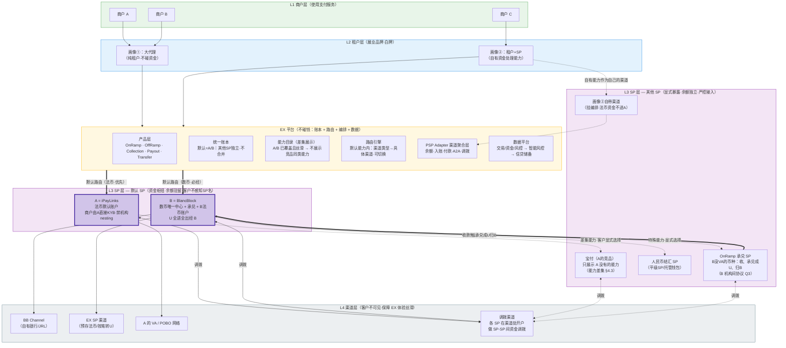
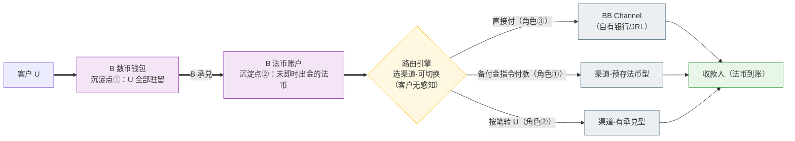
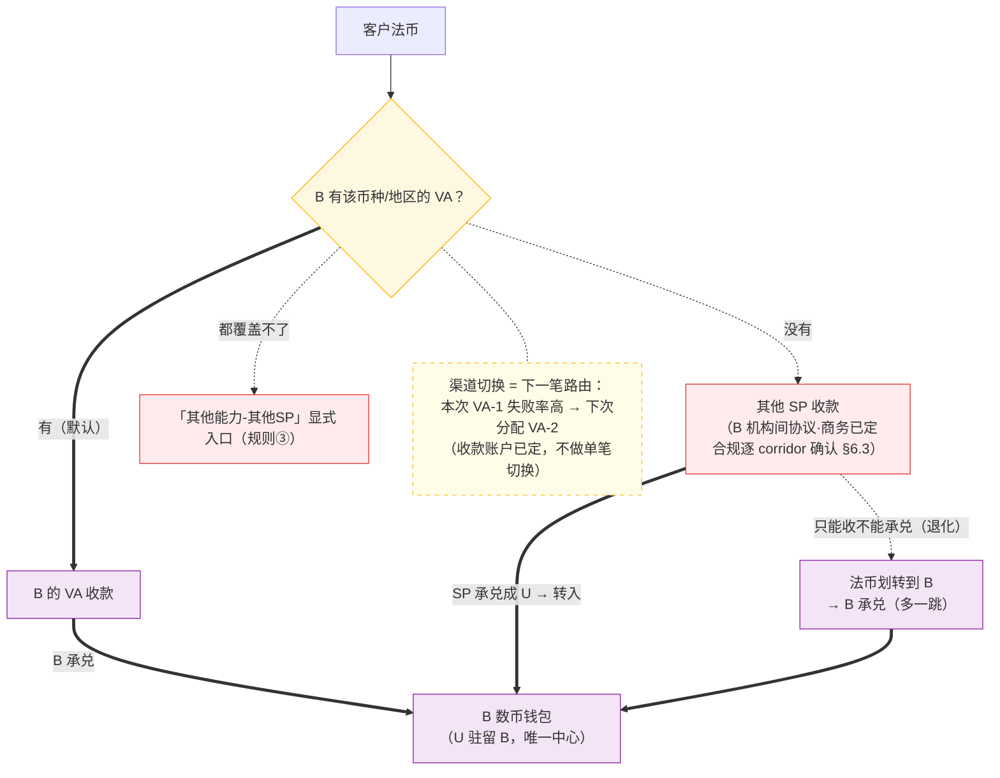
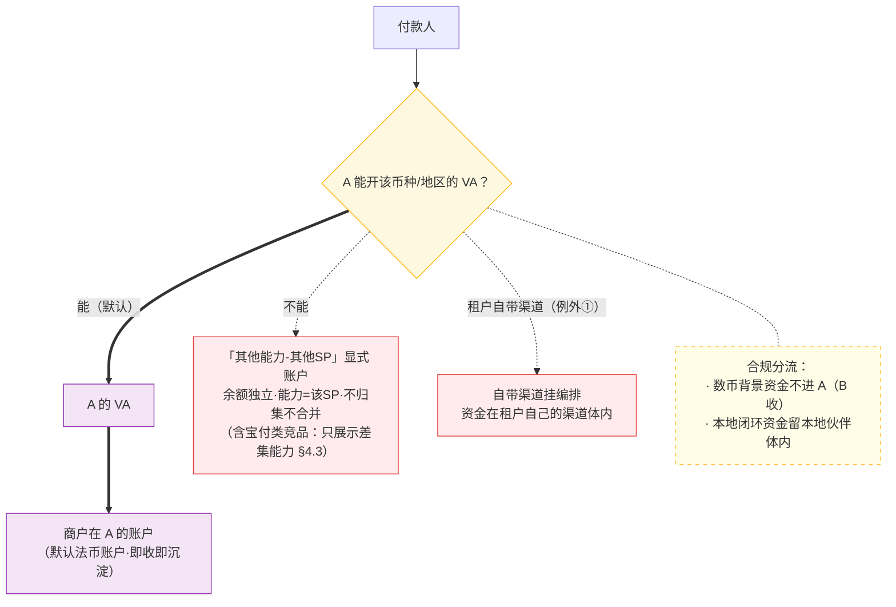
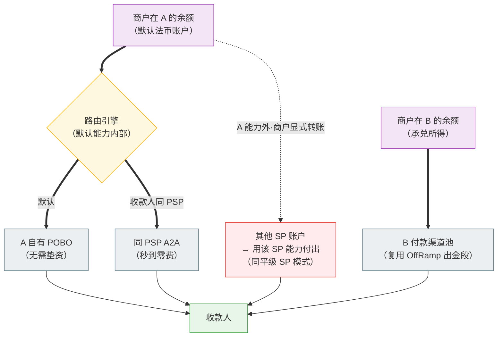

# ABE 定位与多 SP 架构 — 战略推理分析

> **文档类型**：战略定位 + 架构推理（讨论稿）
> **版本**：v0.2 Draft（本轮修订：吸收外部评审——区分「期望的商业结果」与「已成立的架构事实」；降调「中立/必然/无风险」类过强表述；补充利益冲突管理、EX 监管边界、路由 SLA、corridor 合规清单、异常流、分期 KPI）
> **日期**：2026-07-03
> **关联文档**：`ex-three-layer-solution.md`（四层模型）、`brd/ex-multi-sp-architecture-brd-v2.md`（多 SP 推理）、`ex-offramp-v2-reasoning.md`（OffRamp 资金中枢推理）、`下一代跨境支付基础设施BP-architecture.pdf`（老板终极愿景）
> **目的**：从「科技输出 + 资金沉淀 + 数据储备」三个愿景出发，推导 EX 的定位与多 SP On/Off Ramp、法币 Collection/Payout 的可执行架构

---

## 目录

1. [起点：三个愿景事实](#1-起点三个愿景事实)
2. [定位推理：EX 到底是什么](#2-定位推理ex-到底是什么)（含 §2.5 EX 监管边界 RACI）
3. [盈利模式推理：通道 → 数据 → 资金收益](#3-盈利模式推理通道--数据--资金收益)
4. [核心机制：资金如何沉淀在 A/B](#4-核心机制资金如何沉淀在-ab)
5. [防绕开机制：四把锁](#5-防绕开机制四把锁)
6. [可执行架构：四个产品的资金与数据流](#6-可执行架构四个产品的资金与数据流)
7. [分期落地](#7-分期落地)
8. [待讨论问题](#8-待讨论问题)
9. [术语表](#9-术语表)

---

## 1. 起点：三个愿景事实

```
事实❶：ABE 三位一体
  · A = iPayLinks（IPL）— 法币收付牌照（VA 收款、POBO 出款）
  · B = BlancBlock（BB）— 数币牌照 + 承兑引擎 + 链上基础设施
  · E = EurewaX（EX）— 科技平台，不持牌、不持有客户资金（≠ 不受监管，边界见 §2.5）
  → 一个集团，三种角色：两个持牌资金方 + 一个科技编排方

事实❷：东南亚的「支付主权」判断
  · 支付是一个国家的底层基础设施，本国一定会牢牢握在自己手里
  · 外来支付公司（含中国基因的 MSO/MPI 竞品）做大必受限制
  · 但「科技输出」不受此限 — 卡组的 Processor、AI 风控、清结算系统
    都是科技输出的成功先例
  → EX 的选择：不做「在越南做越南人生意的外国支付公司」，
    而做「帮越南本地机构服务越南市场的科技输出方」
  ⚠️ 入场姿势修正：前期一定不是纯科技输出。纯科技在越南这样的
    市场很难开始（本地机构不缺「卖系统的外国公司」，缺的是能力）。
    起手 = 「科技 + 跨境支付能力」捆绑输出：带着跨境收付/承兑能力去，
    帮本地机构把跨境业务做起来 —— 能力是敲门砖，系统是留客锁

事实❸：纯通道 / 纯科技都不是好生意
  · 纯科技输出：项目制收入，盈利难，且 AI 正在抹平技术护城河
  · 纯支付通道 / 承兑通道：费率持续压缩，资本市场估值低
  · 结论（用户直觉，本文展开论证）：A/B 做通道不是长久之计，
    终局要走向理财、贷款等有资金收益的产品
  → EX 要的是「更多数据进来」（为智能风控和未来信贷做储备），
    前面对接租户，后面对接 SP，并让资金尽量沉淀在 A/B

事实❹：老板的终极愿景（BP：下一代跨境支付基础设施）
  · 定位：基于区块链的 AI 跨境支付基础设施 —— 多币种稳定币支付基建
    + 深度融合传统商业生态 + 端到端 AI 风控
  · 行业判断：稳定币年交易量 35 万亿美金 vs 真实商业支付渗透仅
    3,900 亿 → 「渐进式共生」，细分场景单点突破撬动全局
  · ABE 分工（BP 原文）：B = 稳定币支付/发行/托管/实时清算的核心闭环；
    E = 全栈技术基座（跨链编排/钱包身份/Agent Pay/机构赋能开放平台）；
    A = 生态融合（传统银行账户体系 + 庞大跨境客户生态）；
    架构上预留「法币 SPn / 数币 SPn」开放接入位 —— 与多 SP 架构同构
  · 对标 BVNK（Mastercard 已签最高 $1.8B 收购协议、尚待监管审批交割，验证赛道估值锚），差异化四张牌：
    自主可控清算网络、AI 原生（Agent 支付/智能交易大脑）、
    亚太+一带一路主场、主权稳定币定制（发行/托管/清算）
  → 终局不是「更好的通道」，而是「下一代清算网络」本身
```

**三个事实之间存在一个表面矛盾，这是本文要解决的核心问题：**

```
┌─────────────────────────────────────────────────────────────────┐
│  矛盾：「中立科技输出」 vs 「资金沉淀在自家 A/B」                  │
│                                                                 │
│  · 对外讲：我是中立的科技平台，帮本地机构做支付（事实❷）           │
│  · 对内要：资金进我家的 IPL/BB，数据进我家的 EX（事实❸）           │
│  · 如果处理不好 → 本地机构/外部 SP 发现你「假中立」→ 合作破裂      │
│  · 如果不这么做 → 纯科技输出赚不到钱 → 商业模式不成立              │
└─────────────────────────────────────────────────────────────────┘
```

---

## 2. 定位推理：EX 到底是什么

### 2.1 先看别人怎么解这个矛盾

| 案例                                   | 表面身份             | 真实抓手                             | 启示                                       |
| -------------------------------------- | -------------------- | ------------------------------------ | ------------------------------------------ |
| **卡组（Visa/MC）**              | 中立网络/科技标准    | 网络两端必须经过它清算，按交易抽成   | 中立≠不赚钱，关键是**成为必经之路** |
| **Ant International（Alipay+）** | 钱包互联科技输出     | 跨境汇路和 FX 由自己体系承接         | 科技输出获客，**跨境/FX 环节自己吃** |
| **Amazon + AWS**                 | AWS 对外中立         | Amazon 零售是 AWS 第一大客户和试验场 | 自营业务养平台，平台再对外输出             |
| **Stripe**                       | 开发者友好的支付科技 | 沉淀 Treasury/Capital/发卡等资金业务 | 支付是入口，**资金业务是利润**       |

**共同规律**：没有人靠「纯中立科技」赚大钱。成功者都是「**科技做入口，网络做壁垒，资金/数据环节做利润**」。中立是对外叙事，必经之路是内在设计。

### 2.2 EX 的定位：一句话

```
┌─────────────────────────────────────────────────────────────────┐
│                                                                 │
│  EX = 东南亚支付机构的「跨境能力赋能方 + 操作系统 + 清算网络」      │
│                                                                 │
│  · 对本地机构（租户/SP）输出的是：跨境支付能力 + 系统 +           │
│    合规风控 + 渠道聚合 —— 能力和科技捆绑输出，本地机构持牌        │
│    展业，我们不抢它的本地市场（事实❷成立）                        │
│  · 跨境段的赋能规则：A/B 能赋能的自己赋能（跨境收付靠 A、         │
│    承兑靠 B）；A/B 赋能不了的，接入别的机构（外部 SP/卫星        │
│    渠道）来赋能 —— 但编排、账本、数据始终在 EX，结算枢纽          │
│    尽量留在 A/B（见 §4 余额/工具账户机制）                        │
│  · 长期积累的是：全网交易/资金/风控数据 → 智能风控 → 信贷/理财     │
│                                                                 │
│  一句话：本地段让给本地人（换信任和市场准入）；                    │
│         跨境段用能力赋能本地机构（A/B 优先、外部 SP 补位）；       │
│         兑换段、账本段、数据段留给自己（换利润和壁垒）。            │
│                                                                 │
└─────────────────────────────────────────────────────────────────┘
```

### 2.3 为什么这个切分天然成立（不是硬抢）

关键洞察：**本地机构缺的恰好就是跨境段**，这是双方利益天然互补的地方：

| 环节                       | 本地机构（越南 PSP/OTC/银行） | ABE                   |
| -------------------------- | ----------------------------- | --------------------- |
| 本地收单/本地钱包/VND 账户 | ✅ 有牌照、有客群、有银行关系 | ❌ 不该碰（支付主权） |
| 跨境收付（USD/EUR/HKD…）  | ❌ 缺境外牌照、缺境外账户网络 | ✅ A（IPL）核心能力   |
| 数币承兑（U↔法币）        | ❌ 本地合规敏感、缺链上设施   | ✅ B（BB）核心能力    |
| 系统/风控/合规工具         | ❌ 手搓、缺 know-how          | ✅ E（EX）输出        |

→ **对「假中立」问题的正确姿势：不是否认，而是透明管理**。EX 从来就不是纯中立科技商，而是**带有集团跨境能力的编排平台**。对外可以这么讲：「本地生意是你的，我不碰；跨境收付、数币承兑这段你做不了，用我们集团的持牌能力，比你自己再去申一圈牌照快十倍；我们集团能力覆盖不到的地区/币种，我帮你接入其他机构——你只对接我一家。」

⚠️ **但「不是纯科技商」并不自动消除中立性质疑**——它只是把问题从「身份中立」转成了「**路由中立、数据中立、商业边界透明**」。合作方真正关心的是：A/B 与外部 SP 同时有能力时路由是否公平？EX 会不会把外部 SP 工具化、等 A/B 补齐后切走流量？租户数据会不会被 EX 反向用于自己的业务？这些必须用**机制**回答，而不是用叙事回答：

```
利益冲突管理四件套（对外可承诺、可审计）：
  ① 透明披露：与租户/SP 的协议中明示 A/B 为集团关联持牌主体
  ② 路由规则 SLA 化：默认路由须满足量化标准（见 §4.3），
     「丝滑」不是主观词，是价格/成功率/时效/限额/合规可用性指标
  ③ 数据隔离：单租户数据不外用，跨租户仅脱敏聚合（见 §6.7 数据治理）
  ④ non-circumvention 双向对等：EX 要求 SP 不绕开，
     也承诺不利用 SP/租户数据反向抢客
```

**跨境段赋能的优先级规则**（与 §6 卫星渠道模型一致）：

```
能力需求 → 先问 A/B 能不能做？
  ├─ 能 → A/B 直接赋能（资金沉淀 + 利润都在自家，最优）
  └─ 不能 → 接入外部机构（外部 SP / 卫星渠道）赋能
       · 对本地机构：依然只对接 EX 一家（体验不变）
       · 对 EX：编排/账本/对账/数据留在自己手里（锁①②仍成立）
       · 资金：尽量让结算枢纽留在 A/B（外部机构工具化，见 §4.1）
       · 后续：A/B 能力补齐后，流量可切回自家（路由权在 EX）
```

### 2.4 终局形态：从编排网络到稳定币清算网络（与 BP 对齐）

把本文的定位推理与 BP 终极愿景拼在一起，得到一条三段演进路径：

```
第一段（入场，现在）：能力 + 科技捆绑输出
  · 跨境段走传统轨道：A 的汇路/VA + B 的承兑 + 外部 SP 补位
  · 目标：拿下本地机构入口，跑通四层网络，开始沉淀资金和数据

第二段（中期）：编排网络 + 资管
  · 余额/工具账户模型成型，资金沉淀在 A/B，A2A 飞轮转起来
  · 跨境汇路开始双轨：传统轨道（A）与稳定币轨道（B）并行，
    路由引擎按成本/时效/合规选轨道 —— 稳定币轨道有成本与时效
    优势（BP 指标：<0.1%、3-5 秒），但**只会在合规明确、
    流动性充足、对手方接受、出入金可控的 corridor 中优先
    替代传统汇路**（监管、银行关系、客户接受度、税务会计
    处理都会影响迁移速度，不是自然发生）

第三段（终局，BP）：稳定币清算网络 + AI 原生
  · 跨境段的「轨道本身」迁到稳定币：本地法币 ↔（B 承兑/发行）
    稳定币 ↔ 对端法币；传统汇路退为补充和出入金口
  · 主权稳定币服务 = 「支付主权」判断的终极兑现：不仅不抢本国
    支付主权，还帮主权国家发行/托管/清算自己的稳定币 ——
    科技输出的最高形态，东南亚叙事的天然延长线
  · Agent Pay / 智能交易大脑：数据储备的第三重用途
    （风控→信贷→Agent 自动化结算），与四层方案三期 Agent 呼应
```

**关键推论：BB 「数币中心」的地位被强化，但定性仍是「战略选择」而非「必然」**。多 SP BRD 推导❷把它定性为「商业策略」（防绕开）；叠加 BP 后，它同时是**终局架构的一致性选择**：若稳定币清算网络成立，其发行/托管/承兑/清算闭环就是 B，今天的每一笔 On/Off Ramp 都在为终局网络积累流动性、牵引跨境对手方上网。但终局能否实现取决于 corridor 级的监管与市场条件，对外叙事不应写成「必然」。同时 A 的长期角色也更清晰：从「跨境汇路」渐变为**稳定币网络的法币出入金网络 + 传统商业生态入口**（BP 里 A 的定位正是「生态融合」）。

⚠️ **主权稳定币的叙事纪律**：主权稳定币是央行/财政/银行体系共同参与的高敏感议题，外来商业公司过早对本地监管讲「帮你发主权稳定币」可能触发货币主权与外资控制疑虑、适得其反。应分层表达：**客户层**讲跨境收付与清结算效率；**银行/监管层**讲技术底座、可审计账本、AML/KYT、沙盒能力；**资本市场层**才讲稳定币清算网络与主权稳定币可选项。主权稳定币定位为**远期监管沙盒探索**，不作为二期/三期产品承诺。

### 2.5 EX 的监管边界：「不持有客户资金」≠「不受监管」

本文多处强调 EX「不碰钱」，但需要严谨化：在不少司法辖区，是否「碰钱」不是唯一判断标准。只要 EX 实质参与**支付指令发起、资金传输安排、客户资金余额展示、DPT 转移安排、代运营 SP 账户**，就可能被认定为支付服务 / 外包服务商 / 支付发起服务，需要持牌或纳入持牌主体的外包管理（如新加坡 DPT 服务范围已扩展到"安排传输、按客户指令处理 DPT"等行为）。

```
EX 的三分法（替代「EX 不碰钱」一句话）：
  ① EX 不持有客户资金（资金始终在持牌 SP 体内）
  ② EX 可作为技术服务商：账本记录、风控评分、路由建议、数据处理
  ③ 凡涉及付款指令发起、客户资金调拨、DPT 转移、账户操作的动作，
     必须由持牌主体 A/B/SP 发起或授权执行 —— EX 只做「建议 + 记录」

落地要求：每个展业国家做一张「EX 可做 / 不可做 / 必须由持牌方做」
  的 RACI 表，作为产品设计的前置输入（避免产品误以为 EX 可操作资金）
  → 列入 §8 待办（Q15）
```

### 2.6 与竞品的差异

```
中国基因 MSO/MPI 竞品：自己持牌，在越南做越南人生意
  → 天花板 = 外资支付牌照的监管容忍度（迟早被限）
  → 与本地机构是竞争关系

ABE：帮本地机构做生意，自己吃跨境/兑换/数据段
  → 天花板 = 东南亚跨境流量总盘子（随本地伙伴增长而增长）
  → 与本地机构是共生关系
  → 本地伙伴越强，EX 网络越大 —— 竞品做大树敌，我们做大结盟
```

---

## 3. 盈利模式推理：通道 → 数据 → 资金收益

### 3.1 支付生意的三种钱

```
第一种：手续费（Fee）
  · 收款/付款按笔或按比例收费
  · 现状：费率持续压缩（0.1%-1%），同质化竞争，越做越薄
  · 结论：能覆盖成本，撑不起估值 ❌

第二种：汇差 / 承兑价差（Spread）
  · 跨境必然涉及换汇，数币承兑必然有价差（30-150bps）
  · 这是跨境支付真正的利润所在，B 的承兑引擎吃的就是这个
  · 结论：当前的核心利润，但依赖交易量，且竞争会压缩 ⚠️

第三种：资金收益（Float + Credit + Wealth）
  · 沉淀资金的利息收益（float）
  · 基于交易数据的信贷（商户贷、供应链金融）
  · 理财/财资产品（余额生息、代销）
  · 结论：单位经济模型最好、估值最高，但依赖两个前提 ✅
    前提① 资金沉淀 —— 钱得留在你的账户体系里
    前提② 数据积累 —— 授信要靠交易数据做风控
```

### 3.2 对「用户直觉」的论证：为什么终局一定是理财/贷款

行业先例全部指向同一条路径：**支付 → 数据 → 信贷/理财**。

| 公司      | 支付入口      | 资金收益产品                       | 结果                                 |
| --------- | ------------- | ---------------------------------- | ------------------------------------ |
| 蚂蚁      | 支付宝        | 余额宝（理财）+ 花呗/借呗（信贷）  | 信贷贡献主要利润                     |
| Sea Group | SeaMoney 钱包 | SeaMoney Lending                   | **集团利润引擎**，东南亚已验证 |
| Grab      | GrabPay       | GrabFin 借贷 + 数字银行牌照        | 金融板块支撑估值                     |
| Stripe    | 收单          | Stripe Capital（商户贷）+ Treasury | 摆脱纯 processor 估值                |
| Airwallex | 跨境收付      | Yield 账户（余额生息）             | 沉淀资金变现                         |

```
资本市场逻辑（为什么纯通道估值低）：
  · 纯 processor / 通道：可替代性高 → 低倍数（营收 2-5x）
  · 数据 + 风控 + 信贷平台：网络效应 + 数据壁垒 → 高倍数
  · 稳定币基础设施：BVNK $1.8B 被收购已给出估值锚 ——
    这是当前资本市场最认的叙事（BP 已采用）
  → ABE 的资本故事分两层讲：
    对内经营口径 = 「东南亚跨境资金网络 + 数据风控平台」
    对资本市场口径 = 「亚太下一代稳定币清算基础设施（对标 BVNK）」
    两层是同一件事的不同切面：东南亚网络是稳定币基建的
    第一个规模化落地场景，信贷/理财/储备收益是第三章
```

### 3.3 推导：三步价值阶梯与「数据的双重用途」

```
┌─────────────────────────────────────────────────────────────────┐
│  阶梯①（现在）：通道 + 承兑                                      │
│    · Collection/Payout 手续费 + OnOff Ramp 承兑价差              │
│    · 作用：获客、跑通网络、开始积累数据                           │
│                                                                 │
│  阶梯②（1-2年）：资管 + Float                                    │
│    · 跨 PSP 余额聚合/调拨（四层方案已规划）                       │
│    · 沉淀在 A/B 的余额产生利息收益；余额生息产品（合规前提下）      │
│    · 作用：加深资金沉淀，把「路过的钱」变成「留下的钱」            │
│                                                                 │
│  阶梯③（2-3年+）：数据 → 信贷/理财 + 稳定币发行储备收益           │
│    · EX 全网交易数据 → 商户信用画像 → 商户贷/垫资/供应链金融       │
│    · 理财产品代销（轻资本）→ 自营财资（重资本，需牌照）            │
│    · 若 B 走到稳定币发行（BP 终局）：储备金收益（国债利息）       │
│      是比放贷更轻、更大的 float —— Tether 模式已验证               │
│                                                                 │
│  关键：EX「要更多数据进来」有双重用途 ——                          │
│    防守用途：智能风控/AML（合规生死线，本身就是卖点）              │
│    进攻用途：信贷授信引擎（阶梯③的利润来源）                      │
│  同一份数据资产，先当盾，后当矛。                                 │
└─────────────────────────────────────────────────────────────────┘
```

> ⚠️ 诚实的提醒：信贷/理财每一项都需要**当地牌照 + 资本金 + 风险自担能力**，不是产品功能而是新业务线。**Float/Yield 是潜在收益，不是默认收益**——客户资金产生的利息至少涉及：利息归客户还是归持牌机构？客户资金是否必须隔离/信托/低风险存放？利息能否分给商户？是否构成存款/理财/收益型支付账户？（新加坡支付框架下客户资金通常要求隔离保障、信托账户、每日对账 —— float 不是单纯的平台利润池）。正确节奏：**第一阶段**只做资金保障与余额管理；**第二阶段**调研客户资金利息归属与牌照边界；**第三阶段**在合规许可下做余额生息、理财代销或与持牌方合作的收益产品（助贷模式）。自营放贷放最后。

---

## 4. 核心机制：资金如何沉淀在 A/B

### 4.1 为什么资金要优先落到 A/B：从“通道路由”升级为“清算网络”

ABE 的核心不是简单连接多个 SP，而是把本地支付、跨境收付、法币兑换、数币承兑、账本风控和清算网络组合成一套可运营的跨境资金基础设施。因此，资金不能长期只停留在外部 SP 侧，而应在合规、成本、时效和客户体验允许的前提下，优先归集到 A/B。

资金落到 A/B 的原因有六点：

第一，资金在哪里，能力就在哪里。外部 SP 只能提供局部收付能力；A/B 才承载 ABE 自有的跨境账户、换汇、On/Off Ramp、数币账本、余额管理和清算能力。如果资金不进入 A/B，EX 只能做技术路由和状态查询，无法真正控制后续换汇、承兑、出金、退款、冻结和对账。

第二，资金落到 A/B，ABE 才能从“连接器”变成“网络”。如果资金始终留在外部 SP，客户可以绕过 EX 直接连接该 SP，ABE 的价值会被压缩成系统费或路由费。资金进入 A/B 后，客户使用的是一个跨境资金账户，而不是单一通道。

第三，A/B 承接的是本地 PSP 难以补齐的能力。本地收款、本地付款可以交给本地 SP；但跨境收款、多币种结算、法币换汇、法币与 U 的承兑、链上 KYT、数币清算和统一账本，应优先由 A/B 承接。这不是抢本地段，而是把 ABE 的核心能力沉淀在跨境段和兑换段。

第四，资金落 A/B 才能形成完整数据资产。EX/E 需要沉淀交易、资金、风控和对账数据。若资金只在外部 SP，EX 拿到的是碎片化订单状态；若资金进入 A/B，ABE 才能形成连续资金流水、商户画像、风控记录和后续授信基础。

第五，资金落 A/B 才能形成账户粘性。客户在 A/B 中形成余额后，可以继续完成换汇、出金、U 转法币、法币转 U、供应商付款、统一对账和余额管理。客户依赖的对象从“某条通道”升级为“跨境资金账户”，绕开动机会下降。

第六，资金落 A/B 是未来收益的前提。余额管理、资金效率、提前结算、商户贷、供应链金融、理财代销和稳定币储备收益，都依赖可识别、可归属、可对账、可管理的资金流水和余额。但这些收益必须在牌照、客户资金隔离、利息归属和客户授权清晰后逐步推进，不能在第一阶段作为默认收入。

因此，ABE 的资金策略不是“所有资金都必须进 A/B”，而是：

本地闭环资金留给本地 SP；
跨境资金优先进入 A；
数币和 On/Off Ramp 资金优先进入 B；
A/B 暂不覆盖的币种、国家和支付方式由外部 SP 补位；
所有交易、风控、对账和资金状态回流 E/EX，形成统一账本和数据资产。

一句话：外部 SP 解决触达，A/B 承接清算，E/EX 沉淀账本和风控。资金落到 A/B，是 ABE 从支付通道变成跨境资金网络的关键。

### 4.2 核心设计：账户模型 v2 —— 「默认能力 + 其他能力」（交易所模式）

> ⚠️ v0.1 曾提出「余额只在 A/B，外部 PSP 全部工具化+隐藏归集」。
> 讨论后修正：**余额不做汇总处理，连表面合并也不做**。
> 理由：资金实际在各 SP（持牌机构/渠道）手里，换汇/conversion 等
> 能力每家 SP 不一样 —— 合并展示 = 向客户承诺一个不存在的「统一
> 能力」，下单时才发现做不了，处理麻烦且客户懵。能力跟着资金走。

```
┌─────────────────────────────────────────────────────────────────┐
│  规则①：数币 → B 唯一余额中心                                    │
│    所有 U 无论从哪进来，最终驻留 B；出金全部经 B                  │
│    ⚠️ 数币不存在传统法币 nesting，但存在客户资产隔离与链上     │
│    合规穿透要求：每笔进入 B 的 U 必须保留上游 SP、原始付款人、 │
│    KYB/KYT、资金背景、承兑报价、链上路径与 Travel Rule 信息      │
│                                                                 │
│  规则②：法币 → A 为「默认账户」，不做跨 SP 余额汇总              │
│    · A 禁止 nesting（已确认含义：机构-机构资金嵌套 ——          │
│      A 不服务支付机构，机构账户里嵌套其下游客户资金风险很大）  │
│    · 推论：商户（贸易企业）由 A 直接 KYB 开户 →                  │
│      **合规方向可行，商业可用性待验证**（开户分层见下方）    │
│      支付机构（画像②）的资金不进 A → 用它自己的渠道 ✅       │
│    · 商户法币余额 = 商户在 A 的账户，能力（换汇/出金/币种）      │
│      = A 的能力                                                  │
│                                                                 │
│  规则③：A/B 覆盖不了的 → 「其他能力 - 其他 SP」显式入口          │
│    · 类比交易所的场内（默认）/场外（其他）：默认给 A/B 能力，     │
│      超出部分列为「其他能力」，客户显式选择、显式感知             │
│    · 该 SP 的余额/能力独立展示，不与默认账户合并                  │
│    · 这是 OffRamp v2 §12「平级SP/托管钱包」模式的推广            │
│                                                                 │
│  规则④：严格控制接入其他 PSP（默认不接），只有两种例外：          │
│    ① 租户自己已经对接了该 PSP（自带渠道，挂进 EX 编排）          │
│    ② 租户本身就是 SP（有资金处理能力），需要接其他渠道           │
└─────────────────────────────────────────────────────────────────┘
```

为什么不做余额汇总（哪怕表面合并也不做）：

```
① 能力跟着资金走：钱在哪个 SP，换汇/出金/费率就是那家的能力，
   合并展示会造成「能力错觉」，体验更差
② 账务上跨 SP 合并意味着 EX 要垫资/做内部清算 → EX 不碰钱，不可行
③ A 禁止 nesting → 法币侧没有「统一资金池」的合规基础
→ 正确做法：默认账户（A法币/B数币）作为产品默认能力、弱化 SP 名；
   其他 SP 显式独立展示 —— 「不见 SP」只适用于默认能力内部
```

这与既有结论的关系：

- 多 SP BRD 推导❷「数币只在 BB」→ 规则①，不变
- 多 SP BRD 推导❸「法币按 SP 独立」→ 从「过渡方案」升级为长期规则（nesting 禁止 + 能力差异是结构性的，不是暂时的）
- OffRamp v2 §11「BB 资金中枢」→ 规则①在 OffRamp 场景的具体化；§12「平级 SP」→ 规则③的先例
- 约束❶「客户不感知 SP」边界更清晰：**默认能力内不感知（A/B 就是产品本身），默认能力外显式感知（其他 SP）**——但「不感知」仅限产品层，法律层必须披露（见 §6.6 三层表达）

**开户分层（回应「A 直接 KYB」的规模化成本问题）**：若 L2 大代理下大量 L1 商户都由 A 直接 KYB，会出现开户周期长、本地语言资料采集复杂、小商户转化率下降、白牌体验被合规流程打断、A 合规团队成为规模瓶颈等问题（Q12 剩余确认点）。建议分层：

```
大商户：A 直接 KYB + 独立账户
中小商户：租户采集资料，A 做审核或抽检（外包尽调模式，需 A 合规确认）
极小商户/本地闭环：不进 A，留在本地 PSP 体系（呼应 §4.5①）
```

### 4.3 客户画像拆分与默认方案

```
画像①：大代理（纯租户）
  · 特征：无资金处理能力，纯获客/服务商户
  · 方案：全套默认 A/B
     – 数币：全部以 B 为资金中心（无 nesting 问题）
     – 法币：默认 A；A 不满足的能力 → 「其他能力-其他SP」显式入口
     – OnRamp：B 有 VA 的走 B；B 没 VA 的走其他 SP 收 →
       变成数币后一律归 B，出金都经 B
     – OffRamp：U 先到 B → B 出（B = 数币中心）
     – 真都覆盖不了的 → 「其他能力-其他SP」
  · 效果：资金沉淀最大化（全在 A/B），产品最简单，EX 利润主力

画像②：租户 + SP（自己有资金处理能力，也拓展客户）
  · 特征：自己持牌/有渠道，缺的是系统、跨境段、数币段
  · 方案：系统 + 编排输出；它自己的资金能力作为它自己的渠道
    接入（规则④例外②）；数币段仍经 B；跨境段缺什么补什么
  · 注意：它是支付机构 → 受 nesting 禁止约束，它及其客户的
    法币资金**不进 A**，走它自己的渠道；数币无此限制，经 B
  · 收费（已定案）：Setup Fee + Monthly Fee +
    Transaction Processing Fee（现有收费模型）+ 数币段承兑价差
  · 效果：不强求资金沉淀，换入口、数据、B 的数币段流量
  · 这正是东南亚定位里的「本地持牌机构」（§2.3）

→ 接入其他 PSP 的决策逻辑从「EX 主动扩渠道」改为「客户画像驱动」：
  画像①尽量不接（A/B 优先，其他 SP 是补位不是主力）；
  画像②的渠道是它自带的，EX 只做编排，不做商务主体
```

### 4.4 竞品 SP 接入规则：能力差集原则（宝付案例）

场景：我们要对接宝付。宝付理论上是 A 的竞品（同类法币收付能力）。

```
接入与展示规则（能力差集原则）：

  某 SP 的能力 X，接不接、展不展示，这样判断：

  ① A/B 有能力 X，且满足「默认路由 SLA」（见下方）
     → 推荐/路由 A/B，**不展示**该 SP 的能力 X（客户默认看不到）
  ② A/B 有能力 X，但未达 SLA（币种/时效/成功率差距明显）
     → 该 SP 补位或作为备选路由；A/B 达标后切回（路由权在 EX）
  ③ A/B 没有能力 X（如宝付有新能力）
     → 该 SP 作为「其他能力-其他SP」显式接入（规则③）

  默认路由 SLA（「丝滑」的量化定义，否则会被看成「伪聚合、真导流」）：
  · A/B 需同时满足：价格（不高于市场基准 x%）、成功率、到账时效、
    限额、合规可用性、对账稳定性六项指标，才作为默认能力
  · 外部 SP 明显更优时，允许企业客户通过「高级路由配置」选择备选
  · 指标阈值由 EX 产品+商务定期评审，对租户/SP 可披露规则框架

  → 其他 SP 在 EX 上的「能力清单」= 该 SP 全量能力 − A/B 已覆盖能力
    （差集展示，不是全量展示）
```

为什么这样设计：

- **保护默认能力的沉淀盘**：A 有的能力同时展示宝付 = 左右互搏，分流 A 的资金沉淀
- **与规则③一致**：其他 SP 的存在意义 = 补 A/B 的能力缺口，不是提供第二选择
- **与「切回」机制配套**：A 补齐能力后差集自动缩小，宝付展示面收窄 —— 路由权和展示权都在 EX 手里
- **客户体验一致**：客户看到的永远是「默认能力 + 若干显式补充能力」，不会出现两个雷同选项

### 4.5 沉淀的三个飞轮（让商户「愿意」把钱留在 A/B）

```
飞轮①：A2A 网络效应（Credit Transfer）—— ⚠️ 定性为待验证增长假设
  · 同 SP 体内转账 = 秒到 + 零成本
  · 网络内商户越多 → 留在 A/B 余额里付款越划算 → 更多商户留余额
  · 这是把「余额账户」做成网络的关键：余额不是存款，是网络门票
  · 成立前提：双方都在同一可转账账户体系、且账户被高频用于
    真实交易。若 A 主要是跨境收款账户而非本地经营主账户、
    B 余额主要来自承兑过境，飞轮不会自动形成 —— 需先找高频
    场景验证：跨境贸易上下游 / 代理商与下级商户 / 承兑商网络 /
    平台卖家结算网络

飞轮②：兑换/承兑便利
  · 只有 A/B 余额能一键承兑（U↔法币）、一键换汇
  · 其他 SP 账户的钱要先转回默认账户才能用这些能力
    → 商户自然倾向让钱尽快进枢纽

飞轮③：资金收益（阶梯②后启用）
  · 只有 A/B 余额享受生息/理财/授信额度
  · 余额时长和金额 → 信用画像 → 未来贷款额度
  → 三个飞轮都是「利益引导」而非「强制锁定」，对外叙事成立
```

```
⚠️ 监管现实约束（必须承认，避免过度设计）：

① 本地闭环资金沉淀不了
   越南商户收 VND 付 VND → 钱在本地 PSP/银行体内，出不了境
   （VND 资本管制）→ 这段资金归本地伙伴，EX 只赚系统费/数据
   → 这正好呼应定位：本地段让给本地人

② 数币背景资金进不了 A
   IPL 是 MSO，合规上不能承接数币背景资金（多SP BRD 推导❸）
   → On/Off Ramp 的法币段只能沉淀在 B，不能到 A

③ 真正能沉淀的是「跨境段 + 兑换段」
   跨境收款（USD/EUR）→ 沉淀在 A
   承兑前后的法币/数币 → 沉淀在 B
   → 这两段恰好是利润最厚的段，够了
```

---

## 5. 防绕开机制：四把锁

**问题**：前期 A/B 能力一般时，租户为什么不绕开 EX 直连 SP？

> ⚠️ 定性修正：四把锁是**降低绕开动机的机制**，不是「防绕开成功」的结论。真正的防绕开靠：价格不输直连、对账和风控显著省人、失败切换确实提升成功率、多币种/多国家/多轨道综合成本更低；合同条款兑底，但不作为核心护城河。各锁的强度诚实评估：锁①在单 SP 够用时价值下降；锁②早期数据少时锁不住，迁移也非不可能；锁③仅在数币/A-B 余额场景有效；锁④ non-circumvention 难以完全防住（尤其客户已知 SP 名时）。

```
锁①：功能锁 — 只有 EX 有的东西
  · 多 SP 聚合：一次对接 = N 个 SP；绕开 = 自己逐家对接/对账/换汇
  · 失败切换：单 SP 付款失败自动切换（OffRamp v2 核心场景），
    直连单一 SP 没有这个能力
  · 白牌系统：租户的客户端/后台/风控整套是 EX 输出的，
    绕开 = 自己重建整套系统
  → 前期最靠得住的一把锁：EX 卖的不是「通道」而是「操作系统」

锁②：数据锁 — 越用越离不开
  · 统一账本、历史订单、自动对账底稿、商户 KYB 档案、风控画像
    全部在 EX；迁走 = 数据资产归零重来
  · 时间越长锁越深（这也是「要更多数据进来」的第三重用途）

锁③：资金锁 — 结构性不可绕
  · B 是自家的：所有涉及数币的流程（On/Off Ramp）必经 B，
    这一段结构性无法绕开 ✅
  · 余额在 A/B + A2A 网络：绕开 EX = 退出转账网络 + 失去余额权益
  · 设计原则：每个产品流程中，至少有一段必须经过 A/B/E 自有能力
    （数币段靠 B、跨境段靠 A、系统段靠 E）

锁④：商务锁 — 合同与价格
  · SP 侧：合作协议加「禁止绕开条款」（non-circumvention），
    并以 EX 聚合量向 SP 换独家/优惠价 → 租户直连拿不到 EX 价格
  · 租户侧：前期定价贴近 SP 直连价（利润在汇差和后期资金收益，
    不在通道费）→ 绕开省不了几个钱，却失去锁①②③的全部价值
```

```
最脆弱的场景自查：纯法币 Collection/Payout（不涉数币、单一本地 PSP 可满足）
  → 锁③失效（没有数币段）、锁①减弱（单 SP 够用时聚合价值低）
  → 对策：这类场景必须靠「系统 + 数据 + 对账 + 合规工具」留客（锁①②），
    并尽快让 A 的通道价格/覆盖有竞争力；接受少量流失，
    把资源聚焦在多 SP / 跨境 / 含兑换的高壁垒场景
```

---

## 6. 可执行架构：四个产品的资金与数据流

### 6.1 总架构：默认 SP（A/B 枢纽）+ 其他 SP（差集补位）



**与四层模型的映射与修正**：

- **L1 商户 / L2 租户**：不变；L2 按画像拆成两类（§4.2），画像② 是四层方案里「非持牌 SP（OTC）」的持牌版扩展
- **L3 SP 层同一层、两个梯队**：颜色统一（都是 SP），但 **默认 SP（A/B）在上、加粗突出**——余额驻留地、客户不感知（粗实线=默认路由）；**其他 SP 在下**——显式暴露、余额独立、严控接入（虚线=客户显式选择或例外接入）
- **宝付的位置**：虽然它在四层方案的 L4 渠道清单里，但作为 A 的竞品，它在本架构中只出现在「其他 SP」梯队，且只暴露能力差集（§4.3）——A 有且丝滑的能力，宝付不展示
- **L4 渠道层的双重职能**：① 支付执行通道（B 的渠道池 + A 的自有网络），客户不可见、路由引擎可切换；② **调拨渠道——EX 会接入一些渠道，各 SP 在渠道处开户，做 SP-SP 间的资金调拨**（如其他 SP 收款划到 B、B 的兑换所得划到出金渠道），跨 SP 的资金腾挪在渠道层完成，**客户在 EX 上的体验因此丝滑**（背后调拨客户全程无感知）
- **能力目录（CAP）是新增组件**：管理「哪些能力展示、映射到哪个 SP」，差集逻辑在这里实现——展示权与路由权都在 EX

### 6.2 产品一：OffRamp（U → 法币）

> 完全沿用 `ex-offramp-v2-reasoning.md` §11 统一模型，此处标注沉淀点与数据点。

```
资金流：
  客户 U → B 数币钱包（沉淀点①：全部 U 驻留 B）
        → B 承兑 → B 法币账户（沉淀点②：未即时出金的法币驻留 B）
        → 路由引擎选渠道执行付款：
           ├── BB Channel（自有银行/JRL）— 直接付
           ├── 卫星渠道-预存法币型 — B 备付金指令付款（角色①）
           └── 卫星渠道-有承兑型 — B 按笔转 U（角色②）
  切换逻辑：客户资金始终在 B，换渠道=换执行方（客户无感知）

数据流：链上入金 KYT → 承兑价差记录 → 出金收款人画像 → 全量入 DATA
防绕开：数币段必经 B（锁③结构性成立）
```



> 切换逻辑：客户资金始终在 B，换渠道 = 换执行方；渠道层对客户不可见。

### 6.3 产品二：OnRamp（法币 → U）

```
约束回顾（OffRamp v2 §8）：OnRamp 更难 —— 法币汇入时收款账户已定，
  「这一笔」无法切换渠道，只能影响「下一笔」。

资金流（Phase 1 = 纯 B 闭环，与既有决策一致）：
  客户法币 → B 法币账户（同名充值 / B 的 VA）
          → B 承兑 → B 数币钱包（沉淀点：U 驻留 B）

资金流（Phase 2 = 其他 SP 收款扩展）：
  · B 有 VA 的币种/地区 → 通过 B 收（默认）→ B 承兑 → B 数币钱包
  · B 没 VA 的 → 通过其他 SP 收 → 该 SP 承兑成 U → 转入 B
    （变成数币后一律归 B，数币唯一中心不变）
  · 真都覆盖不了的 → 「其他能力-其他SP」显式入口（规则③）

关键设计：
  · OnRamp 的「渠道切换」实现为收款工具的「下一笔路由」
    （本次分配 VA-1 失败率高 → 下次分配 VA-2），不做单笔切换
  · 其他 SP 收款段的前提：该 SP 需有承兑能力（收法币→出 U）；
    若只能收不能承兑 → 退化为法币划转到 B 再由 B 承兑（多一跳）

⚠️ 合规定性降级：「有机构间协议即可」只解决商务层 ——
  **商务模式已定，合规待逐 corridor 确认**（Q3 定案范围修正）。
  每个 OnRamp corridor 上线前需过一遍 checklist：
  ① 收款主体与其代收资质  ② 资金所有权归属
  ③ 客户身份穿透（B 如何识别原始付款人）  ④ 承兑主体资质
  ⑤ 报价与滑点归属  ⑥ 链上转账路径与 Travel Rule 信息传递
  ⑦ 失败退款路径  ⑧ 冻结/制裁命中处理与责任划分
  ⑨ AML/CFT 与税务责任（付款人/租户/商户/SP/B 跨国分布时）
  ⑩ 最终账务归属
```



### 6.4 产品三：Collection（法币代收，独立产品）

```
资金流：
  付款人 → 收款渠道：
     ├── 默认：A 的 VA → 直接落商户在 A 的账户（即收即沉淀）
     └── A 开不了的币种/地区 → 「其他能力-其他SP」显式账户
         （余额独立展示，能力=该 SP 的能力，不归集不合并）
  商户视角：默认账户（USD 余额，不标注 A）+ 其他能力账户（显式）

沉淀点：商户在 A 的账户（跨境收款资金枢纽）
路由原则：
  · A 能开的币种/地区 → 一律 A 的 VA（默认能力）
  · A 开不了的 → 不做隐藏归集，走显式「其他 SP」；租户自带
    渠道的（规则④例外①）挂进编排，资金在租户自己的渠道体内
合规注意：
  · 数币背景资金不得归集进 A（MSO 限制）→ 账本层打「资金背景」标签，
    On/Off Ramp 资金与纯贸易资金物理分流（B收 vs A收）
  · 本地闭环（VND收VND付）→ 不归集，留在本地伙伴体内（见 4.5①）
```



### 6.5 产品四：Payout（法币代付，独立产品）

```
资金流：
  商户在 A 的余额 → 路由引擎（默认能力内部）：
     ├── A 自有 POBO（默认：A 的核心能力，无需垫资）
     └── 同 PSP A2A（收款人在同一 PSP 有账户 → 秒到零费，四层方案一期能力）
  A 能力外的付款需求 → 「其他能力-其他SP」：商户先把钱转到
    该 SP 账户（显式操作，同平级 SP 模式）→ 用该 SP 能力付出
  商户在 B 的余额（承兑所得）→ B 的付款渠道池（= OffRamp 出金段，复用）

沉淀点：付款前余额驻留 A/B；备付金管理是主要资金风险点
  → 备付金策略沿用 OffRamp v2 结论：BB/A 自有渠道优先（角色③）、
    预存法币为辅（角色①，设单渠道敞口上限）、按笔转U可选（角色②）
```



### 6.6 账户模型汇总（商户视角）

```
┌────────────────────────────────────────────────────────────────┐
│  商户看到的（画像① 默认方案）：                                  │
│  · 默认数币账户：USDT 5,000（实际=B钱包，不标注）                 │
│  · 默认法币账户：USD 10,000（实际=商户在A的账户，不标注）          │
│    ｜兑换所得 USD 2,000（实际=B账户，按用途命名不露SP名）          │
│    （两者不合并 —— 能力不同：A=收付/换汇，B=承兑/出金）           │
│  · 其他能力账户（显式）：如「人民币结汇-某SP」「XX币种收款-某SP」  │
│    —— 余额独立、能力独立、客户显式选择                            │
│                                                                │
│  商户看不到的：                                                  │
│  · 默认能力内部的渠道选择（OffRamp 出金走哪个渠道、渠道切换 ——     │
│    渠道类型可见，具体渠道不可见）                                 │
│  · A/B 的主体名不在产品前台强调（默认账户就是产品本身）         │
└────────────────────────────────────────────────────────────────┘
```

⚠️ **「不感知 SP」的三层边界（产品可弱化，法律必须披露）**：商户法币账户实际是商户在 A 的账户、且由 A 直接 KYB —— 那么开户协议、隐私政策、资金服务协议、收款账户名、付款指令、投诉处理、资金保障说明里，商户必须知道 A 的主体身份，否则与 KYB/开户/资金协议直接冲突：

```
产品层：可叫「默认收付款账户」「兑换账户」，弱化 SP 名 ✅
合同层：必须披露实际资金服务提供方 A/B（开户/资金保障/隐私/合规文件）
路由层：具体执行渠道可不展示，但资金托管/开户主体不能完全不展示
一句话：产品上可以不强调 A/B，法律上不能不披露 A/B
```

### 6.7 数据平面（贯穿四个产品）

```
每笔业务强制沉淀的数据（这是 EX 的「第二资产负债表」）：
  · 交易层：订单、金额、币种、对手方、成功率、时延、费率
  · 资金层：余额快照、归集记录、备付金水位、调拨路径
  · 风控层：KYC/KYB 档案、KYT 命中、设备/IP、行为序列
  · 对账层：三方对账差异、差错处理记录

近期用途（防守）：AML/风控规则引擎 → 卖给租户/SP 的合规工具
远期用途（进攻）：商户信用画像 → 授信模型 → 阶梯③信贷产品
架构要求：数据埋点在产品设计时定义，不能事后补
  （每个 PRD 增加「数据字段清单」章节 —— 建议落为规范）
```

⚠️ **数据治理原则（数据的「可用性」不是天然的，需换取租户信任）**：数据来自租户和商户，租户会担心 EX 用其商户数据训练自己的风控模型、绕过它直接给商户放贷/理财、用聚合数据给其竞争对手优化费率、以及跨境数据传输合法性。仅在协议中「明确数据使用范围」（Q6）还不够，需明文治理原则：

```
① 单租户数据不外用（不用于服务其竞争对手、不反向抢其客户）
② 跨租户只做脱敏聚合建模，不做单租户数据变现
③ 商户授信必须取得商户本人授权
④ 租户可选择是否参与信贷/理财产品（opt-in）
⑤ 数据用途分四类分别授权：合规必需 / 产品优化 / 风控建模 / 商业变现
⑥ 跨境数据传输遵循来源国与展业国数据合规（列入 §8 Q6 扩展）
```

### 6.8 异常流与差错处理（产品设计前置，直接影响账本设计）

正常资金流已由 §6.2–6.5 覆盖；但支付系统最易出问题的是异常场景。以下异常必须在架构期定义状态机，否则后续账本、对账、客服都会被拖死：

```
典型异常场景：
  · 客户打错金额 / VA 入账但订单匹配失败
  · 链上已入金但 KYT 命中（需冻结待审）
  · 外部 SP 已收款但未承兑 / 承兑报价过期（FX Rate Expired）
  · B 已转 U 但外部渠道未付款 / Payout 失败退款回哪个账户
  · 资金被冻结时前台余额如何展示
  · 多 SP 对账差错：谁先垫、谁承担损失

统一订单/资金状态机（所有产品共用）：
  Pending · Failed · Reversed · Refunded · Frozen ·
  Manual Review · Partial Settled · FX Rate Expired · Compliance Hold

要求：每个产品 PRD 附「异常流」章节，明确每个状态的
  触发条件、资金去向、责任方、客户可见文案与对账处理
```

---

## 7. 分期落地

| 期                        | 主线                                                                                                                          | 资金沉淀动作                                             | 数据动作                                          |
| ------------------------- | ----------------------------------------------------------------------------------------------------------------------------- | -------------------------------------------------------- | ------------------------------------------------- |
| **一期（当前）**    | OffRamp（B 中枢）+ A2A/MOR + 入账通知 + 付款发起（四层方案一期不变）                                                          | 落地账户模型 v2（默认 A/B + 其他能力显式，不做余额汇总） | 统一数据模型定稿；KYT/交易数据全量落库            |
| **二期**            | Collection/Payout 默认能力补齐（A 的币种/地区覆盖）；OnRamp 其他 SP 收款（收→承兑成U→归B）；画像②（租户+SP）自带渠道挂编排 | A2A 网络推广（飞轮①）；余额生息调研（飞轮③合规路径）   | 风控规则引擎产品化（对租户售卖）；商户信用画像 v1 |
| **三期**            | Agent 化运营（对账/调拨/报价 Agent，对齐 BP Agent Pay）；理财代销/助贷试点；稳定币轨道在跨境段双轨并行                        | Float 收益落地；授信额度与余额挂钩                       | 授信模型上线；数据合规体系（跨境数据/用户授权）   |
| **远期（BP 终局）** | 自主清算网络；主权稳定币定制（发行/托管/清算）；RWA 支付支撑                                                                  | 稳定币发行储备金收益；流动性网络运营                     | 智能交易大脑（风控+路由+定价自进化）              |

⚠️ **每一期必须配可验收 KPI（否则分期沦为路线图口号）**。例如「一期 OffRamp B 中枢落地」不能只写"落地"，需定义支持几个币种/国家/SP、成功率、平均到账时长、人工对账比例、备付金周转率、单渠道敞口上限、KYT 命中处理时长、账实差异容忍度等。每期建议加 5 类 KPI：

```
业务 KPI：交易量、客户数、corridor 数
资金 KPI：沉淀余额、备付金周转、单渠道敞口上限
通道 KPI：成功率、到账时效、失败切换成功率
合规 KPI：KYT 覆盖率、人工审核时长、冻结处理 SLA
财务 KPI：take rate、spread、单笔毛利、对账人效
→ 具体阈值在各期 PRD/BRD 立项时定稿（本文只定框架）
```

---

## 8. 待讨论问题

| #   | 问题                                                                                                                                                                                                                                                              | 我的初步倾向                                                                                                                                                                          |
| --- | ----------------------------------------------------------------------------------------------------------------------------------------------------------------------------------------------------------------------------------------------------------------- | ------------------------------------------------------------------------------------------------------------------------------------------------------------------------------------- |
| Q1  | **对外叙事的透明度**：对本地机构/租户，「跨境段走我们集团持牌主体」讲到什么程度？完全坦白 vs 只讲能力不讲主体？                                                                                                                                             | 倾向坦白讲「集团持牌能力」——因为切分互补（§2.3），藏着掖着反而像假中立                                                                                                             |
| Q2  | ~~A/B 法币余额是否合并~~ **已定案（本轮讨论）**：不做余额汇总，交易所模式（默认+其他）。剩余问题：默认账户的命名体系（按用途？按币种+能力？）                                                                                                              | 倾向按用途命名：「收付款账户」（A）vs「兑换账户」（B），不露 SP 名                                                                                                                    |
| Q3  | OnRamp 其他 SP 收款段的定性：**商务模式已定**（B 直接与 SP 机构间安排，先例：越南机构与非本地承兑商合作，如加拿大 MSB 牌照下机构做 USD-U）；**合规待逐 corridor 确认**（收款资质/资金所有权/身份穿透/Travel Rule/退款/制裁/税务，见 §6.3 checklist） | 客户只感知「充值成功」；每个 corridor 上线前过 checklist，不默认「有协议即可」                                                                                                        |
| Q4  | **本地闭环业务做不做**：VND 收 VND 付沉淀不了资金，只有系统费和数据。值得投入吗？                                                                                                                                                                           | 倾向做——它是本地伙伴的主场需求（信任入口）+ 数据来源，但用标准化系统低成本覆盖，不定制                                                                                              |
| Q5  | **阶梯③的第一站**：余额生息（哪个主体、哪个牌照）？助贷合作方？东南亚哪个市场先试？                                                                                                                                                                        | 需要专项调研：新加坡 MAS 框架下 B 的客户资金利息合规性 + 与本地放贷牌照方的助贷模式                                                                                                   |
| Q6  | **数据使用授权**：用租户/商户的交易数据做授信模型，隐私与竞业边界在哪（租户会担心 EX 用它的数据养自己的业务）？                                                                                                                                             | 需在租户协议中明确数据使用范围；聚合脱敏建模，不做单租户数据变现                                                                                                                      |
| Q7  | **A 的通道竞争力时间表**：纯法币 Collection/Payout 场景锁③失效（§5），A 的价格/覆盖多久能打平市场？打平前接受多少流失？                                                                                                                                   | 需要 A 侧给出通道 roadmap，EX 据此决定该场景的补贴/优先级                                                                                                                             |
| Q8  | **卫星 PSP 的授权机制**（四层方案待办延续）：EX 借 SP 身份操作卫星 PSP 账户的权限与法律定性                                                                                                                                                                 | 沿用四层方案 6.2 待办，需在二期扩渠道前解决                                                                                                                                           |
| Q9  | **双口径叙事的兼容性**：BP 对资本市场讲稳定币基建，但东南亚多国（如越南）禁止加密支付 —— 本地展业口径要不要「去稳定币化」（只讲跨境能力，不讲轨道）？                                                                                                     | 倾向分市场分受众：监管/银行讲合规科技，机构客户讲能力与成本，资本市场讲稳定币基建；需要一套口径管理规范                                                                               |
| Q10 | **稳定币轨道的引入时点**：跨境段何时从「传统汇路为主」切到「双轨并行」？路由引擎选轨道的合规判断规则（哪些 corridor 允许稳定币轨道）由谁维护？                                                                                                              | 需 B 侧给出稳定币清算网络的 corridor roadmap，EX 路由引擎预留「轨道」维度                                                                                                             |
| Q11 | **主权稳定币的东南亚落地路径**：先从哪国谈（沙盒友好度/央行意愿）？与本地机构赋能叙事如何衔接（帮你国家发自己的稳定币 = 支付主权叙事的王牌）？                                                                                                              | 远期议题，但建议尽早把「主权稳定币定制」加进对监管/沙盒的沟通材料（竞品给不了的差异化牌）                                                                                             |
| Q12 | ~~A 禁止 nesting 的确切边界~~ **已定案**：nesting 指「机构-机构资金嵌套」—— A（iPayLinks）一般不服务支付机构，机构间资金嵌套风险很大                                                                                                                     | ✅ 推论：商户（贸易企业）由 A 直接 KYB 开户可行，账户模型 v2 成立；画像②（支付机构）法币资金不进 A，走自有渠道；剩余确认点：L1 商户由 A 直接 KYB 的流程/时效对四层模型开户体验的影响 |
| Q13 | **显式「其他 SP」的防绕开**：客户看到了 SP 名，会不会直接去找它？（平级 SP 论证说互补不替代，但需商务条款兜底）                                                                                                                                             | 其他 SP 合作协议加 non-circumvention；且其他 SP 只提供单点能力，客户完整业务仍需 A/B（互补逻辑同 OffRamp v2 §12.7）                                                                  |
| Q14 | ~~画像②的商业模式~~ **已定案**：现有收费模型 = Setup Fee + Monthly Fee + Transaction Processing Fee                                                                                                                                                       | ✅ 叠加数币段承兑价差（经 B 的部分）；自带渠道交易计入 Processing Fee                                                                                                                 |
| Q15 | **EX 监管边界 RACI**（本轮新增，见 §2.5）：每个展业国家「EX 可做 / 不可做 / 必须由持牌方做」的划分（付款指令发起/资金调拨/DPT 转移/账户操作）                                                                                                              | 需法务逐国出 RACI 表，作为产品设计前置输入；优先新加坡/越南                                                                                                                           |
| Q16 | **异常流与差错责任**（本轮新增，见 §6.8）：多 SP 对账差错谁先垫/谁承担、冻结时前台余额展示、退款回写账户                                                                                                                                                   | 统一状态机先行定义；每个 PRD 附异常流章节                                                                                                                                             |

---

## 9. 术语表

| 中文         | 英文                       | 粤语（广东话） |
| ------------ | -------------------------- | -------------- |
| 余额账户     | Balance Account            | 餘額賬戶       |
| 工具账户     | Tool Account               | 工具賬戶       |
| 资金枢纽     | Fund Hub                   | 資金樞紐       |
| 卫星渠道     | Satellite Channel          | 衛星渠道       |
| 归集         | Sweep / Consolidation      | 歸集           |
| 能力差集     | Capability Difference Set  | 能力差集       |
| 资金沉淀     | Fund Sedimentation / Float | 資金沉澱       |
| 备付金       | Pre-funded Reserve         | 備付金         |
| 助贷         | Loan Facilitation          | 助貸           |
| 余额生息     | Yield on Balance           | 餘額生息       |
| 科技输出     | Technology Export          | 科技輸出       |
| 禁止绕开条款 | Non-circumvention Clause   | 禁止繞開條款   |

---

*本文为讨论稿，结论以 §8 讨论后修订。关联：`ex-three-layer-solution.md` · `brd/ex-multi-sp-architecture-brd-v2.md` · `ex-offramp-v2-reasoning.md`*
