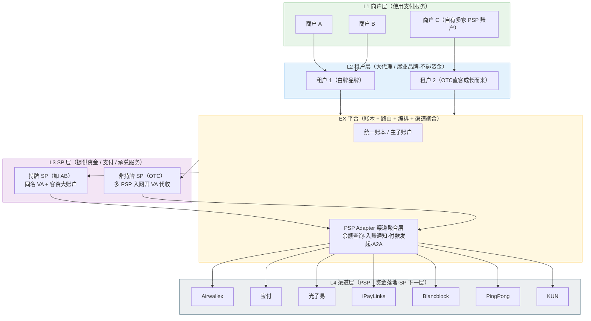
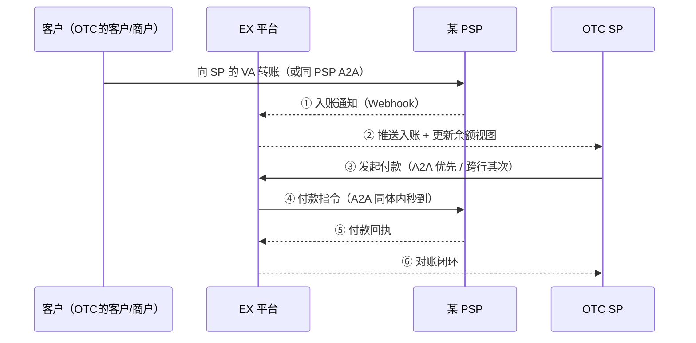

# EX 四层解决方案（EX Layered Solution）

> 日期：2026-06-11（2026-06-15 名词拉齐 + 三层升级四层）｜ 文档类型：BRD
> 关联：`ex-own-sp-tenant-solution.md`、`settlement-API-solution/acquiring-pf-settlement-solution.md`（MOR/收单PF结算）、`vietnam-overall-solution.md`（越南落地案例）
> 前身：本方案由「越南整体方案」升级泛化而来，**不是越南专属方案**，是 EX 的通用分层架构。
> 文件名沿用 `ex-three-layer-solution.md`（避免断链），实际为**四层模型**（商户 / 租户 / SP / 渠道）。

---

## 〇、名词拉齐（角色定义）

> 本次核心校正：**租户 ≠ SP**。租户只做品牌展业（不碰资金），SP 才提供资金服务；OTC 本质是一种 SP，因此 **OTC 方案 = SP 层方案**。PSP 是 SP 对接的底层通道（渠道），位于 SP **下一层**，故由三层升级为**四层**。

| 层           | 名称（统一叫法）                | 角色定位                                                                    | 是否碰资金        |
| ------------ | ------------------------------- | --------------------------------------------------------------------------- | ----------------- |
| **L1** | **商户**（Merchant）      | 终端用户，使用收付/兑换等支付服务                                           | 自有资金          |
| **L2** | **租户 / TP**（大代理）   | 对商户展业的**品牌 / 大代理**，负责获客经营；**不提供资金服务** | ❌ 不碰资金       |
| **L3** | **SP**（服务提供方）      | **提供资金 / 支付 / 承兑服务**；OTC 即一种 SP                         | ✅ 提供资金服务   |
| **L4** | **PSP / 渠道**（Channel） | SP 对接的**底层支付通道**（开 VA、代收、付款、A2A）；SP 的下一层      | ✅ 资金实际落地处 |

**一句话**：商户用服务（L1）← 租户做品牌/大代理、不碰资金（L2）← SP 提供资金服务（L3）← PSP 作为渠道把资金落地（L4）；**EX 帮 SP 对接各个 PSP（渠道）**，并居中做账本、路由编排与渠道聚合。

---

## 〇'、TL;DR

EX = 四层支付/承兑网络的操作系统：

1. **L4 渠道层（PSP｜最底层）**：底层支付通道（Airwallex / 宝付 / 光子易 / iPayLinks / Blancblock 等）；**EX 帮 SP 对接各 PSP**，做余额查询·入账通知·付款发起·A2A 的统一聚合。
2. **L3 SP 层（提供资金服务）**：提供支付、承兑能力。2种形态——**持牌 SP**（如 AB：同名 VA + 银行客资大账户）、**非持牌 SP（OTC）**（多 PSP 入网开 VA 代收，EX 为其做**整体资管方案**）、**OTC 方案统一归到 SP 层。**
3. **L2 租户层（大代理 / 展业品牌）**：对终端商户展业的品牌，可视为**大代理**；**不提供资金服务**，用 EX 白牌快速开业。
4. **L1 商户层（用支付服务）**：通过租户白牌获得收付服务；商户自有多家 PSP 账户也可聚合 → **资金综合 ERP**。

**分期**：一期 = **A2A（结合 MOR 方案）+ 入账通知 + 付款发起**；二期 = 扩 PSP（PingPong、KUN 等）+ 资管深化；三期 = **Agent 研发上线**。

---

## 一、四层架构总览

**一句话**：商户用服务（L1）→ 租户做大代理、不碰资金（L2）→ SP 提供资金服务（L3）→ PSP 作为渠道把资金落地（L4）；EX 居中做账本、路由编排与 **渠道聚合（帮 SP 对接各 PSP：余额/入账/付款/A2A）**，四层各自取所需。

---

## 二、自下而上分层详解

### 2.1 L4 渠道层（PSP｜SP 的下层通道）

| 项                  | 说明                                                                                                                                   |
| ------------------- | -------------------------------------------------------------------------------------------------------------------------------------- |
| **定位**      | SP 对接的**底层支付通道**，资金实际落地处；位于 SP **下一层**                                                              |
| **能力**      | 开 VA / 代收 / 付款 / A2A / 换汇；由各家 PSP 提供（Airwallex / 宝付 / 光子易 / iPayLinks / Blancblock 等）                             |
| **EX 要做的** | **帮 SP 对接各个 PSP**：把每家 PSP 的开户/余额/流水/收款/付款/A2A 接口抽象为统一的 **PSP Adapter 渠道聚合层**（详见 §四） |
| **合规角色**  | 资金落在各 PSP，**PSP 各自承担合规责任**；EX 是数据与指令编排层，不碰资金                                                        |

### 2.2 L3 SP 层（提供资金 / 支付 / 承兑服务）

> **OTC 即一种 SP，所有 OTC 方案统一归到本层。** SP 是唯一**提供资金服务**的角色，向下对接 L4 渠道（PSP）。

#### 2.2.1 持牌 SP（如 AB）

| 项                  | 说明                                                                                               |
| ------------------- | -------------------------------------------------------------------------------------------------- |
| **账户形态**  | 给客户开**同名 VA** + AB 在银行开的**客资大账户**（客户资金归集户）                    |
| **EX 要做的** | 客资大账户下的**客户画像 / 账务映射**：同名 VA ↔ 大账户内子账务一一对应，出入金可追溯到客户 |
| **合规角色**  | 持牌方承担法币侧合规责任；EX 做账本镜像与编排，不碰资金                                            |

#### 2.2.2 非持牌 SP（OTC）——OTC 整体资管方案

| 项                  | 说明                                                                                                                                                                                                                                |
| ------------------- | ----------------------------------------------------------------------------------------------------------------------------------------------------------------------------------------------------------------------------------- |
| **账户形态**  | 以自己名义到**各家 PSP 入网开 VA**（含其在 PSP 的会员 ID），作为**代收工具**                                                                                                                                            |
| **EX 要做的** | ① 为其**对接各 PSP**：拉取账户信息、流水、**余额**等数据 ② **入账通知**（Webhook + 轮询）③ **付款发起** ④ **A2A**：若 OTC 的客户在同一 PSP 也有账户，走同 PSP 体内 A2A 转账付款（秒级、零手续费） |
| **本质**      | **为 OTC 做整体的资管方案**——跨 PSP 余额聚合视图 + 收付一体 + 对账                                                                                                                                                          |
| **合规角色**  | 资金落在各 PSP（PSP 各自合规责任）；EX 是数据与指令编排层                                                                                                                                                                           |

#### 2.2.3 EX-SP（能力集成 + 系统输出）

- **能力集成到 EX**：SP 的承兑/收付能力抽象为标准 SP 接口，挂到 EX 路由上供租户调用。
- **给无系统的 OTC 做一套系统**：OTC 现状全手搓（报价手算、盯转账消息、人手转 USDT）→ EX 输出**白牌 OTC SP 系统**：报价引擎（锁价）+ 订单管理 + 入金感知 + 承兑执行 + 主子账户 + KYC/风控 + 对账报表（功能清单详见 `vietnam-overall-solution.md` §六）。

### 2.3 L2 租户层（大代理 / 展业品牌）

| 项                 | 说明                                                                                        |
| ------------------ | ------------------------------------------------------------------------------------------- |
| **定位**     | 对终端商户展业的**品牌 / 大代理**；自带获客与客群；**不提供资金服务、不碰资金** |
| **形态**     | EX 白牌（站点/App/API）快速开业；账务体系挂在 EX 租户下                                     |
| **来源**     | 直营自有租户、机构客户、**成长起来的 OTC**（OTC → 租户是天然演进路径）               |
| **取用能力** | 向下调用 L3 SP 的收付/承兑能力；对上经营 L1 商户                                            |

### 2.4 L1 商户层（使用支付服务）

| 项                               | 说明                                                                                                                                        |
| -------------------------------- | ------------------------------------------------------------------------------------------------------------------------------------------- |
| **基础服务**               | 通过租户白牌获得收款、付款、兑换等支付服务                                                                                                  |
| **资金综合 ERP（差异化）** | 商户若在各家 PSP 也有自己的账户 → EX（经租户）为其聚合各 PSP 的**余额、流水、入账通知**，形成**一站式资金视图 = 资金综合 ERP** |
| **延伸**                   | 在 ERP 视图上叠加付款发起、A2A 调拨、换汇比价等操作能力                                                                                     |

---

## 三、产品价值

| 受益方             | 价值                                                                                                                    |
| ------------------ | ----------------------------------------------------------------------------------------------------------------------- |
| **SP / OTC** | 手搓 → 系统化（报价/入金感知/自动承兑）；跨 PSP**资管方案**（余额聚合 + 收付一体 + 对账）；获得 EX 租户侧流量    |
| **租户**     | 白牌快速开业、零通道建设成本；多 SP 路由（不绑死单一能力方）；商户资金 ERP 作为获客抓手                                 |
| **商户**     | 一站式收付 + 跨 PSP 资金 ERP；同 PSP A2A 秒到零费                                                                       |
| **EX 平台**  | 四层网络效应（渠道越多→SP 越强→租户越多→商户越多→反哺渠道）；账本与数据中枢沉淀；SaaS + 交易分润 + 系统输出三种变现 |

**核心差异化**：市场上有人做钱包、有人做通道、有人做 SaaS，**没有人把「渠道（PSP）聚合资管（A2A/余额/入账/付款）」做成多层都能复用的底座**——对 SP/OTC 是资管方案、对租户是展业基建、对商户是资金 ERP，同一套能力多次变现。

**价值演进路径（从聚合 → 资管 → Agent）**：

1. **第一层：为各个 SP 整合所有 PSP（渠道聚合）**——SP/OTC 通常同时在宝付、Airwallex、iPayLinks、BB 等多家 PSP 入网开 VA，账户、余额、流水、入账、付款分散在各家后台、各用一套接口。EX 把这些 PSP 统一适配、聚合成**一个余额视图 + 一套收付接口 + 一份对账底稿**，SP 不必再逐家手搓对接与对账。这是当下最直接的价值。
2. **第二层：升级为资管产品**——在跨 PSP 聚合数据之上，沉淀「余额聚合 + 收付一体 + 自动对账 + 资金调拨建议」的**资金管理（资管）产品**，把分散在多 PSP 的资金当成一个统一资金池来运营（缺口预警、跨 PSP 调拨、结汇/换汇比价），从「看得见」升级到「管得好」。
3. **第三层：基于沉淀数据做 Agent 工具**——聚合过程天然沉淀**全量交易、对账、资金流转数据**，可在其上构建 Agent 工具：对账 Agent（自动三方对账/差异定位）、资金调拨 Agent（跨 PSP 余额平衡建议/执行）、报价 Agent（汇率源聚合+加点）、运营客服 Agent，把人工运营升级为 Agent 化运营，推动人效拐点。

> 三层是**同一套底座的逐级增值**：先靠「整合所有 PSP」获客并形成数据沉淀，再以「资管产品」加深绑定与变现，最后用「数据 + Agent」拉开效率与体验差距。对应分期：一期聚合、二期资管深化、三期 Agent（见 §五）。

---

## 四、核心能力：渠道聚合层（PSP Adapter）

> **本层 = EX 帮 SP 对接各个 PSP（渠道）的统一适配层。** L4 渠道（PSP）的所有能力经此抽象后，向上供 L3 SP / L2 租户 / L1 商户复用。

| 能力                      | 说明                                                                                                                                                           | 期数 |
| ------------------------- | -------------------------------------------------------------------------------------------------------------------------------------------------------------- | ---- |
| **A2A 转账**        | 同 PSP 体内账户间转账（秒级、零手续费）；**与 MOR 方案合并设计**——MOR/收单 PF 结算（PF 主账户 → 商户子账户 A2A）即 A2A 的第一个落地场景，复用同一接口 | 一期 |
| **入账通知**        | PSP Webhook + 主动轮询双通道，入账秒级感知、推送到租户/SP/商户                                                                                                 | 一期 |
| **付款发起**        | 经 PSP API 发起对外付款（银行账户 / 同 PSP 账户），状态回执闭环                                                                                                | 一期 |
| **余额 / 流水查询** | 跨 PSP 余额聚合视图、流水拉取、对账底稿                                                                                                                        | 一期 |
| **开户 / 入网编排** | 推送 KYB 资料到 PSP 入网、开 VA（视各 PSP 开放程度）                                                                                                           | 二期 |
| **换汇 / 结汇**     | PSP 内换汇能力封装与比价                                                                                                                                       | 二期 |

> **路由原则**：收付双方在同一 PSP 有账户 → **优先走 A2A**（零成本秒到）；否则走 PSP 对外付款通道。

---

## 五、分期规划

| 期数           | 范围                                                                                                                                                     | 里程碑                                           |
| -------------- | -------------------------------------------------------------------------------------------------------------------------------------------------------- | ------------------------------------------------ |
| **一期** | **A2A（结合 MOR 方案）→ 入账通知 → 付款发起**（按此顺序）；接入首批 PSP：Airwallex、宝付、光子易、iPayLinks、Blancblock；余额/流水查询           | A2A 跑通 MOR 结算场景；首批 PSP 余额聚合视图上线 |
| **二期** | 扩 PSP：**PingPong、KUN**（及其他评估通过者）；开户/入网编排、换汇结汇封装；OTC 资管方案深化（对账报表、资金 ERP 完整版）；OTC 白牌 SP 系统推广    | 跨 PSP 资金 ERP 对租户/商户开放                  |
| **三期** | **Agent 研发上线**：对账 Agent（自动三方对账/差异定位）、资金调拨 Agent（跨 PSP 余额平衡建议/执行）、报价 Agent（汇率源聚合+加点）、运营客服 Agent | Agent 化运营，人效拐点                           |

### 5.1 一期拆解（以 OffRamp 为核心）

> 一期产品形态聚焦在 **OffRamp（数币 → 法币出金）**，以 **U（USDT）用 B（BB）的能力** 为起点，**BB 作为资金中心做跨渠道/跨 SP 的调拨枢纽**。

| # | 一期能力                      | 说明                                                                                                                                             |
| - | ----------------------------- | ------------------------------------------------------------------------------------------------------------------------------------------------ |
| 1 | **OffRamp（核心产品）** | 第一期做 OffRamp：**U 用 B（BB）的能力**，**BB 作为资金中心负责调拨**；**OffRamp 可从不同 SP 走**（多 SP 可选、不绑死单一 SP） |
| 2 | **SP 跨渠道出款路由**   | SP 可**路由到不同渠道（PSP）出款**，按可用性/成本/限额选择出金渠道                                                                         |
| 3 | **SP 渠道间资金调拨**   | SP 可**在不同渠道（PSP）之间做资金调拨**，平衡各渠道余额                                                                                   |
| 4 | **合规工具（KYT 等）**  | 提供**KYT（Know Your Transaction）等反洗钱 / 链上风控工具**，对出金地址/交易做风险筛查                                                     |

---

## 六、待办（Backlog）

### 6.1 PSP 调研清单

> 每家 PSP 统一调研项：**① API 接口**（鉴权/开户/VA/余额/流水）**② A2A 能力**（同体内转账是否开放 API、限额、计费）**③ 入账通知**（Webhook 可靠性/字段）**④ 付款发起**（币种/通道/时效）**⑤ 沙箱与商务条件**

| PSP                                                           | 期数   | 接口调研 | A2A 调研 | 入账通知 | 付款发起 | 商务/沙箱 |
| ------------------------------------------------------------- | ------ | -------- | -------- | -------- | -------- | --------- |
| **Airwallex**                                           | 一期   | ☐       | ☐       | ☐       | ☐       | ☐        |
| **宝付**                                                | 一期   | ☐       | ☐       | ☐       | ☐       | ☐        |
| **光子易（PhotonPay）**                                 | 一期   | ☐       | ☐       | ☐       | ☐       | ☐        |
| **iPayLinks**                                           | 一期   | ☐       | ☐       | ☐       | ☐       | ☐        |
| **Blancblock**                                          | 一期   | ☐       | ☐       | ☐       | ☐       | ☐        |
| **PingPong**                                            | 二期   | ☐       | ☐       | ☐       | ☐       | ☐        |
| **KUN**                                                 | 二期   | ☐       | ☐       | ☐       | ☐       | ☐        |
| 建议补充：**9Pay**（越南本地 QR/VND）                   | 待定   | ☐       | ☐       | ☐       | ☐       | ☐        |
| 建议补充：**万里汇 WorldFirst / 连连 / Nium / Sunrate** | 待评估 | ☐       | ☐       | ☐       | ☐       | ☐        |

### 6.2 待确认问题

- [ ] **OTC 合规问题对品牌的影响评估**：OTC（非持牌 SP）的合规/冻卡/AML 风险如何隔离，避免牵连 EX 与租户品牌；明确品牌切割、责任边界与风险披露策略
- [ ] **PSP 角色权限授权机制**：目前各 PSP 与 EX **并无官方合作关系**，EX 接入是「借 SP 在 PSP 的账户/会员身份」操作——需由 **SP 侧做一套角色权限授权**（授权 EX 代为查询余额/流水、发起付款/A2A 的范围与凭证管理），并明确代理 vs 托管的法律定性
- [ ] **首批接入 PSP 优先级确认**：前期先接 **宝付、Airwallex、iPayLinks、BB（Blancblock）** 四家跑通聚合（余额/入账/付款/A2A），其余 PSP 后续滚动接入

## 七、与越南方案的关系

- 越南是本四层方案的**第一个落地市场实例**：自有租户 + OTC SP 化 + VietQR/NAPAS 必接 + 岘港沙盒合规挂靠，细节见 `vietnam-overall-solution.md`。
- 本方案为通用架构：换市场只换 **L3 的 SP 组合与 L4 的本地 PSP（渠道）清单**，四层结构与渠道聚合底座不变。

---

*关联文档：`ex-own-sp-tenant-solution.md`、`acquiring-pf-settlement-solution.md`（MOR）、`vietnam-overall-solution.md`、`vietnam-payment-web3-report.md`*
