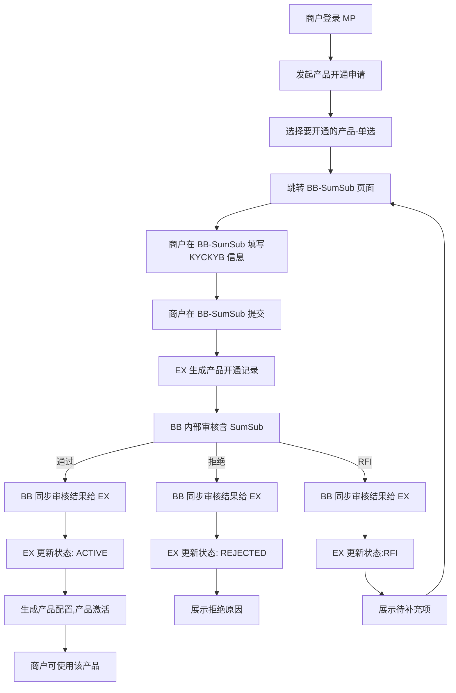
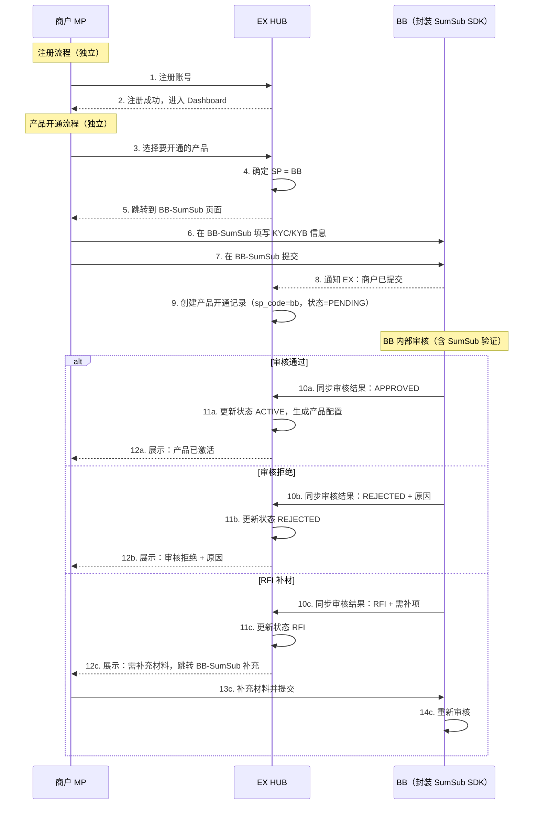
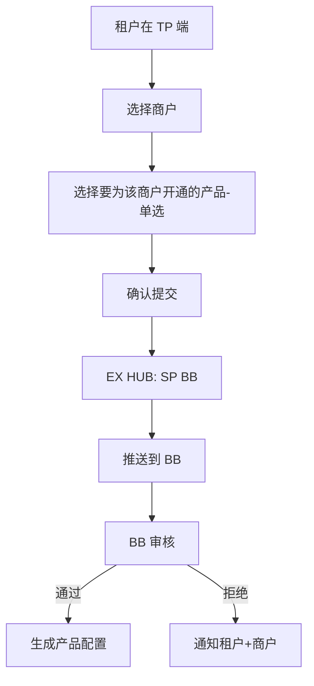
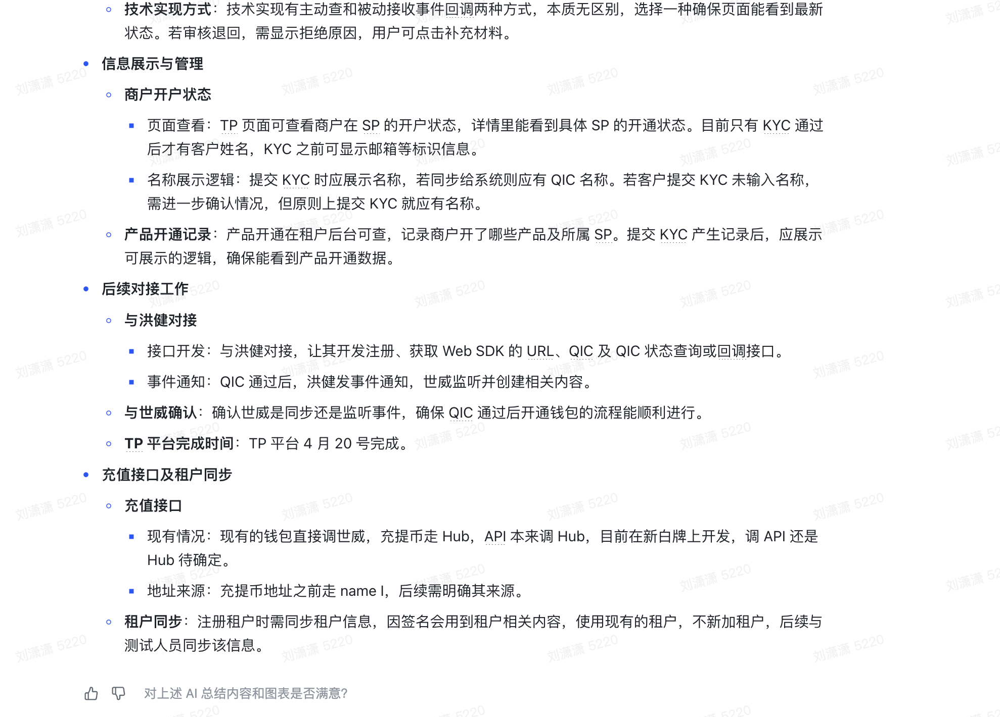
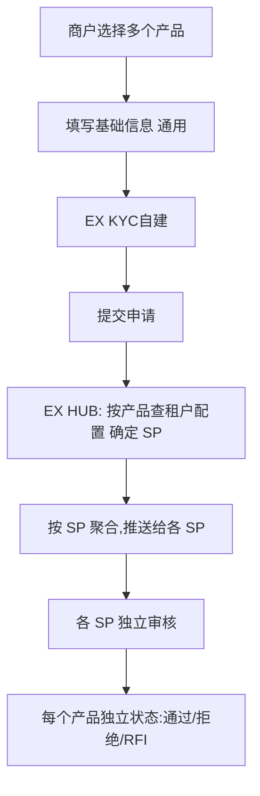

# MP 商户产品开通

> **文档类型**：产品需求文档（PRD）
> **版本**：v2.0
> **最后更新**：2026-04-09
> **上游文档**：`product-application.md`（v1.3）、`sa-product-listing.md`（v2.0）

---

## 目录

1. [概述](#1-概述)
2. [版本排期总览](#2-版本排期总览)
3. [角色与系统](#3-角色与系统)
4. [v1.0 — 单 SP 基础版（4月20日）](#4-v10--单-sp-基础版420)
5. [v1.1 — 租户查看与代开通（4月30日）](#5-v11--租户查看与代开通430)
6. [v2.0 — 多 SP + 产品中心（5月20日 / 6月）](#6-v20--多-sp--产品中心520--6月)
7. [状态机（全版本通用）](#7-状态机全版本通用)
8. [EX HUB → SP 推送规范](#8-ex-hub--sp-推送规范)
9. [审核通过后：产品配置生成](#9-审核通过后产品配置生成)
10. [数据模型](#10-数据模型)
11. [术语表](#11-术语表)

---

## 1. 概述

### 1.1 一句话定义

商户在 MP 端注册后，**选择要开通的产品 → 填写产品开通信息 → 系统判断租户开通的 SP → 提交申请 → 将信息推送给 SP 审核**。

### 1.2 分期演进策略

```
v1.0（4/20）  单 SP(BB) + 商户自助开通 + TP 只读查询
    ↓
v1.1（4/30）  TP 可查看商户产品对应 SP + TP 可为商户代开新产品（仍单 SP = BB）
    ↓
v2.0（5/15）  多 SP 支持 + 租户产品中心（配置产品→SP 映射）
    ↓
v2.0+（6月）  EX KYC 改造（替代 SumSub，自建 KYC 流程）
```

### 1.3 设计原则

| 原则                           | 说明                                                                |
| ------------------------------ | ------------------------------------------------------------------- |
| **注册与开通分离**       | 商户先完成注册，之后单独发起产品开通申请                            |
| **SP 对商户透明**        | 商户只看到产品名称，不感知底层 SP                                   |
| **SP 独立审核**          | 每个产品由对应 SP 独立审核，API 回调 EX HUB                         |
| **申请记录 ≠ 产品配置** | 提交→申请记录；SP 审核通过→产品配置                               |
| **渐进式架构**           | v1.0 硬编码 BB → v2.0 可配置多 SP，数据模型一开始预留 sp_code 字段 |

---

## 2. 版本排期总览

### 2.1 版本对比矩阵

| 能力维度              | v1.0（4/20）                                | v1.1（4/30）                              | v2.0（5/20+6月）                                 |
| --------------------- | ------------------------------------------- | ----------------------------------------- | ------------------------------------------------ |
| **SP 数量**     | 单 SP = BB                                  | 单 SP = BB                                | 多 SP（BB + IPL + ...）                          |
| **MP 商户开通** | ✅ 选产品→填信息→提交→BB 审核            | ✅ 同 v1.0                                | ✅ 同，系统自动路由到对应 SP                     |
| **TP 查询**     | ✅ 只读：查看商户列表<br />商户产品开通列表 | ✅可查看商户详情<br />可查看产品对应的 SP | ✅ 同 v1.1                                       |
| **TP 代开通**   | ❌                                          | ✅ MP 增开产品                            | ✅ 同 v1.1                                       |
| **产品中心**    | ❌                                          | ❌                                        | ✅ 配置每个产品默认开通的 SP<br />租户产品补开sp |
| **SP 路由**     | 硬编码 BB                                   | 硬编码 BB                                 | 租户在产品中心配置                               |
| **KYC**         | SumSub                                      | SumSub                                    | EX KYC 自建（6月）                               |
| **产品选择**    | 单选                                        | 单选                                      | 多选                                             |

### 2.2 排期时间线

```
4/9 ──── 4/20 ──── 4/30 ──── 5/20 ──── 6月
 │        │         │         │         │
 PRD     v1.0      v1.1      v2.0     v2.0+
 定稿    上线       上线      上线     EX KYC
         │         │         │        改造上线
         │         │         │
         单SP=BB   TP代开    多SP+
         商户自助  产品      产品中心
         TP只读
```

---

## 3. 角色与系统

| 角色/系统            | v1.0 职责                                   | v1.1 新增                      | v2.0 新增                         |
| -------------------- | ------------------------------------------- | ------------------------------ | --------------------------------- |
| **商户（MP）** | 注册、选产品、填信息、提交、查审核状态      | —                             | 多选产品                          |
| **租户（TP）** | 只读查询商户产品开通列表                    | 查看 SP 归属；为商户代开通产品 | 产品中心：配置产品→SP 映射       |
| **EX HUB**     | 管理申请、硬编码推送 BB、接收回调、生成配置 | 支持 TP 发起的代开通           | SP 路由判断（按租户产品中心配置） |
| **SP（BB）**   | 接收推送、审核、RFI、API 回调               | —                             | 多 SP（BB + IPL + ...）           |
| **SumSub**     | KYC 身份验证                                | —                             | v2.0+ 被 EX KYC 替代              |

---

## 4. v1.0 — 单 SP 基础版（4/20）

> **核心约束**：只有一个 SP = BB；商户每次开通一个产品；TP 只能查看，不能操作。

### 4.1 范围说明

| 包含                                     | 不包含                 |
| ---------------------------------------- | ---------------------- |
| MP 商户选择产品                          | 多产品同时申请（单选） |
| 跳转 BB（封装 SumSub SDK）填写信息并提交 | 多 SP 路由选择         |
| EX 生成产品开通记录                      | TP 为商户代开通产品    |
| BB 同步审核结果给 EX                     | 产品中心（TP 端）      |
| EX 根据状态展示对应页面和操作            | TP 查看 SP 归属        |
| 审核通过后自动生成产品配置               | EX 自建 KYC            |
| TP 查询商户产品开通列表（只读）          |                        |

### 4.2 核心流程



### 4.3 时序图



### 4.4 页面交互说明（MP）

#### 入口

| 入口位置   | 说明                                         |
| ---------- | -------------------------------------------- |
| Dashboard  | "Apply for Product" / "开通产品" 卡片或按钮  |
| Settings   | Products 页面，"Apply New Product" 按钮      |
| 空状态提示 | 如商户无任何产品，Dashboard 展示引导开通提示 |

#### Step 1: 选择产品（单选）

| 元素          | 说明                                             |
| ------------- | ------------------------------------------------ |
| 产品卡片列表  | 租户已上架的产品，每个一张卡片（图标+名称+简介） |
| 单选          | 点击选中一个产品，选另一个自动取消上一个         |
| 已开通标记    | 已开通产品灰显不可选                             |
| 审核中标记    | 有审核中申请的产品标记"审核中"不可重复提交       |
| Continue 按钮 | 未选产品时禁用                                   |

#### Step 2: 跳转 BB-SumSub 填写信息

| 元素         | 说明                                                          |
| ------------ | ------------------------------------------------------------- |
| 跳转方式     | EX 将商户重定向到 BB 提供的 SumSub 页面（BB 封装 SumSub SDK） |
| 填写内容     | KYC/KYB 信息：公司信息、法人身份、业务描述、资金来源等        |
| 产品专属信息 | BB-SumSub 根据产品类型展示不同的信息采集表单                  |
| 提交         | 商户在 BB-SumSub 页面完成填写并提交                           |
| 回跳         | 提交后回跳 EX，EX 生成产品开通记录，展示"审核中"页面          |

#### Step 3: 提交成功

| 元素           | 说明                     |
| -------------- | ------------------------ |
| 成功提示       | ✅ 申请已提交            |
| 申请编号       | 系统生成                 |
| 当前状态       | 审核中                   |
| 预计时间       | 1-3 个工作日             |
| 进入 Dashboard | 审核中也可进入，功能受限 |

#### 申请状态查看

| 入口                | 说明                          |
| ------------------- | ----------------------------- |
| Settings > Products | 展示所有产品申请记录及状态    |
| Dashboard 通知      | 审核结果通过站内通知/邮件触达 |

| 状态   | 展示                           |
| ------ | ------------------------------ |
| 审核中 | "您的 [产品名] 申请正在审核中" |
| 通过   | 产品激活，可在对应菜单使用     |
| 拒绝   | 展示拒绝原因                   |
| RFI    | 展示待补充项，跳转补充入口     |

### 4.5 TP 端：商户产品开通列表（只读）

| 元素     | 说明                                       |
| -------- | ------------------------------------------ |
| 页面位置 | 现有 TP 产品开通列表页面                   |
| 列表字段 | 商户名称、产品名称、申请时间、审核状态     |
| 操作     | 仅查看详情（只读），无编辑/审核/代开通操作 |
| 筛选     | 按状态、产品、时间筛选                     |

### 4.6 v1.0 可开通产品

| 产品            | 产品编码        | SP | 说明     |
| --------------- | --------------- | -- | -------- |
| VCC 发卡        | VCC             | BB | 数币发卡 |
| Crypto Checkout | CRYPTO_CHECKOUT | BB | 数币收单 |

> v1.0 仅开放 BB 提供的产品。法币相关产品（Payins/Payouts 等）待多 SP 版本支持。

### 4.7 v1.0 简化规则

| 维度     | 简化方式                                                                  |
| -------- | ------------------------------------------------------------------------- |
| SP 路由  | 硬编码 `sp_code = "bb"`，不查询租户配置                                 |
| 产品选择 | 单选，不涉及依赖关系校验                                                  |
| 数据模型 | `application_item.sp_code` 字段预留，v1.0 固定写 `bb`                 |
| KYC      | BB 封装 SumSub SDK，商户跳转 BB-SumSub 完成信息填写；EX 不直接对接 SumSub |

---

## 5. v1.1 — 租户查看与代开通（4/30）

> **核心变化**：TP 端从"只读"升级为"可操作"——查看 SP 归属 + 为商户代开通其他产品。SP 仍然只有 BB。

### 5.1 范围说明（增量）

| v1.1 新增                 | 说明                               |
| ------------------------- | ---------------------------------- |
| TP 查看商户详情           |                                    |
| TP 查看商户产品的 SP 归属 | 列表/详情页展示产品由哪个 SP 提供  |
| 商户可在 MP 追加产品      | 已有产品激活后，商户可再申请新产品 |

| 不包含      | 说明                     |
| ----------- | ------------------------ |
| 多 SP       | 仍为单 SP = BB           |
| 产品中心    | TP 端无产品→SP 配置能力 |
| EX 自建 KYC | 仍走 BB 封装的 SumSub    |

### 5.2 TP 端新增功能

#### 5.2.1 商户产品列表（升级）

| 元素     | v1.0                | v1.1                        |
| -------- | ------------------- | --------------------------- |
| 商户信息 | 只有列表            | 有详情                      |
| SP 列    | ❌ 不展示           | ✅ 展示 SP 名称（BB）       |
| 操作列   | 仅"查看"            | "查看" + "为该商户开通产品" |
| 详情页   | 基本信息 + 审核状态 | + SP 归属 + 审核时间线      |

#### 5.2.2 TP 代开通流程



| 步骤     | 说明                                          |
| -------- | --------------------------------------------- |
| 选择商户 | 从已有商户列表选择                            |
| 选择产品 | 展示该商户尚未开通的产品列表，单选            |
| 确认     | 租户确认后，系统代商户创建申请记录，推送到 BB |
| 通知     | 审核结果同时通知租户和商户                    |

> **注意**：TP 代开通不需要商户填写信息（商户基础信息已有），但仍需 BB 审核。如 BB 需要补充信息，RFI 通知到商户。

### 5.3 MP 端变化

| 变化         | 说明                                                                |
| ------------ | ------------------------------------------------------------------- |
| 追加产品入口 | 已有产品激活后，Dashboard 或 Settings 中增加"Apply New Product"入口 |
| 流程         | 与 v1.0 首次开通一致（选产品→填信息→提交→BB 审核）               |

---

## 6. v2.0 — 多 SP + 产品中心（5/20 / 6月）

> **核心变化**：一个产品可由多个 SP 提供；租户在产品中心配置每个产品默认开通的 SP；KYC 从 SumSub 迁移到 EX 自建。

### 6.1 排期拆分

| 子版本 | 排期 | 内容                       |
| ------ | ---- | -------------------------- |
| v2.0-A | 5/20 | 多 SP 路由 + 租户产品中心  |
| v2.0-B | 6月  | EX KYC 改造（替代 SumSub） |

### 6.2 范围说明（增量）

| v2.0 新增                    | 说明                                            |
| ---------------------------- | ----------------------------------------------- |
| **多 SP**              | 一个产品可由多个 SP 提供（如 VCC → BB 或 IPL） |
| **租户产品中心（TP）** | 配置每个产品默认开通的 SP（先只能选 1 个）      |
| **SP 路由**            | EX HUB 根据租户产品中心配置判断推送给哪个 SP    |
| **多选产品**           | 商户可一次申请多个产品                          |
| **EX KYC（6月）**      | 自建 KYC 流程，不再依赖 SumSub                  |



### 6.3 租户产品中心（TP 新增）

#### 6.3.1 产品中心页面

| 元素           | 说明                                     |
| -------------- | ---------------------------------------- |
| 产品列表       | 展示所有可用产品（由 SA 后台上架决定）   |
| 每个产品配置项 | 默认 SP（下拉选择，先只能选 1 个）       |
| SP 来源        | SA 后台已上架且对该租户可用的 SP 列表    |
| 保存           | 修改后保存，影响后续所有新商户的产品开通 |

#### 6.3.2 产品→SP 配置示例

| 产品            | 可选 SP | 租户 A 配置 | 租户 B（BB）配置 |
| --------------- | ------- | ----------- | ---------------- |
| VCC 发卡        | BB, IPL | BB          | BB               |
| Crypto Checkout | BB      | BB          | BB               |
| Payins          | IPL, BB | IPL         | BB               |
| Payouts         | IPL, BB | IPL         | BB               |

> **v2.0 限制**：每个产品只能配置一个默认 SP。多 SP 按优先级路由留到后续版本。

### 6.4 SP 路由逻辑（v2.0）

```
商户提交产品申请
    │
    ├── EX HUB 查询租户产品中心配置
    │     │
    │     ├── 产品 A → 租户配置的默认 SP = BB
    │     └── 产品 B → 租户配置的默认 SP = IPL
    │
    ├── 按 SP 聚合，分别推送
    │     ├── BB: [产品 A 的申请信息]
    │     └── IPL: [产品 B 的申请信息]
    │
    └── 各 SP 独立审核，独立回调
```

### 6.5 多选产品流程



### 6.6 EX KYC 改造（6月）

| 维度        | SumSub（v1.0/v1.1） | EX KYC（v2.0+）          |
| ----------- | ------------------- | ------------------------ |
| KYC 表单    | SumSub 外部页面     | EX 自建表单（EX HUB 内） |
| 跳转方式    | 重定向到 SumSub     | 内嵌在 MP 页面内         |
| 数据存储    | SumSub 侧           | EX HUB 自有数据库        |
| 文件上传    | SumSub 管理         | EX OSS / 对象存储        |
| SP 审核数据 | SumSub 透传         | EX HUB 结构化推送        |
| 运营可控性  | 依赖 SumSub 配置    | 完全自主配置表单字段     |

**EX KYC 核心能力：**

| 能力       | 说明                               |
| ---------- | ---------------------------------- |
| 可配置表单 | 按产品+SP 配置需要收集的 KYC 字段  |
| 文件上传   | 营业执照、身份证件、地址证明等     |
| 审核工作台 | 运营/SP 可在 EX 内部审核 KYC 材料  |
| RFI        | 直接在 EX 内发起和响应补充材料请求 |

### 6.7 v2.0 可开通产品（扩展）

| 产品            | 产品编码        | 可选 SP  | 说明           |
| --------------- | --------------- | -------- | -------------- |
| 法币账户        | FIAT_ACCOUNT    | IPL / BB | 注册时默认开通 |
| 数币钱包        | CRYPTO_WALLET   | BB       | 注册时默认开通 |
| Payins 收款     | PAYINS          | IPL / BB | 商户申请开通   |
| Payouts 付款    | PAYOUTS         | IPL / BB | 商户申请开通   |
| OnRamp 入金     | ON_RAMP         | BB       | 商户申请开通   |
| OffRamp 出金    | OFF_RAMP        | BB       | 商户申请开通   |
| VCC 发卡        | VCC             | BB / IPL | 商户申请开通   |
| Crypto Checkout | CRYPTO_CHECKOUT | BB       | 商户申请开通   |

### 6.8 产品依赖关系

```
账户类（注册时自动开通）：
  法币账户 ── 独立
  数币钱包 ── 独立

收付类（需申请）：
  Payins  ── 依赖 → 法币账户 或 数币钱包
  Payouts ── 依赖 → 法币账户 或 数币钱包

业务类（需申请）：
  OnRamp  ── 依赖 → 法币账户 + 数币钱包
  OffRamp ── 依赖 → 数币钱包 + 法币账户
  VCC     ── 依赖 → 法币账户
  Crypto Checkout ── 依赖 → 数币钱包
```

> v2.0 多选时系统自动校验依赖关系，未满足则提示先勾选前置产品。

---

## 7. 状态机（全版本通用）

### 7.1 申请记录状态机

```
                    ┌───────────┐
                    │  DRAFT    │  商户填写中，未提交
                    └─────┬─────┘
                          │ 点击 Submit
                          ▼
                    ┌───────────┐
                    │ SUBMITTED │  已提交，EX HUB 处理中
                    └─────┬─────┘
                          │ 推送到 SP 完成
                          ▼
                  ┌──────────────┐
                  │ UNDER_REVIEW │  SP 审核中
                  └──────┬───────┘
                         │
            ┌────────────┼────────────┐
            ▼            │            ▼
     ┌──────────┐       │     ┌──────────┐
     │ APPROVED │       │     │ REJECTED │
     └────┬─────┘       │     └──────────┘
          │             │
          │             │ （RFI 不改变主状态，
          │             │   子记录标记 has_rfi=true）
          ▼             │
   生成产品配置         ▼
   产品激活       UNDER_REVIEW + RFI
```

### 7.2 产品申请子记录状态

| 状态               | 说明          | 商户端展示       | 适用版本 |
| ------------------ | ------------- | ---------------- | -------- |
| PENDING            | 等待推送到 SP | 处理中           | 全版本   |
| UNDER_REVIEW       | SP 审核中     | 审核中           | 全版本   |
| UNDER_REVIEW + RFI | 需补充材料    | 审核中 · 待补充 | 全版本   |
| APPROVED           | SP 审核通过   | ✅ 已通过        | 全版本   |
| REJECTED           | SP 审核拒绝   | ❌ 未通过        | 全版本   |

### 7.3 申请记录聚合状态（v2.0 多产品时）

| 子记录状态                    | 聚合状态     | 说明                     |
| ----------------------------- | ------------ | ------------------------ |
| 全部 APPROVED                 | APPROVED     | 所有产品通过             |
| 全部 REJECTED                 | REJECTED     | 所有产品拒绝             |
| 部分 APPROVED + 部分 REJECTED | APPROVED     | 部分通过，已通过产品可用 |
| 任一 UNDER_REVIEW             | UNDER_REVIEW | 仍在审核中               |

> **v1.0/v1.1**：单产品，无 PARTIAL 状态，申请记录状态 = 子记录状态。

---

## 8. EX HUB → SP 推送规范

### 8.1 推送 API 接口

```
POST {sp_base_url}/api/v1/merchant-applications

Headers:
  Authorization: Bearer {sp_api_token}
  Content-Type: application/json
  X-Tenant-ID: {tenant_id}
  X-Request-ID: {unique_request_id}
```

### 8.2 推送数据结构

```json
{
  "application_id": "APP-20260420-001234",
  "tenant_id": "T-001",
  "tenant_name": "Bonbil",
  "merchant": {
    "merchant_id": "MID-001234",
    "company_name": "Example Corp Ltd",
    "registration_country": "HK",
    "registration_number": "12345678",
    "business_type": "Technology",
    "business_description": "SaaS payment solutions",
    "estimated_monthly_volume": "500000",
    "volume_currency": "USD",
    "fund_source": "Business revenue"
  },
  "products": [
    {
      "product_code": "VCC",
      "product_name": "Card Issuing",
      "product_info": {
        "estimated_card_count": "500",
        "use_case": "Employee expense management",
        "card_currency": ["USD", "EUR"]
      }
    }
  ],
  "kyc": {
    "sumsub_applicant_id": "6501abc...",
    "kyc_status": "COMPLETED",
    "kyc_completed_at": "2026-04-20T10:00:00Z"
  },
  "submitted_at": "2026-04-20T10:05:00Z",
  "initiated_by": "merchant"
}
```

> **v1.1 新增**：`initiated_by` 字段，值为 `"merchant"`（商户自助）或 `"tenant"`（租户代开通）。

### 8.3 SP 响应

```json
{
  "received": true,
  "sp_reference_id": "SP-REF-20260420-001",
  "estimated_review_days": 3
}
```

### 8.4 SP 审核回调

```
POST {ex_hub_url}/api/v1/sp-callbacks/application-review

{
  "application_id": "APP-20260420-001234",
  "sp_code": "bb",
  "sp_reference_id": "SP-REF-20260420-001",
  "results": [
    {
      "product_code": "VCC",
      "decision": "APPROVED",
      "reviewed_by": "reviewer@bb.com",
      "reviewed_at": "2026-04-21T14:00:00Z"
    }
  ]
}
```

---

## 9. 审核通过后：产品配置生成

### 9.1 生成流程（全版本通用）

```
SP 审核通过某个产品（API 回调）
    │
    ├── 1. 更新产品子记录 status → APPROVED
    │
    ├── 2. 生成商户产品配置
    │       ├── 查找租户的默认配置模板（tenant_product_template）
    │       ├── 复制模板 → 生成商户级产品配置（merchant_product_config）
    │       └── 标记 config.status = ACTIVE
    │
    ├── 3. 判断前置依赖（v2.0 多产品时）
    │       ├── 如 Payins 通过 → 检查法币账户是否已开通
    │       └── 如未开通 → 自动开通前置账户产品
    │
    ├── 4. 发送通知
    │       ├── 商户：邮件 + 站内
    │       └── 租户：站内（v1.1+）
    │
    └── 5. 商户下次登录 → Dashboard 中可见已激活产品
```

### 9.2 配置继承

```
租户默认配置（Tenant Product Template）
    │  复制 + 可覆盖
    ▼
商户产品配置（Merchant Product Config）
    │  租户可在 TP 端个性化修改（v1.1+）
    ▼
最终生效配置
```

---

## 10. 数据模型

### 10.1 产品申请记录（application_record）

| 字段                 | 类型     | 说明                                                             | 版本                    |
| -------------------- | -------- | ---------------------------------------------------------------- | ----------------------- |
| id                   | string   | 申请记录 ID                                                      | v1.0                    |
| merchant_id          | string   | 商户 MID                                                         | v1.0                    |
| tenant_id            | string   | 所属租户 ID                                                      | v1.0                    |
| status               | enum     | DRAFT / SUBMITTED / UNDER_REVIEW / APPROVED / PARTIAL / REJECTED | v1.0（PARTIAL v2.0 起） |
| basic_info           | json     | 商户基础业务信息                                                 | v1.0                    |
| initiated_by         | enum     | MERCHANT / TENANT                                                | v1.1                    |
| initiated_by_user_id | string   | 发起人用户 ID                                                    | v1.1                    |
| kyc_applicant_id     | string   | SumSub 申请人 ID（v2.0+ 改为 EX KYC ID）                         | v1.0                    |
| kyc_status           | enum     | NOT_REQUIRED / PENDING / COMPLETED                               | v1.0                    |
| created_at           | datetime | 创建时间                                                         | v1.0                    |
| submitted_at         | datetime | 提交时间                                                         | v1.0                    |

### 10.2 产品申请子记录（application_item）

| 字段            | 类型     | 说明                                         | 版本 |
| --------------- | -------- | -------------------------------------------- | ---- |
| id              | string   | 子记录 ID                                    | v1.0 |
| application_id  | string   | 关联申请记录 ID                              | v1.0 |
| product_code    | string   | 产品编码                                     | v1.0 |
| sp_code         | string   | 路由到的 SP 编码（v1.0 固定 `bb`）         | v1.0 |
| status          | enum     | PENDING / UNDER_REVIEW / APPROVED / REJECTED | v1.0 |
| has_rfi         | boolean  | 是否有待处理的 RFI                           | v1.0 |
| product_info    | json     | 产品专属提交信息                             | v1.0 |
| sp_reference_id | string   | SP 侧引用 ID                                 | v1.0 |
| reject_reason   | text     | 拒绝原因                                     | v1.0 |
| reviewed_at     | datetime | 审核完成时间                                 | v1.0 |
| reviewed_by     | string   | 审核人                                       | v1.0 |

### 10.3 RFI 记录（application_rfi）

| 字段                | 类型     | 说明                          | 版本 |
| ------------------- | -------- | ----------------------------- | ---- |
| id                  | string   | RFI ID                        | v1.0 |
| application_item_id | string   | 关联产品子记录 ID             | v1.0 |
| items               | array    | 需补充材料列表                | v1.0 |
| deadline            | datetime | 截止日期                      | v1.0 |
| status              | enum     | PENDING / RESPONDED / EXPIRED | v1.0 |
| created_at          | datetime | 创建时间                      | v1.0 |
| responded_at        | datetime | 响应时间                      | v1.0 |

### 10.4 商户产品配置（merchant_product_config）

| 字段                | 类型     | 说明               | 版本 |
| ------------------- | -------- | ------------------ | ---- |
| id                  | string   | 配置 ID            | v1.0 |
| merchant_id         | string   | 商户 MID           | v1.0 |
| tenant_id           | string   | 所属租户 ID        | v1.0 |
| product_code        | string   | 产品编码           | v1.0 |
| sp_code             | string   | 对应 SP            | v1.0 |
| status              | enum     | ACTIVE / SUSPENDED | v1.0 |
| config              | json     | 产品配置参数       | v1.0 |
| source_template_id  | string   | 来源模板 ID        | v1.0 |
| application_item_id | string   | 关联产品子记录 ID  | v1.0 |
| created_at          | datetime | 创建时间           | v1.0 |
| updated_at          | datetime | 最后修改时间       | v1.0 |
| updated_by          | string   | 最后修改人         | v1.0 |

### 10.5 租户产品默认模板（tenant_product_template）

| 字段         | 类型     | 说明         | 版本 |
| ------------ | -------- | ------------ | ---- |
| id           | string   | 模板 ID      | v1.0 |
| tenant_id    | string   | 租户 ID      | v1.0 |
| product_code | string   | 产品编码     | v1.0 |
| sp_code      | string   | 对应 SP      | v1.0 |
| config       | json     | 默认配置参数 | v1.0 |
| created_at   | datetime | 创建时间     | v1.0 |
| updated_at   | datetime | 最后修改时间 | v1.0 |

### 10.6 租户产品路由配置（tenant_product_routing）— v2.0 新增

| 字段            | 类型     | 说明         | 版本 |
| --------------- | -------- | ------------ | ---- |
| id              | string   | 配置 ID      | v2.0 |
| tenant_id       | string   | 租户 ID      | v2.0 |
| product_code    | string   | 产品编码     | v2.0 |
| default_sp_code | string   | 默认 SP 编码 | v2.0 |
| is_active       | boolean  | 是否启用     | v2.0 |
| created_at      | datetime | 创建时间     | v2.0 |
| updated_at      | datetime | 最后修改时间 | v2.0 |
| updated_by      | string   | 修改人       | v2.0 |

---

## 11. 术语表

| 中文     | 英文                          | 粤语（广东话） |
| -------- | ----------------------------- | -------------- |
| 商户     | Merchant                      | 商户           |
| 租户     | Tenant                        | 租戶           |
| 服务商   | Service Provider (SP)         | 服務商         |
| 产品开通 | Product Application           | 產品開通       |
| 产品路由 | Product Routing               | 產品路由       |
| 产品中心 | Product Center                | 產品中心       |
| 申请记录 | Application Record            | 申請記錄       |
| 产品配置 | Product Config                | 產品配置       |
| 代开通   | Proxy Application             | 代開通         |
| 审核     | Review                        | 審核           |
| 补充材料 | RFI (Request for Information) | 補充資料       |

---

*最后更新：2026-04-09*
*文档版本：v2.0 — 分期发布（v1.0 单SP/v1.1 TP代开通/v2.0 多SP+产品中心+EX KYC）*
