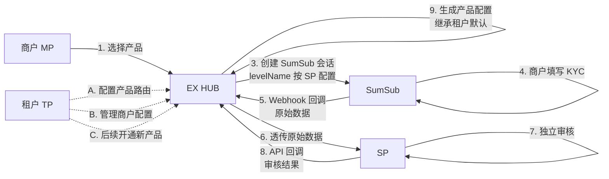
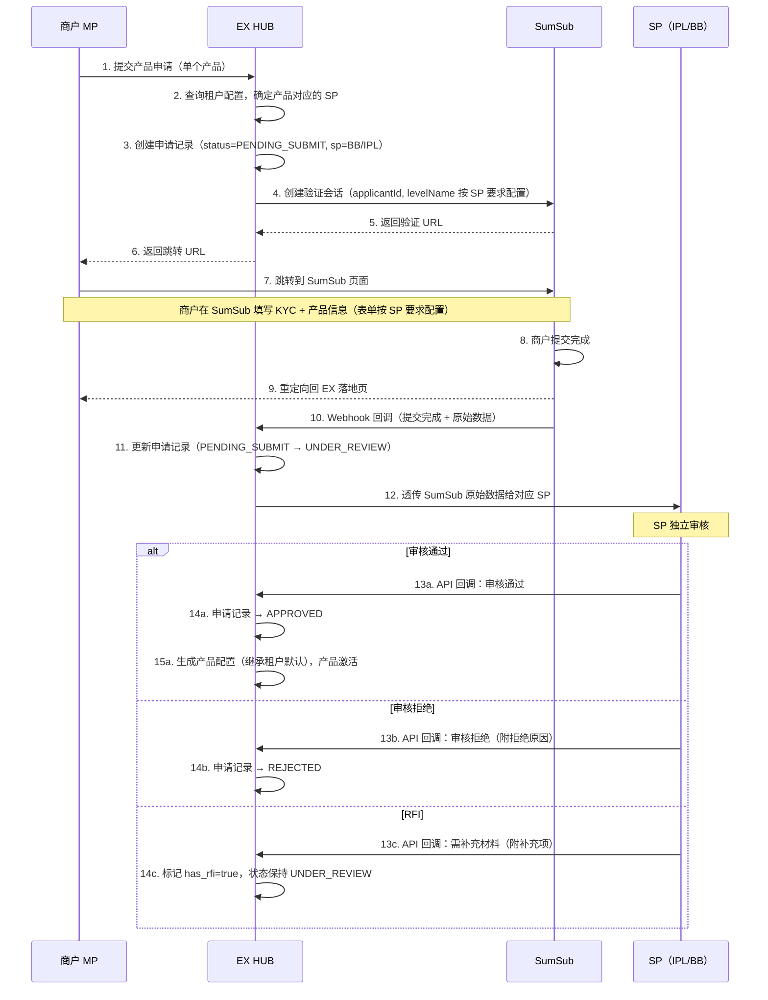

# 商户产品开通（Product Application）

> **文档类型**：产品需求文档（PRD）
> **版本**：v1.3
> **最后更新**：2026-02-23
> **配套原型**：`ProductApplication/html/mp-product-application.html`

---

## 目录

1. [产品概述](#1-产品概述)
2. [业务背景与客户分类](#2-业务背景与客户分类)
3. [本期产品范围](#3-本期产品范围)
4. [角色与系统](#4-角色与系统)
5. [产品开通模型 — 租户 vs SP 职责边界](#5-产品开通模型--租户-vs-sp-职责边界)
6. [核心概念与关键规则](#6-核心概念与关键规则)
7. [业务流程](#7-业务流程)
8. [页面交互说明（MP）](#8-页面交互说明mp)
9. [状态机](#9-状态机)
10. [审核通过后：产品配置生成](#10-审核通过后产品配置生成)
11. [异常与边界场景](#11-异常与边界场景)
12. [通知机制](#12-通知机制)
13. [数据模型](#13-数据模型)

---

## 1. 产品概述

### 1.1 定义

**产品开通（Product Application）** = 商户在 MP 端选择需要开通的产品 → 跳转 SumSub 提交产品所需信息 → SP 审核 → 审核通过后自动生成产品配置，产品激活。

### 1.2 核心流程（一句话）

```
选择产品 → 跳转 SumSub 提交产品信息 → 等待 SP 审核 → 审核通过 → 生成产品配置 → 产品激活
```

### 1.3 设计原则

| 原则                           | 说明                                                                                                             |
| ------------------------------ | ---------------------------------------------------------------------------------------------------------------- |
| **本期单产品开通**       | 商户在 MP 端每次选择**一个**产品进行开通。如需开通其他产品，由租户在 TP（Tenant Portal）端操作             |
| **SumSub 统一收集**      | 所有产品开通所需的资料（KYC + 产品信息）统一在 SumSub 平台收集，EX 平台不单独维护表单。SumSub 表单按 SP 要求配置 |
| **EX HUB 中转同步**      | SumSub 数据通过 EX HUB 透传给对应 SP（IPL/BB），EX 不加工数据                                                    |
| **SP 独立审核**          | 每个产品由其对应的 SP 独立审核，审核结果通过 API 回调通知 EX HUB                                                 |
| **产品路由对商户透明**   | 商户只看到产品名称（如 Card Issuing），底层路由到哪个 SP 由租户在 TP 端预先配置，商户无感知                      |
| **申请记录 ≠ 产品配置** | 商户提交后生成**申请记录**，SP 审核通过后才生成**产品配置**（继承租户默认模板）                      |
| **RFI 机制**             | 审核过程中如需补充材料，通过 RFI（Request for Information）通知商户，商户跳转 SumSub 补充                        |

---

## 2. 业务背景与客户分类

### 2.1 发卡产品客户分类

| #  | 客户类型                               | 使用方式                           | 本期是否涉及         |
| -- | -------------------------------------- | ---------------------------------- | -------------------- |
| 1  | **IPL 直客**                     | 在 IPL 体系内直接做发卡，不经过 EX | ❌ 不涉及            |
| 2  | **BB 直客**                      | 用原来BB的发卡产品                 | ❌ 不涉及            |
| 3a | **EX 租户商户 — 使用 BB 能力**  | 数币发卡，通过 EX 新系统           | ✅**本期重点** |
| 3b | **EX 租户商户 — 使用 IPL 能力** | 发卡产品嵌入 原 EX 白牌系统        | ✅**本期重点** |
| 3c | **EX 租户商户 — 使用 IPL + BB** | 法币 + 数币发卡，通过 EX 新系统    | ✅**本期重点** |
| 4  | **API 客户**                     | 通过 API 直接对接，使用新接口      | ✅**本期重点** |

> **本期 EX 新系统覆盖 3a 和 3c**：通过 EX 平台使用 BB 能力（数币发卡）或 IPL + BB 能力（法币+数币发卡）的租户商户。

### 2.1 数币收单产品客户分类

| # | 客户类型                              | 使用方式                                | 本期是否涉及         |
| - | ------------------------------------- | --------------------------------------- | -------------------- |
| 1 | **BB 直客-老**                  | 信息同步到:EX 租户=BB, 开通数币收单产品 | ✅**本期重点** |
| 2 | **BB 直客-新**                  | 使用新产品，EX 注册成为租户=BB的商户    | ✅**本期重点** |
| 3 | **EX 租户商户 — 使用 BB 能力** | 使用新产品，EX 注册成为租户=BB的商户    | ✅**本期重点** |

### 2.2 IPL 与 BB 的定位

| 系统          | 定位                          | 与 EX 的关系                                          |
| ------------- | ----------------------------- | ----------------------------------------------------- |
| **IPL** | 法币发卡能力提供方            | 体系内 SP，本期由 EX 帮其开发系统，可接收 SumSub 数据 |
| **BB**  | 数币发卡 + 数币收单能力提供方 | 体系内 SP，本期由 EX 帮其开发系统，可接收 SumSub 数据 |

> IPL 和 BB 虽然是体系内的 SP，但在产品开通流程中作为**独立审核方**，各自审核自己负责的产品。

### 2.3 数币收单产品（Crypto Checkout）

本期数币收单的 SP 为 **BB**。客户通过 EX 平台开通数币收单产品，审核由 BB 完成。

---

## 3. 本期产品范围

| 产品               | 英文名          | 说明                                               |
| ------------------ | --------------- | -------------------------------------------------- |
| **发卡**     | Card Issuing    | 虚拟卡/实体卡发行、消费管控、实时追踪              |
| **数币收单** | Crypto Checkout | 接受 USDT/USDC 等稳定币支付，支持在线支付、Invoice |

> **后续扩展**：OnRamp、OffRamp、Transfer 等产品可后续加入产品列表。新产品的开通由租户在 TP 端为商户发起。

---

## 4. 角色与系统

| 角色/系统                | 职责                                                                                            |
| ------------------------ | ----------------------------------------------------------------------------------------------- |
| **商户（MP）**     | 选择产品、跳转 SumSub 提交信息、查看审核状态、响应 RFI                                          |
| **租户（TP）**     | 配置产品路由（产品→SP 映射）、后续为商户开通新产品、管理商户产品配置                           |
| **SumSub**         | 统一收集产品开通所需的所有资料（KYC + 产品信息），表单按 SP 要求配置                            |
| **SP（IPL / BB）** | 体系内独立审核方，接收 EX HUB 透传的 SumSub 数据，独立审核、发起 RFI、通过 API 回调通知审核结果 |
| **EX HUB**         | 管理申请记录状态、接收 SumSub 回调、透传数据给 SP、接收 SP 审核回调、审核通过后生成产品配置     |

---

## 5. 产品开通模型 — 租户 vs SP 职责边界

> 本节描述的是**平台级统一模型**，适用于所有产品（Card Issuing、Crypto Checkout、OnRamp、OffRamp 等），不仅限于本期产品。

### 5.1 租户与 SP 的职责分离

```
┌─────────────────────────────────────────────────────────────────┐
│  租户（Tenant）                                                    │
│  ─ 商户管理：招募商户、维护商户信息                          │
│  ─ 产品路由配置：配置每个产品对应哪个 SP                    │
│  ─ 产品配置管理：设置默认模板、修改单个商户配置              │
│  ─ 后续产品开通：为商户发起新产品开通                      │
│  ❌ 不参与审核                                                    │
└─────────────────────────────────────────────────────────────────┘

┌─────────────────────────────────────────────────────────────────┐
│  SP（Service Provider）                                           │
│  ─ 唯一审核方：接收 KYC 数据、独立审核、发起 RFI              │
│  ─ 审核结果通过 API 回调通知 EX HUB                            │
│  ─ 产品能力提供方：提供实际的产品服务                        │
│  ✔ 唯一审核权限                                                    │
└─────────────────────────────────────────────────────────────────┘
```

| 职责领域           | 租户（Tenant） | SP               | EX HUB           |
| -------------------- | -------------- | ---------------- | ---------------- |
| 商户招募与管理     | ✔              | ─                | ─                |
| 产品路由配置       | ✔              | ─                | 执行路由         |
| 产品配置管理       | ✔              | ─                | 存储配置         |
| KYC 数据接收       | ❌              | ✔                | 透传             |
| 产品开通审核       | ❌              | ✔                | 状态管理         |
| RFI 发起           | ❌              | ✔                | 转发通知         |
| 审核结果通知       | ─              | ✔（API 回调） | 接收并处理       |
| 生成产品配置       | ─              | ─                | ✔（自动生成） |
| 后续为商户开通新产品 | ✔              | ─                | 执行             |

### 5.2 KYC 数据流向：只推给 SP，不推给租户

```
商户在 SumSub 提交 KYC 资料
    │
    │  Webhook
    ▼
EX HUB 接收 SumSub 原始数据
    │
    ├── 查询租户配置：该产品路由到哪个 SP？
    │
    ├── 透传原始数据 → SP          ✔ 推送
    │
    └── 不推送给租户                ❌ 不推送
```

**设计原因：**
- 租户不参与审核，不需要 KYC 数据
- 避免数据冗余和运营重复劳动
- 租户只需关心审核结果（通过/拒绝），不需要看到审核过程数据

### 5.3 租户 = SP 的场景处理

在实际业务中，同一实体可能同时担任租户和 SP 两个角色。架构上仍然分离建模，但运营上简化处理。

**典型场景：BB 同时是租户和 SP**

```
BB 的多重角色：
    │
    ├── 角色 A：租户
    │     ├── 管理自己的直客商户
    │     ├── 代理自己的产品（数币发卡、数币收单）
    │     └── 也可代理其他 SP 的产品（如 IPL 的法币发卡）
    │
    └── 角色 B：SP
          ├── 为自己租户下的商户审核（自己代理自己）
          └── 为其他租户下的商户审核（被别人代理）
```

**场景矩阵：**

| 场景                                   | 租户 | SP       | KYC 数据推送给 | 审核方 | 备注                         |
| -------------------------------------- | ---- | -------- | -------------- | ------ | ------------------------------ |
| BB 直客用 BB 数币发卡                 | BB   | BB       | BB（SP 角色）  | BB     | 租户=SP，只审核一次         |
| BB 直客用 BB 数币收单                 | BB   | BB       | BB（SP 角色）  | BB     | 租户=SP，只审核一次         |
| BB 直客用 IPL 法币发卡                | BB   | IPL      | IPL            | IPL    | BB 代理 IPL 产品，透传给 IPL |
| 租户 X 商户用 BB 数币发卡              | X    | BB       | BB             | BB     | 标准流程                     |
| 租户 X 商户用 IPL 法币发卡             | X    | IPL      | IPL            | IPL    | 标准流程                     |
| 租户 X 商户用 IPL+BB 法币+数币发卡 | X    | IPL + BB | IPL 和 BB      | 各自   | 每个 SP 独立审核自己的产品   |

### 5.4 租户 = SP 时的架构原则

| 原则                     | 说明                                                                                                   |
| ------------------------ | ------------------------------------------------------------------------------------------------------ |
| **架构上分离建模** | 租户和 SP 在数据模型和权限上始终是两个独立实体，即使它们属于同一个组织                                     |
| **KYC 只推给 SP**      | 无论租户和 SP 是否同一实体，KYC 数据只推送给 SP 角色。租户=SP 时天然只推一次、只审核一次          |
| **Portal 统一登录**   | 租户=SP 时，用户登录 SP Portal 即可同时看到租户管理功能和 SP 审核功能，不需要登录两个系统 |
| **代理其他 SP 产品** | 租户可代理其他 SP 的产品，此时 KYC 数据推给对应的 SP，不推给租户本身                                |
| **审核不重复**         | 同一个商户的同一个产品，只有一个 SP 审核，不会因为租户=SP 而审核两次                                |

### 5.5 完整数据流图（通用模型）



> **注意**：租户（虚线）只参与配置和管理，不参与审核数据流（实线）。当租户=SP 时，同一组织的用户通过 SP Portal 登录，同时看到审核功能和租户管理功能。

### 5.6 Portal 登录模型

| 场景             | 登录端                  | 可见功能                                   |
| ---------------- | ----------------------- | ------------------------------------------ |
| 纯租户           | TP（Tenant Portal）     | 商户管理、产品路由配置、产品配置管理         |
| 纯 SP            | SP Portal               | 审核工作台、RFI 管理、审核结果管理             |
| 租户 + SP（同一实体） | SP Portal（统一入口） | 审核工作台 + 商户管理 + 产品配置管理       |

> 租户=SP 时，用户只需登录 **SP Portal** 一个端，系统根据其组织同时拥有的角色（Tenant + SP）自动展示对应功能模块。

---

## 6. 核心概念与关键规则

### 6.1 申请记录 vs 产品配置

这是本方案最关键的区分：

```
┌─────────────────────────────────────────────────────────────────┐
│  申请记录（Application Record）                                  │
│  ─ 商户提交后立即生成                                            │
│  ─ 记录：商户选了哪些产品、提交时间、审核状态                      │
│  ─ 不包含任何产品配置参数                                        │
│  ─ 状态：PENDING → UNDER_REVIEW → APPROVED / REJECTED           │
└─────────────────────────────────────────────────────────────────┘
                              │
                              │ SP 审核通过
                              ▼
┌─────────────────────────────────────────────────────────────────┐
│  产品配置（Product Config）                                      │
│  ─ 仅在审核通过后由系统自动生成                                   │
│  ─ 默认值 = 租户（Tenant）的默认配置模板                          │
│  ─ 包含：费率、限额、结算周期、风控规则等产品参数                  │
│  ─ 租户可在 TP 端对单个商户的配置进行个性化修改                    │
│  ─ 产品配置生成 = 产品激活                                       │
└─────────────────────────────────────────────────────────────────┘
```

### 6.2 MP 单产品开通 vs TP 后续开通

| 场景                     | 操作端       | 说明                                                                 |
| ------------------------ | ------------ | -------------------------------------------------------------------- |
| **首次产品开通**   | MP（商户端） | 商户登录后选择**一个**产品，跳转 SumSub 提交信息，等待 SP 审核 |
| **后续开通新产品** | TP（租户端） | 租户在 TP 端为商户发起新产品开通，商户不再自行操作                   |
| **修改产品配置**   | TP（租户端） | 租户在 TP 端修改商户的产品配置（费率、限额等）                       |

> **本期 MP 端只支持单产品开通**。商户提交申请后，MP 端的产品申请页面变为只读状态展示。

### 6.3 SumSub 统一收集 + EX HUB 透传

| 要点                         | 说明                                                                                                |
| ---------------------------- | --------------------------------------------------------------------------------------------------- |
| **不单独维护表单**     | EX 平台本期不自建产品开通的信息填写页面                                                             |
| **SumSub 负责收集**    | 所有产品开通所需的资料（KYC 身份验证 + 产品特定的合规信息）统一在 SumSub 平台收集                   |
| **表单按 SP 要求配置** | SumSub 侧根据产品对应的 SP 配置 `levelName`，展示 SP 要求的信息收集表单                           |
| **EX HUB 透传**        | SumSub Webhook 回调 EX HUB，EX HUB 将原始数据透传给对应 SP，不做数据加工                            |
| **SP 独立审核**        | SP 接收数据后独立审核，审核结果通过 API 回调通知 EX HUB                                             |
| **产品信息举例**       | Card Issuing 可能需要：预计发卡量、资金来源说明；Crypto Checkout 可能需要：业务场景描述、预计交易量 |

### 6.4 产品路由与 SP 映射

```
商户在 MP 选择产品（如 Card Issuing）
    │
    ├── 商户不知道底层 SP 是谁
    │
    └── EX HUB 查询租户配置：
          │
          ├── 租户 A 的 Card Issuing → 路由到 BB（数币发卡）
          ├── 租户 B 的 Card Issuing → 路由到 IPL（法币发卡）
          └── 租户 C 的 Card Issuing → 路由到 IPL + BB（法币+数币发卡）
```

| 配置项           | 管理端    | 说明                                          |
| ---------------- | --------- | --------------------------------------------- |
| 产品 → SP 映射  | TP        | 租户在 TP 端配置每个产品对应的 SP，商户无感知 |
| SumSub levelName | TP / 系统 | 根据产品 + SP 组合决定 SumSub 表单配置        |

### 6.5 审核通过后的产品配置生成

```
SP 审核通过（API 回调 EX HUB）
    │
    ├── 1. 申请记录状态 → APPROVED
    │
    ├── 2. 生成商户产品配置
    │       ├── 查找租户的默认配置模板（tenant_product_template）
    │       ├── 复制模板 → 生成商户级产品配置（merchant_product_config）
    │       └── 标记 config.status = ACTIVE
    │
    ├── 3. 产品配置生成 = 产品激活
    │
    └── 4. 商户下次登录 → 直接进入 Dashboard，菜单中可见已激活产品
```

**默认配置模板示例：**

| 配置项     | Card Issuing 默认值 | Crypto Checkout 默认值 |
| ---------- | ------------------- | ---------------------- |
| 费率       | 继承租户默认        | 继承租户默认           |
| 单笔限额   | 继承租户默认        | 继承租户默认           |
| 日累计限额 | 继承租户默认        | 继承租户默认           |
| 结算周期   | 继承租户默认        | 继承租户默认           |
| 风控规则   | 继承租户默认        | 继承租户默认           |

> 租户可在 TP 端为单个商户覆盖任意配置项。

---

## 7. 业务流程

### 7.1 主流程

```mermaid
flowchart TD
    A[商户登录 MP] --> B{是否有待开通产品}
    B -->|已全部开通| B1[直接进入 Dashboard]
    B -->|有可开通产品| C[展示产品选择页面]
  
    C --> D[商户选择一个产品]
    D --> E[点击 Continue]
    E --> F[展示"提交产品信息"说明页]
    F --> G[点击 Proceed to SumSub]
    G --> H[跳转 SumSub 外部页面]
  
    H --> I[商户在 SumSub 提交资料]
    I --> J[SumSub 回调 EX HUB]
    J --> K[生成申请记录 status=UNDER_REVIEW]
    K --> L[展示"已提交，等待审核"落地页]
  
    L --> M[商户再次登录]
    M --> N{申请记录状态}
  
    N -->|UNDER_REVIEW| O[展示"审核中"状态页]
    N -->|APPROVED| P[直接进入 Dashboard — 产品已激活]
    N -->|REJECTED| Q[展示拒绝原因]
    N -->|UNDER_REVIEW + RFI| R[展示"审核中 + RFI 待办"]
  
    R --> S[商户点击查看 RFI]
    S --> T[跳转 SumSub 补充材料]
    T --> J
```

### 7.2 SumSub 跳转、数据同步与 SP 审核流程



> **说明**：上述时序图涵盖从商户提交到 SP 审核回调的全流程，包括 EX HUB 透传数据给 SP 的环节。

---

## 8. 页面交互说明（MP）

> 配套原型：`mp-product-application.html`，采用 MP 标准布局（左侧菜单 + 顶栏 + 内容区）。

### 8.1 主流程（内容区白色卡片内）

主流程为 3 步，在同一个内容卡片中切换：

| 步骤   | 名称                          | 说明                                         |
| ------ | ----------------------------- | -------------------------------------------- |
| Step 1 | **Select Product**      | 选择要开通的产品（单选）                     |
| Step 2 | **Submit Product Info** | 说明将跳转 SumSub 提交信息，展示所需材料清单 |
| Step 3 | **Under Review**        | 提交成功落地页，展示审核状态                 |

#### Step 1: Select Product

| 元素          | 说明                                                                   |
| ------------- | ---------------------------------------------------------------------- |
| 步骤指示器    | 3 步进度条，当前高亮 Step 1                                            |
| 产品卡片      | 每个产品一张卡片，点击选中，**单选**（选择新产品自动取消上一个） |
| Continue 按钮 | 未选产品时禁用                                                         |

#### Step 2: Submit Product Info

| 元素              | 说明                               |
| ----------------- | ---------------------------------- |
| 步骤指示器        | Step 1 ✓，Step 2 高亮             |
| 标题              | "Submit Product Information"       |
| SumSub 服务商信息 | 品牌、信任标识                     |
| 所需材料清单      | KYC 材料 + 产品特定合规信息        |
| 已选产品标签      | 展示本次申请的产品                 |
| 操作按钮          | "← Back" / "Proceed to SumSub →" |

#### Step 3: Under Review（落地页）

| 元素           | 说明                               |
| -------------- | ---------------------------------- |
| 步骤指示器     | Step 1 ✓，Step 2 ✓，Step 3 高亮  |
| 状态图标       | 📨                                 |
| 标题           | "Application Submitted!"           |
| 状态徽章       | ⏳ Under Review                    |
| 已申请产品列表 | 每个产品一行，显示名称、日期、状态 |
| 后续说明       | 审核流程、邮件通知、RFI、自动激活  |

### 8.2 再次登录状态预览（主流程下方）

主流程卡片下方，用虚线分隔，提供 3 个预览按钮：

| 按钮               | 对应场景 | 说明                                                |
| ------------------ | -------- | --------------------------------------------------- |
| ⏳ Still Reviewing | 审核中   | 展示审核中状态页，含产品列表                        |
| ❌ Rejected        | 审核拒绝 | 展示拒绝原因（仅展示原因，无重新申请/联系客服按钮） |
| 📋 RFI Pending     | RFI 待办 | 展示审核中 + RFI 横幅，可点击查看 RFI 详情          |

> **✅ Approved**：审核通过后商户直接进入 Dashboard，无需单独的交互页面。以文字说明标注即可。

### 8.3 拒绝页面说明

- 仅展示拒绝原因，不提供"重新申请"或"联系客服"按钮
- 拒绝原因支持多条，每条含标题和详细说明

---

## 9. 状态机

### 9.1 申请记录状态机

```
                    ┌────────────────┐
                    │ PENDING_SUBMIT │  商户选择产品，等待跳转 SumSub
                    └───────┬────────┘
                            │ 商户在 SumSub 提交完成
                            ▼
                    ┌──────────────┐
                    │ UNDER_REVIEW │  资料已提交，SP 审核中
                    └──────┬───────┘
                           │
              ┌────────────┼────────────┐
              ▼            │            ▼
       ┌──────────┐       │     ┌──────────┐
       │ APPROVED │       │     │ REJECTED │
       └────┬─────┘       │     └──────────┘
            │             │
            │             │ （RFI 不改变状态，
            │             │   仅标记 has_rfi=true）
            │             ▼
            │      UNDER_REVIEW + RFI
            │
            ▼
    生成产品配置（Product Config）
    继承租户默认配置
    产品激活
```

### 9.2 状态说明

| 状态               | 说明                      | 商户端展示              | 商户可执行操作              |
| ------------------ | ------------------------- | ----------------------- | --------------------------- |
| PENDING_SUBMIT     | 已选产品，等待提交 SumSub | Step 2 页面             | 跳转 SumSub                 |
| UNDER_REVIEW       | 资料已提交，SP 审核中     | Under Review            | 等待 / 查看状态             |
| UNDER_REVIEW + RFI | 审核中，需补充材料        | Under Review + RFI 待办 | 查看 RFI / 跳转 SumSub 补充 |
| APPROVED           | 审核通过                  | 直接进入 Dashboard      | 使用产品                    |
| REJECTED           | 审核拒绝                  | 展示拒绝原因            | 仅查看                      |

---

## 10. 审核通过后：产品配置生成

### 10.1 生成流程

```
SP 审核通过
    │
    ├── 1. 更新申请记录 status → APPROVED
    │
    ├── 2. 遍历 application.products[]
    │       │
    │       ├── 对每个产品：
    │       │     ├── 查找租户的默认配置模板（tenant_product_template）
    │       │     ├── 复制模板 → 生成商户级产品配置（merchant_product_config）
    │       │     └── 标记 config.status = ACTIVE
    │       │
    │       └── 所有产品配置生成完毕
    │
    ├── 3. 商户状态 → 已激活
    │
    └── 4. 发送通知（邮件 + 站内）
```

### 10.2 配置层级

```
租户默认配置（Tenant Product Template）
    │
    │  复制 + 可覆盖
    ▼
商户产品配置（Merchant Product Config）
    │
    │  租户可在 TP 端修改
    ▼
最终生效配置
```

| 层级         | 管理端 | 说明                                                        |
| ------------ | ------ | ----------------------------------------------------------- |
| 租户默认配置 | TP     | 租户为所有商户设置的默认产品参数（费率、限额、结算周期等）  |
| 商户产品配置 | TP     | 审核通过后自动生成，默认 = 租户默认。租户可针对单个商户修改 |

### 10.3 产品配置内容（示例）

| 配置项                       | 说明                 | 来源         |
| ---------------------------- | -------------------- | ------------ |
| 费率（fee_rate）             | 交易手续费率         | 继承租户默认 |
| 单笔限额（single_limit）     | 单笔交易最大金额     | 继承租户默认 |
| 日累计限额（daily_limit）    | 每日累计交易最大金额 | 继承租户默认 |
| 结算周期（settlement_cycle） | T+N 结算             | 继承租户默认 |
| 支持币种（currencies）       | 可用币种列表         | 继承租户默认 |
| 风控规则（risk_rules）       | 风控策略             | 继承租户默认 |

---

## 11. 异常与边界场景

| # | 场景                               | 处理方式                                                 |
| - | ---------------------------------- | -------------------------------------------------------- |
| 1 | 商户在 SumSub 页面中途关闭浏览器   | 申请记录保持 PENDING_SUBMIT，再次登录时引导继续          |
| 2 | SumSub 回调超时                    | 系统定时轮询 SumSub 状态                                 |
| 3 | 商户已有审核中的申请               | 不允许重复提交，展示当前审核状态                         |
| 4 | RFI 超过截止日期未响应             | 系统发送提醒邮件；超期后 SP 决定拒绝或延期               |
| 5 | 审核拒绝后需重新申请               | 由租户在 TP 端为商户重新发起（本期 MP 端不支持重新申请） |
| 6 | 商户想开通新产品（已有产品激活后） | 由租户在 TP 端操作，MP 端不再展示产品选择                |
| 7 | 所有产品已开通                     | MP 端产品申请页面变为只读状态展示                        |
| 8 | 租户默认配置模板不存在             | 系统告警，人工介入创建模板后再生成配置                   |

---

## 12. 通知机制

| 触发事件              | 通知方式    | 通知内容                       |
| --------------------- | ----------- | ------------------------------ |
| 资料提交成功          | 邮件        | 确认已提交，预计审核时间       |
| 审核通过              | 邮件 + 站内 | 产品已激活，引导进入 Dashboard |
| 审核拒绝              | 邮件 + 站内 | 拒绝通知，附拒绝原因           |
| RFI 发起              | 邮件 + 站内 | 需补充材料，附清单和截止日期   |
| RFI 即将到期（T-1天） | 邮件        | 提醒即将到期                   |

---

## 13. 数据模型

### 13.1 产品申请记录（product_application）

| 字段                | 类型     | 说明                                                              |
| ------------------- | -------- | ----------------------------------------------------------------- |
| id                  | string   | 申请记录 ID                                                       |
| merchant_id         | string   | 商户 MID                                                          |
| tenant_id           | string   | 所属租户 ID                                                       |
| product_code        | string   | 申请的产品标识（单个），如 `card_issuing` / `crypto_checkout` |
| sp_code             | string   | 路由到的 SP 标识（如 `bb` / `ipl`），由租户配置决定           |
| status              | enum     | PENDING_SUBMIT / UNDER_REVIEW / APPROVED / REJECTED               |
| has_rfi             | boolean  | 是否有待处理的 RFI                                                |
| sumsub_applicant_id | string   | SumSub 侧的申请人 ID                                              |
| sumsub_level_name   | string   | SumSub 验证级别（决定收集哪些信息）                               |
| sumsub_session_url  | string   | SumSub 验证页面 URL                                               |
| reject_reason       | text     | 拒绝原因（审核拒绝时填写）                                        |
| created_at          | datetime | 创建时间                                                          |
| submitted_at        | datetime | SumSub 提交完成时间                                               |
| reviewed_at         | datetime | 审核完成时间                                                      |
| reviewed_by         | string   | 审核人                                                            |

### 13.2 RFI 记录（product_application_rfi）

| 字段           | 类型     | 说明                          |
| -------------- | -------- | ----------------------------- |
| id             | string   | RFI ID                        |
| application_id | string   | 关联的申请记录 ID             |
| items          | array    | 需补充的材料列表              |
| deadline       | datetime | 截止日期                      |
| status         | enum     | PENDING / RESPONDED / EXPIRED |
| created_at     | datetime | 创建时间                      |
| responded_at   | datetime | 商户响应时间                  |

### 13.3 商户产品配置（merchant_product_config）

| 字段               | 类型     | 说明                                       |
| ------------------ | -------- | ------------------------------------------ |
| id                 | string   | 配置 ID                                    |
| merchant_id        | string   | 商户 MID                                   |
| tenant_id          | string   | 所属租户 ID                                |
| product_code       | string   | 产品标识（card_issuing / crypto_checkout） |
| status             | enum     | ACTIVE / SUSPENDED                         |
| config             | json     | 产品配置参数（费率、限额、结算周期等）     |
| source_template_id | string   | 来源的租户默认模板 ID                      |
| application_id     | string   | 关联的申请记录 ID                          |
| created_at         | datetime | 创建时间（= 审核通过时间）                 |
| updated_at         | datetime | 最后修改时间                               |
| updated_by         | string   | 最后修改人（租户操作员）                   |

### 13.4 租户产品默认模板（tenant_product_template）

| 字段         | 类型     | 说明         |
| ------------ | -------- | ------------ |
| id           | string   | 模板 ID      |
| tenant_id    | string   | 租户 ID      |
| product_code | string   | 产品标识     |
| config       | json     | 默认配置参数 |
| created_at   | datetime | 创建时间     |
| updated_at   | datetime | 最后修改时间 |

---

*最后更新：2026-02-23*
*文档版本：v1.3 — 新增产品开通模型（租户 vs SP 职责边界、KYC 只推 SP、租户=SP 场景处理、Portal 登录模型）*
