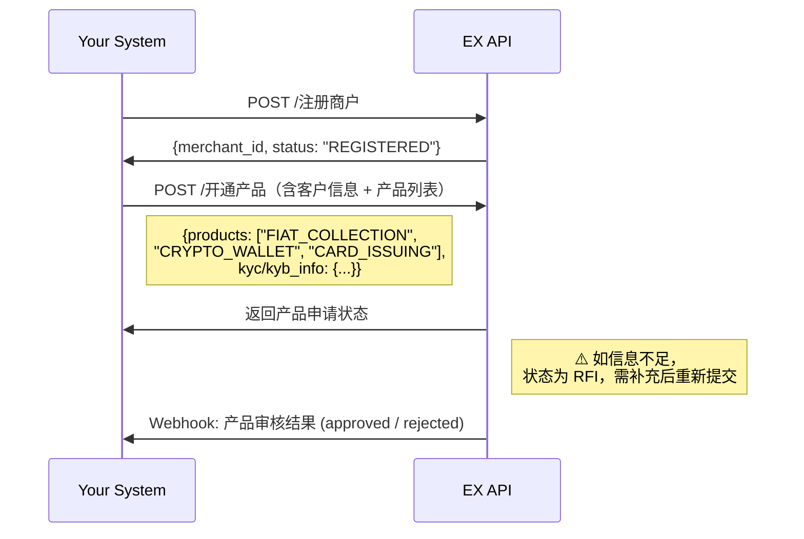

# EX Open API — 一站式金融基础设施解决方案

> **文档类型**: 综合解决方案指南
> **版本**: v1.0
> **最后更新**: 2026-04-10
> **API 参考**: [EurewaX 开放平台](https://open.eurewax.com/)
> **定位对标**: Stripe Connect / Airwallex Global Accounts

---

## 一、关于EX

EX 通过 EurewaX 开放平台，为合作伙伴提供**一套 API 覆盖收付款、承兑（数币充提/兑换）、发卡、收单**的全链路金融基础设施。

您不需要自建合规团队、对接多家持牌机构、或管理复杂的资金链路 —— **一次集成，全部搞定**。

**核心价值：**

| 维度                 | 说明                                                                                               |
| -------------------- | -------------------------------------------------------------------------------------------------- |
| **合规即服务** | 一次提交商户材料，EX 统一管理 KYC/KYB 审核、AML 监控，您无需单独对接合规机构                       |
| **全产品覆盖** | 收付款（VA/付款/换汇）、承兑（数币充提/买卖）、收单（API/收银台）、发卡（VCC） —— 一个平台全包含 |
| **统一技术栈** | RESTful API + Webhook + 统一签名/加密体系，对接一次，所有产品线复用                                |
| **灵活组合**   | 按需开通产品线，API 可自由编排，适配不同业务架构                                                   |

---

## 二、EX可以服务谁

### 2.1 客户画像与推荐产品

| 客户类型                      | 典型场景                       | 推荐产品组合               | 集成复杂度 |
| ----------------------------- | ------------------------------ | -------------------------- | ---------- |
| **跨境电商平台**        | 卖家收款、付供应商、结汇到中国 | 法币收款 + 法币付款 + 换汇 | ⭐⭐       |
| **外贸 B2B 平台**       | 货款收付、多币种结算           | 法币收款 + 法币付款 + 换汇 | ⭐⭐       |
| **加密货币交易所**      | 为用户提供法币出入金           | 加密服务全套               | ⭐⭐⭐     |
| **加密支付平台**        | 商户收数币、换法币             | 聚合收银 + 加密服务        | ⭐⭐       |
| **VCC 发行平台**      | 批量发卡、资金管理             | VCC 发卡                   | ⭐⭐       |
| **综合 Fintech / BaaS** | 白标所有能力给终端客户         | 全产品组合                 | ⭐⭐⭐⭐   |
| **跨境支付平台**        | 收付+换汇+发卡组合             | 法币收付 + VCC + 换汇      | ⭐⭐⭐     |

### 2.2 决策树 —— 要不要接？

```
您的平台需要以下哪些能力？
│
├── 全球法币收款（VA 虚拟账户） ──────→ 法币收款
├── 全球法币付款（POBO 代付） ────────→ 法币付款
├── 多币种换汇 / 结汇到人民币 ────────→ 外汇服务
├── 加密货币充提（USDT/BTC/ETH 等）──→ 加密服务
├── 法币 ↔ 加密货币兑换 ─────────────→ 加密兑换（OnRamp/OffRamp）
├── 接受数币支付（商户收款）──────────→ 聚合收银
├── 虚拟信用卡发行与管理 ─────────────→ VCC 发卡
│
└── 以上任意组合 → 一次前置流程，按需开通
```

---

## 三、产品全景

### 3.1 产品矩阵

| 产品板块             | 产品                      | 能力                                                                         |
| -------------------- | ------------------------- | ---------------------------------------------------------------------------- |
| **产品开通**   | KYC/KYB                   | 商户注册、身份审核、产品申请、增开产品                                       |
| **收付款产品** | 法币账户（Fiat Account）  | 充值（Deposit）、提现（Withdrawal）、 余额查询                              |
|                      | 收款（Collection）        | va开户、va管理、收款、收款退款                                               |
|                      | 付款（Payout）            | 付款（含全球付款、本地付款、VAT缴税等）                                      |
|                      | 外汇服务（FX）            | 查询汇率、询价锁汇、实时换汇                                                 |
| **承兑产品**   | 法币账户（Fiat Account）  | 充值（Deposit）、提现（Withdrawal）、余额查询                                |
|                      | 数币钱包（Crypto Wallet） | 充币（Crypto Deposit）、提币（Crypto Withdrawal）、充币退款（Crypto Refund） |
|                      | 买入数币（Buy Crypto）    | 买入数币、法转数（Fiat to Crypto）                                           |
|                      | 卖出数币（Sell Crypto）   | 卖出数币、数转法（Crypto to Fiat）                                           |
| **收单产品**   | Crypto Checkout      | 收单交易（Acq Authorization）、收单退款（Acq Refund）                        |
| **发卡产品**   | VCC（Card Issuing）       | 开卡、卡管理、资金转入、销卡、资金转出、卡消费、3DS验证等                    |
| **公共服务**   | 认证/通知                 | 获取Token、配置Webhook、文件上传、补充材料                                   |

### 3.2 架构总览

```
┌──────────────────────────────────────────────────────────────────┐
│                         您的系统                                  │
│   (电商平台 / 支付平台 / 交易所 / BaaS / 发卡平台 / Fintech)     │
└──────────────────┬───────────────────────────────────────────────┘
                   │  统一 RESTful API + Webhook
                   ▼
┌──────────────────────────────────────────────────────────────────┐
│                     EurewaX 开放平台                              │
│                                                                  │
│  ┌──────────┐ ┌──────────┐ ┌──────────┐ ┌──────────┐           │
│  │ 产品开通  │ │ 收付款产品 │ │ 承兑产品  │ │ 发卡产品  │           │
│  │ KYC/KYB  │ │ VA / 付款 │ │ 充提/兑换 │ │ 开卡/资金 │           │
│  └──────────┘ └──────────┘ └──────────┘ └──────────┘           │
│                                                                  │
│  ┌──────────┐ ┌──────────┐                                      │
│  │ 收单产品  │ │ 公共服务  │                                      │
│  │ API/收银台│ │ 认证/通知 │                                      │
│  └──────────┘ └──────────┘                                      │
└──────────────────────────────────────────────────────────────────┘
                   │
                   ▼  多服务商
┌──────────────────────────────────────────────────────────────────┐
│              持牌服务商（SP）                                      │
│      不同 SP 覆盖不同地区、币种和支付能力                          │
└──────────────────────────────────────────────────────────────────┘
```

**多服务商（SP）架构说明：**

EX 法币业务背后对接多家持牌服务商（SP），不同 SP 覆盖不同地区、币种和支付能力。对您而言：

- **统一 API**：您只对接 EX 一套 API，无需感知底层 SP 的差异
- **智能路由**：EX 根据业务类型、币种、地区自动选择最优 SP
- **多币种账户**：商户在不同 SP 下可能有独立账户，但商户端只看到按币种合计的总余额
- **合规由 SP 承担**：KYC/KYB 审核、AML 监控由持牌 SP 执行，EX 统一编排并同步结果

---

## 四、技术规范（所有产品线通用）

| 项目         | 说明                                                                  |
| ------------ | --------------------------------------------------------------------- |
| 协议         | HTTPS                                                                 |
| 接口风格     | RESTful API                                                           |
| 数据格式     | JSON                                                                  |
| 认证方式     | 商户 Token（通过认证服务获取）                                        |
| 签名算法     | SHA256withRSA（客户私钥签名，平台公钥验签）                           |
| 敏感数据加密 | AES-GCM（Base64 编码密钥，SHA-256 派生）                              |
| 异步通知     | Webhook（支持按类型配置不同回调地址，或 `notifyType=ALL` 统一接收） |

> 密钥生成、签名/验签代码示例、AES 加解密代码示例找技术支持提供

---

## 五、前置流程 — 环境准备

开始对接前，在专属对接群中联系技术支持完成 Sandbox 环境配置：

```
步骤 1 → 联系技术支持开通 Sandbox 环境，获取测试账号（Account No）、测试域名
步骤 2 → 获取 APP ID、平台公钥、AES Key
步骤 3 → 客户生成 RSA 密钥对（SHA256withRSA，2048 位）→ 上传客户公钥到管理平台
步骤 4 → 配置 Webhook 回调地址（HTTPS，支持 POST）
步骤 5 → 完成签名验签 + AES 加解密联调验证
```

> 环境准备完成后，即可进入业务流程对接。Sandbox 环境参数详见 [环境参数](https://open.eurewax.com/%E7%8E%AF%E5%A2%83%E5%8F%82%E6%95%B0-6918053m0)

---

## 六、业务流程详解

### 6.0 商户注册与产品开通

#### 6.0.1 首次开通（注册 + KYC/KYB + 产品申请）

首次接入时，需完成注册 → 身份审核 → 产品开通的完整流程。

**业务流程：**

```
├── 1. 注册商户
│     └── 调用注册接口 → 获取唯一商户标识（MID）
│
├── 2. 开通产品（含 KYC/KYB）
│     └── 提交商户基本信息、法人/董事信息、营业执照 + 产品申请
│     └── 附件先调【上传文件】接口获取 URL，再放入业务请求
│     └── 系统自动进行 KYC/KYB 审核 + 产品资质校验
│     └── Webhook: 产品审核结果（approved / rejected / RFI）
│
└── 3. 产品审核通过 → 进入对应业务流程
```



#### 6.0.2 增开产品-coming soon（已有商户新增产品线）

已完成首次开通的商户，后续需要新增产品线时，走**单独的增开产品接口**，无需重复 KYC/KYB。

**业务流程：**

```
├── 1. 申请增开产品
│     └── 调用增开产品接口 → 指定新的产品代码
│     └── 系统校验已有信息是否满足新产品要求
│     └── 如信息不足 → RFI 要求补充额外信息
│     └── Webhook: 产品审核结果（approved / rejected / RFI）
│
└── 2. 审核通过 → 新产品线即可使用
```

**关键说明：**

- **首次开通 = 注册 + KYC/KYB + 产品申请**：一次提交，系统同时完成身份审核和产品开通
- **增开产品 = 单独接口**：已审核商户直接申请新产品，无需重复提交身份材料
- **产品开通可能需要补充信息**：不同产品对客户资质要求不同，不足时返回 RFI 要求补充
- **RFI 响应**：审核期间可能要求补充材料（RFI），请及时响应，超时可能导致审核失败
- **文件先传**：所有附件先调用【上传文件】接口获取 URL，再放入业务请求
- 商户信息模版：由技术支持提供

---

### 收付款产品

> 收付款产品对应 API 文档中的「3 法币业务」，包含法币账户、收款、付款、外汇服务四个产品。

---

### 6.1 法币账户（Fiat Account）

**适用场景**：法币资金充值/提现、余额查询、账户间转账、资金归集

**涉及接口：**

| 模块 | 接口 | 类型 |
| --- | --- | --- |
| 账户管理 | 账户查询 | API |
| | 账户授权 | API |
| | 取消授权 | API |
| 账户交易 | 账户转账 | API |
| | 批量转账 | API |
| | 资金归集 | API |
| | 资金归集结果通知 | Webhook |
| 交易查询 | 资金归集交易详情 | API |
| | 转账交易详情 | API |

**业务流程：**

```
前置完成（收付款产品已开通，法币账户自动初始化）
    │
    ├── 【充值 / 提现】
    │     ├── 充值：外部银行 → 法币账户（通过 VA 入账或同名充值）
    │     └── 提现：法币账户 → 外部银行（通过付款接口或同名提现）
    │
    ├── 【余额查询】
    │     └── 账户查询 → 获取商户下所有法币账户及余额
    │
    ├── 【账户间转账】
    │     ├── 单笔转账 → 指定源账户、目标账户、金额
    │     └── 批量转账 → 一次提交多笔转账指令
    │
    ├── 【资金归集】
    │     ├── 发起资金归集 → 将多个子账户资金汇总到指定主账户
    │     └── Webhook: 资金归集结果通知
    │
    └── 【授权管理】
          └── 账户授权 / 取消授权 → 管理账户间的操作权限
```

---

### 6.2 收款（Collection）

**适用场景**：跨境电商卖家收款、外贸 B2B 货款收取

**涉及接口：**

| 模块 | 接口 | 类型 |
| --- | --- | --- |
| 收款店铺管理 | 获取平台站点 | API |
| | 添加店铺持有人 | API |
| | 绑定店铺 | API |
| | 查询店铺信息 | API |
| VA 账号服务 | 申请 VA 账号 | API |
| | 下载开户凭证 | API |
| | 查询 VA 账号 | API |
| | VA 账号变更通知 | Webhook |
| 收款交易处理 | 收款入账通知 | Webhook |
| 交易查询 | 收款交易详情 | API |
| | 下载交易凭证 | API |

**业务流程：**

```
前置完成（产品 FIAT_COLLECTION 已开通）
    │
    ├── 1. 店铺管理（按 SP 要求，部分场景必需）
    │     ├── 获取平台站点 → 查看可绑定的电商平台
    │     ├── 添加店铺持有人 → 填写店铺持有人信息
    │     ├── 绑定店铺 → 将电商店铺与 VA 关联
    │     └── 查询店铺信息
    │
    ├── 2. 申请 VA 虚拟账户
    │     ├── 申请 VA 账号 → 按币种/国家申请，获取银行名、账号、SWIFT 等
    │     ├── 下载开户凭证
    │     └── 查询 VA 账号
    │     └── Webhook: VA 账号变更通知
    │
    ├── 3. 汇款人向 VA 打款
    │     └── 付款方通过银行汇款至 VA 账号
    │
    ├── 4. 收款到账
    │     └── Webhook: 收款入账通知 → {amount, currency, sender_info}
    │
    └── 5. 确认到账
          └── 查询收款交易详情 / 下载交易凭证
```

> VA 收款为被动入账，无需主动调用交易接口。到账后系统自动推送 Webhook。

---

### 6.3 付款（Payout）

**适用场景**：付给供应商、结汇到中国大陆等

**涉及接口：**

| 模块 | 接口 | 类型 |
| --- | --- | --- |
| 收款人管理 | 添加收款人 | API |
| | 删除收款人 | API |
| | 查询收款人审核结果 | API |
| | 收款人审核结果通知 | Webhook |
| 付款交易处理 | 单笔付款 | API |
| | 付款结果通知 | Webhook |
| 结汇额度管理 | 查询结汇额度 | API |
| | 上传结汇材料 | API |
| | 查询结汇材料审核结果 | API |
| | 结汇材料审核结果通知 | Webhook |
| 交易查询 | 付款交易详情 | API |
| | 下载交易凭证 | API |

**业务流程：**

```
前置完成（产品 FIAT_PAYOUT 已开通）
    │
    ├── 1. 添加收款人
    │     └── 提交收款人信息（银行账号、SWIFT 等）
    │     └── Webhook: 收款人审核结果通知（APPROVED / RFI / REJECTED）
    │
    ├── 2. 发起付款
    │     └── 单笔付款 → 指定收款人、金额、币种
    │     └── 支持 POBO（代付）
    │
    ├── 3. 付款结果
    │     └── Webhook: 付款结果通知 → SUCCESS / FAILED
    │
    └── 4. 查询付款状态
          └── 付款交易详情 / 下载交易凭证
```

**结汇到中国大陆：**

```
方式一：手动上传结汇材料
    ├── 上传结汇材料（发票、合同等贸易背景文件）
    ├── Webhook: 结汇材料审核结果通知
    ├── 审核通过 → 查询结汇额度（额度随汇率实时波动，结汇前务必查询最新值）
    └── 发起结汇付款

方式二：授权店铺给 SP 自动获取
    ├── 商户将电商平台店铺授权给 SP
    ├── SP 自动抓取店铺订单数据作为结汇材料
    ├── 自动生成结汇额度（CNY）
    └── 发起结汇付款
```

> 两种方式由 EX 根据商户接入的 SP 自动匹配，商户无需关心底层差异。

---

### 6.4 外汇服务（FX）

**适用场景**：多币种兑换、锁定汇率后执行换汇

**涉及接口：**

| 接口 | 类型 |
| --- | --- |
| 查询商户汇率 | API |
| 商户换汇询价 | API |
| 实时换汇 | API |
| 换汇交易详情 | API |

**业务流程：**

```
前置完成（法币产品已开通）
    │
    ├── 1. 查询汇率（可选，仅查看不锁定）
    │     └── 查询商户汇率
    │
    ├── 2. 询价锁汇
    │     └── 商户换汇询价 → {quote_id, rate, expiry_time}
    │
    ├── 3. 执行换汇
    │     └── 实时换汇（传入 quote_id）→ 换汇结果
    │
    └── 4. 查询换汇状态
          └── 换汇交易详情
```

> 报价有效期有限，过期需重新询价。

---

### 承兑产品

> 承兑产品对应 API 文档中的「4 数币业务」，包含法币账户、数币钱包、买入数币、卖出数币四个产品。
> 承兑产品拥有独立的法币账户和数币钱包，与收付款产品的法币账户分属不同 SP。

---

### 6.5 法币账户（承兑 Fiat Account）

**适用场景**：向承兑账户充值/提现法币，作为买入数币的资金来源或卖出数币的资金归集

**涉及接口：**

| 模块 | 接口 | 类型 |
| --- | --- | --- |
| 交易管理 | 法币充值 | API |
| | 法币提现 | API |
| | 充值/提现费用试算 | API |
| | 交易结果通知 | Webhook |
| 账户管理 | 查询账户列表 | API |
| 交易查询 | 查询交易详情 | API |
| | 查询交易记录 | API |

**业务流程：**

```
前置完成（承兑产品已开通，法币账户自动初始化）
    │
    ├── 【法币充值】
    │     ├── 法币充值 → 指定金额、币种
    │     └── Webhook: 交易结果通知 → SUCCESS / FAILED
    │
    ├── 【法币提现】
    │     ├── 法币提现 → 指定金额、币种、目标银行信息
    │     └── Webhook: 交易结果通知 → SUCCESS / FAILED
    │
    └── 【余额查询】
          └── 查询账户列表 → 获取法币账户余额
```

---

### 6.6 数币钱包（Crypto Wallet）

**适用场景**：链上数币充值/提现、余额查询

**涉及接口：**

| 模块 | 接口 | 类型 |
| --- | --- | --- |
| 基础功能 | 查询汇率 | API |
| | 查询支持的资产 | API |
| 收款工具管理 | 查询收款工具 | API |
| 收款人管理 | 添加收款人 | API |
| | 删除收款人 | API |
| | 查询收款人列表 | API |
| | 收款人审核结果通知 | Webhook |
| 交易管理 | 数币充值 | API |
| | 数币提现 | API |
| | 充值/提现费用试算 | API |
| | 交易结果通知 | Webhook |
| 账户管理 | 查询账户列表 | API |
| 交易查询 | 查询交易详情 | API |
| | 查询交易记录 | API |

**业务流程：**

```
前置完成（承兑产品已开通，数币钱包自动初始化）
    │
    ├── 【充币（Crypto Deposit）】
    │     ├── 查询收款工具 → 获取链上充值地址（如：USDT-TRC20、BTC 等）
    │     ├── 用户/外部向该地址转币
    │     └── Webhook: 交易结果通知 → 链上确认数达标后入账
    │
    ├── 【提币（Crypto Withdrawal）】
    │     ├── 添加收款人（链上地址）→ Webhook: 收款人审核结果通知
    │     ├── 费用试算（可选）→ 获取预估手续费
    │     ├── 数币提现 → 指定收款人、资产、金额
    │     └── Webhook: 交易结果通知 → 链上确认后状态更新
    │
    └── 【余额查询】
          └── 查询账户列表 → 获取数币钱包各币种余额
```

---

### 6.7 买入数币（Buy Crypto）

**适用场景**：用法币余额购买加密货币、法币直接转数币

**涉及接口：**

| 模块 | 接口 | 类型 |
| --- | --- | --- |
| 数币买入 | 获取数币买入报价 | API |
| | 买入数币 | API |
| 法币转数币 | 获取法转数报价 | API |
| | 法币转数币 | API |
| 通用 | 交易结果通知 | Webhook |
| | 查询交易详情 | API |
| | 查询交易记录 | API |

**业务流程：**

```
前置完成（承兑产品已开通）
    │
    ├── 【买入数币】
    │     ├── 获取数币买入报价 → {quote_id, rate, expiry_time}
    │     ├── 买入数币（传入 quote_id）
    │     └── Webhook: 交易结果通知
    │
    └── 【法币转数币（Fiat to Crypto）】
          ├── 获取法转数报价 → {quote_id, rate, expiry_time}
          ├── 法币转数币（传入 quote_id）
          └── Webhook: 交易结果通知
```

> 所有报价均有过期时间，过期前执行或重新获取报价。

---

### 6.8 卖出数币（Sell Crypto）

**适用场景**：卖出加密货币获取法币、数币直接转法币

**涉及接口：**

| 模块 | 接口 | 类型 |
| --- | --- | --- |
| 数币卖出 | 获取数币卖出报价 | API |
| | 卖出数币 | API |
| 数币转法币 | 获取数转法报价 | API |
| | 数币转法币 | API |
| 通用 | 交易结果通知 | Webhook |
| | 查询交易详情 | API |
| | 查询交易记录 | API |

**业务流程：**

```
前置完成（承兑产品已开通）
    │
    ├── 【卖出数币】
    │     ├── 获取数币卖出报价 → {quote_id, rate, expiry_time}
    │     ├── 卖出数币（传入 quote_id）
    │     └── Webhook: 交易结果通知
    │
    └── 【数币转法币（Crypto to Fiat）】
          ├── 获取数转法报价 → {quote_id, rate, expiry_time}
          ├── 数币转法币（传入 quote_id）
          └── Webhook: 交易结果通知
```

> 可通过查询汇率和查询支持的资产获取可用交易对。

---

### 收单产品

> 收单产品对应 API 文档中的「6 聚合收银」。

---

### 6.9 Crypto Checkout

**适用场景**：商户接受数字货币支付（电商、服务类平台）

**涉及接口：**

| 接口 | 类型 |
| --- | --- |
| 创建订单 | API |
| 查询订单详情 | API |
| 支付结果通知 | Webhook |

EX 提供**两种收单方式**：

#### 方式一：API 直连模式

```
前置完成（承兑产品已开通）
    │
    ├── 1. 创建收款订单
    │     └── POST /创建订单
    │         {bizOrderNo, currency, amount, goodsName, notifyUrl, redirectUrl}
    │
    ├── 2. 获取支付信息
    │     └── 返回：{paymentInstructions: [{chain, currency, address, cryptoAmount}]}
    │     └── 您将支付地址和金额展示给付款方
    │
    ├── 3. 付款方转币到指定地址
    │
    ├── 4. 支付结果
    │     └── Webhook: 支付结果通知 → SUCCESS / FAILED / EXPIRED
    │
    └── 5. 查询订单状态
          └── 查询订单详情
```

#### 方式二：收银台模式（Hosted Checkout）

```
前置完成（承兑产品已开通）
    │
    ├── 1. 创建收款订单（同上）
    │     └── 返回：{paymentUrl: "https://pay.eurewax.com/checkout/xxx"}
    │
    ├── 2. 跳转 EX 收银台页面
    │     └── 付款方在 EX 页面选择支付链和币种，完成支付
    │
    ├── 3. 支付完成后跳转回您的页面（redirectUrl）
    │
    └── 4. Webhook: 支付结果通知
```

> 收银台模式适合不想自建支付 UI 的场景，EX 托管完整支付页面。

---

### 发卡产品

> 发卡产品对应 API 文档中的「5 VCC业务」。

---

### 6.10 VCC（Card Issuing）

**适用场景**：独立发卡平台、综合支付平台扩展卡产品

**涉及接口：**

| 模块 | 接口 | 类型 |
| --- | --- | --- |
| 卡申请服务 | 查询产品列表 | API |
| | VCC 申请 | API |
| | 查询申请详情 | API |
| | 卡申请结果通知 | Webhook |
| 卡信息查询 | 查询卡 CVV | API |
| | 查询卡信息 | API |
| | 查询卡片余额 | API |
| 卡管理服务 | 激活卡片 | API |
| | 冻结卡片 | API |
| | 解冻卡片 | API |
| | 注销卡片 | API |
| | 修改卡限额 | API |
| | 修改持卡人 | API |
| | 卡状态变更通知 | Webhook |
| 卡交易服务 | 资金转入 | API |
| | 资金转出 | API |
| | 查询非授权类交易详情 | API |
| | 查询交易列表 | API |
| | 查询卡资金明细 | API |
| | 卡交易结果通知 | Webhook |
| | 卡 3DS 验证通知 | Webhook |

**业务流程：**

```
前置完成（产品 CARD_ISSUING 已开通，账户自动初始化）
    │
    ├── 1. 查询卡产品
    │     └── 查询产品列表 → 获取可用卡 BIN、币种、限额
    │
    ├── 2. 发卡
    │     └── VCC 申请 → Webhook: 卡申请结果通知
    │     └── 查询申请详情
    │
    ├── 3. 卡信息查询
    │     └── 查询卡信息 / 查询卡 CVV / 查询卡片余额
    │
    ├── 4. 资金操作
    │     ├── 资金转入（Fund In）：商户账户 → 卡片
    │     └── 资金转出（Fund Out）：卡片 → 商户账户
    │
    ├── 5. 卡消费
    │     └── Webhook: 卡交易结果通知（授权、扣款、退款、拒付等）
    │     └── Webhook: 卡 3DS 验证通知（需传递验证信息给持卡人）
    │
    └── 6. 卡片管理
          └── 激活 / 冻结 / 解冻 / 注销 / 修改限额 / 修改持卡人
          └── Webhook: 卡状态变更通知
```

---

### 公共服务

> 公共服务对应 API 文档中的「1 公共服务」和「2 入网服务」，所有产品线通用。

---

### 6.11 公共服务接口

**涉及接口：**

| 模块 | 接口 | 类型 |
| --- | --- | --- |
| 事件通知 | 配置通知 URL | API |
| 文件服务 | 上传文件 | API |
| | 补充业务材料 | API |
| 认证服务 | 获取商户 Token | API |
| 商户入网 | 注册商户 | API |
| | KYC 申请 | API |
| | KYB 申请 | API |
| | 查询 KYC 审核结果 | API |
| | KYC 审核结果通知 | Webhook |
| | 查询 KYB 审核结果 | API |
| | KYB 审核结果通知 | Webhook |

---

## 七、Webhook 事件全景

所有产品线的 Webhook 事件统一通过配置的回调地址接收。

| 产品板块 | 产品 | 事件 | 触发时机 |
| --- | --- | --- | --- |
| **公共服务** | KYC/KYB | KYC 审核结果通知 | KYC 审核状态变更 |
| | | KYB 审核结果通知 | KYB 审核状态变更 |
| **收付款产品** | 法币账户 | 资金归集结果通知 | 归集处理完成 |
| | 收款（Collection） | VA 账号变更通知 | VA 状态变更 |
| | | 收款入账通知 | VA 收到入账 |
| | 付款（Payout） | 收款人审核结果通知 | 审核完成 |
| | | 付款结果通知 | 付款处理完成 |
| | | 结汇材料审核结果通知 | 审核完成 |
| **承兑产品** | 数币钱包 | 收款人审核结果通知 | 审核完成 |
| | | 交易结果通知（充币/提币） | 交易处理完成 |
| | 法币账户 | 交易结果通知（充值/提现） | 交易处理完成 |
| | 买入数币 | 交易结果通知（买入/法转数） | 交易处理完成 |
| | 卖出数币 | 交易结果通知（卖出/数转法） | 交易处理完成 |
| **收单产品** | Crypto Checkout | 支付结果通知 | 支付完成/失败/过期 |
| **发卡产品** | VCC | 卡申请结果通知 | 发卡审核完成 |
| | | 卡状态变更通知 | 激活/冻结/解冻/注销 |
| | | 卡交易结果通知 | 授权/扣款/退款/拒付 |
| | | 卡 3DS 验证通知 | 需完成身份验证 |

---

## 八、集成最佳实践

| # | 实践                          | 说明                                                        |
| - | ----------------------------- | ----------------------------------------------------------- |
| 1 | **Webhook 优先**        | 以事件驱动为主，API 轮询为辅                                |
| 2 | **幂等处理**            | 基于 `bizOrderNo` 做幂等校验，同一事件可能多次推送        |
| 3 | **签名验证**            | 所有 Webhook 请求需验签确保来源合法                         |
| 4 | **异步设计**            | 审核、付款、充值、发卡等均为异步，通过 Webhook 获取最终结果 |
| 5 | **及时响应 RFI / 调单** | 超时未响应可能导致审核失败或资金冻结                        |
| 6 | **报价有限期**          | 换汇/买卖币报价有过期时间，过期前执行或重新获取             |
| 7 | **文件先上传**          | 附件材料先调用上传接口获取 URL，再放入业务请求              |
| 8 | **灵活编排**            | 各步骤可按平台设计自由编排，无需严格顺序                    |
| 9 | **敏感数据加密**        | 卡号、CVV、银行账号等敏感信息需 AES-GCM 加密传输            |

---

## 九、集成时间规划（40 天内完成）

### 9.1 总体规划

| 阶段                        | 内容                                      | 预计耗时 | 累计天数 |
| --------------------------- | ----------------------------------------- | -------- | -------- |
| **Phase 0: 环境准备** | 获取密钥、配置 Webhook、完成签名/加密联调 | 1-2天    | 2        |
| **Phase 1: 前置流程** | 商户注册 + KYC/KYB + 产品开通             | 3-5 天   | 7        |
| **Phase 2: 核心业务** | 按需接入各产品线（见下方分产品时间）      | 15-22 天 | 30       |
| **Phase 3: 联调测试** | 端到端流程验证、异常场景覆盖              | 5-7 天   | 37       |
| **Phase 4: 上线**     | 生产环境切换、监控配置                    | 2-3 天   | 40       |

### 9.2 Phase 2 分产品线时间

| 产品板块 | 产品 | 预计耗时 | 可并行 |
| --- | --- | --- | --- |
| **收付款产品** | 法币账户（充提 + 转账 + 归集） | 3-5 天 | ✅ |
| | 收款（VA + 店铺 + 入账） | 5-7 天 | ✅ |
| | 付款（收款人 + 付款 + 结汇） | 5-7 天 | ✅ |
| | 外汇服务 | 2-3 天 | ✅ |
| **承兑产品** | 法币账户（充值 + 提现） | 3-5 天 | ✅ |
| | 数币钱包（充币 + 提币） | 5-7 天 | ✅ |
| | 买入数币（买入 + 法转数） | 3-5 天 | 依赖数币钱包 |
| | 卖出数币（卖出 + 数转法） | 3-5 天 | 依赖数币钱包 |
| **收单产品** | Crypto Checkout | 3-5 天 | ✅ |
| **发卡产品** | VCC | 7-10 天 | ✅ |

> **说明**：多产品线可并行开发。实际时间取决于团队规模和接入产品数量。只接 1-2 条产品线的客户通常 20-25 天即可完成。

### 9.3 按客户类型的典型时间线

| 客户类型     | 接入产品               | 预计总时间 |
| ------------ | ---------------------- | ---------- |
| 跨境电商平台 | 法币收款 + 付款 + 换汇 | 25 天      |
| 加密交易所   | 加密全套 + 聚合收银    | 30 天      |
| 发卡平台     | VCC 发卡               | 25 天      |
| 综合 Fintech | 全产品                 | 35-40 天   |

---

## 十、开始接入

准备好了吗？联系您的 EX 客户经理获取：

1. **Sandbox 环境** — 测试账号、APP ID、平台公钥、AES Key、测试域名
2. **API 文档** — 完整接口参考（[EurewaX 开放平台](https://open.eurewax.com/)）
3. **技术对接指南** — 签名/加密代码示例、接口调用规范、错误码参考
4. **技术支持** — 专属对接群 + 技术支持工程师

---

## 附录 A：产品开通代码速查

| 产品板块 | 产品 | 产品代码 |
| --- | --- | --- |
| **收付款产品** | 收款（Collection） | `FIAT_COLLECTION` |
| | 付款（Payout） | `FIAT_PAYOUT` |
| **承兑产品** | 数币钱包（Crypto Wallet） | `CRYPTO_WALLET` |
| | 法币账户 - 充值 | `FIAT_ONRAMP` |
| | 法币账户 - 提现 | `FIAT_OFFRAMP` |
| **发卡产品** | VCC（Card Issuing） | `CARD_ISSUING` |

## 附录 B：API 接口导航

> 以下按产品板块列出完整接口，具体参数和请求/响应详见 [EurewaX 开放平台 API 文档](https://open.eurewax.com/)

| 产品板块 | 产品 | 模块 | 接口 | 类型 |
| --- | --- | --- | --- | --- |
| **公共服务** | 认证/通知 | 事件通知 | 配置通知 URL | API |
| | | 文件服务 | 上传文件 / 补充业务材料 | API |
| | | 认证服务 | 获取商户 Token | API |
| | KYC/KYB | 商户入网 | 注册商户 / KYC 申请 / KYB 申请 / 查询审核结果 | API + Webhook |
| **收付款产品** | 法币账户 | 账户管理 | 账户查询 / 账户授权 / 取消授权 | API |
| | | 账户交易 | 账户转账 / 批量转账 / 资金归集 | API + Webhook |
| | | 交易查询 | 资金归集交易详情 / 转账交易详情 | API |
| | 收款 | 店铺管理 | 获取平台站点 / 添加店铺持有人 / 绑定店铺 / 查询店铺信息 | API |
| | | VA 账号 | 申请 VA / 下载开户凭证 / 查询 VA | API + Webhook |
| | | 收款交易 | 收款入账通知 | Webhook |
| | | 交易查询 | 收款交易详情 / 下载交易凭证 | API |
| | 付款 | 收款人管理 | 添加 / 删除 / 查询收款人 | API + Webhook |
| | | 付款交易 | 单笔付款 | API + Webhook |
| | | 结汇额度 | 查询额度 / 上传材料 / 查询审核结果 | API + Webhook |
| | | 交易查询 | 付款交易详情 / 下载交易凭证 | API |
| | 外汇服务 | 外汇 | 查询商户汇率 / 商户换汇询价 / 实时换汇 | API |
| | | 交易查询 | 换汇交易详情 | API |
| **承兑产品** | 法币账户 | 交易管理 | 法币充值 / 法币提现 / 费用试算 | API + Webhook |
| | | 账户管理 | 查询账户列表 | API |
| | | 交易查询 | 查询交易详情 / 查询交易记录 | API |
| | 数币钱包 | 基础功能 | 查询汇率 / 查询支持的资产 | API |
| | | 收款工具 | 查询收款工具（链上充值地址） | API |
| | | 收款人管理 | 添加 / 删除 / 查询收款人 | API + Webhook |
| | | 交易管理 | 数币充值 / 数币提现 / 费用试算 | API + Webhook |
| | | 账户管理 | 查询账户列表 | API |
| | | 交易查询 | 查询交易详情 / 查询交易记录 | API |
| | 买入数币 | 交易管理 | 获取买入报价 / 买入数币 / 获取法转数报价 / 法币转数币 | API + Webhook |
| | 卖出数币 | 交易管理 | 获取卖出报价 / 卖出数币 / 获取数转法报价 / 数币转法币 | API + Webhook |
| **收单产品** | Crypto Checkout | 聚合收银 | 创建订单 / 查询订单详情 | API + Webhook |
| **发卡产品** | VCC | 卡申请 | 查询产品列表 / VCC 申请 / 查询申请详情 | API + Webhook |
| | | 卡信息 | 查询卡 CVV / 查询卡信息 / 查询卡片余额 | API |
| | | 卡管理 | 激活 / 冻结 / 解冻 / 注销 / 修改限额 / 修改持卡人 | API + Webhook |
| | | 卡交易 | 资金转入 / 资金转出 / 查询交易列表 / 查询卡资金明细 | API + Webhook |
