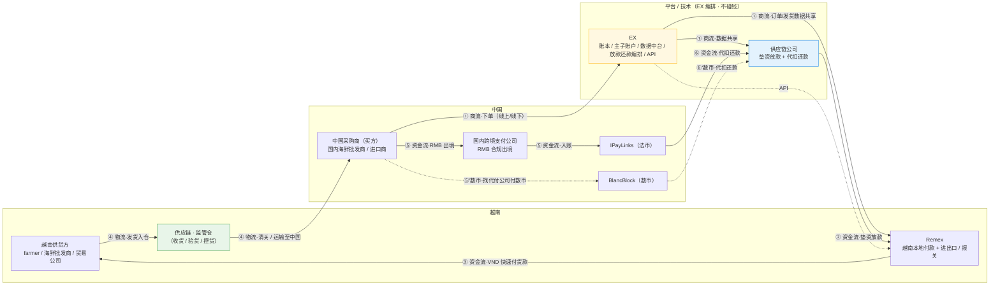
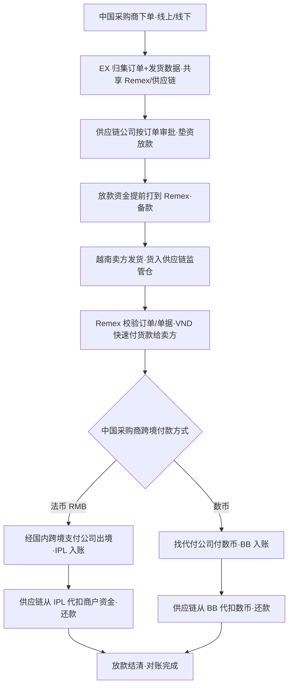
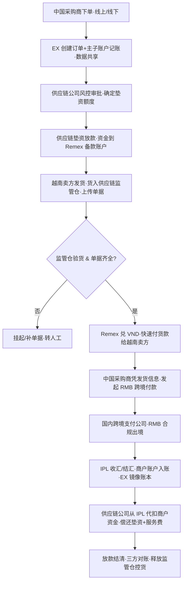
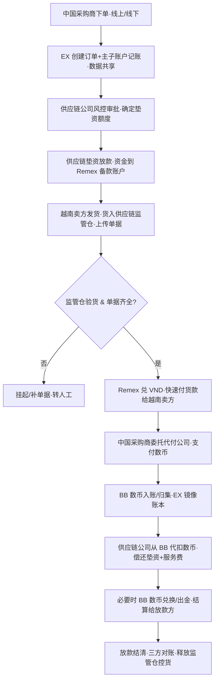
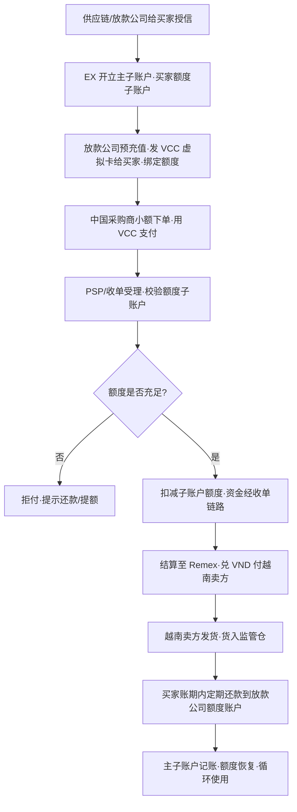

# Remex × EX 中越生鲜（榴莲 / 海鲜）进口供应链支付与垫资方案

> 日期：2026-06-24 ｜ 文档类型：方案 / 三流图 + 流程图
> 关联：`ex-settlement-sp-solution.md`、`ex-three-layer-solution.md`
> 定位：面向越南支付机构 **Remex**，描述「**中国进口越南榴莲 / 海鲜**」场景下，由 **供应链公司垫资放款** 替代「中国买家提前备款」，并由 **EX 提供整套技术服务 + API** 串联各参与方的支付、垫资、还款方案。提供**三流图（商流 / 物流 / 资金流）**、**法币流程图**、**数币流程图**，并覆盖**大额（账户）**与**小额（VCC 卡）**两种模式。

---

## 一、背景与痛点

- 场景：**中国采购商进口越南榴莲 / 海鲜**。下单可能来自网站，也可能**线下**成交（电话 / 微信 / 市场现场）。
- 痛点：越南供货方多为 **farmer / 海鲜批发商**，**要求极快拿到货款（VND）**；而跨境资金（RMB 出境 → 越南付款）有时滞。
- 旧模式（参考截图）：需要**中国侧提前「备款」**到越南，占用中国买家自有资金、效率低、规模受限。
- 新模式（本方案）：**引入供应链公司做「垫资放款」**，先垫资让越南侧快速付款，中国买家后续以**人民币（法币）**或**数币**完成跨境支付，供应链公司再**代扣还款**。

---

## 二、参与方与角色

| # | 参与方                                       | 角色 / 职责                                                                                                                  |
| - | -------------------------------------------- | ---------------------------------------------------------------------------------------------------------------------------- |
| 1 | **越南供货方（卖方）**                 | 越南 farmer / 海鲜批发商 / 贸易公司；发货并收取**VND** 货款                                                            |
| 2 | **Remex**                              | 越南本地支付机构；负责**越南本地付款（付 VND 给卖方）**与**当地进出口流程 / 报关**                               |
| 3 | **中国采购商（买方）**                 | 即国内海鲜批发商 / 进口商；下单，最终以**RMB（法币）或数币** 付款                                                      |
| 4 | **IPayLinks（IPL）/ BlancBlock（BB）** | **IPL = 法币**收 / 结 / 付汇持牌方；**BB = 数币**资金中心                                                        |
| 5 | **国内跨境支付公司**                   | Eurewax 的中国合作伙伴；负责**人民币合规出境**（境内收单 / 付汇）                                                      |
| 6 | **供应链公司**                         | Eurewax 的合作伙伴；提供**垫资放款 + 监管仓**，并向中国买家**代扣还款**                                          |
| 7 | **EX**                                 | 提供**整套技术服务**：账本 / 主子账户 / 订单与发货数据中台 / 放款还款编排 / 代扣 / 对账，并**给 Remex 提供 API** |

> 资金角色约定：**EX 不碰钱**，资金始终落在持牌 / 资金方（IPL 法币、BB 数币、Remex 越南本地、供应链公司放款）。

---

## 三、整体架构 / 三流图（商流 · 物流 · 资金流）

> 三流：**商流（订单 / 数据）**、**物流（货物 + 监管仓）**、**资金流（垫资 → 付款 → 跨境 → 还款）**。

**三流拆解**

- **商流**：中国采购商下单（线上 / 线下）→ EX 归集订单与发货数据 → 共享给 Remex / 供应链公司。
- **物流**：越南供货方发货 → **货入供应链监管仓（控货）** → 清关 / 运输至中国。
- **资金流**：供应链**垫资** → Remex **VND 快速付款给卖方** → 中国采购商**RMB 出境（或数币代付）** → 供应链**代扣还款**。

---

## 四、核心业务流程（总览）

> 关键点：**越南侧付款（步骤 6）由垫资资金驱动，不依赖中国买家先备款**；中国买家的跨境付款（步骤 7）发生在发货之后，用于**给供应链公司还款**。

---

## 五、法币流程图（大额 · 账户模式）

> 适用：**大额**交易，走**账户 + 跨境付汇**，人民币经国内跨境支付公司出境到 IPL。

**要点**

- **备款由供应链垫资**，中国买家无需自有资金提前出境。
- IPL 作为**法币持牌方**完成收汇 / 结汇 / 入账；EX 仅镜像账本。
- 还款采用**代扣协议**：IPL 商户资金到位即由供应链公司代扣。
- **单据合规**：需交易 / 买卖双方证明（呼应截图 `Supporting document required`）。

---

## 六、数币流程图（大额 · 账户模式）

> 适用：**大额**且采用**数币**回款；中国采购商可**找其他公司代付数币**到 BlancBlock（BB）。

**要点**

- 数币回款由 **BB 作为数币资金中心**归集；EX 不碰钱。
- 中国买家不便直接持 / 付数币时，可由**代付公司代付数币**。
- 还款同样走**代扣**：BB 数币到账后由供应链公司代扣（可按需兑换出金）。

---

## 七、小额流程图（VCC 卡模式 · 主子账户）

> 适用：**小额、高频**交易。本质是**放款 / 供应链公司提前充值、发卡给买家**，给买家开立**带额度的（子）账户**，买家用卡支付，**定期还款**到放款公司的额度账户（循环额度）。**依赖 EX 主子账户体系**。

**要点**

- **主子账户体系**：放款公司额度账户为「主」，每个买家一个「子」额度账户；发卡即绑定子账户额度。
- **循环额度**：买家用卡消费扣减额度，**定期还款后额度恢复**。
- 适合替代大额垫资中的繁重审批，适用于**小额、复购**的海鲜 / 榴莲批发买家。

---

## 八、还款、控货与风控

- **控货**：货物统一入**供应链监管仓**，未还款 / 未结清前由供应链控货，作为风险缓释。
- **代扣还款**：与中国采购商签**代扣协议**；IPL（法币）/ BB（数币）资金到位即代扣偿还垫资本金 + 服务费 / 利息。
- **单据合规**：每笔需**交易 / 买卖双方证明**等支撑材料（与截图 `Supporting document` 一致），用于结汇 / 付汇合规。
- **额度风控**：VCC 模式按买家授信设额度；逾期冻结子账户、暂停发卡。
- **对账**：EX 提供订单、放款、付款、还款全链路对账与状态可视。

---

## 九、EX 能力与对 Remex 的 API

- **账本 / 主子账户**：支撑垫资、额度、VCC 子账户、循环额度记账。
- **订单与发货数据中台**：线上 / 线下订单统一归集，向 Remex / 供应链共享。
- **放款 / 还款编排**：垫资放款、代扣还款、监管仓状态联动。
- **多资金通道**：法币（IPL）+ 数币（BB）双通道，按交易选择。
- **API 给 Remex**：下单 / 订单查询、放款通知、付款指令、单据上传、还款 / 代扣回执、对账文件。

## 十、待办 / 开放问题

- [ ] **角色与持牌边界**：IPL 结 / 付汇、Remex 本地付款、供应链放款的资金与合规责任划分。
- [ ] **垫资风控模型**：授信额度、利率 / 服务费、逾期处置、监管仓控货规则。
- [ ] **数币代付合规**：代付公司资质、数币 → 法币兑换 / 出金路径与合规。
- [ ] **VCC 发卡方**：卡组织 / 发卡机构选型、主子账户与卡 BIN、跨境受理范围。
- [ ] **单据标准**：交易 / 买卖双方证明的最小集合与电子化采集（线下订单尤为关键）。
