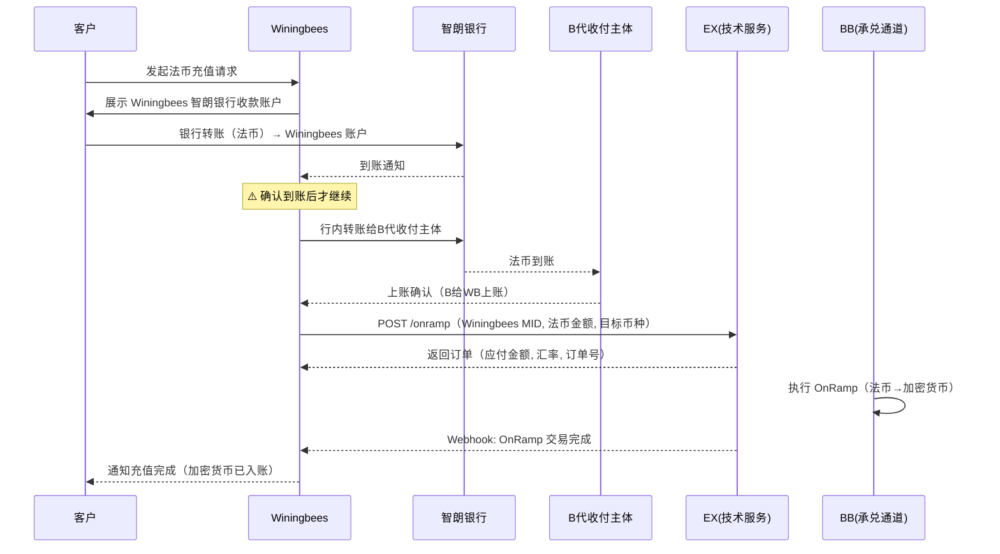
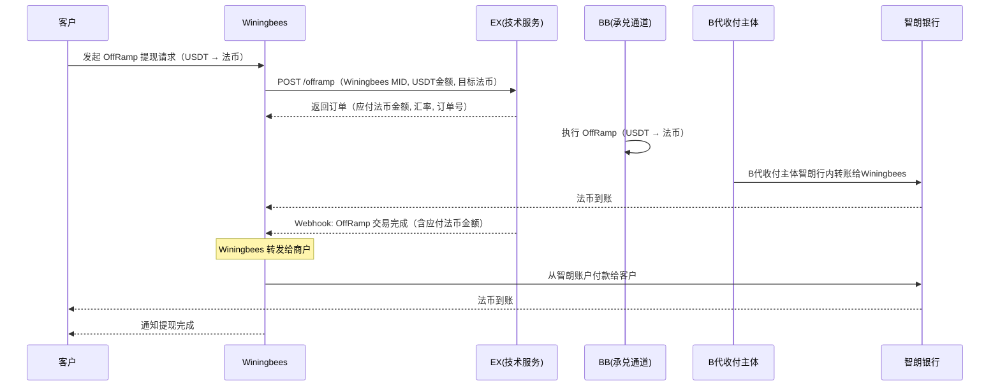
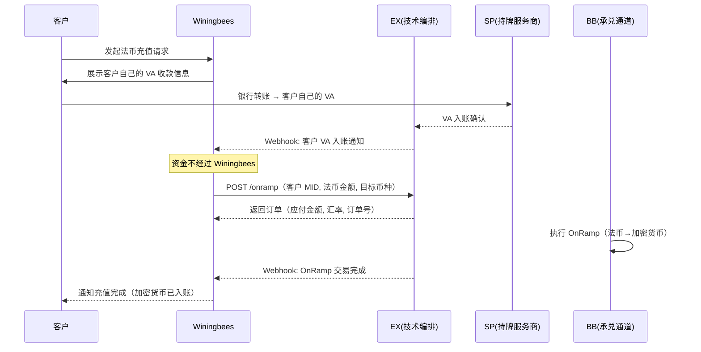
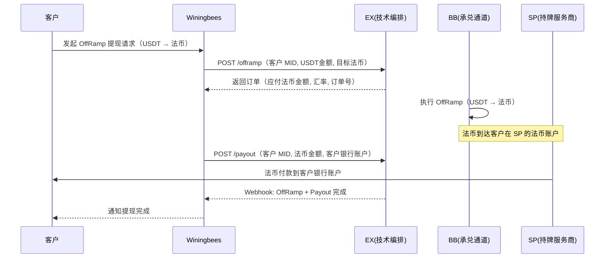

# Winingbees OnRamp / OffRamp — 解决方案

> **文档类型**: Winingbees 承兑业务解决方案
> **版本**: v2.0
> **最后更新**: 2026-05-06
> **适用对象**: Winingbees 平台

---

## 一、方案总览

本文提供两种接入方案，Winingbees 可根据业务阶段和合规要求选择：

| 维度                    | 方案一：大账户方案（智朗银行）                                     | 方案二：VA 方案                                        |
| ----------------------- | ------------------------------------------------------------------ | ------------------------------------------------------ |
| **核心思路**      | Winingbees 归集客户资金到自己的智朗银行账户，作为直客入网 BB，自己发起承兑交易 | Winingbees 将客户信息推送到 SP，客户在 SP 各自拥有独立 VA |
| **资金归集**      | ✅ Winingbees 归集客户资金                                            | ❌ Winingbees 不归集客户资金                              |
| **Winingbees 开 VA** | ❌ Winingbees 不开 VA（用自有智朗账户）                               | ❌ Winingbees 不能开 VA                                   |
| **客户 VA**       | ❌ 客户无独立 VA                                                   | ✅ 客户在 SP 拥有独立 VA                               |
| **交易发起方**    | Winingbees（以自身 MID 发起）                                         | 客户（以客户自身 MID 发起）                            |
| **客户入网**      | 不需要（Winingbees 以自身身份操作，客户不入网 BB）                    | Winingbees 推送客户信息到 SP，SP 审核并开立 VA            |
| **适用场景**      | Winingbees 自主管理客户资金，对接简单                                 | 合规要求客户资金隔离，不允许归集                       |

### 各方角色（两方案通用）

| 角色              | 说明                                                        |
| ----------------- | ----------------------------------------------------------- |
| **Winingbees** | 面向终端客户的平台。在 EX 系统上是租户（TP），管理其下客户  |
| **BB**      | 持牌合规通道，承兑执行方（OnRamp/OffRamp）                  |
| **EX**      | 技术服务商，纯 API 编排层，不碰钱                           |
| **客户**    | Winingbees 的终端用户，在 Winingbees 平台完成法币 ↔ 加密货币兑换 |

---

# 方案一：大账户方案（智朗银行）

## 二、方案一概述

### 2.1 核心思路

Winingbees 在智朗银行拥有自己的法币账户，**直接归集客户资金**。Winingbees 作为直客入网 BB，以自身身份（MID）发起 OnRamp / OffRamp 承兑交易。客户不需要在 BB 入网，所有操作均由 Winingbees 以自身商户号完成。

### 2.2 架构关系

```
                                                        ┌──────────┐
┌──────────┐                ┌──────────┐   API 对接     │  EX      │
│  客户     │  入网/交易     │ Winingbees  │ ──────────→   │(技术服务) │
│(终端用户) │ ──────────→   │ (平台)   │                └────┬─────┘
└──────────┘                └──────────┘                     │
                                 │                           │ 系统支撑
                                 │ 银行转账                   ▼
                                 ▼                      ┌──────────┐
                            ┌──────────┐                │   BB     │
                            │ B代收付主体  │                │(持牌通道) │
                            │(BB代收付主体) │                └──────────┘
                            │ 智朗银行  │
                            └──────────┘
```

**系统上的身份关系：**

- **Winingbees** = BB 的直客商户（通过 EX 入网），拥有自己的 MID
- **B代收付主体** = BB 的代收付主体，拥有智朗银行账户，用于法币收付
- Winingbees 通过智朗银行与B代收付主体进行行内转账

**资金通道：**

- BB 本身没有智朗银行账户，法币收付通过B代收付主体（代收付主体）的智朗银行账户完成
- Winingbees 有自己的智朗银行账户
- Winingbees ↔ B代收付主体之间通过智朗银行转账（行内转账）

### 2.3 核心原则

| 原则                       | 说明                                                                     |
| -------------------------- | ------------------------------------------------------------------------ |
| **OnRamp 先收后做**  | Winingbees 必须先收到客户法币，转账给B代收付主体并确认到账后，才发起 OnRamp。绝不垫资 |
| **OffRamp 头寸自管** | Winingbees 自行管理法币头寸，可选择先垫付客户再等结算，但风险自担           |
| **双方不互垫头寸**   | BB/B代收付主体不为 Winingbees 垫资，Winingbees 不为 BB 垫资。各自管理各自的资金池 |

### 2.4 资金流向总览

```
OnRamp（法币 → 加密货币）:
  客户法币 → Winingbees 智朗账户 → Winingbees 转账给B代收付主体智朗账户
  → Winingbees 发起 OnRamp → BB 执行承兑 → 加密货币入客户账户

OffRamp（加密货币 → 法币）:
  Winingbees 发起 OffRamp → BB 执行承兑
  → B代收付主体智朗行内转账给 Winingbees
  → Winingbees 转发给商户
```

---

## 三、方案一前置流程

### 3.1 Winingbees 自身准备

```
├── 1. Winingbees 在智朗银行开设法币账户
│     └── 用于接收客户法币（OnRamp）和向客户付款（OffRamp）
│
├── 2. Winingbees 与 EX 签约
│     └── 作为租户入网 EX 平台
│     └── 开通 OnRamp / OffRamp 产品
│
├── 3. Winingbees 作为直客入网 BB（如果已经入网，我们协助迁移）
│     └── Winingbees 通过 EX 注册为 BB 的直客商户，完成 KYC/KYB
│     └── 用于以 Winingbees 自身商户号发起 OnRamp / OffRamp 承兑交易
│     └── 客户不需要在 BB 入网，所有操作均以 Winingbees MID 进行
│
└── 4. 技术对接
      └── 获取 Sandbox 环境 → 配置 APP ID / 公钥 / AES Key / Webhook
      └── 完成签名验签 + AES 加解密联调
```

### 3.2 B代收付主体准备（BB 侧）

```
├── 1. B代收付主体已在智朗银行开设法币账户
│     └── 作为 BB 的代收付主体，接收 Winingbees 转入的法币（OnRamp）
│
└── 2. BB 侧配置
      └── B代收付主体由 BB 控制，作为法币收付通道
```

### 3.3 Winingbees 配置收款账户（OffRamp 用）

```
├── 1. Winingbees 在 EX 添加自己的智朗银行账户作为收款人（beneficiary）
│     └── 收款账户 = Winingbees 的智朗银行账号
│     └── OffRamp 完成后，法币直接到达 Winingbees 智朗银行账户
│
└── 2. 客户提现账户由 Winingbees 自行管理
      └── 客户在 Winingbees 前端添加提现银行账户
      └── Winingbees 负责维护客户收款信息，不经过 EX
```

---

## 四、方案一 OnRamp 流程（法币 → 加密货币）

**核心原则：Winingbees 必须先收到客户法币，转给B代收付主体确认到账后，才发起 OnRamp。**

### 步骤详解

```
├── 1. 客户发起法币充值
│     └── 客户在 Winingbees 前端发起法币充值请求
│     └── Winingbees 向客户展示 Winingbees 智朗银行收款账户信息
│
├── 2. 客户打款
│     └── 客户通过银行转账将法币打入 Winingbees 的智朗银行账户
│
├── 3. Winingbees 确认到账
│     └── 在智朗银行确认收到客户法币（⚠️ 必须确认到账）
│
├── 4. Winingbees 银行转账给B代收付主体
│     └── Winingbees 从智朗银行账户转账至B代收付主体智朗银行账户（行内转账）
│
├── 5. Winingbees 发起 OnRamp
│     └── 调用 EX API，以 Winingbees MID 发起 OnRamp 请求
│     └── EX 返回：OnRamp 订单信息（含应付法币金额、汇率、订单号）
│
├── 6. BB 执行 OnRamp
│     └── BB 执行承兑（法币 → 加密货币）
│     └── 加密货币入账到 Winingbees 的加密货币账户
│
└── 7. 交易完成
      └── Webhook: OnRamp 交易结果通知
      └── Winingbees 通知客户充值完成
```

### OnRamp 时序图



---

## 五、方案一 OffRamp 流程（加密货币 → 法币）

### 步骤详解

```
├── 1. 客户发起提现
│     └── 客户在 Winingbees 前端发起加密货币提现（如 USDT → 法币）
│
├── 2. Winingbees 以自身商户号发起 OffRamp
│     └── 调用 EX API，以 Winingbees MID 发起 OffRamp
│     └── 收款人 = Winingbees 智朗银行账户（前置已配置）
│     └── EX 返回：OffRamp 订单信息（含应付法币金额、汇率、订单号）
│
├── 3. BB 执行 OffRamp
│     └── BB 执行承兑（USDT → 法币）
│     └── B代收付主体通过智朗银行行内转账给 Winingbees
│
├── 4. Winingbees 转发给商户
│     └── Winingbees 根据客户提现信息，从智朗银行账户付款给客户
│     └── 客户提现账户由 Winingbees 自行管理，不经过 EX/BB
│
└── 5. 交易完成
      └── Webhook: OffRamp 交易结果通知
      └── Winingbees 通知客户提现完成
```

### OffRamp 时序图



---

## 六、方案一补充说明

### 6.1 B代收付主体的角色

```
┌───────────────────────────────────────────────────────────────┐
│                    B代收付主体 = BB 的代收付主体                      │
│                                                                │
│  BB 本身没有智朗银行账户，法币收付通过B代收付主体完成。              │
│  B代收付主体由 BB 控制，拥有智朗银行账户。                           │
│                                                                │
│  OnRamp：Winingbees 银行转账给B代收付主体 → BB 收到法币 → 执行承兑     │
│  OffRamp：BB 执行承兑 → B代收付主体智朗行内转账给 Winingbees        │
│          → Winingbees 收到后转发给商户                              │
└───────────────────────────────────────────────────────────────┘
```

| 场景    | 资金流向                                      | 说明                               |
| ------- | --------------------------------------------- | ---------------------------------- |
| OnRamp  | Winingbees 智朗 → B代收付主体智朗（行内转账）       | Winingbees 先转法币，BB 收到后执行承兑 |
| OffRamp | BB 承兑后 → B代收付主体智朗行内转账给 Winingbees | Winingbees 收到后转发给商户 |

### 6.2 头寸管理

```
┌───────────────────────────────────────────────────────────────┐
│                       资金管理原则                               │
│                                                                │
│  1. OnRamp：先收后做                                            │
│     └── Winingbees 必须先收到客户法币                              │
│     └── 转给B代收付主体确认到账后才能发起 OnRamp                    │
│     └── 不允许未收款就发起交易                                  │
│                                                                │
│  2. OffRamp：头寸自管                                           │
│     └── Winingbees 自行管理智朗银行法币头寸                          │
│     └── OffRamp 后B代收付主体智朗行内转账给 Winingbees，再转发给客户 │
│     └── 可先垫付客户，再等 OffRamp 到账（风险自担）              │
│                                                                │
│  3. 双方不互垫头寸                                              │
│     └── BB 不为 Winingbees 垫资                                    │
│     └── Winingbees 不为 BB 垫资                                    │
│     └── 各管各的资金池                                           │
└───────────────────────────────────────────────────────────────┘
```

### 6.3 OffRamp 头寸策略

| 策略                       | 做法                                                                   | 风险                   | 客户体验           |
| -------------------------- | ---------------------------------------------------------------------- | ---------------------- | ------------------ |
| **保守策略（推荐）** | 等 OffRamp 法币到 Winingbees 智朗后再付款给客户                           | 零风险                 | 客户等待时间较长   |
| **激进策略**         | Winingbees 预先在智朗银行备足法币头寸，先垫付客户，再等 OffRamp 法币到账  | 汇率波动风险、资金占用 | 客户体验好，到账快 |

> **建议**：初期采用保守策略，业务稳定后根据资金情况考虑激进策略。

---

---

# 方案二：VA 方案

## 七、方案二概述

### 7.1 核心思路

Winingbees 将客户信息推送到 SP，SP 为每个客户独立开立 VA。客户资金直接进入客户自己的 VA，**Winingbees 不归集客户资金，Winingbees 自身也不能开 VA**。

### 7.2 架构关系

```
┌──────────┐                ┌──────────┐   API 对接     ┌──────────┐
│  客户     │  注册/交易     │ Winingbees  │ ──────────→   │  EX      │
│(终端用户) │ ──────────→   │ (平台)   │                │(技术编排) │
└──────────┘                └──────────┘                └────┬─────┘
      │                                                      │
      │ 法币直接入客户 VA                                      │ 编排
      ▼                                                      ▼
┌──────────────────────────────────────────────────────────────┐
│                     SP（持牌服务商）                           │
│                                                              │
│  ┌──────────┐  ┌──────────┐  ┌──────────┐                  │
│  │ 客户A VA  │  │ 客户B VA  │  │ 客户N VA  │                  │
│  │ (独立账户) │  │ (独立账户) │  │ (独立账户) │                  │
│  └──────────┘  └──────────┘  └──────────┘                  │
│                                                              │
│  BB（承兑通道）── 执行 OnRamp / OffRamp                       │
└──────────────────────────────────────────────────────────────┘
```

### 7.3 与方案一的关键区别

| 维度                   | 方案一（大账户）                 | 方案二（VA）                            |
| ---------------------- | -------------------------------- | --------------------------------------- |
| **客户资金流**   | 客户 → Winingbees 智朗账户（归集） | 客户 → 客户自己的 VA（不归集）         |
| **交易主体**     | Winingbees 以自身 MID 发起交易      | 以客户 MID 发起交易                     |
| **Winingbees 角色** | 资金归集方 + 交易发起方          | 纯平台方，推送客户信息、编排交易        |
| **合规主体**     | Winingbees 对客户资金负责           | SP 对客户资金负责（资金在 SP 的 VA 内） |
| **B代收付主体**     | 需要（作为 BB 的代收付主体）     | 不需要                                  |
| **OffRamp 收款** | Winingbees 智朗银行账户（直接到账） | 客户 SP 法币账户                         |

### 7.4 核心原则

| 原则                       | 说明                                                  |
| -------------------------- | ----------------------------------------------------- |
| **Winingbees 不碰钱**   | 客户资金直接进入 SP 开立的 VA，Winingbees 不归集、不中转 |
| **Winingbees 不开 VA**  | Winingbees 自身不在 SP 开立 VA，只推送客户信息           |
| **客户独立账户**     | 每个客户在 SP 拥有独立 VA，资金隔离                   |
| **Winingbees 编排交易** | Winingbees 通过 EX API 代客户发起 OnRamp/OffRamp 交易    |

---

## 八、方案二前置流程

### 8.1 Winingbees 准备

```
├── 1. Winingbees 与 EX 签约
│     └── 作为租户入网 EX 平台
│     └── 开通 OnRamp / OffRamp 产品
│
└── 2. 技术对接
      └── 获取 Sandbox 环境 → 配置 APP ID / 公钥 / AES Key / Webhook
      └── 完成签名验签 + AES 加解密联调
```

> **注意**：方案二中 Winingbees 不需要在智朗银行开户，也不需要B代收付主体。

### 8.2 客户入网 + VA 开立

```
├── 1. Winingbees 推送客户信息到 SP
│     └── Winingbees 通过 EX API 推送客户 KYC/KYB 信息
│     └── EX 转发给 SP 审核
│
├── 2. SP 审核客户
│     └── SP 执行 KYC/KYB 审核
│     └── Webhook: 审核结果通知（APPROVED / REJECTED / RFI）
│
├── 3. 审核通过 → SP 为客户开立独立 VA
│     └── 每个客户拥有独立的 VA 账户
│     └── VA 账户信息通过 EX 返回给 Winingbees
│
└── 4. 客户获得 VA
      └── Winingbees 将 VA 信息展示给客户
      └── 客户可直接向自己的 VA 打款
```

---

## 九、方案二 OnRamp 流程（法币 → 加密货币）

```
├── 1. 客户发起法币充值
│     └── 客户在 Winingbees 前端发起充值请求
│     └── Winingbees 展示客户自己的 VA 收款信息
│
├── 2. 客户打款到自己的 VA
│     └── 客户通过银行转账将法币直接打入自己在 SP 的 VA
│     └── ⚠️ 资金不经过 Winingbees
│
├── 3. VA 入账确认
│     └── SP 确认 VA 收到法币
│     └── Webhook: 入账通知
│
├── 4. Winingbees 代客户发起 OnRamp
│     └── Winingbees 调用 EX API，以客户 MID 发起 OnRamp
│     └── EX 返回：OnRamp 订单信息（含应付法币金额、汇率、订单号）
│
├── 5. BB 执行 OnRamp
│     └── BB 执行承兑（法币 → 加密货币）
│     └── 加密货币入账到客户账户
│
└── 6. 交易完成
      └── Webhook: OnRamp 交易结果通知
      └── Winingbees 通知客户充值完成
```

### OnRamp 时序图



---

## 十、方案二 OffRamp 流程（加密货币 → 法币）

```
├── 1. 客户发起提现
│     └── 客户在 Winingbees 前端发起加密货币提现（如 USDT → 法币）
│
├── 2. Winingbees 代客户发起 OffRamp
│     └── Winingbees 调用 EX API，以客户 MID 发起 OffRamp
│     └── EX 返回：OffRamp 订单信息（含应付法币金额、汇率、订单号）
│
├── 3. BB 执行 OffRamp
│     └── BB 执行承兑（USDT → 法币）
│     └── 法币到达客户在 SP 的法币账户
│
├── 4. 客户提现
│     └── 客户从 SP 法币账户提现到自己的银行账户
│     └── 或 Winingbees 代客户发起提现（Payout）
│
└── 5. 交易完成
      └── Webhook: OffRamp 交易结果通知
      └── Winingbees 通知客户提现完成
```

### OffRamp 时序图



---

---

# 通用说明

## 十一、两方案对比总结

```
┌──────────────────────────────────────────────────────────────────────┐
│                         方案选型指引                                  │
│                                                                      │
│  方案一（大账户）                    方案二（VA）                      │
│  ┌────────────────────┐            ┌────────────────────┐            │
│  │ Winingbees 归集客户资金 │            │ 客户资金直接入 VA    │            │
│  │ Winingbees 发起交易    │            │ Winingbees 代客发起交易│            │
│  │ 需要B代收付主体        │            │ 不需要B代收付主体      │            │
│  │ 需要智朗银行账户    │            │ 不需要智朗银行账户  │            │
│  │ OffRamp直达智朗账户 │            │ 客户资金隔离        │            │
│  │ 对接简单            │            │ 合规要求高          │            │
│  └────────────────────┘            └────────────────────┘            │
│                                                                      │
│  适合：快速上线、Winingbees              适合：合规要求高、客户           │
│        自主管理客户资金                      资金不允许归集            │
└──────────────────────────────────────────────────────────────────────┘
```

## 十二、Webhook 事件（两方案通用）

| 事件             | 触发时机                   | 说明                      |
| ---------------- | -------------------------- | ------------------------- |
| KYC/KYB 审核结果 | 客户审核完成               | APPROVED / REJECTED / RFI |
| 产品审核结果     | 产品申请审核完成           | approved / rejected       |
| VA 入账通知      | 客户 VA 收到法币（方案二） | 含入账金额、币种          |
| 收款人审核结果   | 收款账户审核完成（方案一） | APPROVED / REJECTED / RFI |
| OnRamp 交易结果  | OnRamp 处理完成            | 含最终汇率、加密货币金额  |
| OffRamp 交易结果 | OffRamp 处理完成           | 含最终汇率、应付法币金额  |

## 十三、注意事项

**方案一专属：**

1. **OnRamp 必须先收后做** — Winingbees 必须先收到客户法币，银行转账给B代收付主体确认到账后，才能发起 OnRamp
2. **OffRamp 收款账户** — Winingbees 必须在 EX 配置自己的智朗银行账户作为 OffRamp 收款人（beneficiary），B代收付主体智朗行内转账给 Winingbees
3. **头寸监控** — 采用激进策略时需实时监控智朗账户余额，避免付款失败
4. **对账** — Winingbees 应定期核对：智朗银行流水 ↔ EX 系统交易记录

**方案二专属：**

1. **Winingbees 不能开 VA** — Winingbees 自身不能在 SP 开立 VA，只能为客户开立
2. **Winingbees 不能归集客户资金** — 客户资金直接进入客户自己的 VA，不经过 Winingbees
3. **客户信息必须推送到 SP** — 客户 KYC/KYB 由 SP 审核，审核通过才能开 VA

**两方案通用：**

1. **汇率有时效性** — OnRamp/OffRamp 的报价有过期时间，过期需重新获取
2. **RFI 及时响应** — 审核过程中可能要求补充材料，超时可能导致审核失败
