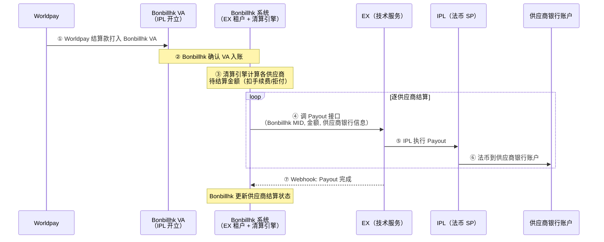
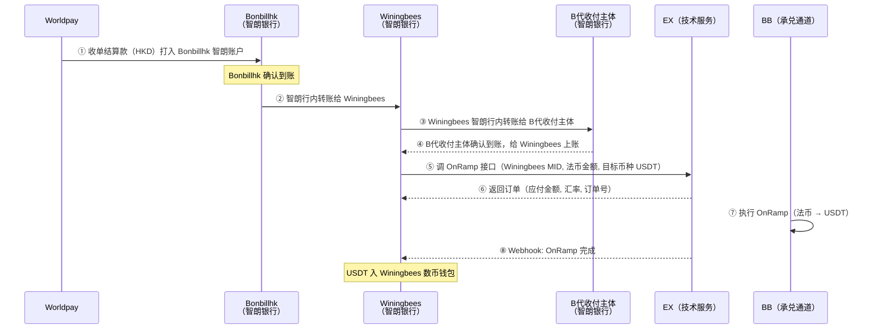
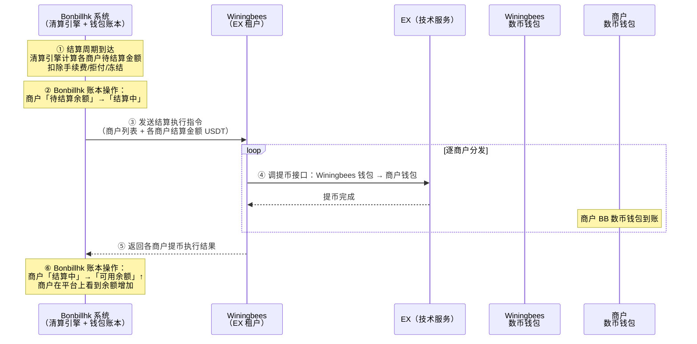
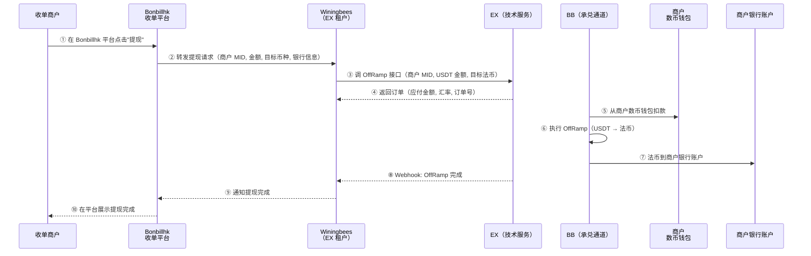

# Bonbillhk 收单结算解决方案

> **文档类型**：客户解决方案（面向 Bonbillhk）
> **版本**：v2.0
> **最后更新**：2026-05-10
> **状态**：方案设计

---

## 一、背景与目标

### 1.1 当前业务现状

Bonbillhk 通过 Worldpay 进行收单业务。Worldpay 定期将收单结算款打给 Bonbillhk，Bonbillhk 需要与各供应商进行结算。

**当前面临的核心问题**：

| 问题               | 具体情况                                                      |
| ------------------ | ------------------------------------------------------------- |
| **结算收款** | Worldpay 结算款需打入银行账户，Bonbillhk 已在智朗银行成功开户 |
| **供应商结算** | 供应商分布在不同地区，传统 SWIFT 逐笔结算成本高、到账慢       |
| **账户体系** | 缺乏统一的账户体系来管理商户资金、结算、提现全流程            |

### 1.2 方案总览

本文提供两种结算方案，Bonbillhk 可根据业务阶段和合规要求选择：

| 维度               | 方案一：VA 法币收付方案                                                      | 方案二：通过同数币方案结算法币                                           |
| ------------------ | ---------------------------------------------------------------------------- | ------------------------------------------------------------------------ |
| **核心思路** | Bonbillhk 在 IPL 开 VA 接收 Worldpay 结算款，法币 Payout 给供应商结算 | 结算款 → Winingbees 智朗 → OnRamp → Winingbees 钱包直接提币到商户钱包 |
| **结算收款** | VA 账户直接接收 Worldpay 结算款                                              | 智朗银行账户接收 → 行内转账 → OnRamp 数币化                            |
| **供应商结算** | 法币 Payout（银行转账）给供应商                                              | Winingbees 数币钱包直接提币到商户钱包                                    |
| **商户提现** | 不涉及（直接法币到账）                                                       | 商户发起 OffRamp（USDT → 法币）                                         |
| **承兑环节** | 无                                                                           | 两次（OnRamp + OffRamp）                                                 |
| **商户入网** | 不需要（Bonbillhk 以自身 MID 操作 Payout）                                   | 需要（商户在 BB 开立独立 MID + 数币钱包）                                 |
| **适用场景** | 供应商数量少、单笔金额大、法币结算即可满足                                   | 商户分布多地区、需要账户体系、追求到账时效                               |

---

# 方案一：VA 法币收付方案

## 二、方案一概述

### 2.1 核心思路

Bonbillhk 入网 EX 平台，以 Bonbillhk 名义在 IPL（法币 SP）开立 VA（Virtual Account）。该 VA 作为 Worldpay 的结算收款账户，Worldpay 结算款直接打入 Bonbillhk 的 VA。Bonbillhk 收到结算款后，根据清算结果通过法币 Payout 向各供应商进行结算。

### 2.2 各方角色

| 实体                | 角色               | 说明                                                                       |
| ------------------- | ------------------ | -------------------------------------------------------------------------- |
| **Bonbillhk** | EX 租户 | 自身为 EX 租户，在 IPL 开立 VA，接收 Worldpay 结算款，发起 Payout 给供应商 |
| **IPL**       | 法币 SP            | 为 Bonbillhk 开立 VA，执行 Payout                                          |
| **EX**        | 技术服务平台       | API 编排层，不碰钱                                                         |
| **供应商**    | Bonbillhk 的供应商 | 提供银行账户信息，接收 Bonbillhk 的法币结算款                              |

### 2.3 账户结构

```
IPL 侧（法币 SP）：
│
└── Bonbillhk（MID-B）
    └── VA 账户（HKD / USD 等）—— 接收 Worldpay 结算款 + Payout 给供应商
```

```
供应商侧：
│
├── 供应商 A —— 银行账户（接收 Payout）
├── 供应商 B —— 银行账户（接收 Payout）
└── 供应商 N ...
```

> **关键**：方案一中供应商不需要在 IPL 或 BB 入网，不需要开立 MID 或钱包。供应商只需提供银行账户信息给 Bonbillhk。Bonbillhk 自己作为 EX 租户直接调用 API，无需经过 Winingbees。

### 2.4 端到端资金流程



**步骤说明**：

| 步骤   | 操作方        | 动作        | 说明                                                    |
| ------ | ------------- | ----------- | ------------------------------------------------------- |
| ①     | Worldpay      | 结算打款    | 按结算周期将结算款直接打入 Bonbillhk 的 VA（IPL 开立）    |
| ②     | Bonbillhk     | 确认入账    | 通过 Webhook 或查询确认 VA 到账                           |
| ③     | Bonbillhk     | 清算计算    | 计算各供应商净结算金额（扣手续费、拒付、冻结等）          |
| ④⑤⑥ | Bonbillhk/IPL | 执行 Payout | Bonbillhk 直接调 EX API，IPL 执行法币付款到供应商银行账户 |
| ⑦     | EX            | 结果回调    | Payout 完成后 Webhook 通知 Bonbillhk                      |

### 2.5 合规要点

| 要点                    | 说明                                                                                |
| ----------------------- | ----------------------------------------------------------------------------------- |
| **VA 开户审核**   | Bonbillhk 入网 EX，通过 KYB 审核后在 IPL 开立 VA                      |
| **Worldpay 验证** | Worldpay 需验证 VA 账户的合规性（账户持有人需与收单商户主体一致）                   |
| **FRI 贸易背景**  | Payout 时需提供贸易背景材料（Further Remittance Information），如结算单、交易明细等 |
| **AML/KYC**       | IPL 作为法币 SP 执行 AML 监控；Bonbillhk 需确保商户信息合规                         |

### 2.6 方案一优劣势

| 维度                      | 说明                                                     |
| ------------------------- | -------------------------------------------------------- |
| ✅**简单直接**      | 纯法币链路，无需数币转换，逻辑清晰                       |
| ✅**无承兑成本**    | 不涉及 OnRamp/OffRamp，无承兑费率和汇率价差              |
| ✅**供应商无感**    | 供应商不需要入网任何平台，不需要管理数币钱包，直接收法币 |
| ⚠️**Payout 成本** | 每笔 Payout 有银行转账费用（跨境更贵）                   |
| ⚠️**到账时效**    | Payout 到账取决于银行通道（境内 T+0~1，跨境 T+1~3）     |
| ⚠️**无账户体系**  | 商户没有独立钱包，无法实现余额管理、冻结、自主提现等能力 |
| ⚠️**FRI 合规**    | 每笔 Payout 需提供贸易背景材料，运营成本随供应商数量增长 |

---

# 方案二：数币结算方案

## 三、方案二概述

### 3.1 核心思路

通过 Winingbees 渠道接入数字资产承兑能力，实现：

1. **Worldpay 结算款数币化** — 收到法币结算款后，通过 OnRamp 转换为 USDT
2. **数币链路结算给商户** — 通过链上/内部转账将 USDT 分发到各商户钱包
3. **商户自主提现** — 商户可随时将 USDT 通过 OffRamp 兑换为法币，提现到银行账户

## 四、各方角色与身份

### 4.1 角色关系总览

```
┌─────────────────────────────────────────────────────────────────┐
│                    商户视角（商户只看到这一层）                    │
│                                                                 │
│  收单商户 ←──→ Bonbillhk 收单平台                               │
│  （刷卡收款、查看结算、申请提现）                                 │
└─────────────────────────────────────────────────────────────────┘
                              │
                              │ Bonbillhk 通过 Winingbees 渠道执行
                              ▼
┌─────────────────────────────────────────────────────────────────┐
│                    渠道层（商户不可见）                           │
│                                                                 │
│  Winingbees ←── API ──→ EX 平台 ←──→ BB（持牌承兑通道）        │
└─────────────────────────────────────────────────────────────────┘
```

### 4.2 各方身份定义

| 实体                 | 现实角色             | 系统身份                    | 说明                                                                                      |
| -------------------- | -------------------- | --------------------------- | ----------------------------------------------------------------------------------------- |
| **收单商户**   | Bonbillhk 的签约商户 | Winingbees 下的商户（代开） | 在 BB 拥有独立 MID 和数币钱包。商户本身不感知 Winingbees/EX/BB 的存在                     |
| **Bonbillhk**  | Worldpay 收单方    | 不在 BB 入网                | 不拥有 MID 和数币钱包。Bonbillhk 负责清算逻辑、结算触发，与供应商结算                     |
| **Winingbees** | Bonbillhk 的下发渠道 | EX 租户 + 自己租户下的商户  | 双重身份：作为租户调用 EX API；作为商户拥有自己的 MID 和数币钱包。OnRamp 后直接提币给商户 |
| **BB**         | 持牌承兑通道         | 服务商（SP）                | 执行 OnRamp/OffRamp 承兑，管理数币钱包，合规审核                                          |
| **EX**         | 技术服务平台         | API 编排层                  | 不碰钱，提供统一 API 接口                                                                 |
| **智朗银行**   | 法币通道             | 银行                        | Bonbillhk 和 Winingbees 均在智朗开户，支持行内转账                                        |

### 4.3 账户结构

```
BB 侧（持牌服务商）：
│
├── Winingbees（MID-W）
│   ├── 数币钱包（USDT）—— OnRamp 入账 → 直接提币给各商户
│   └── 智朗银行账户 —— 法币收付
│
├── 商户 A（MID-A）
│   └── 数币钱包（USDT）—— 接收 Winingbees 提币 + OffRamp 提现
│
├── 商户 B（MID-B2）
│   └── 数币钱包（USDT）
│
└── 商户 N ...
```

> **注意**：方案二中 Bonbillhk 不在 BB 入网，没有 MID 和数币钱包。OnRamp 以 Winingbees MID 执行，数币直接从 Winingbees 钱包提币到各商户钱包。

### 4.4 Bonbillhk 商户钱包体系

Bonbillhk 作为收单平台，需要在自己的系统中为每个商户建立一套**钱包账本体系**，用于管理商户的资金状态。底层数币钱包由 BB 托管，但 Bonbillhk 需要在自己的平台上维护一层商户可见的钱包视图。

#### 钱包架构

```
Bonbillhk 平台（商户可见层）：
│
├── 商户 A
│   ├── 待结算余额（Pending）—— 已收单但未到结算周期的金额（法币计价）
│   ├── 可用余额（Available）—— 已结算到商户数币钱包的 USDT（数币计价）
│   ├── 冻结余额（Frozen）—— 因拒付/风控冻结的部分
│   └── 提现中（Withdrawing）—— 已发起 OffRamp 但未到账的金额
│
├── 商户 B
│   └── ...
│
└── Bonbillhk 自有账户
    ├── 待 OnRamp 余额 —— 已收到 Worldpay 结算但尚未 OnRamp 的法币
    └── 手续费收入 —— 从商户结算中扣除的手续费部分
```

```
BB 侧（底层托管层，商户不可见）：
│
├── Winingbees 数币钱包 —— OnRamp 入账，直接提币给商户
├── 商户 A 数币钱包 —— 实际持有 USDT
├── 商户 B 数币钱包 —— 实际持有 USDT
└── ...
```

#### 钱包状态流转

```
商户视角（在 Bonbillhk 平台上看到的）：

消费者刷卡 → 待结算余额 ↑（法币金额）
              │
              │ 到达结算周期
              ▼
          Bonbillhk 扣除手续费 → 结算
              │
              │ 数币到商户 BB 钱包
              ▼
          可用余额 ↑（USDT 金额）
              │
              ├──→ 商户发起提现 → 提现中 → OffRamp 完成 → 法币到银行
              └──→ 拒付/风控 → 冻结余额 ↑
```

#### 钱包体系设计要点

| 设计点                     | 说明                                                                                                                                   |
| -------------------------- | -------------------------------------------------------------------------------------------------------------------------------------- |
| **双层账本**         | Bonbillhk 维护商户可见的钱包账本（待结算/可用/冻结/提现中），底层 BB 钱包余额作为最终一致性校验                                        |
| **待结算 → 可用**   | 结算触发时，Bonbillhk 从「待结算余额」扣减 → 通过 Winingbees 从 Winingbees 钱包直接提币到商户 BB 钱包 → 提币成功后将「可用余额」增加 |
| **法币 ↔ 数币计价** | 待结算余额以法币（如 HKD）计价；可用余额以 USDT 计价。结算时按 OnRamp 汇率换算                                                         |
| **冻结能力**         | Bonbillhk 可冻结商户的可用余额（如拒付场景），冻结后商户无法提现                                                                       |
| **余额同步**         | Bonbillhk 定期从 Winingbees 查询商户 BB 钱包的实际余额，与本地账本做对账                                                               |
| **提现控制**         | 商户只能提现「可用余额」，提现金额不能超过 BB 钱包实际余额                                                                             |

### 4.5 关键设计说明

| 设计点                         | 说明                                                                                |
| ------------------------------ | ----------------------------------------------------------------------------------- |
| **商户完全不可见底层**   | 商户只面对 Bonbillhk 收单平台，不知道 Winingbees/EX/BB 的存在                       |
| **商户代开户**           | 商户的 KYB 材料由 Bonbillhk 收集 → 交给 Winingbees → Winingbees 提交至 EX/BB 审核 |
| **清算逻辑在 Bonbillhk** | 商户的待结算金额计算、手续费扣除、结算触发全部在 Bonbillhk 自己的系统中完成         |
| **Winingbees 是执行层**  | Winingbees 接收 Bonbillhk 的指令，调用 EX API 执行提币/OffRamp 等操作               |

---

## 五、端到端资金流程

### 5.1 流程全景

```
Phase 1: 收单 → Worldpay 结算
消费者刷卡 → Worldpay 收单清算 → 结算款（HKD）打入 Bonbillhk 智朗账户

Phase 2: 法币 → 数币化（OnRamp）
Bonbillhk 智朗 → 行内转账 → Winingbees 智朗
→ OnRamp → USDT 入 Winingbees 数币钱包

Phase 3: 数币结算给商户
Winingbees 钱包 → 直接提币 → 各商户钱包

Phase 4: 商户提现（OffRamp）
商户数币钱包 → OffRamp → 法币到商户银行账户
```

### 5.2 OnRamp：Worldpay 结算款数币化

**目的**：将 Worldpay 结算的法币（HKD）转换为 USDT，为后续数币结算做准备。



**OnRamp 步骤说明**：

| 步骤   | 操作方      | 动作     | 说明                                                       |
| ------ | ----------- | -------- | ---------------------------------------------------------- |
| ①     | Worldpay    | 结算打款 | 按结算周期（如 T+3）将结算款打入 Bonbillhk 智朗账户        |
| ②     | Bonbillhk   | 行内转账 | Bonbillhk 将结算款从自己的智朗账户转给 Winingbees 智朗账户 |
| ③     | Winingbees  | 行内转账 | Winingbees 转给 B代收付主体（BB 法币入口）                 |
| ④     | B代收付主体 | 上账确认 | B代收付主体确认法币到账，在系统中为 Winingbees 上账        |
| ⑤     | Winingbees  | 调 API   | 以 Winingbees MID 发起 OnRamp 请求                         |
| ⑥⑦⑧ | EX/BB       | 执行承兑 | BB 执行法币 → USDT 转换，完成后通过 Webhook 通知          |

> **核心原则**：先收后做。Bonbillhk 法币到 Winingbees 智朗 → 确认上账 → 才发起 OnRamp。绝不垫资。

### 5.3 数币结算：Winingbees 钱包 → 商户数币钱包

**目的**：Bonbillhk 根据自己的清算结果，在自己的系统中完成结算计算，然后指令 Winingbees 从其数币钱包直接提币到各商户的数币钱包。

**核心理解**：结算是 **Bonbillhk 系统内部发起的动作**。Bonbillhk 先在自己的账本中将商户的「待结算余额」转为「可用余额」，然后触发底层的数币转账（Winingbees 钱包 → 商户钱包，一跳到位）。



**结算步骤说明**：

| 步骤 | 操作方     | 动作              | 说明                                                                                        |
| ---- | ---------- | ----------------- | ------------------------------------------------------------------------------------------- |
| ①② | Bonbillhk  | 清算 + 账本预处理 | 按结算周期计算各商户净结算金额（扣手续费/拒付/冻结），在 Bonbillhk 账本中标记「结算中」     |
| ③   | Bonbillhk  | 发送执行指令      | 将结算指令（商户 MID + USDT 金额列表）发送给 Winingbees                                     |
| ④   | Winingbees | 直接提币给商户    | 逐商户调 EX 提币接口，从**Winingbees 数币钱包直接转入各商户 BB 数币钱包**（一跳到位） |
| ⑤   | Winingbees | 结果回调          | 将每笔提币结果（成功/失败 + TxHash）返回给 Bonbillhk                                        |
| ⑥   | Bonbillhk  | 账本确认          | 提币成功 → 商户「可用余额」增加；提币失败 → 回滚到「待结算余额」                          |

> **核心要点**：
>
> - **结算的主体是 Bonbillhk**，结算逻辑（算多少钱、什么时候结、扣多少手续费）全部在 Bonbillhk 系统内完成
> - **Winingbees 是执行层**，接收 Bonbillhk 的指令，从自己的数币钱包直接提币到商户钱包（一跳到位，无中转）
> - **商户看到的是 Bonbillhk 平台的钱包余额变化**（待结算 → 可用），底层 BB 数币钱包对商户不可见
> - **双层一致性**：Bonbillhk 账本余额 与 BB 数币钱包实际余额 需要保持一致，通过定期对账校验

### 5.4 商户提现 OffRamp：数币 → 法币

**目的**：商户将数币钱包中的 USDT 兑换为法币，提现到自己的银行账户。



**OffRamp 步骤说明**：

| 步骤   | 操作方     | 动作     | 说明                                                  |
| ------ | ---------- | -------- | ----------------------------------------------------- |
| ①     | 商户       | 发起提现 | 商户在 Bonbillhk 收单平台上操作，不感知底层           |
| ②     | Bonbillhk  | 转发请求 | Bonbillhk 将提现请求传给 Winingbees                   |
| ③     | Winingbees | 调 API   | 以**商户自己的 MID** 发起 OffRamp               |
| ⑤⑥⑦ | BB         | 执行承兑 | 从商户数币钱包扣 USDT → 兑换法币 → 打到商户银行账户 |
| ⑩     | Bonbillhk  | 展示结果 | 商户在 Bonbillhk 平台上看到提现完成                   |

> **关键**：OffRamp 使用商户自己的 MID，从商户自己的数币钱包出款。商户的提现操作全程在 Bonbillhk 平台完成，底层执行对商户透明。

---

## 六、Bonbillhk 需要建设的能力

### 6.1 系统能力清单

| # | 能力                          | 说明                                                                                                           | 优先级 |
| - | ----------------------------- | -------------------------------------------------------------------------------------------------------------- | ------ |
| 1 | **商户钱包账本**        | 为每个商户维护钱包账本（待结算/可用/冻结/提现中），与 BB 数币钱包保持双层一致性（参见 §4.4）                  | P0     |
| 2 | **清算引擎**            | 根据收单交易计算各商户待结算金额（含手续费扣除、拒付处理等）                                                   | P0     |
| 3 | **结算触发**            | 按结算周期（如 T+1/T+3）自动或手动触发结算，更新商户账本状态并生成结算指令发送给 Winingbees                    | P0     |
| 4 | **商户提现入口**        | 商户在 Bonbillhk 平台上从「可用余额」发起提现申请，Bonbillhk 转发给 Winingbees 执行 OffRamp                    | P0     |
| 5 | **Winingbees 对接接口** | 与 Winingbees 之间的 API 通信（发送结算指令、接收执行结果、转发提现请求）                                      | P0     |
| 6 | **余额同步与对账**      | 定期从 Winingbees 查询商户 BB 钱包实际余额，与本地账本做对账校验；OnRamp 金额 vs 分发金额 vs 商户余额 三方对账 | P0     |
| 7 | **商户 KYB 收集**       | 收集商户 KYB 材料并传递给 Winingbees 提交审核                                                                  | P0     |
| 8 | **冻结/解冻**           | 支持冻结商户可用余额（拒付、风控场景），冻结后商户无法提现                                                     | P0     |

### 6.2 Bonbillhk ↔ Winingbees 接口设计（建议）

| 接口                   | 方向                    | 用途                                                |
| ---------------------- | ----------------------- | --------------------------------------------------- |
| **结算指令**     | Bonbillhk → Winingbees | 批量发送结算指令：商户 MID + 结算金额（USDT）       |
| **结算结果回调** | Winingbees → Bonbillhk | 每笔提币完成后回调：商户 MID + 状态 + 链上 TxHash   |
| **提现请求**     | Bonbillhk → Winingbees | 商户发起提现：商户 MID + 金额 + 目标法币 + 银行信息 |
| **提现结果回调** | Winingbees → Bonbillhk | OffRamp 完成后回调：商户 MID + 状态 + 到账信息      |
| **余额查询**     | Bonbillhk → Winingbees | 查询指定商户的数币钱包余额                          |
| **商户入网**     | Bonbillhk → Winingbees | 提交商户 KYB 材料，Winingbees 转提交至 EX/BB        |
| **入网结果回调** | Winingbees → Bonbillhk | 审核结果（通过/拒绝/RFI 补充材料）                  |

---

## 七、前置流程

### 7.1 整体准备流程

```
阶段 1：开户与入网
├── Bonbillhk 智朗银行开户 ✅（已完成）
├── Winingbees 智朗银行开户 ✅（已完成）
├── Winingbees 作为 EX 租户入网 ✅（已完成）
└── Winingbees 作为自己租户下的商户在 BB 入网

阶段 2：商户入网
├── Bonbillhk 收集商户 KYB 材料
├── 通过 Winingbees 提交至 EX/BB 审核
└── 审核通过 → 商户获得 MID + 数币钱包

阶段 3：系统对接
├── Bonbillhk ↔ Winingbees 接口联调
├── 结算流程测试（OnRamp → 提币 → 商户到账）
└── 提现流程测试（OffRamp → 法币到账）

阶段 4：Worldpay 配置
└── 将 Bonbillhk 智朗银行账户设置为 Worldpay 结算账户
```

### 7.2 商户入网流程

```
Bonbillhk 收集商户材料
    │
    │  KYB 资料（营业执照、法人信息、业务说明、银行账户信息）
    ▼
Bonbillhk → Winingbees（API 提交）
    │
    │  Winingbees 转提交至 EX/BB
    ▼
BB 审核
    │
    ├── 通过 → 开立商户 MID + 数币钱包
    ├── RFI → 补充材料 → Winingbees → Bonbillhk → 商户
    └── 拒绝 → 通知 Bonbillhk
```

---

## 八、成本与经济性分析

### 8.1 成本构成

| 环节                            | 费用类型           | 说明                    |
| ------------------------------- | ------------------ | ----------------------- |
| Worldpay → Bonbillhk           | 收单手续费         | 已有，无变化            |
| Bonbillhk → Winingbees         | 智朗行内转账       | 免费                    |
| Winingbees → B代收付主体       | 智朗行内转账       | 免费                    |
| **OnRamp（法币→USDT）**  | **承兑费率** | Winingbee承担承兑费率   |
| Winingbees → 商户              | 提币手续费         | Winingbees 承担提币费率 |
| **OffRamp（USDT→法币）** | **承兑费率** | 收单商户承担承兑费率    |

### 8.2 与传统方案对比

| 维度                   | 传统 SWIFT 下发                     | 本方案（数币中转）                  |
| ---------------------- | ----------------------------------- | ----------------------------------- |
| **单笔下发成本** | SWIFT $25+/笔                       | OnRamp 费率 + OffRamp 费率 + 提币费 |
| **到账时效**     | T+3（结算）+ T+1~2（SWIFT）= T+4~5 | T+3（结算）+ 分钟级（链上）         |
| **换汇透明度**   | 中间行加点，不可控                  | 承兑汇率透明，锁价                  |
| **批量能力**     | 逐笔人工操作                        | API 批量提币                        |
| **账户体系**     | 无                                  | 每个商户有独立数币钱包              |

> **经济性说明**：本方案存在两次承兑成本（OnRamp + OffRamp）。当单笔结算金额较大时（如 >$500），两次承兑的费率成本可能低于 SWIFT 固定费用 + 中间行换汇加点。具体费率需以 BB 报价为准。

---

## 九、风险与注意事项

### 9.1 合规风险

| 风险点                   | 说明                                   | 应对措施                                                 |
| ------------------------ | -------------------------------------- | -------------------------------------------------------- |
| **资金链路透明度** | 监管可能关注法币→数币→法币的转换链路 | 保留完整交易记录和链上凭证，确保可审计                   |
| **商户 KYB**       | 商户通过多层代开户，合规责任链较长     | Bonbillhk 做第一层审核 + BB 做最终审核，双重把关         |
| **AML/CFT**        | 数币转账需符合反洗钱要求               | BB 作为持牌机构负责 AML 监控，Bonbillhk 配合提供交易背景 |

### 9.2 运营风险

| 风险点               | 说明                                                        | 应对措施                                                              |
| -------------------- | ----------------------------------------------------------- | --------------------------------------------------------------------- |
| **汇率波动**   | OnRamp 和 OffRamp 之间存在时间差，USDT 价格可能波动         | USDT 与美元 1:1 锚定，波动极小；但法币间汇率需关注                    |
| **链路依赖**   | Bonbillhk → Winingbees → EX → BB，任何一环故障影响全链路 | 建立监控告警，关键环节设置超时重试                                    |
| **对账复杂度** | 多方参与，对账环节多                                        | 建立日终对账机制：Worldpay 结算 vs OnRamp 金额 vs 商户分发 vs OffRamp |

### 9.3 资金风险

| 风险点                 | 说明                            | 应对措施                                    |
| ---------------------- | ------------------------------- | ------------------------------------------- |
| **先收后做**     | 必须确认法币到账后才发起 OnRamp | 严格执行到账确认机制，禁止垫资              |
| **结算资金安全** | 数币在钱包中的安全性            | BB 作为持牌机构托管数币钱包，安全由 BB 保障 |

---

## 十、时间规划

| 阶段             | 内容                                   | 预计耗时          |
| ---------------- | -------------------------------------- | ----------------- |
| **阶段 1** | Winingbees 在 BB 入网，开立 MID 和钱包 | 1-2 周            |
| **阶段 2** | Bonbillhk ↔ Winingbees 接口设计与开发 | 2-3 周            |
| **阶段 3** | 首批商户入网（KYB 审核）               | 1-2 周            |
| **阶段 4** | OnRamp + 结算 + OffRamp 全链路联调     | 2-3 周            |
| **阶段 5** | Worldpay 结算账户配置 + 小额验证       | 1 周              |
| **阶段 6** | 正式上线 + 监控                        | 1 周              |
| **总计**   |                                        | **8-12 周** |

---

## 十一、方案总结

### 方案一核心架构（VA 法币收付）

```
Worldpay ─ 结算 ─→ Bonbillhk VA（IPL 开立）
                         │
                    Bonbillhk 清算
                         │
              Bonbillhk 调 EX API → Payout
                         │
          ┌──────────────┼──────────────┐
          ▼              ▼              ▼
     供应商 A 银行   供应商 B 银行   供应商 N 银行
```

### 方案二核心架构（数币结算）

```
Worldpay ─→ Bonbillhk智朗 ─→ Winingbees智朗 ─→ BB代收付主体
                                                      │
                                                  OnRamp
                                                      ▼
                                             Winingbees 数币钱包
                                                      │
                                          ┌─── 提币 ──┼─── 提币 ──┐
                                          ▼           ▼           ▼
                                    商户 A 钱包  商户 B 钱包  商户 N 钱包
```

### 两方案对比总结

| 维度                   | 方案一（VA 法币收付）  | 方案二（数币结算）                |
| ---------------------- | ---------------------- | --------------------------------- |
| **复杂度**       | 低（纯法币，无承兑）   | 中（涉及 OnRamp/OffRamp/提币）    |
| **法币转账次数** | 0（VA 直收）           | 2（Bonbillhk→WB→BB）            |
| **数币提币次数** | 0                      | 1（Winingbees→商户，一跳到位）   |
| **成本结构**     | Payout 手续费（按笔）  | 承兑费率 × 2 + 提币费            |
| **到账时效**     | 银行通道决定（T+0~3）  | 链上分钟级 + OffRamp 时效         |
| **账户体系**     | 无（商户仅银行账户）   | 有（商户独立数币钱包）            |
| **商户入网**     | 不需要                 | 需要（BB 开立 MID + 钱包）        |
| **合规复杂度**   | 较低（FRI 贸易背景）   | 较高（数币链路合规 + KYB 代开户） |
| **适用阶段**     | 初期、供应商少、快速上线 | 规模化、需要账户体系和自主提现    |

### Bonbillhk 的核心价值

| 项目                         | 说明                                                      |
| ---------------------------- | --------------------------------------------------------- |
| **保持收单平台主导权** | 清算逻辑、结算触发、商户管理全部在 Bonbillhk 自己的系统中 |
| **商户体验不变**       | 商户只面对 Bonbillhk，底层渠道对商户完全透明              |
| **灵活选择路径**       | 方案一快速上线，方案二规模化运营，可按阶段切换或并行      |
| **降低下发成本**       | 方案二：相比 SWIFT 逐笔打款，数币链路批量结算更经济       |
| **建立账户体系**       | 方案二：每个商户有独立数币钱包，支持余额管理、冻结、提现  |

---

*最近更新：2026-05-10*
