# 收单款结算解决方案 — Acquiring PF Settlement

> **文档类型**：客户解决方案
> **适用客户**：收单平台 / Payment Facilitator（PF）
> **版本**：v1.0
> **最后更新**：2026-05-25
> **API 参考**：[EurewaX 开放平台](https://open.eurewax.com/)

---

## 一、方案概述

### 1.1 背景

收单平台（PF）通过收单行（Acquirer）为旗下商户提供收单服务。收单行定期将结算款打给 PF，PF 需要再与各商户进行分账结算。本方案通过 EurewaX 平台，为 PF 提供从「收单结算收款」到「商户分账结算」的全链路解决方案。

### 1.2 核心思路

1. **PF 在 A（法币 SP）入网**，开立 VA 接收收单行结算款
2. **PF 的商户在 A 入网**，建立主子账户关系，形成独立账户体系
3. **PF 同名充值**到 A 的 VA，资金入账到 PF 主账户
4. **PF 通过 A2A 转账**，将结算款即时分发给各商户子账户
5. **商户自助操作**：在 A 内换汇/结汇，或通过 B 做承兑（OnRamp/OffRamp）

### 1.3 方案亮点

| 维度               | 亮点                                                    |
| ------------------ | ------------------------------------------------------- |
| **即时结算** | A2A 转账同 SP 体内完成，秒级到账，零银行手续费          |
| **账户体系** | PF 主账户 + 商户子账户，主子关系清晰，资金管理规范      |
| **灵活下发** | 支持 API 批量结算，也支持上传结算记录表导入             |
| **商户自助** | 商户到账后可自主换汇、结汇、承兑提现                    |
| **租户定价** | 换汇/结汇/承兑费率可由租户自主定价，EX 提供灵活计费能力 |
| **返点分佣** | 商户在 B 做承兑业务也归属租户体系，支持对租户返点分佣   |

---

## 二、参与方与角色定义

### 2.1 参与方一览

| 参与方            | 角色         | 说明                                                       |
| ----------------- | ------------ | ---------------------------------------------------------- |
| **收单 PF** | 结算发起方   | 收单平台，通过收单行收单，需将结算款分发给各商户           |
| **商户**    | 结算接收方   | PF 的签约商户，接收 PF 的 A2A 结算款                       |
| **A**       | 法币 SP      | 法币账户服务商，提供 VA 开户、账户体系、A2A 转账、换汇结汇 |
| **B**       | 承兑 SP      | 数字资产承兑服务商，提供 OnRamp/OffRamp 承兑能力           |
| **EX**      | 技术服务平台 | API 编排层，统一对接 A 和 B，不碰资金                      |

### 2.2 角色关系架构

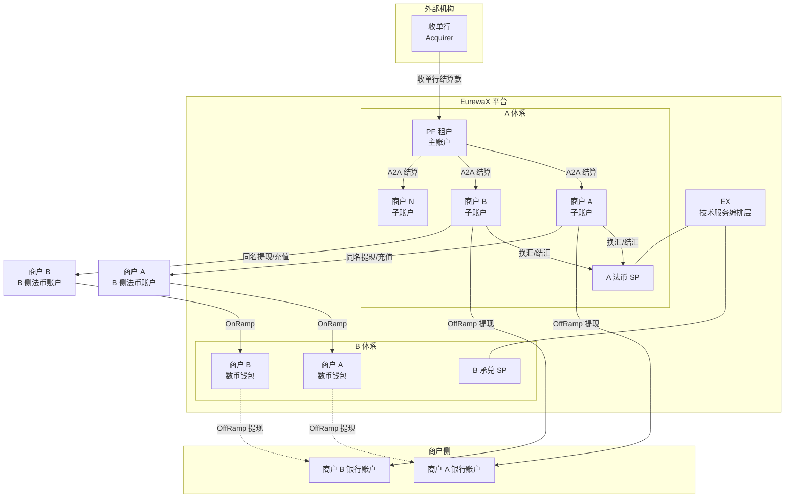

---

## 三、账户结构

### 3.1 A 侧账户体系

```
A（法币 SP）
│
└── PF 租户（如 WB）
    ├── PF 主账户（VA + 余额账户）
    │   ├── VA 账户 —— 接收收单行结算款
    │   └── 余额账户 —— A2A 转出给商户
    │
    ├── 商户 A（子账户）
    │   └── 余额账户 —— 接收 PF A2A 结算款
    │
    ├── 商户 B（子账户）
    │   └── 余额账户 —— 接收 PF A2A 结算款
    │
    └── 商户 N（子账户）
        └── 余额账户 —— 接收 PF A2A 结算款
```

### 3.2 主子账户关系

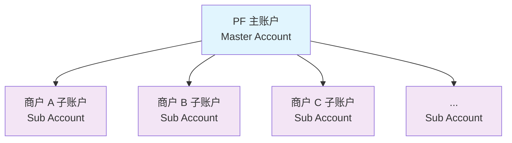

- **主账户**：PF 租户的主账户，持有 VA 和余额，负责接收收单行结算款
- **子账户**：PF 旗下商户的独立账户，接收 PF 的 A2A 转账
- **关系**：主子关系在 A 侧建立，PF 可操作子账户的入金（A2A 结算），子账户资金归属商户自主管理

### 3.3 B 侧账户体系（承兑场景）

```
B（承兑 SP）
│
└── 商户 A
│   └── 数币钱包（USDT）—— 用于 OnRamp/OffRamp
│
└── 商户 B
    └── 数币钱包（USDT）
```

> 商户在 B 的数币钱包与在 A 的法币子账户一一对应，通过 EX 平台统一身份关联。

---

## 四、核心业务流程

### 4.1 端到端流程总览

```
Phase 1: 入网与开户
PF → A 入网 → 开立 PF 主账户 + VA
PF → 推送商户到 A 入网 → 开立商户子账户

Phase 2: 收单结算款入账
收单行 → 打款到 PF 的 VA → PF 主账户余额增加

Phase 3: PF 结算给商户（A2A）
PF 上传/推送结算记录 → A2A 转账 → 商户子账户余额增加

Phase 4: 商户自助操作
商户余额 → 换汇/结汇（A 侧）→ 提现到银行账户
商户余额 → 同名提现/充值到 B → OnRamp（B 侧）→ 数币钱包 → OffRamp → 提现到银行账户
```

### 4.2 详细时序图

#### 场景一：入网与开户流程

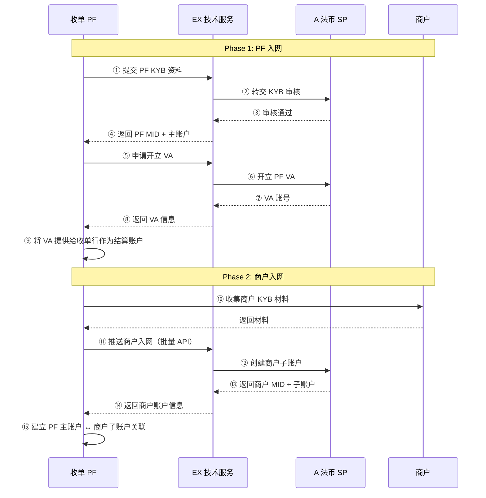

#### 场景二：收单结算款入账流程

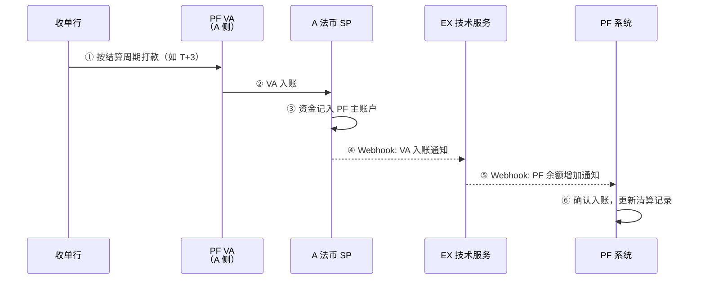

#### 场景三：PF 结算给商户（A2A 转账）

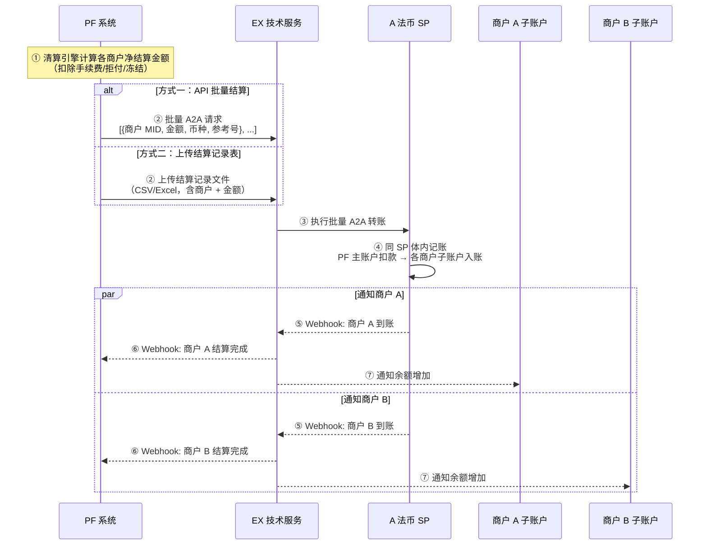

#### 场景四：商户换汇/结汇（A 侧）

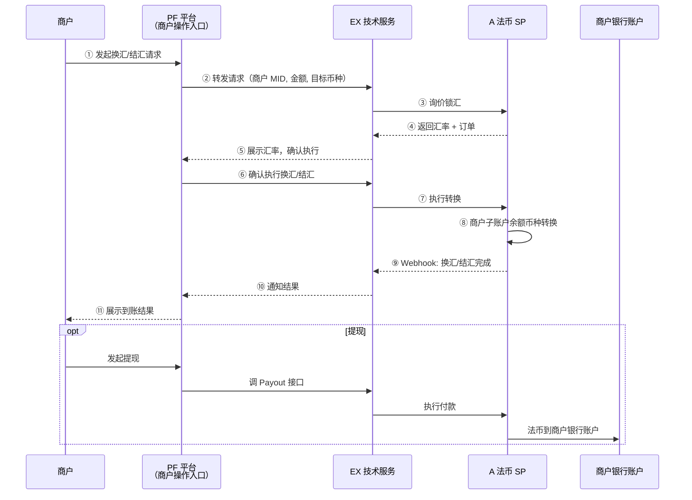

#### 场景五：商户承兑（B 侧 OnRamp/OffRamp）

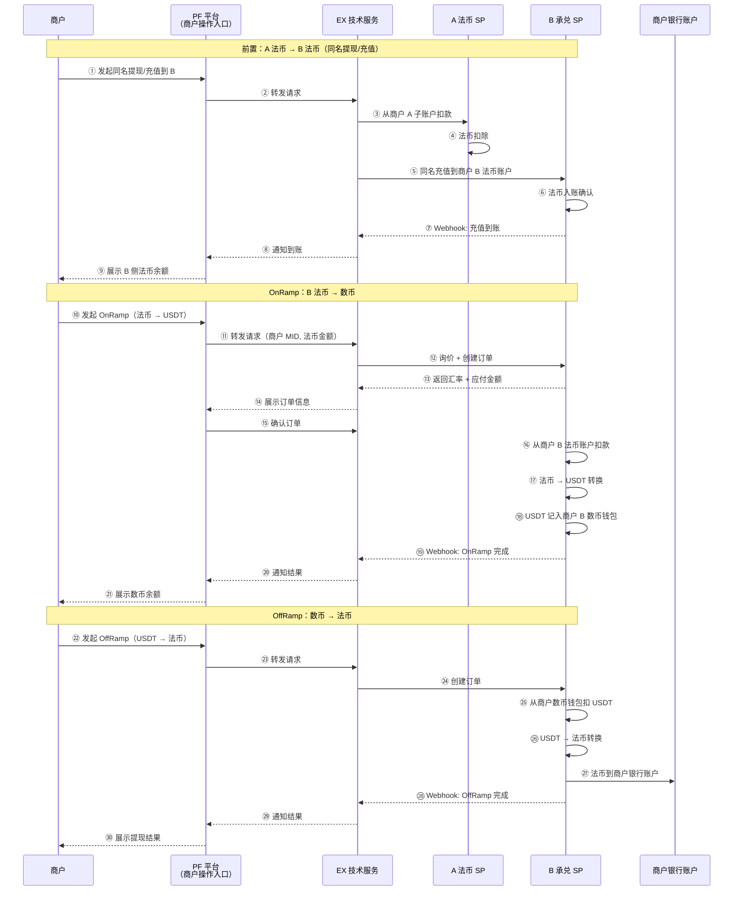

---

## 五、关键业务规则

### 5.1 主子账户规则

| 规则                     | 说明                                                                         |
| ------------------------ | ---------------------------------------------------------------------------- |
| **主子关系建立**   | PF 在 A 入网后主账户自动创建；推送商户入网时，商户子账户自动挂到 PF 主账户下 |
| **A2A 方向**       | 只能从 PF 主账户 → 商户子账户单向转入（结算方向）                           |
| **子账户操作**     | 商户子账户接收 A2A 结算款后，资金归商户自主管理，PF 不可随意扣回             |
| **主子账户可见性** | PF 可查看所有子账户余额和流水；商户只能查看自己的子账户                      |

### 5.2 A2A 结算规则

| 规则                 | 说明                                                                 |
| -------------------- | -------------------------------------------------------------------- |
| **结算触发**   | PF 主动发起，支持 API 批量或文件上传两种方式                         |
| **到账时效**   | 同 SP 体内 A2A，即时到账（秒级）                                     |
| **手续费**     | 同 SP 内 A2A 零手续费；PF 可对商户另行计费（一期暂不启用）           |
| **结算记录表** | 支持 CSV/Excel 格式上传，字段：商户 ID、结算金额、币种、参考号、备注 |

### 5.3 换汇/结汇规则

| 规则               | 说明                                          |
| ------------------ | --------------------------------------------- |
| **执行方**   | A 法币 SP 执行换汇/结汇                       |
| **定价权**   | 租户（PF）可自行定价，EX 提供灵活计费配置能力 |
| **商户自选** | 商户可自主决定是否换汇/结汇，不强制           |
| **汇率类型** | 支持实时询价、锁汇两种模式                    |

### 5.4 承兑规则（B 侧）

| 规则                 | 说明                                                                                            |
| -------------------- | ----------------------------------------------------------------------------------------------- |
| **业务范围**   | OnRamp/OffRamp 为 B 侧产品，商户需先将 A 侧法币同名提现/充值到 B 侧法币账户，再由 B 执行 OnRamp |
| **租户归属**   | 商户在 B 做的承兑业务，系统仍归属到 PF 租户体系下                                               |
| **返点分佣**   | 支持对租户（PF）做返点分佣，分佣比例可配置                                                      |
| **资金原则**   | 先收后做，B 侧法币账户确认到账后才执行 OnRamp，禁止垫资                                         |
| **跨 SP 转移** | A → B 资金转移通过「同名提现/同名充值」独立操作完成，不属于 OnRamp 流程内环节                  |

---

## 六、WB 特殊需求：自有结汇通道

### 6.1 需求背景

WB 作为 PF 租户，已拥有自己的结汇通道资源，希望其旗下的商户在使用结汇服务时，优先走 WB 自有的结汇通道，而非平台默认通道。

### 6.2 短期方案：通道接入 A

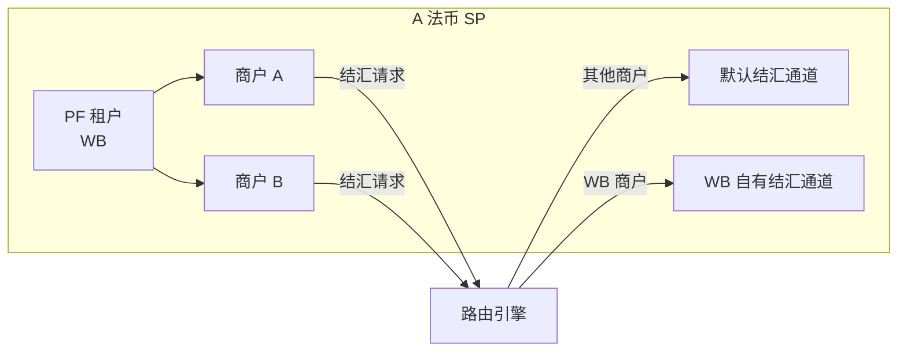

| 要点               | 说明                                                                |
| ------------------ | ------------------------------------------------------------------- |
| **接入方式** | WB 将其自有结汇通道以 API 方式接入到 A 平台                         |
| **路由规则** | 通过路由配置，WB 代理商下的所有商户结汇请求，自动路由到 WB 自有通道 |
| **其他商户** | 非 WB 旗下的商户结汇，仍走平台默认结汇通道                          |
| **计费**     | WB 自有通道的费率由 WB 自行与其商户约定，平台记录交易量用于分佣     |

### 6.3 长期方案：WB 作为结汇 SP 入驻 EX

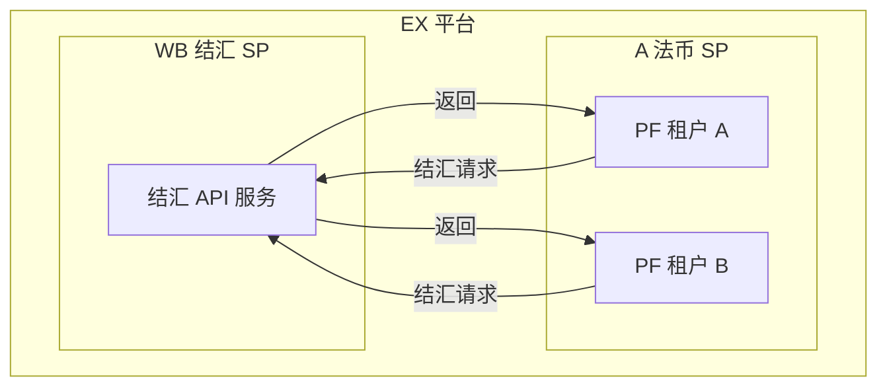

| 要点               | 说明                                                           |
| ------------------ | -------------------------------------------------------------- |
| **入驻方式** | WB 以「结汇 SP」身份入驻 EX 平台                               |
| **赋能范围** | 不仅服务 WB 自己旗下的商户，还可赋能给 EX 平台上的其他租户使用 |
| **价值**     | WB 的结汇能力产品化，成为 EX 平台的一项基础设施服务            |
| **收益**     | WB 可向其他租户收取结汇服务费，EX 协助计费结算                 |

---

## 七、计费与返点分佣

### 7.1 A2A 结算计费（一期暂不启用）

| 项目               | 说明                                     |
| ------------------ | ---------------------------------------- |
| **计费主体** | PF 租户可对旗下商户的 A2A 结算收取手续费 |
| **计费方式** | 按笔收费 / 按金额比例 / 免费，可配置     |
| **一期策略** | 暂不启用计费，零手续费促进业务落地       |
| **二期扩展** | 支持 PF 自主定价，平台提供计费引擎       |

### 7.2 换汇/结汇计费

| 项目               | 说明                                                            |
| ------------------ | --------------------------------------------------------------- |
| **汇率来源** |                                                                 |
| **租户定价** | PF 可在平台基础上自行加点，差价归 PF                            |
| **示例**     | 平台汇率 7.20，PF 加点 0.02 → 商户看到 7.22，PF 赚取 0.02 差价 |

### 7.3 承兑业务返点分佣（B 侧）

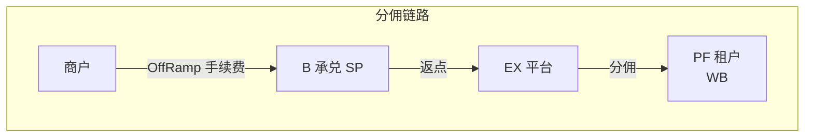

| 项目               | 说明                                            |
| ------------------ | ----------------------------------------------- |
| **返点来源** | 商户在 B 做 OnRamp/OffRamp 产生的手续费         |
| **归属规则** | 商户虽在 B 做承兑，但系统记录其归属租户为 WB    |
| **返点比例** | 可配置，如 B 收取 1% 手续费，其中 30% 返点给 WB |
| **结算周期** | 按日/周/月汇总，EX 平台统一结算给 PF 租户       |

---

## 八、前置流程

### 8.1 整体准备顺序

```
阶段 1：PF 入网
├── PF 向 EX 提交 KYB 资料（营业执照、法人信息、业务说明）
├── A 审核 KYB → 开立 PF 主账户 + VA
└── PF 获得 VA 账号，提供给收单行作为结算账户

阶段 2：商户批量入网
├── PF 收集旗下商户 KYB 材料
├── PF 通过 EX API 批量推送商户入网
├── A 审核 → 开立商户子账户，挂到 PF 主账户下
└── 建立主子账户关系

阶段 3：系统联调
├── Sandbox 环境开通
├── API 密钥配置 + 签名验签联调
├── A2A 转账测试
├── 换汇/结汇测试（可选）
└── 承兑链路测试（可选）

阶段 4：业务上线
├── 收单行配置 PF 的 VA 为结算账户
├── 小额验证打款
└── 正式启用结算流程
```

### 8.2 商户入网流程

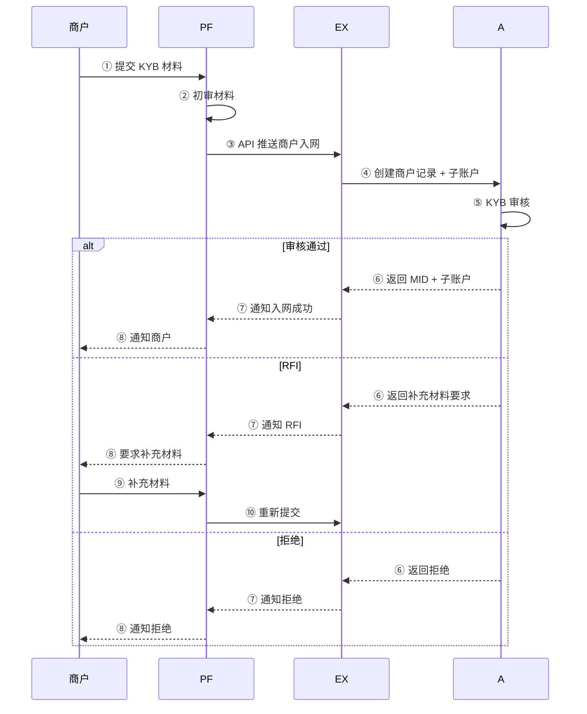

---

## 九、集成时间规划

| 阶段              | 内容                                 | 预计耗时 | 累计  |
| ----------------- | ------------------------------------ | -------- | ----- |
| **Phase 0** | Sandbox 开通、密钥配置、签名验签联调 | 1-2 天   | 2 天  |
| **Phase 1** | PF KYB + VA 开立 + 主子账户体系建立  | 3-5 天   | 7 天  |
| **Phase 2** | 商户批量入网 API + A2A 结算联调      | 5-7 天   | 14 天 |
| **Phase 3** | 换汇/结汇接入联调（可选）            | 3-5 天   | 19 天 |
| **Phase 4** | 承兑链路接入联调（可选，B 侧）       | 5-7 天   | 26 天 |
| **Phase 5** | 端到端测试 + 异常场景 + 小额验证     | 3-5 天   | 31 天 |
| **Phase 6** | 正式上线 + 监控配置                  | 2-3 天   | 34 天 |

> **说明**：Phase 3（换汇/结汇）和 Phase 4（承兑）为可选阶段，可根据业务需求并行或延后。

---

## 十、风险与注意事项

### 10.1 合规风险

| 风险点                   | 说明                                     | 应对措施                                 |
| ------------------------ | ---------------------------------------- | ---------------------------------------- |
| **收单行 VA 验证** | 收单行需验证 VA 账户持有人与 PF 主体一致 | PF 入网时确保 KYB 信息完整准确           |
| **商户 KYB**       | 多层代开户场景下合规责任链较长           | PF 做第一层审核 + A 做最终审核，双重把关 |
| **AML/CFT**        | A2A 转账需符合反洗钱要求                 | A 作为持牌机构执行 AML 监控              |

### 10.2 运营风险

| 风险点                   | 说明                                 | 应对措施                                     |
| ------------------------ | ------------------------------------ | -------------------------------------------- |
| **结算金额准确性** | PF 上传结算记录表可能存在数据错误    | 支持预审核模式：上传后先预览确认，再执行转账 |
| **主子账户一致性** | PF 侧商户列表与 A 侧子账户需保持同步 | 建立定期对账机制，商户新增/注销实时同步      |
| **资金冻结场景**   | 拒付/风控场景需冻结商户资金          | 支持 API 冻结/解冻子账户余额                 |

### 10.3 资金风险

| 风险点                   | 说明                                   | 应对措施                             |
| ------------------------ | -------------------------------------- | ------------------------------------ |
| **先收后结**       | PF 必须先确认 VA 到账，再发起 A2A 结算 | 严格禁止垫资结算                     |
| **A2A 转账不可逆** | 同 SP 内 A2A 转账即时完成，无法撤回    | 转账前增加确认环节，大额需要二次验证 |
| **汇率波动**       | 换汇/结汇/承兑存在汇率波动风险         | 支持锁汇模式，商户确认汇率后再执行   |

---

## 十一、开始接入

联系 EX 客户经理获取：

1. **Sandbox 环境**：测试账号、APP ID、平台公钥、AES Key、测试域名
2. **API 文档**：[EurewaX 开放平台](https://open.eurewax.com/)
3. **技术对接指南**：签名/加密代码示例、接口规范、错误码
4. **技术支持**：专属对接群 + 技术支持工程师

---

*最近更新：2026-05-25*
