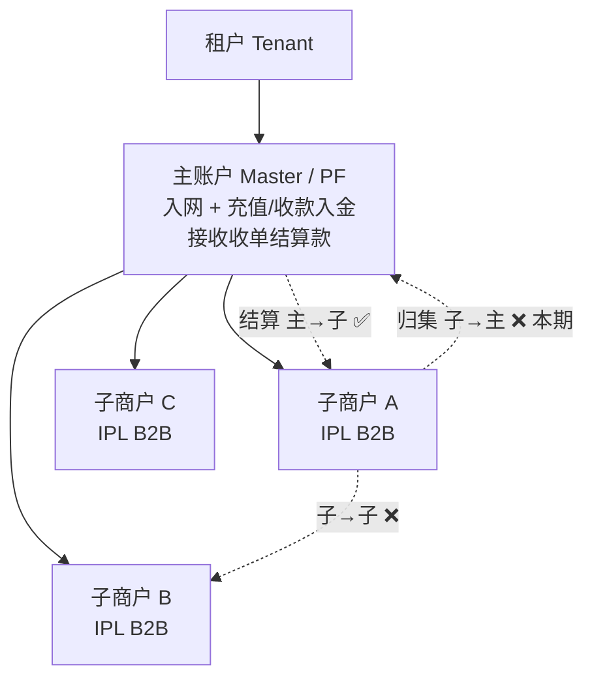
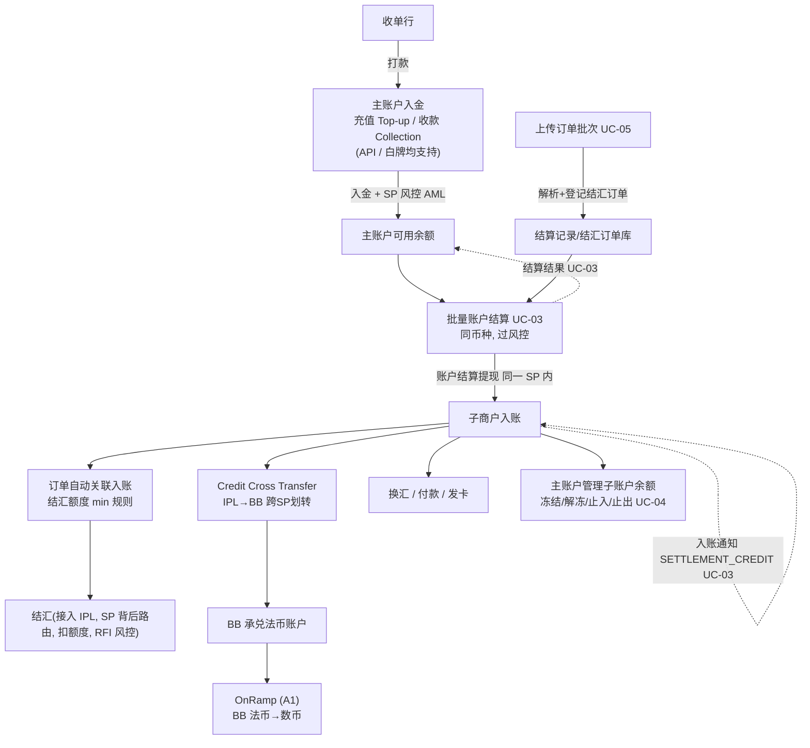

# 收单结算方案 — 产品需求文档（PRD）

> **产品名称**：收单结算（Acquiring Settlement）｜**版本**：v2.1｜**更新**：2026-06-08
> **API 平台**：[EurewaX 开放平台](https://open.eurewax.com/)
> **参考文档**：acquiring-settlement-prd-v2.md / aquiringPF-solution.md

---

## 一、业务背景

### 1.1 行业背景

收单（Acquiring）是指收单机构（收单行 / Acquirer）为商户处理银行卡或其他支付方式的交易受理与资金清算。跨境与平台化场景中常见分层结构：

- **收单行**：完成持卡人交易清算，按周期（T+1 / T+3）将应结资金打包打款给收单平台（PF）。
- **收单平台（PF / 主体）**：以自身名义统一接收汇总结算款，再按子商户应结明细分发。
- **实际经营商户（子商户）**：收到结算款后进行换汇、结汇、付款、买入卖出数币、发卡等资金运用。

### 1.2 问题与机会

平台已具备账户产品（含充值/收款入金）、换汇/结汇、买入卖出数币、发卡等单账户能力，及同一 SP 内账户结算提现交易能力；但**缺少面向 PF/MOR 的"主→子"结算分发产品**：

| 缺口 | 现状 | 影响 |
|------|------|------|
| 主子账户关系 | 无绑定关系登记 | 无法限定"只能主发给自己的子" |
| 账户结算产品 | 仅裸账户结算提现（同 SP 内），无产品级限制 | 无法满足合规与对账要求 |
| 结算明细随款下发 | 转账不带业务明细 | 子商户无法获知结算来源 |
| 结算记录批量导入 | 仅逐笔录入 | 大批量运营成本高 |
| 结汇额度关联 | 手工逐笔关联 | B2B 结汇效率低 |
| SP 风控贯穿 | 部分节点未接入 | 多 SP 资金流转合规风险 |

**机会**：在账户结算提现与单账户能力之上封装标准化"收单结算"产品族，可被多租户复用。

### 1.3 方案概述

在 **主子账户关系（底座）** 之上新建 **账户结算产品**（主→子，底层同 SP 内账户结算提现），叠加产品级限制（主子校验、先收后结、强制明细、强制 SP 风控）；增强 B2B 结汇（上传订单自动关联入账、min 规则生成额度）；新增 **Credit Cross Transfer**（跨 SP 划转，IPL→BB，支持子商户买入数币前置）。资金归集（子→主）本期不做、预留。

### 1.4 目标与非目标

**目标（本期）**
- 主子账户关系底座（建立/查询/解除）
- 账户结算产品：批量结算（一子商户一批次，可多结算币种）、订单上传、明细随款下发、结果通知
- B2B 结汇增强：上传订单→自动关联→min 规则额度
- 关键节点 SP 风控
- 结汇通道路由在 SP 背后（先接入 IPL）
- Credit Cross Transfer（IPL→BB 跨 SP 划转，支持 OnRamp 前置）
- 主账户管理子账户余额（冻结/解冻/止入/止出）
- 租户计费与分佣结算配置

**非目标**
- 资金归集产品（子→主），仅预留
- 子商户 B2C 账户类型（一期仅 B2B）
- 结汇 SP 入驻平台的平台化能力
- 账户结算产品本身的计费和底价（UC-03 分发不收费）

### 1.5 产品架构：1 底座 + 2 产品

```
            ┌──────────────────────────────┐
            │   主子账户关系（底座 / 能力）   │
            │   登记 主MID ↔ 子MID 绑定关系   │
            └───────────────┬──────────────┘
              ┌─────────────┴─────────────┐
              ▼                           ▼
    ┌──────────────────┐        ┌──────────────────┐
    │  账户结算产品      │        │  资金归集产品      │
    │  方向：主 → 子     │        │  方向：子 → 主     │
    │  底层交易：账户结算提现（同一 SP 内） │        │  底层交易：账户结算提现（同一 SP 内） │
    │  本期落地 ✅       │        │  后续扩展 ⏳       │
    └──────────────────┘        └──────────────────┘
```

### 1.6 角色与账户结构



> 资金流向：主→子 ✅ | 子→主 ❌（本期） | 子→子 ❌。一个子商户可关联多个主账户（一子多主），结算时按"发起主账户 ↔ 该子账户"逐一校验。

| 角色 | 职责 |
|------|------|
| 租户 | 账户体系与产品配置归属方；按租户开通产品与配置 |
| 主账户 | 通过充值/收款入金接收收单结算款；发起"主→子"账户结算；管理子账户余额 |
| 子商户 | 接收结算款；进行结汇/换汇/付款/买入卖出数币/发卡等资金运用 |

### 1.7 产品清单

| 编号 | 名称 | 类型 | 产品代码 | 本期 | 说明 |
|------|------|------|----------|------|------|
| P-0 | 主子账户关系 | 底座能力 | — | ✅ | 登记主子绑定，结算/归集前置 |
| P-1 | 账户结算产品 | 售卖产品 | `ACCOUNT_SETTLEMENT` | ✅ | 主→子定向结算，底层同 SP 账户结算提现 |
| P-2 | 资金归集产品 | 售卖产品 | `FUND_POOLING` | ❌ 后续 | 子→主，本期预留 |

**复用/增强的已有产品**

| 名称 | 状态 | 用途 |
|------|------|------|
| 充值（Top-up） | 复用 | 主账户入金方式之一 |
| 收款（Collection） | 复用（API 可用） | 主账户入金方式之一（与充值并行） |
| 付款（`FIAT_PAYOUT`） | ⏳ 未上 EX | 子商户提现待上线 |
| 换汇/结汇（FX） | **增强** | B2B 结汇新增上传订单+额度自动关联（UC-06） |
| 买入/卖出数币 | 复用 | 子商户法币↔数币 |
| 跨SP划转（Credit Cross Transfer） | **新增** | IPL→BB 法币划转，买入数币前置（UC-07.2） |
| 发卡（VCC） | 复用 | 子商户发卡 |

### 1.8 产品属性与配置

#### 1.8.1 SP 能力定义（SA 上架时配置）

| 字段 | 类型 | 说明 | 示例值 |
|------|------|------|--------|
| 产品代码 | 固定 | 唯一标识 | `ACCOUNT_SETTLEMENT` |
| 支持的结算币种 | 多选 | 默认取 SP 账户币种范围 | 默认值：SP 的账户币种限制 |
| 结算目标定位 | 多选 | 支持的目标定位方式 | VA / MERCHANT_ID |
| 明细订单币种 | 范围 | 明细中订单可用的原币范围 | 支持全部币种（默认反选制裁币种） |
| 明细折算汇率 | 固定 | 汇率来源 | SP 系统默认汇率（仅展示参考） |

*限额（SP 上限）*

| 字段 | 示例值 |
|------|--------|
| 单笔结算最小/最大 | 1 / 1,000,000 USD |
| 单批笔数上限 | 5,000 |
| 单日/单月结算上限 | 10,000,000 / 100,000,000 USD |

> **系统默认规则（无需配置）**：① 一个批次仅同一子商户；② 批次内各笔可不同结算币种；③ 结算资金币种 = 子商户到账币种。

#### 1.8.2 TP 产品配置（TP 在 SP 能力内收窄）

| 字段 | 说明 | 默认值 |
|------|------|--------|
| 允许的结算币种 | TP 允许商户结算的币种 | 所有账户币种（新增自动包含） |
| 限额（≤ SP 值） | 单笔/单批/单日/单月 | 同 SP 上限 |

#### 1.8.3 计费配置

| 配置项 | 说明 | 本期范围 |
|--------|------|----------|
| 租户底价 | 平台向租户收取的底层服务费用 | ✅ 支持 |
| 商户报价 | 租户向子商户收取的服务费用，租户自主加价 | ✅ 支持 |
| 主子账户计费 | 一个租户下多个主子账户关系计费 | ✅ 本期先支持一个 |
| 子商户产品配置 | 子商户收款、付款、承兑等由租户配置 | ✅ 支持 |
| 账户结算产品计费 | UC-03 主→子分发计费 | ❌ 本期不支持 |
| 分佣结算 | 原有产品分佣逻辑保留 | ✅ 不变动 |

#### 1.8.4 下期：主商户自助配置

> 本期 TP 代配商户级；下期开放主账户在自助层调整运营偏好，取值范围 ⊆ TP ⊆ SP。

### 1.9 菜单与资源全景（产品 → Resource）

> 本节定义本产品在四端（MP / TP / SP / SA）的菜单结构与产品资源（Resource = 菜单页面 + API + Webhook）。每个 UC 章节会引用本表中的菜单/页面/功能。

#### 1.9.1 端与角色定位

| 端 | 名称 | 角色 |
|----|------|------|
| **MP** | Merchant Portal | 主账户（PF）/ 子商户使用，办理收款、结算、结汇、付款等业务 |
| **TP** | Tenant Portal | 租户后台，配置产品/计费/分佣，监控全租户运营 |
| **SP** | Service Provider Portal | 服务商后台，做合规审核、风控处置、账户管理 |
| **SA** | System Admin | 平台管理后台，做 SP 上架、产品上架、租户管理 |

#### 1.9.2 MP 菜单（主账户 PF 视角）

| 一级菜单 | 二级菜单 / 页面 | 主要功能 |
|---------|---------------|----------|
| **Assets**（资产） | Fiat Accounts（法币账户） | 主账户多币种余额；支持充值/同名提现；查看入账与划转流水 |
| | Order History（订单记录） | 法币账户进出账查询 |
| **Sub-Merchants**（子商户管理） | Sub-Merchant List（子商户列表） | 查看绑定子商户、开通产品、增开产品 |
| | Master-Sub Relations（主子关系） | 建立/查询/解除主子关系 |
| | Account Status（账户状态处置） | 冻结/解冻/止入/止出子账户 |
| **Settlements**（结算分发） | Settlement Batches（结算批次） | 发起批量结算、查看批次状态、逐笔结果 |
| | Upload Settlement Records（上传结算记录） | 上传 CSV/Excel 批量结算文件，预览后确认执行 |
| **Trade Orders**（贸易订单） | Trade Order Batches（订单批次） | 上传/查看贸易订单批次（一子一币种一批次） |
| **Risk & Compliance** | RFI Center（RFI 中心） | 查看 RFI 单、提交补料 |
| **Reports**（报表） | Settlement Reconciliation（结算对账） | 结算/入账/SP 流水三方对账 |
| **Developer** | API Keys / Webhooks | 密钥管理、Webhook 配置 |
| **Settings** | Profile / Members / Security | 主账户基础设置 |

#### 1.9.3 MP 菜单（子商户视角）

| 一级菜单 | 二级菜单 / 页面 | 主要功能 |
|---------|---------------|----------|
| **Assets** | Fiat Accounts | 子商户多币种余额，含结算到账款 |
| | Order History | 入账/出账流水 |
| **Transfers In** | Inbound Orders（入账订单） | 查看结算到账记录（SETTLEMENT_CREDIT） |
| **Transfers Out** | Payouts（付款订单） | 发起付款 |
| **FX Center** | FX Quota（结汇额度） | 查看可用/已用结汇额度及明细 |
| | FX Orders（结汇订单） | 发起结汇、查看结汇订单 |
| | FX Exchange（换汇） | 子商户换汇 |
| **Trade Orders** | Trade Order Batches | 自传贸易订单（uploadSource=SUB / RFI） |
| **Crypto** | OnRamp / OffRamp | 买入/卖出数币（含跨 SP 划转 Credit Cross Transfer） |
| **Cards** | VCC | 发卡与卡交易 |
| **Risk & Compliance** | RFI Center | 提交 RFI 补料 |
| **Reports** | Statements | 账户对账单 |

#### 1.9.4 TP 菜单（租户后台）

| 一级菜单 | 二级菜单 / 页面 | 主要功能 |
|---------|---------------|----------|
| **Customer Center**（客户中心） | Member List（会员列表） | 主账户/子商户列表 |
| | KYB Review（KYB 审核） | 入网材料初审 |
| **Product Center**（产品中心） | Product Catalog（产品目录） | 查看本租户已上架产品 |
| | Product Onboarding（产品开通） | 主账户/子商户产品开通审核与配置 |
| | Product Config（产品配置） | TP 在 SP 能力内收窄结算币种、限额 |
| **Settlement Center**（结算中心） | Master-Sub Relations | 全租户主子关系视图 |
| | Settlement Monitor（结算监控） | 全租户结算批次监控、异常告警 |
| **Billing Center**（计费中心） | Billing Config（计费配置） | 租户底价 + 商户报价（按服务/费率模式/markup） |
| | Commission Config（分佣配置） | 分佣比例、结算周期 |
| | Billing Statements（计费账单） | 计费 / 分佣账期结算 |
| **Risk Center**（风控中心） | RFI Queue（RFI 队列） | 风控 RFI 复核 |
| **Reports** | Tenant Reports | 租户级运营/对账报表 |

#### 1.9.5 SP 菜单（服务商后台）

| 一级菜单 | 二级菜单 / 页面 | 主要功能 |
|---------|---------------|----------|
| **Customer Center** | KYB Review | KYC/KYB 终审 |
| **Account Mgmt**（账户管理） | Account List | 主/子账户视图 |
| | Account Status Disposition（账户处置） | SP 最高权限：冻结/止入/止出 |
| **Risk Center** | Risk Rules（风控规则） | 配置 AML/金额/频次/对手方规则 |
| | Risk Cases / RFI Review | 风控命中复核、放行/拒绝 |
| **Settlement Monitor** | Transaction List | SP 内交易单（含账户结算提现）查询 |
| **Capability Config** | Product Capability | SP 上架时配置产品能力（币种、限额、目标定位） |
| **Reports** | SP Reports | 流水/对账/合规报告 |

#### 1.9.6 SA 菜单（平台管理）

| 一级菜单 | 二级菜单 / 页面 | 主要功能 |
|---------|---------------|----------|
| **SP Mgmt** | SP List / Capability Listing | SP 入驻、产品能力上架 |
| **Tenant Mgmt** | Tenant List / Tenant Onboarding | 租户入驻、套餐配置 |
| **Product Catalog** | Product Listing | 平台产品目录（`ACCOUNT_SETTLEMENT` / `FUND_POOLING` / FX / Payout 等） |
| **Compliance** | Global Risk Policies | 平台级合规策略 |
| **Operations** | System Monitor | 系统级监控、Webhook 重试中心 |

#### 1.9.7 产品资源（API + Webhook）

| 资源类别 | API（同 §3.7 接口清单） | Webhook 事件 |
|---------|----------------------|------------|
| 主子关系 | A-01 / A-02 / A-03 | `RELATION_STATUS_CHANGED` |
| 账户结算 | A-04 / A-05 | `SETTLEMENT_RESULT`(A-06) / `SETTLEMENT_CREDIT`(A-07) |
| 结算记录上传 | A-08 | — |
| 订单批次 | A-11 | `ORDER_BATCH_ASSOCIATED` |
| 结汇 | A-09 / A-10 | `FX_RESULT` / `FX_RFI` |
| 子账户处置 | A-12 / A-13 / A-14 | `ACCOUNT_STATUS_CHANGED` |
| 计费配置 | A-15 | `BILLING_STATEMENT_READY` |
| 分佣配置 | A-16 | `COMMISSION_STATEMENT_READY` |
| RFI | （详见 UC-05） | `RISK_RFI_PENDING` / `RISK_RFI_RESULT` |

---

## 二、名词解释

| 名词 | 英文/代码 | 解释 |
|------|-----------|------|
| 租户 | Tenant | 在 EX 平台拥有独立账户体系与产品配置的接入方 |
| 收单行 | Acquirer | 完成持卡人交易清算，按周期打款给 PF 的机构 |
| 收单平台 | Payment Facilitator, PF | 统一接收收单结算款再分发给子商户的主体（= 主账户） |
| 收单大商户 | MOR: Merchant of Record | 收单责任商户；MOR 场景下子商户 = 大商户的供应商 |
| 主账户 | Master Account | 接收收单结算款、发起"主→子"结算分发、管理子账户余额的账户 |
| 子商户 | Sub-merchant / Sub Account | 接收结算分发的实际经营商户（本期 IPL B2B） |
| 主子账户关系 | Master-Sub Relation | 主 MID ↔ 子 MID 绑定关系的底座能力（非售卖产品） |
| 充值 | Fiat Deposit | 主账户入金方式之一 |
| 收款 | Collection | 法币收款能力（API 可用），主账户入金方式之一 |
| 账户结算产品 | Account Settlement (`ACCOUNT_SETTLEMENT`) | 账户结算提现之上叠加主子校验+仅主→子+明细+风控的产品 |
| 结算批次 | Settlement Batch | 资金结算的批次（UC-03），一子商户一批次 |
| 商户单 | Member Biz Order | 账户结算的商户单，与结算批次对应 |
| 交易单 | Transaction | SP 内部的资金交易单（底层账户结算提现） |
| 账户间转账 | Credit Account Transfer | 同 SP 内账户转账 |
| 订单批次 | Contract Order Batch | 订单明细的批次（UC-05），一子商户+一结算币种 |
| 订单明细 | Contract Orders | 消费者下单的原始订单记录 |
| 结汇 | CNY Payouts | 外币兑换为本币并入账；B2B 需贸易订单背景 |
| 结汇额度 | CNY Quota | 基于"结算到账 × 关联订单"产生的可结汇金额 |
| SP | Service Provider | 提供收付款/结汇/数币等能力的服务商 |
| SP 风控 | SP Risk Control | 关键节点的合规/AML 审查（通过/RFI/拒绝） |
| RFI | Request for Information | 风控要求补充材料，冻结→补料→放行或拒绝 |
| 买入/卖出数币 | Buy/Sell Crypto (OnRamp/OffRamp) | 法币↔数币兑换 |
| 跨SP划转 | Credit Cross Transfer | 跨 SP 法币账户划转（IPL→BB） |
| 冻结/止入/止出 | Freeze / Block Credit / Block Debit | 主账户对子账户余额的处置操作 |

---

## 三、端到端业务流程

### 3.1 端到端流程图



### 3.2 三层订单模型（商户单/交易单/渠道单）

> 统一收单结算的单据视图。本模型适用于账户结算（含正向与反向）；入账（UC-02 充值/收款）由账户产品处理，不在此模型内。

| 层级 | 归属/可见 | 说明 |
|------|-----------|------|
| **商户单** Member Biz Order | 商户/租户视角，**对外** | 一次批量结算 = 1 商户单（含 N 笔明细） |
| **交易单** Transaction Order | **SP 内部** | 每笔明细的账户结算提现资金交易单；1 商户单 : N 交易单 |
| **渠道单** Channel Order | 外部渠道 | 账户结算提现为平台内部划转，**无渠道单** |

```
正向（结算）：商户单(UC-03) → N × 交易单(账户结算提现) → 子商户入账(UC-03)
反向（回退）：反向商户单 → N × 反向交易单(反向账户结算提现) → 子账户退回主账户
```

### 3.3 结算批次与订单批次数据模型

#### 3.3.1 结算批次（Settlement Batch / 资金层，UC-03）

> **一个子商户一个批次，可多个结算币种。**

```
结算批次 (Settlement Batch / 商户单)
  ├─ batchNo         批次号（幂等键）
  ├─ masterMid       发起主账户
  ├─ subMid          目标子商户（一个批次 = 一个子商户）
  ├─ targetType      VA / MERCHANT_ID
  └─ N × 结算笔 (Settlement Item / 交易单)
       ├─ referenceNo       单笔参考号
       ├─ currency          结算币种（每笔可不同）
       ├─ amount            结算金额 = Σ 关联订单 settledAmount
       └─ 关联订单批次中对应币种的明细
```

| 维度 | 规则 |
|------|------|
| 批次粒度 | 一个子商户 = 一个结算批次 |
| 结算币种 | 批次内各笔可不同（multi-currency） |
| 账户结算提现执行 | 每笔 = 1 次账户结算提现（以该笔 currency 执行） |
| 余额校验 | 按各币种分别校验主账户余额 |

#### 3.3.2 订单批次（Contract Order Batch / 凭证层，UC-05）

> **一个子商户 + 一个结算币种 = 一个订单批次。订单上传为独立 UC（UC-05），不从属于结汇流程。**

```
订单批次 (Contract Order Batch)
  ├─ orderBatchId        订单批次号（幂等键）
  ├─ masterMid           上传主账户（可选）
  ├─ subMid              子商户
  ├─ settlementCurrency  结算币种（同一批次统一）
  ├─ uploadSource        MASTER / SUB / RFI
  ├─ status              REGISTERED / ASSOCIATED / CANCELLED
  └─ M × 订单明细 (Contract Order)
       ├─ orderNo / orderCurrency / orderAmount    订单原币
       ├─ settlementCurrency / exchangeRate         折算（SP 默认，仅参考）
       └─ settledAmount = orderAmount × exchangeRate
```

#### 3.3.3 两种批次关系示例

```
结算批次 BATCH-001 (subMid=SUB_1024)
  结算笔 1: USD 100 → 关联订单批次 OB-001 (settlementCcy=USD, Σ settledAmt=100)
  结算笔 2: EUR 80  → 关联订单批次 OB-002 (settlementCcy=EUR, Σ settledAmt=80)

约束：结算笔金额 = Σ 关联订单 settledAmount；不一致则拒绝
```

### 3.4 状态机

#### 3.4.1 批次状态机（商户单维度）

```
CREATED ──(提交)──▶ PROCESSING ──(所有明细终态)──▶ COMPLETED
                                                   ├─ result: ALL_SUCCESS
                                                   ├─ result: PARTIAL
                                                   └─ result: ALL_FAILED
CREATED ──(批次级校验失败)──▶ REJECTED
```

| 状态 | 说明 | 终态 |
|------|------|------|
| CREATED | 已提交，待校验 | 否 |
| PROCESSING | 至少一笔在执行中 | 否 |
| COMPLETED | 所有明细到达终态，通过 result 区分 | ✅ |
| REJECTED | 批次级校验失败 | ✅ |

#### 3.4.2 明细状态机（交易单维度）

```
CREATED → VALIDATING ─┬─(通过)──▶ PROCESSING ─┬─▶ SUCCESS (账户结算提现成功)
                      │                        └─▶ FAILED  (账户结算提现失败)
                      └─(失败/拒绝)──▶ REJECTED
```

#### 3.4.3 RFI（风控独立子流程，与主流程解耦）

> RFI 由风控独立发起，**不改变明细主流程状态**；仅在放行/拒绝时回写结果。

```
风控命中 → RFI_PENDING →(补料)→ RFI_REVIEW →┬─ 放行 → 明细继续 PROCESSING
                                              └─ 拒绝 → 明细 REJECTED
```

#### 3.4.4 Credit Cross Transfer 状态机（商户单）

```
CREATED ──▶ PROCESSING ──┬──▶ SUCCESS  (划转完成，BB 已到账)
                         ├──▶ FAILED   (子单失败/回滚完成)
                         └──▶ REJECTED (风控拒绝)
```

### 3.5 SP 风控接入

收单结算涉及多 SP 资金流转，以下节点强制接入风控：

| # | 业务环节 | 风控场景 | 触发条件 |
|---|----------|----------|----------|
| 1 | 主账户入金（充值/收款） | AML | 每笔入账 |
| 2 | 主→子结算分发 | 金额/频次/对手方 | 每笔结算 |
| 3 | 子商户添加收款人 | 收款人合规 | 每次新增 |
| 4 | 子商户付款/结汇 | 金额/频次/目标合规 | 每笔付款 |
| 5 | 子商户添加数币地址 | 地址黑名单/链上风险 | 每次新增 |
| 6 | 子商户卖出数币 | 金额/频次/目标风险 | 每笔交易 |

**风控处理模式**：通过→正常执行 | **RFI→独立子流程**（补料→复核→放行/拒绝，不改变主流程状态） | 拒绝→入金场景资金回退，结算场景该笔不执行

> ⚠️ **结汇明细 RFI 流程待和风控确认**：触发规则、材料清单、审核时效与放行口径需与风控团队对齐。

### 3.6 非功能需求

| # | 项 | 要求 |
|---|---|------|
| 1 | 幂等性 | 同 requestId / referenceNo / batchNo 重复提交不重复执行 |
| 2 | 批量性能 | 单批 N 笔在约定时延内完成（指标待定） |
| 3 | 对账一致性 | 结算记录、子账户入账、SP 流水三方对平 |
| 4 | Webhook 可靠性 | 失败指数退避重试，事件可去重 |
| 5 | 安全 | 全链路 HTTPS + 签名；密钥不落明文 |
| 6 | 可观测 | 全链路 traceId；关键节点埋点与告警 |

### 3.7 API 通用约定

| 项 | 约定 |
|----|------|
| Base URL | `https://open.eurewax.com` |
| 协议 | HTTPS，`Content-Type: application/json;charset=utf-8` |
| 鉴权 | API Key + HMAC-SHA256 签名（X-Api-Key / X-Timestamp / X-Nonce / X-Sign） |
| 幂等 | 写接口必带 requestId 或 referenceNo/batchNo |
| 分页 | pageNo（从 1）、pageSize（默认 20，最大 100） |
| 金额 | 字符串小数最多 2 位；币种 ISO 4217 |
| 时间 | ISO 8601 UTC |

**统一响应**：`{ "code": "SUCCESS", "message": "ok", "traceId": "...", "data": {} }`

**API 接口清单**

| 编号 | 接口 | 方法 | 路径 | 归属 UC |
|------|------|------|------|---------|
| A-01 | 建立主子关系 | POST | `/v1/relations` | UC-01 |
| A-02 | 查询主子关系 | GET | `/v1/relations` | UC-01 |
| A-03 | 解除主子关系 | DELETE | `/v1/relations/{relationId}` | UC-01 |
| A-04 | 批量账户结算 | POST | `/v1/settlements/batch` | UC-03 |
| A-05 | 结算记录查询 | GET | `/v1/settlements` | UC-03 |
| A-06 | 结算结果通知 | Webhook | 租户回调地址 | UC-03 |
| A-07 | 子商户入账通知 | Webhook | 租户回调地址 | UC-03 |
| A-08 | 上传结算记录 | POST | `/v1/settlements/records:upload` | UC-03 |
| A-09 | 结汇通道路由配置 | POST/GET | `/v1/fx/channel-routes` | UC-06 |
| A-10 | 查询结汇额度 | GET | `/v1/fx/quota` | UC-06 |
| A-11 | 上传订单批次 | POST | `/v1/orders/batch:upload` | UC-05 |
| A-12 | 冻结子账户 | POST | `/v1/accounts/{subMid}/freeze` | UC-04 |
| A-13 | 解冻子账户 | POST | `/v1/accounts/{subMid}/unfreeze` | UC-04 |
| A-14 | 查询子账户状态 | GET | `/v1/accounts/{subMid}/status` | UC-04 |
| A-15 | 计费配置 | POST/GET | `/v1/billing/config` | UC-BASE-03 |
| A-16 | 分佣配置 | POST/GET | `/v1/commission/config` | UC-BASE-04 |

---

## 四、拆分 Use Cases

> 用例总览：

| 用例 | 名称 | 主要角色 | 优先级 |
|------|------|----------|--------|
| UC-BASE-01 | 产品与产品配置 | 租户/SA | P0 |
| UC-BASE-02 | 租户签约与产品开通 | 租户/主账户 | P0 |
| UC-BASE-03 | 计费配置（租户底价和商户报价） | 租户/系统 | P1 |
| UC-BASE-04 | 分佣结算配置 | 租户/系统 | P1 |
| UC-01 | 产品开通（主子关系建立、子商户入网、增开产品） | 租户/主账户 | P0 |
| UC-02 | 主账户充值（正向/反向） | 收单行/主账户 | P0 |
| UC-03 | 主账户账户结算给子账户（增开 MID / 上传明细 / 资金结算） | 主账户 | P0 |
| UC-04 | 主账户管理子商户账户余额（冻结/解冻/止入/止出） | 主账户 | P0 |
| UC-05 | RFI 单独流程 | 子商户/风控 | P0 |
| UC-06 | 子账户管理（B2B 开通 / 自动开通 / 结汇额度改造） | 子商户/系统 | P0 |


---

### UC-BASE-01 产品与产品配置

**目标**：定义账户结算产品的能力边界与配置模型，为租户上架提供标准产品定义。

**前置条件**
- SA 已完成 SP 能力调研，确定上架的服务商支持账户结算产品。

#### 涉及功能模块

| 功能模块 | 说明 | 本期范围 |
|----------|------|----------|
| **主子账户关系底座** | 登记主 MID ↔ 子 MID 绑定关系，结算/归集前置 | ✅ 本期落地 |
| **账户结算产品** | 售卖产品，代码 `ACCOUNT_SETTLEMENT`，主→子定向结算 | ✅ 本期落地 |
| **资金归集产品** | 售卖产品，代码 `FUND_POOLING`，子→主归集 | ❌ 本期预留 |
| **SP 能力配置** | 支持的结算币种、结算目标定位、明细订单币种、单笔/单批/单日/单月限额 | ✅ 本期落地 |
| **TP 产品配置** | 租户在 SP 能力内收窄：允许的结算币种、限额（≤ SP 值） | ✅ 本期落地 |
| **主商户自助配置** | 主账户自助调整运营偏好 | ❌ 下期开放 |

#### 正向流程

1. SA 在平台后台配置 SP 能力定义（产品代码、币种范围、目标定位方式、限额）。
2. TP（租户管理员）在 SP 能力范围内配置租户级产品参数（允许的结算币种、限额）。
3. 本期 TP 代配商户级参数；下期开放主账户自助层。

#### 业务规则

| 规则 | 说明 |
|------|------|
| 系统默认规则 | 一个批次仅同一子商户；批次内各笔可不同结算币种；结算资金币种 = 子商户到账币种 |
| 限额层级 | SP 上限 ≥ TP 配置 ≥ 主商户配置（下期） |
| 新增币种自动包含 | TP 允许的结算币种列表新增时，自动包含到已开通商户 |

#### 验收标准

| # | 场景 | 预期 |
|---|------|------|
| 1 | SA 配置 SP 能力 | 产品上架成功 |
| 2 | TP 配置租户参数 | 参数在 SP 能力范围内生效 |
| 3 | 新增币种自动包含 | 已开通商户自动获得新币种权限 |

#### 涉及菜单（MP / TP / SP / SA）

| 端 | 菜单路径 | 页面 | 功能 |
|----|---------|------|------|
| **SA** | SP Mgmt → Capability Listing | SP 能力上架页 | 配置 `ACCOUNT_SETTLEMENT` 能力（币种/限额/目标定位） |
| **SA** | Product Catalog → Product Listing | 产品目录页 | 维护平台产品目录（含账户结算 / 资金归集） |
| **SP** | Capability Config → Product Capability | SP 产品能力页 | SP 自助维护已上架产品参数 |
| **TP** | Product Center → Product Config | 租户产品配置页 | TP 在 SP 能力内收窄结算币种、限额 |
| **MP** | （本期不直接配置） | — | 下期开放主商户自助配置 |

#### API 示例

> 本 UC 主要为后台配置类，无对外业务 API。配置变更通过 SA / SP 后台完成；对 MP / TP 暴露的查询接口在 §3.7 通用 API 清单中（产品列表查询）。

---

### UC-BASE-02 租户签约与产品开通

**目标**：租户完成入网 KYB，开通账户结算产品，建立主子账户体系。

**前置条件**
- 租户已在 EX 平台注册。
- 主账户完成 KYC 并通过审核。
- 子账户已注册。

#### 涉及功能模块

| 功能模块 | 说明 | 本期范围 |
|----------|------|----------|
| **租户入网（KYB）** | 租户提交营业执照、法人信息、业务说明等材料 | ✅ 本期落地 |
| **支付的服务商审核 KYC/KYB** | 支付的服务商审核租户及主账户材料 | ✅ 本期落地 |
| **Webhook 通知审核结果** | APPROVED / REJECTED / RFI | ✅ 本期落地 |
| **开通账户结算产品** | 主账户申请开通 `ACCOUNT_SETTLEMENT` 产品 | ✅ 本期落地 |
| **主子关系建立** | 主 MID ↔ 子 MID 绑定，系统校验账户存在、同租户、子账户 B2B | ✅ 本期落地 |
| **子商户入网** | 子商户提交 KYB，开通付款、换汇等法币产品 | ✅ 本期落地 |
| **增开产品** | 主子关系建立后，按需增开收款、承兑、发卡等产品 | ✅ 本期落地 |

#### 正向流程

1. **租户入网（KYB）**
   - 租户向 EurewaX 提交 KYB 材料（营业执照、法人信息、业务说明）。
   - 附件先调【上传文件】接口取 URL。
   - 支付的服务商审核 KYC/KYB。
   - Webhook 通知审核结果（APPROVED / REJECTED / RFI）。
   - 审核通过 → 开立 PF 主账户 + VA。

2. **商户批量入网**
   - PF 收集商户 KYB 材料。
   - PF 通过 EX API 或白牌后台批量推送商户入网。
   - 支付的服务商审核 → 开立商户子账户，挂到 PF 主账户下。

3. **建立主子账户关系**
   - 主账户（或租户管理员）调用 **A-01 建立关系** 提交 `masterMid` + `subMid`。
   - 系统校验：两账户存在、同租户、子账户为 B2B（本期）、关系未重复。
   - 过风控 → 写入关系表，状态 `ACTIVE`，返回 `relationId`。

#### 反向流程

- 审核拒绝 → 补充材料重新提交（RFI）。
- 关系解除见 UC-01。

#### 业务规则

| 规则 | 说明 |
|------|------|
| 同对唯一 | 同一 masterMid-subMid 不可重复绑定 |
| 子账户类型 | 本期仅 B2B（IPL），后续可配 B2C |
| 幂等 | 已存在返回 `RELATION_ALREADY_EXISTS` |
| 一个租户多个主子关系 | 本期架构支持，可先支持一个 |

#### 验收标准

| # | 场景 | 预期 |
|---|------|------|
| 1 | 租户入网成功 | 主账户开立，VA 生成 |
| 2 | 子商户入网成功 | 子账户开立，B2B 类型 |
| 3 | 建立主子关系 | 返回 relationId，状态 ACTIVE |
| 4 | 重复建立 | 幂等返回，不重复 |
| 5 | 子账户非 B2B | 拦截 SUB_ACCOUNT_TYPE_INVALID |

#### 涉及菜单（MP / TP / SP / SA）

| 端 | 菜单路径 | 页面 | 功能 |
|----|---------|------|------|
| **MP** | Settings → Profile / KYB | 入网申请页 | 主账户/子商户提交 KYB 材料，附件上传 |
| **MP** | Sub-Merchants → Master-Sub Relations | 主子关系页 | 主账户发起/查询/解除主子关系 |
| **MP** | Sub-Merchants → Sub-Merchant List | 子商户列表 | 主账户为子商户增开产品 |
| **TP** | Customer Center → KYB Review | KYB 初审页 | 租户对入网材料初审 |
| **TP** | Product Center → Product Onboarding | 产品开通页 | 审核产品申请，分配产品权限 |
| **SP** | Customer Center → KYB Review | KYB 终审页 | 支付的服务商终审，开立主/子账户 + VA |
| **SA** | Tenant Mgmt → Tenant Onboarding | 租户入驻页 | 租户入驻、套餐选择 |

#### API 示例

**A-01 建立主子关系 — `POST /v1/relations`**

请求参数：

| 字段 | 类型 | 必填 | 说明 |
|------|------|------|------|
| `requestId` | string | 是 | 幂等键 |
| `masterMid` | string | 是 | 主账户商户号 |
| `subMid` | string | 是 | 子商户商户号 |
| `remark` | string | 否 | 备注 |

请求示例：
```json
{
  "requestId": "req-20260608-001",
  "masterMid": "M_BONBILLHK",
  "subMid": "SUB_1024",
  "remark": "收单商户A"
}
```

响应示例：
```json
{
  "code": "SUCCESS",
  "message": "ok",
  "traceId": "trace-abc-123",
  "data": {
    "relationId": "REL_20260608_8821",
    "masterMid": "M_BONBILLHK",
    "subMid": "SUB_1024",
    "status": "ACTIVE",
    "createdAt": "2026-06-08T03:50:12Z"
  }
}
```

错误码：`RELATION_ALREADY_EXISTS` / `SUB_ACCOUNT_TYPE_INVALID` / `ACCOUNT_NOT_FOUND` / `TENANT_MISMATCH`

**A-02 查询主子关系 — `GET /v1/relations`**

Query：`masterMid` 或 `subMid`（二选一）、`pageNo` / `pageSize`

响应示例：
```json
{
  "code": "SUCCESS",
  "data": {
    "total": 2,
    "list": [
      { "relationId": "REL_20260608_8821", "masterMid": "M_BONBILLHK", "subMid": "SUB_1024", "status": "ACTIVE" },
      { "relationId": "REL_20260608_8822", "masterMid": "M_BONBILLHK", "subMid": "SUB_1025", "status": "ACTIVE" }
    ]
  }
}
```

---

### UC-BASE-03 计费配置（租户底价和商户报价）

**目标**：租户可对子商户使用的各项金融服务进行计费配置；平台按配置规则在交易时扣费或账期结算。

**前置条件**
- 主子关系已建立（UC-01）。
- 子商户已开通对应产品。

#### 涉及功能模块

| 功能模块 | 说明 | 本期范围 |
|----------|------|----------|
| **租户底价** | 平台向租户收取的底层服务费用 | ✅ 支持 |
| **商户报价** | 租户向子商户收取的服务费用，租户自主加价报价 | ✅ 支持 |
| **主子账户计费** | 一个租户下多个主子账户关系计费 | ✅ 本期先支持一个 |
| **子商户产品配置** | 子商户收款、付款、承兑等由租户配置 | ✅ 支持 |
| **账户结算产品计费** | UC-03 主→子分发计费 | ❌ 本期不支持 |
| **计费配置模型** | 按服务类型 + 费率模式（固定/百分比/阶梯）+ 汇率加点（markup）+ 结算模式（实时扣费/账期结算） | ✅ 支持 |
| **商户粒度覆盖** | 特定子商户费率优先于租户默认 | ✅ 支持 |

#### 计费范围

| 服务 | 本期计费 | 计费主体 | 说明 |
|------|----------|----------|------|
| 外贸收款（Collection） | ✅ P1 | 租户向子商户 | 子商户通过平台收款时的手续费 |
| 结汇（FX Settlement） | ✅ P1 | 租户向子商户 | UC-06 结汇执行时的汇差/手续费 |
| 换汇（FX Exchange） | ✅ P1 | 租户向子商户 | 换汇时的汇差/手续费 |
| 发卡（VCC） | ✅ P1 | 租户向子商户 | 开卡费/交易费 |
| OnRamp（买入数币） | ✅ P1 | 租户向子商户 | 承兑手续费 |
| **账户结算分发（UC-03）** | ❌ **下期** | — | 等收付款业务迁移后再增加 |

#### 正向流程

1. 租户通过平台后台或 API 配置子商户计费规则（按服务类型 + 费率模式）。
2. 子商户发起对应业务（收款/结汇/换汇/发卡/OnRamp）时，系统**实时计算费用**：
   - 固定费用：直接扣除
   - 百分比：按交易金额 × 费率
   - 汇率加点：在 SP 汇率基础上加 markup → 差额归租户
3. 按 `settlementMode` 执行扣费：
   - `REALTIME`：从交易金额中扣除，净额入账
   - `PERIODIC`：先全额入账，按账期（日/周/月）汇总扣费

#### 反向流程

- 退款/冲正：原交易退款时，已收费用按比例退还（或按配置不退）。
- 配置变更：不影响历史交易，仅对新交易生效。

#### 业务规则

| 规则 | 说明 |
|------|------|
| 租户计费 | 费用由租户配置并收取，平台代扣代付 |
| 按服务独立配置 | 每种服务独立费率，互不影响 |
| 商户粒度覆盖 | 可为特定子商户设置不同于租户默认的费率 |
| 汇率 markup | 仅适用于汇率类服务（结汇/换汇/OnRamp） |
| 账户结算本期免费 | UC-03 分发不收费，feeMode=NONE |
| 下期增加结算计费 | 等收付款业务迁移完成后启用 |
| 配置不影响历史 | 新配置仅对新交易生效 |

#### 验收标准

| # | 场景 | 预期 |
|---|------|------|
| 1 | 配置外贸收款计费 | 子商户收款时按费率扣费 |
| 2 | 配置结汇 markup | 子商户结汇时汇率含加点，差额归租户 |
| 3 | 配置换汇百分比费率 | 换汇时按比例扣手续费 |
| 4 | 配置发卡固定费 | 开卡时扣固定费用 |
| 5 | 配置 OnRamp 费率 | 买入数币时扣费 |
| 6 | 账户结算（UC-03） | 不收费（本期 feeMode=NONE） |
| 7 | 修改费率配置 | 仅新交易生效，历史不追溯 |
| 8 | 退款场景 | 费用按比例退还 |
| 9 | PERIODIC 模式 | 账期汇总扣费正确 |
| 10 | 商户粒度覆盖 | 特定商户费率优先于租户默认 |

#### 涉及菜单（MP / TP / SP / SA）

| 端 | 菜单路径 | 页面 | 功能 |
|----|---------|------|------|
| **TP** | Billing Center → Billing Config | 计费配置页 | 配置租户底价 + 商户报价（按服务/费率模式/markup） |
| **TP** | Billing Center → Billing Statements | 计费账单页 | 查看账期计费汇总、对账 |
| **MP**（主账户） | Settings → Billing | 商户费率页 | 主账户/子商户查看适用费率（只读） |
| **MP**（子商户） | Reports → Statements | 商户对账单 | 查看每笔交易扣费明细 |
| **SP** | Settlement Monitor → Transaction List | 交易明细页 | SP 视角查看含费用的交易流水 |
| **SA** | Operations → Billing Engine | 计费引擎监控页 | 平台级账期任务监控 |

#### API 示例

**A-15 计费配置 — `POST /v1/billing/config`**

请求参数：

| 字段 | 类型 | 必填 | 说明 |
|------|------|------|------|
| `tenantId` | string | 是 | 租户 ID |
| `scope` | string | 是 | TENANT / MERCHANT |
| `merchantId` | string | scope=MERCHANT 时 | 商户 ID |
| `service` | string | 是 | COLLECTION / FX_SETTLEMENT / FX_EXCHANGE / VCC / ONRAMP |
| `feeType` | string | 是 | FIXED / PERCENTAGE / TIERED |
| `feeValue` | string | 是 | 固定金额 / 百分比 |
| `markupBps` | int | 否 | 汇率加点（basis points），仅汇率类 |
| `settlementMode` | string | 是 | REALTIME / PERIODIC |
| `period` | string | settlementMode=PERIODIC 时 | DAILY / WEEKLY / MONTHLY |

请求示例：
```json
{
  "tenantId": "T_WB",
  "scope": "MERCHANT",
  "merchantId": "SUB_1024",
  "service": "FX_SETTLEMENT",
  "feeType": "PERCENTAGE",
  "feeValue": "0.30",
  "markupBps": 50,
  "settlementMode": "REALTIME"
}
```

响应示例：
```json
{
  "code": "SUCCESS",
  "data": {
    "configId": "BC_20260608_001",
    "status": "ACTIVE",
    "createdAt": "2026-06-08T03:55:00Z"
  }
}
```

**A-15 GET — 查询计费配置**

Query：`tenantId` / `merchantId` / `service`

响应示例：
```json
{
  "code": "SUCCESS",
  "data": {
    "list": [
      { "configId": "BC_20260608_001", "scope": "MERCHANT", "merchantId": "SUB_1024", "service": "FX_SETTLEMENT", "feeType": "PERCENTAGE", "feeValue": "0.30", "markupBps": 50, "settlementMode": "REALTIME", "status": "ACTIVE" }
    ]
  }
}
```

---

### UC-BASE-04 分佣结算配置

**目标**：保留原有产品的分佣结算机制，商户在数承兑服务商做承兑业务归属租户体系。

**前置条件**
- 租户已开通对应产品。
- 分佣规则已在平台配置。

#### 涉及功能模块

| 功能模块 | 说明 | 本期范围 |
|----------|------|----------|
| **分佣结算机制** | 沿用原有产品的分佣逻辑，本期不变动 | ✅ 保留 |
| **商户承兑返点** | 商户在数承兑服务商做承兑业务归属租户体系，支持对租户返点分佣 | ✅ 支持 |
| **分佣归属** | 租户体系内，子商户交易产生的分佣按租户配置归租户所有 | ✅ 支持 |
| **分佣配置** | 租户在后台配置分佣比例与结算周期 | ✅ 支持 |

#### 正向流程

1. 租户在平台后台配置分佣规则（分佣比例、结算周期、适用产品）。
2. 子商户在数承兑服务商完成承兑交易（OnRamp/OffRamp）。
3. 系统按分佣规则计算返点金额，归属到对应租户。
4. 按账期汇总，将分佣金额结算给租户。

#### 业务规则

| 规则 | 说明 |
|------|------|
| 本期分佣不变动 | 还是原来的产品会有分佣，逻辑与原有产品保持一致 |
| 分佣归属租户 | 子商户交易产生的分佣归配置该子商户的租户所有 |
| 承兑业务返点 | 商户在数承兑服务商做承兑业务也归属租户体系 |
| 账期结算 | 按配置的账期（日/周/月）汇总结算 |

#### 验收标准

| # | 场景 | 预期 |
|---|------|------|
| 1 | 子商户完成 OnRamp | 系统按分佣规则计算返点 |
| 2 | 子商户完成 OffRamp | 系统按分佣规则计算返点 |
| 3 | 分佣归属校验 | 返点金额归属到正确租户 |
| 4 | 账期结算 | 按账期汇总，分佣金额正确 |

#### 涉及菜单（MP / TP / SP / SA）

| 端 | 菜单路径 | 页面 | 功能 |
|----|---------|------|------|
| **TP** | Billing Center → Commission Config | 分佣配置页 | 配置分佣比例、结算周期、适用产品 |
| **TP** | Billing Center → Billing Statements | 分佣账单页 | 查看分佣账期结算汇总 |
| **MP**（子商户） | Reports → Statements | 商户对账单 | 子商户视角不可见分佣（归属租户） |
| **SP** | Settlement Monitor | 承兑业务监控 | SP 视角承兑流水（分佣归属信息透传） |
| **SA** | Operations → Commission Engine | 分佣引擎监控页 | 平台级分佣账期任务监控 |

#### API 示例

**A-16 分佣配置 — `POST /v1/commission/config`**

请求参数：

| 字段 | 类型 | 必填 | 说明 |
|------|------|------|------|
| `tenantId` | string | 是 | 租户 ID |
| `service` | string | 是 | ONRAMP / OFFRAMP / 其他原有产品 |
| `commissionRate` | string | 是 | 分佣比例（百分比） |
| `period` | string | 是 | DAILY / WEEKLY / MONTHLY |
| `applicableScope` | string | 否 | 适用范围（默认全租户） |

请求示例：
```json
{
  "tenantId": "T_WB",
  "service": "ONRAMP",
  "commissionRate": "0.10",
  "period": "MONTHLY"
}
```

响应示例：
```json
{
  "code": "SUCCESS",
  "data": {
    "configId": "CC_20260608_001",
    "status": "ACTIVE"
  }
}
```

---

### UC-01 产品开通（主子关系建立、子商户入网、增开产品）

**目标**：开通账户结算产品的是主账户；主账户跟子账户建立关系；子商户入网并开通对应法币产品；支持增开产品。

**前置条件**
- 租户已在 EX 入网，且已开通 `ACCOUNT_SETTLEMENT` 产品。
- 主账户完成 KYC 并通过，子账户已注册。

#### 涉及功能模块

| 功能模块 | 说明 | 本期范围 |
|----------|------|----------|
| **开通账户结算产品** | 开通账户结算产品的是**主账户**（Master Account / PF） | ✅ 本期落地 |
| **主子关系建立** | 主 MID ↔ 子 MID 绑定，系统校验账户存在、同租户、子账户 B2B、关系未重复 | ✅ 本期落地 |
| **关系查询** | 支持按主账户查全部子账户，或按子账户查全部主账户 | ✅ 本期落地 |
| **关系解除** | 校验 `relationRevocable=true`、无未结资金、无进行中结算 | ✅ 本期落地 |
| **子商户入网** | 子商户提交 KYB，开通付款（Payout）、换汇（FX）等法币产品 | ✅ 本期落地 |
| **增开产品** | 主子关系建立后，按需增开收款、承兑、发卡等产品 | ✅ 本期落地 |
| **产品开通校验** | 主子关系已建立、主账户对应币种可用余额充足（结算时校验） | ✅ 本期落地 |

#### 正向流程 — 建立关系

1. 主账户（或租户管理员）调用 **A-01 建立关系** 提交 `masterMid` + `subMid`。
2. 系统校验：两账户存在、同租户、子账户为 B2B（本期）、关系未重复。
3. 过**风控**。
4. 校验通过 → 写入关系表，状态 `ACTIVE`，返回 `relationId`。
5. 调用 **A-02 查询关系** 确认绑定结果。

#### 反向流程 — 解除关系

1. 租户或主商户调用 **A-03 解除关系**。
2. 系统校验：`relationRevocable=true`、子账户无未结资金、无进行中结算批次。
3. 任一不满足 → 拒绝 `RELATION_REVOKE_FORBIDDEN`。
4. 通过 → 关系置 `REVOKED`，该主子不可再结算。

#### 业务规则

| 规则 | 说明 |
|------|------|
| 一主多子/一子多主 | M:N 关系 |
| 同对唯一 | 同一 masterMid-subMid 不可重复绑定 |
| 子账户类型 | 本期仅 B2B（IPL），后续可配 B2C |
| 幂等 | 已存在返回 `RELATION_ALREADY_EXISTS` |
| 解除前置 | revocable=true、无未结资金、无进行中结算 |
| 解除后恢复 | 需重新建立关系 |
| 子商户需单独开通法币产品 | 付款（Payout）、换汇（FX）等需单独申请开通 |
| 增开产品 | 支持通过 API / 白牌后台批量增开 |

#### 验收标准

| # | 场景 | 预期 |
|---|------|------|
| 1 | 正常建立关系 | 返回 relationId，状态 ACTIVE |
| 2 | 重复建立 | 幂等返回，不重复 |
| 3 | 查询主账户下子账户 | 返回完整列表 |
| 4 | 查询子账户关联主账户 | 一子多主时返回全部 |
| 5 | 子账户非 B2B | 拦截 SUB_ACCOUNT_TYPE_INVALID |
| 6 | 解除被禁止的关系 | 拦截并提示原因 |
| 7 | 解除后再结算 | 被拦截（关系不存在） |
| 8 | 子商户入网开通法币产品 | 付款、换汇等产品开通成功 |
| 9 | 增开产品 | 新增产品权限生效 |

#### 涉及菜单（MP / TP / SP / SA）

| 端 | 菜单路径 | 页面 | 功能 |
|----|---------|------|------|
| **MP**（主账户） | Sub-Merchants → Master-Sub Relations | 主子关系列表/创建页 | 建立、查询、解除主子关系 |
| **MP**（主账户） | Sub-Merchants → Sub-Merchant List | 子商户列表 | 子商户增开产品（付款/换汇/承兑/发卡等） |
| **MP**（子商户） | Settings → Products | 已开通产品页 | 查看自身已开通的法币产品 |
| **TP** | Customer Center → Member List | 会员列表 | 全租户主子关系视图 |
| **TP** | Product Center → Product Onboarding | 产品开通审核页 | 审核产品开通申请 |
| **SP** | Account Mgmt → Account List | 主/子账户列表 | 查看主子账户绑定关系 |

#### API 示例

**A-03 解除主子关系 — `DELETE /v1/relations/{relationId}`**

请求参数：

| 字段 | 类型 | 必填 | 说明 |
|------|------|------|------|
| `relationId` | string (path) | 是 | 关系 ID |
| `requestId` | string | 是 | 幂等键 |

请求示例：
```
DELETE /v1/relations/REL_20260608_8821
{ "requestId": "req-revoke-001" }
```

响应示例：
```json
{
  "code": "SUCCESS",
  "data": {
    "relationId": "REL_20260608_8821",
    "status": "REVOKED",
    "revokedAt": "2026-06-08T04:00:00Z"
  }
}
```

错误码：`RELATION_NOT_FOUND` / `RELATION_REVOKE_FORBIDDEN`

> A-01 / A-02 接口示例见 UC-BASE-02。

---

### UC-02 主账户充值（正向/反向流程）

**目标**：主账户接收收单行结算款，通过充值（Top-up）或收款（Collection）入金至主账户余额。

**前置条件**
- 主账户已入网并开通充值或收款产品。

#### 涉及功能模块

| 功能模块 | 说明 | 本期范围 |
|----------|------|----------|
| **充值（Top-up）** | 主账户通过原有法币充值流程入金，API / 白牌均支持 | ✅ 复用 |
| **收款（Collection）** | 主账户通过 VA 收款能力入金，API 可用 | ✅ 复用 |
| **入金风控** | 每笔入账强制过支付的服务商 AML 风控 | ✅ 本期落地 |
| **资金认领** | 充值/收款两种入金的资金认领与对账口径统一在法币账户入账/交易查询下 | ✅ 复用 |
| **余额更新** | 入金到账后，主账户可用余额增加 | ✅ 复用 |
| **正向流程** | 入金到账 → 触发风控 → 余额增加 | ✅ 复用 |
| **反向流程 — 资金回退** | 风控拒绝 → 资金原路退回 | ✅ 复用 |

#### 正向流程

- 使用现有充值/收款流程，入金到账后触发支付的服务商风控（AML）。
- 风控通过 → 主账户余额增加。

> 充值与收款入金统一在**法币账户入账/交易查询**下查询（API 无专门充值查询）。

#### 反向流程 — 资金回退

- 使用现有资金回退流程（风控拒绝→原路退回）。

#### 业务规则

| 规则 | 说明 |
|------|------|
| 入金方式 | 充值或收款，API / 白牌均支持 |
| 风控 | 每笔入账过支付的服务商风控 AML |
| 回退 | 风控拒绝→资金原路退回 |

#### 验收标准

| # | 场景 | 预期 |
|---|------|------|
| 1 | 充值入金 | 主账户余额增加 |
| 2 | 收款入金 | 主账户余额增加 |
| 3 | 风控拒绝 | 资金回退 |

#### 涉及菜单（MP / TP / SP / SA）

| 端 | 菜单路径 | 页面 | 功能 |
|----|---------|------|------|
| **MP**（主账户） | Assets → Fiat Accounts | 法币账户页 | 查看主账户余额，发起充值（同名）、查看 VA |
| **MP**（主账户） | Assets → Order History | 订单记录页 | 查看充值/收款入账流水 |
| **MP**（主账户） | Risk & Compliance → RFI Center | RFI 中心 | 入金风控命中时提交补料 |
| **TP** | Settlement Center → Settlement Monitor | 结算监控页 | 监控全租户入金及风控情况 |
| **SP** | Risk Center → Risk Cases | 风控案件页 | AML 命中复核、放行/拒绝/RFI |
| **SP** | Settlement Monitor → Transaction List | 交易明细页 | 入金交易流水 |

#### API 示例

> 充值（Top-up）与收款（Collection）复用现有账户产品 API，本 PRD 不新增。以下为入账查询接口示例。

**法币账户入账查询 — `GET /v1/fiat-accounts/{mid}/transactions`**

Query：`startTime` / `endTime` / `currency` / `direction`(IN/OUT) / `pageNo` / `pageSize`

响应示例：
```json
{
  "code": "SUCCESS",
  "data": {
    "total": 1,
    "list": [
      {
        "txnId": "TX_20260608_001",
        "mid": "M_BONBILLHK",
        "direction": "IN",
        "type": "TOP_UP",
        "currency": "USD",
        "amount": "1000000.00",
        "status": "SUCCESS",
        "riskStatus": "PASSED",
        "occurredAt": "2026-06-08T02:30:00Z"
      }
    ]
  }
}
```

---

### UC-03 主账户账户结算给子账户（增开 MID / 上传明细 / 资金结算）

**目标**：主账户将已到账的收单结算款，按子商户应结明细分发到各子商户账户。包含增开 MID 方式、上传结算订单明细、资金结算流程（仅支持同币种）。

**前置条件**
- 主子关系已建立（UC-01）。
- 主账户对应币种可用余额充足。

#### 涉及功能模块

| 功能模块 | 说明 | 本期范围 |
|----------|------|----------|
| **增开 MID 方式** | `targetType=MERCHANT_ID` 直接按子商户 MID 转入，无需 VA | ✅ 本期落地 |
| **增开 VA 方式** | `targetType=VA` 通过子商户 VA 转入，无 VA 时自动开户 | ✅ 本期落地 |
| **上传结算订单明细** | 主账户以 CSV/Excel 批量文件方式提交逐子商户结算数据 | ✅ 本期落地 |
| **文件解析校验** | 系统解析校验格式、币种一致、商户归属、金额合法 | ✅ 本期落地 |
| **预览与确认** | 解析通过后返回预览，主账户确认后触发批量结算 | ✅ 本期落地 |
| **资金结算流程（正向）** | 仅支持同币种结算，逐笔校验后执行账户结算提现 | ✅ 本期落地 |
| **资金结算流程（反向）** | 反向商户单 → 反向交易单 → 资金从子账户退回主账户 | ✅ 本期落地 |
| **默认开通币种** | 默认取支付的服务商的账户币种范围，新增自动包含 | ✅ 本期落地 |
| **同币种限制** | 本期仅支持同币种结算，币种一致才可执行 | ✅ 本期落地 |
| **余额校验** | 按各币种分别校验主账户余额，余额不足拦截（禁止垫资） | ✅ 本期落地 |
| **强制结算明细** | 缺 `settlementDetails` 拦截，金额必须等于 Σ 关联订单 settledAmount | ✅ 本期落地 |
| **风控贯穿** | 每笔结算过支付的服务商风控（金额/频次/对手方），RFI 独立子流程 | ✅ 本期落地 |

#### 正向流程

1. **方式一：增开 MID / VA**
   - 主账户发起 **A-04 批量账户结算**：一个子商户一个批次，可含多个结算币种，每笔关联订单明细。
   - `targetType=MERCHANT_ID`：直接按子商户 MID 转入，不触发 VA 开户。
   - `targetType=VA`：通过子商户 VA 转入，无 VA 时系统自动开户。

2. **方式二：上传结算订单明细**
   - 主账户调用 **A-08 上传结算记录** 上传 CSV/Excel。
   - 系统解析校验 → 返回解析结果与可预览批次。
   - 主账户确认后，触发结算执行（等价于 A-04 批量结算）。
   - 上传的每条记录入库，**同时登记为对应子商户的结汇订单**（供 UC-06 额度关联）。

3. **资金结算流程**
   - 系统逐笔校验：发起方=主账户、批次仅一个子商户、接收方为其子账户、方向=主→子、余额充足、明细完整、金额一致。
   - 过 **SP 风控**（金额/频次/对手方）。
   - 通过 → 执行底层账户结算提现 → 子商户入账。
   - 子商户收到 **A-07 入账通知**（`SETTLEMENT_CREDIT`，含来源+明细）。
   - 主账户通过 **A-06 结算结果通知** 或 **A-05 查询** 获取逐笔结果。

**单笔校验流程**

```
主账户发起结算（批次内逐笔校验）
  ├─ 1. 发起方=主账户？                否→拒绝 INITIATOR_NOT_MASTER
  ├─ 2. 批次仅含一个子商户(subMid)？   否→拒绝 BATCH_MULTI_SUB_INVALID
  ├─ 3. 接收方为其子账户？(查关系)     否→拒绝 RELATION_NOT_FOUND
  ├─ 4. 方向=主→子？                   否→拒绝 DIRECTION_INVALID
  ├─ 5. 主账户各币种余额充足            否→拒绝 INSUFFICIENT_BALANCE
  ├─ 6. 结算明细完整？                  否→拒绝 SETTLEMENT_DETAIL_MISSING
  ├─ 7. 金额一致(amount=Σ明细)?        否→拒绝 AMOUNT_MISMATCH
  ├─ 8. 过 SP 风控                      RFI→冻结+补料 / 拒绝→该笔不执行
  └─ 通过→执行 账户结算提现 → 子账户入账 → Webhook 通知
```

#### 反向流程 — 结算回退/退款

```
反向商户单（需满足回退规则）
  └─ 关联原交易单 → N × 反向交易单（反向 账户结算提现）
                      └─ 资金从子账户退回主账户
```

> 反向流程受「子账户资金归商户自管」约束，仅在差错冲正/约定退款等场景按规则发起。

#### 异常处理

| 异常 | 处理 |
|------|------|
| 部分明细失败 | 批次返回逐笔结果，失败项不影响成功项 |
| 重复 referenceNo | 幂等，不重复结算 |
| 命中 RFI | 独立流程（不改变主流程状态） |
| 风控拒绝 | 该笔不执行，资金留主账户 |

#### targetType 与 VA 自动开户规则

| targetType | 行为 | VA 自动开户 |
|------------|------|-------------|
| `VA` | 通过子商户 VA 转入 | ✅ 若子商户尚未开通 VA，系统走**现有 VA 自动开户流程**（创建 VA → 绑定子商户 → 入账） |
| `MERCHANT_ID` | 直接按子商户 MID 转入 | ❌ 不需要 VA，资金直接入账到 MID 对应的法币账户 |

#### 业务规则

| 规则 | 说明 |
|------|------|
| 必须存在主子关系 | 否则拦截 |
| 发起方=主账户 | 子账户无权发起 |
| 方向仅主→子 | 子→主/子→子均拦截 |
| 先收后结 | 余额不足拦截，禁止垫资 |
| 一子商户一批次 | 批次内各笔可不同结算币种 |
| 强制结算明细 | 缺 settlementDetails 拦截 |
| 强制 SP 风控 | 每笔过风控；RFI 独立流程 |
| 子账户资金归商户自管 | 到账后主账户不可随意扣回 |
| targetType=VA 自动开 VA | 子商户无 VA 时走现有自动开户流程 |
| targetType=MID 无需 VA | 直接按 MID 入账，不触发 VA 开户 |
| 本期不收费 | feeMode=NONE |
| 仅支持同币种 | 本期结算币种与到账币种必须一致 |

#### 验收标准

| # | 场景 | 预期 |
|---|------|------|
| 1 | 批量结算全部成功 | 各子账户余额正确增加 |
| 2 | 部分失败 | 返回逐笔结果，成功项正常入账 |
| 3 | 余额不足 | 整批/该笔被拦截 |
| 4 | 子→主 / 子→子 | 被拦截（方向非法） |
| 5 | 无主子关系 | 被拦截 |
| 6 | 缺结算明细 | 被拦截 |
| 7 | 金额≠Σ明细 | 被拦截（AMOUNT_MISMATCH） |
| 8 | 重复 referenceNo | 幂等 |
| 9 | 命中风控 | 进入 RFI/拒绝 |
| 10 | 结算回退/退款 | 资金从子账户退回主账户 |
| 11 | targetType=VA，子商户无 VA | 自动开 VA 后入账成功 |
| 12 | targetType=MID | 直接入账，不触发 VA 开户 |
| 13 | 上传结算记录并确认执行 | 触发等价 A-04 批量结算 |
| 14 | 跨币种结算 | 被拦截（本期不支持） |

#### 涉及菜单（MP / TP / SP / SA）

| 端 | 菜单路径 | 页面 | 功能 |
|----|---------|------|------|
| **MP**（主账户） | Settlements → Settlement Batches | 结算批次列表/创建页 | 在线发起批量结算（targetType=VA/MID）、查看批次状态与逐笔结果 |
| **MP**（主账户） | Settlements → Upload Settlement Records | 上传结算记录页 | 上传 CSV/Excel，预览校验结果，确认执行 |
| **MP**（主账户） | Trade Orders → Trade Order Batches | 贸易订单批次页 | 上传订单批次（同时登记结汇订单） |
| **MP**（子商户） | Transfers In → Inbound Orders | 入账订单页 | 查看 SETTLEMENT_CREDIT 入账记录及结算明细 |
| **TP** | Settlement Center → Settlement Monitor | 结算监控页 | 全租户结算批次实时监控 |
| **SP** | Risk Center → Risk Cases | 风控案件页 | 结算分发风控复核 |
| **SP** | Settlement Monitor → Transaction List | 交易流水页 | SP 内账户结算提现交易明细 |

#### API 示例

**A-04 批量账户结算 — `POST /v1/settlements/batch`**

请求参数（核心字段）：

| 字段 | 类型 | 必填 | 说明 |
|------|------|------|------|
| `batchNo` | string | 是 | 批次号，幂等键 |
| `masterMid` | string | 是 | 发起主账户 |
| `subMid` | string | targetType=MERCHANT_ID 时 | 目标子商户号 |
| `subVa` | string | targetType=VA 时 | 目标子商户 VA |
| `targetType` | string | 是 | VA / MERCHANT_ID |
| `items[]` | array | 是 | 结算笔数组（≥1） |
| `items[].referenceNo` | string | 是 | 单笔幂等参考号 |
| `items[].currency` | string | 是 | 该笔结算币种 |
| `items[].amount` | string | 是 | 结算金额 |
| `items[].settlementDetails` | object | 是 | 结算明细（含 orders 数组） |

请求示例：
```json
{
  "batchNo": "BATCH-20260608-001",
  "masterMid": "M_BONBILLHK",
  "subMid": "SUB_1024",
  "targetType": "MERCHANT_ID",
  "items": [
    {
      "referenceNo": "STL-0001",
      "currency": "USD",
      "amount": "100.00",
      "settlementDetails": {
        "settlementPeriod": "2026-05-01~2026-05-15",
        "totalTransactions": 2,
        "grossAmount": "105.00",
        "totalFee": "5.00",
        "netAmount": "100.00",
        "orders": [
          { "orderNo": "PO-7781", "orderCurrency": "USD", "orderAmount": "50.00", "settlementCurrency": "USD", "exchangeRate": "1.00", "settledAmount": "50.00" },
          { "orderNo": "PO-7782", "orderCurrency": "USD", "orderAmount": "50.00", "settlementCurrency": "USD", "exchangeRate": "1.00", "settledAmount": "50.00" }
        ]
      }
    }
  ]
}
```

响应示例：
```json
{
  "code": "SUCCESS",
  "data": {
    "batchNo": "BATCH-20260608-001",
    "batchStatus": "ACCEPTED",
    "results": [
      { "referenceNo": "STL-0001", "status": "PROCESSING", "rfiStatus": "NONE" }
    ]
  }
}
```

错误码：`BATCH_MULTI_SUB_INVALID` / `AMOUNT_MISMATCH` / `INITIATOR_NOT_MASTER` / `RELATION_NOT_FOUND` / `DIRECTION_INVALID` / `INSUFFICIENT_BALANCE` / `SETTLEMENT_DETAIL_MISSING` / `DUPLICATE_REFERENCE` / `CURRENCY_MISMATCH`

**A-05 结算记录查询 — `GET /v1/settlements`**

Query：`batchNo` / `referenceNo` / `masterMid` / `subMid` / `status` / `startTime` / `endTime`

响应示例：
```json
{
  "code": "SUCCESS",
  "data": {
    "total": 1,
    "list": [
      {
        "referenceNo": "STL-0001",
        "batchNo": "BATCH-20260608-001",
        "subMid": "SUB_1024",
        "currency": "USD",
        "amount": "100.00",
        "status": "SUCCESS",
        "createdAt": "2026-06-08T03:00:00Z",
        "finishedAt": "2026-06-08T03:00:05Z"
      }
    ]
  }
}
```

**A-06 结算结果通知（Webhook）**

Webhook 推送示例：
```json
{
  "eventType": "SETTLEMENT_RESULT",
  "batchNo": "BATCH-20260608-001",
  "referenceNo": "STL-0001",
  "subMid": "SUB_1024",
  "amount": "100.00",
  "currency": "USD",
  "status": "SUCCESS",
  "rfiStatus": "NONE",
  "occurredAt": "2026-06-08T03:00:05Z"
}
```

**A-07 子商户入账通知（Webhook）**

Webhook 推送示例：
```json
{
  "eventType": "SETTLEMENT_CREDIT",
  "subMid": "SUB_1024",
  "fromMasterMid": "M_BONBILLHK",
  "amount": "100.00",
  "currency": "USD",
  "referenceNo": "STL-0001",
  "settlementDetails": { "settlementPeriod": "2026-05-01~2026-05-15", "totalTransactions": 2, "netAmount": "100.00" },
  "occurredAt": "2026-06-08T03:00:05Z"
}
```

**A-08 上传结算记录 — `POST /v1/settlements/records:upload`**（multipart/form-data）

表单字段：

| 字段 | 类型 | 必填 | 说明 |
|------|------|------|------|
| `masterMid` | string | 是 | 主账户 |
| `batchNo` | string | 是 | 批次号，幂等键 |
| `currency` | string | 是 | 批次币种 |
| `file` | file | 是 | CSV/Excel |
| `autoExecute` | bool | 否 | 解析后是否自动执行（默认 false） |

响应示例：
```json
{
  "code": "SUCCESS",
  "data": {
    "batchNo": "BATCH-20260608-001",
    "parsedCount": 100,
    "errorCount": 2,
    "errors": [
      { "rowNo": 5, "reason": "amount_invalid" },
      { "rowNo": 27, "reason": "subMid_not_found" }
    ],
    "previewToken": "preview-xyz-789"
  }
}
```

---

### UC-04 主账户管理子商户账户余额（冻结/解冻/止入/止出）

**目标**：主账户（不是租户）可以管理子商户的账户余额，包括冻结、解冻、止入、止出操作。

**前置条件**
- 主子关系已建立（UC-01）。
- 子账户已入网并开通产品。

#### 涉及功能模块

| 功能模块 | 说明 | 本期范围 |
|----------|------|----------|
| **冻结（Freeze）** | 主账户对其子账户进行全额冻结，禁止资金出入 | ✅ 本期落地 |
| **止入（Block Credit）** | 禁止子账户接收入账资金 | ✅ 本期落地 |
| **止出（Block Debit）** | 禁止子账户发起出账资金 | ✅ 本期落地 |
| **解冻（Unfreeze）** | 解除冻结/止入/止出状态 | ✅ 本期落地 |
| **处置权限层级** | SP 具有最高处置权限，其次是租户，其次是主账户 | ✅ 本期落地 |
| **操作规则** | 本期保持"谁做的处置，谁解除处置"，不跨角色操作 | ✅ 本期落地 |
| **查询子账户状态** | 主账户可查询其子账户的冻结/止入/止出状态 | ✅ 本期落地 |

#### 正向流程 — 冻结/止入/止出

1. 主账户调用 **A-12 冻结子账户**，指定操作类型（FREEZE / BLOCK_CREDIT / BLOCK_DEBIT）。
2. 系统校验：
   - 发起方为主账户，且目标为其子账户（查主子关系）。
   - 子账户当前未被更高权限角色（SP / 租户）处置（若已被 SP/租户 处置，主账户不可覆盖）。
3. 校验通过 → 执行对应操作，记录操作人（主账户）。
4. 返回子账户最新状态。

#### 反向流程 — 解冻

1. 主账户调用 **A-13 解冻子账户**。
2. 系统校验：
   - 该处置由主账户发起（"谁处置谁解除"）。
   - 若处置由 SP/租户 发起，主账户无权解除。
3. 校验通过 → 解除对应状态。
4. 返回子账户最新状态。

#### 业务规则

| 规则 | 说明 |
|------|------|
| 仅可操作其子账户 | 主账户只能对建立过主子关系的子账户进行操作 |
| 权限层级 | SP 具有最高处置权限，其次是租户，其次是主账户 |
| 谁处置谁解除 | 本期保持谁做的处置，谁解除处置，不要跨角色操作 |
| 不可覆盖更高权限 | 若子账户已被 SP/租户 处置，主账户不可覆盖或解除 |
| 操作记录 | 系统记录每次处置的操作人、操作类型、操作时间 |
| 冻结 vs 止入/止出 | 冻结 = 止入 + 止出；止入 = 仅禁止入账；止出 = 仅禁止出账 |

#### 验收标准

| # | 场景 | 预期 |
|---|------|------|
| 1 | 主账户冻结子账户 | 子账户状态变为 FREEZE，资金不可出入 |
| 2 | 主账户止入子账户 | 子账户状态变为 BLOCK_CREDIT，不可接收入账 |
| 3 | 主账户止出子账户 | 子账户状态变为 BLOCK_DEBIT，不可发起出账 |
| 4 | 主账户解冻（自己处置的） | 状态恢复，操作成功 |
| 5 | 主账户解冻（SP/租户处置的） | 被拦截，无权限解除 |
| 6 | 操作非其子账户 | 被拦截，RELATION_NOT_FOUND |
| 7 | 查询子账户状态 | 返回当前冻结/止入/止出状态及操作人 |

#### 涉及菜单（MP / TP / SP / SA）

| 端 | 菜单路径 | 页面 | 功能 |
|----|---------|------|------|
| **MP**（主账户） | Sub-Merchants → Account Status | 子账户状态处置页 | 主账户对其子账户发起冻结/止入/止出/解除 |
| **MP**（子商户） | Assets → Fiat Accounts | 法币账户页（带状态标识） | 查看自身账户冻结/止入/止出状态及处置原因 |
| **TP** | Settlement Center → Account Disposition | 租户账户处置页 | 租户级处置（次高权限） |
| **SP** | Account Mgmt → Account Status Disposition | SP 账户处置页 | SP 最高权限处置 |
| **SP** | Risk Center → Risk Cases | 风控案件页 | 处置审计与原因记录 |

#### API 示例

**A-12 冻结子账户 — `POST /v1/accounts/{subMid}/freeze`**

请求参数：

| 字段 | 类型 | 必填 | 说明 |
|------|------|------|------|
| `subMid` | string (path) | 是 | 子商户号 |
| `requestId` | string | 是 | 幂等键 |
| `actionType` | string | 是 | FREEZE / BLOCK_CREDIT / BLOCK_DEBIT |
| `operatorRole` | string | 是 | MASTER / TENANT / SP |
| `operatorMid` | string | 是 | 操作人 ID（主账户 MID） |
| `reason` | string | 是 | 处置原因 |

请求示例：
```json
{
  "requestId": "req-freeze-001",
  "actionType": "BLOCK_CREDIT",
  "operatorRole": "MASTER",
  "operatorMid": "M_BONBILLHK",
  "reason": "商户合规复核中"
}
```

响应示例：
```json
{
  "code": "SUCCESS",
  "data": {
    "subMid": "SUB_1024",
    "status": "BLOCK_CREDIT",
    "operatorRole": "MASTER",
    "operatorMid": "M_BONBILLHK",
    "appliedAt": "2026-06-08T03:30:00Z"
  }
}
```

**A-13 解冻子账户 — `POST /v1/accounts/{subMid}/unfreeze`**

请求参数：

| 字段 | 类型 | 必填 | 说明 |
|------|------|------|------|
| `subMid` | string (path) | 是 | 子商户号 |
| `requestId` | string | 是 | 幂等键 |
| `actionType` | string | 是 | 要解除的操作类型 |
| `operatorRole` | string | 是 | MASTER / TENANT / SP |
| `operatorMid` | string | 是 | 操作人 ID |

错误码：`UNFREEZE_FORBIDDEN`（非本角色处置不可解除）

**A-14 查询子账户状态 — `GET /v1/accounts/{subMid}/status`**

响应示例：
```json
{
  "code": "SUCCESS",
  "data": {
    "subMid": "SUB_1024",
    "status": "BLOCK_CREDIT",
    "appliedAt": "2026-06-08T03:30:00Z",
    "operatorRole": "MASTER",
    "operatorMid": "M_BONBILLHK",
    "reason": "商户合规复核中"
  }
}
```

**Webhook：账户状态变更 `ACCOUNT_STATUS_CHANGED`**

```json
{
  "eventType": "ACCOUNT_STATUS_CHANGED",
  "subMid": "SUB_1024",
  "status": "BLOCK_CREDIT",
  "operatorRole": "MASTER",
  "occurredAt": "2026-06-08T03:30:00Z"
}
```

---

### UC-05 RFI 单独流程

**目标**：风控命中后，通过独立的 RFI 流程要求补充材料，不改变主流程状态；本期可保留原来的线下流程。

**前置条件**
- 业务交易（结算/结汇/付款等）已触发风控命中。

#### 涉及功能模块

| 功能模块 | 说明 | 本期范围 |
|----------|------|----------|
| **RFI 触发** | 风控命中后独立发起，不改变明细主流程状态 | ✅ 本期落地 |
| **补料入口** | 商户在订单详情页内直接提交补充材料 | ✅ 本期落地 |
| **多渠道触达** | 站内通知 + 邮件 + Webhook | ✅ 本期落地 |
| **复核流程** | 补料 → 复核 → 放行或拒绝 | ✅ 本期落地 |
| **线下流程** | 本期可保留原来的线下流程，作为风控补充手段 | ✅ 保留 |

#### 正向流程

1. 风控命中某笔交易 → 系统创建 RFI 单（状态 `RFI_PENDING`），不改变主流程状态。
2. 通过站内通知 + 邮件 + Webhook 多渠道触达商户。
3. 商户在订单详情页内提交补充材料（或通过线下流程提交）。
4. RFI 单状态 → `RFI_REVIEW`，进入复核队列。
5. 复核结果：
   - 放行 → 明细继续 `PROCESSING`，主流程恢复。
   - 拒绝 → 明细 `REJECTED`，资金按场景退回或不放行。

```
风控命中 → RFI_PENDING →(补料)→ RFI_REVIEW →┬─ 放行 → 明细继续 PROCESSING
                                              └─ 拒绝 → 明细 REJECTED
```

#### 反向流程

- 补料超时未提交 → 按风控策略处理（退回/拒绝）。
- 线下流程：通过线下沟通收集材料后，由运营在后台录入复核结果。

#### 业务规则

| 规则 | 说明 |
|------|------|
| RFI 独立于主流程 | 不改变明细主流程状态，仅放行/拒绝时回写结果 |
| 多渠道触达 | 站内通知 + 邮件 + Webhook |
| 补料入口 | 商户在订单详情页直接提交 |
| 保留线下流程 | 本期可保留原来的线下流程 |

> ⚠️ **结汇明细 RFI 流程待和风控确认**：触发规则、材料清单、审核时效与放行口径需与风控团队对齐。

#### 验收标准

| # | 场景 | 预期 |
|---|------|------|
| 1 | 风控命中触发 RFI | RFI 单创建，主流程状态不变 |
| 2 | 多渠道通知 | 站内/邮件/Webhook 均触达 |
| 3 | 商户提交补料 | RFI 单进入 RFI_REVIEW |
| 4 | 复核放行 | 明细继续 PROCESSING |
| 5 | 复核拒绝 | 明细 REJECTED，资金按场景处理 |
| 6 | 线下流程录入 | 运营后台录入复核结果，流程正常流转 |

#### 涉及菜单（MP / TP / SP / SA）

| 端 | 菜单路径 | 页面 | 功能 |
|----|---------|------|------|
| **MP**（主账户/子商户） | Risk & Compliance → RFI Center | RFI 中心 | 查看 RFI 列表、订单详情页内提交补料 |
| **MP** | Trade Orders → Trade Order Batches | 订单批次页（uploadSource=RFI） | RFI 时上传补充贸易订单 |
| **TP** | Risk Center → RFI Queue | 租户 RFI 队列 | 租户协助处理 RFI（线下沟通客户） |
| **SP** | Risk Center → RFI Review | RFI 复核页 | 终审：放行 / 拒绝；查看材料 |
| **SP** | Risk Center → Risk Cases | 风控案件页 | RFI 单审计与流转记录 |
| **SA** | Operations → Risk Audit | 风控审计页 | 平台级 RFI 流程审计 |

#### API 示例

**RFI 列表查询 — `GET /v1/rfi`**

Query：`mid` / `status`(RFI_PENDING / RFI_REVIEW / CLOSED) / `orderType` / `pageNo` / `pageSize`

响应示例：
```json
{
  "code": "SUCCESS",
  "data": {
    "total": 1,
    "list": [
      {
        "rfiId": "RFI_20260608_001",
        "mid": "SUB_1024",
        "orderType": "SETTLEMENT",
        "orderRef": "STL-0001",
        "status": "RFI_PENDING",
        "requiredDocs": ["TRADE_ORDER", "INVOICE"],
        "deadline": "2026-06-15T00:00:00Z",
        "createdAt": "2026-06-08T03:00:10Z"
      }
    ]
  }
}
```

**RFI 提交补料 — `POST /v1/rfi/{rfiId}/submit`**

请求参数：

| 字段 | 类型 | 必填 | 说明 |
|------|------|------|------|
| `rfiId` | string (path) | 是 | RFI 单号 |
| `requestId` | string | 是 | 幂等键 |
| `materials[]` | array | 是 | 补充材料（fileUrl + docType） |
| `orderBatchId` | string | 否 | 关联的订单批次（可同时通过 A-11 上传后引用） |
| `note` | string | 否 | 商户说明 |

请求示例：
```json
{
  "requestId": "req-rfi-001",
  "materials": [
    { "fileUrl": "https://files.eurewax.com/upload/abc.pdf", "docType": "TRADE_ORDER" },
    { "fileUrl": "https://files.eurewax.com/upload/def.pdf", "docType": "INVOICE" }
  ],
  "orderBatchId": "OB-20260608-001",
  "note": "已补充贸易订单与发票"
}
```

响应示例：
```json
{
  "code": "SUCCESS",
  "data": {
    "rfiId": "RFI_20260608_001",
    "status": "RFI_REVIEW",
    "submittedAt": "2026-06-08T04:00:00Z"
  }
}
```

**Webhook 事件**

`RISK_RFI_PENDING`（风控命中触发）：
```json
{
  "eventType": "RISK_RFI_PENDING",
  "rfiId": "RFI_20260608_001",
  "mid": "SUB_1024",
  "orderType": "SETTLEMENT",
  "orderRef": "STL-0001",
  "requiredDocs": ["TRADE_ORDER", "INVOICE"],
  "deadline": "2026-06-15T00:00:00Z"
}
```

`RISK_RFI_RESULT`（复核完成）：
```json
{
  "eventType": "RISK_RFI_RESULT",
  "rfiId": "RFI_20260608_001",
  "result": "APPROVED",
  "occurredAt": "2026-06-08T05:00:00Z"
}
```

---

### UC-06 子账户管理（B2B 开通 / 自动开通 / 结汇额度改造）

**目标**：子账户开通 B2B；子账户开通少于主账户的产品时自动处理；子账户结汇额度从 B2C 改造为 B2B。

**前置条件**
- 子商户已在平台注册。
- 主子关系已建立（UC-01）。

#### 涉及功能模块

| 功能模块 | 说明 | 本期范围 |
|----------|------|----------|
| **子账户开通 B2B** | 本期子商户仅支持 B2B（IPL B2B 账户），B2C 后续扩展 | ✅ 本期落地 |
| **子账户自动开通** | 子账户开通的产品少于主账户时，系统自动处理流程：自动开通 | ✅ 本期落地 |
| **结汇额度生成** | 基于结算到账资金与已上传贸易订单，自动生成结汇额度 | ✅ 本期落地 |
| **结汇额度 min 规则** | 单笔额度 = min(结算到账资金, 关联订单明细 settledAmount) | ✅ 本期落地 |
| **结汇额度 B2B 改造** | 之前结汇额度按 B2C 处理，现在改造成 B2B 模式，需贸易订单背景 | ✅ 本期落地 |
| **订单自动关联** | 系统关联已上传订单（UC-05 上传订单）与子商户入账资金（UC-03） | ✅ 本期落地 |
| **额度扣减** | 子商户发起结汇时校验额度并扣减，超额拦截 | ✅ 本期落地 |
| **RFI 联动** | 风控 RFI 时可通过上传订单补充材料 | ✅ 本期落地 |

#### 子流程 6.1：子账户开通 B2B

1. 子商户提交 KYB 材料。
2. 支付的服务商审核 → 开立 IPL B2B 子账户。
3. 子账户开立后，由主账户发起建立主子关系。
4. 子商户入网后需单独开通付款、换汇等法币产品。

#### 子流程 6.2：子账户少于主账户的自动处理流程

1. 当子账户需要开通的产品少于主账户已拥有的产品时，系统支持自动处理流程：**自动开通**。
2. 在租户配置允许范围内，子账户可自动继承主账户的部分产品权限。
3. 支持通过 API / 白牌后台批量为子账户开通产品。

#### 子流程 6.3：结汇额度改造（B2B）

**阶段 1：结汇额度生成（系统自动）**

1. 系统**自动关联**已上传订单（UC-05 上传订单）与子商户入账资金（UC-03 结算到账）。
2. 按**每个子商户独立**核算，生成可结汇额度：
   - 每笔额度 = **min（该笔结算到账资金, 关联订单明细 settledAmount）**
   - 可结汇总额度 = Σ（逐笔 min）
3. 关联后订单批次状态 → `ASSOCIATED`。

**阶段 2：子商户发起结汇**

4. 子商户发起结汇 → 校验额度。
5. 接入结汇 SP（本期 IPL，SP 背后路由）→ 过 **SP 风控**。
6. 通过 → 扣减额度 → 执行结汇 → 入账本币。

**额度计算示例**
```
子商户 X：
  笔1：结算到账 9,850 × 订单明细 10,000 → 额度 = 9,850
  笔2：结算到账 5,000 × 订单明细 4,200  → 额度 = 4,200
  可结汇总额度 = 14,050
```

#### 业务规则

| 规则 | 说明 |
|------|------|
| 本期仅 B2B | 子商户账户类型本期仅 B2B（IPL），B2C 后续扩展 |
| 自动开通 | 子账户开通少于主账户时，系统自动开通 |
| B2B 结汇需贸易背景 | 无关联订单（UC-05）不产生额度 |
| 按客户独立 | 各子商户订单与额度互不混用 |
| min 规则 | 单笔额度 = min(结算到账资金, 订单明细 settledAmount) |
| 额度扣减 | 结汇时扣减，超额拦截 |
| 一子多主 | 额度来源对应各主账户结算资金（归属规则待确认） |
| RFI 与上传订单联动 | 风控 RFI 时可通过上传订单补充材料 |

#### 验收标准

| # | 场景 | 预期 |
|---|------|------|
| 1 | 子账户开通 B2B | 开立 IPL B2B 账户成功 |
| 2 | 子账户自动开通 | 少于主账户的产品自动开通成功 |
| 3 | 订单+入账自动关联 | 系统自动匹配，订单状态→ASSOCIATED |
| 4 | 额度计算 | 每笔=min，总额为逐笔之和 |
| 5 | 正常结汇 | 接入 IPL，扣减额度，过风控 |
| 6 | 超额结汇 | 被拦截 FX_QUOTA_INSUFFICIENT |
| 7 | 无订单结汇 | 被拦截 FX_ORDER_REQUIRED |
| 8 | 风控 RFI | 冻结→补料→放行或拒绝 |
| 9 | 额度查询 | 返回可用/已用/明细 |

#### 涉及菜单（MP / TP / SP / SA）

| 端 | 菜单路径 | 页面 | 功能 |
|----|---------|------|------|
| **MP**（子商户） | Settings → Profile / KYB | 入网申请页 | 子商户提交 KYB（B2B） |
| **MP**（子商户） | Assets → Fiat Accounts | 法币账户页 | 子账户多币种余额（含结算到账） |
| **MP**（子商户） | FX Center → FX Quota | 结汇额度页 | 查看可用/已用结汇额度、逐笔明细 |
| **MP**（子商户） | FX Center → FX Orders | 结汇订单页 | 发起结汇、查看订单状态 |
| **MP**（子商户） | Trade Orders → Trade Order Batches | 贸易订单页 | 子商户自传订单（uploadSource=SUB） |
| **MP**（主账户） | Sub-Merchants → Sub-Merchant List | 子商户列表 | 主账户为子账户自动开通产品 |
| **TP** | Product Center → Product Onboarding | 产品开通审核页 | 自动开通规则审核 |
| **TP** | Settlement Center → FX Routes | 结汇路由配置页 | 配置 SP 背后路由（本期 IPL） |
| **SP** | Customer Center → KYB Review | KYB 终审页 | 开立 IPL B2B 账户 |
| **SP** | Risk Center → Risk Cases | 风控案件页 | 结汇 RFI 复核 |

#### API 示例

**A-09 结汇通道路由配置 — `POST /v1/fx/channel-routes`**

请求参数：

| 字段 | 类型 | 必填 | 说明 |
|------|------|------|------|
| `tenantId` | string | 是 | 租户 |
| `scope` | string | 是 | TENANT / MERCHANT |
| `merchantId` | string | scope=MERCHANT 时 | 商户 |
| `acquirerSp` | string | 是 | 本期固定 IPL |
| `currencyPair` | string | 否 | 币对，如 USD/CNH |

请求示例：
```json
{
  "tenantId": "T_WB",
  "scope": "TENANT",
  "acquirerSp": "IPL",
  "currencyPair": "USD/CNH"
}
```

响应示例：
```json
{
  "code": "SUCCESS",
  "data": { "routeId": "RT_001", "acquirerSp": "IPL", "status": "ACTIVE" }
}
```

**A-10 查询结汇额度 — `GET /v1/fx/quota`**

Query：`subMid`（必填）、`currency`（可选）

响应示例：
```json
{
  "code": "SUCCESS",
  "data": {
    "subMid": "SUB_1024",
    "currency": "USD",
    "availableQuota": "14050.00",
    "usedQuota": "0.00",
    "details": [
      { "referenceNo": "STL-0001", "settledAmount": "9850.00", "orderAmount": "10000.00", "quota": "9850.00" },
      { "referenceNo": "STL-0002", "settledAmount": "5000.00", "orderAmount": "4200.00", "quota": "4200.00" }
    ]
  }
}
```

**A-11 上传订单批次 — `POST /v1/orders/batch:upload`**（JSON 模式）

请求参数：

| 字段 | 类型 | 必填 | 说明 |
|------|------|------|------|
| `orderBatchId` | string | 是 | 订单批次号，幂等键 |
| `masterMid` | string | 否 | 上传主账户（子商户自传时可空） |
| `subMid` | string | 是 | 子商户 |
| `settlementCurrency` | string | 是 | 结算币种（批次统一） |
| `uploadSource` | string | 是 | MASTER / SUB / RFI |
| `orders[]` | array | 是 | 订单明细 |

请求示例：
```json
{
  "orderBatchId": "OB-20260608-001",
  "subMid": "SUB_1024",
  "settlementCurrency": "USD",
  "uploadSource": "SUB",
  "orders": [
    { "orderNo": "PO-7781", "orderCurrency": "USD", "orderAmount": "5000.00", "settlementCurrency": "USD", "exchangeRate": "1.00", "settledAmount": "5000.00" }
  ]
}
```

响应示例：
```json
{
  "code": "SUCCESS",
  "data": {
    "orderBatchId": "OB-20260608-001",
    "status": "REGISTERED",
    "parsedCount": 1,
    "errorCount": 0
  }
}
```

错误码：`ORDER_BATCH_DUPLICATE` / `ORDER_NO_DUPLICATE` / `INVALID_PARAM` / `RELATION_NOT_FOUND`

---

## 五、待确认事项

| # | 事项 | 责任方 | 状态 |
|---|------|--------|------|
| 1 | 结算目标默认按 VA 还是 MID | 产品 | 待确认（默认 MID） |
| 2 | 一子多主场景的结算来源、对账与结汇额度归属规则 | 产品+研发 | 待细化 |
| 3 | 主子关系是否允许解除及前置条件 | 产品 | 待确认 |
| 4 | SP 风控是否复用现有 Type B 模式 | 产品+风控 | 待确认 |
| 5 | 批量结算性能指标（单批笔数/时延） | 研发 | 待定 |
| 6 | 结汇明细 RFI 流程（触发规则/材料清单/审核时效/放行口径） | 产品+风控 | 待和风控确认 |
| 7 | 入金走充值还是收款（API 两种均支持） | 产品+WB | 待确认 |
| 8 | 充值/收款两种入金的资金认领与对账口径 | 产品+账户/收款 | 待确认 |
| 9 | 账户结算反向回退/退款的触发条件与对子账户扣回规则 | 产品+风控 | 待细化 |
| 10 | 结算批次多币种兼容性（本期仅同币种，多币种待评估） | 产品+研发 | 待确认 |
| 11 | 上传订单的风控审核流程：上传动作是否需过风控、审核规则与 RFI 衔接 | 产品+风控 | 待定义 |
| 12 | 计费具体费率与结算周期（各服务默认费率/markup 范围/账期/退款规则） | 产品+业务 | 待定义 |
| 13 | 账户结算计费启用时间（等收付款业务迁移完成后启用，迁移节点待明确） | 产品+研发 | 待确认 |
| 14 | 子账户冻结/止入/止出跨角色操作的下期规则 | 产品+风控 | 待确认 |

---

## 六、优先级与工作量

| 优先级 | 范围 | 预估 |
|--------|------|------|
| P0 | 主子关系、账户结算（含上传记录/上传订单）、子账户冻结解冻、RFI、结汇额度 B2B 改造、SP 风控 | 约 39-60 天（开发） |
| P1 | 计费与汇率（外贸收款/结汇/换汇/发卡/OnRamp）、分佣结算、增开产品接口、关系解除规则、批量优化 | 约 10-15 天 |
| P2 | 资金归集产品、租户作为结汇 SP 入驻、B2C 账户类型 | 另行评估 |

- 联调测试：8-12 天
- 总计：约 2-2.5 个月

---

## 七、错误码表（节选）

| 错误码 | 含义 |
|--------|------|
| `SUCCESS` | 成功 |
| `INVALID_PARAM` | 参数校验失败 |
| `UNAUTHORIZED` | 鉴权/签名失败 |
| `IDEMPOTENT_REPLAY` | 幂等重放 |
| `ACCOUNT_NOT_FOUND` | 账户不存在 |
| `TENANT_MISMATCH` | 跨租户操作 |
| `SUB_ACCOUNT_TYPE_INVALID` | 子账户类型非 B2B |
| `RELATION_ALREADY_EXISTS` | 关系已存在 |
| `RELATION_NOT_FOUND` | 主子关系不存在 |
| `RELATION_REVOKE_FORBIDDEN` | 关系不可解除 |
| `INITIATOR_NOT_MASTER` | 发起方非主账户 |
| `DIRECTION_INVALID` | 资金方向非法 |
| `BATCH_MULTI_SUB_INVALID` | 批次含多个子商户 |
| `INSUFFICIENT_BALANCE` | 余额不足 |
| `SETTLEMENT_DETAIL_MISSING` | 缺结算明细 |
| `AMOUNT_MISMATCH` | 金额不一致 |
| `DUPLICATE_REFERENCE` | 参考号重复 |
| `CURRENCY_MISMATCH` | 跨币种结算（本期不支持） |
| `ACCOUNT_FROZEN` | 账户已冻结 |
| `ACCOUNT_CREDIT_BLOCKED` | 账户止入 |
| `ACCOUNT_DEBIT_BLOCKED` | 账户止出 |
| `UNFREEZE_FORBIDDEN` | 无权解除处置（非本角色处置） |
| `FX_QUOTA_INSUFFICIENT` | 结汇额度不足 |
| `FX_ORDER_REQUIRED` | 无贸易订单背景 |
| `RISK_REJECTED` | 风控拒绝 |
| `RISK_RFI` | 风控要求补充材料 |
| `ORDER_BATCH_DUPLICATE` | 订单批次重复 |
| `ORDER_NO_DUPLICATE` | 订单号重复 |

---

*最近更新：2026-06-08*
