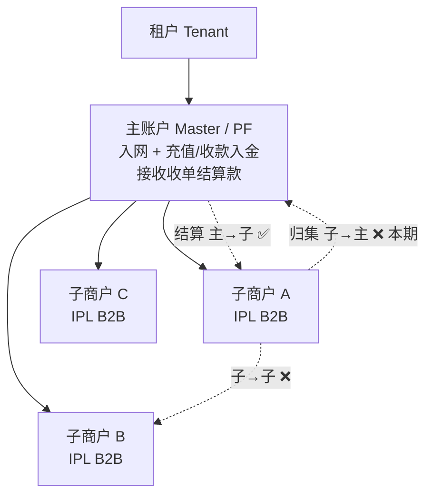
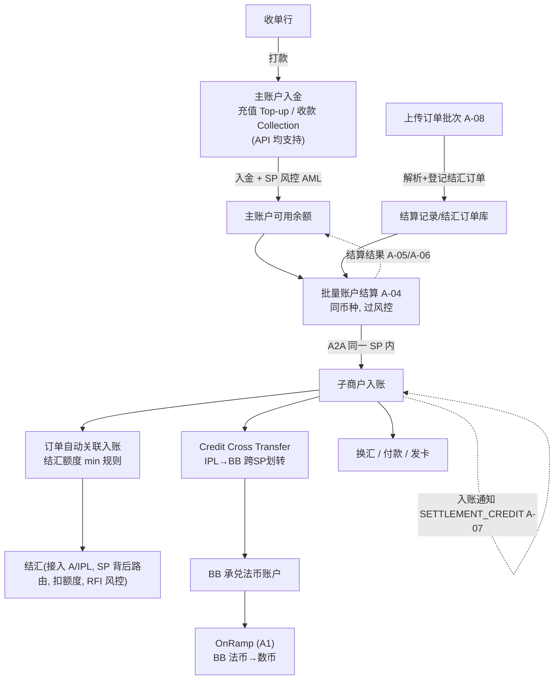
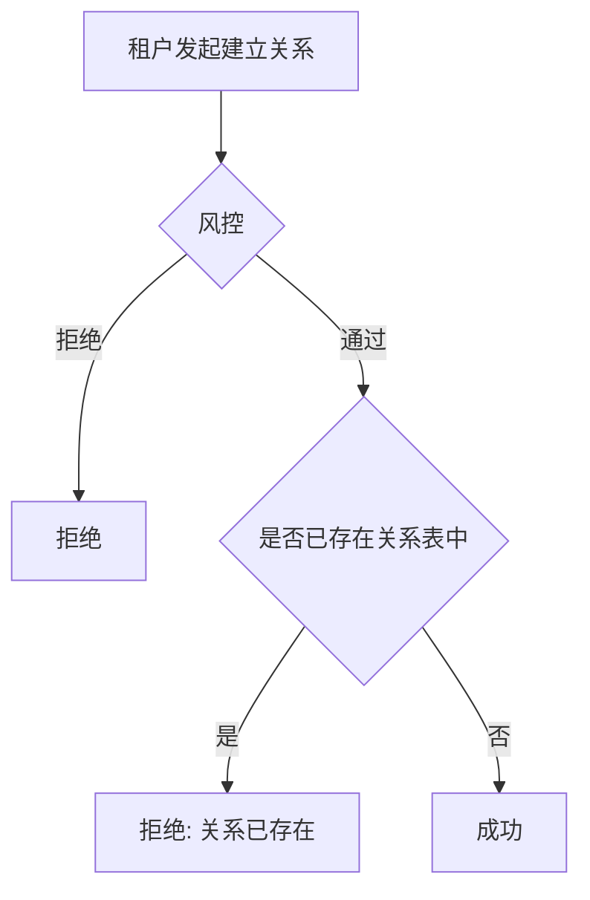
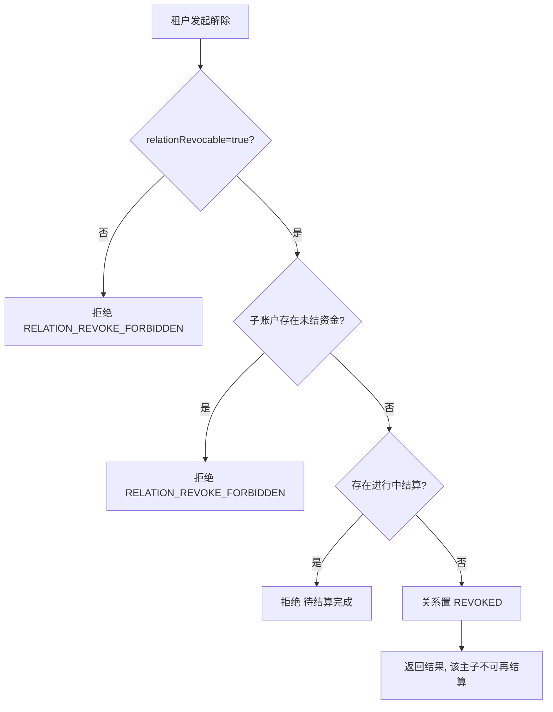
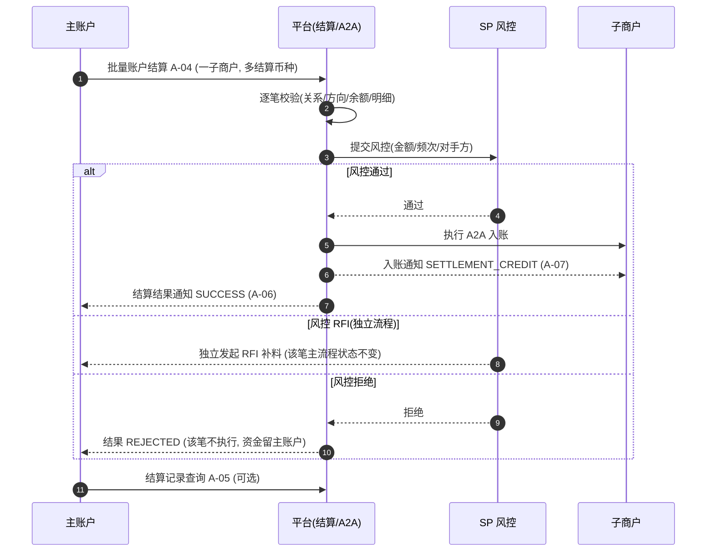
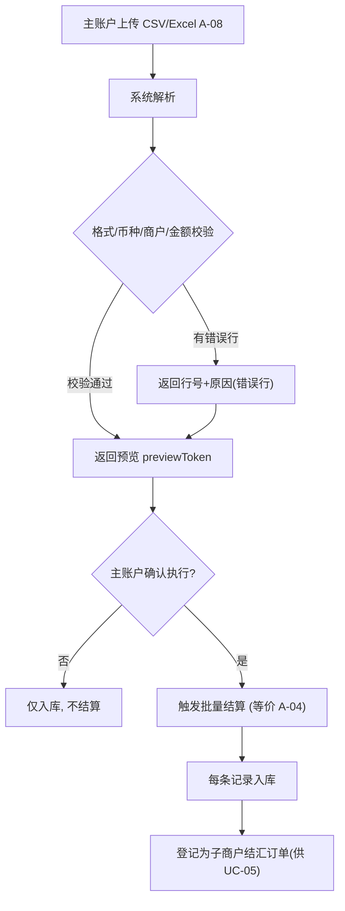
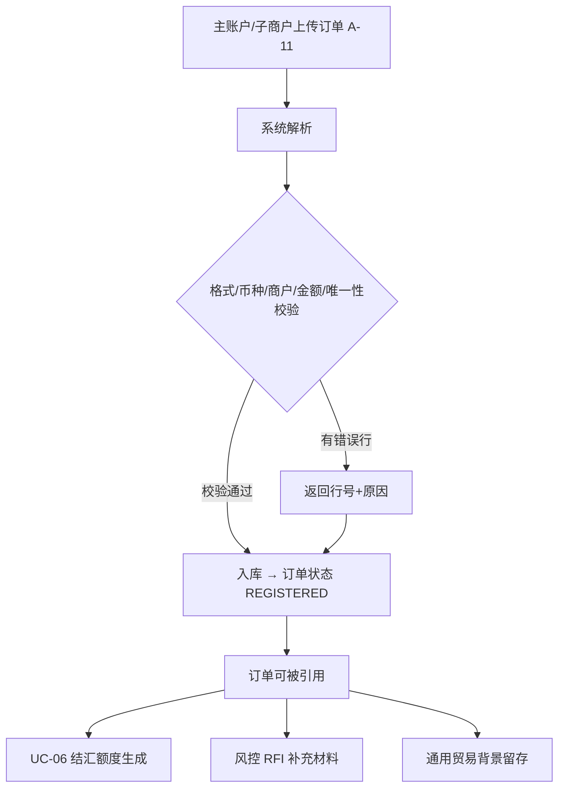
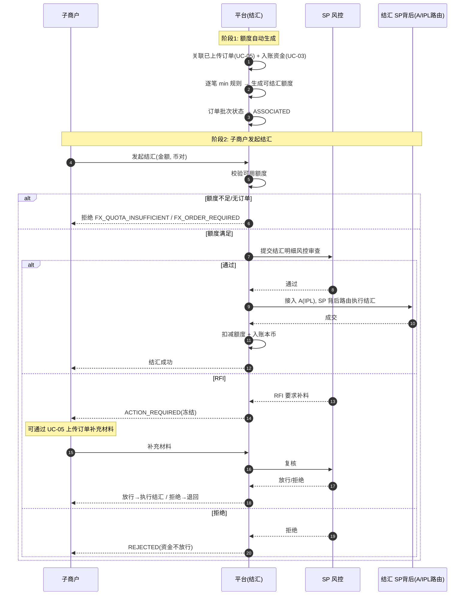
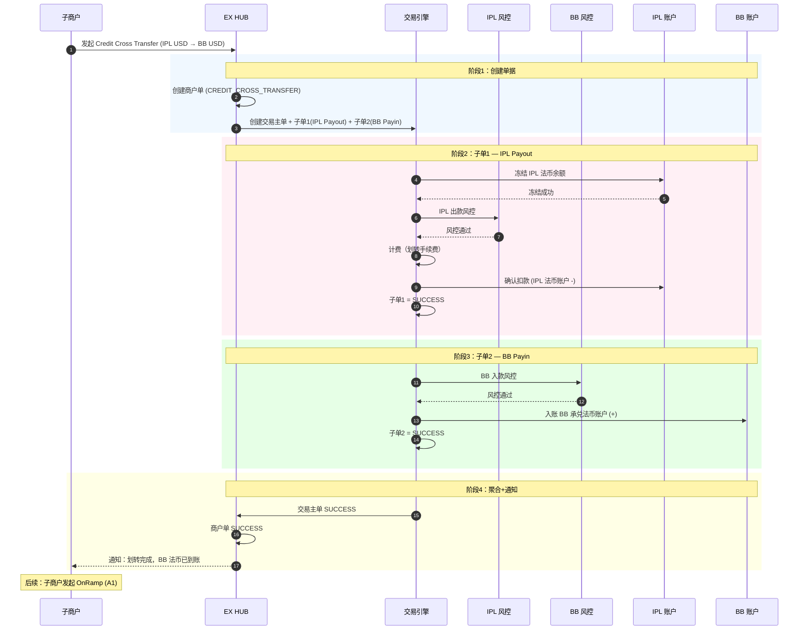
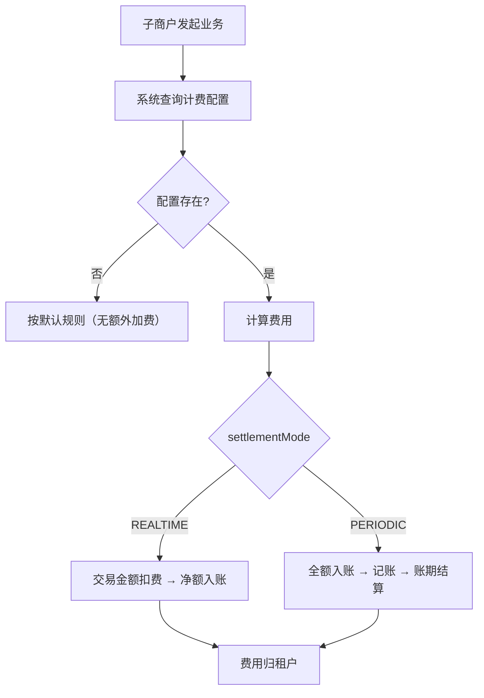

# 收单结算方案 — 产品需求文档（PRD）

> **产品名称**：收单结算（Acquiring Settlement）｜**版本**：v2.0｜**更新**：2026-06-02
> **API 平台**：[EurewaX 开放平台](https://open.eurewax.com/)｜**首个落地租户**：Winningbees（WB），见 §四
> **参考文档**：MCT-ex-change-analysis.md / acquiring-pf-settlement-solution.md / Winingbees-API-solutions.md / onramp-v1 copy.md §5.3 场景 A2

---

## 一、业务背景

### 1.1 行业背景

收单（Acquiring）是指收单机构（收单行 / Acquirer）为商户处理银行卡或其他支付方式的交易受理与资金清算。跨境与平台化场景中常见分层结构：

- **收单行**：完成持卡人交易清算，按周期（T+1 / T+3）将应结资金打包打款给收单平台（PF）。
- **收单平台（PF / 主体）**：以自身名义统一接收汇总结算款，再按子商户应结明细分发。
- **实际经营商户（子商户）**：收到结算款后进行换汇、结汇、付款、买入卖出数币、发卡等资金运用。

### 1.2 问题与机会

平台已具备账户产品（含充值/收款入金）、换汇/结汇、买入卖出数币、发卡等单账户能力，及同一 SP 内 A2A 交易能力；但**缺少面向 PF/MOR 的"主→子"结算分发产品**：

- PF 一般持牌（具体看 SP 支持的能力，有些 SP 支持，有些 SP 不支持）
- MOR = 大商户（Merchant of Record）；子商户 = 大商户的供应商（本期）

| 缺口 | 现状 | 影响 |
|------|------|------|
| 主子账户关系 | 无绑定关系登记 | 无法限定"只能主发给自己的子" |
| 账户结算产品 | 仅裸 A2A（同 SP 内），无产品级限制 | 无法满足合规与对账要求 |
| 结算明细随款下发 | 转账不带业务明细 | 子商户无法获知结算来源 |
| 结算记录批量导入 | 仅逐笔录入 | 大批量运营成本高 |
| 结汇额度关联 | 手工逐笔关联 | B2B 结汇效率低 |
| SP 风控贯穿 | 部分节点未接入 | 多 SP 资金流转合规风险 |

**机会**：在 A2A 与单账户能力之上封装标准化"收单结算"产品族，可被多租户复用。

### 1.3 方案概述

在 **主子账户关系（底座）** 之上新建 **账户结算产品**（主→子，底层同 SP 内 A2A），叠加产品级限制（主子校验、先收后结、强制明细、强制 SP 风控）；增强 B2B 结汇（上传订单自动关联入账、min 规则生成额度）；新增 **Credit Cross Transfer**（跨 SP 划转，IPL→BB，支持子商户买入数币前置）。资金归集（子→主）本期不做、预留。

### 1.4 目标与非目标

**目标（本期）**
- 主子账户关系底座（建立/查询/解除）
- 账户结算产品：批量结算（一子商户一批次，可多结算币种）、订单上传、明细随款下发、结果通知
- B2B 结汇增强：上传订单→自动关联→min 规则额度
- 关键节点 SP 风控
- 结汇通道路由在 SP 背后（先接入 IPL）
- Credit Cross Transfer（IPL→BB 跨 SP 划转，支持 OnRamp 前置）

**非目标**
- 资金归集产品（子→主），仅预留
- 子商户 B2C 账户类型（一期仅 B2B）
- 结汇 SP 入驻平台的平台化能力

### 1.5 产品架构：1 底座 + 2 产品

```
            ┌──────────────────────────────┐
            │   主子账户关系（底座 / 能力）   │
            │   登记 主MID ↔ 子MID 绑定关系   │
            └───────────────┬──────────────┘
              ┌─────────────┴─────────────┐
              ▼                           ▼
    ┌──────────────────┐        ┌──────────────────┐
    │  账户结算产品      │        │  资金归集产品      │
    │  方向：主 → 子     │        │  方向：子 → 主     │
    │  底层交易：A2A（同一 SP 内） │        │  底层交易：A2A（同一 SP 内） │
    │  本期落地 ✅       │        │  后续扩展 ⏳       │
    └──────────────────┘        └──────────────────┘
```

### 1.6 角色与账户结构



> 资金流向：主→子 ✅ | 子→主 ❌（本期） | 子→子 ❌。一个子商户可关联多个主账户（一子多主），结算时按"发起主账户 ↔ 该子账户"逐一校验。

| 角色 | 职责 |
|------|------|
| 租户 | 账户体系与产品配置归属方；按租户开通产品与配置 |
| 主账户 | 通过充值/收款入金接收收单结算款；发起"主→子"账户结算 |
| 子商户 | 接收结算款；进行结汇/换汇/付款/买入卖出数币/发卡等资金运用 |

### 1.7 产品清单

| 编号 | 名称 | 类型 | 产品代码 | 本期 | 说明 |
|------|------|------|----------|------|------|
| P-0 | 主子账户关系 | 底座能力 | — | ✅ | 登记主子绑定，结算/归集前置 |
| P-1 | 账户结算产品 | 售卖产品 | `ACCOUNT_SETTLEMENT` | ✅ | 主→子定向结算，底层同 SP A2A |
| P-2 | 资金归集产品 | 售卖产品 | `FUND_POOLING` | ❌ 后续 | 子→主，本期预留 |

**复用/增强的已有产品**

| 名称 | 状态 | 用途 |
|------|------|------|
| 充值（Top-up） | 复用 | 主账户入金方式之一 |
| 收款（Collection） | 复用（API 可用） | 主账户入金方式之一（与充值并行） |
| 付款（`FIAT_PAYOUT`） | ⏳ 未上 EX | 子商户提现待上线 |
| 换汇/结汇（FX） | **增强** | B2B 结汇新增上传订单+额度自动关联（UC-05） |
| 买入/卖出数币 | 复用 | 子商户法币↔数币 |
| 跨SP划转（Credit Cross Transfer） | **新增** | IPL→BB 法币划转，买入数币前置（UC-07.2） |
| 发卡（VCC） | 复用 | 子商户发卡 |

### 1.8 产品属性与配置

#### 1.8.1 SP 能力定义（SA 上架时配置）

| 字段 | 类型 | 说明 | 示例值 |
|------|------|------|--------|
| 产品代码 | 固定 | 唯一标识 | `ACCOUNT_SETTLEMENT` |
| 支持的结算币种 | 多选 | 默认取 SP 账户币种范围 | 默认值：SP 的账户币种限制 |
| 结算目标定位 | 多选 | 支持的目标定位方式 | VA / MERCHANT_ID |
| 明细订单币种 | 范围 | 明细中订单可用的原币范围 | 支持全部币种（默认反选制裁币种） |
| 明细折算汇率 | 固定 | 汇率来源 | SP 系统默认汇率（仅展示参考） |

*限额（SP 上限）*

| 字段 | 示例值 |
|------|--------|
| 单笔结算最小/最大 | 1 / 1,000,000 USD |
| 单批笔数上限 | 5,000 |
| 单日/单月结算上限 | 10,000,000 / 100,000,000 USD |

> **系统默认规则（无需配置）**：① 一个批次仅同一子商户；② 批次内各笔可不同结算币种；③ 结算资金币种 = 子商户到账币种。

#### 1.8.2 TP 产品配置（TP 在 SP 能力内收窄）

| 字段 | 说明 | 默认值 |
|------|------|--------|
| 允许的结算币种 | TP 允许商户结算的币种 | 所有账户币种（新增自动包含） |
| 限额（≤ SP 值） | 单笔/单批/单日/单月 | 同 SP 上限 |

#### 1.8.3 下期：主商户自助配置

> 本期 TP 代配商户级；下期开放主账户在自助层调整运营偏好，取值范围 ⊆ TP ⊆ SP。

---

## 二、名词解释

| 名词 | 英文/代码 | 解释 |
|------|-----------|------|
| 租户 | Tenant | 在 EX 平台拥有独立账户体系与产品配置的接入方 |
| 收单行 | Acquirer | 完成持卡人交易清算，按周期打款给 PF 的机构 |
| 收单平台 | Payment Facilitator, PF | 统一接收收单结算款再分发给子商户的主体（= 主账户） |
| 收单大商户 | MOR: Merchant of Record | 收单责任商户；MOR 场景下子商户 = 大商户的供应商 |
| 主账户 | Master Account | 接收收单结算款、发起"主→子"结算分发的账户 |
| 子商户 | Sub-merchant / Sub Account | 接收结算分发的实际经营商户（本期 IPL B2B） |
| 主子账户关系 | Master-Sub Relation | 主 MID ↔ 子 MID 绑定关系的底座能力（非售卖产品） |
| 充值 | Fiat Deposit | 主账户入金方式之一 |
| 收款 | Collection | 法币收款能力（API 可用），主账户入金方式之一 |
| 账户结算产品 | Account Settlement (`ACCOUNT_SETTLEMENT`) | A2A 之上叠加主子校验+仅主→子+明细+风控的产品 |
| 结算批次 | Settlement Batch | 资金结算的批次（UC-03），一子商户一批次 |
| 商户单 | Member Biz Order | 账户结算的商户单，与结算批次对应 |
| 交易单 | Transaction | SP 内部的资金交易单（底层 A2A） |
| 账户间转账 | Credit Account Transfer | 同 SP 内账户转账 |
| 订单批次 | Contract Order Batch | 订单明细的批次（UC-04），一子商户+一结算币种 |
| 订单明细 | Contract Orders | 消费者下单的原始订单记录 |
| 结汇 | CNY Payouts | 外币兑换为本币并入账；B2B 需贸易订单背景 |
| 结汇额度 | CNY Quota | 基于"结算到账 × 关联订单"产生的可结汇金额 |
| SP | Service Provider | 提供收付款/结汇/数币等能力的服务商 |
| SP 风控 | SP Risk Control | 关键节点的合规/AML 审查（通过/RFI/拒绝） |
| RFI | Request for Information | 风控要求补充材料，冻结→补料→放行或拒绝 |
| 买入/卖出数币 | Buy/Sell Crypto (OnRamp/OffRamp) | 法币↔数币兑换 |
| 跨SP划转 | Credit Cross Transfer | 跨 SP 法币账户划转（IPL→BB） |

---

## 三、端到端业务流程

### 3.1 端到端流程图



### 3.2 三层订单模型（商户单/交易单/渠道单）

> 统一收单结算的单据视图。本模型适用于账户结算（含正向与反向）；入账（UC-02 充值/收款）由账户产品处理，不在此模型内。

| 层级 | 归属/可见 | 说明 |
|------|-----------|------|
| **商户单** Member Biz Order | 商户/租户视角，**对外** | 一次批量结算 = 1 商户单（含 N 笔明细） |
| **交易单** Transaction Order | **SP 内部** | 每笔明细的 A2A 资金交易单；1 商户单 : N 交易单 |
| **渠道单** Channel Order | 外部渠道 | A2A 为平台内部划转，**无渠道单** |

```
正向（结算）：商户单(A-04) → N × 交易单(A2A) → 子商户入账(A-07)
反向（回退）：反向商户单 → N × 反向交易单(反向A2A) → 子账户退回主账户
```

### 3.3 结算批次与订单批次数据模型

#### 3.3.1 结算批次（Settlement Batch / 资金层，UC-03）

> **一个子商户一个批次，可多个结算币种。**

```
结算批次 (Settlement Batch / 商户单)
  ├─ batchNo         批次号（幂等键）
  ├─ masterMid       发起主账户
  ├─ subMid          目标子商户（一个批次 = 一个子商户）
  ├─ targetType      VA / MERCHANT_ID
  └─ N × 结算笔 (Settlement Item / 交易单)
       ├─ referenceNo       单笔参考号
       ├─ currency          结算币种（每笔可不同）
       ├─ amount            结算金额 = Σ 关联订单 settledAmount
       └─ 关联订单批次中对应币种的明细
```

| 维度 | 规则 |
|------|------|
| 批次粒度 | 一个子商户 = 一个结算批次 |
| 结算币种 | 批次内各笔可不同（multi-currency） |
| A2A 执行 | 每笔 = 1 次 A2A（以该笔 currency 执行） |
| 余额校验 | 按各币种分别校验主账户余额 |

#### 3.3.2 订单批次（Contract Order Batch / 凭证层，UC-05）

> **一个子商户 + 一个结算币种 = 一个订单批次。订单上传为独立 UC（UC-05），不从属于结汇流程。**

```
订单批次 (Contract Order Batch)
  ├─ orderBatchId        订单批次号（幂等键）
  ├─ masterMid           上传主账户（可选）
  ├─ subMid              子商户
  ├─ settlementCurrency  结算币种（同一批次统一）
  ├─ uploadSource        MASTER / SUB / RFI
  ├─ status              REGISTERED / ASSOCIATED / CANCELLED
  └─ M × 订单明细 (Contract Order)
       ├─ orderNo / orderCurrency / orderAmount    订单原币
       ├─ settlementCurrency / exchangeRate         折算（SP 默认，仅参考）
       └─ settledAmount = orderAmount × exchangeRate
```

#### 3.3.3 两种批次关系示例

```
结算批次 BATCH-001 (subMid=SUB_1024)
  结算笔 1: USD 100 → 关联订单批次 OB-001 (settlementCcy=USD, Σ settledAmt=100)
  结算笔 2: EUR 80  → 关联订单批次 OB-002 (settlementCcy=EUR, Σ settledAmt=80)

约束：结算笔金额 = Σ 关联订单 settledAmount；不一致则拒绝
```

### 3.4 状态机

#### 3.4.1 批次状态机（商户单维度）

```
CREATED ──(提交)──▶ PROCESSING ──(所有明细终态)──▶ COMPLETED
                                                   ├─ result: ALL_SUCCESS
                                                   ├─ result: PARTIAL
                                                   └─ result: ALL_FAILED
CREATED ──(批次级校验失败)──▶ REJECTED
```

| 状态 | 说明 | 终态 |
|------|------|------|
| CREATED | 已提交，待校验 | 否 |
| PROCESSING | 至少一笔在执行中 | 否 |
| COMPLETED | 所有明细到达终态，通过 result 区分 | ✅ |
| REJECTED | 批次级校验失败 | ✅ |

#### 3.4.2 明细状态机（交易单维度）

```
CREATED → VALIDATING ─┬─(通过)──▶ PROCESSING ─┬─▶ SUCCESS (A2A 成功)
                      │                        └─▶ FAILED  (A2A 失败)
                      └─(失败/拒绝)──▶ REJECTED
```

#### 3.4.3 RFI（风控独立子流程，与主流程解耦）

> RFI 由风控独立发起，**不改变明细主流程状态**；仅在放行/拒绝时回写结果。

```
风控命中 → RFI_PENDING →(补料)→ RFI_REVIEW →┬─ 放行 → 明细继续 PROCESSING
                                              └─ 拒绝 → 明细 REJECTED
```

#### 3.4.4 Credit Cross Transfer 状态机（商户单）

```
CREATED ──▶ PROCESSING ──┬──▶ SUCCESS  (划转完成，BB 已到账)
                         ├──▶ FAILED   (子单失败/回滚完成)
                         └──▶ REJECTED (风控拒绝)
```

### 3.5 SP 风控接入

收单结算涉及多 SP 资金流转，以下节点强制接入风控：

| # | 业务环节 | 风控场景 | 触发条件 |
|---|----------|----------|----------|
| 1 | 主账户入金（充值/收款） | AML | 每笔入账 |
| 2 | 主→子结算分发 | 金额/频次/对手方 | 每笔结算 |
| 3 | 子商户添加收款人 | 收款人合规 | 每次新增 |
| 4 | 子商户付款/结汇 | 金额/频次/目标合规 | 每笔付款 |
| 5 | 子商户添加数币地址 | 地址黑名单/链上风险 | 每次新增 |
| 6 | 子商户卖出数币 | 金额/频次/目标风险 | 每笔交易 |

**风控处理模式**：通过→正常执行 | **RFI→独立子流程**（补料→复核→放行/拒绝，不改变主流程状态） | 拒绝→入金场景资金回退，结算场景该笔不执行

> ⚠️ **结汇明细 RFI 流程待和风控确认**：触发规则、材料清单、审核时效与放行口径需与风控团队对齐。

### 3.6 非功能需求

| # | 项 | 要求 |
|---|---|------|
| 1 | 幂等性 | 同 requestId / referenceNo / batchNo 重复提交不重复执行 |
| 2 | 批量性能 | 单批 N 笔在约定时延内完成（指标待定） |
| 3 | 对账一致性 | 结算记录、子账户入账、SP 流水三方对平 |
| 4 | Webhook 可靠性 | 失败指数退避重试，事件可去重 |
| 5 | 安全 | 全链路 HTTPS + 签名；密钥不落明文 |
| 6 | 可观测 | 全链路 traceId；关键节点埋点与告警 |

### 3.7 API 通用约定

| 项 | 约定 |
|----|------|
| Base URL | `https://open.eurewax.com` |
| 协议 | HTTPS，`Content-Type: application/json;charset=utf-8` |
| 鉴权 | API Key + HMAC-SHA256 签名（X-Api-Key / X-Timestamp / X-Nonce / X-Sign） |
| 幂等 | 写接口必带 requestId 或 referenceNo/batchNo |
| 分页 | pageNo（从 1）、pageSize（默认 20，最大 100） |
| 金额 | 字符串小数最多 2 位；币种 ISO 4217 |
| 时间 | ISO 8601 UTC |

**统一响应**：`{ "code": "SUCCESS", "message": "ok", "traceId": "...", "data": {} }`

**API 接口清单**

| 编号 | 接口 | 方法 | 路径 | 归属 UC |
|------|------|------|------|---------|
| A-01 | 建立主子关系 | POST | `/v1/relations` | UC-01 |
| A-02 | 查询主子关系 | GET | `/v1/relations` | UC-01 |
| A-03 | 解除主子关系 | DELETE | `/v1/relations/{relationId}` | UC-01 |
| A-04 | 批量账户结算 | POST | `/v1/settlements/batch` | UC-03 |
| A-05 | 结算记录查询 | GET | `/v1/settlements` | UC-03 |
| A-06 | 结算结果通知 | Webhook | 租户回调地址 | UC-03 |
| A-07 | 子商户入账通知 | Webhook | 租户回调地址 | UC-03 |
| A-08 | 上传结算记录 | POST | `/v1/settlements/records:upload` | UC-04 |
| A-09 | 结汇通道路由配置 | POST/GET | `/v1/fx/channel-routes` | UC-06 |
| A-10 | 查询结汇额度 | GET | `/v1/fx/quota` | UC-06 |
| A-11 | 上传订单批次 | POST | `/v1/orders/batch:upload` | UC-05 |

---

## 四、落地租户案例：Winningbees

| 通用角色 | WB 案例主体 |
|----------|-------------|
| 租户 | **WB（Winningbees）** |
| 主账户 | **bonbillhk**（经充值或收款入金接收收单结算款） |
| 子商户 | **WB 旗下收单商户**（IPL B2B 账户） |

**WB 落地要点**

- **复用现状**：WB 已对接 EX 的发卡/买入卖出数币/账户产品，复用现有 MID 与密钥。
- **入金方式**：充值（Top-up）或收款（Collection）均支持；具体方式待与 WB 确认。
- **结算机制**：账户结算产品（底层同 SP A2A），非 MCT"结算代发"。
- **账户类型**：子商户走 IPL B2B，B2B 结汇需贸易订单背景。
- **结汇通道**：统一先接入 IPL，路由在 SP 背后。

**与 MCT 复用关系**

| 能力 | 性质 | WB 是否复用 |
|------|------|-------------|
| 主子账户关系 | 通用底座 | ✅ |
| 结算明细/Webhook | 通用 | ✅ |
| SP 风控框架 | 通用 | ✅ |
| 账户结算产品 | 通用 | ✅（MCT 用结算代发，WB 用账户结算） |
| B2B 账户校验 | 通用 | ✅ |
| 结汇通道路由 | 通用配置 | ✅ |

---

## 五、拆分 Use Cases

> 用例总览：

| 用例 | 名称 | 主要角色 | 优先级 |
|------|------|----------|--------|
| UC-01 | 建立主子账户关系 | 租户/主账户 | P0 |
| UC-02 | 收单结算款入账（充值/收款） | 收单行/主账户 | P0 |
| UC-03 | 账户结算分发（主→子，批量） | 主账户 | P0 |
| UC-04 | 上传结算记录与明细管理 | 主账户 | P0 |
| UC-05 | 上传订单（批次+明细） | 主账户/子商户 | P0 |
| UC-06 | 结汇（含结汇额度生成） | 子商户/系统 | P0 |
| UC-07 | 子商户资金运用（换汇/付款/买入卖出数币/发卡/跨SP划转） | 子商户 | P0 |
| UC-08 | 计费与汇率 | 租户/系统 | P1 |

---

### UC-01 建立主子账户关系

**目标**：将主账户与子商户绑定，使主账户具备向该子商户结算分发的资格。

**前置条件**
- 租户已在 EX 入网，且已开通 `ACCOUNT_SETTLEMENT` 产品。
- 主账户完成 KYC 并通过，子账户已注册。

#### 正向流程 — 建立关系

1. 主账户（或租户管理员）调用 **A-01 建立关系** 提交 `masterMid` + `subMid`。
2. 系统校验：两账户存在、同租户、子账户为 B2B（本期）、关系未重复。
3. 过**风控**。
4. 校验通过 → 写入关系表，状态 `ACTIVE`，返回 `relationId`。
5. 调用 **A-02 查询关系** 确认绑定结果。



#### 反向流程 — 解除关系

1. 租户或主商户调用 **A-03 解除关系**。
2. 系统校验：`relationRevocable=true`、子账户无未结资金、无进行中结算批次。
3. 任一不满足 → 拒绝 `RELATION_REVOKE_FORBIDDEN`。
4. 通过 → 关系置 `REVOKED`，该主子不可再结算。



**业务规则**

| 规则 | 说明 |
|------|------|
| 一主多子/一子多主 | M:N 关系 |
| 同对唯一 | 同一 masterMid-subMid 不可重复绑定 |
| 子账户类型 | 本期仅 B2B（IPL），后续可配 B2C |
| 幂等 | 已存在返回 `RELATION_ALREADY_EXISTS` |
| 解除前置 | revocable=true、无未结资金、无进行中结算 |
| 解除后恢复 | 需重新建立关系 |

**验收标准**

| # | 场景 | 预期 |
|---|------|------|
| 1 | 正常建立关系 | 返回 relationId，状态 ACTIVE |
| 2 | 重复建立 | 幂等返回，不重复 |
| 3 | 查询主账户下子账户 | 返回完整列表 |
| 4 | 查询子账户关联主账户 | 一子多主时返回全部 |
| 5 | 子账户非 B2B | 拦截 SUB_ACCOUNT_TYPE_INVALID |
| 6 | 解除被禁止的关系 | 拦截并提示原因 |
| 7 | 解除后再结算 | 被拦截（关系不存在） |

**API 接口**

**A-01 建立主子关系 — `POST /v1/relations`**

| 字段 | 类型 | 必填 | 说明 |
|------|------|------|------|
| `requestId` | string | 是 | 幂等键 |
| `masterMid` | string | 是 | 主账户商户号 |
| `subMid` | string | 是 | 子商户商户号 |
| `remark` | string | 否 | 备注 |

请求示例：`{ "requestId": "req-20260530-001", "masterMid": "M_BONBILLHK", "subMid": "SUB_1024", "remark": "收单商户A" }`

响应 data：`relationId`(string)、`status`(ACTIVE)、`createdAt`

错误码：`RELATION_ALREADY_EXISTS`、`SUB_ACCOUNT_TYPE_INVALID`、`ACCOUNT_NOT_FOUND`、`TENANT_MISMATCH`

**A-02 查询主子关系 — `GET /v1/relations`**

| 字段 | 类型 | 必填 | 说明 |
|------|------|------|------|
| `masterMid` | string | 二选一 | 按主账户查全部子账户 |
| `subMid` | string | 二选一 | 按子账户查全部主账户 |
| `pageNo`/`pageSize` | int | 否 | 分页 |

响应 data：`total`、`list[].relationId`、`list[].masterMid`、`list[].subMid`、`list[].status`(ACTIVE/REVOKED)

**A-03 解除主子关系 — `DELETE /v1/relations/{relationId}`**

| 字段 | 类型 | 必填 | 说明 |
|------|------|------|------|
| `relationId` | string (path) | 是 | 关系 ID |
| `requestId` | string | 是 | 幂等键 |

响应 data：`{ "relationId": "...", "status": "REVOKED" }`

错误码：`RELATION_NOT_FOUND`、`RELATION_REVOKE_FORBIDDEN`

---

### UC-02 收单结算款入账（充值/收款）

**目标**：主账户接收收单行结算款，通过充值（Top-up）或收款（Collection）入金至主账户余额。

**前置条件**
- 主账户已入网并开通充值或收款产品。

#### 正向流程

- 使用现有充值/收款流程。API 两种均支持。
- 入金到账后触发 SP 风控（AML）。

> 充值与收款入金统一在**法币账户入账/交易查询**下查询（API 无专门充值查询）。

#### 反向流程 — 资金回退

- 使用现有资金回退流程（风控拒绝→原路退回）。

**业务规则**

| 规则 | 说明 |
|------|------|
| 入金方式 | 充值或收款，API 均支持 |
| 风控 | 每笔入账过 SP 风控 AML |
| 回退 | 风控拒绝→资金原路退回 |

**验收标准**

| # | 场景 | 预期 |
|---|------|------|
| 1 | 充值入金 | 主账户余额增加 |
| 2 | 收款入金 | 主账户余额增加 |
| 3 | 风控拒绝 | 资金回退 |

> ⚠️ **待确认**：充值/收款两种入金的资金认领与对账口径待与账户产品/收款团队确认。

**API 接口**：复用现有充值/收款 API，不在本方案新增。

---

### UC-03 账户结算分发（主→子，批量）

**目标**：主账户将已到账的收单结算款，按子商户应结明细分发到各子商户账户。

**前置条件**
- 主子关系已建立（UC-01）。
- 主账户对应币种可用余额充足。

#### 正向流程

1. 主账户发起 **A-04 批量账户结算**：一个子商户一个批次，可含多个结算币种，每笔关联订单明细。
2. 系统逐笔校验（见下方校验流程）。
3. 过 **SP 风控**（金额/频次/对手方）。
4. 通过 → 执行底层 A2A → 子商户入账。
5. 子商户收到 **A-07 入账通知**（`SETTLEMENT_CREDIT`，含来源+明细）。
6. 主账户通过 **A-06 结算结果通知** 或 **A-05 查询** 获取逐笔结果。



**单笔校验流程**

```
主账户发起结算（批次内逐笔校验）
  ├─ 1. 发起方=主账户？                否→拒绝 INITIATOR_NOT_MASTER
  ├─ 2. 批次仅含一个子商户(subMid)？   否→拒绝 BATCH_MULTI_SUB_INVALID
  ├─ 3. 接收方为其子账户？(查关系)     否→拒绝 RELATION_NOT_FOUND
  ├─ 4. 方向=主→子？                  否→拒绝 DIRECTION_INVALID
  ├─ 5. 主账户各币种余额充足           否→拒绝 INSUFFICIENT_BALANCE
  ├─ 6. 结算明细完整？                 否→拒绝 SETTLEMENT_DETAIL_MISSING
  ├─ 7. 金额一致(amount=Σ明细)?       否→拒绝 AMOUNT_MISMATCH
  ├─ 8. 过 SP 风控                     RFI→冻结+补料 / 拒绝→该笔不执行
  └─ 通过→执行 A2A → 子账户入账 → Webhook 通知
```

#### 反向流程 — 结算回退/退款

```
反向商户单（需满足回退规则）
  └─ 关联原交易单 → N × 反向交易单（反向 A2A）
                      └─ 资金从子账户退回主账户
```

> 反向流程受「子账户资金归商户自管」约束，仅在差错冲正/约定退款等场景按规则发起。

**异常处理**

| 异常 | 处理 |
|------|------|
| 部分明细失败 | 批次返回逐笔结果，失败项不影响成功项 |
| 重复 referenceNo | 幂等，不重复结算 |
| 命中 RFI | 独立流程（不改变主流程状态） |
| 风控拒绝 | 该笔不执行，资金留主账户 |

**targetType 与 VA 自动开户规则**

| targetType | 行为 | VA 自动开户 |
|------------|------|-------------|
| `VA` | 通过子商户 VA 转入 | ✅ 若子商户尚未开通 VA，系统走**现有 VA 自动开户流程**（创建 VA → 绑定子商户 → 入账） |
| `MERCHANT_ID` | 直接按子商户 MID 转入 | ❌ 不需要 VA，资金直接入账到 MID 对应的法币账户 |

> **设计说明**：VA 模式复用平台已有的"收款入金自动开 VA"能力，结算引擎只需传入 subVa（或由系统基于 subMid 自动解析已有 VA / 触发新开）。MID 模式更轻量，直接走 A2A 到账户，无需 VA 中间层。

**业务规则**

| 规则 | 说明 |
|------|------|
| 必须存在主子关系 | 否则拦截 |
| 发起方=主账户 | 子账户无权发起 |
| 方向仅主→子 | 子→主/子→子均拦截 |
| 先收后结 | 余额不足拦截，禁止垫资 |
| 一子商户一批次 | 批次内各笔可不同结算币种 |
| 强制结算明细 | 缺 settlementDetails 拦截 |
| 强制 SP 风控 | 每笔过风控；RFI 独立流程 |
| 子账户资金归商户自管 | 到账后主账户不可随意扣回 |
| targetType=VA 自动开 VA | 子商户无 VA 时走现有自动开户流程 |
| targetType=MID 无需 VA | 直接按 MID 入账，不触发 VA 开户 |
| 本期不收费 | feeMode=NONE |

**验收标准**

| # | 场景 | 预期 |
|---|------|------|
| 1 | 批量结算全部成功 | 各子账户余额正确增加 |
| 2 | 部分失败 | 返回逐笔结果，成功项正常入账 |
| 3 | 余额不足 | 整批/该笔被拦截 |
| 4 | 子→主 / 子→子 | 被拦截（方向非法） |
| 5 | 无主子关系 | 被拦截 |
| 6 | 缺结算明细 | 被拦截 |
| 7 | 金额≠Σ明细 | 被拦截（AMOUNT_MISMATCH） |
| 8 | 重复 referenceNo | 幂等 |
| 9 | 命中风控 | 进入 RFI/拒绝 |
| 10 | 结算回退/退款 | 资金从子账户退回主账户 |
| 11 | targetType=VA，子商户无 VA | 自动开 VA 后入账成功 |
| 12 | targetType=MID | 直接入账，不触发 VA 开户 |

**API 接口**

**A-04 批量账户结算 — `POST /v1/settlements/batch`**

> 一个批次 = 一个子商户；批次内各笔可不同结算币种。

请求参数：

| 字段 | 类型 | 必填 | 说明 |
|------|------|------|------|
| `batchNo` | string | 是 | 批次号，幂等键 |
| `masterMid` | string | 是 | 发起主账户 |
| `subMid` | string | 目标为 MID 时必填 | 目标子商户号 |
| `subVa` | string | 目标为 VA 时必填 | 目标子商户 VA |
| `targetType` | string | 是 | VA / MERCHANT_ID |
| `items` | array | 是 | 结算笔数组（≥1） |
| `items[].referenceNo` | string | 是 | 单笔幂等参考号 |
| `items[].currency` | string | 是 | 该笔结算币种 |
| `items[].amount` | string | 是 | 结算金额 |
| `items[].settlementDetails` | object | 是 | 结算明细 |

`settlementDetails` 结构：

| 字段 | 类型 | 必填 | 说明 |
|------|------|------|------|
| `settlementPeriod` | string | 是 | 结算周期 |
| `totalTransactions` | int | 是 | 订单总笔数 |
| `grossAmount` | string | 是 | 毛额 |
| `totalFee` | string | 是 | 手续费 |
| `netAmount` | string | 是 | 净额（应=item.amount） |
| `orders` | array | 是 | 订单明细（≥1） |
| `orders[].orderNo` | string | 是 | 订单号 |
| `orders[].orderCurrency` | string | 是 | 订单原币 |
| `orders[].orderAmount` | string | 是 | 原币金额 |
| `orders[].settlementCurrency` | string | 是 | 结算币种 |
| `orders[].exchangeRate` | string | 是 | 折算汇率（SP 默认） |
| `orders[].settledAmount` | string | 是 | 折算后金额 |
| `detailFileUrl` | string | 否 | 大批量时可用文件替代 |

> **校验**：`item.amount` = `netAmount` = Σ `orders[].settledAmount`

请求示例：

```json
{
  "batchNo": "BATCH-20260601-001",
  "masterMid": "M_BONBILLHK",
  "subMid": "SUB_1024",
  "targetType": "MERCHANT_ID",
  "items": [
    {
      "referenceNo": "STL-0001",
      "currency": "USD",
      "amount": "100.00",
      "settlementDetails": {
        "settlementPeriod": "2026-05-01~2026-05-15",
        "totalTransactions": 2,
        "grossAmount": "105.00",
        "totalFee": "5.00",
        "netAmount": "100.00",
        "orders": [
          { "orderNo": "PO-7781", "orderCurrency": "EUR", "orderAmount": "45.00", "settlementCurrency": "USD", "exchangeRate": "1.11", "settledAmount": "49.95" },
          { "orderNo": "PO-7782", "orderCurrency": "USD", "orderAmount": "50.05", "settlementCurrency": "USD", "exchangeRate": "1.00", "settledAmount": "50.05" }
        ]
      }
    },
    {
      "referenceNo": "STL-0002",
      "currency": "EUR",
      "amount": "80.00",
      "settlementDetails": {
        "settlementPeriod": "2026-05-01~2026-05-15",
        "totalTransactions": 2,
        "grossAmount": "82.00",
        "totalFee": "2.00",
        "netAmount": "80.00",
        "orders": [
          { "orderNo": "PO-8801", "orderCurrency": "GBP", "orderAmount": "30.00", "settlementCurrency": "EUR", "exchangeRate": "1.163", "settledAmount": "34.89" },
          { "orderNo": "PO-8802", "orderCurrency": "EUR", "orderAmount": "45.11", "settlementCurrency": "EUR", "exchangeRate": "1.00", "settledAmount": "45.11" }
        ]
      }
    }
  ]
}
```

响应 data：

| 字段 | 类型 | 说明 |
|------|------|------|
| `batchNo` | string | 批次号 |
| `batchStatus` | string | ACCEPTED / PARTIAL / REJECTED |
| `results[].referenceNo` | string | 单笔参考号 |
| `results[].status` | string | PROCESSING / SUCCESS / FAILED / REJECTED |
| `results[].rfiStatus` | string | NONE / RFI_PENDING / RFI_REVIEW |
| `results[].reason` | string | 失败/拒绝原因 |

错误码：`BATCH_MULTI_SUB_INVALID`、`AMOUNT_MISMATCH`、`INITIATOR_NOT_MASTER`、`RELATION_NOT_FOUND`、`DIRECTION_INVALID`、`INSUFFICIENT_BALANCE`、`SETTLEMENT_DETAIL_MISSING`、`DUPLICATE_REFERENCE`

**A-05 结算记录查询 — `GET /v1/settlements`**

Query：`batchNo`、`referenceNo`、`masterMid`、`subMid`、`status`、`startTime`/`endTime`、`pageNo`/`pageSize`

响应 data：`total` + `list[]`（含 referenceNo、subMid、amount、currency、status、settlementDetails、createdAt、finishedAt）

**A-06 结算结果通知（Webhook）**

| 字段 | 说明 |
|------|------|
| `eventType` | `SETTLEMENT_RESULT` |
| `batchNo` / `referenceNo` / `subMid` | 批次/单笔/子商户 |
| `amount` / `currency` | 金额/币种 |
| `status` | PROCESSING / SUCCESS / FAILED / REJECTED |
| `rfiStatus` | NONE / RFI_PENDING / RFI_REVIEW |
| `reason` / `occurredAt` | 原因/事件时间 |

> 重试：失败指数退避，租户返回 2xx 确认；以 referenceNo + status 去重。

**A-07 子商户入账通知（Webhook）**

| 字段 | 说明 |
|------|------|
| `eventType` | `SETTLEMENT_CREDIT` |
| `subMid` / `fromMasterMid` | 入账子商户/来源主账户 |
| `amount` / `currency` | 入账金额/币种 |
| `referenceNo` | 关联结算参考号 |
| `settlementDetails` | 结算明细（同 A-04） |
| `occurredAt` | 入账时间 |

---

### UC-04 上传结算记录与明细管理

**目标**：主账户以批量文件方式提交逐子商户结算数据，替代逐笔录入；该记录同时作为 B2B 结汇的贸易订单来源。

**前置条件**
- 已开通 `ACCOUNT_SETTLEMENT`，`fileUploadEnabled=true`。

#### 正向流程

1. 主账户调用 **A-08 上传结算记录** 上传 CSV/Excel（字段：商户ID、金额、币种、参考号、订单号、订单金额、备注等）。
2. 系统解析校验（格式、币种一致、商户归属、金额合法）→ 返回解析结果与可预览批次。
3. 主账户确认后，触发结算执行（等价于 A-04 批量结算）。
4. 上传的每条记录入库，**同时登记为对应子商户的结汇订单**，供 UC-05 额度关联。



#### 反向流程

- 解析失败的行返回行号与原因，不阻塞其他行。
- 文件支持幂等（同一批次号重复上传不重复执行）。
- 已入库未执行的记录可取消（不触发结算）。

**业务规则**

| 规则 | 说明 |
|------|------|
| 结算记录=结汇订单 | 同一份数据驱动结算分发，也作为结汇贸易背景 |
| 部分行错误不阻塞 | 错误行返回行号+原因，正确行可继续 |
| 幂等 | 同批次号重复上传不重复执行 |

**验收标准**

| # | 场景 | 预期 |
|---|------|------|
| 1 | 正常上传并预览 | 解析正确，可预览后确认执行 |
| 2 | 部分行错误 | 返回行号+原因，正确行可继续 |
| 3 | 记录入库 | 每条同时生成结算明细与子商户结汇订单 |
| 4 | 重复批次 | 幂等，不重复执行 |
| 5 | 确认执行 | 触发等价 A-04 批量结算 |
| 6 | 不确认 | 仅入库，不结算 |

**API 接口**

**A-08 上传结算记录 — `POST /v1/settlements/records:upload`**

> `multipart/form-data` 上传 CSV/Excel；该记录同时作为结汇订单来源。

表单字段：

| 字段 | 类型 | 必填 | 说明 |
|------|------|------|------|
| `masterMid` | string | 是 | 主账户 |
| `batchNo` | string | 是 | 批次号，幂等键 |
| `currency` | string | 是 | 批次币种 |
| `file` | file | 是 | CSV/Excel |
| `autoExecute` | bool | 否 | 解析后是否自动执行结算（默认 false） |

文件列定义：

| 列 | 必填 | 说明 |
|----|------|------|
| `subMid` | 是 | 子商户号 |
| `amount` | 是 | 结算金额 |
| `currency` | 是 | 与批次一致 |
| `referenceNo` | 是 | 单笔参考号 |
| `orderNo` | 否 | 贸易订单号 |
| `orderAmount` | 否 | 订单明细金额（结汇 min 规则） |
| `remark` | 否 | 备注 |

响应 data：

| 字段 | 类型 | 说明 |
|------|------|------|
| `batchNo` | string | 批次号 |
| `parsedCount` | int | 解析成功行数 |
| `errorCount` | int | 错误行数 |
| `errors[].rowNo` | int | 错误行号 |
| `errors[].reason` | string | 错误原因 |
| `previewToken` | string | 预览令牌，确认执行时回传 |

---

### UC-05 上传订单（批次+明细）

**目标**：主账户或子商户以批次+明细方式上传贸易订单（Contract Orders），作为独立的凭证管理动作。上传的订单可用于：① B2B 结汇额度生成（UC-06）；② 风控 RFI 补充材料；③ 通用贸易背景留存。

> **核心定位**：上传订单是**独立 UC**，不从属于结汇流程。订单可在任何时间点上传（结算前/后、RFI 补料时、结汇前），系统入库后按需被其他流程引用。

**前置条件**
- 主子关系已建立（UC-01）。
- 子商户已在平台注册。

#### 正向流程

1. 主账户或子商户调用 **A-11 上传订单批次**，提交 CSV/Excel 或 JSON（批次+明细结构）。
2. 系统解析校验（格式、币种、商户归属、金额合法、订单号唯一）。
3. 校验通过 → 入库，生成订单批次号（`orderBatchId`）；校验失败行返回行号+原因，不阻塞正确行。
4. 入库后订单状态为 `REGISTERED`，可被 UC-06（结汇额度）、风控 RFI 等流程引用。



**订单批次数据模型**

> **一个子商户 + 一个结算币种 = 一个订单批次**（与 §3.3.2 一致）。

```
订单批次 (Contract Order Batch)
  ├─ orderBatchId        订单批次号（幂等键）
  ├─ masterMid           上传主账户（可选，子商户自行上传时为空）
  ├─ subMid              子商户
  ├─ settlementCurrency  结算币种（同一批次统一）
  ├─ uploadSource        MASTER / SUB / RFI
  ├─ status              REGISTERED / ASSOCIATED / CANCELLED
  └─ M × 订单明细 (Contract Order)
       ├─ orderNo             订单号（批次内唯一）
       ├─ orderCurrency       订单原币
       ├─ orderAmount         订单原币金额
       ├─ settlementCurrency  结算币种
       ├─ exchangeRate        折算汇率（SP 默认，仅参考）
       ├─ settledAmount       = orderAmount × exchangeRate
       └─ remark              备注
```

#### 反向流程

- **解析失败行**：返回行号与原因，不阻塞其他行。
- **幂等**：同一 `orderBatchId` 重复上传不重复入库。
- **已入库未被引用的批次可取消**：状态置 `CANCELLED`；已被结汇额度关联的不可取消。

> ⚠️ **待办**：上传订单的**风控审核流程**待定义 — 上传动作本身是否需过风控（如大额/高频/敏感国家订单触发审查）、审核规则与 RFI 衔接方式，需与风控团队对齐。

**业务规则**

| 规则 | 说明 |
|------|------|
| 独立于结汇 | 订单上传不触发结汇，仅入库登记 |
| 多触发场景 | 可在结算前/后、RFI 补料、日常维护等任意时间点上传 |
| 一子商户+一结算币种=一批次 | 与 §3.3.2 一致 |
| 幂等 | 同 orderBatchId 不重复入库 |
| 取消限制 | 已被结汇关联的批次不可取消 |
| uploadSource | MASTER（主账户代传）/ SUB（子商户自传）/ RFI（风控补料上传） |

**验收标准**

| # | 场景 | 预期 |
|---|------|------|
| 1 | 正常上传 | 入库成功，返回 orderBatchId，状态 REGISTERED |
| 2 | 部分行错误 | 返回行号+原因，正确行入库 |
| 3 | 重复 orderBatchId | 幂等，不重复入库 |
| 4 | 取消未关联批次 | 状态→CANCELLED |
| 5 | 取消已关联批次 | 被拦截 |
| 6 | RFI 场景上传 | uploadSource=RFI，正常入库 |
| 7 | 子商户自行上传 | uploadSource=SUB，正常入库 |

**API 接口**

**A-11 上传订单批次 — `POST /v1/orders/batch:upload`**

> 支持 `multipart/form-data`（CSV/Excel）或 `application/json`（结构化批次）。订单入库后可被结汇额度、风控 RFI 等流程引用。

请求参数（JSON 模式）：

| 字段 | 类型 | 必填 | 说明 |
|------|------|------|------|
| `orderBatchId` | string | 是 | 订单批次号，幂等键 |
| `masterMid` | string | 否 | 上传主账户（子商户自传时可空） |
| `subMid` | string | 是 | 子商户 |
| `settlementCurrency` | string | 是 | 结算币种（批次统一） |
| `uploadSource` | string | 是 | MASTER / SUB / RFI |
| `orders` | array | 是 | 订单明细（≥1） |
| `orders[].orderNo` | string | 是 | 订单号（批次内唯一） |
| `orders[].orderCurrency` | string | 是 | 订单原币 |
| `orders[].orderAmount` | string | 是 | 原币金额 |
| `orders[].settlementCurrency` | string | 是 | 结算币种 |
| `orders[].exchangeRate` | string | 是 | 折算汇率（SP 默认） |
| `orders[].settledAmount` | string | 是 | 折算后金额 |
| `orders[].remark` | string | 否 | 备注 |

请求参数（文件模式，multipart/form-data）：

| 字段 | 类型 | 必填 | 说明 |
|------|------|------|------|
| `orderBatchId` | string | 是 | 订单批次号，幂等键 |
| `masterMid` | string | 否 | 上传主账户 |
| `subMid` | string | 是 | 子商户 |
| `settlementCurrency` | string | 是 | 结算币种 |
| `uploadSource` | string | 是 | MASTER / SUB / RFI |
| `file` | file | 是 | CSV/Excel（列定义同 JSON orders 字段） |

响应 data：

| 字段 | 类型 | 说明 |
|------|------|------|
| `orderBatchId` | string | 批次号 |
| `status` | string | REGISTERED |
| `parsedCount` | int | 解析成功条数 |
| `errorCount` | int | 错误条数 |
| `errors[].rowNo` | int | 错误行号 |
| `errors[].reason` | string | 错误原因 |

错误码：`ORDER_BATCH_DUPLICATE`、`ORDER_NO_DUPLICATE`、`INVALID_PARAM`、`RELATION_NOT_FOUND`

---

### UC-06 结汇（含结汇额度生成）

**目标**：基于子商户的结算到账资金（UC-03）与已上传的订单（UC-05），系统自动生成结汇额度；子商户发起结汇时校验额度并执行。

**前置条件**
- 子商户已收到账户结算款（UC-03 入账）。
- 已上传对应的贸易订单（UC-05），状态 `REGISTERED`。

#### 正向流程

**阶段 1：结汇额度生成（系统自动）**

1. 系统**自动关联**已上传订单（UC-05）与子商户入账资金（UC-03 结算到账）。
2. 按**每个子商户独立**核算，生成可结汇额度：
   - 每笔额度 = **min（该笔结算到账资金, 关联订单明细 settledAmount）**
   - 可结汇总额度 = Σ（逐笔 min）
3. 关联后订单批次状态 → `ASSOCIATED`。

**阶段 2：子商户发起结汇**

4. 子商户发起结汇 → 校验额度。
5. 接入结汇 SP（本期 A/IPL，SP 背后路由）→ 过 **SP 风控**。
6. 通过 → 扣减额度 → 执行结汇 → 入账本币。



**额度计算示例**

```
子商户 X：
  笔1：结算到账 9,850 × 订单明细 10,000 → 额度 = 9,850
  笔2：结算到账 5,000 × 订单明细 4,200  → 额度 = 4,200
  可结汇总额度 = 14,050
```

#### 反向流程

- **额度不足/无订单** → 拒绝 `FX_QUOTA_INSUFFICIENT` / `FX_ORDER_REQUIRED`。
- **风控 RFI** → 冻结资金，子商户可通过 **UC-05 上传订单** 补充材料，补料后复核放行或拒绝退回。
- **风控拒绝** → 资金不放行，返回 REJECTED。

**结汇通道路由（SP 背后）**

- 本期不将结汇 SP 对商户暴露；统一先接入 A（IPL），后续路由由 IPL 背后完成。
- 后期若平台化对商户暴露，再引入可见路由配置。

> ⚠️ **待确认**：结汇明细 RFI 流程的触发规则、材料清单、审核时效与放行口径需与风控团队对齐。

**业务规则**

| 规则 | 说明 |
|------|------|
| 需贸易背景 | 无关联订单（UC-05）不产生额度 |
| 按客户独立 | 各子商户订单与额度互不混用 |
| min 规则 | 单笔额度 = min(结算到账资金, 订单明细 settledAmount) |
| 额度扣减 | 结汇时扣减，超额拦截 |
| 一子多主 | 额度来源对应各主账户结算资金（归属规则待确认） |
| RFI 与 UC-05 联动 | 风控 RFI 时可通过 UC-05 上传补充订单材料 |

**验收标准**

| # | 场景 | 预期 |
|---|------|------|
| 1 | 订单+入账自动关联 | 系统自动匹配，订单状态→ASSOCIATED |
| 2 | 额度计算 | 每笔=min，总额为逐笔之和 |
| 3 | 正常结汇 | 接入 IPL，扣减额度，过风控 |
| 4 | 超额结汇 | 被拦截 FX_QUOTA_INSUFFICIENT |
| 5 | 无订单结汇 | 被拦截 FX_ORDER_REQUIRED |
| 6 | 风控 RFI | 冻结→补料（可通过 UC-05 上传）→放行或拒绝 |
| 7 | 风控拒绝 | 资金不放行 |
| 8 | 额度查询 | 返回可用/已用/明细 |

**API 接口**

**A-09 结汇通道路由配置 — `POST/GET /v1/fx/channel-routes`**

> 本期不对商户暴露，为平台/SP 后台配置。

POST 请求参数：

| 字段 | 类型 | 必填 | 说明 |
|------|------|------|------|
| `tenantId` | string | 是 | 租户 |
| `scope` | string | 是 | TENANT / MERCHANT |
| `merchantId` | string | scope=MERCHANT 时 | 商户 |
| `acquirerSp` | string | 是 | 本期固定 IPL |
| `currencyPair` | string | 否 | 币对，如 USD/CNH |

GET：按 tenantId / merchantId 查询当前路由（本期统一返回 IPL）。

**A-10 查询结汇额度 — `GET /v1/fx/quota`**

| 字段 | 类型 | 必填 | 说明 |
|------|------|------|------|
| `subMid` | string | 是 | 子商户 |
| `currency` | string | 否 | 币种过滤 |

响应 data：

| 字段 | 说明 |
|------|------|
| `subMid` | 子商户 |
| `availableQuota` | 可用额度（Σ 逐笔 min） |
| `usedQuota` | 已用额度 |
| `details[].referenceNo` | 关联结算参考号 |
| `details[].settledAmount` | 该笔到账资金 |
| `details[].orderAmount` | 关联订单金额 |
| `details[].quota` | 该笔额度 = min(settledAmount, orderAmount) |

---

### UC-07 子商户资金运用（换汇/付款/买入卖出数币/发卡/跨SP划转）

**目标**：子商户对到账资金进行后续运用，复用平台已有能力；其中买入数币（OnRamp）需跨 SP 划转时，走全新的 Credit Cross Transfer 流程。

**前置条件**
- 子商户已收到结算款并完成所需产品开通。

---

#### UC-07.1 换汇/付款/发卡/卖出数币（复用现有流程）

**正向流程**
- **换汇**：复用 FX 产品流程 → 过 SP 风控。
- **付款（Payout）**：复用 Payout 产品流程 → 过 SP 风控。
- **发卡（VCC）**：复用现有能力，发对应 SP 的卡。
- **卖出数币（OffRamp）**：复用 OffRamp 产品流程（仅 BB 内部）。

**反向流程**
- 各产品按自身反向/退款机制处理。

以上均为已有产品能力，不额外定义。

**验收标准**

| # | 场景 | 预期 |
|---|------|------|
| 1 | 换汇 | 复用现有流程，正常执行并过风控 |
| 2 | 付款 | 复用现有流程，正常执行并过风控 |
| 3 | 发卡 | 复用现有能力 |
| 4 | 卖出数币 | BB 内部 OffRamp 正常执行 |

---

#### UC-07.2 买入数币（OnRamp）— 跨SP划转场景（Credit Cross Transfer）

> **业务场景**：子商户结算款到账于 **IPL 法币账户**（UC-03 A2A 入账），需买入数币但承兑业务仅在 **BB** 侧。需先将资金从 IPL 划转到 BB 承兑法币账户，再由 BB 完成承兑。
>
> **本期范围**：跨SP划转作为**独立商户单**（与 OnRamp 解耦），完成后子商户 BB 账户有余额再走标准 OnRamp (A1)。
>
> 参考方案：`onramp-v1 copy.md` §5.3 场景 A2。

**单据结构（商户单-交易单模型）**

```
商户单 (Member Biz Order): Credit Cross Transfer
  ├─ memberBizOrderNo      商户单号
  ├─ subMid                发起子商户
  ├─ type                  CREDIT_CROSS_TRANSFER
  ├─ sourceSpId            源 SP (IPL)
  ├─ targetSpId            目标 SP (BB)
  ├─ currency              划转币种
  ├─ amount                划转金额
  │
  └─ EX 交易主单 (Main Transaction)
       ├─ mainTxnNo        交易主单号
       │
       ├─ 交易子单 1 (Sub-Txn): SP A (IPL) Payout
       │     ├─ subTxnNo / spId=IPL / type=PAYOUT
       │     ├─ 走 IPL Payout 标准流程（冻结→风控→扣款）
       │     └─ status 独立状态
       │
       └─ 交易子单 2 (Sub-Txn): SP B (BB) Payin
             ├─ subTxnNo / spId=BB / type=PAYIN
             ├─ 走 BB Payin 标准流程（入账→风控）
             └─ status 独立状态
```

**核心设计决策**

| 决策 | 说明 |
|------|------|
| 商户单独立 | 不嵌套在 OnRamp 中 |
| 交易主单=1 | EX 层面 1 主单编排 2 子单 |
| 子单1=IPL Payout | 走标准 Payout（出款风控/扣款） |
| 子单2=BB Payin | 走标准 Payin（入款风控/入账） |
| 串行执行 | 子单1成功后才执行子单2 |
| 两次独立风控 | IPL 出款 + BB 入款 |
| 计费 | 划转手续费在子单1扣除 |
| 与 OnRamp 解耦 | 划转完成后子商户自行发起 OnRamp (A1) |

#### 正向流程

1. 子商户发起 **Credit Cross Transfer**（IPL → BB）。
2. 系统创建商户单 + 交易主单 + 2 个交易子单。
3. **子单1（IPL Payout）**：校验余额 → 冻结 → IPL 出款风控 → 计费 → 确认扣款 → SUCCESS。
4. **子单2（BB Payin）**：BB 入款风控 → 入账 BB 承兑法币账户 → SUCCESS。
5. 交易主单 = SUCCESS → 商户单 = SUCCESS。
6. 通知子商户（Webhook/站内通知）。
7. 子商户可发起标准 **OnRamp (A1)**：BB 法币 → BB 数币。



#### 反向流程 — 异常处理

| 异常环节 | 触发条件 | 处理方式 | 资金影响 |
|----------|----------|----------|----------|
| IPL 余额不足 | 余额 < amount + fee | 商户单=FAILED，不创建交易 | 无 |
| IPL 冻结失败 | 并发余额竞争 | 商户单=FAILED | 无（未冻结） |
| IPL 出款风控拒绝 | IPL 风控拦截 | 解冻余额，子单1=REJECTED，商户单=REJECTED | 余额恢复 |
| 子单1执行失败 | IPL 账户服务异常 | 解冻余额，子单1=FAILED，商户单=FAILED | 余额恢复 |
| **BB 入款风控拒绝（子单1已成功）** | BB 风控拦截 | 子单2=REJECTED → **逆向回滚子单1**：创建内部退款 RT，IPL 退回 | IPL 余额恢复（划转费已扣不退） |
| **子单2执行失败（子单1已成功）** | BB 账户服务异常 | 同上，逆向回滚子单1 | IPL 余额恢复（划转费已扣不退） |

> **跨SP关键异常**：子单1成功后子单2失败时，资金已从 IPL 扣出但未入 BB。需创建内部退款交易单 RT（商户不可见），将资金退回 IPL。**划转手续费已扣不退，BB 侧无费用。**

**业务规则**

| 规则 | 说明 |
|------|------|
| 仅同名划转 | 源和目标属同一子商户（同 MID） |
| 仅法币划转 | 本期仅 IPL→BB 法币 |
| 币种一致 | 源和目标币种相同（不换汇） |
| 先收后做 | IPL 余额充足才能发起 |
| 独立于 OnRamp | 划转完成后自行发起 OnRamp |
| 两次风控 | IPL 出款 + BB 入款，各自独立 |
| 手续费 | 在子单1（IPL Payout）扣除 |
| 与 OnRamp A2 的关系 | 本期独立；后续可作为 A2 内嵌子单 |

**验收标准**

| # | 场景 | 预期 |
|---|------|------|
| 1 | 正常 IPL→BB 划转 | 两子单成功，BB 法币到账，商户单 SUCCESS |
| 2 | IPL 余额不足 | 拒绝，商户单 FAILED |
| 3 | IPL 出款风控拒绝 | 解冻，商户单 REJECTED |
| 4 | BB 入款风控拒绝（子单1已成功） | 逆向回滚，IPL 余额恢复，商户单 FAILED |
| 5 | 子单2执行失败（子单1已成功） | 逆向回滚，IPL 余额恢复，商户单 FAILED |
| 6 | 划转完成后发起 OnRamp (A1) | BB 法币扣款承兑成功 |
| 7 | 非同名划转 | 被拦截 |
| 8 | 跨币种划转 | 被拦截（本期不支持） |

**API 接口**：Credit Cross Transfer 的 API 定义待研发出接口设计后补充（本期作为内部交易引擎流程，商户通过白牌/API 发起）。

---

### UC-08 计费与汇率

**目标**：租户可对子商户使用的各项金融服务进行计费配置；平台按配置规则在交易时扣费或账期结算。

> **本期范围**：子商户侧的外贸收款、结汇、换汇、发卡、OnRamp 可由**租户配置计费**；账户结算产品（UC-03 主→子分发）的收费**本期不包含**，待收付款业务迁移完成后下期增加。

**前置条件**
- 主子关系已建立（UC-01）。
- 子商户已开通对应产品。

#### 计费范围

| 服务 | 本期计费 | 计费主体 | 说明 |
|------|----------|----------|------|
| 外贸收款（Collection） | ✅ P1 | 租户向子商户 | 子商户通过平台收款时的手续费 |
| 结汇（FX Settlement） | ✅ P1 | 租户向子商户 | UC-06 结汇执行时的汇差/手续费 |
| 换汇（FX Exchange） | ✅ P1 | 租户向子商户 | UC-07.1 换汇时的汇差/手续费 |
| 发卡（VCC） | ✅ P1 | 租户向子商户 | 开卡费/交易费 |
| OnRamp（买入数币） | ✅ P1 | 租户向子商户 | 承兑手续费 |
| **账户结算分发（UC-03）** | ❌ **下期** | — | 等收付款业务迁移后再增加 |

#### 汇率模型

| 场景 | 汇率来源 | 说明 |
|------|----------|------|
| 结汇 | SP 背后（本期 IPL） | 平台获取 SP 实时汇率，租户可加点（markup） |
| 换汇 | SP 提供 | 同上 |
| OnRamp（法币→数币） | BB 承兑引擎 | BB 侧定价 |
| 外贸收款入账 | 按结算币种 | 若涉及跨币种（交易币种≠结算币种），汇率由收款 SP 提供 |

#### 计费配置模型

```
计费配置 (Billing Config)
  ├─ tenantId           租户
  ├─ scope              TENANT / MERCHANT（可按商户粒度覆盖）
  ├─ merchantId         scope=MERCHANT 时
  ├─ service            COLLECTION / FX_SETTLEMENT / FX_EXCHANGE / VCC / ONRAMP
  ├─ feeType            FIXED / PERCENTAGE / TIERED
  ├─ feeValue           固定金额 / 百分比
  ├─ markupBps          汇率加点（basis points，仅汇率类）
  ├─ settlementMode     REALTIME（交易时扣）/ PERIODIC（账期结算）
  └─ status             ACTIVE / DISABLED
```

#### 正向流程

1. 租户通过平台后台或 API 配置子商户计费规则（按服务类型 + 费率模式）。
2. 子商户发起对应业务（收款/结汇/换汇/发卡/OnRamp）时，系统**实时计算费用**：
   - 固定费用：直接扣除
   - 百分比：按交易金额 × 费率
   - 汇率加点：在 SP 汇率基础上加 markup → 差额归租户
3. 按 `settlementMode` 执行扣费：
   - `REALTIME`：从交易金额中扣除，净额入账
   - `PERIODIC`：先全额入账，按账期（日/周/月）汇总扣费



#### 反向流程

- **退款/冲正**：原交易退款时，已收费用按比例退还（或按配置不退）。
- **配置变更**：不影响历史交易，仅对新交易生效。

#### 业务规则

| 规则 | 说明 |
|------|------|
| 租户计费 | 费用由租户配置并收取，平台代扣代付 |
| 按服务独立配置 | 每种服务独立费率，互不影响 |
| 商户粒度覆盖 | 可为特定子商户设置不同于租户默认的费率 |
| 汇率 markup | 仅适用于汇率类服务（结汇/换汇/OnRamp） |
| 账户结算本期免费 | UC-03 分发不收费，feeMode=NONE |
| 下期增加结算计费 | 等收付款业务迁移完成后启用 |
| 配置不影响历史 | 新配置仅对新交易生效 |

#### 验收标准

| # | 场景 | 预期 |
|---|------|------|
| 1 | 配置外贸收款计费 | 子商户收款时按费率扣费 |
| 2 | 配置结汇 markup | 子商户结汇时汇率含加点，差额归租户 |
| 3 | 配置换汇百分比费率 | 换汇时按比例扣手续费 |
| 4 | 配置发卡固定费 | 开卡时扣固定费用 |
| 5 | 配置 OnRamp 费率 | 买入数币时扣费 |
| 6 | 账户结算（UC-03） | 不收费（本期 feeMode=NONE） |
| 7 | 修改费率配置 | 仅新交易生效，历史不追溯 |
| 8 | 退款场景 | 费用按比例退还 |
| 9 | PERIODIC 模式 | 账期汇总扣费正确 |
| 10 | 商户粒度覆盖 | 特定商户费率优先于租户默认 |

---

## 六、待确认事项

> 仅列出**仍需确认**的事项，已确认的不再列出。

| # | 事项 | 责任方 | 状态 |
|---|------|--------|------|
| 1 | 结算目标默认按 VA 还是 MID | 产品 | 待确认（默认 MID） |
| 2 | 一子多主场景的结算来源、对账与结汇额度归属规则 | 产品+研发 | 待细化 |
| 3 | 主子关系是否允许解除及前置条件 | 产品 | 待确认 |
| 4 | SP 风控是否复用现有 Type B 模式 | 产品+风控 | **待确认** |
| 5 | 批量结算性能指标（单批笔数/时延） | 研发 | 待定 |
| 6 | **结汇明细 RFI 流程**（触发规则/材料清单/审核时效/放行口径） | 产品+风控 | **待和风控确认** |
| 7 | **入金走充值还是收款**（API 两种均支持） | 产品+WB | **待与 WB 确认** |
| 8 | **充值/收款两种入金的资金认领与对账口径** | 产品+账户/收款 | **待确认** |
| 9 | 账户结算反向回退/退款的触发条件与对子账户扣回规则 | 产品+风控 | 待细化 |
| 10 | **结算批次多币种兼容性**：A2A 按笔逐币种执行、多币种余额校验、订单批次按币种拆分关联是否兼容 | 产品+研发 | **待确认** |
| 11 | **上传订单的风控审核流程**（UC-05）：上传动作是否需过风控（大额/高频/敏感国家）、审核规则与 RFI 衔接方式 | 产品+风控 | **待定义** |
| 12 | **计费具体费率与结算周期**（UC-08）：各服务的默认费率、markup 范围、PERIODIC 模式账期（日/周/月）、退款时费用是否退还 | 产品+业务 | **待定义** |
| 13 | **账户结算计费启用时间**（UC-08）：等收付款业务迁移完成后启用，迁移节点待明确 | 产品+研发 | **待确认** |

---

## 七、优先级与工作量

| 优先级 | 范围 | 预估 |
|--------|------|------|
| P0 | 主子关系 API（A-01/02/03）、账户结算（A-04/05/06/07）、上传记录（A-08）、上传订单（A-11）、产品配置、SP 风控、结汇路由（A-09）、结汇额度（A-10）、跨SP划转 | 约 39-60 天（开发） |
| P1 | 计费与汇率（UC-08：外贸收款/结汇/换汇/发卡/OnRamp）、增开产品接口上线、关系解除规则、批量优化 | 约 10-15 天 |
| P2 | 资金归集产品、租户作为结汇 SP 入驻 | 另行评估 |

- 联调测试：8-12 天
- 总计：约 2-2.5 个月

---

## 八、错误码表（节选）

| 错误码 | 含义 |
|--------|------|
| `SUCCESS` | 成功 |
| `INVALID_PARAM` | 参数校验失败 |
| `UNAUTHORIZED` | 鉴权/签名失败 |
| `IDEMPOTENT_REPLAY` | 幂等重放 |
| `ACCOUNT_NOT_FOUND` | 账户不存在 |
| `TENANT_MISMATCH` | 跨租户操作 |
| `SUB_ACCOUNT_TYPE_INVALID` | 子账户类型非 B2B |
| `RELATION_ALREADY_EXISTS` | 关系已存在 |
| `RELATION_NOT_FOUND` | 主子关系不存在 |
| `RELATION_REVOKE_FORBIDDEN` | 关系不可解除 |
| `INITIATOR_NOT_MASTER` | 发起方非主账户 |
| `DIRECTION_INVALID` | 资金方向非法 |
| `BATCH_MULTI_SUB_INVALID` | 批次含多个子商户 |
| `INSUFFICIENT_BALANCE` | 余额不足 |
| `SETTLEMENT_DETAIL_MISSING` | 缺结算明细 |
| `AMOUNT_MISMATCH` | 金额不一致 |
| `DUPLICATE_REFERENCE` | 参考号重复 |
| `FX_QUOTA_INSUFFICIENT` | 结汇额度不足 |
| `FX_ORDER_REQUIRED` | 无贸易订单背景 |
| `RISK_REJECTED` | 风控拒绝 |
| `RISK_RFI` | 风控要求补充材料 |
| `ORDER_BATCH_DUPLICATE` | 订单批次重复 |
| `ORDER_NO_DUPLICATE` | 订单号重复 |
| `ORDER_BATCH_CANCEL_FORBIDDEN` | 订单批次已关联不可取消 |

---

*最近更新：2026-06-02*
