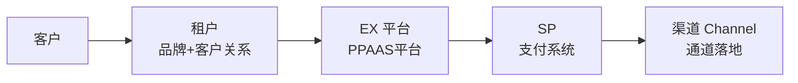
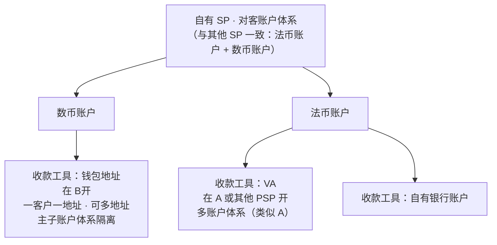
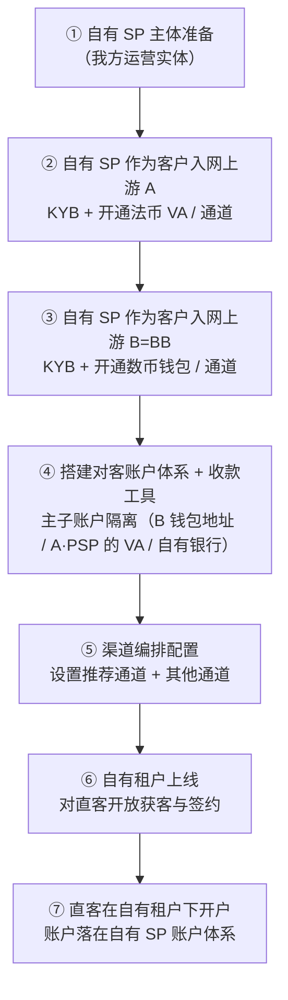
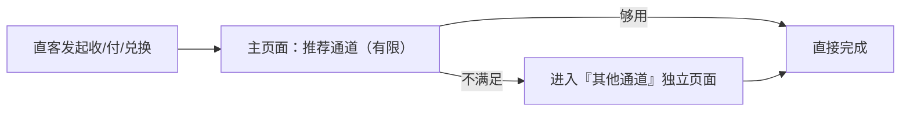

# EX 平台架构方案 · 自有租户 + 自有 SP 模型（BRD）

> 日期：2026-06-05 ｜ 文档类型：BRD（业务需求文档）
> 主题：**EX 以"自有租户拓直客 + 自有 SP 承载整套能力 + 自有 SP 入网上游 A/B"为核心的平台架构**
> 说明：本方案为**全新方案**，**不沿用、不引用此前的"方案 A / 方案 B"**。术语、主体关系、账户模型均以本文为准。

---

## 一、业务背景

EX 平台需要同时扮演两个角色：**面向直客的运营方**与**面向渠道的聚合方**。

1. **我方既运营自有租户（拉直客），又运营自有 SP（承载能力）。** 两者职责分离：租户负责前台获客与品牌，SP 负责账户、会员、渠道等后台能力。
2. **自有 SP 不自己持牌，而是作为 A、B 的客户入网到 A、B。** 资金与合规落地借助上游持牌主体 A、B 的牌照与基础设施，自有 SP 专注做"产品化 + 运营 + 渠道编排"。
3. **账户结构维持原状，全部落在 SP 层。** 客户/会员的账户都在自有 SP 名下管理，不上收到平台中枢、不打散成多主体负债。
4. **对客通道做"推荐 + 其他"分层展示。** 默认只暴露有限的推荐通道，降低选择成本；其他通道收纳到独立页面，按需查看。

> 一句话定位：**EX = 自有租户（获客前台）+ 自有 SP（能力后台），自有 SP 站在 A/B 的牌照肩膀上对客经营。**

---

## 二、名词解释（含业务背景）

> 先对齐主体与边界，避免后续歧义。每个名词附"是什么 / 业务背景 / 不是什么"。

### 1. 自有租户（Own Tenant）

- **是什么**：由我方运营的租户（品牌前台），专门用来**拓展直客**。它在平台上与其他外部租户地位相同，只是归我方运营。
- **业务背景**：很多直客无法或不愿自建主体去对接上游持牌体系；自有租户承接这部分量，用我方品牌直接获客、签约、运营。
- **不是什么**：不是特殊后门通道；不直接持牌，也不直接做资金落地（落地交给自有 SP + 上游 A/B）。

### 2. 自有 SP（Own SP）

- **是什么**：由我方运营的服务商主体，**具备一整套 SP 能力**——账户、会员、渠道（路由/编排）等，是平台后台能力的承载者。
- **业务背景**：自有 SP 把上游 A/B 的牌照能力"产品化、运营化、渠道化"，对客提供统一体验；它本身**作为 A、B 的客户入网到 A、B**，借 A/B 落地资金与合规。
- **不是什么**：本方案中**自有 SP 不自持牌照**（持牌在上游 A/B）；它不是纯 API 透传层，而是承载账户/会员/渠道运营的实体。

### 3. 上游持牌主体 A、B（Upstream Licensed Providers）

- **是什么**：自有 SP 入网的两个上游**持牌**服务商。
  - **A**：法币侧持牌主体（提供法币账户/收付能力）。
  - **B**：数币侧持牌主体（**所有数币钱包都在 B = BB**）。
- **业务背景**：A、B 提供牌照、合规框架与资金落地能力；自有 SP 以"客户"身份入网，使用它们的账户与通道。
- **不是什么**：A、B 不直接面向自有租户的直客做前台运营；它们是自有 SP 的上游。

### 4. SP 账户体系（对客账户体系，所有 SP 通用）

- **是什么**：每个 SP（含自有 SP）都给客户提供**一套统一的对客账户体系**——法币账户 + 数币账户。**所有 SP 都一样**，自有 SP 不特殊。
- **业务背景**：账户体系是 SP 对客的基础设施；客户在 SP 下持有法币/数币账户，账户体系下挂载具体的「收款工具」。
- **不是什么**：账户体系本身不等于某个银行账户/钱包；它是对客的账本与账户结构，底层由收款工具落地。

### 5. 收款工具（Collection Tools）

- **是什么**：SP 在账户体系下给客户提供的具体收款载体。
  - **数币侧**：钱包地址（Wallet Address）。
  - **法币侧**：VA（虚拟账户）或银行账户。
- **自有 SP 的收款工具实现**：
  - **数币**：在 **B（BB）** 开的钱包地址；**一客户一地址**，可多地址；需**主子账户体系**做资金隔离。
  - **法币**：在 **A 或其他 PSP** 开的 **VA**，或**自有银行账户**；同样需要一套**多账户体系**（类似 A 的多账户体系）。
- **业务背景**：收款工具是账户体系的落地手段；自有 SP 借上游 A/B/PSP 的钱包与 VA 能力对客发放收款工具。

### 6. 主子账户体系（Master-Sub Account）

- **是什么**：在一个上游主账户下，为每个客户分配独立子账户/子地址的账户结构。
- **业务背景**：**一客户一子账户/一地址**，做到资金隔离——**避免某一客户的资金问题（冻结/纠纷/合规）波及其他客户**。
- **适用**：数币钱包地址、法币 VA / 银行多账户均需此结构。

### 7. 推荐通道 / 其他通道（Recommended vs. Other Channels）

- **推荐通道**：对客**默认展示**的有限通道集合（精选、低决策成本）。
- **其他通道**：未进入推荐位的通道，**收纳到独立页面**，按需查看与使用。
- **业务背景**：避免一上来抛出全部通道造成选择困难，同时保留全部通道可达性。

> **主体关系一句话**：直客 → **自有租户**（前台获客）→ **EX 平台**（账本 + 路由 + 通道展示）→ **自有 SP**（账户体系 / 会员 / 渠道）；自有 SP 与其他 SP 一样给客户提供账户体系，账户体系下的**收款工具**由自有 SP 在 **B（数币钱包地址）/ A 或其他 PSP（法币 VA）/ 自有银行账户**开立，并用**主子账户体系**隔离每个客户。

---

## 三、价值主张

| 视角                       | 价值                                                                                              |
| -------------------------- | ------------------------------------------------------------------------------------------------- |
| **对直客**           | 单一品牌、单一入口、单一账户体系；默认推荐通道降低决策成本，需要时仍可用全部通道                  |
| **对我方（租户侧）** | 自有租户直接获客、掌握客户关系与定价空间，不被上游绑架前台                                        |
| **对我方（SP 侧）**  | 自有 SP 沉淀账户/会员/渠道等核心后台能力，形成可复用资产与编排护城河                              |
| **对合规/资金**      | 借上游 A/B 牌照落地，自有 SP 以"客户"身份入网，**合规责任清晰落在上游持牌方**，我方专注运营 |
| **对扩展性**         | 收款工具可在"B 钱包地址 / A·PSP 的 VA / 自有银行账户"间灵活组合；新增渠道即插入"其他通道"        |
| **对架构复杂度**     | 账户全部落 SP 层、不上收中枢、不拆多主体负债，**上层轻、耦合低**                            |

> 核心差异点：**不做资金中枢、不打散多主体余额**；用"自有租户 + 自有 SP + 入网上游 A/B"的朴素分层，把复杂度压在 SP 的渠道运营，而非平台中枢。

---

## 四、总体架构（通用）

> 通用架构：所有客户、所有租户、所有 SP 都走这条链路。自有租户 / 自有 SP 只是其中由我方运营的特例（见第五节）。

### 4.1 总体架构链路图

### 4.2 各层职责

| 层                        | 角色               | 职责                                                                |
| ------------------------- | ------------------ | ------------------------------------------------------------------- |
| **客户**            | 终端用户 / 会员    | 在租户下开户、收付款、兑换                                          |
| **租户（Tenant）**  | 品牌前台           | 获客、签约、运营；可以是外部租户，也可以是自有租户                  |
| **EX 平台**         | 账本 + 路由 + 展示 | 统一账本、通道路由、推荐 / 其他通道展示；不持牌、不落地资金         |
| **SP（服务商）**    | 对客账户体系承载者 | 给客户提供统一账户体系（法币 + 数币），承载会员、渠道等能力         |
| **渠道（Channel）** | 资金落地通道       | 收款工具 / 通道的实际落地（钱包地址、VA、银行账户、上游持牌通道等） |

---

## 五、自有租户 / 自有 SP 架构

> 自有租户、自有 SP 在总体架构里**与其他租户 / SP 地位一致**；区别只是「由我方运营」，以及自有 SP 的收款工具具体落在哪。

### 5.1 自有主体定位

- **自有租户**：我方运营的租户，专门**拓直客**；与外部租户走同一套总体架构。
- **自有 SP**：我方运营的 SP，**不自持牌**，**作为客户入网到上游 A、B**；与其他 SP 一样给客户提供**统一账户体系**。

### 5.2 自有 SP 账户体系与收款工具实现

> 自有 SP 的对客账户体系与其他 SP 一致（法币账户 + 数币账户）；差异在于账户体系下的**收款工具**具体在哪开、如何隔离。

- **数币收款工具**：钱包地址在 **B** 开；**一客户一地址**，可多地址；用**主子账户体系**隔离每个客户的资金，避免单客户问题波及他人。
- **法币收款工具**：在 **A 或其他 PSP** 开 **VA**，同样需要一套**多账户体系**（类似 A 的多账户体系）。
- **共性**：无论数币 / 法币，收款工具都挂在自有 SP 的对客账户体系下，**主子账户隔离是硬性要求**。

---

## 六、租户 + SP 功能清单

> 自有租户 + 自有 SP 运营所需的功能中心全集。查询类偏租户视角，配置 / 处理类偏 SP 视角，二者在同一平台内按权限协作。

### 6.1 客服中心

- 客服查询（客户查询、订单 / 商户单查询、工单查询等）

### 6.2 运营中心（客户运营 + 渠道运营）

**客户运营**

- 客户信息查询
- 客户余额查询
- 客户产品配置
- 客户分佣查询
- 客户计费申请与查询
- 客户汇率申请与查询
- 商户单查询

**渠道运营**

- 渠道成本配置
- 渠道路由配置
- 交易查询
- 渠道单查询

### 6.3 清结算中心

- 客户费率配置 / 客户汇率配置 / 客户分佣配置
- 机构费率配置 / 机构汇率配置 / 机构分佣配置
- 余额查询与管理
- 商户单查询
- 交易查询与管理
- 渠道单查询与管理
- 交易对账

### 6.4 财资中心

- 渠道余额管理
- 渠道成本配置
- 汇率运营

### 6.5 开发者中心

- App Key 等配置
- 开发者文档

### 6.6 风控中心

- 风控策略
- KYC / KYB 信息查询
- 工单审核

### 6.7 权限中心

- 用户与权限

### 6.8 个人中心

- 个人信息
- 安全验证

---

## 七、入网 / 开户流程

> 核心：**自有 SP 作为客户入网到上游 A、B**；直客在自有租户下开户，账户落在自有 SP 的账户体系。

**步骤说明**：

1. **自有 SP 主体准备**：确立我方运营的 SP 实体及其银行 / 合规关系。
2. **入网上游 A**：以客户身份完成 KYB，开通法币 VA 与法币通道。
3. **入网上游 B**：以客户身份完成 KYB，开通数币钱包与数币通道。
4. **搭建账户体系 + 收款工具**：建立对客账户体系，按**主子账户体系**发放收款工具（B 钱包地址 / A·PSP 的 VA / 自有银行账户）。
5. **渠道编排**：定义推荐通道集合与其他通道集合，配置路由规则。
6. **自有租户上线**：开放直客获客与签约。
7. **直客开户**：直客在自有租户下开通业务，账户落在自有 SP 账户体系，按主子账户隔离。

---

## 八、对客通道展示规则（推荐 / 其他）

| 项                 | 推荐通道                                   | 其他通道                 |
| ------------------ | ------------------------------------------ | ------------------------ |
| **展示位置** | 主流程/主页面默认展示                      | 独立页面，按需进入       |
| **数量**     | 有限（精选）                               | 全部其余通道             |
| **目的**     | 降低选择成本、提升转化                     | 保留可达性、覆盖长尾需求 |
| **配置方**   | 自有 SP 渠道运营（可按客群/币种/走廊配置） | 同上                     |

> 设计原则：**推荐通道覆盖大多数场景，其他通道兜底长尾**；默认不暴露全部通道，避免决策过载。

---

## 九、待确认的点（Open Questions）

> 作为方案设计者列出的关键开放问题，需与业务/合规/资金方拍板。

- [ ] **Q1 上游 A 的具体主体**：法币侧上游 A 指向哪个持牌主体（IPL / 其他 MSO / PSP）？是否只有一个 A，还是多个法币上游？
- [ ] **Q2 自有 SP 的持牌定性**：确认自有 SP **不自持牌**、纯靠入网 A/B 落地是否合规可行？是否存在必须自持某类资质的环节？直客账户余额的法律负债主体是SP？账户"落在 SP 层"是账本归属还是法律负债归属？法币↔数币、跨法币兑换的汇率与流动性等是否都能合规运作？
- [ ] **Q3 会员 KYC/KYB 责任归属**：直客的 KYC 由自有 SP 收集、上游 A/B 终审，还是必须由持牌方 A/B 全程主导？责任边界如何切分？

---

## 十、术语表（中文 | 英文 | 粤语）

| 中文                 | 英文                              | 粤语（广东话）       |
| -------------------- | --------------------------------- | -------------------- |
| 自有租户             | Own Tenant                        | 自己嘅租户           |
| 自有 SP              | Own SP / Own Service Provider     | 自己嘅服务商         |
| 上游持牌主体 A       | Upstream Licensed Provider A      | 上游持牌主体 A       |
| 上游持牌主体 B（BB） | Upstream Licensed Provider B (BB) | 上游持牌主体 B（BB） |
| 直客                 | Direct Customer                   | 直客                 |
| SP 账户体系          | SP Account System                 | SP 户口体系          |
| 收款工具             | Collection Tool                   | 收款工具             |
| 钱包地址             | Wallet Address                    | 钱包地址             |
| 虚拟账户             | Virtual Account (VA)              | 虚拟户口（VA）       |
| 主子账户体系         | Master-Sub Account                | 主子户口体系         |
| 入网 / 开户          | Onboarding / Account Opening      | 入网 / 开户口        |
| 推荐通道             | Recommended Channel               | 推荐通道             |
| 其他通道             | Other Channel                     | 其他通道             |
| 渠道编排 / 路由      | Channel Orchestration / Routing   | 通道编排 / 路由      |
| 会员                 | Member / Merchant                 | 会员                 |

---

*本方案为全新方案，不引用此前"方案 A / 方案 B"。关联调研：`danang-onofframp-players.md`。*
