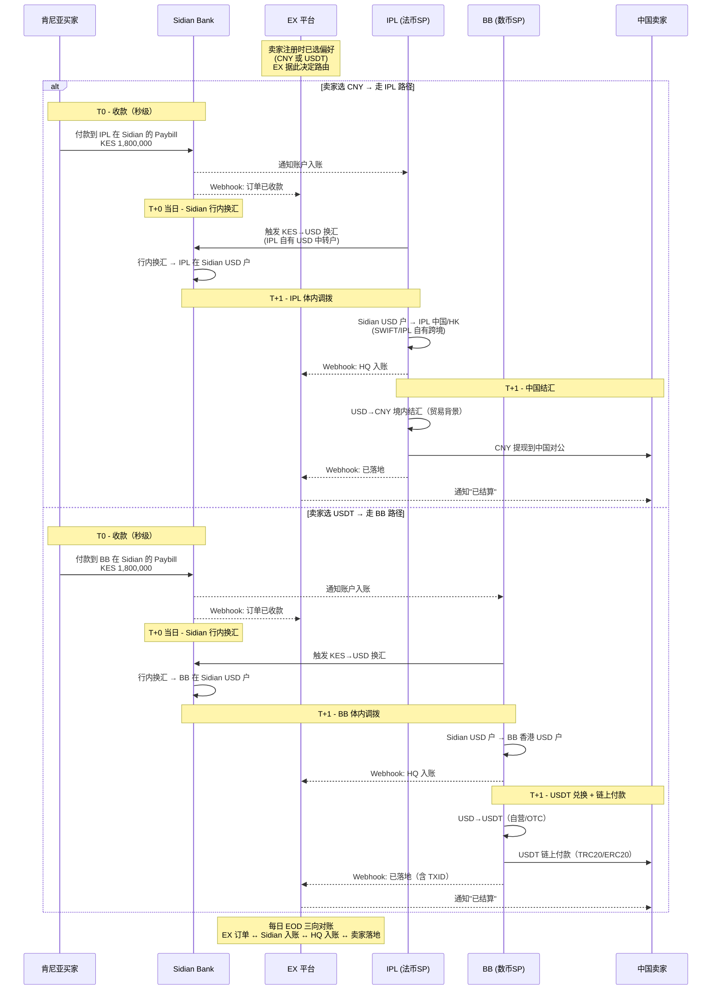

# Sidian Bank × EX 平台 — 肯尼亚→中国跨境支付解决方案

> **文档类型**：客户解决方案
> **方案对象**：Sidian Bank（肯尼亚）作为 EX 平台 SP 接入
> **目标客群**：从肯尼亚进口商品的中国出口商
> **版本**：v1.0
> **最后更新**：2026-05-16

---

## 一、背景与目标

### 1.1 业务背景

- **Sidian Bank**：肯尼亚商业银行（前 K-Rep Bank，2014 年由 Centum Investment Group 收购），定位 **中小企业贸易银行**，长期深耕 **中肯贸易走廊**，已积累大量"从肯尼亚向中国卖家付款"的进口商客群
- **客群现状**：Sidian 客户已习惯通过 Sidian 完成 SWIFT 出境付款，但存在 **成本高、时效慢、卖家收 USD 后还要自己结汇** 等痛点
- **市场机会**：中国是肯尼亚第一大进口来源国，年进口规模 ~70 亿美元，绝大多数为 **中小批发商高频小额采购**

### 1.2 方案目标

| 维度 | 目标 |
|------|------|
| **买家侧（Sidian 客户）** | 多渠道付款（M-Pesa / 银行转账 / 卡），KES 计价，秒级确认 |
| **卖家侧（中国出口商）** | 一个 EX 账户接收来自肯尼亚的所有付款，**直接落地 CNY**，可开票退税 |
| **银行侧（Sidian Bank）** | 作为 EX 平台**法币 SP**，提供 KES 收款、KES→USD 换汇、USD 出境能力，沉淀客群 |
| **平台侧（EX）** | 跨境编排枢纽：买卖双方 KYB、贸易合规、多 SP 路由、清算结算 |
| **资金侧（IPL/BB）** | IPL 承接 USD 落地与 CNY 结汇；BB 承接 USDT 数币结算 |

### 1.3 核心创新

- **Sidian Bank 作为 SP 接入 EX**：从单纯银行客户的 SWIFT 服务，升级为 **EX 平台的 Kenya 法币基础设施**
- **EX 不持牌、不开户、不碰资金**：所有账户由持牌主体 IPL 和 BB 在 Sidian 开立，EX 仅做编排与对账
- **IPL 与 BB 在 Sidian 互相开户**：IPL/BB 各自在 Sidian 持有 KES + USD 账户，作为 Kenya 端的资金接收主体
- **双轨分流（CNY/USDT）**：买家付款按卖家偏好直接路由到 IPL 或 BB 的 Sidian 账户
- **资金分轨、互不混淆**：CNY 路径走 IPL 全链路，USDT 路径走 BB 全链路，**不存在 IPL↔BB 跨 SP 划转**

---

## 二、角色定义

### 2.1 角色矩阵

| 角色 | 主体 | 在方案中的职责 |
|------|------|-------------|
| **TP（租户）** | 中国出口商 / 中国跨境电商 / 工厂 | 在 EX 注册商户账户，配置收款偏好 |
| **会员（卖家）** | TP 下属的具体收款主体（公司或个体）| 在 EX 拥有钱包，接收来自肯尼亚的货款 |
| **买家（付款方）** | 肯尼亚进口商 | Sidian Bank 客户 / 任意 M-Pesa 用户，向卖家付款 |
| **法币 SP — Sidian Bank** | 肯尼亚商业银行 | 接 KES、换 USD、SWIFT 出境、本地合规 |
| **法币 SP — IPL** | IPL 集团 | USD VA 托管、USD→CNY 结汇、卖家提现到中国账户 |
| **数币 SP — BB** | BB 集团 | USDT 钱包、USD↔USDT 兑换、链上付款 |
| **平台 — EX** | EX 平台 | 跨境编排、订单管理、合规中台、清算对账、卖家门户 |

### 2.2 角色关系图

```
                       ┌─────────────────────────────────┐
                       │            EX 平台              │
                       │  （编排 / 合规 / 对账 / 门户）   │
                       └─────────────────────────────────┘
                              ▲           ▲          ▲
                              │           │          │
              ┌───────────────┘           │          └──────────────┐
              │                           │                          │
              ▼                           ▼                          ▼
   ┌──────────────────┐       ┌────────────────────┐    ┌────────────────────┐
   │ Sidian Bank (SP) │       │   IPL (法币 SP)    │    │   BB (数币 SP)     │
   │  Kenya 法币入口   │       │   USD VA + CNY     │    │   USDT 钱包         │
   │  KES → USD       │       │   USD → CNY 结汇   │    │   USD ↔ USDT       │
   │  SWIFT 出境       │       │   卖家 CNY 落地     │    │   链上付款           │
   └──────────────────┘       └────────────────────┘    └────────────────────┘
              ▲                           ▲                          ▲
              │                           │                          │
              ▼                           ▼                          ▼
   [Kenya 进口商]              [中国卖家 CNY 提现]          [中国卖家 USDT 提现]
   M-Pesa / 银行 / 卡                银行对公账户                链上钱包
```

---

## 三、整体架构

### 3.1 业务流（端到端）

**关键架构原则**：EX 不持牌，不开账户。Sidian Bank 内的账户由 **IPL 和 BB 各自开立**。买家付款根据卖家结算偏好，**直接路由到 IPL 或 BB 在 Sidian 的账户**，资金全程在 IPL 体内或 BB 体内闭环。

```
① 中国卖家在 EX 注册            ② 肯尼亚买家发起付款
   - 选择收款币种：CNY / USDT      - 选择支付渠道：M-Pesa / Bank / Card
   - 上传贸易资质                   - KES 计价、实时锁汇
       │                                │
       └─────────────┬──────────────────┘
                     ▼
              [EX 订单中心]
              · 撮合买卖双方
              · 路由决策：CNY 卖家 → IPL；USDT 卖家 → BB
              · 生成对应 SP 的付款指令（Paybill / 账号）
                     │
           ┌─────────┴─────────┐
           ▼                   ▼
  [卖家选 CNY]            [卖家选 USDT]
   买家付款进 IPL          买家付款进 BB
           │                   │
           ▼                   ▼
  ┌────────────────┐  ┌────────────────┐
  │ IPL 在 Sidian  │  │ BB 在 Sidian   │
  │ KES 收款户      │  │ KES 收款户      │
  └────────────────┘  └────────────────┘
           │ Sidian 行内换汇      │ Sidian 行内换汇
           ▼                   ▼
  ┌────────────────┐  ┌────────────────┐
  │ IPL 在 Sidian  │  │ BB 在 Sidian   │
  │ USD 中转户      │  │ USD 中转户      │
  └────────────────┘  └────────────────┘
           │ IPL 体内调拨         │ BB 体内调拨
           │ (SWIFT/自有跨境)     │ (SWIFT/自有跨境)
           ▼                   ▼
  ┌────────────────┐  ┌────────────────┐
  │ IPL 中国/HK     │  │ BB 香港        │
  │ USD 账户        │  │ USD 账户        │
  └────────────────┘  └────────────────┘
           │ USD→CNY 境内结汇     │ USD→USDT 自营兑换
           ▼                   ▼
  ┌────────────────┐  ┌────────────────┐
  │ 卖家 IPL CNY   │  │ 卖家 BB USDT   │
  │ 子钱包(VA)      │  │ 子钱包          │
  └────────────────┘  └────────────────┘
           │                   │
           ▼                   ▼
  [卖家中国对公账户]    [卖家自有链上钱包]
```

**关键设计**：
- 资金**全程在 IPL 或 BB 的持牌账户**内流转，EX 不接触
- IPL 和 BB **不互相划账**（避免跨 SP 资金调拨复杂度）
- EX 通过 API 编排两条独立链路，按卖家偏好路由

### 3.2 三大核心能力

#### 3.2.1 支付方案（Payment）— 买家如何付钱

让肯尼亚买家用最便利的方式付款，Sidian Bank 作为聚合落地方。

#### 3.2.2 清算方案（Clearing）— 多方账户如何记账

EX、Sidian、IPL/BB 之间的资金如何在内部记账与对齐。

#### 3.2.3 结算方案（Settlement）— 钱如何到中国卖家

最终落地到中国卖家手中（CNY 银行 / USDT 钱包）。

下文逐一展开。

---

## 四、支付方案（Payment）

### 4.1 买家侧支付渠道

| 渠道 | 实现方式 | 适用买家 | 单笔上限 | 时效 |
|------|---------|---------|---------|------|
| **M-Pesa Paybill** | EX 订单生成 Paybill 收款指令，买家 M-Pesa STK Push 付款，款项进 Sidian Paybill | M-Pesa 用户（覆盖 96% 成年人）| KES 250K-500K | 秒级 |
| **Sidian 行内转账** | Sidian 客户从自己账户转入 **IPL 或 BB 在 Sidian 的收款户** | Sidian 自有客户 | 无 | 实时 |
| **PesaLink 跨行转账** | 其他银行客户通过 PesaLink 转入 **IPL 或 BB 在 Sidian 的收款户** | Equity/KCB/Co-op 等 30+ 银行客户 | KES 999,999/笔 | 实时 |
| **Bank RTGS** | KEPSS 大额转账入 **IPL 或 BB 在 Sidian 的账户** | 大额贸易（>KES 100 万）| 无 | T+0 当日 |
| **Visa/Mastercard 卡支付** | EX 收单页路由到 **IPL 或 BB 通过 Sidian 收单**（按卖家偏好）| 持卡人（少数）| 卡组织限额 | 秒级 |
| **KE-QR 扫码** | 卖家生成 KE-QR，买家任意钱包 App 扫码 | M-Pesa/Airtel/银行 App 用户 | 钱包限额 | 秒级 |

### 4.2 EX 收银台（Checkout）流程

```
1. 卖家 EX 后台创建订单
   - 订单号、金额（USD 计价）、商品描述、买家信息
   - 系统生成付款链接 / 二维码

2. 买家点击链接打开 EX Checkout 页
   - 实时显示 KES 计价（锁汇 5-10 秒）
   - 列出所有可用渠道（M-Pesa / Bank / Card / KE-QR）
   - 显示卖家信息 + 订单详情

3. 买家选择渠道
   - 选 M-Pesa → 输入手机号 → STK Push → 输 PIN → 完成
   - 选 Bank Transfer → 显示 Sidian 收款账号 + 备注号 → 引导转账
   - 选 Card → 输卡号 → 3DS → 完成

4. EX 接收 Webhook
   - Sidian 通知 KES 入账
   - EX 更新订单状态为"已收款"
   - 卖家实时看到收款（订单状态切到"待发货"）
```

### 4.3 关键设计要点

- **KES 计价为主**：买家始终看到 KES 金额，避免外币换算困惑
- **实时锁汇**：扫码/打开支付页瞬间锁定 KES→USD 汇率，5-10 秒有效
- **EX 不接触资金、不开户**：买家付款直接进 **IPL 或 BB 在 Sidian 的账户**（取决于卖家结算偏好），EX 仅生成付款指令并接收 Webhook
- **付款指令含路由信息**：EX 生成的 Paybill 号 / Bank Account / Reference 直接对应 IPL 或 BB 在 Sidian 的具体账户
- **多 SP 路由备份**：Sidian 故障时，可路由到 IPL/BB 在 Equity / NCBA / Stanbic 等备份银行的账户

### 4.4 时序图（M-Pesa 收款，CNY 卖家场景）

> **关键**：M-Pesa Paybill 号对应 **IPL 在 Sidian 的 KES 账户**（卖家选 USDT 时则对应 BB 在 Sidian 的 KES 账户）。EX 不收钱，仅生成订单和接收通知。

```
Buyer       EX Checkout      Sidian Bank      M-Pesa       IPL          EX Backend      Seller
  │             │                │              │            │              │              │
  │ 1. 打开付款页 │                │              │            │              │              │
  │────────────►│                │              │            │              │              │
  │             │ 2. 询价锁汇（向 IPL 询价）                                                │
  │             │─────────────────────────────────────────►│              │              │
  │             │ 3. 锁汇凭证                                                              │
  │             │◄─────────────────────────────────────────│              │              │
  │ 4. 选 M-Pesa 输手机号                                                                  │
  │────────────►│                │              │            │              │              │
  │             │ 5. 发起 STK Push                                                          │
  │             │   Paybill = IPL 在 Sidian 的 Paybill 号                                  │
  │             │   Ref     = EX 订单号                                                    │
  │             │────────────────────────────►│            │              │              │
  │ 6. 手机弹窗输 PIN                          │            │              │              │
  │◄────────────────────────────────────────│            │              │              │
  │ 7. 确认                                    │            │              │              │
  │────────────────────────────────────────►│            │              │              │
  │             │                │ 8. M-Pesa 入账（IPL Paybill）          │              │
  │             │                │◄─────────────│            │              │              │
  │             │                │ 9. KES → IPL 在 Sidian 的 KES 户                       │
  │             │                │              │            │              │              │
  │             │                │ 10a. Webhook → IPL（账户主）            │              │
  │             │                │─────────────────────────►│              │              │
  │             │                │ 10b. Webhook → EX（订单主）                              │
  │             │                │───────────────────────────────────────►│              │
  │             │ 11. 订单状态更新（已收款）                                                  │
  │             │◄───────────────────────────────────────────────────────│              │
  │ 12. 显示成功 │                │              │            │              │ 13. 推送通知  │
  │◄────────────│                │              │            │              │ ────────────►│
```

> **要点**：Sidian 同时通知 **IPL（账户主）** 和 **EX（订单主）**，两条 Webhook 独立解耦。

---

## 五、清算方案（Clearing）

### 5.1 清算核心命题

- **EX 不持牌、不开户、不碰资金**
- 所有账户都在持牌主体（**Sidian / IPL / BB**）内
- **IPL 和 BB 各自在 Sidian 开户**（互相独立、不混合）
- 清算的核心 = **EX 编排订单 + Sidian/IPL/BB 各自记账 + 三方对账**

### 5.2 账户体系（IPL 与 BB 在 Sidian 互相开户）

#### IPL 体系账户（CNY 路径全链路）

| 账户 | 开户方 | 所在机构 | 币种 | 用途 |
|------|-------|---------|------|------|
| **IPL 在 Sidian 的 KES 收款户** | IPL | Sidian Bank | KES | 接收 CNY 卖家的所有买家付款 |
| **IPL 在 Sidian 的 USD 中转户** | IPL | Sidian Bank | USD | KES→USD 行内换汇后的头寸 |
| **IPL 中国/HK USD 账户** | IPL | IPL 自有 | USD | 从 Sidian 调拨入境/HK |
| **IPL 中国 CNY 账户** | IPL | IPL 自有 | CNY | USD→CNY 结汇后的 CNY 池 |
| **卖家 CNY 子钱包（VA）** | IPL（替卖家管理）| IPL | CNY | 卖家可见可提的 CNY 余额 |

#### BB 体系账户（USDT 路径全链路）

| 账户 | 开户方 | 所在机构 | 币种 | 用途 |
|------|-------|---------|------|------|
| **BB 在 Sidian 的 KES 收款户** | BB | Sidian Bank | KES | 接收 USDT 卖家的所有买家付款 |
| **BB 在 Sidian 的 USD 中转户** | BB | Sidian Bank | USD | KES→USD 行内换汇后的头寸 |
| **BB 香港 USD 账户** | BB | BB 自有 | USD | 从 Sidian 调拨入 HK |
| **BB USDT 自营钱包** | BB | BB 自有 | USDT | USD→USDT 兑换池 |
| **卖家 USDT 子钱包** | BB（替卖家管理）| BB | USDT | 卖家独立 USDT 余额 |

#### EX 平台

- **EX 不开户、不持有资金**
- EX 仅维护**虚拟订单账本**：`订单ID ↔ 卖家ID ↔ 买家付款流水 ↔ IPL/BB 真实入账`
- EX 通过 API 与 Sidian/IPL/BB 同步状态

#### 关键设计：分轨账户、不互通

```
            Sidian Bank（开户机构）
  ┌────────────────────────┬────────────────────────┐
  │ IPL 账号（KES + USD）   │ BB 账号（KES + USD）    │
  │ ↑ CNY 卖家路径专用       │ ↑ USDT 卖家路径专用      │
  └────────────────────────┴────────────────────────┘
        │                              │
        ▼ IPL 体内调拨                   ▼ BB 体内调拨
   [IPL 中国/HK]                   [BB 香港]
        │                              │
        ▼ 境内 USD→CNY                  ▼ USD→USDT
   [CNY 落地卖家]                  [USDT 落地卖家]
```

> **核心原则**：买家付款"前置路由"决定走哪条链路，资金不在 IPL 与 BB 之间划转，避免 SP 间资金调拨的合规复杂度。

### 5.3 清算流程

#### 5.3.1 IPL 路径（CNY 卖家全链路）

##### 第 1 段：Kenya 内清算（Sidian 行内）

```
T0  买家 M-Pesa 付款 KES 1,800,000
     ↓ Paybill 号 = IPL 在 Sidian 的 Paybill
[IPL 在 Sidian 的 KES 收款户]      ← Sidian 行内即时入账
     ↓ T+0 当日 IPL 触发换汇请求
[Sidian 行内 KES→USD 换汇]        ← Sidian 用 CBK 持牌额度撮合
     ↓ KES 1,800,000 → USD 14,000
[IPL 在 Sidian 的 USD 中转户]
     ↓ Sidian 双 Webhook：通知 IPL（账户主） + EX（订单主）
```

##### 第 2 段：跨境调拨（IPL 体内）

```
[IPL 在 Sidian 的 USD 中转户]
     ↓ SWIFT 集中代理（每日固定时点批量出账，多笔合并降本）
     ↓ 中间行：HSBC / Citi
[IPL 中国/HK USD 账户]            ← T+1 入账（IPL 自有跨境网络）
     ↓ IPL 内部按 EX 订单清单分配到卖家子账户
[卖家 i 在 IPL 的 USD 子账户]
```

> **关键**：这是 **IPL 体内的资金调拨**（IPL Sidian 户 → IPL HQ 户），不是 Sidian → 第三方。EX 不参与资金移动，仅订单层面对账。

#### 5.3.2 BB 路径（USDT 卖家全链路）

##### 第 1 段：Kenya 内清算（Sidian 行内）

```
T0  买家 M-Pesa 付款（Paybill 号 = BB 在 Sidian 的 Paybill）
     ↓
[BB 在 Sidian 的 KES 收款户]       ← Sidian 行内即时入账
     ↓ T+0 当日 BB 触发换汇
[Sidian 行内 KES→USD 换汇]
     ↓ KES 1,800,000 → USD 14,000
[BB 在 Sidian 的 USD 中转户]
     ↓ Sidian 双 Webhook 通知 BB 与 EX
```

##### 第 2 段：跨境调拨与 USDT 兑换（BB 体内）

```
[BB 在 Sidian 的 USD 中转户]
     ↓ SWIFT 集中代理
[BB 香港 USD 账户]                  ← T+1 入账
     ↓ BB 自营/OTC 市场兑换
[BB USDT 自营钱包] USDT 13,970     ← USD→USDT，约 0.1-0.3% 加点
     ↓ BB 内部按 EX 订单清单分配
[卖家 i 在 BB 的 USDT 子钱包]
```

> **关键**：BB 路径**全程不经 IPL**。BB 在 Sidian 直接收 KES，自己换 USD，自己换 USDT，全链路 BB 内闭环。

#### 5.3.3 三方对账机制

EX 平台执行 **每日三向对账**：

| 对账项 | 数据源 |
|--------|-------|
| EX 订单流水 | EX 自有数据库（订单创建、买家付款、卖家收款）|
| Sidian 入账流水 | Sidian Bank API（IPL 户 + BB 户分别拉取）|
| IPL/BB HQ 入账流水 | IPL/BB API（境内/HK 入账）|
| IPL CNY 落地流水 | IPL 中国 API |
| BB USDT 链上流水 | BB API（含链上 TXID）|

```
对账规则：
  EX 订单 = Sidian (IPL/BB 户) 入账 = HQ 入账 = 卖家落地
  允许时间差：T+0 → T+2
  超 T+3 未对齐 → 自动告警 + 人工介入
```

> **设计要点**：IPL 与 BB 的资金完全分轨，**不存在 IPL→BB 内部划转**，避免跨 SP 资金调拨的合规复杂度。

### 5.4 清算时序图（端到端）



---

## 六、结算方案（Settlement）

### 6.1 结算路径选择

中国卖家在 EX 注册时配置 **结算偏好**，**EX 据此决定买家付款进哪个 SP 的 Sidian 账户**：

| 偏好 | 买家付款进 | 跨境调拨 | 卖家落地 |
|------|-----------|---------|---------|
| **CNY**（主流）| **IPL 在 Sidian 的账户** | IPL 体内：Sidian → 中国/HK | 卖家中国对公账户 / 支付宝企业 |
| **USD** | **IPL 在 Sidian 的账户** | IPL 体内：Sidian → HK USD VA | 卖家 IPL USD VA 留存 |
| **USDT** | **BB 在 Sidian 的账户** | BB 体内：Sidian → HK | 卖家自有链上钱包 |

> **关键差异**：偏好直接决定 **买家付款进哪条独立账户链路**，而不是付款后再划转。

### 6.2 路径 A：CNY 结算（IPL 全链路）

```
[买家] 付到 IPL 在 Sidian 的 KES Paybill
     ↓
[IPL 在 Sidian KES 户] KES 1,800,000
     ↓ Sidian 行内换汇（IPL 触发）
[IPL 在 Sidian USD 户] USD 14,000
     ↓ IPL 体内调拨（SWIFT / IPL 自有跨境）
[IPL 中国/HK USD 账户] USD 14,000
     ↓ IPL 持 SAFE 牌照，凭贸易背景核验
     ↓ USD→CNY 实时换汇
[IPL 中国 CNY 账户]
     ↓ T+0 提现指令
[卖家中国对公账户 / 支付宝企业] CNY ≈ 100,000
```

**特点**：
- ✅ 全程在 IPL 体内（IPL Sidian 户 → IPL HQ → 卖家），不涉及 SP 间划转
- ✅ T+1 ~ T+2 全链路完成
- ✅ 卖家收 CNY，可开发票、退税
- ✅ 成本约 0.3-0.5%（IPL 段换汇加点）

### 6.3 路径 B：USD 结算（IPL 留存）

```
[买家] 付到 IPL 在 Sidian 的 KES Paybill
     ↓ ... 同路径 A，到
[IPL 中国/HK USD 账户] USD 14,000
     ↓ EX 编排：不结汇 CNY，直接进卖家 USD VA
[卖家 IPL USD 子账户（VA）] USD 14,000
```

适用于：
- 卖家在多国有美元支付需求（继续付供应商等）
- 卖家自己有 SAFE 报备的银行 USD 账户，自行结汇
- 等待汇率好时再结汇

### 6.4 路径 C：USDT 结算（BB 全链路）

```
[买家] 付到 BB 在 Sidian 的 KES Paybill ⚠️ 与 IPL 不同账户
     ↓
[BB 在 Sidian KES 户] KES 1,800,000
     ↓ Sidian 行内换汇（BB 触发）
[BB 在 Sidian USD 户] USD 14,000
     ↓ BB 体内调拨
[BB 香港 USD 账户] USD 14,000
     ↓ BB 自营/OTC 兑换
[BB USDT 自营钱包] USDT 13,970
     ↓ EX 编排：分配到卖家子钱包
[卖家 BB USDT 子钱包] USDT 13,970
     ↓ 卖家选链上提币（TRC20/ERC20/Polygon）
[卖家自有链上钱包地址]
```

**特点**：
- ✅ 全程在 BB 体内（BB Sidian 户 → BB HQ → USDT 钱包），与 IPL 完全分轨
- ✅ 链上提币 T+5min 到账（TRC20 几乎秒级）
- ⚠️ 需 BB 在 Sidian 已开户（CBK 对 BB 在 Kenya 的资质审核需提前确认）
- ⚠️ 卖家收 USDT 后自行处理（中国境内 USDT→CNY 仍灰色）

### 6.4.1 为什么不走"IPL → BB 内部划转"？

| 方案 | 说明 | 评价 |
|------|------|------|
| ❌ 旧设计：IPL 收 USD → 划给 BB → BB 换 USDT | 跨 SP 资金划转 | 涉及 IPL/BB 间内部清算协议、外汇出入境合规复杂 |
| ✅ 现设计：BB 自己在 Sidian 开户，全程 BB 闭环 | 资金不跨 SP | 责任清晰、合规简单、各 SP 独立结算 |

### 6.5 结算费率结构（典型示例：单笔 USD 5,000）

| 环节 | 收费方 | 费率 | 金额 (USD) |
|------|--------|------|-----------|
| M-Pesa Paybill 收款 | Safaricom → Sidian | KES 5-50/笔 | ~0.3 |
| KES → USD（Sidian 段）| Sidian Bank | 0.5-0.8% | 25-40 |
| SWIFT 出境（集中代理）| Sidian / 中间行 | 0.2-0.3% | 10-15 |
| **CNY 路径** USD→CNY | IPL | 0.3-0.5% | 15-25 |
| **USDT 路径** USD→USDT | BB | 0.1-0.3% | 5-15 |
| 链上 Gas（USDT 路径）| 区块链 | TRC20 ~$1 | 1 |
| EX 平台服务费 | EX | 0.5-1% | 25-50 |
| **CNY 路径合计** | — | **~1.5-2.5%** | **75-130** |
| **USDT 路径合计** | — | **~1.3-2.0%** | **65-110** |

---

## 七、合规与风控

### 7.1 双侧贸易合规

| 侧 | 必备文件 | 责任方 |
|------|---------|--------|
| **肯尼亚出境** | Form M（Import Declaration）、Pro-forma Invoice、Bill of Lading、KRA PIN、CBK 单笔/年度额度 | **Sidian Bank**（持牌外汇商，CBK 监管）|
| **中国入境（CNY 路径）** | 出口合同、Commercial Invoice、报关单、装箱单、SAFE 报备 | **IPL**（持中国跨境支付牌照）|
| **中国入境（USDT 路径）**| 卖家自行承担合规（境外钱包，无中国结汇）| **卖家**（承担监管解释义务）|

### 7.2 EX 平台合规中台

EX 不直接对接监管，但提供 **合规编排层**：

- **统一 KYB**：中国卖家入网时收集主体材料 → EX 标准化 → 推送给 IPL/BB 完成机构审核
- **贸易背景核验**：买卖双方上传合同/Invoice/报关单 → EX 自动提取关键字段 → 与订单金额匹配 → 推送给 Sidian/IPL 复核
- **风控规则引擎**：可疑交易识别（金额异常、频次异常、买家黑名单、商品类目限制）
- **合规留档**：所有单据归集到 EX，监管检查时可一键导出

### 7.3 风控措施

| 风险 | 应对 |
|------|------|
| 买家拒付 / 退款争议 | EX 提供 **托管账户（Escrow）**：买家付款冻结，凭装船证明（B/L）放款 |
| 货未到付款的信任问题 | 分阶段付款：预付 30% → B/L 出具后 60% → 货到 10% |
| KES 急速贬值 | 实时锁汇 + 立即换汇，不持仓过夜 |
| Sidian 单点故障 | 多 SP 路由备份（DPO / Cellulant / Flutterwave 兜底）|
| CBK 外汇额度告罄 | 实时监控 Sidian 额度水位，告警时切换备份 SP |
| 中国 SAFE 加严 | 卖家 KYB 升级、单据自动化、与 IPL 持续保持监管沟通 |
| AML / 制裁名单 | EX 接入 World-Check / Refinitiv，买卖双方筛查 |
| Paybill 洗钱风险 | 单笔/日累计限额、行为分析、异常拒付 |

---

## 八、Sidian Bank 接入 EX 的 SP 模式

### 8.1 Sidian 在 EX 平台的 SP 角色定义

按 EX 角色模型：

- **类别**：法币支付服务商（Fiat PSP）
- **接入方式**：**完整版 SP**（购买 EX 整套系统：清算中心 + 渠道中心 + 财资中心 + 合规风控中心）
- **客户类型**：Sidian 现有进口商客户作为"会员/商户"接入
- **EX 关系**：Sidian 既是 SP（提供能力）也可作为 TP（推送自有客户）

### 8.2 Sidian 提供的能力清单

| 能力 | 实现 | EX 调用方式 |
|------|------|-----------|
| KES 收款（Paybill）| Sidian 已有 Paybill 业务 | EX → Sidian Daraja-equivalent API |
| 银行转账收款 | Sidian 行内/PesaLink/RTGS | Sidian Bank API |
| 卡收单 | Sidian Visa/Mastercard 收单 | Sidian Acquiring API |
| KES → USD 换汇 | Sidian CBK 持牌外汇 | Sidian FX API（询价/锁汇/执行）|
| SWIFT 出境 | Sidian 已有代理行网络 | Sidian SWIFT API |
| 贸易合规审核 | Sidian Trade Finance 团队 | Sidian Compliance API |
| 反洗钱筛查 | Sidian AML 系统 | Sidian Risk API |

### 8.3 EX 给 Sidian 的价值

| 维度 | 价值 |
|------|------|
| **客流增长** | EX 把全球出口商（中国为先）导给 Sidian，扩大 Sidian 进口商客群 |
| **数字化升级** | 从柜面+SWIFT 升级为 API + 实时清算，提升 Sidian 在中小银行中的科技形象 |
| **手续费收入** | 新增换汇加点 + Paybill 收款费 + SWIFT 代理费 |
| **沉淀存款** | 进口商日常资金沉淀在 Sidian，提升存款规模 |
| **数据价值** | 进口商交易数据沉淀，未来可做贸易融资、信用评分 |

### 8.4 EX 给中国卖家的价值

| 维度 | 价值 |
|------|------|
| **统一收款** | 一个 EX 账户 = 接收来自肯尼亚 M-Pesa/银行/卡的所有付款 |
| **直接 CNY** | 通过 IPL 落地 CNY，不用自己处理 USD 结汇 |
| **可开票退税** | IPL 提供贸易背景核验，可正常开发票出口退税 |
| **多币种灵活** | CNY/USD/USDT 三选一，按需切换 |
| **低成本** | 比自己走 SWIFT 节省 40-50% |
| **快到账** | T+1 ~ T+2 全链路（vs SWIFT T+3~5）|
| **合规省心** | EX 编排双侧合规，卖家只需上传单据 |

---

## 九、商业模式

### 9.1 收益分配（典型单笔 USD 5,000）

| 收益方 | 收益项 | 金额 (USD) |
|-------|-------|-----------|
| **Sidian Bank** | KES→USD 换汇加点 + Paybill 费 + SWIFT 代理费 | 35-50 |
| **IPL** | USD→CNY 结汇加点 + USD VA 月费 | 15-30 |
| **BB**（USDT 路径）| USD→USDT 兑换加点 | 5-15 |
| **EX 平台** | 平台服务费（订单管理、对账、合规编排）| 25-50 |
| **总成本（卖家承担）** | — | **75-130（CNY）/ 65-110（USDT）** |

### 9.2 EX 平台收费项目

| 收费项 | 收费方式 | 标准 |
|--------|---------|------|
| 平台交易费 | 按笔比例 | 0.5-1% / 笔 |
| Paybill 商户号年费 | 固定 | KES 30,000-60,000 / 年 |
| 增值服务（Escrow / 信用付款 / 贸易融资）| 按需 | 议价 |
| API 集成费 | 一次性 | 0（SaaS 订阅）|
| 卖家会员订阅 | 按等级 | $0 / $99 / $499 / 月 |

---

## 十、集成路线图

### 10.1 阶段划分

| 阶段 | 时间 | 关键里程碑 |
|------|------|-----------|
| **Phase 0：MOU & 联调准备** | 1-2 月 | 双方 MOU 签署、确认 API 范围、Sandbox 开通 |
| **Phase 1：核心通道打通** | 2-3 月 | M-Pesa Paybill 收款 + KES→USD 换汇 + SWIFT to IPL |
| **Phase 2：卖家门户 + 合规编排** | 3-4 月 | 中国卖家 EX 注册、KYB、合规单据上传、订单中心 |
| **Phase 3：IPL CNY 结算闭环** | 4-5 月 | IPL USD→CNY → 卖家中国对公到账 |
| **Phase 4：BB USDT 通道** | 5-6 月 | BB USDT 钱包 + 链上付款 |
| **Phase 5：增值能力** | 6-9 月 | Escrow、信用付款、贸易融资、对账自动化 |
| **Phase 6：复制扩展** | 9-12 月 | 复制到尼日利亚（Access Bank/Zenith）、加纳、坦桑尼亚 |

### 10.2 关键依赖

| 依赖项 | 责任方 | 风险等级 |
|--------|--------|---------|
| Sidian Daraja-style API 开发 | Sidian Bank IT | 中 |
| Sidian CBK 牌照范围确认（外汇/Paybill 聚合） | Sidian Compliance | 低 |
| Safaricom Paybill 通过 Sidian 申请 | Safaricom 商务 | 中 |
| IPL CNY 结汇通道扩容 | IPL | 低 |
| BB USDT 合规牌照 | BB | 低 |
| 中国卖家批量 KYB | EX + IPL | 中 |
| 双侧贸易背景标准化 | EX 合规中台 | 高 |

---

## 十一、关键风险与应对

| 风险 | 影响 | 应对措施 |
|------|------|---------|
| **Sidian 单 SP 依赖** | Sidian 故障/限额时业务中断 | 多 SP 备份：DPO / Cellulant / Flutterwave 同时接入 EX |
| **CBK 外汇政策变化** | KES→USD 换汇受限 | 与 Sidian 保持监管沟通；预留多渠道（USDT 通道作为应急）|
| **中国 SAFE 加严** | CNY 结汇受阻 | 接入多家中国跨境收款机构（PingPong/连连/Lianlian），多通道分散 |
| **Safaricom 议价** | M-Pesa Paybill 涨价 | KE-QR Standard + Airtel Money 互通分流 |
| **VASP Bill 实施（USDT）** | BB 在 Kenya 业务受限 | BB 在中国/香港境内做 USD→USDT，不在 Kenya 承兑 |
| **汇率波动** | 锁汇期内损失 | 锁汇时窗 5-10 秒、即时执行；EX 不持仓 |
| **买家拒付/退货** | 卖家资金风险 | Escrow 模式 + 分阶段付款 |
| **AML 合规事件** | 监管处罚、声誉风险 | 多层 AML（EX + Sidian + IPL + BB），交叉验证 |

---

## 十二、与 EX 平台架构对应

### 12.1 涉及的 EX 中心

| 中心 | 在本方案中的作用 |
|------|---------------|
| **客户中心** | 中国卖家（TP/会员）入网、KYB、产品申请 |
| **产品中心** | 配置"肯尼亚 → 中国"贸易支付产品包 |
| **清算中心** | 多账户清算引擎（Sidian KES/USD ↔ IPL USD/CNY ↔ BB USDT）|
| **渠道中心** | Sidian Bank / IPL / BB 作为 SP 渠道接入与管理 |
| **财资中心** | EX 自身资金调拨、SP 备付金管理、汇率风险敞口监控 |
| **合规风控中心** | 双侧贸易背景核验、AML、制裁筛查 |
| **工作流中心** | KYB 审批流、订单审批流、退款审批流 |

### 12.2 SP 接入清单

| SP | 角色 | 提供能力 |
|----|------|---------|
| Sidian Bank | Kenya 法币 SP（核心）| KES 收付、KES↔USD 换汇、SWIFT |
| DPO Group | Kenya 法币 SP（备份）| M-Pesa Paybill 聚合 |
| Cellulant | Kenya 法币 SP（备份）| 多通道收款 |
| **IPL** | 中国法币 SP（核心）| USD VA、USD↔CNY 结汇、CNY 落地 |
| **BB** | 数字资产 SP（核心）| USD↔USDT、链上付款 |
| Safaricom M-Pesa | 通道（间接，通过 Sidian/DPO）| Paybill API |

---

## 十三、客户决策要点（FAQ）

**Q1：为什么要通过 EX，不直接用 Sidian SWIFT？**
A：Sidian SWIFT 单笔成本 $50+ + 时效 T+3-5；通过 EX 可降到 $25-50 + T+1-2，且卖家直接收 CNY 而非 USD。

**Q2：M-Pesa Paybill 是 Sidian 自己的还是 Safaricom 的？**
A：Paybill 是 Safaricom 产品，但通过 Sidian 申请 Aggregator 级别（Sidian 已有此资质），EX 复用 Sidian 的 Paybill 通道。

**Q3：USDT 通道是不是有合规风险？**
A：BB 在中国/香港持有 VASP 牌照，USD→USDT 兑换合规；卖家收 USDT 后的处置由卖家承担。Kenya 侧不涉及 USDT，规避当地 VASP 合规。

**Q4：买家在 Sidian 开户吗？**
A：不强制。M-Pesa 用户即可付款，无需 Sidian 账户；如需大额付款，可用 PesaLink 从其他银行转入 **IPL 或 BB 在 Sidian 的收款户**。

**Q5：EX 自己持有资金吗？开账户吗？**
A：**EX 不持牌、不开户、不碰资金**。所有账户都由 Sidian / IPL / BB 这些持牌主体开立和持有：
  - Sidian Bank 内的 KES 和 USD 账户由 **IPL 和 BB 各自独立开立**
  - IPL 中国/HK 的 USD/CNY 账户、BB 香港的 USD 账户和 USDT 钱包都由各自持有
  - EX 仅做订单编排、对账、门户和合规中台

**Q6：Sidian 与 EX 是什么合作关系？**
A：Sidian 作为 EX 的 SP（服务商）接入；EX 把客户（中国卖家）导入，Sidian 提供 Kenya 法币基础设施；双方按交易量分润。

---

## 十四、附录

### 14.1 关键术语

| 术语 | 中文 | 说明 |
|------|------|------|
| SP | 服务商 | EX 平台的能力提供方 |
| TP | 租户 | EX 平台的客户机构 |
| VA | 虚拟账户 | 持牌服务商开立的真实银行账户的子账户 |
| Paybill | M-Pesa 商户编号 | M-Pesa 账单类收款 |
| PesaLink | 肯尼亚银行间实时转账 | KBA/IPSL 运营 |
| KEPSS | 肯尼亚电子支付清算系统 | CBK RTGS |
| KE-QR | 肯尼亚国家二维码标准 | EMVCo 兼容 |
| Form M | 进口许可表 | KEBS 进口报备 |
| KYB | 商户尽调 | Know Your Business |
| SAFE | 中国国家外汇管理局 | China State Administration of Foreign Exchange |

### 14.2 参考文档

- `@/Users/xiaoxiaoliu/Documents/Ipaylinks/IPL PRODUCT/EX-NEW/Solutions/market-research/kenya-payment-market.md`
- `@/Users/xiaoxiaoliu/Documents/Ipaylinks/IPL PRODUCT/EX-NEW/Solutions/solutions/TE-solution/aquiringPF-solution.md`
- EX 平台角色模型与中心权限设计
- Sidian Bank 公开年报与产品手册

---

> **方案要点回顾**：
> 1. **Sidian 作为 SP 接入 EX**，提供 Kenya 法币入金 + 行内换汇 + 跨境出境
> 2. **EX 不持牌、不开户、不碰资金**：所有账户由 Sidian / IPL / BB 持牌主体持有
> 3. **IPL 与 BB 各自在 Sidian 开户**：CNY 路径走 IPL 全链路；USDT 路径走 BB 全链路
> 4. **资金分轨闭环**：IPL 与 BB 之间不互相划转，每条路径在各自 SP 体内闭环
> 5. **EX 仅做编排**：订单中心、合规中台、三方对账、卖家门户
> 6. **多 SP 路由备份**：Sidian 故障时切换到 IPL/BB 在备份银行的账户
> 7. **目标客群**：肯尼亚进口商 ↔ 中国出口商
