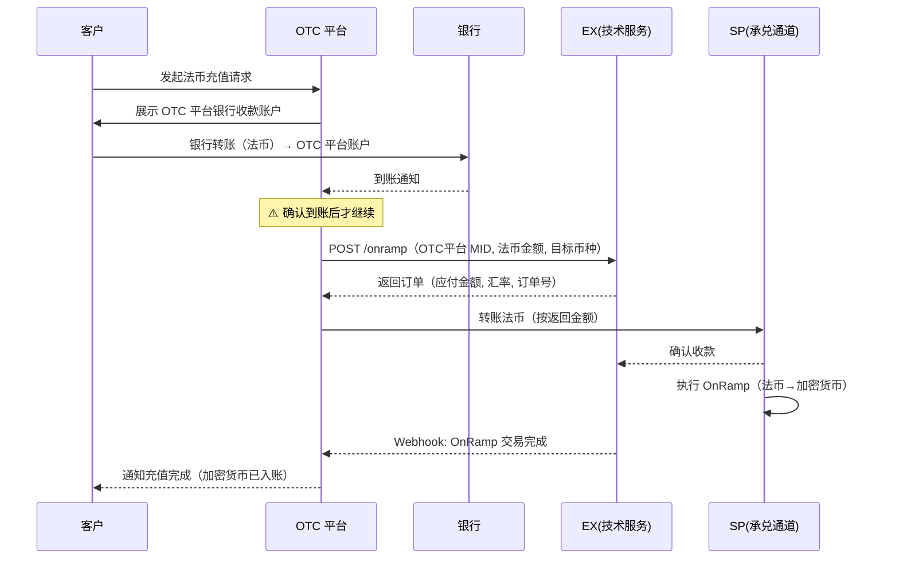
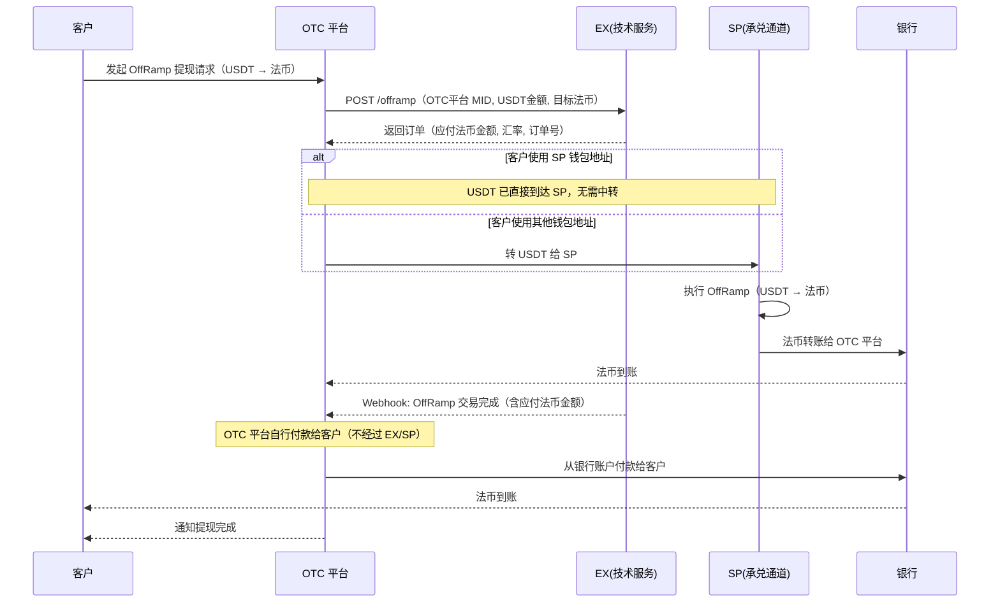
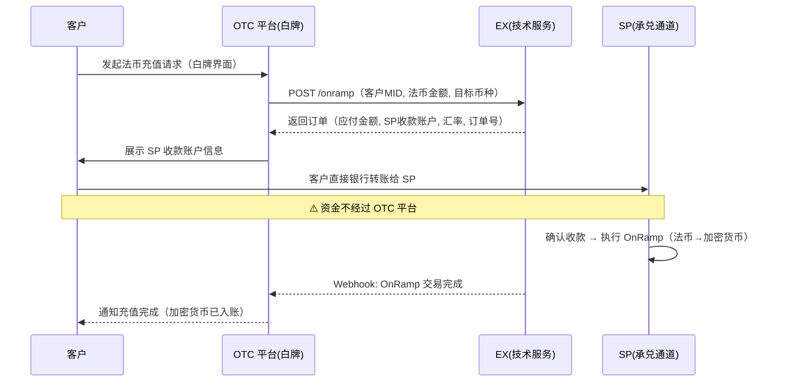
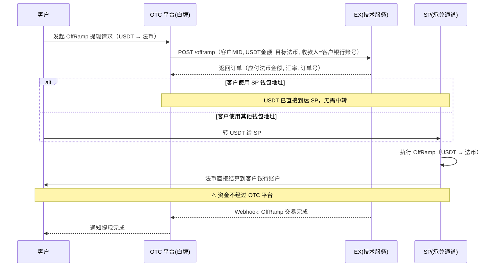

# OTC 平台 OnRamp / OffRamp — 解决方案

> **文档类型**: OTC 平台承兑业务解决方案
> **版本**: v2.0
> **最后更新**: 2026-04-16
> **适用对象**: OTC 平台

---

## 一、方案概述

### 1.1 两种合作模式

OTC 平台接入 SP 承兑能力有两种模式，核心区别在于 **OTC 平台是否作为 SP 的商户入网**：

| 维度               | 模式 A：OTC 作为商户                 | 模式 B：纯白牌                       |
| ------------------ | ------------------------------------ | ------------------------------------ |
| **OTC 身份** | OTC 平台自身入网为 SP 商户，拥有 MID | OTC 平台仅作为 TP 租户，不入网为商户 |
| **客户归属** | 客户注册在 OTC 平台名下              | 客户直接注册为 SP 商户               |
| **交易发起** | OTC 平台以自己的 MID 发起交易        | 客户以自己的 MID 直接发起交易        |
| **法币收付** | OTC 平台统一收付，自行管理客户提现   | SP 直接结算给客户，OTC 不经手法币    |
| **合规责任** | SP 承兑合规 + OTC 管理客户资金       | SP 全链路合规，OTC 仅提供前端界面    |
| **适用场景** | OTC 需要控制资金流、有自己银行账户   | OTC 只做流量入口，不碰资金           |

### 1.2 各方角色

| 角色               | 说明                                                                        |
| ------------------ | --------------------------------------------------------------------------- |
| **OTC 平台** | 面向终端客户的 OTC 平台。模式 A 下为 SP 商户；模式 B 下为 TP 租户（纯白牌） |
| **SP**       | 持牌合规通道（承兑执行方），提供 OnRamp / OffRamp 能力                      |
| **EX**       | 技术服务商，为 SP 提供系统支撑。OTC 平台通过 EX API 与 SP 交互              |
| **客户**     | OTC 平台的终端用户，在 OTC 平台完成法币 ↔ 加密货币兑换                     |

---

---

# 模式 A：OTC 平台作为商户

> OTC 平台自身入网为 SP 商户，以自己的 MID 发起 OnRamp / OffRamp。
> OTC 平台统一收取客户法币、统一向客户付款，SP 只与 OTC 平台结算。

---

## A-一、架构关系

```
┌──────────┐                ┌──────────┐                ┌──────────┐
│  客户     │  入网/交易     │ OTC 平台  │   API 对接     │  EX      │
│(终端用户) │ ──────────→   │(SP商户)  │ ──────────→   │(技术服务) │
└──────────┘                └──────────┘                └────┬─────┘
                                 │                           │
                                 │ 法币通道                   │ 系统支撑
                                 ▼                           ▼
                            ┌──────────┐              ┌──────────┐
                            │ 银行账户  │              │   SP     │
                            │(OTC平台) │              │(持牌通道) │
                            └──────────┘              └──────────┘
```

- **OTC 平台作为 TP 入网 EX**，同时也是 SP 的商户
- **SP 是承兑通道**，负责 OnRamp/OffRamp 的实际执行和合规
- **交易以 OTC 平台 MID 发起**，SP 与 OTC 平台结算，不直接面对客户

### 资金流向总览

```
OnRamp（法币 → 加密货币）:
  客户法币 → OTC 平台银行账户 → OTC 平台转账给 SP → SP 执行 OnRamp → 加密货币入客户账户

OffRamp（加密货币 → 法币）:
  客户 USDT → OTC 平台 → OTC 平台转 USDT 给 SP → SP 执行 OffRamp → 法币结算给 OTC 平台 → OTC 平台付款给客户
```

---

## A-二、前置流程

### A-2.1 OTC 平台自身准备

```
├── 1. OTC 平台开设银行法币账户
│     └── 用于接收客户法币（OnRamp）和向客户付款（OffRamp）
│
├── 2. OTC 平台与 EX 签约
│     └── 作为 TP 租户入网 EX 平台
│     └── 开通 OnRamp / OffRamp 产品
│
├── 3. OTC 平台作为商户入网 SP
│     └── 通过 EX 将自己注册为 SP 的商户，完成 KYC/KYB
│     └── 用于以 OTC 平台自身 MID 发起 OnRamp / OffRamp 交易
│     └── OffRamp 收款账户（beneficiary）填写 OTC 平台的银行账号
│
└── 4. 技术对接
      └── 获取 Sandbox 环境 → 配置 APP ID / 公钥 / AES Key / Webhook
      └── 完成签名验签 + AES 加解密联调
```

### A-2.2 客户入网（OTC 平台为客户完成）

```
├── 1. 注册客户
│     └── OTC 平台通过 EX API 注册终端客户 → 获取 MID
│
├── 2. 提交产品开通所需信息（KYC/KYB 等）
│     └── 根据产品要求上传审核材料
│     └── Webhook: 审核结果通知（APPROVED / REJECTED / RFI）
│
└── 3. 产品审核通过 → 客户可使用 OnRamp / OffRamp
```

---

## A-三、OnRamp 业务流程（法币 → 加密货币）

**核心原则：OTC 平台必须先收到客户法币，确认到账后再发起 OnRamp。**

### 步骤详解

```
├── 1. 客户发起法币充值
│     └── 客户在 OTC 平台前端发起法币充值请求
│     └── OTC 平台向客户展示银行收款账户信息
│
├── 2. 客户打款
│     └── 客户通过银行转账将法币打入 OTC 平台的银行账户
│
├── 3. OTC 平台确认到账
│     └── 确认收到客户法币（⚠️ 必须确认到账）
│
├── 4. OTC 平台发起 OnRamp
│     └── 调用 EX API，以 OTC 平台 MID 发起 OnRamp 请求
│     └── EX 返回：OnRamp 订单信息（含应付法币金额、汇率、订单号）
│
├── 5. OTC 平台转账给 SP
│     └── 根据 EX 返回的法币金额，从银行账户转账至 SP 指定账户
│
├── 6. SP 执行 OnRamp
│     └── SP 收到法币后执行承兑（法币 → 加密货币）
│     └── 加密货币入账到客户账户
│
└── 7. 交易完成
      └── Webhook: OnRamp 交易结果通知
      └── OTC 平台通知客户充值完成
```

### OnRamp 时序图



---

## A-四、OffRamp 业务流程（加密货币 → 法币）

### A-4.1 前置：设置收款账户

> **本期原则：OffRamp 统一走 OTC 平台自身商户号，收款人 = OTC 平台银行账号。SP 执行承兑后法币结算给 OTC 平台，OTC 平台自行付款给客户。**

```
├── 1. OTC 平台在 EX 添加自己的收款账户（beneficiary）
│     └── 收款账户填写 OTC 平台的银行账号
│     └── SP OffRamp 完成后，法币转账到 OTC 平台银行账户
│
├── 2. 审核通过后，OTC 平台可用自身商户号发起 OffRamp
│
└── 3. 客户提现账户由 OTC 平台自行管理
      └── 客户在 OTC 平台前端添加提现银行账户
      └── OTC 平台负责维护客户收款信息，不经过 EX
```

### A-4.2 OffRamp 交易流程

```
├── 1. 客户发起提现
│     └── 客户在 OTC 平台前端发起加密货币提现（如 USDT → 法币）
│
├── 2. OTC 平台以自身商户号发起 OffRamp
│     └── 调用 EX API，以 OTC 平台自己的 MID 发起 OffRamp
│     └── EX 返回：OffRamp 订单信息（含应付法币金额、汇率、订单号）
│
├── 3. USDT 到达 SP
│     └── 若客户使用 SP 钱包地址：USDT 直接到达 SP，此步免操作
│     └── 若客户使用其他钱包地址：OTC 平台需将 USDT 转给 SP
│
├── 4. SP 执行 OffRamp
│     └── SP 执行承兑（USDT → 法币）
│     └── 法币转账到 OTC 银行账户
│
├── 5. OTC 平台自行付款给客户
│     └── OTC 平台根据客户提现信息，从银行账户付款给客户
│     └── 客户提现账户由 OTC 平台自行管理，不经过 EX/SP
│
└── 6. 交易完成
      └── Webhook: OffRamp 交易结果通知
      └── OTC 平台通知客户提现完成
```

### OffRamp 时序图



---

## A-五、头寸管理

### 核心原则

| 原则                       | 说明                                                           |
| -------------------------- | -------------------------------------------------------------- |
| **OnRamp 先收后做**  | SP 必须先确认收到 OTC 平台法币，才执行 OnRamp。绝不垫资        |
| **OffRamp 头寸自管** | OTC 平台自行管理法币头寸，可先垫付客户再等 SP 结算（风险自担） |
| **双方不互垫头寸**   | SP 不为 OTC 平台垫资，OTC 平台不为 SP 垫资                     |

### OffRamp 头寸策略

| 策略                       | 做法                                                  | 风险               | 客户体验     |
| -------------------------- | ----------------------------------------------------- | ------------------ | ------------ |
| **保守策略（推荐）** | 等 SP OffRamp 完成，法币到 OTC 平台账户后再付款给客户 | 零风险             | 客户等待较长 |
| **激进策略**         | OTC 平台预先备足法币头寸，先垫付客户，再等 SP 结算    | 汇率波动、资金占用 | 到账快       |

---

---

# 模式 B：纯白牌

> OTC 平台不入网为商户，仅作为 TP 租户提供前端界面。
> 客户直接注册为 SP 商户，以客户自己的 MID 发起交易，SP 直接与客户结算。
> OTC 平台不经手任何资金。

---

## B-一、架构关系

```
┌──────────┐     OTC 平台前端     ┌──────────┐                ┌──────────┐
│  客户     │  （白牌界面）        │ OTC 平台  │   API 对接     │  EX      │
│(SP直接商户)│ ◄──────────────    │  (TP)    │ ──────────→   │(技术服务) │
└─────┬────┘                     └──────────┘                └────┬─────┘
      │                                                          │
      │ 直接结算                                                  │ 系统支撑
      ▼                                                          ▼
 ┌──────────┐                                              ┌──────────┐
 │ 客户银行  │                                              │   SP     │
 │  账户    │                                              │(持牌通道) │
 └──────────┘                                              └──────────┘
```

- **OTC 平台作为 TP 入网 EX**，提供白牌前端界面
- **客户直接入网为 SP 的商户**，拥有自己的 MID
- **交易以客户自己的 MID 发起**，SP 直接与客户结算
- **OTC 平台不经手资金**，不需要自己的银行账户用于承兑业务

### 资金流向总览

```
OnRamp（法币 → 加密货币）:
  客户法币 → 直接转入 SP 指定账户 → SP 执行 OnRamp → 加密货币入客户账户

OffRamp（加密货币 → 法币）:
  客户 USDT → SP → SP 执行 OffRamp → 法币直接结算到客户银行账户
```

---

## B-二、前置流程

### B-2.1 OTC 平台准备

```
├── 1. OTC 平台与 EX 签约
│     └── 作为 TP 租户入网 EX 平台
│     └── ⚠️ OTC 平台自身不作为 SP 商户入网
│
└── 2. 技术对接
      └── 获取 Sandbox 环境 → 配置 APP ID / 公钥 / AES Key / Webhook
      └── 完成签名验签 + AES 加解密联调
```

### B-2.2 客户入网（OTC 平台代客完成）

> **关键区别：客户直接注册为 SP 的商户，拥有独立 MID。**

```
├── 1. 注册客户
│     └── OTC 平台通过 EX API 将客户注册为 SP 的商户 → 获取客户 MID
│
├── 2. 提交产品开通所需信息（KYC/KYB 等）
│     └── 根据产品要求上传审核材料
│     └── Webhook: 审核结果通知（APPROVED / REJECTED / RFI）
│
├── 3. 产品审核通过 → 客户可使用 OnRamp / OffRamp
│
└── 4. 客户添加收款账户（beneficiary）
      └── OTC 平台通过 EX API 为客户添加 OffRamp 收款银行账户
      └── 收款账户 = 客户自己的银行账号
      └── Webhook: 收款人审核结果通知
```

---

## B-三、OnRamp 业务流程（法币 → 加密货币）

**核心原则：SP 必须先收到客户法币，确认到账后才执行 OnRamp。**

### 步骤详解

```
├── 1. 客户发起法币充值
│     └── 客户在 OTC 平台前端（白牌界面）发起法币充值请求
│
├── 2. OTC 平台以客户 MID 发起 OnRamp
│     └── 调用 EX API，以客户 MID 发起 OnRamp
│     └── EX 返回：OnRamp 订单信息（含应付法币金额、SP 收款账户、汇率、订单号）
│     └── OTC 平台向客户展示 SP 指定的收款账户信息
│
├── 3. 客户打款
│     └── 客户直接将法币转入 SP 指定的银行账户
│     └── ⚠️ 资金不经过 OTC 平台
│
├── 4. SP 确认收款并执行 OnRamp
│     └── SP 确认收到客户法币后执行承兑（法币 → 加密货币）
│     └── 加密货币入账到客户账户
│
└── 5. 交易完成
      └── Webhook: OnRamp 交易结果通知
      └── OTC 平台通知客户充值完成
```

### OnRamp 时序图



---

## B-四、OffRamp 业务流程（加密货币 → 法币）

### B-4.1 前置：客户收款账户

> **模式 B 下，客户自己的银行账户作为 OffRamp 收款人，SP 直接结算给客户。**

```
├── 1. OTC 平台通过 EX API 为客户添加收款账户（beneficiary）
│     └── 收款账户 = 客户自己的银行账号
│     └── Webhook: 收款人审核结果通知
│
└── 2. 审核通过后，可以客户 MID 发起 OffRamp
```

### B-4.2 OffRamp 交易流程

```
├── 1. 客户发起提现
│     └── 客户在 OTC 平台前端（白牌界面）发起加密货币提现（如 USDT → 法币）
│
├── 2. OTC 平台以客户 MID 发起 OffRamp
│     └── 调用 EX API，以客户 MID 发起 OffRamp
│     └── 收款人 = 客户银行账号（前置已配置）
│     └── EX 返回：OffRamp 订单信息（含应付法币金额、汇率、订单号）
│
├── 3. USDT 到达 SP
│     └── 若客户使用 SP 钱包地址：USDT 直接到达 SP，此步免操作
│     └── 若客户使用其他钱包地址：需将 USDT 转给 SP
│
├── 4. SP 执行 OffRamp
│     └── SP 执行承兑（USDT → 法币）
│     └── 法币直接结算到客户银行账户
│     └── ⚠️ 资金不经过 OTC 平台
│
└── 5. 交易完成
      └── Webhook: OffRamp 交易结果通知
      └── OTC 平台通知客户提现完成
```

### OffRamp 时序图



---

---

# 通用章节

---

## 六、两种模式对比总览

```
┌──────────────────────────────────────────────────────────────────────────────┐
│                        OTC 平台 OnRamp / OffRamp 全景                         │
├──────────────────────────────────┬───────────────────────────────────────────┤
│       模式 A：OTC 作为商户        │        模式 B：纯白牌                       │
├──────────────────────────────────┼───────────────────────────────────────────┤
│                                  │                                           │
│  OnRamp:                         │  OnRamp:                                  │
│  客户→OTC银行→OTC转给SP→SP承兑   │  客户→直接转给SP→SP承兑                     │
│  →加密货币入账                    │  →加密货币入账                              │
│                                  │                                           │
│  OffRamp:                        │  OffRamp:                                 │
│  OTC发起→SP承兑→法币→OTC银行     │  客户MID发起→SP承兑                         │
│  →OTC付款给客户                   │  →法币直接到客户银行                         │
│                                  │                                           │
│  ✅ OTC 控制资金流                │  ✅ OTC 不碰资金，零风险                     │
│  ✅ OTC 可加价赚差价              │  ✅ 合规链路清晰，SP全责                     │
│  ⚠️ OTC 需管理头寸和银行账户      │  ⚠️ OTC 收入依赖服务费/流量分成             │
│                                  │                                           │
└──────────────────────────────────┴───────────────────────────────────────────┘
```

---

## 七、Webhook 事件

| 事件             | 触发时机          | 适用模式                    | 说明                      |
| ---------------- | ----------------- | --------------------------- | ------------------------- |
| KYC/KYB 审核结果 | 客户/商户审核完成 | A + B                       | APPROVED / REJECTED / RFI |
| 产品审核结果     | 产品申请审核完成  | A + B                       | approved / rejected       |
| 收款人审核结果   | 收款账户审核完成  | A（OTC账户）+ B（客户账户） | APPROVED / REJECTED / RFI |
| OnRamp 交易结果  | OnRamp 处理完成   | A + B                       | 含最终汇率、加密货币金额  |
| OffRamp 交易结果 | OffRamp 处理完成  | A + B                       | 含最终汇率、应付法币金额  |

---

## 八、注意事项

### 通用

1. **汇率有时效性** — OnRamp/OffRamp 的报价有过期时间，过期需重新获取
2. **RFI 及时响应** — 审核过程中可能要求补充材料，超时可能导致审核失败
3. **对账** — 应定期核对银行流水与 EX 交易记录，确保资金一致

### 模式 A 专属

4. **OnRamp 必须先收后做** — 未确认到账就发起 OnRamp 会导致资金风险，此为不可逾越的红线
5. **收款人需审核** — OTC 平台银行收款账户添加后需等待审核通过才能发起 OffRamp
6. **头寸监控** — 采用激进策略时需实时监控银行账户余额，避免付款失败

### 模式 B 专属

7. **客户收款账户需审核** — 每个客户的银行收款账户添加后需等待审核通过
8. **OTC 不经手资金** — 模式 B 下 OTC 平台不碰任何法币/加密货币资金，所有资金流转在客户与 SP 之间完成
9. **客户 KYC 要求更高** — 因客户直接入网为 SP 商户，KYC/KYB 审核标准由 SP 决定，可能比模式 A 更严格
