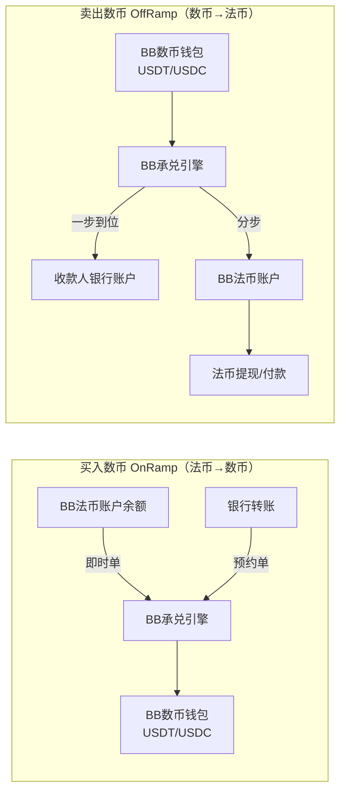
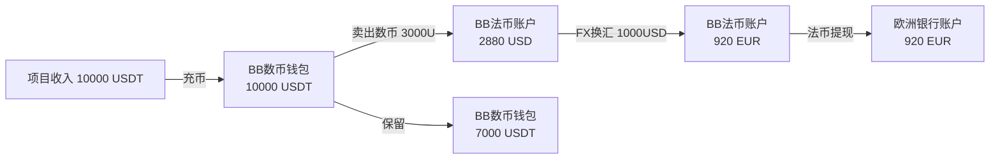
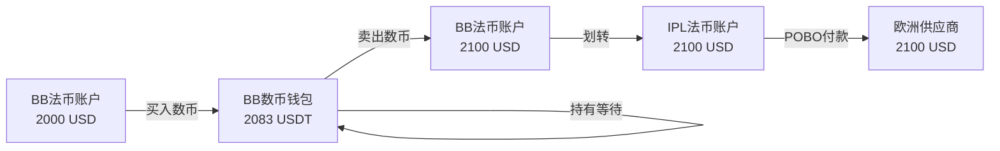

# 承兑产品 — Introduction & Phase 1 范围

## 文档信息

| 项目     | 内容                 |
| -------- | -------------------- |
| 文档版本 | v2.0                 |
| 创建日期 | 2026-02-11           |
| 最后更新 | 2026-02-27           |
| 文档状态 | 定稿                 |
| 产品名称 | 数法融合承兑解决方案 |

**Phase 1 核心决策：**

> - **承兑业务由 BB 单一承接**：承兑引擎、承兑法币账户、汇率、合规/风控、数币钱包均走 BB
> - **IPL 负责法币收付款**：VA 收款、POBO 出款、法币账户均走 IPL（独立产品，不在承兑流程中）
> - **承兑与收付款独立**：OnRamp/OffRamp 在 BB 内部闭环（A1+B1），不涉及 IPL 法币账户
> - **跨 SP 划转**：作为独立产品（FIAT_TRANSFER），商户需要跨账户转移资金时自行发起

---

## 目录

0. [术语定义](#0-术语定义)
1. [业务背景与客户画像](#1-业务背景与客户画像)
   - 1.1 [业务背景](#11-业务背景)
   - 1.2 [客户画像](#12-客户画像)
   - 1.3 [客户痛点](#13-客户痛点)
2. [EX平台角色与合作模式](#2-ex平台角色与合作模式)
   - 2.1 [EX平台架构总览](#21-ex平台架构总览)
   - 2.2 [角色定义：IPL、BB、XPAY](#22-角色定义iplbbxpay)
   - 2.3 [Phase 1 承兑模式](#23-phase-1-承兑模式)
   - 2.4 [产品模型与能力定义](#24-产品模型与能力定义)
     - 2.4.1 [独立产品及其自带能力](#241-独立产品及其自带能力)
     - 2.4.2 [租户签约承兑产品时的配置](#242-租户签约承兑产品时的配置)
     - 2.4.3 [客户交易范围](#243-客户交易范围)
   - 2.5 [客户生命旅程](#25-客户生命旅程)
3. [Phase 1 范围（需求清单）](#3-phase-1-范围需求清单)
   - 3.1 [Phase 1 核心决策](#31-phase-1-核心决策)
   - 3.2 [Phase 1 需求清单](#32-phase-1-需求清单)
   - 3.3 [Phase 1 不包含项](#33-phase-1-不包含项)

---

## 0. 术语定义

> 以下术语在本文档及相关 PRD 中统一使用。

### 0.1 交易类型术语

| 中文 | 英文 | 定义 | 资金流向 | 所属产品 |
| ---- | ---- | ---- | -------- | -------- |
| **充币** | Crypto Deposit | 从外部链上地址将数字货币转入平台数币钱包 | 链上地址 → BB 数币钱包 | 数币钱包（自带能力） |
| **提币** | Crypto Withdrawal | 从平台数币钱包将数字货币转出到外部链上地址 | BB 数币钱包 → 链上地址 | 数币钱包（自带能力） |
| **法币充值** | Fiat Deposit | 从外部银行账户将法币转入平台法币账户（同名转账） | 银行账户 → 法币账户 | 法币账户（自带能力） |
| **法币提现** | Fiat Withdrawal | 从平台法币账户将法币提现到商户自有银行账户（同名） | 法币账户 → 银行账户 | 法币账户（自带能力） |
| **买入数币（OnRamp）** | OnRamp / Buy Crypto | 用法币购买数字货币，法币从 BB 法币账户扣除，数币入到 BB 数币钱包 | BB 法币账户 → BB 数币钱包 | 承兑产品（OnRamp） |
| **卖出数币（OffRamp）** | OffRamp / Sell Crypto | 将数字货币兑换为法币，数币从 BB 数币钱包扣除，法币入到 BB 法币账户（或直接付到收款人） | BB 数币钱包 → BB 法币账户 | 承兑产品（OffRamp） |
| **划转** | Fiat Transfer | 跨 SP 法币账户间的资金转移（如 IPL USD → BB USD） | SP-A 法币账户 → SP-B 法币账户 | 独立产品（FIAT_TRANSFER） |

### 0.2 账户术语

| 中文 | 英文 | 定义 | 归属 SP |
| ---- | ---- | ---- | ------- |
| **BB 数币钱包** | BB Crypto Wallet | 商户在 BB 开设的数字货币钱包（USDT/USDC） | BB |
| **BB 法币账户** | BB Fiat Account | 商户在 BB 开设的法币账户，承兑资金落入此账户 | BB |
| **IPL 法币账户** | IPL Fiat Account | 商户在 IPL 开设的法币账户，用于法币收付款（VA/POBO） | IPL |

### 0.3 角色术语

| 中文 | 英文 | 定义 |
| ---- | ---- | ---- |
| **SA** | SaaS Admin | EX 平台管理后台 |
| **SP** | Service Provider | 服务提供商，提供底层支付能力 |
| **TP** | Tenant | 租户，购买 SP 能力为商户提供服务 |
| **MP** | Merchant Portal | 商户端，最终使用支付服务的企业 |

### 0.4 退回与退款

| 中文 | 英文 | 定义 |
| ---- | ---- | ---- |
| **退回（Return）** | Return | 交易失败，资金原路退回（系统自动或清算确认） |
| **退款（Refund）** | Refund | 交易已成功，事后商户主动发起退款 |

> 详见 `refund.md`。

---

## 1. 业务背景与客户画像

### 1.1 业务背景

EX是一家科技公司，提供 **Payment Platform as a Service** 服务。承兑产品是EX平台上的核心业务之一，解决数字货币与法币之间的兑换和出入金需求。

```
┌─────────────────────────────────────────────────────────────────────────────┐
│                      EX SaaS 平台架构（Phase 1）                              │
└─────────────────────────────────────────────────────────────────────────────┘

┌─────────────────────────────────────────────────────────────────────────────┐
│                              SA (SaaS Admin)                                │
│                           EX 平台管理后台                                    │
│              - SP管理  - 租户管理  - 全局配置  - 数据统计                      │
└─────────────────────────────────────────────────────────────────────────────┘
                                    │
                    ┌───────────────┴───────────────┐
                    ▼                               ▼
        ┌───────────────────┐           ┌───────────────────┐
        │   BB (SP)         │           │   IPL (SP)        │
        │  承兑服务商        │           │  法币收付服务商    │
        │  - 数币钱包        │           │  - VA 收款         │
        │  - 承兑引擎        │           │  - POBO 出款       │
        │  - 法币账户        │           │  - 法币账户        │
        │  - 代收付账户      │           │                   │
        └───────────────────┘           └───────────────────┘
              承兑+数币+法币                  法币收付款
                    │                               │
                    └───────────────┬───────────────┘
                                    │ 提供支付能力（各自独立）
                                    ▼
┌───────────────────────────────────────────────────────────────────────────┐
│                         Tenant (租户层)                                    │
│                    如: 环球、TC、WB、FOPAY等                                │
│              - 商户管理  - 费率配置  - 交易查看  - 渠道配置                   │
└───────────────────────────────────────────────────────────────────────────┘
                    │
                    │ 商户归属于租户
                    ▼
┌───────────────────────────────────────────────────────────────────────────┐
│                         Merchant (商户层)                                  │
│                      最终使用支付服务的企业客户                              │
│              - 交易查询  - 出款申请  - 账户管理  - 对账下载                   │
└───────────────────────────────────────────────────────────────────────────┘
```

### 1.2 客户画像

**画像一：WEB2外贸/服贸客户**

- 在数币友好国家开展业务
- 买家需用数币付款
- 原因：汇率不稳定（稳定币合法）或外汇管制严格
- 典型场景：跨境电商卖家收到USDT，需兑换为USD/EUR付给供应商

**画像二：WEB3行业客户**

- 需要WEB2行业的off-ramp渠道能力
- 收到数币后需回到现实世界消费/支付
- 面临银行对WEB3背景资金不友好的问题
- 典型场景：加密项目方收到USDT，需兑换为法币支付运营费用

### 1.3 客户痛点

| 痛点 | 描述 | 对应能力 |
| ---- | ---- | -------- |
| **数币入金难** | WEB2客户想收WEB3货币，缺少数币钱包能力（地址、充币） | BB数币钱包 |
| **法币出款难** | 收到数币后，给供应商/服务商付款仍需法币，付款行需是WEB2银行 | BB承兑 + BB法币出款 |
| **合规通道缺** | WEB3背景资金难以进入传统银行体系 | IPL法币VA收款 + POBO出款 |

---

## 2. EX平台角色与合作模式

### 2.1 EX平台架构总览

| 角色 | 英文 | Portal | 说明 |
| ---- | ---- | ------ | ---- |
| **平台管理员** | SaaS Admin | SA | EX平台总管理后台 |
| **服务提供商** | Service Provider (SP) | PP | 提供底层支付能力（收付款、承兑、数币收单、法币收单、发卡等） |
| **租户** | Tenant | TP | 使用SP能力，为商户提供支付服务 |
| **商户** | Merchant | MP | 最终使用支付服务的企业，必须归属于某个租户 |
| **渠道** | Channel | - | SP内部概念，不在EX/TP层面暴露 |

### 2.2 角色定义：IPL、BB、XPAY

#### BB — 承兑服务商 (SP)

| 属性 | 说明 |
| ---- | ---- |
| **角色** | EX平台上的SP（服务提供商） |
| **核心能力** | 数币钱包（USDT/USDC）、承兑引擎（U→USD）、代收付账户、法币账户 |
| **内部渠道** | 可通过XPAY渠道（BB内部Channel）扩展VA和POBO能力 |
| **对外暴露** | 统一的承兑服务能力，底层Channel对租户透明 |

#### IPL — 法币收付服务商 (SP)

| 属性 | 说明 |
| ---- | ---- |
| **角色** | EX平台上的SP（服务提供商） |
| **核心能力** | VA收款、POBO出款、法币账户 |
| **本期定位** | 独立的法币收付款服务商，**不参与承兑流程** |
| **合作模式** | 与BB为集团内部合作，对外不作为BB渠道，非代理行模式 |
| **客户入网** | 如商户需使用IPL收付款能力，需在IPL单独入网 |

#### XPAY — BB内部渠道 (Channel)

| 属性 | 说明 |
| ---- | ---- |
| **角色** | BB的底层Channel，**不是独立SP** |
| **核心能力** | 为BB提供独立的法币VA和POBO能力 |
| **合作模式** | BB与XPAY是渠道合作，代理行模式 |
| **对外可见性** | EX和TP都看不到XPAY，只在BB系统内部管理 |

> **关键区分**：IPL是独立SP，在EX平台上可见；XPAY不是SP，是BB的内部Channel，EX/TP看不到。

### 2.3 Phase 1 承兑模式

> **Phase 1 核心原则：承兑在 BB 内部闭环，IPL 负责独立的法币收付款。**

#### Phase 1：BB 内部闭环承兑

```
┌─────────────────────────────────────────────────────────────────────────────┐
│                    Phase 1 承兑模式：BB 内部闭环                               │
└─────────────────────────────────────────────────────────────────────────────┘

  ┌───────────────────────────────────────────────────┐
  │                    BB (SP) — 承兑服务商              │
  │                                                     │
  │  ┌──────────────┐     ┌──────────────────────────┐ │
  │  │  BB核心能力   │     │  底层Channel（内部）      │ │
  │  │              │     │                          │ │
  │  │  数币钱包     │     │  ┌────────────────────┐ │ │
  │  │  承兑引擎     │     │  │  BB代收付账户      │ │ │
  │  │  法币账户     │     │  │  (法币充值/出款)   │ │ │
  │  │              │     │  ├────────────────────┤ │ │
  │  │              │     │  │  XPAY渠道          │ │ │
  │  │              │     │  │  (VA+POBO，对外透明)│ │ │
  │  └──────────────┘     │  └────────────────────┘ │ │
  │                        └──────────────────────────┘ │
  └───────────────────────────────────────────────────┘

  买入数币(OnRamp)：BB法币账户(USD) → BB承兑引擎 → BB数币钱包(USDT)
  卖出数币(OffRamp)：BB数币钱包(USDT) → BB承兑引擎 → BB法币账户(USD)
  OffRamp一步到位：BB数币钱包(USDT) → BB承兑引擎 → 直接付到收款人银行
```

**Phase 1 特点：**

- 租户签约 BB 即可使用承兑产品
- 承兑在 BB 内部完成：数币钱包 ↔ 法币账户 ↔ 承兑引擎 全部在 BB
- BB 内部决定用代收付账户还是 XPAY 渠道，对 TP/商户完全透明
- IPL 作为独立收付款 SP，**不参与承兑流程**

**IPL 法币收付款（独立产品，与承兑无关）：**

```
  ┌─────────────────┐
  │   IPL (SP)      │
  │  法币收付服务商  │
  │                 │
  │  - VA 收款      │  ← Payins 产品
  │  - POBO 出款    │  ← Payouts 产品
  │  - 法币账户     │  ← 账户产品
  └─────────────────┘

  如商户同时签约了 IPL，可获得：
  - IPL 法币账户（VA 同名充值、法币提现）
  - IPL POBO 出款能力
  这些与承兑无关，属于独立的法币收付款业务线。
```

**跨 SP 划转（独立产品）：**

```
  如商户同时拥有 BB 和 IPL 法币账户，可通过划转在两个账户间移动资金：

  IPL 法币账户(USD) ←→ BB 法币账户(USD)

  划转是独立产品（FIAT_TRANSFER），不属于承兑范畴。
  详见 exchange-product-attributes.md 第3节。
```

**Phase 2 演进（☐ 暂不实现）：**

| 能力 | 说明 |
| ---- | ---- |
| IPL-BB 打通承兑 | 承兑流程中自动跨 SP 划转（A2/B2 场景） |
| EX 统一汇率引擎 | 智能路由到最优 SP |
| 多 SP 承兑 | 不同 SP 提供承兑服务，按路由分配 |

---

### 2.4 产品模型与能力定义

#### 2.4.1 独立产品及其自带能力

> **法币账户和数币钱包是独立产品**，开通即自带充值/提现、充币/提币能力。
> **承兑产品开通时自动开通 BB 数币钱包 + BB 法币账户。**
> **IPL 法币账户是独立的收付款产品，与承兑无关。**

```
┌─────────────────────────────────────────────────────────────────────────────┐
│                     Phase 1 产品与自带能力                                    │
├─────────────────────────────────────────────────────────────────────────────┤
│                                                                             │
│  【BB数币钱包】（独立产品，承兑时自动开通）                                    │
│  ┌─────────────────────────────────────────────────────────────────────┐   │
│  │  开通即具备：                                                        │   │
│  │  - 充币：链上充币到钱包地址                                           │   │
│  │  - 提币：链上提币到外部地址                                           │   │
│  └─────────────────────────────────────────────────────────────────────┘   │
│                                                                             │
│  【BB法币账户】（独立产品，承兑时自动开通）                                    │
│  ┌─────────────────────────────────────────────────────────────────────┐   │
│  │  开通即具备：                                                        │   │
│  │  - 法币充值：BB代收付账户/XPAY VA 同名充值                           │   │
│  │  - 法币提现：法币提现到商户银行账户                                   │   │
│  └─────────────────────────────────────────────────────────────────────┘   │
│                                                                             │
│  【承兑产品】（OnRamp/OffRamp）                                              │
│  ┌─────────────────────────────────────────────────────────────────────┐   │
│  │  承兑能力：USDT/USDC ↔ USD（本期仅支持 U↔USD）                     │   │
│  │  承兑资金全部在 BB 内部流转（BB法币账户 ↔ BB数币钱包）               │   │
│  │                                                                     │   │
│  │  开通承兑产品时自动开通：                                              │   │
│  │  ☑ BB数币钱包（固定，不可更改）                                       │   │
│  │  ☑ BB法币账户（固定，不可更改）                                       │   │
│  │  → BB审核通过即可使用：承兑 + 数币钱包 + BB法币账户                   │   │
│  └─────────────────────────────────────────────────────────────────────┘   │
│                                                                             │
│  【IPL法币账户】（独立收付款产品，与承兑无关）                                │
│  ┌─────────────────────────────────────────────────────────────────────┐   │
│  │  开通即具备：                                                        │   │
│  │  - 法币充值：VA同名充值（贸易背景下）                                 │   │
│  │  - 法币提现：法币提现到银行账户                                       │   │
│  │  - POBO出款：法币付款到收款人银行账户                                 │   │
│  │                                                                     │   │
│  │  独立签约 IPL，独立审核，与 BB 审核互不依赖。                          │   │
│  │  ⚠ 本期承兑流程不涉及 IPL 法币账户。                                  │   │
│  └─────────────────────────────────────────────────────────────────────┘   │
│                                                                             │
│  【划转产品】（FIAT_TRANSFER，独立产品）                                      │
│  ┌─────────────────────────────────────────────────────────────────────┐   │
│  │  跨SP法币账户间资金转移：IPL USD ↔ BB USD                           │   │
│  │  前提：商户同时拥有 BB 和 IPL 法币账户                                │   │
│  │  不属于承兑范畴，商户自行发起。                                        │   │
│  └─────────────────────────────────────────────────────────────────────┘   │
│                                                                             │
└─────────────────────────────────────────────────────────────────────────────┘
```

#### 2.4.2 租户签约承兑产品时的配置

> 租户签约承兑产品时，BB数币钱包+BB法币账户默认开通。IPL法币账户是独立产品，需单独签约。

```
┌─────────────────────────────────────────────────────────────────────────────┐
│                    租户签约承兑产品 — 配置项（Phase 1）                       │
├─────────────────────────────────────────────────────────────────────────────┤
│                                                                             │
│  承兑能力提供方：BB（固定，不可更改）                                        │
│                                                                             │
│  默认开通（固定，不可更改）：                                                  │
│  ☑ BB数币钱包                                                                │
│  ☑ BB法币账户                                                                │
│                                                                             │
│  承兑资金流向：BB法币账户 ↔ BB数币钱包（BB内部闭环）                        │
│                                                                             │
│  审核：                                                                      │
│  - BB审核通过 → 承兑 + 数币钱包 + BB法币账户 全部可用                       │
│                                                                             │
│  IPL法币账户（独立产品，与承兑无关）：                                        │
│  - 如租户同时签约了IPL，商户可额外开通IPL法币账户                             │
│  - IPL审核独立，通过后可使用VA收款 + POBO出款                                │
│  - IPL法币账户不参与承兑流程                                                  │
│                                                                             │
└─────────────────────────────────────────────────────────────────────────────┘
```

**产品开通后商户获得的能力矩阵：**

| 能力 | 仅BB通过 | BB+IPL都通过 |
| ---- | -------- | ------------ |
| 数币钱包（充币/提币） | ✅ | ✅ |
| BB法币账户（法币充值/法币提现） | ✅ | ✅ |
| 承兑（买入数币/卖出数币） | ✅ | ✅ |
| IPL法币账户（法币充值/法币提现） | ❌ | ✅ |
| IPL VA同名收款 | ❌ | ✅ |
| IPL POBO出款 | ❌ | ✅ |
| 划转（IPL↔BB） | ❌ | ✅ |

> **关键规则**：BB和IPL审核互不依赖。BB通过即可使用承兑核心功能。IPL通过后获得独立的法币收付款能力，与承兑无关。

#### 2.4.3 客户交易范围

> 以下是商户开通相关产品后可执行的交易类型。

**1. 充币（Crypto Deposit）**

```
  外部链上地址 ──→ BB数币钱包
  前提：已开通BB数币钱包
```

**2. 提币（Crypto Withdrawal）**

```
  BB数币钱包 ──→ 外部链上地址
  前提：BB数币钱包有余额
```

**3. 法币充值（Fiat Deposit）**

```
  BB法币账户充值：银行转账 → BB代收付账户/XPAY VA → BB法币账户
  IPL法币账户充值：银行转账 → IPL VA → IPL法币账户（需贸易背景）
  所有法币充值必须同名转账，第三方转账自动退回。
```

**4. 法币提现（Fiat Withdrawal）**

```
  BB法币账户 ──提现──→ 商户银行账户（同名）
  IPL法币账户 ──提现──→ 商户银行账户（同名）
```

**5. 卖出数币 / OffRamp（数币→法币）— 两种方式**

```
  方式一：一步到位（承兑+付款一笔订单）
  BB数币钱包(USDT) ──承兑为USD──→ 直接付到收款人银行账户

  方式二：分两步
  第1步（卖出数币）：BB数币钱包(USDT) ──承兑为USD──→ BB法币账户
  第2步（法币提现/付款）：BB法币账户 ──提现/POBO──→ 银行账户
```

**6. 买入数币 / OnRamp（法币→数币）— 三种方式**

```
  方式一：余额承兑（即时单）
  BB法币账户余额(USD) ──承兑──→ BB数币钱包(USDT)

  方式二：预约单（VA收款+承兑一单到底）
  商户下预约单 → 银行转账到BB VA → 系统自动承兑 → BB数币钱包(USDT)

  方式三：分两步
  第1步（法币充值）：银行转账 → BB法币账户
  第2步（买入数币）：BB法币账户 ──承兑──→ BB数币钱包
```

**7. 划转（Fiat Transfer）**

```
  IPL法币账户(USD) ←→ BB法币账户(USD)
  前提：商户同时拥有BB和IPL法币账户
  独立产品，不属于承兑范畴。
```

**交易范围汇总：**

```
┌─────────────────────────────────────────────────────────────────────────────┐
│                     Phase 1 客户交易范围总览                                  │
├─────────────────────────────────────────────────────────────────────────────┤
│                                                                             │
│  【数币入金】                                                                │
│  充币 ─────────── 链上 → BB数币钱包                                          │
│                                                                             │
│  【法币入金】                                                                │
│  BB法币充值 ───── BB代收付/XPAY VA → BB法币账户                             │
│  IPL法币充值 ──── IPL VA → IPL法币账户（需贸易背景，与承兑无关）             │
│                                                                             │
│  【承兑（BB内部闭环）】                                                      │
│  卖出数币(OffRamp) ── BB数币钱包(U) → BB法币账户(USD)（或直接付出去）       │
│  买入数币(OnRamp) ─── BB法币账户(USD) → BB数币钱包(U)（或预约单一步到位）   │
│                                                                             │
│  【数币出金】                                                                │
│  提币 ─────────── BB数币钱包 → 外部链上地址                                  │
│                                                                             │
│  【法币出金】                                                                │
│  BB法币提现 ───── BB法币账户 → 商户银行账户                                  │
│  IPL法币提现 ──── IPL法币账户 → 商户银行账户（与承兑无关）                   │
│  POBO付款 ─────── BB/IPL法币账户 → 收款人银行账户                            │
│                                                                             │
│  【跨SP划转（独立产品）】                                                    │
│  划转 ─────────── IPL法币账户 ↔ BB法币账户                                  │
│                                                                             │
└─────────────────────────────────────────────────────────────────────────────┘
```

---

### 2.5 客户生命旅程（Customer Lifecycle Journey）

> 从商户注册到日常交易的完整生命旅程。

#### 2.5.1 旅程总览


#### 2.5.2 旅程阶段详解

**阶段一：注册 & 入网**

| 步骤 | 操作方 | 动作 | 系统行为 |
| ---- | ------ | ---- | -------- |
| 1 | 商户 | MP端注册账号 | 创建Identity ID + User ID，分配MID |
| 2 | 商户 | 选择归属租户 | 建立商户-租户归属关系 |
| 3 | 商户 | 提交KYC资料 | 企业信息、法人信息、业务范围、合规文件 |
| 4 | 系统 | — | 资料暂存，等待产品选择后推送SP审核 |

> **关键规则**：注册即创建MID，无需TP先审核。KYC审核由SP负责，EX不做合规审核。

**阶段二：产品开通**

| 步骤 | 操作方 | 动作 | 系统行为 |
| ---- | ------- | ---- | -------- |
| 1 | 商户/TP | 选择承兑产品（OnRamp/OffRamp） | 自动绑定BB数币钱包 + BB法币账户 |
| 2 | 系统 | 推送BB审核 | BB审核承兑+数币钱包+BB法币账户 |
| 3 | BB | 审核商户资料 | 通过 → 开通承兑+数币钱包+BB法币账户 |
| 4 | 商户（可选） | 另外申请IPL法币账户 | 如租户允许，推送IPL审核（与承兑无关） |
| 5 | IPL（如需） | 审核商户资料 | 通过 → 开通IPL法币账户（VA+POBO） |

> **关键规则**：BB审核通过即可使用承兑核心功能。IPL是独立产品，审核互不依赖，与承兑无关。

**阶段三：入金**

| 入金方式 | 资金流向 | 前提条件 | 订单类型 |
| -------- | -------- | -------- | -------- |
| 充币 | 外部链上地址 → BB数币钱包 | BB数币钱包已开通 | 充币 |
| BB法币充值 | 银行转账 → BB代收付账户 → BB法币账户 | BB法币账户已开通 | 法币充值 |
| XPAY VA充值 | 银行转账 → XPAY VA → BB法币账户 | BB法币账户已开通，商户无感知 | 法币充值 |
| IPL VA充值 | 银行转账 → IPL VA → IPL法币账户 | IPL法币账户已开通，需贸易背景 | 法币充值 |

> **关键规则**：所有法币充值必须同名转账，第三方转账自动退回。

**阶段四：承兑交易（BB内部闭环）**

**买入数币 / OnRamp（法币→数币）：**

| 方式 | 流程 | 订单数 | 适用场景 |
| ---- | ---- | ------ | -------- |
| 余额承兑（即时单） | BB法币账户余额 → 承兑 → BB数币钱包 | 1笔 onramp | 账户已有法币余额 |
| 预约单 | 下单 → 银行转账到BB VA/代收付 → 自动承兑 → BB数币钱包 | 1笔 onramp | 外部汇款直接买币 |
| 分步操作 | ①法币充值到BB法币账户 → ②发起onramp承兑 | 2笔 | 灵活控制时机 |

**卖出数币 / OffRamp（数币→法币）：**

| 方式 | 流程 | 订单数 | 适用场景 |
| ---- | ---- | ------ | -------- |
| 一步到位 | BB数币钱包 → 承兑 → 直接付到收款人银行 | 1笔 offramp | 卖币后直接付款 |
| 分步操作 | ①BB数币钱包 → 承兑 → BB法币账户 → ②法币提现/付款 | 2笔 | 先落入BB法币账户再操作 |



**阶段五：资产管理 & 换汇**

| 功能 | 说明 | 前提 |
| ---- | ---- | ---- |
| 资产总览 | 查看所有账户余额：BB数币钱包 + BB法币 + IPL法币（如有） | — |
| FX换汇 | 法币账户内不同币种互换（USD↔EUR/GBP/SGD等） | 法币账户有余额 |
| 跨SP划转 | IPL法币 ↔ BB法币，商户自行发起 | 同时开通BB+IPL |

> **换汇说明**：换汇发生在法币账户内部，不涉及数币。商户可将USD换为EUR用于欧洲供应商付款，或将EUR换为USD用于承兑买币。

**阶段六：出金**

| 出金方式 | 资金流向 | 前提条件 | 订单类型 |
| -------- | -------- | -------- | -------- |
| 提币 | BB数币钱包 → 外部链上地址 | 钱包有余额 | 提币 |
| BB法币提现 | BB法币账户 → 商户银行账户 | BB法币账户有余额 | 法币提现 |
| IPL法币提现 | IPL法币账户 → 商户银行账户 | IPL法币账户有余额 | 法币提现 |
| POBO付款 | BB/IPL法币账户 → 收款人银行账户 | 法币账户有余额，支持异名 | 付款 |

#### 2.5.3 典型客户旅程示例

**示例一：WEB2外贸客户 — 收USDT → 卖出数币 → 付供应商**

```
旅程：充币 → 卖出数币(OffRamp) → 法币提现/付款

1. 注册 & 开通承兑产品（BB审核通过）
2. 收到买家 5,000 USDT → 充币到BB数币钱包
3. 发起 卖出数币(OffRamp)：5,000 USDT → 承兑 → 4,800 USD 落入BB法币账户
4. 发起 POBO付款：从BB法币账户付 4,800 USD 给供应商银行账户
```


**示例二：WEB3项目方 — 收USDT → 部分卖出 → 换汇 → 提现**

```
旅程：充币 → 部分卖出数币 → 换汇 → 法币提现

1. 注册 & 开通承兑产品（仅BB）
2. 收到项目收入 10,000 USDT → 充币到BB数币钱包
3. 发起 卖出数币：3,000 USDT → 承兑 → 2,880 USD 落入BB法币账户
4. 发起 FX换汇：1,000 USD → 换为 920 EUR（用于欧洲运营）
5. 发起 法币提现：920 EUR 提现到公司欧洲银行账户
6. 剩余 7,000 USDT 留在数币钱包
```



**示例三：跨境电商 — 银行汇款直接买币（OnRamp预约单）**

```
旅程：买入数币(OnRamp预约单) → 提币到外部

1. 注册 & 开通承兑产品（BB审核通过）
2. 发起 买入数币 预约单：买入 10,000 USDT，系统返回BB VA收款信息
3. 从公司银行账户汇款 9,600 USD 到 BB VA
4. 系统收到入金 → 自动匹配预约单 → 执行承兑
5. 10,000 USDT 入到BB数币钱包
6. 发起 提币：10,000 USDT 提到外部链上地址（付给WEB3供应商）
```


**示例四：混合场景 — 买入+卖出+划转**

```
旅程：买入数币 → 持有 → 卖出数币 → 划转到IPL → POBO付款

1. 注册 & 开通承兑产品（BB审核通过）+ 额外开通IPL法币账户
2. 买入数币：从BB法币账户余额 2,000 USD → 承兑 → 2,083 USDT（即时单）
3. 等待USDT升值...
4. 卖出数币：2,083 USDT → 承兑 → 2,100 USD 落入BB法币账户
5. 划转：BB法币账户 2,100 USD → 划转到IPL法币账户
6. POBO付款：从IPL法币账户付 2,100 USD 给欧洲供应商
```



#### 2.5.4 旅程阶段与订单类型映射

| 旅程阶段 | 订单类型 | 涉及SP | 商户可见 |
| -------- | -------- | ------ | -------- |
| 充币 | 充币 | BB | ✅ |
| BB法币充值（代收付/XPAY VA） | 法币充值 | BB | ✅ |
| IPL法币充值（IPL VA） | 法币充值 | IPL | ✅ |
| 买入数币（即时单） | onramp | BB | ✅ |
| 买入数币（预约单） | onramp | BB | ✅ |
| 卖出数币（一步到位） | offramp | BB | ✅ |
| 卖出数币（分步-承兑） | offramp | BB | ✅ |
| FX换汇 | fx | BB / IPL | ✅ |
| 提币 | 提币 | BB | ✅ |
| BB法币提现 | 法币提现 | BB | ✅ |
| IPL法币提现 | 法币提现 | IPL | ✅ |
| POBO付款 | 付款 | IPL / BB | ✅ |
| 划转 | 划转 | BB + IPL | ✅ |

#### 2.5.5 旅程中的关键业务规则

| 规则 | 说明 |
| ---- | ---- |
| **同名转账** | 所有法币充值必须同名，第三方转账自动退回 |
| **Purpose Code** | 银行转账备注必须填写Purpose Code，否则自动退回 |
| **预约单有效期** | OnRamp预约单72小时有效，超时自动过期 |
| **承兑引擎唯一** | 所有承兑（买入/卖出数币）固定由BB处理 |
| **承兑BB内部闭环** | 承兑资金在BB法币账户↔BB数币钱包之间流转，不涉及IPL |
| **SP审核独立** | BB和IPL审核互不依赖，各自通过各自可用 |
| **账户按SP区分** | BB有BB余额，IPL有IPL余额，商户端分开展示 |
| **XPAY不可见** | XPAY是BB内部Channel，商户/TP/EX均不可见 |
| **划转独立产品** | 跨SP划转不属于承兑范畴，商户自行发起 |

---

## 3. Phase 1 范围（需求清单）

### 3.1 Phase 1 核心决策

> **Phase 1：BB承兑内部闭环 + IPL独立法币收付款，账户按SP区分**

| 项目 | Phase 1 支持 | Phase 2 扩展 |
| ---- | ------------ | ------------ |
| **承兑模式** | BB内部闭环（A1+B1） | IPL-BB打通承兑（A2/B2） |
| **SP范围** | BB（承兑）+ IPL（收付款） | YPay、ZPay等独立SP |
| **账户模型** | 按SP区分账户（BB账户、IPL账户独立） | 统一账户视图 |
| **承兑资金流向** | BB法币账户 ↔ BB数币钱包 | 可跨SP流转 |
| **划转** | 独立产品（FIAT_TRANSFER） | 承兑流程中自动划转 |
| **产品路由** | 每个产品唯一SP，无需路由 | 多SP提供同一产品时启用路由 |

**账户模型说明：**

```
┌─────────────────────────────────────────────────────────────────────────────┐
│                     Phase 1 账户模型（按SP区分）                              │
├─────────────────────────────────────────────────────────────────────────────┤
│                                                                             │
│  【商户视角】                                                                │
│  ┌──────────────────────────┐  ┌──────────────────────────┐               │
│  │  BB账户                   │  │  IPL账户（如有）          │               │
│  │  USDT钱包：5,000 USDT    │  │  USD法币账户：$3,000      │               │
│  │  USD法币账户：$7,000      │  │                           │               │
│  └──────────────────────────┘  └──────────────────────────┘               │
│                                                                             │
│  【核心规则】                                                                │
│  - 承兑资金在BB内部闭环（BB法币账户 ↔ BB数币钱包）                          │
│  - IPL法币账户用于独立的法币收付款，与承兑无关                               │
│  - 如需跨SP移动资金，通过划转产品自行发起                                    │
│                                                                             │
└─────────────────────────────────────────────────────────────────────────────┘
```

### 3.2 Phase 1 需求清单

#### 模块一：商户入网与产品开通

| 序号 | 需求描述 | 优先级 | 说明 |
| ---- | -------- | ------ | ---- |
| 1.1 | TP签约SP，获得产品代理权 | P0 | BB签约（承兑）/ IPL签约（收付款） |
| 1.2 | 商户注册即创建MID | P0 | 注册即入网，无需TP先审核 |
| 1.3 | 商户选择产品+提交KYC资料 | P0 | 产品驱动，一步到位 |
| 1.4 | 系统自动推送SP审核 | P0 | 根据产品→SP映射自动推送 |
| 1.5 | SP审核通过后产品开通 | P0 | EX不做合规审核，SP负责 |
| 1.6 | 2种产品开通方式 | P0 | 商户主动/TP开通 |
| 1.7 | 产品开通补充字段 | P2 | 后续完善 |

#### 模块二：费率汇率配置

| 序号 | 需求描述 | 优先级 | 说明 |
| ---- | -------- | ------ | ---- |
| 2.1 | 租户配置商户费率 | P0 | 不得低于SP商户最低报价 |
| 2.2 | 交易收费-支持内扣 | P0 | onramp内扣、offramp内扣/外扣、法币出款内扣/外扣、充值内扣、充币内扣、提币内扣/外扣 |
| 2.3 | 汇率 | P0 | 实时汇率，USDT/USDC差值范围内1:1 |

#### 模块三：交易处理

| 序号 | 需求描述 | 优先级 | 说明 |
| ---- | -------- | ------ | ---- |
| 3.1 | 租户可以看到交易 | P1 | 交易查询 |
| 3.2 | 充币（链上入金） | P0 | BB数币钱包 |
| 3.3 | 承兑处理（买入/卖出数币） | P0 | BB内部闭环 |
| 3.4 | 法币出款（POBO） | P0 | BB POBO / IPL POBO |
| 3.5 | 支持异名出款 | P0 | 出款人与收款人不同名 |
| 3.6 | 支持本地出款 | P0 | 本地银行转账 |
| 3.7 | 支持错名出款 | P1 | 收款人名称有差异 |
| 3.8 | 退款/退回流程 | P1 | 详见 refund.md |
| 3.9 | 划转（跨SP） | P0 | FIAT_TRANSFER，独立产品 |

#### 模块四：对账清算

| 序号 | 需求描述 | 优先级 | 说明 |
| ---- | -------- | ------ | ---- |
| 4.1 | 商户交易账单 | P1 | 按商户维度汇总交易明细，商户可在MP端查看/下载 |
| 4.2 | 租户分佣账单（按SP区分） | P1 | 租户与BB的分佣账单、租户与IPL的分佣账单，分别出具 |
| 4.3 | SP与租户的分佣结算单 | P1 | BB跟租户的结算单、IPL跟租户的结算单 |

#### 汇总视图

| 优先级 | 需求数 | 说明 |
| ------ | ------ | ---- |
| **P0** | 11项 | 必须交付，核心业务闭环 |
| **P1** | 5项 | 重要但可延后，不阻塞上线 |
| **P2** | 1项 | 后续迭代 |

### 3.3 Phase 1 不包含项

| 排除项 | 原因 | 计划阶段 |
| ------ | ---- | -------- |
| IPL-BB打通承兑 | 承兑在BB内部闭环，不涉及IPL法币账户 | Phase 2 |
| 承兑流程中自动跨SP划转 | A2/B2场景推迟 | Phase 2 |
| 多SP产品路由 | 每个产品唯一SP，无需路由 | Phase 2 |
| 独立SP接入（YPay等） | Phase 1只支持BB+IPL | Phase 2 |
| 统一账户出款 | 各SP账户独立出款 | Phase 2 |
| 按资金池分组账户 | Phase 1按SP区分账户 | Phase 2 |
| 收款/出款渠道灵活配置 | P2需求 | Phase 2 |
| 承兑目标账户选择（IPL/BB） | 承兑固定落入BB法币账户 | Phase 2 |

---

*文档版本：v2.0*
*创建日期：2026-02-11*
*最后更新：2026-02-27*
*变更说明：Phase 1 范围明确——承兑由BB内部闭环，IPL负责独立法币收付款，新增术语定义（充币/提币/法币充值/法币提现/买入数币/卖出数币/划转），去掉IPL法币账户在承兑流程中的角色*
