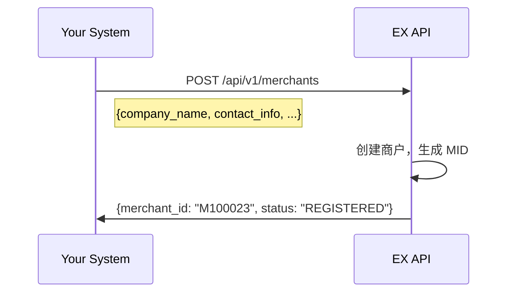
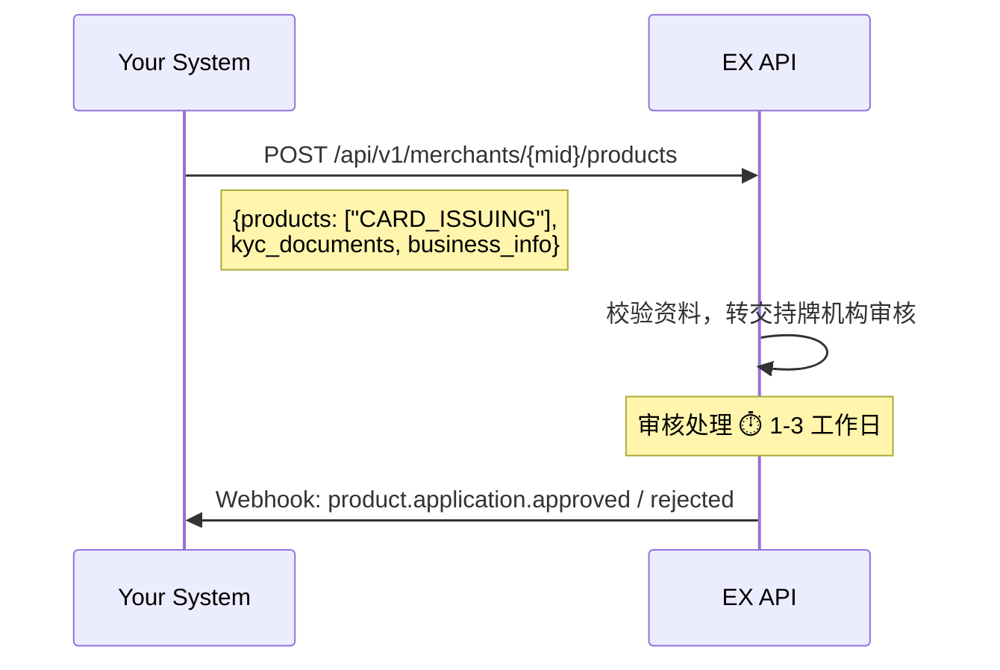
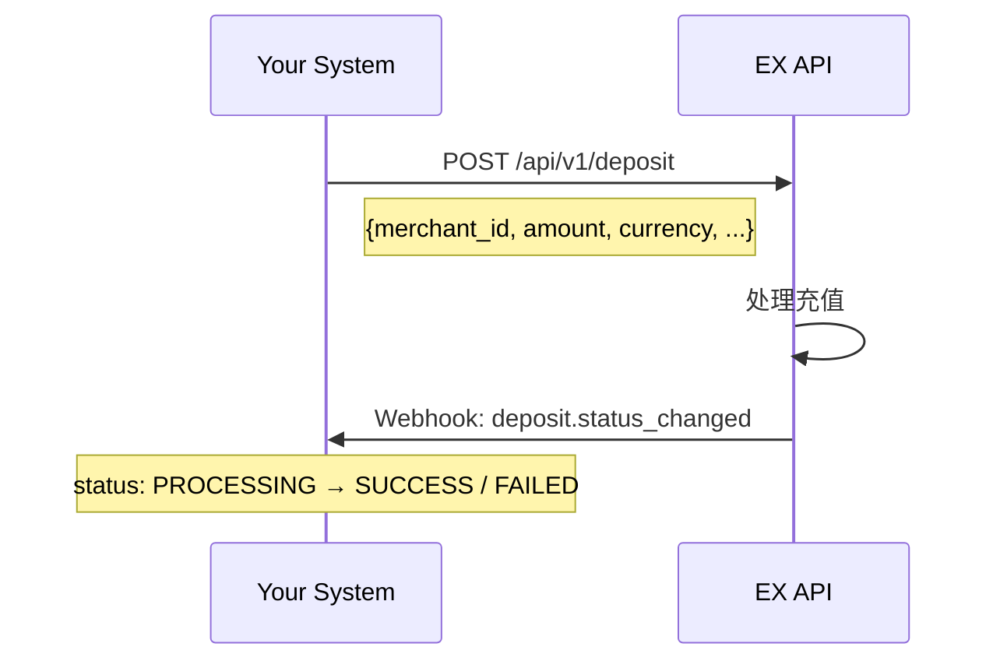
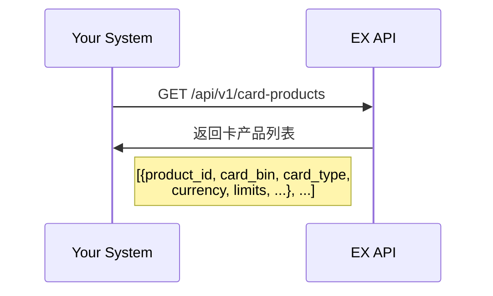
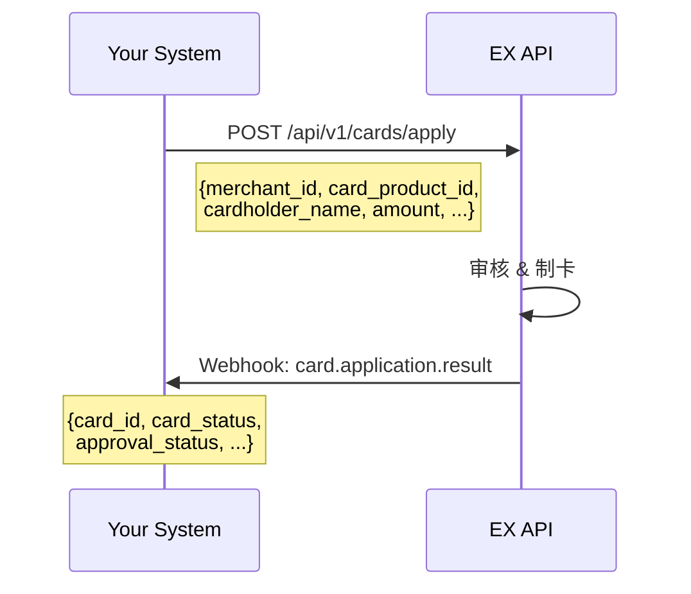

# EX VCC Solution

> **Document Type**: Solution Guide
> **Version**: v2.0
> **Last Updated**: 2026-04-02

---

## Overview

EX VCC Solution 为您提供**一站式虚拟信用卡（VCC）发行能力**，通过标准化的 RESTful API 和实时 Webhook 通知，您可以将完整的发卡能力快速集成到自有平台中。

**核心价值：**

- **快速上线** — 标准 API 接口，无需自建发卡基础设施，3-4 周即可完成集成
- **合规无忧** — 一次提交商户资料，EX 统一管理合规审核流程并同步结果，您无需单独对接合规机构
- **全生命周期管理** — 覆盖从商户入网、发卡、资金管理到交易监控的完整链路
- **灵活编排** — 各接口可按您的业务逻辑自由组合调用，适配不同平台架构

**适用客户：**

| 客户类型                      | 场景                                           |
| ----------------------------- | ---------------------------------------------- |
| **独立发卡平台**        | 已有商户管理系统，需要接入发卡能力作为核心业务 |
| **综合性支付平台**      | 已有收单、转账等能力，希望扩展 VCC 产品线      |
| **BaaS / Fintech 平台** | 为终端客户提供白标发卡服务                     |

---

## 1. 名词解释

| 术语     | 英文                          | 说明                                         | 粤语（广东话） |
| -------- | ----------------------------- | -------------------------------------------- | -------------- |
| 商户     | Merchant                      | 您平台上的终端客户，通过 EX 获得发卡能力     | 商戶           |
| MID      | Merchant ID                   | EX 为每个商户分配的唯一标识                  | —             |
| VCC      | Virtual Credit Card           | 虚拟信用卡，本方案的核心产品                 | 虛擬信用卡     |
| 卡 BIN   | Bank Identification Number    | 卡号前 6-8 位，标识发卡机构和卡产品          | 卡 BIN         |
| 持卡人   | Cardholder                    | 使用卡片进行消费的最终用户                   | 持卡人         |
| 充值     | Deposit                       | 向商户账户注入资金，作为发卡和消费的资金来源 | 充值           |
| 提现     | Withdrawal                    | 从商户账户提取资金                           | 提現           |
| 资金转入 | Card Load                     | 从商户账户向卡片转入资金                     | 資金轉入       |
| 资金转出 | Card Unload                   | 从卡片余额转回商户账户                       | 資金轉出       |
| 卡片限额 | Card Limit                    | 卡片的单笔/单日交易上限                      | 卡片限額       |
| KYB/KYC  | Know Your Business / Customer | 商户入网时的合规资料核验                     | —             |
| RFI      | Request for Information       | 合规审核期间要求补充材料的通知               | —             |
| 合规调单 | Compliance Review             | 交易或充值过程中触发的合规审查               | 合規調單       |
| 3DS      | 3-D Secure                    | 卡交易在线身份验证协议                       | —             |
| Webhook  | —                            | EX 主动推送事件通知到您系统的机制            | —             |

---

## 2. Architecture Overview

您的系统通过 EX API 接入，EX 负责统一的接口封装、审核流程编排、状态同步和事件通知。

```
┌──────────────────────────────────────────────────────────────────┐
│                       Your System                                │
│       (Card Issuing Platform / Payment Platform / BaaS)          │
└──────────────────┬───────────────────────────────────────────────┘
                   │  RESTful API + Webhook
                   ▼
┌──────────────────────────────────────────────────────────────────┐
│                       EX Platform                                │
│                                                                  │
│  ┌────────────┐  ┌────────────┐  ┌────────────┐  ┌───────────┐ │
│  │ Merchant   │  │ Product    │  │  Card      │  │ Webhook   │ │
│  │ Service    │  │ Service    │  │  Service   │  │ Service   │ │
│  └────────────┘  └────────────┘  └────────────┘  └───────────┘ │
│                                                                  │
│          Card BIN / Wallet / Settlement / Notification           │
└──────────────────────────────────────────────────────────────────┘
```

**调用链路：**

```
Your System → EX API → EX 处理（审核编排 + 发卡 + 资金）→ Webhook 通知 → Your System
```

> **提示**：您可根据自身平台的产品设计，在合适的业务节点调用对应接口。以下流程不要求严格按顺序一次性完成。

---

## 3. 前置流程 — Prerequisite

完成发卡前的准备工作：商户注册、产品开通、资料提交与审核、账户初始化。

---

### 3.1 商户注册 — Merchant Registering

在 EX 平台创建您的终端商户，获取唯一商户标识（MID）。



---

### 3.2 产品开通 — Product Activation

为商户申请开通 VCC产品。您只需提交商户资料，EX 会将信息转交至持牌合规机构进行审核，审核结果通过 Webhook 通知。



**关键说明：**

- 审核内容包括：商户主体合规性、业务场景合规性、KYB/KYC 资料核验（由持牌合规机构完成）
- 审核期间可能触发 **RFI**，要求补充材料（详见 [5.1 RFI 通知](#51-rfi-通知--request-for-information)）
- 您可根据自身平台设计，在用户注册、入网审核、或首次使用发卡功能时调用此流程

---

### 3.3 账户开通 — Account Provisioning

产品审核通过后，EX 会自动为该商户开通钱包/账户，用于资金的充值和提现。

```
产品审核通过
    │
    ├── 自动开通商户钱包/账户
    │     ├── 支持充值（Deposit）
    │     └── 支持提现（Withdrawal）
    │
    └── Webhook 通知: account.activated
```

> 您无需额外调用接口，产品开通成功后系统自动完成账户初始化。

---

## 4. vcc核心流程 — vcc Core

商户完成前置流程后，即可进入发卡运营的核心环节：充值、查询卡产品、开卡、卡管理、资金操作、交易查询。

---

### 4.1 充值 — Deposit

为终端商户账户充值，作为后续发卡和卡消费的资金来源。



充值订单的全生命周期状态变更均通过 Webhook 通知：

| Webhook 事件           | 说明                 |
| ---------------------- | -------------------- |
| `deposit.created`    | 充值订单已创建       |
| `deposit.processing` | 充值处理中           |
| `deposit.success`    | 充值成功，资金已入账 |
| `deposit.failed`     | 充值失败             |

> **注意**：充值过程中可能触发合规调单，详见 [5.2 合规调单通知](#52-合规调单通知--compliance-review)。

---

### 4.2 余额查询 — Balance

充值成功后，EX 会推送余额变动通知。您也可主动查询商户余额。

```
方式 1: Webhook 被动接收
    └── Webhook: balance.updated → {merchant_id, currency, available_balance, ...}

方式 2: API 主动查询
    └── GET /api/v1/merchants/{mid}/balance → 返回各币种可用余额
```

> **建议**：以 Webhook 通知为主，API 查询为辅。若未及时收到通知，或基于业务需求需要实时校验，可通过接口主动查询。

---

### 4.3 查询卡产品 — Card Products（可选）

在首次发卡前，建议先查询可用的卡产品列表。接口会返回可用的卡 BIN、卡种、币种、限额等信息，便于您在系统中展示给终端商户选择。



> **说明**：卡产品包括卡 BIN、卡种（虚拟卡/实体卡）、支持币种、单笔/单日限额等。您可基于返回信息在自己平台上设计卡产品选择页面。

---

### 4.4 发卡 — Card Issuance

商户账户有足够余额后，即可发起发卡申请。



**发卡申请结果通知（Webhook）包含：**

| 字段                 | 说明                     |
| -------------------- | ------------------------ |
| `notifyType`       | 通知类型（交易类型枚举） |
| `merchantNo`       | 商户 ID                  |
| `bizOrderNo`       | 业务订单号               |
| `applyId`          | 申请单号                 |
| `cardId`           | 卡 ID                    |
| `cardStatus`       | 卡状态                   |
| `approvalStatus`   | 审批状态                 |
| `approvalComments` | 审批意见                 |

---

### 4.5 卡信息查询 — Card Information

发卡成功后，可查询卡的详细信息，用于展示给持卡人。

| 接口         | 方法     | 说明                                   |
| ------------ | -------- | -------------------------------------- |
| 查询卡信息   | `POST` | 查询卡号、有效期、持卡人等基本信息     |
| 查询卡 CVV   | `POST` | 查询卡安全码（敏感信息，注意安全传输） |
| 查询卡片余额 | `POST` | 查询卡内可用余额                       |

---

### 4.6 卡片管理 — Card Lifecycle Management

对已发行的卡片进行日常管理操作。

| 操作       | 方法     | 说明                   |
| ---------- | -------- | ---------------------- |
| 冻结卡片   | `POST` | 临时冻结，卡片不可使用 |
| 解冻卡片   | `POST` | 恢复冻结的卡片         |
| 注销卡片   | `POST` | 永久注销，不可恢复     |
| 添加卡片   | `POST` | 同一商户下新增卡片     |
| 修改卡限额 | `POST` | 调整单笔/单日交易限额  |
| 修改持卡人 | `POST` | 变更持卡人信息         |

**Webhook 通知：**

- `card.status.changed` — 卡状态变更通知（冻结/解冻/注销等）

---

### 4.7 卡片资金操作 — Card Funding

管理卡片内的资金，支持从商户账户向卡片转入资金，或从卡片转出资金回商户账户。

| 操作                    | 方法     | 说明                   |
| ----------------------- | -------- | ---------------------- |
| 资金转入（Card Load）   | `POST` | 从商户账户向卡片充值   |
| 资金转出（Card Unload） | `POST` | 从卡片余额转回商户账户 |

---

### 4.8 交易查询与通知 — Card Transactions

监控和查询卡片的交易活动。

| 接口                 | 方法     | 说明                       |
| -------------------- | -------- | -------------------------- |
| 查询交易列表         | `POST` | 查询卡片的所有交易记录     |
| 查询非授权类交易详情 | `POST` | 查询退款、撤销等非授权交易 |
| 查询卡资金明细       | `POST` | 查询卡片的资金进出流水     |

**Webhook 通知：**

| 事件                        | 说明                                 |
| --------------------------- | ------------------------------------ |
| `card.transaction.result` | 卡交易结果通知（授权、扣款、退款等） |

---

## 5. 其他流程 — Additional Flows

以下流程在业务运营中可能被触发，请确保您的系统已做好对应处理。

---

### 5.1 RFI 通知 — Request for Information

在产品开通审核过程中，持牌合规机构可能要求补充材料。EX 会通过 Webhook 通知您。

```
Webhook 事件:
    │
    ├── product.application.rfi          → 需要补充审核材料
    │     └── 请引导商户及时提交补充信息
    │
    └── 提交后等待审核结果
          └── product.application.approved / rejected
```

> **建议**：在您的系统中设计 RFI 材料补充入口，收到通知后引导商户尽快提交，避免审核延迟。

---

### 5.2 合规调单通知 — Compliance Review

充值过程中，可能触发合规调单。请务必监听相关 Webhook 并及时响应。

```
Webhook 事件:
    │
    ├── deposit.compliance.action_required   → 需要补充材料
    │     └── 请引导商户及时提交补充信息
    │
    └── deposit.compliance.under_review      → 材料已提交，等待审核
```

> **重要**：调单通知需及时处理，超时未响应可能导致资金冻结。

---

### 5.3 3DS 验证 — 3-D Secure Verification

当卡片在支持 3DS 验证的商户消费时，EX 会推送 3DS 验证请求。

| 事件                      | 说明                                     |
| ------------------------- | ---------------------------------------- |
| `card.3ds.verification` | 需要您将验证信息传递给持卡人完成身份验证 |

> **建议**：在您的系统中预留 3DS 验证交互页面，确保持卡人能及时完成验证，避免交易被拒。

---

## 6. API Capability Summary

完整的 VCC API 能力矩阵：

| 模块                 | 接口                 | 方法     | 类型    |
| -------------------- | -------------------- | -------- | ------- |
| **卡申请服务** | 查询产品列表         | `GET`  | API     |
|                      | 虚拟卡申请           | `POST` | API     |
|                      | 查询申请详情         | `POST` | API     |
|                      | 卡申请结果通知       | `POST` | Webhook |
| **卡信息查询** | 查询卡 CVV           | `POST` | API     |
|                      | 查询卡信息           | `POST` | API     |
|                      | 查询卡片余额         | `POST` | API     |
| **卡管理服务** | 解冻卡片             | `POST` | API     |
|                      | 冻结卡片             | `POST` | API     |
|                      | 注销卡片             | `POST` | API     |
|                      | 添加卡片             | `POST` | API     |
|                      | 修改卡限额           | `POST` | API     |
|                      | 修改持卡人           | `POST` | API     |
|                      | 卡状态变更通知       | —       | Webhook |
| **卡交易服务** | 资金转入             | `POST` | API     |
|                      | 资金转出             | `POST` | API     |
|                      | 查询非授权类交易详情 | `POST` | API     |
|                      | 查询交易列表         | `POST` | API     |
|                      | 查询卡资金明细       | `POST` | API     |
|                      | 卡交易结果通知       | —       | Webhook |
|                      | 卡 3DS 验证通知      | —       | Webhook |

---

## 7. Webhook Events Summary

请配置 Webhook 接收地址，EX 会在以下事件发生时主动推送通知：

| 事件类别           | 事件                                   | 触发时机         |
| ------------------ | -------------------------------------- | ---------------- |
| **产品开通** | `product.application.approved`       | 产品审核通过     |
|                    | `product.application.rejected`       | 产品审核拒绝     |
|                    | `product.application.rfi`            | 需要补充材料     |
| **充值**     | `deposit.status_changed`             | 充值订单状态变更 |
|                    | `deposit.compliance.action_required` | 充值触发合规调单 |
| **余额**     | `balance.updated`                    | 账户余额变动     |
| **发卡**     | `card.application.result`            | 发卡申请结果     |
| **卡管理**   | `card.status.changed`                | 卡状态变更       |
| **卡交易**   | `card.transaction.result`            | 卡交易结果       |
|                    | `card.3ds.verification`              | 3DS 验证请求     |

---

## 8. Integration Best Practices

| # | 建议                   | 说明                                                           |
| - | ---------------------- | -------------------------------------------------------------- |
| 1 | **Webhook 优先** | 以 Webhook 事件驱动为主，API 轮询为辅，减少不必要的 API 调用   |
| 2 | **幂等处理**     | 同一事件可能重复推送，请基于业务订单号做幂等校验               |
| 3 | **签名验证**     | 所有 Webhook 请求包含 `x-signature` 头，务必验签确保来源合法 |
| 4 | **异步设计**     | 发卡、充值等操作均为异步处理，提交后通过 Webhook 获取最终结果  |
| 5 | **及时响应调单** | 合规调单有时效要求，超时未响应可能导致资金冻结或业务受限       |
| 6 | **敏感数据安全** | 卡号、CVV 等敏感信息需加密传输和存储，遵循 PCI DSS 要求        |
| 7 | **灵活编排**     | 各步骤可根据您的平台设计灵活编排调用时机，无需严格按顺序执行   |

---

## 9. Typical Integration Timeline

| 阶段                 | 内容                                      | 预估周期 |
| -------------------- | ----------------------------------------- | -------- |
| **环境准备**   | 获取 API Key、配置 Webhook 地址、联调环境 | 1-2 天   |
| **前置流程**   | 对接商户注册 + 产品开通接口               | 3-5 天   |
| **卡核心流程** | 对接充值、发卡、卡管理、交易查询接口      | 7-10 天  |
| **其他流程**   | 对接 RFI / 合规调单 / 3DS 等通知处理      | 2-3 天   |
| **联调测试**   | 端到端流程验证、异常场景覆盖              | 5-7 天   |
| 生产验证             | 生产环境切换、监控配置                    | 1-2 天   |

> 总计约 **3-4 周**，视技术团队规模和平台复杂度可调整。

---

## 10. Getting Started

准备开始接入？请联系您的 EX 客户经理获取：

1. **Sandbox 环境** — API Key + 测试环境地址
2. **API 文档** — 完整的接口参考文档（含请求/响应示例）
3. **技术支持** — 专属对接群 + 技术支持工程师
