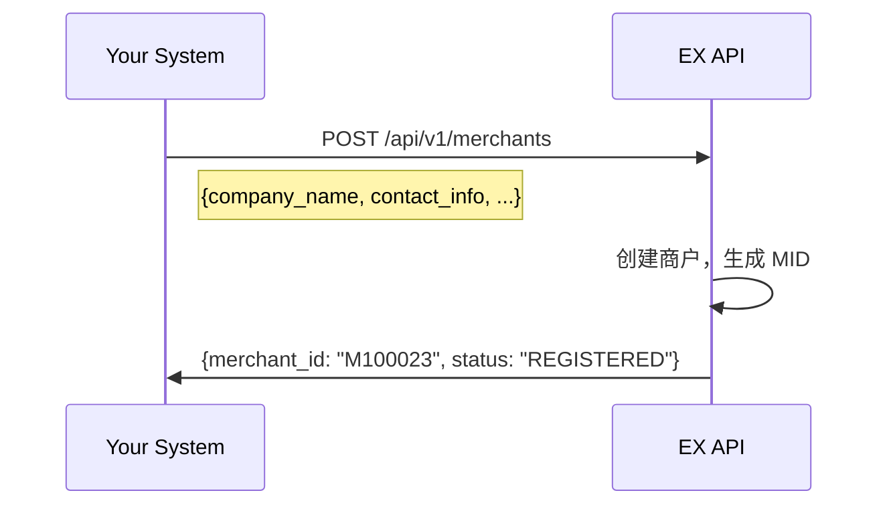
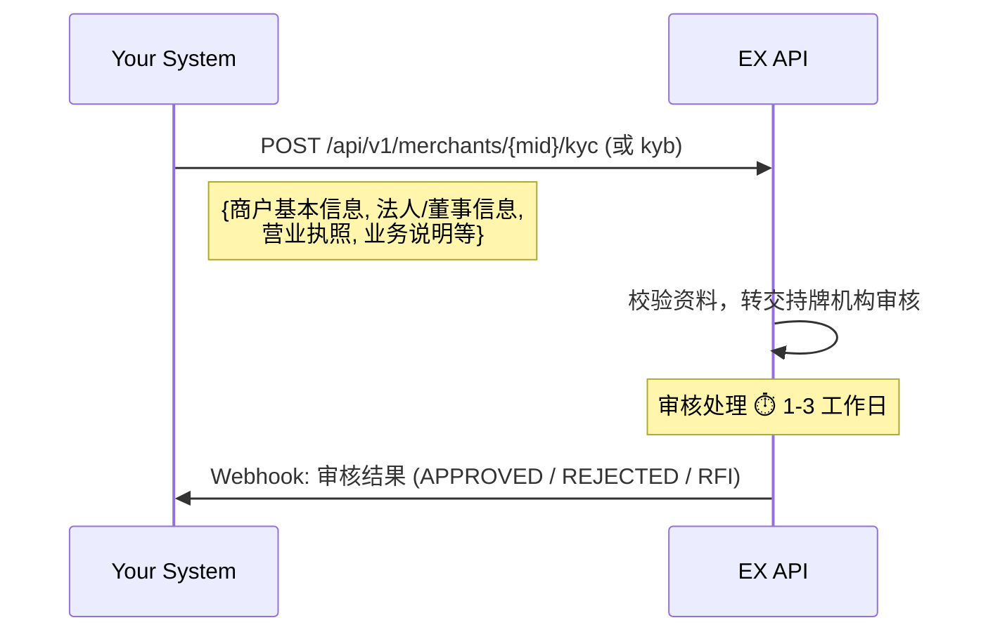
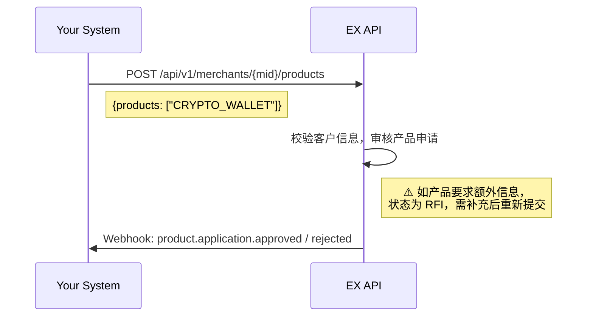
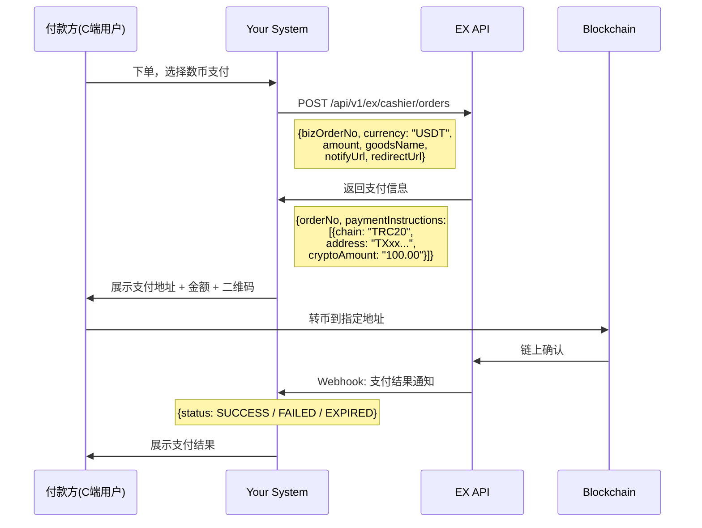
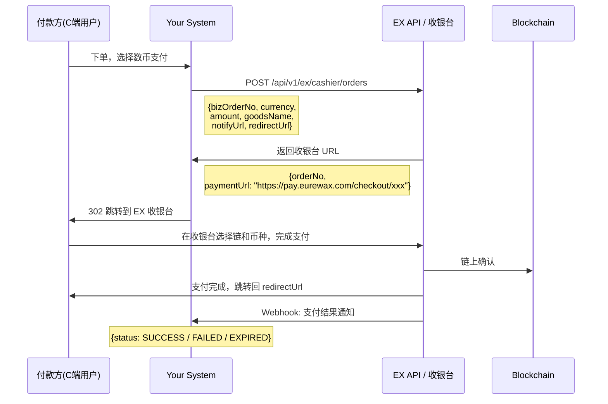

# EX Crypto Checkout Solution

> **Document Type**: Solution Guide
> **Version**: v1.0
> **Last Updated**: 2026-04-14
> **API Reference**: [EurewaX 开放平台](https://open.eurewax.com/)

---

## Overview

EX Crypto Checkout Solution 为您提供**一站式数字货币收单能力**，通过标准化的 RESTful API 和实时 Webhook 通知，您可以让终端用户使用 USDT、BTC、ETH 等主流数字货币完成支付，资金自动入账到商户数币钱包。

**核心价值：**

- **快速上线** — 标准 API 接口，最少只需对接 2 个接口（创建订单 + 支付结果通知），2-3 周即可完成集成
- **合规无忧** — 一次提交商户资料，EX 统一管理合规审核流程并同步结果，您无需单独对接合规机构
- **双模式收单** — API 直连模式（自建支付页面）+ 收银台模式（EX 托管支付页面），按需选择
- **多链多币** — 支持 USDT(TRC20/ERC20)、BTC、ETH 等主流数字资产，覆盖主要公链
- **灵活编排** — 各接口可按您的业务逻辑自由组合调用，适配不同平台架构

**适用客户：**

| 客户类型                   | 场景                                             |
| -------------------------- | ------------------------------------------------ |
| **OTA / 电商平台**   | 为用户提供数币支付选项，扩大支付方式覆盖         |
| **SaaS / 订阅平台**  | 接受数币订阅付款                                 |
| **游戏 / 数字内容**  | 游戏充值、数字内容购买的数币支付通道             |
| **跨境服务平台**     | 免去传统跨境支付的高手续费和长到账周期           |
| **综合支付平台**     | 已有法币收单能力，希望扩展数币收单产品线         |

---

## 1. 名词解释

| 术语       | 英文                    | 说明                                               |
| ---------- | ----------------------- | -------------------------------------------------- |
| 商户       | Merchant                | 您平台上的终端客户，通过 EX 获得数币收单能力       |
| MID        | Merchant ID             | EX 为每个商户分配的唯一标识                        |
| 收银订单   | Checkout Order          | 一笔数币收款请求，包含金额、币种、回调地址等       |
| 支付地址   | Payment Address         | EX 为每笔订单生成的链上收款地址                    |
| 链         | Chain / Network         | 区块链网络（如 Tron/TRC20、Ethereum/ERC20、Bitcoin）|
| 链上确认   | On-chain Confirmation   | 区块链网络确认交易的过程，确认数达标后才入账       |
| 收银台     | Hosted Checkout         | EX 托管的支付页面，付款方在 EX 页面完成支付        |
| API 直连   | API Direct              | 您自建支付 UI，通过 API 获取支付信息展示给付款方   |
| KYB/KYC    | Know Your Business / Customer | 商户入网时的合规资料核验                     |
| RFI        | Request for Information | 合规审核期间要求补充材料的通知                     |
| Webhook    | —                      | EX 主动推送事件通知到您系统的机制                  |

---

## 2. Architecture Overview

您的系统通过 EX API 接入，EX 负责统一的接口封装、订单管理、链上监控、状态同步和事件通知。

```
┌──────────────────────────────────────────────────────────────────┐
│                       Your System                                │
│    (电商平台 / OTA / SaaS / 游戏平台 / 综合支付平台)             │
└──────────────────┬───────────────────────────────────────────────┘
                   │  RESTful API + Webhook
                   ▼
┌──────────────────────────────────────────────────────────────────┐
│                       EX Platform                                │
│                                                                  │
│  ┌────────────┐  ┌────────────┐  ┌────────────┐  ┌───────────┐ │
│  │ Merchant   │  │ Checkout   │  │ Blockchain │  │ Webhook   │ │
│  │ Service    │  │ Service    │  │ Monitor    │  │ Service   │ │
│  └────────────┘  └────────────┘  └────────────┘  └───────────┘ │
│                                                                  │
│       Order Management / Address Generation / Settlement         │
└──────────────────────────────────────────────────────────────────┘
```

**两种收单模式：**

```
模式一：API 直连
    Your System → 创建订单 → 获取支付地址+金额 → 自建 UI 展示给付款方 → 付款方转币 → Webhook 通知

模式二：收银台（Hosted Checkout）
    Your System → 创建订单 → 获取收银台 URL → 跳转 EX 收银台 → 付款方在 EX 页面支付 → Webhook 通知
```

> **提示**：两种模式使用同一个创建订单接口，区别在于您选择自建支付 UI 还是跳转 EX 收银台页面。

---

## 3. 前置流程 — Prerequisite

完成数币收单前的准备工作：商户注册、提交客户信息、产品开通。

---

### 3.1 商户注册 — Merchant Registering

在 EX 平台创建您的终端商户，获取唯一商户标识（MID）。



---

### 3.2 提交客户信息 — Customer Information

提交商户的 KYC/KYB 资料，EX 将信息转交至持牌合规机构进行审核。



**关键说明：**

- 附件先调用【上传文件】接口获取 URL，再放入业务请求
- 审核期间可能触发 **RFI**，要求补充材料（详见 [5.1 RFI 通知](#51-rfi-通知--request-for-information)）
- 客户信息审核通过是申请产品的前提

---

### 3.3 产品开通 — Product Activation

客户信息审核通过后，为商户申请开通加密钱包产品（聚合收银随加密产品自动开通）。



**关键说明：**

- 聚合收银能力随加密钱包产品开通自动启用，无需单独申请
- 产品开通时系统会校验已有客户信息是否充分，不足时返回 RFI 要求补充
- 产品审核通过后，即可开始创建收银订单

---

## 4. 核心流程 — Checkout Core

商户完成前置流程后，即可进入数币收单的核心环节：创建订单、付款方支付、支付结果通知、订单查询。

---

### 4.1 模式一：API 直连模式

您自建支付页面，通过 API 获取支付信息（链上地址、应付金额、支持的链和币种），展示给付款方完成支付。



**步骤详解：**

```
├── 1. 创建收银订单
│     └── POST /api/v1/ex/cashier/orders
│     └── 请求参数：bizOrderNo（业务订单号）、currency（币种）、amount（金额）、
│         goodsName（商品名称）、notifyUrl（回调地址）、redirectUrl（跳转地址）
│     └── 返回：orderNo（EX 订单号）、paymentInstructions（支付指令列表）
│
├── 2. 展示支付信息
│     └── 将支付地址、应付金额展示给付款方
│     └── 建议同时展示二维码，方便钱包扫码支付
│     └── 展示订单倒计时（订单有过期时间）
│
├── 3. 付款方转币
│     └── 付款方通过钱包转币到指定链上地址
│     └── EX 自动监控链上状态
│
├── 4. 支付结果通知
│     └── Webhook: 支付结果通知 → SUCCESS / FAILED / EXPIRED
│
└── 5. 查询订单状态（可选）
      └── GET /api/v1/ex/cashier/orders/{bizOrderNo}
```

---

### 4.2 模式二：收银台模式（Hosted Checkout）

EX 托管完整支付页面，付款方在 EX 页面选择支付链和币种，完成支付。适合不想自建支付 UI 的场景。



**步骤详解：**

```
├── 1. 创建收银订单（同 API 直连模式）
│     └── POST /api/v1/ex/cashier/orders
│     └── 返回：paymentUrl（EX 收银台页面地址）
│
├── 2. 跳转 EX 收银台
│     └── 将付款方重定向到 paymentUrl
│     └── 付款方在 EX 页面选择支付链、币种，查看金额，完成转币
│
├── 3. 支付完成跳转
│     └── 支付完成后，EX 自动跳转回 redirectUrl
│
├── 4. 支付结果通知
│     └── Webhook: 支付结果通知 → SUCCESS / FAILED / EXPIRED
│
└── 5. 查询订单状态（可选）
      └── GET /api/v1/ex/cashier/orders/{bizOrderNo}
```

---

### 4.3 两种模式对比

| 维度           | API 直连模式                         | 收银台模式（Hosted Checkout）          |
| -------------- | ------------------------------------ | -------------------------------------- |
| **支付 UI**    | 自建（完全控制样式和交互）           | EX 托管（开箱即用）                    |
| **开发成本**   | 中等（需自建支付页面、二维码展示等） | 低（只需跳转）                         |
| **用户体验**   | 可深度定制，品牌一致性强             | 标准化体验，跳转感知                   |
| **适用场景**   | 对 UI 有定制需求的平台               | 快速上线、不想维护支付页面的平台       |
| **API 调用**   | 创建订单 + 查询订单                  | 创建订单 + 查询订单                    |
| **支付结果**   | Webhook 通知                         | Webhook 通知 + redirectUrl 跳转        |

> **建议**：初次接入推荐收银台模式，快速验证业务流程。后续如需定制支付体验，再切换到 API 直连模式。

---

### 4.4 订单状态与生命周期

```
创建订单 → PENDING（等待付款）→ 付款方转币 → PROCESSING（链上确认中）
    │
    ├── 链上确认成功 → SUCCESS（支付成功）→ 资金入账商户数币钱包
    ├── 链上确认失败 → FAILED（支付失败）
    └── 超时未支付   → EXPIRED（订单过期）
```

| 状态         | 说明                             | 商户操作                 |
| ------------ | -------------------------------- | ------------------------ |
| `PENDING`    | 订单已创建，等待付款方转币       | 展示支付信息给付款方     |
| `PROCESSING` | 已检测到链上转账，等待确认数达标 | 展示"支付处理中"         |
| `SUCCESS`    | 支付成功，资金已入账             | 确认订单，发货/提供服务  |
| `FAILED`     | 支付失败                         | 通知付款方重新支付       |
| `EXPIRED`    | 订单超时未支付                   | 引导付款方重新下单       |

---

### 4.5 订单查询 — Order Query

支持通过业务订单号查询订单详情，用于对账或状态确认。

```
GET /api/v1/ex/cashier/orders/{bizOrderNo}

返回：
{
    orderNo,          // EX 订单号
    bizOrderNo,       // 业务订单号
    status,           // 订单状态
    currency,         // 币种
    amount,           // 订单金额
    cryptoAmount,     // 应付数币金额
    chain,            // 支付链
    paymentAddress,   // 支付地址
    txHash,           // 链上交易哈希（支付成功后）
    createdAt,        // 创建时间
    expiredAt,        // 过期时间
    ...
}
```

> **建议**：以 Webhook 通知为主，API 查询为辅。若未及时收到通知，可通过接口主动查询确认。

---

## 5. 其他流程 — Additional Flows

以下流程在业务运营中可能被触发，请确保您的系统已做好对应处理。

---

### 5.1 RFI 通知 — Request for Information

在客户信息审核或产品开通审核过程中，持牌合规机构可能要求补充材料。EX 会通过 Webhook 通知您。

```
Webhook 事件:
    │
    ├── kyc/kyb.rfi                      → 客户信息审核需要补充材料
    │     └── 请引导商户及时提交补充信息
    │
    ├── product.application.rfi          → 产品开通需要补充材料
    │     └── 请引导商户及时提交补充信息
    │
    └── 提交后等待审核结果
          └── APPROVED / REJECTED
```

> **建议**：在您的系统中设计 RFI 材料补充入口，收到通知后引导商户尽快提交，避免审核延迟。

---

### 5.2 支付超时与重试

收银订单有过期时间，超时未支付将自动变为 `EXPIRED`。

```
├── 订单过期处理
│     └── 收到 Webhook: status = EXPIRED
│     └── 引导付款方重新下单
│
└── 注意事项
      └── 过期后的转币不会自动入账
      └── 如付款方在过期后仍转币，需联系客服人工处理
```

---

## 6. API Capability Summary

数币收单相关的完整 API 能力：

| 模块                 | 接口             | 方法     | 类型    |
| -------------------- | ---------------- | -------- | ------- |
| **前置-公共** | 配置通知 URL     | `POST` | API     |
|                      | 上传文件         | `POST` | API     |
|                      | 补充业务材料     | `POST` | API     |
|                      | 获取商户 Token   | `POST` | API     |
| **前置-入网** | 注册商户         | `POST` | API     |
|                      | KYC 申请         | `POST` | API     |
|                      | KYB 申请         | `POST` | API     |
|                      | 查询审核结果     | `GET`  | API     |
|                      | 审核结果通知     | —       | Webhook |
| **前置-产品** | 申请产品         | `POST` | API     |
|                      | 产品审核结果通知 | —       | Webhook |
| **收银核心** | 创建订单         | `POST` | API     |
|                      | 查询订单详情     | `GET`  | API     |
|                      | 支付结果通知     | —       | Webhook |

---

## 7. Webhook Events Summary

请配置 Webhook 接收地址，EX 会在以下事件发生时主动推送通知：

| 事件类别           | 事件                                 | 触发时机               |
| ------------------ | ------------------------------------ | ---------------------- |
| **客户审核** | KYC/KYB 审核结果通知                 | 审核完成               |
|                    | KYC/KYB RFI 通知                     | 需要补充材料           |
| **产品开通** | `product.application.approved`     | 产品审核通过           |
|                    | `product.application.rejected`     | 产品审核拒绝           |
|                    | `product.application.rfi`          | 产品开通需要补充材料   |
| **收银订单** | 支付结果通知                         | 支付成功/失败/过期     |

---

## 8. Integration Best Practices

| # | 建议                        | 说明                                                                   |
| - | --------------------------- | ---------------------------------------------------------------------- |
| 1 | **Webhook 优先**      | 以 Webhook 事件驱动为主，API 轮询为辅，减少不必要的 API 调用           |
| 2 | **幂等处理**          | 同一事件可能重复推送，请基于 `bizOrderNo` 做幂等校验                 |
| 3 | **签名验证**          | 所有 Webhook 请求需验签确保来源合法                                    |
| 4 | **异步设计**          | 链上确认需要时间，提交后通过 Webhook 获取最终结果                      |
| 5 | **订单过期处理**      | 订单有过期时间，请在支付页面展示倒计时，过期后引导重新下单             |
| 6 | **金额精度**          | 数币金额注意精度处理，不同链和币种的最小单位不同                       |
| 7 | **及时响应 RFI**      | 合规审核的 RFI 有时效要求，超时未响应可能导致审核失败                  |
| 8 | **展示链信息**        | API 直连模式下，务必向付款方明确展示转币链（如 TRC20），防止跨链误转   |

---

## 9. Typical Integration Timeline

| 阶段                 | 内容                                        | 预估周期 |
| -------------------- | ------------------------------------------- | -------- |
| **环境准备**   | 获取 API Key、配置 Webhook 地址、联调环境   | 1-2 天   |
| **前置流程**   | 对接商户注册 + 客户信息 + 产品开通接口      | 3-5 天   |
| **收银核心**   | 对接创建订单 + 支付结果通知 + 订单查询      | 3-5 天   |
| **支付页面**   | 自建支付 UI（API 直连模式）或跳转对接       | 2-5 天   |
| **其他流程**   | 对接 RFI / 过期处理等通知                   | 1-2 天   |
| **联调测试**   | 端到端流程验证、异常场景覆盖                | 3-5 天   |
| 生产验证             | 生产环境切换、监控配置                      | 1-2 天   |

> 总计约 **2-3 周**。如选择收银台模式，可省去支付页面开发时间，缩短至 **2 周内**。

---

## 10. Getting Started

准备开始接入？请联系您的 EX 客户经理获取：

1. **Sandbox 环境** — API Key + 测试环境地址
2. **API 文档** — 完整的接口参考文档（含请求/响应示例）：[EurewaX 开放平台](https://open.eurewax.com/)
3. **技术支持** — 专属对接群 + 技术支持工程师
