# EX Crypto Solution

> **Document Type**: Solution Guide
> **Version**: v1.0
> **Last Updated**: 2026-04-08
> **API Reference**: [EurewaX Open Platform](https://open.eurewax.com/)

---

## 概述

EX Crypto Solution 提供**一站式数字货币能力**，通过标准化的 RESTful API 和实时 Webhook 通知，帮助您快速将完整的加密货币充值、提现和兑换功能集成到您自己的平台中。

**核心价值：**

- **全覆盖** - 法币充提、加密货币充提、法币兑币和币兑法币全部集成在一个 API 套件中
- **合规保障** - 一次提交商户信息，EX 管理 KYC/KYB 审核流程并同步结果，无需单独对接合规机构
- **多资产支持** - 支持主流加密资产（USDT、BTC、ETH 等）和多种法币
- **灵活集成** - API 可根据业务逻辑自由组合，适应不同平台架构

**目标客户：**

| 客户类型                     | 应用场景                       |
| ---------------------------- | ------------------------------ |
| **加密货币交易所**     | 为用户提供法币出入金能力       |
| **加密支付平台**       | 已有商户管理系统，需要加密能力 |
| **金融科技/BaaS 平台** | 提供白标加密货币充提服务       |
| **跨境平台**           | 多币种结算，币币与法币兑换     |

---

## 1. 平台介绍

### 1.1 什么是 EurewaX 开放平台？

EurewaX 开放平台是 EX 面向合作伙伴的标准化 API 平台。Crypto Solution 涵盖以下核心业务模块：

| 模块               | 能力                         | 典型场景           |
| ------------------ | ---------------------------- | ------------------ |
| **入驻开通** | 商户注册、KYC/KYB 审核       | 商户入驻、合规审核 |
| **加密账户** | 账户管理、余额查询           | 多资产钱包管理     |
| **收款工具** | 收款地址管理                 | 加密货币充值地址   |
| **收款人**   | 收款人地址管理               | 提现目标地址管理   |
| **交易**     | 法币充提、加密货币充提、兑换 | 资金、结算、兑换   |

### 1.2 技术规范

| 项目     | 说明                                                              |
| -------- | ----------------------------------------------------------------- |
| 协议     | HTTPS                                                             |
| API 风格 | RESTful API                                                       |
| 数据格式 | JSON                                                              |
| 认证方式 | 商户 Token（通过认证服务获取）                                    |
| 安全     | 签名验证 + 敏感数据加密                                           |
| 异步通知 | Webhook（支持按通知类型配置不同回调地址，或统一地址接收所有通知） |

---

## 2. 术语表

| 术语     | 英文                    | 说明                                   | 粤语     |
| -------- | ----------------------- | -------------------------------------- | -------- |
| 商户     | Merchant                | 您平台的终端客户，通过 EX 获取加密能力 | 商户     |
| MID      | Merchant ID             | EX 为每个商户分配的唯一标识符          | -        |
| 收款工具 | Collection Tool         | 提供给商户的加密货币充值地址           | 收款工具 |
| 收款人   | Beneficiary             | 提现目标地址（个人或企业）             | 收款人   |
| 法币充值 | Fiat Deposit            | 充值法币到商户账户                     | 法币充值 |
| 法币提现 | Fiat Withdrawal         | 从商户账户提现法币                     | 法币提现 |
| 加密充值 | Crypto Deposit          | 充值加密货币到商户钱包                 | 加密充值 |
| 加密提现 | Crypto Withdrawal       | 从商户钱包提现加密货币                 | 加密提现 |
| 买币     | Buy Crypto              | 使用法币余额购买加密货币               | 买币     |
| 卖币     | Sell Crypto             | 出售加密货币换取法币余额               | 卖币     |
| 法币兑币 | Fiat-to-Crypto          | 法币兑换加密货币（入金）               | 法币兑币 |
| 币兑法币 | Crypto-to-Fiat          | 加密货币兑换法币（出金）               | 币兑法币 |
| USDT     | Tether USD              | 与美元 1:1 锚定的稳定币                | USDT     |
| KYC      | Know Your Customer      | 个人身份合规验证                       | -        |
| KYB      | Know Your Business      | 企业实体合规验证                       | -        |
| RFI      | Request for Information | 审核期间要求补充材料的通知             | -        |
| Webhook  | -                       | EX 向您的系统推送事件通知的机制        | -        |

---

## 3. 架构概述

您的系统通过 EX API 集成。EX 负责统一接口封装、审核流程编排、状态同步和事件通知。

```
+------------------------------------------------------------------+
|                       您的系统                                 |
|    (加密货币交易所 / 支付平台 / BaaS / 金融科技)          |
+----------------------------------+-------------------------------+
                                   |  RESTful API + Webhook
                                   v
+------------------------------------------------------------------+
|                     EurewaX 开放平台                         |
|                                                                   |
|  +------------+  +------------+  +------------+  +------------+ |
|  | 入驻开通 |  | 加密     |  | 收款 |  | 交易| |
|  | KYC/KYB    |  | 账户   |  | 工具      |  | 充提/   | |
|  |            |  |            |  | 收款人|  | 兑换  | |
|  |            |  |            |  |            |  |   | |
|  +------------+  +------------+  +------------+  +------------+ |
|                                                                   |
|  +------------+  +------------+                                  |
|  | 通用     |  | Webhook    |                                  |
|  | 服务   |  | 事件     |                                  |
|  +------------+  +------------+                                  |
+------------------------------------------------------------------+
```

**调用链：**

```
您的系统 -> EX API -> EX 处理（审核编排 + 业务执行） -> Webhook 通知 -> 您的系统
```

> **提示**：您可以根据平台设计在适当的业务节点调用相应 API。以下流程无需一次性严格按顺序完成。

---

## 4. 前置流程

开展业务前完成准备工作：通用服务配置、商户注册、KYC/KYB 审核、产品开通。

---

### 4.1 通用服务配置

开始业务集成前，完成以下基础配置：

#### 4.1.1 配置 Webhook 通知地址

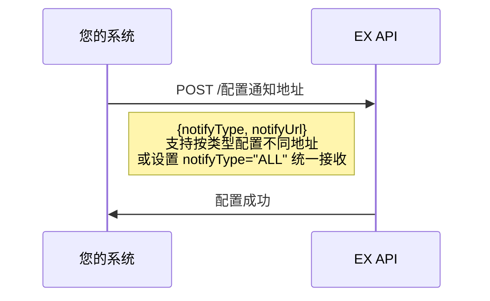

#### 4.1.2 文件上传

上传 KYC/KYB、收款人材料等附件时，先调用文件上传接口，再将返回的 URL 放入业务请求中。

```
上传流程：
    1. 调用【上传文件】API -> 获取文件 URL
    2. 将文件 URL 放入业务请求（KYC/KYB/收款人材料等）
```

#### 4.1.3 获取商户 Token

需要跳转 EX 前端页面的场景，先获取 Token 再传递给前端页面。

---

### 4.2 商户注册

在 EX 平台创建您的终端商户，并获取唯一的商户标识符（MID）。

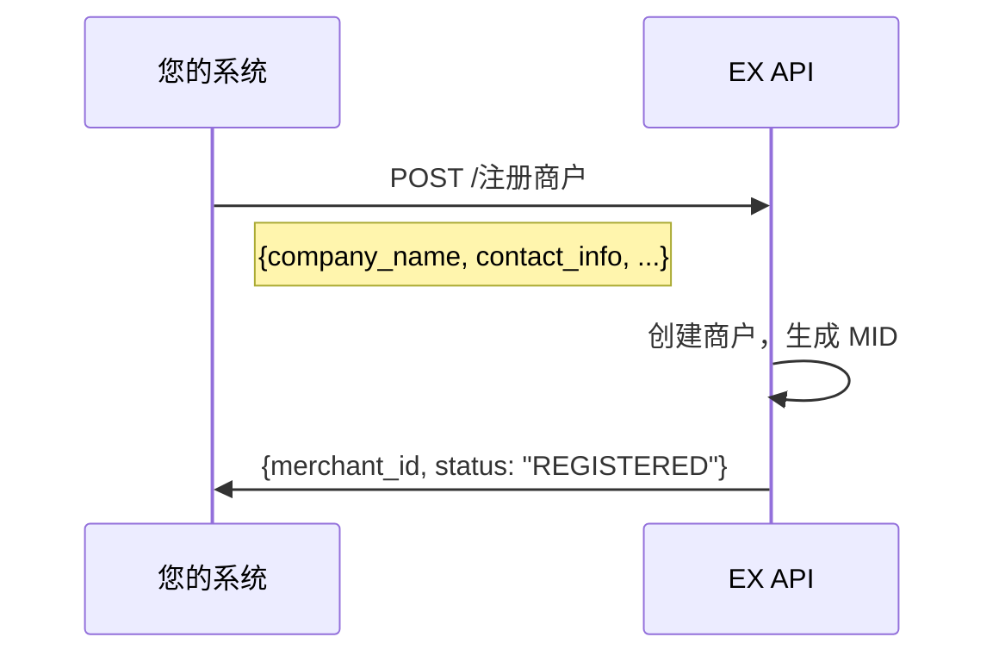

---

### 4.3 KYC 审核

提交商户 KYC 信息和材料。审核通过后才能发起业务请求。

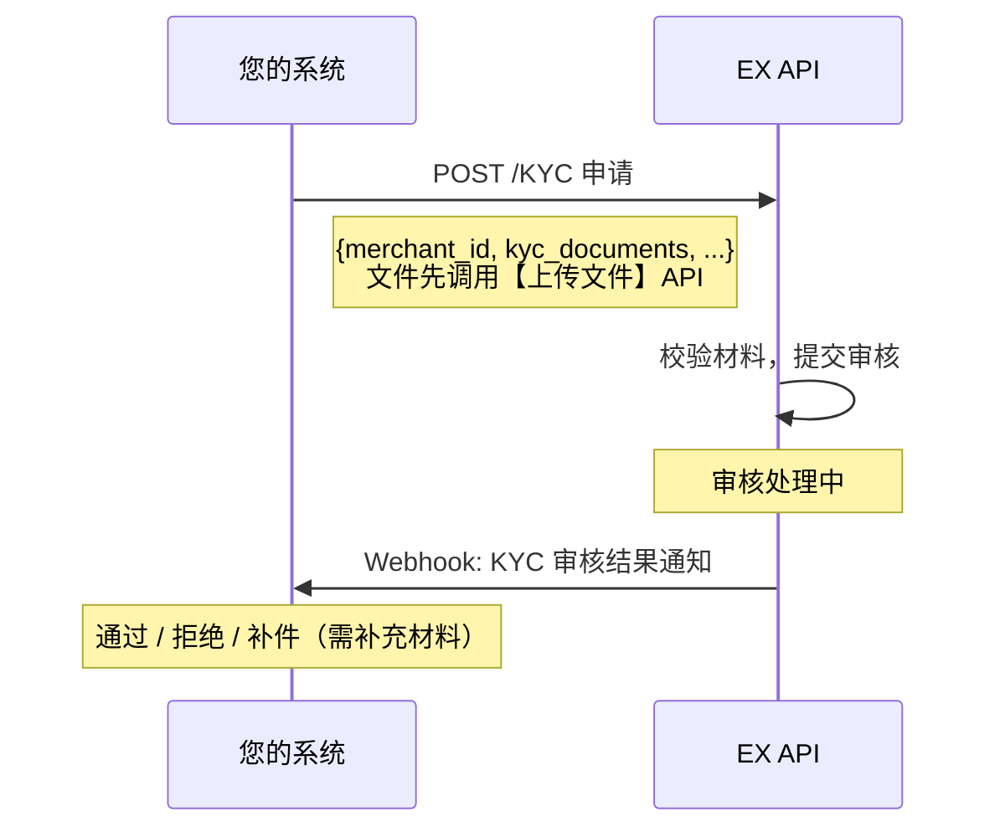

**要点：**

- KYC 审核通过后，可开通相应业务线（如加密充提、兑换等）
- 审核期间可能触发 **RFI**，要求补充材料
- 审核结果可通过 API 主动查询，或被动等待 Webhook 通知
- KYC 模板：[KYC 模板](https://open.eurewax.com/kyc%E6%A8%A1%E6%9D%BF-6985923m0)

---

### 4.4 KYB 审核

如需开通更多业务线，提交 KYB 申请。

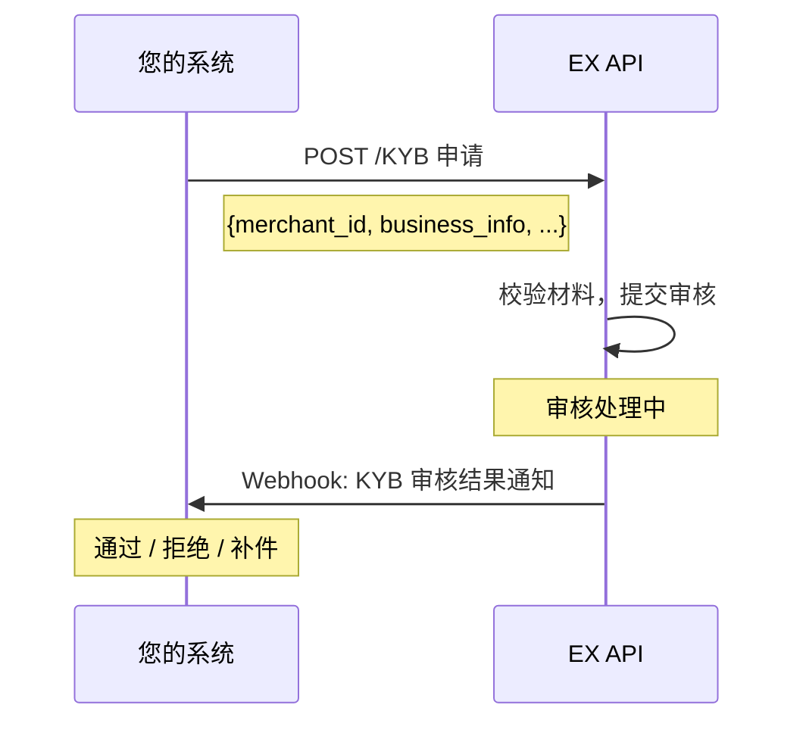

**要点：**

- KYB 模板：[KYB 模板](https://open.eurewax.com/kyb%E6%A8%A1%E6%9D%BF-6985924m0)

---

### 4.5 产品开通

为商户申请加密产品。您只需提交商户材料，EX 将转发给持牌合规机构审核，结果通过 Webhook 通知。

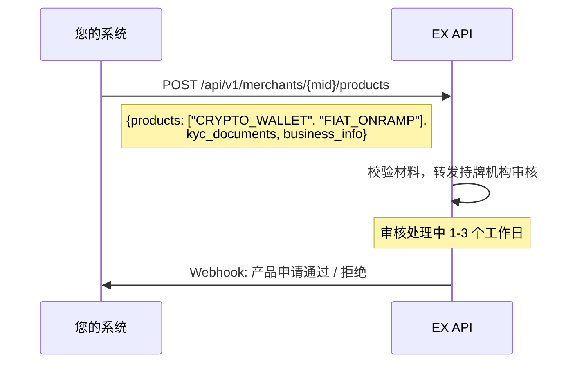

**要点：**

- 审核内容包括：商户主体合规、业务场景合规、KYB/KYC 校验（由持牌合规机构完成）
- 审核期间可能触发 **RFI** 要求补充材料
- 可根据平台设计在用户注册、入驻审核或首次使用加密功能时调用此流程

**产品类型：**

| 产品代码          | 说明     | 备注                     |
| ----------------- | -------- | ------------------------ |
| `CRYPTO_WALLET` | 加密钱包 | 加密货币充提、余额查询   |
| `FIAT_ONRAMP`   | 法币入金 | 法币充值、法币兑加密货币 |
| `FIAT_OFFRAMP`  | 法币出金 | 加密货币兑法币、法币提现 |

---

## 5. 加密服务

商户完成入驻审核后，可使用加密账户管理、收款工具、收款人管理、充提和兑换等能力。

---

### 5.1 基础功能

#### 5.1.1 查询汇率

查询加密货币兑法币、加密货币兑加密货币的汇率。

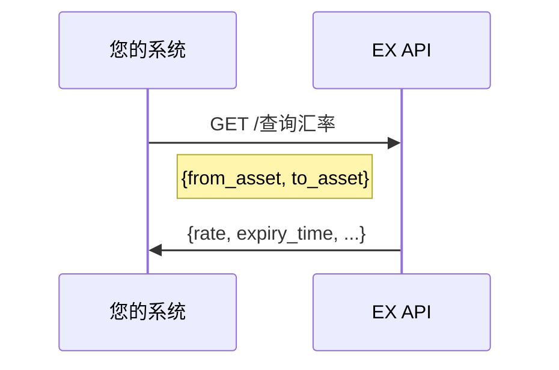

#### 5.1.2 查询支持资产

查询平台支持的加密货币和法币资产。

| 接口         | 说明                             |
| ------------ | -------------------------------- |
| 查询支持资产 | 返回支持的加密货币和法币资产列表 |

---

### 5.2 账户管理

#### 5.2.1 查询账户列表

查询商户的加密货币和法币账户信息。

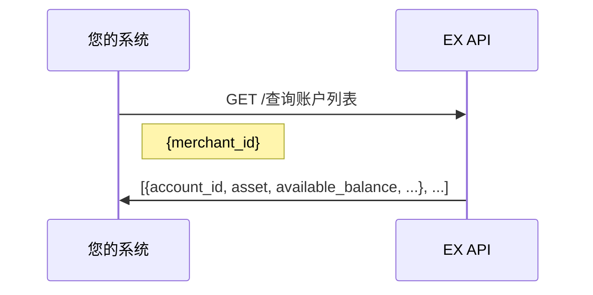

**账户类型：**

| 账户类型 | 说明                              |
| -------- | --------------------------------- |
| 法币账户 | 法币余额（USD、EUR 等）           |
| 加密钱包 | 加密货币余额（USDT、BTC、ETH 等） |

---

### 5.3 收款工具管理

管理商户的加密货币充值地址。

#### 5.3.1 查询收款工具

| 接口         | 说明                       |
| ------------ | -------------------------- |
| 查询收款工具 | 查询商户的加密货币充值地址 |

**收款工具类型：**

| 类型     | 说明                                                |
| -------- | --------------------------------------------------- |
| 加密地址 | 链上充值地址（USDT-TRC20、USDT-ERC20、BTC、ETH 等） |

> **注意**：收款工具在产品开通后自动创建。您可以查询已有地址或申请新地址。

---

### 5.4 收款人管理

管理提现目标地址。

#### 5.4.1 添加收款人

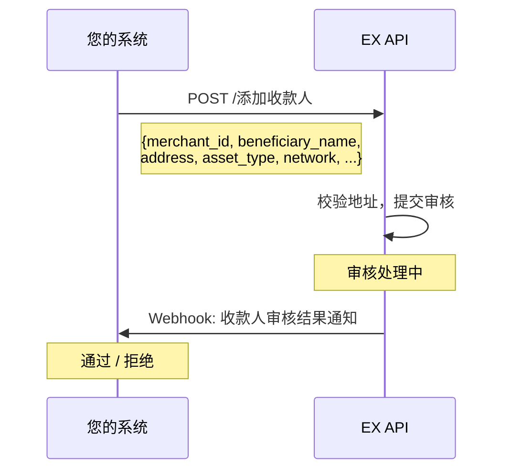

#### 5.4.2 收款人操作

| 接口               | 说明                 |
| ------------------ | -------------------- |
| 添加收款人         | 添加新的提现地址     |
| 删除收款人         | 删除已有地址         |
| 查询收款人列表     | 查询所有收款人地址   |
| 收款人审核结果通知 | Webhook 审核结果通知 |

**要点：**

- 收款人地址使用前需通过合规审核
- 支持多种网络（TRC20、ERC20、BTC、ETH 等）

---

### 5.5 交易管理

#### 5.5.1 法币充值

充值法币到商户账户。

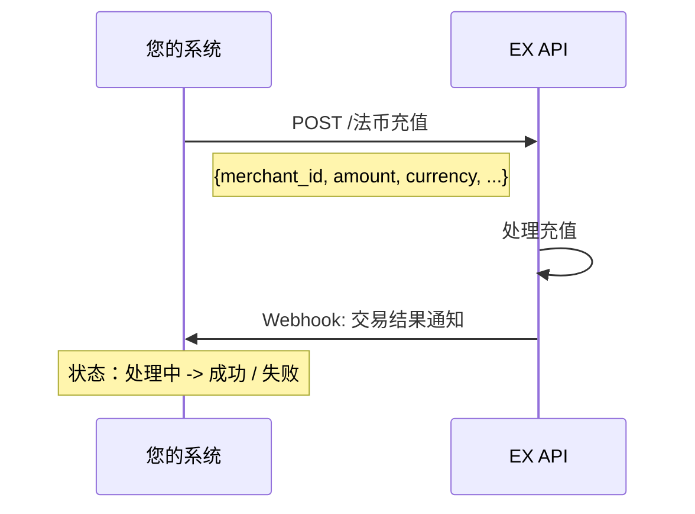

#### 5.5.2 法币提现

从商户账户提现法币。

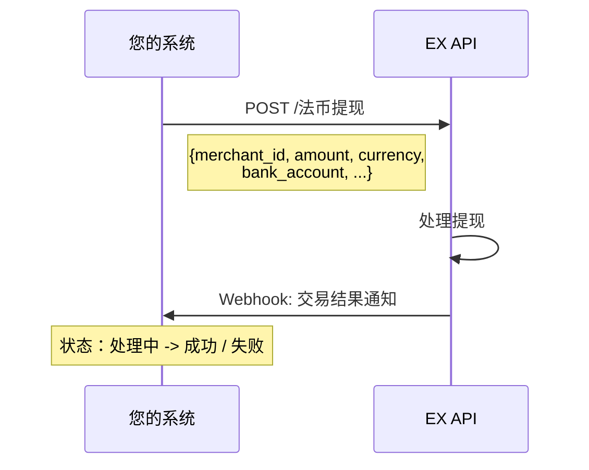

#### 5.5.3 加密充值

充值加密货币到商户钱包。


**要点：**

- 加密充值需要链上确认
- 支持多种网络（TRC20、ERC20、BTC、ETH 等）

#### 5.5.4 加密提现

从商户钱包提现加密货币。

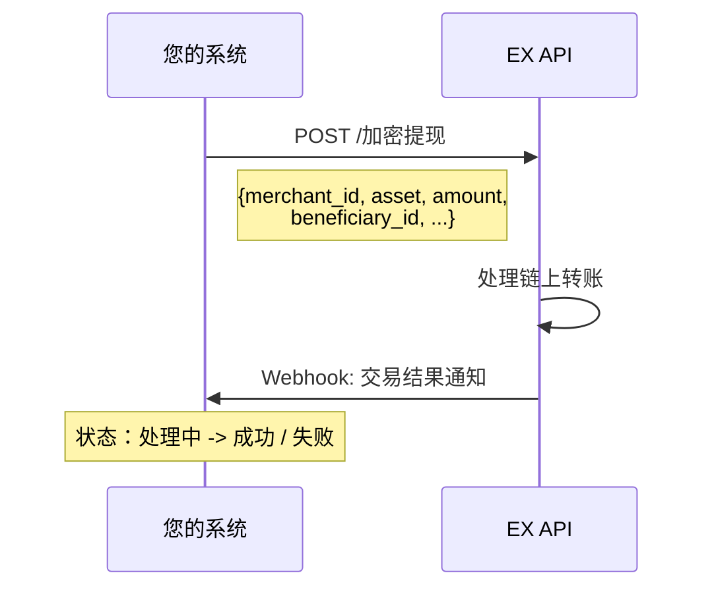

**要点：**

- 提现地址必须是已审核通过的收款人
- 链上转账需要网络确认时间

#### 5.5.5 买币

使用法币余额购买加密货币。

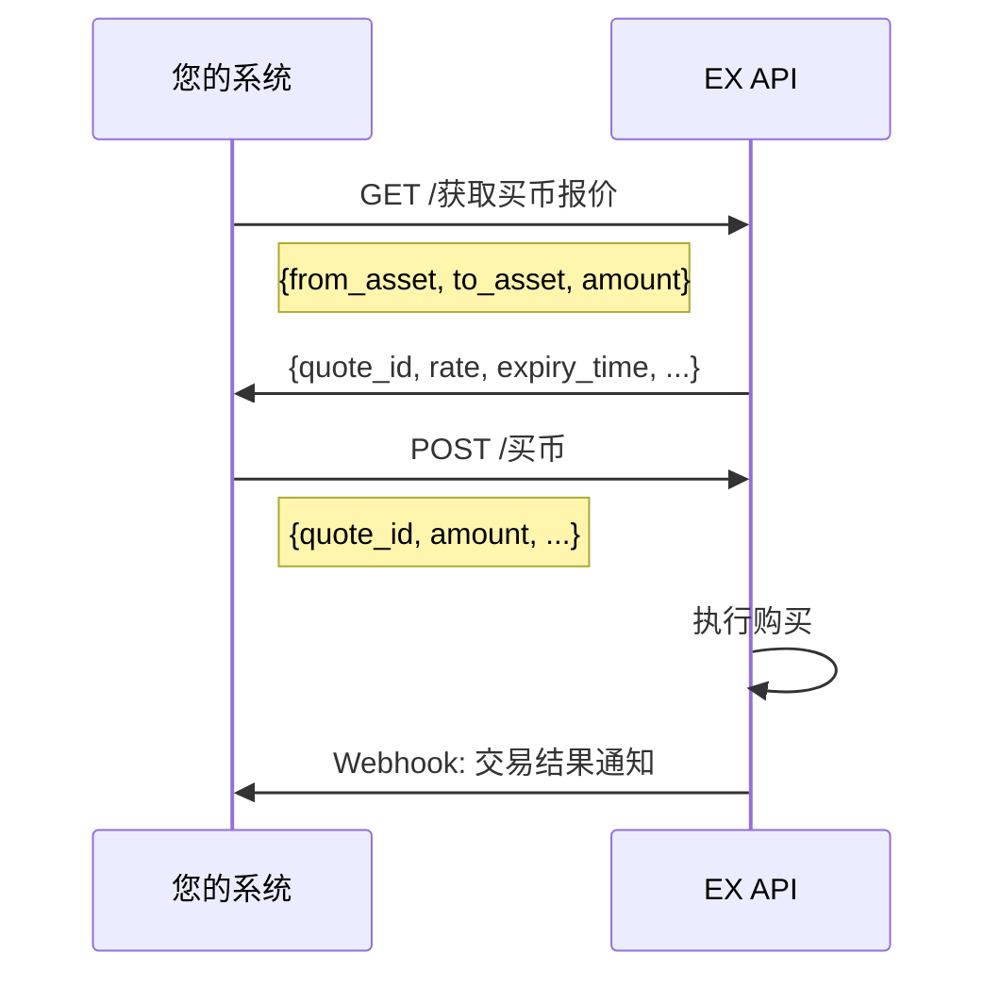

#### 5.5.6 卖币

出售加密货币换取法币余额。


#### 5.5.7 法币兑币（入金）

直接将法币兑换为加密货币。


#### 5.5.8 币兑法币（出金）

直接将加密货币兑换为法币。

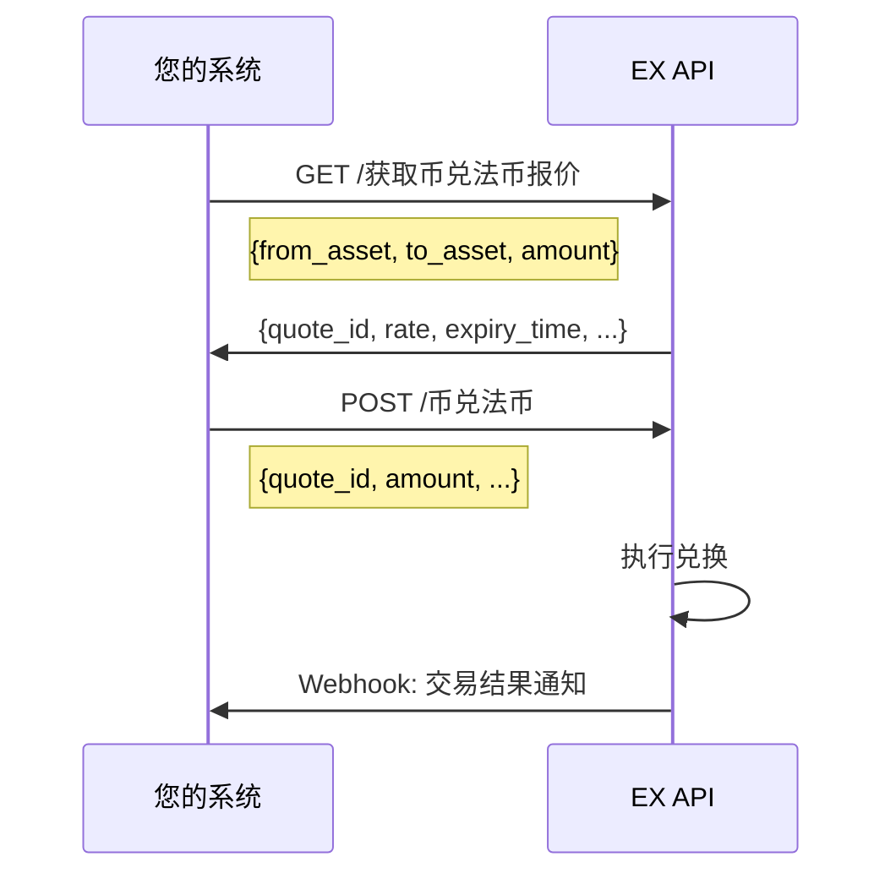

#### 5.5.9 交易费用估算

估算充提交易的费用。

| 接口         | 说明             |
| ------------ | ---------------- |
| 充提费用估算 | 估算交易网络费用 |

#### 5.5.10 查询交易详情

| 接口         | 说明             |
| ------------ | ---------------- |
| 查询交易详情 | 查询特定交易详情 |
| 查询交易记录 | 查询交易历史列表 |

---

## 6. Webhook 事件汇总

配置 Webhook 接收地址。发生以下事件时，EX 会主动推送通知：

| 事件类别           | 事件               | 触发时间       |
| ------------------ | ------------------ | -------------- |
| **入驻开通** | KYC 审核结果通知   | KYC 审核完成   |
|                    | KYB 审核结果通知   | KYB 审核完成   |
| **产品开通** | 产品审核通过通知   | 产品审核通过   |
|                    | 产品审核拒绝通知   | 产品审核拒绝   |
|                    | 产品审核补件通知   | 需要补充材料   |
| **收款人**   | 收款人审核结果通知 | 收款人审核完成 |
| **交易**     | 交易结果通知       | 交易处理完成   |

---

## 7. API 能力汇总

完整的 Crypto API 能力矩阵：

| 模块                 | 子模块       | 接口                                                      | 类型    |
| -------------------- | ------------ | --------------------------------------------------------- | ------- |
| **通用服务**   | 事件通知     | 配置通知地址                                              | API     |
|                      | 文件服务     | 上传文件 / 补充业务材料                                   | API     |
|                      | 认证         | 获取商户 Token                                            | API     |
| **入驻开通**   | 商户入驻     | 注册商户                                                  | API     |
|                      |              | KYC 申请 / 查询 KYC 审核结果                              | API     |
|                      |              | KYB 申请 / 查询 KYB 审核结果                              | API     |
|                      |              | KYC/KYB 审核结果通知                                      | Webhook |
| **产品开通**   | 产品申请     | 申请产品 / 查询产品审核结果                               | API     |
|                      |              | 产品审核结果通知 / 产品审核补件通知                       | Webhook |
| **加密基础**   | 基础功能     | 查询汇率 / 查询支持资产                                   | API     |
| **加密账户**   | 账户管理     | 查询账户列表                                              | API     |
| **加密收款**   | 收款工具     | 查询收款工具                                              | API     |
| **加密收款人** | 收款人       | 添加 / 删除 / 查询收款人                                  | API     |
|                      |              | 收款人审核结果通知                                        | Webhook |
| **加密交易**   | 法币充提     | 法币充值 / 法币提现                                       | API     |
|                      | 加密充提     | 加密充值 / 加密提现                                       | API     |
|                      | 买币卖币     | 获取买币报价 / 买币 / 获取卖币报价 / 卖币                 | API     |
|                      | 法币加密兑换 | 获取法币兑币报价 / 法币兑币 / 获取币兑法币报价 / 币兑法币 | API     |
|                      | 费用估算     | 充提费用估算                                              | API     |
|                      | 交易查询     | 查询交易详情 / 查询交易记录                               | API     |
|                      |              | 交易结果通知                                              | Webhook |

---

## 8. 集成最佳实践

| # | 最佳实践               | 说明                                                         |
| - | ---------------------- | ------------------------------------------------------------ |
| 1 | **Webhook 优先** | 以 Webhook 事件驱动为主，API 轮询为辅，减少不必要的 API 调用 |
| 2 | **幂等性**       | 同一事件可能多次推送，基于业务单号实现幂等校验               |
| 3 | **签名验证**     | 所有 Webhook 请求需进行签名验证，确保来源合法                |
| 4 | **异步设计**     | 充值、提现、兑换操作均为异步处理，通过 Webhook 获取最终结果  |
| 5 | **及时补件**     | KYC/KYB/收款人审核可能需补充材料，延迟响应可能导致审核失败   |
| 6 | **报价过期**     | 兑换报价有过期时间，过期前执行或重新获取报价                 |
| 7 | **先传文件**     | 所有附件材料必须先调用文件上传 API 获取 URL，再放入业务请求  |
| 8 | **灵活编排**     | 各步骤可按平台设计灵活编排，无需严格顺序执行                 |

---

## 9. 典型集成时间线

| 阶段                   | 内容                                            | 预计耗时 |
| ---------------------- | ----------------------------------------------- | -------- |
| **环境搭建**     | 获取 API Key、配置 Webhook 地址、沙箱环境       | 1-2 天   |
| **前置流程**     | 集成商户注册 + KYC/KYB 审核 + 产品开通 API      | 3-5 天   |
| **加密核心流程** | 集成账户/钱包、收款工具、收款人、充提、兑换 API | 7-10 天  |
| **集成测试**     | 端到端流程验证、异常场景覆盖                    | 5-7 天   |
| 生产验证               | 生产环境切换、生产验证                          | 1-2 天   |

> 总计约 **3-4 周**，可根据技术团队规模和平台复杂度调整。

---

## 10. 开始使用

准备好开始集成了吗？联系您的 EX 客户经理获取：

1. **沙箱环境** - API Key + 测试环境地址
2. **API 文档** - 完整的接口参考文档（含请求/响应示例）
3. **技术支持** - 专属对接群 + 技术支持工程师
