# 1FlyCapital VCC × EX 解决方案

> **客户**：FlyCapital（租户）`<br>`
> **业务**：为 OTA 平台客户提供 VCC 发卡服务 `<br>`
> **接入方式**：EX 平台（聚合 API + 风控层）→ 持牌 SP（实际账户/VCC 能力）

---

## 1. 平台架构与名词解释

### 1.1 四层架构

```
┌─────────────────────────────────────────────────────────┐
│  Layer 1: OTA 平台客户 (C端消费者)                        │
│  - 持有 VCC 虚拟卡                                        │
│  - 使用卡号在航司/GDS/酒店消费                             │
└─────────────────────────────────────────────────────────┘
                            │ 消费/扣款
                            ▼
┌─────────────────────────────────────────────────────────┐
│  Layer 2: FlyCapital (租户)                              │
│  - 在 EX 以「租户」身份入网                               │
│  - 管理 VA、钱包、共享账户、VCC 卡组                       │
│  - 给 C 端消费者发卡                                      │
└─────────────────────────────────────────────────────────┘
                            │ API / Webhook
                            ▼
┌─────────────────────────────────────────────────────────┐
│  Layer 3: EX 平台                                        │
│  - API 聚合层                                            │
│  - 风控编排层                                            │
│  - 租户管理 + 商户管理                                    │
└─────────────────────────────────────────────────────────┘
                            │
                            │ 商户入网请求
                            ▼
┌─────────────────────────────────────────────────────────┐
│  Layer 4: 持牌 SP                                        │
│  - 商户实际入网（KYC/KYB 审核）                          │
│  - 实际账户开户（法币账户、数币钱包）                     │
│  - VA 创建 + VCC 发卡 + 资金托管                         │
└─────────────────────────────────────────────────────────┘
```

### 1.2 核心名词解释

| 名词               | 英文             | 说明                                                                                                                               |
| ------------------ | ---------------- | ---------------------------------------------------------------------------------------------------------------------------------- |
| **租户**     | Tenant           | FlyCapital 在 EX 平台的入驻实体，拥有独立的租户 ID 和配置                                                                          |
| **商户**     | Merchant         | 场景1:是租户的终端商户<br />场景2:是租户<br />在当前的方案中，术语场景2<br />会将商户推送到 SP 入网，SP 侧完成 KYC/KYB 审核、开户 |
| **SP**       | Service Provider | 持牌机构，实际提供 VA、账户、钱包、VCC 等金融能力，商户在此入网                                                                    |
| **VA**       | Virtual Account  | 虚拟银行账户，用于 FlyCapital 向 SP 充值法币                                                                                       |
| **法币账户** | Fiat Account     | 开在 SP 的法币账户（USD/EUR 等），同名充值/提现                                                                                    |
| **数币钱包** | Crypto Wallet    | 开在 SP 的加密货币钱包（USDT/USDC），充币/提币                                                                                     |
| **共享账户** | Shared Account   | 卡资金池，多张 VCC 共享余额                                                                                                        |
| **共享卡**   | Shared Card      | 绑定共享账户，消费时扣减共享账户余额                                                                                               |
| **充值卡**   | Standard Card    | 独立账户，一卡一账户，需单独充值                                                                                                   |
| **卡组**     | Card Program     | VCC 卡产品配置（卡 BIN、额度规则、有效期等）                                                                                       |

#### 租户与商户的关系

```
┌─────────────────┐         ┌─────────────────┐         ┌─────────────────┐
│   FlyCapital    │         │      EX 平台     │         │   持牌 SP       │
│    (租户)       │ ──────▶ │    创建商户      │ ──────▶ │   商户入网      │
│                 │         │   (Merchant)   │         │  (KYC/KYB)      │
└────────┬────────┘         └─────────────────┘         └────────┬────────┘
         │                                                        │
         │              租户通过 API 管理                         │
         │◄──────────────────────────────────────────────────────┘
         │              但账户/资金实际在 SP
         ▼
┌──────────────────────────────────────────────────────────────────┐
│                      租户管理视角                                 │
│  • 查看法币账户余额（实际在 SP）                                  │
│  • 查看数币钱包余额（实际在 SP）                                  │
│  • 管理 VA、卡组、共享账户                                        │
│  • 给 C 端消费者发卡                                              │
└──────────────────────────────────────────────────────────────────┘
```

**关键理解**：

- **租户**是 EX 平台的客户，使用 EX 的 API 和界面
- **商户**是 SP 侧的实际入网主体，由 EX 推送创建
- Flycapital 需要注册EX 的租户也要注册SP 的商户
- 所有资金账户（法币账户、数币钱包）实际开立在 SP 的商户名下

### 1.3 账户体系关系图

#### 方案 A：法币入金 → 法币账户 → 共享/充值卡

```
┌──────────────┐      ┌──────────────┐      ┌──────────────┐
│   银行转账    │ ───▶ │     VA       │ ───▶ │  法币账户    │
│  (FlyCapital)│      │ (Virtual Acct)│     │  (SP 托管)   │
└──────────────┘      └──────────────┘      └──────┬───────┘
                                                   │
                          ┌────────────────────────┼────────────────────────┐
                          │                        │                        │
                          ▼                        ▼                        ▼
                   ┌─────────────┐          ┌─────────────┐          ┌─────────────┐
                   │  共享账户    │          │  充值卡      │          │  充值卡      │
                   │ (Card Pool) │          │ (独立账户)   │          │ (独立账户)   │
                   └──────┬──────┘          └──────┬──────┘          └──────┬──────┘
                          │                        │                        │
                          ▼                        ▼                        ▼
                   ┌─────────────┐          ┌─────────────┐          ┌─────────────┐
                   │  共享卡 1    │          │   充值卡 A   │          │   充值卡 B   │
                   │  共享卡 2    │          │            │          │            │
                   │  共享卡 N    │          │            │          │            │
                   └─────────────┘          └─────────────┘          └─────────────┘
```

#### 方案 B：数币入金 → 数币钱包 → 共享/充值卡

```
┌──────────────┐      ┌──────────────┐      ┌──────────────┐
│   链上充币    │ ───▶ │   EX 收银    │ ───▶ │  数币钱包    │
│  (USDT/USDC) │      │  (Crypto)    │      │  (SP 托管)   │
└──────────────┘      └──────────────┘      └──────┬───────┘
                                                   │
                          ┌────────────────────────┼────────────────────────┐
                          │                        │                        │
                          ▼                        ▼                        ▼
                   ┌─────────────┐          ┌─────────────┐          ┌─────────────┐
                   │  共享账户    │          │  充值卡      │          │  充值卡      │
                   │ (Card Pool) │          │ (独立账户)   │          │ (独立账户)   │
                   └──────┬──────┘          └──────┬──────┘          └──────┬──────┘
                          │                        │                        │
                          ▼                        ▼                        ▼
                   ┌─────────────┐          ┌─────────────┐          ┌─────────────┐
                   │  共享卡 1    │          │   充值卡 A   │          │   充值卡 B   │
                   │  共享卡 2    │          │            │          │            │
                   │  共享卡 N    │          │            │          │            │
                   └─────────────┘          └─────────────┘          └─────────────┘
```

#### 关键概念说明

| 概念                        | 说明                                                               |
| --------------------------- | ------------------------------------------------------------------ |
| **充值卡 = 一对一**   | 每张充值卡背后有一个独立账户，只能绑定一张卡；充值即给该账户加余额 |
| **共享账户 = 一对多** | 一个共享账户可发多张共享卡，所有卡共享该账户余额；消费时统一扣减   |
| **首次发卡**          | 共享卡需先创建共享账户并充值；充值卡直接发卡+充值                  |
| **非首次发卡**        | 共享卡可直接选择已有共享账户发卡，无需重复创建                     |

---

## 2. 完整发卡流程

### 2.1 阶段一：租户入驻与产品开通

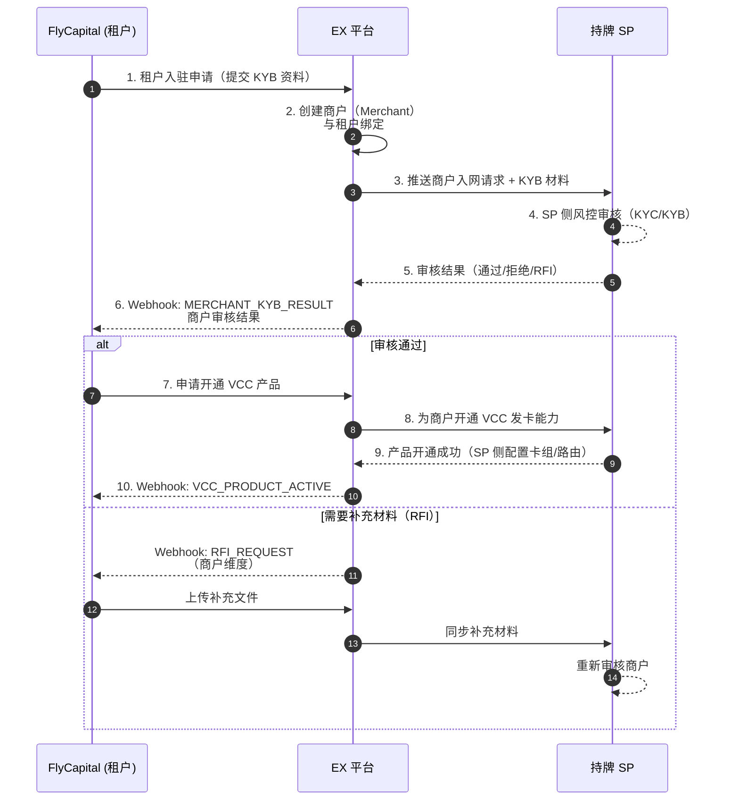

**关键说明**：

- **租户**（FlyCapital）是 EX 平台客户，使用 EX 的 API 和界面
- **商户**由 EX 创建后推送到 SP，SP 完成实际的 KYC/KYB 审核和账户开户
- 租户与商户通常是一对一关系（FlyCapital ↔ 一个 SP 商户）
- 后续新增产品只需调用「开通产品」接口，无需重复 KYB（但 SP 可能额外审核）
- RFI（Request For Information）时需调用「上传文件」接口补充材料

### 2.2 阶段二：VA 申请与法币充值

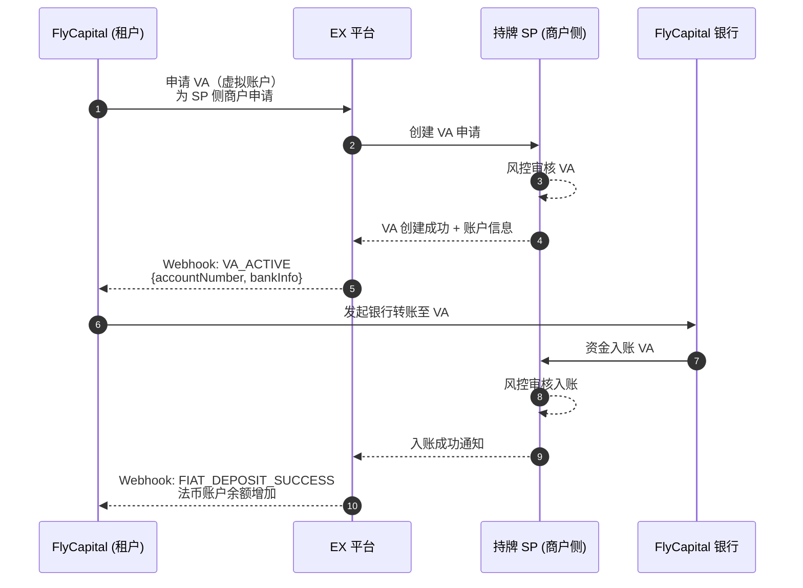

### 2.3 阶段三：数币充值（可选路径）

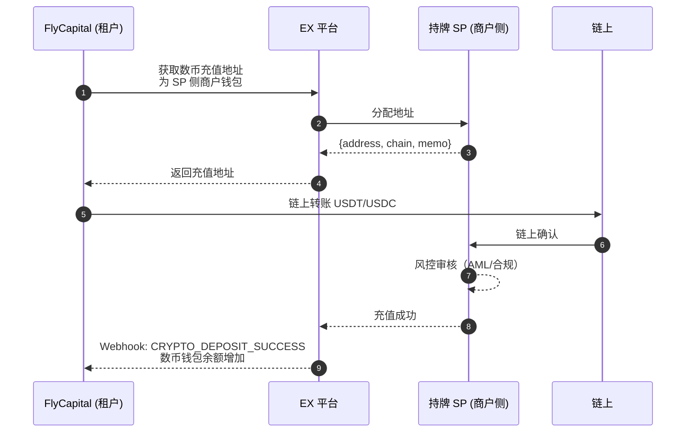

### 2.4 阶段四：开卡流程

#### 共享卡首次开卡（需创建共享账户）

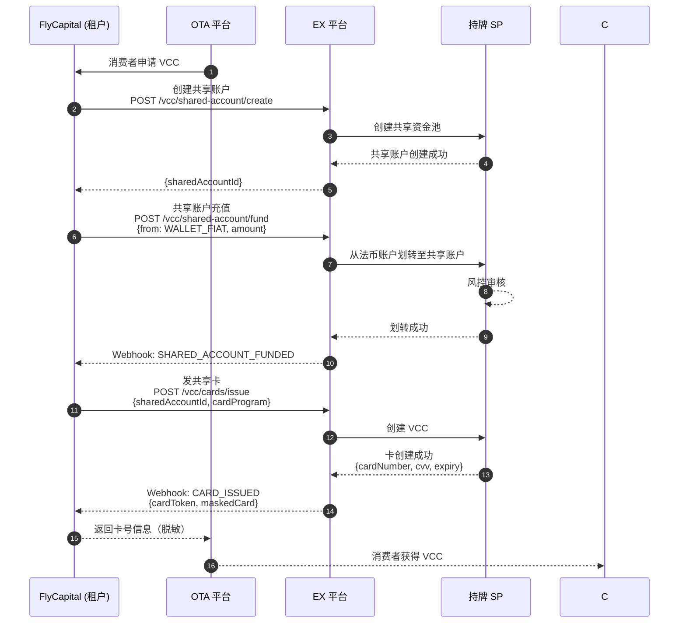

#### 充值卡开卡（一卡一账户）

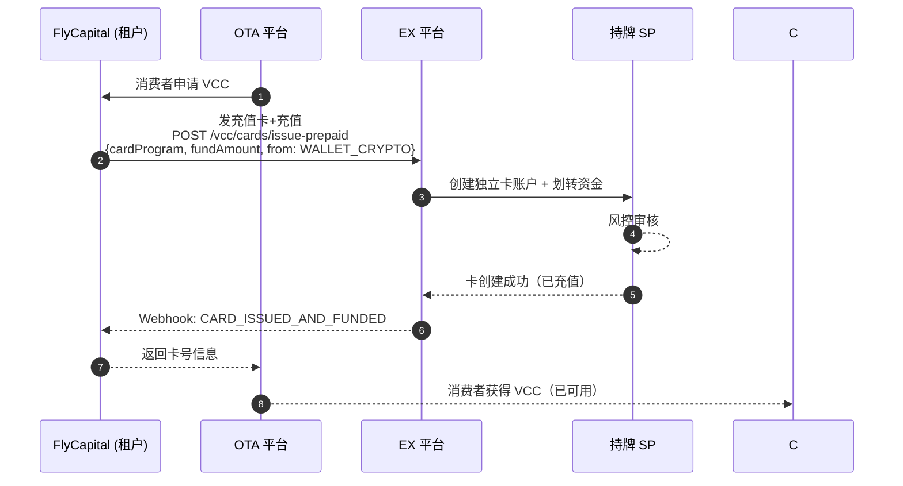

#### 共享卡非首次开卡（复用已有共享账户）

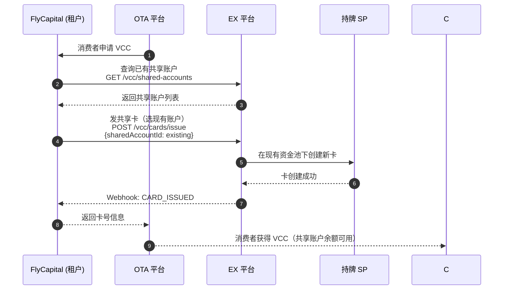

### 2.5 阶段五：卡消费与记录同步

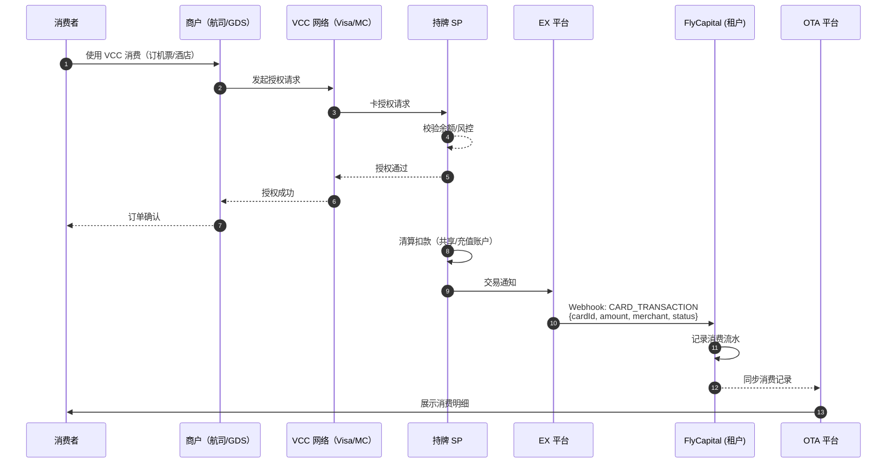

---

## 3. OnRamp / OffRamp 流程

### 3.1 OnRamp（法币 → 数币）

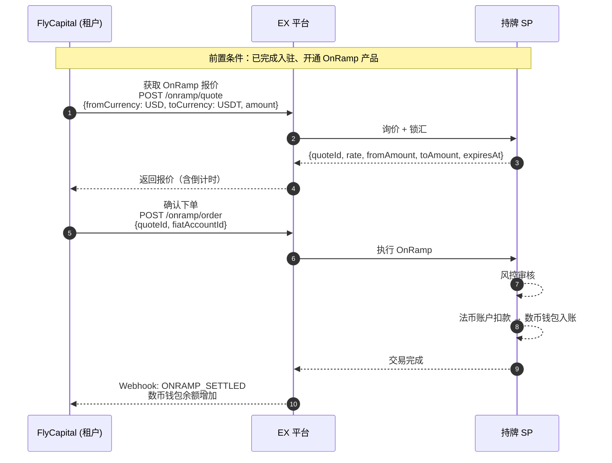

### 3.2 OffRamp（数币 → 法币）

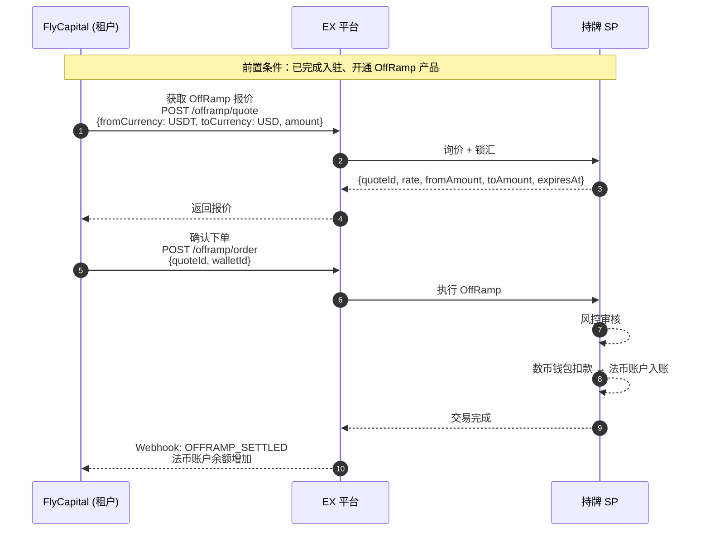

**关键说明**：

- 市场汇率实时浮动，锁汇后需在有效期内确认
- 实际到账金额 = 下单金额（已锁汇），汇率风险由 SP 承担
- 每笔交易均需过 SP 风控，可能触发 RFI

### 3.3 提现/提币流程

#### 法币提现（当前仅支持同名账户，6月初支持非同名）

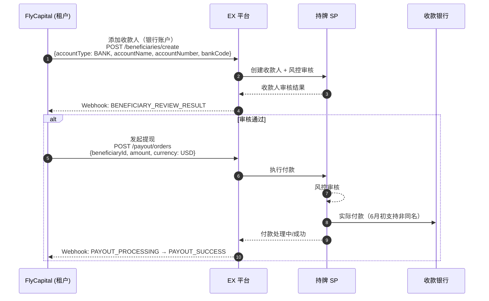

#### 数币提币

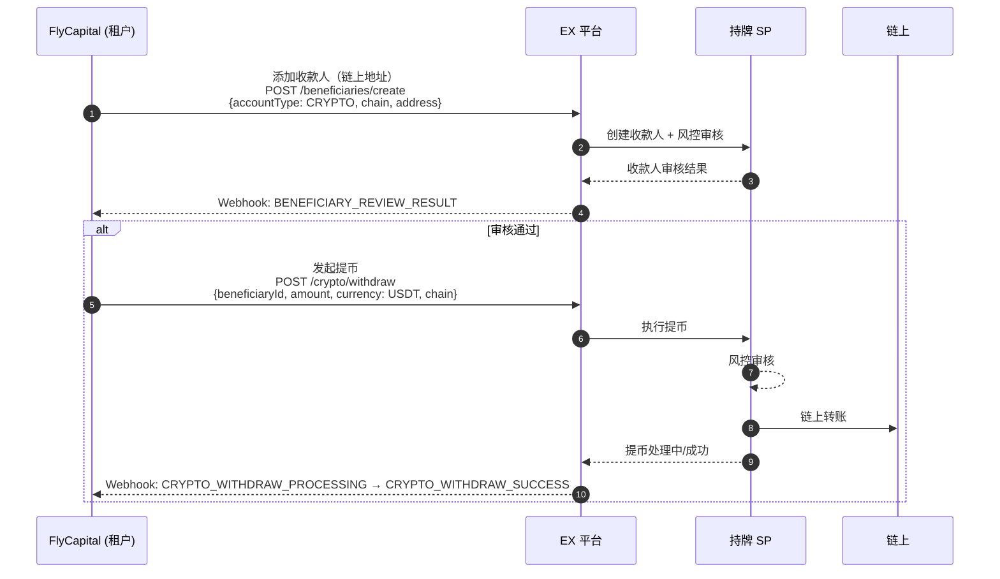

---

## 4. RFI（补充材料）处理流程

所有涉及风控的环节都可能触发 RFI，需商户主动补充文件：

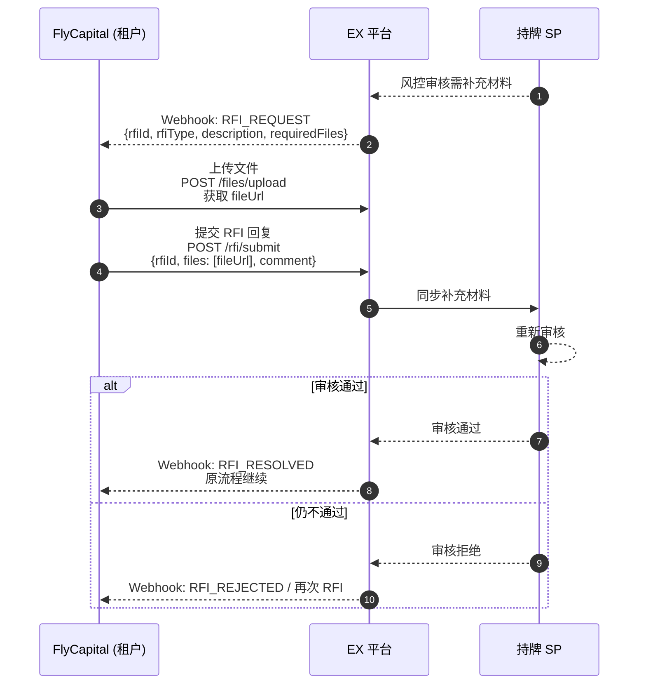

### 常见 RFI 场景

| 场景      | RFI 类型    | 可能要求的文件                   |
| --------- | ----------- | -------------------------------- |
| KYB 入驻  | KYB_RFI     | 营业执照、董事身份证明、业务说明 |
| VA 申请   | VA_RFI      | 资金来源证明、业务合同           |
| 大额充值  | DEPOSIT_RFI | 银行流水、贸易单据               |
| 开卡审核  | CARD_RFI    | 持卡人身份证明、消费用途说明     |
| 数币交易  | CRYPTO_RFI  | 链上资金来源证明                 |
| 提现/提币 | PAYOUT_RFI  | 收款人关系证明、用途说明         |

---

## 5. API 清单汇总

| 功能         | API 端点                            | 关键 Webhook                          |
| ------------ | ----------------------------------- | ------------------------------------- |
| 入驻 KYB     | POST /merchants/onboarding          | KYC_KYB_RESULT                        |
| 开通产品     | POST /products/apply                | PRODUCT_ACTIVE / REJECTED             |
| 申请 VA      | POST /va/accounts                   | VA_ACTIVE                             |
| 查询报价     | POST /onramp/quote, /offramp/quote  | -                                     |
| 下单 OnRamp  | POST /onramp/orders                 | ONRAMP_SETTLED                        |
| 下单 OffRamp | POST /offramp/orders                | OFFRAMP_SETTLED                       |
| 添加收款人   | POST /beneficiaries                 | BENEFICIARY_REVIEW_RESULT             |
| 发起付款     | POST /payout/orders                 | PAYOUT_PROCESSING → SUCCESS          |
| 发起提币     | POST /crypto/withdraw               | CRYPTO_WITHDRAW_PROCESSING → SUCCESS |
| 创建共享账户 | POST /vcc/shared-accounts           | SHARED_ACCOUNT_ACTIVE                 |
| 共享账户充值 | POST /vcc/shared-accounts/{id}/fund | SHARED_ACCOUNT_FUNDED                 |
| 发卡         | POST /vcc/cards                     | CARD_ISSUED                           |
| 查询交易     | GET /vcc/cards/{id}/transactions    | CARD_TRANSACTION                      |
| 上传文件     | POST /files/upload                  | -                                     |
| 提交 RFI     | POST /rfi/submit                    | RFI_RESOLVED / REJECTED               |

---

## 6. 时序与 ETA 估算

| 阶段                     | 子任务                   | ETA       | 备注               |
| ------------------------ | ------------------------ | --------- | ------------------ |
| **入驻**           | KYB + VCC 产品开通       | 5-7 天    | 含 SP 风控审核     |
| **VA 申请**        | VA 创建 + 审核           | 1-3 天    | 并行可提前申请     |
| **首笔充值**       | 银行转账 + 风控 + 入账   | 1-2 天    | 依赖银行时效       |
| **共享卡首次**     | 创建账户 + 充值 + 发卡   | 实时-1 天 | 充值后风控可能耗时 |
| **充值卡**         | 发卡 + 充值              | 实时-1 天 | 可一步完成         |
| **共享卡复用**     | 直接发卡                 | 实时      | 已有共享账户       |
| **OnRamp/OffRamp** | 产品开通 + 首笔交易      | 3-5 天    | 开通后即可实时交易 |
| **提现/提币**      | 添加收款人 + 审核 + 付款 | 1-3 天    | 收款人首次需审核   |

> **首次全链路打通**：约 10-15 个工作日 `<br>`
> **日常运营（发卡/消费）**：实时 - 分钟级

---

## 7. 注意事项

1. **付款水单**：目前暂无独立接口获取付款水单，可通过 Webhook 数据自行生成
2. **非同名账户**：6月初将支持非同名法币收款人（当前仅限同名）
3. **数币收款人**：暂无身份限制，支持任意链上地址
4. **风控时效**：风控审核时间因场景和金额而异，大额/异常交易可能耗时较长
5. **并发建议**：共享账户适合批量发卡场景；充值卡适合独立资金管理场景
6. **余额监控**：建议订阅 Webhook 实时同步钱包/账户/卡余额变动
