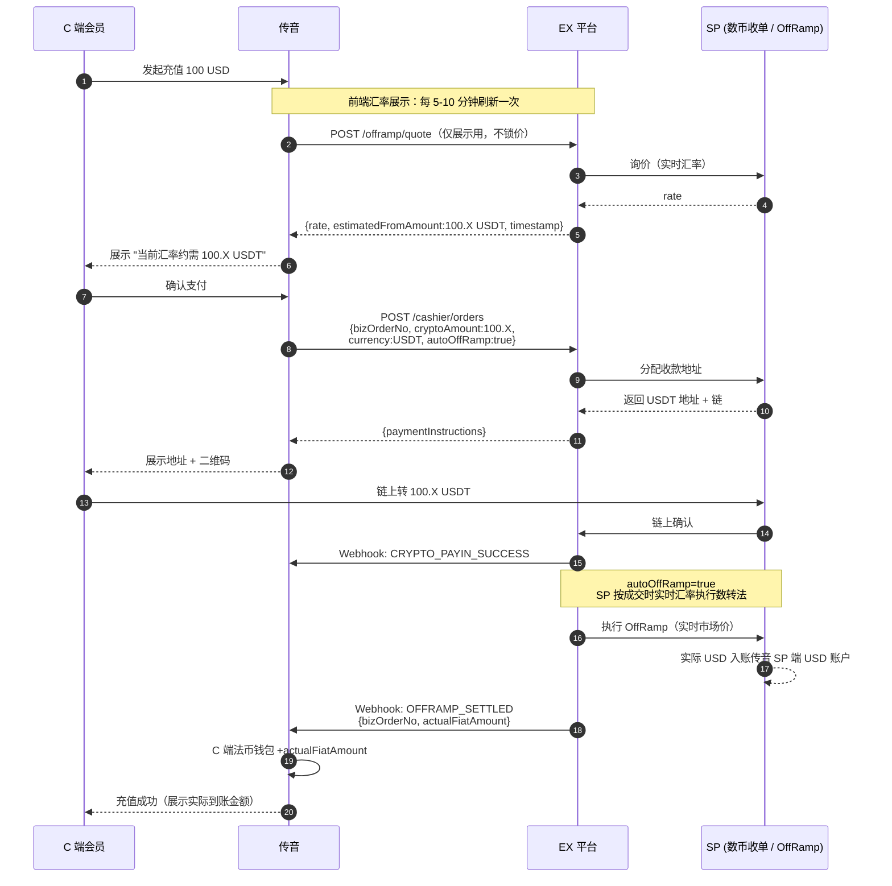
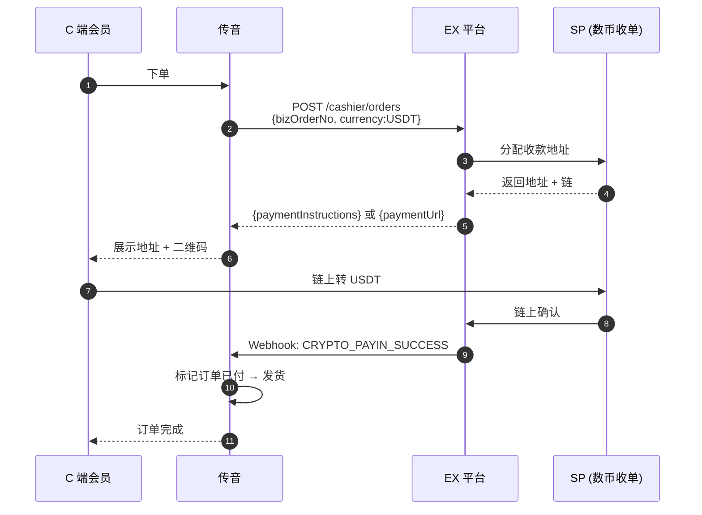

# Transsion（传音）数币收单 — 解决方案

> **文档类型**：Transsion 接入解决方案
> **版本**：v2.0（简化版）
> **最后更新**：2026-04-29
> **适用对象**：传音（Transsion）平台
> **API 参考**：[EurewaX 开放平台](https://open.eurewax.com/)

---

## 一、方案概述

### 1.1 角色解释

| 角色                        | 说明                                                                                                                                 |
| --------------------------- | ------------------------------------------------------------------------------------------------------------------------------------ |
| **传音（Transsion）** | 终端 App / 钱包 / 市场的运营方。在 EX 系统上以**商户**身份入网开通产品                                                         |
| **C 端会员**          | 传音 App / 市场上的终端用户。**EX 不感知 C 端**，C 端的账户与余额由传音自行记账                                                |
| **SP**                | **实际的数币收单 / 承兑 / 付款持牌机构**。传音的法币账户与数币账户真实开在 SP 处，EX 仅做技术对接与 SP 编排，传音不直接感知 SP |
| **EX**                | 技术 + 合规运营平台，提供 API、Webhook 接入，并做 SP 路由、风控、对账与合规管控                                                      |

### 1.2 能力与币种范围

| 能力                              | 支持范围                                           |
| --------------------------------- | -------------------------------------------------- |
| **数币收单（收 U）**        | USDT / USDC（链上收款）                            |
| **承兑 OnRamp（法 → U）**  | 仅支持**USD**（美金）<br />其他币种建设中    |
| **承兑 OffRamp（U → 法）** | 仅支持**USD**（美金）<br />其他币种建设中    |
| **数币提现（提 U）**        | USDT / USDC 链上出金                               |
| **法币提现（提法）**        | **仅支持 USD**（美金）出金到传音指定银行账户 |

> 如后续需要其他法币（EUR / GBP / 东南亚本地币种等），需单独评估 SP 通道。

### 1.3 资金流向总览

```
场景一（钱包充值 · OffRamp 式）：
  C 端 USDT → 链上 → SP 数币收单地址
  → OffRamp 数转法（USDT → USD，由 SP 执行）
  → USD 到传音在 SP 的 USD 账户
  → 传音给 C 端法币钱包（内部账本）上账

场景二（市场消费 · 数币收单）：
  C 端 USDT → 链上 → SP 数币收单地址
  → USDT 到传音在 SP 的 USDT 账户
  → 传音标记订单已付 → 触发发货

场景三（提现 / 提币）：
  传音 USD 账户 → 提现 → 传音指定银行账户
  传音 USDT 账户 → 提币 → 传音指定链上地址
```

---

## 二、前置流程

> 整体顺序：**商户入网 → 找技术支持开通 Sandbox → 测试环境配置 → 联调签名验签 → 申请开通产品 → 业务对接**。

### 2.1 商户入网（KYB）

```
├── 1. 传音作为商户与 EX 签约
│     └── 提交 KYB 资料（法人 / 董事 / 营业执照 / 业务说明）
│     └── 附件先调【上传文件】接口取 URL，再放入业务请求
│     └── Webhook 通知 KYB 审核结果（APPROVED / REJECTED / RFI）
│
└── 2. 收到 APPROVED → 进入下一步开通测试环境
```

### 2.2 开通 Sandbox 测试环境（联系技术支持）

商户阶段结束后，**在专属对接群中联系技术支持完成 Sandbox 环境配置**：

```
步骤 1 → 联系技术支持开通 Sandbox 环境
        → 获取测试账号（Account No）、测试域名
步骤 2 → 获取 APP ID、平台公钥、AES Key
步骤 3 → 客户生成 RSA 密钥对（SHA256withRSA，2048 位）
        → 上传客户公钥到管理平台
步骤 4 → 配置 Webhook 回调地址（HTTPS，POST，按 notifyType 分类
        或统一接 ALL）
步骤 5 → 完成签名验签 + AES 加解密联调验证
```

> 密钥生成、签名/验签、AES 加解密代码示例与商户信息模版均由技术支持提供。
> Sandbox 环境参数详见 [环境参数](https://open.eurewax.com/%E7%8E%AF%E5%A2%83%E5%8F%82%E6%95%B0-6918053m0)

### 2.3 申请开通产品

```
├── 必选：CRYPTO_WALLET（数币聚合收银 + 数币账户）
└── 必选：FIAT_OFFRAMP（承兑数转法 + 法币账户，仅 USD）
```

- 商户= 传音自己
- 申请产品时系统会校验 KYB 信息是否充分，不足时返回 **RFI** 要求补充
- 产品审核结果通过 Webhook 推送（approved / rejected / RFI）

### 2.4 EX 侧准备

- 测试环境配置

---

## 三、业务流程

### 3.1 场景一：钱包充值（C 端数币 → OffRamp → 法币上账）

**业务说明**：C 端在传音 App 点充值（法币金额），传音前端展示"当前汇率下需转 X USDT"给 C 端 → C 端链上转 USDT → SP 按**实际成交时的实时汇率**完成数转法 → USD 到传音在 SP 的 USD 账户 → 传音按**实际到账 USD** 给 C 端钱包上账。

传音**不承担 FX 商角色**，汇率 / 价差 / 换汇风险由 SP 通过实时汇率承担。

> ⚠️ **报价不锁定**：EX 返回的是**询价时的实时市场汇率**，不是锁价。C 端链上转账到实际 OffRamp 成交之间若汇率波动，**以 SP 实际成交结果为准**，最终到账 USD 可能与前端展示的估算值略有偏差。
>
> 💡 **建议传音前端**：
>
> - 汇率显示区做**定时刷新**，推荐 **5-10 分钟**一次；
> - 或每次 C 端打开充值页时重新询价；
> - 前端明确提示"最终到账以实际成交汇率为准，可能有小幅波动"。

**流程：**

```
1. C 端在传音 App 发起 "充值 100 USD"
2. 传音调 EX 询价（仅用于前端展示，不锁价）
   POST /offramp/quote {from:USDT, to:USD, toAmount:100}
   ← {rate, estimatedFromAmount:100.X USDT, timestamp}
   → 传音前端每 5-10 分钟定时刷新此接口
3. 传音展示 "当前汇率约需支付 100.X USDT" → C 端确认
4. 传音调 EX 创建数币收款订单（开启 autoOffRamp，不带 quoteId）
   POST /cashier/orders {bizOrderNo, cryptoAmount:100.X, currency:USDT,
                         autoOffRamp:true, notifyUrl}
   ← {paymentInstructions:[{chain, address, cryptoAmount:100.X}]}
5. 传音展示地址 + 二维码 → C 端链上转账
6. 链上确认 → Webhook: CRYPTO_PAYIN_SUCCESS
7. EX 自动触发 OffRamp（按 SP 实际成交时的实时汇率）
8. USD 到账传音 SP 端 USD 账户 → Webhook: OFFRAMP_SETTLED
   {bizOrderNo, actualFiatAmount: 实际到账 USD}
9. 传音按 actualFiatAmount 给 C 端法币钱包上账 → 通知 C 端
```

**时序图：**



---

### 3.2 场景二：市场内直接数币消费

**业务说明**：C 端在传音市场下单（按 USDT 结算），C 端链上转账 USDT 到传音 SP 端 USDT 账户，传音收到 Webhook 后发货。

**流程：**

```
1. C 端在传音市场下单（金额以 USDT 标价或传音内部换算）
2. 传音调 EX 创建数币收款订单
   POST /cashier/orders {bizOrderNo, amount, currency:USDT, notifyUrl}
   ← {paymentInstructions:[{chain, address, cryptoAmount}]}
   或返回 paymentUrl（使用 EX 托管收银台时）
3. C 端链上转账 USDT
4. 链上确认 → Webhook: CRYPTO_PAYIN_SUCCESS
5. USDT 到账传音 SP 端 USDT 账户
6. 传音标记订单已付 → 触发发货
```

**时序图：**



> **场景一 vs 场景二**：场景一在创建订单时带 `autoOffRamp:true`，到账后 SP 按实时汇率自动做数转法，资金以 USD 形态沉淀；场景二不带，资金保留为 USDT 形态沉淀。

---

### 3.3 场景三：传音提现 / 提币

**业务说明**：传音把 SP 端的 USD / USDT 余额提到自己的银行账户或链上钱包。

**提现（法币 USD → 银行账户）：**

```
1. 传音添加银行收款人 → Webhook: 审核结果
2. 传音发起 USD 提现
   POST /payout/orders {payeeId, amount, currency:USD}
3. Webhook: PAYOUT_PROCESSING → PAYOUT_SUCCESS / FAIL
4. 传音核账
```

**提币（数币 USDT → 链上地址）：**

```
1. 传音添加链上收款地址 → Webhook: 审核结果
2. 传音发起 USDT 提币
   POST /crypto/withdraw {address, chain, amount, currency:USDT}
3. Webhook: CRYPTO_WITHDRAW_PROCESSING → SUCCESS / FAIL
4. 传音核账
```

---

## 四、API 对接清单

| 模块        | 接口                                                | 用途                                                              |
| ----------- | --------------------------------------------------- | ----------------------------------------------------------------- |
| 开产品+入网 | 注册商户 / KYB 申请 / 申请产品 / 查询审核结果       | 一次性入网 + 开通 CRYPTO_WALLET / FIAT_OFFRAMP                    |
| OffRamp     | `POST /offramp/quote`                             | 获取**实时汇率**（仅展示用，不锁价）—— 前端 5-10 分钟刷新 |
| 聚合收银    | `POST /cashier/orders`（带 `autoOffRamp:true`） | 创建数币收款订单（场景一 / 场景二）                               |
| 聚合收银    | `GET /cashier/orders/{bizOrderNo}`                | 查询数币订单状态                                                  |
| OffRamp     | `POST /offramp/convert`                           | 主动执行数转法（未开 autoOffRamp 时使用）                         |
| OffRamp     | `GET /offramp/orders/{bizOrderNo}`                | 查询 OffRamp 状态                                                 |
| 账户查询    | 查询 USD / USDT 账户余额 / 流水                     | 余额与流水                                                        |
| 提现        | 收款人管理 /`POST /payout/orders`                 | USD 提现到银行                                                    |
| 提币        | 链上地址管理 /`POST /crypto/withdraw`             | USDT 提币到链上地址                                               |
| 公共服务    | 配置通知 URL / 上传文件 / 获取商户 Token            | 通用                                                              |

---

## 五、报价

> 📞 **报价信息不在本文档内展开**。请联系你的 **EX 客户经理**获取针对传音场景的最新报价（包括：**EX 技术服务费** / **承兑 OffRamp 费率** / **数币收银台费率** / **机构返点政策**）。
>
> 商务合作价以双方签订的合同为准。

---

## 六、集成时间规划

> 节奏与通用方案 `ex-api-solution.md` §9 对齐：**Phase 0 环境 → Phase 1 前置 → Phase 2 核心业务 → Phase 3 联调 → Phase 4 上线**，最小可上线方案约 **22 天**。

### 6.1 总体规划

| 阶段                        | 内容                                                                                                  | 预计耗时 | 累计 |
| --------------------------- | ----------------------------------------------------------------------------------------------------- | -------- | ---- |
| **Phase 0：环境准备** | 找技术支持开通 Sandbox、获取 APP ID / 公钥 / AES Key、上传客户公钥、Webhook 配置、签名验签 + AES 联调 | 1-2 天 | 2  |
| **Phase 1：前置流程** | 商户 KYB 审核 + 产品开通（CRYPTO_WALLET + FIAT_OFFRAMP）                                              | 3 天   | 5  |
| **Phase 2：核心业务** | 按场景接入（详见 6.2，可并行）                                                                        | 10 天  | 15 |
| **Phase 3：联调测试** | 端到端流程验证、异常场景覆盖、高 TPS 压测（针对 C 端规模）                                            | 5 天   | 20 |
| **Phase 4：上线**     | 生产环境切换、监控配置                                                                                | 2 天   | 22 |

### 6.2 Phase 2 分场景时间

| 场景                                                                         | 用到的接口                                                                                                | 预计耗时 | 可并行            |
| ---------------------------------------------------------------------------- | --------------------------------------------------------------------------------------------------------- | -------- | ----------------- |
| **场景一**：钱包充值（实时询价 + 数币收款 + 自动 OffRamp → 法币上账） | `/offramp/quote`（前端定时刷新）+ `/cashier/orders`（`autoOffRamp:true`）+ `OFFRAMP_SETTLED` 回调 | 7-10 天  | —                |
| **场景二**：市场消费（数币收单）                                       | `/cashier/orders` + `CRYPTO_PAYIN_SUCCESS` 回调                                                       | 3-5 天   | ✅ 可与场景一并行 |
| **场景三**：提现 / 提币                                                | `/payout/orders`（USD）+ `/crypto/withdraw`（USDT）                                                   | 3-5 天   | ✅                |

> 多场景可并行开发；全量接入约 22 天。

### 6.3 客户经理与对接物料

进入对接阶段需联系 EX 客户经理获取：

1. **Sandbox 环境**：测试账号、APP ID、平台公钥、AES Key、测试域名
2. **API 文档**：[EurewaX 开放平台](https://open.eurewax.com/) 完整接口参考
3. **技术对接指南**：签名 / 加密代码示例、接口规范、错误码参考、商户信息模版
4. **技术支持**：专属对接群 + 技术支持工程师

---

*起草：Cascade*
*最近更新：2026-04-29*
