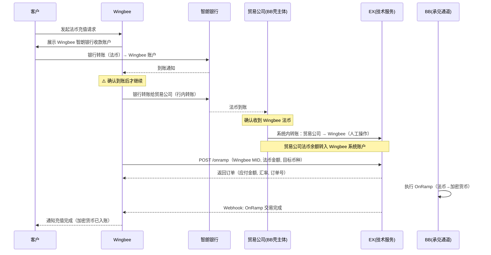
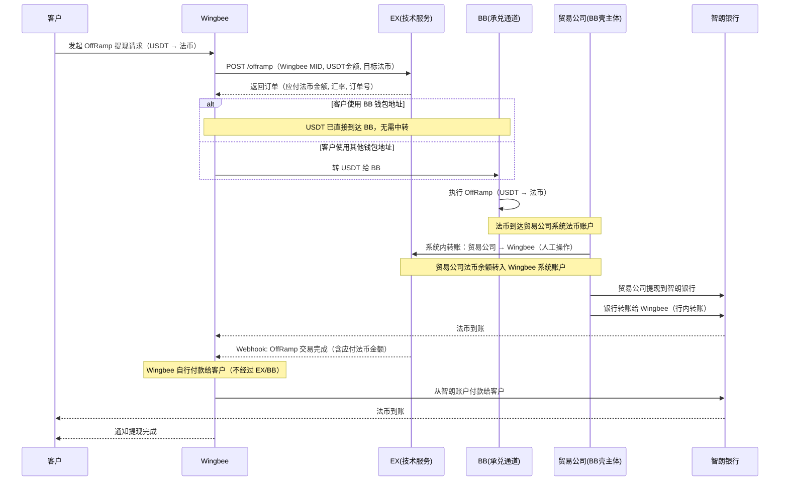

# Wingbee OnRamp / OffRamp — 解决方案

> **文档类型**: Wingbee 承兑业务解决方案
> **版本**: v1.1
> **最后更新**: 2026-04-16
> **适用对象**: Wingbee 平台

---

## 一、方案概述

### 1.1 各方角色

| 角色              | 说明                                                           |
| ----------------- | -------------------------------------------------------------- |
| **Wingbee** | 面向终端客户的平台，客户在 Wingbee 入网并操作 OnRamp / OffRamp。在 EX 系统上是 BB 的商户 |
| **贸易公司** | BB 控制的壳主体，已在智朗银行开户。在 EX 系统上也是 BB 的商户。负责法币中转 |
| **BB**      | 持牌合规通道，承兑执行方。BB 本身未在智朗银行开户，通过贸易公司完成法币收付 |
| **EX**      | 技术服务商，为 BB 提供系统支撑。Wingbee 通过 EX API 与 BB 交互 |
| **客户**    | Wingbee 的终端用户，在 Wingbee 平台完成法币 ↔ 加密货币兑换    |

### 1.2 架构关系

```
                                                        ┌──────────┐
┌──────────┐                ┌──────────┐   API 对接     │  EX      │
│  客户     │  入网/交易     │ Wingbee  │ ──────────→   │(技术服务) │
│(终端用户) │ ──────────→   │ (平台)   │                └────┬─────┘
└──────────┘                └──────────┘                     │
                                 │                           │ 系统支撑
                                 │ 银行转账                   ▼
                                 ▼                      ┌──────────┐
                            ┌──────────┐                │   BB     │
                            │ 贸易公司  │                │(持牌通道) │
                            │(BB壳主体) │                └──────────┘
                            │ 智朗银行  │
                            └──────────┘
```

**系统上的身份关系：**
- **Wingbee** = BB 的商户（通过 EX 入网），拥有自己的 MID
- **贸易公司** = BB 的商户（通过 EX 入网），拥有自己的 MID，由 BB 控制
- 两者在 EX 系统上是两个独立的商户，可以进行系统内转账

**资金通道：**
- BB 本身没有智朗银行账户，法币收付通过贸易公司的智朗银行账户完成
- Wingbee 有自己的智朗银行账户
- Wingbee ↔ 贸易公司之间通过智朗银行转账（行内转账）

### 1.3 核心原则

| 原则                       | 说明                                                               |
| -------------------------- | ------------------------------------------------------------------ |
| **OnRamp 先收后做**  | 贸易公司必须先收到 Wingbee 转来的法币，确认到账后才执行 OnRamp。绝不垫资 |
| **OffRamp 头寸自管** | Wingbee 自行管理法币头寸，可选择先垫付客户再等结算，但风险自担 |
| **双方不互垫头寸**   | BB/贸易公司不为 Wingbee 垫资，Wingbee 不为 BB 垫资。各自管理各自的资金池 |

### 1.4 资金流向总览

```
OnRamp（法币 → 加密货币）:
  客户法币 → Wingbee 智朗账户 → 银行转账给贸易公司智朗账户
  → 贸易公司在系统上转账给 Wingbee（系统记账）
  → Wingbee 调用 OnRamp → BB 执行承兑 → 加密货币入客户账户

OffRamp（加密货币 → 法币）:
  Wingbee 调用 OffRamp → BB 执行承兑 → 法币到贸易公司系统账户
  → 贸易公司 OffRamp 提现到自己的智朗银行账户
  → 贸易公司银行转账给 Wingbee 智朗账户
  → Wingbee 付款给客户
```

---

## 二、前置流程

### 2.1 Wingbee 自身准备

```
├── 1. Wingbee 在智朗银行开设法币账户
│     └── 用于接收客户法币（OnRamp）和向客户付款（OffRamp）
│
├── 2. Wingbee 与 EX 签约
│     └── 作为租户入网 EX 平台
│     └── 开通 OnRamp / OffRamp 产品
│
├── 3. Wingbee 通过自身作为商户通过 BB 入网（如果已经入网，我们协助迁移）
│     └── Wingbee 需通过 EX 将自己注册为 BB 的商户，完成 KYC/KYB
│     └── 用于以 Wingbee 自身账号发起 OnRamp / OffRamp 交易
│
└── 4. 技术对接
      └── 获取 Sandbox 环境 → 配置 APP ID / 公钥 / AES Key / Webhook
      └── 完成签名验签 + AES 加解密联调
```

### 2.2 贸易公司准备（BB 侧）

```
├── 1. 贸易公司已在智朗银行开设法币账户
│     └── 用于接收 Wingbee 法币（OnRamp）和向 Wingbee 付款（OffRamp）
│
├── 2. 贸易公司作为商户通过 BB 入网
│     └── 通过 EX 注册为 BB 的商户，完成 KYC/KYB
│     └── 贸易公司由 BB 控制，合规期间作为 BB 的客户存在
│
└── 3. 开通产品
      └── 开通 OnRamp / OffRamp 产品
      └── 配置 OffRamp 收款账户 = 贸易公司智朗银行账号
```

### 2.3 客户入网（Wingbee 为客户完成）

客户入网、产品开通等流程

```
├── 1. 注册客户
│     └── Wingbee 通过 EX API 注册终端客户 → 获取 MID
│
├── 2. 提交产品开通所需信息（KYC/KYB 等）
│     └── 根据产品要求上传审核材料
│     └── Webhook: 审核结果通知（APPROVED / REJECTED / RFI）
│
└── 3. 产品审核通过 → 客户可使用 OnRamp / OffRamp
```

---

## 三、OnRamp 业务流程（法币 → 加密货币）

**核心原则：贸易公司必须先收到 Wingbee 转来的法币，确认到账后才执行 OnRamp。**

### 步骤详解

```
├── 1. 客户发起法币充值
│     └── 客户在 Wingbee 前端发起法币充值请求
│     └── Wingbee 向客户展示智朗银行收款账户信息
│
├── 2. 客户打款
│     └── 客户通过银行转账将法币打入 Wingbee 的智朗银行账户
│
├── 3. Wingbee 确认到账
│     └── 在智朗银行确认收到客户法币（⚠️ 必须确认到账）
│
├── 4. Wingbee 银行转账给贸易公司
│     └── Wingbee 从智朗银行账户转账至贸易公司智朗银行账户（行内转账）
│
├── 5. 贸易公司确认到账
│     └── 贸易公司在智朗银行确认收到 Wingbee 法币
│
├── 6. 贸易公司在系统上转账给 Wingbee（系统记账）
│     └── 贸易公司通过 EX 系统将法币余额转给 Wingbee 的系统账户
│     └── ⚠️ 当前人工操作，系统暂无自动转账功能
│
├── 7. Wingbee 调用 OnRamp
│     └── 调用 EX API 发起 OnRamp 请求
│     └── EX 返回：OnRamp 订单信息（含应付法币金额、汇率、订单号）
│
├── 8. BB 执行 OnRamp
│     └── BB 执行承兑（法币 → 加密货币）
│     └── 加密货币入账到客户账户
│
└── 9. 交易完成
      └── Webhook: OnRamp 交易结果通知
      └── Wingbee 通知客户充值完成
```

### OnRamp 时序图



---

## 四、OffRamp 业务流程（加密货币 → 法币）

### 4.1 前置：设置收款账户

> **本期原则：OffRamp 统一走 Wingbee 自身商户号。BB 执行承兑后，法币进入贸易公司系统账户，贸易公司提现到智朗银行后银行转账给 Wingbee，Wingbee 自行付款给客户。**

```
├── 1. 贸易公司在 EX 配置收款账户（beneficiary）
│     └── 收款账户 = 贸易公司的智朗银行账号
│     └── OffRamp 完成后，贸易公司可提现到自己的智朗银行账户
│
├── 2. Wingbee 可用自身商户号发起 OffRamp
│
└── 3. 客户提现账户由 Wingbee 自行管理
      └── 客户在 Wingbee 前端添加提现银行账户
      └── Wingbee 负责维护客户收款信息，不经过 EX
```

### 4.2 OffRamp 交易流程

```
├── 1. 客户发起提现
│     └── 客户在 Wingbee 前端发起加密货币提现（如 USDT → 法币）
│
├── 2. Wingbee 以自身商户号发起 OffRamp
│     └── 调用 EX API，以 Wingbee 自己的 MID 发起 OffRamp
│     └── EX 返回：OffRamp 订单信息（含应付法币金额、汇率、订单号）
│
├── 3. USDT 到达 BB
│     └── 若客户使用 BB 钱包地址：USDT 直接到达 BB，此步免操作
│     └── 若客户使用其他钱包地址：Wingbee 需将 USDT 转给 BB
│
├── 4. BB 执行 OffRamp
│     └── BB 执行承兑（USDT → 法币）
│     └── 法币到达贸易公司的系统法币账户
│
├── 5. 贸易公司系统转账给 Wingbee（系统记账）
│     └── 贸易公司通过 EX 系统将法币余额转给 Wingbee 系统账户
│     └── ⚠️ 当前人工操作
│
├── 6. 贸易公司提现到智朗银行
│     └── 贸易公司发起法币提现，从系统账户提现到贸易公司智朗银行账户
│
├── 7. 贸易公司银行转账给 Wingbee
│     └── 贸易公司从智朗银行转账给 Wingbee 智朗银行账户（行内转账）
│
├── 8. Wingbee 自行付款给客户
│     └── Wingbee 根据客户提现信息，从智朗银行账户付款给客户
│     └── 客户提现账户由 Wingbee 自行管理，不经过 EX/BB
│
└── 9. 交易完成
      └── Webhook: OffRamp 交易结果通知
      └── Wingbee 通知客户提现完成
```

### OffRamp 时序图



---

## 五、系统内转账说明

### 5.1 为什么需要系统内转账

```
┌───────────────────────────────────────────────────────────────┐
│                    系统内转账的必要性                             │
│                                                                │
│  BB 没有智朗银行账户，无法直接与 Wingbee 进行银行转账。           │
│  贸易公司是 BB 控制的壳主体，拥有智朗银行账户。                   │
│                                                                │
│  资金流：银行层面在 Wingbee ↔ 贸易公司之间流转                   │
│  记账流：系统层面在 贸易公司 ↔ Wingbee 的 EX 账户之间记账         │
│                                                                │
│  两者必须对应：                                                  │
│  • 银行转账完成 → 系统内做对应的转账记账                          │
│  • 系统记账完成 → Wingbee 才能发起 OnRamp                        │
│  • OffRamp 完成后 → 系统内转给 Wingbee → 贸易公司银行转账        │
└───────────────────────────────────────────────────────────────┘
```

### 5.2 当前操作方式

| 操作 | 银行层面 | 系统层面 | 操作人 |
| ---- | -------- | -------- | ------ |
| OnRamp 入金 | Wingbee → 贸易公司（银行转账） | 贸易公司 → Wingbee（系统转账） | 贸易公司（人工） |
| OffRamp 出金 | 贸易公司 → Wingbee（银行转账） | 贸易公司 → Wingbee（系统转账） | 贸易公司（人工） |

> ⚠️ **当前系统暂无自动转账功能**，贸易公司的系统内转账由 BB 运营人员人工操作。后续系统上线转账功能后可自动化。

---

## 六、头寸管理与资金原则

### 6.1 核心原则

```
┌───────────────────────────────────────────────────────────────┐
│                       资金隔离原则                               │
│                                                                │
│  1. OnRamp：先收后做                                            │
│     └── 贸易公司必须先确认收到 Wingbee 法币，才做系统转账        │
│     └── Wingbee 系统账户有余额后才能发起 OnRamp                 │
│     └── 不允许未收款就发起交易                                  │
│                                                                │
│  2. OffRamp：头寸自管                                           │
│     └── Wingbee 自行管理智朗银行法币头寸                          │
│     └── 可先垫付客户，再等贸易公司银行转账（风险自担）            │
│                                                                │
│  3. 三方不互垫头寸                                              │
│     └── BB/贸易公司不为 Wingbee 垫资                             │
│     └── Wingbee 不为 BB/贸易公司垫资                             │
│     └── 各管各的资金池                                           │
└───────────────────────────────────────────────────────────────┘
```

### 6.2 OffRamp 头寸策略

Wingbee 在 OffRamp 场景下有两种付款策略：

| 策略                       | 做法                                                                 | 风险                   | 客户体验           |
| -------------------------- | -------------------------------------------------------------------- | ---------------------- | ------------------ |
| **保守策略（推荐）** | 等贸易公司银行转账到 Wingbee 智朗后再付款给客户                       | 零风险                 | 客户等待时间较长   |
| **激进策略**         | Wingbee 预先在智朗银行备足法币头寸，先垫付客户，再等贸易公司转账       | 汇率波动风险、资金占用 | 客户体验好，到账快 |

> **建议**：初期采用保守策略，业务稳定后根据资金情况考虑激进策略。

---

## 七、完整业务总览

```
                     Wingbee OnRamp / OffRamp 全景

  ┌──────────────────────────────────────────────────────────────────────┐
  │                             前置流程                                  │
  │  Wingbee 智朗开户 → EX签约 → BB入网 → 技术对接                        │
  │  贸易公司 智朗开户 → BB入网 → 产品开通                                 │
  └────────────────────────────┬─────────────────────────────────────────┘
                               │
              ┌────────────────┼────────────────┐
              ▼                                 ▼
  ┌──────────────────────────┐   ┌──────────────────────────────┐
  │        OnRamp             │   │         OffRamp               │
  │   (法币 → 加密货币)       │   │   (加密货币 → 法币)           │
  │                           │   │                               │
  │ 1.客户法币→Wingbee智朗    │   │ 1.客户发起提现                │
  │ 2.Wingbee转账→贸易公司智朗│   │ 2.Wingbee发起OffRamp         │
  │ 3.贸易公司系统转给Wingbee │   │ 3.USDT转给BB                 │
  │ 4.Wingbee调OnRamp        │   │ 4.BB执行OffRamp              │
  │ 5.BB执行OnRamp           │   │ 5.贸易公司系统转给Wingbee    │
  │ 6.加密货币入客户账户      │   │ 6.贸易公司银行转给Wingbee    │
  └──────────────────────────┘   │ 7.Wingbee付款给客户          │
                                  └──────────────────────────────┘
```

---

## 八、Webhook 事件

| 事件             | 触发时机             | 说明                      |
| ---------------- | -------------------- | ------------------------- |
| KYC/KYB 审核结果 | 客户审核完成         | APPROVED / REJECTED / RFI |
| 产品审核结果     | 产品申请审核完成     | approved / rejected       |
| 收款人审核结果   | 贸易公司收款账户审核完成 | APPROVED / REJECTED / RFI |
| OnRamp 交易结果  | OnRamp 处理完成      | 含最终汇率、加密货币金额  |
| OffRamp 交易结果 | OffRamp 处理完成     | 含最终汇率、应付法币金额  |

---

## 九、注意事项

1. **OnRamp 必须先收后做** — 贸易公司必须确认收到 Wingbee 银行转账后，才能做系统内转账；Wingbee 系统账户有余额后才能调 OnRamp
2. **系统内转账当前人工操作** — 贸易公司的系统内转账由 BB 运营人员手动执行，需关注时效
3. **汇率有时效性** — OnRamp/OffRamp 的报价有过期时间，过期需重新获取
4. **RFI 及时响应** — 审核过程中可能要求补充材料，超时可能导致审核失败
5. **对账** — Wingbee 应定期核对：智朗银行流水 ↔ EX 系统交易记录 ↔ 贸易公司转账记录
6. **头寸监控** — 采用激进策略时需实时监控智朗账户余额，避免付款失败
7. **银行转账与系统记账必须一一对应** — 每笔银行转账都需要有对应的系统内转账记录，确保资金可追溯
