# EX Crypto Solution

> **Document Type**: Solution Guide
> **Version**: v1.0
> **Last Updated**: 2026-04-08
> **API Reference**: [EurewaX Open Platform](https://open.eurewax.com/)

---

## Overview

EX Crypto Solution offers **one-stop digital currency capabilities**, enabling you to quickly integrate complete crypto deposit, withdrawal, and exchange features into your own platform through standardized RESTful APIs and real-time Webhook notifications.

**Core Value:**

- **Full Coverage** - Fiat deposit/withdrawal, crypto deposit/withdrawal, fiat-to-crypto and crypto-to-fiat exchange all in one API suite
- **Compliance Assured** - Submit merchant information once, EX manages KYC/KYB review process and syncs results, no need to interface separately with compliance institutions
- **Multi-Asset Support** - Supports mainstream crypto assets (USDT, BTC, ETH, etc.) and multiple fiat currencies
- **Flexible Integration** - APIs can be freely combined according to your business logic, adapting to different platform architectures

**Target Customers:**

| Customer Type                      | Scenario                                                          |
| ---------------------------------- | ----------------------------------------------------------------- |
| **Crypto Exchanges**         | Provide fiat on-ramp/off-ramp capabilities for users              |
| **Crypto Payment Platforms** | Already have merchant management system, need crypto capabilities |
| **Fintech / BaaS Platforms** | Offer white-label crypto deposit/withdrawal services              |
| **Cross-border Platforms**   | Multi-currency settlement, crypto-fiat conversion                 |

---

## 1. Platform Introduction

### 1.1 What is EurewaX Open Platform?

EurewaX Open Platform is EX's standardized API platform for partners. Crypto Solution covers the following core business modules:

| Module                     | Capability                                                   | Typical Scenario                       |
| -------------------------- | ------------------------------------------------------------ | -------------------------------------- |
| **Onboarding**       | Merchant registration, KYC/KYB review                        | Merchant onboarding, compliance review |
| **Crypto Accounts**  | Account management, balance inquiry                          | Multi-asset wallet management          |
| **Collection Tools** | Collection address management                                | Crypto deposit addresses               |
| **Beneficiaries**    | Beneficiary address management                               | Withdrawal destination management      |
| **Transactions**     | Fiat deposit/withdrawal, crypto deposit/withdrawal, exchange | Funding, settlement, conversion        |

### 1.2 Technical Specifications

| Item           | Description                                                                                                           |
| -------------- | --------------------------------------------------------------------------------------------------------------------- |
| Protocol       | HTTPS                                                                                                                 |
| API Style      | RESTful API                                                                                                           |
| Data Format    | JSON                                                                                                                  |
| Authentication | Merchant Token (obtained via authentication service)                                                                  |
| Security       | Signature verification + sensitive data encryption                                                                    |
| Async Notifies | Webhook (supports configuring different callback URLs by notification type, or unified address for all notifications) |

---

## 2. Glossary

| Term              | English                 | Description                                                          | Cantonese         |
| ----------------- | ----------------------- | -------------------------------------------------------------------- | ----------------- |
| Merchant          | Merchant                | Your platform's end customer, obtains crypto capabilities through EX | Merchant          |
| MID               | Merchant ID             | Unique identifier assigned by EX to each merchant                    | -                 |
| Collection Tool   | Collection Tool         | Crypto deposit address provided to merchant                          | Deposit Tool      |
| Beneficiary       | Beneficiary             | Withdrawal destination address (personal or enterprise)              | Beneficiary       |
| Fiat Deposit      | Fiat Deposit            | Deposit fiat currency to merchant account                            | Fiat Deposit      |
| Fiat Withdrawal   | Fiat Withdrawal         | Withdraw fiat currency from merchant account                         | Fiat Withdrawal   |
| Crypto Deposit    | Crypto Deposit          | Deposit crypto to merchant wallet                                    | Crypto Deposit    |
| Crypto Withdrawal | Crypto Withdrawal       | Withdraw crypto from merchant wallet                                 | Crypto Withdrawal |
| Buy Crypto        | Buy Crypto              | Purchase crypto using fiat balance                                   | Buy Crypto        |
| Sell Crypto       | Sell Crypto             | Sell crypto for fiat balance                                         | Sell Crypto       |
| Fiat-to-Crypto    | Fiat-to-Crypto          | Convert fiat to crypto (OnRamp)                                      | Fiat-to-Crypto    |
| Crypto-to-Fiat    | Crypto-to-Fiat          | Convert crypto to fiat (OffRamp)                                     | Crypto-to-Fiat    |
| USDT              | Tether USD              | Stablecoin pegged 1:1 to USD                                         | USDT              |
| KYC               | Know Your Customer      | Personal identity compliance verification                            | -                 |
| KYB               | Know Your Business      | Business entity compliance verification                              | -                 |
| RFI               | Request for Information | Notification requesting additional materials during review           | -                 |
| Webhook           | -                       | Mechanism for EX to push event notifications to your system          | -                 |

---

## 3. Architecture Overview

Your system integrates via EX API. EX handles unified interface encapsulation, review process orchestration, status synchronization, and event notifications.

```
+------------------------------------------------------------------+
|                       Your System                                 |
|    (Crypto Exchange / Payment Platform / BaaS / Fintech)          |
+----------------------------------+-------------------------------+
                                   |  RESTful API + Webhook
                                   v
+------------------------------------------------------------------+
|                     EurewaX Open Platform                         |
|                                                                   |
|  +------------+  +------------+  +------------+  +------------+ |
|  | Onboarding |  | Crypto     |  | Collection |  | Transaction| |
|  | KYC/KYB    |  | Accounts   |  | Tools      |  | Deposit/   | |
|  |            |  |            |  | Beneficiary|  | Withdraw/  | |
|  |            |  |            |  |            |  | Exchange   | |
|  +------------+  +------------+  +------------+  +------------+ |
|                                                                   |
|  +------------+  +------------+                                  |
|  | Common     |  | Webhook    |                                  |
|  | Services   |  | Events     |                                  |
|  +------------+  +------------+                                  |
+------------------------------------------------------------------+
```

**Call Chain:**

```
Your System -> EX API -> EX Processing (Review Orchestration + Business Execution) -> Webhook Notification -> Your System
```

> **Tip**: You can call corresponding APIs at appropriate business nodes based on your platform design. The following flows do not need to be completed strictly in sequence at once.

---

## 4. Prerequisite Flows

Complete preparation work before business operations: common service configuration, merchant registration, KYC/KYB review, product activation.

---

### 4.1 Common Services Configuration

Before starting business integration, complete the following basic configurations:

#### 4.1.1 Configure Webhook Notification URL

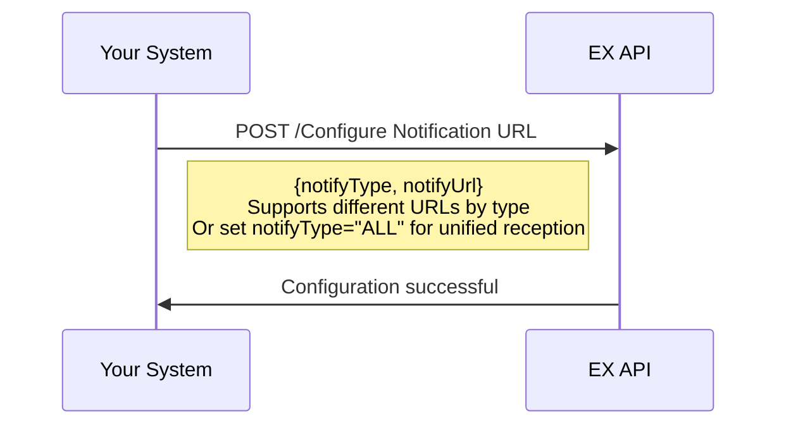

#### 4.1.2 File Upload

When uploading attachments for KYC/KYB, beneficiary materials, etc., first call the file upload interface, then put the returned URL into business requests.

```
Upload Flow:
    1. Call [Upload File] API -> Get file URL
    2. Put file URL into business request (KYC/KYB/beneficiary materials, etc.)
```

#### 4.1.3 Get Merchant Token

For scenarios requiring redirect to EX frontend pages, first obtain Token then pass to frontend page.

---

### 4.2 Merchant Registration

Create your end merchants on EX platform and obtain unique merchant identifier (MID).

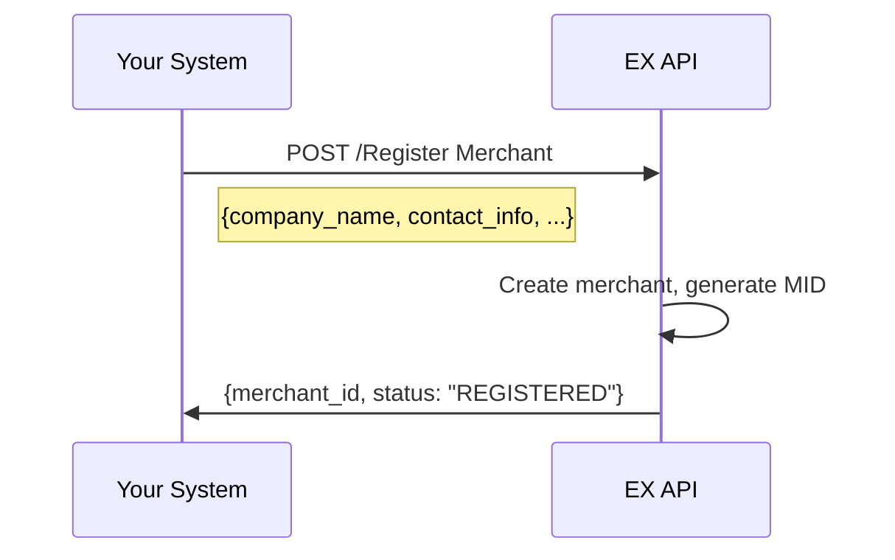

---

### 4.3 KYC Review

Submit merchant's KYC information and materials. Business requests can only be initiated after review approval.

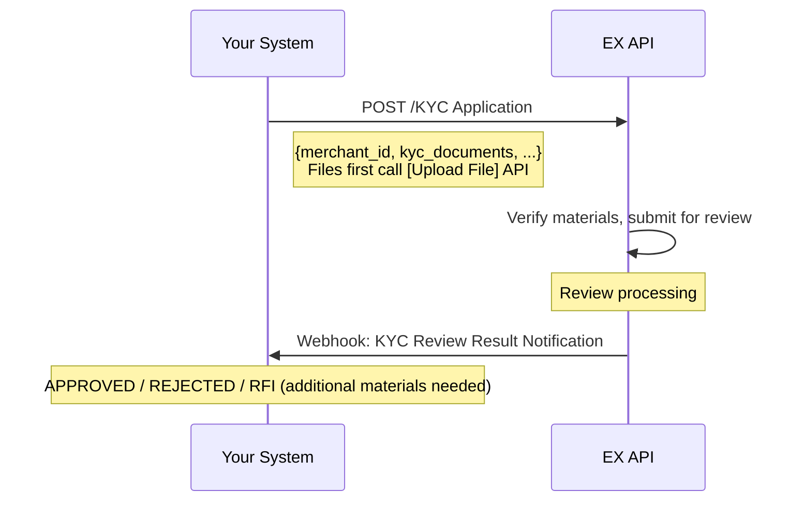

**Key Points:**

- After KYC approval, corresponding business lines can be activated (e.g., crypto deposit/withdrawal, exchange)
- **RFI** may be triggered during review, requesting additional materials
- Review results can be actively queried via API, or passively wait for Webhook notification
- KYC template: [KYC Template](https://open.eurewax.com/kyc%E6%A8%A1%E6%9D%BF-6985923m0)

---

### 4.4 KYB Review

If additional business lines need to be activated, submit KYB application.

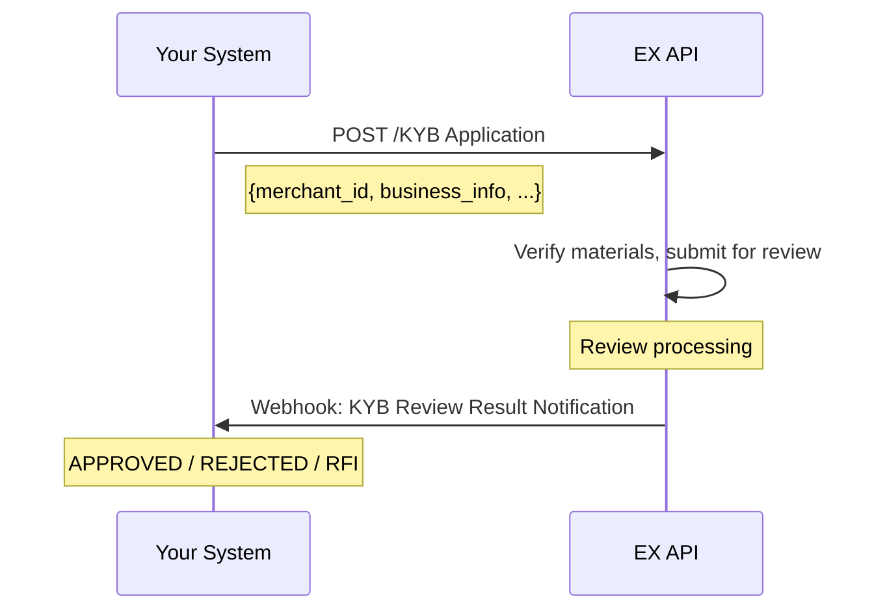

**Key Points:**

- KYB template: [KYB Template](https://open.eurewax.com/kyb%E6%A8%A1%E6%9D%BF-6985924m0)

---

### 4.5 Product Activation

Apply for crypto products for the merchant. You only need to submit merchant materials, EX will forward to licensed compliance institution for review, and the result will be notified via Webhook.

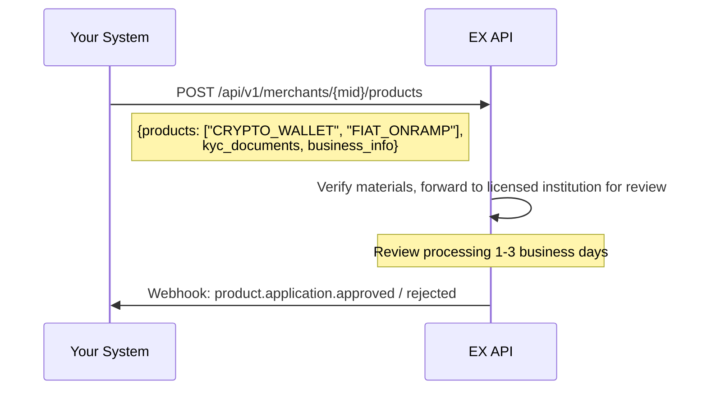

**Key Points:**

- Review includes: merchant entity compliance, business scenario compliance, KYB/KYC verification (completed by licensed compliance institution)
- During review, **RFI** may be triggered requesting additional materials
- You can call this flow at user registration, onboarding review, or first use of crypto features based on your platform design

**Product Types:**

| Product Code      | Description   | Notes                                      |
| ----------------- | ------------- | ------------------------------------------ |
| `CRYPTO_WALLET` | Crypto Wallet | Crypto deposit/withdrawal, balance inquiry |
| `FIAT_ONRAMP`   | Fiat OnRamp   | Fiat deposit, fiat-to-crypto conversion    |
| `FIAT_OFFRAMP`  | Fiat OffRamp  | Crypto-to-fiat conversion, fiat withdrawal |

---

## 5. Crypto Services

After merchant completes onboarding review, crypto account management, collection tools, beneficiary management, deposit/withdrawal, and exchange capabilities can be used.

---

### 5.1 Basic Functions

#### 5.1.1 Query Exchange Rates

Query crypto-to-fiat and crypto-to-crypto exchange rates.

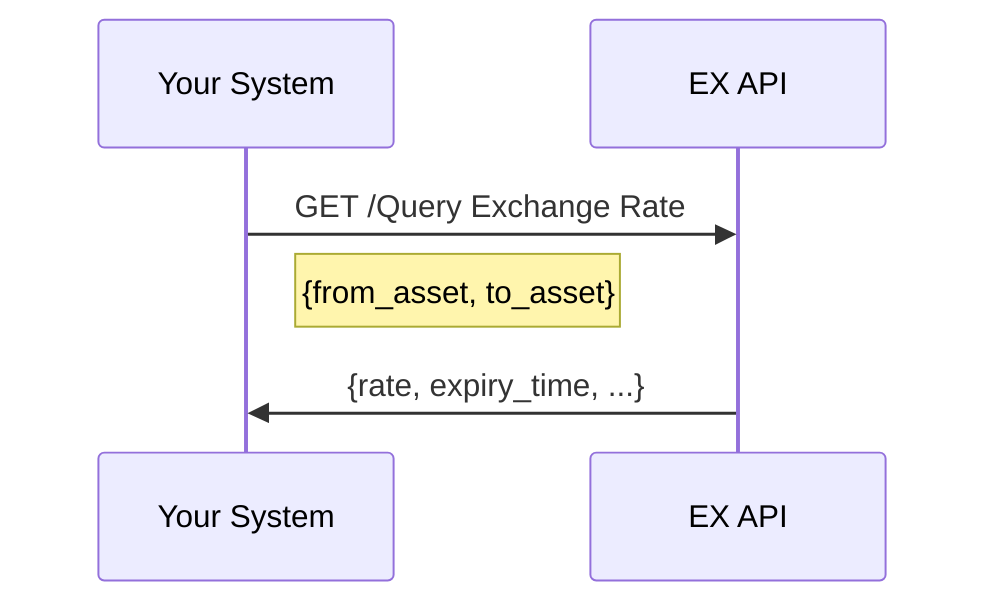

#### 5.1.2 Query Supported Assets

Query crypto and fiat assets supported by the platform.

| Interface              | Description                                      |
| ---------------------- | ------------------------------------------------ |
| Query Supported Assets | Returns list of supported crypto and fiat assets |

---

### 5.2 Account Management

#### 5.2.1 Query Account List

Query merchant's crypto and fiat account information.

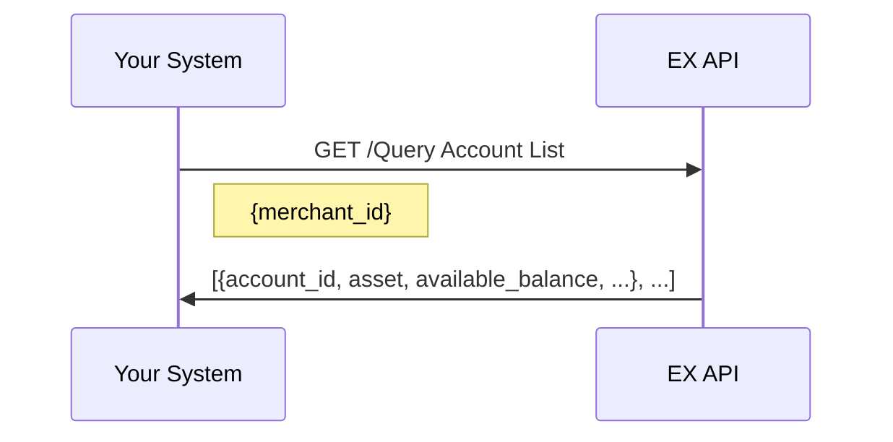

**Account Types:**

| Account Type  | Description                           |
| ------------- | ------------------------------------- |
| Fiat Account  | Fiat balance (USD, EUR, etc.)         |
| Crypto Wallet | Crypto balance (USDT, BTC, ETH, etc.) |

---

### 5.3 Collection Tool Management

Manage crypto deposit addresses for merchants.

#### 5.3.1 Query Collection Tools

| Interface              | Description                               |
| ---------------------- | ----------------------------------------- |
| Query Collection Tools | Query merchant's crypto deposit addresses |

**Collection Tool Types:**

| Type           | Description                                                       |
| -------------- | ----------------------------------------------------------------- |
| Crypto Address | On-chain deposit address (USDT-TRC20, USDT-ERC20, BTC, ETH, etc.) |

> **Note**: Collection tools are created automatically after product activation. You can query existing addresses or request new ones.

---

### 5.4 Beneficiary Management

Manage withdrawal destination addresses.

#### 5.4.1 Add Beneficiary

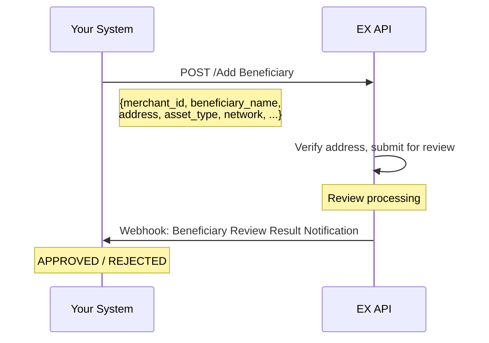

#### 5.4.2 Beneficiary Operations

| Interface                              | Description                            |
| -------------------------------------- | -------------------------------------- |
| Add Beneficiary                        | Add new withdrawal address             |
| Delete Beneficiary                     | Delete existing address                |
| Query Beneficiary List                 | Query all beneficiary addresses        |
| Beneficiary Review Result Notification | Webhook notification for review result |

**Key Points:**

- Beneficiary addresses require compliance review before use
- Support multiple networks (TRC20, ERC20, BTC, ETH, etc.)

---

### 5.5 Transaction Management

#### 5.5.1 Fiat Deposit

Deposit fiat currency to merchant account.

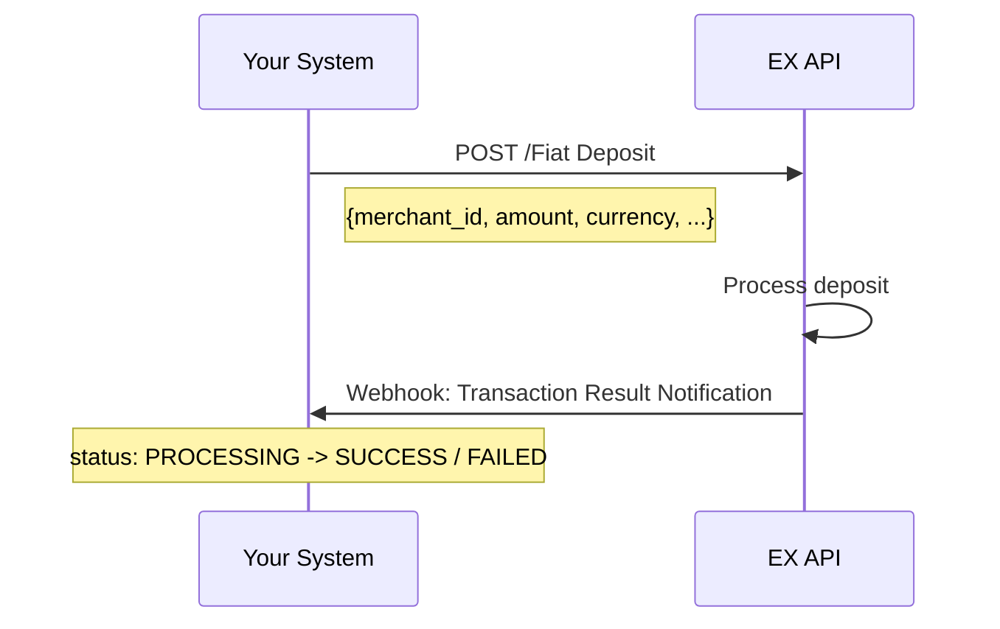

#### 5.5.2 Fiat Withdrawal

Withdraw fiat currency from merchant account.

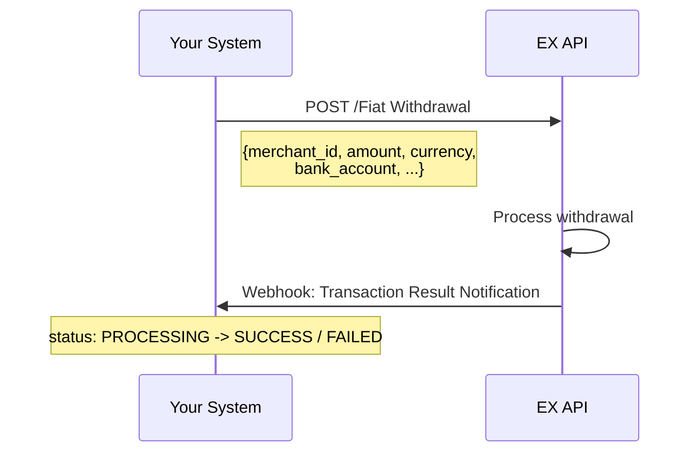

#### 5.5.3 Crypto Deposit

Deposit crypto to merchant wallet.

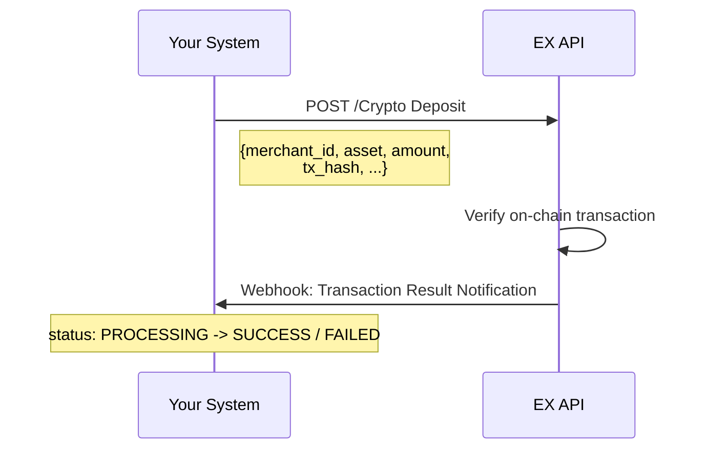

**Key Points:**

- Crypto deposits require on-chain confirmation
- Support multiple networks (TRC20, ERC20, BTC, ETH, etc.)

#### 5.5.4 Crypto Withdrawal

Withdraw crypto from merchant wallet.

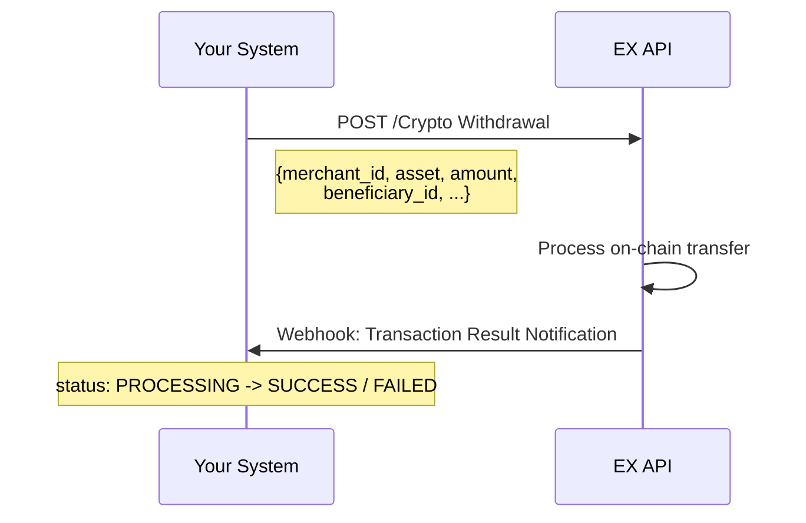

**Key Points:**

- Withdrawal address must be approved beneficiary
- On-chain transfer requires network confirmation time

#### 5.5.5 Buy Crypto

Purchase crypto using fiat balance.

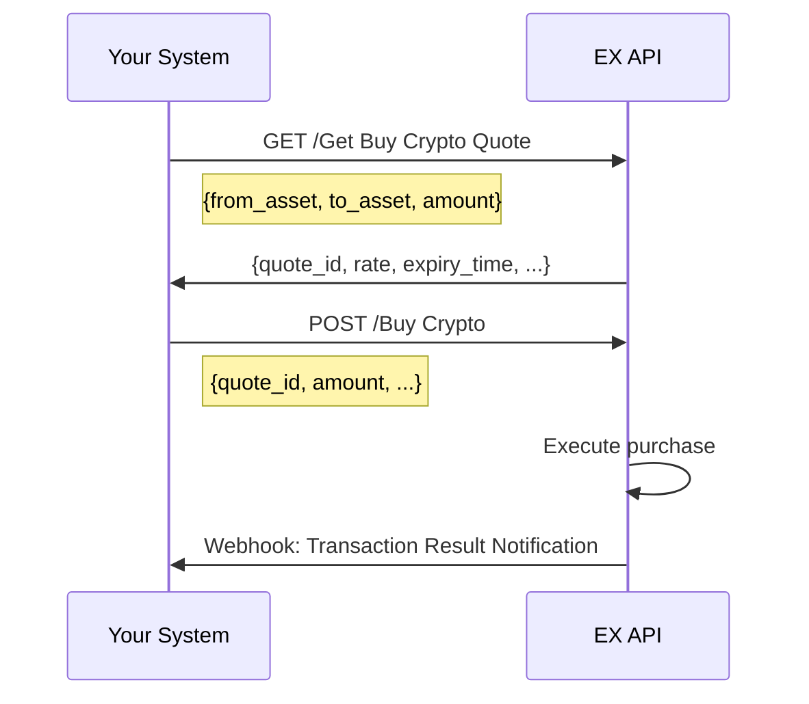

#### 5.5.6 Sell Crypto

Sell crypto for fiat balance.


#### 5.5.7 Fiat-to-Crypto (OnRamp)

Convert fiat to crypto directly.

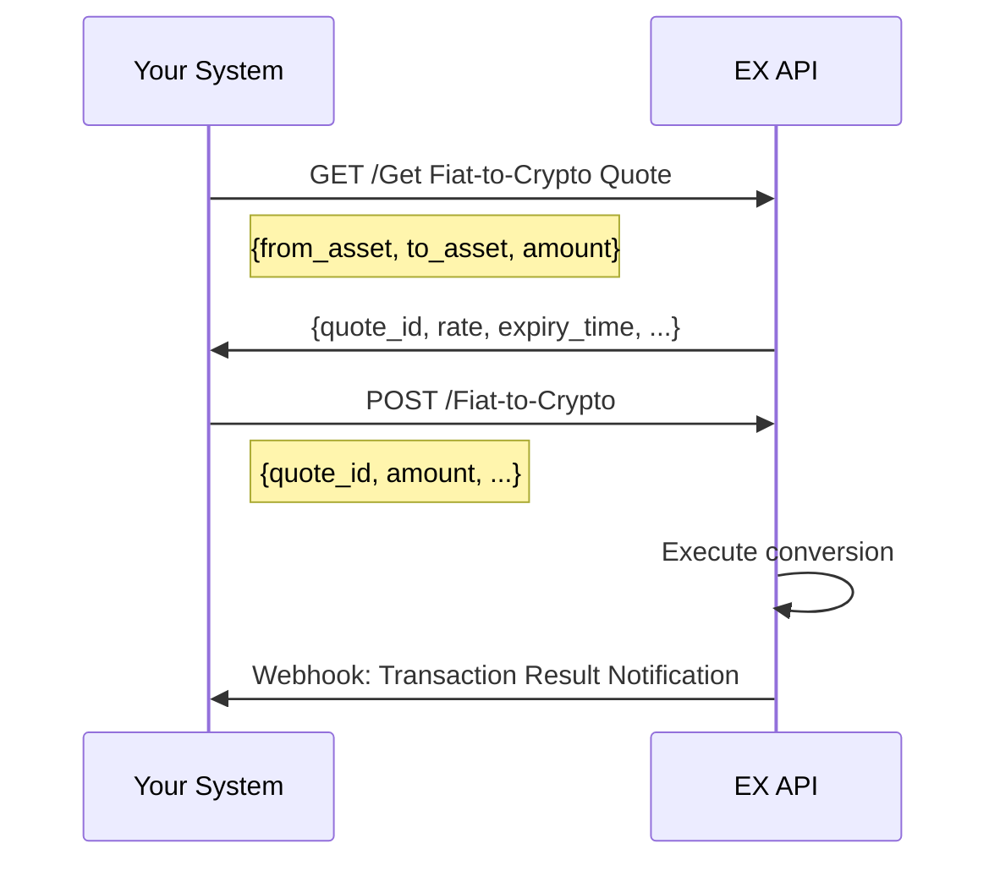

#### 5.5.8 Crypto-to-Fiat (OffRamp)

Convert crypto to fiat directly.


#### 5.5.9 Transaction Fee Estimation

Estimate fees for deposit/withdrawal transactions.

| Interface                         | Description                            |
| --------------------------------- | -------------------------------------- |
| Deposit/Withdrawal Fee Estimation | Estimate network fees for transactions |

#### 5.5.10 Query Transaction Details

| Interface                 | Description                        |
| ------------------------- | ---------------------------------- |
| Query Transaction Details | Query specific transaction details |
| Query Transaction Records | Query transaction history list     |

---

## 6. Webhook Events Summary

Configure Webhook receiving address. EX will proactively push notifications when the following events occur:

| Event Category               | Event                                  | Trigger Time                     |
| ---------------------------- | -------------------------------------- | -------------------------------- |
| **Onboarding**         | KYC Review Result Notification         | KYC review completed             |
|                              | KYB Review Result Notification         | KYB review completed             |
| **Product Activation** | Product Review Approved Notification   | Product review approved          |
|                              | Product Review Rejected Notification   | Product review rejected          |
|                              | Product Review RFI Notification        | Additional materials needed      |
| **Beneficiary**        | Beneficiary Review Result Notification | Beneficiary review completed     |
| **Transactions**       | Transaction Result Notification        | Transaction processing completed |

---

## 7. API Capability Summary

Complete Crypto API capability matrix:

| Module                        | Sub-module                | Interface                                                                             | Type    |
| ----------------------------- | ------------------------- | ------------------------------------------------------------------------------------- | ------- |
| **Common Services**     | Event Notification        | Configure Notification URL                                                            | API     |
|                               | File Services             | Upload File / Supplement Business Materials                                           | API     |
|                               | Authentication            | Get Merchant Token                                                                    | API     |
| **Onboarding**          | Merchant Onboarding       | Register Merchant                                                                     | API     |
|                               |                           | KYC Application / Query KYC Review Result                                             | API     |
|                               |                           | KYB Application / Query KYB Review Result                                             | API     |
|                               |                           | KYC/KYB Review Result Notification                                                    | Webhook |
| **Product Activation**  | Product Application       | Apply for Product / Query Product Review Result                                       | API     |
|                               |                           | Product Review Result Notification / Product Review RFI Notification                  | Webhook |
| **Crypto-Basic**        | Basic Functions           | Query Exchange Rate / Query Supported Assets                                          | API     |
| **Crypto-Accounts**     | Account Management        | Query Account List                                                                    | API     |
| **Crypto-Collection**   | Collection Tools          | Query Collection Tools                                                                | API     |
| **Crypto-Beneficiary**  | Beneficiary               | Add / Delete / Query Beneficiary                                                      | API     |
|                               |                           | Beneficiary Review Result Notification                                                | Webhook |
| **Crypto-Transactions** | Fiat Deposit/Withdrawal   | Fiat Deposit / Fiat Withdrawal                                                        | API     |
|                               | Crypto Deposit/Withdrawal | Crypto Deposit / Crypto Withdrawal                                                    | API     |
|                               | Buy/Sell Crypto           | Get Buy Quote / Buy Crypto / Get Sell Quote / Sell Crypto                             | API     |
|                               | Fiat-Crypto Conversion    | Get Fiat-to-Crypto Quote / Fiat-to-Crypto / Get Crypto-to-Fiat Quote / Crypto-to-Fiat | API     |
|                               | Fee Estimation            | Deposit/Withdrawal Fee Estimation                                                     | API     |
|                               | Transaction Query         | Query Transaction Details / Query Transaction Records                                 | API     |
|                               |                           | Transaction Result Notification                                                       | Webhook |

---

## 8. Integration Best Practices

| # | Best Practice                    | Description                                                                                            |
| - | -------------------------------- | ------------------------------------------------------------------------------------------------------ |
| 1 | **Webhook First**          | Rely primarily on Webhook event-driven, supplement with API polling to reduce unnecessary API calls    |
| 2 | **Idempotency**            | Same event may be pushed multiple times, implement idempotency check based on business order number    |
| 3 | **Signature Verification** | All Webhook requests require signature verification to ensure legitimate source                        |
| 4 | **Async Design**           | Deposit, withdrawal, exchange operations are all async processing, get final results via Webhook       |
| 5 | **Timely RFI Response**    | KYC/KYB/beneficiary review may require additional materials, delayed response may cause review failure |
| 6 | **Quote Expiry**           | Exchange quotes have expiry time, execute before expiry or get new quote                               |
| 7 | **File Upload First**      | All attachment materials must first call file upload API to get URL, then put into business request    |
| 8 | **Flexible Orchestration** | Each step can be orchestrated according to your platform design, no strict sequence required           |

---

## 9. Typical Integration Timeline

| Phase                         | Content                                                                             | Estimated Duration |
| ----------------------------- | ----------------------------------------------------------------------------------- | ------------------ |
| **Environment Setup**   | Get API Key, configure Webhook address, sandbox environment                         | 1-2 days           |
| **Prerequisite Flows**  | Integrate merchant registration + KYC/KYB review + product activation APIs          | 3-5 days           |
| **Crypto Core Flows**   | Integrate account, collection tools, beneficiary, deposit/withdrawal, exchange APIs | 7-10 days          |
| **Integration Testing** | End-to-end flow verification, exception scenario coverage                           | 5-7 days           |
| **Go-Live**             | Production environment switch, monitoring configuration                             | 1-2 days           |

> Total approximately **3-4 weeks**, adjustable based on technical team size and platform complexity.

---

## 10. Getting Started

Ready to start integration? Contact your EX account manager to obtain:

1. **Sandbox Environment** - API Key + test environment address
2. **API Documentation** - Complete interface reference documentation (with request/response examples)
3. **Technical Support** - Dedicated integration group + technical support engineer

---

## 1. Platform Introduction

### 1.1 What is EurewaX Open Platform?

EurewaX Open Platform is EX's standardized API platform for partners. Crypto Solution covers the following core business modules:

| Module                     | Capability                                                   | Typical Scenario                       |
| -------------------------- | ------------------------------------------------------------ | -------------------------------------- |
| **Onboarding**       | Merchant registration, KYC/KYB review                        | Merchant onboarding, compliance review |
| **Crypto Accounts**  | Account management, balance inquiry                          | Multi-asset wallet management          |
| **Collection Tools** | Collection address management                                | Crypto deposit addresses               |
| **Beneficiaries**    | Beneficiary address management                               | Withdrawal destination management      |
| **Transactions**     | Fiat deposit/withdrawal, crypto deposit/withdrawal, exchange | Funding, settlement, conversion        |

### 1.2 Technical Specifications

| Item           | Description                                                                                                           |
| -------------- | --------------------------------------------------------------------------------------------------------------------- |
| Protocol       | HTTPS                                                                                                                 |
| API Style      | RESTful API                                                                                                           |
| Data Format    | JSON                                                                                                                  |
| Authentication | Merchant Token (obtained via authentication service)                                                                  |
| Security       | Signature verification + sensitive data encryption                                                                    |
| Async Notifies | Webhook (supports configuring different callback URLs by notification type, or unified address for all notifications) |

---

## 2. Glossary

| Term              | English                 | Description                                                          | Cantonese         |
| ----------------- | ----------------------- | -------------------------------------------------------------------- | ----------------- |
| Merchant          | Merchant                | Your platform's end customer, obtains crypto capabilities through EX | Merchant          |
| MID               | Merchant ID             | Unique identifier assigned by EX to each merchant                    | -                 |
| Collection Tool   | Collection Tool         | Crypto deposit address provided to merchant                          | Deposit Tool      |
| Beneficiary       | Beneficiary             | Withdrawal destination address (personal or enterprise)              | Beneficiary       |
| Fiat Deposit      | Fiat Deposit            | Deposit fiat currency to merchant account                            | Fiat Deposit      |
| Fiat Withdrawal   | Fiat Withdrawal         | Withdraw fiat currency from merchant account                         | Fiat Withdrawal   |
| Crypto Deposit    | Crypto Deposit          | Deposit crypto to merchant wallet                                    | Crypto Deposit    |
| Crypto Withdrawal | Crypto Withdrawal       | Withdraw crypto from merchant wallet                                 | Crypto Withdrawal |
| Buy Crypto        | Buy Crypto              | Purchase crypto using fiat balance                                   | Buy Crypto        |
| Sell Crypto       | Sell Crypto             | Sell crypto for fiat balance                                         | Sell Crypto       |
| Fiat-to-Crypto    | Fiat-to-Crypto          | Convert fiat to crypto (OnRamp)                                      | Fiat-to-Crypto    |
| Crypto-to-Fiat    | Crypto-to-Fiat          | Convert crypto to fiat (OffRamp)                                     | Crypto-to-Fiat    |
| USDT              | Tether USD              | Stablecoin pegged 1:1 to USD                                         | USDT              |
| KYC               | Know Your Customer      | Personal identity compliance verification                            | -                 |
| KYB               | Know Your Business      | Business entity compliance verification                              | -                 |
| RFI               | Request for Information | Notification requesting additional materials during review           | -                 |
| Webhook           | -                       | Mechanism for EX to push event notifications to your system          | -                 |

---

## 3. Architecture Overview

Your system integrates via EX API. EX handles unified interface encapsulation, review process orchestration, status synchronization, and event notifications.

```
+------------------------------------------------------------------+
|                       Your System                                 |
|    (Crypto Exchange / Payment Platform / BaaS / Fintech)          |
+----------------------------------+-------------------------------+
                                   |  RESTful API + Webhook
                                   v
+------------------------------------------------------------------+
|                     EurewaX Open Platform                         |
|                                                                   |
|  +------------+  +------------+  +------------+  +------------+ |
|  | Onboarding |  | Crypto     |  | Collection |  | Transaction| |
|  | KYC/KYB    |  | Accounts   |  | Tools      |  | Deposit/   | |
|  |            |  |            |  | Beneficiary|  | Withdraw/  | |
|  |            |  |            |  |            |  | Exchange   | |
|  +------------+  +------------+  +------------+  +------------+ |
|                                                                   |
|  +------------+  +------------+                                  |
|  | Common     |  | Webhook    |                                  |
|  | Services   |  | Events     |                                  |
|  +------------+  +------------+                                  |
+------------------------------------------------------------------+
```

**Call Chain:**

```
Your System -> EX API -> EX Processing (Review Orchestration + Business Execution) -> Webhook Notification -> Your System
```

> **Tip**: You can call corresponding APIs at appropriate business nodes based on your platform design. The following flows do not need to be completed strictly in sequence at once.

---

## 4. Prerequisite Flows

Complete preparation work before business operations: common service configuration, merchant registration, KYC/KYB review, product activation.

---

### 4.1 Common Services Configuration

Before starting business integration, complete the following basic configurations:

#### 4.1.1 Configure Webhook Notification URL


#### 4.1.2 File Upload

When uploading attachments for KYC/KYB, beneficiary materials, etc., first call the file upload interface, then put the returned URL into business requests.

```
Upload Flow:
    1. Call [Upload File] API -> Get file URL
    2. Put file URL into business request (KYC/KYB/beneficiary materials, etc.)
```

#### 4.1.3 Get Merchant Token

For scenarios requiring redirect to EX frontend pages, first obtain Token then pass to frontend page.

---

### 4.2 Merchant Registration

Create your end merchants on EX platform and obtain unique merchant identifier (MID).


---

### 4.3 KYC Review

Submit merchant's KYC information and materials. Business requests can only be initiated after review approval.


**Key Points:**

- After KYC approval, corresponding business lines can be activated (e.g., crypto deposit/withdrawal, exchange)
- **RFI** may be triggered during review, requesting additional materials
- Review results can be actively queried via API, or passively wait for Webhook notification
- KYC template: [KYC Template](https://open.eurewax.com/kyc%E6%A8%A1%E6%9D%BF-6985923m0)

---

### 4.4 KYB Review

If additional business lines need to be activated, submit KYB application.


**Key Points:**

- KYB template: [KYB Template](https://open.eurewax.com/kyb%E6%A8%A1%E6%9D%BF-6985924m0)

---

### 4.5 Product Activation

Apply for crypto products for the merchant. You only need to submit merchant materials, EX will forward to licensed compliance institution for review, and the result will be notified via Webhook.

```mermaid
sequenceDiagram
    participant You as Your System
    participant EX as EX API

    You->>EX: POST /api/v1/merchants/{mid}/products
    Note right of You: {products: ["CRYPTO_WALLET", "FIAT_ONRAMP"],<br/>kyc_documents, business_info}
    EX->>EX: Verify materials, forward to licensed institution for review
    Note over EX: Review processing 1-3 business days
    EX->>You: Webhook: product.application.approved / rejected
```

**Key Points:**

- Review includes: merchant entity compliance, business scenario compliance, KYB/KYC verification (completed by licensed compliance institution)
- During review, **RFI** may be triggered requesting additional materials
- You can call this flow at user registration, onboarding review, or first use of crypto features based on your platform design

**Product Types:**

| Product Code      | Description   | Notes                                      |
| ----------------- | ------------- | ------------------------------------------ |
| `CRYPTO_WALLET` | Crypto Wallet | Crypto deposit/withdrawal, balance inquiry |
| `FIAT_ONRAMP`   | Fiat OnRamp   | Fiat deposit, fiat-to-crypto conversion    |
| `FIAT_OFFRAMP`  | Fiat OffRamp  | Crypto-to-fiat conversion, fiat withdrawal |

---

## 5. Crypto Services

After merchant completes onboarding review, crypto account management, collection tools, beneficiary management, deposit/withdrawal, and exchange capabilities can be used.

---

### 5.1 Basic Functions

#### 5.1.1 Query Exchange Rates

Query crypto-to-fiat and crypto-to-crypto exchange rates.

```mermaid
sequenceDiagram
    participant You as Your System
    participant EX as EX API

    You->>EX: GET /Query Exchange Rate
    Note right of You: {from_asset, to_asset}
    EX->>You: {rate, expiry_time, ...}
```

#### 5.1.2 Query Supported Assets

Query crypto and fiat assets supported by the platform.

| Interface              | Description                                      |
| ---------------------- | ------------------------------------------------ |
| Query Supported Assets | Returns list of supported crypto and fiat assets |

---

### 5.2 Account Management

#### 5.2.1 Query Account List

Query merchant's crypto and fiat account information.

```mermaid
sequenceDiagram
    participant You as Your System
    participant EX as EX API

    You->>EX: GET /Query Account List
    Note right of You: {merchant_id}
    EX->>You: [{account_id, asset, available_balance, ...}, ...]
```

**Account Types:**

| Account Type  | Description                           |
| ------------- | ------------------------------------- |
| Fiat Account  | Fiat balance (USD, EUR, etc.)         |
| Crypto Wallet | Crypto balance (USDT, BTC, ETH, etc.) |

---

### 5.3 Collection Tool Management

Manage crypto deposit addresses for merchants.

#### 5.3.1 Query Collection Tools

| Interface              | Description                               |
| ---------------------- | ----------------------------------------- |
| Query Collection Tools | Query merchant's crypto deposit addresses |

**Collection Tool Types:**

| Type           | Description                                                       |
| -------------- | ----------------------------------------------------------------- |
| Crypto Address | On-chain deposit address (USDT-TRC20, USDT-ERC20, BTC, ETH, etc.) |

> **Note**: Collection tools are created automatically after product activation. You can query existing addresses or request new ones.

---

### 5.4 Beneficiary Management

Manage withdrawal destination addresses.

#### 5.4.1 Add Beneficiary

```mermaid
sequenceDiagram
    participant You as Your System
    participant EX as EX API

    You->>EX: POST /Add Beneficiary
    Note right of You: {merchant_id, beneficiary_name,<br/>address, asset_type, network, ...}
    EX->>EX: Verify address, submit for review
    Note over EX: Review processing
    EX->>You: Webhook: Beneficiary Review Result Notification
    Note over You: APPROVED / REJECTED
```

#### 5.4.2 Beneficiary Operations

| Interface                              | Description                            |
| -------------------------------------- | -------------------------------------- |
| Add Beneficiary                        | Add new withdrawal address             |
| Delete Beneficiary                     | Delete existing address                |
| Query Beneficiary List                 | Query all beneficiary addresses        |
| Beneficiary Review Result Notification | Webhook notification for review result |

**Key Points:**

- Beneficiary addresses require compliance review before use
- Support multiple networks (TRC20, ERC20, BTC, ETH, etc.)

---

### 5.5 Transaction Management

#### 5.5.1 Fiat Deposit

Deposit fiat currency to merchant account.

```mermaid
sequenceDiagram
    participant You as Your System
    participant EX as EX API

    You->>EX: POST /Fiat Deposit
    Note right of You: {merchant_id, amount, currency, ...}
    EX->>EX: Process deposit
    EX->>You: Webhook: Transaction Result Notification
    Note over You: status: PROCESSING -> SUCCESS / FAILED
```

#### 5.5.2 Fiat Withdrawal

Withdraw fiat currency from merchant account.

```mermaid
sequenceDiagram
    participant You as Your System
    participant EX as EX API

    You->>EX: POST /Fiat Withdrawal
    Note right of You: {merchant_id, amount, currency,<br/>bank_account, ...}
    EX->>EX: Process withdrawal
    EX->>You: Webhook: Transaction Result Notification
    Note over You: status: PROCESSING -> SUCCESS / FAILED
```

#### 5.5.3 Crypto Deposit

Deposit crypto to merchant wallet.

```mermaid
sequenceDiagram
    participant You as Your System
    participant EX as EX API

    You->>EX: POST /Crypto Deposit
    Note right of You: {merchant_id, asset, amount,<br/>tx_hash, ...}
    EX->>EX: Verify on-chain transaction
    EX->>You: Webhook: Transaction Result Notification
    Note over You: status: PROCESSING -> SUCCESS / FAILED
```

**Key Points:**

- Crypto deposits require on-chain confirmation
- Support multiple networks (TRC20, ERC20, BTC, ETH, etc.)

#### 5.5.4 Crypto Withdrawal

Withdraw crypto from merchant wallet.

```mermaid
sequenceDiagram
    participant You as Your System
    participant EX as EX API

    You->>EX: POST /Crypto Withdrawal
    Note right of You: {merchant_id, asset, amount,<br/>beneficiary_id, ...}
    EX->>EX: Process on-chain transfer
    EX->>You: Webhook: Transaction Result Notification
    Note over You: status: PROCESSING -> SUCCESS / FAILED
```

**Key Points:**

- Withdrawal address must be approved beneficiary
- On-chain transfer requires network confirmation time

#### 5.5.5 Buy Crypto

Purchase crypto using fiat balance.

```mermaid
sequenceDiagram
    participant You as Your System
    participant EX as EX API

    You->>EX: GET /Get Buy Crypto Quote
    Note right of You: {from_asset, to_asset, amount}
    EX->>You: {quote_id, rate, expiry_time, ...}
    You->>EX: POST /Buy Crypto
    Note right of You: {quote_id, amount, ...}
    EX->>EX: Execute purchase
    EX->>You: Webhook: Transaction Result Notification
```

#### 5.5.6 Sell Crypto

Sell crypto for fiat balance.

```mermaid
sequenceDiagram
    participant You as Your System
    participant EX as EX API

    You->>EX: GET /Get Sell Crypto Quote
    Note right of You: {from_asset, to_asset, amount}
    EX->>You: {quote_id, rate, expiry_time, ...}
    You->>EX: POST /Sell Crypto
    Note right of You: {quote_id, amount, ...}
    EX->>EX: Execute sale
    EX->>You: Webhook: Transaction Result Notification
```

#### 5.5.7 Fiat-to-Crypto (OnRamp)

Convert fiat to crypto directly.

```mermaid
sequenceDiagram
    participant You as Your System
    participant EX as EX API

    You->>EX: GET /Get Fiat-to-Crypto Quote
    Note right of You: {from_asset, to_asset, amount}
    EX->>You: {quote_id, rate, expiry_time, ...}
    You->>EX: POST /Fiat-to-Crypto
    Note right of You: {quote_id, amount, ...}
    EX->>EX: Execute conversion
    EX->>You: Webhook: Transaction Result Notification
```

#### 5.5.8 Crypto-to-Fiat (OffRamp)

Convert crypto to fiat directly.

```mermaid
sequenceDiagram
    participant You as Your System
    participant EX as EX API

    You->>EX: GET /Get Crypto-to-Fiat Quote
    Note right of You: {from_asset, to_asset, amount}
    EX->>You: {quote_id, rate, expiry_time, ...}
    You->>EX: POST /Crypto-to-Fiat
    Note right of You: {quote_id, amount, ...}
    EX->>EX: Execute conversion
    EX->>You: Webhook: Transaction Result Notification
```

#### 5.5.9 Transaction Fee Estimation

Estimate fees for deposit/withdrawal transactions.

| Interface                         | Description                            |
| --------------------------------- | -------------------------------------- |
| Deposit/Withdrawal Fee Estimation | Estimate network fees for transactions |

#### 5.5.10 Query Transaction Details

| Interface                 | Description                        |
| ------------------------- | ---------------------------------- |
| Query Transaction Details | Query specific transaction details |
| Query Transaction Records | Query transaction history list     |

---

## 6. Webhook Events Summary

Configure Webhook receiving address. EX will proactively push notifications when the following events occur:

| Event Category               | Event                                  | Trigger Time                     |
| ---------------------------- | -------------------------------------- | -------------------------------- |
| **Onboarding**         | KYC Review Result Notification         | KYC review completed             |
|                              | KYB Review Result Notification         | KYB review completed             |
| **Product Activation** | Product Review Approved Notification   | Product review approved          |
|                              | Product Review Rejected Notification   | Product review rejected          |
|                              | Product Review RFI Notification        | Additional materials needed      |
| **Beneficiary**        | Beneficiary Review Result Notification | Beneficiary review completed     |
| **Transactions**       | Transaction Result Notification        | Transaction processing completed |

---

## 7. API Capability Summary

Complete Crypto API capability matrix:

| Module                        | Sub-module                | Interface                                                                             | Type    |
| ----------------------------- | ------------------------- | ------------------------------------------------------------------------------------- | ------- |
| **Common Services**     | Event Notification        | Configure Notification URL                                                            | API     |
|                               | File Services             | Upload File / Supplement Business Materials                                           | API     |
|                               | Authentication            | Get Merchant Token                                                                    | API     |
| **Onboarding**          | Merchant Onboarding       | Register Merchant                                                                     | API     |
|                               |                           | KYC Application / Query KYC Review Result                                             | API     |
|                               |                           | KYB Application / Query KYB Review Result                                             | API     |
|                               |                           | KYC/KYB Review Result Notification                                                    | Webhook |
| **Product Activation**  | Product Application       | Apply for Product / Query Product Review Result                                       | API     |
|                               |                           | Product Review Result Notification / Product Review RFI Notification                  | Webhook |
| **Crypto-Basic**        | Basic Functions           | Query Exchange Rate / Query Supported Assets                                          | API     |
| **Crypto-Accounts**     | Account Management        | Query Account List                                                                    | API     |
| **Crypto-Collection**   | Collection Tools          | Query Collection Tools                                                                | API     |
| **Crypto-Beneficiary**  | Beneficiary               | Add / Delete / Query Beneficiary                                                      | API     |
|                               |                           | Beneficiary Review Result Notification                                                | Webhook |
| **Crypto-Transactions** | Fiat Deposit/Withdrawal   | Fiat Deposit / Fiat Withdrawal                                                        | API     |
|                               | Crypto Deposit/Withdrawal | Crypto Deposit / Crypto Withdrawal                                                    | API     |
|                               | Buy/Sell Crypto           | Get Buy Quote / Buy Crypto / Get Sell Quote / Sell Crypto                             | API     |
|                               | Fiat-Crypto Conversion    | Get Fiat-to-Crypto Quote / Fiat-to-Crypto / Get Crypto-to-Fiat Quote / Crypto-to-Fiat | API     |
|                               | Fee Estimation            | Deposit/Withdrawal Fee Estimation                                                     | API     |
|                               | Transaction Query         | Query Transaction Details / Query Transaction Records                                 | API     |
|                               |                           | Transaction Result Notification                                                       | Webhook |

---

## 8. Integration Best Practices

| # | Best Practice                    | Description                                                                                            |
| - | -------------------------------- | ------------------------------------------------------------------------------------------------------ |
| 1 | **Webhook First**          | Rely primarily on Webhook event-driven, supplement with API polling to reduce unnecessary API calls    |
| 2 | **Idempotency**            | Same event may be pushed multiple times, implement idempotency check based on business order number    |
| 3 | **Signature Verification** | All Webhook requests require signature verification to ensure legitimate source                        |
| 4 | **Async Design**           | Deposit, withdrawal, exchange operations are all async processing, get final results via Webhook       |
| 5 | **Timely RFI Response**    | KYC/KYB/beneficiary review may require additional materials, delayed response may cause review failure |
| 6 | **Quote Expiry**           | Exchange quotes have expiry time, execute before expiry or get new quote                               |
| 7 | **File Upload First**      | All attachment materials must first call file upload API to get URL, then put into business request    |
| 8 | **Flexible Orchestration** | Each step can be orchestrated according to your platform design, no strict sequence required           |

---

## 9. Typical Integration Timeline

| Phase                         | Content                                                                             | Estimated Duration |
| ----------------------------- | ----------------------------------------------------------------------------------- | ------------------ |
| **Environment Setup**   | Get API Key, configure Webhook address, sandbox environment                         | 1-2 days           |
| **Prerequisite Flows**  | Integrate merchant registration + KYC/KYB review + product activation APIs          | 3-5 days           |
| **Crypto Core Flows**   | Integrate account, collection tools, beneficiary, deposit/withdrawal, exchange APIs | 7-10 days          |
| **Integration Testing** | End-to-end flow verification, exception scenario coverage                           | 5-7 days           |
| **Go-Live**             | Production environment switch, monitoring configuration                             | 1-2 days           |

> Total approximately **3-4 weeks**, adjustable based on technical team size and platform complexity.

---

## 10. Getting Started

Ready to start integration? Contact your EX account manager to obtain:

1. **Sandbox Environment** - API Key + test environment address
2. **API Documentation** - Complete interface reference documentation (with request/response examples)
3. **Technical Support** - Dedicated integration group + technical support engineer

---

## 1. Platform Introduction

### 1.1 What is EurewaX Open Platform?

EurewaX Open Platform is EX's standardized API platform for partners. Crypto Solution covers the following core business modules:

| Module                     | Capability                                                   | Typical Scenario                       |
| -------------------------- | ------------------------------------------------------------ | -------------------------------------- |
| **Onboarding**       | Merchant registration, KYC/KYB review                        | Merchant onboarding, compliance review |
| **Crypto Accounts**  | Account management, balance inquiry                          | Multi-asset wallet management          |
| **Collection Tools** | Collection address management                                | Crypto deposit addresses               |
| **Beneficiaries**    | Beneficiary address management                               | Withdrawal destination management      |
| **Transactions**     | Fiat deposit/withdrawal, crypto deposit/withdrawal, exchange | Funding, settlement, conversion        |

### 1.2 Technical Specifications

| Item           | Description                                                                                                           |
| -------------- | --------------------------------------------------------------------------------------------------------------------- |
| Protocol       | HTTPS                                                                                                                 |
| API Style      | RESTful API                                                                                                           |
| Data Format    | JSON                                                                                                                  |
| Authentication | Merchant Token (obtained via authentication service)                                                                  |
| Security       | Signature verification + sensitive data encryption                                                                    |
| Async Notifies | Webhook (supports configuring different callback URLs by notification type, or unified address for all notifications) |

---

## 2. Glossary

| Term              | English                 | Description                                                          | Cantonese         |
| ----------------- | ----------------------- | -------------------------------------------------------------------- | ----------------- |
| Merchant          | Merchant                | Your platform's end customer, obtains crypto capabilities through EX | Merchant          |
| MID               | Merchant ID             | Unique identifier assigned by EX to each merchant                    | -                 |
| Collection Tool   | Collection Tool         | Crypto deposit address provided to merchant                          | Deposit Tool      |
| Beneficiary       | Beneficiary             | Withdrawal destination address (personal or enterprise)              | Beneficiary       |
| Fiat Deposit      | Fiat Deposit            | Deposit fiat currency to merchant account                            | Fiat Deposit      |
| Fiat Withdrawal   | Fiat Withdrawal         | Withdraw fiat currency from merchant account                         | Fiat Withdrawal   |
| Crypto Deposit    | Crypto Deposit          | Deposit crypto to merchant wallet                                    | Crypto Deposit    |
| Crypto Withdrawal | Crypto Withdrawal       | Withdraw crypto from merchant wallet                                 | Crypto Withdrawal |
| Buy Crypto        | Buy Crypto              | Purchase crypto using fiat balance                                   | Buy Crypto        |
| Sell Crypto       | Sell Crypto             | Sell crypto for fiat balance                                         | Sell Crypto       |
| Fiat-to-Crypto    | Fiat-to-Crypto          | Convert fiat to crypto (OnRamp)                                      | Fiat-to-Crypto    |
| Crypto-to-Fiat    | Crypto-to-Fiat          | Convert crypto to fiat (OffRamp)                                     | Crypto-to-Fiat    |
| USDT              | Tether USD              | Stablecoin pegged 1:1 to USD                                         | USDT              |
| KYC               | Know Your Customer      | Personal identity compliance verification                            | -                 |
| KYB               | Know Your Business      | Business entity compliance verification                              | -                 |
| RFI               | Request for Information | Notification requesting additional materials during review           | -                 |
| Webhook           | -                       | Mechanism for EX to push event notifications to your system          | -                 |

---

## 3. Architecture Overview

Your system integrates via EX API. EX handles unified interface encapsulation, review process orchestration, status synchronization, and event notifications.

```
+------------------------------------------------------------------+
|                       Your System                                 |
|    (Crypto Exchange / Payment Platform / BaaS / Fintech)          |
+----------------------------------+-------------------------------+
                                   |  RESTful API + Webhook
                                   v
+------------------------------------------------------------------+
|                     EurewaX Open Platform                         |
|                                                                   |
|  +------------+  +------------+  +------------+  +------------+ |
|  | Onboarding |  | Crypto     |  | Collection |  | Transaction| |
|  | KYC/KYB    |  | Accounts   |  | Tools      |  | Deposit/   | |
|  |            |  |            |  | Beneficiary|  | Withdraw/  | |
|  |            |  |            |  |            |  | Exchange   | |
|  +------------+  +------------+  +------------+  +------------+ |
|                                                                   |
|  +------------+  +------------+                                  |
|  | Common     |  | Webhook    |                                  |
|  | Services   |  | Events     |                                  |
|  +------------+  +------------+                                  |
+------------------------------------------------------------------+
```

**Call Chain:**

```
Your System -> EX API -> EX Processing (Review Orchestration + Business Execution) -> Webhook Notification -> Your System
```

> **Tip**: You can call corresponding APIs at appropriate business nodes based on your platform design. The following flows do not need to be completed strictly in sequence at once.

---

## 4. Prerequisite Flows

Complete preparation work before business operations: common service configuration, merchant registration, KYC/KYB review, product activation.

---

### 4.1 Common Services Configuration

Before starting business integration, complete the following basic configurations:

#### 4.1.1 Configure Webhook Notification URL

```mermaid
sequenceDiagram
    participant You as Your System
    participant EX as EX API

    You->>EX: POST /Configure Notification URL
    Note right of You: {notifyType, notifyUrl}<br/>Supports different URLs by type<br/>Or set notifyType="ALL" for unified reception
    EX->>You: Configuration successful
```

#### 4.1.2 File Upload

When uploading attachments for KYC/KYB, beneficiary materials, etc., first call the file upload interface, then put the returned URL into business requests.

```
Upload Flow:
    1. Call [Upload File] API -> Get file URL
    2. Put file URL into business request (KYC/KYB/beneficiary materials, etc.)
```

#### 4.1.3 Get Merchant Token

For scenarios requiring redirect to EX frontend pages, first obtain Token then pass to frontend page.

---

### 4.2 Merchant Registration

Create your end merchants on EX platform and obtain unique merchant identifier (MID).

```mermaid
sequenceDiagram
    participant You as Your System
    participant EX as EX API

    You->>EX: POST /Register Merchant
    Note right of You: {company_name, contact_info, ...}
    EX->>EX: Create merchant, generate MID
    EX->>You: {merchant_id, status: "REGISTERED"}
```

---

### 4.3 KYC Review

Submit merchant's KYC information and materials. Business requests can only be initiated after review approval.

```mermaid
sequenceDiagram
    participant You as Your System
    participant EX as EX API

    You->>EX: POST /KYC Application
    Note right of You: {merchant_id, kyc_documents, ...}<br/>Files first call [Upload File] API
    EX->>EX: Verify materials, submit for review
    Note over EX: Review processing
    EX->>You: Webhook: KYC Review Result Notification
    Note over You: APPROVED / REJECTED / RFI (additional materials needed)
```

**Key Points:**

- After KYC approval, corresponding business lines can be activated (e.g., crypto deposit/withdrawal, exchange)
- **RFI** may be triggered during review, requesting additional materials
- Review results can be actively queried via API, or passively wait for Webhook notification
- KYC template: [KYC Template](https://open.eurewax.com/kyc%E6%A8%A1%E6%9D%BF-6985923m0)

---

### 4.4 KYB Review

If additional business lines need to be activated, submit KYB application.

```mermaid
sequenceDiagram
    participant You as Your System
    participant EX as EX API

    You->>EX: POST /KYB Application
    Note right of You: {merchant_id, business_info, ...}
    EX->>EX: Verify materials, submit for review
    Note over EX: Review processing
    EX->>You: Webhook: KYB Review Result Notification
    Note over You: APPROVED / REJECTED / RFI
```

**Key Points:**

- KYB template: [KYB Template](https://open.eurewax.com/kyb%E6%A8%A1%E6%9D%BF-6985924m0)

---

### 4.5 Product Activation

Apply for crypto products for the merchant. You only need to submit merchant materials, EX will forward to licensed compliance institution for review, and the result will be notified via Webhook.

```mermaid
sequenceDiagram
    participant You as Your System
    participant EX as EX API

    You->>EX: POST /api/v1/merchants/{mid}/products
    Note right of You: {products: ["CRYPTO_WALLET", "FIAT_ONRAMP"],<br/>kyc_documents, business_info}
    EX->>EX: Verify materials, forward to licensed institution for review
    Note over EX: Review processing 1-3 business days
    EX->>You: Webhook: product.application.approved / rejected
```

**Key Points:**

- Review includes: merchant entity compliance, business scenario compliance, KYB/KYC verification (completed by licensed compliance institution)
- During review, **RFI** may be triggered requesting additional materials
- You can call this flow at user registration, onboarding review, or first use of crypto features based on your platform design

**Product Types:**

| Product Code      | Description   | Notes                                      |
| ----------------- | ------------- | ------------------------------------------ |
| `CRYPTO_WALLET` | Crypto Wallet | Crypto deposit/withdrawal, balance inquiry |
| `FIAT_ONRAMP`   | Fiat OnRamp   | Fiat deposit, fiat-to-crypto conversion    |
| `FIAT_OFFRAMP`  | Fiat OffRamp  | Crypto-to-fiat conversion, fiat withdrawal |

---

## 5. Crypto Services

After merchant completes onboarding review, crypto account management, collection tools, beneficiary management, deposit/withdrawal, and exchange capabilities can be used.

---

### 5.1 Basic Functions

#### 5.1.1 Query Exchange Rates

Query crypto-to-fiat and crypto-to-crypto exchange rates.

```mermaid
sequenceDiagram
    participant You as Your System
    participant EX as EX API

    You->>EX: GET /Query Exchange Rate
    Note right of You: {from_asset, to_asset}
    EX->>You: {rate, expiry_time, ...}
```

#### 5.1.2 Query Supported Assets

Query crypto and fiat assets supported by the platform.

| Interface              | Description                                      |
| ---------------------- | ------------------------------------------------ |
| Query Supported Assets | Returns list of supported crypto and fiat assets |

---

### 5.2 Account Management

#### 5.2.1 Query Account List

Query merchant's crypto and fiat account information.

```mermaid
sequenceDiagram
    participant You as Your System
    participant EX as EX API

    You->>EX: GET /Query Account List
    Note right of You: {merchant_id}
    EX->>You: [{account_id, asset, available_balance, ...}, ...]
```

**Account Types:**

| Account Type  | Description                           |
| ------------- | ------------------------------------- |
| Fiat Account  | Fiat balance (USD, EUR, etc.)         |
| Crypto Wallet | Crypto balance (USDT, BTC, ETH, etc.) |

---

### 5.3 Collection Tool Management

Manage crypto deposit addresses for merchants.

#### 5.3.1 Query Collection Tools

| Interface              | Description                               |
| ---------------------- | ----------------------------------------- |
| Query Collection Tools | Query merchant's crypto deposit addresses |

**Collection Tool Types:**

| Type           | Description                                                       |
| -------------- | ----------------------------------------------------------------- |
| Crypto Address | On-chain deposit address (USDT-TRC20, USDT-ERC20, BTC, ETH, etc.) |

> **Note**: Collection tools are created automatically after product activation. You can query existing addresses or request new ones.

---

### 5.4 Beneficiary Management

Manage withdrawal destination addresses.

#### 5.4.1 Add Beneficiary

```mermaid
sequenceDiagram
    participant You as Your System
    participant EX as EX API

    You->>EX: POST /Add Beneficiary
    Note right of You: {merchant_id, beneficiary_name,<br/>address, asset_type, network, ...}
    EX->>EX: Verify address, submit for review
    Note over EX: Review processing
    EX->>You: Webhook: Beneficiary Review Result Notification
    Note over You: APPROVED / REJECTED
```

#### 5.4.2 Beneficiary Operations

| Interface                              | Description                            |
| -------------------------------------- | -------------------------------------- |
| Add Beneficiary                        | Add new withdrawal address             |
| Delete Beneficiary                     | Delete existing address                |
| Query Beneficiary List                 | Query all beneficiary addresses        |
| Beneficiary Review Result Notification | Webhook notification for review result |

**Key Points:**

- Beneficiary addresses require compliance review before use
- Support multiple networks (TRC20, ERC20, BTC, ETH, etc.)

---

### 5.5 Transaction Management

#### 5.5.1 Fiat Deposit

Deposit fiat currency to merchant account.

```mermaid
sequenceDiagram
    participant You as Your System
    participant EX as EX API

    You->>EX: POST /Fiat Deposit
    Note right of You: {merchant_id, amount, currency, ...}
    EX->>EX: Process deposit
    EX->>You: Webhook: Transaction Result Notification
    Note over You: status: PROCESSING -> SUCCESS / FAILED
```

#### 5.5.2 Fiat Withdrawal

Withdraw fiat currency from merchant account.

```mermaid
sequenceDiagram
    participant You as Your System
    participant EX as EX API

    You->>EX: POST /Fiat Withdrawal
    Note right of You: {merchant_id, amount, currency,<br/>bank_account, ...}
    EX->>EX: Process withdrawal
    EX->>You: Webhook: Transaction Result Notification
    Note over You: status: PROCESSING -> SUCCESS / FAILED
```

#### 5.5.3 Crypto Deposit

Deposit crypto to merchant wallet.

```mermaid
sequenceDiagram
    participant You as Your System
    participant EX as EX API

    You->>EX: POST /Crypto Deposit
    Note right of You: {merchant_id, asset, amount,<br/>tx_hash, ...}
    EX->>EX: Verify on-chain transaction
    EX->>You: Webhook: Transaction Result Notification
    Note over You: status: PROCESSING -> SUCCESS / FAILED
```

**Key Points:**

- Crypto deposits require on-chain confirmation
- Support multiple networks (TRC20, ERC20, BTC, ETH, etc.)

#### 5.5.4 Crypto Withdrawal

Withdraw crypto from merchant wallet.

```mermaid
sequenceDiagram
    participant You as Your System
    participant EX as EX API

    You->>EX: POST /Crypto Withdrawal
    Note right of You: {merchant_id, asset, amount,<br/>beneficiary_id, ...}
    EX->>EX: Process on-chain transfer
    EX->>You: Webhook: Transaction Result Notification
    Note over You: status: PROCESSING -> SUCCESS / FAILED
```

**Key Points:**

- Withdrawal address must be approved beneficiary
- On-chain transfer requires network confirmation time

#### 5.5.5 Buy Crypto

Purchase crypto using fiat balance.

```mermaid
sequenceDiagram
    participant You as Your System
    participant EX as EX API

    You->>EX: GET /Get Buy Crypto Quote
    Note right of You: {from_asset, to_asset, amount}
    EX->>You: {quote_id, rate, expiry_time, ...}
    You->>EX: POST /Buy Crypto
    Note right of You: {quote_id, amount, ...}
    EX->>EX: Execute purchase
    EX->>You: Webhook: Transaction Result Notification
```

#### 5.5.6 Sell Crypto

Sell crypto for fiat balance.

```mermaid
sequenceDiagram
    participant You as Your System
    participant EX as EX API

    You->>EX: GET /Get Sell Crypto Quote
    Note right of You: {from_asset, to_asset, amount}
    EX->>You: {quote_id, rate, expiry_time, ...}
    You->>EX: POST /Sell Crypto
    Note right of You: {quote_id, amount, ...}
    EX->>EX: Execute sale
    EX->>You: Webhook: Transaction Result Notification
```

#### 5.5.7 Fiat-to-Crypto (OnRamp)

Convert fiat to crypto directly.

```mermaid
sequenceDiagram
    participant You as Your System
    participant EX as EX API

    You->>EX: GET /Get Fiat-to-Crypto Quote
    Note right of You: {from_asset, to_asset, amount}
    EX->>You: {quote_id, rate, expiry_time, ...}
    You->>EX: POST /Fiat-to-Crypto
    Note right of You: {quote_id, amount, ...}
    EX->>EX: Execute conversion
    EX->>You: Webhook: Transaction Result Notification
```

#### 5.5.8 Crypto-to-Fiat (OffRamp)

Convert crypto to fiat directly.

```mermaid
sequenceDiagram
    participant You as Your System
    participant EX as EX API

    You->>EX: GET /Get Crypto-to-Fiat Quote
    Note right of You: {from_asset, to_asset, amount}
    EX->>You: {quote_id, rate, expiry_time, ...}
    You->>EX: POST /Crypto-to-Fiat
    Note right of You: {quote_id, amount, ...}
    EX->>EX: Execute conversion
    EX->>You: Webhook: Transaction Result Notification
```

#### 5.5.9 Transaction Fee Estimation

Estimate fees for deposit/withdrawal transactions.

| Interface                         | Description                            |
| --------------------------------- | -------------------------------------- |
| Deposit/Withdrawal Fee Estimation | Estimate network fees for transactions |

#### 5.5.10 Query Transaction Details

| Interface                 | Description                        |
| ------------------------- | ---------------------------------- |
| Query Transaction Details | Query specific transaction details |
| Query Transaction Records | Query transaction history list     |

---

## 6. Webhook Events Summary

Configure Webhook receiving address. EX will proactively push notifications when the following events occur:

| Event Category               | Event                                  | Trigger Time                     |
| ---------------------------- | -------------------------------------- | -------------------------------- |
| **Onboarding**         | KYC Review Result Notification         | KYC review completed             |
|                              | KYB Review Result Notification         | KYB review completed             |
| **Product Activation** | Product Review Approved Notification   | Product review approved          |
|                              | Product Review Rejected Notification   | Product review rejected          |
|                              | Product Review RFI Notification        | Additional materials needed      |
| **Beneficiary**        | Beneficiary Review Result Notification | Beneficiary review completed     |
| **Transactions**       | Transaction Result Notification        | Transaction processing completed |

---

## 7. API Capability Summary

Complete Crypto API capability matrix:

| Module                        | Sub-module                | Interface                                                                             | Type    |
| ----------------------------- | ------------------------- | ------------------------------------------------------------------------------------- | ------- |
| **Common Services**     | Event Notification        | Configure Notification URL                                                            | API     |
|                               | File Services             | Upload File / Supplement Business Materials                                           | API     |
|                               | Authentication            | Get Merchant Token                                                                    | API     |
| **Onboarding**          | Merchant Onboarding       | Register Merchant                                                                     | API     |
|                               |                           | KYC Application / Query KYC Review Result                                             | API     |
|                               |                           | KYB Application / Query KYB Review Result                                             | API     |
|                               |                           | KYC/KYB Review Result Notification                                                    | Webhook |
| **Product Activation**  | Product Application       | Apply for Product / Query Product Review Result                                       | API     |
|                               |                           | Product Review Result Notification / Product Review RFI Notification                  | Webhook |
| **Crypto-Basic**        | Basic Functions           | Query Exchange Rate / Query Supported Assets                                          | API     |
| **Crypto-Accounts**     | Account Management        | Query Account List                                                                    | API     |
| **Crypto-Collection**   | Collection Tools          | Query Collection Tools                                                                | API     |
| **Crypto-Beneficiary**  | Beneficiary               | Add / Delete / Query Beneficiary                                                      | API     |
|                               |                           | Beneficiary Review Result Notification                                                | Webhook |
| **Crypto-Transactions** | Fiat Deposit/Withdrawal   | Fiat Deposit / Fiat Withdrawal                                                        | API     |
|                               | Crypto Deposit/Withdrawal | Crypto Deposit / Crypto Withdrawal                                                    | API     |
|                               | Buy/Sell Crypto           | Get Buy Quote / Buy Crypto / Get Sell Quote / Sell Crypto                             | API     |
|                               | Fiat-Crypto Conversion    | Get Fiat-to-Crypto Quote / Fiat-to-Crypto / Get Crypto-to-Fiat Quote / Crypto-to-Fiat | API     |
|                               | Fee Estimation            | Deposit/Withdrawal Fee Estimation                                                     | API     |
|                               | Transaction Query         | Query Transaction Details / Query Transaction Records                                 | API     |
|                               |                           | Transaction Result Notification                                                       | Webhook |

---

## 8. Integration Best Practices

| # | Best Practice                    | Description                                                                                            |
| - | -------------------------------- | ------------------------------------------------------------------------------------------------------ |
| 1 | **Webhook First**          | Rely primarily on Webhook event-driven, supplement with API polling to reduce unnecessary API calls    |
| 2 | **Idempotency**            | Same event may be pushed multiple times, implement idempotency check based on business order number    |
| 3 | **Signature Verification** | All Webhook requests require signature verification to ensure legitimate source                        |
| 4 | **Async Design**           | Deposit, withdrawal, exchange operations are all async processing, get final results via Webhook       |
| 5 | **Timely RFI Response**    | KYC/KYB/beneficiary review may require additional materials, delayed response may cause review failure |
| 6 | **Quote Expiry**           | Exchange quotes have expiry time, execute before expiry or get new quote                               |
| 7 | **File Upload First**      | All attachment materials must first call file upload API to get URL, then put into business request    |
| 8 | **Flexible Orchestration** | Each step can be orchestrated according to your platform design, no strict sequence required           |

---

## 9. Typical Integration Timeline

| Phase                         | Content                                                                             | Estimated Duration |
| ----------------------------- | ----------------------------------------------------------------------------------- | ------------------ |
| **Environment Setup**   | Get API Key, configure Webhook address, sandbox environment                         | 1-2 days           |
| **Prerequisite Flows**  | Integrate merchant registration + KYC/KYB review + product activation APIs          | 3-5 days           |
| **Crypto Core Flows**   | Integrate account, collection tools, beneficiary, deposit/withdrawal, exchange APIs | 7-10 days          |
| **Integration Testing** | End-to-end flow verification, exception scenario coverage                           | 5-7 days           |
| **Go-Live**             | Production environment switch, monitoring configuration                             | 1-2 days           |

> Total approximately **3-4 weeks**, adjustable based on technical team size and platform complexity.

---

## 10. Getting Started

Ready to start integration? Contact your EX account manager to obtain:

1. **Sandbox Environment** - API Key + test environment address
2. **API Documentation** - Complete interface reference documentation (with request/response examples)
3. **Technical Support** - Dedicated integration group + technical support engineer
