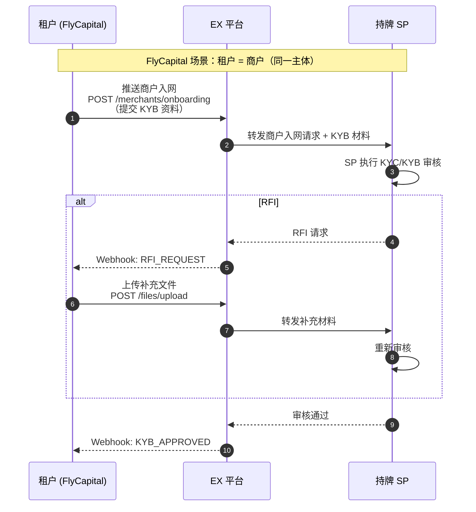
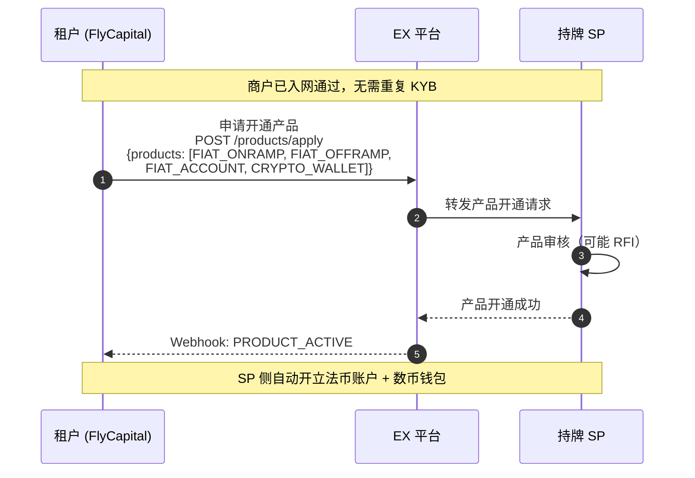
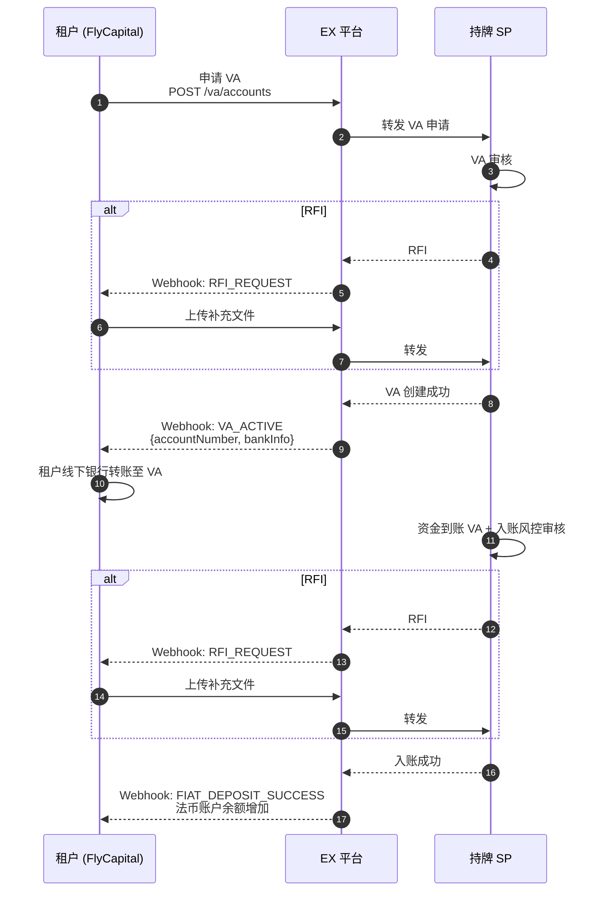
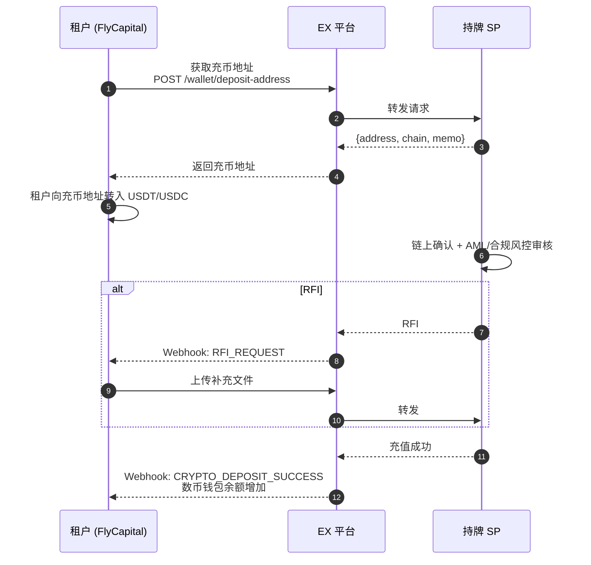
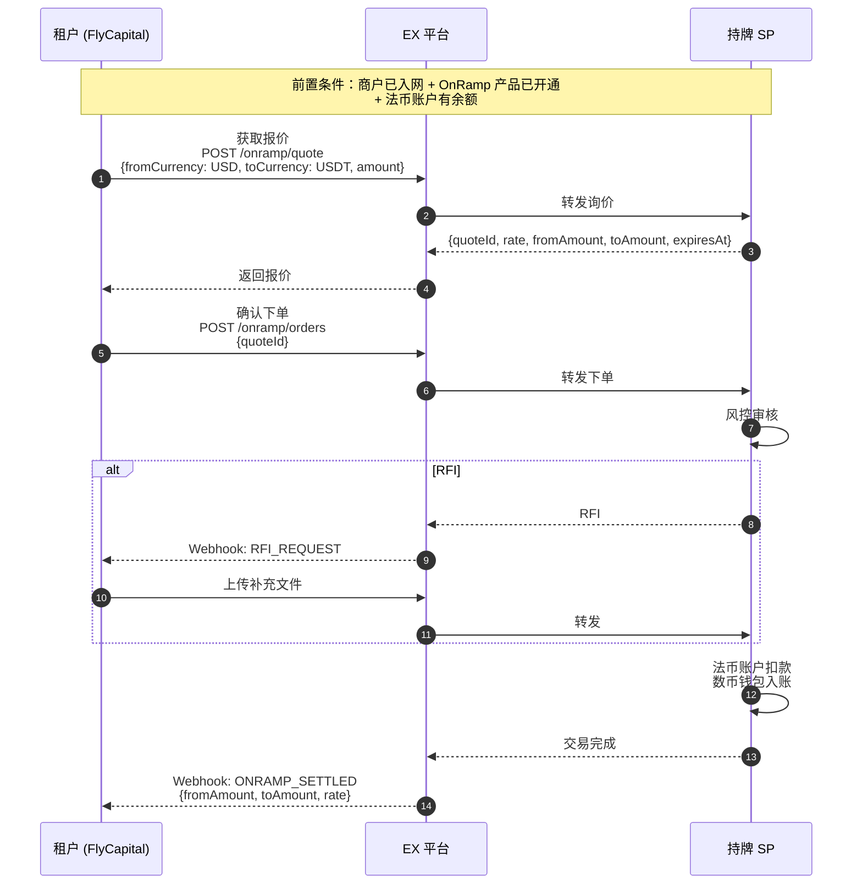
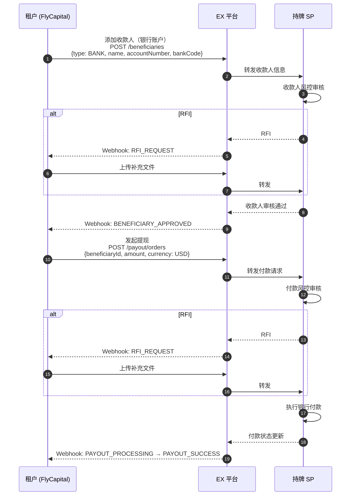
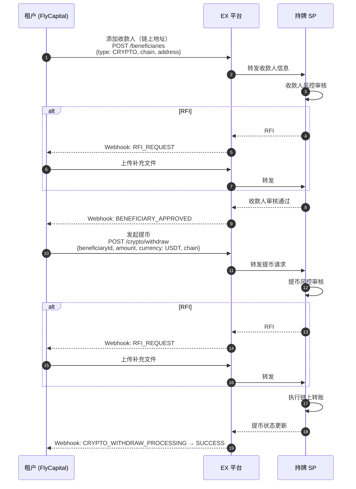
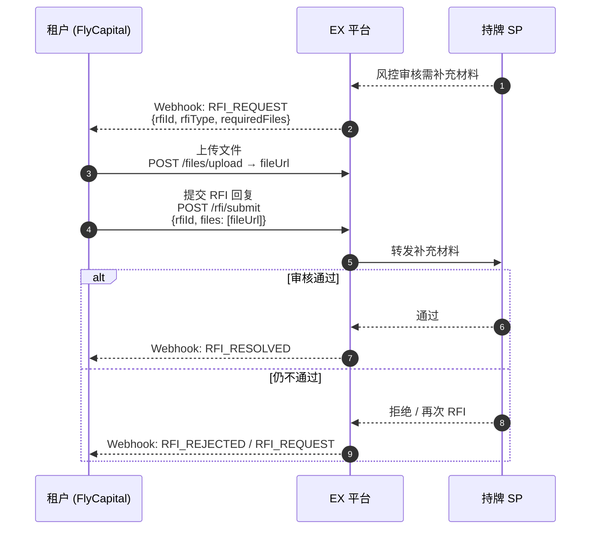

# EX API-承兑（OnRamp / OffRamp）解决方案

> **方案类型**：承兑业务 — 法币转数币（OnRamp）/ 数币转法币（OffRamp）+ 充提 `<br>`
> **适用客户**：需要法币 ↔ 数币双向兑换、法币提现、数币提币的租户 `<br>`
> **接入方式**：租户 → EX 平台（统一 API）→ 持牌 SP（对租户透明）

---

## 1. 平台架构与名词解释

### 1.1 三层架构

```
┌─────────────────────────────────────────────────────────┐
│  Layer 1: 租户 (Tenant)                                   │
│  - EX 平台的客户（如 FlyCapital）                         │
│  - 通过 EX API / Portal 操作所有业务                      │
│  - 管理其下商户的法币账户、数币钱包、OnRamp/OffRamp        │
└─────────────────────────────────────────────────────────┘
                            │ EX 统一 API / Webhook
                            ▼
┌─────────────────────────────────────────────────────────┐
│  Layer 2: EX 平台 (EurewaX)                               │
│  - 统一 API 聚合层 + 业务编排层                            │
│  - 面向租户：API / Portal / Webhook                       │
│  - 面向 SP：对接 SP 能力，转发业务请求                     │
│  - 支付系统：交易处理、清结算、对账                        │
│  - 商户管理：入网编排、产品开通、商户生命周期              │
│  - 账户体系：多币种账户管理、余额聚合                      │
│  - 报价引擎：汇率询价、锁汇、承兑报价                     │
│  - 通知体系：Webhook 分发、状态同步                        │
└─────────────────────────────────────────────────────────┘
                            │ 对接 SP
                            ▼
┌─────────────────────────────────────────────────────────┐
│  Layer 3: 持牌 SP (Service Provider)                     │
│  - 商户实际入网（KYC/KYB 审核、AML 合规）                │
│  - 实际账户开户（法币账户、数币钱包）                     │
│  - VA 创建 + 充币地址分配                                │
│  - 提现/提币执行 + 风控审核                              │
└─────────────────────────────────────────────────────────┘
```

### 1.2 核心名词

| 名词               | 英文             | 说明                                                                 |
| ------------------ | ---------------- | -------------------------------------------------------------------- |
| **租户**     | Tenant           | EX 平台的客户（如 FlyCapital），在 EX 注册，通过 API/Portal 操作业务 |
| **商户**     | Merchant         | 租户的客户，由租户通过 EX 推送至 SP 入网，SP 完成 KYC/KYB 审核和开户 |
| **EX**       | EurewaX          | API 聚合层 + 业务编排层，面向租户和 SP，不做 KYC/KYB、不做风控       |
| **SP**       | Service Provider | 持牌机构，商户在此入网（KYC/KYB）、开户、承兑、资金托管、风控审核    |
| **VA**       | Virtual Account  | SP 侧的虚拟银行账户，用于法币充值                                    |
| **充币地址** | Deposit Address  | SP 侧的链上地址，用于数币充值                                        |
| **法币账户** | Fiat Account     | 开在 SP 的法币账户（USD 等）                                         |
| **数币钱包** | Crypto Wallet    | 开在 SP 的加密货币钱包（USDT/USDC）                                  |
| **OnRamp**   | 法币→数币       | 法币账户余额 → 锁汇 → 数币钱包入账                                 |
| **OffRamp**  | 数币→法币       | 数币钱包余额 → 锁汇 → 法币账户入账                                 |
| **收款人**   | Beneficiary      | 提现/提币的目标账户（银行账户或链上地址），SP 风控审核               |

### 1.3 角色关系

```
┌─────────────────┐                ┌─────────────────┐                ┌─────────────────┐
│   租户 (Tenant)  │                │    EX 平台       │                │    持牌 SP      │
│  如 FlyCapital   │ ──── API ────▶│                  │──── 对接 ────▶│                 │
│                  │                │  聚合 + 编排     │                │  KYC/KYB 审核   │
│  EX 的客户       │◀── Webhook ──│  不做风控/KYC    │◀── 结果 ────│  风控 + 资金托管 │
└────────┬─────────┘                └─────────────────┘                └────────┬────────┘
         │                                                                      │
         │  租户管理其下的商户                                                    │
         │  └── 商户 = 租户的客户                                                │
         │      通过 EX 推送至 SP                                                │
         ▼                                                                      │
┌──────────────────────────────────────────────────────────────────────────────┐
│                        商户 (Merchant)                                        │
│  • 由租户创建，通过 EX 推送至 SP 入网                                          │
│  • SP 侧完成 KYC/KYB、开户（法币账户、数币钱包）                               │
│  • 账户/钱包实际开在 SP 的商户名下                                             │
│  • 租户通过 EX API 代商户操作（充值、承兑、提现等）                             │
└──────────────────────────────────────────────────────────────────────────────┘
```

> ⚠️ **FlyCapital 特殊情况：租户 = 商户**
>
> FlyCapital 既是 EX 的租户，也是推送到 SP 入网的商户（用同一主体）。
> 即 FlyCapital 自己管自己：租户身份在 EX 操作，商户身份在 SP 入网开户。
>
> 在更复杂的场景中，租户是平台方，其下有多个终端商户分别推送至 SP 入网，此时租户 ≠ 商户。

### 1.4 账户体系

```
┌──────────────────────────────────────────────────────────────┐
│                SP 商户名下（实际资金）                          │
│                                                              │
│  ┌───────────────┐                  ┌───────────────┐        │
│  │  法币账户      │  ◄── OnRamp ──▶ │  数币钱包      │        │
│  │  (USD 等)     │     OffRamp      │  (USDT/USDC)  │        │
│  └───────┬───────┘                  └───────┬───────┘        │
│          │                                  │                │
│     ┌────┴────┐                        ┌────┴────┐          │
│     │ 充值入口 │                        │ 充值入口 │          │
│     │   VA    │                        │ 充币地址 │          │
│     └────┬────┘                        └────┬────┘          │
│          │                                  │                │
│     ┌────┴────┐                        ┌────┴────┐          │
│     │ 提现出口 │                        │ 提币出口 │          │
│     │→ 银行   │                        │→ 链上   │          │
│     └─────────┘                        └─────────┘          │
│                                                              │
└──────────────────────────────────────────────────────────────┘
```

---

## 2. 前置流程：商户入网 + 产品开通

> ⚠️ FlyCapital 特殊情况：租户 = 商户，同一主体。
>
> 如果已在 VCC 方案中完成商户入网，此处无需重复 KYB，只需单独申请开通承兑产品即可。

### 2.1 首次入网（完整 KYB）



### 2.2 开通承兑产品



---

## 3. 充值流程

### 3.1 法币充值（VA 路径）



### 3.2 数币充值（充币地址路径）



---

## 4. OnRamp / OffRamp 承兑流程

### 4.1 OnRamp（法币 → 数币）



### 4.2 OffRamp（数币 → 法币）


**关键说明**：

- 市场汇率实时浮动，报价锁汇后需在有效期内确认下单
- 到账金额 = 报价锁定金额，汇率风险由 SP 承担
- 每笔交易均过 SP 风控，可能触发 RFI
- EX 只做转发和编排，不参与报价/风控

---

## 5. 提现 / 提币流程

### 5.1 法币提现

> 当前仅支持**同名银行账户**，6月初将支持非同名法币账户。



> ⚠️ 目前暂无独立接口获取付款水单。

### 5.2 数币提币

> 数币收款人地址暂无身份限制。



---

## 6. RFI（补充材料）处理

所有风控由 SP 执行，EX 只做转发：



### 常见 RFI 场景

| 场景           | 可能要求的文件                   |
| -------------- | -------------------------------- |
| 商户入网 KYB   | 营业执照、董事身份证明、业务说明 |
| VA 申请        | 资金来源证明、业务合同           |
| 大额法币充值   | 银行流水、贸易单据               |
| 数币充值       | 链上资金来源证明                 |
| OnRamp/OffRamp | 承兑用途说明、资金来源           |
| 提现/提币      | 收款人关系证明、用途说明         |

---

## 7. API 清单

> 完整接口文档：[https://open.eurewax.com/](https://open.eurewax.com/)

### 7.1 公共服务

| 功能           | 接口          | Webhook / 说明 |
| -------------- | ------------- | -------------- |
| 配置通知 URL   | 配置通知URL   | —             |
| 上传文件       | 上传文件      | —             |
| 补充业务材料   | 补充业务材料  | RFI 场景使用   |
| 获取商户 Token | 获取商户Token | 认证服务       |

### 7.2 入网服务（= 当前产品开通入口）

> ⚠️ 当前首次入网即完成产品开通。增开产品（非首次）接口开发中，预计 **5 月 20 日**上线。

| 功能          | 接口            | Webhook / 说明  |
| ------------- | --------------- | --------------- |
| 注册商户      | 注册商户        | —              |
| KYC 申请      | KYC申请         | KYC审核结果通知 |
| KYB 申请      | KYB申请         | KYB审核结果通知 |
| 查询 KYC 结果 | 查询KYC审核结果 | —              |
| 查询 KYB 结果 | 查询KYB审核结果 | —              |

### 7.3 数币业务（充值/提现/承兑）

| 功能             | 接口                  | Webhook / 说明               |
| ---------------- | --------------------- | ---------------------------- |
| 查询汇率         | 查询汇率              | —                           |
| 查询支持的资产   | 查询支持的资产        | —                           |
| 查询账户列表     | 查询账户列表          | —                           |
| 查询收款工具     | 查询收款工具          | 含 VA / 充币地址             |
| 法币充值         | 法币充值              | 交易结果通知                 |
| 法币提现         | 法币提现              | 交易结果通知                 |
| 数币充值         | 数币充值              | 交易结果通知                 |
| 数币提现         | 数币提现              | 交易结果通知                 |
| 获取数币买入报价 | 获取数币买入报价      | — （OnRamp 询价）           |
| 买入数币         | 买入数币              | 交易结果通知（OnRamp 下单）  |
| 获取数币卖出报价 | 获取数币卖出报价      | — （OffRamp 询价）          |
| 卖出数币         | 卖出数币              | 交易结果通知（OffRamp 下单） |
| 获取法转数报价   | 获取法转数报价        | —                           |
| 法币转数币       | 法币转数币            | 交易结果通知                 |
| 获取数转法报价   | 获取数转法报价        | —                           |
| 数币转法币       | 数币转法币            | 交易结果通知                 |
| 费用试算         | 充值/提现交易费用试算 | —                           |
| 查询交易详情     | 查询交易详情          | —                           |
| 查询交易记录     | 查询交易记录          | —                           |

### 7.4 收款人管理（提现/提币）

| 功能           | 接口           | Webhook / 说明     |
| -------------- | -------------- | ------------------ |
| 添加收款人     | 添加收款人     | 收款人审核结果通知 |
| 删除收款人     | 删除收款人     | —                 |
| 查询收款人列表 | 查询收款人列表 | —                 |

---

## 8. 时序与 ETA 估算

| 阶段                     | 子任务                        | ETA        | 备注             |
| ------------------------ | ----------------------------- | ---------- | ---------------- |
| **商户入网**       | KYB 提交 + SP 审核            | 5-7 天     | 如已入网可跳过   |
| **产品开通**       | 承兑产品申请                  | 1-3 天     | SP 审核          |
| **VA 申请**        | VA 创建 + SP 审核             | 1-3 天     | 可与入网并行     |
| **首笔法币充值**   | 银行转账 + SP 风控            | 1-2 天     | 依赖银行时效     |
| **首笔数币充值**   | 链上转账 + SP 风控            | 数分钟-1天 | 依赖链上确认     |
| **OnRamp/OffRamp** | 报价 + 下单 + 结算            | 实时       | 锁汇后即时执行   |
| **提现**           | 添加收款人 + SP 审核 + 付款   | 1-3 天     | 收款人首次需审核 |
| **提币**           | 添加地址 + SP 审核 + 链上转账 | 1-3 天     | 地址首次需审核   |

> **首次全链路打通**：约 7-12 个工作日 `<br>`
> **日常承兑/提现/提币**：实时 - 分钟级

---

## 9. 注意事项

1. **FlyCapital = 租户 = 商户**：本方案中 FlyCapital 同时是 EX 租户和 SP 商户，用同一主体
2. **EX 角色**：EX 是 API 聚合层 + 业务编排层，面向租户和 SP，**不做 KYC/KYB、不做风控**，只转发和编排
3. **SP 角色**：SP 是持牌机构，执行 KYC/KYB 审核、AML 合规、风控审核、账户开户、资金托管、承兑执行
4. **商户 = 租户的客户**：商户由租户通过 EX 推送至 SP 入网，不是在 EX 直接注册
5. **汇率机制**：市场汇率实时浮动，报价锁汇后在有效期内下单确认，到账金额 = 锁定金额
6. **同名限制**：法币提现当前仅支持同名银行账户，6月初支持非同名
7. **数币地址**：提币收款人暂无身份限制，支持任意链上地址
8. **付款水单**：目前暂无独立接口获取付款水单
9. **产品复用**：如已在 VCC 方案中完成商户入网，承兑方案仅需调用「开通产品」接口，无需重复 KYB
