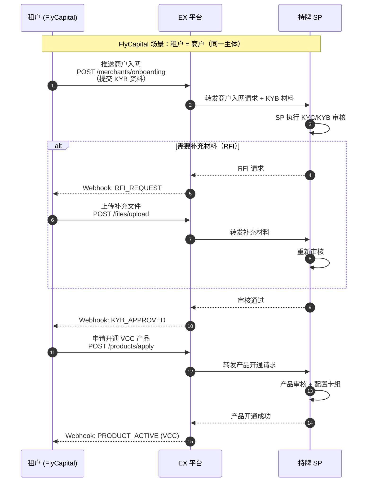
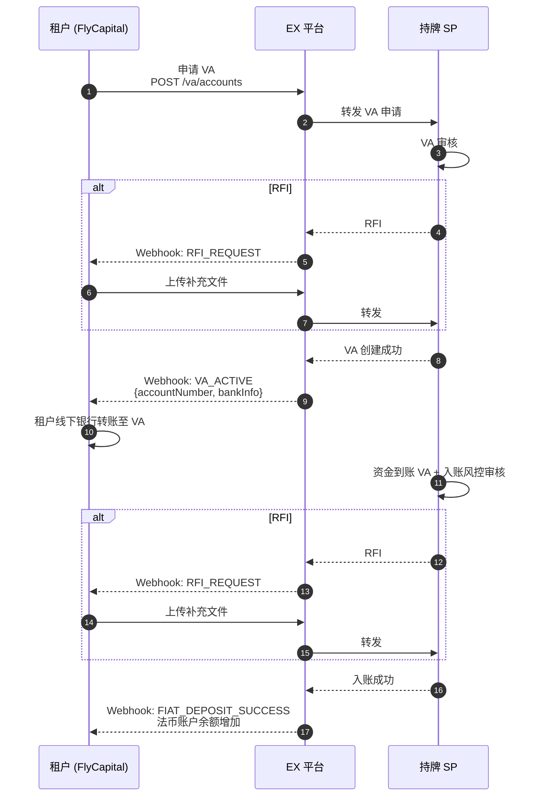
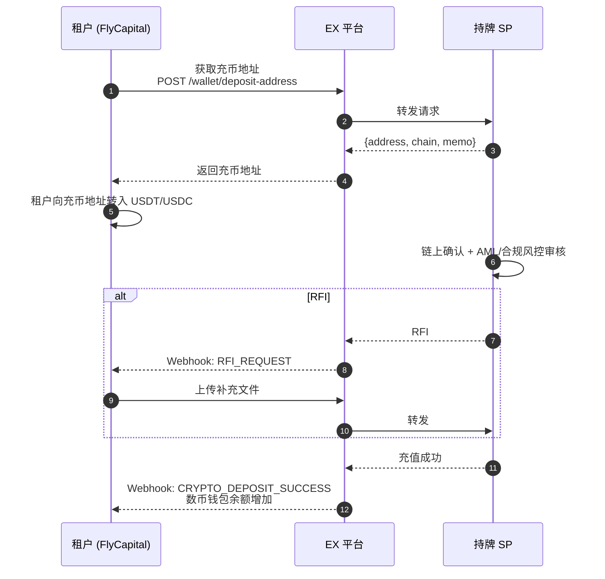
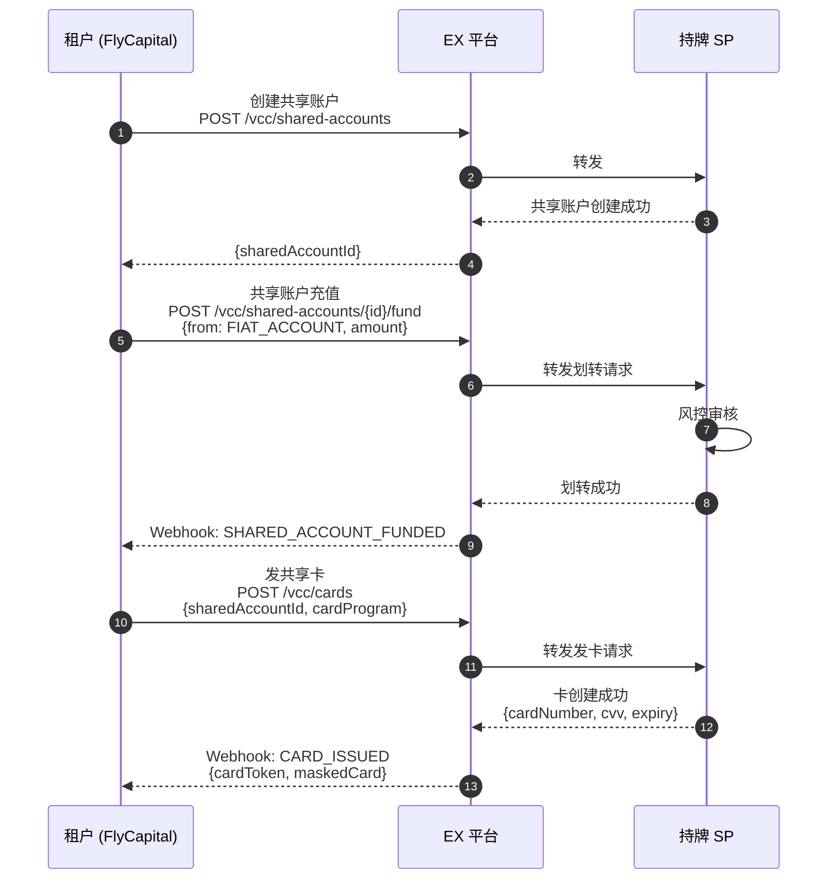
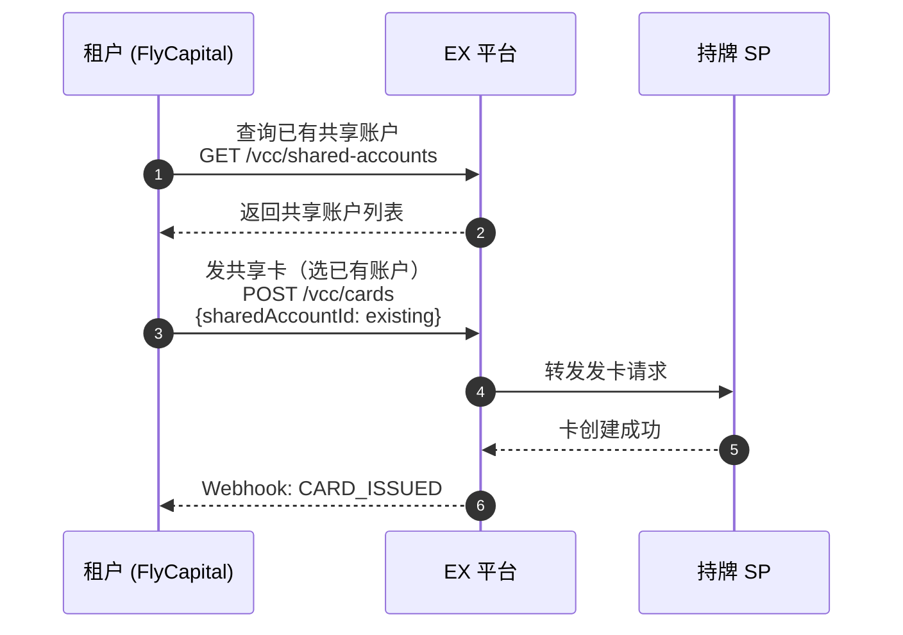
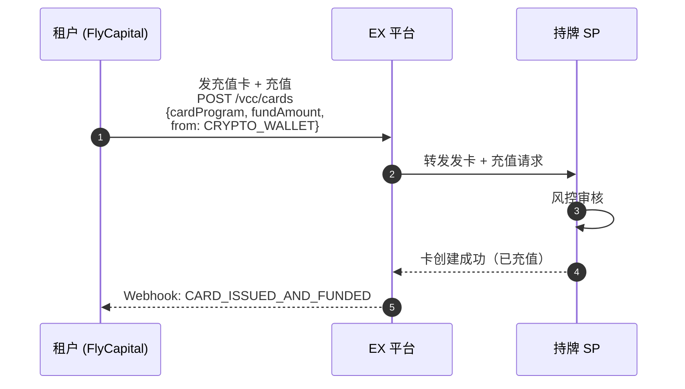
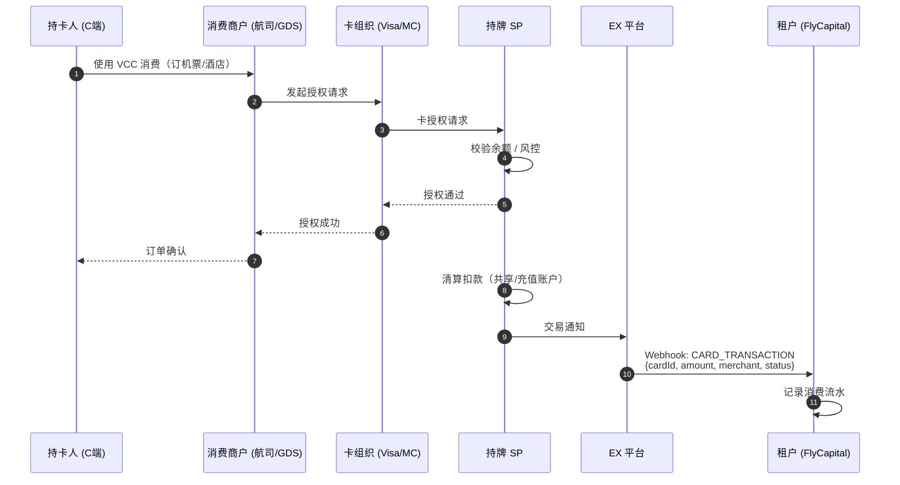
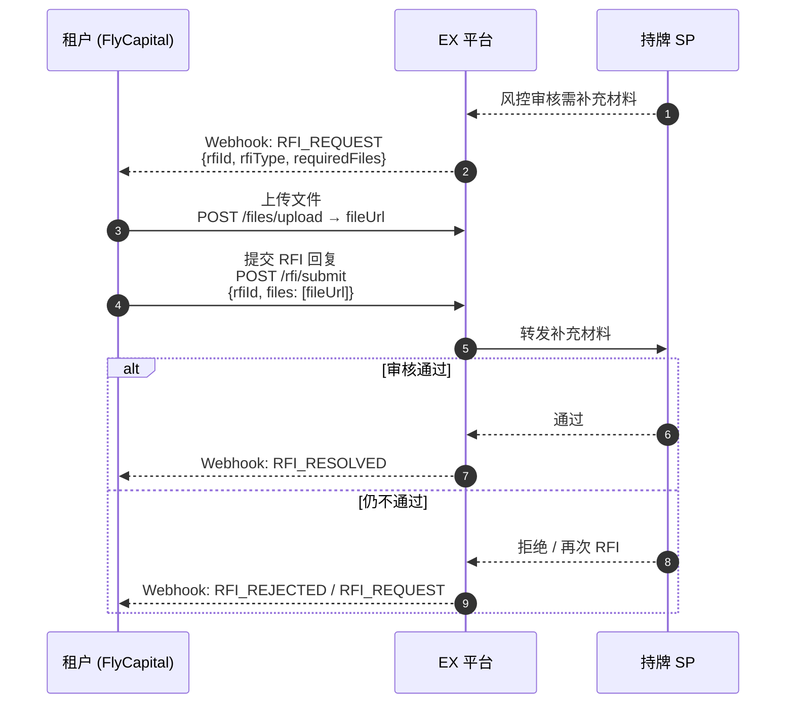

# EX API-VCC 发卡解决方案

> **方案类型**：VCC 虚拟卡发卡`<br>`
> **适用客户**：需要为其平台用户/供应商发放 VCC 虚拟卡的租户`<br>`
> **接入方式**：租户 → EX 平台（统一 API）→ 持牌 SP（对租户透明）

---

## 1. 平台架构与名词解释

### 1.1 三层架构

```
┌─────────────────────────────────────────────────────────┐
│  Layer 1: 租户 (Tenant)                                   │
│  - EX 平台的客户（如 FlyCapital）                         │
│  - 通过 EX API / Portal 操作所有业务                      │
│  - 管理其下的商户、VA、账户、钱包、VCC 卡                  │
└─────────────────────────────────────────────────────────┘
                            │ EX 统一 API / Webhook
                            ▼
┌─────────────────────────────────────────────────────────┐
│  Layer 2: EX 平台 (EurewaX)                               │
│  - 统一 API 聚合层 + 业务编排层                            │
│  - 面向租户：API / Portal / Webhook                       │
│  - 面向 SP：对接 SP 能力，转发业务请求                     │
│  - 支付系统：交易处理、清结算、对账                        │
│  - 商户管理：入网编排、产品开通、商户生命周期              │
│  - 账户体系：多币种账户管理、余额聚合                      │
│  - 报价引擎：汇率询价、锁汇、承兑报价                     │
│  - 通知体系：Webhook 分发、状态同步                        │
└─────────────────────────────────────────────────────────┘
                            │ 对接 SP
                            ▼
┌─────────────────────────────────────────────────────────┐
│  Layer 3: 持牌 SP (Service Provider)                     │
│  - 商户实际入网（KYC/KYB 审核、AML 合规）                │
│  - 实际账户开户（法币账户、数币钱包）                     │
│  - VA 创建 + 充币地址分配 + VCC 发卡 + 资金托管          │
│  - 风控审核（充值/交易/提现等）                           │
└─────────────────────────────────────────────────────────┘
```

### 1.2 核心名词

| 名词               | 英文             | 说明                                                                 |
| ------------------ | ---------------- | -------------------------------------------------------------------- |
| **租户**     | Tenant           | EX 平台的客户（如 FlyCapital），在 EX 注册，通过 API/Portal 操作业务 |
| **商户**     | Merchant         | 租户的客户，由租户通过 EX 推送至 SP 入网，SP 完成 KYC/KYB 审核和开户 |
| **EX**       | EurewaX          | API 聚合层 + 业务编排层，面向租户和 SP，不做 KYC/KYB、不做风控       |
| **SP**       | Service Provider | 持牌机构，商户在此入网（KYC/KYB）、开户、发卡、资金托管、风控审核    |
| **VA**       | Virtual Account  | SP 侧的虚拟银行账户，用于法币充值                                    |
| **充币地址** | Deposit Address  | SP 侧的链上地址，用于数币充值                                        |
| **法币账户** | Fiat Account     | 开在 SP 的法币账户（USD/EUR 等）                                     |
| **数币钱包** | Crypto Wallet    | 开在 SP 的加密货币钱包（USDT/USDC）                                  |
| **共享账户** | Shared Account   | 卡资金池，一个共享账户可发多张共享卡，所有卡共享余额                 |
| **共享卡**   | Shared Card      | 绑定共享账户，消费时扣减共享账户余额                                 |
| **充值卡**   | Standard Card    | 一卡一账户，每张卡背后有独立账户，需单独充值                         |
| **卡组**     | Card Program     | VCC 卡产品配置（卡 BIN、额度规则、有效期等）                         |

### 1.3 角色关系

```
┌─────────────────┐                ┌─────────────────┐                ┌─────────────────┐
│   租户 (Tenant)  │                │    EX 平台       │                │    持牌 SP      │
│  如 FlyCapital   │ ──── API ────▶│                  │──── 对接 ────▶│                 │
│                  │                │  聚合 + 编排     │                │  KYC/KYB 审核   │
│  EX 的客户       │◀── Webhook ──│  不做风控/KYC    │◀── 结果 ────│  风控 + 资金托管 │
└────────┬─────────┘                └─────────────────┘                └────────┬────────┘
         │                                                                      │
         │  租户管理其下的商户                                                    │
         │  └── 商户 = 租户的客户                                                │
         │      通过 EX 推送至 SP                                                │
         ▼                                                                      │
┌──────────────────────────────────────────────────────────────────────────────┐
│                        商户 (Merchant)                                        │
│  • 由租户创建，通过 EX 推送至 SP 入网                                          │
│  • SP 侧完成 KYC/KYB、开户（法币账户、数币钱包）                               │
│  • 账户/钱包/卡实际开在 SP 的商户名下                                          │
│  • 租户通过 EX API 代商户操作（查余额、发卡、充值等）                           │
└──────────────────────────────────────────────────────────────────────────────┘
```

> ⚠️ **FlyCapital 特殊情况：租户 = 商户**
>
> FlyCapital 既是 EX 的租户，也是推送到 SP 入网的商户（用同一主体）。
> 即 FlyCapital 自己管自己：租户身份在 EX 操作，商户身份在 SP 入网开户。
>
> 在更复杂的场景中，租户是平台方（如 OTA 平台），其下有多个终端商户（如不同的旅行社），
> 由租户通过 EX 分别推送至 SP 入网，此时租户 ≠ 商户。

### 1.4 账户体系关系图

#### 法币入金路径：VA → 法币账户 → 共享/充值卡

```
┌──────────────┐      ┌──────────────┐      ┌──────────────┐
│   银行转账    │ ───▶ │     VA       │ ───▶ │  法币账户    │
│              │      │ (SP 侧)      │      │ (SP 侧)     │
└──────────────┘      └──────────────┘      └──────┬───────┘
                                                   │
                          ┌────────────────────────┼────────────────────────┐
                          │                        │                        │
                          ▼                        ▼                        ▼
                   ┌─────────────┐          ┌─────────────┐          ┌─────────────┐
                   │  共享账户    │          │  充值卡账户  │          │  充值卡账户  │
                   │ (Card Pool) │          │ (一卡一户)   │          │ (一卡一户)   │
                   └──────┬──────┘          └──────┬──────┘          └──────┬──────┘
                          │                        │                        │
                   ┌──────┼──────┐                 │                        │
                   ▼      ▼      ▼                 ▼                        ▼
                 卡1    卡2    卡N              充值卡 A                充值卡 B
```

#### 数币入金路径：充币 → 数币钱包 → 共享/充值卡

```
┌──────────────┐      ┌──────────────┐      ┌──────────────┐
│   链上充币    │ ───▶ │   充币地址   │ ───▶ │  数币钱包    │
│ (USDT/USDC)  │      │ (SP 侧)      │      │ (SP 侧)     │
└──────────────┘      └──────────────┘      └──────┬───────┘
                                                   │
                          ┌────────────────────────┼────────────────────────┐
                          │                        │                        │
                          ▼                        ▼                        ▼
                   ┌─────────────┐          ┌─────────────┐          ┌─────────────┐
                   │  共享账户    │          │  充值卡账户  │          │  充值卡账户  │
                   │ (Card Pool) │          │ (一卡一户)   │          │ (一卡一户)   │
                   └──────┬──────┘          └──────┬──────┘          └──────┬──────┘
                          │                        │                        │
                   ┌──────┼──────┐                 │                        │
                   ▼      ▼      ▼                 ▼                        ▼
                 卡1    卡2    卡N              充值卡 A                充值卡 B
```

#### 关键概念

| 概念                        | 说明                                                               |
| --------------------------- | ------------------------------------------------------------------ |
| **充值卡 = 一对一**   | 每张充值卡背后有一个独立账户，只能绑定一张卡；充值即给该账户加余额 |
| **共享账户 = 一对多** | 一个共享账户可发多张共享卡，所有卡共享该账户余额；消费时统一扣减   |
| **首次发共享卡**      | 需先创建共享账户并充值，然后发卡                                   |
| **非首次发共享卡**    | 可直接选择已有共享账户发卡，无需重复创建                           |

---

## 2. 发卡全流程

### 2.1 阶段一：商户入网 + 产品开通

> ⚠️ FlyCapital 特殊情况：租户 = 商户，FlyCapital 自己既是 EX 租户也是推到 SP 的商户。



**关键说明**：

- **租户**（FlyCapital）在 EX 注册，是 EX 的客户
- **商户**是租户的客户，由租户通过 EX 推送至 SP，SP 执行 KYC/KYB
- **EX** 只做转发和编排，不做 KYC/KYB、不做风控
- FlyCapital 场景中租户 = 商户，用同一主体
- 后续新增产品只需调用「开通产品」接口，SP 可能额外审核

### 2.2 阶段二：法币充值（VA 路径）



### 2.3 阶段二（备选）：数币充值（充币地址路径）



### 2.4 阶段三：开卡

#### 共享卡 — 首次（需创建共享账户）



#### 共享卡 — 非首次（复用已有共享账户）



#### 充值卡



### 2.5 阶段四：卡消费与记录同步



---

## 3. RFI（补充材料）处理

所有涉及 SP 风控的环节都可能触发 RFI，由 SP 发起，EX 转发：



### 常见 RFI 场景

| 场景         | 可能要求的文件                   |
| ------------ | -------------------------------- |
| 商户入网 KYB | 营业执照、董事身份证明、业务说明 |
| VA 申请      | 资金来源证明、业务合同           |
| 大额法币充值 | 银行流水、贸易单据               |
| 数币充值     | 链上资金来源证明                 |
| 开卡审核     | 持卡人身份证明、消费用途说明     |

---

## 4. API 清单

> 完整接口文档：[https://open.eurewax.com/](https://open.eurewax.com/)

### 4.1 公共服务

| 功能           | 接口          | Webhook / 说明 |
| -------------- | ------------- | -------------- |
| 配置通知 URL   | 配置通知URL   | —             |
| 上传文件       | 上传文件      | —             |
| 补充业务材料   | 补充业务材料  | RFI 场景使用   |
| 获取商户 Token | 获取商户Token | 认证服务       |

### 4.2 入网服务（= 当前产品开通入口）

> ⚠️ 当前首次入网即完成产品开通。增开产品（非首次）接口开发中，预计 **5 月 20 日**上线。

| 功能          | 接口            | Webhook / 说明  |
| ------------- | --------------- | --------------- |
| 注册商户      | 注册商户        | —              |
| KYC 申请      | KYC申请         | KYC审核结果通知 |
| KYB 申请      | KYB申请         | KYB审核结果通知 |
| 查询 KYC 结果 | 查询KYC审核结果 | —              |
| 查询 KYB 结果 | 查询KYB审核结果 | —              |

### 4.3 数币业务（充值/充币）

| 功能           | 接口                  | Webhook / 说明   |
| -------------- | --------------------- | ---------------- |
| 查询汇率       | 查询汇率              | —               |
| 查询支持的资产 | 查询支持的资产        | —               |
| 查询账户列表   | 查询账户列表          | —               |
| 查询收款工具   | 查询收款工具          | 含 VA / 充币地址 |
| 法币充值       | 法币充值              | 交易结果通知     |
| 数币充值       | 数币充值              | 交易结果通知     |
| 费用试算       | 充值/提现交易费用试算 | —               |
| 查询交易详情   | 查询交易详情          | —               |
| 查询交易记录   | 查询交易记录          | —               |

### 4.4 VCC 业务

| 功能               | 接口                 | Webhook / 说明       |
| ------------------ | -------------------- | -------------------- |
| 查询产品列表       | 查询产品列表         | 卡组（Card Program） |
| 虚拟卡申请         | 虚拟卡申请           | 卡申请结果通知       |
| 查询申请详情       | 查询申请详情         | —                   |
| 查询卡 CVV         | 查询卡CVV            | —                   |
| 查询卡信息         | 查询卡信息           | —                   |
| 查询卡片余额       | 查询卡片余额         | —                   |
| 激活卡片           | 激活卡片             | 卡状态变更通知       |
| 冻结卡片           | 冻结卡片             | 卡状态变更通知       |
| 解冻卡片           | 解冻卡片             | 卡状态变更通知       |
| 注销卡片           | 注销卡片             | 卡状态变更通知       |
| 修改卡限额         | 修改卡限额           | —                   |
| 修改持卡人         | 修改持卡人           | —                   |
| 资金转入（充值卡） | 资金转入             | 卡交易结果通知       |
| 资金转出           | 资金转出             | 卡交易结果通知       |
| 查询交易列表       | 查询交易列表         | —                   |
| 查询卡资金明细     | 查询卡资金明细       | —                   |
| 查询非授权类交易   | 查询非授权类交易详情 | —                   |
| 卡 3DS 验证        | —                   | 卡3DS验证通知        |

---

## 5. 时序与 ETA 估算

| 阶段                 | 子任务                      | ETA       | 备注              |
| -------------------- | --------------------------- | --------- | ----------------- |
| **商户入网**   | KYB 提交 + SP 审核          | 5-7 天    | SP 执行审核       |
| **产品开通**   | VCC 产品申请                | 1-3 天    | SP 审核+配置      |
| **VA 申请**    | VA 创建 + SP 审核           | 1-3 天    | 可与入网并行      |
| **首笔充值**   | 银行转账/链上充币 + SP 风控 | 1-2 天    | 依赖银行/链上时效 |
| **共享卡首次** | 创建共享账户 + 充值 + 发卡  | 实时-1 天 | SP 风控可能耗时   |
| **充值卡**     | 发卡 + 充值                 | 实时-1 天 | 可一步完成        |
| **共享卡复用** | 直接发卡                    | 实时      | 已有共享账户      |

> **首次全链路打通**：约 7-12 个工作日`<br>`
> **日常发卡/消费**：实时 - 分钟级

---

## 6. 注意事项

1. **FlyCapital = 租户 = 商户**：本方案中 FlyCapital 同时是 EX 租户和 SP 商户，用同一主体
2. **EX 角色**：EX 是 API 聚合层 + 业务编排层，面向租户和 SP，**不做 KYC/KYB、不做风控**，只转发和编排
3. **SP 角色**：SP 是持牌机构，执行 KYC/KYB 审核、AML 合规、风控审核、账户开户、资金托管、VCC 发卡
4. **商户 = 租户的客户**：商户由租户通过 EX 推送至 SP 入网，不是在 EX 直接注册
5. **风控时效**：所有风控由 SP 执行，审核时间因场景和金额而异
6. **并发建议**：共享账户适合批量发卡场景；充值卡适合独立资金管理场景
7. **余额监控**：建议订阅 Webhook 实时同步钱包/账户/卡余额变动
