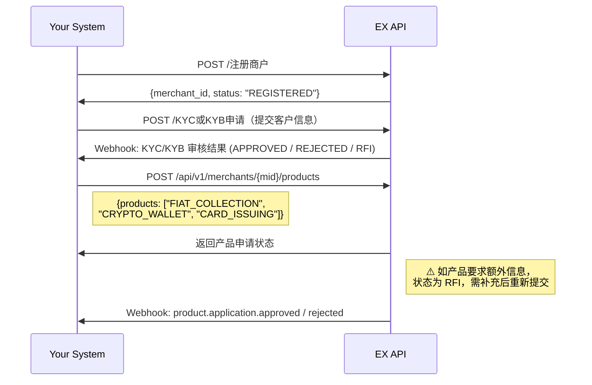

# EX Open API — 一站式金融基础设施解决方案

> **文档类型**: 综合解决方案指南
> **版本**: v1.0
> **最后更新**: 2026-04-10
> **API 参考**: [EurewaX 开放平台](https://open.eurewax.com/)
> **定位对标**: Stripe Connect / Airwallex Global Accounts

---

## 一、关于EX

EX 通过 EurewaX 开放平台，为合作伙伴提供**一套 API 覆盖法币收付、加密货币、发卡、收单（数币）)**的全链路金融基础设施。

您不需要自建合规团队、对接多家持牌机构、或管理复杂的资金链路 —— **一次集成，全部搞定**。

**核心价值：**

| 维度                 | 说明                                                                         |
| -------------------- | ---------------------------------------------------------------------------- |
| **合规即服务** | 一次提交商户材料，EX 统一管理 KYC/KYB 审核、AML 监控，您无需单独对接合规机构 |
| **全产品覆盖** | 法币收付、换汇、加密充提、买卖币、聚合收银、虚拟卡发行 —— 一个平台全包含   |
| **统一技术栈** | RESTful API + Webhook + 统一签名/加密体系，对接一次，所有产品线复用          |
| **灵活组合**   | 按需开通产品线，API 可自由编排，适配不同业务架构                             |

---

## 二、EX可以服务谁

### 2.1 客户画像与推荐产品

| 客户类型                      | 典型场景                       | 推荐产品组合               | 集成复杂度 |
| ----------------------------- | ------------------------------ | -------------------------- | ---------- |
| **跨境电商平台**        | 卖家收款、付供应商、结汇到中国 | 法币收款 + 法币付款 + 换汇 | ⭐⭐       |
| **外贸 B2B 平台**       | 货款收付、多币种结算           | 法币收款 + 法币付款 + 换汇 | ⭐⭐       |
| **加密货币交易所**      | 为用户提供法币出入金           | 加密服务全套               | ⭐⭐⭐     |
| **加密支付平台**        | 商户收数币、换法币             | 聚合收银 + 加密服务        | ⭐⭐       |
| **虚拟卡发行平台**      | 批量发卡、资金管理             | VCC 发卡                   | ⭐⭐       |
| **综合 Fintech / BaaS** | 白标所有能力给终端客户         | 全产品组合                 | ⭐⭐⭐⭐   |
| **跨境支付平台**        | 收付+换汇+发卡组合             | 法币收付 + VCC + 换汇      | ⭐⭐⭐     |

### 2.2 决策树 —— 要不要接？

```
您的平台需要以下哪些能力？
│
├── 全球法币收款（VA 虚拟账户） ──────→ 法币收款
├── 全球法币付款（POBO 代付） ────────→ 法币付款
├── 多币种换汇 / 结汇到人民币 ────────→ 外汇服务
├── 加密货币充提（USDT/BTC/ETH 等）──→ 加密服务
├── 法币 ↔ 加密货币兑换 ─────────────→ 加密兑换（OnRamp/OffRamp）
├── 接受数币支付（商户收款）──────────→ 聚合收银
├── 虚拟信用卡发行与管理 ─────────────→ VCC 发卡
│
└── 以上任意组合 → 一次前置流程，按需开通
```

---

## 三、产品全景

### 3.1 产品矩阵

| 产品线             | 产品代码            | 能力                            | 开通条件       |
| ------------------ | ------------------- | ------------------------------- | -------------- |
| **法币收款** | `FIAT_COLLECTION` | VA 虚拟账户、店铺管理、收款入账 | KYC + 产品审核 |
| **法币付款** | `FIAT_PAYOUT`     | 收款人管理、单笔付款、结汇额度  | KYC + 产品审核 |
| **外汇服务** | (随法币产品开通)    | 查询汇率、询价锁汇、实时换汇    | 法币产品已开通 |
| **加密钱包** | `CRYPTO_WALLET`   | 加密充提、余额查询              | KYC + 产品审核 |
| **法币入金** | `FIAT_ONRAMP`     | 法币充值、                      | KYC + 产品审核 |
| **法币出金** | `FIAT_OFFRAMP`    | 法币提现、                      | KYC + 产品审核 |
| **聚合收银** | (随加密产品开通)    | API 收单 + 收银台收单           | 加密产品已开通 |
| **VCC 发卡** | `CARD_ISSUING`    | 虚拟卡申请、资金管理、交易监控  | KYC + 产品审核 |

### 3.2 架构总览

```
┌──────────────────────────────────────────────────────────────────┐
│                         您的系统                                  │
│   (电商平台 / 支付平台 / 交易所 / BaaS / 发卡平台 / Fintech)     │
└──────────────────┬───────────────────────────────────────────────┘
                   │  统一 RESTful API + Webhook
                   ▼
┌──────────────────────────────────────────────────────────────────┐
│                     EurewaX 开放平台                              │
│                                                                  │
│  ┌──────────┐ ┌──────────┐ ┌──────────┐ ┌──────────┐           │
│  │ 入网服务  │ │ 法币收付  │ │ 加密服务  │ │ VCC 发卡  │           │
│  │ KYC/KYB  │ │ VA/付款   │ │ 充提/兑换 │ │ 开卡/资金 │           │
│  └──────────┘ └──────────┘ └──────────┘ └──────────┘           │
│                                                                  │
│  ┌──────────┐ ┌──────────┐ ┌──────────┐                        │
│  │ 聚合收银  │ │ 外汇服务  │ │ 公共服务  │                        │
│  │ API/收银台│ │ 询价/换汇 │ │ 认证/通知 │                        │
│  └──────────┘ └──────────┘ └──────────┘                        │
└──────────────────────────────────────────────────────────────────┘
```

**多服务商（SP）架构说明：**

EX 法币业务背后对接多家持牌服务商（SP），不同 SP 覆盖不同地区、币种和支付能力。对您而言：

- **统一 API**：您只对接 EX 一套 API，无需感知底层 SP 的差异
- **智能路由**：EX 根据业务类型、币种、地区自动选择最优 SP
- **多币种账户**：商户在不同 SP 下可能有独立账户，但商户端只看到按币种合计的总余额
- **合规由 SP 承担**：KYC/KYB 审核、AML 监控由持牌 SP 执行，EX 统一编排并同步结果

---

## 四、技术规范（所有产品线通用）

| 项目         | 说明                                                                  |
| ------------ | --------------------------------------------------------------------- |
| 协议         | HTTPS                                                                 |
| 接口风格     | RESTful API                                                           |
| 数据格式     | JSON                                                                  |
| 认证方式     | 商户 Token（通过认证服务获取）                                        |
| 签名算法     | SHA256withRSA（客户私钥签名，平台公钥验签）                           |
| 敏感数据加密 | AES-GCM（Base64 编码密钥，SHA-256 派生）                              |
| 异步通知     | Webhook（支持按类型配置不同回调地址，或 `notifyType=ALL` 统一接收） |

> 密钥生成、签名/验签代码示例、AES 加解密代码示例找技术支持提供

---

## 五、前置流程 — 环境准备

开始对接前，在专属对接群中联系技术支持完成 Sandbox 环境配置：

```
步骤 1 → 联系技术支持开通 Sandbox 环境，获取测试账号（Account No）、测试域名
步骤 2 → 获取 APP ID、平台公钥、AES Key
步骤 3 → 客户生成 RSA 密钥对（SHA256withRSA，2048 位）→ 上传客户公钥到管理平台
步骤 4 → 配置 Webhook 回调地址（HTTPS，支持 POST）
步骤 5 → 完成签名验签 + AES 加解密联调验证
```

> 环境准备完成后，即可进入业务流程对接。Sandbox 环境参数详见 [环境参数](https://open.eurewax.com/%E7%8E%AF%E5%A2%83%E5%8F%82%E6%95%B0-6918053m0)

---

## 六、业务流程详解

### 6.0 商户注册与产品开通（所有产品线共享）

无论接入哪条产品线，注册和产品开通只做一次。后续开通新产品线时，只需申请对应产品即可。

**业务流程：**

```
├── 1. 注册商户
│     └── 调用注册接口 → 获取唯一商户标识（MID）
│
├── 2. 提交客户信息
│     └── 提交商户基本信息、法人/董事信息、营业执照等
│     └── 附件先调【上传文件】接口获取 URL，再放入业务请求
│     └── Webhook: 结果（APPROVED / REJECTED / RFI）
│
├── 3. 申请开通产品
│     └── 提交产品申请 → 系统校验客户信息是否满足该产品要求
│     └── ⚠️ 部分产品可能要求补充额外信息（如特定资质、业务证明等）
│     └── Webhook: 产品审核结果（approved / rejected / RFI）
│
└── 4. 产品审核通过 → 进入对应业务流程
```



**关键说明：**

- **先提交客户信息，再开通产品**：客户信息审核通过是申请产品的前提，先完成客户信息提交和审核
- **产品开通可能需要补充信息**：不同产品对客户资质要求不同，申请产品时系统会校验已有信息是否充分，不足时返回 RFI 要求补充
- **RFI 响应**：审核期间可能要求补充材料（RFI），请及时响应，超时可能导致审核失败
- **文件先传**：所有附件先调用【上传文件】接口获取 URL，再放入业务请求
- 商户信息模版 模板：技术支持提供

---

### 6.1 法币收款（Collection）

**适用场景**：跨境电商卖家收款、外贸 B2B 货款收取

**业务流程：**

```
前置完成（产品 FIAT_COLLECTION 已开通）
    │
    ├── 1. 申请 VA 虚拟账户
    │     └── 按币种/国家申请 → 获取 VA 账号信息（银行名、账号、SWIFT 等）
    │     └── 将 VA 提供给汇款人 / 绑定到电商平台店铺
    │
    ├── 2. 汇款人向 VA 打款
    │     └── 付款方通过银行汇款至 VA 账号
    │
    ├── 3. 收款到账
    │     └── Webhook: 收款入账通知 → {amount, currency, sender_info}
    │
    └── 4. 确认到账
          └── 查询收款交易详情 / 下载交易凭证
```

> VA 收款为被动入账，无需主动调用交易接口。到账后系统自动推送 Webhook。
>
> 基于SP的要求，可能申请va的时候需要绑定店铺

---

### 6.2 法币付款（Payout）

**适用场景**：付给给供应商、结汇到中国大陆等

**业务流程：**

```
前置完成（产品 FIAT_PAYOUT 已开通）
    │
    ├── 1. 添加收款人
    │     └── 提交收款人信息（银行账号、SWIFT 等）
    │     └── 等待审核 → Webhook: 收款人审核结果（APPROVED / RFI / REJECTED）
    │
    ├── 2. 发起付款
    │     └── 指定收款人、金额、币种 → POST /单笔付款
    │     └── 支持 POBO（代付）
    │
    ├── 3. 付款结果
    │     └── Webhook: 付款结果通知 → SUCCESS / FAILED
    │
    └── 4. 查询付款状态
          └── 查询付款交易详情 / 下载交易凭证
```

**结汇到中国大陆：**

结汇材料的获取方式取决于底层 SP 的能力，目前有两种方式：

```
方式一：手动上传结汇材料
    ├── 上传结汇材料（发票、合同等贸易背景文件）→ 等待审核
    ├── 审核通过 → 生成结汇额度（CNY）
    ├── 查询结汇额度（额度随汇率实时波动，结汇前务必查询最新值）
    └── 发起结汇付款

方式二：授权店铺给 SP 自动获取
    ├── 商户将电商平台店铺授权给 SP
    ├── SP 自动抓取店铺订单数据作为结汇材料
    ├── 自动生成结汇额度（CNY）
    └── 发起结汇付款
```

> 两种方式由 EX 根据商户接入的 SP 自动匹配，商户无需关心底层差异。

---

### 6.3 外汇兑换（FX）

**适用场景**：多币种兑换、锁定汇率后执行换汇

**业务流程：**

```
前置完成（法币产品已开通）
    │
    ├── 1. 确定货币对和方向
    │     └── 例：USD → EUR（卖出 USD，买入 EUR）
    │
    ├── 2. 查询汇率（可选，仅查看不锁定）
    │     └── GET /查询商户汇率
    │
    ├── 3. 询价锁汇
    │     └── POST /商户换汇询价 → {quote_id, rate, expiry_time}
    │
    ├── 4. 执行换汇
    │     └── POST /实时换汇（传入 quote_id）→ 换汇结果
    │
    └── 5. 查询换汇状态
          └── 查询换汇交易详情
```

> 报价有效期有限，过期需重新询价。

---

### 6.4 加密货币充提（Crypto Deposit/Withdrawal）

**适用场景**：交易所用户充币/提币、平台资金归集

**业务流程：**

```
前置完成（产品 CRYPTO_WALLET 已开通）
    │
    ├── 【充值（Deposit）】
    │     ├── 1. 查询收款工具（获取链上充值地址）
    │     │     └── 如：USDT-TRC20 地址、BTC 地址等
    │     ├── 2. 用户/外部向该地址转币
    │     └── 3. 到账通知
    │           └── Webhook: 交易结果通知 → 确认链上确认数达标后入账
    │
    └── 【提现（Withdrawal）】
          ├── 1. 添加收款人（链上提现地址）
          │     └── 提交地址信息 → 等待合规审核 → Webhook: 收款人审核结果
          ├── 2. 发起提现
          │     └── 指定收款人、资产、金额 → POST /加密提现
          └── 3. 提现结果
                └── Webhook: 交易结果通知 → 链上确认后状态更新
```

---

### 6.5 买卖加密货币（Buy/Sell Crypto）

**适用场景**：法币余额买币、卖币获取法币

**业务流程：**

```
前置完成（产品已开通）
    │
    ├── 【买币（Buy Crypto）】
    │     ├── 1. 获取买币报价 → {quote_id, rate, expiry_time}
    │     ├── 2. 确认买币 → POST /买入数币（传入 quote_id）
    │     └── 3. Webhook: 交易结果通知
    │
    ├── 【卖币（Sell Crypto）】
    │     ├── 1. 获取卖币报价 → {quote_id, rate, expiry_time}
    │     ├── 2. 确认卖币 → POST /卖出数币（传入 quote_id）
    │     └── 3. Webhook: 交易结果通知
    │
    ├── 【法币转数币（fiat-crypto）】
    │     ├── 1. 获取法转数报价
    │     ├── 2. 执行法币兑币
    │     └── 3. Webhook: 交易结果通知
    │
    └── 【数币转法币（crypto-fiat）】
          ├── 1. 获取数转法报价
          ├── 2. 执行币兑法币
          └── 3. Webhook: 交易结果通知
```

> 所有报价均有过期时间，过期前执行或重新获取报价。

---

### 6.6 聚合收银（Checkout）

**适用场景**：商户接受数字货币支付（电商、服务类平台）

EX 提供**两种收单方式**：

#### 方式一：API 直连模式

```
前置完成（加密产品已开通）
    │
    ├── 1. 创建收款订单
    │     └── POST /api/v1/ex/cashier/orders
    │         {bizOrderNo, currency: "USDT", amount, goodsName, notifyUrl, redirectUrl}
    │
    ├── 2. 获取支付信息
    │     └── 返回：{paymentInstructions: [{chain, currency, address, cryptoAmount}]}
    │     └── 您将支付地址和金额展示给付款方
    │
    ├── 3. 付款方转币到指定地址
    │
    ├── 4. 支付结果
    │     └── Webhook: 支付结果通知 → SUCCESS / FAILED / EXPIRED
    │
    └── 5. 查询订单状态
          └── GET /api/v1/ex/cashier/orders/{bizOrderNo}
```

#### 方式二：收银台模式（Hosted Checkout）

```
前置完成（加密产品已开通）
    │
    ├── 1. 创建收款订单（同上）
    │     └── 返回：{paymentUrl: "https://pay.eurewax.com/checkout/xxx"}
    │
    ├── 2. 跳转 EX 收银台页面
    │     └── 付款方在 EX 页面选择支付链和币种，完成支付
    │
    ├── 3. 支付完成后跳转回您的页面（redirectUrl）
    │
    └── 4. Webhook: 支付结果通知
```

> 收银台模式适合不想自建支付 UI 的场景，EX 托管完整支付页面。

---

### 6.7 发卡产品（Card Issuing）

**适用场景**：独立发卡平台、综合支付平台扩展卡产品

**业务流程：**

```
前置完成（产品 CARD_ISSUING 已开通，账户自动初始化）
    │
    ├── 1. 充值到钱包
    │     └── POST /充值 → Webhook: 充值状态变更
    │     └── 支持的充值币种根据商户开通的 SP 返回，不同 SP 支持的币种不同
    │     └── 注意：充值可能触发合规调单，需及时响应
    │
    ├── 2. 查询卡产品（可选）
    │     └── GET /卡产品列表 → 获取可用卡 BIN、币种、限额
    │
    ├── 3. 发卡
    │     └── POST /虚拟卡申请 → Webhook: 卡申请结果
    │     └── 返回：card_id, 卡状态
    │
    ├── 4. 卡信息查询
    │     └── 查询卡号、CVV、有效期、卡片余额
    │
    ├── 5. 资金操作
    │     ├── 卡账户充值（Recharge to Card）：商户账户 → 卡片
    │     └── 卡账户转出（Withdraw from Card）：卡片 → 商户账户
    │
    ├── 6. 卡消费
    │     └── Webhook: 卡交易结果通知（授权、扣款、退款）
    │     └── Webhook: 3DS 验证通知（需传递验证信息给持卡人）
    │
    └── 7. 卡片管理
          └── 冻结 / 解冻 / 注销 / 修改限额 / 修改持卡人
```

---

## 七、Webhook 事件全景

所有产品线的 Webhook 事件统一通过配置的回调地址接收。

| 产品线             | 事件                       | 触发时机           |
| ------------------ | -------------------------- | ------------------ |
| **入网**     | KYC/KYB 审核结果通知       | 审核完成           |
| **产品开通** | 产品审核通过/拒绝/RFI 通知 | 审核状态变更       |
| **法币收款** | VA 账号变更通知            | VA 状态变更        |
|                    | 收款入账通知               | VA 收到入账        |
| **法币付款** | 收款人审核结果通知         | 审核完成           |
|                    | 付款结果通知               | 付款处理完成       |
|                    | 结汇材料审核结果通知       | 审核完成           |
| **加密服务** | 收款人审核结果通知         | 审核完成           |
|                    | 交易结果通知               | 交易处理完成       |
| **聚合收银** | 支付结果通知               | 支付完成/失败/过期 |
| **VCC 发卡** | 充值状态变更               | 充值处理状态变更   |
|                    | 合规调单通知               | 充值触发合规审查   |
|                    | 余额变动通知               | 账户余额变动       |
|                    | 卡申请结果通知             | 发卡审核完成       |
|                    | 卡状态变更通知             | 冻结/解冻/注销     |
|                    | 卡交易结果通知             | 授权/扣款/退款     |
|                    | 3DS 验证通知               | 需完成身份验证     |

---

## 八、集成最佳实践

| # | 实践                          | 说明                                                        |
| - | ----------------------------- | ----------------------------------------------------------- |
| 1 | **Webhook 优先**        | 以事件驱动为主，API 轮询为辅                                |
| 2 | **幂等处理**            | 基于 `bizOrderNo` 做幂等校验，同一事件可能多次推送        |
| 3 | **签名验证**            | 所有 Webhook 请求需验签确保来源合法                         |
| 4 | **异步设计**            | 审核、付款、充值、发卡等均为异步，通过 Webhook 获取最终结果 |
| 5 | **及时响应 RFI / 调单** | 超时未响应可能导致审核失败或资金冻结                        |
| 6 | **报价有限期**          | 换汇/买卖币报价有过期时间，过期前执行或重新获取             |
| 7 | **文件先上传**          | 附件材料先调用上传接口获取 URL，再放入业务请求              |
| 8 | **灵活编排**            | 各步骤可按平台设计自由编排，无需严格顺序                    |
| 9 | **敏感数据加密**        | 卡号、CVV、银行账号等敏感信息需 AES-GCM 加密传输            |

---

## 九、集成时间规划（40 天内完成）

### 9.1 总体规划

| 阶段                        | 内容                                      | 预计耗时 | 累计天数 |
| --------------------------- | ----------------------------------------- | -------- | -------- |
| **Phase 0: 环境准备** | 获取密钥、配置 Webhook、完成签名/加密联调 | 1-2天    | 2        |
| **Phase 1: 前置流程** | 商户注册 + KYC/KYB + 产品开通             | 3-5 天   | 7        |
| **Phase 2: 核心业务** | 按需接入各产品线（见下方分产品时间）      | 15-22 天 | 30       |
| **Phase 3: 联调测试** | 端到端流程验证、异常场景覆盖              | 5-7 天   | 37       |
| **Phase 4: 上线**     | 生产环境切换、监控配置                    | 2-3 天   | 40       |

### 9.2 Phase 2 分产品线时间

| 产品线                           | 预计耗时 | 可并行       |
| -------------------------------- | -------- | ------------ |
| 法币收款（VA + 收款）            | 5-7 天   | ✅           |
| 法币付款（收款人 + 付款 + 结汇） | 5-7 天   | ✅           |
| 外汇兑换                         | 2-3 天   | ✅           |
| 加密充提                         | 5-7 天   | ✅           |
| 承兑/ 买入/卖出数币              | 3-5 天   | 依赖加密充提 |
| 聚合收银                         | 3-5 天   | ✅           |
| VCC 发卡                         | 7-10 天  | ✅           |

> **说明**：多产品线可并行开发。实际时间取决于团队规模和接入产品数量。只接 1-2 条产品线的客户通常 20-25 天即可完成。

### 9.3 按客户类型的典型时间线

| 客户类型     | 接入产品               | 预计总时间 |
| ------------ | ---------------------- | ---------- |
| 跨境电商平台 | 法币收款 + 付款 + 换汇 | 25 天      |
| 加密交易所   | 加密全套 + 聚合收银    | 30 天      |
| 发卡平台     | VCC 发卡               | 25 天      |
| 综合 Fintech | 全产品                 | 35-40 天   |

---

## 十、开始接入

准备好了吗？联系您的 EX 客户经理获取：

1. **Sandbox 环境** — 测试账号、APP ID、平台公钥、AES Key、测试域名
2. **API 文档** — 完整接口参考（[EurewaX 开放平台](https://open.eurewax.com/)）
3. **技术对接指南** — 签名/加密代码示例、接口调用规范、错误码参考
4. **技术支持** — 专属对接群 + 技术支持工程师

---

## 附录 A：产品开通代码速查

| 产品线   | 产品代码            |
| -------- | ------------------- |
| 法币收款 | `FIAT_COLLECTION` |
| 法币付款 | `FIAT_PAYOUT`     |
| 加密钱包 | `CRYPTO_WALLET`   |
| 法币入金 | `FIAT_ONRAMP`     |
| 法币出金 | `FIAT_OFFRAMP`    |
| VCC 发卡 | `CARD_ISSUING`    |

## 附录 B：API 接口导航

> 以下仅列出各产品线的接口分类，具体参数和请求/响应详见 [EurewaX 开放平台 API 文档](https://open.eurewax.com/)

| 模块                  | 子模块                                              | 接口类型      |
| --------------------- | --------------------------------------------------- | ------------- |
| **公共服务**    | 配置通知URL / 上传文件 / 补充材料 / 获取商户Token   | API           |
| **入网服务**    | 注册商户 / KYC申请 / KYB申请 / 查询审核结果         | API + Webhook |
| **产品开通**    | 申请产品 / 查询审核结果                             | API + Webhook |
| **法币-收款**   | 店铺管理 / VA账号 / 收款入账                        | API + Webhook |
| **法币-付款**   | 收款人管理 / 单笔付款 / 结汇额度                    | API + Webhook |
| **法币-外汇**   | 查询汇率 / 询价锁汇 / 实时换汇                      | API           |
| **法币-查询**   | 收款/付款/换汇交易详情 / 下载凭证                   | API           |
| **加密-基础**   | 查询汇率 / 查询支持资产                             | API           |
| **加密-账户**   | 查询账户列表                                        | API           |
| **加密-收款**   | 查询收款工具                                        | API           |
| **加密-收款人** | 添加/删除/查询收款人                                | API + Webhook |
| **加密-交易**   | 充值/提现/买币/卖币/法转数/数转法/费用估算/交易查询 | API + Webhook |
| **聚合收银**    | 创建订单 / 查询订单详情                             | API + Webhook |
| **VCC-卡申请**  | 查询产品列表 / 虚拟卡申请 / 查询申请详情            | API + Webhook |
| **VCC-卡信息**  | 查询卡号/CVV/余额                                   | API           |
| **VCC-卡管理**  | 冻结/解冻/注销/修改限额/修改持卡人                  | API + Webhook |
| **VCC-卡交易**  | 卡账户充值/转出 / 交易查询                          | API + Webhook |
