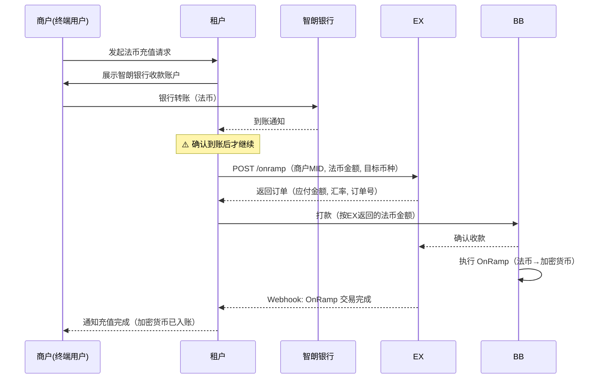
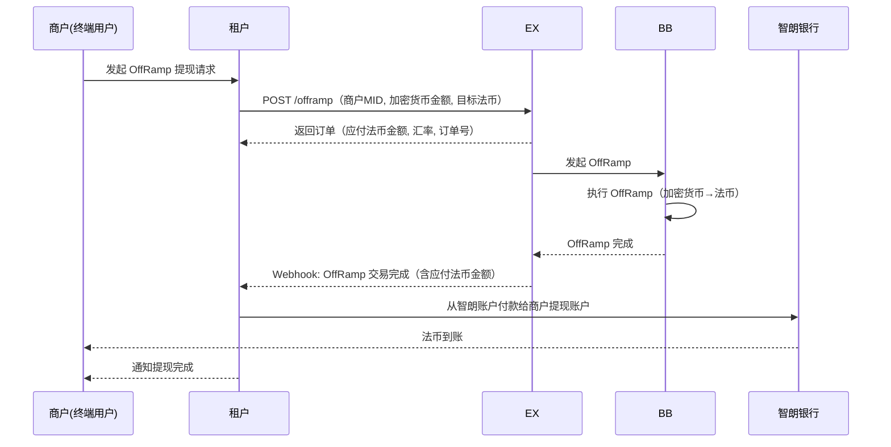

# Tenant OnRamp / OffRamp — API 解决方案

> **文档类型**: 租户承兑业务 API 方案
> **版本**: v1.0
> **最后更新**: 2026-04-13
> **适用对象**: 已接入 EX 的租户（Tenant），为其终端商户提供法币 ↔ 加密货币兑换服务

---

## 一、方案概述

本方案描述租户（Tenant）通过 EX API 为其终端商户提供 **OnRamp（法币→加密货币）** 和 **OffRamp（加密货币→法币）** 服务的完整业务流程。

**推荐架构**：租户优先在**智朗银行（ZL Bank）**开设法币账户，作为法币资金的收付通道。

### 核心原则

| 原则                       | 说明                                                           |
| -------------------------- | -------------------------------------------------------------- |
| **OnRamp 先收后做**  | 必须先收到商户法币资金，确认到账后才发起 OnRamp 交易。绝不垫资 |
| **OffRamp 头寸自管** | 租户自行管理智朗银行头寸，可选择先垫付再从 EX 结算，但风险自担 |
| **双方不互垫头寸**   | EX 不为租户垫资，租户不为 EX 垫资。各自管理各自的资金池        |

### 资金流向

```
OnRamp（法币 → 加密货币）:
  商户法币 → 租户智朗账户 → 租户打款至 BB → BB 处理 OnRamp → 加密货币入账

OffRamp（加密货币 → 法币）:
  商户加密货币 → EX 处理 OffRamp → 计算法币金额 → 租户从智朗账户付款给商户
```

---

## 二、前置流程

### 2.1 租户自身准备

```
├── 1. 智朗银行开户（优先推荐）
│     └── 租户在智朗银行开设法币账户，用于 OnRamp 收款和 OffRamp 付款
│
├── 2. 租户签约
│     └── 申请开通 OnRamp / OffRamp 产品
│     └── Webhook: 产品审核通过
│
└── 3. 技术对接
      └── 获取 Sandbox 环境 → 配置 APP ID / 公钥 / AES Key / Webhook
```

### 2.2 商户入网（租户为其商户完成）

```
├── 1. 注册商户
│     └── 租户通过 API 注册终端商户 → 获取 MID
│
├── 2. 商户 KYC/KYB
│     └── 提交审核材料 → Webhook: 审核结果
│
└── 3. 商户产品开通
      └── 为商户申请 OnRamp / OffRamp 产品 → Webhook: 产品审核通过
```

---

## 三、OnRamp 业务流程（法币 → 加密货币）

**核心原则：先收到商户法币，再发起 OnRamp。**

```
┌──────────┐     ┌──────────┐     ┌──────────┐     ┌──────────┐
│  商户     │     │  租户     │     │   EX     │     │   BB     │
│(终端用户) │     │(Tenant)  │     │          │     │(服务商)   │
└────┬─────┘     └────┬─────┘     └────┬─────┘     └────┬─────┘
     │                │                │                │
```

### 步骤详解

```
├── 1. 商户发起充值请求
│     └── 商户在租户前端发起法币充值
│     └── 租户向商户展示自己的智朗银行账户信息（收款账号）
│
├── 2. 商户打款
│     └── 商户通过银行转账将法币打入租户的智朗银行账户
│
├── 3. 租户确认到账
│     └── 租户在智朗银行确认收到商户法币（⚠️ 必须确认到账）
│
├── 4. 租户发起 OnRamp 交易
│     └── 租户调用 EX API 发起 OnRamp 请求
│     └── 请求参数：商户 MID、法币金额、法币币种、目标加密货币
│     └── EX 返回：OnRamp 订单信息（含应付法币金额、汇率、订单号）
│
├── 5. 租户打款至 BB
│     └── 租户根据 EX 返回的法币金额，从智朗银行账户转账至 BB 指定账户
│
├── 6. BB 处理 OnRamp
│     └── BB 收到法币后执行 OnRamp（法币 → 加密货币）
│     └── 加密货币入账到商户的加密钱包
│
└── 7. 交易完成
      └── Webhook: OnRamp 交易结果通知
      └── 租户通知商户充值完成
```

### OnRamp 时序图



---

## 四、OffRamp 业务流程（加密货币 → 法币）

### 4.1 前置：添加商户提现账户

```
├── 1. 商户在租户前端添加提现账户
│     └── 商户填写法币收款银行账户信息
│
├── 2. 租户在 EX 添加商户提现账户
│     └── 租户调用 EX API 添加收款人（beneficiary）
│     └── EX 返回：添加状态（审核中 / 已通过 / 需补充材料）
│     └── Webhook: 收款人审核结果
│
└── 3. 审核通过后可用于 OffRamp 提现
```

### 4.2 OffRamp 交易流程

```
├── 1. 商户发起 OffRamp 请求
│     └── 商户在租户前端发起加密货币→法币提现
│
├── 2. 租户发起 OffRamp 交易
│     └── 租户调用 EX API 发起 OffRamp 请求
│     └── 请求参数：商户 MID、加密货币金额、加密币种、目标法币
│     └── EX 返回：OffRamp 订单信息（含应转法币金额、汇率、订单号）
│
├── 3. EX/BB 处理 OffRamp
│     └── BB 执行 OffRamp（加密货币 → 法币）
│     └── 计算出商户应收法币金额
│
├── 4. 租户付款给商户
│     └── 租户根据计算出的法币金额，从智朗银行账户付款给商户提现账户
│     └── 租户财务执行客户付款
│
└── 5. 交易完成
      └── Webhook: OffRamp 交易结果通知
      └── 租户通知商户提现完成
```

### OffRamp 时序图



---

## 五、头寸管理与资金原则

### 5.1 核心原则

```
┌───────────────────────────────────────────────────────────┐
│                    资金隔离原则                              │
│                                                            │
│  1. OnRamp：先收后做                                        │
│     └── 租户必须先确认收到商户法币，才发起 OnRamp             │
│     └── 绝不允许未收款就发起交易                              │
│                                                            │
│  2. OffRamp：头寸自管                                       │
│     └── 租户自行管理智朗银行法币头寸                          │
│     └── 可选择先垫付商户，再等 EX 结算（风险自担）            │
│                                                            │
│  3. 双方不互垫头寸                                          │
│     └── EX 不为租户垫资                                     │
│     └── 租户不为 EX 垫资                                    │
│     └── 各管各的资金池                                      │
└───────────────────────────────────────────────────────────┘
```

### 5.2 OffRamp 头寸策略

租户在 OffRamp 场景下有两种付款策略：

| 策略                       | 做法                                                     | 风险                   | 商户体验           |
| -------------------------- | -------------------------------------------------------- | ---------------------- | ------------------ |
| **保守策略（推荐）** | 等 EX OffRamp 完成，确认法币金额后再付款给商户           | 零风险                 | 商户等待时间较长   |
| **激进策略**         | 租户预先在智朗银行备足法币头寸，先垫付商户，再等 EX 结算 | 汇率波动风险、资金占用 | 商户体验好，到账快 |

> **建议**：初期采用保守策略，业务稳定后根据资金情况考虑激进策略。激进策略下，租户需自行管理汇率敞口和流动性风险。

---

## 六、完整业务总览

```
                        租户 OnRamp / OffRamp 全景

  ┌─────────────────────────────────────────────────────────────┐
  │                        前置流程                               │
  │  智朗开户 → EX入网 → 产品开通 → 技术对接 → 商户入网            │
  └──────────────────────────┬──────────────────────────────────┘
                             │
              ┌──────────────┼──────────────┐
              ▼                             ▼
  ┌─────────────────────┐       ┌─────────────────────┐
  │      OnRamp          │       │      OffRamp         │
  │  (法币 → 加密货币)    │       │  (加密货币 → 法币)    │
  │                      │       │                      │
  │ 1.商户充值法币→智朗   │       │ 1.添加商户提现账户    │
  │ 2.确认到账           │       │ 2.商户发起OffRamp     │
  │ 3.调EX发起OnRamp     │       │ 3.调EX发起OffRamp     │
  │ 4.按金额打款至BB     │       │ 4.EX/BB处理OffRamp    │
  │ 5.BB处理OnRamp       │       │ 5.租户付款给商户      │
  │ 6.加密货币入账        │       │ 6.法币到账            │
  └─────────────────────┘       └─────────────────────┘
```

---

## 七、Webhook 事件

| 事件             | 触发时机             | 说明                      |
| ---------------- | -------------------- | ------------------------- |
| KYC/KYB 审核结果 | 商户审核完成         | APPROVED / REJECTED / RFI |
| 产品审核结果     | 产品申请审核完成     | approved / rejected       |
| 收款人审核结果   | 商户提现账户审核完成 | APPROVED / REJECTED / RFI |
| OnRamp 交易结果  | OnRamp 处理完成      | 含最终汇率、加密货币金额  |
| OffRamp 交易结果 | OffRamp 处理完成     | 含最终汇率、应付法币金额  |

---

## 八、注意事项

1. **OnRamp 必须先收后做** — 未确认到账就发起 OnRamp 会导致资金风险，此为不可逾越的红线
2. **汇率有时效性** — OnRamp/OffRamp 的报价有过期时间，过期需重新获取
3. **收款人需审核** — 商户提现账户添加后需等待审核通过才能使用
4. **RFI 及时响应** — 审核过程中可能要求补充材料，超时可能导致审核失败
5. **对账** — 租户应定期核对智朗银行流水与 EX 交易记录，确保资金一致
6. **头寸监控** — 采用激进策略的租户需实时监控智朗账户余额，避免付款失败
