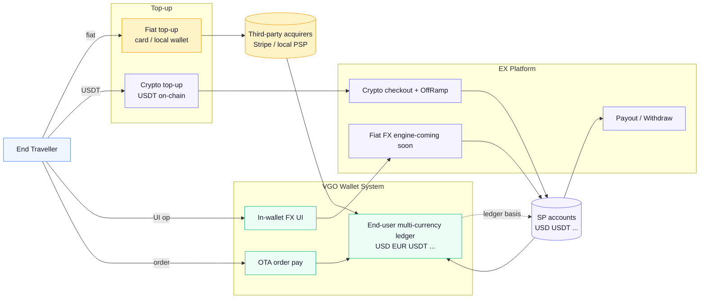
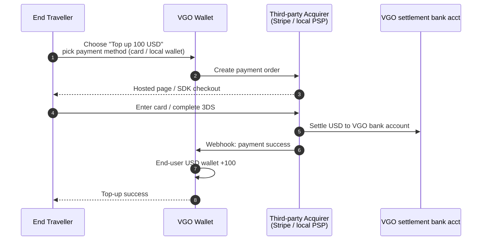
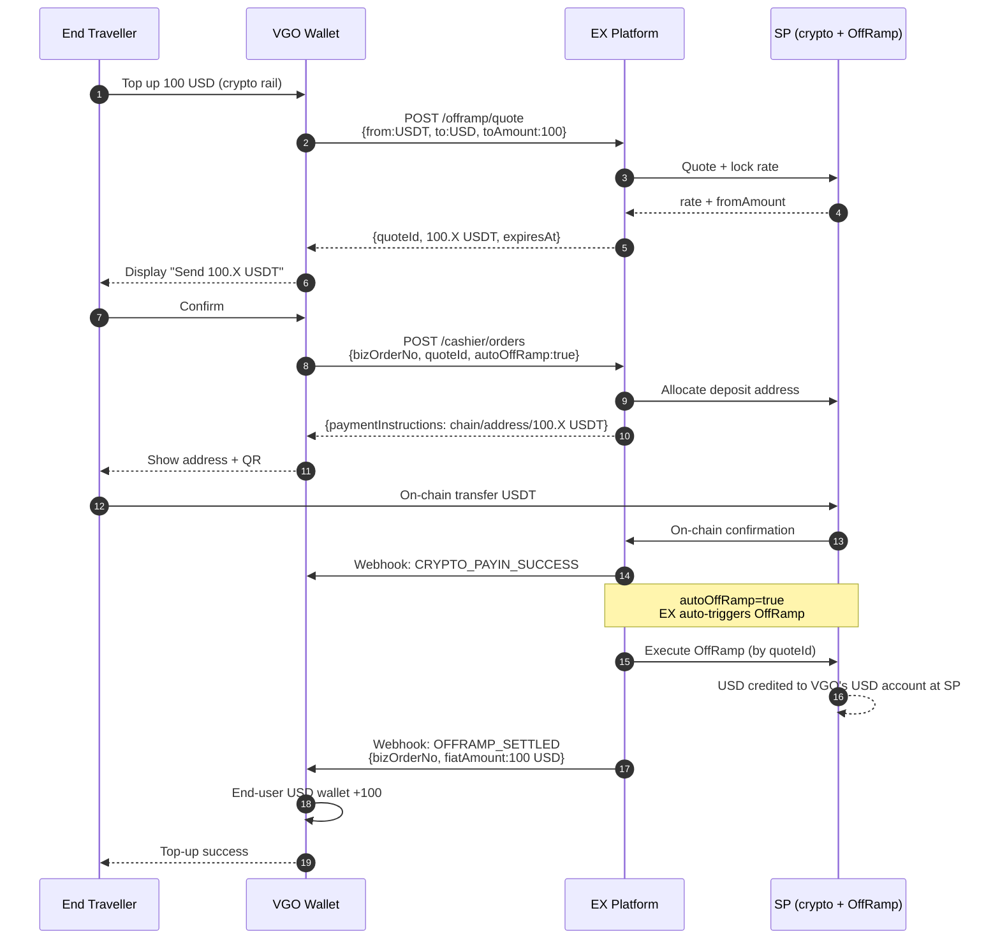
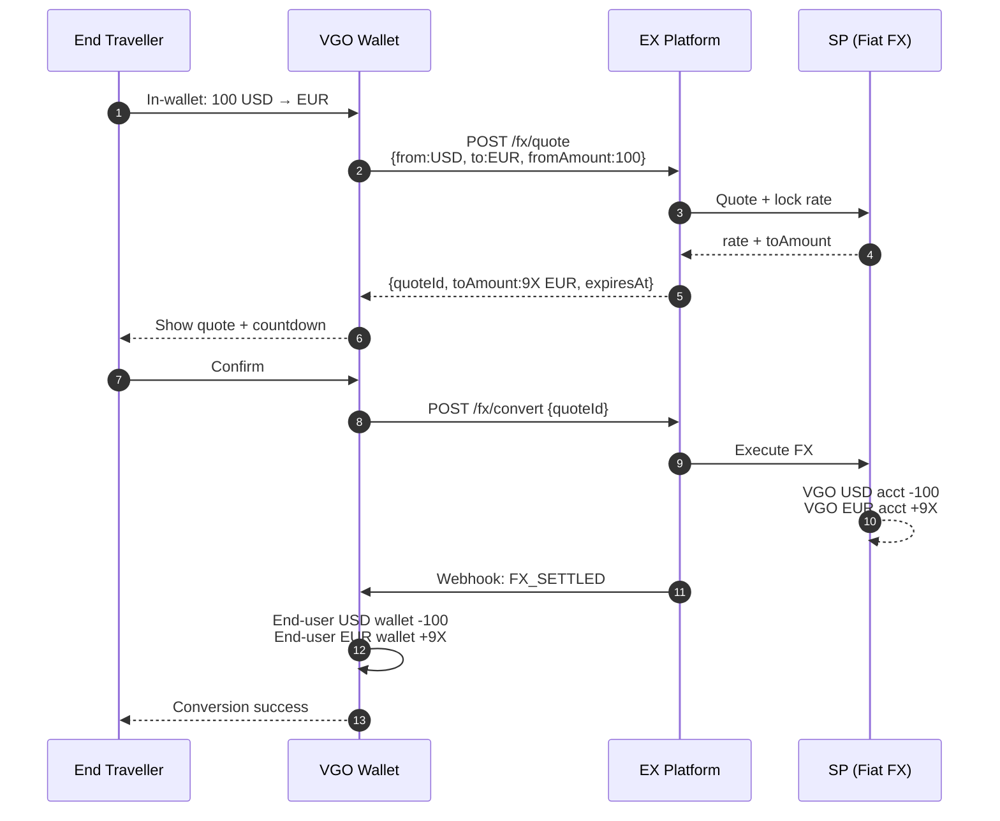

# VGO Booking × EX Solution

> **Document Type**: Customer Solution
> **Customer**: VGO Booking (Comprehensive OTA platform + planned multi-currency wallet)
> **Version**: v2.0
> **Last Updated**: 2026-04-29
> **API Reference**: [EurewaX Open Platform](https://open.eurewax.com/)

---

## 1. Customer Overview

### 1.1 Core Business

VGO Booking is a comprehensive OTA (Online Travel Agency) platform offering 6 travel services:

| Service            | Description                                                                   |
| ------------------ | ----------------------------------------------------------------------------- |
| Flight Booking     | One-way / round-trip / multi-city flights, with baggage / seat / meal add-ons |
| Hotel Booking      | Hotel reservations with flexible cancellation, 24/7 service                   |
| Package Booking    | Vacation / medical / entertainment / activity packages                        |
| Traveller SIM Card | eSIM / physical SIM card data plans                                           |
| Transport Booking  | Airport transfer, ride-hailing, delivery service                              |
| Rental Services    | Car / bicycle rental, with insurance options                                  |

### 1.2 Current Build: Self-Operated Multi-Currency Wallet for End Users

VGO plans to **build a multi-currency wallet for end-traveller users**, replacing pure card payment, building user funds stickiness, and improving repeat-purchase rate:

| Capability                              | Description                                                                                    |
| --------------------------------------- | ---------------------------------------------------------------------------------------------- |
| **Multi-currency wallet balance** | End users can simultaneously hold multiple fiat / crypto balances (e.g. USD / EUR / USDT)      |
| **Multi-rail top-up**             | End users can top up via fiat (card / local wallet) or crypto (USDT on-chain)                  |
| **In-wallet self-service FX**     | End users perform USD ↔ EUR, USD ↔ USDT etc. inside the wallet                               |
| **Pay travel orders**             | End users pay VGO's own flight / hotel orders using wallet balance (internal ledger deduction) |

> This solution focuses on the **multi-currency wallet** build-out. OTA order settlement / supplier payout (VCC) is kept as an optional P1 item.

---

## 2. Roles

| Role                                     | Description                                                                                                                                                 |
| ---------------------------------------- | ----------------------------------------------------------------------------------------------------------------------------------------------------------- |
| **VGO Booking**                    | Wallet issuer + OTA platform. Onboards EX as a**merchant**. **VGO owns the end-user wallet ledger**; EX is unaware of end users                 |
| **End Traveller**                  | Wallet end user.**EX is unaware of end users**; account and multi-currency balances are managed by VGO's internal ledger                              |
| **SP**                             | The**actual licensed crypto-acquiring / OnRamp-OffRamp / FX / payout institutions**. VGO's fiat / crypto accounts are physically held at SP           |
| **EX**                             | Tech + compliance orchestration platform: APIs, Webhooks, SP routing, risk control, reconciliation, compliance                                              |
| **Third-party acquirers (NOT EX)** | Stripe / Adyen / dLocal / local PSPs etc.**EX does NOT provide end-user fiat card / local-wallet acquiring** — VGO must integrate these on their own |

---

## 3. Capability and Currency Coverage

### 3.1 Capabilities EX Provides

| Capability                             | Coverage                                | Used For                                                       |
| -------------------------------------- | --------------------------------------- | -------------------------------------------------------------- |
| **Crypto acquiring (collect U)** | USDT / USDC (on-chain)                  | End-user crypto wallet top-up                                  |
| **OffRamp (U → fiat)**          | **USD only**                      | After crypto top-up, settle to USD wallet                      |
| **OnRamp (fiat → U)**           | **USD only**                      | VGO treasury rebalancing: USD → USDT                          |
| **Fiat FX**                      | USD ↔ major fiat (subject to SP rails) | Underlying settlement for in-wallet cross-currency conversions |
| **Fiat payout**                  | **USD only**                      | VGO entity-level USD withdraw to bank                          |
| **Crypto withdraw**              | USDT / USDC on-chain                    | VGO entity-level crypto out                                    |
| **VCC issuing (optional)**       | US BIN                                  | For supplier settlement to GDS / airlines / hotels             |

### 3.2 Capabilities EX Does **NOT** Provide (VGO sources independently)

| Capability                                  | Note                                                  | Suggested Provider      |
| ------------------------------------------- | ----------------------------------------------------- | ----------------------- |
| **End-user card acquiring**           | Visa / Mastercard / local debit cards into the wallet | Stripe / Adyen / dLocal |
| **End-user local wallet acquiring**   | GCash / GrabPay / OVO / Pix / UPI etc.                | Local PSP / PayMongo    |
| **End-user bank transfer collection** | Local bank rails                                      | Local PSP / direct bank |

> **Fiat top-up rails are integrated by VGO independently.** EX only covers the crypto side (acquiring + OffRamp) and VGO's entity-level fiat side (FX / Payout).

---

## 4. Funds Custody Model

VGO's fiat / crypto accounts are **physically opened at SP**. EX only provides the technical link + compliance orchestration:

```
VGO crypto account (USDT/USDC)  ←─ Held at SP, EX queries / withdraws via API
VGO fiat account (USD)          ←─ Held at SP, EX queries / FX / payout via API
```

The **end-user wallet balance is VGO's internal ledger**; the actual funds settle into VGO's currency accounts at SP. There is **no "fund consolidation"** — every end-user action's fund impact lands directly in VGO's SP account.

---

## 5. End-User Wallet Business Flow

### 5.1 Flow Overview



> Three top-up rails, one in-wallet FX rail, one order-pay rail. **The fiat top-up rail does not go through EX** — VGO integrates a third-party acquirer themselves.

### 5.2 Scenario A: End-User Fiat Top-up (NOT via EX)

**Description**: End users top up via card / local wallet / bank transfer. VGO integrates a third-party acquirer (Stripe / local PSP) and credits the end user's fiat balance internally upon receipt.



> **This flow does not pass through EX.** VGO selects, negotiates, and integrates a third-party PSP independently.

---

### 5.3 Scenario B: End-User Crypto Top-up (EX Crypto Checkout + OffRamp)

**Description**: End user chooses to top up 100 USD (fiat) using crypto. VGO calls EX OffRamp quote → shows "send X USDT" → end user transfers on-chain → EX auto-triggers OffRamp → USD lands in VGO's USD account at SP → VGO credits end-user USD wallet.

VGO **does NOT act as the FX merchant**: rate and FX risk are taken by the licensed SP via the locked quote.



> Also supports topping up the end-user **USDT balance directly** (no OffRamp): omit `quoteId / autoOffRamp` when creating the order; once funds land, VGO simply credits the end-user USDT wallet.

---

### 5.4 Scenario C: In-Wallet Multi-Currency Conversion

**Description**: End user performs in-wallet self-service conversion such as USD ↔ EUR or USD ↔ USDT.

**Two modes** (VGO picks one or mixes):

| Mode                               | Description                                                                                                                           | Best For                               |
| ---------------------------------- | ------------------------------------------------------------------------------------------------------------------------------------- | -------------------------------------- |
| **A. VGO internal matching** | VGO converts directly on its internal ledger (with own markup / FX pool); underlying funds rebalanced periodically via batch FX at SP | High-frequency small tickets           |
| **B. Real-time EX FX call**  | Every end-user conversion triggers EX FX quote + lock-rate; VGO records ledger entries based on settlement                            | Large tickets, real-time lock required |

**Mode B sequence:**



> **USD ↔ USDT** in-wallet conversion: call EX OnRamp / OffRamp APIs (USD only).

---

### 5.5 Scenario D: Pay a Travel Order with Wallet Balance

**Description**: End user places an order on VGO (flight / hotel etc.) and selects "pay with wallet balance". The whole flow is **internal ledger deduction** — no external fund movement.

```
1. End user places order on VGO → pick currency + "wallet pay"
2. VGO checks the corresponding currency balance
3. VGO internal ledger: end-user wallet - order amount,
                        VGO supplier-payable + order amount
4. VGO issues ticket / confirms order
5. Later VGO settles to suppliers via VCC (optional) or fiat payout
```

> This scenario calls no EX API — it is purely a VGO internal ledger move.

---

### 5.6 Scenario E: VGO Entity-Level Withdraw

**Description**: VGO withdraws USD / USDT balances from its SP accounts to its bank or on-chain wallet. The two paths are **independent** — no "consolidation" step.

**Withdraw (USD → bank):**

```
1. Add bank payee → Webhook: review result
2. POST /payout/orders {payeeId, amount, currency:USD}
3. Webhook: PAYOUT_PROCESSING → SUCCESS / FAIL
```

**Crypto withdraw (USDT → on-chain):**

```
1. Add on-chain payee address → Webhook: review result
2. POST /crypto/withdraw {address, chain, amount, currency:USDT}
3. Webhook: CRYPTO_WITHDRAW_PROCESSING → SUCCESS / FAIL
```

---

### 5.7 Scenario F (Optional P1): Pay Suppliers via VCC

**Description**: Original OTA scenario retained. VGO applies for virtual cards on EX and pays suppliers (GDS / airlines / hotels) using the VCC card number.

```
1. VGO applies for virtual cards (institutional, per-order or monthly)
2. Top up card account from VGO USD account
3. Enter VCC number into supplier system → payment completes
4. EX pushes card transaction notifications → VGO records supplier settlement
```

---

## 6. Capability Matrix Summary

| Need                                                        | Provider                | Product                             | Priority        |
| ----------------------------------------------------------- | ----------------------- | ----------------------------------- | --------------- |
| End-user crypto top-up (USDT → USD)                        | ✅ EX                   | Crypto Checkout + OffRamp           | **P0**    |
| End-user USDT balance (no convert)                          | ✅ EX                   | Crypto Checkout                     | P0              |
| In-wallet USD ↔ other fiat                                 | ✅ EX                   | Fiat FX                             | **P0**    |
| In-wallet USD ↔ USDT                                       | ✅ EX                   | OnRamp / OffRamp                    | P0              |
| VGO entity USD withdraw                                     | ✅ EX                   | Payout                              | P0              |
| VGO entity crypto withdraw                                  | ✅ EX                   | Crypto Withdraw                     | P0              |
| VCC supplier settlement                                     | ✅ EX                   | CARD_ISSUING                        | P1 (OTA legacy) |
| **End-user fiat top-up (card / local wallet / bank)** | ❌**VGO sources** | Stripe / Adyen / dLocal / local PSP | —              |

---

## 7. Webhook Event Catalog

| Product                | Event                                                           | Trigger                                |
| ---------------------- | --------------------------------------------------------------- | -------------------------------------- |
| Onboarding             | KYC/KYB review result                                           | Merchant review completes              |
| Product activation     | approved / rejected / RFI                                       | Status change                          |
| Crypto checkout        | `CRYPTO_PAYIN_SUCCESS` / `FAIL`                             | On-chain confirmation / timeout        |
| OffRamp                | `OFFRAMP_SETTLED` / `FAIL`                                  | OffRamp settled, USD landed in account |
| OnRamp                 | `ONRAMP_SETTLED` / `FAIL`                                   | OnRamp settled                         |
| Fiat FX                | `FX_SETTLED` / `FAIL`                                       | Fiat-to-fiat FX settled                |
| Payout (USD)           | `PAYOUT_PROCESSING` / `SUCCESS` / `FAIL`                  | USD payout state change                |
| Crypto withdraw (USDT) | `CRYPTO_WITHDRAW_PROCESSING` / `SUCCESS` / `FAIL`         | USDT withdraw state change             |
| Card (optional)        | Card application / authorization / settlement / refund / top-up | VCC full lifecycle                     |

---

## 8. API Catalog

| Module             | API                                                                                        | Scenario                                                                                   |
| ------------------ | ------------------------------------------------------------------------------------------ | ------------------------------------------------------------------------------------------ |
| Onboarding         | Register merchant / KYB                                                                    | Pre-requisite                                                                              |
| Product activation | Apply product / query status                                                               | Activate CRYPTO_WALLET / FIAT_OFFRAMP / FIAT_ONRAMP / FIAT_FX / FIAT_PAYOUT / CARD_ISSUING |
| OffRamp            | `POST /offramp/quote` + `POST /offramp/convert` + `GET /offramp/orders/{bizOrderNo}` | Scenario B (end-user crypto top-up)                                                        |
| Crypto checkout    | `POST /cashier/orders` (with `quoteId` + `autoOffRamp`)                              | Scenario B                                                                                 |
| OnRamp             | `POST /onramp/quote` + `POST /onramp/convert`                                          | Scenario C (USD ↔ USDT)                                                                   |
| Fiat FX            | `POST /fx/quote` + `POST /fx/convert`                                                  | Scenario C (USD ↔ EUR etc.)                                                               |
| Account query      | Query USD / USDT / other balances + transactions                                           | All scenarios                                                                              |
| Payout             | Payee management +`POST /payout/orders`                                                  | Scenario E (USD withdraw)                                                                  |
| Crypto withdraw    | On-chain payee mgmt +`POST /crypto/withdraw`                                             | Scenario E (USDT withdraw)                                                                 |
| VCC (optional)     | Card application / top-up / query / freeze-unfreeze / limits                               | Scenario F                                                                                 |
| Common             | Configure notify URL / upload file / fetch merchant token                                  | General                                                                                    |

---

## 9. Pre-Integration Steps

> Order: **Merchant onboarding → Contact tech support to enable Sandbox → Sandbox setup → Signature/encryption end-to-end test → Apply for products → Business integration**.

### 9.1 Merchant Onboarding (KYB)

```
├── 1. VGO signs as merchant with EX
│     └── Submit KYB pack (legal rep / directors / business license / business memo)
│     └── Upload attachments first via [Upload File] API to get URLs
│     └── Webhook: KYB result (APPROVED / REJECTED / RFI)
│
└── 2. Receive APPROVED → proceed to Sandbox enablement
```

### 9.2 Enable Sandbox (Contact Tech Support)

After onboarding, **contact tech support in the dedicated channel to set up Sandbox**:

```
Step 1 → Contact tech support to enable Sandbox
        → Receive test Account No, test domain
Step 2 → Receive APP ID, Platform Public Key, AES Key
Step 3 → Customer generates RSA keypair (SHA256withRSA, 2048-bit)
        → Upload customer public key to admin portal
Step 4 → Configure Webhook URL (HTTPS, POST,
        per notifyType or unified ALL)
Step 5 → Verify signature + AES encryption end-to-end
```

> Key generation, sign/verify, AES code samples and merchant-info template are provided by tech support.
> Sandbox parameters: see [Environment Parameters](https://open.eurewax.com/%E7%8E%AF%E5%A2%83%E5%8F%82%E6%95%B0-6918053m0)

### 9.3 Apply for Products

```
P0: CRYPTO_WALLET (crypto checkout) + FIAT_OFFRAMP + FIAT_ONRAMP + FIAT_FX + FIAT_PAYOUT
P1: CARD_ISSUING (VCC for supplier payment, OTA legacy)
```

- Product application validates the KYB pack; insufficient info returns **RFI**
- Result is pushed via Webhook

### 9.4 EX-Side Setup

- Configure VGO merchant in EX backoffice
- Lock SP routing (crypto checkout / OffRamp / FX / Payout rails)
- Configure Webhook URL dispatch
- Run high-TPS load tests for end-user scale

---

## 10. Integration Timeline

> Aligned with the generic `ex-api-solution.md` §9 cadence: **Phase 0 setup → Phase 1 prerequisite → Phase 2 core business → Phase 3 E2E → Phase 4 launch**. Minimum scope ~30 days; including VCC ~40 days.

### 10.1 Master Plan

| Phase                            | Content                                                                                                                     | ETA        | Cumulative |
| -------------------------------- | --------------------------------------------------------------------------------------------------------------------------- | ---------- | ---------- |
| **Phase 0: Environment**   | Tech-support Sandbox enablement, key setup, Webhook, signature + AES end-to-end                                             | 1-2 days   | 2          |
| **Phase 1: Prerequisites** | KYB review + product activation (CRYPTO_WALLET + FIAT_OFFRAMP + FIAT_ONRAMP + FIAT_FX + FIAT_PAYOUT, optional CARD_ISSUING) | 3-5 days   | 7          |
| **Phase 2: Core business** | By-scenario integration (see 10.2, parallelizable)                                                                          | 15-22 days | 29         |
| **Phase 3: E2E test**      | End-to-end + edge cases + high-TPS load                                                                                     | 5-7 days   | 36         |
| **Phase 4: Launch**        | Production cutover, monitoring                                                                                              | 2-3 days   | 39         |

### 10.2 Phase 2 Per-Scenario ETA

| Scenario                                                                                      | APIs Used                                                        | ETA       | Parallel       |
| --------------------------------------------------------------------------------------------- | ---------------------------------------------------------------- | --------- | -------------- |
| **Scenario B**: End-user crypto top-up (checkout + auto OffRamp)                        | `/offramp/quote` + `/cashier/orders` + `OFFRAMP_SETTLED`   | 7-10 days | —             |
| **Scenario C**: In-wallet FX (FX + OnRamp/OffRamp)                                      | `/fx/quote` + `/fx/convert` + `/onramp/*` + `/offramp/*` | 5-7 days  | ✅             |
| **Scenario E**: VGO entity withdraw                                                     | `/payout/orders` + `/crypto/withdraw`                        | 3-5 days  | ✅             |
| **Scenario D**: Wallet-balance order pay (VGO internal ledger, no EX API)               | —                                                               | 3-5 days  | ✅             |
| **Scenario F**: VCC supplier payment (optional P1)                                      | VCC apply / top-up / authorization                               | 7-10 days | ✅             |
| **Scenario A**: End-user fiat top-up (VGO integrates 3P PSP, **NOT in EX scope**) | —                                                               | —        | Planned by VGO |

> Multiple scenarios can run in parallel; the P0 minimum (Scenarios B + C + D + E) is ~25-30 days; including VCC ~35-40 days.

### 10.3 Account Manager Deliverables

To begin integration, contact your EX account manager for:

1. **Sandbox**: test account, APP ID, Platform Public Key, AES Key, test domain
2. **API Documentation**: [EurewaX Open Platform](https://open.eurewax.com/) full reference
3. **Tech Integration Guide**: signature / encryption code samples, API spec, error codes, merchant-info template
4. **Tech Support**: dedicated integration channel + tech support engineer

---

## 11. Appendix

### 11.1 Product Code Cheat Sheet

| Product Line                   | Product Code                                |
| ------------------------------ | ------------------------------------------- |
| Crypto wallet (incl. checkout) | `CRYPTO_WALLET`                           |
| Fiat OnRamp                    | `FIAT_ONRAMP`                             |
| Fiat OffRamp (incl. payout)    | `FIAT_OFFRAMP`                            |
| Fiat FX                        | `FIAT_FX` (latest code per official docs) |
| Fiat Payout                    | `FIAT_PAYOUT`                             |
| VCC issuing                    | `CARD_ISSUING`                            |

### 11.2 Related Documents

| Document                    | Relationship                                                                                   |
| --------------------------- | ---------------------------------------------------------------------------------------------- |
| `ex-api-solution.md`      | Generic API solution; this doc is its instantiation for the multi-currency wallet scenario     |
| `transsion-solutions.md`  | Same "end-user wallet + crypto top-up via OffRamp" model; reference for implementation details |
| `ex-onofframp-roadmap.md` | EX OnRamp/OffRamp roadmap                                                                      |

---

*Drafted by Cascade*
*Last updated: 2026-04-29*
