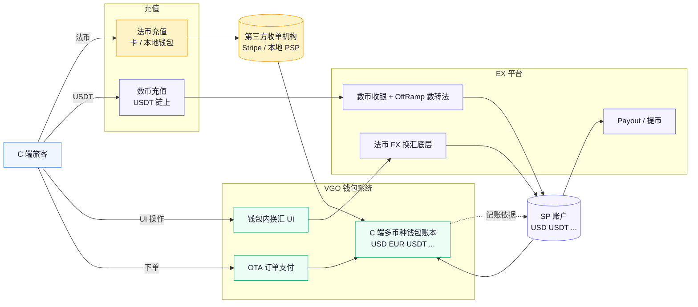
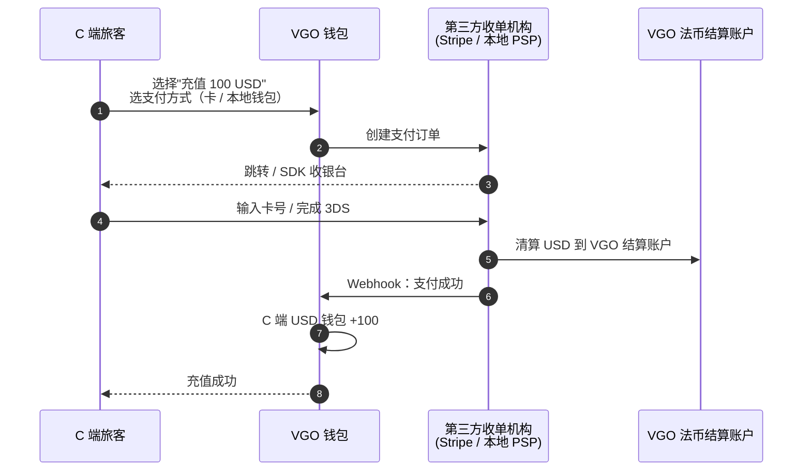
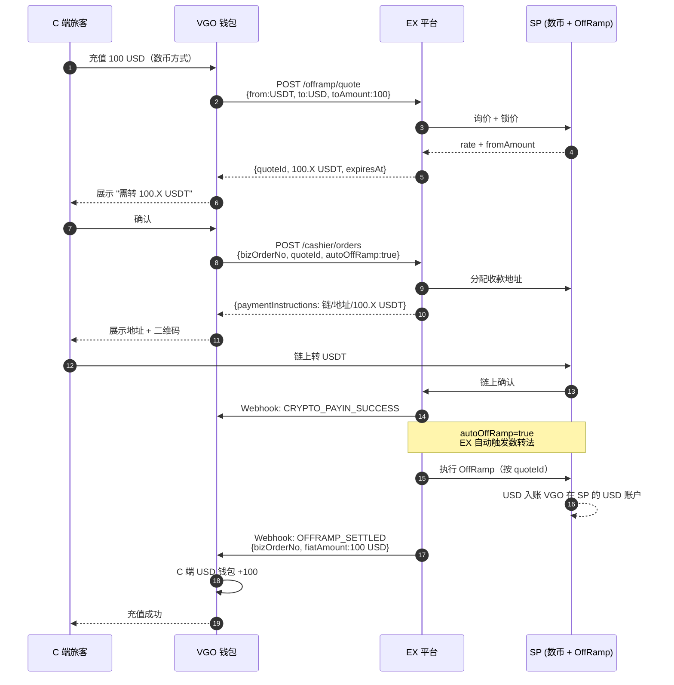
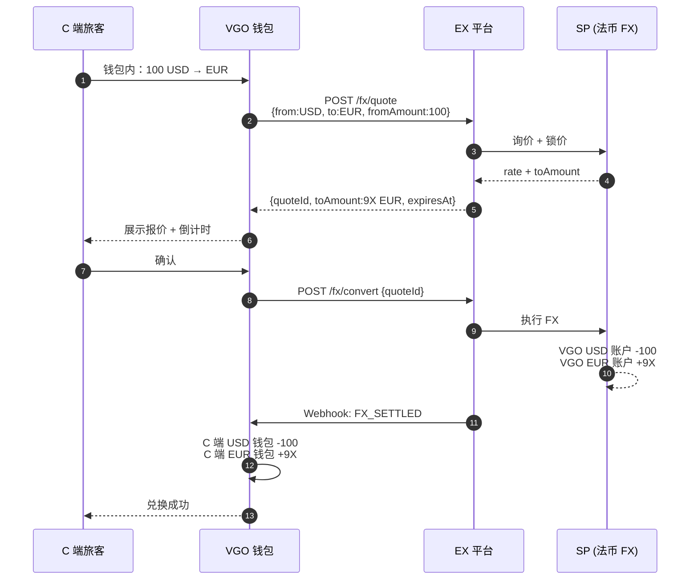

# VGO Booking × EX 解决方案

> **文档类型**：客户解决方案
> **客户**：VGO Booking（综合 OTA 平台 + 拟建多币种钱包）
> **版本**：v2.0
> **最后更新**：2026-04-29
> **API 参考**：[EurewaX 开放平台](https://open.eurewax.com/)

---

## 一、客户概况

### 1.1 主营业务

VGO Booking 是一家综合 OTA（在线旅游代理）平台，提供 6 大旅行服务：

| 服务               | 说明                                             |
| ------------------ | ------------------------------------------------ |
| Flight Booking     | 单程 / 往返 / 多程机票，含行李 / 选座 / 餐食附加 |
| Hotel Booking      | 酒店预订，支持灵活取消，24/7 服务                |
| Package Booking    | 度假 / 医疗 / 娱乐 / 活动套餐                    |
| Traveller SIM Card | eSIM / 实体 SIM 卡数据套餐                       |
| Transport Booking  | 机场接送、网约车、配送服务                       |
| Rental Services    | 租车 / 租自行车，含保险选项                      |

### 1.2 本期建设重点：自建 C 端多币种钱包

VGO 希望**自建一套面向 C 端旅客的多币种钱包**，以替代纯卡支付，沉淀用户资金、提升复购：

| 能力                     | 说明                                                                |
| ------------------------ | ------------------------------------------------------------------- |
| **多币种钱包余额** | C 端可在钱包内同时持有多种法币 / 数币余额（如 USD / EUR / USDT 等） |
| **多币种充值**     | C 端可通过法币（卡 / 本地钱包）或数币（USDT 链上转账）充值进钱包    |
| **钱包内自主兑换** | C 端在钱包内自助换汇（USD ↔ EUR、USD ↔ USDT 等）                  |
| **支付旅行订单**   | C 端用钱包余额支付 VGO 自家机票 / 酒店等订单（内部账本扣减）        |

> 本方案聚焦"**多币种钱包**"建设；OTA 订单结算 / 供应商付款（VCC）作为可选 P1 项保留。

---

## 二、各方角色

| 角色                              | 说明                                                                                                             |
| --------------------------------- | ---------------------------------------------------------------------------------------------------------------- |
| **VGO Booking**             | 钱包发行方 + OTA 平台，在 EX 系统上以**商户**身份入网。**VGO 自己负责 C 端钱包账本**，EX 不感知 C 端 |
| **C 端旅客**                | 钱包终端用户。**EX 不感知 C 端**，C 端账户与多币种余额由 VGO 自行记账                                      |
| **SP**                      | **实际的数币收单 / 承兑 / 法币换汇 / 付款持牌机构**。VGO 的法币 / 数币账户真实开在 SP 处                   |
| **EX**                      | 技术 + 合规运营平台，提供 API、Webhook、SP 路由、风控、对账与合规管控                                            |
| **第三方收单机构（非 EX）** | Stripe / Adyen / dLocal / 本地 PSP 等。**EX 不提供 C 端法币卡 / 本地钱包收单**，需 VGO 自行对接            |

---

## 三、能力与币种范围

### 3.1 EX 提供的能力

| 能力                              | 支持范围                                  | 用途                                 |
| --------------------------------- | ----------------------------------------- | ------------------------------------ |
| **数币收单（收 U）**        | USDT / USDC（链上收款）                   | C 端数币充值钱包                     |
| **承兑 OffRamp（U → 法）** | 仅**USD**                           | 数币充值后数转法上账 USD 钱包        |
| **承兑 OnRamp（法 → U）**  | 仅**USD**                           | VGO 主体调拨：USD → USDT            |
| **法币 FX 换汇**            | USD ↔ 主要法币（具体币种以 SP 通道为准） | 钱包内 C 端跨币种兑换的底层结算      |
| **法币提现**                | 仅**USD**                           | VGO 主体 USD 提现到银行              |
| **数币提币**                | USDT / USDC 链上                          | VGO 主体数币出金                     |
| **VCC 发卡（可选）**        | 美卡 BIN                                  | 用于向 GDS / 航司 / 酒店等供应商结算 |

### 3.2 EX **不**提供的能力（VGO 自找）

| 能力                       | 说明                                          | 建议对接方              |
| -------------------------- | --------------------------------------------- | ----------------------- |
| **C 端法币卡收单**   | C 端用 Visa / Mastercard / 本地借记卡充值钱包 | Stripe / Adyen / dLocal |
| **C 端本地钱包收单** | GCash / GrabPay / OVO / Pix / UPI 等          | 本地 PSP / PayMongo     |
| **C 端银行转账收款** | 本地银行直连                                  | 本地 PSP / 银行直连     |

> **法币充值通道由 VGO 自行接入**。EX 仅在数币侧（数币收单 + 数转法 OffRamp）和 VGO 主体的法币侧（FX / Payout）提供能力。

---

## 四、资金托管模型

VGO 的法币 / 数币账户**真实开立在 SP 处**，EX 仅承担技术链路 + 合规编排：

```
VGO 数币账户（USDT/USDC）  ←─ 真实开在 SP，EX 通过 API 查询 / 提币
VGO 法币账户（USD）        ←─ 真实开在 SP，EX 通过 API 查询 / FX / 提现
```

**C 端钱包余额是 VGO 自家内部账本**，资金沉淀在 VGO 在 SP 的对应币种账户。无 "归集"，所有 C 端动作的资金影响最终落到 VGO 的 SP 账户。

---

## 五、C 端钱包业务流程

### 5.1 业务流程总览



> 三条充值线、一条钱包内换汇线、一条订单消费线。**法币充值这条线 EX 不参与**，由 VGO 自己对接第三方收单机构。

### 5.2 场景 A：C 端法币充值（EX 不参与）

**业务说明**：C 端用信用卡 / 本地钱包 / 银行转账充值。VGO 自己对接第三方收单机构（Stripe / 本地 PSP），收到法币后给 C 端钱包对应法币余额上账。



> **此流程不经过 EX**。VGO 选型 / 商务谈判 / 接入第三方 PSP 自行完成。

---

### 5.3 场景 B：C 端数币充值（EX 数币收银 + OffRamp 数转法）

**业务说明**：C 端选择数币充值 100 USD（法币）。VGO 调 EX 获取 OffRamp 报价 → 展示 "需转 X USDT" → C 端链上转账 → EX 自动触发数转法 → USD 到 VGO 在 SP 的 USD 账户 → VGO 给 C 端 USD 钱包加余额。

VGO **不承担 FX 商角色**，汇率与换汇风险由持牌 SP 通过报价承担。



> 也支持给 C 端 **USDT 余额** 直接充值（不做 OffRamp）：建单时不带 `quoteId / autoOffRamp`，到账后 VGO 直接给 C 端 USDT 钱包 +N。

---

### 5.4 场景 C：钱包内多币种兑换

**业务说明**：C 端在钱包内做 USD ↔ EUR / USD ↔ USDT 的自助兑换。

**两种模式**（VGO 二选一或混用）：

| 模式                      | 说明                                                                                           | 适用               |
| ------------------------- | ---------------------------------------------------------------------------------------------- | ------------------ |
| **A. VGO 内部撮合** | VGO 内部账本直接换算（VGO 自己加点报价 / 自营 FX 池）；底层资金通过周期性批量调拨在 SP 端做 FX | 大量小额、频次高   |
| **B. 实时调 EX FX** | 每笔 C 端兑换都调 EX 法币 FX 询价 + 锁汇，按成交结果给两端钱包记账                             | 大额、要求实时锁汇 |

**模式 B 时序：**



> **USD ↔ USDT** 的钱包内兑换：调 EX OnRamp / OffRamp 接口（仅支持 USD）。

---

### 5.5 场景 D：用钱包余额支付旅行订单

**业务说明**：C 端在 VGO 平台下单（机票 / 酒店等），勾选 "用钱包余额支付"。**全程 VGO 内部账本扣减**，无外部资金动作。

```
1. C 端在 VGO 下单 → 选币种 + "钱包余额支付"
2. VGO 校验对应币种钱包余额
3. VGO 内部账本：C 端钱包 - 订单金额，VGO 应付供应商负债 + 订单金额
4. VGO 出票 / 确认订单
5. 后续 VGO 通过 VCC（可选）或法币付款向供应商结算
```

> 此场景不调 EX 任何接口；只是 VGO 内部账本动作。

---

### 5.6 场景 E：VGO 主体提现 / 提币

**业务说明**：VGO 把 SP 端的 USD / USDT 余额提到自己的银行账户或链上钱包。两者各自独立，无"归集"动作。

**提现（USD → 银行账户）：**

```
1. 添加银行收款人 → Webhook: 审核结果
2. POST /payout/orders {payeeId, amount, currency:USD}
3. Webhook: PAYOUT_PROCESSING → SUCCESS / FAIL
```

**提币（USDT → 链上地址）：**

```
1. 添加链上收款地址 → Webhook: 审核结果
2. POST /crypto/withdraw {address, chain, amount, currency:USDT}
3. Webhook: CRYPTO_WITHDRAW_PROCESSING → SUCCESS / FAIL
```

---

### 5.7 场景 F（可选 P1）：VCC 向供应商付款

**业务说明**：保留原 OTA 场景。VGO 在 EX 申请虚拟卡，用 VCC 卡号在 GDS / 航司 / 酒店系统付款。

```
1. VGO 申请虚拟卡（机构卡，按订单 / 按月度发）
2. 从 VGO USD 账户充值卡账户
3. 在供应商系统输入 VCC 卡号 → 完成付款
4. EX 推送卡交易通知 → VGO 记录供应商结算完成
```

---

## 六、能力矩阵汇总

| 需求                                           | 提供方               | 产品                               | 优先级         |
| ---------------------------------------------- | -------------------- | ---------------------------------- | -------------- |
| C 端数币充值钱包（USDT → USD）                | ✅ EX                | 聚合收银 + OffRamp 数转法          | **P0**   |
| C 端 USDT 余额（不换法）                       | ✅ EX                | 聚合收银                           | P0             |
| 钱包内 USD ↔ 其他法币                         | ✅ EX                | 法币 FX                            | **P0**   |
| 钱包内 USD ↔ USDT                             | ✅ EX                | OnRamp / OffRamp                   | P0             |
| VGO 主体 USD 提现                              | ✅ EX                | Payout                             | P0             |
| VGO 主体数币提币                               | ✅ EX                | 加密提现                           | P0             |
| VCC 向供应商结算                               | ✅ EX                | CARD_ISSUING                       | P1（OTA 沿用） |
| **C 端法币充值（卡 / 本地钱包 / 银行）** | ❌**VGO 自找** | Stripe / Adyen / dLocal / 本地 PSP | —             |

---

## 七、Webhook 事件清单

| 产品               | 事件                                                    | 触发时机                  |
| ------------------ | ------------------------------------------------------- | ------------------------- |
| 入网               | KYC/KYB 审核结果                                        | 商户审核完成              |
| 产品开通           | 产品审核通过 / 拒绝 / RFI                               | 审核状态变更              |
| 聚合收银           | `CRYPTO_PAYIN_SUCCESS` / `FAIL`                     | 数币到账 / 超时           |
| OffRamp            | `OFFRAMP_SETTLED` / `FAIL`                          | 数转法成交并到账 USD 账户 |
| OnRamp             | `ONRAMP_SETTLED` / `FAIL`                           | 法转数成交                |
| 法币 FX            | `FX_SETTLED` / `FAIL`                               | 法币间换汇成交            |
| Payout（USD 提现） | `PAYOUT_PROCESSING` / `SUCCESS` / `FAIL`          | USD 提现状态变化          |
| 提币（USDT）       | `CRYPTO_WITHDRAW_PROCESSING` / `SUCCESS` / `FAIL` | USDT 提币状态变化         |
| 卡产品（可选）     | 卡申请结果 / 交易授权 / 扣款 / 退款 / 充值              | VCC 全生命周期            |

---

## 八、API 对接清单

| 模块        | 接口                                                                                       | 场景                                                                                   |
| ----------- | ------------------------------------------------------------------------------------------ | -------------------------------------------------------------------------------------- |
| 入网        | 注册商户 / KYB 申请                                                                        | 前置                                                                                   |
| 产品开通    | 申请产品 / 查询审核结果                                                                    | 开通 CRYPTO_WALLET / FIAT_OFFRAMP / FIAT_ONRAMP / FIAT_FX / FIAT_PAYOUT / CARD_ISSUING |
| OffRamp     | `POST /offramp/quote` + `POST /offramp/convert` + `GET /offramp/orders/{bizOrderNo}` | 场景 B（C 端数币充值）                                                                 |
| 聚合收银    | `POST /cashier/orders`（含 `quoteId` + `autoOffRamp`）                               | 场景 B                                                                                 |
| OnRamp      | `POST /onramp/quote` + `POST /onramp/convert`                                          | 场景 C（USD ↔ USDT）                                                                  |
| 法币 FX     | `POST /fx/quote` + `POST /fx/convert`                                                  | 场景 C（USD ↔ EUR 等）                                                                |
| 账户查询    | 查询 USD / USDT / 其他币种账户余额 / 流水                                                  | 全场景                                                                                 |
| Payout      | 收款人管理 +`POST /payout/orders`                                                        | 场景 E（USD 提现）                                                                     |
| 提币        | 链上地址管理 +`POST /crypto/withdraw`                                                    | 场景 E（USDT 提币）                                                                    |
| VCC（可选） | 虚拟卡申请 / 卡账户充值 / 查询 / 冻结解冻 / 限额                                           | 场景 F                                                                                 |
| 公共服务    | 配置通知 URL / 上传文件 / 获取商户 Token                                                   | 通用                                                                                   |

---

## 九、前置流程

> 整体顺序：**商户入网 → 找技术支持开通 Sandbox → 测试环境配置 → 联调签名验签 → 申请开通产品 → 业务对接**。

### 9.1 商户入网（KYB）

```
├── 1. VGO 作为商户与 EX 签约
│     └── 提交 KYB 资料（法人 / 董事 / 营业执照 / 业务说明）
│     └── 附件先调【上传文件】接口取 URL，再放入业务请求
│     └── Webhook 通知 KYB 审核结果（APPROVED / REJECTED / RFI）
│
└── 2. 收到 APPROVED → 进入下一步开通测试环境
```

### 9.2 开通 Sandbox 测试环境（联系技术支持）

商户阶段结束后，**在专属对接群中联系技术支持完成 Sandbox 环境配置**：

```
步骤 1 → 联系技术支持开通 Sandbox 环境
        → 获取测试账号（Account No）、测试域名
步骤 2 → 获取 APP ID、平台公钥、AES Key
步骤 3 → 客户生成 RSA 密钥对（SHA256withRSA，2048 位）
        → 上传客户公钥到管理平台
步骤 4 → 配置 Webhook 回调地址（HTTPS，POST，按 notifyType 分类
        或统一接 ALL）
步骤 5 → 完成签名验签 + AES 加解密联调验证
```

> 密钥生成、签名/验签、AES 加解密代码示例与商户信息模版均由技术支持提供。
> Sandbox 环境参数详见 [环境参数](https://open.eurewax.com/%E7%8E%AF%E5%A2%83%E5%8F%82%E6%95%B0-6918053m0)

### 9.3 申请开通产品

```
P0：CRYPTO_WALLET（数币聚合收银）+ FIAT_OFFRAMP + FIAT_ONRAMP + FIAT_FX + FIAT_PAYOUT
P1：CARD_ISSUING（VCC 向供应商付款，沿用 OTA 业务）
```

- 申请产品时系统会校验 KYB 信息，不足返回 **RFI**
- 审核结果通过 Webhook 推送

### 9.4 EX 侧准备

- 配置 VGO 商户在 EX 后台
- 固定 SP 路由（数币收单 / OffRamp / FX / Payout 通道）
- 配置 Webhook URL 分发
- 联调高 TPS 压测（针对 C 端规模）

---

## 十、集成时间规划

> 节奏与通用方案 `ex-api-solution.md` §9 对齐：**Phase 0 环境 → Phase 1 前置 → Phase 2 核心业务 → Phase 3 联调 → Phase 4 上线**。最小可上线方案约 30 天，含 VCC 约 40 天。

### 10.1 总体规划

| 阶段                        | 内容                                                                                                         | 预计耗时 | 累计 |
| --------------------------- | ------------------------------------------------------------------------------------------------------------ | -------- | ---- |
| **Phase 0：环境准备** | 找技术支持开通 Sandbox、密钥配置、Webhook、签名验签 + AES 联调                                               | 1-2 天   | 2    |
| **Phase 1：前置流程** | KYB 审核 + 产品开通（CRYPTO_WALLET + FIAT_OFFRAMP + FIAT_ONRAMP + FIAT_FX + FIAT_PAYOUT，可选 CARD_ISSUING） | 3-5 天   | 7    |
| **Phase 2：核心业务** | 按场景接入（详见 10.2，可并行）                                                                              | 15-22 天 | 29   |
| **Phase 3：联调测试** | 端到端 + 异常场景 + 高 TPS 压测                                                                              | 5-7 天   | 36   |
| **Phase 4：上线**     | 生产切换、监控配置                                                                                           | 2-3 天   | 39   |

### 10.2 Phase 2 分场景时间

| 场景                                                                           | 用到的接口                                                       | 预计耗时 | 可并行          |
| ------------------------------------------------------------------------------ | ---------------------------------------------------------------- | -------- | --------------- |
| **场景 B**：C 端数币充值（数币收银 + 自动 OffRamp）                      | `/offramp/quote` + `/cashier/orders` + `OFFRAMP_SETTLED`   | 7-10 天  | —              |
| **场景 C**：钱包内换汇（FX + OnRamp/OffRamp）                            | `/fx/quote` + `/fx/convert` + `/onramp/*` + `/offramp/*` | 5-7 天   | ✅              |
| **场景 E**：VGO 主体提现 / 提币                                          | `/payout/orders` + `/crypto/withdraw`                        | 3-5 天   | ✅              |
| **场景 D**：钱包余额支付订单（VGO 内部账本，无 EX 接口）                 | —                                                               | 3-5 天   | ✅              |
| **场景 F**：VCC 向供应商付款（可选 P1）                                  | VCC 卡申请 / 充值 / 实时授权                                     | 7-10 天  | ✅              |
| **场景 A**：C 端法币充值（VGO 自接第三方 PSP，**不计入 EX 工期**） | —                                                               | —       | 由 VGO 自行规划 |

> 多场景可并行；只接 P0（场景 B + C + D + E）的最小方案约 25-30 天，含 VCC 约 35-40 天。

### 10.3 客户经理与对接物料

进入对接阶段需联系 EX 客户经理获取：

1. **Sandbox 环境**：测试账号、APP ID、平台公钥、AES Key、测试域名
2. **API 文档**：[EurewaX 开放平台](https://open.eurewax.com/) 完整接口参考
3. **技术对接指南**：签名 / 加密代码示例、接口规范、错误码、商户信息模版
4. **技术支持**：专属对接群 + 技术支持工程师

---

## 十一、附录

### 11.1 产品代码速查

| 产品线                     | 产品代码                              |
| -------------------------- | ------------------------------------- |
| 加密钱包（含聚合收银）     | `CRYPTO_WALLET`                     |
| 法币入金（OnRamp）         | `FIAT_ONRAMP`                       |
| 法币出金（OffRamp + 提现） | `FIAT_OFFRAMP`                      |
| 法币 FX 换汇               | `FIAT_FX`（具体代码以最新文档为准） |
| 法币付款                   | `FIAT_PAYOUT`                       |
| VCC 发卡                   | `CARD_ISSUING`                      |

### 11.2 关联文档

| 文档                        | 关系                                                    |
| --------------------------- | ------------------------------------------------------- |
| `ex-api-solution.md`      | 通用 API 解决方案，本方案是其在多币种钱包场景下的具体化 |
| `transsion-solutions.md`  | 同样的"C 端钱包 + 数币充值数转法"模型，可参考实现细节   |
| `ex-onofframp-roadmap.md` | EX 承兑业务排期                                         |

---

*起草：Cascade*
*最近更新：2026-04-29*
