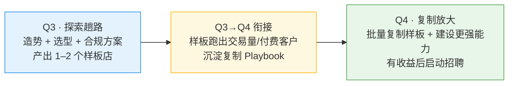

# 2026 H2 计划（越南市场）· 商业产品经理

> 日期：2026-06-27 ｜ 文档类型：H2 计划 / 背景
> 关联：`ex-three-layer-solution.md`（EX 四层架构）、`招人时机说明与建议.md`、`商业化产品季度绩效考核`（Q3 考核表）
> 一句话：**H2 主战场 = 越南。Q3 探索趟路（找出 1–2 个样板），Q4 开始复制化并建设更强能力。**

---

## 一、背景与定位

- **我的角色**：商业产品经理 —— 负责出商业化方案、定业务方向、找变现路径（不直接管研发实现）。
- **H2 主战场**：聚焦**越南市场**，是 EX 四层架构的**第一个落地市场实例**（自有租户 + OTC SP 化 + 本地 PSP 接入 + 合规挂靠）。
- **节奏**：
  - **Q3 = 探索**：趟出一条路，**找出某类型的 1–2 个样板店**。
  - **Q4 = 复制**：把样板沉淀成**可复制的能力**，并建设更强的产品/合规/渠道能力。
- **招聘**：**先有业务、有收益，再招**更专业 / 国际化的商业产品经理（详见第七节，逻辑承接 `招人时机说明与建议.md`）。

---

## 二、老板的战略意图（要解决的问题）

| # | 意图                  | 含义                                                                                              |
| - | --------------------- | ------------------------------------------------------------------------------------------------- |
| 1 | **先造势**      | 在越南能找到的**支付机构、银行**，持续接触、持续讲方案 —— **一直讲讲讲**，建立存在感与势能         |
| 2 | **业务要上台面** | **不只做 OTC / U 商**这类业务，要找**更好、更能上台面、更可持续**的业务                            |
| 3 | **合规赋能**    | 帮 **U 商 / 承兑商**：如果他们要合规，给一套**合规方案**（把灰色承兑业务引向合规化）               |
| 4 | **样板优先**    | **Q3 找出某个类型的 1–2 个样板店**（先把一条路真正走通）                                           |
| 5 | **复制 + 建设** | **Q4 开始具备复制能力**，并在样板基础上**建设更强的能力**                                          |

> 主线：**造势引流 → 把"上台面 + 合规"作为差异化卖点 → Q3 做出 1–2 个样板 → Q4 复制放大 → 有收益后招人。**

---

## 三、H2 总目标与节奏

| 维度         | Q3（探索）                                           | Q4（复制）                                                     |
| ------------ | ---------------------------------------------------- | -------------------------------------------------------------- |
| **主题** | 趟路 —— 把一条路真正走通                              | 复制 —— 把走通的路批量化                                        |
| **关键交付** | 1–2 个**样板店** + 承兑商**合规方案** + 造势触点 | **复制 Playbook** + 能力建设 + 第 2~N 个客户                    |
| **造势** | 持续接触越南支付机构 / 银行，建立存在感               | 把样板案例当背书，转化更多机构合作                              |
| **业务质量** | 锁定"上台面"业务类型，验证可行                        | 围绕样板类型规模化                                             |
| **招聘** | 不招（先稳团队、先做出量）                            | 业务有收益后，定向招更专业 / 国际化商业 PM                      |

---

## 四、Q3：探索 · 趟出一条路

### 4.1 造势（一直讲讲讲）

- **对象**：越南本地**支付机构、银行**（如 BIDV 等）、持牌 PSP、潜在租户 / 大代理。
- **动作**：持续拜访 + 统一对外方案讲解（四层架构 + 资管 + 合规赋能的价值故事），形成"**EX 在越南很活跃、有完整方案**"的市场心智。
- **产出**：触点清单 + 意向漏斗（接触 → 深聊 → POC 意向 → 样板候选）。

### 4.2 业务选型（找"上台面"的业务）

- **不只做** OTC / U 商承兑（灰、易冻卡、不上台面）。
- **候选"上台面"方向**（择优验证 1–2 类）：
  - **跨境贸易收付**：如中越生鲜（榴莲 / 海鲜）进口供应链支付与垫资（见相关方案），有真实贸易背景、有单据、可合规。
  - **本地收单 / VietQR·NAPAS** 接入的合规收款。
  - **持牌 SP（如 AB）** 同名 VA + 客资大账户的合规资金服务。
- **判断标准**：有真实业务背景、可出具单据、可结汇 / 付汇合规、可持续、可复制。

### 4.3 承兑商合规方案（把灰色引向合规）

- **目标**：给要合规的 U 商 / 承兑商一套**合规化路径**，把它们从"非持牌 OTC"升级为**合规 SP**。
- **抓手**（呼应四层架构 §2.2 与越南合规挂靠）：
  - **岘港沙盒 / 持牌挂靠**：解决展业合法性。
  - **KYC / KYT / AML 工具**：地址 / 交易风险筛查，反洗钱合规。
  - **白牌 OTC SP 系统**：报价锁价 + 订单 + 入金感知 + 自动承兑 + 主子账户 + 对账（把手搓升级为系统化、可审计）。
  - **品牌切割与责任边界**：隔离 OTC 合规风险，避免牵连 EX / 租户品牌。

### 4.4 样板店：1–2 个（Q3 核心交付）

- **定义**：选定 1–2 个**某一类型**客户（贸易收付样板 / 合规承兑样板 / 持牌 SP 样板择一二），把全链路真正跑通并产生**交易量与付费**。
- **跑通标准**：能稳定出 / 入金、有真实交易量、客户愿意付费、流程可被记录复用。
- **意义**：样板 = Q4 复制的母版，也是对外造势最有力的背书。

---

## 五、Q4：复制 · 建设更强能力

- **复制 Playbook**：把样板店的"客户画像 → 方案 → 对接清单 → 合规配置 → 上线 → 对账"沉淀成标准化复制手册，缩短第 2~N 个客户的落地周期。
- **能力建设**：围绕样板类型补强产品能力（渠道聚合、资管、合规工具、结汇 / 换汇等），从"能跑通"升级到"跑得好、规模化"。
- **复制目标**：在样板类型上扩展到更多客户 / 机构，把 Q3 的"点"扩成 Q4 的"面"。
- **招聘启动**：业务有了稳定收益后，**定向招更专业 / 国际化的商业产品经理**承接放大（见第七节）。

---

## 六、与季度考核对齐（怎么拿分 / 拿奖金）

> 对齐 `商业化产品季度绩效考核`，确保 H2 动作直接落到考核项。

| 考核项                   | 权重 / 上限         | H2 对应动作                                                       |
| ------------------------ | ------------------- | ---------------------------------------------------------------- |
| **付费客户达成率** | 30%（封顶 36%）     | Q3 样板店转化为**付费客户**；Q4 复制扩量                          |
| **交易量达成率**   | 30%（封顶 36%）     | 样板店跑出**真实交易量（万 USD）**；Q4 规模化                     |
| **项目达成率**     | 40%·目标 60%（封顶 48%） | 样板项目**按期上线且达预期**（合规方案 / 白牌 SP / 收单接入）   |
| **加分项**         | 封顶 15%            | 落地项目**具备较强竞争优势**（上台面 + 合规差异化，≥300 万 USD） |
| **减分项**         | —                   | 避免"上线但需求被砍"（聚焦验证过的样板类型，少做废需求）          |

**奖金对齐**

- **可量化项目**：按项目**前 6 个月交易量 × 毛利率 × 奖金比例（10%–15%）** 核算 → Q3 越早跑出样板交易量，奖金窗口越早开启。
- **不可量化项目**：按成果 / 难度 / 周期设 **1–10 万元奖金总包**（如合规方案、造势体系），CEO 审批。

---

## 七、招聘节奏

- **原则**（承接 `招人时机说明与建议.md`）：现在不招 —— 瓶颈是"没业务（没水）"，不是"人手不够（开口小）"。
- **触发条件**：越南某类样板**真正落地、有业务量 / 收益进来**后，再按业务量招人。
- **招什么人**：业务起步并有一定收益后，定向招**更专业 / 国际化的商业产品经理**，承接 Q4 复制与能力建设。
- **顺序**：先稳团队 → Q3 跑出样板与业务量 → 有收益后按需补人（岗位能自己养活自己）。

---

## 八、关键里程碑与风险

**里程碑**

- [ ] Q3：越南支付机构 / 银行造势触点与意向漏斗成型。
- [ ] Q3：完成承兑商**合规方案** v1。
- [ ] Q3：选定并跑通 **1–2 个样板店**（有交易量 + 付费）。
- [ ] Q4：输出**复制 Playbook**，落地第 2~N 个客户。
- [ ] Q4：业务有收益后启动**招聘**。

**风险**

- **业务质量风险**：避免又回到纯 OTC / U 商灰色业务 —— 以"上台面 + 合规"为硬标准。
- **合规风险**：承兑合规方案需明确牌照挂靠 / 沙盒、KYT/AML、品牌切割与责任边界。
- **团队脆弱**：关键人岗（收付款暂代、清结算级别、资管稳定性）需先稳住，避免样板期断档。
- **聚焦风险**：Q3 资源集中在 1–2 类样板，不平摊到所有方向。
