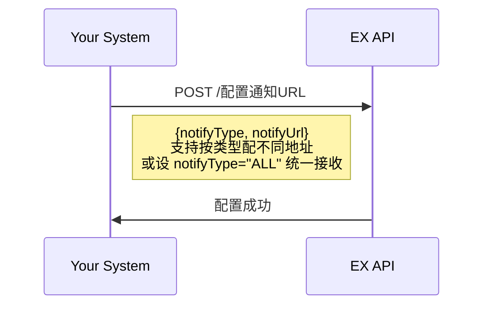
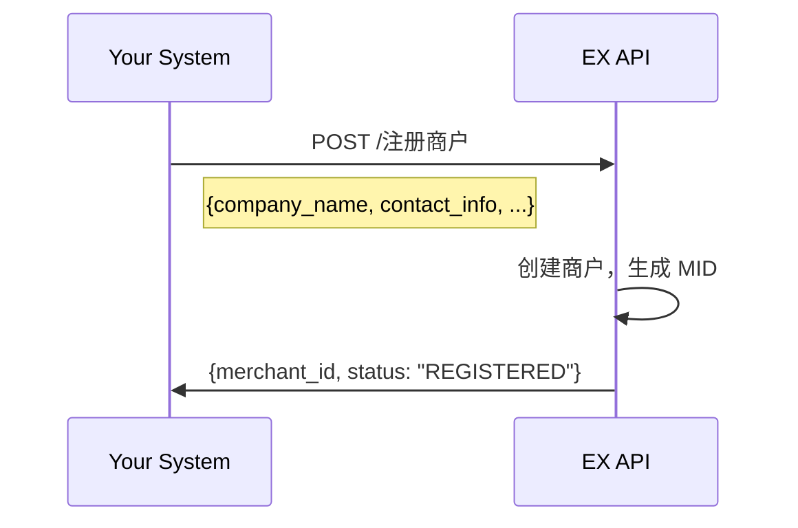
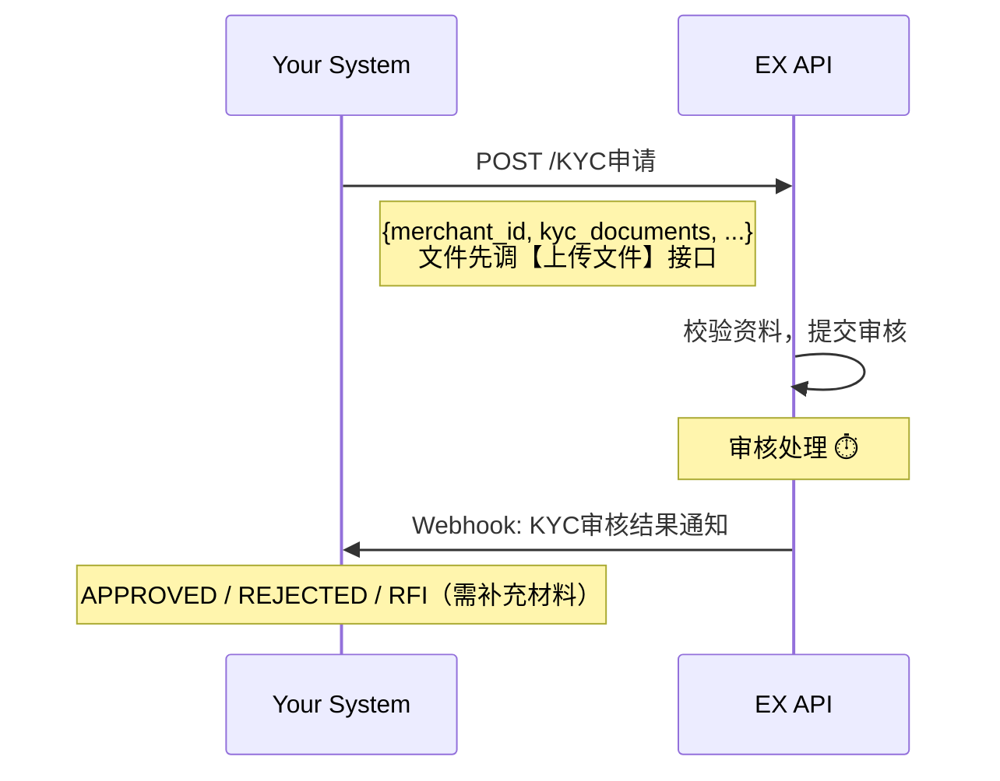
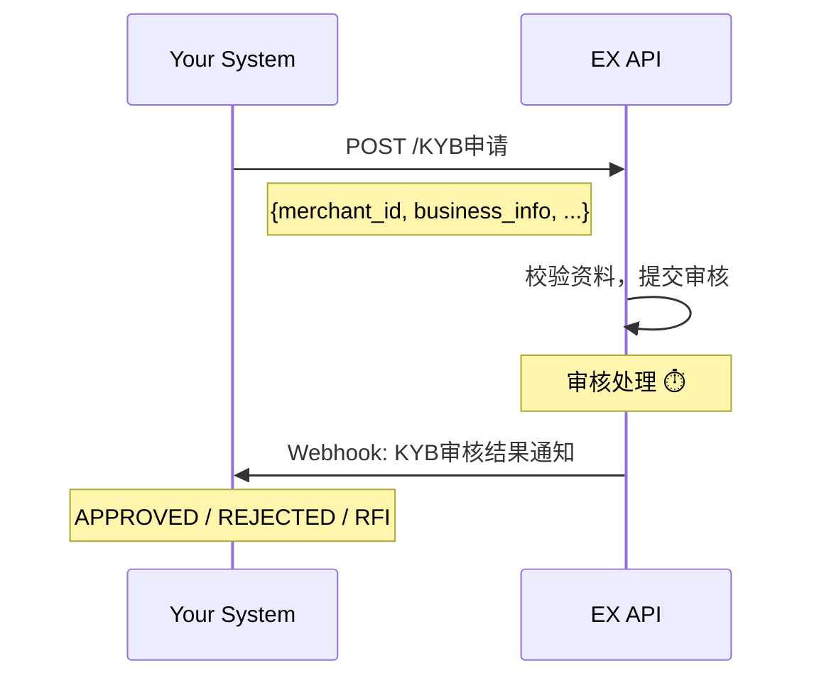
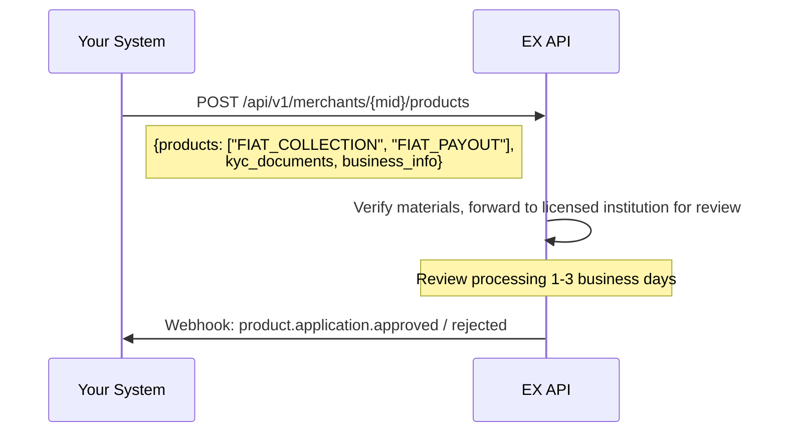
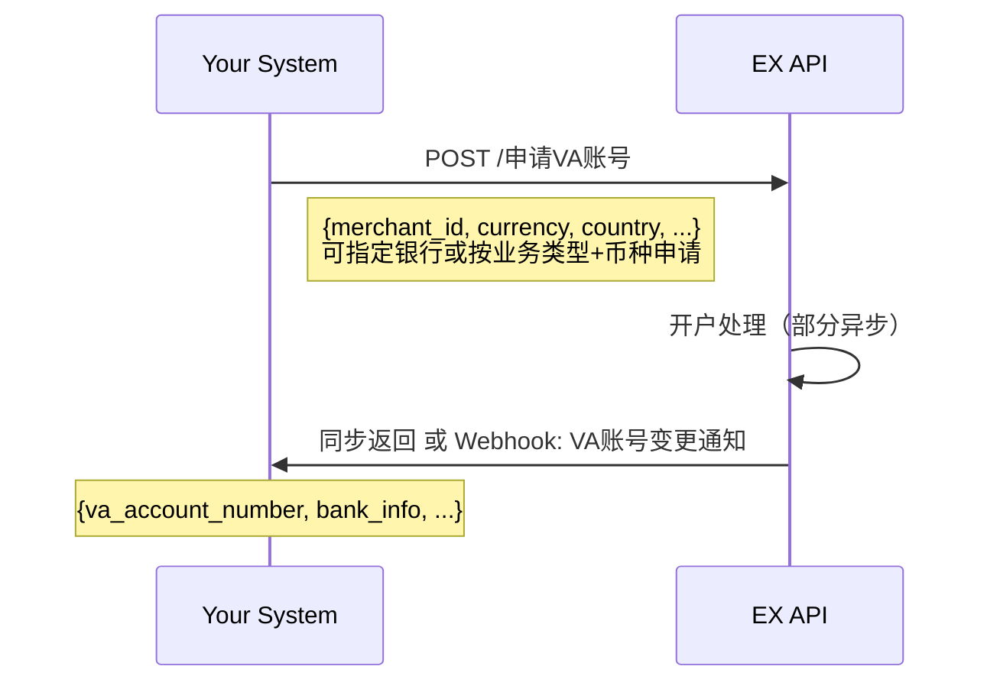
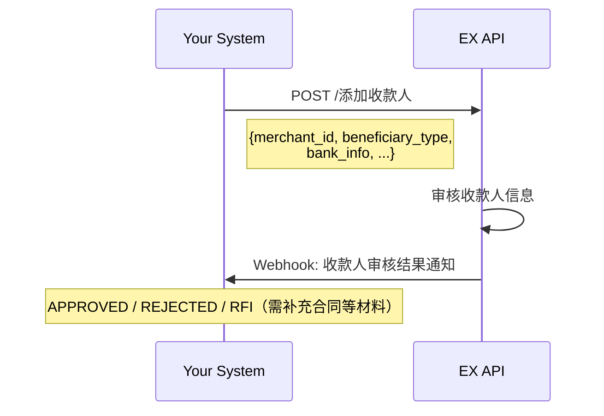
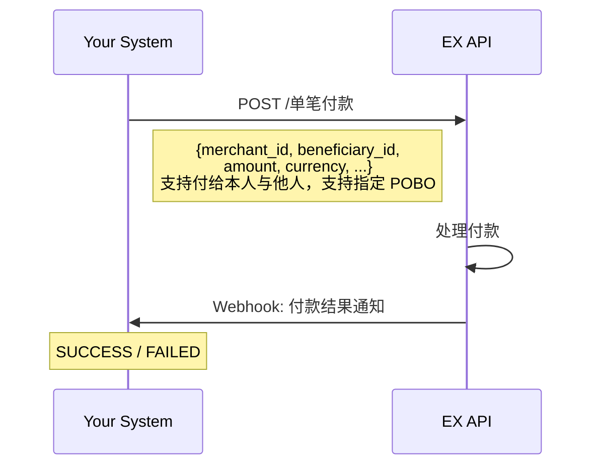
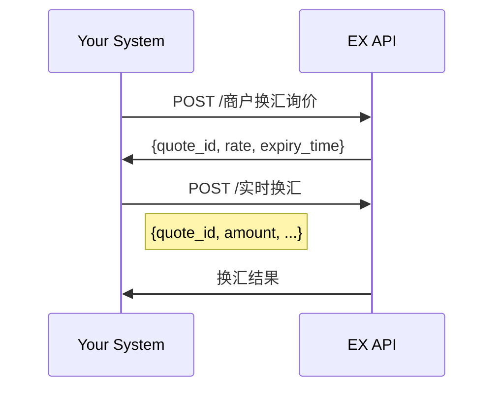

# EX Web2 Solution（法币收付款）

> **Document Type**: Solution Guide
> **Version**: v1.0
> **Last Updated**: 2026-04-07
> **API Reference**: [EurewaX 开放平台](https://open.eurewax.com/)

---

## Overview

EX Web2 Solution 为您提供**一站式法币收付款能力**，通过标准化的 RESTful API 和实时 Webhook 通知，您可以将完整的跨境法币收付能力快速集成到自有平台中。

**核心价值：**

- **全链路覆盖** — 全球收款、全球付款、换汇等一套 API 全部搞定
- **合规无忧** — 一次提交商户资料，EX 统一管理 KYC/KYB 审核流程并同步结果，您无需单独对接合规机构
- **账户体系完整** — 多币种法币账户，支持结汇等场景
- **灵活编排** — 各接口可按您的业务逻辑自由组合调用，适配不同平台架构

**适用客户：**

| 客户类型                      | 场景                                                        |
| ----------------------------- | ----------------------------------------------------------- |
| **跨境电商平台**        | 为卖家提供本地/全球VA结算账户、付款给供应商、结汇到中国大陆 |
| **跨境支付平台**        | 已有商户管理系统，需接入法币收付能力                        |
| **Fintech / BaaS 平台** | 为终端客户提供白标跨境法币收付服务                          |
| **外贸 B2B 平台**       | 为买卖双方提供货款收付、换汇、人民币结汇能力                |

---

## 1. 平台介绍

### 1.1 EurewaX 开放平台是什么？

EurewaX 开放平台是 EX 面向合作方开放的标准化 API 平台，Web2 Solution 涵盖以下核心业务模块：

| 模块               | 能力                               | 典型场景                           |
| ------------------ | ---------------------------------- | ---------------------------------- |
| **入网服务** | 商户注册、KYC/KYB 审核             | 商户进件、合规审核                 |
| **法币收款** | VA 账号、收款店铺管理、收款入账    | 跨境电商平台收款、外贸收款         |
| **法币付款** | 收款人管理、单笔付款、结汇额度管理 | 供应商付款、员工薪资、结汇到人民币 |
| **外汇服务** | 查询汇率、询价锁汇、实时换汇       | 多币种兑换、汇率锁定               |

### 1.2 技术规范

| 项目     | 说明                                                              |
| -------- | ----------------------------------------------------------------- |
| 协议     | HTTPS                                                             |
| 接口风格 | RESTful API                                                       |
| 数据格式 | JSON                                                              |
| 认证方式 | 商户 Token（通过认证服务获取）                                    |
| 安全机制 | 签名验签 + 敏感数据加密                                           |
| 异步通知 | Webhook（支持按通知类型配置不同回调地址，或统一地址接收所有通知） |

---

## 2. 名词解释

| 术语     | 英文                        | 说明                                     | 粤语（广东话） |
| -------- | --------------------------- | ---------------------------------------- | -------------- |
| 商户     | Merchant                    | 您平台上的终端客户，通过 EX 获得支付能力 | 商戶           |
| MID      | Merchant ID                 | EX 为每个商户分配的唯一标识              | —             |
| VA       | Virtual Account             | 虚拟收款账户，用于接收全球汇款           | 虛擬賬戶       |
| POBO     | Payment on Behalf of        | 代付，以商户名义向第三方付款             | 代付           |
| 收款人   | Beneficiary                 | 付款的接收方（个人或企业）               | 收款人         |
| 结汇     | Foreign Exchange Settlement | 将外币兑换为人民币                       | 結匯           |
| 结汇额度 | FX Settlement Quota         | 审核通过后生成的可结汇金额（CNY）        | 結匯額度       |
| KYC      | Know Your Customer          | 个人身份合规核验                         | —             |
| KYB      | Know Your Business          | 企业主体合规核验                         | —             |
| RFI      | Request for Information     | 审核过程中要求补充材料的通知             | —             |
| Webhook  | —                          | EX 主动推送事件通知到您系统的机制        | —             |

---

## 3. Architecture Overview

您的系统通过 EX API 接入，EX 负责统一的接口封装、审核流程编排、状态同步和事件通知。

```
┌──────────────────────────────────────────────────────────────────┐
│                       Your System                                │
│    (Payment Platform / E-commerce / BaaS / Fintech)              │
└──────────────────┬───────────────────────────────────────────────┘
                   │  RESTful API + Webhook
                   ▼
┌──────────────────────────────────────────────────────────────────┐
│                     EurewaX 开放平台                              │
│                                                                  │
│  ┌──────────┐  ┌──────────┐  ┌──────────┐  ┌──────────┐       │
│  │ 入网服务  │  │ 法币收款  │  │ 法币付款  │  │ 外汇服务  │       │
│  │ KYC/KYB  │  │ VA/店铺   │  │ POBO/结汇 │  │ 询价/换汇 │       │
│  └──────────┘  └──────────┘  └──────────┘  └──────────┘       │
│                                                                  │
│  ┌──────────┐  ┌──────────┐                                      │
│  │ 公共服务  │  │ Webhook  │                                      │
│  │ 文件/认证 │  │ 事件通知  │                                      │
│  └──────────┘  └──────────┘                                      │
└──────────────────────────────────────────────────────────────────┘
```

**调用链路：**

```
Your System → EX API → EX 处理（审核编排 + 业务执行）→ Webhook 通知 → Your System
```

> **提示**：您可根据自身平台的产品设计，在合适的业务节点调用对应接口。以下流程不要求严格按顺序一次性完成。

---

## 4. 前置流程 — Prerequisite

完成业务操作前的准备工作：公共服务配置、商户注册、KYC/KYB 审核。

---

### 4.1 公共服务配置 — Common Services

在开始业务对接前，完成以下基础配置：

#### 4.1.1 配置 Webhook 通知地址



#### 4.1.2 文件上传

后续 KYC/KYB、结汇材料等需上传附件时，统一先调用文件上传接口，再将返回的 URL 放入业务请求中。

```
上传流程：
    1. 调用【上传文件】接口 → 获取文件 URL
    2. 将文件 URL 放入业务接口请求（KYC/KYB/结汇材料等）
```

#### 4.1.3 获取商户 Token

对于需要跳转 EX 前端页面的场景，先获取 Token 再传入前端页面。

---

### 4.2 商户注册 — Merchant Registration

在 EX 平台创建您的终端商户，获取唯一商户标识（MID）。



---

### 4.3 KYC 审核 — Know Your Customer

提交商户的 KYC 信息和材料，审核通过后才能发起业务请求。



**关键说明：**

- KYC 审核通过后可开通对应业务线（如外贸收款、平台收款）
- 审核期间可能触发 **RFI**，要求补充材料
- 可通过 API 主动查询审核结果，也可被动等待 Webhook 通知
- KYC 模板详见 [附录 - KYC模板](https://open.eurewax.com/kyc%E6%A8%A1%E6%9D%BF-6985923m0)

---

### 4.4 KYB 审核 — Know Your Business

如需开通额外业务线，提交 KYB 申请。



**关键说明：**

- 如 KYC 已开通外贸收款业务线，需再开通平台收款业务线，通过 KYB 接口单独申请
- KYB 模板详见 [附录 - KYB模板](https://open.eurewax.com/kyb%E6%A8%A1%E6%9D%BF-6985924m0)

---

### 4.5 Product Activation

Apply for fiat payment products for the merchant. You only need to submit merchant materials, EX will forward to licensed compliance institution for review, and the result will be notified via Webhook.



**Key Points:**

- Review includes: merchant entity compliance, business scenario compliance, KYB/KYC verification (completed by licensed compliance institution)
- During review, **RFI** may be triggered requesting additional materials
- You can call this flow at user registration, onboarding review, or first use of fiat payment features based on your platform design

**Product Types:**

| Product Code            | Description       | Notes                                                                                              |
| ----------------------- | ----------------- | -------------------------------------------------------------------------------------------------- |
| `FIAT_COLLECTION` | Fiat Collection   | Includes VA account, collection shop management, collection entry                                  |
| `FIAT_PAYOUT`     | Fiat Payout       | Includes beneficiary management, single payout, FX settlement quota                                |

**Special Process Notes:**

1. **Collection Type Distinction**: Currently distinguishes between foreign trade collection (cross-border B2B) and platform collection (e-commerce platform). If a merchant already has foreign trade collection and wants to open platform collection, please contact operations. This distinction is expected to be removed in Q3.
2. **FX Settlement to Mainland China**: For foreign trade collection with settlement to mainland China, order detail requirements are being optimized, expected to go live by end of May.

---

## 5. Fiat Services

商户完成入网审核后，即可使用法币收款、付款、换汇、账户管理等能力。

---

### 5.1 收款服务 — Collection

#### 5.1.1 收款店铺管理

适用于电商平台收款场景，将店铺与 VA 账号关联。

| 接口           | 说明                   |
| -------------- | ---------------------- |
| 获取平台站点   | 获取支持的电商平台列表 |
| 添加店铺持有人 | 绑定店铺所有者信息     |
| 绑定店铺       | 将店铺与商户关联       |
| 查询店铺信息   | 查询已绑定的店铺信息   |

#### 5.1.2 VA 账号服务

为商户申请虚拟收款账户（VA），用于接收全球汇款。



| 接口            | 说明                                               |
| --------------- | -------------------------------------------------- |
| 申请 VA 账号    | 可指定银行或按业务类型/币种/国家申请，部分异步开户 |
| 下载开户凭证    | 获取 VA 账户的开户凭证文件                         |
| 查询 VA 账号    | 查询申请进度及账户详细信息                         |
| VA 账号变更通知 | Webhook 推送 VA 状态变更                           |

#### 5.1.3 收款交易处理

VA 收到入账后，EX 通过 Webhook 推送收款入账通知。

```
Webhook: 收款入账通知
    └── {merchant_id, amount, currency, sender_info, ...}
```

> 收款为被动入账，无需您主动调用接口。系统会自动处理并推送通知。

---

### 5.2 付款服务 — Payout

#### 5.2.1 收款人管理

付款前需先添加收款人（支持个人和企业）。



| 接口               | 说明                                               |
| ------------------ | -------------------------------------------------- |
| 添加收款人         | 支持个人和企业，审核期间可能要求补充合作合同等材料 |
| 删除收款人         | 删除已添加的收款人                                 |
| 查询收款人审核结果 | 主动查询审核状态                                   |
| 收款人审核结果通知 | Webhook 推送审核结果                               |

#### 5.2.2 付款交易处理

向已审核通过的收款人发起付款。



#### 5.2.3 结汇额度管理

如需将外币结汇为人民币（CNY），需先上传结汇材料审核通过后，才能使用结汇额度。

```
结汇流程：
    1. 上传结汇材料 → 等待审核
    2. 审核通过 → 生成结汇额度（CNY）
    3. 查询结汇额度（注意：额度随汇率实时波动）
    4. 发起结汇付款
```

| 接口                 | 说明                                               |
| -------------------- | -------------------------------------------------- |
| 上传结汇材料         | 如入账后不做结汇只做跨境付款，无需上传             |
| 查询结汇材料审核结果 | 主动查询审核状态                                   |
| 结汇材料审核结果通知 | Webhook 推送审核结果                               |
| 查询结汇额度         | 结汇额度随市场汇率实时波动，请结汇前先查询最新额度 |

> **重要**：结汇额度会随市场汇率实时波动，结汇时请先查询最新额度，避免结汇失败。

---

### 5.3 外汇服务 — FX

| 接口         | 说明                   |
| ------------ | ---------------------- |
| 查询商户汇率 | 查询实时汇率，不锁定   |
| 商户换汇询价 | 单笔换汇询价，锁定汇率 |
| 实时换汇     | 基于锁定的汇率执行换汇 |



---

### 5.4 交易查询 — Transaction Query

| 接口         | 说明                   |
| ------------ | ---------------------- |
| 收款交易详情 | 查询收款入账交易       |
| 付款交易详情 | 查询付款交易           |
| 换汇交易详情 | 查询换汇交易           |
| 下载交易凭证 | 目前仅支持付款交易凭证 |
| 查询交易详情 | 通用交易详情查询       |

---

## 6. Webhook Events Summary

请配置 Webhook 接收地址，EX 会在以下事件发生时主动推送通知：

| 事件类别           | 事件                       | 触发时机         |
| ------------------ | -------------------------- | ---------------- |
| **入网审核** | KYC 审核结果通知           | KYC 审核完成     |
|                    | KYB 审核结果通知           | KYB 审核完成     |
| **产品开通** | 产品审核通过通知           | 产品审核通过     |
|                    | 产品审核拒绝通知           | 产品审核拒绝     |
|                    | 产品审核 RFI 通知          | 需要补充材料     |
| **法币收款** | VA 账号变更通知            | VA 状态变更      |
|                    | 收款入账通知         | VA 收到入账      |
| **法币付款** | 收款人审核结果通知   | 收款人审核完成   |
|                    | 付款结果通知         | 付款处理完成     |
|                    | 结汇材料审核结果通知 | 结汇材料审核完成 |

---

## 7. API Capability Summary

完整的 Web2 法币 API 能力矩阵：

| 模块                | 子模块   | 接口                                                    | 类型    |
| ------------------- | -------- | ------------------------------------------------------- | ------- |
| **公共服务**  | 事件通知 | 配置通知URL                                             | API     |
|                     | 文件服务 | 上传文件 / 补充业务材料                                 | API     |
|                     | 认证服务 | 获取商户Token                                           | API     |
| **入网服务**  | 商户入网 | 注册商户                                                | API     |
|                     |          | KYC申请 / 查询KYC审核结果                               | API     |
|                     |          | KYB申请 / 查询KYB审核结果                               | API     |
|                     |          | KYC/KYB审核结果通知                                     | Webhook |
| **产品开通**  | 产品申请 | 申请开通产品 / 查询产品审核结果                         | API     |
|                     |          | 产品审核结果通知 / 产品审核 RFI 通知                    | Webhook |
| **法币-收款** | 店铺管理 | 获取平台站点 / 添加店铺持有人 / 绑定店铺 / 查询店铺信息 | API     |
|                     | VA账号   | 申请VA账号 / 下载开户凭证 / 查询VA账号                  | API     |
|                     |          | VA账号变更通知                                          | Webhook |
|                     | 收款交易 | 收款入账通知                                            | Webhook |
| **法币-付款** | 收款人   | 添加/删除/查询收款人                                    | API     |
|                     |          | 收款人审核结果通知                                      | Webhook |
|                     | 付款交易 | 单笔付款                                                | API     |
|                     |          | 付款结果通知                                            | Webhook |
|                     | 结汇额度 | 查询结汇额度 / 上传结汇材料 / 查询结汇材料审核结果      | API     |
|                     |          | 结汇材料审核结果通知                                    | Webhook |
| **法币-外汇** | —       | 查询商户汇率 / 商户换汇询价 / 实时换汇                  | API     |
| **法币-查询** | 交易详情 | 收款/付款/换汇交易详情                                  | API     |
|                     |          | 下载交易凭证 / 查询交易详情                             | API     |

---

## 8. Integration Best Practices

| # | 建议                       | 说明                                                               |
| - | -------------------------- | ------------------------------------------------------------------ |
| 1 | **Webhook 优先**     | 以 Webhook 事件驱动为主，API 轮询为辅，减少不必要的 API 调用       |
| 2 | **幂等处理**         | 同一事件可能重复推送，请基于业务订单号做幂等校验                   |
| 3 | **签名验证**         | 所有 Webhook 请求需验签确保来源合法                                |
| 4 | **异步设计**         | 入网审核、付款等均为异步处理，提交后通过 Webhook 获取最终结果      |
| 5 | **及时响应 RFI**     | KYC/KYB/收款人审核期间可能要求补充材料，超时未响应可能导致审核失败 |
| 6 | **结汇额度实时查询** | 结汇额度随市场汇率波动，结汇前务必查询最新额度                     |
| 7 | **文件先上传**       | 所有附件材料需先调用文件上传接口获取 URL，再放入业务请求           |
| 8 | **灵活编排**         | 各步骤可根据您的平台设计灵活编排调用时机，无需严格按顺序执行       |

---

## 9. Typical Integration Timeline

| 阶段                   | 内容                                      | 预估周期 |
| ---------------------- | ----------------------------------------- | -------- |
| **环境准备**     | 获取 API Key、配置 Webhook 地址、联调环境 | 1-2 天   |
| **前置流程**     | 对接商户注册 + KYC/KYB 审核 + 产品开通接口 | 3-5 天   |
| **法币核心流程** | 对接 VA 收款、付款、换汇接口              | 7-10 天  |
| **联调测试**     | 端到端流程验证、异常场景覆盖              | 5-7 天   |
| **上线**         | 生产环境切换、监控配置                    | 1-2 天   |

> 总计约 **3-4 周**，视技术团队规模和平台复杂度可调整。

---

## 10. Getting Started

准备开始接入？请联系您的 EX 客户经理获取：

1. **Sandbox 环境** — API Key + 测试环境地址（详见 [环境参数](https://open.eurewax.com/%E7%8E%AF%E5%A2%83%E5%8F%82%E6%95%B0-6918053m0)）
2. **API 文档** — 完整的接口参考文档（[EurewaX 开放平台](https://open.eurewax.com/)）
3. **联调指南** — 整体联调流程（详见 [整体流程](https://open.eurewax.com/%E6%95%B4%E4%BD%93%E6%B5%81%E7%A8%8B-6918052m0)）
4. **技术支持** — 专属对接群 + 技术支持工程师
