# EX Platform - Users, Roles & Permissions PRD

## 文档概述

本文档定义 EX Platform 的用户角色权限系统（RBAC），涵盖组织与商户的两层结构、自定义角色、三层权限模型（页面 + 操作 + 数据），以及用户管理功能。

**核心设计理念：**

- ✅ **Organisation → MID 两层结构**：数据模型一步到位，功能分期交付
- ✅ **自定义角色**：本期只支持自定义角色，不提供预设角色模板
- ✅ **多角色支持**：一个 User 在同一个 MID 下可拥有多个角色
- ✅ **三层权限**：页面权限（模块级）+ 操作权限（CRUD级）+ 数据权限（资源实例级）
- ✅ **多企业**：一个 User 可被分配多个企业（MID）的权限

**关联文档：** [Users.md](./Users.md)（用户系统 PRD）

---

## 目录

1. [系统架构概览](#1-系统架构概览)
2. [模块总览与 Scope](#2-模块总览与-scope)
3. [Organisation → MID 两层结构](#3-organisation--mid-两层结构)
4. [角色体系](#4-角色体系)
5. [三层权限模型](#5-三层权限模型)
6. [权限配置流程](#6-权限配置流程)
7. [用户管理](#7-用户管理)
8. [Use Case](#8-use-case)
9. [鉴权流程](#9-鉴权流程)
10. [状态机](#10-状态机)

---

## 1. 系统架构概览

### 1.1 整体架构

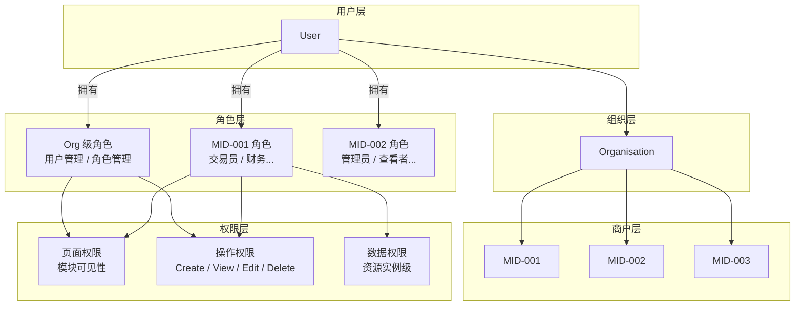

### 1.2 核心实体关系

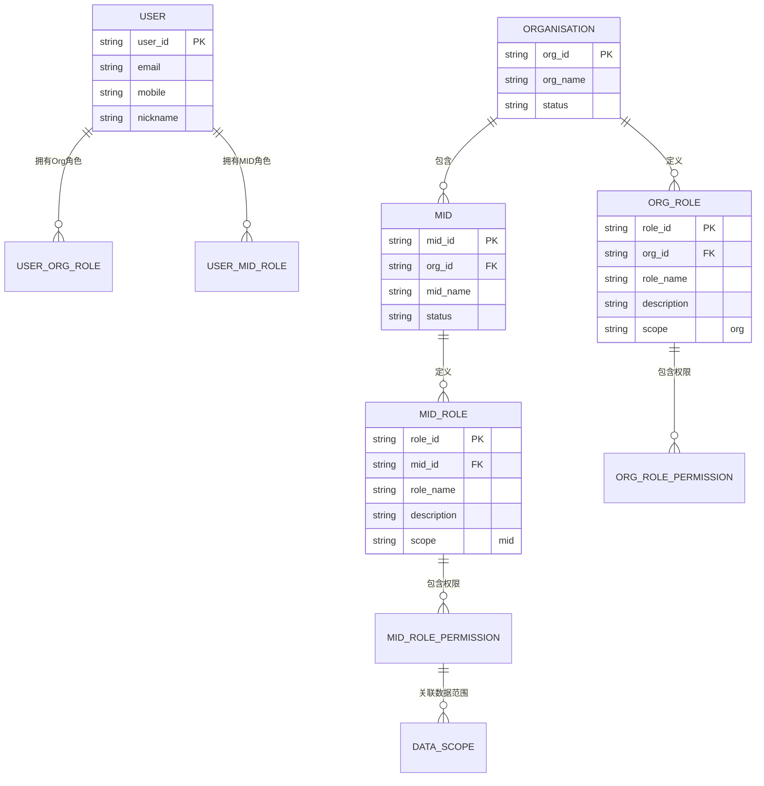

---

## 2. 模块总览与 Scope

### 2.1 本期 Scope

| 维度                | In Scope                                                                                 | Out of Scope                                                                  |
| ------------------- | ---------------------------------------------------------------------------------------- | ----------------------------------------------------------------------------- |
| **组织结构**  | Organisation → MID 两层数据模型                                                         | 多级组织树（Org → Sub-Org → MID）                                           |
| **角色**      | 自定义角色（Org级 + MID级）``一个User可拥有多个角色``一个User可在多个MID下 | 预设角色模板（Owner/Admin/Member等）``角色继承（子角色继承父角色权限） |
| **页面权限**  | 按模块控制可见性                                                                         | 按子菜单/按钮级控制                                                           |
| **操作权限**  | 按模块 × 操作类型（Create/View/Edit/Delete/Manage）                                     | 字段级权限（如某角色只能编辑部分字段）                                        |
| **数据权限**  | 资源实例级（如指定共享账户）``区分"自己的"vs"所有"                                | 数据 Location 权限（按国家/地区过滤数据）``时间范围权限                |
| **Org级权限** | 用户管理、角色管理                                                                       | 创建MID、全局报表、全局设置（后期）                                           |
| **用户管理**  | 邀请用户、分配角色、用户状态管理                                                         | Department / Location / Employment type / Manager 字段``HRIS 集成      |
| **工作台**    | 根据权限动态生成/配置                                                                    | —                                                                            |

### 2.2 分期规划

```
V1（本期）：
├── Organisation → MID 两层数据模型
├── 自定义角色（Org级 + MID级）
├── 三层权限：页面（模块级）+ 操作 + 数据
├── Org级权限：用户管理、角色管理
├── MID级权限：按模块配置（框架，模块列表待确定）
├── 用户管理：邀请、状态、角色分配
└── 工作台根据权限动态生成

V2（后期）：
├── 预设角色模板
├── Org级权限扩展：创建MID、全局报表
├── 更多数据权限场景
├── 数据 Location 权限
├── 审批流（操作审批）
└── Department / Manager 等组织字段
```

---

## 3. Organisation → MID 两层结构

### 3.1 结构说明

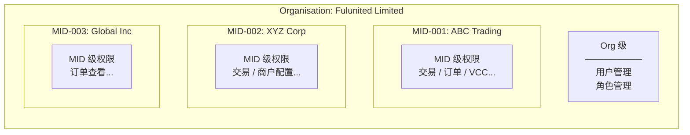

### 3.2 Org 级 vs MID 级

| 维度               | Org 级                           | MID 级                           |
| ------------------ | -------------------------------- | -------------------------------- |
| **作用范围** | 跨所有 MID                       | 仅限当前 MID                     |
| **本期权限** | 用户管理、角色管理               | 页面 + 操作 + 数据权限           |
| **角色定义** | 在 Org 下创建                    | 在 MID 下创建                    |
| **典型角色** | Org Admin（管理所有用户和角色）  | 交易员、财务、查看者等           |
| **谁能配置** | Org 级角色中有"角色管理"权限的人 | MID 级角色中有"角色管理"权限的人 |

### 3.3 User 在两层结构中的关系

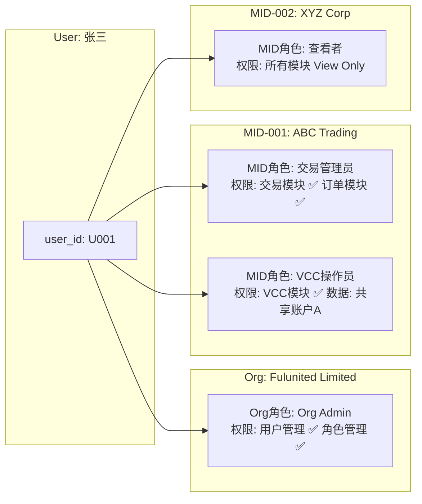

**说明：**

- 张三在 Org 级有 `Org Admin` 角色 → 可以管理用户和角色
- 张三在 MID-001 下有两个角色：`交易管理员` + `VCC操作员` → 权限取并集
- 张三在 MID-002 下有 `查看者` 角色 → 只能查看
- 多角色权限合并规则：**取并集（Union）**，即任一角色有该权限就生效

---

## 4. 角色体系

### 4.1 角色分类

| 分类                       | 说明                                        | 本期支持 |
| -------------------------- | ------------------------------------------- | -------- |
| **Org 级自定义角色** | 在 Organisation 下创建，控制 Org 级权限     | ✅       |
| **MID 级自定义角色** | 在 MID 下创建，控制 MID 级权限              | ✅       |
| **预设角色模板**     | 系统预设的角色（如 Owner / Admin / Viewer） | ❌ 后期  |

### 4.2 创建自定义角色流程

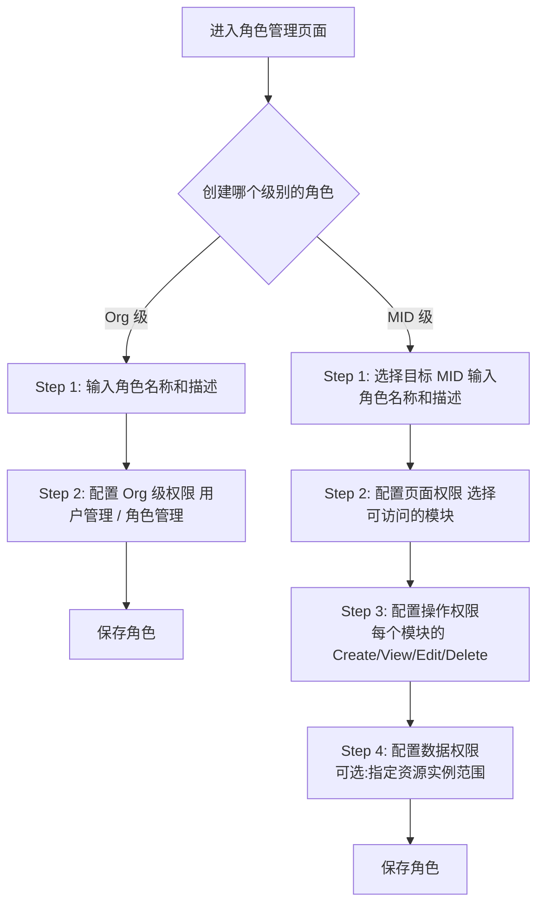

### 4.3 角色属性

| 属性                      | 说明                       |
| ------------------------- | -------------------------- |
| **role_id**         | 唯一标识                   |
| **role_name**       | 角色名称（如"交易管理员"） |
| **description**     | 角色描述（可选）           |
| **scope**           | `org` 或 `mid`         |
| **org_id / mid_id** | 所属 Organisation 或 MID   |
| **permissions**     | 该角色拥有的权限列表       |
| **created_by**      | 创建人                     |
| **created_at**      | 创建时间                   |
| **status**          | Active / Disabled          |

### 4.4 多角色权限合并

一个 User 在同一个 MID 下可拥有多个角色，权限合并规则：

```
最终权限 = Org角色权限 ∪ MID角色1权限 ∪ MID角色2权限 ∪ ...
```

**示例：**

```
User 张三 在 MID-001 下有两个角色：

角色A "交易员":
  页面权限: 订单中心 ✅
  操作权限: 订单 → View ✅, Create ✅
  数据权限: 所有订单

角色B "VCC操作员":
  页面权限: VCC模块 ✅
  操作权限: VCC → View ✅, Create ✅, Edit ✅
  数据权限: 仅共享账户A

合并后张三的权限:
  页面权限: 订单中心 ✅, VCC模块 ✅
  操作权限: 订单 → View ✅, Create ✅
             VCC → View ✅, Create ✅, Edit ✅
  数据权限: 订单 → 所有
             VCC → 仅共享账户A
```

---

## 5. 三层权限模型

### 5.1 权限层次

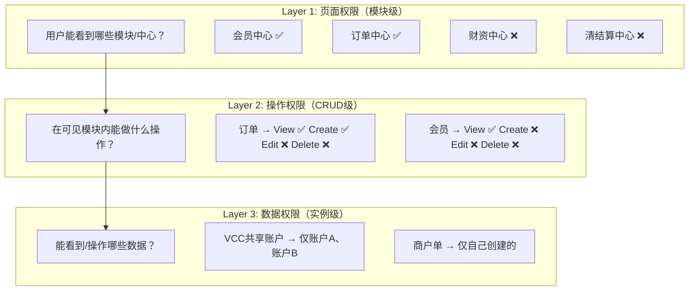

### 5.2 Layer 1: 页面权限（模块级）

控制用户能看到哪些模块/中心。不可见的模块在导航菜单中隐藏。

**权限粒度：模块/中心级**（不细到子菜单）

| 模块/中心    | 说明                         | 权限标识               |
| ------------ | ---------------------------- | ---------------------- |
| 会员中心     | 会员查询、会员管理、产品配置 | `module:member`      |
| 订单中心     | 商户单管理、交易背景         | `module:order`       |
| 财资中心     | 资金管理                     | `module:treasury`    |
| 渠道中心     | 渠道管理                     | `module:channel`     |
| 清结算中心   | 清算结算                     | `module:settlement`  |
| 数据中心     | 数据报表                     | `module:data`        |
| 工单中心     | 工单管理                     | `module:ticket`      |
| 产品中心     | 产品管理                     | `module:product`     |
| 产品市场     | 产品浏览                     | `module:marketplace` |
| 销售渠道中心 | 代理商管理                   | `module:sales`       |
| 用户管理     | 用户和角色管理（Org级）      | `module:user_mgmt`   |

> **注意：** 以上模块列表为框架，具体模块待确定后补充。工作台（Dashboard）所有人都有，但内容根据权限动态生成。

### 5.3 Layer 2: 操作权限（CRUD级）

在可见模块内，控制用户能执行哪些操作。

**标准操作类型：**

| 操作             | 标识       | 说明                             |
| ---------------- | ---------- | -------------------------------- |
| **View**   | `view`   | 查看/列表/详情                   |
| **Create** | `create` | 新建/发起                        |
| **Edit**   | `edit`   | 修改/更新                        |
| **Delete** | `delete` | 删除/作废                        |
| **Manage** | `manage` | 管理级操作（如配置、审核、分配） |
| **Export** | `export` | 导出数据                         |

**操作权限矩阵示例：**

```
模块: 订单中心
┌─────────────────┬──────┬────────┬──────┬────────┬────────┬────────┐
│ 资源              │ View │ Create │ Edit │ Delete │ Manage │ Export │
├─────────────────┼──────┼────────┼──────┼────────┼────────┼────────┤
│ 收款商户单        │  ☑   │   ☑    │  ☐   │   ☐    │   ☐    │   ☑   │
│ 付款商户单        │  ☑   │   ☑    │  ☐   │   ☐    │   ☐    │   ☑   │
│ 换汇商户单        │  ☑   │   ☐    │  ☐   │   ☐    │   ☐    │   ☐   │
│ VCC商户单         │  ☑   │   ☑    │  ☑   │   ☐    │   ☐    │   ☑   │
│ VA账户            │  ☑   │   ☐    │  ☐   │   ☐    │   ☐    │   ☐   │
│ 订单管理          │  ☑   │   ☑    │  ☑   │   ☐    │   ☑    │   ☑   │
│ 订单文件          │  ☑   │   ☑    │  ☐   │   ☐    │   ☐    │   ☐   │
│ 店铺管理          │  ☑   │   ☑    │  ☑   │   ☑    │   ☐    │   ☐   │
└─────────────────┴──────┴────────┴──────┴────────┴────────┴────────┘
```

> **注意：** 每个模块下的具体资源和操作待各模块确定后补充。以上为示例格式。

**权限标识格式：** `{scope}:{module}:{resource}:{action}`

```
示例:
mid:order:payin_order:view        — MID级，订单中心，收款商户单，查看
mid:order:payin_order:create      — MID级，订单中心，收款商户单，创建
org:user_mgmt:user:manage         — Org级，用户管理，用户，管理
mid:member:merchant_config:edit   — MID级，会员中心，商户配置，编辑
```

### 5.4 Layer 3: 数据权限（实例级）

控制用户能访问哪些具体数据实例。

**本期支持的数据权限类型：**

| 类型               | 说明                     | 示例                         |
| ------------------ | ------------------------ | ---------------------------- |
| **ALL**      | 可访问该资源的所有数据   | 查看所有商户单               |
| **OWN**      | 只能访问自己创建的数据   | 只看自己创建的商户单         |
| **ASSIGNED** | 只能访问被分配的特定实例 | 只能访问 VCC 共享账户 A 和 B |

**数据权限配置示例：**

```
角色: VCC操作员
├── 页面权限: VCC模块 ✅
├── 操作权限: VCC → View ✅, Create ✅, Edit ✅
└── 数据权限:
    ├── 类型: ASSIGNED
    └── 实例: [共享账户A, 共享账户B]

角色: 订单查看者
├── 页面权限: 订单中心 ✅
├── 操作权限: 订单 → View ✅（其他全 ❌）
└── 数据权限:
    ├── 类型: OWN
    └── 说明: 只能查看自己创建的订单
```

**数据权限配置流程：**

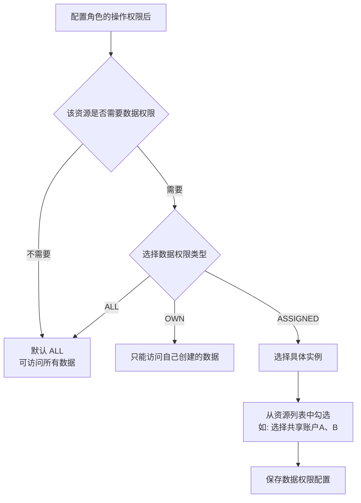

### 5.5 本期 Out of Scope 的数据权限

| 场景          | 说明                                            | 状态    |
| ------------- | ----------------------------------------------- | ------- |
| 数据 Location | 按国家/地区过滤数据（如只看某些国家的牌照数据） | ❌ 后期 |
| 时间范围      | 只能查看某时间段内的数据                        | ❌ 后期 |
| 金额范围      | 只能操作某金额范围内的交易                      | ❌ 后期 |
| 字段级        | 某些字段不可见或不可编辑                        | ❌ 后期 |

---

## 6. 权限配置流程

### 6.1 创建 Org 级角色

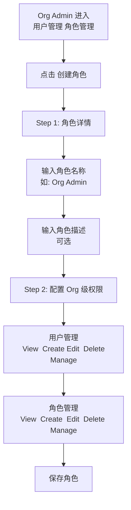

### 6.2 创建 MID 级角色

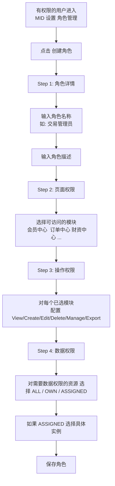

### 6.3 分配角色给用户

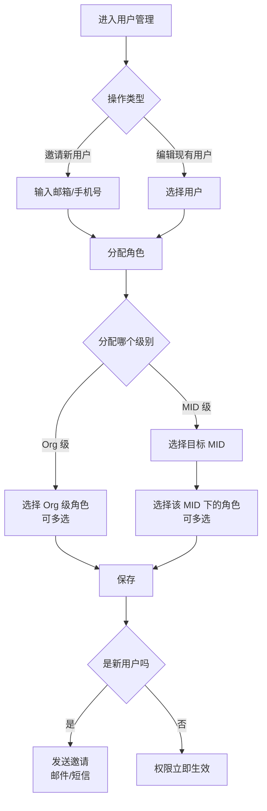

### 6.4 权限配置 UI 示意

**创建角色 - Step 2: 页面权限**

```
┌─────────────────────────────────────────────────────┐
│  Create role                                    ✕   │
│                                                     │
│  ● Enter role details  ✓                            │
│  ● Set up page permissions  ←                       │
│  ○ Set up action permissions                        │
│  ○ Set up data permissions                          │
│                                                     │
│  Select which modules this role can access:         │
│                                                     │
│  ☑ 会员中心     会员查询、会员管理、产品配置          │
│  ☑ 订单中心     商户单管理、交易背景                  │
│  ☐ 财资中心     资金管理                             │
│  ☐ 渠道中心     渠道管理                             │
│  ☐ 清结算中心   清算结算                             │
│  ☑ 数据中心     数据报表                             │
│  ☐ 工单中心     工单管理                             │
│  ☐ 产品中心     产品管理                             │
│  ☐ 产品市场     产品浏览                             │
│  ☐ 销售渠道中心  代理商管理                           │
│                                                     │
│                          [Back]  [Continue]          │
└─────────────────────────────────────────────────────┘
```

**创建角色 - Step 3: 操作权限**

```
┌─────────────────────────────────────────────────────┐
│  Create role                                    ✕   │
│                                                     │
│  ● Enter role details  ✓                            │
│  ● Set up page permissions  ✓                       │
│  ● Set up action permissions  ←                     │
│  ○ Set up data permissions                          │
│                                                     │
│  Configure actions for each selected module:        │
│                                                     │
│  ── 会员中心 ──────────────────────────────────      │
│  会员信息查询     ☑ View  ☐ Edit  ☐ Export          │
│  会员产品查询     ☑ View  ☐ Edit  ☐ Export          │
│  商户基本信息管理  ☑ View  ☑ Edit  ☐ Delete          │
│  商户产品配置     ☑ View  ☑ Edit  ☑ Manage          │
│                                                     │
│  ── 订单中心 ──────────────────────────────────      │
│  收款商户单       ☑ View  ☑ Create  ☐ Edit  ☑ Export│
│  付款商户单       ☑ View  ☑ Create  ☐ Edit  ☑ Export│
│  换汇商户单       ☑ View  ☐ Create  ☐ Edit  ☐ Export│
│  VCC商户单        ☑ View  ☑ Create  ☑ Edit  ☑ Export│
│  VA账户          ☑ View  ☐ Create  ☐ Edit  ☐ Export │
│  订单管理         ☑ View  ☑ Create  ☑ Edit  ☑ Manage│
│                                                     │
│                          [Back]  [Continue]          │
└─────────────────────────────────────────────────────┘
```

**创建角色 - Step 4: 数据权限**

```
┌─────────────────────────────────────────────────────┐
│  Create role                                    ✕   │
│                                                     │
│  ● Enter role details  ✓                            │
│  ● Set up page permissions  ✓                       │
│  ● Set up action permissions  ✓                     │
│  ● Set up data permissions  ←                       │
│                                                     │
│  Configure data access scope:                       │
│                                                     │
│  ── VCC ────────────────────────────────────         │
│  VCC共享账户                                         │
│  ○ All accounts    ● Assigned accounts               │
│                                                     │
│  Select accounts:                                   │
│  ☑ 共享账户 A (SA-001)                               │
│  ☑ 共享账户 B (SA-002)                               │
│  ☐ 共享账户 C (SA-003)                               │
│  ☐ 共享账户 D (SA-004)                               │
│                                                     │
│  ── 订单 ───────────────────────────────────         │
│  商户单                                              │
│  ○ All orders    ● Own orders only                   │
│                                                     │
│                          [Back]  [Save role]         │
└─────────────────────────────────────────────────────┘
```

---

## 7. 用户管理

### 7.1 用户管理功能概览

```
┌─────────────────────────────────────────────────────┐
│  User Management                    [+ Invite user] │
│                                                     │
│  ┌──────────────┐ ┌──────────────┐ ┌──────────────┐│
│  │ Invitation   │ │ User status  │ │              ││
│  │ Ready    0   │ │ Active    3  │ │              ││
│  │ Invited  1   │ │ Suspended 0  │ │              ││
│  │ Expired  0   │ │ Removed   0  │ │              ││
│  └──────────────┘ └──────────────┘ └──────────────┘│
│                                                     │
│  🔍 Search name or email                            │
│  [Roles ▾]  [Status ▾]                              │
│                                                     │
│  ┌─────────────────────────────────────────────────┐│
│  │ User              Roles           MIDs     ··· ││
│  ├─────────────────────────────────────────────────┤│
│  │ 张三              Org Admin       All      ··· ││
│  │ zhang@test.com    交易管理员(M1)              ││
│  ├─────────────────────────────────────────────────┤│
│  │ 李四              VCC操作员(M1)   MID-001  ··· ││
│  │ li@test.com       查看者(M2)     MID-002      ││
│  ├─────────────────────────────────────────────────┤│
│  │ 王五              [Invited]       —        ··· ││
│  │ wang@test.com                                   ││
│  └─────────────────────────────────────────────────┘│
└─────────────────────────────────────────────────────┘
```

### 7.2 邀请用户流程

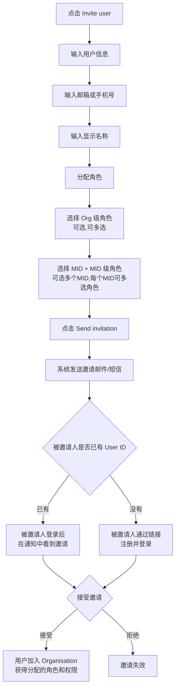

### 7.3 用户状态管理

| 状态                | 说明                   | 可执行操作                  |
| ------------------- | ---------------------- | --------------------------- |
| **Active**    | 正常使用               | Suspend / Remove / 修改角色 |
| **Suspended** | 暂停（保留数据和角色） | Activate / Remove           |
| **Removed**   | 已移除（角色清空）     | Re-invite                   |

**邀请状态：**

| 状态                         | 说明                 |
| ---------------------------- | -------------------- |
| **Ready to invite**    | 已创建但未发送邀请   |
| **Invited**            | 已发送邀请，等待接受 |
| **Invitation expired** | 邀请超过 7 天未接受  |

### 7.4 用户操作菜单（··· 按钮）

```
┌────────────────────┐
│ Edit roles         │
│ Suspend user       │
│ Remove user        │
└────────────────────┘
```

---

## 8. Use Case

### 8.1 角色管理 Use Case

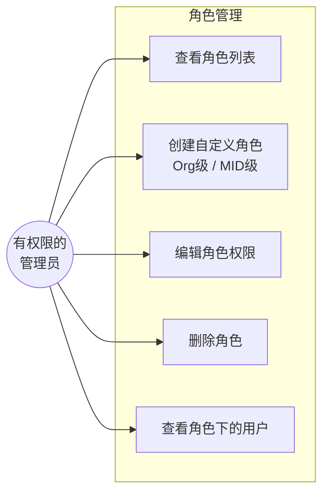

### 8.2 用户管理 Use Case

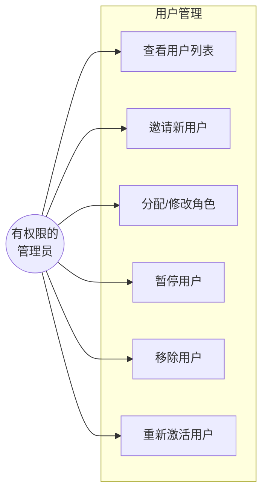

### 8.3 权限校验 Use Case

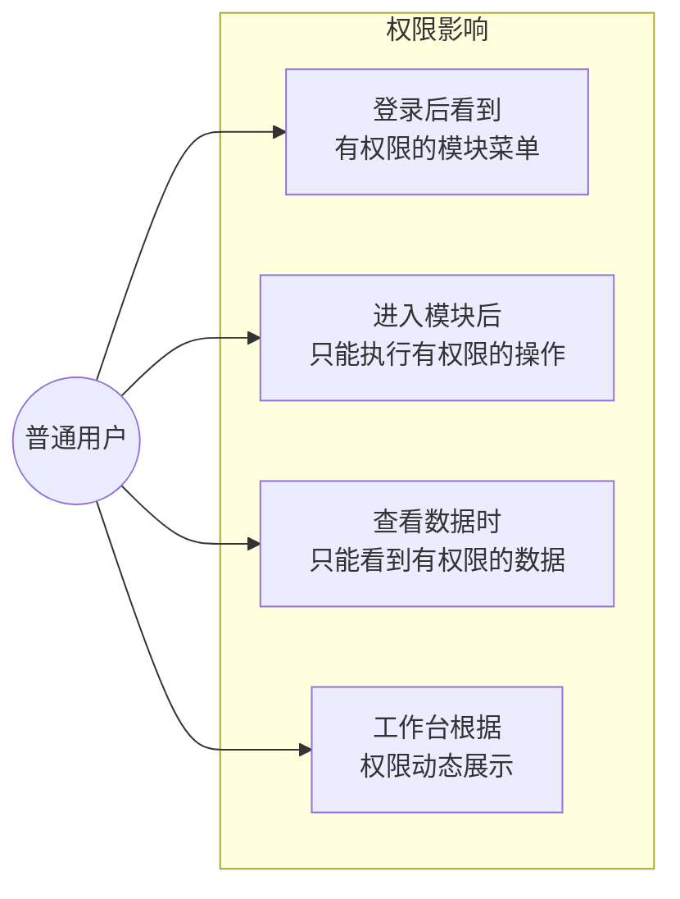

---

## 9. 鉴权流程

### 9.1 页面访问鉴权

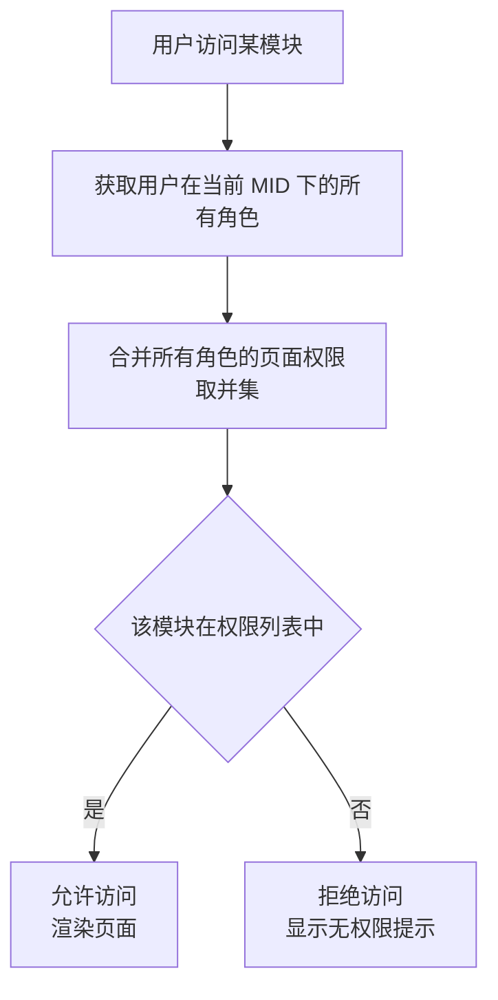

### 9.2 操作鉴权

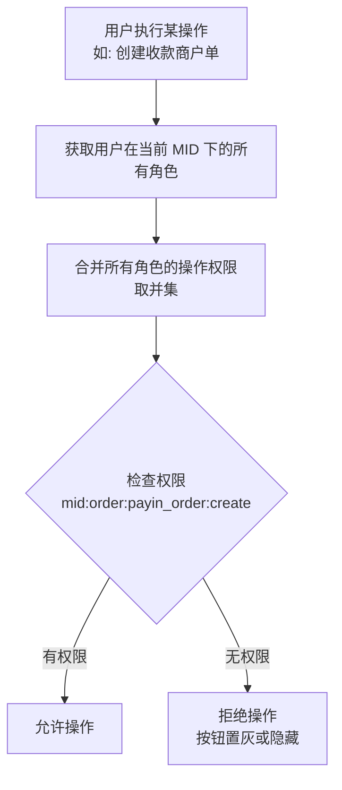

### 9.3 数据鉴权

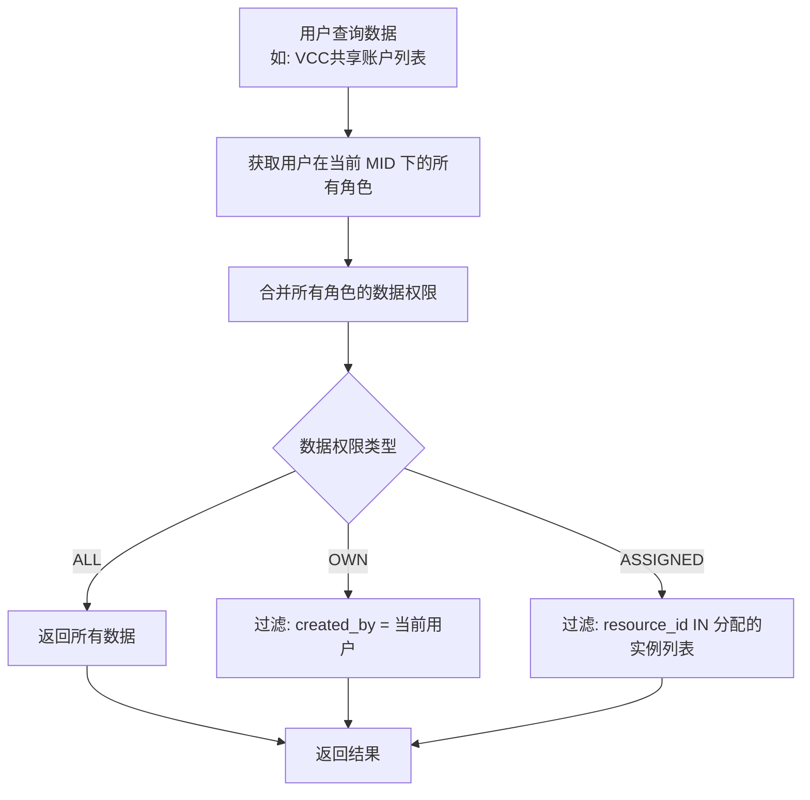

### 9.4 完整鉴权链路

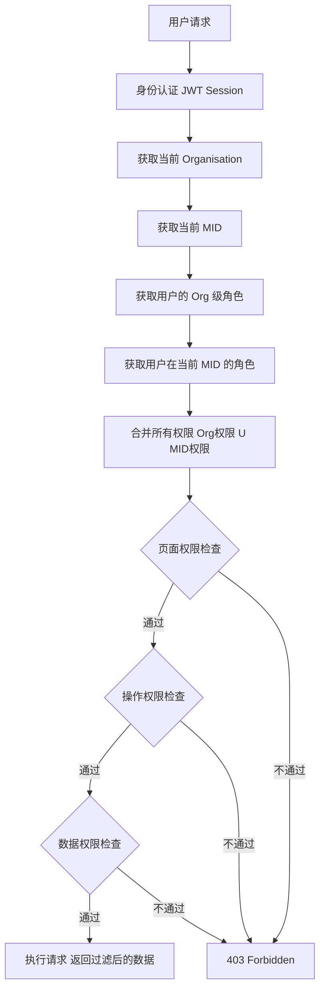

---

## 10. 状态机

### 10.1 角色状态

```
ACTIVE ←→ DISABLED
    ↓
  DELETED
```

| 状态               | 说明                           |
| ------------------ | ------------------------------ |
| **ACTIVE**   | 正常使用，权限生效             |
| **DISABLED** | 已禁用，权限不生效，但保留配置 |
| **DELETED**  | 已删除，不可恢复               |

**删除角色规则：**

- 如果角色下还有用户，需先移除所有用户或将用户迁移到其他角色
- 删除后不可恢复

### 10.2 用户-角色关联状态

```
ASSIGNED → ACTIVE
              ↕
          SUSPENDED
              ↓
          REMOVED
```

### 10.3 邀请状态

```
CREATED → SENT → ACCEPTED
                    ↓
               REJECTED
                    ↓
               EXPIRED（7天未处理）
```

---

## 附录

### A. 权限标识命名规范

```
格式: {scope}:{module}:{resource}:{action}

scope:    org | mid
module:   member | order | treasury | channel | settlement | data | ticket | product | marketplace | sales | user_mgmt
resource: 具体资源名（snake_case）
action:   view | create | edit | delete | manage | export

示例:
org:user_mgmt:user:view           — 查看用户列表
org:user_mgmt:role:create         — 创建角色
mid:order:payin_order:create      — 创建收款商户单
mid:order:vcc_order:edit          — 编辑VCC商户单
mid:member:merchant_config:manage — 管理商户配置
```

### B. 多角色权限合并规则

| 场景     | 规则                                     |
| -------- | ---------------------------------------- |
| 页面权限 | 并集：任一角色有该模块权限即可见         |
| 操作权限 | 并集：任一角色有该操作权限即可执行       |
| 数据权限 | 并集：ALL > ASSIGNED > OWN（取最宽范围） |

**数据权限合并示例：**

```
角色A: VCC数据权限 = ASSIGNED [账户A, 账户B]
角色B: VCC数据权限 = ASSIGNED [账户B, 账户C]
合并后: ASSIGNED [账户A, 账户B, 账户C]

角色A: 订单数据权限 = OWN
角色B: 订单数据权限 = ALL
合并后: ALL（取最宽）
```

### C. 错误提示

| 场景       | 提示                                                           |
| ---------- | -------------------------------------------------------------- |
| 无页面权限 | "You don't have permission to access this module."             |
| 无操作权限 | "You don't have permission to perform this action."            |
| 无数据权限 | "You don't have access to this resource."                      |
| 角色被禁用 | "Your role has been disabled. Contact your administrator."     |
| 用户被暂停 | "Your account has been suspended. Contact your administrator." |

---

*最后更新：2026-02-07*
*文档版本：v1.0*
*作者：EX Product Team*
