# EX Platform - Users, Roles & Permissions PRD

## 文档概述

本文档定义 EX Platform 的用户角色权限系统（RBAC），涵盖 Identity → User → MID 三层身份模型、MID 级角色、两层权限模型（页面 + 操作），以及用户管理功能。

**核心设计理念：**

- ✅ **三层身份模型**：Identity（自然人/凭证）→ User（MID 内身份/角色）→ MID（商户）
- ✅ **权限给 User**：角色和权限挂在 User（UID）上，不在 Identity（IID）上
- ✅ **扁平 MID 结构**：本期不引入 Organisation 层
- ✅ **自定义角色**：本期只支持自定义角色，不提供预设角色模板
- ✅ **多角色支持**：一个 User 在同一个 MID 下可拥有多个角色
- ✅ **两层权限**：页面权限（模块级）+ 操作权限（查阅 / 操作 / 导出，三选多选）
- ✅ **安全验证方式**：交易模块可配置验证方式（Self 自己验证 / Designated 发给指定手机号）
- ✅ **一个 Identity 多个 MID**：一个自然人可在多个 MID 下拥有不同 User，各自独立角色
- ✅ **多端注册**：同一手机号/邮箱可分别注册 MP（商户端）和 TP（租户端），各自独立 Identity

**Phase 2 规划（本期不做）：**

- ❌ Organisation 层（Org → MID 两层结构）
- ❌ 数据权限（资源实例级，在业务层处理）
- ❌ 手机号/邮箱合并（多凭证合并到同一 Identity）
- ❌ 操作权限细化（CRUD 级：Create/Edit/Delete/Manage 独立控制）
- ❌ 预设角色模板
- ❌ Maker-Checker 审批流（操作人提交 → 审批人验证）

**关联文档：** [Users.md](./Users.md)（用户系统 PRD）

---

## 目录

1. [系统架构概览](#1-系统架构概览)
2. [Scope 与分期](#2-scope-与分期)
3. [Identity-User-MID 关系](#3-identity-user-mid-关系)
4. [角色体系](#4-角色体系)
5. [两层权限模型](#5-两层权限模型)
6. [权限配置流程](#6-权限配置流程)
7. [用户管理](#7-用户管理)
8. [鉴权流程](#8-鉴权流程)
9. [支付密码（Payment Password）](#9-支付密码payment-password)
10. [状态机](#10-状态机)

---

## 1. 系统架构概览

### 1.1 整体架构

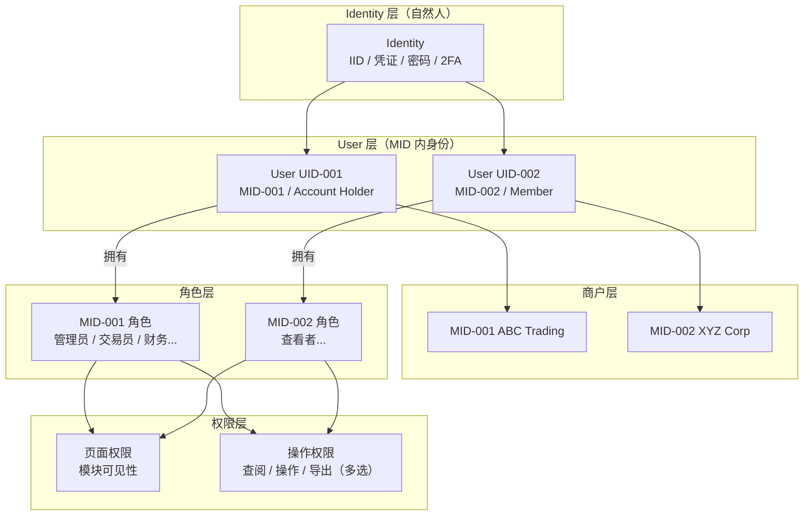

### 1.2 Identity-User-MID 关系模型


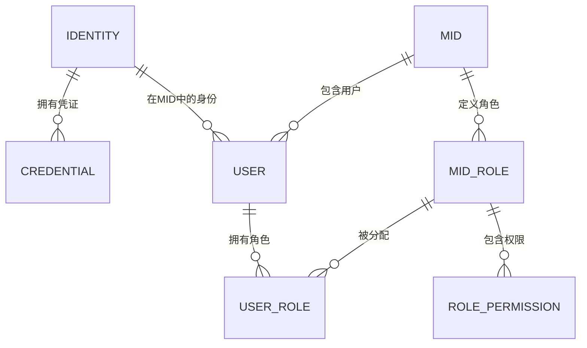

**三层职责划分：**

| 层级                    | 实体       | 标识 | 职责                                                                                         | 状态                  |
| ----------------------- | ---------- | ---- | -------------------------------------------------------------------------------------------- | --------------------- |
| **Identity 层**   | Identity   | IID  | 代表一个自然人。拥有：登录凭证（邮箱/手机号）、密码、2FA、昵称、语言偏好                     | ACTIVE / SUSPENDED    |
| **Credential 层** | Credential | —   | Identity 的登录凭证，一个 Identity 可有多个凭证（多邮箱/多手机号）                           | verified / unverified |
| **User 层**       | User       | UID  | 代表该自然人在某个 MID 下的成员身份。承载：角色、权限。一个 Identity 加入一个 MID 时自动生成 | ACTIVE / DISABLED     |
| **商户层**        | MID        | MID  | 商户/企业                                                                                    | —                    |

**核心关系：**

- Identity : User = **1 : N**（一个自然人可在多个 MID 下有不同 User）
- User : MID = **N : 1**（每个 User 只属于一个 MID）
- Identity : Credential = **1 : N**（一个 Identity 可有多个邮箱/手机号）
- **权限挂在 User 上**，不在 Identity 上。Identity 只管登录和安全设置

### 1.3 多端注册说明

同一手机号/邮箱可以分别在 MP（商户端）和 TP（租户端）注册，各自创建独立的 Identity：

```
手机号 +86 138****5678
├── MP 注册 → Identity IID-001 (MP)
│   └── User UID-001 → MID-001 (ABC Trading) / Account Holder
│
└── TP 注册 → Identity IID-002 (TP)
    └── User UID-010 → MID-T01 (Fulunited Limited) / Account Holder
```

- MP 和 TP 是**独立的 Identity**，各自有独立的密码、2FA
- 登录时选择端（MP / TP），进入对应的 Identity 和 User 体系
- 本期不支持 MP 和 TP 的 Identity 合并

---

## 2. Scope 与分期

### 2.1 本期 Scope

| 维度               | In Scope                                                                           | Out of Scope（Phase 2）                         |
| ------------------ | ---------------------------------------------------------------------------------- | ----------------------------------------------- |
| **身份模型** | Identity → User → MID 三层；权限挂在 User（UID）上                               | Organisation 层（Org → MID）                   |
| **角色**     | MID 级自定义角色；一个 User 可拥有多个角色；一个 Identity 可在多个 MID 有不同 User | 预设角色模板；角色继承                          |
| **页面权限** | 按模块控制可见性                                                                   | 按子菜单/按钮级控制                             |
| **操作权限** | 三项独立多选：查阅（View）/ 操作（Operate）/ 导出（Export）                        | 细粒度 CRUD（Create/Edit/Delete/Manage 独立控制） |
| **安全验证** | 交易模块可配置验证方式：Self（自己验证）/ Designated（发给指定手机号）              | Maker-Checker 审批流                              |
| **数据权限** | —（在业务层处理）                                                                 | 资源实例级（ALL/OWN/ASSIGNED）；Location 权限     |
| **用户管理** | 邀请用户（Identity）、分配角色（User）、状态管理                                   | Department / Manager 字段；HRIS 集成              |
| **账号合并** | —                                                                                 | 手机号/邮箱合并（多凭证合并到同一 Identity）    |
| **工作台**   | 根据权限动态生成                                                                   | —                                              |

### 2.2 分期规划

```
Phase 1（本期）：
├── Identity → User → MID 三层身份模型
├── MID 级自定义角色（权限给 User）
├── 两层权限：页面（模块级）+ 操作（查阅/操作/导出，三选多选）
├── 安全验证方式：交易模块可配置 Self / Designated（指定手机号）
├── 用户管理：邀请、状态、角色分配
├── 支付密码（按 User + MID 维度）
└── 工作台根据权限动态生成

Phase 2（后期）：
├── Organisation 层（Org → MID 两层结构）
├── 数据权限（ALL / OWN / ASSIGNED）
├── 操作权限细化：操作 → Create/Edit/Delete/Manage 独立控制
├── 手机号/邮箱合并（多凭证合并到同一 Identity）
├── 预设角色模板
├── Maker-Checker 审批流（操作人提交 → 审批人验证）
└── Department / Manager 等组织字段
```

---

## 3. Identity-User-MID 关系

### 3.1 结构说明

采用三层身份模型，无 Organisation 层：

```
Identity（自然人）
├── 拥有凭证：email atest.com, mobile 86138xxxx
├── 拥有安全设置：密码、2FA
│
├── User UID-001 → MID-001 (ABC Trading) / Account Holder
│   └── 角色: 管理员（所有模块可操作）
│
└── User UID-002 → MID-002 (XYZ Corp) / Member
    └── 角色: 查看者（所有模块仅查阅）
```

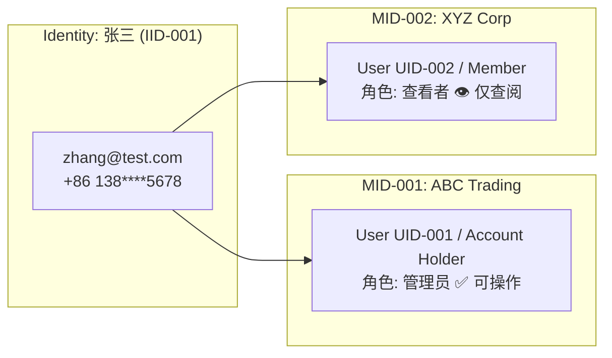

**关键区别：**

| 操作                          | 在哪一层              | 说明                                                            |
| ----------------------------- | --------------------- | --------------------------------------------------------------- |
| 登录、修改密码、修改凭证、2FA | **Identity 层** | 验证码发到 Identity 自己的凭证                                  |
| 查看模块、执行操作、管理用户  | **User 层**     | 由 User 在该 MID 下的角色决定                                   |
| 冻结/解冻成员                 | **User 层**     | Account Holder 可禁用某个 User（UID），不影响 Identity 全局状态 |
| 封禁自然人                    | **Identity 层** | 平台级操作，Identity 被 SUSPENDED 后所有 User 均不可用          |

### 3.2 Account Holder（开户人）

每个 MID 注册时，注册人的 User 自动标记为 **Account Holder**（role_type = Account Holder）。Account Holder 是 User 上的特殊身份标记，拥有以下固有权限：

| 能力                   | 说明                                            |
| ---------------------- | ----------------------------------------------- |
| **所有模块访问** | 可见所有模块，可操作                            |
| **用户管理**     | 邀请/移除用户、分配角色                         |
| **角色管理**     | 创建/编辑/删除角色                              |
| **MID 设置**     | 企业信息、通知、系统配置                        |
| **不可移除**     | Account Holder 不能被其他人移除或降级           |
| **可转让**       | Account Holder 可将该身份转让给 MID 内其他 User |

> Account Holder 之外的所有 User，权限完全由角色决定。

### 3.3 一个 Identity 多个 MID

一个自然人（Identity）加入多个 MID 时，系统为每个 MID 自动生成独立的 User（UID）：

```
Identity 张三 (IID-001, zhang@test.com)
├── User UID-001 → MID-001: ABC Trading
│   ├── role_type: Account Holder
│   ├── 角色: 管理员（所有模块可操作）
│   └── 角色: 财务（Assets + Transfer Out 可操作）
│
└── User UID-002 → MID-002: XYZ Corp
    ├── role_type: Member
    └── 角色: 查看者（所有模块仅查阅）

→ 登录后（Identity 级），选择 MID，切换到对应 User
→ 权限按当前 User 在该 MID 下的角色计算
→ 多角色权限合并：取并集（Union）
```

### 3.4 多个 Identity 在同一 MID

不同自然人加入同一个 MID，各自拥有独立的 User：

```
MID-001: ABC Trading
├── User UID-001 (Identity A 张三) / Account Holder
├── User UID-003 (Identity B 李四) / Member → 角色: Admin
└── User UID-005 (Identity C 王五) / Member → 角色: 查看者
```

> **约束：** 一个 Identity 在同一个 MID 下只能有一个 User（1:1 per MID）。

---

## 4. 角色体系（MP 端）

> 本章节先定义 MP（商户端）的角色和权限。TP 端角色后续补充。

### 4.1 角色分类

| 分类                       | 说明                                | 本期支持   |
| -------------------------- | ----------------------------------- | ---------- |
| **Account Holder**   | MID 注册时自动创建，固有全部权限    | ✅（固有） |
| **MID 级自定义角色** | 在 MID 下创建，控制页面 + 操作权限  | ✅         |
| **预设角色模板**     | 系统预设的角色（如 Admin / Viewer） | ❌ Phase 2 |

### 4.2 角色属性

| 属性                  | 说明                       |
| --------------------- | -------------------------- |
| **role_id**     | 唯一标识                   |
| **mid_id**      | 所属 MID                   |
| **role_name**   | 角色名称（如"交易管理员"） |
| **description** | 角色描述（可选）           |
| **permissions** | 该角色拥有的权限列表       |
| **created_by**  | 创建人                     |
| **created_at**  | 创建时间                   |
| **status**      | Active / Disabled          |

### 4.3 创建自定义角色流程

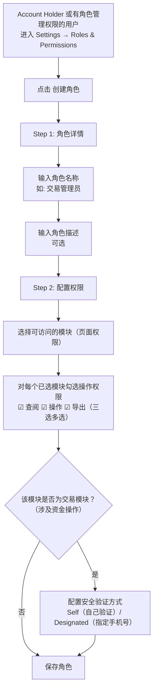

---

## 5. 两层权限模型（MP 端）

### 5.1 权限层次

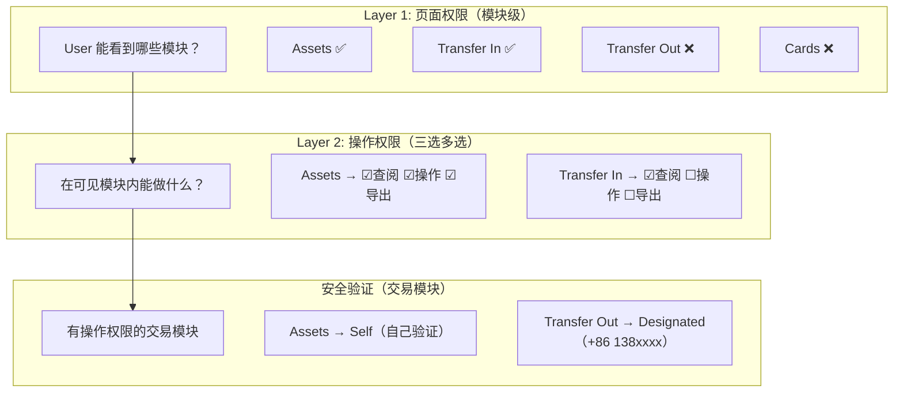

> **数据权限** 不在 RBAC 层处理，由各业务模块在业务逻辑层自行实现（如按创建人过滤、按分配的资源过滤等）。

### 5.2 Layer 1: 页面权限 — MP 端模块清单

控制 User 能看到哪些模块。不可见的模块在左侧导航菜单中隐藏。

**权限粒度：菜单分组级**（不细到子菜单页面）

> **Dashboard** 所有人都有，不受权限控制，但内容根据权限动态生成。

| # | 模块分组                  | 包含子菜单                                            | 说明                                                                                              | 权限标识         |
| - | ------------------------- | ----------------------------------------------------- | ------------------------------------------------------------------------------------------------- | ---------------- |
| 1 | **Assets**          | Fiat Accounts / Crypto Wallet / Exchange              | 自有资产管理：余额查看、同名充提、换汇（FX）、法转数（On-Ramp）、数转法（Off-Ramp）               | `assets`       |
| 2 | **Transfer In**     | Collection Tools / Remitter / Payins / Onramp         | 转账收款：收款工具管理（Global Account/VA + 加密地址）、汇款人维护、所有入金记录、法币收款自动换U | `transfer_in`  |
| 3 | **Checkout**        | Online Payment / Invoice / Subscription               | 收单：在线支付订单、账单支付、订阅支付                                                            | `checkout`     |
| 4 | **Transfer Out**    | Beneficiary / Payouts / OffRamp / Remittance Orders   | 转账付款：收款人管理、所有出金（法币+链上+同名提现提币）、数币→法币直付、收→换→付一单到底      | `transfer_out` |
| 5 | **Cards**           | Cards Management / Card Transactions                  | 发卡：开卡、充值、冻结、注销、卡交易记录                                                          | `cards`        |
| 6 | **Trade Documents** | Trade Documents / Order Files / Shop Management       | 贸易单据：发票/合同/提单管理、订单文件、电商店铺绑定                                              | `trade_docs`   |
| 7 | **Reports**         | Reports / Downloads                                   | 报表与下载中心                                                                                    | `reports`      |
| 8 | **Developer**       | API Keys / Webhooks                                   | 开发者：API密钥管理、Webhook配置                                                                  | `developer`    |
| 9 | **Settings**        | Company Profile / Roles & Permissions / Notifications | 设置：企业信息、角色权限管理、通知配置                                                            | `settings`     |

### 5.3 Layer 2: 操作权限（三选多选）

在可见模块内，控制 User 能执行的操作范围。**三项权限独立勾选，可任意组合。**

| 操作权限                    | 标识           | 说明                                                    |
| --------------------------- | -------------- | ------------------------------------------------------- |
| **查阅（View）**      | `view`       | 查看列表、详情、筛选、搜索                              |
| **操作（Operate）**   | `operate`    | 创建/编辑/删除/审批等写操作                             |
| **导出（Export）**    | `export`     | 导出 CSV / Excel / PDF                                  |

**勾选规则：**

- 三项独立勾选，可任意组合
- 勾选 `operate` 或 `export` 时，系统自动带上 `view`（查阅是前置条件）
- 至少勾选一项才算有该模块权限

**常见组合示例：**

| 组合                           | 能力                           | 典型场景             |
| ------------------------------ | ------------------------------ | -------------------- |
| ☑ 查阅                         | 只能看                         | 只读审计人员         |
| ☑ 查阅 ☑ 导出                  | 能看能导出，不能改             | 财务报表查看者       |
| ☑ 查阅 ☑ 操作                  | 能看能改，不能导出             | 操作员（防数据泄露） |
| ☑ 查阅 ☑ 操作 ☑ 导出           | 完全控制                       | 管理员               |

**具体能力对照：**

| 能力      | 查阅 | 操作 | 导出 |
| --------- | ---- | ---- | ---- |
| 查看列表  | ✅   | —   | —   |
| 查看详情  | ✅   | —   | —   |
| 筛选/搜索 | ✅   | —   | —   |
| 创建/发起 | —   | ✅   | —   |
| 编辑/修改 | —   | ✅   | —   |
| 删除/作废 | —   | ✅   | —   |
| 导出数据  | —   | —   | ✅   |

**权限标识格式：** `{module}:{permissions}`

```
示例:
assets:view,operate,export     — Assets，查阅+操作+导出（完全控制）
transfer_in:view               — Transfer In，仅查阅
transfer_out:view,operate      — Transfer Out，查阅+操作（不可导出）
reports:view,export            — Reports，查阅+导出（不可操作）
settings:view,operate          — Settings（含角色管理），查阅+操作
```

> **Phase 2 向后兼容：** `operate` 将拆分为 `create` / `edit` / `delete` / `manage` 独立控制。

### 5.3.1 安全验证方式（角色级全局配置）

当角色在任一交易模块（Assets/Transfer Out/Cards）拥有 **操作（Operate）** 权限时，需为该角色配置安全验证方式。该配置为 **角色级全局设置**，不按模块单独配。

**配置项：**

| 配置项             | 选项                    | 说明                                                     |
| ------------------ | ----------------------- | -------------------------------------------------------- |
| **验证方式** | `Self` / `Designated` | Self = 验证码发给操作人自己；Designated = 发给指定手机号 |

> **指定手机号** 由 Account Holder 在 Settings → Security 中统一配置，不在角色配置中填写。

**触发场景（哪些操作需要验证）：**

| 模块                       | 触发操作                                     |
| -------------------------- | -------------------------------------------- |
| **Assets (Exchange)** | 确认兑换（FX / On-Ramp / Off-Ramp）         |
| **Transfer Out**      | 确认付款（Payouts）、确认汇款（Remittance）  |
| **Cards**             | 卡充值、卡转账                               |

> 非交易操作（查看、编辑收款人、导出报表等）不触发安全验证。

**验证流程：**

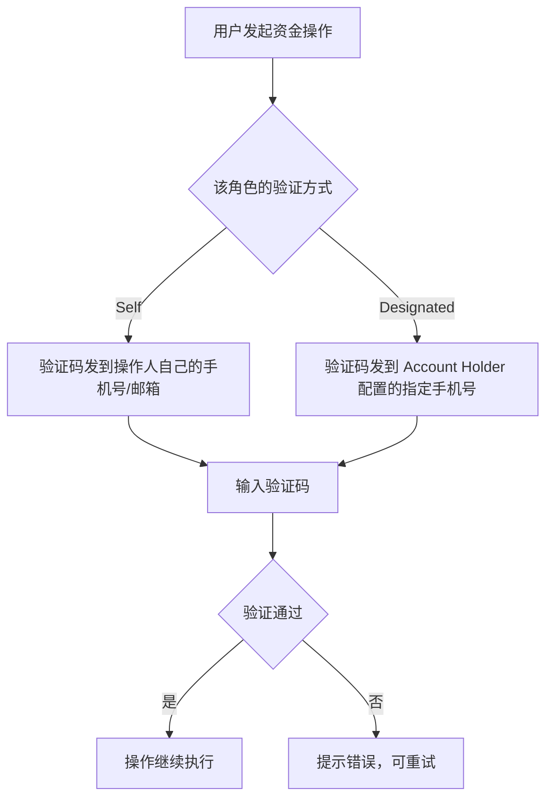

> **多角色合并规则：** 同一用户多角色时，验证方式取最严格的配置（Designated > Self）。

### 5.4 MP 角色配置示例

#### 角色 1: 财务主管

负责资金管理和出入金操作，可查看报表。**安全验证：Designated**

```
┌──────────────────┬────────┬────────┬────────┐
│ 模块               │ 查阅   │ 操作   │ 导出   │
├──────────────────┼────────┼────────┼────────┤
│ Assets             │ ☑      │ ☑      │ ☑      │  ← 充值/提现/换汇
│ Transfer In        │ ☑      │ ☑      │ ☑      │  ← 管理收款工具、查看入金
│ Checkout           │ ☑      │ ☐      │ ☐      │  ← 只看收单订单
│ Transfer Out       │ ☑      │ ☑      │ ☑      │  ← 发起付款/汇款
│ Reports            │ ☑      │ ☐      │ ☐      │  ← 查看报表，不可导出
└──────────────────┴────────┴────────┴────────┘
```

#### 角色 2: 运营专员

负责收款和收单业务，管理贸易单据。**安全验证：Self**（无交易模块操作权限，不触发）

```
┌──────────────────┬────────┬────────┬────────┐
│ 模块               │ 查阅   │ 操作   │ 导出   │
├──────────────────┼────────┼────────┼────────┤
│ Assets             │ ☑      │ ☐      │ ☐      │  ← 只看余额
│ Transfer In        │ ☑      │ ☑      │ ☑      │  ← 管理收款工具、汇款人
│ Checkout           │ ☑      │ ☑      │ ☑      │  ← 管理收单订单
│ Trade Documents    │ ☑      │ ☑      │ ☑      │  ← 管理贸易单据/店铺
│ Reports            │ ☑      │ ☐      │ ☐      │  ← 查看报表
└──────────────────┴────────┴────────┴────────┘
```

#### 角色 3: 卡业务管理员

专门负责发卡和卡交易。**安全验证：Self**

```
┌──────────────────┬────────┬────────┬────────┐
│ 模块               │ 查阅   │ 操作   │ 导出   │
├──────────────────┼────────┼────────┼────────┤
│ Assets             │ ☑      │ ☐      │ ☐      │  ← 查看余额（卡充值需要）
│ Cards              │ ☑      │ ☑      │ ☑      │  ← 开卡/充值/冻结/注销
│ Reports            │ ☑      │ ☐      │ ☐      │  ← 查看报表
└──────────────────┴────────┴────────┴────────┘
```

#### 角色 4: 技术对接

负责 API 集成和 Webhook 配置。**安全验证：Self**（无交易模块操作权限，不触发）

```
┌──────────────────┬────────┬────────┬────────┐
│ 模块               │ 查阅   │ 操作   │ 导出   │
├──────────────────┼────────┼────────┼────────┤
│ Developer          │ ☑      │ ☑      │ ☐      │  ← API Keys / Webhooks
└──────────────────┴────────┴────────┴────────┘
```

#### 角色 5: 全局查看者

只读权限，查看所有模块但不能操作和导出。**安全验证：不适用**（无操作权限）

```
┌──────────────────┬────────┬────────┬────────┐
│ 模块               │ 查阅   │ 操作   │ 导出   │
├──────────────────┼────────┼────────┼────────┤
│ Assets             │ ☑      │ ☐      │ ☐      │
│ Transfer In        │ ☑      │ ☐      │ ☐      │
│ Checkout           │ ☑      │ ☐      │ ☐      │
│ Transfer Out       │ ☑      │ ☐      │ ☐      │
│ Cards              │ ☑      │ ☐      │ ☐      │
│ Trade Documents    │ ☑      │ ☐      │ ☐      │
│ Reports            │ ☑      │ ☐      │ ☐      │
│ Developer          │ ☑      │ ☐      │ ☐      │
│ Settings           │ ☑      │ ☐      │ ☐      │
└──────────────────┴────────┴────────┴────────┘
```

### 5.5 Account Holder 权限（固有）

Account Holder 不通过角色配置权限，固有全部模块的全部权限。**安全验证：Self**

```
┌──────────────────┬────────┬────────┬────────┐
│ 模块               │ 查阅   │ 操作   │ 导出   │
├──────────────────┼────────┼────────┼────────┤
│ Assets             │ ☑      │ ☑      │ ☑      │
│ Transfer In        │ ☑      │ ☑      │ ☑      │
│ Checkout           │ ☑      │ ☑      │ ☑      │
│ Transfer Out       │ ☑      │ ☑      │ ☑      │
│ Cards              │ ☑      │ ☑      │ ☑      │
│ Trade Documents    │ ☑      │ ☑      │ ☑      │
│ Reports            │ ☑      │ ☑      │ ☑      │
│ Developer          │ ☑      │ ☑      │ ☑      │
│ Settings           │ ☑      │ ☑      │ ☑      │  ← 含角色管理、用户管理
└──────────────────┴────────┴────────┴────────┘

+ 固有能力：邀请/移除用户、创建/删除角色、转让 Account Holder
```

### 5.6 多角色权限合并

一个 User 在同一个 MID 下可拥有多个角色，权限合并规则：

```
最终权限 = 角色1权限 ∪ 角色2权限 ∪ ...
```

| 维度     | 合并规则                                                                |
| -------- | ----------------------------------------------------------------------- |
| 页面权限 | 并集：任一角色有该模块权限即可见                                        |
| 查阅     | 并集：任一角色有查阅即有                                                |
| 操作     | 并集：任一角色有操作即有                                                |
| 导出     | 并集：任一角色有导出即有                                                |
| 安全验证 | 取最严格：Designated > Self（任一角色为 Designated 即按 Designated 执行）|

**示例：**

```
User 张三 在 MID-001 下同时拥有"财务主管"和"运营专员"两个角色：

财务主管（验证: Designated）:  Assets [查阅+操作+导出], Transfer In [查阅+操作+导出], Checkout [查阅], Transfer Out [查阅+操作+导出], Reports [查阅]
运营专员（验证: Self）:        Assets [查阅], Transfer In [查阅+操作+导出], Checkout [查阅+操作+导出], Trade Docs [查阅+操作+导出], Reports [查阅]

合并后张三的权限:
  Assets        → 查阅 ☑ 操作 ☑ 导出 ☑
  Transfer In   → 查阅 ☑ 操作 ☑ 导出 ☑
  Checkout      → 查阅 ☑ 操作 ☑ 导出 ☑（运营专员补充了操作+导出）
  Transfer Out  → 查阅 ☑ 操作 ☑ 导出 ☑
  Trade Docs    → 查阅 ☑ 操作 ☑ 导出 ☑
  Reports       → 查阅 ☑
  安全验证方式  → Designated（财务主管为 Designated，取最严格）
```

---

## 6. 权限配置流程

### 6.1 创建角色

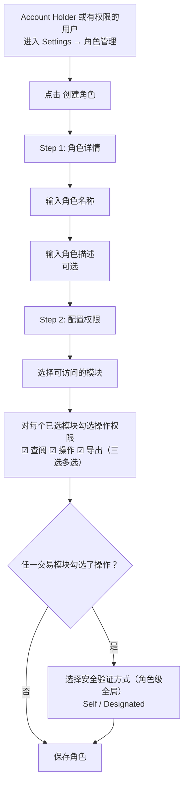

### 6.2 分配角色给用户

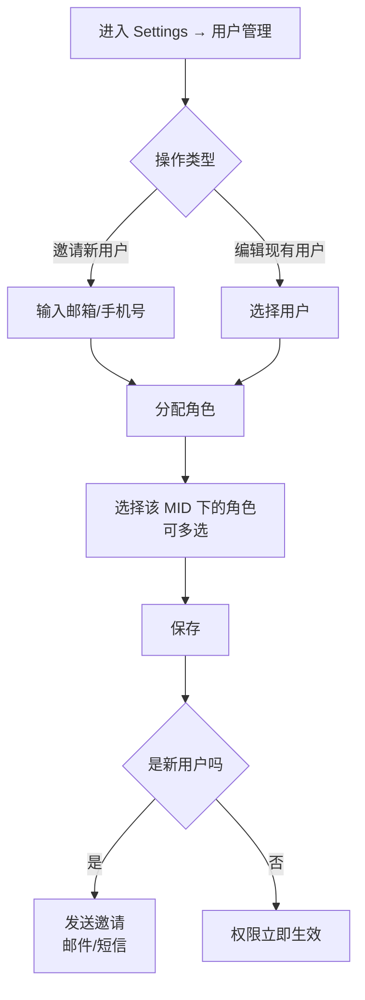

---

## 7. 用户管理

### 7.1 用户管理功能

| 功能           | 说明                                                   |
| -------------- | ------------------------------------------------------ |
| 用户列表       | 查看 MID 下所有用户，按角色/状态筛选                   |
| 邀请用户       | 输入邮箱/手机号 + 分配角色，发送邀请链接               |
| 查看用户详情   | 查看 Identity(IID) / User(UID) / 角色 / 合并后权限     |
| 修改角色       | 变更用户角色，权限立即生效                             |
| 禁用/启用用户  | 禁用 User（不影响 Identity 全局状态）                  |
| 移除用户       | 从 MID 移除，角色清空，不可恢复                        |

### 7.2 邀请用户流程

支持通过 **邮箱** 或 **手机号** 邀请新成员加入 MID。两种方式的验证机制不同。

#### 7.2.1 邀请方式

| 邀请方式 | 发送内容 | 接受验证 | 安全说明 |
|----------|----------|----------|----------|
| **邮箱** | 邀请链接（邮件） | 点击链接 → 登录/注册即可 | 邮件链接本身即为邮箱所有权验证（仅邮箱持有人能收到），登录/注册提供第二层身份验证 |
| **手机号** | 邀请通知（短信含链接） | 点击链接 → **需输入短信验证码** → 登录/注册 | 短信存在 SS7 攻击、SIM swap 等截获风险，需额外验证码确认手机号所有权 |

#### 7.2.2 邮箱邀请流程

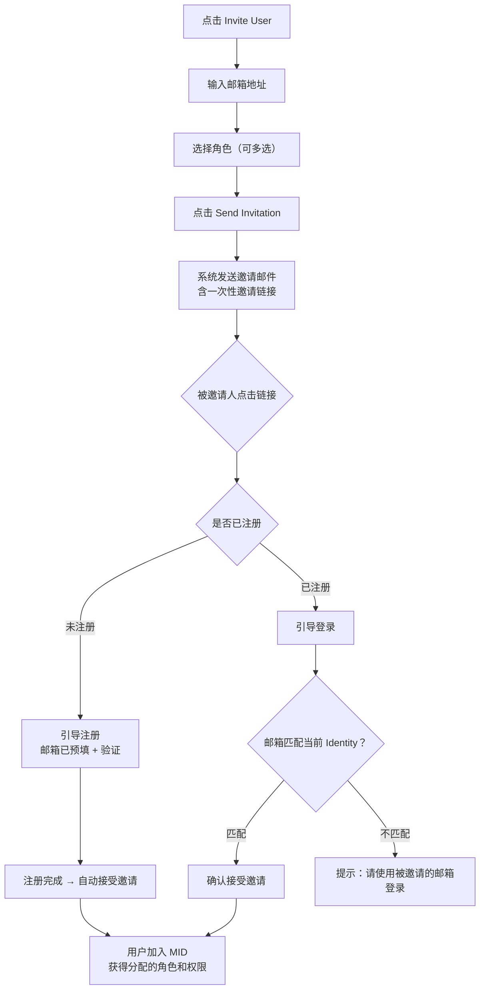

> **安全保障：** 邮件链接 = 邮箱所有权验证 + 登录/注册 = 身份验证。无需额外验证码。

#### 7.2.3 手机号邀请流程

> **本期限制：** 短信可在手机端接收，但接受邀请的操作必须在 MP 端（Web）完成，本期不支持手机端直接操作。

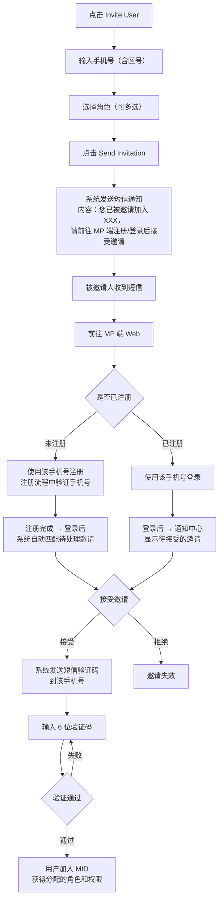

**与邮箱邀请的关键区别：**

| 对比项 | 邮箱邀请 | 手机号邀请 |
|--------|----------|------------|
| **通知方式** | 邮件含可点击链接 | 短信文字通知，引导去 MP 端 |
| **接收渠道** | 邮箱客户端（PC/手机均可） | 手机短信接收，MP 端（Web）操作 |
| **接受入口** | 点击邮件链接直达 | 需主动前往 MP 端登录/注册 |
| **身份验证** | 邮件链接 = 邮箱所有权验证 | 接受时需额外短信验证码 |
| **为什么不同** | 邮件链接安全性高（TLS 加密） | 短信明文传输，存在 SS7/SIM swap 风险 |

> **为什么手机号接受时需要验证码：** 短信传输不加密（明文），存在 SS7 攻击和 SIM swap 等已知安全风险。在接受邀请时发送短信验证码，确保操作人在此刻仍持有该手机号。

#### 7.2.4 邀请规则

| 规则 | 说明 |
|------|------|
| **链接有效期** | 7 天，过期后状态变为 Expired |
| **一次性** | 链接只能使用一次，接受或拒绝后失效 |
| **绑定目标** | 邀请链接绑定目标邮箱/手机号，仅对应 Identity 可接受 |
| **重复邀请** | 同一邮箱/手机号在同一 MID 下有未过期邀请时，不可重复发送 |
| **已是成员** | 如果被邀请人已是该 MID 成员，提示"该用户已是成员"，不发送邀请 |

### 7.3 用户状态管理

| 状态                | 说明                   | 可执行操作                  |
| ------------------- | ---------------------- | --------------------------- |
| **Active**    | 正常使用               | Suspend / Remove / 修改角色 |
| **Suspended** | 暂停（保留数据和角色） | Activate / Remove           |
| **Removed**   | 已移除（角色清空）     | Re-invite                   |

**邀请状态：**

| 状态               | 说明                 |
| ------------------ | -------------------- |
| **Invited**  | 已发送邀请，等待接受 |
| **Accepted** | 已接受邀请           |
| **Expired**  | 邀请超过 7 天未接受  |

---

## 8. 鉴权流程

### 8.1 页面访问鉴权

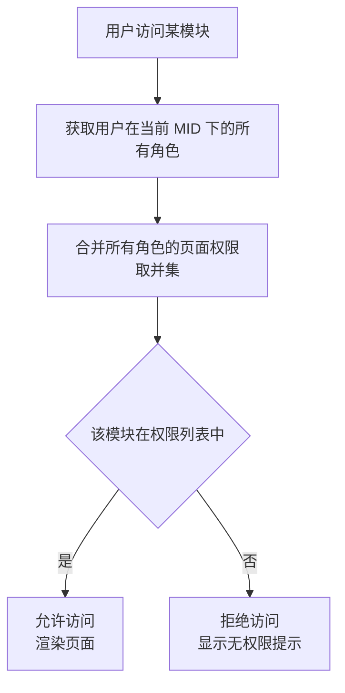

### 8.2 操作鉴权

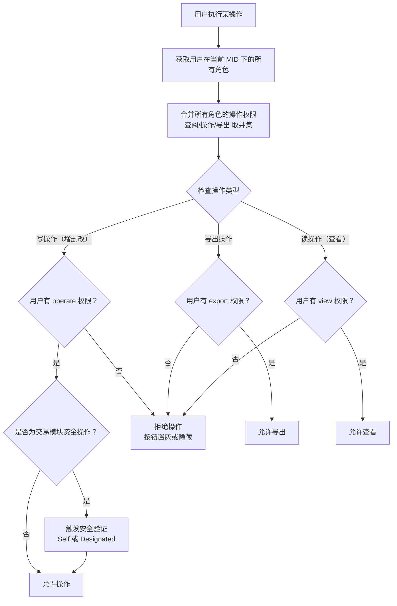

### 8.3 完整鉴权链路

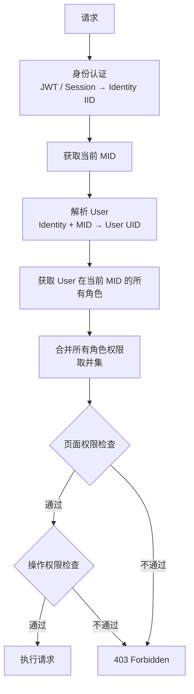

---

## 9. 支付密码（Payment Password）

### 9.1 概述

支付密码是一个 **按 User（UID）+ MID 维度** 设置的 6 位数字 PIN，用于在用户执行敏感资金操作（如发起付款、转账、提现等）时进行二次身份验证。

**核心规则：**

- 支付密码按 User + MID 独立设置，同一 Identity 在不同 MID 下的不同 User 可以有不同的支付密码
- 支付密码是 **可选的**，不强制设置
- 支付密码的设置入口在 Settings → Security → Payment password

### 9.2 设置前提条件

用户必须 **同时满足** 以下条件，才能看到并设置某个 MID 的支付密码：

| 条件                                        | 说明                                                                                 |
| ------------------------------------------- | ------------------------------------------------------------------------------------ |
| **拥有该 MID 的资金操作相关页面权限** | 用户在该 MID 下的角色包含涉及资金操作的模块（如 Assets/Exchange、Transfer Out、Cards） |
| **该模块拥有"操作"权限**              | 仅拥有"查阅"或"导出"权限的用户无需设置支付密码，因为无法发起任何资金操作                |

### 9.3 设置流程

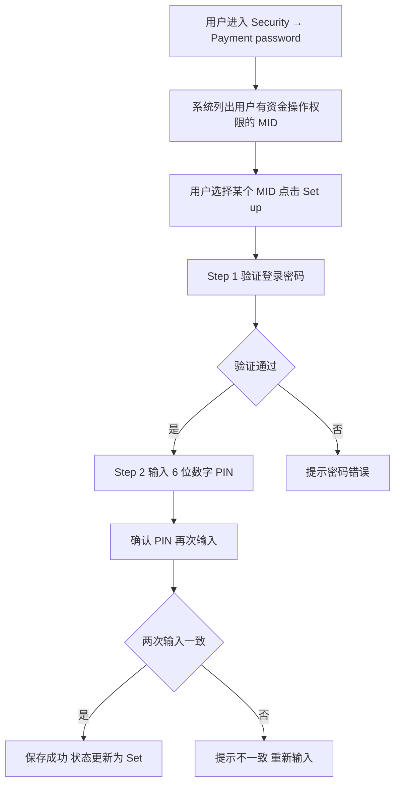

### 9.4 权限变更场景

#### 场景 A：用户已设置支付密码，后续失去资金操作权限

| 项目                   | 说明                                                         |
| ---------------------- | ------------------------------------------------------------ |
| **触发条件**     | 角色被修改、角色被移除、用户被降级为"仅查阅"                 |
| **支付密码状态** | 保留，不自动删除                                             |
| **安全影响**     | **无**。用户已无法进入资金操作页面，支付密码不会被触发 |
| **UI 表现**      | Security 页面不再显示该 MID 的支付密码入口                   |
| **恢复权限后**   | 支付密码自动恢复生效，无需重新设置                           |

#### 场景 B：用户原来无权限，后续获得资金操作权限

| 项目                   | 说明                                                                   |
| ---------------------- | ---------------------------------------------------------------------- |
| **触发条件**     | 被分配了包含资金操作模块且为"可操作"的角色                             |
| **支付密码状态** | 未设置（Not set）                                                      |
| **UI 表现**      | Security 页面出现该 MID 的支付密码入口，显示 "Not set" + "Set up" 按钮 |
| **是否强制设置** | 否。用户可以选择不设置                                                 |

#### 场景 C：用户未设置支付密码，但有资金操作权限

| 项目               | 说明                                                     |
| ------------------ | -------------------------------------------------------- |
| **验证方式** | 回退到手机号/邮箱验证码作为安全验证方式                  |
| **用户体验** | 发起资金操作时，系统发送验证码到用户已验证的手机号或邮箱 |
| **安全等级** | 可接受，但建议用户设置支付密码以获得更便捷的验证体验     |

### 9.5 资金操作验证流程

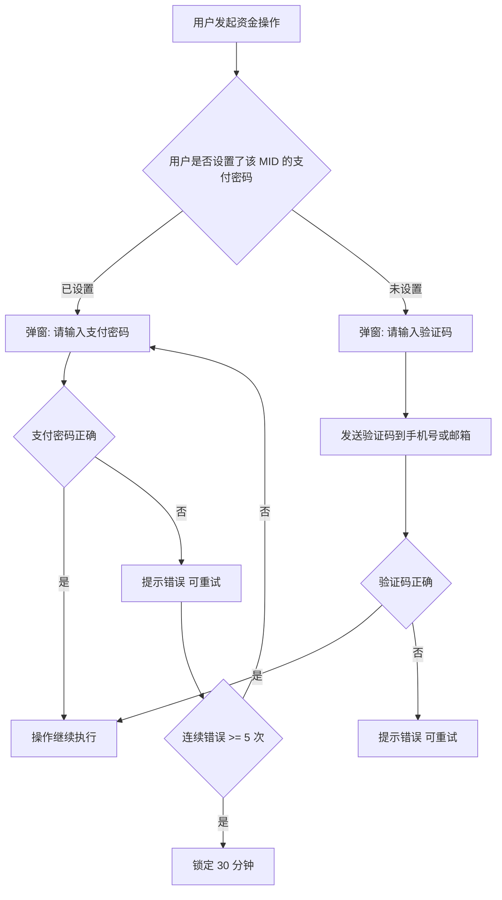

### 9.6 安全规则

| 规则                       | 说明                                            |
| -------------------------- | ----------------------------------------------- |
| **存储**             | 支付密码必须加密存储（bcrypt/argon2），不可明文 |
| **连续错误锁定**     | 连续输错 5 次，锁定 30 分钟                     |
| **修改支付密码**     | 需先验证登录密码                                |
| **忘记支付密码**     | 通过登录密码 + 手机号/邮箱验证码重置            |
| **与登录密码的关系** | 支付密码独立于登录密码，建议不要设置相同的值    |

---

## 10. 状态机

### 10.1 Identity 状态

```
ACTIVE ←→ SUSPENDED（平台级封禁）
```

| 状态                | 说明                                         |
| ------------------- | -------------------------------------------- |
| **ACTIVE**    | 正常使用，可登录                             |
| **SUSPENDED** | 平台级封禁，该 Identity 下所有 User 均不可用 |

### 10.2 User 状态（MID 内）

```
ACTIVE ←→ DISABLED（Account Holder 操作）
              ↓
          REMOVED
```

| 状态               | 说明                                                             |
| ------------------ | ---------------------------------------------------------------- |
| **ACTIVE**   | 正常使用，权限生效                                               |
| **DISABLED** | Account Holder 禁用该 User，权限不生效，不影响 Identity 全局状态 |
| **REMOVED**  | 已从 MID 移除，角色清空                                          |

### 10.3 角色状态

```
ACTIVE ←→ DISABLED
    ↓
  DELETED
```

| 状态               | 说明                           |
| ------------------ | ------------------------------ |
| **ACTIVE**   | 正常使用，权限生效             |
| **DISABLED** | 已禁用，权限不生效，但保留配置 |
| **DELETED**  | 已删除，不可恢复               |

**删除角色规则：**

- 如果角色下还有 User，需先移除所有 User 或将 User 迁移到其他角色
- 删除后不可恢复

### 10.4 邀请状态

```
INVITED → ACCEPTED
    ↓
  EXPIRED（7天未处理）
```

---

## 附录

### A. 权限标识命名规范

**本期格式：**

```
格式: {module}:{permissions}

MP 端 module:
  assets | transfer_in | checkout | transfer_out | cards | trade_docs | reports | developer | settings

permissions: view, operate, export（逗号分隔，三选多选）

示例（MP）:
assets:view,operate,export       — Assets，查阅+操作+导出
transfer_in:view                 — Transfer In，仅查阅
transfer_out:view,operate        — Transfer Out，查阅+操作（不可导出）
reports:view,export              — Reports，查阅+导出（不可操作）
settings:view,operate            — Settings，查阅+操作
```

**Phase 2 格式（细粒度 CRUD）：**

```
格式: {module}:{resource}:{action}

resource: 具体资源名（snake_case）
action:   view | create | edit | delete | manage | export

示例:
transfer_out:payout:create       — Transfer Out，付款单，创建
assets:exchange:view             — Assets，换汇，查阅
```

### B. 错误提示

| 场景       | 提示                                                           |
| ---------- | -------------------------------------------------------------- |
| 无页面权限 | "You don't have permission to access this module."             |
| 无操作权限 | "You don't have permission to perform this action."            |
| 无导出权限 | "You don't have permission to export data from this module."   |
| 角色被禁用 | "Your role has been disabled. Contact your administrator."     |
| 用户被暂停 | "Your account has been suspended. Contact your administrator." |

---

*最后更新：2026-02-13*
*文档版本：v2.3（操作权限三选多选 + 安全验证方式）*
*作者：EX Product Team*
