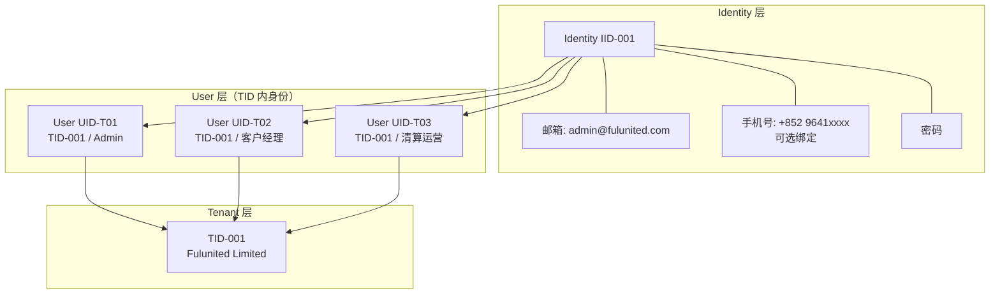
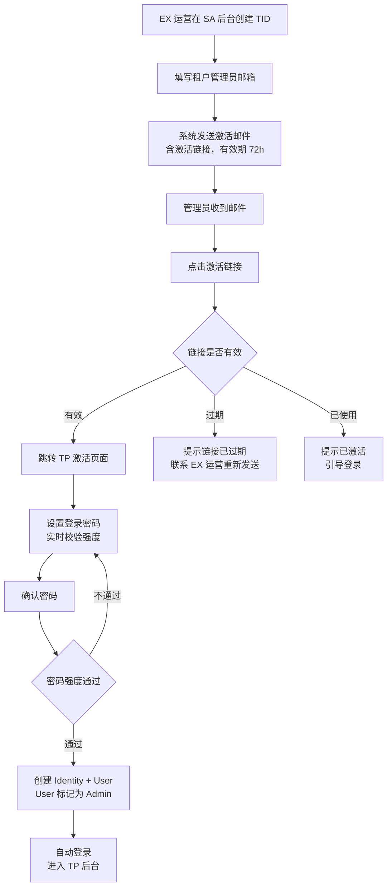
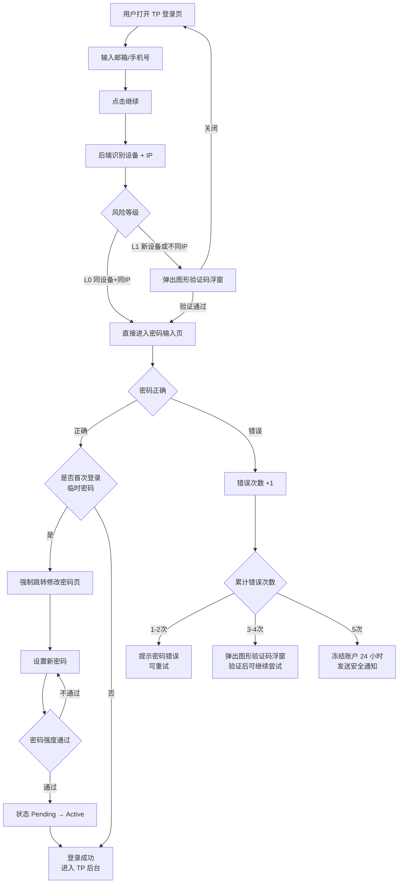
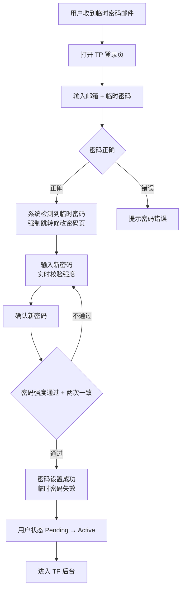
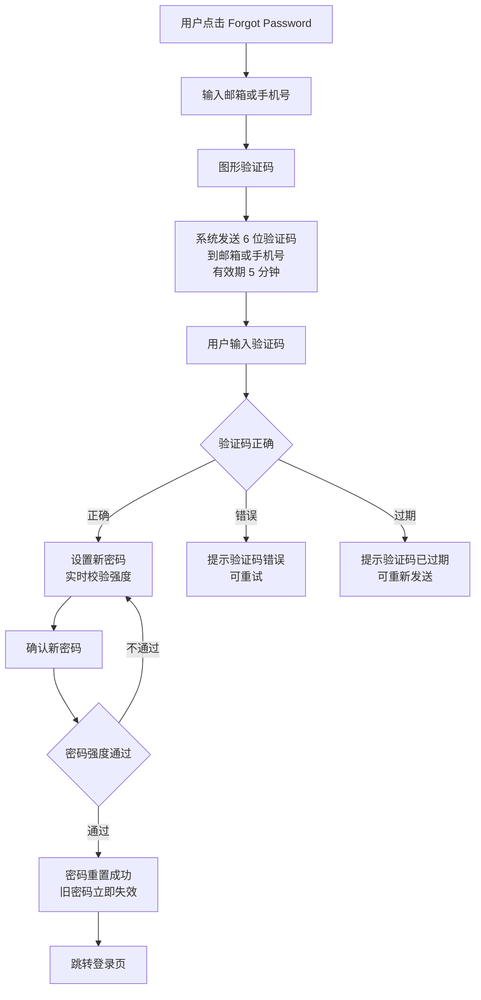
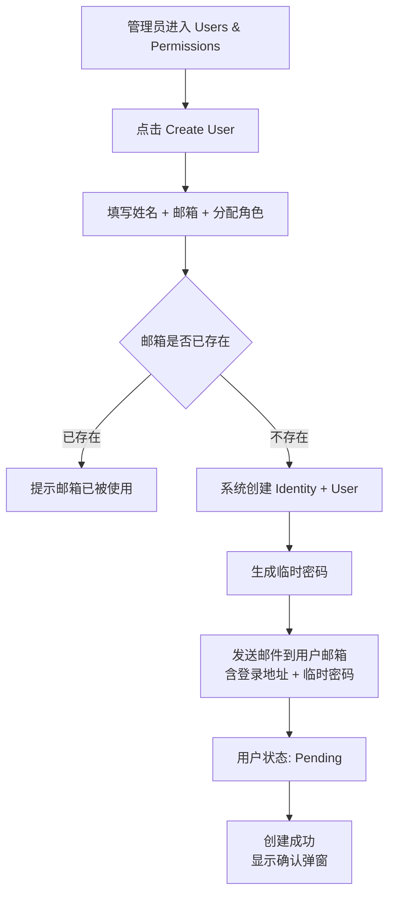
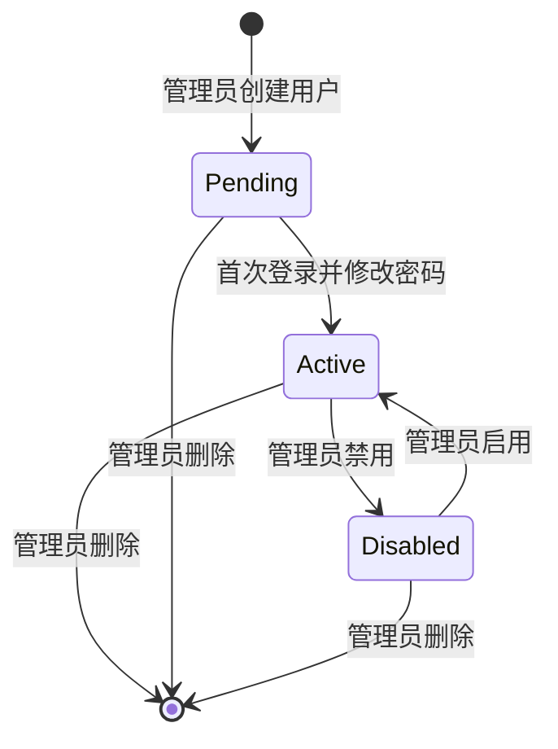
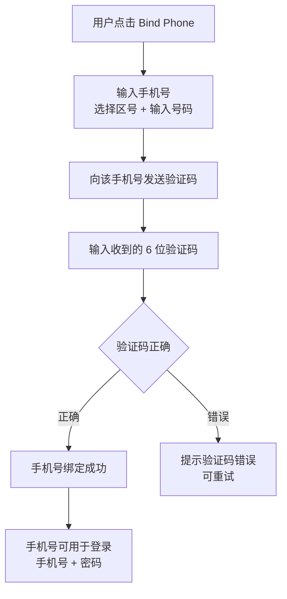
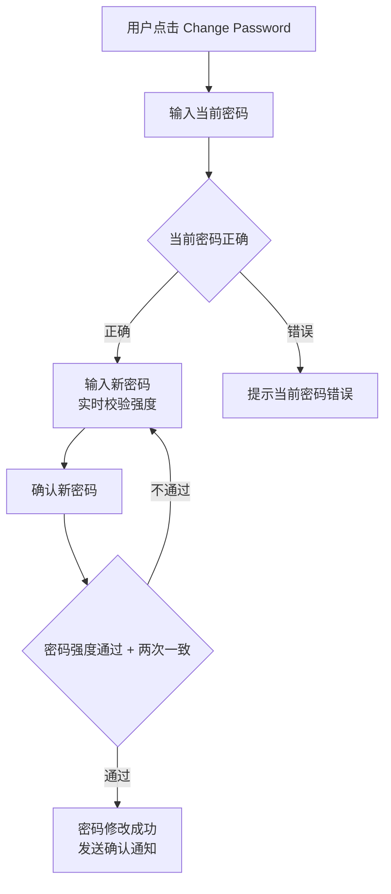

# EX Platform — TP 端用户与权限 PRD

> 版本：v1.2 | 更新日期：2026-02-14 | 关联页面：permissions-tp.html / tp-login.html / tp-personal-profile.html

## 文档概述

本文档定义 TP（Tenant Portal，租户端）的用户与权限业务规则。TP 是租户（与 EX 签约的机构）的管理后台。

**与 MP 的核心差异：**

| 维度               | MP（商户端）               | TP（租户端）                         |
| ------------------ | -------------------------- | ------------------------------------ |
| **入驻方式** | 商户自行注册               | EX 签约后发送激活邮件给租户管理员    |
| **用户来源** | 邀请制                     | 后台创建制（管理员直接创建用户账号） |
| **安全验证** | 支持 2FA、Designated Phone | 本期不需要                           |
| **手机号**   | 注册时可用                 | 登录后可选绑定                       |
| **密码找回** | 邮箱/手机号                | 邮箱（必须记录邮箱）                 |

---

## 1. 身份模型

### 1.1 账号层级

TP 端复用 EX Platform 三层身份模型（Identity → User → TID）：

- **Identity（IID）**：自然人。拥有邮箱（必填）、手机号（可选）、密码
- **User（UID）**：该自然人在某个 TID 下的成员身份。承载角色和权限
- **Tenant（TID）**：租户机构（与 EX 签约的公司），等同于 MP 端的 MID

### 1.2 与 MP 的关系

- 同一邮箱可分别在 MP 和 TP 激活，各自创建**独立的 Identity**
- MP Identity 和 TP Identity 各自有独立的密码
- 登录时选择端（MP / TP），进入对应体系
- 本期不支持 MP 和 TP 的 Identity 合并

---

## 2. 租户激活流程

### 2.1 激活规则

租户不能自行注册。EX 与租户签约后，由 EX 运营在 SA 后台创建 TID 并指定管理员邮箱，系统发送激活邮件。

- 激活邮件包含激活链接，有效期 **72 小时**
- 链接仅可使用一次，完成设置后失效
- 管理员点击链接后需设置登录密码（需符合密码强度要求）
- 密码设置成功 → Identity 创建，User 自动生成并标记为 Admin
- 同一邮箱在 TP 端只能关联一个 Identity
- 未激活时，EX 运营可重新发送激活邮件（旧链接失效）

### 2.2 激活流程图

### 2.3 激活异常处理

| 场景                   | 处理                                       |
| ---------------------- | ------------------------------------------ |
| 链接过期               | 提示联系 EX 运营重新发送                   |
| 链接已使用             | 提示该账号已激活，引导登录                 |
| 邮箱已存在 TP Identity | 提示该邮箱已注册，引导登录，并通知 EX 运营 |

---

## 3. 登录与密码管理

### 3.1 登录方式

- **邮箱 + 密码**：主要登录方式（邮箱必填）
- **手机号 + 密码**：绑定手机号后可用

### 3.2 登录主流程（含安全验证）

与 MP 端一致，TP 端采用相同的风险分级验证策略。TP 不支持验证码登录和 OTP 登录，仅支持密码登录。

### 3.3 登录安全验证策略

与 MP 端保持一致，系统根据设备、IP 和密码错误次数判断风险等级：

| 风险等级            | 触发条件                            | 验证要求                                       |
| ------------------- | ----------------------------------- | ---------------------------------------------- |
| **L0 无风险** | 同设备 + 同 IP                      | 直接输入密码，无额外验证                       |
| **L1 低风险** | 新设备（同 IP）或 同设备（不同 IP） | 先完成**图形验证码**，再输入密码         |
| **L2 中风险** | 同设备 + 同 IP + 密码错误 3 次      | 强制触发**图形验证码**，验证后可继续尝试 |
| **冻结**      | 密码连续错误 5 次                   | **冻结账户 24 小时** + 发送安全通知      |

**判断维度：**

- **设备识别**：通过设备指纹（浏览器 UA、屏幕分辨率、时区、Canvas/WebGL 指纹等）判断是否为已知设备
- **IP 识别**：对比当前 IP 与历史登录 IP 是否一致
- **密码错误计数**：当前会话内累计，成功登录后重置

### 3.4 密码错误累计规则

- **第 1-2 次错误**：提示"密码错误，请重试（连续错误 5 次将冻结账户）"
- **第 3 次错误**：强制弹出**图形验证码**浮层，提示"密码错误，请完成图形验证后重试"
- **第 4 次错误**：同上，继续要求图形验证码
- **第 5 次错误**：**直接冻结账户 24 小时**，页面发送安全告，建议用户重置密码

> 错误计数在成功登录后重置。冻结期间的登录尝试不计入错误次数。

### 3.5 图形验证码（CAPTCHA）

与 MP 端一致：

- 类型：滑动拼图验证（推荐）或点选文字验证
- 展示方式：**弹层浮窗**（覆盖在当前页面上），不跳转新页面
- 触发时机：L1（设备/IP 变化）点击"继续"时，或 L2（密码错误 3 次）时自动弹出
- 验证通过后自动关闭浮窗，继续登录流程
- 有效期：单次有效，120 秒超时需重新验证
- 提供音频验证码备选方案（无障碍）

### 3.6 账户冻结

**触发条件：** 密码连续错误 ≥ 5 次

- 冻结时长：**24 小时**
- 页面显示倒计时剩余冻结时间
- 操作入口："通过邮件解冻" / "联系客服"
- 系统发送安全告警到注册邮箱（如绑定手机号则同时发短信），含冻结时间、触发原因、非本人操作建议
- 邮件中包含一键解冻链接（有效期 30 分钟）

### 3.7 首次登录（强制改密）

管理员创建用户后，系统发送临时密码到用户邮箱。用户首次登录时：

- 使用临时密码登录成功后，系统强制要求设置新密码
- 新密码设置成功后，用户状态从 Pending → Active
- 临时密码立即失效

### 3.8 密码策略

| 规则               | 说明                                         |
| ------------------ | -------------------------------------------- |
| **最小长度** | 8 位                                         |
| **复杂度**   | 至少包含：大写字母、小写字母、数字、特殊字符 |
| **不可复用** | 新密码不能与最近 5 次密码相同                |
| **过期策略** | 本期不强制过期（后续可配置 90 天强制修改）   |
| **锁定策略** | 连续 5 次密码错误，冻结账户 24 小时          |

### 3.9 密码找回（用户自助）

用户忘记密码时，通过邮箱或手机号（已绑定时可选）接收验证码，验证身份后设置新密码。

**验证码规则：**

- 6 位数字验证码，有效期 **5 分钟**
- 同一邮箱/手机号 **60 秒** 内不可重复发送
- 连续 5 次验证码输入错误，锁定 15 分钟
- 发送前需完成图形验证码（防止恶意请求）
- 新密码不能与最近 5 次密码相同
- 用户可选择接收渠道：邮箱（必有）或手机号（已绑定时可选）

> 这是邮箱必填的核心原因：确保用户可自助找回密码，减少管理员负担。

### 3.10 本期不需要的安全功能

- ❌ 2FA（双因素认证）
- ❌ Designated Phone（指定手机号验证）
- ❌ 安全验证手机号
- ❌ 登录 IP 白名单
- ❌ 验证码登录 / OTP 登录

---

## 4. 用户管理

### 4.1 用户创建

TP 端不使用邀请制，管理员直接在后台创建用户账号。

**创建必填项：**

- **姓名**（必填）
- **邮箱**（必填，用于登录和密码找回，创建后不可修改）
- **角色**（必填，至少分配一个角色）

**创建规则：**

- 同一 TID 下邮箱不可重复；跨 TID 可重复（不同 Identity）
- 系统自动生成临时密码并发送到用户邮箱
- 创建时不需要手机号，用户登录后可自行绑定

### 4.2 用户创建流程图

### 4.3 用户状态

| 状态               | 说明                       |
| ------------------ | -------------------------- |
| **Active**   | 正常使用，可登录           |
| **Pending**  | 已创建，未完成首次改密     |
| **Disabled** | 已禁用，不可登录，保留数据 |

**状态流转：**

### 4.4 用户操作权限

| 操作                  | 执行人                       | 说明                             |
| --------------------- | ---------------------------- | -------------------------------- |
| **创建用户**    | Admin / 有用户管理权限的角色 | 系统发送临时密码                 |
| **编辑用户**    | Admin / 有用户管理权限的角色 | 修改姓名、角色分配（邮箱不可改） |
| **禁用 / 启用** | Admin / 有用户管理权限的角色 | 禁用后不可登录，启用后恢复       |
| **删除用户**    | Admin                        | 彻底删除，不可恢复               |

---

## 5. 个人中心

### 5.1 基本信息

用户登录后可在个人中心查看和管理个人信息：

- **姓名**：可修改
- **邮箱**：只读（创建时确定，不可修改）
- **手机号**：可选绑定/修改
- **所属租户**：只读
- **角色**：只读（由管理员分配）
- **语言偏好**：可修改

### 5.2 手机号绑定

- 手机号为可选项，不强制
- 绑定后可作为备用登录凭证（手机号 + 密码登录）
- 本期不用于 2FA 或安全验证
- 后续版本可扩展为 2FA 渠道
- 修改手机号需先验证新手机号

### 5.3 修改密码

- 新密码不能与当前密码相同
- 新密码不能与最近 5 次密码相同
- 修改成功后发送确认邮件（如绑定手机号则同时发短信）

### 5.4 登录历史

查看最近的登录记录（时间、IP、设备、状态）

---

## 6. 角色体系

### 6.1 角色分类

| 分类                 | 说明                                       |
| -------------------- | ------------------------------------------ |
| **Admin**      | 租户激活时自动创建，拥有所有权限，不可删除 |
| **自定义角色** | 管理员创建，按需配置页面权限和操作权限     |

> Admin 等同于 MP 端的 Account Holder，是 TID 下的最高权限用户。

### 6.2 Admin 固有权限

- 可见所有模块，可操作
- 创建/编辑/禁用/删除用户
- 创建/编辑/删除角色
- 管理租户信息、通知、系统配置
- 不可被其他人删除或降级
- 可将管理员身份转让给 TID 内其他 User

### 6.3 自定义角色规则

- 角色名称必填，描述可选
- 必须配置至少一个模块的权限
- 一个 User 可拥有多个角色，权限取并集（Union）
- 删除角色时，已分配该角色的用户将失去对应权限

---

## 7. 权限模型

### 7.1 两层权限

与 MP 端一致：

- **Layer 1: 页面权限** — 控制用户能看到哪些模块（不可见的模块在导航中隐藏）
- **Layer 2: 操作权限** — 在可见模块内，控制查阅 / 操作 / 导出（三选多选）

### 7.2 TP 端模块清单

> **Dashboard** 所有人都有，不受权限控制，内容根据权限动态生成。
>
> **注意：** 以下模块清单为占位，具体菜单结构后续单独给出。

| # | 模块分组                    | 说明       | 权限标识       |
| - | --------------------------- | ---------- | -------------- |
| 1 | **Product Center**    | 产品管理   | `product`    |
| 2 | **Customer Center**   | 客户管理   | `customer`   |
| 3 | **Settlement Center** | 清算管理   | `settlement` |
| 4 | **Channel Center**    | 渠道管理   | `channel`    |
| 5 | **Treasury Center**   | 财资管理   | `treasury`   |
| 6 | **Compliance & Risk** | 合规风控   | `compliance` |
| 7 | **Reports**           | 报表与下载 | `reports`    |
| 8 | **Settings**          | 设置       | `settings`   |

### 7.3 操作权限（三选多选）

| 操作权限                  | 标识        | 说明                        |
| ------------------------- | ----------- | --------------------------- |
| **查阅（View）**    | `view`    | 查看列表、详情、筛选、搜索  |
| **操作（Operate）** | `operate` | 创建/编辑/删除/审批等写操作 |
| **导出（Export）**  | `export`  | 导出 CSV / Excel / PDF      |

**勾选规则：**

- 三项独立勾选，可任意组合
- 勾选 `operate` 或 `export` 时，系统自动带上 `view`
- 至少勾选一项才算有该模块权限

### 7.4 角色配置示例

**客户经理：** Customer Center（查阅+操作+导出）、Compliance & Risk（查阅）、Reports（查阅+导出）

**清算运营：** Settlement Center（查阅+操作+导出）、Channel Center（查阅）、Treasury Center（查阅）、Reports（查阅+导出）

**风控专员：** Customer Center（查阅）、Compliance & Risk（查阅+操作+导出）、Reports（查阅+导出）

**全局查看者：** 所有模块仅查阅

---

## 8. 通知模块

系统在用户操作的关键节点发送通知，支持 **邮件** 和 **短信** 两种渠道。通知语言跟随用户 Identity 的语言设置。

### 8.1 通知渠道规则

| 渠道 | 触发条件              | 说明                                        |
| ---- | --------------------- | ------------------------------------------- |
| 邮件 | 用户有邮箱（TP 必填） | 所有通知都发邮件                            |
| 短信 | 用户绑定了手机号      | 验证码类通知发短信，安全告警同时发邮件+短信 |

### 8.2 通知场景清单

| 编号 | 场景                       | 渠道      | 触发时机                 |
| ---- | -------------------------- | --------- | ------------------------ |
| T01  | 租户激活邮件               | 邮件      | EX 运营创建 TID 后       |
| T02  | 用户创建通知（含临时密码） | 邮件      | 管理员创建用户后         |
| T03  | 密码重置验证码             | 邮件+短信 | 用户点击 Forgot Password |
| T04  | 密码修改成功               | 邮件+短信 | 用户修改密码成功后       |
| T05  | 账户冻结通知               | 邮件+短信 | 密码错误 5 次触发冻结    |
| T06  | 账户解冻通知               | 邮件      | 冻结到期或邮件解冻       |
| T07  | 手机号绑定验证码           | 短信      | 用户绑定/修改手机号      |
| T08  | 新设备登录通知             | 邮件      | 检测到新设备登录成功     |

### 8.3 通知模板（三语）

> 短信模板均以 **【EX Platform】** 签名开头。邮件发件人统一为 `noreply@ex-platform.com`。

#### T01 租户激活邮件

| 语言     | 邮件标题                            | 邮件正文摘要                                                                                                                                        |
| -------- | ----------------------------------- | --------------------------------------------------------------------------------------------------------------------------------------------------- |
| EN       | Activate your Tenant Portal account | Welcome to EX Platform! Click the link below to set your password and activate your admin account for {tenant_name}. This link expires in 72 hours. |
| 简体中文 | 激活您的租户管理后台账户            | 欢迎加入 EX Platform！请点击以下链接设置密码并激活您在 {tenant_name} 的管理员账户。链接有效期 72 小时。                                             |
| 繁體中文 | 啟用您的租戶管理後台帳戶            | 歡迎加入 EX Platform！請點擊以下連結設定密碼並啟用您在 {tenant_name} 的管理員帳戶。連結有效期 72 小時。                                             |

#### T02 用户创建通知（含临时密码）

| 语言     | 邮件标题                                    | 邮件正文摘要                                                                                                                                           |
| -------- | ------------------------------------------- | ------------------------------------------------------------------------------------------------------------------------------------------------------ |
| EN       | Your Tenant Portal account has been created | An account has been created for you at {tenant_name}. Your temporary password is: {temp_password}. Please log in and change your password immediately. |
| 简体中文 | 您的租户管理后台账户已创建                  | {tenant_name} 已为您创建账户。您的临时密码为：{temp_password}。请登录后立即修改密码。                                                                  |
| 繁體中文 | 您的租戶管理後台帳戶已建立                  | {tenant_name} 已為您建立帳戶。您的臨時密碼為：{temp_password}。請登入後即刻更改密碼。                                                                  |

#### T03 密码重置验证码

| 语言     | 短信内容                                                                                                                 | 邮件标题            | 邮件正文摘要                                                                                                                                         |
| -------- | ------------------------------------------------------------------------------------------------------------------------ | ------------------- | ---------------------------------------------------------------------------------------------------------------------------------------------------- |
| EN       | 【EX Platform】Your password reset code is {code}. Valid for 5 minutes. If you didn't request this, ignore this message. | Reset your password | Your password reset verification code is {code}. This code is valid for 5 minutes. If you didn't request a password reset, please ignore this email. |
| 简体中文 | 【EX Platform】您的密码重置验证码是 {code}，5分钟内有效。如非本人操作请忽略。                                            | 重置您的密码        | 您的密码重置验证码为 {code}，有效期 5 分钟。如非本人操作请忽略此邮件。                                                                               |
| 繁體中文 | 【EX Platform】您的密碼重設驗證碼係 {code}，5分鐘內有效。如非本人操作請忽略。                                            | 重設您的密碼        | 您的密碼重設驗證碼為 {code}，有效期 5 分鐘。如非本人操作請忽略此郵件。                                                                               |

#### T04 密码修改成功

| 语言     | 短信内容                                                                                                     | 邮件标题                       | 邮件正文摘要                                                                                                                                        |
| -------- | ------------------------------------------------------------------------------------------------------------ | ------------------------------ | --------------------------------------------------------------------------------------------------------------------------------------------------- |
| EN       | 【EX Platform】Your password was changed on {datetime}. If this wasn't you, reset your password immediately. | Your password has been changed | Your Tenant Portal password was successfully changed on {datetime}. If this wasn't you, please reset your password immediately and contact support. |
| 简体中文 | 【EX Platform】您的密码已于 {datetime} 修改成功。如非本人操作，请立即重置密码。                              | 您的密码已修改                 | 您的租户管理后台密码已于 {datetime} 成功修改。如非本人操作，请立即重置密码并联系客服。                                                              |
| 繁體中文 | 【EX Platform】您的密碼已於 {datetime} 更改成功。如非本人操作，請即刻重設密碼。                              | 您的密碼已更改                 | 您的租戶管理後台密碼已於 {datetime} 成功更改。如非本人操作，請即刻重設密碼並聯絡客服。                                                              |

#### T05 账户冻结通知

| 语言     | 短信内容                                                                                                                                             | 邮件标题                                 | 邮件正文摘要                                                                                                                                                                                      |
| -------- | ---------------------------------------------------------------------------------------------------------------------------------------------------- | ---------------------------------------- | ------------------------------------------------------------------------------------------------------------------------------------------------------------------------------------------------- |
| EN       | 【EX Platform】Your account has been frozen for 24 hours due to multiple failed login attempts. If this wasn't you, reset your password immediately. | Account security alert — account frozen | Your Tenant Portal account has been temporarily frozen for 24 hours due to 5 consecutive failed login attempts. If this was not you, please reset your password immediately using the link below. |
| 简体中文 | 【EX Platform】您的账户因多次登录失败已冻结 24 小时。如非本人操作，请立即重置密码。                                                                  | 账户安全提醒 — 账户已冻结               | 您的租户管理后台账户因连续 5 次登录失败已被临时冻结 24 小时。如非本人操作，请立即通过以下链接重置密码。                                                                                           |
| 繁體中文 | 【EX Platform】您的帳戶因多次登入失敗已凍結 24 小時。如非本人操作，請即刻重設密碼。                                                                  | 帳戶安全提醒 — 帳戶已凍結               | 您的租戶管理後台帳戶因連續 5 次登入失敗已被臨時凍結 24 小時。如非本人操作，請即刻透過以下連結重設密碼。                                                                                           |

#### T06 账户解冻通知

| 语言     | 邮件标题                       | 邮件正文摘要                                                                                                                       |
| -------- | ------------------------------ | ---------------------------------------------------------------------------------------------------------------------------------- |
| EN       | Your account has been unfrozen | Your Tenant Portal account freeze period has ended. You can now log in normally. We recommend changing your password for security. |
| 简体中文 | 您的账户已解冻                 | 您的租户管理后台账户冻结已解除，现在可以正常登录。建议您修改密码以确保安全。                                                       |
| 繁體中文 | 您的帳戶已解凍                 | 您的租戶管理後台帳戶凍結已解除，而家可以正常登入。建議您更改密碼以確保安全。                                                       |

#### T07 手机号绑定验证码

| 语言     | 短信内容                                                                                                    |
| -------- | ----------------------------------------------------------------------------------------------------------- |
| EN       | 【EX Platform】Your verification code is {code}. Valid for 5 minutes. Use this to verify your phone number. |
| 简体中文 | 【EX Platform】您的验证码是 {code}，5分钟内有效。用于验证您的手机号。                                       |
| 繁體中文 | 【EX Platform】您的驗證碼係 {code}，5分鐘內有效。用於驗證您的手機號。                                       |

#### T08 新设备登录通知

| 语言     | 邮件标题                  | 邮件正文摘要                                                                                                                                                        |
| -------- | ------------------------- | ------------------------------------------------------------------------------------------------------------------------------------------------------------------- |
| EN       | New device login detected | A new login to your Tenant Portal account was detected on {datetime} from {device} ({ip}, {location}). If this wasn't you, please change your password immediately. |
| 简体中文 | 检测到新设备登录          | 您的租户管理后台账户于 {datetime} 在新设备上登录：{device}（{ip}，{location}）。如非本人操作，请立即修改密码。                                                      |
| 繁體中文 | 偵測到新裝置登入          | 您的租戶管理後台帳戶於 {datetime} 在新裝置上登入：{device}（{ip}，{location}）。如非本人操作，請即刻更改密碼。                                                      |

### 8.4 通知模板变量说明

| 变量                | 说明               | 示例                     |
| ------------------- | ------------------ | ------------------------ |
| `{tenant_name}`   | 租户名称           | Fulunited Limited        |
| `{temp_password}` | 系统生成的临时密码 | Xk9#mP2v                 |
| `{code}`          | 6 位验证码         | 382916                   |
| `{datetime}`      | 操作时间           | 2026-02-14 15:30 (UTC+8) |
| `{device}`        | 设备信息           | Chrome 120 on macOS      |
| `{ip}`            | IP 地址            | 203.0.113.42             |
| `{location}`      | 地理位置           | Hong Kong                |

---

## 9. 版本记录

| 版本 | 日期       | 说明                                                                                                                                                                                                                                                                                              |
| ---- | ---------- | ------------------------------------------------------------------------------------------------------------------------------------------------------------------------------------------------------------------------------------------------------------------------------------------------- |
| v1.0 | 2026-02-14 | 初始版本：TP 端用户与权限                                                                                                                                                                                                                                                                         |
| v1.1 | 2026-02-14 | 补充个人中心、登录与密码管理；去掉表结构和管理员重置密码                                                                                                                                                                                                                                          |
| v1.2 | 2026-02-14 | 增加流程图（激活、登录、首次登录、密码找回、用户创建、手机号绑定、修改密码、状态流转）；增加登录安全验证策略（风险等级、图形验证码、密码错误累计、冻结 24h，与 MP 一致）；增加通知模块（8 个场景，EN/简体/繁體三语模板，短信带【EX Platform】签名）；冻结时长从 30 分钟改为 24 小时（与 MP 一致） |
| v1.3 | 2026-02-14 | 密码找回流程改为验证码模式（发送 6 位验证码到邮箱/手机号，验证通过后设置新密码），不再使用重置链接；T03 通知模板同步更新为验证码内容，渠道增加短信                                                                                                                                                |
