# EX Platform - Users, Roles & Permissions PRD

## 文档概述

本文档定义 EX Platform 的用户角色权限系统（RBAC），涵盖组织与商户的两层结构、自定义角色、三层权限模型（页面 + 操作 + 数据），以及用户管理功能。

**核心设计理念：**

- ✅ **Organisation → MID 两层结构**：数据模型一步到位，功能分期交付
- ✅ **自定义角色**：本期只支持自定义角色，不提供预设角色模板
- ✅ **多角色支持**：一个 User 在同一个 MID 下可拥有多个角色
- ✅ **三层权限**：页面权限（模块级）+ 操作权限（CRUD级）+ 数据权限（资源实例级）
- ✅ **多企业**：一个 User 可被分配多个企业（MID）的权限

**关联文档：** [Users.md](./Users.md)（用户系统 PRD）

---

## 目录

1. [系统架构概览](#1-系统架构概览)
2. [模块总览与 Scope](#2-模块总览与-scope)
3. [Organisation → MID 两层结构](#3-organisation--mid-两层结构)
4. [角色体系](#4-角色体系)
5. [三层权限模型](#5-三层权限模型)
6. [权限配置流程](#6-权限配置流程)
7. [用户管理](#7-用户管理)
8. [Use Case](#8-use-case)
9. [鉴权流程](#9-鉴权流程)
10. [支付密码（Payment Password）](#10-支付密码payment-password)
11. [状态机](#11-状态机)

---

## 1. 系统架构概览

### 1.1 整体架构

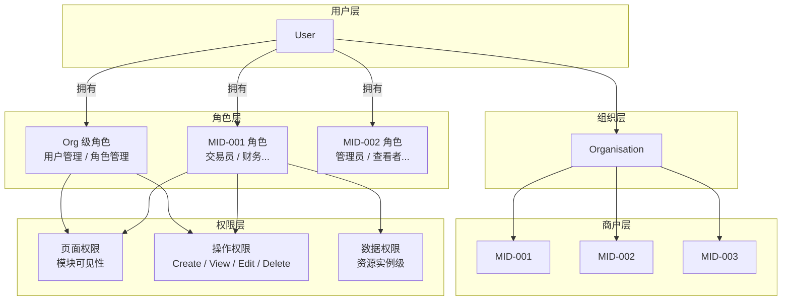
```mermaid
graph TB
    subgraph "用户层"
        U[User]
    end

    subgraph "组织层"
        O[Organisation]
    end

    subgraph "商户层"
        M1[MID-001]
        M2[MID-002]
        M3[MID-003]
    end

    subgraph "角色层"
        OR[Org 级角色<br/>用户管理 / 角色管理]
        MR1[MID-001 角色<br/>交易员 / 财务...]
        MR2[MID-002 角色<br/>管理员 / 查看者...]
    end

    subgraph "权限层"
        P1[页面权限<br/>模块可见性]
        P2[操作权限<br/>Create / View / Edit / Delete]
        P3[数据权限<br/>资源实例级]
    end

    U --> O
    O --> M1
    O --> M2
    O --> M3

    U -->|拥有| OR
    U -->|拥有| MR1
    U -->|拥有| MR2

    OR --> P1
    OR --> P2
    MR1 --> P1
    MR1 --> P2
    MR1 --> P3
```

### 1.2 核心实体关系

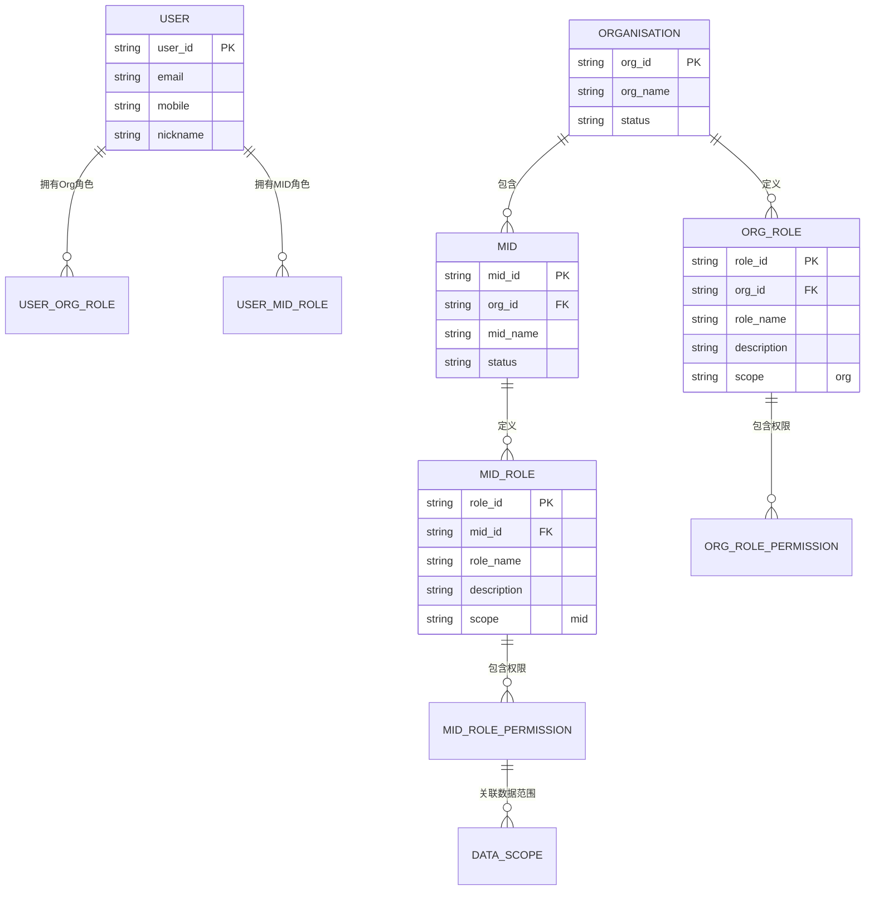
```mermaid
erDiagram
    USER ||--o{ USER_ORG_ROLE : "拥有Org角色"
    USER ||--o{ USER_MID_ROLE : "拥有MID角色"
    ORGANISATION ||--o{ MID : "包含"
    ORGANISATION ||--o{ ORG_ROLE : "定义"
    MID ||--o{ MID_ROLE : "定义"
    ORG_ROLE ||--o{ ORG_ROLE_PERMISSION : "包含权限"
    MID_ROLE ||--o{ MID_ROLE_PERMISSION : "包含权限"
    MID_ROLE_PERMISSION ||--o{ DATA_SCOPE : "关联数据范围"

    USER {
        string user_id PK
        string email
        string mobile
        string nickname
    }
    ORGANISATION {
        string org_id PK
        string org_name
        string status
    }
    MID {
        string mid_id PK
        string org_id FK
        string mid_name
        string status
    }
    ORG_ROLE {
        string role_id PK
        string org_id FK
        string role_name
        string description
        string scope "org"
    }
    MID_ROLE {
        string role_id PK
        string mid_id FK
        string role_name
        string description
        string scope "mid"
    }
```

---

## 2. 模块总览与 Scope

### 2.1 本期 Scope

| 维度                | In Scope                                                                   | Out of Scope                                                           |
| ------------------- | -------------------------------------------------------------------------- | ---------------------------------------------------------------------- |
| **组织结构**  | Organisation → MID 两层数据模型                                           | 多级组织树（Org → Sub-Org → MID）                                    |
| **角色**      | 自定义角色（Org级 + MID级）``一个User可拥有多个角色``一个User可在多个MID下 | 预设角色模板（Owner/Admin/Member等）``角色继承（子角色继承父角色权限） |
| **页面权限**  | 按模块控制可见性                                                           | 按子菜单/按钮级控制                                                    |
| **操作权限**  | 按模块设置两级：“仅查阅”（View Only）/“可操作”（Operable）                | 细粒度 CRUD+Manage（Create/View/Edit/Delete/Manage）→ V2``字段级权限 |
| **数据权限**  | 资源实例级（如指定共享账户）``区分"自己的"vs"所有"                         | 数据 Location 权限（按国家/地区过滤数据）``时间范围权限                |
| **Org级权限** | 用户管理、角色管理                                                         | 创建MID、全局报表、全局设置（后期）                                    |
| **用户管理**  | 邀请用户、分配角色、用户状态管理                                           | Department / Location / Employment type / Manager 字段``HRIS 集成      |
| **工作台**    | 根据权限动态生成/配置                                                      | —                                                                     |

### 2.2 分期规划

```
V1（本期）：
├── Organisation → MID 两层数据模型
├── 自定义角色（Org级 + MID级）
├── 三层权限：页面（模块级）+ 操作 + 数据
├── Org级权限：用户管理、角色管理
├── MID级权限：按模块配置（框架，模块列表待确定）
├── 用户管理：邀请、状态、角色分配
└── 工作台根据权限动态生成

V2（后期）：
├── 操作权限细化：“可操作”拆分为 Create/Edit/Delete/Manage/Export
├── 预设角色模板
├── Org级权限扩展：创建MID、全局报表
├── 更多数据权限场景
├── 数据 Location 权限
├── 审批流（操作审批）
└── Department / Manager 等组织字段
```

---

## 3. Organisation → MID 两层结构

### 3.1 结构说明

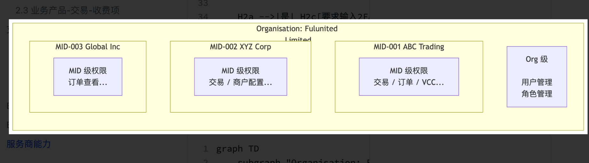

```mermaid

```

### 3.2 Org 级 vs MID 级

| 维度               | Org 级                           | MID 级                           |
| ------------------ | -------------------------------- | -------------------------------- |
| **作用范围** | 跨所有 MID                       | 仅限当前 MID                     |
| **本期权限** | 用户管理、角色管理               | 页面 + 操作 + 数据权限           |
| **角色定义** | 在 Org 下创建                    | 在 MID 下创建                    |
| **典型角色** | Org Admin（管理所有用户和角色）  | 交易员、财务、查看者等           |
| **谁能配置** | Org 级角色中有"角色管理"权限的人 | MID 级角色中有"角色管理"权限的人 |

### 3.3 User 在两层结构中的关系

```mermaid
graph LR
    subgraph "User: 张三"
        U1[user_id: U001]
    end

    subgraph "Org: Fulunited Limited"
        OR1["Org角色: Org Admin<br/>权限: 用户管理 ✅ 角色管理 ✅"]
    end

    subgraph "MID-001: ABC Trading"
        MR1["MID角色: 交易管理员<br/>权限: 交易模块 ✅ 订单模块 ✅"]
        MR1b["MID角色: VCC操作员<br/>权限: VCC模块 ✅ 数据: 共享账户A"]
    end

    subgraph "MID-002: XYZ Corp"
        MR2["MID角色: 查看者<br/>权限: 所有模块 View Only"]
    end

    U1 --> OR1
    U1 --> MR1
    U1 --> MR1b
    U1 --> MR2
```

**说明：**

- 张三在 Org 级有 `Org Admin` 角色 → 可以管理用户和角色
- 张三在 MID-001 下有两个角色：`交易管理员` + `VCC操作员` → 权限取并集
- 张三在 MID-002 下有 `查看者` 角色 → 只能查看
- 多角色权限合并规则：**取并集（Union）**，即任一角色有该权限就生效

---

## 4. 角色体系

### 4.1 角色分类

| 分类                       | 说明                                        | 本期支持 |
| -------------------------- | ------------------------------------------- | -------- |
| **Org 级自定义角色** | 在 Organisation 下创建，控制 Org 级权限     | ✅       |
| **MID 级自定义角色** | 在 MID 下创建，控制 MID 级权限              | ✅       |
| **预设角色模板**     | 系统预设的角色（如 Owner / Admin / Viewer） | ❌ 后期  |

### 4.2 创建自定义角色流程

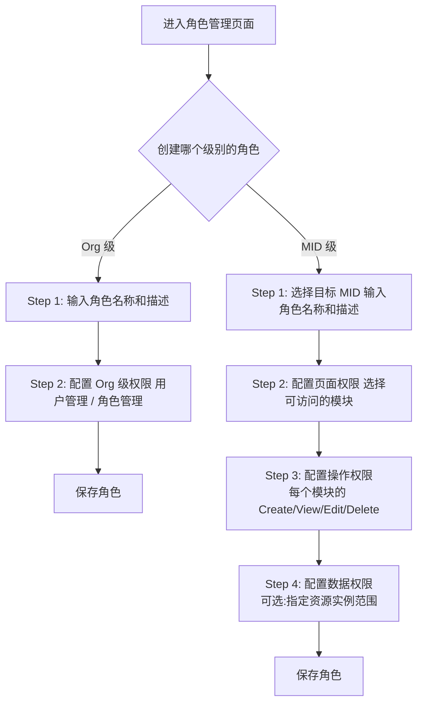
```mermaid
flowchart TD
    A[进入角色管理页面] --> B{创建哪个级别的角色}

    B -->|Org 级| C1[Step 1: 输入角色名称和描述]
    B -->|MID 级| C2[Step 1: 选择目标 MID 输入角色名称和描述]

    C1 --> D1[Step 2: 配置 Org 级权限 用户管理 / 角色管理]
    C2 --> D2[Step 2: 配置页面权限 选择可访问的模块]

    D1 --> E1[保存角色]

    D2 --> F2[Step 3: 配置操作权限<br/>每个模块的 Create/View/Edit/Delete]
    F2 --> G2[Step 4: 配置数据权限<br/>可选:指定资源实例范围]
    G2 --> E2[保存角色]
```

### 4.3 角色属性

| 属性                      | 说明                       |
| ------------------------- | -------------------------- |
| **role_id**         | 唯一标识                   |
| **role_name**       | 角色名称（如"交易管理员"） |
| **description**     | 角色描述（可选）           |
| **scope**           | `org` 或 `mid`         |
| **org_id / mid_id** | 所属 Organisation 或 MID   |
| **permissions**     | 该角色拥有的权限列表       |
| **created_by**      | 创建人                     |
| **created_at**      | 创建时间                   |
| **status**          | Active / Disabled          |

### 4.4 多角色权限合并

一个 User 在同一个 MID 下可拥有多个角色，权限合并规则：

```
最终权限 = Org角色权限 ∪ MID角色1权限 ∪ MID角色2权限 ∪ ...
```

**示例：**

```
User 张三 在 MID-001 下有两个角色：

角色A "交易员":
  页面权限: 订单中心 ✅
  操作权限: 订单 → View ✅, Create ✅
  数据权限: 所有订单

角色B "VCC操作员":
  页面权限: VCC模块 ✅
  操作权限: VCC → View ✅, Create ✅, Edit ✅
  数据权限: 仅共享账户A

合并后张三的权限:
  页面权限: 订单中心 ✅, VCC模块 ✅
  操作权限: 订单 → View ✅, Create ✅
             VCC → View ✅, Create ✅, Edit ✅
  数据权限: 订单 → 所有
             VCC → 仅共享账户A
```

---

## 5. 三层权限模型

### 5.1 权限层次

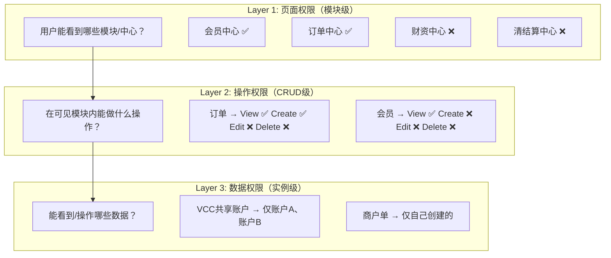
```mermaid
graph TD
    subgraph "Layer 1: 页面权限（模块级）"
        P1["用户能看到哪些模块/中心？"]
        P1a["会员中心 ✅"]
        P1b["订单中心 ✅"]
        P1c["财资中心 ❌"]
        P1d["清结算中心 ❌"]
    end

    subgraph "Layer 2: 操作权限（CRUD级）"
        P2["在可见模块内能做什么操作？"]
        P2a["订单 → View ✅ Create ✅ Edit ❌ Delete ❌"]
        P2b["会员 → View ✅ Create ❌ Edit ❌ Delete ❌"]
    end

    subgraph "Layer 3: 数据权限（实例级）"
        P3["能看到/操作哪些数据？"]
        P3a["VCC共享账户 → 仅账户A、账户B"]
        P3b["商户单 → 仅自己创建的"]
    end

    P1 --> P2 --> P3
```

### 5.2 Layer 1: 页面权限（模块级）

控制用户能看到哪些模块/中心。不可见的模块在导航菜单中隐藏。

**权限粒度：模块/中心级**（不细到子菜单）

| 模块/中心    | 说明                                                                | 权限标识               | 角色级别 |
| ------------ | ------------------------------------------------------------------- | ---------------------- | -------- |
| 客户中心     | 商户管理、商户审核、产品配置、费率配置、返点管理                    | `module:client`      | MID      |
| 交易中心     | VA账户、收付款单、换汇、Ramp、VCC、收单、交易监控、差错处理         | `module:transaction` | MID      |
| 清结算中心   | 计费管理、汇率配置、对账、清分、结算、商户余额、账务核算            | `module:settlement`  | MID      |
| 资金中心     | 资金账户、资金调拨、外汇管理、头寸、备付金                          | `module:treasury`    | MID      |
| 渠道中心     | 渠道管理、路由规则、渠道费率、渠道监控                              | `module:channel`     | MID      |
| 合作伙伴中心 | 销售代理、机构代理、代理返点、分佣结算、上游管理                    | `module:partner`     | MID      |
| 开发者中心   | API文档、密钥管理、Webhooks、沙箱环境                               | `module:developer`   | MID      |
| 工单中心     | 工单管理、审批流程、工单模板                                        | `module:ticket`      | MID      |
| 数据中心     | 交易/商户/财务/渠道/代理报表、数据导出                              | `module:data`        | MID      |
| 风控合规中心 | 交易风控、KYC/KYB、AML监控、合规报告、拒付管理                      | `module:risk`        | MID      |
| Settings     | 企业信息、组织管理（部门/成员/角色/权限）、通知、系统配置、审计日志 | `module:settings`    | Org      |
| 用户管理     | 用户和角色管理（Org级，包含在 Settings 中）                         | `module:user_mgmt`   | Org      |

> **注意：** 工作台（Dashboard）所有人都有，但内容根据权限动态生成。Settings 和用户管理属于 Org 级权限，其余模块属于 MID 级权限。

### 5.3 Layer 2: 操作权限（CRUD级）

在可见模块内，控制用户能执行哪些操作。

**标准操作类型：**

| 操作             | 标识       | 说明                             |
| ---------------- | ---------- | -------------------------------- |
| **View**   | `view`   | 查看/列表/详情                   |
| **Create** | `create` | 新建/发起                        |
| **Edit**   | `edit`   | 修改/更新                        |
| **Delete** | `delete` | 删除/作废                        |
| **Manage** | `manage` | 管理级操作（如配置、审核、分配） |
| **Export** | `export` | 导出数据                         |

**操作权限矩阵示例：**

```
模块: 交易中心
┌─────────────────┬──────┬────────┬──────┬────────┬────────┬────────┐
│ 资源              │ View │ Create │ Edit │ Delete │ Manage │ Export │
├─────────────────┼──────┼────────┼──────┼────────┼────────┼────────┤
│ VA账户            │  ☑   │   ☐    │  ☐   │   ☐    │   ☐    │   ☐   │
│ 收款单            │  ☑   │   ☑    │  ☐   │   ☐    │   ☐    │   ☑   │
│ 付款单            │  ☑   │   ☑    │  ☐   │   ☐    │   ☐    │   ☑   │
│ 换汇单            │  ☑   │   ☐    │  ☐   │   ☐    │   ☐    │   ☐   │
│ Ramp单            │  ☑   │   ☑    │  ☐   │   ☐    │   ☐    │   ☑   │
│ VCC单             │  ☑   │   ☑    │  ☑   │   ☐    │   ☐    │   ☑   │
│ 收单单            │  ☑   │   ☐    │  ☐   │   ☐    │   ☐    │   ☑   │
│ 调单管理          │  ☑   │   ☑    │  ☑   │   ☐    │   ☑    │   ☐   │
│ 退款管理          │  ☑   │   ☑    │  ☐   │   ☐    │   ☑    │   ☐   │
│ 拒付管理          │  ☑   │   ☐    │  ☐   │   ☐    │   ☑    │   ☐   │
│ 订单管理          │  ☑   │   ☑    │  ☑   │   ☐    │   ☐    │   ☑   │
│ 店铺管理          │  ☑   │   ☑    │  ☑   │   ☑    │   ☐    │   ☐   │
└─────────────────┴──────┴────────┴──────┴────────┴────────┴────────┘
```

> **注意：** 每个模块下的具体资源和操作待各模块确定后补充。以上为示例格式。

**权限标识格式：** `{scope}:{module}:{resource}:{action}`

```
示例:
mid:transaction:payin_order:view     — MID级，交易中心，收款单，查看
mid:transaction:payin_order:create   — MID级，交易中心，收款单，创建
mid:transaction:chargeback:manage    — MID级，交易中心，拒付管理，管理
org:user_mgmt:user:manage            — Org级，用户管理，用户，管理
mid:client:merchant_rate:edit        — MID级，客户中心，商户费率，编辑
mid:settlement:reconciliation:view   — MID级，清结算中心，对账，查看
mid:partner:agent_rebate:manage      — MID级，合作伙伴中心，代理返点，管理
```

### 5.4 Layer 3: 数据权限（实例级）

控制用户能访问哪些具体数据实例。

**本期支持的数据权限类型：**

| 类型               | 说明                     | 示例                         |
| ------------------ | ------------------------ | ---------------------------- |
| **ALL**      | 可访问该资源的所有数据   | 查看所有商户单               |
| **OWN**      | 只能访问自己创建的数据   | 只看自己创建的商户单         |
| **ASSIGNED** | 只能访问被分配的特定实例 | 只能访问 VCC 共享账户 A 和 B |

**数据权限配置示例：**

```
角色: VCC操作员
├── 页面权限: VCC模块 ✅
├── 操作权限: VCC → View ✅, Create ✅, Edit ✅
└── 数据权限:
    ├── 类型: ASSIGNED
    └── 实例: [共享账户A, 共享账户B]

角色: 订单查看者
├── 页面权限: 订单中心 ✅
├── 操作权限: 订单 → View ✅（其他全 ❌）
└── 数据权限:
    ├── 类型: OWN
    └── 说明: 只能查看自己创建的订单
```

**数据权限配置流程：**

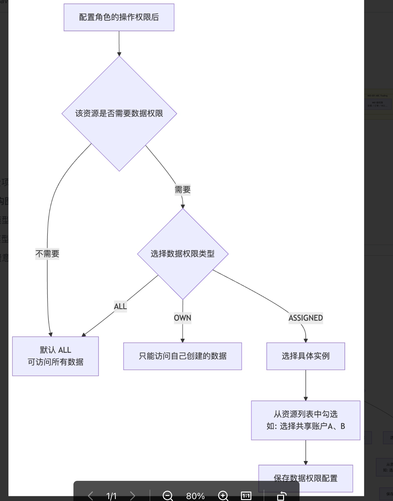

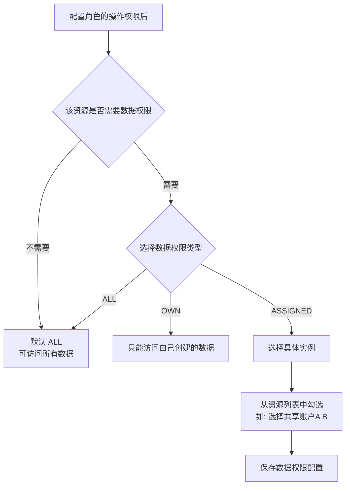
```mermaid
flowchart TD
    A[配置角色的操作权限后] --> B{该资源是否需要数据权限}

    B -->|不需要| C[默认 ALL<br/>可访问所有数据]
    B -->|需要| D{选择数据权限类型}

    D -->|ALL| C
    D -->|OWN| E[只能访问自己创建的数据]
    D -->|ASSIGNED| F[选择具体实例]

    F --> G[从资源列表中勾选<br/>如: 选择共享账户A B]
    G --> H[保存数据权限配置]
```

### 5.5 本期 Out of Scope 的数据权限

| 场景          | 说明                                            | 状态    |
| ------------- | ----------------------------------------------- | ------- |
| 数据 Location | 按国家/地区过滤数据（如只看某些国家的牌照数据） | ❌ 后期 |
| 时间范围      | 只能查看某时间段内的数据                        | ❌ 后期 |
| 金额范围      | 只能操作某金额范围内的交易                      | ❌ 后期 |
| 字段级        | 某些字段不可见或不可编辑                        | ❌ 后期 |

---

## 6. 权限配置流程

### 6.1 创建 Org 级角色

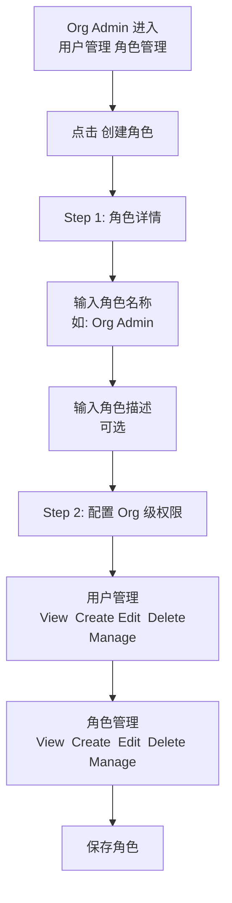
```mermaid
flowchart TD
    A[Org Admin 进入<br/>用户管理 角色管理] --> B[点击 创建角色]

    B --> C[Step 1: 角色详情]
    C --> C1[输入角色名称<br/>如: Org Admin]
    C1 --> C2[输入角色描述<br/>可选]

    C2 --> D[Step 2: 配置 Org 级权限]
    D --> D1["用户管理<br/> View  Create Edit  Delete Manage"]
    D1 --> D2["角色管理<br/> View  Create  Edit  Delete  Manage"]

    D2 --> E[保存角色]
```

### 6.2 创建 MID 级角色

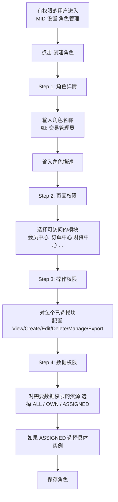
```mermaid
flowchart TD
    A[有权限的用户进入<br/>MID 设置  角色管理] --> B[点击 创建角色 ]

    B --> C[Step 1: 角色详情]
    C --> C1[输入角色名称<br/>如: 交易管理员]
    C1 --> C2[输入角色描述]

    C2 --> D[Step 2: 页面权限]
    D --> D1["选择可访问的模块<br/> 会员中心  订单中心 财资中心 ..."]

    D1 --> E[Step 3: 操作权限]
    E --> E1["对每个已选模块<br/>配置 View/Create/Edit/Delete/Manage/Export"]

    E1 --> F[Step 4: 数据权限]
    F --> F1["对需要数据权限的资源 选择 ALL / OWN / ASSIGNED"]
    F1 --> F2["如果 ASSIGNED 选择具体实例"]

    F2 --> G[保存角色]
```

### 6.3 分配角色给用户

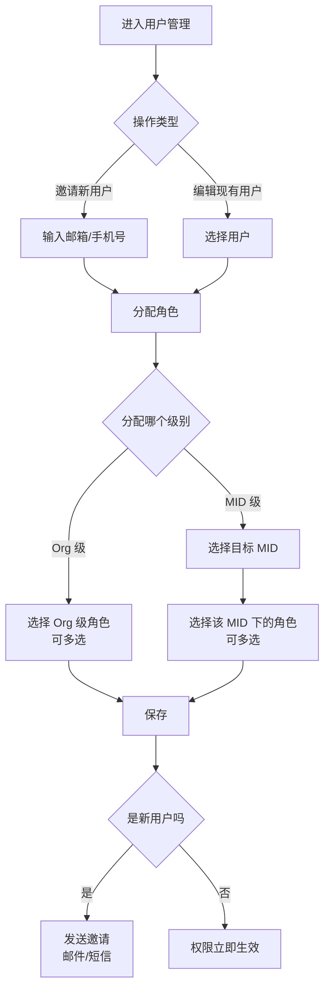
```mermaid
flowchart TD
    A[进入用户管理] --> B{操作类型}

    B -->|邀请新用户| C[输入邮箱/手机号]
    B -->|编辑现有用户| D[选择用户]

    C --> E[分配角色]
    D --> E

    E --> E1{分配哪个级别}
    E1 -->|Org 级| F1[选择 Org 级角色<br/>可多选]
    E1 -->|MID 级| F2[选择目标 MID]

    F2 --> F3[选择该 MID 下的角色<br/>可多选]

    F1 --> G[保存]
    F3 --> G

    G --> H{是新用户吗}
    H -->|是| I[发送邀请<br/>邮件/短信]
    H -->|否| J[权限立即生效]
```

### 6.4 权限配置 UI 示意

**创建角色 - Step 2: 页面权限**

```
┌─────────────────────────────────────────────────────┐
│  Create role                                    ✕   │
│                                                     │
│  ● Enter role details  ✓                            │
│  ● Set up page permissions  ←                       │
│  ○ Set up action permissions                        │
│  ○ Set up data permissions                          │
│                                                     │
│  Select which modules this role can access:         │
│                                                     │
│  ☑ 客户中心       商户管理、产品配置、费率、返点        │
│  ☑ 交易中心       VA、收付款、换汇、VCC、交易监控       │
│  ☐ 清结算中心     计费、对账、清分、结算、账务           │
│  ☐ 资金中心       资金账户、调拨、外汇、头寸             │
│  ☐ 渠道中心       渠道管理、路由、监控                   │
│  ☐ 合作伙伴中心   代理商、返点、分佣                     │
│  ☐ 开发者中心     API、密钥、Webhooks、沙箱              │
│  ☐ 工单中心       工单管理、审批流程                     │
│  ☑ 数据中心       交易/商户/财务报表                     │
│  ☐ 风控合规中心   风控规则、KYC、AML、拒付               │
│                                                     │
│                          [Back]  [Continue]          │
└─────────────────────────────────────────────────────┘
```

**创建角色 - Step 3: 操作权限**

```
┌─────────────────────────────────────────────────────┐
│  Create role                                    ✕   │
│                                                     │
│  ● Enter role details  ✓                            │
│  ● Set up page permissions  ✓                       │
│  ● Set up action permissions  ←                     │
│  ○ Set up data permissions                          │
│                                                     │
│  Configure actions for each selected module:        │
│                                                     │
│  ── 客户中心 ──────────────────────────────────      │
│  商户列表         ☑ View  ☐ Edit  ☐ Export          │
│  商户审核         ☑ View  ☐ Manage                  │
│  商户开通产品     ☑ View  ☑ Edit  ☑ Manage          │
│  商户费率配置     ☑ View  ☑ Edit  ☑ Manage          │
│  商户返点规则     ☑ View  ☐ Edit  ☐ Manage          │
│                                                     │
│  ── 交易中心 ──────────────────────────────────      │
│  VA账户          ☑ View  ☐ Create  ☐ Edit  ☐ Export │
│  收款单           ☑ View  ☑ Create  ☐ Edit  ☑ Export│
│  付款单           ☑ View  ☑ Create  ☐ Edit  ☑ Export│
│  换汇单           ☑ View  ☐ Create  ☐ Edit  ☐ Export│
│  VCC单            ☑ View  ☑ Create  ☑ Edit  ☑ Export│
│  调单管理         ☑ View  ☑ Create  ☑ Edit  ☑ Manage│
│                                                     │
│                          [Back]  [Continue]          │
└─────────────────────────────────────────────────────┘
```

**创建角色 - Step 4: 数据权限**

```
┌─────────────────────────────────────────────────────┐
│  Create role                                    ✕   │
│                                                     │
│  ● Enter role details  ✓                            │
│  ● Set up page permissions  ✓                       │
│  ● Set up action permissions  ✓                     │
│  ● Set up data permissions  ←                       │
│                                                     │
│  Configure data access scope:                       │
│                                                     │
│  ── VCC ────────────────────────────────────         │
│  VCC共享账户                                         │
│  ○ All accounts    ● Assigned accounts               │
│                                                     │
│  Select accounts:                                   │
│  ☑ 共享账户 A (SA-001)                               │
│  ☑ 共享账户 B (SA-002)                               │
│  ☐ 共享账户 C (SA-003)                               │
│  ☐ 共享账户 D (SA-004)                               │
│                                                     │
│  ── 订单 ───────────────────────────────────         │
│  商户单                                              │
│  ○ All orders    ● Own orders only                   │
│                                                     │
│                          [Back]  [Save role]         │
└─────────────────────────────────────────────────────┘
```

---

## 7. 用户管理

### 7.1 用户管理功能概览

```
┌─────────────────────────────────────────────────────┐
│  User Management                    [+ Invite user] │
│                                                     │
│  ┌──────────────┐ ┌──────────────┐ ┌──────────────┐│
│  │ Invitation   │ │ User status  │ │              ││
│  │ Ready    0   │ │ Active    3  │ │              ││
│  │ Invited  1   │ │ Suspended 0  │ │              ││
│  │ Expired  0   │ │ Removed   0  │ │              ││
│  └──────────────┘ └──────────────┘ └──────────────┘│
│                                                     │
│  🔍 Search name or email                            │
│  [Roles ▾]  [Status ▾]                              │
│                                                     │
│  ┌─────────────────────────────────────────────────┐│
│  │ User              Roles           MIDs     ··· ││
│  ├─────────────────────────────────────────────────┤│
│  │ 张三              Org Admin       All      ··· ││
│  │ zhang@test.com    交易管理员(M1)              ││
│  ├─────────────────────────────────────────────────┤│
│  │ 李四              VCC操作员(M1)   MID-001  ··· ││
│  │ li@test.com       查看者(M2)     MID-002      ││
│  ├─────────────────────────────────────────────────┤│
│  │ 王五              [Invited]       —        ··· ││
│  │ wang@test.com                                   ││
│  └─────────────────────────────────────────────────┘│
└─────────────────────────────────────────────────────┘
```

### 7.2 邀请用户流程

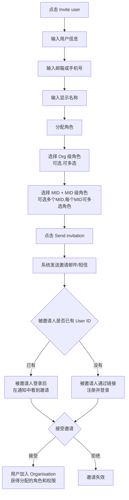
```mermaid
flowchart TD
    A[点击 Invite user] --> B[输入用户信息]

    B --> C[输入邮箱或手机号]
    C --> D[输入显示名称]
    D --> E[分配角色]

    E --> E1[选择 Org 级角色<br/>可选,可多选]
    E1 --> E2[选择 MID + MID 级角色<br/>可选多个MID,每个MID可多选角色]

    E2 --> F[点击 Send invitation]
    F --> G[系统发送邀请邮件/短信]

    G --> H{被邀请人是否已有 User ID}
    H -->|已有| I[被邀请人登录后<br/>在通知中看到邀请]
    H -->|没有| J[被邀请人通过链接<br/>注册并登录]

    I --> K{接受邀请}
    J --> K

    K -->|接受| L[用户加入 Organisation<br/>获得分配的角色和权限]
    K -->|拒绝| M[邀请失效]
```

### 7.3 用户状态管理

| 状态                | 说明                   | 可执行操作                  |
| ------------------- | ---------------------- | --------------------------- |
| **Active**    | 正常使用               | Suspend / Remove / 修改角色 |
| **Suspended** | 暂停（保留数据和角色） | Activate / Remove           |
| **Removed**   | 已移除（角色清空）     | Re-invite                   |

**邀请状态：**

| 状态                         | 说明                 |
| ---------------------------- | -------------------- |
| **Ready to invite**    | 已创建但未发送邀请   |
| **Invited**            | 已发送邀请，等待接受 |
| **Invitation expired** | 邀请超过 7 天未接受  |

### 7.4 用户操作菜单（··· 按钮）

```
┌────────────────────┐
│ Edit roles         │
│ Suspend user       │
│ Remove user        │
└────────────────────┘
```

---

## 8. Use Case

### 8.1 角色管理 Use Case

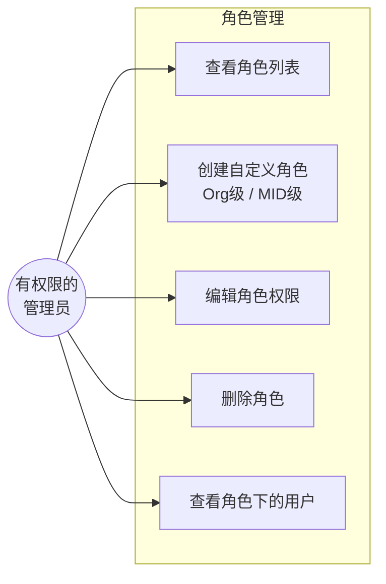
```mermaid
graph LR
    Admin((有权限的<br/>管理员))

    subgraph "角色管理"
        UC1[查看角色列表]
        UC2[创建自定义角色<br/>Org级 / MID级]
        UC3[编辑角色权限]
        UC4[删除角色]
        UC5[查看角色下的用户]
    end

    Admin --> UC1
    Admin --> UC2
    Admin --> UC3
    Admin --> UC4
    Admin --> UC5
```

### 8.2 用户管理 Use Case

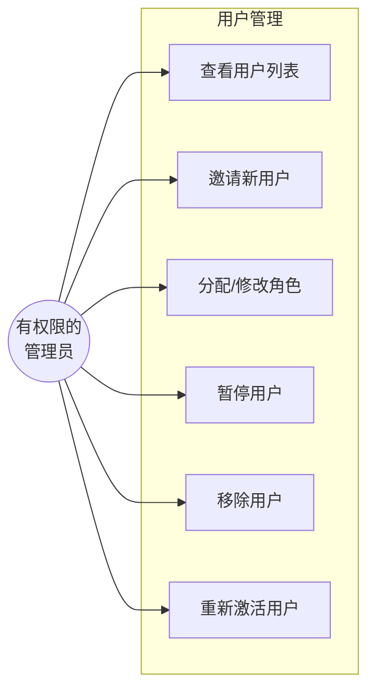
```mermaid
graph LR
    Admin((有权限的<br/>管理员))

    subgraph "用户管理"
        UC1[查看用户列表]
        UC2[邀请新用户]
        UC3[分配/修改角色]
        UC4[暂停用户]
        UC5[移除用户]
        UC6[重新激活用户]
    end

    Admin --> UC1
    Admin --> UC2
    Admin --> UC3
    Admin --> UC4
    Admin --> UC5
    Admin --> UC6
```

### 8.3 权限校验 Use Case

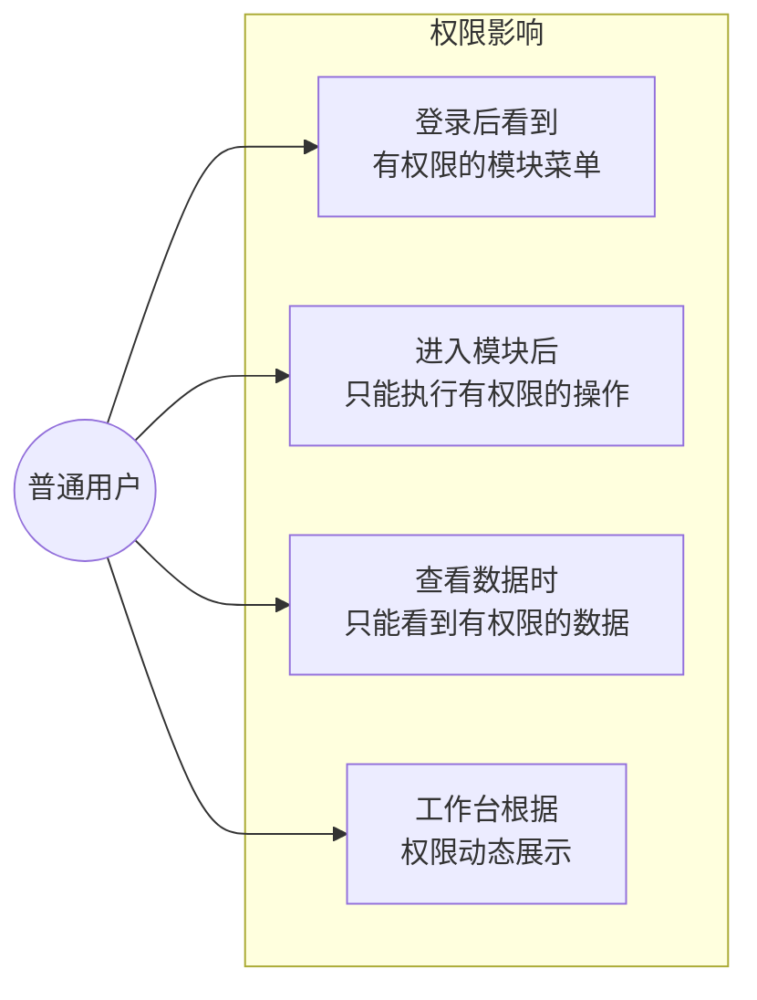
```mermaid
graph LR
    User((普通用户))

    subgraph "权限影响"
        UC1[登录后看到<br/>有权限的模块菜单]
        UC2[进入模块后<br/>只能执行有权限的操作]
        UC3[查看数据时<br/>只能看到有权限的数据]
        UC4[工作台根据<br/>权限动态展示]
    end

    User --> UC1
    User --> UC2
    User --> UC3
    User --> UC4
```

---

## 9. 鉴权流程

### 9.1 页面访问鉴权

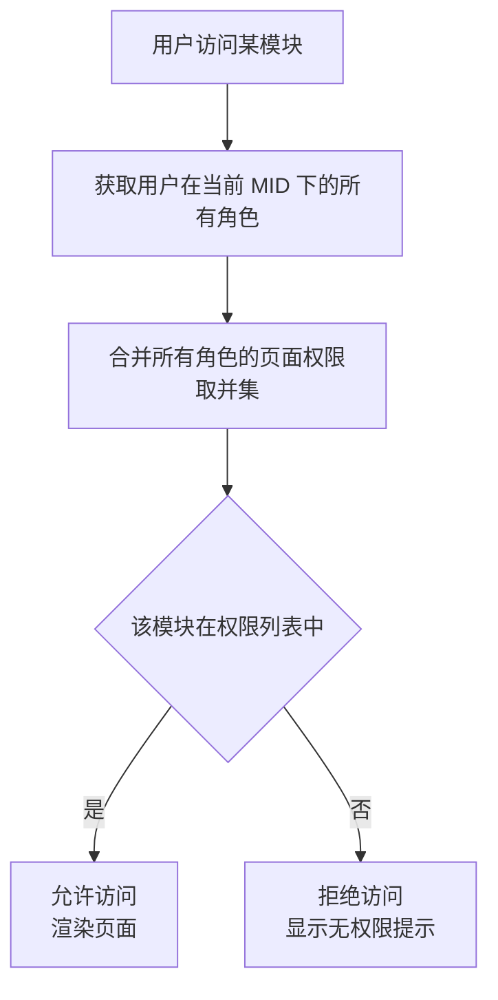
```mermaid
flowchart TD
    A[用户访问某模块] --> B[获取用户在当前 MID 下的所有角色]
    B --> C[合并所有角色的页面权限<br/>取并集]
    C --> D{该模块在权限列表中}

    D -->|是| E[允许访问<br/>渲染页面]
    D -->|否| F[拒绝访问<br/>显示无权限提示]
```

### 9.2 操作鉴权

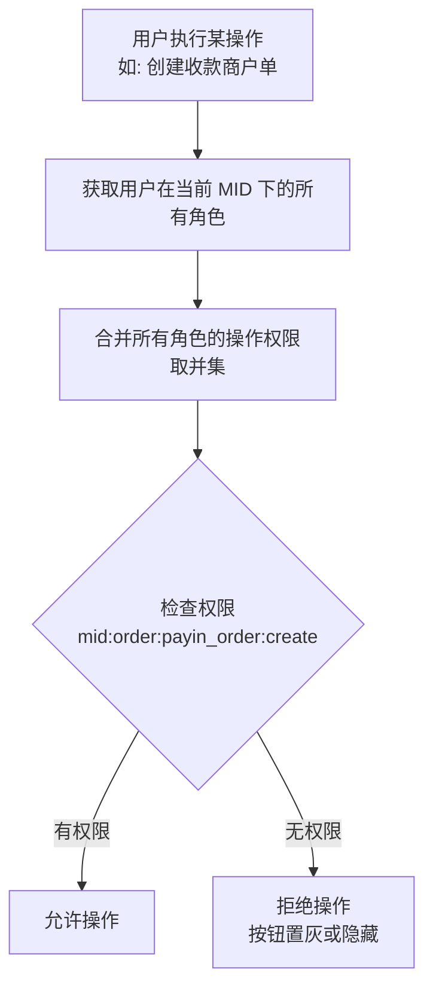
```mermaid
flowchart TD
    A[用户执行某操作<br/>如: 创建收款商户单] --> B[获取用户在当前 MID 下的所有角色]
    B --> C[合并所有角色的操作权限<br/>取并集]
    C --> D{检查权限<br/>mid:order:payin_order:create}

    D -->|有权限| E[允许操作]
    D -->|无权限| F[拒绝操作<br/>按钮置灰或隐藏]
```

### 9.3 数据鉴权

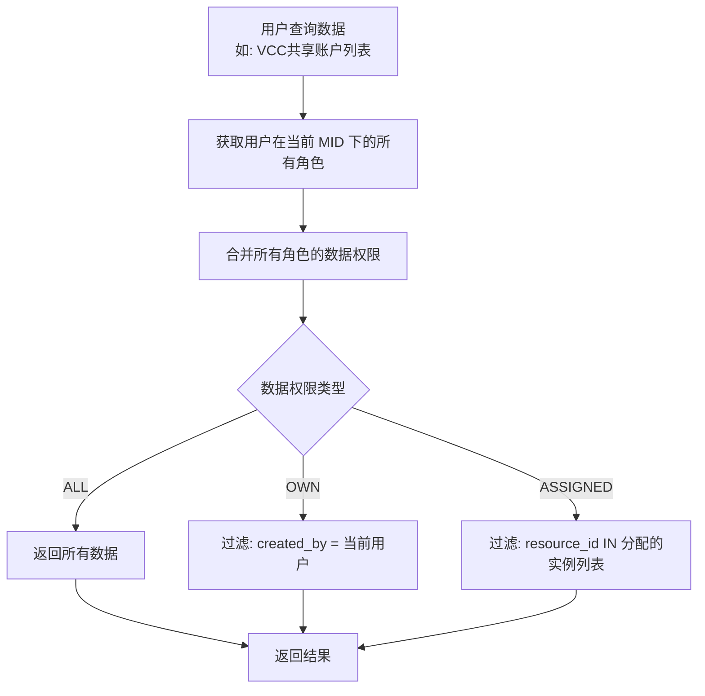
```mermaid
flowchart TD
    A[用户查询数据<br/>如: VCC共享账户列表] --> B[获取用户在当前 MID 下的所有角色]
    B --> C[合并所有角色的数据权限]
    C --> D{数据权限类型}

    D -->|ALL| E[返回所有数据]
    D -->|OWN| F[过滤: created_by = 当前用户]
    D -->|ASSIGNED| G[过滤: resource_id IN 分配的实例列表]

    E --> H[返回结果]
    F --> H
    G --> H
```

### 9.4 完整鉴权链路

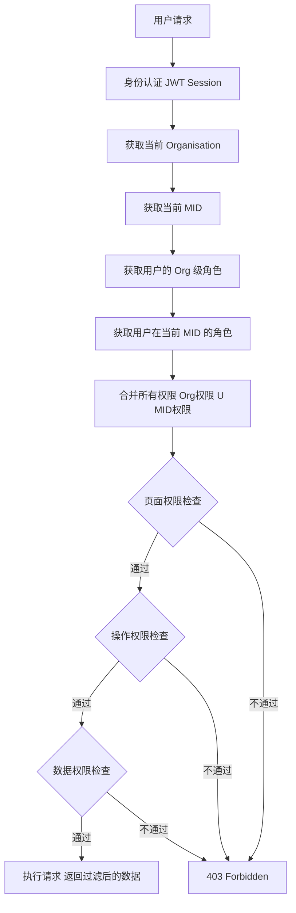
```mermaid
flowchart TD
    A[用户请求] --> B[身份认证 JWT Session]
    B --> C[获取当前 Organisation]
    C --> D[获取当前 MID]
    D --> E[获取用户的 Org 级角色]
    E --> F[获取用户在当前 MID 的角色]
    F --> G[合并所有权限 Org权限 U MID权限]

    G --> H{页面权限检查}
    H -->|通过| I{操作权限检查}
    H -->|不通过| X[403 Forbidden]

    I -->|通过| J{数据权限检查}
    I -->|不通过| X

    J -->|通过| K[执行请求 返回过滤后的数据]
    J -->|不通过| X
```

---

## 10. 支付密码（Payment Password）

### 10.1 概述

支付密码是一个 **按 MID 维度** 设置的 6 位数字 PIN，用于在用户执行敏感资金操作（如发起付款、转账、提现等）时进行二次身份验证。

**核心规则：**

- 支付密码按 MID 独立设置，同一用户在不同 MID 下可以有不同的支付密码
- 支付密码是 **可选的**，不强制设置
- 支付密码的设置入口在 User Center → Security → Payment password

### 10.2 设置前提条件

用户必须 **同时满足** 以下条件，才能看到并设置某个 MID 的支付密码：

| 条件 | 说明 |
| --- | --- |
| **拥有该 MID 的资金操作相关页面权限** | 用户在该 MID 下的角色包含涉及资金操作的模块（如 Payouts、Transfer Out、Exchange 等） |
| **该页面权限为"可操作"** | 仅拥有"仅查阅"权限的用户无需设置支付密码，因为无法发起任何资金操作 |

```
判断逻辑：

IF user.hasMIDRole(mid)
   AND user.hasModulePermission(mid, [Payouts | Transfer Out | Exchange | ...])
   AND user.getOperationLevel(mid, module) == "可操作"
THEN
   显示该 MID 的支付密码设置入口
ELSE
   隐藏该 MID 的支付密码设置入口
```

### 10.3 设置流程

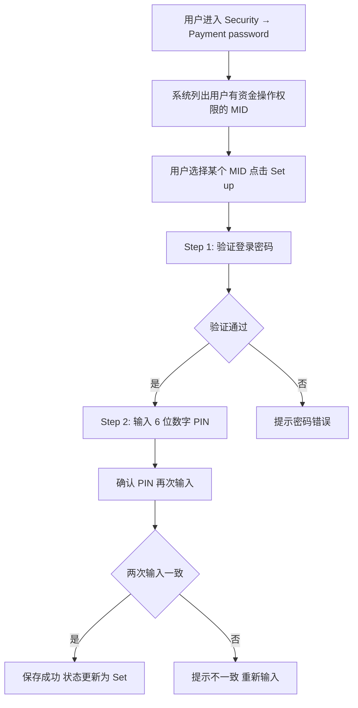
```mermaid
flowchart TD
    A[用户进入 Security → Payment password] --> B[系统列出用户有资金操作权限的 MID]
    B --> C[用户选择某个 MID 点击 Set up]
    C --> D[Step 1: 验证登录密码]
    D --> E{验证通过}
    E -->|是| F[Step 2: 输入 6 位数字 PIN]
    E -->|否| G[提示密码错误]
    F --> H[确认 PIN 再次输入]
    H --> I{两次输入一致}
    I -->|是| J[保存成功 状态更新为 Set]
    I -->|否| K[提示不一致 重新输入]
```

### 10.4 权限变更场景

#### 场景 A：用户已设置支付密码，后续失去资金操作权限

| 项目 | 说明 |
| --- | --- |
| **触发条件** | 角色被修改、角色被移除、用户被降级为"仅查阅" |
| **支付密码状态** | 保留，不自动删除 |
| **安全影响** | **无**。用户已无法进入资金操作页面，支付密码不会被触发 |
| **UI 表现** | Security 页面不再显示该 MID 的支付密码入口 |
| **恢复权限后** | 支付密码自动恢复生效，无需重新设置 |

#### 场景 B：用户原来无权限，后续获得资金操作权限

| 项目 | 说明 |
| --- | --- |
| **触发条件** | 被分配了包含资金操作模块且为"可操作"的角色 |
| **支付密码状态** | 未设置（Not set） |
| **UI 表现** | Security 页面出现该 MID 的支付密码入口，显示 "Not set" + "Set up" 按钮 |
| **是否强制设置** | 否。用户可以选择不设置 |

#### 场景 C：用户未设置支付密码，但有资金操作权限

| 项目 | 说明 |
| --- | --- |
| **验证方式** | 回退到手机号/邮箱验证码作为安全验证方式 |
| **用户体验** | 发起资金操作时，系统发送验证码到用户已验证的手机号或邮箱 |
| **安全等级** | 可接受，但建议用户设置支付密码以获得更便捷的验证体验 |

### 10.5 资金操作验证流程

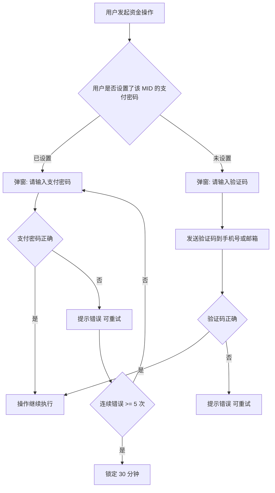
```mermaid
flowchart TD
    A[用户发起资金操作] --> B{用户是否设置了该 MID 的支付密码}
    B -->|已设置| C[弹窗: 请输入支付密码]
    B -->|未设置| D[弹窗: 请输入验证码]

    C --> E{支付密码正确}
    E -->|是| F[操作继续执行]
    E -->|否| G[提示错误 可重试]
    G --> G1{连续错误 >= 5 次}
    G1 -->|是| G2[锁定 30 分钟]
    G1 -->|否| C

    D --> D1[发送验证码到手机号或邮箱]
    D1 --> D2{验证码正确}
    D2 -->|是| F
    D2 -->|否| D3[提示错误 可重试]
```

### 10.6 数据模型

```
PAYMENT_PASSWORD {
    string user_id FK        -- 用户 ID
    string mid_id FK         -- MID ID
    string password_hash     -- 加密存储的 6 位 PIN
    datetime created_at      -- 创建时间
    datetime updated_at      -- 最后修改时间
    int fail_count           -- 连续失败次数
    datetime locked_until    -- 锁定截止时间（NULL = 未锁定）
}

主键: (user_id, mid_id)
```

### 10.7 安全规则

| 规则 | 说明 |
| --- | --- |
| **存储** | 支付密码必须加密存储（bcrypt/argon2），不可明文 |
| **连续错误锁定** | 连续输错 5 次，锁定 30 分钟 |
| **修改支付密码** | 需先验证登录密码 |
| **忘记支付密码** | 通过登录密码 + 手机号/邮箱验证码重置 |
| **与登录密码的关系** | 支付密码独立于登录密码，建议不要设置相同的值 |

---

## 11. 状态机

### 11.1 角色状态

```
ACTIVE ←→ DISABLED
    ↓
  DELETED
```

| 状态               | 说明                           |
| ------------------ | ------------------------------ |
| **ACTIVE**   | 正常使用，权限生效             |
| **DISABLED** | 已禁用，权限不生效，但保留配置 |
| **DELETED**  | 已删除，不可恢复               |

**删除角色规则：**

- 如果角色下还有用户，需先移除所有用户或将用户迁移到其他角色
- 删除后不可恢复

### 11.2 用户-角色关联状态

```
ASSIGNED → ACTIVE
              ↕
          SUSPENDED
              ↓
          REMOVED
```

### 11.3 邀请状态

```
CREATED → SENT → ACCEPTED
                    ↓
               REJECTED
                    ↓
               EXPIRED（7天未处理）
```

---

## 附录

### A. 权限标识命名规范

```
格式: {scope}:{module}:{resource}:{action}

scope:    org | mid
module:   client | transaction | settlement | treasury | channel | partner | developer | ticket | data | risk | settings | user_mgmt
resource: 具体资源名（snake_case）
action:   view | create | edit | delete | manage | export

示例:
org:user_mgmt:user:view              — 查看用户列表
org:user_mgmt:role:create            — 创建角色
org:settings:company_info:edit       — 编辑公司信息
mid:client:merchant:view             — 查看商户列表
mid:client:merchant_rate:manage      — 管理商户费率
mid:transaction:payin_order:create   — 创建收款单
mid:transaction:vcc_order:edit       — 编辑VCC单
mid:settlement:rate_template:manage  — 管理费率模板
mid:partner:agent:view               — 查看代理商
mid:risk:aml_monitor:view            — 查看AML监控
```

### B. 多角色权限合并规则

| 场景     | 规则                                     |
| -------- | ---------------------------------------- |
| 页面权限 | 并集：任一角色有该模块权限即可见         |
| 操作权限 | 并集：任一角色有该操作权限即可执行       |
| 数据权限 | 并集：ALL > ASSIGNED > OWN（取最宽范围） |

**数据权限合并示例：**

```
角色A: VCC数据权限 = ASSIGNED [账户A, 账户B]
角色B: VCC数据权限 = ASSIGNED [账户B, 账户C]
合并后: ASSIGNED [账户A, 账户B, 账户C]

角色A: 订单数据权限 = OWN
角色B: 订单数据权限 = ALL
合并后: ALL（取最宽）
```

### C. 错误提示

| 场景       | 提示                                                           |
| ---------- | -------------------------------------------------------------- |
| 无页面权限 | "You don't have permission to access this module."             |
| 无操作权限 | "You don't have permission to perform this action."            |
| 无数据权限 | "You don't have access to this resource."                      |
| 角色被禁用 | "Your role has been disabled. Contact your administrator."     |
| 用户被暂停 | "Your account has been suspended. Contact your administrator." |

---

*最后更新：2026-02-12*
*文档版本：v1.2*
*作者：EX Product Team*
