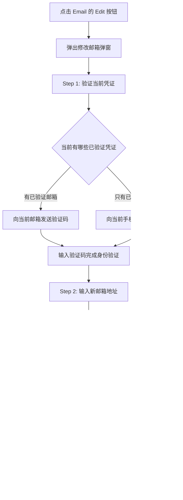

# EX Platform - 用户系统与登录 PRD

> 版本：v2.0 | 更新日期：2026-02-13 | 关联页面：mp-login.html / mp-register.html

## 文档概述

本文档定义EX平台用户系统的产品需求，涵盖用户注册登录、登录安全验证策略、用户中心（Profile & Security）以及用户与商户（MID）的关系模型。

**核心设计理念：**

- ✅ **验证码登录即注册**：无需单独注册流程，首次验证码登录自动创建账户
- ✅ **多凭证支持**：一个User可绑定多个登录凭证（邮箱/手机号）
- ✅ **多商户关联**：一个User可在多个MID下，且角色可不同
- ✅ **安全优先**：支持密码 + 2FA双因素认证，风险分级动态验证，保障账户安全

---

## 1. 系统架构概览

### 1.1 用户系统整体架构


### 1.2 User-MID 关系模型


**关键关系：**

- **User ↔ Credential**：一对多，一个User可绑定多个邮箱/手机号
- **User ↔ MID**：多对多，一个自然人可属于多个MID，一个MID可有多个自然人
- **User-MID角色**：每个User在不同MID下可拥有不同角色（Owner / Admin / Member）

---

## 2. Scope

### 2.1 登录注册模块

**In Scope：**
① 邮箱验证码登录（登录即注册）　② 手机号验证码登录（登录即注册）　③ 密码登录（邮箱/手机号 + 密码）　④ OTP动态令牌登录　⑤ 基于IP自动识别国家区号　⑥ 密码强度校验（≥8位，含字母+数字+符号）　⑦ 验证码发送与校验（5分钟有效期）　⑧ 首次登录创建User ID并设置昵称　⑨ 登录风险分级动态验证（CAPTCHA / 账户冻结）

**Out of Scope：**
① 第三方登录（Google / Apple / WeChat）　② SSO单点登录　③ 企业域名登录　④ 生物识别登录（指纹/面容）　⑤ 登录IP白名单

### 2.2 User Profile 模块

**In Scope：**
① Contact & Login Method 管理（Email/Mobile 查看/修改/验证状态，Login method 选择）　② 昵称设置（含默认昵称规则）　③ 语言偏好设置　④ 修改凭证需验证旧凭证

**Out of Scope：**
① 头像上传　② 时区设置　③ 通知偏好设置　④ 关联账户管理　⑤ 助手/代理人管理　⑥ 账号注销

### 2.3 Security 模块

**In Scope：**
① 密码修改（需验证旧密码）　② 2FA双因素认证（Authenticator App TOTP + SMS验证码）　③ Recovery Codes

**Out of Scope：**
① 登录历史/设备管理　② 会话管理（强制登出）　③ API Key管理　④ 安全日志审计　⑤ 账号冻结/解冻

---

## 3. Use Case

### 3.1 登录注册 Use Case


### 3.2 User Center Use Case


---

## 4. 登录注册模块

### 4.1 验证码登录/注册流程

**核心规则：验证码登录即注册，无需单独注册入口。**


### 4.2 登录方式对应关系

- **验证码登录**：邮箱/手机 + 6位验证码（验证码注册用户的默认登录方式）
- **密码登录**：邮箱/手机 + 密码（密码注册用户的默认登录方式）
- **OTP 动态令牌登录**：邮箱/手机 + Authenticator 动态码（绑定OTP的用户可选）

若账户同时绑定了多种凭证（如既设了密码又绑了 OTP），可自行选择任一方式登录。

### 4.3 IP自动识别区号


- 根据用户当前IP地址判断所在国家，自动填充国际区号
- IP无法识别时默认 **+1**（美国）
- 下拉选择器支持按国家名称或区号搜索

### 4.4 密码强度规则

密码必须同时满足：≥8位、至少1个大写字母（A-Z）、至少1个小写字母（a-z）、至少1个数字（0-9）或特殊符号。输入时实时逐条校验，满足显示 ✅，未满足显示 ○。

### 4.5 验证码规则

- 6位数字，有效期5分钟
- 同一凭证60秒内只能发送1次，每天最多10次
- 连续5次输入错误，冻结账户24小时
- 找TE客服，TE客服解除冻结

### 4.6 首次登录后行为


**默认昵称规则：**

- 邮箱注册：取 `@` 前部分（如 `john@test.com` → `john`）
- 手机号注册：`User_` + 后4位（如 `+852 96412374` → `User_2374`）

---

## 5. 登录安全验证策略

### 5.1 三级风险模型

系统根据登录行为实时评估风险等级，动态叠加验证要求：

- **L0 无风险**：常用设备 + 常用IP + 常用地区 + 无异常行为 → 仅凭证验证，直接登录
- **L1 低风险**：新设备 / 新浏览器 / 长时间未登录（>7天）/ 清除Cookie / 连续错误3次 → 凭证 + **图形验证码（CAPTCHA）**
- **L2 高风险**：连续错误≥5次 / 异地+新设备组合 / 暴力破解特征 / 账户被标记可疑 → **冻结账户24小时** + 邮件/短信安全通知

### 5.2 风险评分维度

后端风险引擎综合以下维度计算风险分值（0-100）：

- **设备指纹（25%）**：浏览器UA、屏幕分辨率、时区、语言、Canvas/WebGL指纹
- **IP信誉（25%）**：地理位置、VPN/代理/Tor检测、IP黑名单、ASN信誉
- **行为模式（20%）**：登录频率、输入速度、鼠标轨迹、页面停留时间
- **历史记录（20%）**：上次登录时间/地点、错误累计次数、账户年龄
- **账户状态（10%）**：未处理安全事件、近期密码修改、举报记录

分值映射：0-30 → L0 | 31-70 → L1 | 71-100 → L2

### 5.3 凭证错误累计规则

- **1-2次**：提示"密码/验证码错误，请重试"，维持当前风险等级
- **3次**：强制触发**图形验证码**（升级至L1），提示"多次输入错误，请完成安全验证"
- **≥5次**：**冻结账户24小时**（升级至L2），发送安全告警邮件/短信，建议用户重置密码

> 错误计数在成功登录后重置。冻结期间的登录尝试不计入错误次数。

### 5.4 图形验证码（CAPTCHA）

- 类型：滑动拼图验证（推荐）或点选文字验证
- 触发时机：风险等级 ≥ L1 时，在凭证输入前展示
- 有效期：单次有效，120秒超时需重新验证
- 连续失败3次 → 刷新验证码类型
- 提供音频验证码备选方案（无障碍）

---

## 6. 登录流程与异常处理

### 6.1 登录主流程


### 6.2 三种登录方式

**A. 密码登录：** 输入邮箱/手机 → [CAPTCHA(L1)] → 输入密码 → [2FA(如已开启)] → 登录成功。支持显示/隐藏密码切换，提供"忘记密码？"链接。

**B. 验证码登录：** 输入邮箱/手机 → [CAPTCHA(L1)] → 发送验证码 → 输入6位验证码 → 登录成功。有效期5分钟，60秒后可重发。验证码本身已是身份验证，无需额外2FA。

**C. OTP动态令牌登录：** 输入邮箱/手机 → [CAPTCHA(L1)] → 输入Authenticator 6位动态码 → 登录成功。动态码30秒刷新，连续3次错误建议检查时间同步。

### 6.3 账户冻结（L2）

**触发条件：** 连续凭证错误≥5次 / 风险评分≥71

- 冻结时长：**24小时**
- 页面显示倒计时剩余冻结时间
- 操作入口："通过邮件解冻" / "联系客服"
- 系统发送安全告警到注册邮箱/手机，含冻结时间、触发原因（模糊描述）、非本人操作建议
- 邮件中包含一键解冻链接（有效期30分钟）

### 6.4 忘记密码


- 新密码不能与最近3次使用的密码相同
- 密码强度实时提示

### 6.5 其他异常场景

- **账户不存在**：不明确提示"该邮箱未注册"（防枚举攻击），密码场景统一提示"邮箱或密码错误"，验证码场景正常走发送流程但后端不实际发送
- **新设备首次登录成功**：发送通知邮件/短信，含时间、设备信息、IP地址、地理位置，提供"不是我？立即冻结账户"链接

### 6.6 登录成功后行为

- **单一身份**：直接进入MP首页
- **多端身份（TP+MP）**：进入上次使用的端，可通过顶部切换
- **多MID**：进入上次使用的MID，可通过顶部切换
- **首次登录（新注册）**：进入引导页（开通产品/完善KYB）
- **强制修改密码**：跳转修改密码页（如管理员重置了密码）

---

## 7. User Center - Profile

### 7.1 Contact & Login Method

#### Email 管理

显示当前绑定邮箱及验证状态（Verified / Unverified）。

**修改邮箱流程：**



#### Mobile 管理

显示当前绑定手机号（含区号）及验证状态。

**修改手机号流程：**


#### Login Method 设置

用户可选择默认登录方式（Email或Mobile）。只有已验证凭证才能设为Login Method。仅绑定一个凭证时自动成为Login Method。修改无需额外验证。

#### 添加第二个凭证


### 7.2 Basic Info

- **昵称**：2-30个字符，支持中文/英文/数字/下划线，不支持特殊符号和emoji，修改无需验证
- **语言偏好**：English / 简体中文 / 繁體中文（可扩展），修改后立即生效，默认根据IP地区自动设置

---

## 8. User Center - Security

### 8.1 密码修改


- 新密码不能与当前密码相同
- 修改成功后，其他设备的登录状态不受影响（本期）

### 8.2 Two-Factor Authentication (2FA)

#### Authenticator App


已启用后管理（··· 按钮）：Set as Default / Regenerate（需验证身份）/ Disable

#### SMS 2FA


- 前提：必须已绑定并验证手机号
- 修改手机号后，SMS 2FA 自动绑定到新手机号

#### 2FA 登录流程


### 8.3 Recovery Codes

用于丢失2FA设备时恢复账户访问。


- 每次生成10个，格式为8位字母数字组合（如 `a1b2-c3d4`）
- 每个Code只能使用一次
- 重新生成后旧Codes全部失效

---

## 9. User与MID关系模型

### 9.1 关系概览


### 9.2 角色定义

- **Owner**：商户创建者/所有者，全部权限，包括删除商户、管理成员角色
- **Admin**：管理员，大部分管理权限，不能删除商户、不能修改Owner
- **Member**：普通成员，查看权限为主，有限的操作权限

### 9.3 创建商户流程


### 9.4 邀请成员加入商户


### 9.5 商户切换

```mermaid
flowchart TD
    A[User 登录成功] --> B{User 属于几个 MID}

    B -->|1个| C[直接进入该商户工作台]
    B -->|多个| D[显示商户选择页面<br/>列出所有关联的MID]

    D --> E[User 选择一个商户]
    E --> F[进入该商户工作台<br/>权限按该MID下的角色控制]

    F --> G[顶部导航栏显示<br/>当前商户名称 + 切换按钮]
    G --> H[点击切换按钮<br/>可随时切换到其他商户]
    H --> D
```

### 9.6 Owner 定义与认证

Owner 必须满足以下条件之一：

- **开户人**：创建MID并提交KYC/产品开通申请的人，系统自动认定
- **法人（Legal Representative）**：公司法定代表人，需身份认证（人脸识别/手机号验证/线下材料）
- **董事（Director）**：公司董事会成员，需身份认证

```mermaid
flowchart TD
    A[MID创建] --> B[开户人自动成为 Owner]

    B --> C{是否需要变更Owner}
    C -->|不需要| D[开户人继续作为Owner]
    C -->|需要| E[发起Owner变更申请]

    E --> F{新Owner身份类型}
    F -->|法人| G1[提交法人身份信息]
    F -->|董事| G2[提交董事身份信息]

    G1 --> H[身份认证]
    G2 --> H

    H --> H1{认证方式}
    H1 -->|线上| H2[人脸识别 + 手机号验证]
    H1 -->|线下| H3[提交身份材料<br/>由平台/SP人工审核]

    H2 --> I{认证通过}
    H3 --> I

    I -->|通过| J[Owner变更成功<br/>原Owner降级为Admin]
    I -->|失败| K[认证失败<br/>保持原Owner不变]
```

Owner 专属权限（不可转让给Admin/Member）：变更Owner、删除/注销MID、设置安全联系人、管理Admin角色。

---

## 10. 状态机

### 10.1 User 状态

```
ACTIVE ←→ SUSPENDED
  ↓
DELETED（Out of Scope，本期不做）
```

- **ACTIVE**：正常使用状态
- **SUSPENDED**：账户被暂停（如安全风险）

### 10.2 凭证（Credential）状态

```
UNVERIFIED → VERIFIED
     ↑          ↓
     └── CHANGED（修改后重新验证）
```

- **UNVERIFIED**：已绑定但未验证
- **VERIFIED**：已通过验证码验证

### 10.3 2FA 状态

```
NOT_SET → ENABLED ←→ DISABLED
              ↓
          DEFAULT（被设为默认2FA方式）
```

- **NOT_SET**：未设置
- **ENABLED**：已启用
- **DISABLED**：已禁用
- **DEFAULT**：已启用且为默认2FA方式

### 10.4 邀请状态

```
PENDING → ACCEPTED
    ↓
REJECTED
    ↓
EXPIRED（超过7天未处理）
```

---

## 11. 安全合规与数据埋点

### 11.1 安全策略

- **密码传输**：HTTPS + 前端加密（RSA公钥加密后传输）
- **密码存储**：bcrypt/argon2 哈希 + 随机盐值，禁止明文存储
- **验证码传输**：通过HTTPS加密传输
- **2FA密钥存储**：加密存储TOTP Secret
- **Recovery Codes**：哈希存储，使用后标记为已用
- **会话管理**：JWT Token + HttpOnly Cookie，支持单点登录/踢出
- **登录日志**：记录所有登录尝试（成功/失败），保留180天
- **CAPTCHA**：接入第三方服务（如 reCAPTCHA / hCaptcha / 极验）
- **频率限制**：同一IP每分钟最多10次登录请求
- **PCI DSS**：符合 PCI DSS v4.0 第8章身份验证要求

### 11.2 错误码与提示信息

- 验证码过期："Verification code has expired. Please request a new one."
- 验证码错误："Invalid verification code. Please try again."
- 验证码发送频率限制："Please wait 60 seconds before requesting a new code."
- 验证码每日上限："You've reached the daily limit. Please try again tomorrow."
- 密码强度不足：实时显示未满足的具体规则
- 两次密码不一致："Passwords do not match."
- 当前密码错误："Current password is incorrect."
- 邮箱已被绑定："This email is already associated with another account."
- 手机号已被绑定："This phone number is already associated with another account."
- Recovery Code 无效："Invalid recovery code. Please try another one."
- 2FA验证失败："Invalid authentication code. Please try again."

### 11.3 数据埋点

- **login_page_view**：method_type, risk_level — 登录页访问量
- **login_attempt**：method_type, risk_level, result — 登录尝试分析
- **captcha_show**：captcha_type, risk_level — CAPTCHA触发率
- **captcha_result**：captcha_type, success/fail — CAPTCHA通过率
- **account_frozen**：error_count — 冻结频率分析
- **password_reset**：trigger_source — 密码重置来源

---

*最后更新：2026-02-13*
*文档版本：v2.0*
*作者：EX Product Team*
