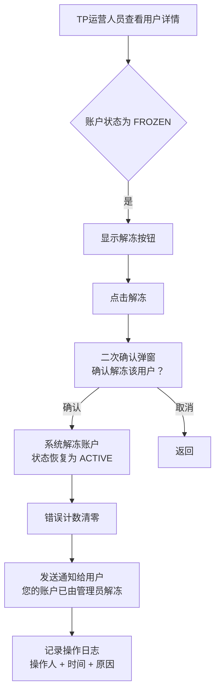
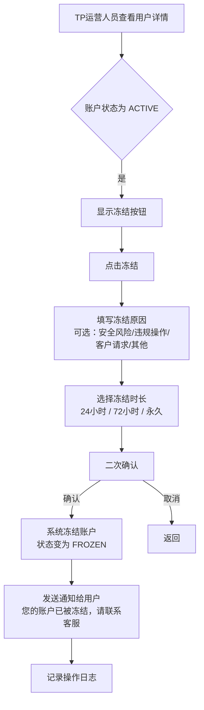
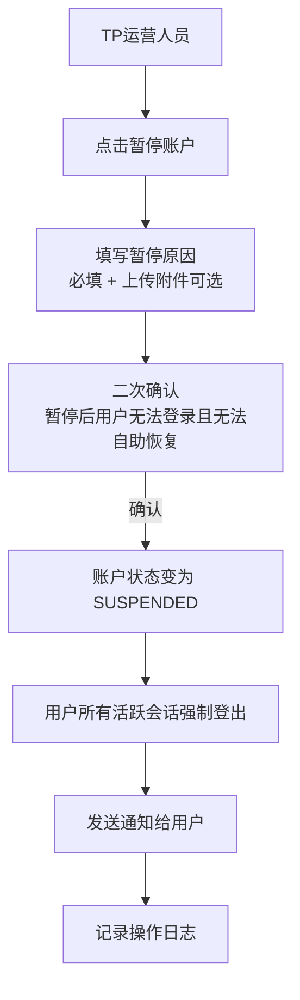
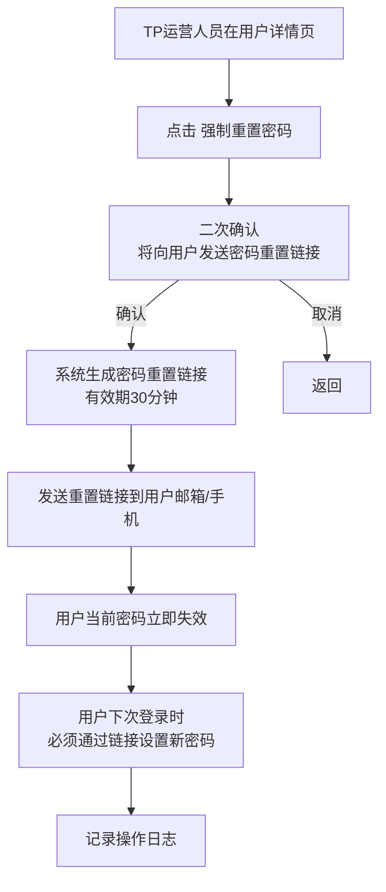
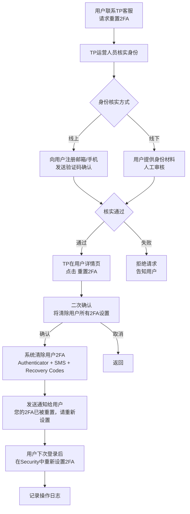
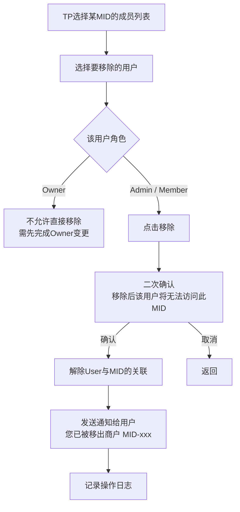
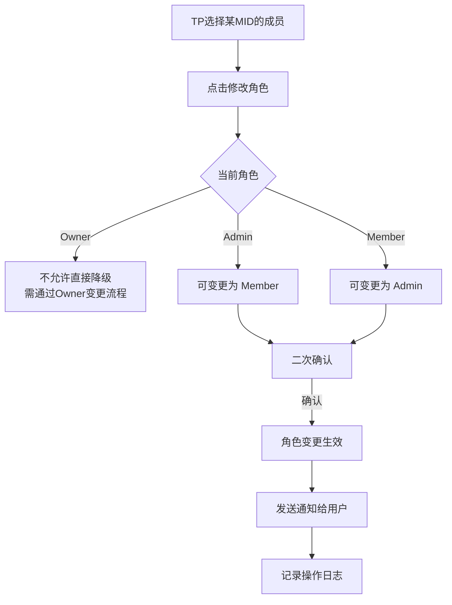
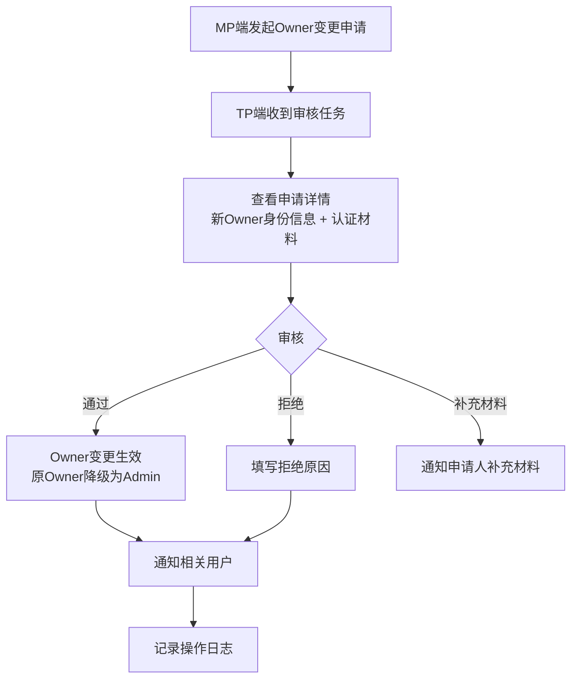

# TP 客户中心 - 用户管理 PRD

> 版本：v1.0 | 更新日期：2026-02-13 | 关联文档：mp-login-prd.md

## 文档概述

本文档定义 TP（租户）端客户中心中"用户管理"模块的产品需求。TP 运营人员通过该模块查看和管理其下属商户（MID）的用户信息，处理账户安全事件（冻结/解冻、密码重置、2FA重置等），以及管理用户与MID的关联关系。

**与 MP 端的关系：** MP 端用户自助完成注册登录、Profile 修改、Security 设置（详见 mp-login-prd.md），TP 端则是从管理侧对这些用户进行查看、运维和安全干预。

---

## 1. Scope

**In Scope：**
- ① 查看商户下所有用户列表及详情（基本信息、登录凭证、安全状态）
- ② 账户冻结 / 解冻（手动冻结可疑账户、解除自动冻结）
- ③ 强制密码重置（向用户发送重置链接）
- ④ 2FA 重置（用户丢失设备时由 TP 协助重置）
- ⑤ 用户-MID 关联关系管理（查看、移除成员、角色变更）
- ⑥ 登录日志与安全事件查看
- ⑦ Owner 变更申请审核

**Out of Scope：**
- ① 直接修改用户密码（只能触发重置流程，不能代设密码）
- ② 代用户登录 / 模拟登录
- ③ 修改用户 Profile 信息（昵称、语言等由用户自行管理）
- ④ 用户注册（用户通过 MP 端自助注册）
- ⑤ 用户注销/删除（本期不做）

---

## 2. 用户列表

### 2.1 入口

TP 端客户中心 → 选择某个 MID → 用户管理

### 2.2 列表字段

- **User ID**：系统唯一标识
- **昵称**：用户设置的显示名称
- **登录凭证**：邮箱（脱敏显示，如 `j***@test.com`）/ 手机号（脱敏显示，如 `+852 ****2374`）
- **角色**：该用户在当前 MID 下的角色（Owner / Admin / Member）
- **账户状态**：ACTIVE / SUSPENDED / FROZEN
- **2FA 状态**：已启用（显示方式：Authenticator / SMS / 未启用）
- **最后登录时间**：最近一次成功登录的时间
- **加入时间**：用户加入该 MID 的时间

### 2.3 筛选与搜索

- 按角色筛选：Owner / Admin / Member
- 按状态筛选：ACTIVE / SUSPENDED / FROZEN
- 按关键词搜索：User ID / 昵称 / 邮箱 / 手机号（模糊匹配）

---

## 3. 用户详情

点击用户列表中的某个用户，进入用户详情页，包含以下信息模块：

### 3.1 基本信息

- User ID
- 昵称
- 注册时间
- 注册方式（邮箱验证码 / 手机验证码 / 密码注册）

### 3.2 登录凭证

- **邮箱**：地址（脱敏）+ 验证状态（Verified / Unverified）
- **手机号**：号码（脱敏）+ 验证状态（Verified / Unverified）
- **Login Method**：当前默认登录方式（Email / Mobile）

> TP 只能查看凭证信息，不能修改。凭证修改由用户在 MP 端自助完成。

### 3.3 安全状态

- **密码状态**：已设置 / 未设置
- **2FA 状态**：
  - Authenticator App：已启用(Default) / 已启用 / 未启用
  - SMS：已启用(Default) / 已启用 / 未启用
- **Recovery Codes**：已生成 / 未生成
- **账户状态**：ACTIVE / SUSPENDED / FROZEN（含冻结原因和剩余时间）

### 3.4 MID 关联

- 该用户关联的所有 MID 列表
- 每个 MID 下的角色
- 加入时间

> 注意：一个 User 可能属于多个 MID，TP 只能管理自己旗下 MID 的关联关系，不能看到用户在其他 TP 下的 MID。

---

## 4. 账户冻结与解冻

### 4.1 自动冻结（来自 MP 登录安全策略）

根据 mp-login-prd 5.3 凭证错误累计规则，连续错误≥5次时系统自动冻结账户24小时。

TP 端可见信息：
- 冻结状态标记
- 冻结触发原因（连续错误≥5次 / 风险评分≥71）
- 冻结时间
- 剩余冻结时长

### 4.2 TP 手动解冻

- 解冻后用户错误计数清零
- 系统向用户发送解冻通知（邮件/短信）
- 操作记录写入审计日志

### 4.3 TP 手动冻结

- 冻结原因为必填项
- 永久冻结需更高权限（TP Admin 以上）
- 冻结期间用户无法登录 MP 端

### 4.4 账户暂停（SUSPENDED）

与冻结不同，暂停是更严重的状态，通常由合规/风控触发：

- SUSPENDED 状态只能由 TP 手动恢复，用户无法自助解除
- 暂停时强制登出用户所有活跃会话

---

## 5. 密码重置

TP 不能直接设置用户密码，只能触发密码重置流程。

- 触发后用户当前密码立即失效
- 用户可通过验证码方式继续登录（如果有）
- 重置链接有效期30分钟
- 对应 mp-login-prd 6.6 中"强制修改密码"场景

---

## 6. 2FA 重置

用户丢失 2FA 设备且无 Recovery Code 时，需联系 TP 协助重置。

- 重置前必须核实用户身份（防社工攻击）
- 重置会清除所有 2FA 设置（Authenticator + SMS + Recovery Codes）
- 重置后用户可正常登录（无 2FA 要求），需自行重新设置

---

## 7. 用户-MID 关联管理

### 7.1 查看成员列表

TP 可查看某个 MID 下所有关联用户，对应 mp-login-prd 9.x 的 User-MID 关系。

### 7.2 移除成员

- Owner 不能被直接移除，需先变更 Owner
- 移除后用户仍保留 User ID 和其他 MID 的关联

### 7.3 角色变更

### 7.4 Owner 变更审核

对应 mp-login-prd 9.6 Owner 变更流程，当 MP 端发起 Owner 变更申请时，TP 端需要审核：

---

## 8. 登录日志与安全事件

### 8.1 登录日志

TP 可查看其下属 MID 用户的登录日志（对应 mp-login-prd 11.1 登录日志保留180天）。

**日志字段：**
- 时间
- User ID / 昵称
- 登录方式（密码 / 验证码 / OTP）
- 风险等级（L0 / L1 / L2）
- 结果（成功 / 失败 / 冻结）
- IP 地址
- 设备信息（浏览器 + OS）
- 地理位置

**筛选：**
- 按时间范围
- 按用户
- 按结果（成功 / 失败）
- 按风险等级

### 8.2 安全事件

系统自动生成的安全事件，TP 运营人员需关注和处理：

- **账户自动冻结**：连续错误≥5次触发，TP 可选择解冻或保持
- **异地登录告警**：用户在异常地理位置登录成功
- **新设备登录**：用户在未识别设备上登录成功
- **密码重置**：用户自助重置密码
- **2FA 变更**：用户启用/禁用/重置 2FA
- **凭证变更**：用户修改邮箱或手机号

每条安全事件包含：事件类型、触发时间、关联用户、详情描述、当前处理状态（待处理 / 已处理 / 已忽略）。

---

## 9. 操作审计日志

所有 TP 端对用户的管理操作均记录审计日志：

**记录字段：**
- 操作时间
- 操作人（TP 运营人员 User ID + 昵称）
- 操作类型（解冻 / 冻结 / 暂停 / 恢复 / 密码重置 / 2FA重置 / 移除成员 / 角色变更 / Owner变更审核）
- 操作对象（目标 User ID + MID）
- 操作详情（原因、变更前后状态等）
- IP 地址

审计日志不可删除、不可修改，保留期限≥2年（符合合规要求）。

---

## 10. 权限控制

TP 端不同角色对用户管理模块的操作权限：

- **TP Owner**：全部操作权限
- **TP Admin**：查看用户信息、解冻、密码重置、2FA重置、移除成员、角色变更；不能执行永久冻结和账户暂停
- **TP 运营**：查看用户信息、查看登录日志；不能执行冻结/解冻/重置等写操作
- **TP 财务**：无用户管理权限

---

*最后更新：2026-02-13*
*文档版本：v1.0*
*作者：EX Product Team*
