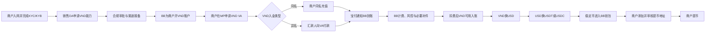
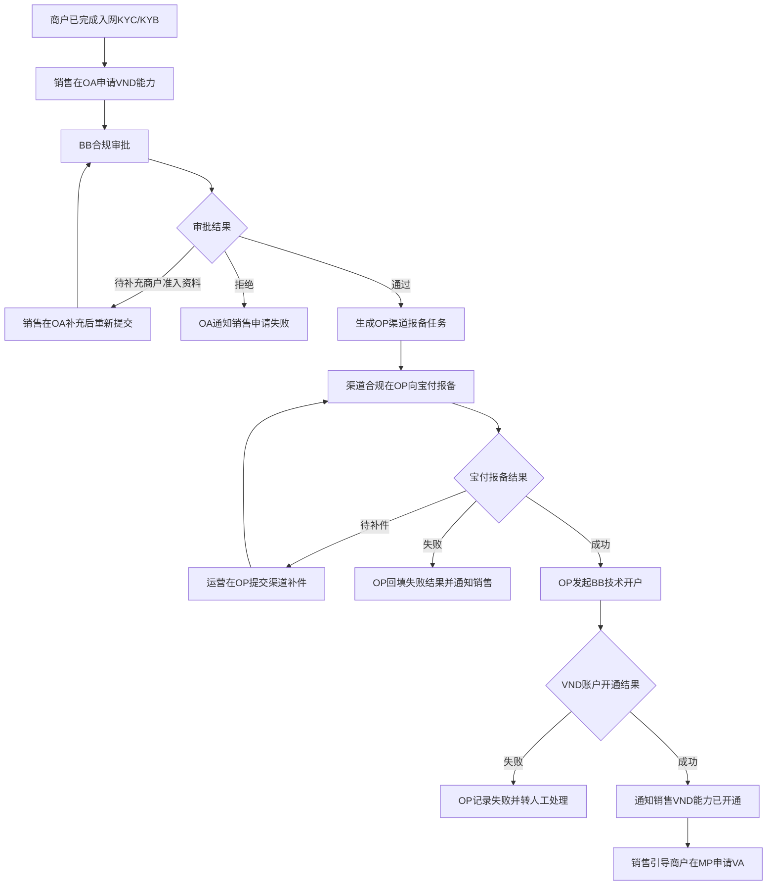
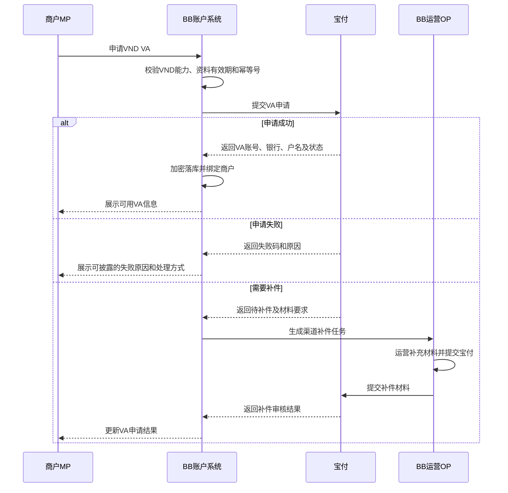
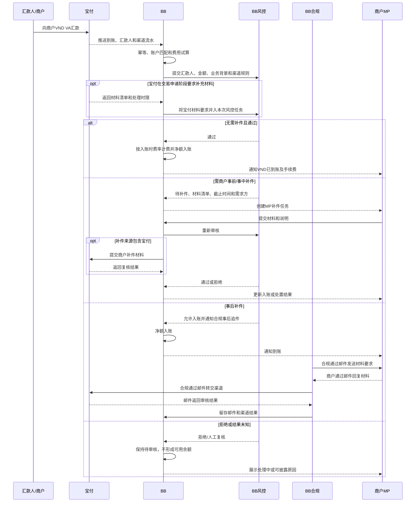
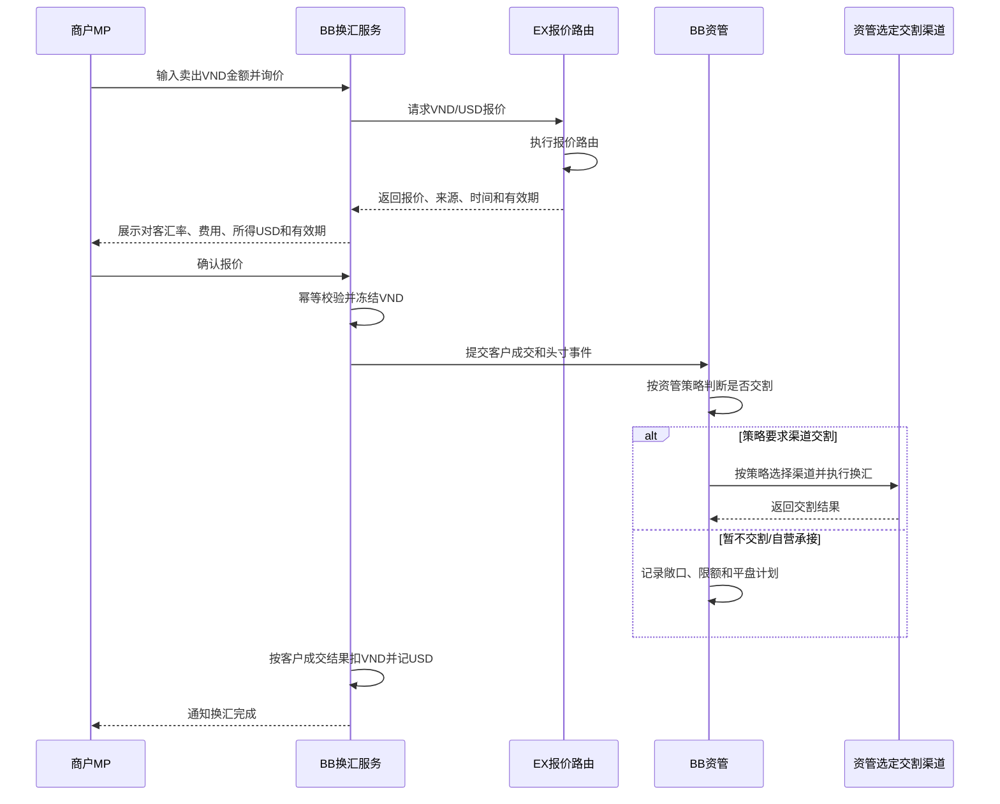
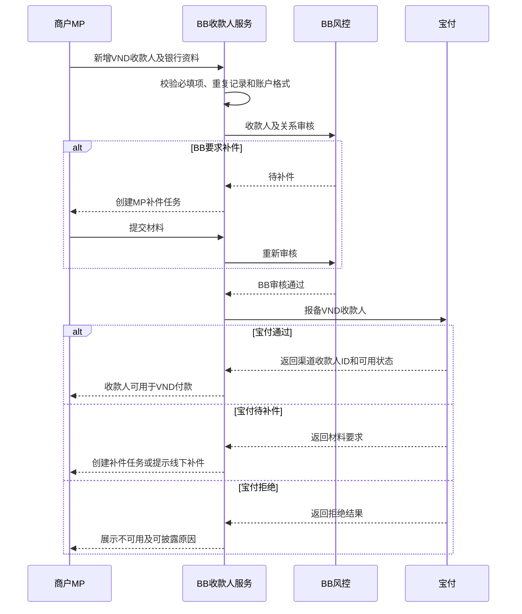
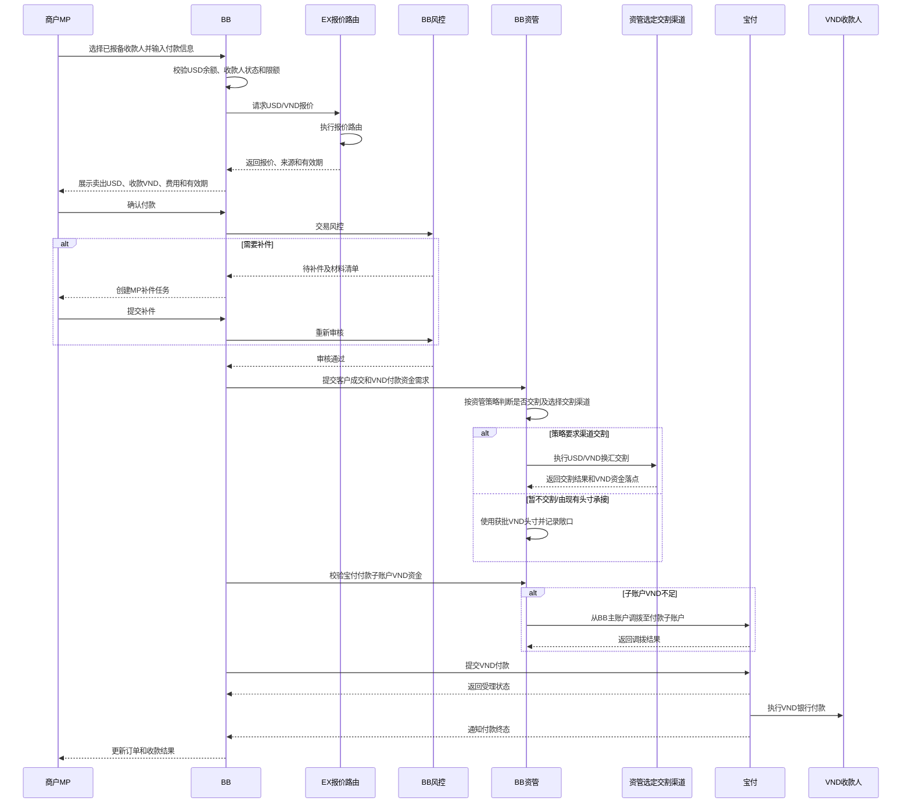

# VND On/Off-ramp 产品 PRD（一期）

> 文档状态：待业务、产品、BB、资管、风控、合规与技术评审  
> 产品版本：1.0  
> 日期：2026-08-09  
> 需求主体：BB  
> 适用对象：使用 VND 法币收付款及 USD、USDT、USDC 数法转换的企业商户  
> 一期范围：VND On-ramp、USD→VND Off-ramp，以及关联的账户、VA、汇款人、收款人、换汇、钱包与提币/提现流程  
> 系统边界：商户准入、VND 能力开通、VA、VND 收付款、交易风控、补件、账务及宝付渠道交互由 BB 负责；换汇报价固定由 BB 向 EX 获取，EX 通过自身报价路由选择报价源。是否执行渠道交割及交割渠道由 BB 资管策略决定。除换汇报价外，交易链路不经过 EX。  
> 核心原则：一期不建设 USDT/USDC→VND 直换；Off-ramp 以“数币→USD→VND 付款”连续完成，商户无需先持有 VND 再发起同币种出款；所有渠道能力、资金路径和调拨策略须经 BB 资管确认。

---

## 1. 需求背景

BB 已有商户入网、同名法币充值、数币充值、USD 与稳定币转换、钱包和提币等基础能力，但尚未形成可销售、可运营的 VND On/Off-ramp 完整产品。

一期需要补齐两条商户服务旅程：

1. **On-ramp**：商户完成 KYC/KYB 后开通 VND 能力和 VA，接收商户同名充值或经审核的异名汇款；VND 可用后换为 USD，再由 USD 换为 USDT/USDC，进入钱包并提币。
2. **Off-ramp**：商户完成 KYC/KYB 后接收同名或经审核的异名数币充值；数币换为 USD 后，直接发起 USD→VND 报价、交割和 VND 付款，商户不需要先换成并持有 VND 余额。

当前宝付的商户报备能力尚未完全线上化。一期前半阶段先通过销售 OA、合规审批和线下渠道报备完成 VND 能力开通；VA、收款人、收付款等已经具备接口条件的环节再由 BB 对接宝付。

## 2. 产品目标与非目标

### 2.1 产品目标

1. 建立从商户入网、VND 能力开通、VA 申请到收款、换汇、钱包入账和提币的完整 On-ramp 旅程。
2. 建立从数币充值、数币转 USD、USD→VND 报价与交割到 VND 付款的完整 Off-ramp 旅程。
3. 在现有产品依赖中仅新增“法币收款—异名”产品；同名 VND 入金继续复用现有“法币充值”。
4. 支持销售 OA 发起能力申请、合规审批、线下渠道报备、技术开户及销售通知闭环。
5. 支持商户在 MP 申请 VA、添加提币地址、添加 VND 法币收款人及按风控要求在线补件。
6. 支持宝付和 BB 风控在交易前、交易中或交易后触发补件，并记录补件归属、时限、结果和审计信息。
7. 将 EX 明确限定为换汇报价服务：BB 固定向 EX 询价，由 EX 内部报价路由选择报价源；EX 不参与其他 On/Off-ramp 交易编排。
8. 将实时交割、自营承接、VND 归集和跨渠道资金调拨作为资管决策项，不在 PRD 中预设结论。

### 2.2 非目标

- 一期不支持 USDT/USDC→VND 直换；该能力纳入二期评估。
- 一期不新增同名法币充值产品。
- 不要求商户在 Off-ramp 中先持有 VND，再发起 VND→VND 出款。
- 不将 EX 作为 VA、收款、付款、风控补件或宝付渠道接口的中转系统。
- 不在渠道能力未线上化前伪造“线上自动开户”状态。
- 不预设换汇由宝付实时交割还是由 BB 自营承接。
- 不预设宝付与其他渠道之间的资金调拨方向、频率和阈值。

## 3. 术语与系统定位

| 名称 | 定义与职责 |
| --- | --- |
| 商户 | 在 BB 完成入网并使用 VND On/Off-ramp 的企业客户 |
| 销售 | 在 OA 为商户申请 VND 能力，跟进合规审批和开通通知 |
| 合规/风控 | 审核商户准入、产品能力、交易及补充材料 |
| BB | 对客产品和履约主体；管理账户、订单、账务、风控、渠道接口及资金状态 |
| EX | 换汇报价服务；接收 BB 询价并通过内部报价路由返回报价，不参与其他交易链路 |
| 宝付 | BB 的 VND 底层渠道；负责渠道侧商户报备、VA、VND 收付款、换汇及账户资金能力 |
| OA | 销售与内部审批工作台；一期承载 VND 能力申请和 BB 合规审批，不承载渠道补件 |
| OP | 渠道合规与运营工作台；承载宝付报备、渠道补件、结果回填和技术开户流转 |
| MP | 商户门户；承载 VA、汇款信息、收款人、补件、换汇、地址及提币/提现操作 |
| VA | 宝付为商户分配的 VND 虚拟收款账户或可识别收款信息 |
| 异名法币收款 | 实际汇款人与商户名称不一致的 VND 收款，需按规则审核关系及交易材料 |
| 异名数币充值 | 链上资金来源方与商户不一致的数币充值，按现有数币风控规则识别和审核 |
| 法币收款人 | 商户在 Off-ramp 中接收 VND 付款的银行账户主体，须先完成宝付报备 |
| 提币地址 | 商户提取 USDT/USDC 前维护并通过白名单、KYT 等校验的钱包地址 |

### 3.1 系统责任边界

| 能力 | BB | EX | 宝付 |
| --- | --- | --- | --- |
| 商户入网与 VND 能力申请 | 主责 | 不参与 | 接收线下/线上报备并返回结果 |
| VND VA 申请 | 发起、落库、展示、通知 | 不参与 | 开户并返回 VA 结果 |
| VND 收款与入账 | 接收通知、风控、计费、记账 | 不参与 | 收款并通知 BB |
| MP/OP 补件 | 交易申请阶段由 MP 承载，渠道开户补件由 OP 承载；事后补件走合规邮件 | 不参与 | 可作为材料需求来源 |
| VND 收款人报备 | 发起、落库、展示、通知 | 不参与 | 审核并返回结果 |
| VND 付款 | 下单、风控、账务、通知 | 不参与 | 执行 VND 银行付款 |
| 换汇报价 | 固定向 EX 请求并形成对客报价 | 通过内部报价路由返回报价 | 可作为 EX 报价路由中的底层报价源之一 |
| 换汇交割 | 建单、风控、资金及账务主责 | 不承担交割，除非后续方案另行批准 | 按选定方案执行或不执行 |
| 资金调拨 | 资管策略与审批主责 | 不参与 | 执行宝付账户内或对外资金动作 |

## 4. 分期与产品依赖

### 4.1 分期范围

| 阶段 | 能力 |
| --- | --- |
| 一期 | VND On-ramp：VND→USD→USDT/USDC→提币 |
| 一期 | VND Off-ramp：USDT/USDC→USD→VND 付款 |
| 二期 | USDT/USDC→VND 直换，减少 USD 中间交易腿；需重新评估报价、流动性、账务及渠道能力 |

### 4.2 产品依赖

一期在现有产品体系中**只新增一个法币收款产品：法币收款—异名**。

| 产品/能力 | 处理方式 | 使用场景 |
| --- | --- | --- |
| 商户入网 KYC/KYB | 复用 | On/Off-ramp 共用 |
| 法币充值—同名 | 复用 | 商户本人向 VND VA 充值 |
| 法币收款—异名 | **新增产品** | 经审核的第三方向商户 VND VA 汇款 |
| 数币充值—同名/异名 | 复用并补充 VND 场景关联 | Off-ramp 资金来源 |
| 法币账户/VA | 复用账户框架，新增 VND 渠道开户 | VND 收款 |
| 法币换汇 | 复用 EX 现有换汇产品流程，新增 VND/USD 币对和待定汇率源接入 | On：VND→USD；Off：USD→VND |
| 法转数 | 复用 | USD→USDT/USDC |
| 数转法 | 复用 | USDT/USDC→USD |
| 数币钱包与提币 | 复用 | 稳定币入账、地址管理和提币 |
| 法币收款人与付款 | 复用并增加宝付 VND 报备/付款 | USD→VND Off-ramp |

## 5. 商户服务旅程

### 5.1 一期 On-ramp 旅程

### 5.2 一期 Off-ramp 旅程

Off-ramp 对客可以表现为一笔“USD 付款、收款人收 VND”的连续订单，但内部必须保留数转法、USD/VND 报价/交割和 VND 付款子单。商户不需要先获得可用 VND 余额再创建付款。

## 6. 涉及模块

| 模块 | 一期改造点 |
| --- | --- |
| 商户中心/KYC | 复用入网；增加 VND 能力与渠道报备状态 |
| OA 产品申请 | 销售申请 VND 能力、合规审批和结果通知；不承载渠道补件 |
| OP 渠道运营 | 渠道合规执行宝付报备、渠道补件、结果回填和技术开户流转 |
| 产品中心 | 新增“法币收款—异名”；配置 VND/USD 双向换汇和 VND 付款能力 |
| 法币账户/VA | VND 账户、VA 申请、状态、账户信息展示 |
| 汇款人/入账 | 同名与异名识别、入账匹配、风控补件、费用及可用余额 |
| 数币充值/钱包 | 复用同名/异名数币充值、KYT、钱包余额 |
| 换汇 | 复用 EX 换汇产品流程；增加 BB 对汇率源的接入边界和渠道换汇子单 |
| 法币收款人 | 新增/复用 VND 收款人，向宝付报备并维护审核状态 |
| 法币付款 | USD→VND 连续付款订单、换汇子单、VND 渠道付款子单 |
| 提币地址与提币 | 地址新增、白名单/KYT、提币订单和链上结果 |
| 风控与补件中心 | 交易申请阶段的 BB/宝付补件进入风控流程；渠道开户补件在 OP 操作；事后补件由合规邮件处理 |
| 计费与账务 | 入账费、换汇费/点差、付款费、提币费及各交易腿分账 |
| 资管与资金调拨 | 宝付子/主账户余额、VND/USD 头寸、跨渠道调拨建议和审批 |
| 通知与对账 | 商户/销售通知、渠道回调、主动查单、日终对账 |

## 7. VND 能力开通与 VA

### 7.1 一期 VND 能力开通

由于宝付商户报备尚未完全线上化，一期采用“销售 OA 申请＋合规审批＋OP 渠道报备＋技术开户”的半自动模式。渠道合规人员在 OP 操作宝付报备、渠道补件及结果回填。

线上报备能力成熟后，可将 OP 中的线下报备动作改为 BB 系统调用宝付接口，但渠道合规仍在 OP 查看任务、处理补件和审核结果。

### 7.2 VND VA 申请

VA 信息至少包括账户名、VA 账号、银行名称/代码、币种、适用汇款类型、付款附言要求、状态和更新时间。

## 8. On-ramp：VND 收款、入账与换汇

### 8.1 VND 入账完整交互

### 8.2 入账计费与汇率快照

1. VND 入账手续费按**入账确认时**生效的费率配置计算，而非汇款发起时或渠道通知首次到达时。
2. 若费用配置为其他计价币种，换算使用入账确认时的计费汇率，并保存汇率源、方向、时间和精度快照。
3. 商户可用入账金额 = 渠道确认到账金额 − VND 计价手续费 − 其他已披露扣费。
4. 待审核资金不得进入可用余额，不得发起换汇。
5. 订单保存到账总额、每项费用、计费汇率、净额和渠道流水；历史订单不得随费率配置变化重算。

### 8.3 MP 补件要求

交易申请阶段的补件任务至少展示：关联交易、触发方（BB/宝付）、材料名称、示例说明、截止时间、是否影响入账、当前状态和驳回原因。商户可在 MP 上传材料、补充文字说明并查看审核结果；敏感风控规则不对商户披露。事后补件不进入 MP，由 BB 合规邮件联系商户，商户邮件回复，合规再将材料邮件转交宝付并留存结果。

### 8.4 VND→USD 换汇

1. 商户仅可使用可用 VND 发起换汇。
2. 产品流程复用 EX 现有换汇流程：输入金额、询价、展示汇率/费用/有效期、确认、冻结、成交、交割、记账。
3. BB 固定向 EX 获取 VND/USD 报价；EX 根据自身报价路由选择报价源并返回可用报价，不承接 VND 收款、渠道账户或商户资金。
4. BB 不绕过 EX 直接向宝付获取对客报价；报价来源、路由结果和有效期由 EX 返回并留存快照。
5. 客户确认成交后是否需要渠道交割、何时交割及使用宝付或其他渠道，均由 BB 资管策略决定；报价来源与实际交割渠道不要求一致。
6. 宝付 VND 到账后是否立即归集/调拨至 BB 主账户，以及触发阈值、频率和在途风险，由资管确定。

### 8.5 USD→USDT/USDC 与提币

1. VND→USD 完成后，商户使用可用 USD 复用现有法转数流程。
2. USDT/USDC 到达 BB 钱包后，商户可持有或提币。
3. 首次提币前必须先添加提币地址，完成网络、地址格式、归属声明、白名单、KYT 和必要审批。
4. 提币订单关联钱包流水和可选的前序法转数订单，但不强制逐笔原路提取。

## 9. Off-ramp：数币充值、USD→VND 与付款

### 9.1 数币充值与数转法

1. 数币充值复用现有同名/异名识别、链上确认、KYT 和补件流程。
2. 未通过风控的数币不得成为可用余额，不得进入数转法。
3. 商户将可用 USDT/USDC 换为 USD，复用现有数转法流程和账务。
4. USD 可直接作为 VND 付款的卖出币种，无需先形成商户可用 VND 余额。

### 9.2 VND 法币收款人

商户发起 VND 付款前，必须先添加法币收款人。BB 将收款人资料报备至宝付，只有状态为“可用”的收款人才能被付款订单选择。

### 9.3 USD→VND 付款完整交互

### 9.4 Off-ramp 订单原则

- 对客主订单币种为卖出 USD、收款 VND；内部关联 USD/VND 换汇子单和 VND 付款子单。
- USD/VND 报价固定由 BB 向 EX 获取，EX 通过报价路由返回报价。
- 是否执行换汇交割及交割渠道由资管策略决定；VND 银行付款固定调用宝付付款接口。
- 若报价过期，商户必须重新确认，不得沿用旧报价。
- 换汇成功但付款失败时，不得自动重复换汇；按渠道实际资金状态进入重试、退款或人工处置。
- 宝付付款子账户 VND 不足时，须先完成获批调拨；不得透支或伪造付款成功。
- 收款人未报备、已失效或待补件时，不允许创建付款。

## 10. 风控补件机制

### 10.1 触发来源

| 来源 | 示例 | 补件承载 |
| --- | --- | --- |
| BB 商户风控 | 行业、业务模式、预计量变化 | OA/MP |
| BB 交易风控 | 汇款人关系、资金用途、金额异常 | MP 为主 |
| 宝付开户/VA | 渠道商户或账户材料不足 | OP 渠道补件任务 |
| 宝付入账/付款 | 交易背景或收付款关系材料 | MP 收集，BB 线上或线下提交宝付 |
| 事后风控 | 已允许入账但需追补材料 | 合规邮件联系商户，商户邮件回复，合规邮件转交宝付 |

### 10.2 补件状态

| 状态 | 进入条件 | 商户/销售操作 | 退出条件 |
| --- | --- | --- | --- |
| 待补件 | 风控或渠道提出材料要求 | 上传材料、填写说明 | 提交审核 |
| 已提交 | 材料已提交 | 查看进度 | 审核通过/驳回 |
| 补件审核中 | BB 或渠道审核 | 无 | 通过/再次补件/拒绝 |
| 再次补件 | 材料不完整或不合格 | 重新提交 | 提交审核 |
| 已通过 | 材料满足要求 | 继续原业务 | 终态 |
| 已拒绝 | 不满足准入或交易要求 | 查看可披露原因 | 终态或重新申请 |
| 已逾期 | 超过截止时间 | 联系销售/运营 | 人工延期、拒绝或处置 |

## 11. 状态模型

### 11.1 VND 能力与 VA

| 对象 | 状态 |
| --- | --- |
| VND 能力申请 | 草稿、合规审核中、待补件、渠道报备中、技术开户中、已开通、已拒绝、已暂停 |
| VA | 未申请、申请中、待补件、可用、申请失败、已冻结、已关闭 |

### 11.2 交易状态

| 对象 | 状态 |
| --- | --- |
| VND 入账 | 已通知、待匹配、风控中、待补件、待入账、已入账、拒绝入账、退汇中、已退汇、结果未知 |
| 换汇 | 待报价、待确认、报价过期、风控中、执行中、交割中、已完成、失败、结果未知 |
| VND 收款人 | 草稿、BB审核中、待补件、渠道报备中、可用、不可用、已失效 |
| VND 付款 | 待确认、风控中、待补件、待调拨、换汇中、付款处理中、已付款、失败、退款中、已退款、结果未知 |
| 提币地址/提币 | 复用现有状态机，新增与本产品订单的来源关联 |

任何结果未知状态均须优先查单，不得直接创建第二笔资金交易。

## 12. 计费、汇率与账务

### 12.1 计费环节

| 环节 | 费用处理 |
| --- | --- |
| VND 入账 | 按入账确认时费率计算并从到账金额扣除或按配置另收 |
| VND→USD | 展示对客汇率、点差和换汇费 |
| USD→USDT/USDC | 复用现有法转数费率 |
| 提币 | 复用提币手续费和网络费 |
| USDT/USDC→USD | 复用现有数转法费率 |
| USD→VND 付款 | 展示 USD/VND 汇率、换汇费、付款费及收款金额 |

### 12.2 分腿记账

每条交易腿独立建单和记账：VND 入账、VND/USD 换汇、USD/稳定币转换、钱包入账、提币、USD/VND 换汇、VND 付款和资金调拨。对客主订单可以聚合展示，但不得用单一“成功”状态覆盖子单差异。

所有历史交易保存不可变快照：费率版本、汇率源、汇率方向、报价时间、有效期、商户确认时间、渠道成交价、费用、舍入、渠道流水和账务分录。

## 13. 资金与调拨策略

### 13.1 宝付账户内调拨

VND 付款从宝付商户/子账户执行。若该账户 VND 不足，需由 BB 资管按审批策略从宝付主账户调拨至付款账户，再提交付款。

### 13.2 跨渠道调拨

以下场景均须由资管组确认，不在一期 PRD 中预设自动策略：

- 宝付资金调拨至其他渠道；
- 其他渠道资金调拨至宝付；
- VND 收款后归集至 BB 主账户；
- USD/VND 换汇后的资金落点；
- 跨主体、跨银行或跨渠道调拨的时效、成本、限额和审批；
- 调拨在途时是否允许先向客户成交或先提交付款。

系统至少记录调拨申请、来源账户、目标账户、币种、金额、关联交易、审批人、渠道流水、状态和失败原因。

## 14. 接口与数据对象

### 14.1 关键接口方向

| 接口 | 方向 | 说明 |
| --- | --- | --- |
| 商户/VND 能力报备 | OP渠道合规→宝付 | 一期线下；在 OP 操作任务、补件及结果回填 |
| VA 申请/查询 | BB→宝付 | 创建和查询 VND VA |
| VND 入账通知/查询 | 宝付→BB、BB→宝付 | 回调、补偿查单和对账 |
| 收款人报备/查询 | BB→宝付 | VND 收款人审核与状态 |
| VND 付款申请/查询/通知 | BB↔宝付 | VND 银行付款 |
| VND/USD、USD/VND 报价 | BB→EX | EX 通过报价路由返回报价和来源快照 |
| 换汇确认/交割/查询 | BB资管→策略选定渠道 | 是否交割及交割渠道由资管策略决定 |
| MP 补件 | MP→BB | 材料上传、审核状态和结果 |
| 资金调拨 | BB资管→宝付/其他渠道 | 方案待资管确认 |

### 14.2 核心数据对象

- 商户 VND 能力申请及 OA 审批记录；
- 宝付渠道商户映射；
- VND 账户与 VA；
- 汇款人及同名/异名识别结果；
- VND 入账单、费用快照和补件任务；
- 换汇报价、客户换汇单、渠道/资管换汇单；
- 数币充值、数转法/法转数订单和钱包流水；
- 提币地址及提币订单；
- VND 法币收款人及宝付收款人 ID；
- USD→VND 付款主单、换汇子单、VND 付款子单；
- 资金调拨单；
- 渠道回调、查单结果、对账差异和审计日志。

所有写接口必须具备业务幂等号；渠道回调必须验签、去重并允许乱序补偿。

## 15. 页面交互

页面交互见：[VND-OnOff-ramp-交互文档.html](./VND-OnOff-ramp-交互文档.html)

交互文档覆盖 MP 的 VA 申请、交易申请阶段补件、VND 收款人新增、提币地址新增，以及 OP 的渠道报备和渠道补件状态。

## 16. 异常处理

| 异常 | 处理原则 |
| --- | --- |
| 线下渠道报备长期无结果 | OP 保持渠道报备中并升级渠道合规，不提前开通 VND 能力 |
| VA 申请超时 | 使用原幂等号查单，不重复创建 VA |
| VND 到账回调重复/丢失 | 幂等处理并通过主动查询、日终对账补偿 |
| VND 入账待补件逾期 | 保持不可用，按审批执行退汇、延长或拒绝 |
| 宝付在开户/VA阶段要求补件 | 运营在 OP 处理并向宝付提交，不流转 OA |
| 宝付在交易申请阶段要求补件 | 并入 BB 风控流程，由商户在 MP 提交后转交宝付 |
| 宝付要求事后补件 | 合规邮件联系商户，商户邮件回复，合规邮件转交宝付并留存结果 |
| 报价过期 | 重新询价并要求商户再次确认 |
| 换汇结果未知 | 冻结相关余额并查单，不重复成交 |
| VND 付款账户余额不足 | 进入待调拨，调拨成功后再付款 |
| 调拨失败或未知 | 不提交付款；查单或人工处置 |
| 换汇成功、付款失败 | 保留子单真实状态，不重复换汇；按资管方案重试付款或退款 |
| 付款结果未知 | 按原付款单查单，不新建第二笔付款 |
| 数币充值或提币命中风险 | 复用现有 KYT、冻结和人工复核流程 |
| EX 汇率源不可用 | 若无获批备用源则暂停报价，不以缓存过期价格成交 |

## 17. 权限、通知与审计

### 17.1 权限

- 销售可发起 VND 能力申请和提交补件，不可审批自己的申请。
- 合规/风控可审核商户、交易和补件，不可修改渠道真实结果。
- 渠道合规/运营在 OP 操作宝付报备、渠道补件和结果回填，所有操作须留痕。
- 资管可审批换汇执行、头寸和调拨，不可修改商户已确认的报价快照。
- 商户仅能查看和操作本租户的 VA、交易、收款人、地址和补件任务。

### 17.2 通知

通知对象包括商户和销售，事件至少包括：VND 能力待补件/开通/拒绝、VA 申请结果、VND 到账及补件、换汇结果、稳定币到账、提币地址结果、提币结果、VND 收款人结果、付款补件及付款终态。

### 17.3 审计

保存申请人、审批人、操作时间、变更前后值、材料版本、渠道回执、人工回填来源、报价快照、资金状态和账务分录。银行账户、证件和钱包地址默认脱敏，并按角色授权查看。

## 18. 验收标准

1. 一期同时支持 On-ramp 和 Off-ramp 两条完整商户服务旅程。
2. 产品依赖中仅新增“法币收款—异名”，同名 VND 入金复用“法币充值”。
3. 未完成 KYC/KYB 和 VND 能力审批的商户不能申请 VND VA。
4. OA 承载销售申请与合规审批；渠道合规在 OP 完成宝付报备、渠道补件、结果回填和技术开户流转。
5. 一期线下宝付报备有明确状态和审计记录，不被系统误标为线上自动成功。
6. VA 申请成功时商户可查看完整 VA 信息；失败或待补件时获得可执行提示。
7. VND 到账后 BB 可区分同名与异名，并执行计费、风控和补件。
8. MP 可展示并提交交易申请阶段补件；事后补件按合规与商户、宝付之间的邮件流程闭环。
9. VND 入账手续费按入账确认时的费率/计费汇率快照计算，净额正确入账。
10. 待审核、待补件或结果未知的 VND 不进入可用余额，不可换汇。
11. VND→USD 和 USD→VND 均由 BB 向 EX 询价，EX 通过内部报价路由返回报价及来源快照。
12. 报价页面明确卖出/买入币种、汇率、费用、所得金额和有效期；过期后必须重新确认。
13. 是否交割及交割渠道由资管策略决定；报价来源不强制等于交割渠道。
14. USD→USDT/USDC、钱包入账、提币地址和提币可形成完整关联链路。
15. Off-ramp 支持同名/异名数币充值、数转法至 USD，再直接创建 USD→VND 付款。
16. 商户无需先持有 VND 可用余额即可完成 USD→VND 付款，但内部换汇与付款必须分单。
17. VND 收款人只有经 BB 和宝付审核为可用后才能被付款选择。
18. 收款人和付款交易均支持 MP 补件及渠道线下补件兜底。
19. 宝付付款子账户 VND 不足时订单进入待调拨，调拨成功前不得提交付款。
20. VND 付款固定调用宝付付款接口；换汇交割与付款分单，付款失败时不得重复交割。
21. EX 未参与 VA、VND 收付款、补件或宝付非换汇交易链路。
22. 重复回调、重复请求、乱序通知和结果未知不会造成重复入账、换汇、付款或提币。
23. 所有交易腿分别保存不可变汇率、费用、渠道和账务快照。
24. 人工报备、补件回填、调拨、换汇执行和状态修复均具备权限隔离和审计记录。

## 19. 待确认事项

| 编号 | 待确认事项 | 责任方 | 影响 |
| --- | --- | --- | --- |
| VND-01 | 宝付商户报备线上化时间，以及一期线下报备 SLA | 宝付/渠道运营 | 开通时效与自动化 |
| VND-02 | VND VA 的账户模型、户名、支持银行及同名/异名限制 | 宝付/产品/风控 | 收款能力 |
| VND-03 | 异名法币收款允许的汇款人类型、关系、材料和限额 | 合规/风控/宝付 | 新增产品范围 |
| VND-04 | VND 入账风控由 BB 与宝付分别要求哪些材料，哪些可经接口提交 | 风控/宝付/技术 | MP/OP 补件 |
| VND-05 | 事后补件邮件模板、收发邮箱、SLA 和留档方式 | 合规/宝付/运营 | 邮件补件闭环 |
| VND-06 | VND 入账费用计价币种、扣费方式、费率生效时点和计费汇率源 | 产品/财务 | 计费与账务 |
| VND-07 | EX 对 VND/USD、USD/VND 的报价路由、可用报价源和降级策略 | EX/BB/资管/技术 | 报价可用性 |
| VND-08 | EX 返回报价来源、有效期及路由标识的字段规范 | EX/BB/技术 | 报价快照与对账 |
| VND-09 | VND→USD 何时交割、使用宝付或其他渠道、何时由 BB 头寸承接 | 资管/财务/风控 | 敞口与交割 |
| VND-10 | USD→VND 客户成交后何时交割、选择何渠道及如何保证宝付付款账户VND充足 | 资管/宝付/产品 | Off-ramp 交割与付款 |
| VND-11 | VND 到账后是否归集至 BB 主账户，触发阈值和频率 | 资管/财务 | 资金效率 |
| VND-12 | 宝付付款子账户 VND 不足时的主子账户调拨接口和 SLA | 宝付/资管/技术 | 付款成功率 |
| VND-13 | 宝付↔其他渠道双向调拨的主体、路径、成本、限额和审批 | 资管/法务/财务 | 跨渠道资金 |
| VND-14 | VND 收款人报备字段、材料、审核时效和补件接口 | 宝付/产品/技术 | 收款人流程 |
| VND-15 | 数币充值同名/异名的识别标准及 VND Off-ramp 额外材料 | 风控/合规 | Off-ramp 准入 |
| VND-16 | 二期 USDT/USDC→VND 直换的渠道、报价和账务方案 | 产品/资管/渠道 | 二期范围 |

## 20. 关联文档

- [VND On/Off-ramp 页面交互文档](./VND-OnOff-ramp-交互文档.html)
- [宝付 VND On/Off-ramp 对接 PRD](./宝付VND-OnOffRamp对接PRD.md)
- [OnRamp（买入数币）产品方案](../PRODESIGN/OnOfframp/prd/onramp-v1%20copy.md)
- [OffRamp 产品 PRD](../Newofframp/Offramp产品PRD.md)
- [EX 换汇产品](../PRODESIGN/CONVERSION/fx.md)
