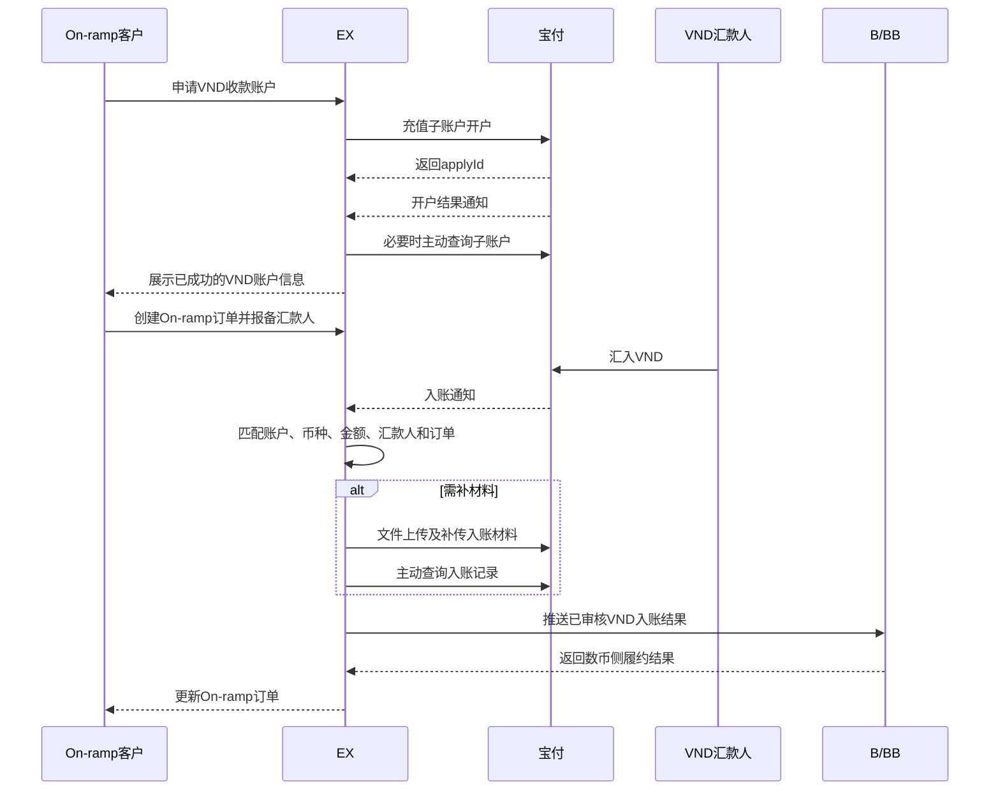
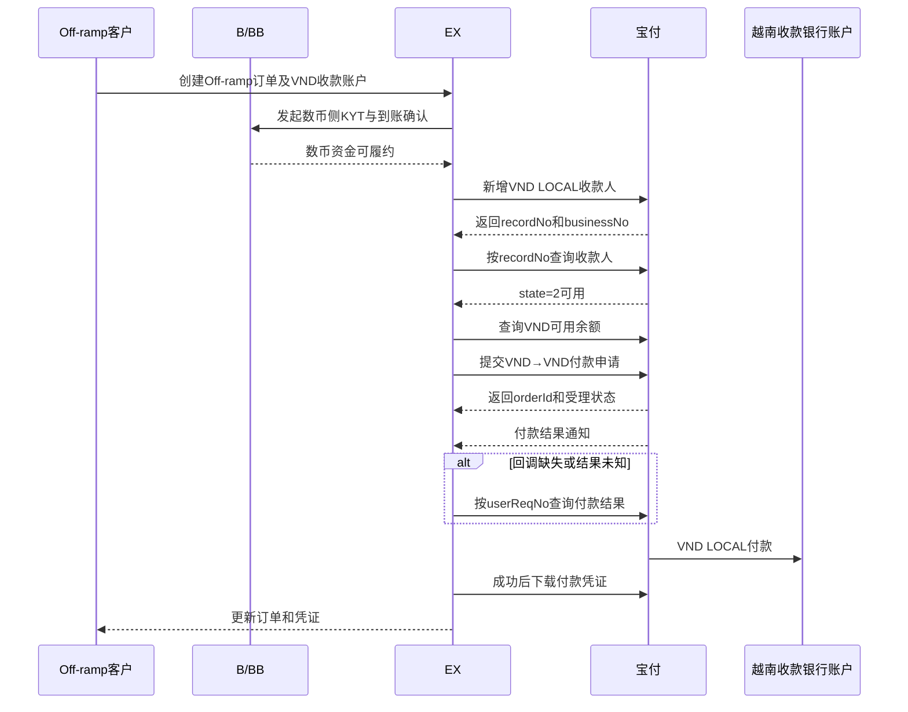
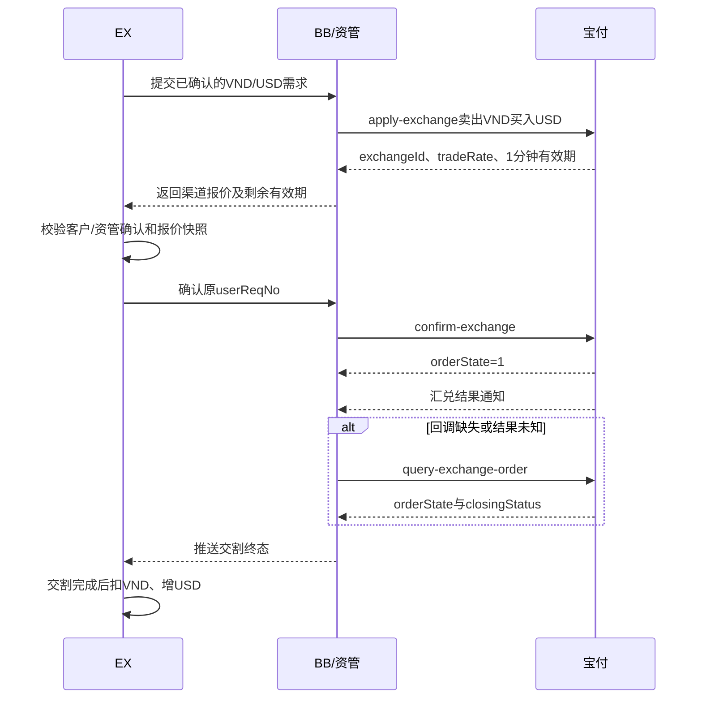

# 宝付 VND On/Off-ramp 转账对接 PRD

> 文档状态：待宝付确认 / 待技术评审  
> 版本：v2.1  
> 日期：2026-08-09  
> 需求主体：EX / B（BB）/ MOR  
> 对接渠道：宝付国际（Payful）「其他账户收付款 API」  
> 本期范围：VND 收款、VND→USD 汇兑、VND 同币种付款、必要的 Payful 账户间转账  
> 明确不做：结汇、付款环节隐式换汇、其他币对  
> 核心原则：换汇必须通过独立汇兑订单完成；银行付款仍只处理 VND→VND，任何 `paymentCcy ≠ payeeCcy` 的付款订单均不提交宝付。

---

## 1. 变更说明

上一版 PRD 混用了旧版外贸 B2B 接口名称，并把 Off-ramp 设计成“汇兑/结汇后付款”。经重新核对宝付官方「其他账户收付款 API」，本版作如下修正：

1. 本期删除结汇接口和付款环节隐式换汇，但新增独立 VND→USD 汇兑接口；
2. VND On-ramp 改用「充值子账户」和「入账记录」相关接口；
3. VND Off-ramp 改用「收款人新增/查询 → 付款申请 → 付款查询/通知」链路；
4. 将“付款至越南银行账户”和“Payful 商户账户间转账”拆成两类能力；
5. 收款人查询使用用户指定的官方接口：`POST /api/user/payee-account/v2/query-user-payees`；
6. VND 本地收款人按官方 LOCAL 规则建模：`countryCode=VNM`、`accountCcy=VND`、`paymentChannelType=LOCAL`；
7. 原 `b2bSettleApply`、`b2b-payment-apply`、`b2b-apply-exchange` 等接口名称不再使用。
8. 汇兑改用官方 `/api/exchange/*` 接口组：申请、确认、取消、查询、通知；预约/手动交割接口按模式条件接入。

---

## 2. 背景与目标

### 2.1 业务背景

越南业务需要两条 VND 同币种资金路径：

- **On-ramp**：为已入网客户申请 VND 本地充值子账户，接收汇款人的 VND；入账审核通过后，为后续数币侧履约提供法币入账依据。
- **Off-ramp**：在宝付侧已有可用 VND 余额的前提下，将 VND 付款至已审核的越南本地银行收款人账户。

数币收付、KYT、承兑和数币账务由 B/BB 及其数币渠道负责，不属于宝付 API 的执行范围。EX 负责把法币入账/付款结果与 On/Off-ramp 业务订单关联。

### 2.2 本期目标

1. 跑通 VND 充值子账户的申请、查询和开户结果接收；
2. 跑通 VND 入账通知、主动查询和补传材料；
3. 跑通越南 LOCAL 收款人的新增、查询及可用状态判断；
4. 跑通 VND→VND 付款申请、付款结果查询、异步通知和付款凭证；
5. 如业务资金位于不同 Payful 用户账户，跑通同币种账户间转账；
6. 跑通 VND→USD 汇兑申请、1分钟内确认、交割状态查询和结果通知；
7. 建立幂等、状态机、账务、对账、异常处理和审计闭环；
8. 在系统层强制阻断结汇、付款环节隐式换汇和非 VND/USD 汇兑。

### 2.3 非目标

- 不调用 `POST /api/settle/apply-settle`；
- 不调用任何结汇查询或结汇通知接口；
- 不通过付款接口隐式完成换汇；
- 不支持 VND→USD 之外的宝付汇兑币对；
- 不建设结汇、USD→USDT/USDC 或稳定币兑换接口；
- 不改变 B、MOR 与客户的签约和持资责任，未确认事项仍须法务、合规和宝付书面确认。

---

## 3. 术语与主体

| 名称 | 定义与责任 |
| --- | --- |
| EX | 技术平台；管理客户、订单、渠道映射、回调、账务和对账，不直接持有宝付资金 |
| B（BB） | On/Off-ramp 服务方及数币侧执行方；负责客户关系、KYT 和数币履约 |
| MOR | 宝付签约/持资或头寸主体候选；具体使用哪个 `userNo` 以宝付和内部合同结论为准 |
| 宝付 / Payful | 提供 VND 充值子账户、本地付款和账户间转账 API 的法币渠道 |
| Payful 用户 | 宝付分配 `userNo` 的商户或代理商下游用户 |
| 充值子账户 | 宝付用于接收外部 VND 汇款的本地收款账户；本期越南预期使用 `bankCode=67`（BIDV）、`country=VNM`、`accountPayeeType=2`，须联调确认 |
| 银行收款人 | Off-ramp 最终接收 VND 的越南银行账户；由收款人接口新增和审核 |
| 银行付款 | Payful 用户余额向外部越南银行收款人付款，使用 `/api/payment/applyPayment` |
| 账户间转账 | 不同 Payful `userNo` 之间的同币种内部转账，使用 `/api/account-transfer/*`，不等于外部银行付款 |

### 3.1 主体边界

1. 客户入网、Payful 用户开户和产品开通是不同状态，必须分别记录；
2. 银行收款人必须归属于明确的客户或交易对手，不得跨客户无授权复用；
3. Payful 账户间转账只用于已批准的内部资金路径，不得替代下游客户穿透；
4. 客户资金、B/MOR 自有资金和内部头寸分别记账；
5. 宝付渠道信息是否对客户展示由合同决定，但必须对内部法务、合规、财务和审计可见。

---

## 4. 本期接口范围

### 4.1 必接接口

| 能力 | 方法与路径 | 本期用途 |
| --- | --- | --- |
| 充值子账户开户 | `POST /api/subAcc/apply-gep-recharge-sub-acc` | 申请 VND 本地充值子账户 |
| 充值子账户查询 | `POST /api/subAcc/query-sub-acc` | 主动查询开户结果和账户信息 |
| 子账户开户通知 | 申请时传入的 `callBackUrl` | 接收开户成功/失败结果；回调路径由 EX 提供 |
| 入账通知 | 宝付后台线下配置的回调地址 | 接收 VND 入账事件 |
| 入账记录查询 | `POST /api/agent/collectionTrade/incomingTransactionInquiry` | 回调丢失、结果核验和对账 |
| 文件上传 | `POST /api/common/file/upload-file` | 上传付款或入账补充材料 |
| 补传入账材料 | `POST /api/payee/payeeDetailUploadVoucherFile` | 按 `tradeNo/detailsId` 补充入账凭证 |
| 收款人新增 | `POST /api/user/payee-account/v2/add-user-payees` | 新增越南 VND LOCAL 银行收款人 |
| 收款人查询 | `POST /api/user/payee-account/v2/query-user-payees` | 按 `recordNo` 查询审核状态和 `businessNo` |
| 收款人删除 | `POST /api/user/payee-account/v2/remove-user-payees` | 停用不再使用的收款人；是否开放给业务端另评审 |
| 付款申请 | `POST /api/payment/applyPayment` | 从 Payful VND 余额付款到越南银行账户 |
| 付款结果查询 | `POST /api/payment/queryPaymentOrder` | 按 `userReqNo` 主动查单 |
| 付款结果通知 | 付款申请传入的 `callBackUrl` | 接收付款审核与执行状态 |
| 付款凭证下载 | `POST /api/payment/payment-order-voucher-file-download` | 获取成功付款凭证 |
| 付款退款查询 | `POST /api/payment/query-payment-refund-order` | 查询付款后退款/退汇结果 |
| 商户余额查询 | `POST /api/user/account/queryUserBalanceAccount` | 付款前校验 VND 可用余额和日终对账 |

### 4.2 必接接口：VND→USD 汇兑

| 能力 | 方法与路径 | 本期用途 |
| --- | --- | --- |
| 汇兑申请 | `POST /api/exchange/apply-exchange` | 申请 VND→USD 报价并取得 `exchangeId/tradeRate` |
| 汇兑确认 | `POST /api/exchange/confirm-exchange` | 在申请有效期内确认锁定汇率 |
| 汇兑取消 | `POST /api/exchange/cancel-exchange` | 取消仍可取消的待确认汇兑 |
| 汇兑订单查询 | `POST /api/exchange/query-exchange-order` | 查单、补偿回调和对账 |
| 汇兑结果通知 | 申请时传入的 `callBackUrl` | 接收订单及交割状态 |
| 修改交割方式 | `POST /api/exchange/exchange-modify-delivery` | 仅预约兑换且需要 AUTO/MANUAL 切换时接入 |
| 汇兑交割申请 | `POST /api/exchange/exchange-delivery` | 仅 `deliveryType=MANUAL` 时发起手动交割 |

### 4.3 条件必接：Payful 账户间转账

仅当 VND 资金需要在不同 Payful 用户账户之间移动时接入：

| 能力 | 方法与路径 | 说明 |
| --- | --- | --- |
| 新增转账关系 | `POST /api/user/productOpenApply/add-transfer-config` | 建立允许的付款人与收款人关系；是否必需以宝付配置为准 |
| 查询转账关系 | `POST /api/user/productOpenApply/query-transfer-config` | 查询关系审核/可用状态 |
| 账户转账申请 | `POST /api/account-transfer/launch-transfer` | 不同 `userNo` 之间同币种账户转账 |
| 账户转账查询 | `POST /api/account-transfer/query-transfer-detail` | 按 `userNo + userReqNo` 查单 |
| 转账结果通知 | 申请传入的 `callBackUrl` | 状态：1待处理、2处理中、3成功、4失败 |

官方说明显示账户间转账支持：余额户/B2B→余额户、B2B→B2B、余额户→B2B。申请参数中的 `payerAccount` 和 `payeeAccount` 本期仅使用 `1`（余额户/汇兑账户）或 `3`（B2B 收款户）。具体组合和 VND 可用性须宝付确认。

### 4.4 明确排除接口

| 排除能力 | 典型接口 | 排除原因 |
| --- | --- | --- |
| 结汇 | `/api/settle/apply-settle`、结汇查询/通知 | 本期不对接结汇 |
| 境内代付 | `/api/transfer/apply-transfer` | 该接口不是越南 LOCAL 银行付款主链路，本期不使用 |
| POBO 付款人 | `/api/user/pobo/*` | 本期默认非 POBO；如后续启用须独立评审 |
| 其他币对汇兑 | `/api/exchange/*` 中非 VND→USD 请求 | 本期只允许卖出VND、买入USD |

---

## 5. 通用接口规范

### 5.1 环境与报文

| 项目 | 规则 |
| --- | --- |
| 沙箱域名 | `https://member-test-api.payful.com` |
| 生产域名 | `https://api.payful.com` |
| 请求方法 | `POST` |
| Content-Type | `application/x-www-form-urlencoded; charset=UTF-8`；文件上传使用 `multipart/form-data` |
| 通用参数 | `version=1.0.0`、`certificateId`、`userNo`、`dataType=JSON`、`dataContent` |
| 代理商参数 | 代理商调用时传 `agentNo`、`apiType=1`；普通商户不传 |
| 加密 | 业务 JSON → Base64 → RSA 私钥分块加密 → HEX，传入 `dataContent` |
| 响应 | 外层 `success/errorCode/errorMsg/result`；`result` 解密后按具体接口处理 |

### 5.2 幂等与查单

1. 每个写接口使用 EX 生成的唯一 `userReqNo`；同一业务动作重试必须复用原值；
2. `userReqNo` 长度以具体接口最严格限制为准，本期统一控制在 32 个字符以内；
3. HTTP 成功只表示请求被接收，不表示业务终态；
4. 超时、网络异常或回调缺失时，先调用查询接口，不得生成新单号重复付款/转账；
5. 回调按 `事件类型 + userNo + userReqNo + orderId/tradeNo` 幂等；
6. 只有主动查询或回调确认终态后才能完成账务终态。

### 5.3 敏感数据

- 银行账号、账户名、地址及证件信息加密存储；
- 业务页面默认只显示掩码账号；
- 收款人查询结果保存不可变快照，用于证明付款时所用账户状态；
- 日志不得记录明文 `dataContent` 解密结果、完整银行账号、密钥和证书私钥。

---

## 6. On-ramp：VND 收款

### 6.1 前置条件

1. 客户和实际经营场景已通过 B/EX 风控合规审核；
2. 用于申请子账户的 Payful `userNo` 已实名且开通其他账户收付款产品；
3. 若宝付要求账户持有人资质，须先取得有效 `accountHolder`；
4. 宝付已书面确认 `bankCode=67`、`country=VNM`、`accountPayeeType=2` 支持本项目 VND 本地收款；
5. 入账通知地址已由宝付线下配置，并完成验签、重推和白名单联调。

### 6.2 子账户申请

调用：`POST /api/subAcc/apply-gep-recharge-sub-acc`

| 字段 | 本期规则 |
| --- | --- |
| `userNo` | 实际申请账户的 Payful 用户号 |
| `userReqNo` | EX 唯一申请号，≤32字符 |
| `accountPayeeType` | `2`，本地收款 |
| `country` | `VNM` |
| `bankCode` | 预期 `67`（BIDV），以宝付开通配置为准 |
| `accountHolder` | 宝付要求时必传，来自账户持有人新增/查询能力 |
| `callBackUrl` | EX 子账户开户结果通知地址 |

接口同步返回 `applyId`。EX 保存 `客户ID—Payful userNo—userReqNo—applyId` 映射。

### 6.3 子账户查询与启用

调用：`POST /api/subAcc/query-sub-acc`

查询至少传 `userNo`，并使用 `applyId` 或 `userReqNo` 定位申请。仅当宝付返回开户成功时，保存并启用：

- `bankNo`；
- `bankAccountName`；
- `bankName/bankCode`；
- `bankCountry`；
- `currency`；
- `routingCode`、`bankSubCode` 等宝付实际返回的本地路由信息；
- `accountHolder/accountHolderName`；
- 宝付状态及原始回执快照。

未确认 `currency` 包含 VND 时，不得向客户展示为 VND 收款账户。

### 6.4 收款流程

### 6.5 入账处理规则

1. 入账通知至少以 `tradeNo`、`userNo`、`bankAccountNo`、`amount`、`ccy`、`tradeTime`、`status` 建立唯一事件；
2. 渠道通知成功不等于 On-ramp 订单可履约，必须完成汇款人账户和订单匹配；
3. `ccy` 必须为 `VND`，否则进入异常资金池；
4. 找不到客户/订单时进入“待认领入账”，不得随意记入客户余额；
5. 需要补充材料时，先用文件上传接口取得 `fileId`，再以 `detailsId=tradeNo` 调用补传入账材料；
6. 回调丢失、状态冲突或日终对账时，使用入账记录查询接口核验；
7. 数币侧只有在 VND 入账达到可用状态并通过风控后才能执行。

---

## 7. Off-ramp：VND 银行付款

### 7.1 前置条件

1. Off-ramp 客户、业务用途和数币侧资金已通过 B/EX 审核；
2. 付款 Payful 用户存在足额可用 VND 余额；
3. 本单 `paymentCcy=VND` 且 `payeeCcy=VND`；
4. 越南银行收款人已新增并查询为 `state=2`（可用）；
5. 收款人信息与订单快照一致，未在审核后被修改或删除；
6. 付款材料已通过文件上传接口取得有效 `fileId`；
7. 订单未被其他渠道或人工流程执行。

### 7.2 越南 LOCAL 收款人新增

调用：`POST /api/user/payee-account/v2/add-user-payees`

| 字段 | 必填 | 本期值/校验 |
| --- | --- | --- |
| `paymentChannelType` | 是 | `LOCAL` |
| `countryCode` | 是 | `VNM` |
| `accountCcy` | 是 | `VND` |
| `accType` | 是 | `1`企业或`2`个人；是否允许个人由业务和合规配置决定 |
| `accountName` | 是 | 非中文，不使用越南重音符号；与银行户名一致 |
| `cardNo` | 是 | 5—19位数字 |
| `bankName` | 是 | 非中文，不使用越南重音符号 |
| `payeeAddress` | 是 | 不使用中文、非常见符号或越南重音符号 |
| `city` | 否 | 参考宝付城市列表 |
| `swiftCode` | 否 | 8或11位格式；参考宝付银行列表 |
| `firstName/lastName` | 否 | 按个人收款人和宝付要求填写 |

同步响应保存：

- `recordNo`：后续查询收款人状态；
- `businessNo`：付款申请中的收款方主体编号。

重复提交相同卡号、币种、国家、银行名和账户名时，宝付可能返回重复提示。EX 应先在本地按标准化后的组合去重，再处理宝付重复响应。

### 7.3 收款人查询

调用：`POST /api/user/payee-account/v2/query-user-payees`

请求业务字段只有：

| 字段 | 必填 | 说明 |
| --- | --- | --- |
| `recordNo` | 是 | 收款人新增成功后返回的记录编号 |

关键响应字段：

| 字段 | 使用规则 |
| --- | --- |
| `state` | `1`待审核、`2`可用、`3`不可用、`4`需补充材料；只有`2`允许付款 |
| `recordNo` | 与本地记录一致性校验 |
| `businessNo` | 写入付款申请 |
| `paymentChannelType` | 必须为`LOCAL` |
| `countryCode` | 必须为`VNM` |
| `accountCcy` | 必须为`VND` |
| `accType` | 与申请和客户授权一致 |
| `accountName/cardNo/bankName` | 与订单收款账户快照一致 |
| `auditRemark` | 审核失败或补件原因，按权限展示 |

收款人状态在付款前必须实时或在可接受缓存期内重新查询。缓存有效期由风控和宝付联调后配置，不能永久信任历史 `state=2`。

### 7.4 VND 付款申请

调用：`POST /api/payment/applyPayment`

| 字段 | 本期规则 |
| --- | --- |
| `userNo` | 实际出款 Payful 用户号 |
| `certificateId` | 当前调用证书编号 |
| `userReqNo` | EX Off-ramp 付款幂等号，≤32字符 |
| `paymentMode` | `LOCAL`，必须与收款人一致 |
| `paymentCcy` | `VND` |
| `payeeCcy` | `VND` |
| `fixedModel` | 默认`1`固定付款金额；同币种时 `paymentAmount` 与 `payeeAmount` 规则须沙箱确认 |
| `paymentAmount` | VND 出款金额，>0 |
| `payeeAmount` | VND 到账金额；同币种传值规则须宝付确认，不允许触发换汇 |
| `businessNo` | 收款人查询返回值 |
| `cardNo/accountName` | 必须与已审核收款人快照一致 |
| `costBorne` | `SHA`或`OUR`；由产品配置，不能由客户任意传入 |
| `paymentPurpose` | 使用新版用途：12供货商、13物流服务、14分销推广、15广告宣传、16技术服务、17留学、18其他 |
| `industryType` | 01货物贸易、06物流、08广告收入；必须匹配真实业务，不传默认01的行为不得依赖 |
| `paymentMaterial` / `paymentMaterialList` | 付款材料文件编号；按宝付要求至少提供一种 |
| `paymentReference` | 英文附言，≤128字符 |
| `callBackUrl` | EX 付款结果通知地址 |
| `poboPayment` | 本期固定`0`或不传；不启用 POBO |
| `payerUserNo` | 只有宝付为代理商场景明确配置后才允许传入 |

#### 强制校验

- `paymentCcy != payeeCcy`：拒绝，错误码 `CROSS_CCY_NOT_SUPPORTED`；
- 任一币种不是 VND：拒绝，错误码 `CURRENCY_NOT_SUPPORTED`；
- 收款人 `state != 2`：拒绝，错误码 `PAYEE_NOT_AVAILABLE`；
- 收款人快照不一致：重新查询并转人工复核；
- 可用余额不足：不提交宝付，进入待头寸/取消；
- `userReqNo` 已存在：返回原订单，不重复发起。

### 7.5 Off-ramp 流程

### 7.6 付款状态处理

宝付付款通知状态：

| `status` | 渠道含义 | EX 状态/动作 |
| --- | --- | --- |
| `1` | 交易待处理 | 处理中，不重复付款 |
| `2` | 交易处理中 | 处理中，不重复付款 |
| `3` | 交易成功 | 已完成，记录 `paymentSuccessDate` 并获取凭证 |
| `4` | 交易失败 | 失败；先确认资金状态，再决定重提 |
| `6` | 待重新出款 | 异常待处理；必须人工或规则审批后处理 |
| `7` | 已取消 | 已取消；释放未占用余额 |
| `8` | 待补充材料 | 待补件；补件前不得新建替代付款 |

同时保存 `auditStatus`：0系统审核通过、1待审核、2审核成功、3审核失败、4审核暂停，以及 `auditStatusDesc`。业务终态以 `status` 为主，但审核失败/暂停必须阻断后续自动操作。

---

## 8. Payful 账户间转账

### 8.1 使用场景

仅用于以下已审批场景：

- VND 先进入客户/B2B 收款户，需要转到 MOR/B 的 Payful 余额户后再对外付款；
- VND 头寸位于一个 Payful `userNo`，实际付款必须由另一个 Payful `userNo` 发起；
- 内部归集或退款需要在两个已建立关系的 Payful 用户之间转账。

若 On-ramp 与 Off-ramp 均能在同一获批 Payful 用户和账户内完成，则不引入账户间转账。

### 8.2 转账申请

调用：`POST /api/account-transfer/launch-transfer`

| 字段 | 规则 |
| --- | --- |
| `userNo` | 付款 Payful 用户号 |
| `userReqNo` | EX 内部转账幂等号，≤32字符 |
| `payerAccount` | `1`余额户或`3`B2B收款户 |
| `payerAmt` | VND 转账金额，>0 |
| `payerCcy` | `VND`；本期不允许其他币种 |
| `payeeUserNo` | 收款 Payful 用户号 |
| `payeeAccount` | `1`余额户或`3`B2B收款户 |
| `payerReference` | 关联 On/Off-ramp 订单或归集批次 |
| `callBackUrl` | EX 账户转账通知地址 |

### 8.3 转账状态

查询：`POST /api/account-transfer/query-transfer-detail`，请求使用 `userNo + userReqNo`。

| 状态 | 含义 | 处理 |
| --- | --- | --- |
| 1 | 待处理 | 保持在途 |
| 2 | 处理中 | 保持在途 |
| 3 | 成功 | 记账转出/转入并进入下一资金腿 |
| 4 | 失败 | 记录 `msg`，解除在途；不得自动重复提交新单号 |

账户间转账成功只表示 Payful 内部资金移动完成，不表示外部银行付款完成。两类订单、状态和账务必须分开。

---

## 9. VND→USD 汇兑

### 9.1 前置条件

1. 宝付已为实际执行汇兑的 `userNo` 开通 VND 与 USD 账户及 VND/USD 币对；
2. 卖出账户存在足额可用 VND；
3. 本期固定 `sellCcy=VND`、`buyCcy=USD`；
4. 商户 FX 已完成报价确认，或 BB 资管已审批执行；
5. 汇兑请求具备唯一 `userReqNo`，且未被其他渠道执行；
6. BB 已确认采用实时兑换还是预约兑换，以及 AUTO/MANUAL 交割方式。

### 9.2 汇兑申请与报价

调用：`POST /api/exchange/apply-exchange`

| 字段 | 本期规则 |
| --- | --- |
| `userNo` | 实际持有并卖出 VND 的 Payful 用户号 |
| `userReqNo` | EX/BB 汇兑幂等号，≤32字符 |
| `sellCcy` | `VND` |
| `buyCcy` | `USD` |
| `direction` | 默认`2`（按卖出金额），传 `sellAmount`；若采用固定买入 USD 模式须另行确认 |
| `sellAmount` | 卖出 VND 金额，>0 |
| `buyAmount` | `direction=2` 时不作为定价基准，具体空值/传值规则由沙箱确认 |
| `tradeModel` | 1实时兑换、2预约兑换；1.0默认值由资管确认 |
| `closingType` | 1.0优先`TOD`立即交割；TOM/SPOT不默认开放 |
| `closingDate` | 即期交易填当天，格式`YYYY-MM-DD` |
| `deliveryType` | 预约兑换适用：`AUTO`或`MANUAL`；不传默认AUTO |
| `callBackUrl` | EX汇兑结果通知地址 |

同步响应至少保存：`exchangeId`、`userReqNo`、`sellAmount`、`buyAmount`、`tradeRate`、`orderState`、`closingStatus`、`closingDate`。

宝付官方文档说明汇兑申请成功后的报价有效期只有 **1分钟**。EX 对客或对资管的确认有效期必须短于渠道剩余有效期，并预留网络和确认接口调用时间；不得将1分钟写死为对客完整可用时间。

### 9.3 汇兑确认

调用：`POST /api/exchange/confirm-exchange`

请求使用原汇兑申请的 `userNo + userReqNo`。只有同时满足以下条件才可确认：

- `orderState=0`（待确认）；
- EX 报价仍在有效期内；
- 币对、金额、汇率与本地不可变报价快照一致；
- 商户已确认客户 FX，或资管审批已完成；
- VND 未被其他订单占用。

确认成功后 `orderState=1`。HTTP 超时不得直接重新申请报价，应先查询原 `userReqNo`。

### 9.4 取消、交割与查询

| 场景 | 接口 | 规则 |
| --- | --- | --- |
| 待确认订单取消 | `/api/exchange/cancel-exchange` | 使用原`userNo + userReqNo`，成功后不得再确认 |
| AUTO交割 | 无需人工发起交割 | 等待通知/查询确认`closingStatus` |
| MANUAL交割 | `/api/exchange/exchange-delivery` | 仅预约兑换且资管审批后调用 |
| 修改交割方式 | `/api/exchange/exchange-modify-delivery` | 仅未进入不可变交割阶段时允许，记录审批 |
| 主动查单 | `/api/exchange/query-exchange-order` | 回调缺失、超时、对账或状态冲突时调用 |

### 9.5 状态映射

`orderState` 与 `closingStatus` 是两个独立维度：

| 字段 | 渠道值 | EX处理 |
| --- | --- | --- |
| `orderState` | 0待确认 | 报价待确认，不增加USD |
| `orderState` | 1已确认 | 等待交割，不增加可用USD |
| `orderState` | 2已取消 | 解冻VND，终止订单 |
| `orderState` | 3已过期 | 解冻VND，重新询价 |
| `closingStatus` | 0待交割 | VND保持冻结 |
| `closingStatus` | 1交割处理中 | VND保持冻结，主动监控 |
| `closingStatus` | 2交割完成 | 扣减VND，增加可用USD |
| `closingStatus` | 3交割失败 | 查明资金状态后解冻/人工处理 |
| `closingStatus` | 4已违约 | 风险事件，人工处理并暂停自动汇兑 |
| `closingStatus` | 5部分交割成功 | 按实际金额记账，剩余部分人工处理，不自动重做整单 |
| `closingStatus` | 6已取消 | 按渠道资金结果解冻并关闭 |

只有 `closingStatus=2`，或部分交割经对账确认后的实际 USD，才能进入 BB USD 可用余额并用于 USD→USDT/USDC。

### 9.6 汇兑流程

---

## 10. 状态机

### 10.1 On-ramp 订单状态

| 状态 | 进入条件 | 退出条件 |
| --- | --- | --- |
| 待开户 | 客户已申请但 VND 子账户未成功 | 开户成功、失败或取消 |
| 待汇款 | 子账户已成功，订单已创建 | 收到入账、订单过期或取消 |
| 入账待匹配 | 收到 VND 入账但未完成订单/汇款人匹配 | 匹配成功、待补件或异常认领 |
| 待补件 | 宝付或内部审核要求补充材料 | 审核通过或拒绝 |
| 法币已入账 | VND 已达到可用状态 | 数币侧受理 |
| 数币处理中 | B/BB 已受理数币履约 | 成功、失败或结果未知 |
| 已完成 | 数币侧成功且账务一致 | 终态 |
| 异常 | 无法认领、退汇、状态冲突或对账差异 | 人工处理完成 |

### 10.2 Off-ramp 订单状态

| 状态 | 进入条件 | 退出条件 |
| --- | --- | --- |
| 待数币确认 | 客户创建订单 | 数币到账/KYT通过或拒绝 |
| 待收款人审核 | 收款人已提交宝付 | `state=2`、不可用或需补件 |
| 待付款 | 收款人可用、余额足额、材料齐全 | 付款已提交或取消 |
| 付款处理中 | 宝付 `status=1/2` | 成功、失败、取消、待补件或待重新出款 |
| 待补件 | 宝付 `status=8` | 恢复处理、失败或取消 |
| 异常待处理 | 宝付 `status=6` 或结果未知 | 人工确认终态 |
| 已完成 | 宝付 `status=3` | 终态；后续退款另建退款状态 |
| 失败/已取消 | 宝付 `status=4/7` | 终态或审批后重新发起新订单 |
| 已退款 | 已完成付款后发生退款/退汇并确认资金返回 | 终态 |

---

### 10.3 汇兑订单状态

汇兑订单状态按第9.5节的 `orderState + closingStatus` 组合确定，不允许仅使用单一“成功/失败”字段覆盖报价确认和资金交割两个阶段。

## 11. 账务与数据对象

| 数据对象 | 必要字段与规则 |
| --- | --- |
| Payful 用户映射 | EX客户ID、B/MOR主体ID、`agentNo`、`userNo`、证书配置ID、产品状态 |
| 充值子账户 | `userReqNo`、`applyId`、`bankNo`、户名、银行、币种、区域、状态、原始回执快照 |
| 入账事件 | `tradeNo`、`userNo`、银行账号、金额、手续费、VND、汇款人、时间、状态、匹配订单 |
| 银行收款人 | 客户ID、`recordNo`、`businessNo`、`state`、LOCAL/VNM/VND、账户信息、审核快照 |
| 付款订单 | EX订单号、`userReqNo`、宝付`orderId`、付款/到账金额、费用、用途、状态、审核状态 |
| 账户转账单 | `userReqNo`、`orderId`、付款/收款`userNo`、账户类型、金额、VND、状态、关联业务单 |
| 汇兑订单 | 客户FX/资管FX ID、`userReqNo`、`exchangeId`、VND/USD、买卖金额、`tradeRate`、订单/交割状态、交割时间 |
| 材料 | 文件ID、文件名、MD5、用途、关联客户/订单、上传人和审核状态 |
| 回调事件 | 事件类型、幂等键、接收时间、验签结果、处理结果、重试次数、原始密文摘要 |
| 账务分录 | 客户资金、B/MOR资金、在途资金、手续费分别记账；不可仅依赖渠道余额 |

### 11.1 记账时点

1. 收到 VND 入账通知先记“渠道入账待匹配”，审核通过后转客户可用或待履约余额；
2. 账户间转账提交时冻结付款账户对应金额，成功后完成转出/转入，失败后解冻；
3. 银行付款提交时冻结 VND，宝付成功后确认为已付；失败、取消或退款按实际资金状态处理；
4. 汇兑申请时保存报价但不增加USD；汇兑确认后冻结VND；交割完成才扣VND并增加USD；
5. 部分交割按宝付实际买卖金额记账，剩余冻结金额经人工确认后释放或继续处理；
6. 结果未知时不得完成也不得解冻，先查单；
7. 所有人工调账必须双人审批并关联渠道证据。

### 11.2 日终对账

- EX 入账事件 ↔ 宝付入账记录查询；
- EX 充值子账户 ↔ 宝付子账户查询；
- EX 银行付款 ↔ 宝付付款查询及付款凭证；
- EX 账户转账 ↔ 宝付账户转账查询；
- EX 客户/资管FX ↔ 宝付汇兑订单查询及交割结果；
- EX 账务余额 ↔ 宝付商户余额查询；
- 差异进入独立工单，不以人工修改终态掩盖。

---

## 12. 风控、合规与权限

1. 客户须完成 KYB；On/Off-ramp 每笔交易按 B 规则完成 KYT 和汇款人/来源账户扫描；
2. On-ramp 实际汇款人与预报备信息不一致时不得自动履约；
3. Off-ramp 银行收款人必须与客户、交易对手或业务材料存在可解释关系；
4. `industryType` 和 `paymentPurpose` 根据真实业务映射，不得利用默认值伪装行业；
5. 对私 VND 收款人是否开放、额度及材料要求由风控合规单独配置；
6. 收款人新增/删除、付款复核、待重新出款、人工调账为敏感操作，实施角色分离和双人审批；
7. 不启用 POBO；如后续启用，须补充付款人备案、合同授权、客户披露和独立验收；
8. 不得通过拆单规避宝付或内部额度；
9. 宝付产品、币种、银行、限额或材料规则变化时，渠道配置可即时停用且保留历史快照。
10. VND/USD报价确认必须校验1分钟渠道有效期、金额、币对、余额和资管审批；
11. 汇兑部分交割、违约、交割失败或结果未知进入资管人工队列，不自动重做整单。

---

## 13. 异常处理

| 异常 | 处理原则 |
| --- | --- |
| 请求超时/HTTP未知 | 使用原 `userReqNo` 查单，禁止直接换新单号重试 |
| 重复回调 | 幂等返回成功，不重复记账或推进状态 |
| 子账户开户成功但币种不含VND | 不启用，升级宝付确认 |
| VND入账无法匹配订单 | 进入待认领资金池，禁止数币履约 |
| 实际汇款人与报备不一致 | 待风控复核、补件或退汇 |
| 收款人`state=1` | 等待审核并定时查询 |
| 收款人`state=3` | 禁止付款，展示最小必要拒绝原因 |
| 收款人`state=4` | 进入补件，不重复新增相同收款人 |
| 付款余额不足 | 付款前拦截；不形成已提交状态 |
| 付款`status=6` | 人工确认是否重新出款；禁止系统自动复制订单 |
| 付款`status=8` | 补充材料并等待原订单继续处理 |
| 付款成功后退款 | 通过退款查询核验，建立退款分录并通知业务 |
| 账户转账成功但银行付款失败 | VND 留存在收款 Payful 账户，记录独立头寸，不重复内部转账 |
| 汇兑申请成功但确认超时 | 查询原订单；已过期则释放报价并重新申请，不确认旧单 |
| 汇兑确认超时/结果未知 | 按原`userReqNo`查询，不新建第二笔汇兑 |
| 汇兑交割失败/违约 | 保持或调整冻结以渠道实际资金为准，转资管人工处理 |
| 汇兑部分交割 | 按实际交割记VND/USD，未交割部分不得自动重复卖出 |
| 对账差异 | 冻结相关自动流程，创建差错工单并保留渠道证据 |

---

## 14. 分期方案

### Phase 1：VND 收款、VND/USD 汇兑与银行付款

- 充值子账户开户/查询/通知；
- 入账通知、入账查询和补传材料；
- 收款人新增/查询；
- VND→VND 付款申请、查询、通知；
- 余额查询、付款凭证和退款查询；
- 汇兑申请、1分钟内确认、取消、查询、通知和AUTO交割；
- 状态机、幂等、账务、对账和人工异常处理。

### Phase 1A：账户间转账（如资金路径需要）

- 转账关系新增/查询；
- VND 账户间转账申请/查询/通知；
- 与 On/Off-ramp 订单分账和串联；
- 必须在宝付确认 VND、账户类型组合和主体关系后启用。

### 后续独立评估

- 结汇；
- 跨币种付款；
- POBO；
- 非 VND/USD 币对；
- 预约兑换、MANUAL交割及修改交割方式（若1.0未启用）；
- 自动归集；
- 多渠道智能路由。

上述能力不得以配置方式偷偷进入本期。

---

## 15. 待确认事项

| 编号 | 待确认事项 | 责任方 | 阻塞范围 |
| --- | --- | --- | --- |
| BF-01 | 本项目账号是否已开通「其他账户收付款 API」，调用模式是代理商还是普通商户 | 宝付/渠道 | 全部接口 |
| BF-02 | `bankCode=67`（BIDV）、`country=VNM`、`accountPayeeType=2` 是否可申请 VND 本地充值子账户 | 宝付 | On-ramp开户 |
| BF-03 | 子账户开户时 `accountHolder` 是否必填，账户持有人新增/审核的具体前置流程 | 宝付/合规 | On-ramp开户 |
| BF-04 | 入账通知的真实回调路径、签名/加密、成功响应、重推次数和配置方式 | 宝付/技术 | On-ramp入账 |
| BF-05 | 入账记录查询接口的完整查询条件、分页规则和入账可用状态 | 宝付/技术 | 入账与对账 |
| BF-06 | 越南 LOCAL 收款人支持的银行/城市列表，对公/对私限制及材料要求 | 宝付/合规 | Off-ramp收款人 |
| BF-07 | VND→VND 付款时 `fixedModel`、`paymentAmount`、`payeeAmount`、`costBorne` 的准确传值 | 宝付/技术 | 付款申请 |
| BF-08 | VND LOCAL 付款的单笔/日/月限额、费用、到账时效、营业时间和退款规则 | 宝付/渠道 | 商业及运营 |
| BF-09 | `paymentMaterial` 是否始终必填，多文件和补件如何作用于原付款单 | 宝付/合规 | 付款材料 |
| BF-10 | 付款回调的验签/解密、重推、成功响应和 `status=6/8` 后续动作 | 宝付/技术 | 付款状态 |
| BF-11 | 商户余额查询如何指定 VND 余额户/B2B收款户，余额冻结字段如何返回 | 宝付/技术 | 付款前置/对账 |
| BF-12 | 本项目是否需要 Payful 账户间转账；付款/收款 `userNo` 和账户类型分别是什么 | 资金/宝付 | Phase 1A |
| BF-13 | 账户间转账是否支持 VND、是否必须先审核转账关系、费用与限额 | 宝付 | Phase 1A |
| BF-14 | B、MOR、客户哪个主体持有 Payful `userNo` 并发起银行付款 | 法务/合规/渠道 | 主体和账务 |
| BF-15 | 本期启用VND→USD独立汇兑，同时禁用结汇、付款环节跨币种、其他币对和POBO，是否已获确认 | 产品/业务/资金 | 范围基线 |
| BF-16 | 宝付是否为本项目`userNo`开通VND/USD汇兑币对及VND卖出、USD买入账户 | 宝付/渠道 | 汇兑全流程 |
| BF-17 | VND→USD使用`direction=2 + sellAmount`时，`buyAmount`准确传值和返回精度 | 宝付/技术 | 汇兑申请 |
| BF-18 | 1.0采用实时/预约、TOD/TOM/SPOT、AUTO/MANUAL的具体组合 | 资管/宝付 | 汇兑与交割 |
| BF-19 | 1分钟有效期从何时起算，接口延迟、过期错误码及确认成功判定 | 宝付/技术 | 报价确认 |
| BF-20 | 汇兑通知重推、部分交割、违约、失败和取消时的余额变化 | 宝付/资管/财务 | 状态与账务 |
| BF-21 | 汇兑费用是否单独返回或体现在`tradeRate`，日终对账文件如何获取 | 宝付/财务 | 费用与对账 |

---

## 16. 验收标准

1. 代码和配置中不存在结汇接口调用，但具备完整 VND→USD 汇兑接口调用；
2. `paymentCcy != payeeCcy` 或任一币种非 VND 时，系统在调用宝付前拒绝；
3. VND 充值子账户申请可获得 `applyId`，并能通过回调或查询得到真实开户终态；
4. 只有开户成功且返回币种包含 VND 的账户才能对客展示；
5. 入账通知重复、乱序或回调丢失不会造成重复记账，主动查询可恢复结果；
6. 无法匹配客户、订单或汇款人的 VND 入账不会触发数币履约；
7. 越南 LOCAL 收款人按官方字段校验新增，并保存 `recordNo` 与 `businessNo`；
8. 收款人查询使用 `POST /api/user/payee-account/v2/query-user-payees`，只有 `state=2` 可付款；
9. 收款人状态、账号、户名、VNM/VND/LOCAL 与付款订单快照不一致时系统阻断；
10. VND 付款申请使用唯一 `userReqNo`，重复提交不会造成重复付款；
11. 付款回调和主动查询均可正确映射 `status=1/2/3/4/6/7/8`；
12. 结果未知时系统先查单，不自动新建付款；
13. 成功付款可关联宝付 `orderId`、付款成功时间、手续费和付款凭证；
14. 付款后退款可被查询、记账并关联原付款单；
15. 若启用账户间转账，其订单、状态和账务与外部银行付款严格分离；
16. 账户间转账成功但银行付款失败时，不会重复转入 VND；
17. 银行账号等敏感数据按权限脱敏，日志不泄露明文业务报文或密钥；
18. EX 账务可与宝付子账户、入账记录、付款记录、账户转账和 VND 余额完成日终对账；
19. 汇兑申请固定卖出VND、买入USD，其他币对在调用宝付前被拒绝；
20. 汇兑申请返回报价后只能在渠道有效期内确认，过期订单重新询价；
21. 汇兑申请、确认、取消、查询和通知使用同一`userReqNo`正确关联；
22. 只有交割完成的USD才进入可用余额并可用于USD→USDT/USDC；
23. 部分交割、违约、失败和结果未知均不会重复卖出VND；
24. 结汇、付款环节跨币种、非VND/USD汇兑和POBO均不可由普通配置误开启；
25. 所有待确认项在生产上线前获得宝付或内部责任方书面结论。

---

## 17. 官方参考资料

- [Payful 其他账户收付款 API Reference](https://docs.payful.com/other-api/zh/api-reference)
- [收款人查询](https://docs.payful.com/other-api/zh/api-reference#tag/%E6%B1%87%E5%85%91%E4%BB%98%E6%AC%BE--%E4%BB%98%E6%AC%BE/post/api/user/payee-account/v2/query-user-payees)
- [API 概述](https://docs.payful.com/important-api/zh/docs/overview)

> 本 PRD 的接口路径和字段依据 2026-08-09 获取的 Payful 官方 OpenAPI。渠道能力、VND 限额、费用、账户主体及生产权限仍以宝付最终开通和书面确认为准。
