# 商户入网和产品开通流程设计

## 文档概述

本文档详细描述了EX平台中商户入网和产品开通的完整流程，包括：

- 前置条件（TP-SP签约、规则配置）
- 商户入网流程（白牌模式 + API模式）
- 多SP场景下的入网推送逻辑
- 交易路由配置和执行逻辑

**核心设计理念：**

- ✅ **产品驱动**：围绕"开通产品"组织流程，而非单纯"入网"
- ✅ **白牌友好**：注册即创建MID，无需TP审核，只需SP审核
- ✅ **多SP支持**：支持租户签约多个SP，灵活配置入网推送和交易路由
- ✅ **EX定位**：EX是科技平台，不做合规审核，审核由SP负责

---

## ⚠️ 本期上线能力范围（Phase 1）

> 本章节明确本期（Phase 1）实际上线的能力边界，与后续文档描述的完整设计做区分。

### P1-1. 产品与SP的对应关系

**本期产品-SP映射为1:1，不存在多SP共享同一产品的场景：**

| SP            | 产品                         | 说明                             |
| ------------- | ---------------------------- | -------------------------------- |
| **BB**  | 承兑产品（On/Off-Ramp）      | BB专注数币⇄法币承兑能力         |
| **BB**  | 数币钱包（Crypto Wallet）    | BB提供加密资产托管、链上收付能力 |
| **IPL** | 收款产品（Collection/Payin） | IPL提供VA收款等法币入金能力      |
| **IPL** | 账户产品（Fiat Account）     | IPL提供法币账户、法币出入金能力  |

**本期简化点：**

- ❌ **不需要入网推送规则配置**：商户选择开通某个产品时，该产品只对应唯一一个SP，系统直接推送到该SP审核，无需TP配置"推送到哪个SP"的规则
- ❌ **不需要交易路由（默认路由）功能**：每个产品只有一个SP提供能力，交易直接走该SP，无需路由选择
- ❌ **不存在"2个SP提供同1个产品"的场景**：BB不做收款，IPL不做承兑，产品能力不重叠

> 💡 后续如果出现多SP提供同一产品的场景（如BB和IPL都提供收款产品），再启用入网推送规则和交易路由功能。本期文档中关于多SP场景处理、入网推送规则、交易路由规则的设计为**预留设计**，本期不实现。

### P1-2. BB的法币通道能力

**BB自身对接了具备VA和POBO能力的外部通道，而非仅依赖IPL赋能法币能力：**

```
BB 的通道架构（本期）：
┌─────────────────────────────────────────┐
│  BB（承兑SP）                             │
│                                          │
│  核心能力：数币⇄法币承兑 + 数币钱包         │
│                                          │
│  法币通道来源：                            │
│  ├── 通道A：VA收款能力（非IPL）            │
│  ├── 通道B：POBO付款能力（非IPL）          │
│  └── 通道C：其他法币通道...               │
│                                          │
│  ⚠️ 不是只有 IPL→BB 这一条法币通道        │
│  BB 独立对接多条法币通道，具备完整的        │
│  法币收付能力来支撑承兑业务                 │
└─────────────────────────────────────────┘
```

**关键澄清：**

- ✅ BB已对接多条外部法币通道（VA收款、POBO付款等），**独立具备法币收付能力**
- ✅ BB的承兑流程中，法币侧的收付由BB自己的通道完成，不依赖IPL
- ❌ 本期不考虑"IPL作为BB的法币通道"这种SP间互为通道的场景
- 📌 IPL和BB在EX平台上是**平行的两个SP**，各自独立提供不同产品能力

### P1-3. 本期能力总结

```
本期上线范围：
✅ SP产品上架（BB承兑 + 数币钱包 / IPL收款 + 法币账户）
✅ TP与SP签约
✅ 商户注册（白牌Portal + API）
✅ 商户选择产品 → 直接推送到唯一SP审核
✅ SP审核 → 产品开通
✅ 商户交易 → 直接走产品对应的唯一SP

本期不实现（预留设计）：
❌ 入网推送规则配置（1个产品只有1个SP，无需选择）
❌ 交易路由规则配置（1个产品只有1个SP，无需路由）
❌ 多SP提供同一产品的场景
❌ 商户级路由调整
❌ SP间互为通道（如IPL为BB提供法币通道）
```

---

## 目录

0. [⚠️ 本期上线能力范围（Phase 1）](#️-本期上线能力范围phase-1)
   - P1-1. [产品与SP的对应关系](#p1-1-产品与sp的对应关系)
   - P1-2. [BB的法币通道能力](#p1-2-bb的法币通道能力)
   - P1-3. [本期能力总结](#p1-3-本期能力总结)
1. [前置条件](#前置条件)（本期仅需 1.1 + 1.2）
   - 1.1 [SP产品上架](#11-sp产品上架)
   - 1.2 [TP与SP签约](#12-tp与sp签约)
   - 1.2.1 [租户签约详细流程](#121-租户签约详细流程)
   - 1.3 [TP配置入网推送规则](#13-tp配置入网推送规则) ⛔ 预留
   - 1.4 [TP配置交易路由规则](#14-tp配置交易路由规则) ⛔ 预留
2. [商户入网流程](#商户入网流程)
   - 2.1 [白牌模式（MP Portal）](#21-白牌模式mp-portal)
   - 2.2 [API模式](#22-api模式)
3. [多SP场景处理](#多sp场景处理) ⛔ 预留
   - 3.1 [入网推送逻辑](#31-入网推送逻辑) ⛔ 预留
   - 3.2 [SP审核结果处理](#32-sp审核结果处理) ⛔ 预留
4. [交易路由逻辑](#交易路由逻辑) ⛔ 预留
   - 4.1 [路由规则匹配](#41-路由规则匹配) ⛔ 预留
   - 4.2 [商户级路由调整](#42-商户级路由调整) ⛔ 预留
5. [完整时序图](#完整时序图)
6. [附录](#附录)

---

## 前置条件

在商户入网之前，需要完成以下前置配置：

### 1.1 SP产品上架

**说明：** SP需要先在EX平台上架产品，定义产品能力和规则。

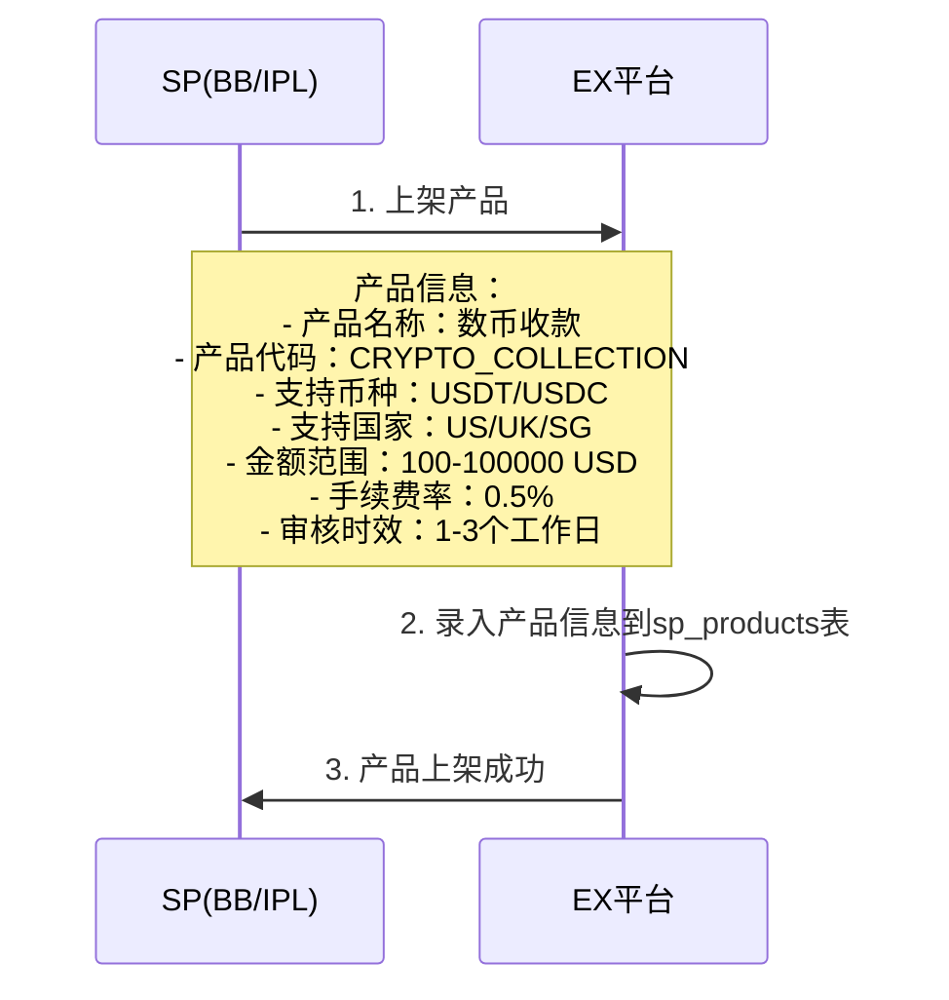

**数据示例：**

```json
{
  "sp_id": 1001,
  "sp_name": "BB",
  "product_name": "数币收款",
  "product_code": "CRYPTO_COLLECTION",
  "supported_currencies": ["USDT", "USDC"],
  "supported_countries": ["US", "UK", "SG"],
  "amount_min": 100,
  "amount_max": 100000,
  "fee_rate": 0.005,
  "status": "ACTIVE"
}
```

---

### 1.2 TP与SP签约

**说明：** 租户（TP）需要与SP签约，获得为商户开通该产品的权限。

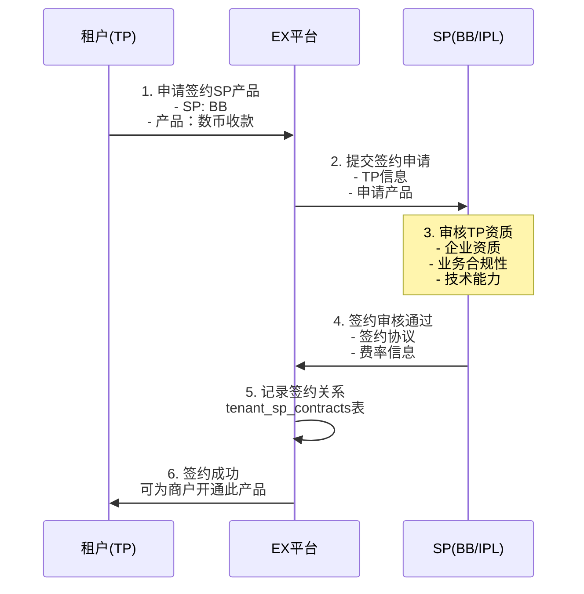

**数据示例：**

```json
{
  "tenant_id": 2001,
  "tenant_name": "TP001",
  "sp_id": 1001,
  "sp_name": "BB",
  "sp_product_id": 3001,
  "product_code": "CRYPTO_COLLECTION",
  "contract_status": "ACTIVE",
  "signed_at": "2026-02-01T10:00:00Z"
}
```

---

### 1.2.1 租户签约详细流程

**说明：** TP与SP签约时，不仅选择产品，还需要配置每个产品下的具体能力来源（哪个SP提供哪部分能力）。

**核心概念：**

- **产品签约**：TP选择要开通的产品（如承兑、数币钱包、收款、法币账户）
- **能力配置**：每个产品下，配置具体能力由哪个SP提供
- **法币账户选择**：承兑产品涉及法币侧入账，TP需选择法币账户由 IPL / BB / 都选择

**签约配置示例：**

```
租户签约配置：
┌─────────────────────────────────────────────────────────────────┐
│  产品1：承兑产品（On/Off-Ramp）                                   │
│  ├── 承兑能力提供方：BB（固定，BB专做承兑）                         │
│  └── 承兑后法币账户：                                             │
│      ☐ IPL法币账户（承兑后USD入到IPL账户）                         │
│      ☐ BB法币账户（承兑后USD入到BB账户）                           │
│      ☐ 都选择（商户可自行选择入到哪个法币账户）                     │
│                                                                  │
│  产品2：数币钱包（Crypto Wallet）                                  │
│  ├── 钱包能力提供方：BB（固定）                                    │
│  └── 无需选择法币账户                                             │
│                                                                  │
│  产品3：收款产品（Collection/Payin）                               │
│  ├── 法币收款：IPL                                                │
│  └── 数币收款：BB                                                 │
│                                                                  │
│  产品4：法币账户（Fiat Account）                                   │
│  ├── IPL法币账户：☐ 选择                                          │
│  └── BB法币账户：☐ 选择                                           │
└─────────────────────────────────────────────────────────────────┘
```

**签约流程：**

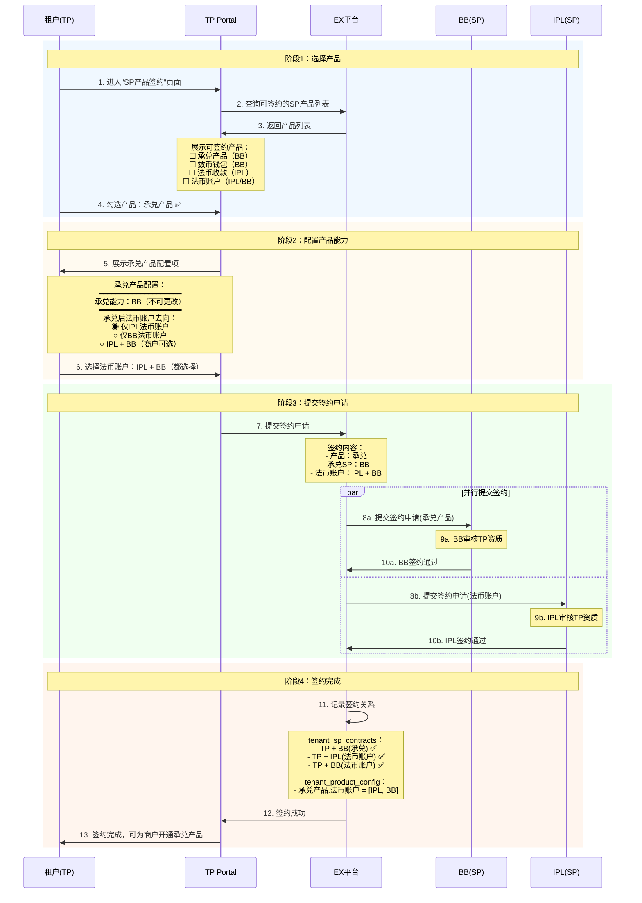

**承兑产品 - 法币账户选择的三种模式：**

| 模式               | 法币账户    | 承兑后资金去向           | 商户体验                 | 适用场景                    |
| ------------------ | ----------- | ------------------------ | ------------------------ | --------------------------- |
| **仅IPL**    | IPL法币账户 | 承兑后USD入到IPL账户     | 商户无需选择，自动入IPL  | TP只签约了IPL法币账户       |
| **仅BB**     | BB法币账户  | 承兑后USD入到BB账户      | 商户无需选择，自动入BB   | TP只签约了BB法币账户        |
| **IPL + BB** | 两者都有    | 商户自行选择入到哪个账户 | 商户在承兑时选择目标账户 | TP同时签约了IPL和BB法币账户 |

**法币账户选择对交易流程的影响：**

```
承兑产品签约配置 → 决定交易流程：
┌──────────────────────────────────────────────────────────┐
│  法币账户 = 仅BB                                          │
│  → 走 5.1 纯BB承兑流程（BB内部账户划转）                    │
│                                                          │
│  法币账户 = 仅IPL                                         │
│  → 走 5.2.1 BB数币→IPL法币承兑（IPL侧同名收款）           │
│                                                          │
│  法币账户 = IPL + BB                                      │
│  → 商户选择目标账户：                                      │
│    - 选BB → 走 5.1 纯BB承兑                               │
│    - 选IPL → 走 5.2.1 BB数币→IPL法币承兑                  │
└──────────────────────────────────────────────────────────┘
```

**数据示例：**

```json
{
  "tenant_id": 2001,
  "product_contracts": [
    {
      "product_code": "ON_OFF_RAMP",
      "product_name": "承兑产品",
      "exchange_sp": "BB",
      "fiat_account_options": ["IPL", "BB"],
      "fiat_account_mode": "BOTH",
      "contract_status": "ACTIVE",
      "signed_at": "2026-02-11T10:00:00Z"
    }
  ],
  "sp_contracts": [
    {
      "sp_id": 1001,
      "sp_name": "BB",
      "products": ["ON_OFF_RAMP", "CRYPTO_WALLET"],
      "contract_status": "ACTIVE"
    },
    {
      "sp_id": 1002,
      "sp_name": "IPL",
      "products": ["FIAT_ACCOUNT"],
      "contract_status": "ACTIVE"
    }
  ]
}
```

---

### 1.3 TP配置入网推送规则

**说明：** TP需要配置商户开通产品时，资料推送到哪个SP进行审核。

**配置原则：**

- 必须配置默认规则（兜底）
- 可配置条件规则（金额、国家等）
- 如果未配置，商户开通时会被拒绝

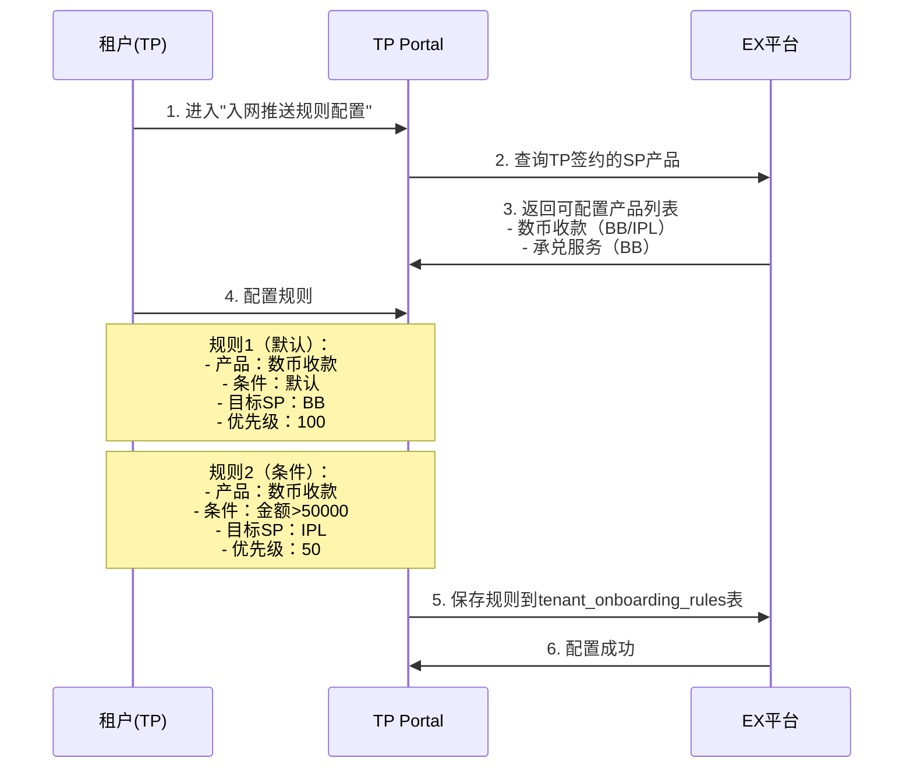

**配置示例：**

```json
[
  {
    "tenant_id": 2001,
    "product_code": "CRYPTO_COLLECTION",
    "condition_type": "AMOUNT",
    "condition_value": {"amount_min": 50000},
    "target_sp_id": 1002,
    "target_sp_name": "IPL",
    "priority": 50,
    "status": "ACTIVE"
  },
  {
    "tenant_id": 2001,
    "product_code": "CRYPTO_COLLECTION",
    "condition_type": "DEFAULT",
    "condition_value": null,
    "target_sp_id": 1001,
    "target_sp_name": "BB",
    "priority": 100,
    "status": "ACTIVE"
  }
]
```

**规则匹配逻辑：**

1. 按优先级从小到大排序（数字越小优先级越高）
2. 依次匹配条件
3. 第一个匹配成功的规则生效
4. 如果都不匹配，使用DEFAULT规则

---

### 1.4 TP配置交易路由规则

**说明：** TP需要配置商户交易时，路由到哪个SP执行。

**配置原则：**

- 支持默认规则（租户级）
- 支持商户级规则（针对特定商户）
- 商户级规则优先级高于默认规则

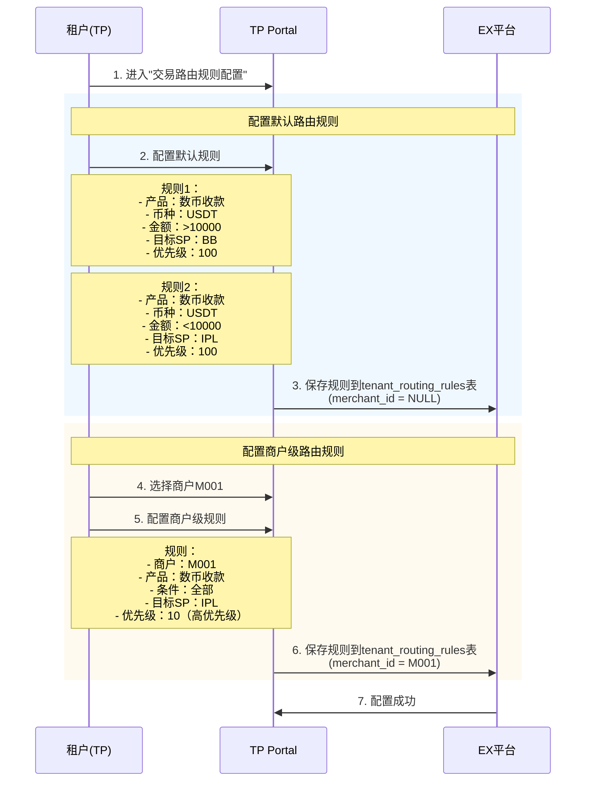

**配置示例：**

```json
[
  {
    "tenant_id": 2001,
    "merchant_id": null,
    "product_code": "CRYPTO_COLLECTION",
    "currency": "USDT",
    "amount_min": 10000,
    "amount_max": null,
    "target_sp_id": 1001,
    "target_sp_name": "BB",
    "priority": 100,
    "status": "ACTIVE"
  },
  {
    "tenant_id": 2001,
    "merchant_id": "M001",
    "product_code": "CRYPTO_COLLECTION",
    "currency": null,
    "amount_min": null,
    "amount_max": null,
    "target_sp_id": 1002,
    "target_sp_name": "IPL",
    "priority": 10,
    "status": "ACTIVE"
  }
]
```

**路由规则优先级：**

1. 商户级规则（merchant_id不为NULL）
2. 条件匹配规则（币种、金额、国家等）
3. 默认规则
4. 如果都不匹配，使用第一个可用SP

---

## 商户入网流程

### 2.1 白牌模式（MP Portal）

**说明：** 商户通过EX提供的白牌Portal完成入网和产品开通。

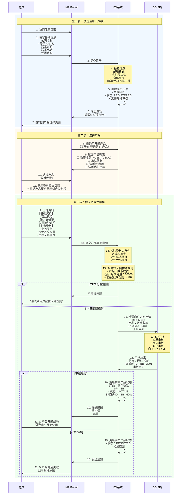

---

### 2.2 API模式

**说明：** 租户通过API为商户完成入网和产品开通。

#### 方式1：分步调用（推荐）

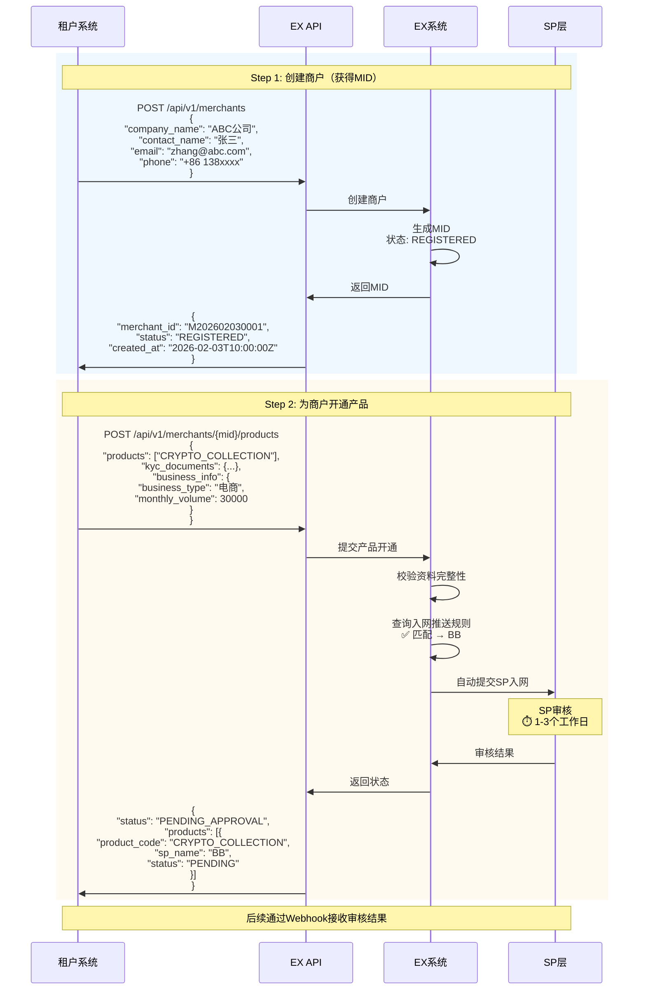

#### 方式2：一次性调用（便捷）

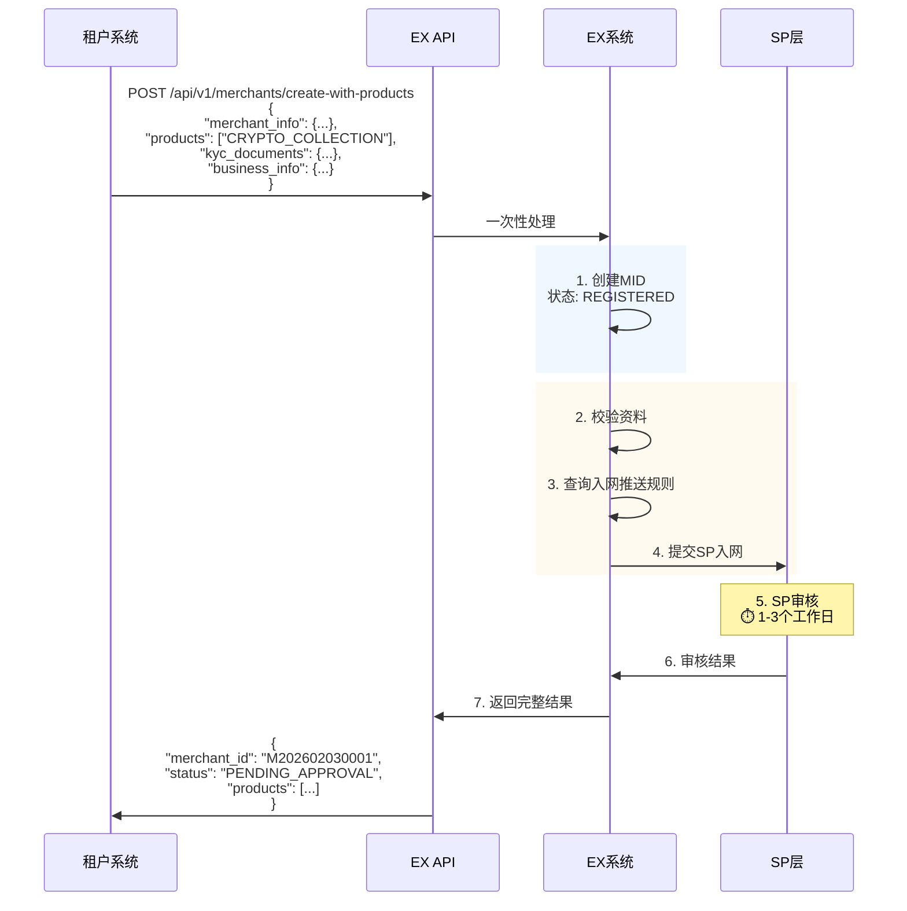

---

## 多SP场景处理

### 3.1 入网推送逻辑

**场景：** 租户签约了BB和IPL两个SP，都支持"数币收款"产品。

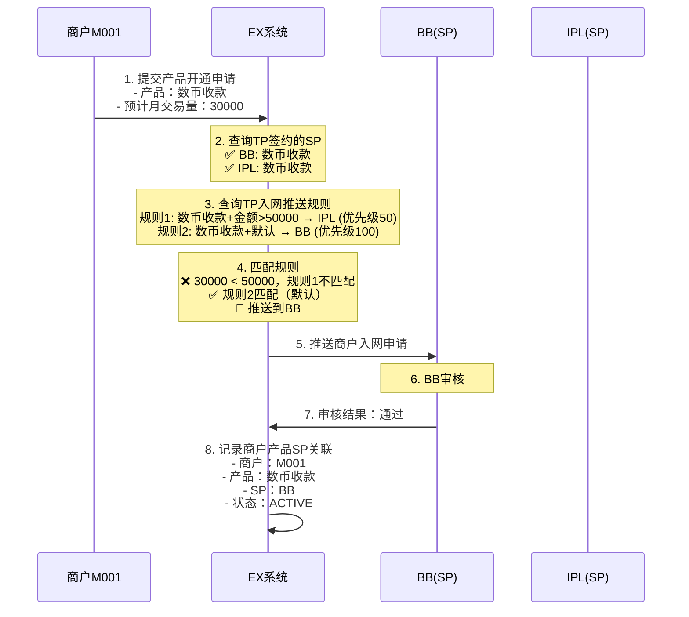

**关键点：**

- 只推送到匹配规则的SP，不会同时推送到多个SP
- 如果TP未配置规则，拒绝开通
- 如果规则匹配失败，使用DEFAULT规则

---

### 3.2 SP审核结果处理

#### 场景1：单个SP审核通过

```
商户M001 → 推送到BB → BB审核通过 → 商户在BB开通成功
```

**商户侧显示：**

- 产品状态：✅ 数币收款已开通
- 可用SP：BB

#### 场景2：SP审核拒绝，TP调整规则

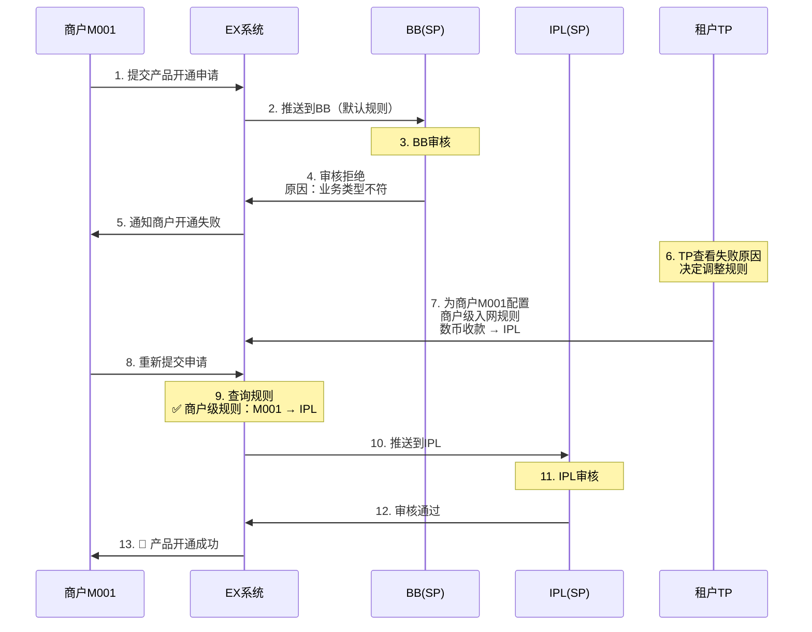

#### 场景3：商户在多个SP都开通

**前提：** 商户先后在BB和IPL都开通了"数币收款"产品。

```
商户M001:
  - 数币收款 @ BB: ACTIVE
  - 数币收款 @ IPL: ACTIVE
```

**交易时的处理：** 根据交易路由规则选择SP（见下一章节）

---

## 交易路由逻辑

### 4.1 路由规则匹配

**场景：** 商户M001在BB和IPL都开通了"数币收款"，发起一笔交易。

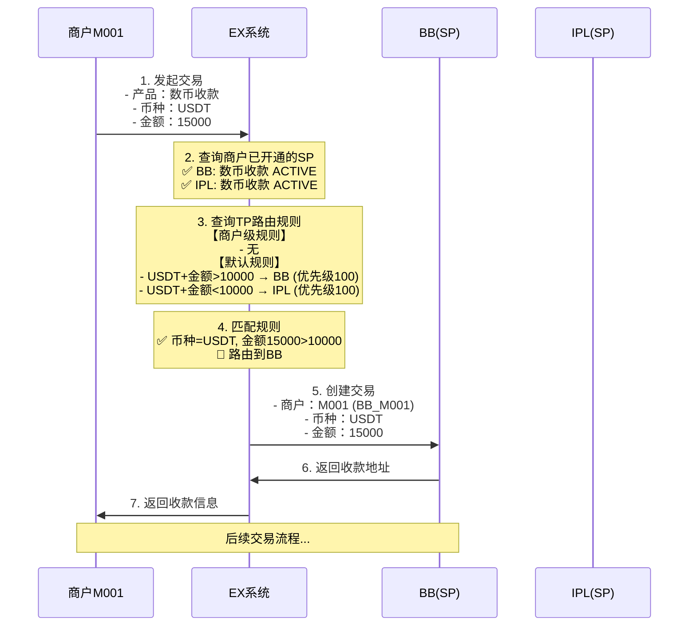

**路由规则优先级：**

1. **商户级规则**（merchant_id不为NULL）- 优先级最高
2. **条件匹配规则**（币种、金额、国家等）- 按priority排序
3. **默认规则**（无条件）- 兜底
4. **第一个可用SP** - 如果都不匹配

---

### 4.2 商户级路由调整

**场景：** VIP商户M001要求所有交易走IPL。

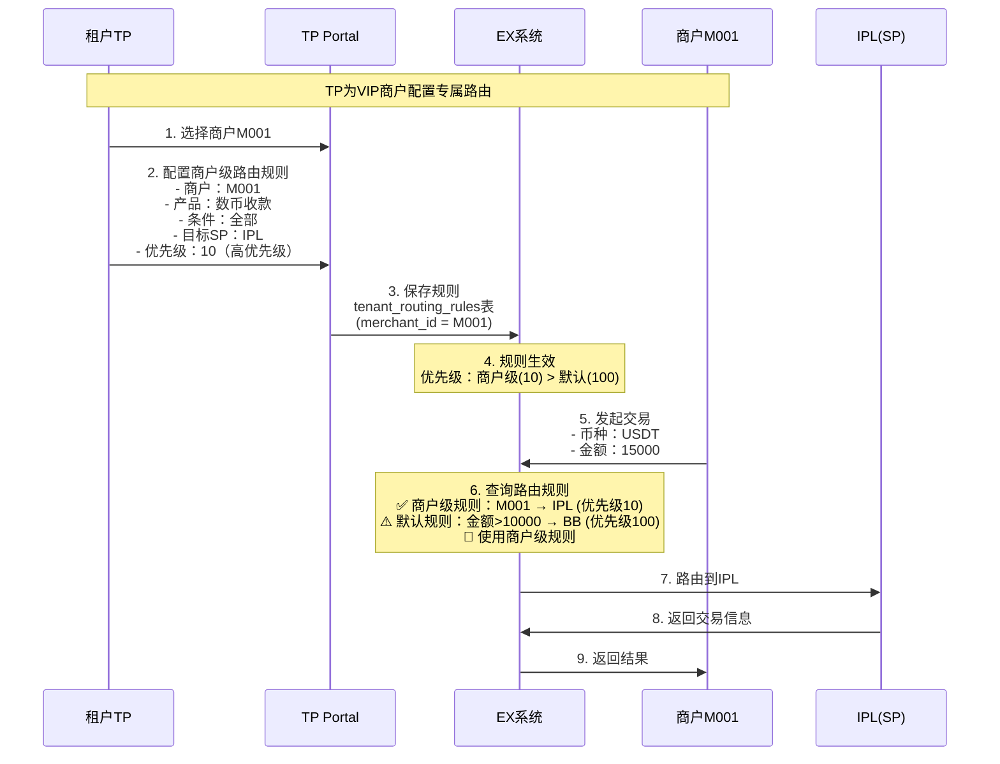

**商户级路由的典型场景：**

- VIP商户专属通道
- 大客户费率优惠
- 高风险商户特殊处理
- 测试商户路由到沙箱环境

---

## 完整时序图

### 端到端流程：从TP签约到商户交易

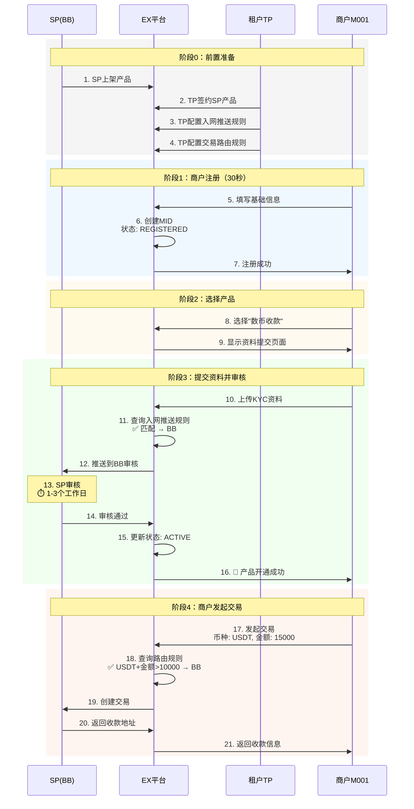

---

## 附录

### A. 规则匹配算法

**入网推送规则匹配：**

```python
def match_onboarding_rule(tenant_id, product_code, merchant_data):
    # 1. 查询所有规则，按优先级排序
    rules = query_rules(tenant_id, product_code).order_by('priority ASC')
  
    # 2. 依次匹配
    for rule in rules:
        if rule.condition_type == 'DEFAULT':
            return rule.target_sp_id
        elif rule.condition_type == 'AMOUNT':
            if merchant_data.monthly_volume >= rule.condition_value['amount_min']:
                return rule.target_sp_id
        elif rule.condition_type == 'COUNTRY':
            if merchant_data.country in rule.condition_value['countries']:
                return rule.target_sp_id
  
    # 3. 无匹配规则，拒绝开通
    raise Exception("No matching onboarding rule found")
```

**交易路由规则匹配：**

```python
def match_routing_rule(tenant_id, merchant_id, transaction):
    # 1. 查询商户级规则（优先级最高）
    merchant_rules = query_routing_rules(tenant_id, merchant_id).order_by('priority ASC')
    for rule in merchant_rules:
        if match_conditions(rule, transaction):
            return rule.target_sp_id
  
    # 2. 查询默认规则
    default_rules = query_routing_rules(tenant_id, None).order_by('priority ASC')
    for rule in default_rules:
        if match_conditions(rule, transaction):
            return rule.target_sp_id
  
    # 3. 使用第一个可用SP
    available_sps = query_merchant_active_sps(merchant_id, transaction.product_code)
    if available_sps:
        return available_sps[0].sp_id
  
    raise Exception("No available SP found")

def match_conditions(rule, transaction):
    if rule.currency and rule.currency != transaction.currency:
        return False
    if rule.amount_min and transaction.amount < rule.amount_min:
        return False
    if rule.amount_max and transaction.amount > rule.amount_max:
        return False
    if rule.country and rule.country != transaction.country:
        return False
    return True
```

---

### B. 状态机

**商户产品状态机：**

```
REGISTERED → PENDING → ACTIVE
                    ↓
                 REJECTED
```

- **REGISTERED**: 商户已注册，未提交产品申请
- **PENDING**: 已提交产品申请，等待SP审核
- **ACTIVE**: SP审核通过，产品已开通
- **REJECTED**: SP审核拒绝

---

### C. API接口列表

#### 1. 创建商户

```http
POST /api/v1/merchants
Content-Type: application/json

{
  "company_name": "ABC公司",
  "contact_name": "张三",
  "email": "zhang@abc.com",
  "phone": "+86 138xxxx"
}

Response:
{
  "merchant_id": "M202602030001",
  "status": "REGISTERED",
  "created_at": "2026-02-03T10:00:00Z"
}
```

#### 2. 为商户开通产品

```http
POST /api/v1/merchants/{merchant_id}/products
Content-Type: application/json

{
  "products": ["CRYPTO_COLLECTION"],
  "kyc_documents": {
    "business_license": "https://...",
    "id_card": "https://..."
  },
  "business_info": {
    "business_type": "电商",
    "monthly_volume": 30000,
    "main_countries": ["US", "UK"]
  }
}

Response:
{
  "status": "PENDING_APPROVAL",
  "products": [{
    "product_code": "CRYPTO_COLLECTION",
    "sp_name": "BB",
    "sp_id": 1001,
    "status": "PENDING",
    "submitted_at": "2026-02-03T10:05:00Z"
  }]
}
```

#### 3. 查询商户产品状态

```http
GET /api/v1/merchants/{merchant_id}/products

Response:
{
  "merchant_id": "M202602030001",
  "products": [{
    "product_code": "CRYPTO_COLLECTION",
    "product_name": "数币收款",
    "sp_id": 1001,
    "sp_name": "BB",
    "sp_merchant_id": "BB_M001",
    "status": "ACTIVE",
    "approved_at": "2026-02-03T12:00:00Z"
  }]
}
```

---

## 总结

本文档详细描述了EX平台的商户入网和产品开通流程，核心特点：

✅ **产品驱动**：围绕产品开通组织流程，而非单纯入网
✅ **白牌友好**：注册即创建MID，无需TP审核，体验流畅
✅ **多SP支持**：灵活配置入网推送和交易路由规则
✅ **规则可配**：支持默认规则和商户级规则，满足不同场景
✅ **职责清晰**：EX是科技平台，合规审核由SP负责

**关键流程：**

1. **前置准备**：SP上架产品 → TP签约 → TP配置规则
2. **商户入网**：注册 → 选择产品 → 提交资料 → SP审核 → 开通成功
3. **交易路由**：发起交易 → 匹配路由规则 → 路由到SP → 执行交易

---

*最后更新：2026-02-11*
*文档版本：v1.2 — 新增租户签约详细流程（产品选择+法币账户配置）*
