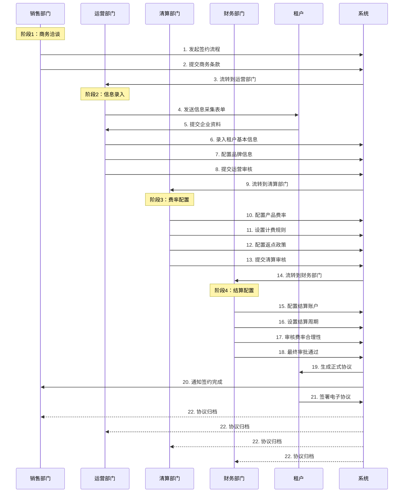
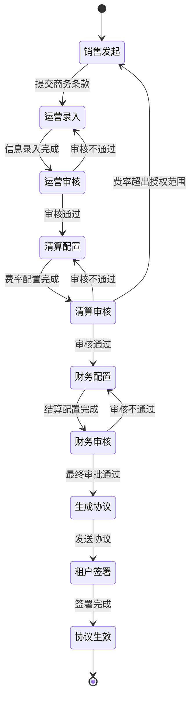

# 多部门协同租户签约流程梳理

## 一、业务背景

租户签约是一个涉及多个部门协同的复杂流程，需要销售、运营、清算、财务等部门共同参与。为了提高效率和透明度，需要建立一套标准化的流程和系统支持，确保协议在各部门之间顺畅流转，并且每个部门都能清晰识别和处理自己负责的内容。

## 二、参与部门及职责

| 部门 | 角色代码 | 主要职责 | 关键输出 |
|------|---------|---------|---------|
| **销售部门** | SALES | 客户开拓、需求收集、商务谈判 | 签约意向、商务条款 |
| **运营部门** | OPS | 租户信息录入、流程推进、协调各方 | 租户基本信息、品牌配置 |
| **清算部门** | CLEARING | 产品定价、费率配置、收费规则 | 费率方案、计费规则 |
| **财务部门** | FINANCE | 结算账户配置、资金管理、财务审核 | 结算配置、财务审批 |

## 三、签约流程全景图



## 四、详细流程拆解

### 阶段1：销售发起（SALES）

#### 1.1 发起签约申请
**操作人：** 销售经理  
**输入：**
- 客户名称（中英文）
- 客户联系人信息
- 意向产品列表
- 预估交易量
- 特殊需求说明

**输出：**
- 签约申请单号（如：SA-2024012901）
- 商务条款草案

**系统功能：**
- 创建签约流程实例
- 生成唯一流程编号
- 自动通知运营部门

#### 1.2 商务条款确认
**内容包括：**
- 签约产品范围
- 基础费率框架
- 服务等级承诺（SLA）
- 合作期限
- 特殊商务条款

---

### 阶段2：运营录入（OPS）

#### 2.1 租户基本信息录入
**操作人：** 运营专员  
**录入内容：**

**企业基本信息**
- 租户中文名称
- 租户英文名称
- 租户ID（系统生成或手动指定）
- 统一社会信用代码 / 公司注册号
- 注册地址（国家/省/市/详细地址）
- 成立日期
- 法定代表人
- 注册资本

**联系信息**
- 主要联系人姓名
- 联系人职位
- 联系电话（区号+号码）
- 联系邮箱
- 紧急联系人信息

**企业资质**
- 营业执照扫描件
- 开户许可证
- 相关行业资质证明
- 法人身份证明

#### 2.2 品牌信息配置
**品牌设置**
- 是否使用自有品牌
- 品牌名称
- 品牌Logo（多尺寸）
- 品牌色系配置

**域名配置**
- 是否使用自有域名
- 域名地址
- SSL证书配置
- DNS解析配置

**通知配置**
- 短信签名
- 邮件发件人名称
- 邮件后缀白名单
- 客服联系方式

#### 2.3 运营审核要点
- [ ] 企业信息完整性
- [ ] 证照真实性验证
- [ ] 联系方式有效性
- [ ] 品牌信息合规性
- [ ] 与销售提供信息一致性

**审核结果：**
- ✅ 通过 → 流转到清算部门
- ❌ 拒绝 → 退回销售/要求补充材料
- ⏸️ 暂存 → 等待补充信息

---

### 阶段3：清算配置（CLEARING）

#### 3.1 产品费率配置
**操作人：** 清算专员  
**配置内容：**

**产品选择**
- 勾选签约产品（VCC、收款、结汇等）
- 设置产品生效时间
- 配置产品优先级

**费率设置**
| 产品类型 | 费率项目 | 配置内容 | 示例 |
|---------|---------|---------|------|
| VCC虚拟卡 | 开卡费 | 固定金额 | $5/卡 |
| VCC虚拟卡 | 交易手续费 | 百分比 + 固定费 | 2.5% + $0.3 |
| VCC虚拟卡 | 月费 | 固定金额 | $10/月 |
| 收款服务 | 交易手续费 | 阶梯费率 | <1万: 3%, 1-10万: 2.5%, >10万: 2% |
| 收款服务 | 提现费 | 固定金额 | $2/笔 |
| 结汇服务 | 汇率差 | 百分比 | 0.5% |
| 结汇服务 | 结汇手续费 | 固定金额 | ¥50/笔 |

**返点政策**
- 交易返点比例
- 返点结算周期
- 返点触发条件（交易量阶梯）
- 返点上限设置

#### 3.2 计费规则配置
**计费周期**
- 实时计费
- 日结
- 周结
- 月结

**计费规则**
- 计费币种（USD/CNY/EUR等）
- 汇率来源和更新频率
- 小数位处理规则
- 最低收费标准

**特殊规则**
- 免费额度设置
- 促销活动配置
- 节假日费率调整
- 批量交易优惠

#### 3.3 清算审核要点
- [ ] 费率符合公司定价政策
- [ ] 返点比例在授权范围内
- [ ] 计费规则清晰无歧义
- [ ] 与商务条款一致
- [ ] 利润率满足最低要求

**审核结果：**
- ✅ 通过 → 流转到财务部门
- ❌ 拒绝 → 退回销售重新谈判
- 🔄 调整 → 修改后重新提交

---

### 阶段4：财务配置（FINANCE）

#### 4.1 结算账户配置
**操作人：** 财务专员  
**配置内容：**

**收款账户**
- 银行名称
- 银行账号
- 开户行地址
- SWIFT Code / IBAN
- 账户类型（对公/对私）
- 账户用途说明

**结算账户**
- 结算银行信息
- 结算账号
- 结算币种
- 是否支持多币种结算

**备用账户**
- 备用收款账户
- 备用结算账户
- 账户切换规则

#### 4.2 结算规则配置
**结算周期**
- T+1 / T+7 / T+15 / T+30
- 自定义结算日期
- 节假日顺延规则

**结算方式**
- 自动结算
- 手动审核后结算
- 达到金额阈值自动结算

**结算限额**
- 单笔结算最低金额
- 单笔结算最高金额
- 日结算限额
- 月结算限额

**资金冻结规则**
- 风险保证金比例
- 冻结期限
- 解冻条件

#### 4.3 财务审核要点
- [ ] 账户信息真实有效
- [ ] 账户与企业主体一致
- [ ] 结算周期符合公司政策
- [ ] 费率配置财务合理性
- [ ] 风险控制措施到位
- [ ] 税务合规性检查

**最终审批：**
- ✅ 批准 → 生成正式协议
- ❌ 拒绝 → 说明原因，退回修改
- 🔍 补充 → 要求提供额外材料

---

## 五、协议内容结构

### 5.1 协议组成部分

```
租户签约协议
├── 第一部分：基本信息（运营负责）
│   ├── 甲方信息（平台方）
│   ├── 乙方信息（租户）
│   ├── 协议编号
│   ├── 签约日期
│   └── 有效期限
│
├── 第二部分：商务条款（销售负责）
│   ├── 合作范围
│   ├── 服务内容
│   ├── 服务等级承诺
│   ├── 双方权利义务
│   └── 特殊约定
│
├── 第三部分：费率与计费（清算负责）
│   ├── 产品费率表
│   ├── 返点政策
│   ├── 计费规则
│   ├── 调价机制
│   └── 费用争议处理
│
├── 第四部分：结算条款（财务负责）
│   ├── 结算账户信息
│   ├── 结算周期
│   ├── 结算方式
│   ├── 资金冻结规则
│   └── 税务处理
│
└── 第五部分：附加条款
    ├── 保密条款
    ├── 违约责任
    ├── 争议解决
    ├── 协议变更
    └── 其他约定
```

### 5.2 协议标识系统

为了让各部门能够快速识别协议中的相关内容，建议采用以下标识系统：

**颜色标识**
- 🔵 蓝色：基本信息（运营）
- 🟢 绿色：商务条款（销售）
- 🟡 黄色：费率计费（清算）
- 🟣 紫色：结算财务（财务）

**章节编号**
- 1.x：基本信息
- 2.x：商务条款
- 3.x：费率计费
- 4.x：结算财务
- 5.x：附加条款

**审批标记**
- ✅ 已审批
- ⏳ 审批中
- ❌ 已拒绝
- 📝 待补充

---

## 六、流程状态机



---

## 七、系统功能需求

### 7.1 流程管理功能

**流程看板**
- 显示所有进行中的签约流程
- 按部门分组显示待办事项
- 流程进度可视化
- 超时预警提醒

**任务分配**
- 自动分配到对应部门
- 支持手动指定处理人
- 支持任务转派
- 支持加急标记

**流程追溯**
- 完整的操作日志
- 每个节点的处理人和时间
- 审批意见记录
- 附件版本管理

### 7.2 协议管理功能

**协议生成**
- 根据各部门配置自动生成协议
- 支持协议模板管理
- 支持变量替换
- 支持多语言版本

**协议预览**
- 分部门高亮显示
- 支持在线编辑
- 支持批注功能
- 支持对比查看

**电子签章**
- 支持电子签名
- 支持企业公章
- 签署流程追溯
- 法律效力保障

**协议归档**
- 按部门分类存储
- 支持全文检索
- 支持版本管理
- 支持导出下载

### 7.3 权限控制

**部门权限**
| 部门 | 查看权限 | 编辑权限 | 审批权限 |
|------|---------|---------|---------|
| 销售 | 全部内容 | 商务条款 | 商务条款 |
| 运营 | 全部内容 | 基本信息、品牌配置 | 基本信息 |
| 清算 | 全部内容 | 费率计费 | 费率计费 |
| 财务 | 全部内容 | 结算配置 | 全部内容（最终审批）|

**字段级权限**
- 敏感信息脱敏显示
- 财务数据仅财务可见
- 商务条款仅销售和管理层可见

---

## 八、优化建议

### 8.1 短期优化（1-3个月）

1. **建立标准化模板**
   - 制定各部门的标准操作手册
   - 建立协议模板库
   - 统一字段命名规范

2. **实现基础自动化**
   - 自动流转到下一环节
   - 超时自动提醒
   - 基础数据自动校验

3. **优化沟通机制**
   - 建立部门间沟通群
   - 定期同步会议
   - 问题快速响应机制

### 8.2 中期优化（3-6个月）

1. **租户自助录入**
   - 开发租户自助门户
   - 租户在线填写基本信息
   - 自动上传企业资质
   - 减轻运营录入负担

2. **智能审核辅助**
   - 企业信息自动验证（工商查询）
   - 费率合理性自动检查
   - 风险评分自动计算
   - 异常情况自动预警

3. **数据分析报表**
   - 签约周期分析
   - 各环节耗时统计
   - 拒绝原因分析
   - 部门效率对比

### 8.3 长期优化（6-12个月）

1. **AI智能助手**
   - 智能推荐费率方案
   - 自动生成协议草稿
   - 智能问答系统
   - 风险预测模型

2. **全流程数字化**
   - 电子签章全覆盖
   - 无纸化办公
   - 移动端审批
   - 区块链存证

3. **生态系统对接**
   - 对接工商系统
   - 对接银行系统
   - 对接税务系统
   - 对接第三方征信

---

## 九、关键指标（KPI）

### 9.1 效率指标

| 指标名称 | 目标值 | 当前值 | 计算方式 |
|---------|-------|-------|---------|
| 平均签约周期 | ≤ 5个工作日 | 8个工作日 | 从发起到生效的平均天数 |
| 运营环节耗时 | ≤ 1个工作日 | 2个工作日 | 运营录入和审核的平均时间 |
| 清算环节耗时 | ≤ 1个工作日 | 1.5个工作日 | 清算配置和审核的平均时间 |
| 财务环节耗时 | ≤ 1个工作日 | 2个工作日 | 财务配置和审核的平均时间 |
| 一次性通过率 | ≥ 80% | 65% | 无退回修改直接通过的比例 |

### 9.2 质量指标

| 指标名称 | 目标值 | 说明 |
|---------|-------|------|
| 信息准确率 | ≥ 99% | 录入信息与实际一致的比例 |
| 协议差错率 | ≤ 0.1% | 协议内容错误的比例 |
| 客户投诉率 | ≤ 1% | 因签约流程问题导致的投诉 |
| 合规通过率 | 100% | 通过内外部合规审计的比例 |

---

## 十、风险控制

### 10.1 流程风险

**风险点1：信息不一致**
- 风险：各部门录入信息不一致
- 控制：建立主数据管理，单一数据源
- 措施：自动校验，异常提醒

**风险点2：审批延误**
- 风险：某个环节长时间未处理
- 控制：设置SLA时限，超时预警
- 措施：自动升级，管理层介入

**风险点3：权限滥用**
- 风险：越权修改或查看敏感信息
- 控制：严格的权限控制和审计
- 措施：操作日志，定期审查

### 10.2 业务风险

**风险点1：费率配置错误**
- 风险：费率设置过低导致亏损
- 控制：多级审批，自动校验
- 措施：设置费率下限，超限预警

**风险点2：结算账户风险**
- 风险：账户信息错误导致资金损失
- 控制：银行账户验证，小额测试
- 措施：首次结算人工审核

**风险点3：合规风险**
- 风险：协议内容不符合法律法规
- 控制：法务审核，模板管理
- 措施：定期法律审查，及时更新

---

## 十一、实施路线图

### Phase 1：流程梳理（Week 1-2）
- [x] 完成流程文档编写
- [ ] 各部门评审确认
- [ ] 制定标准操作手册
- [ ] 培训各部门人员

### Phase 2：系统开发（Week 3-8）
- [ ] 需求确认和原型设计
- [ ] 开发流程管理系统
- [ ] 开发协议生成系统
- [ ] 集成电子签章
- [ ] 系统测试

### Phase 3：试运行（Week 9-10）
- [ ] 选择试点客户
- [ ] 各部门试用
- [ ] 收集反馈意见
- [ ] 优化调整

### Phase 4：全面推广（Week 11-12）
- [ ] 系统正式上线
- [ ] 全员培训
- [ ] 旧流程迁移
- [ ] 持续优化

---

## 十二、附录

### 附录A：术语表

| 术语 | 英文 | 说明 |
|------|------|------|
| 租户 | Tenant | 签约使用平台服务的企业客户 |
| 清算 | Clearing | 交易费用的计算和收取 |
| 结算 | Settlement | 资金的划拨和到账 |
| 返点 | Rebate | 给予租户的交易返利 |
| SLA | Service Level Agreement | 服务等级协议 |

### 附录B：联系方式

| 部门 | 负责人 | 邮箱 | 分机 |
|------|-------|------|------|
| 销售部 | 待定 | sales@ex.com | 8001 |
| 运营部 | 待定 | ops@ex.com | 8002 |
| 清算部 | 待定 | clearing@ex.com | 8003 |
| 财务部 | 待定 | finance@ex.com | 8004 |

### 附录C：参考文档

- 《租户签约管理制度》
- 《费率定价管理办法》
- 《结算管理规定》
- 《电子协议管理办法》

---

**文档版本：** V1.0  
**编制日期：** 2024-01-29  
**编制部门：** 产品部  
**审核状态：** 待审核  

**变更记录：**
| 版本 | 日期 | 变更内容 | 变更人 |
|------|------|---------|--------|
| V1.0 | 2024-01-29 | 初始版本 | - |
