# OnRamp 完整产品方案（PRD + 交易流程）

> **文档类型**：产品需求文档 + 交易流程（合并版）
> **产品名称**：OnRamp — 法币买入数币
> **版本**：v1.0
> **最后更新**：2026-02-22
> **来源文档**：`onramp-prd.md`（产品需求）、`on-offramp.md`（交易流程与时序图）
> **配套文档**：`onramp-technical.md`（完整技术方案）、`mp-onramp-v2.html`（交互原型）

---

## 目录

1. [产品概述](#1-产品概述)
2. [角色与系统架构](#2-角色与系统架构)
3. [商户配置与开通](#3-商户配置与开通)
4. [三单模型](#4-三单模型)
5. [业务流程与时序图](#5-业务流程与时序图)（含各场景异常处理）
   - 5.2 [场景A1：即时单 — BB法币账户直接承兑（仅BB）](#52-场景a1即时单--bb法币账户直接承兑仅bb)
   - 5.3 [场景A2：即时单 — IPL法币账户承兑到BB数币钱包（BB+IPL）](#53-场景a2即时单--ipl法币账户承兑到bb数币钱包bbipl)
   - 5.4 [场景B1：预约单 — BB代收付/XPAY VA收款→承兑（仅BB）](#54-场景b1预约单--bb代收付xpay-va收款承兑仅bb)
   - 5.5 [场景B2：预约单 — IPL VA收款→承兑到BB数币钱包（BB+IPL）](#55-场景b2预约单--ipl-va收款承兑到bb数币钱包bbipl)
   - 5.6 [收款账户选择逻辑](#56-收款账户选择逻辑)
6. [中间户机制（跨SP场景）](#6-中间户机制跨sp场景)
7. [状态机](#7-状态机)
8. [计费与汇率](#8-计费与汇率)
9. [风控规则](#9-风控规则)（含异常退款汇总）
10. [预约单匹配规则](#10-预约单匹配规则)
11. [校验规则详解](#11-校验规则详解)
12. [商户端功能清单](#12-商户端功能清单)
13. [场景汇总对比](#13-场景汇总对比)

---

## 1. 产品概述

### 1.1 定义

**OnRamp = 法币 → 数币承兑**。商户将法币（USD 等）兑换为 USDT/USDC，入账到数币钱包。

### 1.2 核心价值

| 用户类型           | 痛点                                   | OnRamp 解决方案          |
| ------------------ | -------------------------------------- | ------------------------ |
| WEB2 外贸/服贸客户 | 买家需用数币付款，汇率不稳定或外汇管制 | 提供法币→稳定币承兑能力 |
| WEB3 行业客户      | 需要将法币转为数币进入 WEB3 生态       | 一站式法币入金+承兑      |

### 1.3 产品边界

| 范围        | 说明                               |
| ----------- | ---------------------------------- |
| ✅ 本期包含 | OnRamp（法币→数币）全流程         |
| ❌ 本期不含 | OffRamp（数币→法币）— 见独立 PRD |
| ❌ 本期不含 | 纯 FX 兑换（法币↔法币）           |

---

## 2. 角色与系统架构

### 2.1 平台角色

| 角色       | 英文                  | Portal | 在 OnRamp 中的职责                               |
| ---------- | --------------------- | ------ | ------------------------------------------------ |
| 平台管理员 | SaaS Admin            | SA     | 管理 SP 产品上架、全局配置                       |
| 服务提供商 | Service Provider (SP) | PP     | 提供承兑能力（BB）、法币账户能力（BB/IPL）       |
| 租户       | Tenant                | TP     | 为商户代理 OnRamp 产品，配置费率和法币账户优先级 |
| 商户       | Merchant              | MP     | 发起 OnRamp 交易，选择支付方式                   |

### 2.2 SP 角色定位

```
┌─────────────────────────────────────────────────────────────┐
│  EX 平台中的 SP                                              │
├──────────────┬──────────────────────────────────────────────┤
│  BB（承兑SP） │  核心能力：                                    │
│              │  · 数币钱包（USDT/USDC）                       │
│              │  · 承兑引擎（法币⇄数币）                       │
│              │  · BB 法币账户                                 │
│              │  · BB 代收付账户（自有渠道）                     │
│              │  · XPAY VA（BB 内部渠道，对 TP/MP 不透明）       │
│              │                                               │
│              │  BB 同时是 PP 角色，其渠道对 EX 透明，           │
│              │  对 TP/MP 不透明                                │
├──────────────┼──────────────────────────────────────────────┤
│  IPL（法币SP）│  核心能力：                                    │
│              │  · IPL 法币账户                                │
│              │  · VA 同名收款（多银行）                        │
│              │  · POBO 出款                                   │
│              │                                               │
│              │  与 BB 为集团内部合作，对外不暴露                 │
└──────────────┴──────────────────────────────────────────────┘

⚠️ XPAY 不是 SP，是 BB 的底层 Channel，不在 EX 生态中体现
⚠️ 商户不感知底层 SP（BB/IPL），只看到统一的"法币账户"和"数币钱包"
```

### 2.3 系统分层架构

```
┌─────────────────────────────────────────────────────────────┐
│                    商户端（MP Portal / API）                   │
│                    商户发起 OnRamp、查看订单                    │
├─────────────────────────────────────────────────────────────┤
│                    EX HUB（编排层）                            │
│                    商户单管理、业务校验、交易编排                 │
├─────────────────────────────────────────────────────────────┤
│                    交易引擎（Transaction Engine）              │
│                    交易单管理、计费、汇率、风控                  │
├──────────────┬──────────────────────────────────────────────┤
│  BB 账户服务  │  IPL 账户服务                                  │
│  BB 渠道服务  │  IPL 渠道服务                                  │
│  (PP 后台)    │  (PP 后台)                                    │
├──────────────┴──────────────────────────────────────────────┤
│                    底层渠道（Channel）                         │
│  BB 代收付账户 │ XPAY VA │ IPL VA │ 其他渠道                   │
│  ⚠️ 仅 PP 后台可见，EX 对 BB 渠道透明                          │
└─────────────────────────────────────────────────────────────┘
```

---

## 3. 商户配置与开通

> 完整的商户注册、产品开通、租户签约、入网推送流程详见 `productionopening.md`。本节仅列出与 OnRamp 交易直接相关的配置摘要。

### 3.1 一期架构决策：单 SP 承兑策略

> **决策日期**：2026-02-26

#### 3.1.1 问题背景

EX 平台存在多个 SP（如 IPL、BB），理论上商户可能同时持有多个 SP 的法币账户。如果承兑业务允许多 SP 混合，会产生以下问题：

| 问题 | 说明 |
| ---- | ---- |
| **汇率不一致** | 同一币种（如 SGD→USD），IPL 和 BB 的汇率不同，EX 需要做统一汇率引擎来让租户给商户配置统一汇率 |
| **余额合并复杂** | 合并展示一个法币余额，但底层是两个 SP 的账户，合规规则不同（A 可能调单、B 没调单），异常处理极难 |
| **白牌体验差** | 白牌场景下包装统一法币余额非常麻烦，且暴露两个 SP 余额的商户体验很差 |
| **一期复杂度过高** | 统一汇率服务、余额聚合、合规路由等基础设施一期不具备 |

#### 3.1.2 决策：承兑业务一期由 BB 单一承接

**OnRamp/OffRamp 产品在一期绑定单一 SP（BB）提供全部承兑服务。**

- **承兑引擎**：BB
- **承兑法币账户**：BB 法币账户
- **汇率来源**：BB 汇率（无需 EX 做汇率聚合）
- **合规/风控**：BB 的合规规则，无歧义
- **数币钱包**：BB 数币钱包

#### 3.1.3 多 SP 共存规则

商户可以同时使用 IPL 和 BB，但**不同业务线绑定不同 SP**，不会在同一业务内混合 SP 余额：

| 业务线 | SP | 法币账户 | 说明 |
| ------ | --- | -------- | ---- |
| 承兑（OnRamp/OffRamp） | BB | BB 法币账户 | 承兑业务专用 |
| 法币收付款（Payins/Payouts） | IPL（如有签约） | IPL 法币账户 | 收付款业务专用 |

- 商户端会看到两个法币余额，但**各自归属不同业务**，不存在同一业务下的余额合并问题
- 商户端可标注余额的业务上下文（如"收付款余额" vs "承兑余额"）
- **场景 A2（IPL 法币→BB 承兑）** 仍然支持：商户 IPL 法币账户通过中间户划转到 BB 后承兑，汇率只用 BB 的

#### 3.1.4 二期演进

```
一期：OnRamp 产品 → 绑定 BB → 用 BB 的账户/汇率/合规
二期：OnRamp 产品 → EX 汇率引擎（聚合比价）→ 智能路由到最优 SP
```

二期需要的基础设施：
- EX 统一汇率引擎（聚合多 SP 报价，支持租户配置统一汇率）
- 余额聚合展示层（底层多 SP 账户，商户端合并展示）
- 合规路由（根据 SP 合规规则智能选择）

### 3.2 商户配置组合

本期仅两种配置，承兑引擎固定在 BB，不存在仅 IPL 的情况：

| 配置模式           | 包含产品                            | 收款账户选项                                  | 适用场景             |
| ------------------ | ----------------------------------- | --------------------------------------------- | -------------------- |
| **仅 BB**    | BB 承兑 + BB 数币钱包 + BB 法币账户 | BB 代收付账户（可能含 XPAY VA，但对商户透明） | 通用客户             |
| **BB + IPL** | 上述全部 + IPL 法币账户             | BB 代收付账户 + IPL 同名 VA 账户（多银行）    | 有贸易背景的合规客户 |

### 3.3 本期系统路由

详细的开通规则、租户签约配置、入网推送逻辑见 `productionopening.md` 。

---

## 4. 三单模型

### 4.1 模型概览

OnRamp 交易采用三层单据模型，每层对应不同的系统层级和可见性：

```
┌─────────────────────────────────────────────────────────────┐
│  商户单（Merchant Order）                                     │
│  · 归属：EX HUB（编排层）                                     │
│  · 可见性：MP ✅  TP ✅  PP ✅  SA ✅                          │
│  · 职责：面向商户的订单，聚合所有交易单状态                      │
│  · 1个商户单 → 1~N 笔交易单                                   │
├─────────────────────────────────────────────────────────────┤
│  交易单（Transaction）                                        │
│  · 归属：交易引擎（Transaction Engine）                        │
│  · 可见性：MP ❌  TP ✅  PP ✅  SA ✅                          │
│  · 职责：按 SP 拆分的具体交易（BB 交易单 / IPL 交易单）         │
│  · 每笔交易单归属一个 SP                                      │
│  · 包含：计费、汇率、风控、记账                                │
├─────────────────────────────────────────────────────────────┤
│  渠道单（Channel Order）                                      │
│  · 归属：SP 内部渠道服务                                      │
│  · 可见性：MP ❌  TP ❌  PP ✅（仅该 SP 的 PP）                │
│  · 职责：SP 调用底层渠道的执行记录                              │
│  · BB 的渠道单对 EX 透明（因为 EX 帮 BB 对接渠道）              │
│  · IPL 的渠道单仅 IPL PP 可见                                 │
└─────────────────────────────────────────────────────────────┘
```

### 4.2 各场景的单据结构

| 场景 | 配置   | 支付方式          | 商户单 | 交易单                            | 渠道单     | 触发方式        |
| ---- | ------ | ----------------- | ------ | --------------------------------- | ---------- | --------------- |
| A1   | 仅 BB  | 法币钱包余额      | 1      | 1 (BB 承兑)                       | 0          | 商户即时发起    |
| A2   | BB+IPL | 法币钱包余额(IPL) | 1      | 2 (IPL 提现 + BB 承兑)            | 0          | 商户即时发起    |
| B1   | 仅 BB  | 银行转账(BB)      | 1      | 2 (BB 收款 + BB 承兑)             | 1 (BB PP)  | 预约单+渠道触发 |
| B2   | BB+IPL | 银行转账(IPL VA)  | 1      | 3 (IPL 收款 + IPL 提现 + BB 承兑) | 1 (IPL PP) | 预约单+渠道触发 |

---

## 5. 业务流程与时序图

### 5.1 两种支付模式

| 模式             | 名称             | 特点                                     | 单据   |
| ---------------- | ---------------- | ---------------------------------------- | ------ |
| **即时单** | 法币钱包余额扣款 | 账户已有余额，直接扣款承兑，实时完成     | 场景 A |
| **预约单** | 银行转账         | 商户先下预约单，等收款到账后自动触发承兑 | 场景 B |

---

### 5.2 场景A1：即时单 — BB法币账户直接承兑（仅BB）

**场景：** 商户BB法币账户已有USD余额，直接承兑为USDT到BB数币钱包。

**特点：** 纯承兑，无外部收付款，无渠道单。

**单据结构（1笔交易单）：**

```
商户单 M001 (On-Ramp: USD→USDT)  ← 仅BB
    └── 交易单 T001 (BB): 承兑 — BB USD→USDT（内部账户划转）

单据数：1 商户单 + 1 交易单 + 0 渠道单
资金流：商户 BB USD 账户 → 商户 BB USDT 钱包
```

**业务流程：**

```
商户下单 → 业务校验 → 校验通过 → 创建商户单+交易单 → 冻结余额 →
计费+汇率 → 风控 → 扣款+入账 → 交易完成 → 通知商户
```

**关键节点：**

1. 商户选择数币（USDT/USDC）、链（TRC-20/ERC-20/BEP-20）、法币金额
2. 选择"法币钱包余额"支付
3. 系统校验余额充足、产品启用、限额合规（**校验失败直接拒绝，不创建任何单据**）
4. 校验通过后创建商户单+交易单，冻结法币余额
5. 实时获取汇率+计费
6. 风控通过 → 确认扣款 → 数币入账
7. 商户单状态更新为 SUCCESS

**时序图：**

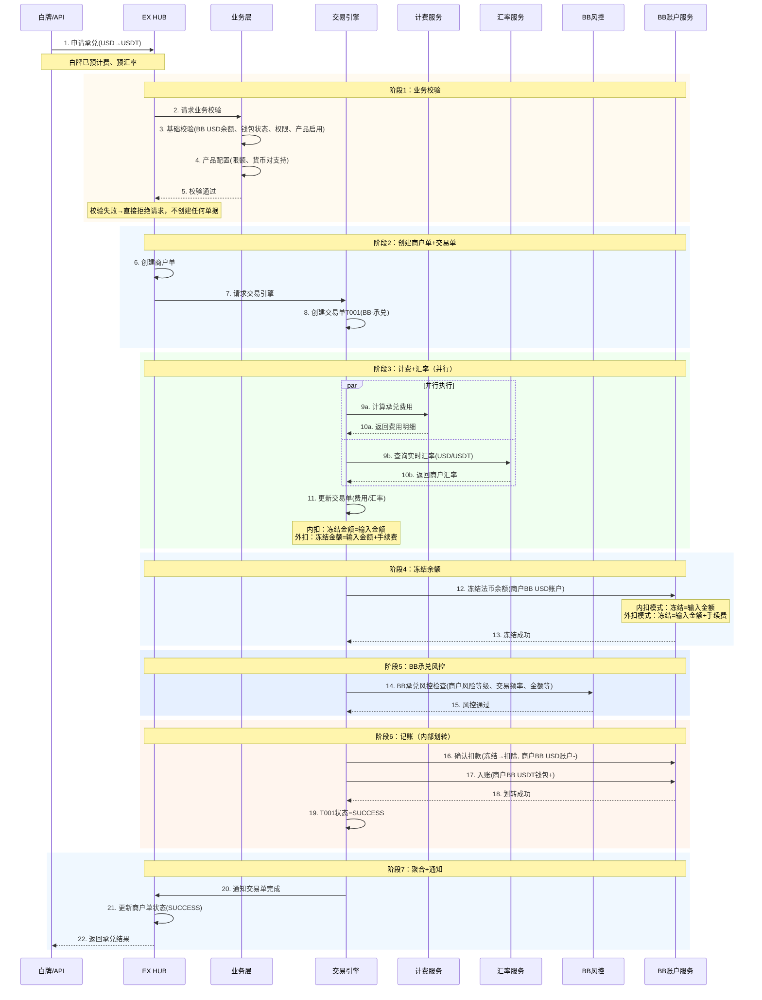
```mermaid
sequenceDiagram
    participant WP as 白牌/API
    participant HUB as EX HUB
    participant BL as 业务层
    participant TE as 交易引擎
    participant Pricing as 计费服务
    participant FX as 汇率服务
    participant Risk as BB风控
    participant Account as BB账户服务
  
    WP->>HUB: 1. 申请承兑(USD→USDT)
  
    Note over WP,HUB: 白牌已预计费、预汇率
  
    rect rgb(255, 250, 240)
        Note over HUB,Account: 阶段1：业务校验
        HUB->>BL: 2. 请求业务校验
        BL->>BL: 3. 基础校验(BB USD余额、钱包状态、权限、产品启用)
        BL->>BL: 4. 产品配置(限额、货币对支持)
        BL-->>HUB: 5. 校验通过
        Note over HUB: 校验失败→直接拒绝请求，不创建任何单据
    end
  
    rect rgb(240, 248, 255)
        Note over HUB,Account: 阶段2：创建商户单+交易单
        HUB->>HUB: 6. 创建商户单
        HUB->>TE: 7. 请求交易引擎
        TE->>TE: 8. 创建交易单T001(BB-承兑)
    end
  
    rect rgb(240, 255, 240)
        Note over HUB,Account: 阶段3：计费+汇率（并行）
        par 并行执行
            TE->>Pricing: 9a. 计算承兑费用
            Pricing-->>TE: 10a. 返回费用明细
        and
            TE->>FX: 9b. 查询实时汇率(USD/USDT)
            FX-->>TE: 10b. 返回商户汇率
        end
        TE->>TE: 11. 更新交易单(费用/汇率)
        Note over TE: 内扣：冻结金额=输入金额<br/>外扣：冻结金额=输入金额+手续费
    end
  
    rect rgb(240, 248, 255)
        Note over HUB,Account: 阶段4：冻结余额
        TE->>Account: 12. 冻结法币余额(商户BB USD账户)
        Note over Account: 内扣模式：冻结=输入金额<br/>外扣模式：冻结=输入金额+手续费
        Account-->>TE: 13. 冻结成功
    end
  
    rect rgb(230, 240, 255)
        Note over HUB,Account: 阶段5：BB承兑风控
        TE->>Risk: 14. BB承兑风控检查(商户风险等级、交易频率、金额等)
        Risk-->>TE: 15. 风控通过
    end
  
    rect rgb(255, 245, 238)
        Note over HUB,Account: 阶段6：记账（内部划转）
        TE->>Account: 16. 确认扣款(冻结→扣除, 商户BB USD账户-)
        TE->>Account: 17. 入账(商户BB USDT钱包+)
        Account-->>TE: 18. 划转成功
        TE->>TE: 19. T001状态=SUCCESS
    end
  
    rect rgb(240, 248, 255)
        Note over HUB,Account: 阶段7：聚合+通知
        TE->>HUB: 20. 通知交易单完成
        HUB->>HUB: 21. 更新商户单状态(SUCCESS)
        HUB-->>WP: 22. 返回承兑结果
    end
```

**说明：**

- **纯BB内部承兑**：BB法币账户 → BB数币钱包，内部账户划转
- **无需渠道单**：不调用外部渠道，无渠道单
- **有BB承兑风控**：冻结余额后、执行划转前，需通过BB承兑风控检查（商户风险等级、交易频率、金额异常等）
- **先校验再建单**：业务校验通过后才创建商户单和交易单（校验失败直接拒绝请求，不创建任何单据）
- **先计费后冻结**：计费+汇率确定后才冻结余额，确保冻结金额准确
- **手续费扣取方式（产品级配置）**：
  - **内扣**：冻结=输入金额，手续费从承兑金额中扣，到账USDT=(输入金额-手续费)/汇率
  - **外扣**：冻结=输入金额+手续费，到账USDT=输入金额/汇率，手续费另行扣除
- **先冻结后风控**：冻结余额 → 风控检查 → 通过后确认扣款并入账；风控拒绝则解冻退回
- **1个商户单，1笔交易单**

**异常处理：**

> 场景A1 所有异常均为**解冻退回**，不产生退款单，不收费。因为资金未离开商户BB法币账户。

| 异常环节       | 触发条件                                     | 处理方式                                               | 商户感知                       |
| -------------- | -------------------------------------------- | ------------------------------------------------------ | ------------------------------ |
| 业务校验失败   | 余额不足/产品未启用/超限额/货币对不支持      | 直接拒绝，不创建商户单                                 | 下单失败，返回错误原因         |
| 冻结余额失败   | 余额校验通过但冻结时被其他交易占用（并发）   | 商户单=FAILED                                          | 提示"余额不足，请稍后重试"     |
| BB承兑风控拒绝 | BB风控检测到异常（商户风险等级、交易频率等） | 解冻已冻结的法币余额，商户单=FAILED                    | 提示"交易失败，请联系客户经理" |
| BB承兑执行失败 | 承兑引擎异常（系统错误、汇率服务不可用等）   | 自动重试（默认3次），重试耗尽后解冻余额，商户单=FAILED | 提示"系统异常，请稍后重试"     |

> 参考 `refund.md` 3.1：风控拦截未送渠道时，直接解冻退回，不收费。

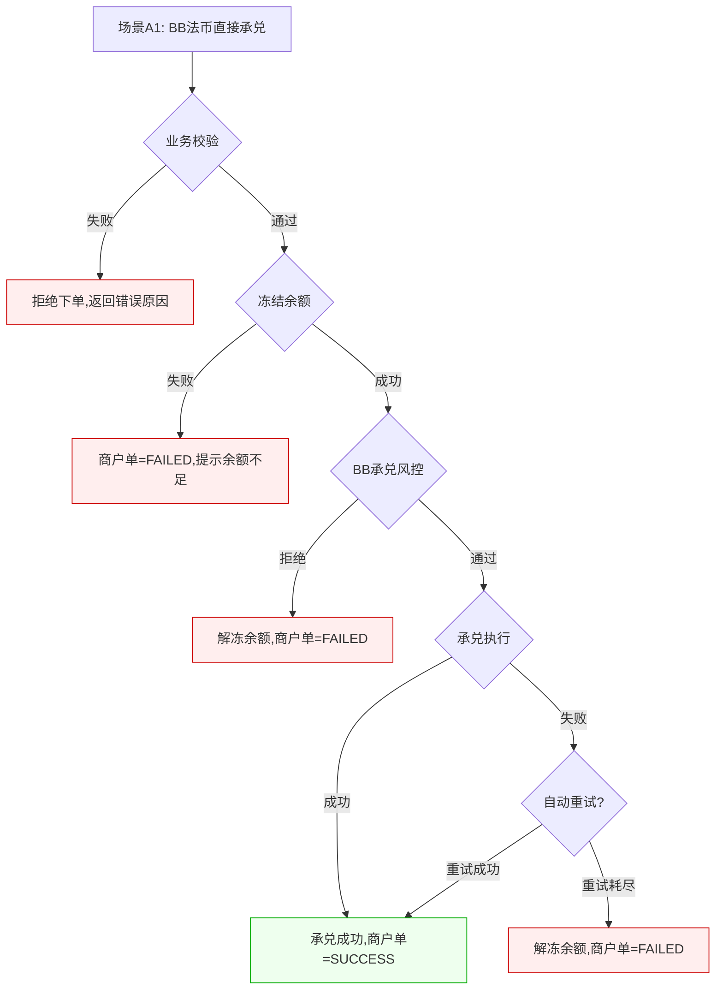
```mermaid
flowchart TD
    A[场景A1: BB法币直接承兑] --> B{业务校验}
    B -->|失败| B1[拒绝下单,返回错误原因]
    B -->|通过| C{冻结余额}
    C -->|失败| C1[商户单=FAILED,提示余额不足]
    C -->|成功| D{BB承兑风控}
    D -->|拒绝| D1[解冻余额,商户单=FAILED]
    D -->|通过| E{承兑执行}
    E -->|失败| E1{自动重试?}
    E1 -->|重试成功| F[承兑成功,商户单=SUCCESS]
    E1 -->|重试耗尽| E2[解冻余额,商户单=FAILED]
    E -->|成功| F

    style B1 fill:#fee,stroke:#c00
    style C1 fill:#fee,stroke:#c00
    style D1 fill:#fee,stroke:#c00
    style E2 fill:#fee,stroke:#c00
    style F fill:#efe,stroke:#0a0
```

---

### 5.3 场景A2：即时单 — IPL法币账户承兑到BB数币钱包（BB+IPL）

**场景：** 商户IPL法币账户已有USD余额，通过IPL-BB打通承兑为USDT到BB数币钱包。

**特点：** 纯承兑（账户已有余额），跨SP中间户划转，2笔交易单。

**单据结构（2笔交易单）：**

```
商户单 M001 (On-Ramp: IPL USD→BB USDT)  ← BB和IPL共享
    ├── 交易单 T001 (IPL): 同名提现 — IPL USD转到BB（通过中间户）
    └── 交易单 T002 (BB): 承兑 — BB USD→USDT

单据数：1 商户单 + 2 交易单 + 0 渠道单
资金流：商户 IPL USD 账户 → 中间户 → BB USD → 商户 BB USDT 钱包
```

**时序图：**

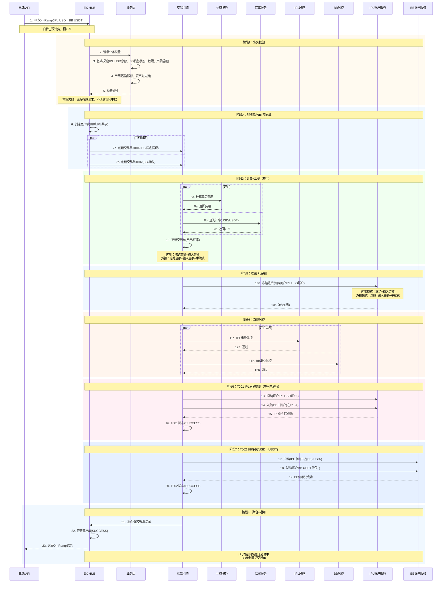
```mermaid
sequenceDiagram
    participant WP as 白牌/API
    participant HUB as EX HUB
    participant BL as 业务层
    participant TE as 交易引擎
    participant Pricing as 计费服务
    participant FX as 汇率服务
    participant IPL_Risk as IPL风控
    participant BB_Risk as BB风控
    participant IPL_Account as IPL账户服务
    participant BB_Account as BB账户服务
  
    WP->>HUB: 1. 申请On-Ramp(IPL USD→BB USDT)
  
    Note over WP,HUB: 白牌已预计费、预汇率
  
    rect rgb(255, 250, 240)
        Note over HUB,BB_Account: 阶段1：业务校验
        HUB->>BL: 2. 请求业务校验
        BL->>BL: 3. 基础校验(IPL USD余额、BB钱包状态、权限、产品启用)
        BL->>BL: 4. 产品配置(限额、货币对支持)
        BL-->>HUB: 5. 校验通过
        Note over HUB: 校验失败→直接拒绝请求，不创建任何单据
    end
  
    rect rgb(240, 248, 255)
        Note over HUB,BB_Account: 阶段2：创建商户单+交易单
        HUB->>HUB: 6. 创建商户单(BB和IPL共享)
        par 并行创建
            HUB->>TE: 7a. 创建交易单T001(IPL-同名提现)
        and
            HUB->>TE: 7b. 创建交易单T002(BB-承兑)
        end
    end
  
    rect rgb(240, 255, 240)
        Note over HUB,BB_Account: 阶段3：计费+汇率（并行）
        par 并行
            TE->>Pricing: 8a. 计算承兑费用
            Pricing-->>TE: 9a. 返回费用
        and
            TE->>FX: 8b. 查询汇率(USD/USDT)
            FX-->>TE: 9b. 返回汇率
        end
        TE->>TE: 10. 更新交易单(费用/汇率)
        Note over TE: 内扣：冻结金额=输入金额<br/>外扣：冻结金额=输入金额+手续费
    end

    rect rgb(240, 248, 255)
        Note over HUB,BB_Account: 阶段4：冻结IPL余额
        TE->>IPL_Account: 10a. 冻结法币余额(商户IPL USD账户)
        Note over IPL_Account: 内扣模式：冻结=输入金额<br/>外扣模式：冻结=输入金额+手续费
        IPL_Account-->>TE: 10b. 冻结成功
    end
  
    rect rgb(255, 245, 238)
        Note over HUB,BB_Account: 阶段5：双侧风控
        par 并行风控
            TE->>IPL_Risk: 11a. IPL出款风控
            IPL_Risk-->>TE: 12a. 通过
        and
            TE->>BB_Risk: 11b. BB承兑风控
            BB_Risk-->>TE: 12b. 通过
        end
    end
  
    rect rgb(255, 240, 245)
        Note over HUB,BB_Account: 阶段6：T001 IPL同名提现（中间户划转）
        TE->>IPL_Account: 13. 扣款(商户IPL USD账户-)
        TE->>IPL_Account: 14. 入账(BB中间户(在IPL)+)
        IPL_Account-->>TE: 15. IPL侧划转成功
        TE->>TE: 16. T001状态=SUCCESS
    end
  
    rect rgb(230, 240, 255)
        Note over HUB,BB_Account: 阶段7：T002 BB承兑(USD→USDT)
        TE->>BB_Account: 17. 扣款(IPL中间户(在BB) USD-)
        TE->>BB_Account: 18. 入账(商户BB USDT钱包+)
        BB_Account-->>TE: 19. BB侧承兑成功
        TE->>TE: 20. T002状态=SUCCESS
    end
  
    rect rgb(240, 248, 255)
        Note over HUB,BB_Account: 阶段8：聚合+通知
        TE->>HUB: 21. 通知2笔交易单完成
        HUB->>HUB: 22. 更新商户单(SUCCESS)
        HUB-->>WP: 23. 返回On-Ramp结果
        Note over HUB,BB_Account: IPL看到同名提现交易单<br/>BB看到承兑交易单
    end
```

**说明：**

- **1个商户单，2笔交易单**：IPL同名提现1笔 + BB承兑1笔
- **T001(IPL同名提现)**：商户IPL USD → BB中间户，走IPL出款风控
- **T002(BB承兑)**：BB中间户USD → 商户BB USDT钱包，走BB承兑风控
- **无需渠道单**：不调用外部渠道，通过中间户划转
- **T001→T002串行**：IPL提现完成后才能BB承兑
- **先计费后冻结**：计费+汇率确定后才冻结IPL余额，确保冻结金额准确
- **手续费扣取方式（产品级配置）**：
  - **内扣**：冻结=输入金额，手续费从承兑金额中扣，到账USDT=(输入金额-手续费)/汇率
  - **外扣**：冻结=输入金额+手续费，到账USDT=输入金额/汇率，手续费另行扣除

**异常处理：**

| 异常环节                               | 触发条件                               | 处理方式                                                         | 退款                        | 商户感知                       |
| -------------------------------------- | -------------------------------------- | ---------------------------------------------------------------- | --------------------------- | ------------------------------ |
| 业务校验失败                           | 余额不足/产品未启用/超限额             | 直接拒绝请求，不创建任何单据                                     | 无                          | 下单失败                       |
| IPL出款风控拒绝                        | IPL风控检测到出款异常（合规/风险等级） | 解冻商户IPL法币余额，T001=FAILED，T002不创建                     | 无（解冻即恢复）            | 提示"交易失败，请联系客户经理" |
| IPL同名提现执行失败                    | IPL账户服务异常，扣款或中间户入账失败  | IPL账户服务回滚（解冻+退回），T001=FAILED                        | 无（内部回滚）              | 订单失败                       |
| **BB承兑风控拒绝（T001已成功）** | BB风控拒绝承兑（资金已在中间户）       | **逆向回滚T001**：创建退款交易单RT001，中间户→商户IPL账户 | 不收费（参考refund.md 3.1） | 订单退款，IPL余额恢复          |
| **BB承兑执行失败（T001已成功）** | BB承兑引擎异常（重试3次耗尽）          | 同上，逆向回滚T001，创建RT001                                    | 不收费                      | 订单退款                       |

> **跨SP关键异常**：T001已成功但T002失败时，资金在中间户，需逆向回滚。创建内部退款交易单RT001（商户不可见），将中间户资金退回商户IPL账户。

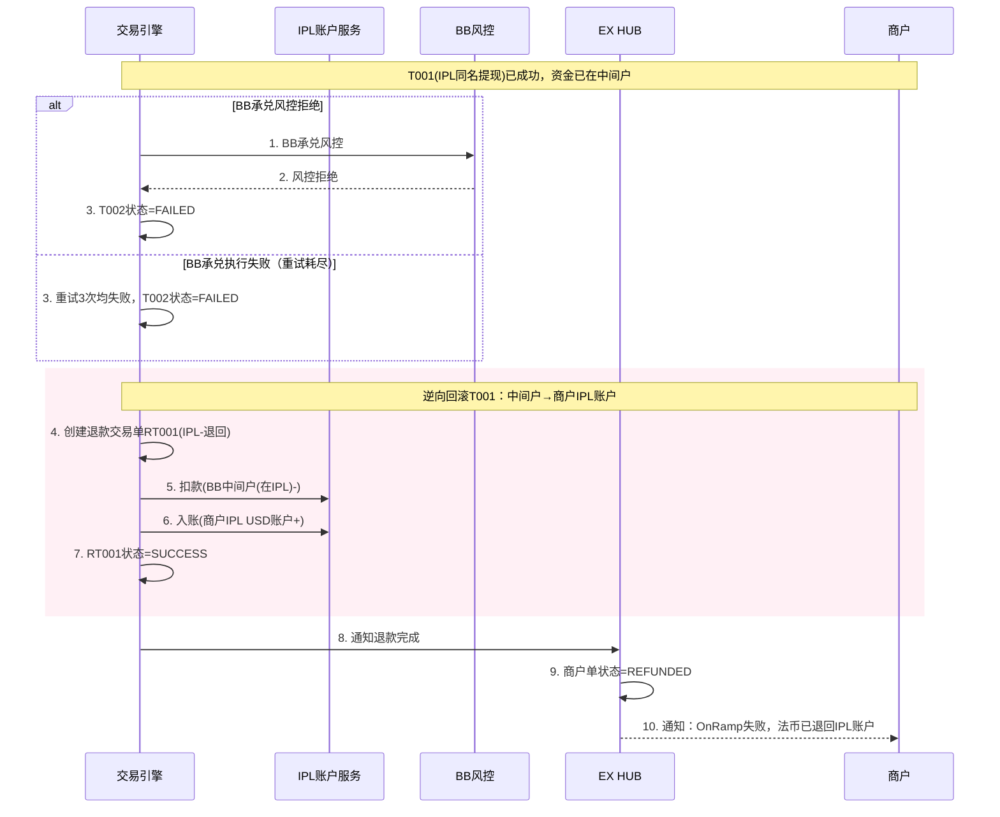
```mermaid
sequenceDiagram
    participant TE as 交易引擎
    participant IPL_Account as IPL账户服务
    participant BB_Risk as BB风控
    participant HUB as EX HUB
    participant MP as 商户

    Note over TE,MP: T001(IPL同名提现)已成功，资金已在中间户

    alt BB承兑风控拒绝
        TE->>BB_Risk: 1. BB承兑风控
        BB_Risk-->>TE: 2. 风控拒绝
        TE->>TE: 3. T002状态=FAILED
    else BB承兑执行失败（重试耗尽）
        TE->>TE: 3. 重试3次均失败，T002状态=FAILED
    end

    rect rgb(255, 240, 245)
        Note over TE,MP: 逆向回滚T001：中间户→商户IPL账户
        TE->>TE: 4. 创建退款交易单RT001(IPL-退回)
        TE->>IPL_Account: 5. 扣款(BB中间户(在IPL)-)
        TE->>IPL_Account: 6. 入账(商户IPL USD账户+)
        TE->>TE: 7. RT001状态=SUCCESS
    end

    TE->>HUB: 8. 通知退款完成
    HUB->>HUB: 9. 商户单状态=REFUNDED
    HUB-->>MP: 10. 通知：OnRamp失败，法币已退回IPL账户
```

**异常单据结构：**

```
商户单 M001 (On-Ramp: IPL USD→BB USDT) — 状态=REFUNDED
    ├── T001 (IPL): 同名提现 — SUCCESS（已执行）
    ├── T002 (BB): 承兑 — FAILED（风控拒绝/执行失败）
    └── RT001 (IPL): 退款-中间户退回 — SUCCESS [内部记账，商户不可见]
```

---

### 5.4 场景B1：预约单 — BB代收付/XPAY VA收款→承兑（仅BB）

**场景：** 外部汇款人通过BB的代收付账户或XPAY VA汇入USD，收款到BB法币账户后，自动承兑为USDT到BB数币钱包。

**特点：** 收款（渠道触发）+ 承兑，2笔交易单串行。

**单据结构（2笔交易单）：**

```
商户单 M001 (On-Ramp: VA收款USD→USDT)  ← 仅BB
    ├── 交易单 T001 (BB): 收款 — 外部USD入到BB法币账户（渠道通知触发）
    │       └── 渠道单 C001 (BB PP): BB 代收付/XPAY 渠道执行记录
    └── 交易单 T002 (BB): 承兑 — BB USD→USDT

单据数：1 商户单 + 2 交易单 + 1 渠道单（仅 BB PP 可见）
资金流：外部汇款人 → 商户 BB USD 账户 → 商户 BB USDT 钱包
触发方式：渠道入账通知 → 匹配预约单 → 自动触发 T002
```

**业务流程：**

```
商户下单（预约） → 业务校验 → 创建预约单 → 展示收款账户信息 →
商户线下汇款 → 渠道入账通知 → 匹配预约单 → 业务校验 →
校验通过 → 创建商户单+交易单 → 计费+汇率 → 风控 → 记账 → 通知商户
```

**关键节点：**

1. 商户选择数币、链、法币金额
2. 选择"银行转账"支付
3. 系统展示收款账户信息（BB 代收付账户）
4. 商户在银行端完成汇款（需同名转账 + Purpose Code）
5. 渠道收到入账通知 → 匹配预约单 → 业务校验
6. 校验通过 → 创建商户单 → 自动创建交易单链 → 承兑 → 数币入账
7. 商户单状态更新为 SUCCESS

**时序图：**

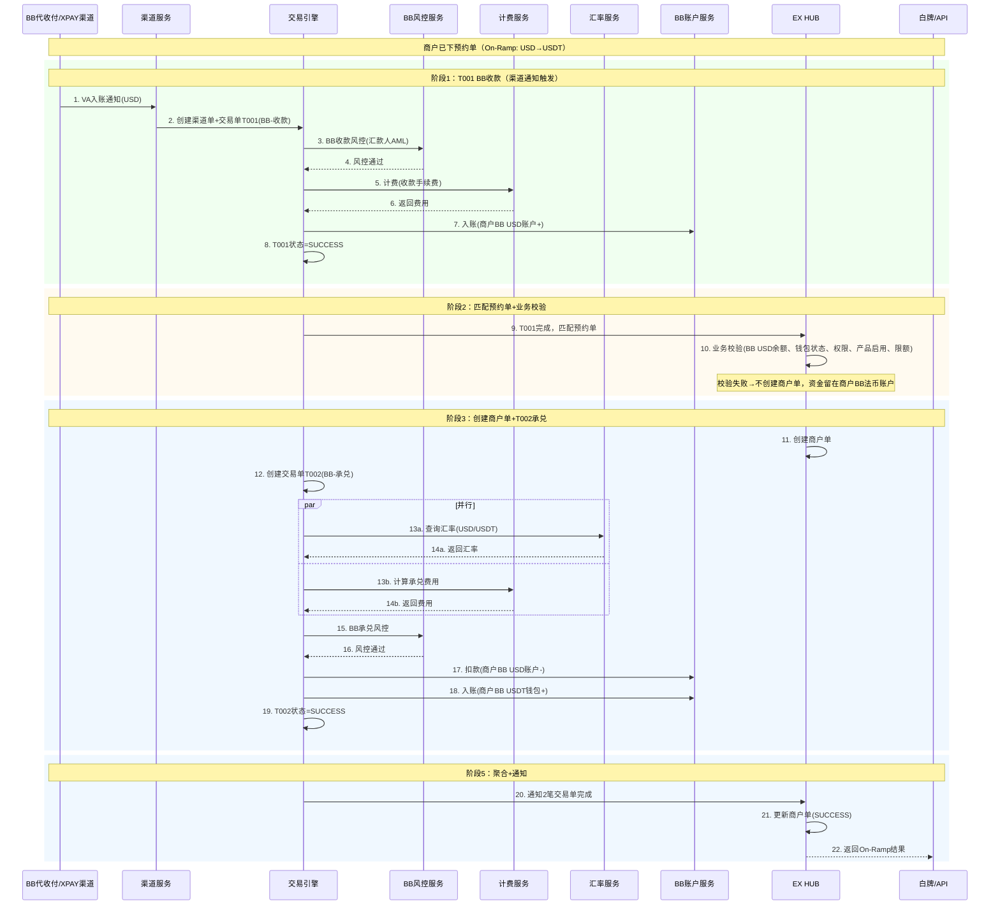
```mermaid
sequenceDiagram
    participant Channel as BB代收付/XPAY渠道
    participant CO as 渠道服务
    participant TE as 交易引擎
    participant Risk as BB风控服务
    participant Pricing as 计费服务
    participant FX as 汇率服务
    participant Account as BB账户服务
    participant HUB as EX HUB
    participant WP as 白牌/API
  
    Note over Channel,WP: 商户已下预约单（On-Ramp: USD→USDT）
  
    rect rgb(240, 255, 240)
        Note over Channel,WP: 阶段1：T001 BB收款（渠道通知触发）
        Channel->>CO: 1. VA入账通知(USD)
        CO->>TE: 2. 创建渠道单+交易单T001(BB-收款)
        TE->>Risk: 3. BB收款风控(汇款人AML)
        Risk-->>TE: 4. 风控通过
        TE->>Pricing: 5. 计费(收款手续费)
        Pricing-->>TE: 6. 返回费用
        TE->>Account: 7. 入账(商户BB USD账户+)
        TE->>TE: 8. T001状态=SUCCESS
    end
  
    rect rgb(255, 250, 240)
        Note over Channel,WP: 阶段2：匹配预约单+业务校验
        TE->>HUB: 9. T001完成，匹配预约单
        HUB->>HUB: 10. 业务校验(BB USD余额、钱包状态、权限、产品启用、限额)
        Note over HUB: 校验失败→不创建商户单，资金留在商户BB法币账户
    end
  
    rect rgb(240, 248, 255)
        Note over Channel,WP: 阶段3：创建商户单+T002承兑
        HUB->>HUB: 11. 创建商户单
        TE->>TE: 12. 创建交易单T002(BB-承兑)
        par 并行
            TE->>FX: 13a. 查询汇率(USD/USDT)
            FX-->>TE: 14a. 返回汇率
        and
            TE->>Pricing: 13b. 计算承兑费用
            Pricing-->>TE: 14b. 返回费用
        end
        TE->>Risk: 15. BB承兑风控
        Risk-->>TE: 16. 风控通过
        TE->>Account: 17. 扣款(商户BB USD账户-)
        TE->>Account: 18. 入账(商户BB USDT钱包+)
        TE->>TE: 19. T002状态=SUCCESS
    end
  
    rect rgb(240, 248, 255)
        Note over Channel,WP: 阶段5：聚合+通知
        TE->>HUB: 20. 通知2笔交易单完成
        HUB->>HUB: 21. 更新商户单(SUCCESS)
        HUB-->>WP: 22. 返回On-Ramp结果
    end
```

**说明：**

- **1个商户单，2笔交易单**：BB收款1笔 + BB承兑1笔
- **T001(BB收款)**：渠道通知触发，外部USD入到商户BB法币账户，走BB收款风控（汇款人AML），有渠道单
- **T002(BB承兑)**：BB USD→USDT，内部账户划转，走BB承兑风控
- **预约单模式**：商户先下预约单，收款到账后自动触发T002承兑
- **T001→T002串行**：收款完成后才能承兑
- **计费**：收款手续费 + 承兑费用分别计算

**异常处理：**

> 场景B1关键特点：T001收款成功后T002承兑失败，**资金留在商户BB法币账户**，不退回汇款人。商户可用该余额重新发起OnRamp（走场景A1即时单）。

| 异常环节                   | 触发条件                                   | 处理方式                                                             | 退款                            | 商户感知                     |
| -------------------------- | ------------------------------------------ | -------------------------------------------------------------------- | ------------------------------- | ---------------------------- |
| 预约单超时                 | 72h未收到汇款                              | 预约单=EXPIRED，不创建商户单                                         | 无（未收款）                    | 过期通知，可重新下单         |
| 收款风控拦截（T001阶段）   | BB收款风控拦截（汇款人AML不通过/可疑交易） | 资金入账但冻结→通知合规→销售联系商户→清算确认手续费→退回原汇款人 | 退回汇款人（参考refund.md 2.2） | "交易失败，请联系客户经理"   |
| 预约单匹配失败             | 非同名/缺Purpose Code/无预约单/金额偏差    | 详见第10章"预约单匹配规则"异常处理                                   | 视情况                          | 视情况                       |
| BB承兑风控拒绝（T001成功） | 收款到账并匹配成功，但BB承兑风控拒绝       | T002=FAILED，资金留在商户BB法币账户，商户单=FAILED                   | 无需退款                        | 订单失败，收款已到账，可重试 |
| BB承兑执行失败（T001成功） | BB承兑引擎异常（重试3次耗尽）              | 同上，资金留在商户BB法币账户                                         | 无需退款                        | 订单失败，可重试             |

**收款风控拦截退款时序（参考 refund.md 2.2）：**

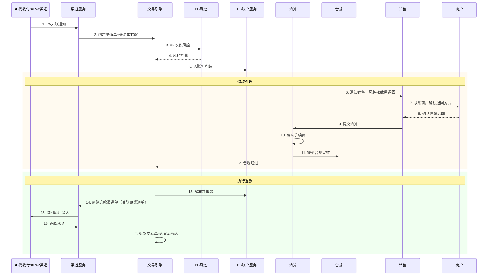
```mermaid
sequenceDiagram
    participant Channel as BB代收付/XPAY渠道
    participant CO as 渠道服务
    participant TE as 交易引擎
    participant Risk as BB风控
    participant Account as BB账户服务
    participant Settlement as 清算
    participant Compliance as 合规
    participant Sales as 销售
    participant MP as 商户

    Channel->>CO: 1. VA入账通知
    CO->>TE: 2. 创建渠道单+交易单T001
    TE->>Risk: 3. BB收款风控
    Risk-->>TE: 4. 风控拦截
    TE->>Account: 5. 入账但冻结

    rect rgb(255, 250, 240)
        Note over Channel,MP: 退款处理
        Compliance->>Sales: 6. 通知销售：风控拦截需退回
        Sales->>MP: 7. 联系商户确认退回方式
        MP-->>Sales: 8. 确认原路退回
        Sales->>Settlement: 9. 提交清算
        Settlement->>Settlement: 10. 确认手续费
        Settlement->>Compliance: 11. 提交合规审核
        Compliance-->>TE: 12. 合规通过
    end

    rect rgb(240, 255, 240)
        Note over Channel,MP: 执行退款
        TE->>Account: 13. 解冻并扣款
        TE->>CO: 14. 创建退款渠道单（关联原渠道单）
        CO->>Channel: 15. 退回原汇款人
        Channel-->>CO: 16. 退款成功
        TE->>TE: 17. 退款交易单=SUCCESS
    end
```

**异常总览流程图：**

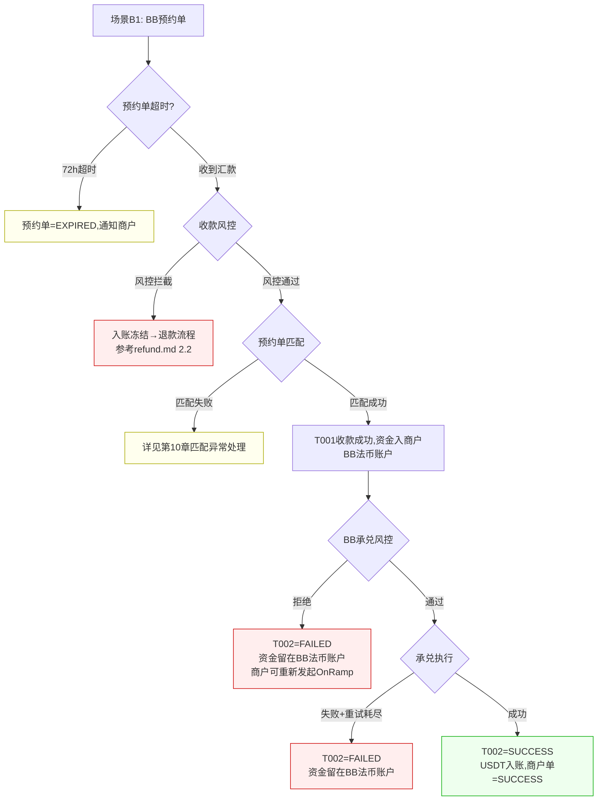
```mermaid
flowchart TD
    A[场景B1: BB预约单] --> B{预约单超时?}
    B -->|72h超时| B1[预约单=EXPIRED,通知商户]
    B -->|收到汇款| C{收款风控}

    C -->|风控拦截| C1[入账冻结→退款流程<br/>参考refund.md 2.2]
    C -->|风控通过| D{预约单匹配}

    D -->|匹配失败| D1[详见第10章匹配异常处理]
    D -->|匹配成功| E[T001收款成功,资金入商户BB法币账户]

    E --> F{BB承兑风控}
    F -->|拒绝| F1[T002=FAILED<br/>资金留在BB法币账户<br/>商户可重新发起OnRamp]
    F -->|通过| G{承兑执行}

    G -->|失败+重试耗尽| G1[T002=FAILED<br/>资金留在BB法币账户]
    G -->|成功| H[T002=SUCCESS<br/>USDT入账,商户单=SUCCESS]

    style B1 fill:#ffe,stroke:#aa0
    style C1 fill:#fee,stroke:#c00
    style D1 fill:#ffe,stroke:#aa0
    style F1 fill:#fee,stroke:#c00
    style G1 fill:#fee,stroke:#c00
    style H fill:#efe,stroke:#0a0
```

---

### 5.5 场景B2：预约单 — IPL VA收款→承兑到BB数币钱包（BB+IPL）

**场景：** 外部汇款人通过IPL VA汇入USD，收款到IPL法币账户后，通过中间户转到BB，承兑为USDT到BB数币钱包。

**特点：** 收款（渠道触发）+ 跨SP划转 + 承兑，3笔交易单串行。

**单据结构（3笔交易单）：**

```
商户单 M001 (On-Ramp: IPL VA收款→USD→USDT)  ← BB和IPL共享
    ├── 交易单 T001 (IPL): VA收款 — 外部USD入到IPL法币账户（渠道通知触发）
    │       └── 渠道单 C001 (IPL PP): IPL VA 渠道执行记录
    ├── 交易单 T002 (IPL): 同名提现转出 — IPL USD转到BB（通过中间户）
    └── 交易单 T003 (BB): 承兑 — BB USD→USDT

单据数：1 商户单 + 3 交易单 + 1 渠道单（仅 IPL PP 可见）
资金流：外部汇款人 → 商户 IPL USD 账户 → 中间户 → BB USD → 商户 BB USDT 钱包
触发方式：渠道入账通知 → 匹配预约单 → 自动触发 T002 + T003
```

**时序图：**

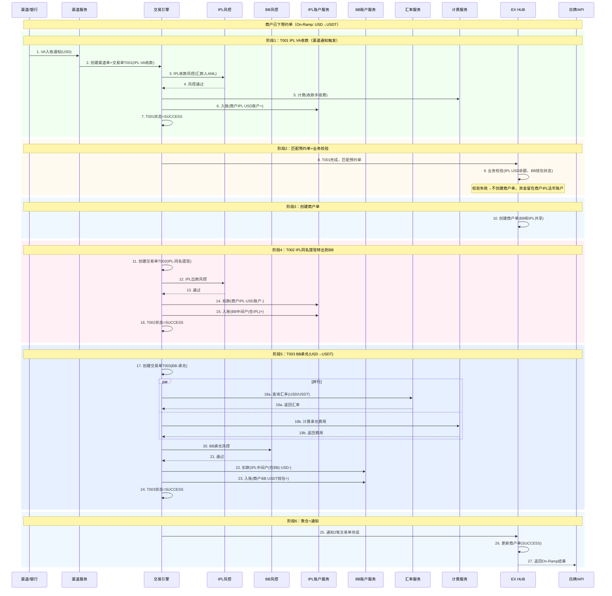
```mermaid
sequenceDiagram
    participant Channel as 渠道/银行
    participant CO as 渠道服务
    participant TE as 交易引擎
    participant IPL_Risk as IPL风控
    participant BB_Risk as BB风控
    participant IPL_Account as IPL账户服务
    participant BB_Account as BB账户服务
    participant FX as 汇率服务
    participant Pricing as 计费服务
    participant HUB as EX HUB
    participant WP as 白牌/API
  
    Note over Channel,WP: 商户已下预约单（On-Ramp: USD→USDT）
  
    rect rgb(240, 255, 240)
        Note over Channel,WP: 阶段1：T001 IPL VA收款（渠道通知触发）
        Channel->>CO: 1. VA入账通知(USD)
        CO->>TE: 2. 创建渠道单+交易单T001(IPL-VA收款)
        TE->>IPL_Risk: 3. IPL收款风控(汇款人AML)
        IPL_Risk-->>TE: 4. 风控通过
        TE->>Pricing: 5. 计费(收款手续费)
        TE->>IPL_Account: 6. 入账(商户IPL USD账户+)
        TE->>TE: 7. T001状态=SUCCESS
    end
  
    rect rgb(255, 250, 240)
        Note over Channel,WP: 阶段2：匹配预约单+业务校验
        TE->>HUB: 8. T001完成，匹配预约单
        HUB->>HUB: 9. 业务校验(IPL USD余额、BB钱包状态)
        Note over HUB: 校验失败→不创建商户单，资金留在商户IPL法币账户
    end
  
    rect rgb(240, 248, 255)
        Note over Channel,WP: 阶段3：创建商户单
        HUB->>HUB: 10. 创建商户单(BB和IPL共享)
    end
  
    rect rgb(255, 240, 245)
        Note over Channel,WP: 阶段4：T002 IPL同名提现转出到BB
        TE->>TE: 11. 创建交易单T002(IPL-同名提现)
        TE->>IPL_Risk: 12. IPL出款风控
        IPL_Risk-->>TE: 13. 通过
        TE->>IPL_Account: 14. 扣款(商户IPL USD账户-)
        TE->>IPL_Account: 15. 入账(BB中间户(在IPL)+)
        TE->>TE: 16. T002状态=SUCCESS
    end
  
    rect rgb(230, 240, 255)
        Note over Channel,WP: 阶段5：T003 BB承兑(USD→USDT)
        TE->>TE: 17. 创建交易单T003(BB-承兑)
        par 并行
            TE->>FX: 18a. 查询汇率(USD/USDT)
            FX-->>TE: 19a. 返回汇率
        and
            TE->>Pricing: 18b. 计算承兑费用
            Pricing-->>TE: 19b. 返回费用
        end
        TE->>BB_Risk: 20. BB承兑风控
        BB_Risk-->>TE: 21. 通过
        TE->>BB_Account: 22. 扣款(IPL中间户(在BB) USD-)
        TE->>BB_Account: 23. 入账(商户BB USDT钱包+)
        TE->>TE: 24. T003状态=SUCCESS
    end
  
    rect rgb(240, 248, 255)
        Note over Channel,WP: 阶段6：聚合+通知
        TE->>HUB: 25. 通知3笔交易单完成
        HUB->>HUB: 26. 更新商户单(SUCCESS)
        HUB-->>WP: 27. 返回On-Ramp结果
    end
```

**说明：**

- **1个商户单，3笔交易单**：IPL VA收款1笔 + IPL同名提现1笔 + BB承兑1笔
- **T001(IPL VA收款)**：渠道通知触发，外部USD入到商户IPL法币账户，走IPL收款风控，有渠道单
- **T002(IPL同名提现)**：商户IPL USD → BB中间户，走IPL出款风控
- **T003(BB承兑)**：BB中间户USD → 商户BB USDT钱包，走BB承兑风控
- **预约单模式**：商户先下预约单，VA收款到账后自动触发T002+T003
- **T001→T002→T003串行**：收款完成才能提现，提现完成才能承兑
- **每笔交易单各自独立风控**

**异常处理：**

> 场景B2是最复杂的异常场景，涉及3笔交易单、跨SP中间户、收款风控+出款风控+承兑风控三层风控。

| 异常环节                                  | 触发条件                                | 处理方式                                                            | 退款                            | 商户感知                             |
| ----------------------------------------- | --------------------------------------- | ------------------------------------------------------------------- | ------------------------------- | ------------------------------------ |
| 预约单超时                                | 72h未收到汇款                           | 预约单=EXPIRED                                                      | 无                              | 过期通知，可重新下单                 |
| IPL收款风控拦截（T001阶段）               | IPL收款风控拦截（汇款人AML不通过等）    | 资金入账但冻结→合规→销售→清算→退回原汇款人                      | 退回汇款人（参考refund.md 2.2） | "交易失败，请联系客户经理"           |
| 预约单匹配失败                            | 非同名/缺Purpose Code/无预约单/金额偏差 | 详见第10章"预约单匹配规则"异常处理                                  | 视情况                          | 视情况                               |
| IPL出款风控拒绝（T001成功）               | T002 IPL同名提现的出款风控被拒绝        | T002=FAILED，T003不创建，资金留在商户IPL法币账户                    | 无需退款                        | 订单失败，收款已到账，可走场景A2重试 |
| IPL同名提现执行失败（T001成功）           | IPL账户服务异常，中间户划转失败         | IPL回滚，T002=FAILED，T003不创建，资金留在IPL                       | 无需退款                        | 订单失败，可重试                     |
| **BB承兑风控拒绝（T001+T002成功）** | BB风控拒绝承兑（资金已在中间户）        | T003=FAILED，**逆向回滚T002**：创建RT001，中间户→商户IPL账户 | 不收承兑费，收款手续费已扣不退  | 订单退款，IPL余额恢复                |
| **BB承兑执行失败（T001+T002成功）** | BB承兑引擎异常（重试3次耗尽）           | 同上，逆向回滚T002，创建RT001                                       | 不收承兑费                      | 订单退款                             |

> **跨SP关键异常**：T002已成功但T003失败时，资金在中间户，需逆向回滚T002。创建内部退款交易单RT001（商户不可见），将中间户资金退回商户IPL账户。

**异常时序图（IPL出款风控拒绝 vs BB承兑风控拒绝）：**

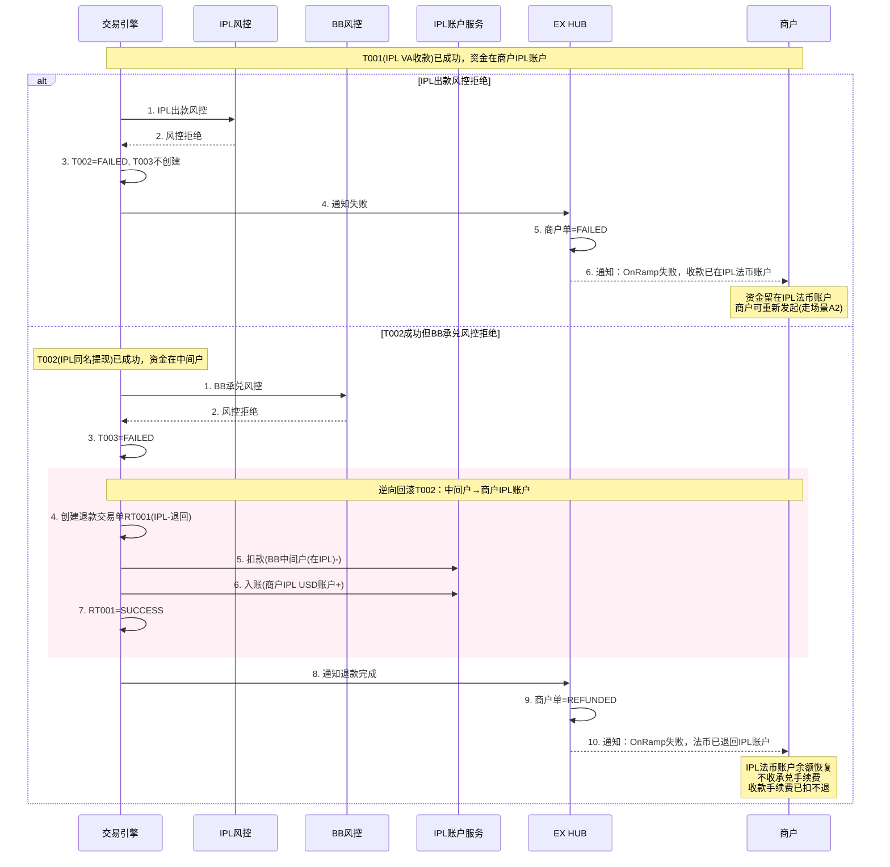
```mermaid
sequenceDiagram
    participant TE as 交易引擎
    participant IPL_Risk as IPL风控
    participant BB_Risk as BB风控
    participant IPL_Account as IPL账户服务
    participant HUB as EX HUB
    participant MP as 商户

    Note over TE,MP: T001(IPL VA收款)已成功，资金在商户IPL账户

    alt IPL出款风控拒绝
        TE->>IPL_Risk: 1. IPL出款风控
        IPL_Risk-->>TE: 2. 风控拒绝
        TE->>TE: 3. T002=FAILED, T003不创建
        TE->>HUB: 4. 通知失败
        HUB->>HUB: 5. 商户单=FAILED
        HUB-->>MP: 6. 通知：OnRamp失败，收款已在IPL法币账户
        Note over MP: 资金留在IPL法币账户<br/>商户可重新发起(走场景A2)

    else T002成功但BB承兑风控拒绝
        Note over TE: T002(IPL同名提现)已成功，资金在中间户
        TE->>BB_Risk: 1. BB承兑风控
        BB_Risk-->>TE: 2. 风控拒绝
        TE->>TE: 3. T003=FAILED

        rect rgb(255, 240, 245)
            Note over TE,MP: 逆向回滚T002：中间户→商户IPL账户
            TE->>TE: 4. 创建退款交易单RT001(IPL-退回)
            TE->>IPL_Account: 5. 扣款(BB中间户(在IPL)-)
            TE->>IPL_Account: 6. 入账(商户IPL USD账户+)
            TE->>TE: 7. RT001=SUCCESS
        end

        TE->>HUB: 8. 通知退款完成
        HUB->>HUB: 9. 商户单=REFUNDED
        HUB-->>MP: 10. 通知：OnRamp失败，法币已退回IPL账户
        Note over MP: IPL法币账户余额恢复<br/>不收承兑手续费<br/>收款手续费已扣不退
    end
```

**异常总览流程图：**

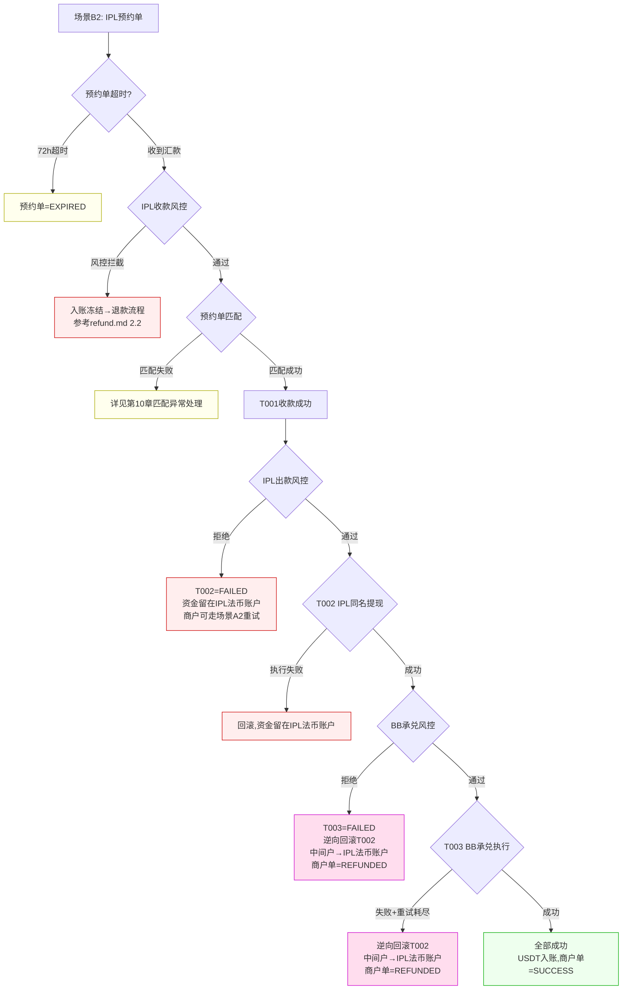
```mermaid
flowchart TD
    A[场景B2: IPL预约单] --> B{预约单超时?}
    B -->|72h超时| B1[预约单=EXPIRED]
    B -->|收到汇款| C{IPL收款风控}

    C -->|风控拦截| C1[入账冻结→退款流程<br/>参考refund.md 2.2]
    C -->|通过| D{预约单匹配}

    D -->|匹配失败| D1[详见第10章匹配异常处理]
    D -->|匹配成功| E[T001收款成功]

    E --> F{IPL出款风控}
    F -->|拒绝| F1[T002=FAILED<br/>资金留在IPL法币账户<br/>商户可走场景A2重试]
    F -->|通过| G{T002 IPL同名提现}

    G -->|执行失败| G1[回滚,资金留在IPL法币账户]
    G -->|成功| H{BB承兑风控}

    H -->|拒绝| H1[T003=FAILED<br/>逆向回滚T002<br/>中间户→IPL法币账户<br/>商户单=REFUNDED]
    H -->|通过| I{T003 BB承兑执行}

    I -->|失败+重试耗尽| I1[逆向回滚T002<br/>中间户→IPL法币账户<br/>商户单=REFUNDED]
    I -->|成功| J[全部成功<br/>USDT入账,商户单=SUCCESS]

    style B1 fill:#ffe,stroke:#aa0
    style C1 fill:#fee,stroke:#c00
    style D1 fill:#ffe,stroke:#aa0
    style F1 fill:#fee,stroke:#c00
    style G1 fill:#fee,stroke:#c00
    style H1 fill:#fde,stroke:#c0c
    style I1 fill:#fde,stroke:#c0c
    style J fill:#efe,stroke:#0a0
```

**场景B2异常结论：**

| 失败环节        | 资金位置    | 处理方式                        | 是否需要退款单 |
| --------------- | ----------- | ------------------------------- | -------------- |
| 业务校验/冻结   | 未扣款      | 拒绝下单                        | ❌             |
| IPL收款风控拦截 | 冻结在IPL   | 退回汇款人（refund.md 2.2）     | ✅             |
| 预约单匹配失败  | 商户IPL账户 | 详见第10章                      | 视情况         |
| IPL出款风控拒绝 | 商户IPL账户 | 资金留在IPL，商户可重试         | ❌             |
| IPL同名提现失败 | 商户IPL账户 | 回滚，资金留在IPL               | ❌             |
| BB承兑风控拒绝  | 中间户      | **逆向回滚T002**，退回IPL | ✅（内部RT）   |
| BB承兑执行失败  | 中间户      | 重试→**逆向回滚T002**    | ✅（内部RT）   |

---

### 5.6 收款账户选择逻辑

```
商户选择"银行转账"后：

仅 BB 配置：
→ 直接展示 BB 代收付账户信息（无需选择）

BB + IPL 配置：
→ 展示两个选项：
   ├── BB 代收付账户（适合所有汇款人）
   └── 同名 VA 账户（专属虚拟账户，按银行区分）
       ├── VA 1: DBS Bank (Hong Kong)
       ├── VA 2: OCBC Bank (Singapore)
       └── VA N: ...

商户选择后：
→ 展示对应账户详情（折叠式，点击展开）
→ 每个字段可单独复制
→ 底部提供"Download Account Info"和"Copy Details"

⚠️ VA 账户不暴露底层渠道名称（XPay/IPL），统一展示为"同名 VA 账户"
```

---

## 6. 中间户机制（跨SP场景）

### 6.1 适用场景

当商户配置为 BB + IPL 时，资金需要在两个 SP 之间流转，通过中间户完成：

```
BB 和 IPL 各自维护对方的中间户：
· BB 侧维护"IPL 中间户(在 BB)"
· IPL 侧维护"BB 中间户(在 IPL)"

资金通过中间户完成跨 SP 划转：
· IPL → BB：商户 IPL 账户 → BB 中间户(在 IPL) → IPL 中间户(在 BB) → BB 承兑
· BB → IPL：BB 承兑 → IPL 中间户(在 BB) → BB 中间户(在 IPL) → 商户 IPL 账户

中间户是记账手段，BB 和 IPL 之间有清算协议定期轧差
```

### 6.2 IPL 侧同名收款

```
IPL 作为持牌机构，将每笔跨 SP 入账视为"同名收款"（Collection）：
· 同名收款 = 付款人和收款人是同一商户
· 产生完整的收款交易记录
· 走 IPL 收款合规流程（AML 检查）
· 可在 IPL 清算/对账体系中追踪
```

---

## 7. 状态机

> **重要说明**：OnRamp 涉及两种单据实体——**预约单**和**商户单**，它们是不同的对象，有各自独立的状态机。
>
> - **预约单（Reservation Order）**：商户选择"银行转账"时创建，用于等待和匹配外部汇款。预约单是"前置单"。
> - **商户单（Merchant Order）**：业务校验通过后创建，用于执行承兑交易。即时单场景下单即创建；预约单场景在匹配成功+校验通过后才创建。
> - **关系**：预约单 MATCHED → 业务校验通过 → 创建商户单。两者通过 `reservation_id` 关联。
> - **商户视角**：商户在 MP 端看到的是**统一的订单视图**，系统将预约单和商户单的状态合并展示（详见 7.5）。

### 7.1 预约单状态机（仅银行转账场景 B1/B2）

```
┌──────────┐
│ CREATED  │  商户下预约单
└────┬─────┘
     ▼
┌──────────────┐
│AWAITING_FUNDS│  等待汇款到账（展示收款账户信息）
└──────┬───────┘
       │
       ├──────────────────────────────────────┐
       │                                      │
  渠道入账通知                           72h 超时未收款
       │                                      │
       ▼                                      ▼
┌──────────┐                           ┌──────────┐
│ MATCHED  │  收款匹配成功             │ EXPIRED  │
└────┬─────┘                           └──────────┘
     │
     ├── 业务校验通过 → 创建商户单，预约单状态保持 MATCHED
     │
     └── 业务校验失败 → 不创建商户单，资金留在法币账户
                        预约单状态 = MATCH_FAILED

另外：商户可在 AWAITING_FUNDS 状态主动取消 → CANCELLED
```

**预约单状态说明：**

| 状态           | 说明           | 触发条件                                     |
| -------------- | -------------- | -------------------------------------------- |
| CREATED        | 预约单已创建   | 商户选择银行转账下单                         |
| AWAITING_FUNDS | 等待汇款到账   | 预约单创建后，展示收款账户信息               |
| MATCHED        | 收款已匹配     | 渠道入账通知匹配到预约单（自动或人工）       |
| MATCH_FAILED   | 匹配后校验失败 | 匹配成功但业务校验不通过，资金留在法币账户   |
| EXPIRED        | 过期           | 超时未收到汇款（默认 72h）                   |
| CANCELLED      | 已取消         | 商户主动取消（仅 AWAITING_FUNDS 状态可取消） |

### 7.2 商户单状态机

> 商户单在**即时单**场景下单即创建；在**预约单**场景匹配成功+校验通过后才创建。
> 商户单**不包含** AWAITING_FUNDS / MATCHED / EXPIRED 等预约阶段状态。

```
┌──────────┐
│ CREATED  │  业务校验通过后创建
└────┬─────┘
     ▼
┌──────────┐
│PROCESSING│  开始执行交易单链
└────┬─────┘
     │
     ├─────────────────┐
     ▼                 ▼
┌──────────┐     ┌──────────┐
│ SUCCESS  │     │  FAILED  │
└──────────┘     └────┬─────┘
                      │
                      ▼
                ┌──────────┐
                │ REFUNDING│  （仅跨SP场景：资金在中间户需逆向回滚）
                └────┬─────┘
                     ▼
                ┌──────────┐
                │ REFUNDED │
                └──────────┘
```

**商户单状态说明：**

| 状态       | 说明       | 触发条件                                       |
| ---------- | ---------- | ---------------------------------------------- |
| CREATED    | 订单已创建 | 即时单：下单校验通过；预约单：匹配+校验通过后  |
| PROCESSING | 处理中     | 开始执行交易单链（计费、汇率、风控、记账）     |
| SUCCESS    | 成功       | 所有交易单完成，数币入账                       |
| FAILED     | 失败       | 任一交易单失败（风控拒绝/执行异常）            |
| REFUNDING  | 退款中     | 跨SP场景T001成功但T002失败，逆向回滚中间户资金 |
| REFUNDED   | 已退款     | 退款完成，资金退回商户法币账户                 |

### 7.3 交易单状态机

```
CREATED → PROCESSING → SUCCESS
                    → FAILED → REFUNDING → REFUNDED
```

### 7.4 三者关系图

```
即时单场景（A1/A2）：
  商户下单 → 校验通过 → 创建【商户单】→ PROCESSING → SUCCESS/FAILED

预约单场景（B1/B2）：
  商户下单 → 创建【预约单】→ AWAITING_FUNDS → 收款到账 → MATCHED
                                                          ↓
                                              业务校验通过 → 创建【商户单】→ PROCESSING → SUCCESS/FAILED
                                              业务校验失败 → 预约单 MATCH_FAILED，不创建商户单
```

### 7.5 商户端统一视图（MP 展示逻辑）

> 商户在 MP 端看到的是**一个统一的订单**，系统根据底层单据状态映射为商户可见的展示状态：

| 底层状态                      | 商户端展示状态   | 商户可执行操作     |
| ----------------------------- | ---------------- | ------------------ |
| 预约单 AWAITING_FUNDS         | Awaiting Payment | 查看收款账户、取消 |
| 预约单 MATCHED + 商户单未创建 | Matching         | 无（等待系统处理） |
| 预约单 MATCH_FAILED           | Match Failed     | 查看详情、重新下单 |
| 预约单 EXPIRED                | Expired          | 重新下单           |
| 预约单 CANCELLED              | Cancelled        | 重新下单           |
| 商户单 PROCESSING             | Processing       | 查看详情           |
| 商户单 SUCCESS                | Completed        | 查看详情           |
| 商户单 FAILED                 | Failed           | 查看详情、重新下单 |
| 商户单 REFUNDING              | Refunding        | 查看详情           |
| 商户单 REFUNDED               | Refunded         | 查看详情           |

---

## 8. 计费与汇率

> 计费与汇率的详细规则见独立文档 `productfee.md`，本文不再重复。

---

## 9. 风控规则

### 9.1 风控分层

| 交易类型     | 风控方   | 检查内容                   |
| ------------ | -------- | -------------------------- |
| BB 收款      | BB 风控  | 汇款人 AML、交易金额、频率 |
| BB 承兑      | BB 风控  | 承兑金额、商户风险等级     |
| IPL VA 收款  | IPL 风控 | 汇款人 AML、贸易背景合规   |
| IPL 同名提现 | IPL 风控 | 出款合规                   |

### 9.2 关键规则

- **同名转账**：银行转账必须为同名转账，非同名转账进入人工确认队列（运营联系商户后决定退款或继续）
- **Purpose Code**：银行转账备注必须包含 Purpose Code，缺失时进入人工确认队列（运营联系商户补录或退款）
- **限额**：单笔 100 ~ 50,000 USD（可配置）
- **超时**：预约单 72h 未收到汇款自动过期

### 9.3 异常退款设计原则与汇总

> **设计原则**（与 `refund.md` 一致）：
>
> - **商户端一致性**：商户只看到1笔退款/失败，内部多笔交易单是内部记账，商户不可见
> - **清算先行**：涉及手续费退还的退款，先由清算处理完再执行退款
> - **退款不再收承兑手续费**：承兑后失败退回法币账户时，不再收承兑手续费
> - **退票 = 新渠道单**：渠道退票时生成一笔新的退款渠道单，关联原渠道单

**OnRamp 退款汇总表：**

| #  | 场景 | 失败环节             | 资金位置       | 退回目标          | 退款单     | 收费       | 商户感知         |
| -- | ---- | -------------------- | -------------- | ----------------- | ---------- | ---------- | ---------------- |
| 1  | A1   | 业务校验失败         | 未扣款         | 直接拒绝，不建单  | ❌         | 不收       | 下单失败         |
| 2  | A1   | 冻结/风控/承兑失败   | 已冻结         | 解冻退回BB法币    | ❌         | 不收       | 订单失败         |
| 3  | A2   | 业务校验失败         | 未扣款         | 直接拒绝，不建单  | ❌         | 不收       | 下单失败         |
| 4  | A2   | 冻结/IPL风控失败     | 未扣款或已冻结 | 解冻退回IPL法币   | ❌         | 不收       | 订单失败         |
| 5  | A2   | BB承兑风控/执行失败  | 中间户         | 逆向回滚→IPL法币 | ✅(RT内部) | 不收       | 订单退款         |
| 6  | B1   | 收款风控拦截         | 冻结在BB       | 退回原汇款人      | ✅         | 清算确认   | 退款通知         |
| 7  | B1   | BB承兑风控/执行失败  | 商户BB法币     | 留在BB法币账户    | ❌         | 不收       | 订单失败，可重试 |
| 8  | B2   | IPL收款风控拦截      | 冻结在IPL      | 退回原汇款人      | ✅         | 清算确认   | 退款通知         |
| 9  | B2   | IPL出款风控/提现失败 | 商户IPL法币    | 留在IPL法币账户   | ❌         | 不收       | 订单失败，可重试 |
| 10 | B2   | BB承兑风控/执行失败  | 中间户         | 逆向回滚→IPL法币 | ✅(RT内部) | 不收承兑费 | 订单退款         |

**核心原则总结：**

1. **先校验再建单** → 业务校验通过后才创建商户单，校验失败直接拒绝请求，不创建任何单据（API和白牌统一）
2. **资金未离开商户账户** → 解冻/回滚即可，不产生退款单
3. **资金在中间户**（跨SP场景） → 逆向回滚，创建内部退款交易单，不收承兑手续费
4. **收款风控拦截** → 退回原汇款人，参考 `refund.md` 2.2 流程，清算确认手续费
5. **预约单收款成功但承兑失败** → 资金留在商户法币账户，商户可用余额重新发起OnRamp
6. **商户端一致性** → 商户只看到1笔退款或失败，内部多笔交易单为内部记账

> 各场景的详细异常处理说明已穿插在第5章各场景中（5.2~5.5），包含异常表格、时序图和流程图。

---

## 10. 预约单匹配规则

### 10.1 匹配总流程

渠道入账通知到达后，系统按以下流程进行预约单匹配：

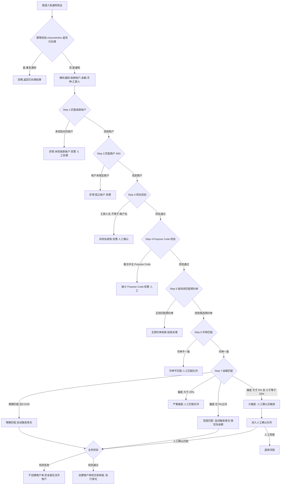
```mermaid
flowchart TD
    A[渠道入账通知到达] --> B{幂等校验:channelrefno 是否已处理}
    B -->|是,重复通知| B1[忽略,返回已处理结果]
    B -->|否,新通知| C[解析通知:收款账户,金额,币种,汇款人]

    C --> D{Step 1:匹配收款账户}
    D -->|未找到对应账户| D1[异常:未知收款账户:告警 人工处理]
    D -->|找到账户| E{Step 2:匹配商户 MID}

    E -->|账户未绑定商户| E1[异常:孤立账户:告警]
    E -->|找到商户| F{Step 3:同名校验}

    F -->|汇款人名 不等于 商户名| F1[非同名转账:告警 人工确认]
    F -->|同名通过| G{Step 4:Purpose Code 校验}

    G -->|备注中无 Purpose Code| G1[缺少 Purpose Code:告警 人工]
    G -->|校验通过| H{Step 5:查找待匹配预约单}

    H -->|无待匹配预约单| H1[无预约单收款:挂账处理]
    H -->|找到候选预约单| I{Step 6:币种匹配}

    I -->|币种不一致| I1[币种不匹配:人工匹配队列]
    I -->|币种一致| J{Step 7:金额匹配}

    J -->|精确匹配 在0.01内| J1[精确匹配:自动触发承兑]
    J -->|偏差 在 5%之内| J2[容差匹配 :自动触发承兑:按实际金额]
    J -->|偏差 大于 5% 且 小于等于 20%| J3[大偏差 :人工确认后触发]
    J -->|偏差 大于 20%| J4[ 严重偏差:人工匹配队列]

    J1 --> K0{业务校验}
    J2 --> K0
    K0 -->|校验失败| K1[不创建商户单,资金留在法币账户]
    K0 -->|校验通过| K[创建商户单和交易单链: 执行承兑]
    J3 --> L[进入人工确认队列]
    L -->|人工确认匹配| K0
    L -->|人工拒绝| M[退款流程]
```

### 10.2 匹配步骤详细说明

| Step | 匹配维度               | 匹配规则                                                     | 失败处理                  |
| ---- | ---------------------- | ------------------------------------------------------------ | ------------------------- |
| 1    | **收款账户**     | 渠道通知中的收款账号 → 系统中的 VA/BB 代收付账户            | 未知账户 → 告警 + 人工   |
| 2    | **商户 MID**     | 收款账户 → 绑定的商户 MID                                   | 孤立账户 → 告警          |
| 3    | **同名校验**     | 汇款人名称 vs 商户注册名称（模糊匹配，忽略大小写/空格/标点） | 非同名 → 告警 + 人工确认 |
| 4    | **Purpose Code** | 汇款备注中提取 Purpose Code                                  | 缺失 → 告警 + 人工确认   |
| 5    | **预约单查找**   | 该商户 + 该收款账户 + 状态=AWAITING_FUNDS + 未过期           | 无预约单 → 挂账          |
| 6    | **币种**         | 入账币种 = 预约单币种                                        | 不匹配 → 人工队列        |
| 7    | **金额**         | 入账金额 vs 预约金额，按偏差比例分级处理                     | 见金额匹配规则            |

### 10.3 金额匹配分级规则

| 偏差范围          | 级别        | 处理方式                               | 说明                     |
| ----------------- | ----------- | -------------------------------------- | ------------------------ |
| ≤ ±0.01（精确） | 🟢 自动     | 直接匹配，自动触发承兑                 | 最理想情况               |
| ±0.01 ~ ±5%     | 🟢 自动     | 自动匹配，**按实际到账金额承兑** | 银行扣费导致的正常偏差   |
| ±5% ~ ±20%      | 🟡 人工确认 | 进入人工确认队列，运营审核后决定       | 可能是部分汇款或汇率损耗 |
| > ±20%           | 🔴 人工处理 | 进入人工匹配队列，需运营手动处理       | 可能是错误汇款或拆分汇款 |

```
金额偏差计算公式：
偏差率 = |实际到账金额 - 预约金额| / 预约金额 × 100%

示例：
· 预约 200 USD，到账 199.50 USD → 偏差 0.25% → 🟢 自动匹配
· 预约 200 USD，到账 190.00 USD → 偏差 5.0% → 🟢 自动匹配（边界）
· 预约 200 USD，到账 175.00 USD → 偏差 12.5% → 🟡 人工确认
· 预约 200 USD，到账 100.00 USD → 偏差 50% → 🔴 人工处理
```

### 10.4 多预约单冲突处理

当同一商户同一收款账户存在多笔待匹配预约单时：

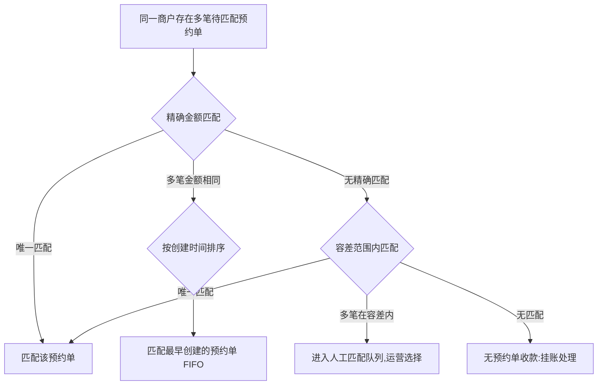
```mermaid
flowchart TD
    A[同一商户存在多笔待匹配预约单] --> B{精确金额匹配}
    B -->|唯一匹配| C[ 匹配该预约单]
    B -->|多笔金额相同| D{按创建时间排序}
    D --> E[匹配最早创建的预约单 FIFO]
    B -->|无精确匹配| F{容差范围内匹配}
    F -->|唯一匹配| C
    F -->|多笔在容差内| G[进入人工匹配队列,运营选择]
    F -->|无匹配| H[无预约单收款:挂账处理]
```

### 10.5 异常处理流程

#### 异常1：非同名转账 → 人工确认

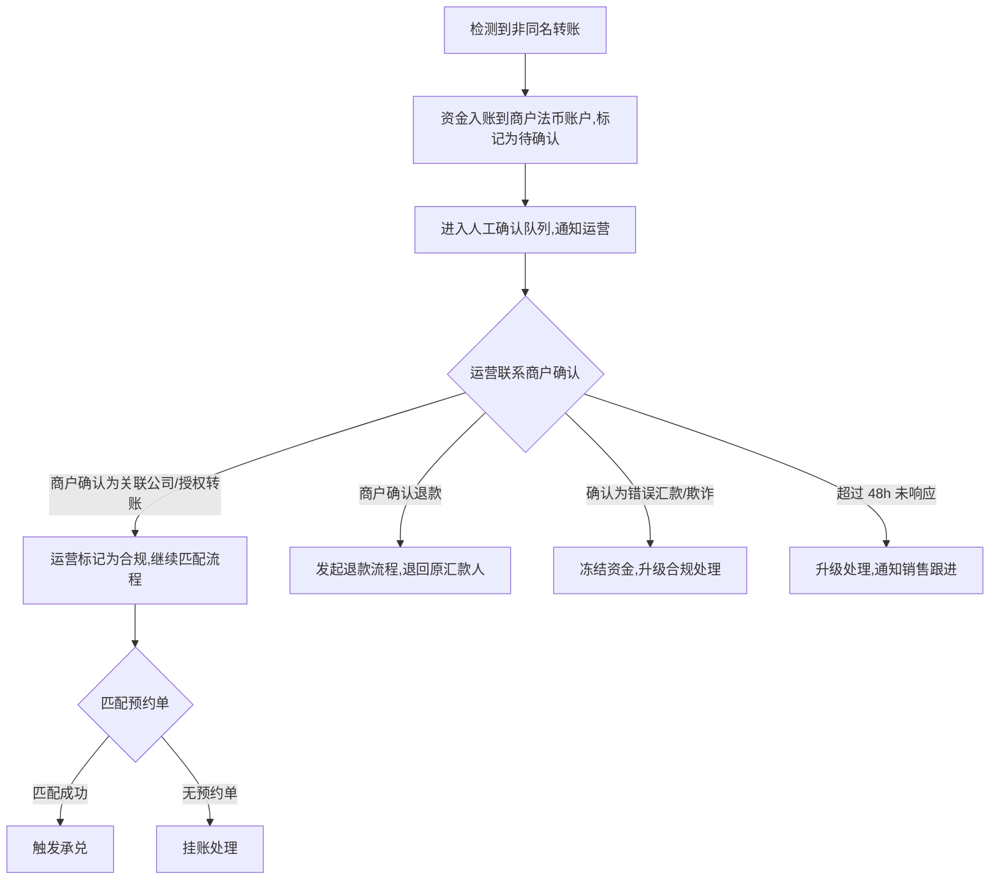
```mermaid
flowchart TD
    A[检测到非同名转账] --> B[资金入账到商户法币账户,标记为待确认]
    B --> C[进入人工确认队列,通知运营]
    C --> D{运营联系商户确认}
    D -->|商户确认为关联公司/授权转账| E[运营标记为合规,继续匹配流程]
    E --> F{匹配预约单}
    F -->|匹配成功| G[触发承兑]
    F -->|无预约单| H[挂账处理]
    D -->|商户确认退款| I[发起退款流程,退回原汇款人]
    D -->|确认为错误汇款/欺诈| J[冻结资金,升级合规处理]
    D -->|超过 48h 未响应| K[升级处理,通知销售跟进]
```

> **变更说明**：非同名转账不再自动退款。实际业务中可能存在关联公司代付、授权转账等合理场景，自动退款会导致银行手续费损失。改为进人工确认队列，运营联系商户后决定继续处理或退款。

#### 异常2：缺少 Purpose Code → 人工确认

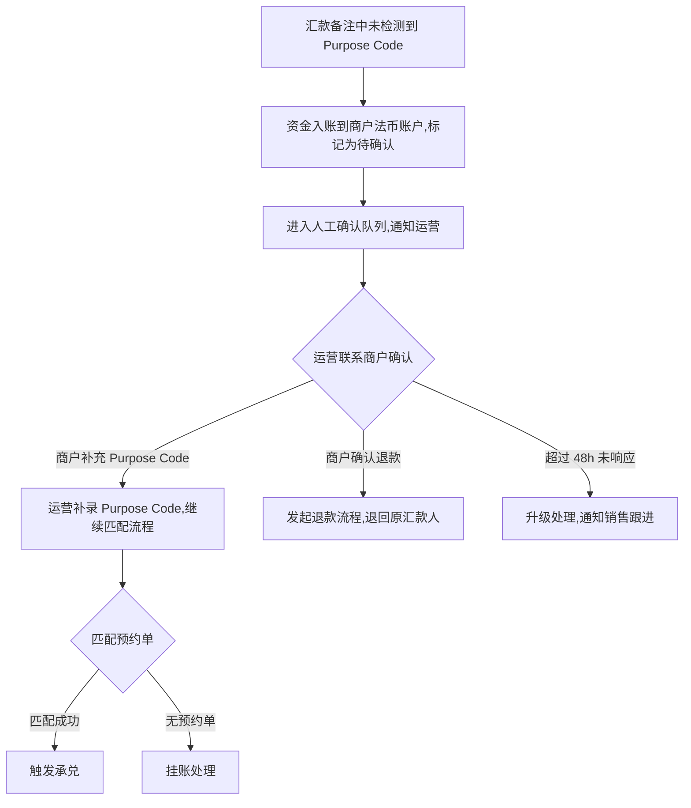
```mermaid
flowchart TD
    A[汇款备注中未检测到 Purpose Code] --> B[资金入账到商户法币账户,标记为待确认]
    B --> C[进入人工确认队列,通知运营]
    C --> D{运营联系商户确认}
    D -->|商户补充 Purpose Code| E[运营补录 Purpose Code,继续匹配流程]
    E --> F{匹配预约单}
    F -->|匹配成功| G[触发承兑]
    F -->|无预约单| H[挂账处理]
    D -->|商户确认退款| I[发起退款流程,退回原汇款人]
    D -->|超过 48h 未响应| J[升级处理,通知销售跟进]
```

> **变更说明**：缺少 Purpose Code 不再自动退款。实际业务中汇款人可能只是遗漏填写，自动退款会导致银行手续费损失由商户承担，体验差。改为进人工确认队列，运营联系商户后决定补录继续或退款。

#### 异常3：无预约单的收款 → 挂账处理

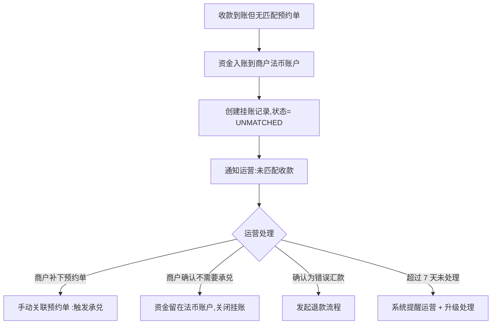
```mermaid
flowchart TD
    A[收款到账但无匹配预约单] --> B[资金入账到商户法币账户]
    B --> C[创建挂账记录,状态= UNMATCHED]
    C --> D[通知运营:未匹配收款]
    D --> E{运营处理}
    E -->|商户补下预约单| F[手动关联预约单 :触发承兑]
    E -->|商户确认不需要承兑| G[资金留在法币账户,关闭挂账]
    E -->|确认为错误汇款| H[发起退款流程]
    E -->|超过 7 天未处理| I[系统提醒运营 + 升级处理]
```

#### 异常4：金额大偏差 → 人工确认流程

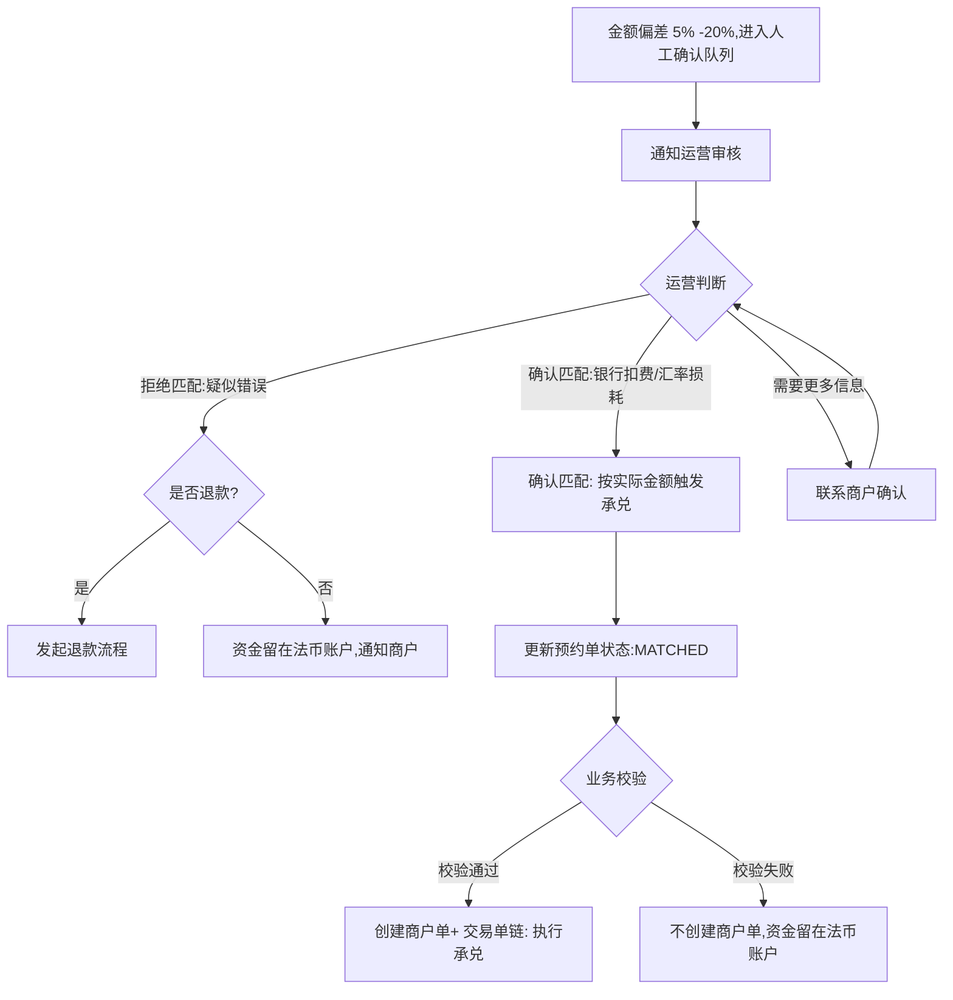
```mermaid
flowchart TD
    A[金额偏差 5% -20%,进入人工确认队列] --> B[通知运营审核]
    B --> C{运营判断}
    C -->|确认匹配:银行扣费/汇率损耗| D[确认匹配: 按实际金额触发承兑]
    C -->|拒绝匹配:疑似错误| E{是否退款?}
    E -->|是| F[发起退款流程]
    E -->|否| G[资金留在法币账户,通知商户]
    C -->|需要更多信息| H[联系商户确认]
    H --> C

    D --> I[更新预约单状态:MATCHED]
    I --> I1{业务校验}
    I1 -->|校验通过| J[创建商户单+ 交易单链: 执行承兑]
    I1 -->|校验失败| I2[不创建商户单,资金留在法币账户]
```

#### 异常5：金额严重偏差 → 人工匹配

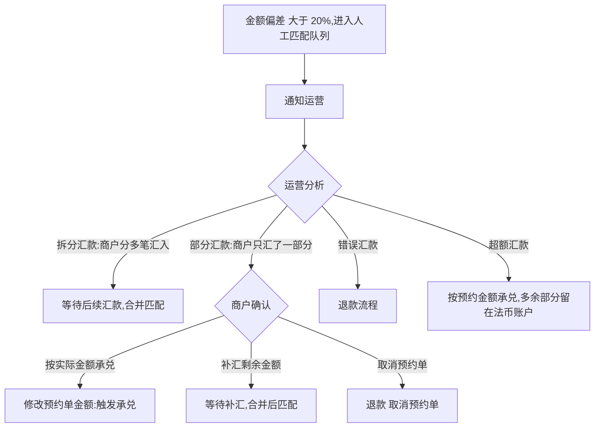
```mermaid
flowchart TD
    A[金额偏差 大于 20%,进入人工匹配队列] --> B[通知运营]
    B --> C{运营分析}
    C -->|拆分汇款:商户分多笔汇入| D[等待后续汇款,合并匹配]
    C -->|部分汇款:商户只汇了一部分| E{商户确认}
    E -->|按实际金额承兑| F[修改预约单金额:触发承兑]
    E -->|补汇剩余金额| G[等待补汇,合并后匹配]
    E -->|取消预约单| H[退款 取消预约单]
    C -->|错误汇款| I[退款流程]
    C -->|超额汇款| J[按预约金额承兑,多余部分留在法币账户]
```

#### 异常6：预约单过期

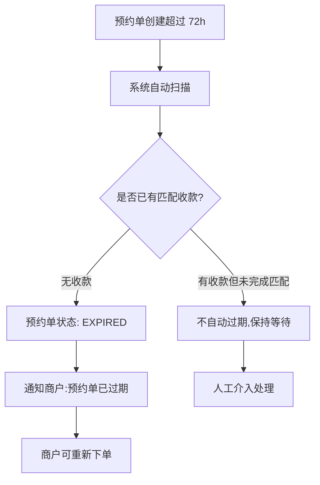
```mermaid
flowchart TD
    A[预约单创建超过 72h] --> B[系统自动扫描]
    B --> C{是否已有匹配收款?}
    C -->|无收款| D[预约单状态: EXPIRED]
    D --> E[通知商户:预约单已过期]
    E --> F[商户可重新下单]
    C -->|有收款但未完成匹配| G[不自动过期,保持等待]
    G --> H[人工介入处理]
```

### 10.6 人工处理工作台

运营人员在 TP/SA 后台的人工处理工作台中处理匹配异常：

| 队列                   | 触发条件                                         | 运营操作                                         | SLA |
| ---------------------- | ------------------------------------------------ | ------------------------------------------------ | --- |
| **人工确认队列** | 非同名转账 / 缺少 Purpose Code / 金额偏差 5%~20% | 确认匹配 / 补录信息 / 标记合规 / 拒绝 / 联系商户 | 4h  |
| **人工匹配队列** | 金额偏差 >20% / 币种不匹配 / 多预约单冲突        | 手动选择预约单 / 退款 / 挂账                     | 8h  |
| **挂账队列**     | 无预约单的收款                                   | 关联预约单 / 留在账户 / 退款                     | 24h |
| **退款队列**     | 人工确认后决定退款                               | 确认退款路径 / 执行退款                          | 24h |
| **过期预约单**   | 72h 未收到汇款                                   | 确认过期 / 延期 / 联系商户                       | 48h |

### 10.7 匹配结果状态流转

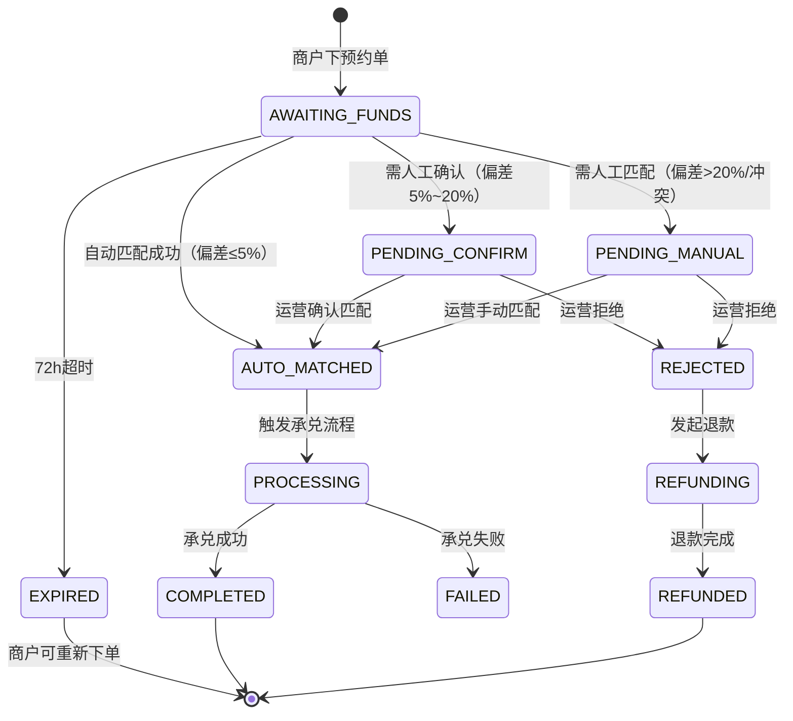
```mermaid
stateDiagram-v2
    [*] --> AWAITING_FUNDS: 商户下预约单

    AWAITING_FUNDS --> AUTO_MATCHED: 自动匹配成功（偏差≤5%）
    AWAITING_FUNDS --> PENDING_CONFIRM: 需人工确认（偏差5%~20%）
    AWAITING_FUNDS --> PENDING_MANUAL: 需人工匹配（偏差>20%/冲突）
    AWAITING_FUNDS --> EXPIRED: 72h超时

    PENDING_CONFIRM --> AUTO_MATCHED: 运营确认匹配
    PENDING_CONFIRM --> REJECTED: 运营拒绝

    PENDING_MANUAL --> AUTO_MATCHED: 运营手动匹配
    PENDING_MANUAL --> REJECTED: 运营拒绝

    AUTO_MATCHED --> PROCESSING: 触发承兑流程
    PROCESSING --> COMPLETED: 承兑成功
    PROCESSING --> FAILED: 承兑失败

    REJECTED --> REFUNDING: 发起退款
    REFUNDING --> REFUNDED: 退款完成

    EXPIRED --> [*]: 商户可重新下单
    COMPLETED --> [*]
    REFUNDED --> [*]
```

---

## 11. 校验规则详解

> 本章明确区分两类校验的触发时机、校验内容和失败处理，解答"预约单下单时有没有校验"的问题。

### 11.1 核心结论

```
即时单（场景 A1/A2）：
  商户下单 → 【前置业务校验】→ 校验通过 → 创建商户单 → 执行承兑

预约单（场景 B1/B2）：
  商户下单 → 【预约单创建校验】→ 创建预约单 → AWAITING_FUNDS
                                                    ↓ 收款到账
                                              【后置业务校验（匹配校验）】
                                                    ↓ 校验通过
                                              创建商户单 → 执行承兑
```

**关键区别：**

- 即时单的业务校验是**前置**的（下单时立即执行，校验失败直接拒绝，不创建任何单据）
- 预约单有**两层校验**：下单时的创建校验（轻量）+ 收款到账后的业务校验（完整）

---

### 11.2 预约单创建校验（下单时，轻量校验）

> 商户选择"银行转账"提交预约单时触发。**校验失败 → 拒绝创建预约单，不展示收款账户信息。**

| # | 校验项                      | 校验内容                                     | 失败处理                   |
| - | --------------------------- | -------------------------------------------- | -------------------------- |
| 1 | **产品开通状态**      | OnRamp 产品是否已为该商户开通                | 拒绝，提示"产品未开通"     |
| 2 | **商户 KYC/合规状态** | 商户账户是否处于正常状态（未冻结/未注销）    | 拒绝，提示"账户状态异常"   |
| 3 | **收款账户有效性**    | 商户选择的 VA / 代收付账户是否仍有效、未过期 | 拒绝，提示"收款账户不可用" |
| 4 | **单笔金额范围**      | 预约金额是否在产品配置的 [最小, 最大] 范围内 | 拒绝，提示具体限额         |
| 5 | **货币对支持**        | 预约的法币币种是否在产品支持的货币对内       | 拒绝，提示"不支持该货币"   |
| 6 | **汇款人绑定**        | 是否已绑定至少一个汇款人（同名校验的前提）   | 拒绝，提示"请先添加汇款人" |

**注意：预约单创建校验不校验余额/额度**，因为资金尚未到账，无法也无需校验。

---

### 11.3 商户单业务校验（收款到账后，完整校验）

> 预约单匹配成功（MATCHED）后，在创建商户单之前触发。**校验失败 → 不创建商户单，预约单状态 = MATCH_FAILED，资金留在商户法币账户。**

| # | 校验项                       | 校验内容                                                                         | 失败处理                       |
| - | ---------------------------- | -------------------------------------------------------------------------------- | ------------------------------ |
| 1 | **产品开通状态**       | OnRamp 产品是否仍处于开通状态（可能在等待期间被关闭）                            | MATCH_FAILED，资金留在法币账户 |
| 2 | **商户合规状态**       | 商户账户是否仍正常（可能在等待期间被冻结）                                       | MATCH_FAILED，资金留在法币账户 |
| 3 | **目标数币钱包状态**   | 承兑目标钱包（BB USDT 钱包）是否正常、可入账                                     | MATCH_FAILED，资金留在法币账户 |
| 4 | **单笔金额范围**       | 实际到账金额是否在产品配置的 [最小, 最大] 范围内                                 | MATCH_FAILED，资金留在法币账户 |
| 5 | **单日/单月累计限额**  | 加上本笔后是否超出商户的单日/单月累计限额                                        | MATCH_FAILED，资金留在法币账户 |
| 6 | **货币对支持**         | 到账币种是否仍在支持的货币对内                                                   | MATCH_FAILED，资金留在法币账户 |
| 7 | **跨SP场景：IPL 余额** | BB+IPL 场景下，商户 IPL 法币账户余额是否足以发起提现（即到账金额是否已正确入账） | MATCH_FAILED，资金留在法币账户 |

**注意：商户单业务校验不再校验余额是否足够扣款**，因为预约单场景的资金来源是外部汇入（不是从账户余额扣），到账即为资金来源。

---

### 11.4 即时单业务校验（下单时，完整校验）

> 商户选择"法币钱包余额"提交即时单时触发。**校验失败 → 直接拒绝，不创建任何单据。**

| # | 校验项                      | 校验内容                                                   | 失败处理                 |
| - | --------------------------- | ---------------------------------------------------------- | ------------------------ |
| 1 | **产品开通状态**      | OnRamp 产品是否已为该商户开通                              | 拒绝，提示"产品未开通"   |
| 2 | **商户 KYC/合规状态** | 商户账户是否处于正常状态                                   | 拒绝，提示"账户状态异常" |
| 3 | **目标数币钱包状态**  | 承兑目标钱包是否正常、可入账                               | 拒绝，提示"钱包不可用"   |
| 4 | **单笔金额范围**      | 金额是否在产品配置的 [最小, 最大] 范围内                   | 拒绝，提示具体限额       |
| 5 | **单日/单月累计限额** | 加上本笔后是否超出累计限额                                 | 拒绝，提示"已超出限额"   |
| 6 | **货币对支持**        | 法币币种是否在支持的货币对内                               | 拒绝，提示"不支持该货币" |
| 7 | **法币账户余额**      | 商户法币账户余额是否 ≥ 本次承兑金额（含手续费，外扣模式） | 拒绝，提示"余额不足"     |

---

### 11.5 三类校验对比汇总

| 校验维度          |  预约单创建校验  | 即时单业务校验 |    预约单业务校验（收款后）    |
| ----------------- | :--------------: | :------------: | :----------------------------: |
| 触发时机          |    商户下单时    |   商户下单时   |         收款到账匹配后         |
| 产品开通状态      |        ✅        |       ✅       |               ✅               |
| 商户合规状态      |        ✅        |       ✅       |               ✅               |
| 收款账户有效性    |        ✅        |       —       |               —               |
| 汇款人已绑定      |        ✅        |       —       |               —               |
| 目标钱包状态      |        —        |       ✅       |               ✅               |
| 单笔金额范围      | ✅（按预约金额） |       ✅       |      ✅（按实际到账金额）      |
| 单日/单月累计限额 |    ❌ 不校验    |       ✅       |               ✅               |
| 法币账户余额      |    ❌ 不校验    |       ✅       |    ❌ 不校验（资金已到账）    |
| 货币对支持        |        ✅        |       ✅       |               ✅               |
| 校验失败结果      |  拒绝创建预约单  |    拒绝下单    | MATCH_FAILED，资金留在法币账户 |
| 是否创建单据      |        ❌        |       ❌       |       ❌（商户单不创建）       |

**为什么预约单下单时不校验累计限额？**

```
预约单下单 → 收款到账 之间可能间隔数小时到数天。
在此期间，商户可能有其他交易消耗了额度，也可能额度已重置。
因此，累计限额校验必须在收款到账时（业务校验阶段）以当时的实时额度为准，
而非下单时的预估额度。
```

**MATCH_FAILED 后资金如何处理？**

```
资金已入账到商户法币账户（IPL 或 BB），不会自动退款。
商户可选择：
  1. 修复问题后，由运营人工重新触发业务校验（如产品已重新开通）
  2. 直接使用法币账户余额发起即时单 OnRamp（走场景 A1/A2）
  3. 申请退款（退回原汇款人）
```

---

## 12. 商户端功能清单

### 12.1 下单页面

| 功能         | 说明                                  |
| ------------ | ------------------------------------- |
| 选择数币     | USDT / USDC                           |
| 选择链       | TRC-20 / ERC-20 / BEP-20              |
| 输入法币金额 | 实时计算预计获得数币数量              |
| 选择支付来源 | 银行转账 / 法币钱包余额               |
| 选择收款账户 | BB 代收付 / 同名 VA（仅 BB+IPL 配置） |
| 查看账户详情 | 折叠展示，点击展开，支持逐字段复制    |
| 费用摘要     | 汇率、手续费、预计到账                |
| 提交订单     | OTP 安全验证后提交                    |

### 12.2 订单列表页

| 功能     | 说明                              |
| -------- | --------------------------------- |
| 订单列表 | 展示所有 OnRamp 订单              |
| 状态筛选 | All / 待汇款 / 处理中 / 已完成    |
| 订单详情 | 点击查看订单摘要 + 收款账户信息   |
| 账户切换 | 在订单详情中切换 BB / VA 账户查看 |

### 12.3 VA 账户展示字段

商户端展示 VA 账户信息时，**不暴露底层渠道名称**（XPay/IPL），统一展示为"同名 VA 账户"：

| 字段                 | 示例                                    |
| -------------------- | --------------------------------------- |
| Account Name         | Shanghai Yue Network Technology Co, LTD |
| Account Type         | Hong Kong - Local Receiving Account     |
| Account Purpose      | Foreign Collection                      |
| Account Status       | Normal                                  |
| Account Region       | 香港                                    |
| Supported Currencies | CNH, HKD, USD, EUR, NZD                 |
| Bank Name            | DBS BANK (HONG KONG) LIMITED            |
| Account Number       | 7983709047                              |
| SWIFT Code           | DHBKHKHH                                |
| Bank Code            | 016                                     |
| Branch Code          | 478                                     |
| Bank Address         | FLOOR 11, THE CENTER, 99 QUEEN'S ROAD   |
| Postcode             | 999077                                  |
| City                 | HONG KONG                               |

---

## 13. 场景汇总对比

### 13.1 OnRamp 场景一览

| 场景                  | 模式      | 支付方式     | 交易单数 | SP       | 渠道单 | 触发方式        |
| --------------------- | --------- | ------------ | -------- | -------- | ------ | --------------- |
| A1 BB法币→数币       | A(BB自己) | 法币钱包余额 | 1笔      | 单SP(BB) | ❌     | 商户发起        |
| A2 IPL法币→BB数币    | B(IPL-BB) | 法币钱包余额 | 2笔      | 双SP     | ❌     | 商户发起        |
| B1 BB VA收款→数币    | A(BB自己) | 银行转账     | 2笔      | 单SP(BB) | ✅     | 渠道触发+预约单 |
| B2 IPL VA收款→BB数币 | B(IPL-BB) | 银行转账     | 3笔      | 双SP     | ✅     | 渠道触发+预约单 |

### 13.2 模式对比

| 对比项                  | 模式A（BB自己）        | 模式B（IPL-BB打通）             |
| ----------------------- | ---------------------- | ------------------------------- |
| **SP数量**        | 单SP（BB）             | 双SP（BB+IPL）                  |
| **法币通道**      | BB代收付账户/XPAY      | IPL法币通道                     |
| **中间户**        | 不需要                 | 需要（BB和IPL各维护对方中间户） |
| **IPL侧交易性质** | 不涉及IPL              | 同名提现（IPL→BB）             |
| **风控**          | BB统一风控             | BB风控 + IPL合规，各自独立      |
| **清算**          | BB内部清算             | BB清算 + IPL清算，各自独立      |
| **适用场景**      | BB有自己的法币渠道能力 | 需要借助IPL的法币渠道能力       |

### 12.3 即时单 vs 预约单对比

| 对比项             | 即时单（场景A）   | 预约单（场景B）            |
| ------------------ | ----------------- | -------------------------- |
| **支付方式** | 法币钱包余额扣款  | 银行转账                   |
| **汇率**     | 不锁汇            | 不锁汇                     |
| **完成时间** | 实时              | 取决于银行转账到账时间     |
| **有效期**   | 无                | 72小时                     |
| **匹配逻辑** | 无需匹配          | 渠道入账通知→匹配预约单   |
| **风控**     | 余额校验+承兑风控 | 收款风控+同名校验+承兑风控 |

---

## 附录 A：术语表

| 术语         | 说明                                           |
| ------------ | ---------------------------------------------- |
| OnRamp       | 法币→数币承兑                                 |
| OffRamp      | 数币→法币承兑                                 |
| BB           | 承兑服务提供商，提供数币钱包+承兑引擎+法币账户 |
| IPL          | 法币服务提供商，提供 VA 收款+法币账户          |
| XPAY         | BB 的底层渠道（Channel），对 TP/MP 不透明      |
| VA           | Virtual Account，同名虚拟账户                  |
| 中间户       | BB 和 IPL 之间的清算中间账户                   |
| 预约单       | 商户先下单，等收款到账后自动触发承兑           |
| 即时单       | 法币余额直接扣款，实时承兑                     |
| Purpose Code | 银行转账备注中的用途代码                       |
| 同名转账     | 汇款人名称与商户注册名称一致                   |
| PP           | SP 后台（Payment Provider Portal）             |
| TP           | 租户后台（Tenant Portal）                      |
| MP           | 商户后台（Merchant Portal）                    |

---

## 附录 B：配套文档索引

| 文档             | 路径                             | 说明                                           |
| ---------------- | -------------------------------- | ---------------------------------------------- |
| 完整技术方案     | `onramp-technical.md`          | API 接口 + 数据模型 + 时序图 + 异常处理 + 对账 |
| 交互原型         | `../html/MP/mp-onramp-v2.html` | 商户端交互原型（含交互说明）                   |
| On/Off-Ramp 流程 | `on-offramp.md`                | On-Ramp + Off-Ramp 完整交易流程                |
| 退款流程         | `refund.md`                    | 全场景退款流程（含承兑后退款汇率规则）         |
| 产品开通流程     | `productionopening.md`         | 商户注册 + 产品开通 + 租户签约                 |
| 专业术语表       | `onofframp-glossary.md`        | On/Off-Ramp 专业术语（简中/繁中/英文）         |

---

*最后更新：2026-02-22*
*文档版本：v1.2 — 异常处理穿插至5.2~5.5；第3章精简为引用productionopening.md，修正路由描述为商户自行选择*
