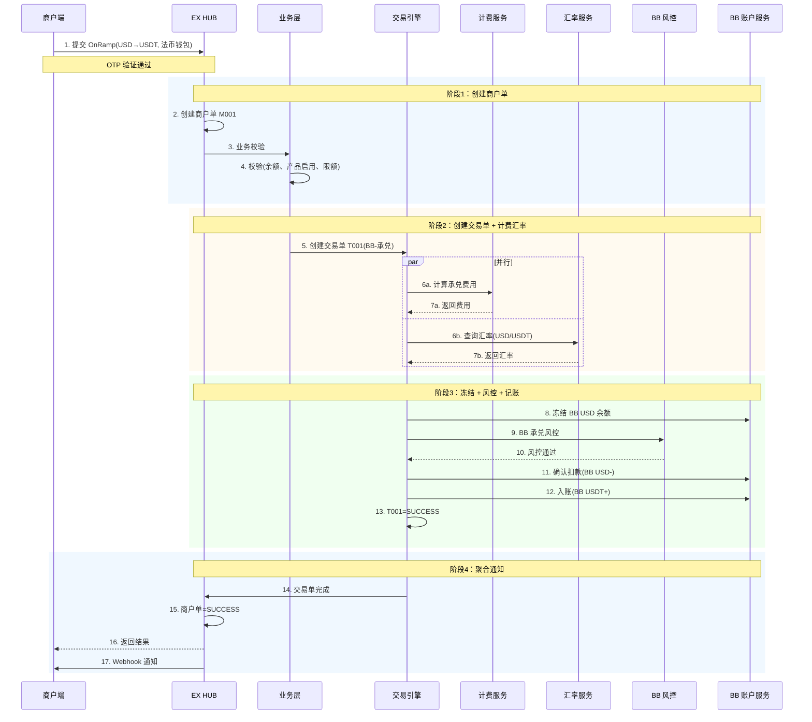
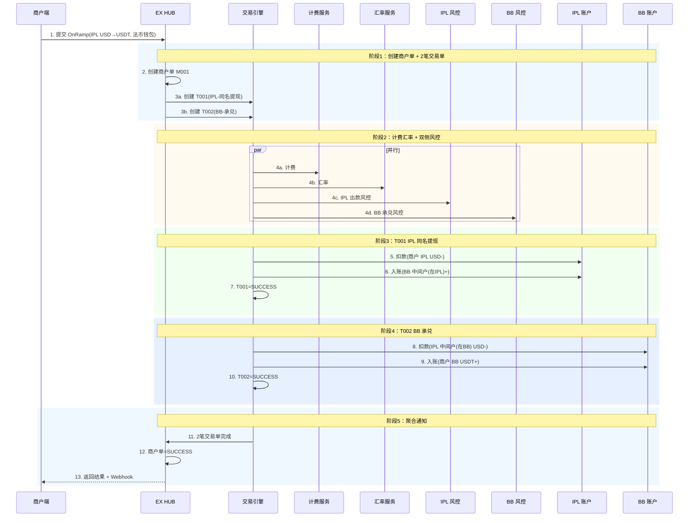
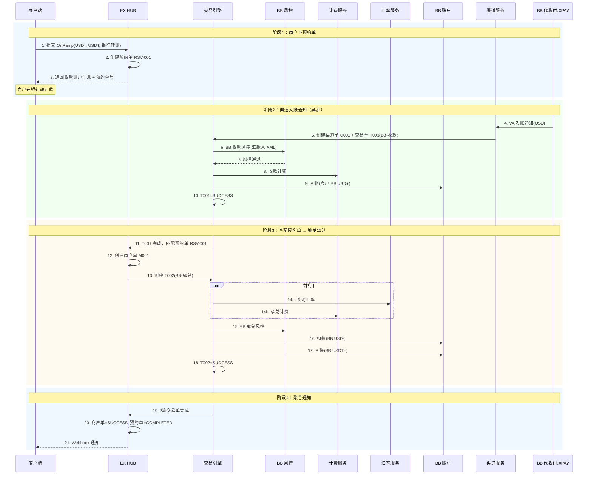
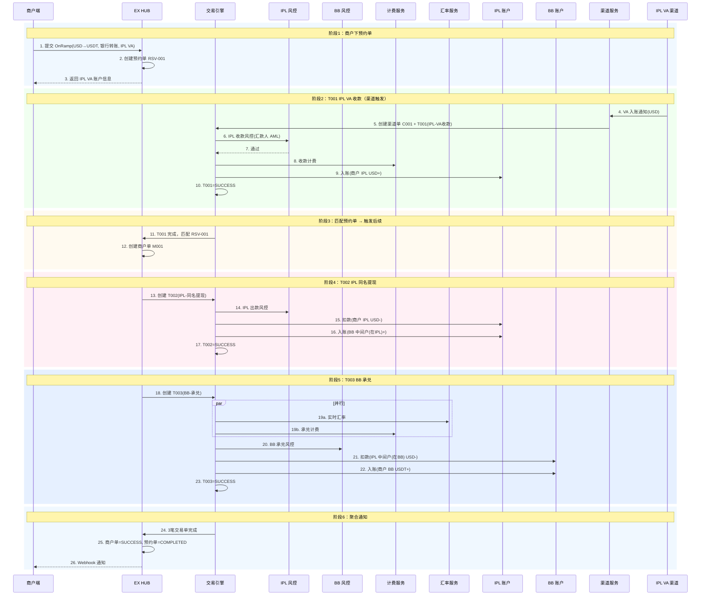

# OnRamp 完整技术方案

> **文档类型**：技术方案（Technical Specification）
> **产品名称**：OnRamp — 法币买入数币
> **版本**：v1.0
> **最后更新**：2026-02-21
> **前置文档**：`onramp-prd.md`（产品需求文档）

---

## 1. 数据模型

### 1.1 商户单（Merchant Order）

```sql
CREATE TABLE merchant_orders (
    id                  BIGINT PRIMARY KEY AUTO_INCREMENT,
    order_no            VARCHAR(32) NOT NULL UNIQUE,       -- 商户单号 e.g. ORD-20260221-001
    merchant_id         VARCHAR(32) NOT NULL,              -- 商户 MID
    tenant_id           VARCHAR(32) NOT NULL,              -- 租户 ID
    order_type          VARCHAR(16) NOT NULL,              -- ON_RAMP
    payment_mode        VARCHAR(16) NOT NULL,              -- INSTANT(即时单) / RESERVATION(预约单)

    -- 交易信息
    source_currency     VARCHAR(8) NOT NULL,               -- 法币币种 e.g. USD
    source_amount       DECIMAL(18,2),                     -- 法币金额（预约单可能为预估）
    actual_amount       DECIMAL(18,2),                     -- 实际到账法币金额
    target_coin         VARCHAR(8) NOT NULL,               -- 数币 e.g. USDT
    target_chain        VARCHAR(16) NOT NULL,              -- 链 e.g. TRC20 / ERC20 / BEP20
    target_amount       DECIMAL(18,8),                     -- 预计数币数量
    actual_target_amount DECIMAL(18,8),                    -- 实际到账数币数量

    -- 支付来源
    payment_source      VARCHAR(16) NOT NULL,              -- BANK_TRANSFER / FIAT_WALLET
    receiving_account_type VARCHAR(16),                    -- BB_ACCOUNT / VA_ACCOUNT
    receiving_account_id   VARCHAR(64),                    -- 收款账户 ID

    -- 汇率 & 费用
    pre_exchange_rate   DECIMAL(18,8),                     -- 预汇率（下单时）
    final_exchange_rate DECIMAL(18,8),                     -- 最终汇率（结算时）
    total_fee           DECIMAL(18,2),                     -- 总手续费
    fee_currency        VARCHAR(8),                        -- 手续费币种

    -- 状态
    status              VARCHAR(20) NOT NULL DEFAULT 'CREATED',
    -- CREATED / AWAITING_FUNDS / PROCESSING / SUCCESS / FAILED / EXPIRED / CANCELLED / REFUNDING / REFUNDED
    fail_reason         VARCHAR(256),

    -- 预约单相关
    reservation_id      VARCHAR(32),                       -- 关联预约单 ID
    expire_at           DATETIME,                          -- 预约单过期时间

    -- 审计
    created_at          DATETIME NOT NULL DEFAULT NOW(),
    updated_at          DATETIME NOT NULL DEFAULT NOW() ON UPDATE NOW(),
    created_by          VARCHAR(32),

    INDEX idx_merchant (merchant_id, status),
    INDEX idx_tenant (tenant_id, status),
    INDEX idx_reservation (reservation_id)
);
```

### 1.2 交易单（Transaction）

```sql
CREATE TABLE transactions (
    id                  BIGINT PRIMARY KEY AUTO_INCREMENT,
    txn_no              VARCHAR(32) NOT NULL UNIQUE,       -- 交易单号 e.g. TXN-20260221-001
    order_no            VARCHAR(32) NOT NULL,              -- 关联商户单号
    sp_id               VARCHAR(16) NOT NULL,              -- 归属 SP: BB / IPL
    txn_type            VARCHAR(20) NOT NULL,              -- 交易类型（见下表）
    sequence            INT NOT NULL,                      -- 执行顺序 1,2,3...

    -- 金额
    source_currency     VARCHAR(8) NOT NULL,
    source_amount       DECIMAL(18,2),
    target_currency     VARCHAR(8),
    target_amount       DECIMAL(18,8),

    -- 汇率 & 费用
    exchange_rate       DECIMAL(18,8),
    fee_amount          DECIMAL(18,2),
    fee_currency        VARCHAR(8),

    -- 账户
    debit_account_id    VARCHAR(64),                       -- 扣款账户
    credit_account_id   VARCHAR(64),                       -- 入账账户

    -- 风控
    risk_check_status   VARCHAR(16),                       -- PENDING / PASSED / REJECTED
    risk_check_detail   JSON,

    -- 状态
    status              VARCHAR(20) NOT NULL DEFAULT 'CREATED',
    -- CREATED / PROCESSING / SUCCESS / FAILED / REFUNDING / REFUNDED
    fail_reason         VARCHAR(256),

    -- 渠道单关联
    channel_order_id    VARCHAR(64),                       -- 关联渠道单（仅收款/付款类型有）

    created_at          DATETIME NOT NULL DEFAULT NOW(),
    updated_at          DATETIME NOT NULL DEFAULT NOW() ON UPDATE NOW(),

    INDEX idx_order (order_no),
    INDEX idx_sp (sp_id, status)
);
```

**交易类型枚举：**

| txn_type                   | SP  | 说明                               |
| -------------------------- | --- | ---------------------------------- |
| `BB_EXCHANGE`            | BB  | BB 内部承兑（USD→USDT）           |
| `BB_COLLECTION`          | BB  | BB 代收付/XPAY VA 收款             |
| `IPL_COLLECTION`         | IPL | IPL VA 收款                        |
| `IPL_SAME_NAME_WITHDRAW` | IPL | IPL 同名提现（IPL→BB 中间户）     |
| `IPL_SAME_NAME_DEPOSIT`  | IPL | IPL 同名收款（BB→IPL 中间户入账） |

### 1.3 渠道单（Channel Order）

```sql
CREATE TABLE channel_orders (
    id                  BIGINT PRIMARY KEY AUTO_INCREMENT,
    channel_order_no    VARCHAR(32) NOT NULL UNIQUE,       -- 渠道单号
    txn_no              VARCHAR(32) NOT NULL,              -- 关联交易单号
    sp_id               VARCHAR(16) NOT NULL,              -- 归属 SP
    channel_code        VARCHAR(32) NOT NULL,              -- 渠道代码 e.g. BB_CUSTODY / XPAY / IPL_VA
    channel_type        VARCHAR(16) NOT NULL,              -- COLLECTION / PAYMENT

    -- 渠道侧信息
    channel_ref_no      VARCHAR(64),                       -- 渠道方流水号
    channel_account_no  VARCHAR(64),                       -- 渠道收款账号
    remitter_name       VARCHAR(128),                      -- 汇款人名称
    remitter_account    VARCHAR(64),                       -- 汇款人账号

    -- 金额
    currency            VARCHAR(8) NOT NULL,
    amount              DECIMAL(18,2),
    actual_amount       DECIMAL(18,2),                     -- 实际到账金额

    -- 状态
    status              VARCHAR(20) NOT NULL DEFAULT 'CREATED',
    -- CREATED / PROCESSING / SUCCESS / FAILED
    fail_reason         VARCHAR(256),

    -- 通知
    notify_time         DATETIME,                          -- 渠道通知时间
    notify_raw          JSON,                              -- 渠道原始通知报文

    created_at          DATETIME NOT NULL DEFAULT NOW(),
    updated_at          DATETIME NOT NULL DEFAULT NOW() ON UPDATE NOW(),

    INDEX idx_txn (txn_no),
    INDEX idx_channel_ref (channel_ref_no)
);
```

> **可见性**：渠道单仅在 PP（SP 后台）可见。BB 的渠道单对 EX 透明（EX 帮 BB 对接渠道），IPL 的渠道单仅 IPL PP 可见。

### 1.4 预约单（Reservation）

```sql
CREATE TABLE reservations (
    id                  BIGINT PRIMARY KEY AUTO_INCREMENT,
    reservation_no      VARCHAR(32) NOT NULL UNIQUE,       -- 预约单号
    merchant_id         VARCHAR(32) NOT NULL,
    tenant_id           VARCHAR(32) NOT NULL,

    -- 预约信息
    source_currency     VARCHAR(8) NOT NULL,
    estimated_amount    DECIMAL(18,2),                     -- 预估金额
    target_coin         VARCHAR(8) NOT NULL,
    target_chain        VARCHAR(16) NOT NULL,
    payment_source      VARCHAR(16) NOT NULL DEFAULT 'BANK_TRANSFER',
    receiving_account_type VARCHAR(16) NOT NULL,           -- BB_ACCOUNT / VA_ACCOUNT
    receiving_account_id   VARCHAR(64) NOT NULL,

    -- 匹配
    matched_channel_order_id VARCHAR(64),                  -- 匹配到的渠道单
    matched_order_no    VARCHAR(32),                       -- 匹配后创建的商户单

    -- 状态
    status              VARCHAR(20) NOT NULL DEFAULT 'CREATED',
    -- CREATED / AWAITING_FUNDS / MATCHED / PROCESSING / COMPLETED / EXPIRED / CANCELLED
    expire_at           DATETIME NOT NULL,                 -- 过期时间（默认 72h）

    created_at          DATETIME NOT NULL DEFAULT NOW(),
    updated_at          DATETIME NOT NULL DEFAULT NOW() ON UPDATE NOW(),

    INDEX idx_merchant (merchant_id, status),
    INDEX idx_account (receiving_account_id, status)
);
```

### 1.5 商户产品配置

```sql
CREATE TABLE merchant_product_config (
    id                  BIGINT PRIMARY KEY AUTO_INCREMENT,
    merchant_id         VARCHAR(32) NOT NULL,
    tenant_id           VARCHAR(32) NOT NULL,
    product_code        VARCHAR(32) NOT NULL,              -- ON_OFF_RAMP

    -- SP 配置
    exchange_sp         VARCHAR(16) NOT NULL DEFAULT 'BB', -- 承兑 SP（固定 BB）
    fiat_account_mode   VARCHAR(16) NOT NULL,              -- BB_ONLY / IPL_ONLY / BOTH
    fiat_account_priority VARCHAR(16),                     -- BB_FIRST / IPL_FIRST

    -- BB 侧状态
    bb_status           VARCHAR(16) NOT NULL DEFAULT 'PENDING',
    bb_approved_at      DATETIME,
    bb_sp_merchant_id   VARCHAR(64),                       -- BB 侧商户 ID

    -- IPL 侧状态
    ipl_status          VARCHAR(16) DEFAULT 'NOT_APPLIED',
    -- NOT_APPLIED / PENDING / ACTIVE / REJECTED
    ipl_approved_at     DATETIME,
    ipl_sp_merchant_id  VARCHAR(64),                       -- IPL 侧商户 ID

    -- 限额
    min_amount          DECIMAL(18,2) DEFAULT 100,
    max_amount          DECIMAL(18,2) DEFAULT 50000,
    daily_limit         DECIMAL(18,2),

    created_at          DATETIME NOT NULL DEFAULT NOW(),
    updated_at          DATETIME NOT NULL DEFAULT NOW() ON UPDATE NOW(),

    UNIQUE INDEX idx_merchant_product (merchant_id, product_code)
);
```

---

## 2. API 接口

### 2.1 创建 OnRamp 订单

```http
POST /api/v1/onramp/orders
Content-Type: application/json
Authorization: Bearer {token}

Request:
{
    "target_coin": "USDT",
    "target_chain": "TRC20",
    "source_currency": "USD",
    "source_amount": 200.00,
    "payment_source": "BANK_TRANSFER",           // BANK_TRANSFER | FIAT_WALLET
    "receiving_account_type": "VA_ACCOUNT",       // BB_ACCOUNT | VA_ACCOUNT（仅 BANK_TRANSFER）
    "receiving_account_id": "VA-DBS-001",         // 具体收款账户 ID（仅 BANK_TRANSFER）
    "otp_code": "123456"                          // OTP 验证码
}

Response 200:
{
    "order_no": "ORD-20260221-001",
    "status": "PROCESSING",                       // 即时单
    // 或
    "status": "AWAITING_FUNDS",                   // 预约单
    "reservation_no": "RSV-20260221-001",
    "payment_mode": "RESERVATION",
    "pre_exchange_rate": 0.96,
    "estimated_target_amount": 208.33,
    "total_fee": 0.00,
    "expire_at": "2026-02-24T14:50:00Z",
    "receiving_account": {                        // 仅预约单返回
        "type": "VA_ACCOUNT",
        "bank_name": "DBS BANK (HONG KONG) LIMITED",
        "account_number": "7983709047",
        "swift_code": "DHBKHKHH",
        "account_name": "Shanghai Yue Network Technology Co, LTD"
    }
}
```

### 2.2 查询订单列表

```http
GET /api/v1/onramp/orders?status={status}&page={page}&size={size}
Authorization: Bearer {token}

Response 200:
{
    "total": 42,
    "page": 1,
    "size": 20,
    "items": [
        {
            "order_no": "ORD-20260221-001",
            "status": "AWAITING_FUNDS",
            "payment_mode": "RESERVATION",
            "source_currency": "USD",
            "source_amount": 200.00,
            "target_coin": "USDT",
            "target_chain": "TRC20",
            "estimated_target_amount": 208.33,
            "payment_source": "BANK_TRANSFER",
            "created_at": "2026-02-21T10:32:15Z"
        }
    ]
}
```

### 2.3 查询订单详情

```http
GET /api/v1/onramp/orders/{order_no}
Authorization: Bearer {token}

Response 200:
{
    "order_no": "ORD-20260221-001",
    "status": "SUCCESS",
    "payment_mode": "RESERVATION",
    "source_currency": "USD",
    "source_amount": 200.00,
    "actual_amount": 200.00,
    "target_coin": "USDT",
    "target_chain": "TRC20",
    "estimated_target_amount": 208.33,
    "actual_target_amount": 207.90,
    "pre_exchange_rate": 0.96,
    "final_exchange_rate": 0.9623,
    "total_fee": 0.00,
    "payment_source": "BANK_TRANSFER",
    "receiving_account_type": "VA_ACCOUNT",
    "receiving_account": {
        "bank_name": "DBS BANK (HONG KONG) LIMITED",
        "account_number": "7983709047",
        "swift_code": "DHBKHKHH"
    },
    "created_at": "2026-02-21T10:32:15Z",
    "completed_at": "2026-02-21T14:05:30Z"
}
```

### 2.4 取消预约单

```http
POST /api/v1/onramp/orders/{order_no}/cancel
Authorization: Bearer {token}

Response 200:
{
    "order_no": "ORD-20260221-001",
    "status": "CANCELLED",
    "cancelled_at": "2026-02-21T12:00:00Z"
}

Error 400:
{
    "code": "ORDER_NOT_CANCELLABLE",
    "message": "Order cannot be cancelled in current status"
}
```

### 2.5 获取收款账户列表

```http
GET /api/v1/onramp/receiving-accounts?currency=USD
Authorization: Bearer {token}

Response 200:
{
    "accounts": [
        {
            "account_id": "BB-CUSTODY-001",
            "type": "BB_ACCOUNT",
            "label": "代收付账户",
            "bank_name": "SINGAPORE GULF BANK B.S.C. CLOSED",
            "account_number": "20301000010313",
            "swift_code": "SGBDBHB2XXX",
            "recipient_name": "BLANKBLOCK LIMITED LIABILITY COMPANY",
            "supported_currencies": ["USD"]
        },
        {
            "account_id": "VA-DBS-001",
            "type": "VA_ACCOUNT",
            "label": "同名 VA 账户",
            "bank_name": "DBS BANK (HONG KONG) LIMITED",
            "account_number": "7983709047",
            "swift_code": "DHBKHKHH",
            "bank_code": "016",
            "branch_code": "478",
            "account_name": "Shanghai Yue Network Technology Co, LTD",
            "account_region": "Hong Kong",
            "supported_currencies": ["CNH", "HKD", "USD", "EUR", "NZD"],
            "status": "ACTIVE"
        }
    ]
}
```

### 2.6 获取实时汇率

```http
GET /api/v1/onramp/quote?source_currency=USD&target_coin=USDT&amount=200
Authorization: Bearer {token}

Response 200:
{
    "source_currency": "USD",
    "target_coin": "USDT",
    "source_amount": 200.00,
    "exchange_rate": 0.96,
    "fee": 0.00,
    "fee_currency": "USD",
    "estimated_target_amount": 208.33,
    "quote_valid_seconds": 30,
    "quoted_at": "2026-02-21T10:30:00Z"
}
```

### 2.7 Webhook 回调

```http
POST {merchant_webhook_url}
Content-Type: application/json
X-Signature: {hmac_sha256_signature}

{
    "event": "onramp.order.status_changed",
    "order_no": "ORD-20260221-001",
    "status": "SUCCESS",
    "previous_status": "PROCESSING",
    "data": {
        "actual_amount": 200.00,
        "actual_target_amount": 207.90,
        "final_exchange_rate": 0.9623,
        "completed_at": "2026-02-21T14:05:30Z"
    },
    "timestamp": "2026-02-21T14:05:31Z"
}
```

**Webhook 事件类型：**

| 事件                            | 触发条件         |
| ------------------------------- | ---------------- |
| `onramp.order.status_changed` | 商户单状态变更   |
| `onramp.reservation.matched`  | 预约单匹配到收款 |
| `onramp.reservation.expired`  | 预约单过期       |

---

## 3. 时序图

### 3.1 即时单 — 仅 BB（场景 A1）



### 3.2 即时单 — BB+IPL（场景 A2，从 IPL 余额承兑）



### 3.3 预约单 — 仅 BB 银行转账（场景 B1）



### 3.4 预约单 — BB+IPL VA 收款（场景 B2）



---

## 4. 异常处理

### 4.1 异常场景分类

| 异常类型                    | 场景                           | 处理方式                           |
| --------------------------- | ------------------------------ | ---------------------------------- |
| **余额不足**          | 即时单扣款时余额不足           | 订单失败，返回错误                 |
| **风控拒绝**          | 任一交易单风控不通过           | 订单失败；如已收款则触发退款       |
| **汇率异常**          | 汇率服务不可用或波动过大       | 重试3次，仍失败则挂起人工处理      |
| **渠道超时**          | 渠道通知未在预期时间内到达     | 预约单自动过期（72h）              |
| **金额不匹配**        | 实际到账金额与预约金额差异过大 | 进入人工匹配队列                   |
| **非同名转账**        | 汇款人名称与商户名不一致       | 自动退回，通知商户                 |
| **缺少 Purpose Code** | 汇款备注中无 Purpose Code      | 自动退款，损失由商户承担           |
| **承兑失败**          | 收款成功但承兑环节失败         | 资金留在法币账户，通知商户，可重试 |
| **中间户划转失败**    | 跨 SP 中间户划转异常           | 挂起人工处理，触发告警             |
| **重复入账**          | 同一笔渠道通知重复到达         | 幂等处理，忽略重复通知             |

### 4.2 退款流程

```
触发条件：收款成功但后续承兑失败

退款流程：
1. 商户单状态 → REFUNDING
2. 创建退款交易单（反向操作）
3. 如果是 BB 收款 → BB 发起退款（通过原渠道）
4. 如果是 IPL VA 收款 → IPL 发起退款（通过原渠道）
5. 退款成功 → 商户单状态 → REFUNDED
6. 退款失败 → 人工介入

退款时效：
· 自动退款：T+1 ~ T+3
· 人工退款：T+5 ~ T+10
```

### 4.3 交易单链失败回滚

```
场景 B2（3笔交易单串行）的回滚策略：

T001(IPL收款) 失败 → 渠道退回，商户单=FAILED
T001 成功, T002(IPL提现) 失败 → 资金留在 IPL 账户，通知商户
T001+T002 成功, T003(BB承兑) 失败 → 资金留在 BB 法币账户，通知商户

原则：
· 已入账的资金不自动退回外部（避免资金损失）
· 中间环节失败，资金停留在最后成功的账户
· 通知商户 + 人工处理
```

### 4.4 幂等性设计

```
所有关键操作必须幂等：

1. 渠道入账通知：按 channel_ref_no 去重
2. 预约单匹配：匹配成功后锁定预约单，防止重复匹配
3. 交易单执行：按 txn_no 幂等，重复调用返回已有结果
4. Webhook 通知：商户需返回 200 确认，否则重试（最多 5 次，间隔递增）
```

---

## 5. 对账逻辑

### 5.1 对账层级

```
┌─────────────────────────────────────────────────────────────┐
│  Level 1：商户单 ↔ 交易单对账                                 │
│  · EX HUB 内部对账                                           │
│  · 确保每个商户单的交易单全部完成/失败                          │
│  · 频率：实时 + 每日批量                                      │
├─────────────────────────────────────────────────────────────┤
│  Level 2：交易单 ↔ 渠道单对账                                 │
│  · 交易引擎 ↔ 渠道服务对账                                    │
│  · 确保交易单金额与渠道实际金额一致                             │
│  · 频率：每日批量                                             │
├─────────────────────────────────────────────────────────────┤
│  Level 3：渠道单 ↔ 银行对账                                   │
│  · SP 内部对账（PP 后台）                                     │
│  · 确保渠道记录与银行流水一致                                  │
│  · 频率：每日 / 银行对账文件到达时                              │
├─────────────────────────────────────────────────────────────┤
│  Level 4：BB ↔ IPL 中间户对账                                 │
│  · 跨 SP 清算对账                                            │
│  · 确保中间户借贷平衡                                         │
│  · 频率：每日 + 月度轧差                                      │
└─────────────────────────────────────────────────────────────┘
```

### 5.2 对账规则

#### Level 1：商户单 ↔ 交易单

```sql
-- 每日对账：找出商户单与交易单状态不一致的记录
SELECT mo.order_no, mo.status AS order_status,
       GROUP_CONCAT(t.txn_no, ':', t.status) AS txn_statuses
FROM merchant_orders mo
LEFT JOIN transactions t ON t.order_no = mo.order_no
WHERE mo.created_at >= CURDATE() - INTERVAL 1 DAY
GROUP BY mo.order_no
HAVING
    -- 商户单 SUCCESS 但存在非 SUCCESS 的交易单
    (mo.status = 'SUCCESS' AND SUM(t.status != 'SUCCESS') > 0)
    OR
    -- 所有交易单 SUCCESS 但商户单未更新
    (mo.status != 'SUCCESS' AND SUM(t.status != 'SUCCESS') = 0)
```

#### Level 2：交易单 ↔ 渠道单

```sql
-- 收款类交易单与渠道单金额对账
SELECT t.txn_no, t.source_amount AS txn_amount,
       co.actual_amount AS channel_amount,
       ABS(t.source_amount - co.actual_amount) AS diff
FROM transactions t
JOIN channel_orders co ON co.txn_no = t.txn_no
WHERE t.txn_type IN ('BB_COLLECTION', 'IPL_COLLECTION')
  AND t.created_at >= CURDATE() - INTERVAL 1 DAY
  AND ABS(t.source_amount - co.actual_amount) > 0.01
```

#### Level 4：中间户对账

```
BB 侧中间户余额 + IPL 侧中间户余额 = 0（借贷平衡）

每日检查：
· SUM(BB 侧 IPL 中间户变动) + SUM(IPL 侧 BB 中间户变动) = 0
· 如不平衡 → 触发告警 → 人工核查
```

### 5.3 差错处理

| 差错类型     | 发现方式     | 处理方式                |
| ------------ | ------------ | ----------------------- |
| 长款（多收） | Level 2 对账 | 人工确认后退回或挂账    |
| 短款（少收） | Level 2 对账 | 人工确认后补账或追款    |
| 状态不一致   | Level 1 对账 | 自动修复或人工处理      |
| 中间户不平衡 | Level 4 对账 | 紧急告警 + 人工核查     |
| 预约单未匹配 | 定时扫描     | 超时自动过期 + 通知商户 |

---

## 6. 监控与告警

### 6.1 关键指标

| 指标                   | 阈值    | 告警级别 |
| ---------------------- | ------- | -------- |
| 订单成功率             | < 95%   | P1       |
| 平均承兑时间（即时单） | > 30s   | P2       |
| 预约单匹配率           | < 90%   | P2       |
| 渠道通知延迟           | > 30min | P2       |
| 中间户余额偏差         | > 0     | P1       |
| 退款处理时间           | > 24h   | P2       |

### 6.2 日志要求

```
每笔交易必须记录：
· 商户单号、交易单号、渠道单号（全链路追踪）
· 每个状态变更的时间戳
· 计费明细、汇率快照
· 风控结果
· 渠道原始报文
```

---

## 附录：错误码

| 错误码                     | 说明           |
| -------------------------- | -------------- |
| `INSUFFICIENT_BALANCE`   | 余额不足       |
| `PRODUCT_NOT_ACTIVE`     | 产品未开通     |
| `AMOUNT_OUT_OF_RANGE`    | 金额超出限额   |
| `CURRENCY_NOT_SUPPORTED` | 不支持的币种   |
| `CHAIN_NOT_SUPPORTED`    | 不支持的链     |
| `RISK_REJECTED`          | 风控拒绝       |
| `RATE_EXPIRED`           | 汇率已过期     |
| `ORDER_NOT_CANCELLABLE`  | 订单不可取消   |
| `ACCOUNT_NOT_AVAILABLE`  | 收款账户不可用 |
| `OTP_INVALID`            | OTP 验证码错误 |
| `DUPLICATE_REQUEST`      | 重复请求       |

---

*最后更新：2026-02-21*
*文档版本：v1.0*
