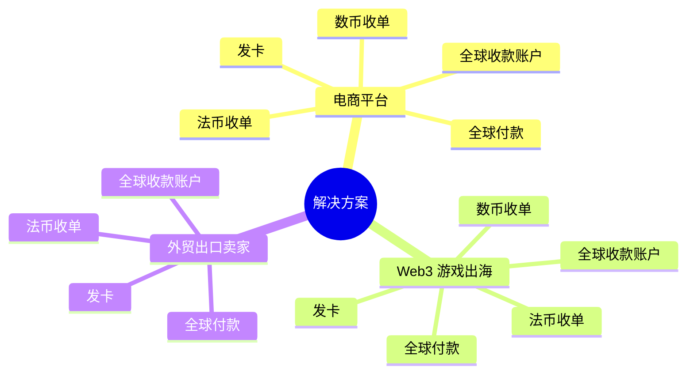

# 解决方案与产品结构

## 解决方案概览
- **电商平台**
- **Web3 游戏出海**
- **外贸出口卖家**

以上三类解决方案可按需组合下列产品能力，构建完整的支付、收款与资金管理闭环。

---

## 产品层级可视化

---

## 产品详解

### 1. 法币收单
| 属性 | 说明 |
| --- | --- |
| 收单方式 | 卡收单 / 本地钱包收单 |
| 卡组 / 本地钱包名称 | 例如 Visa、Mastercard、本地 Pay 钱包等 |
| 支付币种 | 支持的结算货币列表（USD、EUR、CNY 等） |
| 产品品类 | 适用业务品类（实物、虚拟、订阅等） |

### 2. 数币收单
| 属性 | 说明 |
| --- | --- |
| 支付方式 | 地址 / 钱包 |
| 钱包名称 | 仅钱包方式时需要（如 MetaMask、OKX Wallet） |
| 货币-网络 | 组合如 USDT-TRC20、USDC-ERC20 |
| 产品品类 | 适配业务类别 |

### 3. 全球收款账户
| 属性 | 说明 |
| --- | --- |
| 单币种 / 多币种 | 账户类型 |
| VA 账户币种 | 虚拟账户支持的币种列表 |
| VA 支持的收款方式 | Local / Cross-border |
| 支持场景 | 指定站点或业务场景（如 Amazon EU、Shopify 等） |

### 4. 全球付款
| 属性 | 说明 |
| --- | --- |
| 收款人币种 | 目标币种 |
| 收款人国家 | 覆盖国家 |
| 付款用途 | 跨境采购、佣金、工资等 |
| 付款方式 | 钱包 / 银行卡 |

### 5. 发卡
| 属性 | 说明 |
| --- | --- |
| 卡 BIN - 卡组 | BIN 与对应卡组（如 Visa 商务） |
| 禁止场景 | 限制使用的行业或交易类型 |
| 卡产品类型 | 借记 / 贷记 / 预付等 |
| 卡类型 | 商务卡、企业卡等 |
| 实体卡 / 虚拟卡 | 发卡形态 |

---

若需进一步细化属性（如枚举值、合规限制、流程示意等），可在此文档基础上扩展章节以满足更精细的产品设计需求。
