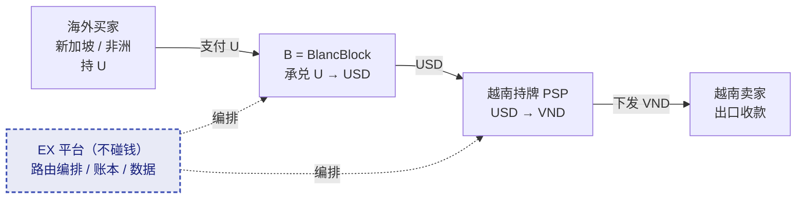
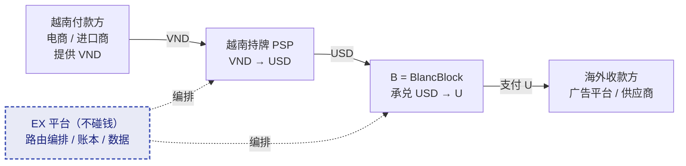
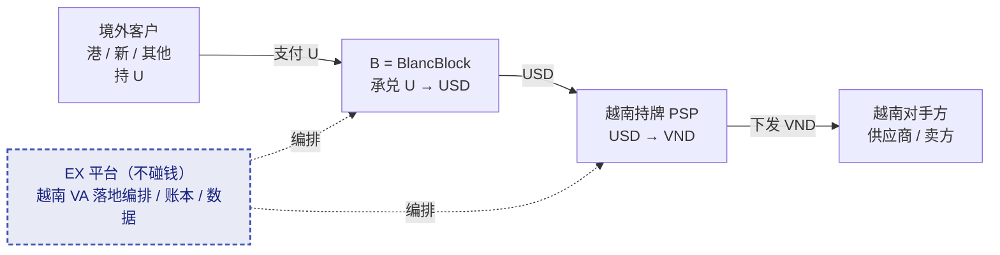
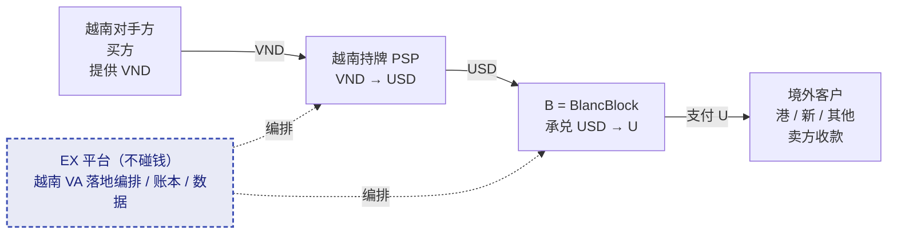

# EX 越南展业计划与合规框架说明（致 B 合规团队）

本文档面向 B（代号）的合规、风控与业务团队，用于说明 EurewaX（EX）在越南及与越南相关业务上的展业计划与配套风险控制框架，以支持 B 重新评估其对越南的限制策略。

## 背景与目的

B 当前将 **越南、尼日利亚、肯尼亚等地区列为禁止（Restricted / Prohibited）地区**，其含义包括两层：

- 不允许直接服务上述地区的客户（如不接受越南本地客户）；
- 不允许上述地区的主体作为客户交易的**交易对手方**（如客户的买方 / 卖方在越南时，交易被拦截）。

这一限制直接影响了 EX 在东南亚的核心展业计划——EX 的越南相关业务，无论是服务越南本地客户，还是服务"交易对手方在越南"的其他地区客户，都会落入 B 的禁止范围。

**本文档目的**：以 **越南** 为聚焦地区，向 B 合规团队完整说明 EX 的**业务模式、租户画像、交易体量与资金路径**，作为 B 合规团队评估的输入，请 B 合规据此对越南相关业务做**逐场景、逐客户类型的重新评估并考虑放开**。**合规方案由 B 合规团队制定，本文档不提供合规方案**。尼日利亚、肯尼亚等其他禁止地区的展业逻辑与越南类似，后续将另行补充说明，本文档不展开。

## 执行摘要

- **集团定位（ABE 三位一体）**：**E = EurewaX（EX）** 是科技平台，**不持牌、不碰钱**，对本地机构做「科技 + 跨境支付能力」捆绑输出，编排 / 账本 / 数据始终留在 EX；**B = BlancBlock** 持数币牌照，是集团的**承兑引擎 + 链上基础设施**；**A = iPayLinks** 持法币收付牌照。三者是一个集团、三种角色，激励一致、可控可追溯。
- **业务范围**：EX 服务的租户分为两大类：① 越南当地的支付机构 / 汇款公司 / 小型银行等（服务越南本地客户，帮其做跨境业务）；② 其他地区的 PSP / 汇款公司等（服务其他地区客户，但客户的交易对手方在越南）。两类租户的跨境环节都**结合 B 的承兑能力**完成。
- **EX 与 B 的分工**：EX 遵循「**本地段让给本地持牌机构、跨境段用能力赋能、兑换 / 账本 / 数据留自己**」的定位——**B 承担数币 ↔ 法币的承兑环节（U ↔ USD/USDC）**；**越南当地持牌支付机构承担本地法币环节**（USD ↔ VND、本地收付与下发），EX 不抢本地市场；EX 作为科技平台提供 VA 账户、路由编排、清算对接、KYC/KYB 数据汇集与全链路监控，**不直接持牌、不直接开立越南本地账户、不直接做跨境结算**。
- **Q3 / Q4 业务目标**：Q3 新增越南相关租户 4 家、累计交易量 3,000 万美金；Q4 累计租户 10 家、交易量 9,000 万 – 1 亿美金。
- **职责分工**：本文档提供**业务模式、客户画像、交易体量、资金路径**等业务事实与数据；**合规判断与合规方案由 B 合规团队制定**，EX 配合提供 KYC / 凭证 / 逐笔资金路径数据并执行 B 制定的规则（详见 Part 4）。

# Part 1：越南地区背景

## 1.1 市场背景

越南是东南亚重要的制造型国家与转口贸易枢纽，吸引大量外资进入制造业与跨境贸易。EX 观察到越南本地的支付与贸易生态正在经历两个明确变化：

- **合规方向明确**：越南本土支付机构、商业银行和监管层正在逐步推进合规框架，过去依赖非正式渠道的支付路径预计将逐步收缩。
- **跨境贸易体量持续增长**：随着制造业与转口贸易扩张，海外对手方与越南本地卖家之间的资金往来需求上升，对正规、可追溯的清算通道形成明确需求。

**EX 的判断**：长期看，越南本地合规要求会持续抬升，不合规的支付路径将逐步被市场淘汰；EX 展业计划以合规可追溯为前提设计。这也意味着，与 EX 合作是 B 以合规方式进入越南市场的路径，而非风险敞口。

## 1.2 越南本地支付与银行生态

越南本地的合规资金环节，由持牌支付机构与商业银行共同承担，EX 不直接介入：

- **持牌支付机构（潜在 SP / 租户）**：9Pay、Alixpay、Remix、Neopay 等本土持牌支付机构，承担越南当地客户接入、本地 KYC、本地 VND 收付与下发、交易背景第一道审核。
- **商业银行**：MSB（Maritime Commercial Bank）、BIDV、Techcombank 等，承担法币清算、VND 兑换、跨境合作行对接。

EX 自身不持有越南本地支付牌照，不直接吸收越南公众资金，不直接与越南当地银行建立账户或资金关系；所有本地清算动作由越南持牌支付机构按当地法规执行。

# Part 2：EX 与 B 的合作模式

## 2.1 三方分工

EX 在越南采取**不直接落地、不直接开户、不直接做跨境结算**的展业模式，遵循 ABE 集团「**本地段让给本地持牌机构、跨境段用能力赋能、兑换 / 账本 / 数据留自己**」的定位。核心是 **EX（科技平台）+ B（数币承兑）+ 越南持牌 SP（本地法币）** 的三方协同：

| 角色                                                  | 集团定位                          | 职责                                                                                       | 是否碰越南本地资金                    |
| ----------------------------------------------------- | --------------------------------- | ------------------------------------------------------------------------------------------ | ------------------------------------- |
| **EX = EurewaX**                                | 科技平台，不持牌、不碰钱          | 科技 + 跨境能力捆绑输出：VA 账户体系、交易路由、清算对接；编排 / 账本 / 数据留 EX; AI 风控 | 否（不持牌、不开户、不结算）          |
| **B = BlancBlock**                              | 数币牌照，承兑引擎 + 链上基础设施 | 数币 ↔ 法币的**承兑环节**：将海外对手方的 USDT/USDC（U）兑换为法币 USD              | 否（不接触越南本地账户，仅做 U↔USD） |
| **越南持牌 SP**（9Pay/Alixpay/Remix/Neopay 等） | 本地持牌机构（本地段主体）        | **本地法币环节**：USD → VND 兑换、越南客户接入、本地 KYC、VND 收付与下发            | 是（持牌合规执行）                    |
| **越南商业银行**（MSB/BIDV/Techcombank）        | 本地清算行                        | 法币清算、VND 兑换、跨境合作行对接                                                         | 是（持牌合规执行）                    |

**对 B 的关键点**：B 只承担 U↔USD 的承兑环节，全程不接触越南本地账户、不做越南本地结算；越南本地的资金落地由本地持牌 SP 与银行完成，B 的合规敞口被隔离在承兑环节内。同时，因 EX 与 B 同属 ABE 集团、EX 掌握全链路编排 / 账本 / 数据，B 对每笔承兑背后的贸易背景、资金路径与对手方身份都可穿透追溯——这是外部第三方承兑通道无法提供的可控性。

## 2.2 两种资金方向：OffRamp 与 OnRamp（总览）

越南本地一侧始终以 VND 结算，因此所有涉及 B 承兑能力的业务，按**资金进出越南的方向**归为两类。下方 Part 3 会分别给出两类租户在这两个方向上的具体资金流与流程图。

| 方向                              | 定义                                                                | 资金走向                                                           | B 的角色      | 典型业务                                         |
| --------------------------------- | ------------------------------------------------------------------- | ------------------------------------------------------------------ | ------------- | ------------------------------------------------ |
| **OffRamp（数币 → 法币）** | 资金**流入越南**，源头是海外的 U，最终以 VND 落到越南收款方   | 海外 U → B 承兑 U→USD  → 越南 PSP USD→VND → 越南收款方       | 承兑 U → USD | B2B 出口收款、境外买家付款给越南卖家             |
| **OnRamp（法币 → 数币）**  | 资金**流出越南**，源头是越南方的 VND，最终以 U 付给海外收款方 | 越南付款方 VND → 越南 PSP VND→USD → B 承兑 USD→U → 海外收款方 | 承兑 USD → U | 跨境电商投流付款、越南进口付汇、越南境外卖家收款 |

**每一环的通用合规要点**：对手方实名与贸易 / 投放背景审核 → B 承兑资质与反洗钱义务 → 越南持牌 PSP 当地 KYC 与交易监控 → 越南收付方 KYB 与资金用途审核 → 全链路可追溯凭证留存。

## 2.3 为什么只有数币段经过 B、法币段不经过 B（即使 B 也有法币钱包）

B 具备法币钱包能力，理论上可以承接部分法币环节；但在越南（及类似市场）的架构设计中，EX **刻意只让 B 承接数币承兑段（U ↔ USD），本地法币段（USD ↔ VND、VND 收付）交由越南当地持牌 PSP 与银行完成**。这不是能力问题，而是合规与可落地性的必然选择。以下从跨境合规角度论证：

**① 数币背景的法币在银行侧接受度仍然有限，法币段"去数币化"才能落地。** 稳定币 / 数币在全球范围仍处于监管逐步成型阶段，大量法币银行对"带数币背景的法币"（曾经过数币兑换、由数币机构划出的资金）持审慎甚至拒收态度，普遍要求资金来源不含数币敞口。若本地法币段也走 B 的法币钱包，等于让"数币机构划出的法币"直接进入越南本地银行清算，会显著提高下游落地银行的溯源顾虑、拒付与冻结风险。让法币段由当地持牌 PSP + 当地银行完成，资金以**纯法币、真实本地贸易背景**的形态落地，才符合银行侧的接受条件。数币敞口被隔离在 B 的承兑段内、不外溢到法币清算体系。

**② 法币清算是属地化、多国、多牌照的长期基础设施，单一数币主体无法也不应替代。** 法币收付在每个国家都有独立的牌照体系、清算网络与监管框架，是各国用几十年时间、按本国法规逐国搭建起来的属地基础设施（如越南 VND 的收付清算必须由越南持牌机构 + 越南银行完成）。指望一个数币机构（或单一 MSB / 数币牌照）去覆盖多国本地法币清算，在合规上不成立、在现实中也不可能——它拿不到各国的本地法币牌照，也接不进各国的本地清算网络。因此**法币段必须由属地持牌机构承接，B 只承接其牌照能力真正覆盖的数币承兑段**。

**③ 外汇管制国家不接受由数币处理中间的法币 / 结售汇环节。** 越南等国对资本项目、结售汇、跨境汇路有明确的外汇管制。本地的法币兑换（如 USD → VND）与跨境汇路必须在当地持牌银行体系内、按当地外汇规则完成。若把这一环节交由境外数币机构处理，或让数币"穿透"到本应受外汇管制的法币环节，可能直接违反属地外汇管理规定，触发监管拦截、罚没或通道关闭。**把数币严格限制在承兑段、法币段交回属地体系，是对属地外汇主权的尊重，也是通道可持续的前提。**

**④ 符合"本地段让给本地人"的定位，规避支付主权风险。** 支付是各国的底层基础设施，本国监管对本地法币收付高度敏感。若由 B（集团数币机构）用法币钱包直接做越南本地法币落地，本质上就变成了"外来机构在越南做越南本地资金生意"，触及支付主权与属地牌照问题。用越南当地持牌 PSP 的法币能力做本地段，既合规，也符合 ABE 集团「本地段让给本地持牌机构」的定位。

**⑤ 敞口隔离，B 的合规风险最小且可界定。** 把 B 的角色严格限定在数币承兑段，法币落地隔离给属地持牌机构，B 的合规敞口被限定为"U ↔ USD 的承兑 + 对承兑对手方的尽调"这一清晰边界，不因本地法币环节而扩大。这与"不绕开当地监管 / 不绕开当地银行 / 不绕开当地支付机构"三条原则完全一致，也让 B 更容易评估和接受。

> **一句话**：不是 B 不能做法币，而是**数币敞口必须被隔离在承兑段内、不外溢到法币清算体系**——法币段由属地持牌机构做，才能被银行接受、被外汇监管接受、并符合支付主权与集团定位。

# Part 3：EX 的两类租户画像

EX 服务的租户分为**两大类**，两类租户的跨境环节都结合 B 的承兑能力完成，区别在于**租户主体所在地**与**其客户所在地**：

## 3.1 租户类型 1：越南当地的支付机构 / 汇款公司

**主体在越南本地，服务越南本地客户，EX 帮其做跨境业务（结合 B 的承兑能力）。**

EX 计划发展的越南当地租户：

- **PSP / 支付机构**：9Pay、Alixpay、Remix、Neopay 等本土持牌支付机构。
- **跨境服务商 / 汇款公司**：为越南商户提供跨境收款、跨境汇款的本地服务商。
- **其他越南本地金融科技公司**：在越南持牌、可合规对接银行体系的本地机构。

**该类租户下的客户 = B2B 贸易 + 跨境电商两大类**：

- **B2B 货物贸易（占据大部分）**：越南本地卖家做跨境出口，海外买家（新加坡、非洲等地区）以 U（USDT/USDC）付款；**B 做承兑部分（U → USD）**，越南当地 PSP 做本地部分（**USD → VND**）下发给卖家。B2B 贸易是该类租户的主体量。
- **跨境电商 / 独立站**：本身贸易结算资金以法币为主、数币占比较小；但其**广告投流业务会使用数币**（DCC 投放款支付）——这是该客群使用 B 承兑能力的主要数币场景。

### 3.1.1 OffRamp 资金流（数币 → 法币，B2B 出口收款——主体量）

越南卖家做跨境出口，海外买家以 U 付款，资金流入越南、以 VND 落地给卖家：

**要点**：数币仅存在于「海外买家 → B」这一段并由 B 承兑为 USD；越南境内全程是 VND，由本地持牌 PSP 与银行完成，B 不触碰越南本地账户。

### 3.1.2 OnRamp 资金流（法币 → 数币，投流 / 进口付汇）

越南电商 / 独立站商户的广告投流付款，或进口付汇，资金流出越南、以 U 付给海外收款方：

**要点**：越南付款方全程只出 VND，由本地 PSP 换汇为 USD；数币仅存在于「B → 海外收款方」这一段。投流场景下每笔投放款与电商平台商户身份一一对应，EX 留存投放背景凭证。

> **纯法币场景说明**：越南电商商户的平台收付款若使用法币（VND / USD）结算、不涉及数币，则不经过 B 承兑，仅由 EX 提供 VA 账户与清算路由——不在本文档需 B 评估的范围内。

## 3.2 租户类型 2：其他地区的 PSP / 汇款公司

**主体在香港 / 新加坡 / 其他地区，服务其他地区的客户，但客户的交易对手方在越南**（如卖方在越南 / 买方的下游在越南 / 资金需在越南落地 VA）。同样是跨境业务、同样结合 B 的承兑能力。

EX 关注的租户合作对象（均为**非越南当地**的机构，其客户也主要在越南以外的地区）：

- **境外持牌 PSP / 支付机构**：主体在香港 / 新加坡 / 其他地区，服务本地区客户，部分交易的对手方在越南。
- **境外汇款公司 / 汇款聚合**：为其所在地区客户提供跨境汇款，收付对手方涉及越南。
- **境外跨境电商服务商**：服务其所在地区的电商 / 独立站商户，采购或结算对手方在越南。

**典型客户群——转口贸易客群**：转口贸易是越南无法绕开的客群，越南本身转口贸易占比高，大量贸易实际通过越南本地公司落地，资金流却来自 / 流向香港、新加坡等地区。客群特征：主体常设在港 / 新，同时在越南设有关联公司做贸易落地；资金清算依赖越南本地账户。业务模式有两个方向：**从越南采购（进口自越南，需付款给越南供应商 → 对应 OffRamp）** 与 **向越南销售（出口到越南，需从越南买方收款 → 对应 OnRamp）**。

该类租户的客户主体在境外，但交易对手方在越南、资金需在越南落地 VA，因此同样落入 B 对越南的限制范围。方向仍分 OffRamp / OnRamp：

### 3.2.1 OffRamp 资金流（数币 → 法币，境外买家付款给越南卖方）

境外客户（转口贸易 / 电商服务商）需付款给越南供应商 / 卖方，以 U 出资，越南方以 VND 落地：

### 3.2.2 OnRamp 资金流（法币 → 数币，越南买方付款给境外卖家）

越南买方付款给境外客户（境外为卖方），越南方出 VND，境外客户以 U 收款：

**要点（与类型 1 的差别）**：租户与客户主体在境外，但资金必须在越南落地 VA、由越南持牌 PSP 完成 VND 环节；数币段同样只在「境外客户 ↔ B」之间，B 不触碰越南本地账户。

## 3.3 两类租户下的客户画像（4 类客户群）

每类租户下又分别对应 2 种典型客户子类型——共 4 类客户群：

| 类型                     | 租户来源 | 客户画像                                                         | 典型场景                                  | 涉及的越南关系                    |
| ------------------------ | -------- | ---------------------------------------------------------------- | ----------------------------------------- | --------------------------------- |
| **A 越南本地**     | 类型 1   | 越南本土卖家、本地服务商、本地电商商户                           | 本地 VND 收付、VA 账户、贸易款下发        | 越南境内收付款                    |
| **B 越南跨境**     | 类型 1   | 越南本地有跨境业务（出口 / 进口）的商户                          | 跨境收款、跨币种清算、贸易背景审核        | 越南跨境收付款                    |
| **C 港新转口**     | 类型 2   | 在越南 / 港 / 新的转口贸易公司，主体在港新、业务通过越南公司落地 | 多币种 VA、跨地区清算、贸易背景一致性审核 | 越南本地账户 + 港新主体并存       |
| **D 越南 VA 境外** | 类型 2   | 主体在其他国家，但客户 / 卖家在越南                              | 越南 VA 账户、跨境下发、可追溯凭证        | 境外主体 + 越南 VA + 越南支付机构 |

### 3.3.1 为什么"越南 PSP 服务越南人"仍与 B 有关

A / B 两类客户表面上都是"越南当地 PSP 服务越南当地人"，为什么会与 B（BlancBlock）产生关系、并受其越南限制影响？原因不在客户所在地，而在**活动本身**，且从**两个维度**同时命中 B 现行「不允许越南作为交易对手方」的限制：

| 维度                         | 说明                                                                                                                                                     | 举例（对应 §3.1 资金流）                                      |
| ---------------------------- | -------------------------------------------------------------------------------------------------------------------------------------------------------- | -------------------------------------------------------------- |
| **① 资金 / 活动维度** | 只有带**数币承兑段**的活动才碰 B；该承兑活动的资金**源头或目的地在越南**（越南是这笔跨境资金链的对手方一端）                                 | 客户 B 出口收款：海外买家付 U，经 B 承兑后资金最终落到越南卖家 |
| **② 机构对手方维度**  | B 承兑出的 USD 需**直接交割给越南当地 PSP**（OffRamp），或从越南 PSP 收 USD（OnRamp）——**越南当地 PSP 就是 B 的直接交易对手方 / 合作机构** | B 与 越南持牌 PSP 之间的机构间 USD 交割                        |

**结论**：即便客户是越南人、由越南 PSP 直接服务，只要活动含承兑段，B 就会因为「①资金触及越南 + ②越南 PSP 是其直接机构对手方」两个维度落入越南限制。因此需要 B 评估放开的，**准确说是"含承兑段、且对手方 / 资金触及越南"的这类活动**，而不是"越南客户"这个身份。

# Part 3 附：Q3 / Q4 业务目标

EX 越南业务的内部目标已与 BD 团队对齐：

| 时间 | EX 服务越南相关租户数 | EX 平台累计交易量（美金） |
| ---- | --------------------- | ------------------------- |
| Q3   | 新增 4 家租户         | 累计 3,000 万             |
| Q4   | 累计 10 家租户        | 9,000 万 – 1 亿          |

- **节奏**：Q3 以 4 家租户 + 3,000 万美金试水，验证资金路径、SP 协议与风控联动；Q4 累计 10 家租户 + 9,000 万 – 1 亿美金放量。
- **越南当地客户规模**（由越南当地支付机构 / 租户直接服务）：Q3 当地客户不超过 10 家、当地端交易量 1,000 – 3,000 万美金；Q4 当地客户数计划 double 或 triple、当地端交易量预计 double。

# Part 4：职责分工与 EX 提供给 B 的评估材料

**本文档不提供合规方案。** 合规判断与合规方案由 B 合规团队制定；EX 的职责是把**业务模式、客户画像、交易体量、资金路径**等业务事实与数据完整、透明地提供给 B，作为 B 合规团队评估与放开的输入。

## 4.1 职责分工

| 方                     | 职责                                                                                                                                                                           |
| ---------------------- | ------------------------------------------------------------------------------------------------------------------------------------------------------------------------------ |
| **EX**           | 提供业务模式、客户画像、交易体量、资金流路径；提供租户 / 客户 KYC 数据、交易凭证与对手方信息；按 B 要求的范围、频率、格式报送数据；配合执行 B 制定的规则（如限额、拦截、报送） |
| **B 合规团队**   | 基于 EX 提供的材料，对越南相关业务做出合规判断；制定合规方案、准入标准、限额与监控规则；决定是否及如何放开越南限制                                                             |
| **越南持牌 PSP** | 承担越南本地第一道 KYC / KYB 与交易背景审核（当地法规执行）                                                                                                                    |

## 4.2 EX 提供给 B 的评估材料清单

| 材料                       | 内容                                                                                | 位置                      |
| -------------------------- | ----------------------------------------------------------------------------------- | ------------------------- |
| **业务模式**         | EX 与 B 的三方分工、OnRamp / OffRamp 资金流与流程图                                 | Part 2、Part 3.1 / 3.2    |
| **客户画像**         | 两类租户 + 4 类客户群画像                                                           | Part 3                    |
| **交易体量**         | Q3 / Q4 租户数与交易量、越南当地客户规模                                            | Part 3 附                 |
| **资金路径**         | 每一笔的资金形态、来源、去向与凭证链路                                              | Part 2.2、Part 3 各流程图 |
| **可提供的数据支撑** | 租户 KYC、最终客户 KYB / KYC、贸易 / 投放背景凭证、对手方穿透信息、逐笔资金路径数据 | 按 B 要求报送             |

## 4.3 有利于 B 评估的业务事实

以下是 EX 展业模式中**天然限定 B 敞口**的事实，供 B 合规团队参考：

- **B 的敞口仅在承兑段**：B 只做 U ↔ USD，全程不接触越南本地账户、不做越南本地结算；VND 环节由越南持牌 PSP 与银行完成。
- **不绕开当地持牌体系**：EX 不直接持牌、不直接开户、不直接做跨境结算；越南本地 KYC 与清算由当地持牌机构执行，路径可被监管层完整还原。
- **全链路可穿透**：EX 与 B 同属 ABE 集团、EX 掌握全链路编排 / 账本 / 数据，B 对每笔承兑背后的贸易 / 投放背景、资金路径与对手方身份都可穿透追溯——外部第三方承兑通道无法提供此可控性。
- **数币场景有限且有背景**：数币仅出现在 B2B 货物贸易与电商投流链路，且每笔对应真实贸易 / 投放背景。

## 4.4 下一步建议

EX 建议：由 B 合规团队基于本文档材料，对越南相关业务做**逐场景、逐客户类型的评估**，并明确所需的补充材料、数据报送范围与放开条件。EX 愿意在 Q3 试水阶段向 B 完整披露客户名单与逐笔资金路径数据。尼日利亚、肯尼亚等其他禁止地区，EX 将在越南模式跑通后，参照同一材料框架另行提交。

---

本文档由 EurewaX（EX）市场团队基于 BD 内部已对齐的业务规划编写。如需进一步信息（SP 协议范本、具体风控规则、Q3 试水客户名单），请联系 EX 市场团队对接人。
